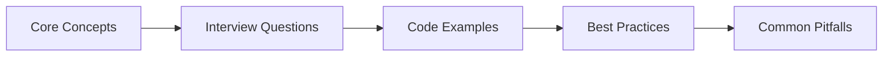

# Chapter 53: JavaScript Interview Q&A

> **Previous:** [CSS Interview Q&A](./52-interview-css.md) | **Next:** [AI/ML Interview Q&A](./54-interview-ai-ml.md)


---

JavaScript is the language of the web browser and an essential skill for any full-stack Laravel developer. This chapter covers core language fundamentals, modern ES6+ syntax, asynchronous patterns, DOM manipulation, network requests, Alpine.js (Laravel's default frontend companion), and JavaScript's role inside a Laravel application.

---

## Chapter at a Glance

| Aspect | Details |
|--------|---------|
| **Scope** | JavaScript interview questions covering fundamentals, ES6+, DOM, async, frameworks, testing |
| **Key Concepts** | Variables & scoping, closures, promises, async/await, DOM manipulation, ES6+ features, modules |
| **Learning Approach** | Q&A format with practical code examples |
| **Skills Required** | JavaScript, ES6+, DOM basics |

## Chapter Roadmap



## Core JavaScript


### Q1: What are the primitive types in JavaScript?

<a href="../../../assets/images/diagrams/laravel/53-interview-javascript/what-are-the-primitive-types-in-javascript-handwritten.svg" target="_blank" rel="noopener">
  
</a>
<a href="../../../assets/images/diagrams/laravel/53-interview-javascript/what-are-the-primitive-types-in-javascript-diagram.svg" target="_blank" rel="noopener">
  
</a>
<a href="../../../assets/images/diagrams/laravel/53-interview-javascript/what-are-the-primitive-types-in-javascript-sticky.svg" target="_blank" rel="noopener">
  
</a>

**Answer:** JavaScript has seven primitive types: `string`, `number`, `boolean`, `null`, `undefined`, `symbol`, and `bigint`. Everything else is an object (including arrays, functions, and dates). Primitives are immutable and compared by value.

```js
typeof "hello";     // "string"
typeof 42;          // "number"
typeof true;        // "boolean"
typeof null;        // "object"  → historical bug
typeof undefined;   // "undefined"
typeof Symbol();    // "symbol"
typeof 42n;         // "bigint"
```

### Q2: Explain type coercion with examples.

<a href="../../../assets/images/diagrams/laravel/53-interview-javascript/explain-type-coercion-with-examples-handwritten.svg" target="_blank" rel="noopener">
  
</a>
<a href="../../../assets/images/diagrams/laravel/53-interview-javascript/explain-type-coercion-with-examples-diagram.svg" target="_blank" rel="noopener">
  
</a>
<a href="../../../assets/images/diagrams/laravel/53-interview-javascript/explain-type-coercion-with-examples-sticky.svg" target="_blank" rel="noopener">
  
</a>

**Answer:** JavaScript coerces types automatically when operators mismatch. The `==` operator coerces before comparing; `===` does not. Common pitfalls include string-number concatenation, falsy values, and loose equality.

```js
"5" - 2;      // 3   (string coerced to number)
"5" + 2;      // "52"  (number coerced to string)
0 == false;   // true
0 === false;  // false
"" == 0;      // true
null == undefined; // true
null === undefined; // false
```

### Q3: What is the difference between `==` and `===`?

<a href="../../../assets/images/diagrams/laravel/53-interview-javascript/what-is-the-difference-between-and-handwritten.svg" target="_blank" rel="noopener">
  
</a>
<a href="../../../assets/images/diagrams/laravel/53-interview-javascript/what-is-the-difference-between-and-diagram.svg" target="_blank" rel="noopener">
  
</a>
<a href="../../../assets/images/diagrams/laravel/53-interview-javascript/what-is-the-difference-between-and-sticky.svg" target="_blank" rel="noopener">
  
</a>

**Answer:** `==` compares values after type coercion. `===` compares both value and type without coercion → it is the strict equality operator. Always prefer `===` to avoid subtle bugs.

```js
1 == "1";   // true  (coerced)
1 === "1";  // false (different types)
false == 0; // true
false === 0; // false
```

### Q4: What is a closure?

<a href="../../../assets/images/diagrams/laravel/53-interview-javascript/what-is-a-closure-handwritten.svg" target="_blank" rel="noopener">
  
</a>
<a href="../../../assets/images/diagrams/laravel/53-interview-javascript/what-is-a-closure-diagram.svg" target="_blank" rel="noopener">
  
</a>
<a href="../../../assets/images/diagrams/laravel/53-interview-javascript/what-is-a-closure-sticky.svg" target="_blank" rel="noopener">
  
</a>

**Answer:** A closure is a function that retains access to its outer (lexical) scope even after the outer function has returned. Closures enable data privacy, factory functions, and callback state.

```js
function counter() {
    let count = 0;
    return function () {
        count++;
        return count;
    };
}
const inc = counter();
inc(); // 1
inc(); // 2
```

### Q5: Explain hoisting with `var`, `let`, and `const`.

<a href="../../../assets/images/diagrams/laravel/53-interview-javascript/explain-hoisting-with-var-let-and-const-handwritten.svg" target="_blank" rel="noopener">
  
</a>
<a href="../../../assets/images/diagrams/laravel/53-interview-javascript/explain-hoisting-with-var-let-and-const-diagram.svg" target="_blank" rel="noopener">
  
</a>
<a href="../../../assets/images/diagrams/laravel/53-interview-javascript/explain-hoisting-with-var-let-and-const-sticky.svg" target="_blank" rel="noopener">
  
</a>

**Answer:** Function declarations and `var` declarations are hoisted to the top of their scope. `var` is initialized as `undefined`. `let` and `const` are hoisted but not initialized → accessing them before declaration throws a `ReferenceError` (temporal dead zone).

```js
console.log(a); // undefined
var a = 1;

console.log(b); // ReferenceError
let b = 2;

foo(); // works → function declaration hoisted
function foo() {}
```

### Q6: How does the `this` keyword work?

<a href="../../../assets/images/diagrams/laravel/53-interview-javascript/how-does-the-this-keyword-work-handwritten.svg" target="_blank" rel="noopener">
  
</a>
<a href="../../../assets/images/diagrams/laravel/53-interview-javascript/how-does-the-this-keyword-work-diagram.svg" target="_blank" rel="noopener">
  
</a>
<a href="../../../assets/images/diagrams/laravel/53-interview-javascript/how-does-the-this-keyword-work-sticky.svg" target="_blank" rel="noopener">
  
</a>

**Answer:** `this` is determined by the call site, not the definition site. In a regular function, `this` refers to the global object (`window` / `globalThis`) or `undefined` in strict mode. Arrow functions inherit `this` from the enclosing lexical scope. Methods use the object they are called on. `new` binds `this` to the new instance.

```js
const obj = {
    name: "Alice",
    regular: function () { return this.name; },
    arrow: () => this.name,
};
obj.regular(); // "Alice"
obj.arrow();   // undefined (window in browser)
```

### Q7: Explain the prototype chain.

<a href="../../../assets/images/diagrams/laravel/53-interview-javascript/explain-the-prototype-chain-handwritten.svg" target="_blank" rel="noopener">
  
</a>
<a href="../../../assets/images/diagrams/laravel/53-interview-javascript/explain-the-prototype-chain-diagram.svg" target="_blank" rel="noopener">
  
</a>
<a href="../../../assets/images/diagrams/laravel/53-interview-javascript/explain-the-prototype-chain-sticky.svg" target="_blank" rel="noopener">
  
</a>

**Answer:** Every JavaScript object has an internal `[[Prototype]]` link to another object. When a property is accessed, the engine walks up the chain until found or `null`. Functions have a `prototype` property used with `new`. `Object.getPrototypeOf()` reads the prototype explicitly.

```js
const parent = { greet: () => "hello" };
const child = Object.create(parent);
child.name = "Bob";
console.log(child.name);  // "Bob" → own
console.log(child.greet); // "hello" → prototype
```

### Q8: How does prototypal inheritance differ from classical inheritance?

<a href="../../../assets/images/diagrams/laravel/53-interview-javascript/how-does-prototypal-inheritance-differ-from-classical-inheritance-handwritten.svg" target="_blank" rel="noopener">
  
</a>
<a href="../../../assets/images/diagrams/laravel/53-interview-javascript/how-does-prototypal-inheritance-differ-from-classical-inheritance-diagram.svg" target="_blank" rel="noopener">
  
</a>
<a href="../../../assets/images/diagrams/laravel/53-interview-javascript/how-does-prototypal-inheritance-differ-from-classical-inheritance-sticky.svg" target="_blank" rel="noopener">
  
</a>

**Answer:** Classical inheritance (Java, C++) uses classes as blueprints with a copy-based model. JavaScript uses prototypal inheritance → objects link to other objects. ES6 `class` is syntactic sugar over the prototype chain; methods live on `.prototype`, not on instances.

```js
class Animal {
    speak() { return "?";
}
class Dog extends Animal {
    speak() { return "Woof"; }
}
const d = new Dog();
console.log(d.speak()); // "Woof"
console.log(Object.getPrototypeOf(d) === Dog.prototype); // true
```

### Q9: What is the spread operator and how is it used?

<a href="../../../assets/images/diagrams/laravel/53-interview-javascript/what-is-the-spread-operator-and-how-is-it-used-handwritten.svg" target="_blank" rel="noopener">
  
</a>
<a href="../../../assets/images/diagrams/laravel/53-interview-javascript/what-is-the-spread-operator-and-how-is-it-used-diagram.svg" target="_blank" rel="noopener">
  
</a>
<a href="../../../assets/images/diagrams/laravel/53-interview-javascript/what-is-the-spread-operator-and-how-is-it-used-sticky.svg" target="_blank" rel="noopener">
  
</a>

**Answer:** `...` spreads iterables into individual elements or copies own enumerable properties. It replaces `.concat()`, `.apply()`, and manual shallow cloning.

```js
const arr = [1, 2, 3];
const copy = [...arr, 4];          // [1, 2, 3, 4]
const obj = { a: 1, b: 2 };
const merged = { ...obj, c: 3 };   // { a:1, b:2, c:3 }
const max = Math.max(...arr);      // 3
```

### Q10: Explain `call`, `apply`, and `bind`.

<a href="../../../assets/images/diagrams/laravel/53-interview-javascript/explain-call-apply-and-bind-handwritten.svg" target="_blank" rel="noopener">
  
</a>
<a href="../../../assets/images/diagrams/laravel/53-interview-javascript/explain-call-apply-and-bind-diagram.svg" target="_blank" rel="noopener">
  
</a>
<a href="../../../assets/images/diagrams/laravel/53-interview-javascript/explain-call-apply-and-bind-sticky.svg" target="_blank" rel="noopener">
  
</a>

**Answer:** `call` invokes a function with a given `this` and arguments listed individually. `apply` does the same with arguments as an array. `bind` returns a new function with a bound `this` (optionally partial arguments) without invoking it.

```js
function greet(greeting) {
    return `${greeting}, ${this.name}`;
}
const user = { name: "Alice" };
greet.call(user, "Hello");     // "Hello, Alice"
greet.apply(user, ["Hi"]);     // "Hi, Alice"
const bound = greet.bind(user, "Hey");
bound();                        // "Hey, Alice"
```

### Q11: What is the difference between `null` and `undefined`?

<a href="../../../assets/images/diagrams/laravel/53-interview-javascript/what-is-the-difference-between-null-and-undefined-handwritten.svg" target="_blank" rel="noopener">
  
</a>
<a href="../../../assets/images/diagrams/laravel/53-interview-javascript/what-is-the-difference-between-null-and-undefined-diagram.svg" target="_blank" rel="noopener">
  
</a>
<a href="../../../assets/images/diagrams/laravel/53-interview-javascript/what-is-the-difference-between-null-and-undefined-sticky.svg" target="_blank" rel="noopener">
  
</a>

**Answer:** `undefined` means a variable has been declared but not assigned a value. `null` is an intentional absence of an object value → it must be explicitly assigned. `undefined` is a type; `null` is an object (typeof bug).

```js
let a;           // undefined
const b = null;  // null
typeof undefined; // "undefined"
typeof null;      // "object"
```

### Q12: Explain immediately invoked function expressions (IIFE).

<a href="../../../assets/images/diagrams/laravel/53-interview-javascript/explain-immediately-invoked-function-expressions-iife-handwritten.svg" target="_blank" rel="noopener">
  
</a>
<a href="../../../assets/images/diagrams/laravel/53-interview-javascript/explain-immediately-invoked-function-expressions-iife-diagram.svg" target="_blank" rel="noopener">
  
</a>
<a href="../../../assets/images/diagrams/laravel/53-interview-javascript/explain-immediately-invoked-function-expressions-iife-sticky.svg" target="_blank" rel="noopener">
  
</a>

**Answer:** An IIFE is a function expression invoked immediately after definition. It creates a private scope, historically used to avoid polluting the global namespace before modules existed.

```js
(function () {
    const secret = "hidden";
    console.log(secret);
})();

const result = ((a, b) => a + b)(3, 4);
console.log(result); // 7
```

### Q13: How do `new` and constructor functions work?

<a href="../../../assets/images/diagrams/laravel/53-interview-javascript/how-do-new-and-constructor-functions-work-handwritten.svg" target="_blank" rel="noopener">
  
</a>
<a href="../../../assets/images/diagrams/laravel/53-interview-javascript/how-do-new-and-constructor-functions-work-diagram.svg" target="_blank" rel="noopener">
  
</a>
<a href="../../../assets/images/diagrams/laravel/53-interview-javascript/how-do-new-and-constructor-functions-work-sticky.svg" target="_blank" rel="noopener">
  
</a>

**Answer:** `new` creates a new object, sets its prototype to the constructor's `.prototype`, binds `this` to the new object, executes the constructor, and returns the object (unless the constructor returns a non-primitive).

```js
function Person(name) {
    this.name = name;
}
Person.prototype.say = function () {
    return `I am ${this.name}`;
};
const p = new Person("Alice");
p.say(); // "I am Alice"
```

### Q14: What is the event loop?

<a href="../../../assets/images/diagrams/laravel/53-interview-javascript/what-is-the-event-loop-handwritten.svg" target="_blank" rel="noopener">
  
</a>
<a href="../../../assets/images/diagrams/laravel/53-interview-javascript/what-is-the-event-loop-diagram.svg" target="_blank" rel="noopener">
  
</a>
<a href="../../../assets/images/diagrams/laravel/53-interview-javascript/what-is-the-event-loop-sticky.svg" target="_blank" rel="noopener">
  
</a>

**Answer:** The event loop is JavaScript's concurrency model. It continuously checks the call stack and task queues. Synchronous code runs on the call stack. Macrotasks (setTimeout, I/O) and microtasks (Promise.then, queueMicrotask) are queued and processed in phases → all microtasks are drained before the next macrotask.

```js
console.log(1);
setTimeout(() => console.log(2), 0);
Promise.resolve().then(() => console.log(3));
console.log(4);
// Output: 1, 4, 3, 2
```

### Q15: Explain the difference between deep and shallow copying.

<a href="../../../assets/images/diagrams/laravel/53-interview-javascript/explain-the-difference-between-deep-and-shallow-copying-handwritten.svg" target="_blank" rel="noopener">
  
</a>
<a href="../../../assets/images/diagrams/laravel/53-interview-javascript/explain-the-difference-between-deep-and-shallow-copying-diagram.svg" target="_blank" rel="noopener">
  
</a>
<a href="../../../assets/images/diagrams/laravel/53-interview-javascript/explain-the-difference-between-deep-and-shallow-copying-sticky.svg" target="_blank" rel="noopener">
  
</a>

**Answer:** A shallow copy duplicates only the top-level properties; nested objects are shared by reference. A deep copy recursively duplicates every level, producing fully independent objects.

```js
const original = { a: 1, b: { c: 2 } };
const shallow = { ...original };
shallow.b.c = 99;
console.log(original.b.c); // 99 → shared

const deep = JSON.parse(JSON.stringify(original));
// Or: structuredClone(original)
deep.b.c = 42;
console.log(original.b.c); // 99 → independent
```

### Q16: What are getters and setters?

<a href="../../../assets/images/diagrams/laravel/53-interview-javascript/what-are-getters-and-setters-handwritten.svg" target="_blank" rel="noopener">
  
</a>
<a href="../../../assets/images/diagrams/laravel/53-interview-javascript/what-are-getters-and-setters-diagram.svg" target="_blank" rel="noopener">
  
</a>
<a href="../../../assets/images/diagrams/laravel/53-interview-javascript/what-are-getters-and-setters-sticky.svg" target="_blank" rel="noopener">
  
</a>

**Answer:** Getters and setters are accessor properties that execute functions when a property is read or assigned. They can be defined on objects via `get`/`set` or on classes.

```js
const user = {
    firstName: "Alice",
    lastName: "Smith",
    get fullName() {
        return `${this.firstName} ${this.lastName}`;
    },
    set fullName(val) {
        [this.firstName, this.lastName] = val.split(" ");
    },
};
user.fullName = "Bob Jones";
console.log(user.firstName); // "Bob"
```

### Q17: Explain the `Symbol` type and its use cases.

<a href="../../../assets/images/diagrams/laravel/53-interview-javascript/explain-the-symbol-type-and-its-use-cases-handwritten.svg" target="_blank" rel="noopener">
  
</a>
<a href="../../../assets/images/diagrams/laravel/53-interview-javascript/explain-the-symbol-type-and-its-use-cases-diagram.svg" target="_blank" rel="noopener">
  
</a>
<a href="../../../assets/images/diagrams/laravel/53-interview-javascript/explain-the-symbol-type-and-its-use-cases-sticky.svg" target="_blank" rel="noopener">
  
</a>

**Answer:** `Symbol` is a unique, immutable primitive used as object property keys to avoid name collisions. Symbols are not enumerated in `for...in` or `Object.keys()`. The global symbol registry (`Symbol.for()`) enables shared symbols across realms.

```js
const id = Symbol("id");
const user = { name: "Alice", [id]: 123 };
console.log(user[id]);        // 123
console.log(Object.keys(user)); // ["name"]

const shared = Symbol.for("app.key");
const same = Symbol.for("app.key");
console.log(shared === same); // true
```

### Q18: How does garbage collection work?

<a href="../../../assets/images/diagrams/laravel/53-interview-javascript/how-does-garbage-collection-work-handwritten.svg" target="_blank" rel="noopener">
  
</a>
<a href="../../../assets/images/diagrams/laravel/53-interview-javascript/how-does-garbage-collection-work-diagram.svg" target="_blank" rel="noopener">
  
</a>
<a href="../../../assets/images/diagrams/laravel/53-interview-javascript/how-does-garbage-collection-work-sticky.svg" target="_blank" rel="noopener">
  
</a>

**Answer:** JavaScript engines use mark-and-sweep garbage collection. The GC roots traverse the object graph, marking reachable objects. Unreachable objects (no references from any root or other reachable object) are swept → their memory reclaimed. Weak references (`WeakMap`, `WeakSet`) do not prevent collection.

```js
const wm = new WeakMap();
let obj = { data: "large" };
wm.set(obj, "metadata");
obj = null; // obj is collected; WeakMap entry removed automatically
```

### Q19: What are tagged template literals?

<a href="../../../assets/images/diagrams/laravel/53-interview-javascript/what-are-tagged-template-literals-handwritten.svg" target="_blank" rel="noopener">
  
</a>
<a href="../../../assets/images/diagrams/laravel/53-interview-javascript/what-are-tagged-template-literals-diagram.svg" target="_blank" rel="noopener">
  
</a>
<a href="../../../assets/images/diagrams/laravel/53-interview-javascript/what-are-tagged-template-literals-sticky.svg" target="_blank" rel="noopener">
  
</a>

**Answer:** Tagged templates allow a function to process a template literal's string parts and interpolated values. The first argument is an array of string segments; remaining arguments are the interpolated expressions.

```js
function highlight(strings, ...values) {
    return strings.reduce((acc, str, i) =>
        `${acc}${str}<strong>${values[i] || ""}</strong>`, ""
    );
}
const name = "Alice";
const result = highlight`Hello ${name}, welcome!`;
// "Hello <strong>Alice</strong>, welcome!"
```

### Q20: Explain the ternary and nullish coalescing operators.

<a href="../../../assets/images/diagrams/laravel/53-interview-javascript/explain-the-ternary-and-nullish-coalescing-operators-handwritten.svg" target="_blank" rel="noopener">
  
</a>
<a href="../../../assets/images/diagrams/laravel/53-interview-javascript/explain-the-ternary-and-nullish-coalescing-operators-diagram.svg" target="_blank" rel="noopener">
  
</a>
<a href="../../../assets/images/diagrams/laravel/53-interview-javascript/explain-the-ternary-and-nullish-coalescing-operators-sticky.svg" target="_blank" rel="noopener">
  
</a>

**Answer:** The ternary (`condition ? a : b`) returns one of two values based on a boolean. The nullish coalescing operator (`??`) returns the right-hand side only when the left is `null` or `undefined`, unlike `||` which treats all falsy values (`0`, `""`, `false`) as absent.

```js
const age = 0;
console.log(age || 18);   // 18 (0 is falsy)
console.log(age ?? 18);   // 0  (0 is not nullish)

const name = null;
console.log(name ?? "Guest"); // "Guest"
```

---

## ES6+ Features

### Q21: How do arrow functions differ from regular functions?

<a href="../../../assets/images/diagrams/laravel/53-interview-javascript/how-do-arrow-functions-differ-from-regular-functions-handwritten.svg" target="_blank" rel="noopener">
  
</a>
<a href="../../../assets/images/diagrams/laravel/53-interview-javascript/how-do-arrow-functions-differ-from-regular-functions-diagram.svg" target="_blank" rel="noopener">
  
</a>
<a href="../../../assets/images/diagrams/laravel/53-interview-javascript/how-do-arrow-functions-differ-from-regular-functions-sticky.svg" target="_blank" rel="noopener">
  
</a>

**Answer:** Arrow functions have no own `this`, `arguments`, `super`, or `new.target`. They inherit `this` from the enclosing scope (lexical binding). They cannot be used as constructors and lack the `prototype` property. They are ideal for callbacks and short expressions.

```js
function Regular() {
    this.name = "Alice";
    setTimeout(function () {
        console.log(this.name); // undefined (window)
    }, 100);
}
function Arrow() {
    this.name = "Bob";
    setTimeout(() => {
        console.log(this.name); // "Bob"
    }, 100);
}
```

### Q22: Explain destructuring assignment.

<a href="../../../assets/images/diagrams/laravel/53-interview-javascript/explain-destructuring-assignment-handwritten.svg" target="_blank" rel="noopener">
  
</a>
<a href="../../../assets/images/diagrams/laravel/53-interview-javascript/explain-destructuring-assignment-diagram.svg" target="_blank" rel="noopener">
  
</a>
<a href="../../../assets/images/diagrams/laravel/53-interview-javascript/explain-destructuring-assignment-sticky.svg" target="_blank" rel="noopener">
  
</a>

**Answer:** Destructuring unpacks values from arrays or properties from objects into variables. It supports defaults, nested patterns, and rest syntax. It is commonly used for function parameters and imports.

```js
const user = { id: 1, name: "Alice", roles: ["admin"] };
const { id, name, ...rest } = user;
console.log(id);   // 1
console.log(rest); // { roles: ["admin"] }

const [first, , third] = [10, 20, 30];
console.log(first, third); // 10, 30

function show({ name = "Guest", age = 0 } = {}) {
    console.log(`${name} is ${age}`);
}
show({ name: "Alice", age: 30 });
```

### Q23: What are template literals?

<a href="../../../assets/images/diagrams/laravel/53-interview-javascript/what-are-template-literals-handwritten.svg" target="_blank" rel="noopener">
  
</a>
<a href="../../../assets/images/diagrams/laravel/53-interview-javascript/what-are-template-literals-diagram.svg" target="_blank" rel="noopener">
  
</a>
<a href="../../../assets/images/diagrams/laravel/53-interview-javascript/what-are-template-literals-sticky.svg" target="_blank" rel="noopener">
  
</a>

**Answer:** Template literals use backticks and support multi-line strings, expression interpolation (`${}`), and tagged templates. They replace string concatenation with readable inline expressions.

```js
const name = "Alice";
const role = "admin";
const msg = `User ${name} has role ${role.toUpperCase()}`;
// "User Alice has role ADMIN"

const html = `
<div>
    <h2>${name}</h2>
</div>`;
```

### Q24: Explain `let` and `const` vs `var`.

<a href="../../../assets/images/diagrams/laravel/53-interview-javascript/explain-let-and-const-vs-var-handwritten.svg" target="_blank" rel="noopener">
  
</a>
<a href="../../../assets/images/diagrams/laravel/53-interview-javascript/explain-let-and-const-vs-var-diagram.svg" target="_blank" rel="noopener">
  
</a>
<a href="../../../assets/images/diagrams/laravel/53-interview-javascript/explain-let-and-const-vs-var-sticky.svg" target="_blank" rel="noopener">
  
</a>

**Answer:** `let` and `const` are block-scoped; `var` is function-scoped. `let` and `const` are not hoisted to usable values (temporal dead zone). `const` prevents reassignment (but not mutation). `var` declares on the global object; `let`/`const` do not.

```js
{
    var a = 1;
    let b = 2;
}
console.log(a); // 1
console.log(b); // ReferenceError

const obj = { key: "value" };
obj.key = "changed"; // allowed
// obj = {};         // TypeError
```

### Q25: How do ES6 modules work?

<a href="../../../assets/images/diagrams/laravel/53-interview-javascript/how-do-es6-modules-work-handwritten.svg" target="_blank" rel="noopener">
  
</a>
<a href="../../../assets/images/diagrams/laravel/53-interview-javascript/how-do-es6-modules-work-diagram.svg" target="_blank" rel="noopener">
  
</a>
<a href="../../../assets/images/diagrams/laravel/53-interview-javascript/how-do-es6-modules-work-sticky.svg" target="_blank" rel="noopener">
  
</a>

**Answer:** ES6 modules use `export` and `import` to share code across files. They are strict by default, support named and default exports, and enable static analysis (tree-shaking). Browsers load modules with `<script type="module">`.

```js
// math.js
export const sum = (a, b) => a + b;
export default function multiply(a, b) {
    return a * b;
}
// app.js
import multiply, { sum } from "./math.js";
console.log(sum(1, 2));      // 3
console.log(multiply(2, 3)); // 6
```

### Q26: What is the rest parameter?

<a href="../../../assets/images/diagrams/laravel/53-interview-javascript/what-is-the-rest-parameter-handwritten.svg" target="_blank" rel="noopener">
  
</a>
<a href="../../../assets/images/diagrams/laravel/53-interview-javascript/what-is-the-rest-parameter-diagram.svg" target="_blank" rel="noopener">
  
</a>
<a href="../../../assets/images/diagrams/laravel/53-interview-javascript/what-is-the-rest-parameter-sticky.svg" target="_blank" rel="noopener">
  
</a>

**Answer:** The rest parameter (`...args`) collects remaining arguments into an array. It replaces the old `arguments` object and works with arrow functions. It must be the last parameter.

```js
function logAll(first, ...rest) {
    console.log(first, rest);
}
logAll("a", "b", "c"); // "a" ["b", "c"]

const sum = (...nums) => nums.reduce((a, b) => a + b, 0);
sum(1, 2, 3); // 6
```

### Q27: Explain `Map` and `Set`.

<a href="../../../assets/images/diagrams/laravel/53-interview-javascript/explain-map-and-set-handwritten.svg" target="_blank" rel="noopener">
  
</a>
<a href="../../../assets/images/diagrams/laravel/53-interview-javascript/explain-map-and-set-diagram.svg" target="_blank" rel="noopener">
  
</a>
<a href="../../../assets/images/diagrams/laravel/53-interview-javascript/explain-map-and-set-sticky.svg" target="_blank" rel="noopener">
  
</a>

**Answer:** `Map` stores key-value pairs where keys can be any type (including objects). `Set` stores unique values of any type. Both maintain insertion order and offer O(1) average lookup. They iterate with `forEach` or `for...of`.

```js
const map = new Map();
map.set("key", "value");
map.set(document, "DOM element");

const set = new Set([1, 2, 2, 3]);
console.log(set.size); // 3
set.has(2); // true

for (const [k, v] of map) console.log(k, v);
```

### Q28: What are default function parameters?

<a href="../../../assets/images/diagrams/laravel/53-interview-javascript/what-are-default-function-parameters-handwritten.svg" target="_blank" rel="noopener">
  
</a>
<a href="../../../assets/images/diagrams/laravel/53-interview-javascript/what-are-default-function-parameters-diagram.svg" target="_blank" rel="noopener">
  
</a>
<a href="../../../assets/images/diagrams/laravel/53-interview-javascript/what-are-default-function-parameters-sticky.svg" target="_blank" rel="noopener">
  
</a>

**Answer:** Default parameters are evaluated at call time when the argument is `undefined`. They can reference previous parameters. They do not apply when `null` is passed.

```js
function greet(name = "Guest", prefix = "Hello") {
    return `${prefix}, ${name}`;
}
greet();            // "Hello, Guest"
greet("Alice");     // "Hello, Alice"
greet("Bob", "Hi"); // "Hi, Bob"
greet(null);        // "Hello, null" → null is not undefined
```

### Q29: Explain `Object.entries`, `Object.values`, `Object.keys`.

<a href="../../../assets/images/diagrams/laravel/53-interview-javascript/explain-object-entries-object-values-object-keys-handwritten.svg" target="_blank" rel="noopener">
  
</a>
<a href="../../../assets/images/diagrams/laravel/53-interview-javascript/explain-object-entries-object-values-object-keys-diagram.svg" target="_blank" rel="noopener">
  
</a>
<a href="../../../assets/images/diagrams/laravel/53-interview-javascript/explain-object-entries-object-values-object-keys-sticky.svg" target="_blank" rel="noopener">
  
</a>

**Answer:** These static methods return arrays of an object's own enumerable properties. `keys()` returns property names, `values()` returns values, and `entries()` returns `[key, value]` pairs. They are commonly used for iteration and transformation.

```js
const obj = { a: 1, b: 2 };
Object.keys(obj);    // ["a", "b"]
Object.values(obj);  // [1, 2]
Object.entries(obj); // [["a", 1], ["b", 2]]

for (const [k, v] of Object.entries(obj)) {
    console.log(k, v);
}
```

### Q30: What is optional chaining?

<a href="../../../assets/images/diagrams/laravel/53-interview-javascript/what-is-optional-chaining-handwritten.svg" target="_blank" rel="noopener">
  
</a>
<a href="../../../assets/images/diagrams/laravel/53-interview-javascript/what-is-optional-chaining-diagram.svg" target="_blank" rel="noopener">
  
</a>
<a href="../../../assets/images/diagrams/laravel/53-interview-javascript/what-is-optional-chaining-sticky.svg" target="_blank" rel="noopener">
  
</a>

**Answer:** Optional chaining (`?.`) short-circuits to `undefined` if the value before `?.` is `null` or `undefined`, preventing `TypeError` when accessing nested properties. It works on property access, method calls, and dynamic keys.

```js
const user = { profile: null };
console.log(user?.profile?.name); // undefined
console.log(user?.address?.city); // undefined
const fn = user?.method?.();
console.log(fn); // undefined
```

### Q31: Explain `Array.prototype.reduce`.

<a href="../../../assets/images/diagrams/laravel/53-interview-javascript/explain-array-prototype-reduce-handwritten.svg" target="_blank" rel="noopener">
  
</a>
<a href="../../../assets/images/diagrams/laravel/53-interview-javascript/explain-array-prototype-reduce-diagram.svg" target="_blank" rel="noopener">
  
</a>
<a href="../../../assets/images/diagrams/laravel/53-interview-javascript/explain-array-prototype-reduce-sticky.svg" target="_blank" rel="noopener">
  
</a>

**Answer:** `reduce` executes a reducer function on each element, accumulating a single result. It takes a callback (accumulator, current, index, array) and an optional initial value. Without initial value, the first element is used as the accumulator.

```js
const nums = [1, 2, 3, 4];
const sum = nums.reduce((acc, n) => acc + n, 0); // 10

const grouped = ["a", "b", "a"].reduce((acc, letter) => {
    acc[letter] = (acc[letter] || 0) + 1;
    return acc;
}, {});
// { a: 2, b: 1 }
```

### Q32: What are `Array.from` and `Array.of`?

<a href="../../../assets/images/diagrams/laravel/53-interview-javascript/what-are-array-from-and-array-of-handwritten.svg" target="_blank" rel="noopener">
  
</a>
<a href="../../../assets/images/diagrams/laravel/53-interview-javascript/what-are-array-from-and-array-of-diagram.svg" target="_blank" rel="noopener">
  
</a>
<a href="../../../assets/images/diagrams/laravel/53-interview-javascript/what-are-array-from-and-array-of-sticky.svg" target="_blank" rel="noopener">
  
</a>

**Answer:** `Array.from` creates a new array from an iterable or array-like object, with an optional map function. `Array.of` creates an array from its arguments, unlike `Array()` which behaves differently with a single numeric argument (sets length vs. creates `[n]`).

```js
Array.from("abc");        // ["a", "b", "c"]
Array.from([1, 2, 3], x => x * 2); // [2, 4, 6]
Array.from({ length: 3 }, (_, i) => i); // [0, 1, 2]

Array.of(5);   // [5]
Array(5);      // [empty × 5]
```

### Q33: Explain `for...of` vs `for...in`.

<a href="../../../assets/images/diagrams/laravel/53-interview-javascript/explain-for-of-vs-for-in-handwritten.svg" target="_blank" rel="noopener">
  
</a>
<a href="../../../assets/images/diagrams/laravel/53-interview-javascript/explain-for-of-vs-for-in-diagram.svg" target="_blank" rel="noopener">
  
</a>
<a href="../../../assets/images/diagrams/laravel/53-interview-javascript/explain-for-of-vs-for-in-sticky.svg" target="_blank" rel="noopener">
  
</a>

**Answer:** `for...of` iterates over iterable values (arrays, strings, maps, sets). `for...in` iterates over enumerable property keys (including inherited ones). For arrays, `for...in` yields indices as strings; `for...of` yields values. Prefer `for...of` for arrays.

```js
const arr = ["a", "b"];
for (const key in arr) console.log(key);    // "0", "1"
for (const val of arr) console.log(val);    // "a", "b"

const obj = { x: 1, y: 2 };
for (const key in obj) console.log(key);   // "x", "y"
// TypeError: obj is not iterable (for...of on plain object)
```

### Q34: What is `Promise.allSettled`?

<a href="../../../assets/images/diagrams/laravel/53-interview-javascript/what-is-promise-allsettled-handwritten.svg" target="_blank" rel="noopener">
  
</a>
<a href="../../../assets/images/diagrams/laravel/53-interview-javascript/what-is-promise-allsettled-diagram.svg" target="_blank" rel="noopener">
  
</a>
<a href="../../../assets/images/diagrams/laravel/53-interview-javascript/what-is-promise-allsettled-sticky.svg" target="_blank" rel="noopener">
  
</a>

**Answer:** `Promise.allSettled` waits for all promises to settle (resolve or reject) and returns an array of result objects `{ status, value/reason }`. Unlike `Promise.all`, it never short-circuits on rejection. Use it when you need all outcomes regardless of failure.

```js
const results = await Promise.allSettled([
    fetch("/api/a"),
    fetch("/api/b"),
    Promise.reject("fail"),
]);
results.forEach(r => {
    if (r.status === "fulfilled") console.log(r.value);
    else console.error(r.reason);
});
```

### Q35: Explain the `globalThis` property.

<a href="../../../assets/images/diagrams/laravel/53-interview-javascript/explain-the-globalthis-property-handwritten.svg" target="_blank" rel="noopener">
  
</a>
<a href="../../../assets/images/diagrams/laravel/53-interview-javascript/explain-the-globalthis-property-diagram.svg" target="_blank" rel="noopener">
  
</a>
<a href="../../../assets/images/diagrams/laravel/53-interview-javascript/explain-the-globalthis-property-sticky.svg" target="_blank" rel="noopener">
  
</a>

**Answer:** `globalThis` provides a standard way to access the global object across environments → `window` in browsers, `global` in Node.js, `self` in Web Workers. It eliminates environment-specific branching.

```js
console.log(globalThis === window); // browser: true
globalThis.setTimeout(() => {}, 100);
// Works everywhere
```

---

## Asynchronous JavaScript

### Q36: What is a Promise?

<a href="../../../assets/images/diagrams/laravel/53-interview-javascript/what-is-a-promise-handwritten.svg" target="_blank" rel="noopener">
  
</a>
<a href="../../../assets/images/diagrams/laravel/53-interview-javascript/what-is-a-promise-diagram.svg" target="_blank" rel="noopener">
  
</a>
<a href="../../../assets/images/diagrams/laravel/53-interview-javascript/what-is-a-promise-sticky.svg" target="_blank" rel="noopener">
  
</a>

**Answer:** A Promise represents the eventual completion or failure of an asynchronous operation. It has three states: `pending`, `fulfilled`, or `rejected`. Promises enable chaining with `.then()` and `.catch()` and compose with `Promise.all`, `Promise.race`, etc.

```js
const fetchData = new Promise((resolve, reject) => {
    setTimeout(() => resolve("data"), 1000);
});
fetchData
    .then(data => console.log(data))
    .catch(err => console.error(err));
```

### Q37: Explain `async` and `await`.

<a href="../../../assets/images/diagrams/laravel/53-interview-javascript/explain-async-and-await-handwritten.svg" target="_blank" rel="noopener">
  
</a>
<a href="../../../assets/images/diagrams/laravel/53-interview-javascript/explain-async-and-await-diagram.svg" target="_blank" rel="noopener">
  
</a>
<a href="../../../assets/images/diagrams/laravel/53-interview-javascript/explain-async-and-await-sticky.svg" target="_blank" rel="noopener">
  
</a>

**Answer:** `async` declares a function that returns a Promise. `await` pauses execution until the Promise settles, making asynchronous code read like synchronous code. Error handling uses standard `try/catch`.

```js
async function getUser(id) {
    try {
        const response = await fetch(`/api/users/${id}`);
        if (!response.ok) throw new Error("Not found");
        return await response.json();
    } catch (error) {
        console.error("Fetch failed:", error);
    }
}
```

### Q38: What is callback hell and how does it relate to Promises?

<a href="../../../assets/images/diagrams/laravel/53-interview-javascript/what-is-callback-hell-and-how-does-it-relate-to-promises-handwritten.svg" target="_blank" rel="noopener">
  
</a>
<a href="../../../assets/images/diagrams/laravel/53-interview-javascript/what-is-callback-hell-and-how-does-it-relate-to-promises-diagram.svg" target="_blank" rel="noopener">
  
</a>
<a href="../../../assets/images/diagrams/laravel/53-interview-javascript/what-is-callback-hell-and-how-does-it-relate-to-promises-sticky.svg" target="_blank" rel="noopener">
  
</a>

**Answer:** Callback hell (pyramid of doom) is the deeply nested structure that results from chaining callbacks. Promises flatten this with `.then()` chaining, and `async/await` eliminates nesting entirely.

```js
// Callback hell
getUser(1, (err, user) => {
    getPosts(user.id, (err, posts) => {
        getComments(posts[0].id, (err, comments) => {});
    });
});

// With async/await
async function load() {
    const user = await getUser(1);
    const posts = await getPosts(user.id);
    const comments = await getComments(posts[0].id);
}
```

### Q39: How do you handle errors in async/await?

<a href="../../../assets/images/diagrams/laravel/53-interview-javascript/how-do-you-handle-errors-in-async-await-handwritten.svg" target="_blank" rel="noopener">
  
</a>
<a href="../../../assets/images/diagrams/laravel/53-interview-javascript/how-do-you-handle-errors-in-async-await-diagram.svg" target="_blank" rel="noopener">
  
</a>
<a href="../../../assets/images/diagrams/laravel/53-interview-javascript/how-do-you-handle-errors-in-async-await-sticky.svg" target="_blank" rel="noopener">
  
</a>

**Answer:** Use `try/catch` blocks. For multiple independent async calls, handle each individually. `catch` on the promise chain also works. At the top level, unhandled promise rejections can be caught globally with `window.onunhandledrejection`.

```js
async function safeFetch(url) {
    try {
        const res = await fetch(url);
        if (!res.ok) throw new Error(`HTTP ${res.status}`);
        return await res.json();
    } catch (error) {
        console.warn(`Failed to fetch ${url}:`, error.message);
        return null;
    }
}
```

### Q40: Explain the microtask queue.

<a href="../../../assets/images/diagrams/laravel/53-interview-javascript/explain-the-microtask-queue-handwritten.svg" target="_blank" rel="noopener">
  
</a>
<a href="../../../assets/images/diagrams/laravel/53-interview-javascript/explain-the-microtask-queue-diagram.svg" target="_blank" rel="noopener">
  
</a>
<a href="../../../assets/images/diagrams/laravel/53-interview-javascript/explain-the-microtask-queue-sticky.svg" target="_blank" rel="noopener">
  
</a>

**Answer:** Microtasks (Promise callbacks, `queueMicrotask`, MutationObserver) execute after the current task and before the next macrotask. The event loop drains the entire microtask queue before processing the next macrotask or rendering.

```js
setTimeout(() => console.log("timeout"), 0);
Promise.resolve().then(() => console.log("microtask 1"));
Promise.resolve().then(() => console.log("microtask 2"));
// "microtask 1", "microtask 2", "timeout"
```

### Q41: What is `Promise.all`?

<a href="../../../assets/images/diagrams/laravel/53-interview-javascript/what-is-promise-all-handwritten.svg" target="_blank" rel="noopener">
  
</a>
<a href="../../../assets/images/diagrams/laravel/53-interview-javascript/what-is-promise-all-diagram.svg" target="_blank" rel="noopener">
  
</a>
<a href="../../../assets/images/diagrams/laravel/53-interview-javascript/what-is-promise-all-sticky.svg" target="_blank" rel="noopener">
  
</a>

**Answer:** `Promise.all` takes an iterable of promises and returns a single promise that fulfills when all input promises fulfill, or rejects immediately if any promise rejects. The result is an array of fulfilled values in the same order.

```js
const [users, posts] = await Promise.all([
    fetch("/api/users").then(r => r.json()),
    fetch("/api/posts").then(r => r.json()),
]);
```

### Q42: What is `Promise.race`?

<a href="../../../assets/images/diagrams/laravel/53-interview-javascript/what-is-promise-race-handwritten.svg" target="_blank" rel="noopener">
  
</a>
<a href="../../../assets/images/diagrams/laravel/53-interview-javascript/what-is-promise-race-diagram.svg" target="_blank" rel="noopener">
  
</a>
<a href="../../../assets/images/diagrams/laravel/53-interview-javascript/what-is-promise-race-sticky.svg" target="_blank" rel="noopener">
  
</a>

**Answer:** `Promise.race` settles with the result of the first settled promise (fulfilled or rejected). Use it for timeouts, cancellation signals, or racing multiple sources.

```js
const timeout = new Promise((_, reject) =>
    setTimeout(() => reject(new Error("timeout")), 5000)
);
const data = fetch("/api/data").then(r => r.json());
try {
    const result = await Promise.race([data, timeout]);
} catch (e) {
    console.log("Request timed out");
}
```

### Q43: Explain `Promise.any` and `Promise.allSettled`.

<a href="../../../assets/images/diagrams/laravel/53-interview-javascript/explain-promise-any-and-promise-allsettled-handwritten.svg" target="_blank" rel="noopener">
  
</a>
<a href="../../../assets/images/diagrams/laravel/53-interview-javascript/explain-promise-any-and-promise-allsettled-diagram.svg" target="_blank" rel="noopener">
  
</a>
<a href="../../../assets/images/diagrams/laravel/53-interview-javascript/explain-promise-any-and-promise-allsettled-sticky.svg" target="_blank" rel="noopener">
  
</a>

**Answer:** `Promise.any` fulfills with the first fulfilled promise; it rejects with an `AggregateError` only if all reject. `Promise.allSettled` never short-circuits → it waits for every promise to settle and returns results with status.

```js
const p1 = Promise.reject("err");
const p2 = Promise.resolve("ok");
await Promise.any([p1, p2]); // "ok"

await Promise.allSettled([p1, p2]);
// [{ status: "rejected", reason: "err" }, { status: "fulfilled", value: "ok" }]
```

### Q44: How do you create a delay or sleep function?

<a href="../../../assets/images/diagrams/laravel/53-interview-javascript/how-do-you-create-a-delay-or-sleep-function-handwritten.svg" target="_blank" rel="noopener">
  
</a>
<a href="../../../assets/images/diagrams/laravel/53-interview-javascript/how-do-you-create-a-delay-or-sleep-function-diagram.svg" target="_blank" rel="noopener">
  
</a>
<a href="../../../assets/images/diagrams/laravel/53-interview-javascript/how-do-you-create-a-delay-or-sleep-function-sticky.svg" target="_blank" rel="noopener">
  
</a>

**Answer:** Wrapping `setTimeout` in a Promise creates an awaitable delay. This avoids callback nesting and integrates cleanly with async/await.

```js
const sleep = ms => new Promise(resolve => setTimeout(resolve, ms));

async function demo() {
    console.log("Start");
    await sleep(1000);
    console.log("One second later");
}
```

### Q45: What is the difference between concurrency and parallelism?

<a href="../../../assets/images/diagrams/laravel/53-interview-javascript/what-is-the-difference-between-concurrency-and-parallelism-handwritten.svg" target="_blank" rel="noopener">
  
</a>
<a href="../../../assets/images/diagrams/laravel/53-interview-javascript/what-is-the-difference-between-concurrency-and-parallelism-diagram.svg" target="_blank" rel="noopener">
  
</a>
<a href="../../../assets/images/diagrams/laravel/53-interview-javascript/what-is-the-difference-between-concurrency-and-parallelism-sticky.svg" target="_blank" rel="noopener">
  
</a>

**Answer:** Concurrency is the composition of independently executing tasks (interleaving on a single thread via the event loop). Parallelism is simultaneous execution on multiple cores. JavaScript is single-threaded but achieves concurrency through the event loop, Web Workers enable parallelism.

```js
// Concurrent (single thread, interleaved)
setTimeout(() => console.log("a"), 0);
setTimeout(() => console.log("b"), 0);

// Parallel (Web Worker → separate thread)
const worker = new Worker("worker.js");
worker.postMessage("heavy computation");
```

### Q46: How do Web Workers work?

<a href="../../../assets/images/diagrams/laravel/53-interview-javascript/how-do-web-workers-work-handwritten.svg" target="_blank" rel="noopener">
  
</a>
<a href="../../../assets/images/diagrams/laravel/53-interview-javascript/how-do-web-workers-work-diagram.svg" target="_blank" rel="noopener">
  
</a>
<a href="../../../assets/images/diagrams/laravel/53-interview-javascript/how-do-web-workers-work-sticky.svg" target="_blank" rel="noopener">
  
</a>

**Answer:** Web Workers run JavaScript in a separate thread with their own event loop. They communicate with the main thread via `postMessage` and the `message` event. Workers cannot access the DOM, `window`, or `document`.

```js
// main.js
const worker = new Worker("worker.js");
worker.postMessage({ n: 1000000 });
worker.onmessage = e => console.log("Result:", e.data);

// worker.js
self.onmessage = e => {
    const result = heavyComputation(e.data.n);
    self.postMessage(result);
};
```

### Q47: What is the task queue and how does it relate to the event loop?

<a href="../../../assets/images/diagrams/laravel/53-interview-javascript/what-is-the-task-queue-and-how-does-it-relate-to-the-event-loop-handwritten.svg" target="_blank" rel="noopener">
  
</a>
<a href="../../../assets/images/diagrams/laravel/53-interview-javascript/what-is-the-task-queue-and-how-does-it-relate-to-the-event-loop-diagram.svg" target="_blank" rel="noopener">
  
</a>
<a href="../../../assets/images/diagrams/laravel/53-interview-javascript/what-is-the-task-queue-and-how-does-it-relate-to-the-event-loop-sticky.svg" target="_blank" rel="noopener">
  
</a>

**Answer:** The task queue (macrotask queue) holds callbacks from `setTimeout`, `setInterval`, `I/O`, and UI events. The event loop picks one macrotask per iteration, executes it, then drains all microtasks before the next macrotask or render cycle.

```js
// Execution order: synchronous → microtasks → macrotask
console.log("sync");
setTimeout(() => console.log("macrotask"), 0);
Promise.resolve().then(() => console.log("microtask"));
// "sync", "microtask", "macrotask"
```

### Q48: Explain `AbortController` with Promises.

<a href="../../../assets/images/diagrams/laravel/53-interview-javascript/explain-abortcontroller-with-promises-handwritten.svg" target="_blank" rel="noopener">
  
</a>
<a href="../../../assets/images/diagrams/laravel/53-interview-javascript/explain-abortcontroller-with-promises-diagram.svg" target="_blank" rel="noopener">
  
</a>
<a href="../../../assets/images/diagrams/laravel/53-interview-javascript/explain-abortcontroller-with-promises-sticky.svg" target="_blank" rel="noopener">
  
</a>

**Answer:** `AbortController` provides a standard way to abort Promises. Its `signal` property is passed to `fetch` or custom promises. Calling `abort()` rejects the associated promise with an `AbortError`.

```js
const controller = new AbortController();
const { signal } = controller;

setTimeout(() => controller.abort(), 3000);

try {
    const res = await fetch("/api/data", { signal });
} catch (err) {
    if (err.name === "AbortError") {
        console.log("Request aborted");
    }
}
```

### Q49: What are generator functions and how do they relate to async?

<a href="../../../assets/images/diagrams/laravel/53-interview-javascript/what-are-generator-functions-and-how-do-they-relate-to-async-handwritten.svg" target="_blank" rel="noopener">
  
</a>
<a href="../../../assets/images/diagrams/laravel/53-interview-javascript/what-are-generator-functions-and-how-do-they-relate-to-async-diagram.svg" target="_blank" rel="noopener">
  
</a>
<a href="../../../assets/images/diagrams/laravel/53-interview-javascript/what-are-generator-functions-and-how-do-they-relate-to-async-sticky.svg" target="_blank" rel="noopener">
  
</a>

**Answer:** Generator functions (`function*`) yield multiple values lazily via `yield` and are controlled by `next()`. The `co` library used generators for async flow before `async/await` existed. `async/await` is essentially syntactic sugar over generators + Promises.

```js
function* idGenerator() {
    let id = 1;
    while (true) {
        yield id++;
    }
}
const gen = idGenerator();
console.log(gen.next().value); // 1
console.log(gen.next().value); // 2

// Async generator
async function* paginate(url) {
    let page = 1;
    while (true) {
        const res = await fetch(`${url}?page=${page++}`);
        const data = await res.json();
        if (data.length === 0) break;
        yield data;
    }
}
```

### Q50: How does `queueMicrotask` work?

<a href="../../../assets/images/diagrams/laravel/53-interview-javascript/how-does-queuemicrotask-work-handwritten.svg" target="_blank" rel="noopener">
  
</a>
<a href="../../../assets/images/diagrams/laravel/53-interview-javascript/how-does-queuemicrotask-work-diagram.svg" target="_blank" rel="noopener">
  
</a>
<a href="../../../assets/images/diagrams/laravel/53-interview-javascript/how-does-queuemicrotask-work-sticky.svg" target="_blank" rel="noopener">
  
</a>

**Answer:** `queueMicrotask` directly enqueues a function to the microtask queue, running after the current synchronous work but before the next macrotask. It is useful for batching DOM updates or deferring work without a delay.

```js
queueMicrotask(() => {
    console.log("microtask");
});
console.log("sync");
// "sync", "microtask"
```

---

## DOM & Events

### Q51: How do you select and manipulate DOM elements?

<a href="../../../assets/images/diagrams/laravel/53-interview-javascript/how-do-you-select-and-manipulate-dom-elements-handwritten.svg" target="_blank" rel="noopener">
  
</a>
<a href="../../../assets/images/diagrams/laravel/53-interview-javascript/how-do-you-select-and-manipulate-dom-elements-diagram.svg" target="_blank" rel="noopener">
  
</a>
<a href="../../../assets/images/diagrams/laravel/53-interview-javascript/how-do-you-select-and-manipulate-dom-elements-sticky.svg" target="_blank" rel="noopener">
  
</a>

**Answer:** Use `querySelector` (single) or `querySelectorAll` (NodeList) with CSS selectors. Manipulate via `textContent`, `innerHTML`, `setAttribute`, `classList`, and `style`. Prefer `querySelector` over legacy methods like `getElementById`.

```js
const el = document.querySelector(".card");
el.textContent = "Hello";
el.classList.add("active");
el.setAttribute("data-id", "42");
el.style.backgroundColor = "#f0f0f0";
```

### Q52: What is event propagation (capturing vs bubbling)?

<a href="../../../assets/images/diagrams/laravel/53-interview-javascript/what-is-event-propagation-capturing-vs-bubbling-handwritten.svg" target="_blank" rel="noopener">
  
</a>
<a href="../../../assets/images/diagrams/laravel/53-interview-javascript/what-is-event-propagation-capturing-vs-bubbling-diagram.svg" target="_blank" rel="noopener">
  
</a>
<a href="../../../assets/images/diagrams/laravel/53-interview-javascript/what-is-event-propagation-capturing-vs-bubbling-sticky.svg" target="_blank" rel="noopener">
  
</a>

**Answer:** Events propagate in three phases: capturing (window → target), target, and bubbling (target → window). `addEventListener`'s third parameter (`capture: true`) listens in the capturing phase. By default, listeners fire during bubbling.

```js
parent.addEventListener("click", () => console.log("parent"), true);   // capture
child.addEventListener("click", () => console.log("child"));
// Clicking child logs: "parent" (capture), then "child" (bubble)
```

### Q53: What is event delegation?

<a href="../../../assets/images/diagrams/laravel/53-interview-javascript/what-is-event-delegation-handwritten.svg" target="_blank" rel="noopener">
  
</a>
<a href="../../../assets/images/diagrams/laravel/53-interview-javascript/what-is-event-delegation-diagram.svg" target="_blank" rel="noopener">
  
</a>
<a href="../../../assets/images/diagrams/laravel/53-interview-javascript/what-is-event-delegation-sticky.svg" target="_blank" rel="noopener">
  
</a>

**Answer:** Event delegation attaches a single listener to a parent element and uses event bubbling to handle events from children. This reduces memory usage and automatically handles dynamically added elements.

```js
document.querySelector(".list").addEventListener("click", e => {
    const item = e.target.closest(".list-item");
    if (!item) return;
    console.log("Clicked item:", item.dataset.id);
});

// Works for items added dynamically
const list = document.querySelector(".list");
list.insertAdjacentHTML("beforeend", '<div class="list-item" data-id="5">New</div>');
```

### Q54: How do you create and dispatch custom events?

<a href="../../../assets/images/diagrams/laravel/53-interview-javascript/how-do-you-create-and-dispatch-custom-events-handwritten.svg" target="_blank" rel="noopener">
  
</a>
<a href="../../../assets/images/diagrams/laravel/53-interview-javascript/how-do-you-create-and-dispatch-custom-events-diagram.svg" target="_blank" rel="noopener">
  
</a>
<a href="../../../assets/images/diagrams/laravel/53-interview-javascript/how-do-you-create-and-dispatch-custom-events-sticky.svg" target="_blank" rel="noopener">
  
</a>

**Answer:** Use `new CustomEvent(name, { detail })` and `dispatchEvent`. Listen with `addEventListener`. The `detail` property carries custom data. Custom events enable decoupled component communication.

```js
const event = new CustomEvent("user-changed", {
    detail: { id: 1, name: "Alice" },
    bubbles: true,
});
document.dispatchEvent(event);

document.addEventListener("user-changed", e => {
    console.log("User changed:", e.detail.name);
});
```

### Q55: Explain `data-*` attributes and `dataset`.

<a href="../../../assets/images/diagrams/laravel/53-interview-javascript/explain-data-attributes-and-dataset-handwritten.svg" target="_blank" rel="noopener">
  
</a>
<a href="../../../assets/images/diagrams/laravel/53-interview-javascript/explain-data-attributes-and-dataset-diagram.svg" target="_blank" rel="noopener">
  
</a>
<a href="../../../assets/images/diagrams/laravel/53-interview-javascript/explain-data-attributes-and-dataset-sticky.svg" target="_blank" rel="noopener">
  
</a>

**Answer:** `data-*` attributes store custom metadata in HTML. The `dataset` property provides camelCase access → `data-user-id` becomes `element.dataset.userId`. They are used for state, configuration, and identifying elements.

```js
<div id="card" data-user-id="42" data-role="admin"></div>

const card = document.getElementById("card");
console.log(card.dataset.userId); // "42"
card.dataset.role = "editor";
console.log(card.outerHTML); // data-user-id="42" data-role="editor"
```

### Q56: What is `insertAdjacentHTML`?

<a href="../../../assets/images/diagrams/laravel/53-interview-javascript/what-is-insertadjacenthtml-handwritten.svg" target="_blank" rel="noopener">
  
</a>
<a href="../../../assets/images/diagrams/laravel/53-interview-javascript/what-is-insertadjacenthtml-diagram.svg" target="_blank" rel="noopener">
  
</a>
<a href="../../../assets/images/diagrams/laravel/53-interview-javascript/what-is-insertadjacenthtml-sticky.svg" target="_blank" rel="noopener">
  
</a>

**Answer:** `insertAdjacentHTML` parses HTML and inserts it at a specified position relative to the element: `beforebegin`, `afterbegin`, `beforeend`, `afterend`. It is faster than `innerHTML` += because it does not re-serialize the existing content.

```js
const list = document.querySelector("ul");
list.insertAdjacentHTML("beforeend", "<li>New item</li>");
list.insertAdjacentHTML("afterbegin", "<li>First</li>");
const div = document.querySelector("div");
div.insertAdjacentHTML("afterend", "<p>After div</p>");
```

### Q57: How does Shadow DOM work?

<a href="../../../assets/images/diagrams/laravel/53-interview-javascript/how-does-shadow-dom-work-handwritten.svg" target="_blank" rel="noopener">
  
</a>
<a href="../../../assets/images/diagrams/laravel/53-interview-javascript/how-does-shadow-dom-work-diagram.svg" target="_blank" rel="noopener">
  
</a>
<a href="../../../assets/images/diagrams/laravel/53-interview-javascript/how-does-shadow-dom-work-sticky.svg" target="_blank" rel="noopener">
  
</a>

**Answer:** Shadow DOM encapsulates a DOM subtree and CSS, isolating it from the main document. Use `attachShadow({ mode })` on an element. Styles inside the shadow root do not leak out, and external styles do not leak in. It is the foundation of Web Components.

```js
const host = document.createElement("div");
const shadow = host.attachShadow({ mode: "open" });
shadow.innerHTML = `
    <style> p { color: red; } </style>
    <p>Isolated content</p>
`;
document.body.appendChild(host);
```

### Q58: What is `requestAnimationFrame`?

<a href="../../../assets/images/diagrams/laravel/53-interview-javascript/what-is-requestanimationframe-handwritten.svg" target="_blank" rel="noopener">
  
</a>
<a href="../../../assets/images/diagrams/laravel/53-interview-javascript/what-is-requestanimationframe-diagram.svg" target="_blank" rel="noopener">
  
</a>
<a href="../../../assets/images/diagrams/laravel/53-interview-javascript/what-is-requestanimationframe-sticky.svg" target="_blank" rel="noopener">
  
</a>

**Answer:** `requestAnimationFrame` schedules a function before the next browser repaint (~16ms at 60fps). It is the preferred way to create smooth animations. The browser automatically pauses it when the tab is hidden, saving resources.

```js
function animate(timestamp) {
    element.style.transform = `translateX(${timestamp / 10}px)`;
    if (timestamp < 5000) {
        requestAnimationFrame(animate);
    }
}
requestAnimationFrame(animate);
```

### Q59: How do you detect element visibility with IntersectionObserver?

<a href="../../../assets/images/diagrams/laravel/53-interview-javascript/how-do-you-detect-element-visibility-with-intersectionobserver-handwritten.svg" target="_blank" rel="noopener">
  
</a>
<a href="../../../assets/images/diagrams/laravel/53-interview-javascript/how-do-you-detect-element-visibility-with-intersectionobserver-diagram.svg" target="_blank" rel="noopener">
  
</a>
<a href="../../../assets/images/diagrams/laravel/53-interview-javascript/how-do-you-detect-element-visibility-with-intersectionobserver-sticky.svg" target="_blank" rel="noopener">
  
</a>

**Answer:** `IntersectionObserver` asynchronously observes when an element enters or exits the viewport (or a root container). It is efficient for lazy loading, infinite scroll, and analytics.

```js
const observer = new IntersectionObserver(entries => {
    entries.forEach(entry => {
        if (entry.isIntersecting) {
            entry.target.src = entry.target.dataset.src;
            observer.unobserve(entry.target);
        }
    });
}, { rootMargin: "200px" });

document.querySelectorAll("img[data-src]").forEach(img => observer.observe(img));
```

### Q60: Explain `window.postMessage` and cross-origin communication.

<a href="../../../assets/images/diagrams/laravel/53-interview-javascript/explain-window-postmessage-and-cross-origin-communication-handwritten.svg" target="_blank" rel="noopener">
  
</a>
<a href="../../../assets/images/diagrams/laravel/53-interview-javascript/explain-window-postmessage-and-cross-origin-communication-diagram.svg" target="_blank" rel="noopener">
  
</a>
<a href="../../../assets/images/diagrams/laravel/53-interview-javascript/explain-window-postmessage-and-cross-origin-communication-sticky.svg" target="_blank" rel="noopener">
  
</a>

**Answer:** `postMessage` enables secure cross-origin communication between windows, iframes, and workers. The sender specifies the target origin. The receiver checks `event.origin` before processing data → never trust unverified origins.

```js
// Parent page
iframe.contentWindow.postMessage({ action: "update", data: "hello" }, "https://child.example.com");

// Child page
window.addEventListener("message", event => {
    if (event.origin !== "https://parent.example.com") return;
    console.log("Received:", event.data);
    event.source.postMessage({ received: true }, event.origin);
});
```

### Q61: What are `classList` methods?

<a href="../../../assets/images/diagrams/laravel/53-interview-javascript/what-are-classlist-methods-handwritten.svg" target="_blank" rel="noopener">
  
</a>
<a href="../../../assets/images/diagrams/laravel/53-interview-javascript/what-are-classlist-methods-diagram.svg" target="_blank" rel="noopener">
  
</a>
<a href="../../../assets/images/diagrams/laravel/53-interview-javascript/what-are-classlist-methods-sticky.svg" target="_blank" rel="noopener">
  
</a>

**Answer:** `classList` provides a cleaner API for managing element classes: `add`, `remove`, `toggle`, `replace`, and `contains`. Unlike `className`, it does not require parsing the full class string.

```js
const el = document.querySelector("div");
el.classList.add("active");
el.classList.remove("hidden");
el.classList.toggle("dark-mode");
el.classList.replace("old", "new");
console.log(el.classList.contains("active")); // true
```

---

## Fetch API & AJAX

### Q62: How do you make a GET request with the Fetch API?

<a href="../../../assets/images/diagrams/laravel/53-interview-javascript/how-do-you-make-a-get-request-with-the-fetch-api-handwritten.svg" target="_blank" rel="noopener">
  
</a>
<a href="../../../assets/images/diagrams/laravel/53-interview-javascript/how-do-you-make-a-get-request-with-the-fetch-api-diagram.svg" target="_blank" rel="noopener">
  
</a>
<a href="../../../assets/images/diagrams/laravel/53-interview-javascript/how-do-you-make-a-get-request-with-the-fetch-api-sticky.svg" target="_blank" rel="noopener">
  
</a>

**Answer:** `fetch()` returns a Promise that resolves to a `Response` object. Check `response.ok` for HTTP errors (fetch only rejects on network failure). Use `response.json()` to parse JSON bodies.

```js
async function getUsers() {
    try {
        const response = await fetch("/api/users");
        if (!response.ok) throw new Error(`HTTP ${response.status}`);
        const users = await response.json();
        console.log(users);
    } catch (error) {
        console.error("GET failed:", error);
    }
}
```

### Q63: How do you send a POST request with JSON body?

<a href="../../../assets/images/diagrams/laravel/53-interview-javascript/how-do-you-send-a-post-request-with-json-body-handwritten.svg" target="_blank" rel="noopener">
  
</a>
<a href="../../../assets/images/diagrams/laravel/53-interview-javascript/how-do-you-send-a-post-request-with-json-body-diagram.svg" target="_blank" rel="noopener">
  
</a>
<a href="../../../assets/images/diagrams/laravel/53-interview-javascript/how-do-you-send-a-post-request-with-json-body-sticky.svg" target="_blank" rel="noopener">
  
</a>

**Answer:** Set `method: "POST"`, include headers for `Content-Type`, and serialize the body with `JSON.stringify`. The server receives the raw JSON string.

```js
async function createUser(data) {
    const response = await fetch("/api/users", {
        method: "POST",
        headers: { "Content-Type": "application/json" },
        body: JSON.stringify(data),
    });
    if (!response.ok) throw new Error(`HTTP ${response.status}`);
    return response.json();
}
```

### Q64: How do you upload files with FormData?

<a href="../../../assets/images/diagrams/laravel/53-interview-javascript/how-do-you-upload-files-with-formdata-handwritten.svg" target="_blank" rel="noopener">
  
</a>
<a href="../../../assets/images/diagrams/laravel/53-interview-javascript/how-do-you-upload-files-with-formdata-diagram.svg" target="_blank" rel="noopener">
  
</a>
<a href="../../../assets/images/diagrams/laravel/53-interview-javascript/how-do-you-upload-files-with-formdata-sticky.svg" target="_blank" rel="noopener">
  
</a>

**Answer:** Use `FormData` to construct a multipart/form-data body. Do not set `Content-Type` manually → the browser sets the correct boundary automatically. Append files from `<input type="file">` or a `File` object.

```js
async function uploadFile(file) {
    const formData = new FormData();
    formData.append("avatar", file);
    formData.append("userId", "42");

    const response = await fetch("/api/upload", {
        method: "POST",
        body: formData,
    });
    return response.json();
}

// With a file input
document.querySelector('input[type="file"]').addEventListener("change", e => {
    uploadFile(e.target.files[0]);
});
```

### Q65: How do you cancel a fetch request?

<a href="../../../assets/images/diagrams/laravel/53-interview-javascript/how-do-you-cancel-a-fetch-request-handwritten.svg" target="_blank" rel="noopener">
  
</a>
<a href="../../../assets/images/diagrams/laravel/53-interview-javascript/how-do-you-cancel-a-fetch-request-diagram.svg" target="_blank" rel="noopener">
  
</a>
<a href="../../../assets/images/diagrams/laravel/53-interview-javascript/how-do-you-cancel-a-fetch-request-sticky.svg" target="_blank" rel="noopener">
  
</a>

**Answer:** Use `AbortController`. Create a controller, pass its `signal` to `fetch()`, and call `controller.abort()` to cancel. The promise rejects with an `AbortError`.

```js
const controller = new AbortController();
const signal = controller.signal;

// Cancel after 5 seconds
setTimeout(() => controller.abort(), 5000);

try {
    const res = await fetch("/api/large-report", { signal });
    const data = await res.json();
} catch (err) {
    if (err.name === "AbortError") {
        console.log("Request was cancelled");
    }
}
```

### Q66: How do you handle CORS errors?

<a href="../../../assets/images/diagrams/laravel/53-interview-javascript/how-do-you-handle-cors-errors-handwritten.svg" target="_blank" rel="noopener">
  
</a>
<a href="../../../assets/images/diagrams/laravel/53-interview-javascript/how-do-you-handle-cors-errors-diagram.svg" target="_blank" rel="noopener">
  
</a>
<a href="../../../assets/images/diagrams/laravel/53-interview-javascript/how-do-you-handle-cors-errors-sticky.svg" target="_blank" rel="noopener">
  
</a>

**Answer:** CORS (Cross-Origin Resource Sharing) errors occur when a browser blocks cross-origin requests without proper server headers. The server must include `Access-Control-Allow-Origin`. For credentials, set `credentials: "include"` and the server responds with `Access-Control-Allow-Credentials`.

```js
// Client side → limited control; server must cooperate
fetch("https://api.example.com/data", {
    mode: "cors", // default
    credentials: "include",
});

// Server response headers needed:
// Access-Control-Allow-Origin: https://yourdomain.com
// Access-Control-Allow-Credentials: true
// Access-Control-Allow-Methods: GET, POST
```

### Q67: What is the difference between Fetch API and XMLHttpRequest?

<a href="../../../assets/images/diagrams/laravel/53-interview-javascript/what-is-the-difference-between-fetch-api-and-xmlhttprequest-handwritten.svg" target="_blank" rel="noopener">
  
</a>
<a href="../../../assets/images/diagrams/laravel/53-interview-javascript/what-is-the-difference-between-fetch-api-and-xmlhttprequest-diagram.svg" target="_blank" rel="noopener">
  
</a>
<a href="../../../assets/images/diagrams/laravel/53-interview-javascript/what-is-the-difference-between-fetch-api-and-xmlhttprequest-sticky.svg" target="_blank" rel="noopener">
  
</a>

**Answer:** Fetch is Promise-based, cleaner, and integrated with service workers and the Cache API. `XMLHttpRequest` supports progress events and synchronous requests (deprecated). Fetch does not reject on HTTP errors (4xx/5xx) and has no native upload progress → use `XMLHttpRequest` or `axios` if progress is needed.

```js
// Fetch → simpler, Promise-based
fetch("/api/data").then(r => r.json());

// XHR → verbose, but supports progress
const xhr = new XMLHttpRequest();
xhr.open("GET", "/api/data");
xhr.onprogress = e => console.log(`${e.loaded} / ${e.total}`);
xhr.onload = () => console.log(JSON.parse(xhr.responseText));
xhr.send();
```

### Q68: How do you use `axios` for HTTP requests?

<a href="../../../assets/images/diagrams/laravel/53-interview-javascript/how-do-you-use-axios-for-http-requests-handwritten.svg" target="_blank" rel="noopener">
  
</a>
<a href="../../../assets/images/diagrams/laravel/53-interview-javascript/how-do-you-use-axios-for-http-requests-diagram.svg" target="_blank" rel="noopener">
  
</a>
<a href="../../../assets/images/diagrams/laravel/53-interview-javascript/how-do-you-use-axios-for-http-requests-sticky.svg" target="_blank" rel="noopener">
  
</a>

**Answer:** Axios is a popular HTTP client with automatic JSON parsing, request/response interceptors, cancellation via `AbortController`, and progress events. It throws on HTTP errors, making error handling consistent.

```js
import axios from "axios";

const response = await axios.get("/api/users");
console.log(response.data); // already parsed JSON

const created = await axios.post("/api/users", { name: "Alice" });

// Interceptors
axios.interceptors.request.use(config => {
    config.headers.Authorization = `Bearer ${token}`;
    return config;
});

// Cancel
const source = axios.CancelToken.source();
axios.get("/api/data", { cancelToken: source.token });
source.cancel("Operation cancelled");
```

### Q69: How do you stream responses with the Fetch API?

<a href="../../../assets/images/diagrams/laravel/53-interview-javascript/how-do-you-stream-responses-with-the-fetch-api-handwritten.svg" target="_blank" rel="noopener">
  
</a>
<a href="../../../assets/images/diagrams/laravel/53-interview-javascript/how-do-you-stream-responses-with-the-fetch-api-diagram.svg" target="_blank" rel="noopener">
  
</a>
<a href="../../../assets/images/diagrams/laravel/53-interview-javascript/how-do-you-stream-responses-with-the-fetch-api-sticky.svg" target="_blank" rel="noopener">
  
</a>

**Answer:** The `Response.body` provides a `ReadableStream` for processing large payloads incrementally. Use the stream reader to consume chunks as they arrive, useful for large JSON arrays or text.

```js
async function streamResponse(url) {
    const response = await fetch(url);
    const reader = response.body.getReader();
    const decoder = new TextDecoder();

    while (true) {
        const { done, value } = await reader.read();
        if (done) break;
        console.log(decoder.decode(value));
    }
}
```

### Q70: How do you handle HTTP errors with the Fetch API?

<a href="../../../assets/images/diagrams/laravel/53-interview-javascript/how-do-you-handle-http-errors-with-the-fetch-api-handwritten.svg" target="_blank" rel="noopener">
  
</a>
<a href="../../../assets/images/diagrams/laravel/53-interview-javascript/how-do-you-handle-http-errors-with-the-fetch-api-diagram.svg" target="_blank" rel="noopener">
  
</a>
<a href="../../../assets/images/diagrams/laravel/53-interview-javascript/how-do-you-handle-http-errors-with-the-fetch-api-sticky.svg" target="_blank" rel="noopener">
  
</a>

**Answer:** Fetch only rejects on network errors. HTTP 4xx/5xx responses are not rejected → check `response.ok` or `response.status` explicitly. Unified error handling catches both network and application errors.

```js
async function apiRequest(url, options = {}) {
    try {
        const response = await fetch(url, options);
        if (!response.ok) {
            const error = new Error(`HTTP ${response.status}`);
            error.status = response.status;
            const body = await response.text();
            error.body = body;
            throw error;
        }
        return await response.json();
    } catch (error) {
        if (error.name === "AbortError") {
            console.log("Cancelled");
            return null;
        }
        throw error;
    }
}
```

### Q71: What are `Request` and `Response` objects in Fetch?

<a href="../../../assets/images/diagrams/laravel/53-interview-javascript/what-are-request-and-response-objects-in-fetch-handwritten.svg" target="_blank" rel="noopener">
  
</a>
<a href="../../../assets/images/diagrams/laravel/53-interview-javascript/what-are-request-and-response-objects-in-fetch-diagram.svg" target="_blank" rel="noopener">
  
</a>
<a href="../../../assets/images/diagrams/laravel/53-interview-javascript/what-are-request-and-response-objects-in-fetch-sticky.svg" target="_blank" rel="noopener">
  
</a>

**Answer:** `Request` and `Response` are constructible objects used by the Fetch API. `new Request(url, init)` creates a reusable request. `new Response(body, init)` creates mock responses for testing or service workers.

```js
const request = new Request("/api/data", {
    method: "POST",
    headers: { "X-CSRF-TOKEN": csrfToken },
    body: JSON.stringify(payload),
});
const response = await fetch(request);

// Mock response for testing
const mockResponse = new Response(JSON.stringify({ ok: true }), {
    status: 200,
    headers: { "Content-Type": "application/json" },
});
```

---

## Alpine.js

### Q72: How do you initialize Alpine.js with `x-data`?

<a href="../../../assets/images/diagrams/laravel/53-interview-javascript/how-do-you-initialize-alpine-js-with-x-data-handwritten.svg" target="_blank" rel="noopener">
  
</a>
<a href="../../../assets/images/diagrams/laravel/53-interview-javascript/how-do-you-initialize-alpine-js-with-x-data-diagram.svg" target="_blank" rel="noopener">
  
</a>
<a href="../../../assets/images/diagrams/laravel/53-interview-javascript/how-do-you-initialize-alpine-js-with-x-data-sticky.svg" target="_blank" rel="noopener">
  
</a>

**Answer:** `x-data` declares a new component scope with initial state. It accepts a JavaScript object literal. Every child element can access these properties. Components nest, and children access parent data through the scope chain.

```html
<div x-data="{ count: 0, name: 'Alice' }">
    <p x-text="name"></p>
    <button @click="count++">Clicked <span x-text="count"></span> times</button>
</div>
```

### Q73: How does `x-model` work for two-way data binding?

<a href="../../../assets/images/diagrams/laravel/53-interview-javascript/how-does-x-model-work-for-two-way-data-binding-handwritten.svg" target="_blank" rel="noopener">
  
</a>
<a href="../../../assets/images/diagrams/laravel/53-interview-javascript/how-does-x-model-work-for-two-way-data-binding-diagram.svg" target="_blank" rel="noopener">
  
</a>
<a href="../../../assets/images/diagrams/laravel/53-interview-javascript/how-does-x-model-work-for-two-way-data-binding-sticky.svg" target="_blank" rel="noopener">
  
</a>

**Answer:** `x-model` binds an input's value to a component property, updating both when the user types and when the property changes programmatically. It works on `input`, `select`, `textarea`, and custom `$wire` bindings.

```html
<div x-data="{ search: '' }">
    <input x-model="search" placeholder="Type to search...">
    <p x-show="search.length > 0">Searching for: <strong x-text="search"></strong></p>
</div>
```

### Q74: How do you handle events with `x-on` (or `@`)?

<a href="../../../assets/images/diagrams/laravel/53-interview-javascript/how-do-you-handle-events-with-x-on-or-handwritten.svg" target="_blank" rel="noopener">
  
</a>
<a href="../../../assets/images/diagrams/laravel/53-interview-javascript/how-do-you-handle-events-with-x-on-or-diagram.svg" target="_blank" rel="noopener">
  
</a>
<a href="../../../assets/images/diagrams/laravel/53-interview-javascript/how-do-you-handle-events-with-x-on-or-sticky.svg" target="_blank" rel="noopener">
  
</a>

**Answer:** `x-on:event` binds event listeners. The `@event` shorthand is preferred. Event handlers can be inline expressions or named methods. `$event` provides access to the native event object. `.prevent` and `.stop` modifiers work like Vue.

```html
<div x-data="{ isOpen: false }">
    <button @click="isOpen = !isOpen">Toggle</button>
    <div x-show="isOpen" @click.outside="isOpen = false">
        Dropdown content
    </div>
</div>
```

### Q75: What are Alpine.js magic properties and how do you use `$refs`, `$el`, `$dispatch`, `$watch`?

<a href="../../../assets/images/diagrams/laravel/53-interview-javascript/what-are-alpine-js-magic-properties-and-how-do-you-use-refs-el-dispatch-watch-handwritten.svg" target="_blank" rel="noopener">
  
</a>
<a href="../../../assets/images/diagrams/laravel/53-interview-javascript/what-are-alpine-js-magic-properties-and-how-do-you-use-refs-el-dispatch-watch-diagram.svg" target="_blank" rel="noopener">
  
</a>
<a href="../../../assets/images/diagrams/laravel/53-interview-javascript/what-are-alpine-js-magic-properties-and-how-do-you-use-refs-el-dispatch-watch-sticky.svg" target="_blank" rel="noopener">
  
</a>

**Answer:** Magic properties start with `$` and provide runtime access to elements, events, and reactivity. `$refs` accesses named elements, `$el` is the current component root, `$dispatch` fires custom events, and `$watch` observes property changes.

```html
<div x-data="{ open: false }">
    <button @click="$dispatch('menu-toggle', { state: true })">Open</button>
</div>
<div x-data="{}" @menu-toggle.window="console.log($event.detail.state)">
    Listens globally
</div>

<div x-data="{ count: 0 }" x-init="$watch('count', val => console.log(val))">
    <input type="text" x-ref="myInput">
    <button @click="$refs.myInput.focus()">Focus</button>
</div>
```

### Q76: How do you use `x-for` for list rendering?

<a href="../../../assets/images/diagrams/laravel/53-interview-javascript/how-do-you-use-x-for-for-list-rendering-handwritten.svg" target="_blank" rel="noopener">
  
</a>
<a href="../../../assets/images/diagrams/laravel/53-interview-javascript/how-do-you-use-x-for-for-list-rendering-diagram.svg" target="_blank" rel="noopener">
  
</a>
<a href="../../../assets/images/diagrams/laravel/53-interview-javascript/how-do-you-use-x-for-for-list-rendering-sticky.svg" target="_blank" rel="noopener">
  
</a>

**Answer:** `x-for` iterates over arrays using the syntax `x-for="item in items"`. It requires a `<template>` tag wrapper. `:key` helps Alpine track identity for efficient re-rendering.

```html
<div x-data="{ users: [{ id: 1, name: 'Alice' }, { id: 2, name: 'Bob' }] }">
    <template x-for="user in users" :key="user.id">
        <div x-text="user.name"></div>
    </template>
    <button @click="users.push({ id: 3, name: 'Charlie' })">Add</button>
</div>
```

### Q77: How do you use Alpine stores?

<a href="../../../assets/images/diagrams/laravel/53-interview-javascript/how-do-you-use-alpine-stores-handwritten.svg" target="_blank" rel="noopener">
  
</a>
<a href="../../../assets/images/diagrams/laravel/53-interview-javascript/how-do-you-use-alpine-stores-diagram.svg" target="_blank" rel="noopener">
  
</a>
<a href="../../../assets/images/diagrams/laravel/53-interview-javascript/how-do-you-use-alpine-stores-sticky.svg" target="_blank" rel="noopener">
  
</a>

**Answer:** `Alpine.store(name, value)` creates global reactive stores accessible from any component with `$store.name`. Stores are ideal for shared state like user auth, theme, or cart data.

```html
<script>
    document.addEventListener("alpine:init", () => {
        Alpine.store("theme", {
            dark: false,
            toggle() { this.dark = !this.dark; },
        });
    });
</script>

<div x-data>
    <button @click="$store.theme.toggle()">
        Current: <span x-text="$store.theme.dark ? 'Dark' : 'Light'"></span>
    </button>
</div>
```

### Q78: How does `x-show` differ from `x-if`?

<a href="../../../assets/images/diagrams/laravel/53-interview-javascript/how-does-x-show-differ-from-x-if-handwritten.svg" target="_blank" rel="noopener">
  
</a>
<a href="../../../assets/images/diagrams/laravel/53-interview-javascript/how-does-x-show-differ-from-x-if-diagram.svg" target="_blank" rel="noopener">
  
</a>
<a href="../../../assets/images/diagrams/laravel/53-interview-javascript/how-does-x-show-differ-from-x-if-sticky.svg" target="_blank" rel="noopener">
  
</a>

**Answer:** `x-show` toggles `display: none` → the element remains in the DOM. `x-if` removes/re-adds the element from the DOM entirely (requires `<template>`). `x-show` is faster for frequent toggles; `x-if` avoids rendering hidden heavy content.

```html
<div x-data="{ show: false, render: false }">
    <div x-show="show">Hidden with CSS</div>
    <template x-if="render">
        <div>Removed from DOM entirely</div>
    </template>
</div>
```

### Q79: How does `x-init` work?

<a href="../../../assets/images/diagrams/laravel/53-interview-javascript/how-does-x-init-work-handwritten.svg" target="_blank" rel="noopener">
  
</a>
<a href="../../../assets/images/diagrams/laravel/53-interview-javascript/how-does-x-init-work-diagram.svg" target="_blank" rel="noopener">
  
</a>
<a href="../../../assets/images/diagrams/laravel/53-interview-javascript/how-does-x-init-work-sticky.svg" target="_blank" rel="noopener">
  
</a>

**Answer:** `x-init` runs once when the component initializes. It can be an expression or a function. Use it for fetching data, setting up watchers, or integrating third-party libraries.

```html
<div x-data="{ users: [] }" x-init="
    users = await (await fetch('/api/users')).json()
">
    <template x-for="user in users" :key="user.id">
        <div x-text="user.name"></div>
    </template>
</div>
```

### Q80: How do you create transitions with `x-transition`?

<a href="../../../assets/images/diagrams/laravel/53-interview-javascript/how-do-you-create-transitions-with-x-transition-handwritten.svg" target="_blank" rel="noopener">
  
</a>
<a href="../../../assets/images/diagrams/laravel/53-interview-javascript/how-do-you-create-transitions-with-x-transition-diagram.svg" target="_blank" rel="noopener">
  
</a>
<a href="../../../assets/images/diagrams/laravel/53-interview-javascript/how-do-you-create-transitions-with-x-transition-sticky.svg" target="_blank" rel="noopener">
  
</a>

**Answer:** `x-transition` applies CSS transitions when elements enter or leave the DOM (via `x-show` or `x-if`). You can customize duration, delay, and easing, or define separate classes for enter/leave, enter-start, enter-end.

```html
<div x-data="{ open: false }">
    <button @click="open = !open">Toggle</button>
    <div x-show="open"
         x-transition:enter="transition ease-out duration-300"
         x-transition:enter-start="opacity-0 translate-y-4"
         x-transition:enter-end="opacity-100 translate-y-0"
         x-transition:leave="transition ease-in duration-200"
         x-transition:leave-start="opacity-100"
         x-transition:leave-end="opacity-0">
        Animated panel
    </div>
</div>
```

### Q81: How do you create reusable Alpine.js components with `Alpine.data`?

<a href="../../../assets/images/diagrams/laravel/53-interview-javascript/how-do-you-create-reusable-alpine-js-components-with-alpine-data-handwritten.svg" target="_blank" rel="noopener">
  
</a>
<a href="../../../assets/images/diagrams/laravel/53-interview-javascript/how-do-you-create-reusable-alpine-js-components-with-alpine-data-diagram.svg" target="_blank" rel="noopener">
  
</a>
<a href="../../../assets/images/diagrams/laravel/53-interview-javascript/how-do-you-create-reusable-alpine-js-components-with-alpine-data-sticky.svg" target="_blank" rel="noopener">
  
</a>

**Answer:** `Alpine.data(name, callback)` registers reusable component definitions. The callback returns the data object. Use `x-data="name()"` to instantiate. This enables DRY patterns and composable logic.

```js
document.addEventListener("alpine:init", () => {
    Alpine.data("dropdown", () => ({
        open: false,
        toggle() { this.open = !this.open; },
        close() { this.open = false; },
    }));
});
```

```html
<div x-data="dropdown()">
    <button @click="toggle">Options</button>
    <div x-show="open" @click.outside="close">
        <a href="#">Edit</a>
        <a href="#">Delete</a>
    </div>
</div>
```

### Q82: How does Alpine.js integrate with Livewire?

<a href="../../../assets/images/diagrams/laravel/53-interview-javascript/how-does-alpine-js-integrate-with-livewire-handwritten.svg" target="_blank" rel="noopener">
  
</a>
<a href="../../../assets/images/diagrams/laravel/53-interview-javascript/how-does-alpine-js-integrate-with-livewire-diagram.svg" target="_blank" rel="noopener">
  
</a>
<a href="../../../assets/images/diagrams/laravel/53-interview-javascript/how-does-alpine-js-integrate-with-livewire-sticky.svg" target="_blank" rel="noopener">
  
</a>

**Answer:** Alpine and Livewire coexist seamlessly. Livewire uses Alpine under the hood. `$wire` gives Alpine access to the Livewire component's properties and methods. `x-model` works with Livewire properties. `wire:model` and Alpine `x-model` can both be used.

```html
<div wire:ignore>
    <div x-data="{ value: $wire.entangle('name') }">
        <input x-model="value">
    </div>
</div>

<!-- Direct Livewire + Alpine -->
<button wire:click="save"
        x-on:click="loading = true"
        x-text="loading ? 'Saving...' : 'Save'">
</button>
```

---

## JavaScript in Laravel

### Q83: How do you configure Vite in a Laravel project for JavaScript?

<a href="../../../assets/images/diagrams/laravel/53-interview-javascript/how-do-you-configure-vite-in-a-laravel-project-for-javascript-handwritten.svg" target="_blank" rel="noopener">
  
</a>
<a href="../../../assets/images/diagrams/laravel/53-interview-javascript/how-do-you-configure-vite-in-a-laravel-project-for-javascript-diagram.svg" target="_blank" rel="noopener">
  
</a>
<a href="../../../assets/images/diagrams/laravel/53-interview-javascript/how-do-you-configure-vite-in-a-laravel-project-for-javascript-sticky.svg" target="_blank" rel="noopener">
  
</a>

**Answer:** Laravel uses Vite as the default bundler. Configure entry points in `vite.config.js`. The `@vite()` Blade directive renders the script and style tags for hot-reload (dev) or built assets (production).

```js
// vite.config.js
import { defineConfig } from "vite";
import laravel from "laravel-vite-plugin";
import vue from "@vitejs/plugin-vue";

export default defineConfig({
    plugins: [
        laravel({
            input: ["resources/js/app.js", "resources/css/app.css"],
            refresh: true,
        }),
        vue(),
    ],
});
```

```blade
<!-- Blade layout -->
@vite(['resources/js/app.js', 'resources/css/app.css'])
```

### Q84: How do you use Laravel Echo for real-time broadcasting?

<a href="../../../assets/images/diagrams/laravel/53-interview-javascript/how-do-you-use-laravel-echo-for-real-time-broadcasting-handwritten.svg" target="_blank" rel="noopener">
  
</a>
<a href="../../../assets/images/diagrams/laravel/53-interview-javascript/how-do-you-use-laravel-echo-for-real-time-broadcasting-diagram.svg" target="_blank" rel="noopener">
  
</a>
<a href="../../../assets/images/diagrams/laravel/53-interview-javascript/how-do-you-use-laravel-echo-for-real-time-broadcasting-sticky.svg" target="_blank" rel="noopener">
  
</a>

**Answer:** Echo is a JavaScript library that listens for Laravel broadcast events via Pusher, Ably, or WebSockets (Reverb). Configure the broadcaster in `resources/js/bootstrap.js` and subscribe to channels with `.listen()`.

```js
// resources/js/bootstrap.js
import Echo from "laravel-echo";
import Pusher from "pusher-js";

window.Echo = new Echo({
    broadcaster: "reverb",
    key: import.meta.env.VITE_REVERB_APP_KEY,
    wsHost: import.meta.env.VITE_REVERB_HOST,
    wsPort: import.meta.env.VITE_REVERB_PORT,
    forceTLS: (import.meta.env.VITE_REVERB_SCHEME ?? "https") === "https",
});

// Subscribing to a channel
Echo.private(`orders.${userId}`)
    .listen("OrderShipped", e => {
        console.log("Order shipped:", e.order);
    });
```

### Q85: How do you install and compile frontend dependencies?

<a href="../../../assets/images/diagrams/laravel/53-interview-javascript/how-do-you-install-and-compile-frontend-dependencies-handwritten.svg" target="_blank" rel="noopener">
  
</a>
<a href="../../../assets/images/diagrams/laravel/53-interview-javascript/how-do-you-install-and-compile-frontend-dependencies-diagram.svg" target="_blank" rel="noopener">
  
</a>
<a href="../../../assets/images/diagrams/laravel/53-interview-javascript/how-do-you-install-and-compile-frontend-dependencies-sticky.svg" target="_blank" rel="noopener">
  
</a>

**Answer:** Use `npm install` for dependencies. Behind Vite, `npm run dev` starts the dev server with hot reload, and `npm run build` compiles for production. Vite processes `resources/js/` and `resources/css/` into `public/build/`.

```bash
npm install
npm run dev    # Development with HMR
npm run build  # Production build
```

```js
// package.json scripts
{
    "scripts": {
        "dev": "vite",
        "build": "vite build"
    }
}
```

### Q86: What are import maps and how do they relate to Laravel?

<a href="../../../assets/images/diagrams/laravel/53-interview-javascript/what-are-import-maps-and-how-do-they-relate-to-laravel-handwritten.svg" target="_blank" rel="noopener">
  
</a>
<a href="../../../assets/images/diagrams/laravel/53-interview-javascript/what-are-import-maps-and-how-do-they-relate-to-laravel-diagram.svg" target="_blank" rel="noopener">
  
</a>
<a href="../../../assets/images/diagrams/laravel/53-interview-javascript/what-are-import-maps-and-how-do-they-relate-to-laravel-sticky.svg" target="_blank" rel="noopener">
  
</a>

**Answer:** Import maps allow browsers to resolve bare module specifiers without a bundler. Laravel can use import maps for simple pages that don't need Vite's full pipeline. They map package names to CDN or local URLs.

```html
<script type="importmap">
{
    "imports": {
        "alpinejs": "https://unpkg.com/alpinejs@3/dist/cdn.min.js"
    }
}
</script>
<script type="module">
    import Alpine from "alpinejs";
    window.Alpine = Alpine;
    Alpine.start();
</script>
```

### Q87: How do you use Alpine.js with Laravel Vite setup?

<a href="../../../assets/images/diagrams/laravel/53-interview-javascript/how-do-you-use-alpine-js-with-laravel-vite-setup-handwritten.svg" target="_blank" rel="noopener">
  
</a>
<a href="../../../assets/images/diagrams/laravel/53-interview-javascript/how-do-you-use-alpine-js-with-laravel-vite-setup-diagram.svg" target="_blank" rel="noopener">
  
</a>
<a href="../../../assets/images/diagrams/laravel/53-interview-javascript/how-do-you-use-alpine-js-with-laravel-vite-setup-sticky.svg" target="_blank" rel="noopener">
  
</a>

**Answer:** Install Alpine via npm and import it in your app entry point. Vite handles bundling. You can use plugins like `@alpinejs/collapse` or `@alpinejs/persist` by importing and registering them before `Alpine.start()`.

```bash
npm install alpinejs @alpinejs/collapse @alpinejs/persist
```

```js
// resources/js/app.js
import Alpine from "alpinejs";
import collapse from "@alpinejs/collapse";
import persist from "@alpinejs/persist";

Alpine.plugin(collapse);
Alpine.plugin(persist);
window.Alpine = Alpine;
Alpine.start();
```

### Q88: How do you include Bootstrap JavaScript in a Laravel project?

<a href="../../../assets/images/diagrams/laravel/53-interview-javascript/how-do-you-include-bootstrap-javascript-in-a-laravel-project-handwritten.svg" target="_blank" rel="noopener">
  
</a>
<a href="../../../assets/images/diagrams/laravel/53-interview-javascript/how-do-you-include-bootstrap-javascript-in-a-laravel-project-diagram.svg" target="_blank" rel="noopener">
  
</a>
<a href="../../../assets/images/diagrams/laravel/53-interview-javascript/how-do-you-include-bootstrap-javascript-in-a-laravel-project-sticky.svg" target="_blank" rel="noopener">
  
</a>

**Answer:** Install Bootstrap and its Popper dependency via npm, then import in your app entry point. Vite compiles it. For Bootstrap's Sass, import the source files in `resources/css/app.scss`.

```bash
npm install bootstrap @popperjs/core
```

```js
// resources/js/app.js
import "bootstrap";

// Enable tooltips globally
document.addEventListener("DOMContentLoaded", () => {
    const tooltips = document.querySelectorAll('[data-bs-toggle="tooltip"]');
    tooltips.forEach(el => new bootstrap.Tooltip(el));
});
```

```scss
// resources/css/app.scss
@import "bootstrap/scss/bootstrap";
```

### Q89: How do you set up Livewire with Alpine.js?

<a href="../../../assets/images/diagrams/laravel/53-interview-javascript/how-do-you-set-up-livewire-with-alpine-js-handwritten.svg" target="_blank" rel="noopener">
  
</a>
<a href="../../../assets/images/diagrams/laravel/53-interview-javascript/how-do-you-set-up-livewire-with-alpine-js-diagram.svg" target="_blank" rel="noopener">
  
</a>
<a href="../../../assets/images/diagrams/laravel/53-interview-javascript/how-do-you-set-up-livewire-with-alpine-js-sticky.svg" target="_blank" rel="noopener">
  
</a>

**Answer:** Livewire v3 bundles Alpine by default. You do not need to install Alpine separately. Livewire's `@js` and `@this` directives give you access to the Livewire component from Alpine expressions. Use `wire:model` for live binding to backend properties.

```html
<div wire:ignore>
    <div x-data="{
        open: false,
        items: @js($items),
        save(val) { $wire.saveItem(val) },
    }">
        <button @click="open = !open" x-text="open ? 'Close' : 'Open'"></button>
        <div x-show="open">
            <template x-for="item in items" :key="item.id">
                <div x-text="item.name"></div>
            </template>
        </div>
    </div>
</div>
```

### Q90: How do you pass server data to JavaScript in Laravel?

<a href="../../../assets/images/diagrams/laravel/53-interview-javascript/how-do-you-pass-server-data-to-javascript-in-laravel-handwritten.svg" target="_blank" rel="noopener">
  
</a>
<a href="../../../assets/images/diagrams/laravel/53-interview-javascript/how-do-you-pass-server-data-to-javascript-in-laravel-diagram.svg" target="_blank" rel="noopener">
  
</a>
<a href="../../../assets/images/diagrams/laravel/53-interview-javascript/how-do-you-pass-server-data-to-javascript-in-laravel-sticky.svg" target="_blank" rel="noopener">
  
</a>

**Answer:** Use `@json` in Blade (escaped), `data-*` attributes, or a dedicated `<script>` block. The `Illuminate\Support\Js::from()` helper also works. Avoid inline JSON for sensitive data.

```blade
<!-- Method 1: data attribute -->
<div id="app" data-user="{{ json_encode($user) }}"></div>

<!-- Method 2: Script with JSON -->
<script>
    window.__INITIAL_STATE__ = @json($user);
</script>

<!-- Method 3: Inline with Js helper -->
<script>
    const items = {{ Js::from($items) }};
</script>
```

```js
// Accessing in JavaScript
const div = document.getElementById("app");
const user = JSON.parse(div.dataset.user);

// Or from window
console.log(window.__INITIAL_STATE__);
```

### Q91: How do you test JavaScript in a Laravel project?

<a href="../../../assets/images/diagrams/laravel/53-interview-javascript/how-do-you-test-javascript-in-a-laravel-project-handwritten.svg" target="_blank" rel="noopener">
  
</a>
<a href="../../../assets/images/diagrams/laravel/53-interview-javascript/how-do-you-test-javascript-in-a-laravel-project-diagram.svg" target="_blank" rel="noopener">
  
</a>
<a href="../../../assets/images/diagrams/laravel/53-interview-javascript/how-do-you-test-javascript-in-a-laravel-project-sticky.svg" target="_blank" rel="noopener">
  
</a>

**Answer:** Use Vitest (Vite-native test runner) for unit testing JavaScript modules. Install `vitest`, configure it alongside your Vite config, and write test files in `resources/js/__tests__/`. For integration tests with Livewire, use Laravel Dusk with PHP.

```js
// vitest.config.js
import { defineConfig } from "vitest/config";
export default defineConfig({
    test: {
        environment: "jsdom",
        include: ["resources/js/**/*.test.js"],
    },
});
```

```js
// resources/js/__tests__/format.test.js
import { describe, it, expect } from "vitest";
import { formatCurrency } from "../utils";

describe("formatCurrency", () => {
    it("formats USD", () => {
        expect(formatCurrency(10)).toBe("$10.00");
    });
});
```

```bash
npm run test  # runs vitest
```

---

## Key Takeaways

- **Core JavaScript fundamentals** → types, closures, prototype, event loop → are the foundation every interviewer probes first.
- **ES6+ features** like destructuring, modules, and arrow functions are expected daily usage, not advanced topics.
- **Asynchronous patterns** → Promises, `async/await`, and microtasks → dominate modern JavaScript interview questions.
- **DOM and Fetch API** skills are essential for any Laravel developer writing frontend code, even with Livewire or Alpine.
- **Alpine.js** is Laravel's default lightweight reactive framework → understanding its core directives separates productive developers from those fighting the framework.
- **JavaScript in Laravel** ties together Vite, Echo, and the build pipeline → demonstrate you understand the full stack, not just backend PHP.
---

## Concept Comparison
> **One-Sentence Takeaway:** Compare key JavaScript concepts for interview preparation.

| Concept | Purpose | Key Feature |
|---------|---------|-------------|
| Scoping | Variable accessibility | var (function), let/const (block) |
| Closures | Function with preserved scope | Data privacy + factory functions |
| Promises | Handle async operations | then/catch/finally + Promise.all |
| Async/Await | Syntactic sugar for promises | Makes async code read synchronously |
| ES6+ Features | Modern JavaScript capabilities | Arrow functions, destructuring, modules, spread |

---

## Quick Reference
> **One-Sentence Takeaway:** Quick reference for JavaScript interview topics.

| Topic | Key Point |
|-------|-----------|
| Variable Types | var, let, const with different scoping rules |
| Data Types | Number, String, Boolean, null, undefined, Object, Symbol |
| Async Patterns | Callbacks -> Promises -> Async/Await |
| Array Methods | map, filter, reduce, find, some, every, forEach |
| DOM API | querySelector, addEventListener, createElement, classList |

---

## Cross-Application Matrix

| Concept | Application Context | Trade-Off |
|---------|--------------------|-----------|
| Closures | Data privacy, factory functions | Power vs memory |
| Promises vs Callbacks | Async operations | Readability vs performance |
| ES6 Modules | Code organization | Encapsulation vs bundle size |
| Prototypes vs Classes | Object inheritance | Flexibility vs clarity |
| DOM Manipulation | UI updates | Direct control vs framework abstraction |

---

## Chapter Quiz
> **One-Sentence Takeaway:** Test your JavaScript interview knowledge.

**Q1:** What is the difference between let and const?
- A) let allows reassignment, const does not
- B) const allows reassignment, let does not
- C) They are identical
- D) let is block-scoped, const is function-scoped

<details><summary>Answer&lt;/summary&gt;A) let allows reassignment, const does not&lt;/details&gt;

**Q2:** What does a closure provide?
- A) Access to global variables
- B) Preserved scope from outer function
- C) Async execution
- D) Type checking

<details><summary>Answer&lt;/summary&gt;B) Preserved scope from outer function&lt;/details&gt;

**Q3:** What is the event loop?
- A) A loop that iterates over events
- B) JavaScript's mechanism for handling async operations
- C) A DOM event handler
- D) A type of timer

<details><summary>Answer&lt;/summary&gt;B) JavaScript's mechanism for handling async operations&lt;/details&gt;

**Q4:** What does Promise.all do?
- A) Resolves the first promise to settle
- B) Waits for all promises to resolve
- C) Runs promises sequentially
- D) Cancels all promises

<details><summary>Answer&lt;/summary&gt;B) Waits for all promises to resolve&lt;/details&gt;
