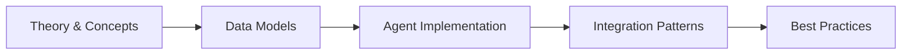

# Chapter: JavaScript Fundamentals

---

## Learning Objectives

- Declare variables with `var`, `let`, and `const` and explain their scoping differences
- Identify JavaScript data types and understand type coercion behavior
- Write function declarations, expressions, arrow functions, and IIFEs
- Use rest parameters, spread syntax, and default parameters in function signatures
- Apply higher-order functions — `map`, `filter`, `reduce` — to array transformations
- Manipulate the DOM using `querySelector`, `createElement`, `classList`, and `dataset`
- Handle events through capturing, bubbling, delegation, and custom events
- Perform HTTP requests with the Fetch API and handle responses, errors, and cancellation
- Use ES6+ features: destructuring, modules, Promises, `async`/`await`, Maps, Sets, Symbols
- Build reactive UI fragments with Alpine.js directives in Blade templates
- Configure Vite, npm scripts, and `import.meta.env` inside a Laravel project
- Integrate Laravel Echo with WebSocket broadcasting for real-time features

<!-- Image Gallery -->
<section class="lesson-visuals" aria-label="Visual learning resources">
  <header><span>VISUAL LEARNING</span><h2>See it. Review it. Remember it.</h2></header>
  <a class="lesson-visual-card" href="../../../assets/images/lessons/laravel/javascript-basics/.png" target="_blank" rel="noopener">
    
    <span><strong>Handwritten notes</strong>Condensed notes for deliberate review.</span>
  </a>
  <a class="lesson-visual-card" href="../../../assets/images/lessons/laravel/javascript-basics/.png" target="_blank" rel="noopener">
    
    <span><strong>Sticky-note revision</strong>Fast recall prompts for revision.</span>
  </a>
  <a class="lesson-visual-card" href="../../../assets/images/lessons/laravel/javascript-basics/.png" target="_blank" rel="noopener">
    
    <span><strong>Visual concept guide</strong>A connected explanation of the key ideas.</span>
  </a>
</section>
<!-- End Image Gallery -->


## Chapter at a Glance

| Aspect | Details |
|--------|---------|
| **Scope** | JavaScript fundamentals: syntax, types, functions, DOM, ES6+, async patterns, Laravel integration |
| **Key Concepts** | Variables, functions, closures, promises, async/await, DOM, ES6+, Alpine.js, Laravel Echo |
| **Learning Approach** | Theory, code examples, Laravel integration patterns |
| **Skills Required** | Basic web development |

## Chapter Roadmap



## Chapter at a Glance

| Aspect | Details |
|--------|---------|
| **Scope** | JavaScript fundamentals: syntax, types, functions, DOM, ES6+, async patterns, Laravel integration |
| **Key Concepts** | Variables, functions, closures, promises, async/await, DOM, ES6+, Alpine.js, Laravel Echo |
| **Learning Approach** | Theory, code examples, Laravel integration patterns |
| **Skills Required** | Basic web development |

## Chapter Roadmap


## Chapter at a Glance

| Aspect | Details |
|--------|---------|
| **Scope** | JavaScript fundamentals: syntax, types, functions, DOM, ES6+, async patterns, Laravel integration |
| **Key Concepts** | Variables, functions, closures, promises, async/await, DOM, ES6+, Alpine.js, Laravel Echo |
| **Learning Approach** | Theory, code examples, Laravel integration patterns |
| **Skills Required** | Basic web development |

## Chapter Roadmap


## Chapter at a Glance

| Aspect | Details |
|--------|---------|
| **Scope** | JavaScript fundamentals: syntax, types, functions, DOM, ES6+, async patterns, Laravel integration |
| **Key Concepts** | Variables, functions, closures, promises, async/await, DOM, ES6+, Alpine.js, Laravel Echo |
| **Learning Approach** | Theory, code examples, Laravel integration patterns |
| **Skills Required** | Basic web development |

## Chapter Roadmap


---

## Theory
> **One-Sentence Takeaway:** Theory is the foundation → master it before moving to examples and exercises.
> **One-Sentence Takeaway:** Theory is the foundation → master it before moving to examples and exercises.
> **One-Sentence Takeaway:** Theory is the foundation → master it before moving to examples and exercises.
> **One-Sentence Takeaway:** Theory is the foundation → master it before moving to examples and exercises.


### 1. JavaScript Syntax and Variables


JavaScript is a dynamic, loosely typed language. Variables hold values; the type is determined at runtime.

#### Variable Declarations

```javascript
// var — function-scoped, hoisted, avoid in modern code
var name = 'Alice';
var count = 10;
var isActive = true;

// let — block-scoped, preferred for reassignable variables
let score = 0;
score = 95;

let items = ['pen', 'book'];
items.push('ruler');

// const — block-scoped, cannot be reassigned
const PI = 3.14159;
const user = { id: 1, role: 'admin' };
user.role = 'editor'; // mutation is allowed
// user = {};         // TypeError: Assignment to constant variable
```

**Scoping rules:**

| Declaration | Scope        | Hoisted | Reassignable | Temporal Dead Zone |
|-------------|--------------|---------|--------------|---------------------|
| `var`       | Function     | Yes     | Yes          | No                  |
| `let`       | Block        | Yes     | Yes          | Yes                 |
| `const`     | Block        | Yes     | No           | Yes                 |

```javascript
function scopeDemo() {
    var x = 1;
    if (true) {
        var x = 2;   // same variable!
        let y = 3;
        const z = 4; // block-scoped
    }
    console.log(x); // 2 (var leaks out of block)
    // console.log(y); // ReferenceError
    // console.log(z); // ReferenceError
}
```

#### Data Types

JavaScript has seven primitive types and one object type.

```javascript
// Primitives
const str = 'hello';             // string
const num = 42;                  // number
const big = 9007199254740991n;   // bigint
const bool = false;              // boolean
const und = undefined;           // undefined
const nil = null;                // null (typeof returns "object")
const sym = Symbol('id');        // symbol

// Objects
const obj = { key: 'value' };
const arr = [1, 2, 3];
const fn = () => {};
const date = new Date();
const regex = /test/gi;
```

#### Type Coercion

JavaScript implicitly converts types in certain operations.

```javascript
// String coercion
console.log(5 + '5');       // "55"
console.log('The value: ' + 42); // "The value: 42"

// Numeric coercion
console.log('5' - 3);       // 2
console.log('5' * '2');     // 10
console.log('hello' - 1);   // NaN

// Boolean coercion (falsy values)
const falsy = [false, 0, '', null, undefined, NaN];
falsy.forEach(v => console.log(Boolean(v))); // all => false

// Loose vs strict equality
console.log(5 == '5');      // true  (coerces)
console.log(5 === '5');     // false (no coercion)
console.log(null == undefined);  // true
console.log(null === undefined); // false
```

#### Strict Mode

Strict mode catches silent errors and forbids dangerous syntax.

```javascript
'use strict';

// x = 10;           // ReferenceError (must declare)
// delete Object.prototype; // TypeError
// NaN = 5;          // TypeError

function strictFn() {
    'use strict';
    // this is undefined in plain function calls
    console.log(this); // undefined
}
```

#### Operators

```javascript
// Arithmetic
let a = 10, b = 3;
console.log(a + b, a - b, a * b, a / b, a % b, a ** b);
// 13 7 30 3.333... 1 1000

// Assignment
let x = 5;
x += 3;  // 8
x *= 2;  // 16

// Comparison
console.log(5 > 3, 5 <= 3, 'a' < 'b'); // true false true

// Logical
console.log(true && false); // false
console.log(true || false); // true
console.log(!true);         // false
console.log(null ?? 'fallback'); // "fallback" (nullish coalescing)

// Optional chaining
const userProfile = { address: { city: 'Paris' } };
console.log(userProfile?.address?.city);  // "Paris"
console.log(userProfile?.billing?.card);  // undefined (no error)
```

---

### 2. Functions


Functions are first-class objects — they can be assigned, passed, and returned.

#### Function Declarations

```javascript
function greet(name) {
    return `Hello, ${name}!`;
}

console.log(greet('Alice')); // "Hello, Alice!"
```

Declarations are hoisted — callable before their definition.

```javascript
console.log(add(2, 3)); // 5

function add(a, b) {
    return a + b;
}
```

#### Function Expressions

```javascript
const multiply = function (a, b) {
    return a * b;
};

console.log(multiply(4, 5)); // 20
```

#### Arrow Functions

Arrow functions have a concise syntax and lexically bind `this`.

```javascript
// Single parameter, single expression — implicit return
const square = n => n * n;

// Multiple parameters
const sum = (a, b) => a + b;

// Block body — explicit return
const getFullName = (first, last) => {
    const title = 'Ms.';
    return `${title} ${first} ${last}`;
};

console.log(square(5));    // 25
console.log(sum(3, 4));    // 7
console.log(getFullName('Jane', 'Doe')); // "Ms. Jane Doe"

// Lexical this
const team = {
    name: 'Devs',
    members: ['Alice', 'Bob'],
    show() {
        this.members.forEach(m => {
            console.log(`${this.name}: ${m}`); // arrow captures outer this
        });
    }
};
team.show();
```

#### Default Parameters

```javascript
function createUser(name, role = 'viewer', active = true) {
    return { name, role, active };
}

console.log(createUser('Alice'));
// { name: "Alice", role: "viewer", active: true }

console.log(createUser('Bob', 'admin', false));
// { name: "Bob", role: "admin", active: false }
```

#### Rest Parameters

Collect remaining arguments into an array.

```javascript
function logAll(prefix, ...args) {
    args.forEach(arg => console.log(`${prefix}: ${arg}`));
}

logAll('INFO', 'start', 'process', 'end');
// "INFO: start"
// "INFO: process"
// "INFO: end"

// Rest in destructuring
const [first, ...rest] = [10, 20, 30, 40];
console.log(first); // 10
console.log(rest);  // [20, 30, 40]
```

#### Spread Operator

Expand an iterable into individual elements.

```javascript
const nums = [1, 2, 3];
const more = [...nums, 4, 5];
console.log(more); // [1, 2, 3, 4, 5]

// Merge objects
const defaults = { theme: 'light', lang: 'en' };
const overrides = { lang: 'fr' };
const config = { ...defaults, ...overrides };
console.log(config); // { theme: "light", lang: "fr" }

// Spread in function calls
console.log(Math.max(...nums)); // 3
```

#### IIFE — Immediately Invoked Function Expression

```javascript
(function () {
    const secret = 'hidden';
    console.log('IIFE runs once');
})();

// Arrow IIFE
(() => {
    console.log('Arrow IIFE');
})();
```

#### Callbacks

A callback is a function passed into another function to execute later.

```javascript
function fetchData(callback) {
    setTimeout(() => {
        callback({ id: 1, status: 'ok' });
    }, 1000);
}

fetchData(data => {
    console.log('Received:', data);
});
```

#### Higher-Order Functions — map, filter, reduce

```javascript
const numbers = [5, 10, 15, 20, 25];

// map — transform every element
const doubled = numbers.map(n => n * 2);
console.log(doubled); // [10, 20, 30, 40, 50]

// filter — keep elements that pass a test
const big = numbers.filter(n => n > 12);
console.log(big); // [15, 20, 25]

// reduce — accumulate to a single value
const total = numbers.reduce((acc, n) => acc + n, 0);
console.log(total); // 75

// Chaining
const result = numbers
    .filter(n => n % 10 === 0)
    .map(n => n / 10)
    .reduce((acc, n) => acc + n, 0);
console.log(result); // (10 + 20) / 10 = 3

// reduce — grouping
const people = [
    { name: 'Alice', role: 'admin' },
    { name: 'Bob', role: 'editor' },
    { name: 'Carol', role: 'admin' }
];
const grouped = people.reduce((acc, p) => {
    (acc[p.role] = acc[p.role] || []).push(p);
    return acc;
}, {});
console.log(grouped);
// { admin: [{ name: "Alice" }, { name: "Carol" }], editor: [{ name: "Bob" }] }
```

---

### 3. Objects and Arrays


#### Object Creation and Access

```javascript
// Object literal
const car = {
    make: 'Tesla',
    model: 'Model 3',
    year: 2024,
    start() {
        console.log(`${this.make} ${this.model} started`);
    }
};

// Dot notation
console.log(car.make);     // "Tesla"

// Bracket notation — dynamic keys
const key = 'model';
console.log(car[key]);     // "Model 3"

// Computed property keys
const prefix = 'prop';
const obj = {
    [prefix + '1']: 'value-a',
    [prefix + '2']: 'value-b'
};
console.log(obj.prop1); // "value-a"
```

#### Object Destructuring

```javascript
const user = { id: 1, name: 'Alice', email: 'alice@example.com' };

// Basic destructuring
const { name, email } = user;
console.log(name, email); // "Alice" "alice@example.com"

// Rename
const { id: userId } = user;
console.log(userId); // 1

// Default values
const { role = 'viewer' } = user;
console.log(role); // "viewer"

// Nested destructuring
const response = {
    status: 200,
    data: { title: 'Hello', author: 'Bob' }
};
const { data: { title, author } } = response;
console.log(title); // "Hello"

// Rest in object destructuring
const { id: userId2, ...rest } = user;
console.log(userId2); // 1
console.log(rest);    // { name: "Alice", email: "alice@example.com" }
```

#### Object Methods

```javascript
const inventory = {
    items: [],
    add(item) {
        this.items.push(item);
    },
    clear() {
        this.items = [];
    }
};

inventory.add('laptop');
inventory.add('monitor');
console.log(inventory.items); // ["laptop", "monitor"]

// Static methods
const target = { a: 1 };
const source = { b: 2, c: 3 };
Object.assign(target, source);
console.log(target); // { a: 1, b: 2, c: 3 }

const keys = Object.keys(target);
const values = Object.values(target);
const entries = Object.entries(target);
console.log(keys);    // ["a", "b", "c"]
console.log(values);  // [1, 2, 3]
console.log(entries); // [["a", 1], ["b", 2], ["c", 3]]

// Object.freeze — makes object immutable (shallow)
const frozen = Object.freeze({ version: 1 });
// frozen.version = 2; // TypeError in strict mode
```

#### Array Methods — push, pop, find, some, every, includes, flat

```javascript
const fruits = ['apple', 'banana'];

// push / pop (modify end)
fruits.push('cherry');
console.log(fruits);       // ["apple", "banana", "cherry"]
console.log(fruits.pop()); // "cherry"

// shift / unshift (modify start)
fruits.unshift('avocado');
console.log(fruits);         // ["avocado", "apple", "banana"]
console.log(fruits.shift()); // "avocado"

// find — returns first match
const numbers = [10, 25, 30, 45];
const found = numbers.find(n => n > 20);
console.log(found); // 25

// some — at least one passes
console.log(numbers.some(n => n > 40)); // true

// every — all pass
console.log(numbers.every(n => n > 5)); // true

// includes — strict equality check
console.log(fruits.includes('banana')); // true

// flat — flatten nested arrays
const nested = [1, [2, [3, [4]]]];
console.log(nested.flat());       // [1, 2, [3, [4]]]
console.log(nested.flat(2));      // [1, 2, 3, [4]]
console.log(nested.flat(Infinity)); // [1, 2, 3, 4]

// splice — insert/remove at index
const colors = ['red', 'green', 'blue'];
colors.splice(1, 1, 'yellow');  // remove 1 at index 1, insert 'yellow'
console.log(colors); // ["red", "yellow", "blue"]

// slice — non-destructive copy
const sliced = colors.slice(0, 2);
console.log(sliced); // ["red", "yellow"]

// sort — mutates, accepts compare function
const scores = [3, 30, 1, 100];
scores.sort((a, b) => a - b);
console.log(scores); // [1, 3, 30, 100]

// forEach — iterate
fruits.forEach((fruit, i) => {
    console.log(`${i}: ${fruit}`);
});
```

#### Spread Operator with Arrays

```javascript
const a = [1, 2, 3];
const b = [4, 5, 6];
const merged = [...a, ...b];
console.log(merged); // [1, 2, 3, 4, 5, 6]

// Copy (shallow)
const copy = [...a];
console.log(copy);    // [1, 2, 3]
console.log(copy === a); // false
```

---

### 4. DOM Manipulation


The Document Object Model (DOM) is a tree representation of HTML. JavaScript can traverse and mutate this tree.

#### Selecting Elements

```html
<!DOCTYPE html>
<html>
<head>
    <title>DOM Demo</title>
</head>
<body>
    <h1 id="title">Hello World</h1>
    <p class="text">First paragraph</p>
    <p class="text">Second paragraph</p>
    <ul id="list">
        <li data-id="1">Item 1</li>
        <li data-id="2">Item 2</li>
        <li data-id="3">Item 3</li>
    </ul>
    <div class="container"></div>
    <button id="btn">Click me</button>

    <script src="app.js"></script>
</body>
</html>
```

```javascript
// getElementById
const title = document.getElementById('title');
console.log(title.textContent); // "Hello World"

// querySelector — returns first match (CSS selector)
const firstText = document.querySelector('.text');
console.log(firstText.textContent); // "First paragraph"

const list = document.querySelector('#list');
console.log(list.children.length); // 3

// querySelectorAll — returns NodeList (array-like)
const allTexts = document.querySelectorAll('.text');
allTexts.forEach(el => console.log(el.textContent));

// By tag name
const allLis = document.querySelectorAll('li');
```

#### Creating and Inserting Elements

```html
<!DOCTYPE html>
<html>
<head>
    <title>Create Elements</title>
</head>
<body>
    <div id="app"></div>
    <script>
        const app = document.getElementById('app');

        // createElement
        const heading = document.createElement('h2');
        heading.textContent = 'Dynamic Heading';
        heading.classList.add('highlight');

        const paragraph = document.createElement('p');
        paragraph.textContent = 'This paragraph was created by JavaScript.';

        const link = document.createElement('a');
        link.href = 'https://laravel.com';
        link.textContent = 'Visit Laravel';
        link.target = '_blank';

        // appendChild / append
        app.appendChild(heading);
        app.append(paragraph, link);

        // Insert adjacent
        const banner = document.createElement('div');
        banner.textContent = 'Banner';
        heading.insertAdjacentElement('afterend', banner);

        // Remove
        // app.removeChild(heading);
    </script>
</body>
</html>
```

#### innerHTML — caution with user data

```javascript
const container = document.querySelector('.container');
container.innerHTML = '<span class="badge">New</span>';

// SECURITY: never interpolate unsanitized user input
// const userInput = '';
// container.innerHTML = userInput; // XSS vulnerability
```

#### classList

```javascript
const box = document.querySelector('.box');
if (box) {
    box.classList.add('active');
    box.classList.remove('hidden');
    box.classList.toggle('visible');
    console.log(box.classList.contains('active')); // true
}
```

#### dataset

```javascript
const li = document.querySelector('li');
console.log(li.dataset.id); // "1"
li.dataset.status = 'done';
// HTML becomes: <li data-id="1" data-status="done">Item 1</li>
```

#### textContent vs innerText

```javascript
const p = document.querySelector('p');
console.log(p.textContent); // includes all text (no layout cost)
// innerText is layout-aware and more expensive
```

#### Traversal

```javascript
const child = document.querySelector('li');
console.log(child.parentElement);       // <ul>
console.log(child.nextElementSibling);  // next <li>
console.log(child.previousElementSibling); // previous <li>
console.log(child.closest('ul'));       // nearest matching ancestor
```

---

### 5. ES6+ Features


#### Template Literals

```javascript
const name = 'Alice';
const age = 30;

// Interpolation
const greeting = `Hello, my name is ${name} and I am ${age} years old.`;
console.log(greeting);
// "Hello, my name is Alice and I am 30 years old."

// Multi-line strings
const html = `
    <div class="card">
        <h2>${name}</h2>
        <p>Age: ${age}</p>
    </div>
`;

// Tagged templates
function highlight(strings, ...values) {
    return strings.reduce((result, str, i) => {
        const val = values[i] ? `<strong>${values[i]}</strong>` : '';
        return result + str + val;
    }, '');
}

const tagged = highlight`User: ${name}, Role: ${'admin'}`;
console.log(tagged); // "User: <strong>Alice</strong>, Role: <strong>admin</strong>"
```

#### let and const (detailed)

See Section 1 for scoping comparison. Block scoping eliminates the classic loop closure bug:

```javascript
// Bug with var
for (var i = 0; i < 3; i++) {
    setTimeout(() => console.log(i), 100); // 3, 3, 3
}

// Fixed with let
for (let j = 0; j < 3; j++) {
    setTimeout(() => console.log(j), 100); // 0, 1, 2
}
```

#### Destructuring (detailed)

Already covered in Sections 3. Additional patterns:

```javascript
// Swapping variables
let x = 1, y = 2;
[x, y] = [y, x];
console.log(x, y); // 2 1

// Function parameter destructuring
function printUser({ name, email, role = 'viewer' }) {
    console.log(`${name} (${email}) — ${role}`);
}
printUser({ name: 'Alice', email: 'a@example.com' });
// "Alice (a@example.com) — viewer"

// Nested array destructuring
const [a, , b] = [10, 20, 30];
console.log(a, b); // 10 30
```

#### Spread and Rest

Detailed in Sections 2 and 3. Key distinction:
- **Spread** *expands* an iterable (used in array/object literals, function calls)
- **Rest** *collects* remaining elements (used in destructuring, function parameters)

#### Modules — import / export

```javascript
// math.js
export const PI = 3.14159;
export function add(a, b) { return a + b; }
export default function multiply(a, b) { return a * b; }
```

```javascript
// app.js
import multiply, { PI, add } from './math.js';

console.log(multiply(2, 3)); // 6
console.log(add(PI, 1));     // 4.14159
```

```javascript
// Dynamic import (lazy loading)
const button = document.getElementById('loadModule');
button.addEventListener('click', async () => {
    const { default: format } = await import('./format.js');
    console.log(format('dynamic import'));
});
```

#### Promises

```javascript
function asyncTask(success) {
    return new Promise((resolve, reject) => {
        setTimeout(() => {
            if (success) {
                resolve('Task completed');
            } else {
                reject(new Error('Task failed'));
            }
        }, 1000);
    });
}

// Consuming
asyncTask(true)
    .then(result => console.log(result))
    .catch(err => console.error(err))
    .finally(() => console.log('Done'));

// Promise combinators
const p1 = Promise.resolve('A');
const p2 = Promise.resolve('B');
const p3 = new Promise(r => setTimeout(() => r('C'), 500));

Promise.all([p1, p2, p3])
    .then(values => console.log(values)); // ["A", "B", "C"]

Promise.race([p1, p2, p3])
    .then(winner => console.log(winner)); // "A"

Promise.allSettled([p1, Promise.reject('X'), p3])
    .then(results => console.log(results));
// [{ status: "fulfilled", value: "A" }, { status: "rejected", reason: "X" }, ...]
```

#### async / await

```javascript
async function fetchUserData(userId) {
    try {
        const response = await fetch(`https://api.example.com/users/${userId}`);
        if (!response.ok) {
            throw new Error(`HTTP ${response.status}`);
        }
        const user = await response.json();
        return user;
    } catch (error) {
        console.error('Fetch failed:', error);
        throw error;
    }
}

// Top-level await (in modules)
// const config = await fetch('/config.json').then(r => r.json());

// Parallel execution with async/await
async function loadAll() {
    const [users, posts] = await Promise.all([
        fetch('/api/users').then(r => r.json()),
        fetch('/api/posts').then(r => r.json())
    ]);
    return { users, posts };
}
```

#### Symbols

Symbols are unique, immutable primitive values used as object keys to avoid collisions.

```javascript
const sym1 = Symbol('id');
const sym2 = Symbol('id');
console.log(sym1 === sym2); // false

const obj = {
    [sym1]: 'secret-value',
    visible: 'public'
};

console.log(obj[sym1]);     // "secret-value"
console.log(Object.keys(obj)); // ["visible"] — Symbols are hidden from enumeration

// Well-known Symbols
const iterable = {
    items: [1, 2, 3],
    [Symbol.iterator]() {
        let i = 0;
        return {
            next: () => ({
                value: this.items[i++],
                done: i > this.items.length
            })
        };
    }
};
console.log([...iterable]); // [1, 2, 3]
```

#### Maps

Maps hold key-value pairs where keys can be any type (objects, functions, primitives).

```javascript
const cache = new Map();

cache.set('user_1', { name: 'Alice' });
cache.set(42, 'answer');
cache.set(document.body, 'body element');

console.log(cache.get('user_1')); // { name: "Alice" }
console.log(cache.has(42));       // true
console.log(cache.size);          // 3

cache.delete(42);
cache.forEach((value, key) => {
    console.log(key, value);
});

// Map vs object — Map preserves insertion order, has size, better performance for frequent add/delete
```

#### Sets

Sets store unique values of any type.

```javascript
const tags = new Set();

tags.add('javascript');
tags.add('laravel');
tags.add('javascript'); // ignored — already exists

console.log(tags.size); // 2
console.log(tags.has('laravel')); // true

tags.delete('laravel');

// Array deduplication
const duplicates = [1, 2, 2, 3, 3, 3];
const unique = [...new Set(duplicates)];
console.log(unique); // [1, 2, 3]

// Iteration
tags.forEach(tag => console.log(tag));

// Set operations
const a = new Set([1, 2, 3]);
const b = new Set([2, 3, 4]);
const union = new Set([...a, ...b]);            // {1, 2, 3, 4}
const intersection = new Set([...a].filter(x => b.has(x))); // {2, 3}
const difference = new Set([...a].filter(x => !b.has(x)));  // {1}
```

---

### 6. AJAX and the Fetch API


#### GET Request

```javascript
// Simple GET
fetch('https://jsonplaceholder.typicode.com/posts')
    .then(response => {
        if (!response.ok) {
            throw new Error(`HTTP error: ${response.status}`);
        }
        return response.json();
    })
    .then(posts => {
        console.log(`${posts.length} posts loaded`);
    })
    .catch(error => {
        console.error('Network error:', error.message);
    });
```

#### POST Request with JSON

```javascript
const newPost = {
    title: 'JavaScript Fetch API',
    body: 'Content goes here...',
    userId: 1
};

fetch('https://jsonplaceholder.typicode.com/posts', {
    method: 'POST',
    headers: {
        'Content-Type': 'application/json',
        'Accept': 'application/json'
    },
    body: JSON.stringify(newPost)
})
    .then(res => res.json())
    .then(data => console.log('Created:', data))
    .catch(err => console.error(err));
```

#### FormData

```javascript
const form = document.getElementById('myForm');
form.addEventListener('submit', async event => {
    event.preventDefault();

    const formData = new FormData(form);

    // FormData automatically handles file uploads
    fetch('/api/upload', {
        method: 'POST',
        body: formData
        // Do NOT set Content-Type — browser sets multipart/form-data with boundary
    })
        .then(res => res.json())
        .then(data => console.log('Uploaded:', data))
        .catch(err => console.error(err));
});
```

#### Error Handling

```javascript
async function safeFetch(url, options = {}) {
    try {
        const response = await fetch(url, options);

        if (response.status === 204) {
            return null; // No content
        }

        if (!response.ok) {
            const errorBody = await response.text();
            throw new Error(
                `Request failed: ${response.status} ${response.statusText}\n${errorBody}`
            );
        }

        return await response.json();
    } catch (error) {
        if (error.name === 'AbortError') {
            console.log('Request was cancelled');
            return null;
        }
        console.error('Fetch error:', error);
        throw error;
    }
}

// Usage
const data = await safeFetch('/api/users');
```

#### AbortController — cancelling requests

```javascript
function searchWithCancel(query) {
    const controller = new AbortController();
    const signal = controller.signal;

    const promise = fetch(`/api/search?q=${encodeURIComponent(query)}`, { signal })
        .then(res => res.json());

    promise.cancel = () => controller.abort();

    return promise;
}

// Cancel a request
const searchPromise = searchWithCancel('laravel');
searchPromise.cancel(); // Aborts the fetch
```

#### Axios (popular HTTP library)

```html
<!-- Include from CDN or via npm -->
<script src="https://cdn.jsdelivr.net/npm/axios/dist/axios.min.js"></script>
```

```javascript
// GET with axios
axios.get('/api/users')
    .then(response => {
        console.log(response.data); // parsed JSON
        console.log(response.status);
        console.log(response.headers);
    })
    .catch(error => {
        if (error.response) {
            console.log(error.response.data); // server error body
        } else if (error.request) {
            console.log('No response received');
        } else {
            console.log('Request setup error:', error.message);
        }
    });

// POST with axios
axios.post('/api/posts', { title: 'Hello', body: 'World' })
    .then(({ data }) => console.log(data));

// Axios instance with defaults
const api = axios.create({
    baseURL: '/api',
    timeout: 5000,
    headers: {
        'X-CSRF-TOKEN': document.querySelector('meta[name="csrf-token"]')?.content
    }
});

api.get('/users')
    .then(({ data }) => console.log(data));
```

---

### 7. Event Handling


#### addEventListener

```html
<!DOCTYPE html>
<html>
<head>
    <title>Events</title>
</head>
<body>
    <button id="clickBtn">Click me</button>
    <form id="myForm">
        <input type="text" name="username" id="username">
        <button type="submit">Submit</button>
    </form>
    <div id="parent" style="padding:20px;background:#eee;">
        Parent
        <div id="child" style="padding:20px;background:#ccc;">
            Child
            <div id="grandchild" style="padding:20px;background:#aaa;">
                Grandchild
            </div>
        </div>
    </div>

    <script>
        const btn = document.getElementById('clickBtn');
        btn.addEventListener('click', event => {
            console.log('Button clicked!');
            console.log('Event type:', event.type);
            console.log('Target:', event.target);
        });
    </script>
</body>
</html>
```

#### Event Phases — Capture, Target, Bubble

Events travel in three phases:
1. **Capture** — document → target (rarely used directly)
2. **Target** — the element that received the event
3. **Bubble** — target → document (default listener phase)

```javascript
const parent = document.getElementById('parent');
const child = document.getElementById('child');
const grandchild = document.getElementById('grandchild');

// Bubbling phase (default) — third parameter false or omitted
parent.addEventListener('click', () => console.log('Parent bubble'), false);
child.addEventListener('click', () => console.log('Child bubble'));
grandchild.addEventListener('click', () => console.log('Grandchild bubble'));

// Click on grandchild outputs:
// "Grandchild bubble"
// "Child bubble"
// "Parent bubble"

// Capture phase — third parameter true
parent.addEventListener('click', () => console.log('Parent capture'), true);
child.addEventListener('click', () => console.log('Child capture'), true);
grandchild.addEventListener('click', () => console.log('Grandchild capture'), true);

// Click on grandchild outputs:
// "Parent capture"
// "Child capture"
// "Grandchild capture"
// "Grandchild bubble"
// "Child bubble"
// "Parent bubble"
```

#### stopPropagation

```javascript
grandchild.addEventListener('click', event => {
    event.stopPropagation(); // Stops further propagation
    console.log('Grandchild — no more events');
});
```

#### preventDefault

```javascript
document.getElementById('myForm').addEventListener('submit', event => {
    event.preventDefault(); // Prevent form submission
    const username = document.getElementById('username').value;
    console.log('Form would submit:', username);
});

document.querySelectorAll('a').forEach(link => {
    link.addEventListener('click', event => {
        if (!confirm('Follow this link?')) {
            event.preventDefault();
        }
    });
});
```

#### Event Delegation

Attach a single listener to a parent and handle events from many children.

```html
<!DOCTYPE html>
<html>
<head>
    <title>Event Delegation</title>
</head>
<body>
    <ul id="taskList">
        <li data-id="1">Task 1</li>
        <li data-id="2">Task 2</li>
        <li data-id="3">Task 3</li>
    </ul>
    <button id="addTaskBtn">Add Task</button>

    <script>
        const taskList = document.getElementById('taskList');

        // Single listener for all current and future items
        taskList.addEventListener('click', event => {
            const li = event.target.closest('li');
            if (!li) return;

            console.log('Task clicked:', li.dataset.id, li.textContent);
            li.classList.toggle('completed');
        });

        document.getElementById('addTaskBtn').addEventListener('click', () => {
            const newLi = document.createElement('li');
            const id = Date.now();
            newLi.dataset.id = id;
            newLi.textContent = `Task ${id}`;
            taskList.appendChild(newLi);
        });
    </script>
</body>
</html>
```

#### Custom Events

```javascript
// Define custom event
const notificationEvent = new CustomEvent('notify', {
    detail: {
        message: 'Something happened',
        level: 'info',
        timestamp: Date.now()
    },
    bubbles: true,
    cancelable: true
});

// Dispatch
document.dispatchEvent(notificationEvent);

// Listen
document.addEventListener('notify', event => {
    const { message, level } = event.detail;
    console.log(`[${level}] ${message}`);
});

// From a component
class ToastManager {
    show(message, level = 'info') {
        const event = new CustomEvent('toast', {
            detail: { message, level },
            bubbles: true
        });
        document.dispatchEvent(event);
    }
}

const toasts = new ToastManager();
toasts.show('User saved successfully', 'success');
```

#### Event Listener Options

```javascript
const handler = () => console.log('Clicked');

// once — automatically removes after first invocation
btn.addEventListener('click', handler, { once: true });

// passive — hint that preventDefault will not be called (improves scroll perf)
document.addEventListener('touchstart', handler, { passive: true });

// Remove listener
btn.removeEventListener('click', handler);
```

#### Keyboard and Input Events

```javascript
const input = document.getElementById('username');

input.addEventListener('input', () => {
    console.log('Current value:', input.value);
});

input.addEventListener('focus', () => {
    input.style.borderColor = 'blue';
});

input.addEventListener('blur', () => {
    input.style.borderColor = '';
});

document.addEventListener('keydown', event => {
    if (event.key === 'Escape') {
        console.log('Escape pressed');
    }
    if (event.ctrlKey && event.key === 's') {
        event.preventDefault();
        console.log('Ctrl+S intercepted');
    }
});
```

---

### 8. Alpine.js for Laravel


Alpine.js is a lightweight JavaScript framework for composing behavior directly in HTML markup. It pairs naturally with Laravel Blade.

#### Setup

```html
<!DOCTYPE html>
<html>
<head>
    <title>Alpine with Laravel</title>
    {{-- Via Vite (Laravel default) --}}
    @vite(['resources/js/app.js'])

    {{-- Or CDN for quick prototyping --}}
    {{-- <script defer src="https://cdn.jsdelivr.net/npm/alpinejs@3.x.x/dist/cdn.min.js"></script> --}}
</head>
```

```javascript
// resources/js/app.js (Laravel default)
import './bootstrap';
import Alpine from 'alpinejs';

window.Alpine = Alpine;
Alpine.start();
```

#### x-data — Component State

```blade
<div x-data="{ count: 0, name: 'Alice' }">
    <p x-text="count"></p>
    <p x-text="name"></p>
</div>
```

#### x-init — Initialization

```blade
<div x-data="{ message: '' }" x-init="message = 'Page loaded at ' + new Date().toLocaleTimeString()">
    <p x-text="message"></p>
</div>
```

#### x-show — Toggle Visibility

```blade
<div x-data="{ open: false }">
    <button @click="open = !open">Toggle</button>
    <div x-show="open" x-transition>
        This content fades in and out.
    </div>
</div>
```

#### x-if — Conditional Rendering

```blade
<div x-data="{ showExtra: false }">
    <template x-if="showExtra">
        <p>This element is removed/added from the DOM (not just hidden).</p>
    </template>
    <button @click="showExtra = !showExtra">Toggle</button>
</div>
```

#### x-for — Loops

```blade
<div x-data="{ users: [
    { id: 1, name: 'Alice' },
    { id: 2, name: 'Bob' },
    { id: 3, name: 'Carol' }
] }">
    <template x-for="user in users" :key="user.id">
        <div>
            <span x-text="user.id"></span>:
            <span x-text="user.name"></span>
        </div>
    </template>
</div>
```

#### x-model — Two-way Data Binding

```blade
<div x-data="{ search: '' }">
    <input type="text" x-model="search" placeholder="Type to search...">
    <p x-text="'Searching for: ' + search"></p>

    {{-- Debounce for API calls --}}
    <input type="text" x-model.debounce.500ms="query">
</div>
```

#### x-on / @ — Event Listeners

```blade
<div x-data="{ count: 0 }">
    <button x-on:click="count++">Increment</button>
    <button @click="count--">Decrement</button>
    <p x-text="count"></p>

    {{-- Specific keys --}}
    <input type="text" @keydown.escape="count = 0" @keydown.enter="count++">

    {{-- Window events --}}
    <div x-data @resize.window="console.log(window.innerWidth)"></div>

    {{-- Prevent default --}}
    <form @submit.prevent="console.log('submitted')">
        <button type="submit">Submit</button>
    </form>

    {{-- Outside click --}}
    <div x-data="{ open: false }" @click.outside="open = false">
        <button @click="open = !open">Dropdown</button>
        <div x-show="open">Dropdown content</div>
    </div>
</div>
```

#### x-bind / : — Dynamic Attributes

```blade
<div x-data="{ isActive: false, bgColor: 'blue' }">
    <button
        :class="{ 'bg-blue-500': isActive, 'bg-gray-300': !isActive }"
        :style="`color: ${bgColor}`"
        :disabled="!isActive"
        @click="isActive = !isActive"
    >
        Toggle
    </button>

    {{-- Bind to a data attribute --}}
    <div :data-status="isActive ? 'on' : 'off'"></div>
</div>
```

#### x-text and x-html

```blade
<div x-data="{ title: 'Hello World', htmlContent: '<strong>Bold text</strong>' }">
    {{-- x-text escapes HTML --}}
    <h1 x-text="title"></h1>

    {{-- x-html renders HTML (XSS risk if content is user-supplied) --}}
    <div x-html="htmlContent"></div>
</div>
```

#### x-ref — Reference Elements

```blade
<div x-data="{ focusInput() { $refs.input.focus() } }">
    <input type="text" x-ref="input">
    <button @click="focusInput()">Focus Input</button>
</div>
```

#### x-teleport — Move Elements in DOM

```blade
<div x-data="{ open: false }">
    <button @click="open = true">Open Modal</button>

    <template x-teleport="body">
        <div x-show="open" class="modal-overlay">
            <div class="modal-content">
                <p>This modal is teleported to the body element.</p>
                <button @click="open = false">Close</button>
            </div>
        </div>
    </template>
</div>
```

#### x-effect — Reactive Side Effects

```blade
<div x-data="{ count: 0, doubled: 0 }" x-effect="doubled = count * 2">
    <button @click="count++">Count: <span x-text="count"></span></button>
    <p>Doubled: <span x-text="doubled"></span></p>
</div>
```

#### Transitions

```blade
<div x-data="{ show: false }">
    <button @click="show = !show">Toggle</button>

    {{-- Default transition (fade + scale) --}}
    <div x-show="show" x-transition>
        Smooth entrance and exit.
    </div>

    {{-- Custom durations --}}
    <div x-show="show" x-transition.duration.500ms>
        Custom duration.
    </div>

    {{-- Separate enter/leave --}}
    <div x-show="show"
         x-transition:enter="transition ease-out duration-300"
         x-transition:enter-start="opacity-0 scale-90"
         x-transition:enter-end="opacity-100 scale-100"
         x-transition:leave="transition ease-in duration-200"
         x-transition:leave-start="opacity-100 scale-100"
         x-transition:leave-end="opacity-0 scale-90">
        Styled with Tailwind classes.
    </div>
</div>
```

#### Alpine.data — Reusable Components

```javascript
// resources/js/alpine-components.js
document.addEventListener('alpine:init', () => {
    Alpine.data('dropdown', () => ({
        open: false,
        toggle() {
            this.open = !this.open;
        },
        close() {
            this.open = false;
        },
        init() {
            this.$watch('open', value => {
                console.log('Dropdown:', value ? 'open' : 'closed');
            });
        }
    }));

    Alpine.data('counter', (initial = 0) => ({
        count: initial,
        increment() { this.count++; },
        decrement() { this.count--; },
        reset() { this.count = initial; }
    }));
});
```

```blade
{{-- Using Alpine.data components --}}
<div x-data="dropdown">
    <button @click="toggle()">Dropdown</button>
    <div x-show="open" @click.outside="close()">
        <a href="#">Profile</a>
        <a href="#">Settings</a>
    </div>
</div>

<div x-data="counter(10)">
    <button @click="decrement()">-</button>
    <span x-text="count"></span>
    <button @click="increment()">+</button>
    <button @click="reset()">Reset</button>
</div>
```

#### Alpine.store — Global State

```javascript
// resources/js/alpine-store.js
document.addEventListener('alpine:init', () => {
    Alpine.store('auth', {
        user: null,
        async fetchUser() {
            const res = await fetch('/api/user');
            this.user = await res.json();
        },
        logout() {
            this.user = null;
        },
        get isAuthenticated() {
            return this.user !== null;
        }
    });

    Alpine.store('notifications', {
        items: [],
        add(message, type = 'info') {
            this.items.push({ id: Date.now(), message, type });
        },
        remove(id) {
            this.items = this.items.filter(n => n.id !== id);
        }
    });
});
```

```blade
{{-- Access store across components --}}
<div x-data>
    <template x-if="$store.auth.isAuthenticated">
        <div>
            Welcome, <span x-text="$store.auth.user?.name"></span>
            <button @click="$store.auth.logout()">Logout</button>
        </div>
    </template>
    <template x-if="!$store.auth.isAuthenticated">
        <button @click="$store.auth.fetchUser()">Login</button>
    </template>
</div>

{{-- Toast notifications with global store --}}
<div x-data>
    <button @click="$store.notifications.add('User saved!', 'success')">
        Save
    </button>
    <div class="toast-container">
        <template x-for="note in $store.notifications.items" :key="note.id">
            <div x-show="true" x-transition
                 :class="'toast toast-' + note.type">
                <span x-text="note.message"></span>
                <button @click="$store.notifications.remove(note.id)">&times;</button>
            </div>
        </template>
    </div>
</div>
```

#### Integration with Blade and Livewire

```blade
{{-- Alpine + Blade: pass server data to Alpine --}}
<div x-data='@json($componentData)'>
    <h2 x-text="title"></h2>
    <p x-text="`Items: ${items.length}`"></p>
</div>

{{-- Alpine + Livewire: wire events trigger Alpine --}}
<div x-data="{ showModal: false }"
     @user-saved.window="showModal = true">
    <livewire:user-form />

    <div x-show="showModal" x-transition @click.outside="showModal = false">
        <p>User saved successfully!</p>
        <button @click="showModal = false">Close</button>
    </div>
</div>

{{-- Alpine within Livewire component --}}
<livewire:counter :initial="0" />
{{--
Inside counter Livewire component:
<div x-data="{ count: {{ $initial }} }">
    <button wire:click="increment">Count: <span x-text="count"></span></button>
</div>
--}}
```

---

### 9. Modern JavaScript Tooling


#### npm and yarn

```bash
# npm
npm init -y
npm install lodash
npm install -D vite
npm run dev

# yarn
yarn init -y
yarn add lodash
yarn add -D vite
yarn dev
```

#### package.json

```json
{
    "name": "laravel-project",
    "private": true,
    "type": "module",
    "scripts": {
        "dev": "vite",
        "build": "vite build",
        "preview": "vite preview"
    },
    "dependencies": {
        "alpinejs": "^3.14.0",
        "axios": "^1.7.0",
        "lodash": "^4.17.21"
    },
    "devDependencies": {
        "@vitejs/plugin-vue": "^5.0.0",
        "autoprefixer": "^10.4.0",
        "vite": "^6.0.0"
    }
}
```

#### ES Modules

```javascript
// Named exports
export const version = '1.0.0';
export function formatDate(date) { /* ... */ }

// Default export
export default class Logger { /* ... */ }

// Re-export
export { debounce } from 'lodash';

// Import all
import * as utils from './utils.js';
console.log(utils.version);
```

#### Import Maps

Import maps allow browsers to resolve bare import specifiers without a bundler.

```html
<script type="importmap">
{
    "imports": {
        "alpinejs": "https://cdn.jsdelivr.net/npm/alpinejs@3.14.0/dist/module.esm.js",
        "lodash": "/vendor/lodash/lodash.js"
    }
}
</script>
<script type="module">
    import Alpine from 'alpinejs';
    import _ from 'lodash';

    window.Alpine = Alpine;
    Alpine.start();

    console.log(_.debounce(() => {}, 300));
</script>
```

#### Bundling Concepts

- **Entry point** — the file Vite starts from (usually `resources/js/app.js`)
- **Code splitting** — dynamic `import()` automatically creates separate chunks
- **Tree shaking** — unused exports are removed in production builds
- **Minification** — Vite uses esbuild for production to compress output
- **Source maps** — map compiled code back to original source for debugging

```javascript
// This will be tree-shaken if never imported
export function unusedHelper() {
    return 'never used';
}

// Code splitting example
const button = document.getElementById('heavyFeature');
button.addEventListener('click', async () => {
    const { default: Chart } = await import('./Chart.js');
    new Chart('#canvas');
});
```

---

### 10. JavaScript in Laravel


#### Vite Configuration

```javascript
// vite.config.js (Laravel default)
import { defineConfig } from 'vite';
import laravel from 'laravel-vite-plugin';
import tailwindcss from '@tailwindcss/vite';

export default defineConfig({
    plugins: [
        laravel({
            input: ['resources/css/app.css', 'resources/js/app.js'],
            refresh: true
        }),
        tailwindcss()
    ]
});
```

#### resources/js/app.js

```javascript
// resources/js/app.js
import './bootstrap';
import Alpine from 'alpinejs';
import axios from 'axios';

// Make Alpine globally available
window.Alpine = Alpine;
Alpine.start();

// Configure Axios defaults
axios.defaults.headers.common['X-CSRF-TOKEN'] = document
    .querySelector('meta[name="csrf-token"]')
    ?.getAttribute('content');

axios.defaults.headers.common['X-Requested-With'] = 'XMLHttpRequest';
```

#### import.meta.env

Laravel/Vite exposes environment variables through `import.meta.env`:

```javascript
// .env
// VITE_APP_NAME=Laravel
// VITE_API_URL=https://api.example.com

// In JavaScript
console.log(import.meta.env.VITE_APP_NAME); // "Laravel"
console.log(import.meta.env.VITE_API_URL);  // "https://api.example.com"
console.log(import.meta.env.MODE);          // "development" or "production"
console.log(import.meta.env.DEV);           // true in dev mode
console.log(import.meta.env.PROD);          // true in production
```

#### Bootstrap JavaScript

```javascript
// resources/js/bootstrap.js
import axios from 'axios';
import _ from 'lodash';

window._ = _;
window.axios = axios;

window.axios.defaults.headers.common['X-Requested-With'] = 'XMLHttpRequest';

// Laravel Echo (WebSockets)
import Echo from 'laravel-echo';
import Pusher from 'pusher-js';

window.Pusher = Pusher;

window.Echo = new Echo({
    broadcaster: 'pusher',
    key: import.meta.env.VITE_PUSHER_APP_KEY,
    cluster: import.meta.env.VITE_PUSHER_APP_CLUSTER,
    forceTLS: true
});
```

#### Tailwind Configuration

```javascript
// tailwind.config.js
/** @type {import('tailwindcss').Config} */
export default {
    content: [
        './resources/**/*.blade.php',
        './resources/**/*.js',
        './resources/**/*.vue',
    ],
    theme: {
        extend: {},
    },
    plugins: [],
};
```

#### Laravel Echo and Broadcasting

```javascript
// Listen for events on a channel
import Echo from 'laravel-echo';

window.Echo = new Echo({
    broadcaster: 'pusher',
    key: import.meta.env.VITE_PUSHER_APP_KEY,
    cluster: import.meta.env.VITE_PUSHER_APP_CLUSTER,
    forceTLS: true
});

// Public channel
Echo.channel('orders')
    .listen('OrderShipped', event => {
        console.log('Order shipped:', event.order);
        showNotification(`Order #${event.order.id} shipped!`);
    });

// Private channel (requires authentication)
Echo.private(`user.${userId}`)
    .listen('NewMessage', event => {
        console.log('New message:', event.message);
        appendMessage(event.message);
    })
    .notification(notification => {
        console.log('Notification:', notification);
    });

// Presence channel (who's online)
Echo.join(`room.${roomId}`)
    .here(members => {
        console.log('Online members:', members);
    })
    .joining(member => {
        console.log('Joined:', member.name);
    })
    .leaving(member => {
        console.log('Left:', member.name);
    })
    .listen('MessageSent', event => {
        addMessage(event.message);
    });

// Leaving a channel (cleanup)
// Echo.leave('orders');
// Echo.leaveChannel(`user.${userId}`);
```

#### Complete Blade + Vite + Alpine Integration

```blade
{{-- resources/views/dashboard.blade.php --}}
<!DOCTYPE html>
<html lang="{{ str_replace('_', '-', app()->getLocale()) }}">
<head>
    <meta charset="utf-8">
    <meta name="viewport" content="width=device-width, initial-scale=1">
    <meta name="csrf-token" content="{{ csrf_token() }}">
    <title>Dashboard - {{ config('app.name') }}</title>
    @vite(['resources/css/app.css', 'resources/js/app.js'])
</head>
<body class="antialiased bg-gray-50">
    <div x-data="dashboard()" class="min-h-screen">
        {{-- Header --}}
        <header class="bg-white shadow">
            <div class="max-w-7xl mx-auto px-4 py-4 flex justify-between items-center">
                <h1 class="text-xl font-bold" x-text="title"></h1>
                <div x-data="dropdown">
                    <button @click="toggle()" class="flex items-center gap-2">
                        <span x-text="$store.auth.user?.name || 'Guest'"></span>
                        <svg class="w-4 h-4" fill="none" stroke="currentColor" viewBox="0 0 24 24">
                            <path stroke-linecap="round" stroke-linejoin="round" stroke-width="2" d="M19 9l-7 7-7-7"></path>
                        </svg>
                    </button>
                    <div x-show="open" @click.outside="close()"
                         class="absolute right-0 mt-2 w-48 bg-white rounded-md shadow-lg"
                         x-transition>
                        <a href="/profile" class="block px-4 py-2 hover:bg-gray-100">Profile</a>
                        <a href="/settings" class="block px-4 py-2 hover:bg-gray-100">Settings</a>
                        <form method="POST" action="{{ route('logout') }}">
                            @csrf
                            <button type="submit" class="block w-full text-left px-4 py-2 hover:bg-gray-100">
                                Logout
                            </button>
                        </form>
                    </div>
                </div>
            </div>
        </header>

        {{-- Main content --}}
        <main class="max-w-7xl mx-auto px-4 py-8">
            {{-- Stats grid --}}
            <div class="grid grid-cols-1 md:grid-cols-3 gap-6 mb-8">
                <div x-data="statCard('{{ $totalUsers }}', 'Users')" class="bg-white p-6 rounded-lg shadow">
                    <p class="text-sm text-gray-500" x-text="label"></p>
                    <p class="text-3xl font-bold mt-1" x-text="value"></p>
                </div>
                <div x-data="statCard('{{ $totalOrders }}', 'Orders')" class="bg-white p-6 rounded-lg shadow">
                    <p class="text-sm text-gray-500" x-text="label"></p>
                    <p class="text-3xl font-bold mt-1" x-text="value"></p>
                </div>
                <div x-data="statCard('{{ $revenue }}', 'Revenue')" class="bg-white p-6 rounded-lg shadow">
                    <p class="text-sm text-gray-500" x-text="label"></p>
                    <p class="text-3xl font-bold mt-1" x:text="`$${value}`"></p>
                </div>
            </div>

            {{-- Real-time orders (Echo) --}}
            <div x-data="orders()" class="bg-white rounded-lg shadow p-6">
                <div class="flex justify-between items-center mb-4">
                    <h2 class="text-lg font-semibold">Recent Orders</h2>
                    <span class="text-sm text-gray-500">
                        Live: <span x-text="connected ? 'Connected' : 'Disconnected'"
                                   :class="connected ? 'text-green-500' : 'text-red-500'"></span>
                    </span>
                </div>
                <template x-if="loading">
                    <p>Loading orders...</p>
                </template>
                <template x-if="!loading">
                    <table class="w-full">
                        <thead>
                            <tr class="text-left text-sm text-gray-500">
                                <th class="pb-2">ID</th>
                                <th class="pb-2">Customer</th>
                                <th class="pb-2">Status</th>
                                <th class="pb-2">Total</th>
                            </tr>
                        </thead>
                        <tbody>
                            <template x-for="order in orders" :key="order.id">
                                <tr class="border-t" :class="{ 'bg-yellow-50': order.isNew }">
                                    <td class="py-2" x-text="order.id"></td>
                                    <td class="py-2" x-text="order.customer"></td>
                                    <td class="py-2">
                                        <span :class="statusClass(order.status)"
                                              x-text="order.status"></span>
                                    </td>
                                    <td class="py-2" x-text="`$${order.total}`"></td>
                                </tr>
                            </template>
                        </tbody>
                    </table>
                </template>
            </div>
        </main>
    </div>

    <script>
        document.addEventListener('alpine:init', () => {
            // Stat card component
            Alpine.data('statCard', (value, label) => ({
                value: value,
                label: label
            }));

            // Dashboard main component
            Alpine.data('dashboard', () => ({
                title: 'Dashboard',
                init() {
                    console.log('Dashboard initialized');
                }
            }));

            // Orders component with Echo
            Alpine.data('orders', () => ({
                orders: [],
                loading: true,
                connected: false,

                async init() {
                    await this.fetchOrders();

                    if (window.Echo) {
                        Echo.channel('orders')
                            .listen('OrderShipped', event => {
                                this.orders.unshift({
                                    id: event.order.id,
                                    customer: event.order.customer_name,
                                    status: 'shipped',
                                    total: event.order.total,
                                    isNew: true
                                });
                                setTimeout(() => {
                                    this.orders.forEach(o => o.isNew = false);
                                }, 3000);
                            });

                        Echo.connector.pusher.connection.bind('connected', () => {
                            this.connected = true;
                        });
                    }
                },

                async fetchOrders() {
                    try {
                        const response = await axios.get('/api/orders');
                        this.orders = response.data;
                    } catch (error) {
                        console.error('Failed to load orders:', error);
                    } finally {
                        this.loading = false;
                    }
                },

                statusClass(status) {
                    const classes = {
                        pending: 'text-yellow-600 bg-yellow-100 px-2 py-1 rounded text-xs',
                        shipped: 'text-blue-600 bg-blue-100 px-2 py-1 rounded text-xs',
                        delivered: 'text-green-600 bg-green-100 px-2 py-1 rounded text-xs',
                        cancelled: 'text-red-600 bg-red-100 px-2 py-1 rounded text-xs'
                    };
                    return classes[status] || classes.pending;
                }
            }));

            // Dropdown component
            Alpine.data('dropdown', () => ({
                open: false,
                toggle() { this.open = !this.open; },
                close() { this.open = false; }
            }));
        });
    </script>
</body>
</html>
```

---

---

## Concept Comparison
> **One-Sentence Takeaway:** Compare key JavaScript concepts for web development.

| Concept | Purpose | Key Feature |
|---------|---------|-------------|
| Variables | Store values in memory | var, let, const with different scoping |
| Functions | Reusable code blocks | Declarations, expressions, arrows |
| DOM API | Manipulate page content | querySelector, event listeners |
| Promises | Handle async operations | Async/await syntax |
| ES6+ | Modern JavaScript | Modules, destructuring, spread, classes |

---


> **Pro Tip:** Use const by default and let only when you need to reassign. Never use ar in modern JavaScript.

## Quick Reference
> **One-Sentence Takeaway:** Quick reference for JavaScript fundamentals.

| Topic | Key Point |
|-------|-----------|
| Scoping | var (function), let/const (block) |
| Data Types | Number, String, Boolean, null, undefined, Object, Symbol, BigInt |
| Array Methods | map, filter, reduce, find, forEach, some, every |
| DOM Methods | querySelector, createElement, appendChild, addEventListener |
| ES6+ | Arrow functions, template literals, destructuring, spread, modules |
| Laravel Echo | WebSocket broadcasting, channels, events |

---


> **Remember:** Async/await is syntactic sugar over Promises. Error handling with try/catch is essential for async functions.

## Cross-Application Matrix

| Concept | Application Context | Trade-Off |
|---------|--------------------|-----------|
| Closures | Data encapsulation | Power vs memory footprint |
| Async/Await | HTTP requests | Readability vs Promise.then |
| DOM Manipulation | UI updates | Direct control vs framework abstraction |
| Modules | Code organization | Encapsulation vs bundle size |
| Laravel Echo | Real-time features | Real-time interactivity vs server complexity |

---


> **Warning:** Beware of floating-point precision in JS. Use libraries like Decimal.js for financial calculations.

## Chapter Quiz
> **One-Sentence Takeaway:** Test your JavaScript fundamentals knowledge.

**Q1:** What is the difference between let and var?
- A) let is block-scoped, var is function-scoped
- B) They are identical
- C) var is block-scoped, let is function-scoped
- D) let is global, var is local

<details><summary>Answer&lt;/summary&gt;A) let is block-scoped, var is function-scoped&lt;/details&gt;

**Q2:** What does the map() array method do?
- A) Filters array elements
- B) Creates a new array by transforming each element
- C) Reduces array to a single value
- D) Sorts the array

<details><summary>Answer&lt;/summary&gt;B) Creates a new array by transforming each element&lt;/details&gt;

**Q3:** What is the event loop?
- A) DOM event handler
- B) JavaScript's async execution model
- C) A loop structure
- D) Array iteration method

<details><summary>Answer&lt;/summary&gt;B) JavaScript's async execution model&lt;/details&gt;

**Q4:** What does Laravel Echo enable?
- A) Form validation
- B) Real-time WebSocket broadcasting
- C) Database queries
- D) File uploads

<details><summary>Answer&lt;/summary&gt;B) Real-time WebSocket broadcasting&lt;/details&gt;

---

## Concept Comparison
> **One-Sentence Takeaway:** Compare key JavaScript concepts for web development.

| Concept | Purpose | Key Feature |
|---------|---------|-------------|
| Variables | Store values in memory | var, let, const with different scoping |
| Functions | Reusable code blocks | Declarations, expressions, arrows |
| DOM API | Manipulate page content | querySelector, event listeners |
| Promises | Handle async operations | Async/await syntax |
| ES6+ | Modern JavaScript | Modules, destructuring, spread, classes |

---

## Quick Reference
> **One-Sentence Takeaway:** Quick reference for JavaScript fundamentals.

| Topic | Key Point |
|-------|-----------|
| Scoping | var (function), let/const (block) |
| Data Types | Number, String, Boolean, null, undefined, Object, Symbol, BigInt |
| Array Methods | map, filter, reduce, find, forEach, some, every |
| DOM Methods | querySelector, createElement, appendChild, addEventListener |
| ES6+ | Arrow functions, template literals, destructuring, spread, modules |
| Laravel Echo | WebSocket broadcasting, channels, events |

---

## Cross-Application Matrix

| Concept | Application Context | Trade-Off |
|---------|--------------------|-----------|
| Closures | Data encapsulation | Power vs memory footprint |
| Async/Await | HTTP requests | Readability vs Promise.then |
| DOM Manipulation | UI updates | Direct control vs framework abstraction |
| Modules | Code organization | Encapsulation vs bundle size |
| Laravel Echo | Real-time features | Real-time interactivity vs server complexity |

---

## Chapter Quiz
> **One-Sentence Takeaway:** Test your JavaScript fundamentals knowledge.

**Q1:** What is the difference between let and var?
- A) let is block-scoped, var is function-scoped
- B) They are identical
- C) var is block-scoped, let is function-scoped
- D) let is global, var is local

<details><summary>Answer&lt;/summary&gt;A) let is block-scoped, var is function-scoped&lt;/details&gt;

**Q2:** What does the map() array method do?
- A) Filters array elements
- B) Creates a new array by transforming each element
- C) Reduces array to a single value
- D) Sorts the array

<details><summary>Answer&lt;/summary&gt;B) Creates a new array by transforming each element&lt;/details&gt;

**Q3:** What is the event loop?
- A) DOM event handler
- B) JavaScript's async execution model
- C) A loop structure
- D) Array iteration method

<details><summary>Answer&lt;/summary&gt;B) JavaScript's async execution model&lt;/details&gt;

**Q4:** What does Laravel Echo enable?
- A) Form validation
- B) Real-time WebSocket broadcasting
- C) Database queries
- D) File uploads

<details><summary>Answer&lt;/summary&gt;B) Real-time WebSocket broadcasting&lt;/details&gt;

---

## Concept Comparison
> **One-Sentence Takeaway:** Compare key JavaScript concepts for web development.

| Concept | Purpose | Key Feature |
|---------|---------|-------------|
| Variables | Store values in memory | var, let, const with different scoping |
| Functions | Reusable code blocks | Declarations, expressions, arrows |
| DOM API | Manipulate page content | querySelector, event listeners |
| Promises | Handle async operations | Async/await syntax |
| ES6+ | Modern JavaScript | Modules, destructuring, spread, classes |

---

## Quick Reference
> **One-Sentence Takeaway:** Quick reference for JavaScript fundamentals.

| Topic | Key Point |
|-------|-----------|
| Scoping | var (function), let/const (block) |
| Data Types | Number, String, Boolean, null, undefined, Object, Symbol, BigInt |
| Array Methods | map, filter, reduce, find, forEach, some, every |
| DOM Methods | querySelector, createElement, appendChild, addEventListener |
| ES6+ | Arrow functions, template literals, destructuring, spread, modules |
| Laravel Echo | WebSocket broadcasting, channels, events |

---

## Cross-Application Matrix

| Concept | Application Context | Trade-Off |
|---------|--------------------|-----------|
| Closures | Data encapsulation | Power vs memory footprint |
| Async/Await | HTTP requests | Readability vs Promise.then |
| DOM Manipulation | UI updates | Direct control vs framework abstraction |
| Modules | Code organization | Encapsulation vs bundle size |
| Laravel Echo | Real-time features | Real-time interactivity vs server complexity |

---

## Chapter Quiz
> **One-Sentence Takeaway:** Test your JavaScript fundamentals knowledge.

**Q1:** What is the difference between let and var?
- A) let is block-scoped, var is function-scoped
- B) They are identical
- C) var is block-scoped, let is function-scoped
- D) let is global, var is local

<details><summary>Answer&lt;/summary&gt;A) let is block-scoped, var is function-scoped&lt;/details&gt;

**Q2:** What does the map() array method do?
- A) Filters array elements
- B) Creates a new array by transforming each element
- C) Reduces array to a single value
- D) Sorts the array

<details><summary>Answer&lt;/summary&gt;B) Creates a new array by transforming each element&lt;/details&gt;

**Q3:** What is the event loop?
- A) DOM event handler
- B) JavaScript's async execution model
- C) A loop structure
- D) Array iteration method

<details><summary>Answer&lt;/summary&gt;B) JavaScript's async execution model&lt;/details&gt;

**Q4:** What does Laravel Echo enable?
- A) Form validation
- B) Real-time WebSocket broadcasting
- C) Database queries
- D) File uploads

<details><summary>Answer&lt;/summary&gt;B) Real-time WebSocket broadcasting&lt;/details&gt;

---

## Concept Comparison
> **One-Sentence Takeaway:** Compare key JavaScript concepts for web development.

| Concept | Purpose | Key Feature |
|---------|---------|-------------|
| Variables | Store values in memory | var, let, const with different scoping |
| Functions | Reusable code blocks | Declarations, expressions, arrows |
| DOM API | Manipulate page content | querySelector, event listeners |
| Promises | Handle async operations | Async/await syntax |
| ES6+ | Modern JavaScript | Modules, destructuring, spread, classes |

---

## Quick Reference
> **One-Sentence Takeaway:** Quick reference for JavaScript fundamentals.

| Topic | Key Point |
|-------|-----------|
| Scoping | var (function), let/const (block) |
| Data Types | Number, String, Boolean, null, undefined, Object, Symbol, BigInt |
| Array Methods | map, filter, reduce, find, forEach, some, every |
| DOM Methods | querySelector, createElement, appendChild, addEventListener |
| ES6+ | Arrow functions, template literals, destructuring, spread, modules |
| Laravel Echo | WebSocket broadcasting, channels, events |

---

## Cross-Application Matrix

| Concept | Application Context | Trade-Off |
|---------|--------------------|-----------|
| Closures | Data encapsulation | Power vs memory footprint |
| Async/Await | HTTP requests | Readability vs Promise.then |
| DOM Manipulation | UI updates | Direct control vs framework abstraction |
| Modules | Code organization | Encapsulation vs bundle size |
| Laravel Echo | Real-time features | Real-time interactivity vs server complexity |

---

## Chapter Quiz
> **One-Sentence Takeaway:** Test your JavaScript fundamentals knowledge.

**Q1:** What is the difference between let and var?
- A) let is block-scoped, var is function-scoped
- B) They are identical
- C) var is block-scoped, let is function-scoped
- D) let is global, var is local

<details><summary>Answer&lt;/summary&gt;A) let is block-scoped, var is function-scoped&lt;/details&gt;

**Q2:** What does the map() array method do?
- A) Filters array elements
- B) Creates a new array by transforming each element
- C) Reduces array to a single value
- D) Sorts the array

<details><summary>Answer&lt;/summary&gt;B) Creates a new array by transforming each element&lt;/details&gt;

**Q3:** What is the event loop?
- A) DOM event handler
- B) JavaScript's async execution model
- C) A loop structure
- D) Array iteration method

<details><summary>Answer&lt;/summary&gt;B) JavaScript's async execution model&lt;/details&gt;

**Q4:** What does Laravel Echo enable?
- A) Form validation
- B) Real-time WebSocket broadcasting
- C) Database queries
- D) File uploads

<details><summary>Answer&lt;/summary&gt;B) Real-time WebSocket broadcasting&lt;/details&gt;

## Summary

JavaScript fundamentals form the backbone of modern Laravel frontend development. This chapter covered:

**Core language** — Variables (`var`, `let`, `const`), data types, operators, type coercion, and strict mode form JavaScript's foundational syntax. Understanding scope and the temporal dead zone prevents subtle bugs.

**Functions** — First-class citizens in JavaScript. Arrow functions provide concise syntax and lexical `this` binding. Rest parameters, spread syntax, and default parameters make function signatures flexible. Higher-order functions (`map`, `filter`, `reduce`) enable declarative data transformations without explicit loops.

**Objects and arrays** — The primary data structures. Destructuring, spread, and modern methods (`find`, `some`, `every`, `includes`, `flat`) provide concise, readable data access and manipulation patterns.

**DOM manipulation** — `querySelector`, `createElement`, `classList`, and `dataset` give precise control over the document tree. Event delegation reduces memory by attaching a single listener to a parent for many children.

**ES6+ features** — Template literals, destructuring, modules, Promises, and `async`/`await` modernize the language. Maps and Sets add purpose-built collection types. Symbols provide truly private object keys.

**Fetch API** — Native HTTP requests with promise-based handling. `AbortController` cancels in-flight requests. FormData handles multipart submissions. Axios offers a richer API with interceptors and defaults.

**Event handling** — `addEventListener` with capture, bubble, and target phases. `stopPropagation` halts event flow; `preventDefault` cancels browser defaults. Custom events decouple components through a pub/sub pattern.

**Alpine.js** — Lightweight reactive framework that lives in HTML. `x-data`, `x-model`, `x-on`, `x-bind`, and `x-for` mirror core reactive patterns without a build step. `Alpine.data` and `Alpine.store` provide reusable components and global state.

**Modern tooling** — Vite drives fast development with HMR and optimized production builds. ES modules, import maps, and bundling concepts (tree shaking, code splitting) enable scalable application architecture.

**Laravel integration** — `vite.config.js` connects Blade to the Vite pipeline. `import.meta.env` exposes environment variables. Laravel Echo with Pusher/WebSockets adds real-time capabilities. Alpine.js integrates naturally with Blade templates and Livewire components for reactive UIs.

---

## Exercises

### Review Questions

1. What is the difference between `var`, `let`, and `const`? Give an example where `var` would behave differently from `let`.

2. Explain the difference between `==` and `===`. Provide three examples where they produce different results.

3. What is a higher-order function? Write a `map` call that transforms an array of numbers into an array of their squares.

4. How does event delegation work? Why is it more efficient than attaching a listener to every child element?

5. What are the three phases of event propagation in the DOM? In what order do they fire?

6. How does `async`/`await` relate to Promises? Rewrite a Promise chain using `async`/`await`.

7. What is the difference between `x-show` and `x-if` in Alpine.js? When would you use each?

8. How does the spread operator differ from rest parameters? Give one example of each.

9. What is the purpose of the `AbortController` API? When would you cancel a fetch request?

10. How does Vite integrate with Laravel? What is the role of `laravel-vite-plugin`?

### Application Problems

1. **Task Manager** — Create an HTML page with a text input and an "Add" button. Use JavaScript to add items to a list. Each list item must have a "Delete" button. Use event delegation so dynamically added items are deletable. Store the task array and re-render on every change using a render function.

2. **Search Filter** — Create an array of 20 product objects (id, name, category, price). Render them in a grid using `map` and `join`. Add a search input that filters the array with `filter` and `includes`. Debounce the input using a 300ms `setTimeout` — clear the previous timeout on each keystroke.

3. **API Dashboard** — Use the Fetch API to load data from `https://jsonplaceholder.typicode.com/posts`. Display the posts in a table. Add a "Delete" button that sends a DELETE request and removes the post from the DOM. Show a loading spinner while fetching. Handle network errors with a user-facing error message.

4. **Alpine Shopping Cart** — Build a simple cart component using Alpine.js with `x-data`. Include:
   - An array of cart items (name, price, quantity)
   - Buttons to increment and decrement quantity
   - An `x-effect` that logs the total whenever items change
   - Computed total displayed with `x-text`
   - A "Clear cart" button

5. **Real-time Notification** — Set up a Laravel Echo listener for a `NotificationReceived` event. Display a toast notification at the top of the page for 5 seconds using Alpine.js `x-show` with `x-transition`. Include a "Dismiss" button that removes the notification immediately.

### Challenge Problems

1. **Custom Reactive Store** — Implement a minimal reactive store without a framework:
   ```javascript
   function createStore(initialState) {
       // Return { state, subscribe, dispatch }
       // When dispatch mutates state, notify all subscribers
   }
   ```
   Then use it to power a counter with increment/decrement/reset buttons and three independent displays that all update when state changes.

2. **Async Autocomplete** — Build an autocomplete component with Alpine.js that:
   - Sends a debounced fetch to an API endpoint on keystroke
   - Shows a dropdown of results below the input
   - Navigates results with arrow keys (keydown handler)
   - Selects on Enter or click
   - Cancels the previous request on new keystroke (AbortController)
   - Shows "No results" when the API returns empty
   - Handle race conditions where a slow response arrives after a fast one

3. **JavaScript Module Bundler** — Write a minimal module bundler that:
   - Parses a dependency graph from an entry file using regex (not full AST)
   - Resolves `import` statements to their file contents
   - Bundles all modules into a single IIFE
   - Handles circular dependencies gracefully
   - Outputs the bundled code as a string

4. **Alpine Component Library** — Create a reusable component library with `Alpine.data` and `Alpine.store`:
   - `Alpine.data('modal', ...)` — configurable modal with open/close, backdrop click, Esc key
   - `Alpine.data('tooltip', ...)` — hover-activated tooltip positioned relative to trigger
   - `Alpine.data('tabs', ...)` — tabbed interface with keyboard navigation
   - `Alpine.store('toasts', ...)` — global toast notification queue with auto-dismiss
   - Demonstrate all components in a single Blade view with Tailwind styling

5. **Full-stack Real-time Board** — Combine Laravel, Alpine.js, Vite, and Echo to build a collaborative task board:
   - Drag-and-drop columns using Alpine.js drag events
   - Real-time updates via Laravel broadcasting when any user moves a task
   - Optimistic UI updates with rollback on failure
   - CSRF-protected API endpoints for task CRUD
   - Presence channel showing which users are viewing each column
   - Written entirely with Blade + Alpine (no separate Vue/React SPA)