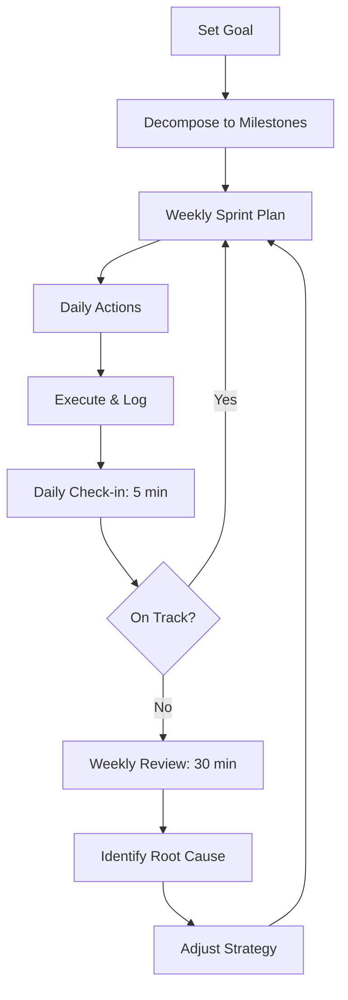

# Chapter 1: Your Learning OS

## Learning Objectives

After this chapter you will be able to:
- Design a personal learning system using the OODA loop that works for any goal
- Decompose any large goal into milestones, sprints, and daily actions
- Build feedback loops to measure progress and course-correct before it's too late
- Identify your VARK learning style and choose tools that match it
- Distinguish between learning tactics (what you do) and your learning system (how you decide what to do)

## Theory

### The OODA Loop Applied to Learning

The OODA loop (Observe, Orient, Decide, Act) was developed by military strategist John Boyd for fighter pilots who needed to make life-or-death decisions in seconds. It works just as well for learning.

Most people only do two steps: they Observe (watch a tutorial, read a book) and Act (try to code). They skip Orient (analyzing what they actually need to learn) and Decide (choosing the best next step based on evidence). This is why tutorial hell exists.

### Learning Styles: Know How You Learn Best

Not everyone learns the same way. The **VARK model** identifies four primary learning styles:
- **Visual** learners prefer diagrams, charts, mind maps, and color-coded notes
- **Auditory** learners prefer listening to lectures, discussions, and verbal explanations
- **Read/Write** learners prefer textbooks, articles, lists, and writing summaries
- **Kinesthetic** learners prefer hands-on practice, experiments, and real-world examples

Take a free VARK questionnaire online (vark-learn.com) to identify your dominant style. Once you know it, choose study methods that match — a Visual learner studying UPSC history should draw timelines and mind maps, while a Kinesthetic learner solving SSC quant should jump straight into practice problems. Using your style's methods makes learning more efficient and less frustrating.



The full OODA cycle for learning:

**Observe:** Track your current state. What did you study today? How much do you remember from last week? What's your current mock interview score? Use objective data, not feelings.

**Orient:** Analyze the gap between where you are and where you need to be. Which patterns are you weak in? Which concepts keep tripping you up? This step requires honesty — most people skip it because it's uncomfortable.

**Decide:** Choose ONE thing to focus on next. Not three things. Not "I'll study more." A specific action: "I will solve 5 medium Two Pointer problems this week and review them with spaced repetition."

**Act:** Execute the decision. Do the work. Log the results. Then loop back to Observe.

### Goal Decomposition Framework

Big goals fail because they're too abstract. "Crack FAANG" is not actionable. Here's the decomposition chain:

- **Vision (12-24 months):** "Become a staff-level AI/ML engineer at a top tech company"
- **Big Goal (6-12 months):** "Get hired as an AI/ML Engineer at Google/Microsoft/Amazon"
- **Milestones (3 months):** "Complete DSA mastery, build 3 ML portfolio projects, do 10 mock interviews"
- **Sprints (1 month):** "Master 5 DSA patterns, build 1 end-to-end ML project, do 3 mocks"
- **Weekly Goals:** "Solve 15 medium DSA problems, implement a Transformer from scratch, do 1 mock"
- **Daily Actions:** "Solve 3 DSA problems, write 50 lines of PyTorch, review 20 Anki cards"

If you can't write down today's 3 most important actions, your goal is too abstract.

### Feedback Loops

Learning without feedback is guessing. You need three loops running at all times:

| Loop | Cadence | Duration | Purpose |
|------|---------|----------|---------|
| Daily check-in | End of each study day | 5 min | Spot problems before they compound |
| Weekly review | Sunday | 30 min | Adjust strategy, celebrate wins |
| Monthly retrospective | Last day of month | 1 hr | Big picture: am I on track? |

**Daily check-in template:**
- What did I learn today? (1 sentence)
- What confused me? (1 sentence)
- What's my top priority tomorrow? (1 sentence)
- Focus rating (1-5)
- Energy rating (1-5)

**Weekly review template:**
- 3 wins this week
- 3 challenges this week
- Metrics: problems solved, hours studied, mock scores
- What's working? What's not?
- Next week's top 3 priorities

### The Learning Stack

Your learning happens across four layers. Weakness in any layer breaks the whole system:

```
Layer 4: Mindset      ← Growth mindset, curiosity, resilience
Layer 3: Techniques   ← Active recall, Feynman, Pomodoro, interleaving
Layer 2: Systems      ← Review schedule, learning dashboard, daily logs
Layer 1: Environment  ← Workspace, tools, phone management, noise control
```

Most people start at Layer 3 (techniques) and wonder why they fail. Fix Layer 1 first: your environment. If your phone is in the room, you'll check it. If your desk is messy, you'll clean it instead of studying. Environment is the foundation.

### Common Anti-Patterns
### Environmental Setup Checklist

Before implementing any learning technique, fix your environment:

- **Desk:** Clear everything except your laptop, water, and a notebook
- **Phone:** In another room or a drawer. Not face-down on the desk
- **Browser:** One tab. Use extensions that block distracting sites
- **Notifications:** All off. Only allow calls from emergency contacts
- **Noise:** Quiet space or noise-cancelling headphones. No music with lyrics
- **Lighting:** Natural light if possible. Warm light in evening
- **Temperature:** Cooler is better for focus (68-72F / 20-22C)
- **Water:** Full glass before starting

Spend one hour setting up your environment. This one-time investment pays dividends every single study session.

### Your First 7 Days

If you're starting from zero, here's your exact first week:

**Day 1:** Define one learning goal. Write it down.
**Day 2:** Decompose the goal into 3 milestones. Set the first weekly sprint.
**Day 3:** Set up your environment using the checklist above.
**Day 4:** Start a daily log. Log today's session.
**Day 5:** Study for 30 minutes. Log it.
**Day 6:** Study for 30 minutes. Log it.
**Day 7:** Run your first weekly review. Celebrate completing week 1.

After 7 days, you have a working learning OS. From here, add techniques one at a time (Chapters 2-12).


| Anti-Pattern | Symptom | Fix |
|-------------|---------|-----|
| Tutorial hell | Hours of videos, zero code written | Close the video. Open your editor. Now. |
| Tool fetishism | More time organizing than learning | Use a text file. No fancy tools until you have a habit. |
| Shiny object syndrome | Switching topics every week | Pick one topic. Stay with it for 30 days minimum. |
| Perfectionism | Not starting because you can't do it perfectly | Done is better than perfect. Start ugly. |
| Comparison trap | Measuring against 5-year veterans | Your only comparison is you yesterday. |

## Examples

### 📝 Plain-Language Walkthrough

**Scenario:** You want to master a subject (SSC quant, a new programming language, or UPSC history) in 3 months.

**Step 1: Define Your Goal**
Write down your goal on paper. Example: "Score 180+ in SSC CGL Tier 1 Quantitative Aptitude" or "Build and deploy a full-stack app in React."

**Step 2: Decompose into Milestones**
Break the goal into 4-6 milestones. For SSC quant: Number System → Algebra → Geometry → Mensuration → Data Interpretation → Mixed Practice.

**Step 3: Build Your OODA Loop**
- Observe: Take a diagnostic test. Identify weak areas.
- Orient: Map prerequisites for each weak area. What do you need to learn first?
- Decide: Pick ONE topic for this week's sprint.
- Act: Study 45 min daily, test 15 min daily.

**Step 4: Set Up Feedback**
- Daily: Rate each study session (focus 1-5, understanding 1-5)
- Weekly: Review what stuck, what didn't. Adjust next week's plan.
- Monthly: Take a full diagnostic. Compare with baseline.

---

### 💻 TypeScript Implementation (Optional)

### Example 1: Goal Decomposer

```typescript
interface Milestone {
    title: string
    deadline: Date
    sprints: Sprint[]
}

interface Sprint {
    title: string
    weeks: number
    weeklyGoals: string[]
    dailyActions: string[]
}

class GoalDecomposer {
    decompose(
        bigGoal: string,
        monthsToDeadline: number
    ): { vision: string; milestones: Milestone[] } {
        const milestones: Milestone[] = []

        const phases = Math.ceil(monthsToDeadline / 3)
        for (let i = 0; i < phases; i++) {
            milestones.push({
                title: `Phase ${i + 1}: Foundation & Core`,
                deadline: new Date(Date.now() + (i + 1) * 90 * 86400000),
                sprints: this.generateSprints(3)
            })
        }

        return { vision: bigGoal, milestones }
    }

    private generateSprints(count: number): Sprint[] {
        return Array.from({ length: count }, (_, i) => ({
            title: `Sprint ${i + 1}`,
            weeks: 4,
            weeklyGoals: [],
            dailyActions: []
        }))
    }
}
```

### Example 2: Daily Log

```typescript
interface LogEntry {
    date: string
    topicsStudied: string[]
    hoursSpent: number
    focusRating: 1 | 2 | 3 | 4 | 5
    energyRating: 1 | 2 | 3 | 4 | 5
    confusion: string
    tomorrowPriority: string
}

class DailyLog {
    private entries: LogEntry[] = []

    log(entry: LogEntry): void {
        this.entries.push(entry)
    }

    getWeeklySummary(): WeeklySummary {
        const week = this.entries.slice(-7)
        return {
            totalHours: week.reduce((s, e) => s + e.hoursSpent, 0),
            avgFocus: week.reduce((s, e) => s + e.focusRating, 0) / week.length,
            avgEnergy: week.reduce((s, e) => s + e.energyRating, 0) / week.length,
            commonConfusions: this.findCommonConfusions(week)
        }
    }

    private findCommonConfusions(entries: LogEntry[]): string[] {
        const topics = entries.flatMap(e => e.topicsStudied)
        return [...new Set(topics)].filter(
            t => entries.filter(e => e.topicsStudied.includes(t)).length >= 3
        )
    }
}

interface WeeklySummary {
    totalHours: number
    avgFocus: number
    avgEnergy: number
    commonConfusions: string[]
}
```

### Example 3: Learning OS Orchestrator

```typescript
class LearningOS {
    private goalDecomposer = new GoalDecomposer()
    private dailyLog = new DailyLog()

    startGoal(goal: string, months: number): void {
        const plan = this.goalDecomposer.decompose(goal, months)
        console.log(`Goal: ${plan.vision}`)
        console.log(`Milestones: ${plan.milestones.length} phases`)

        // Generate first sprint's daily actions
        const firstSprint = plan.milestones[0].sprints[0]
        console.log(`First sprint: ${firstSprint.title}`)
        console.log(`Daily actions to complete:`)
        firstSprint.dailyActions.forEach((a, i) => console.log(`  ${i + 1}. ${a}`))
    }

    weeklyReview(): void {
        const summary = this.dailyLog.getWeeklySummary()

        if (summary.avgFocus < 3) {
            console.log("Alert: Focus is low. Check your environment and sleep.")
        }
        if (summary.commonConfusions.length > 0) {
            console.log("Review needed for:", summary.commonConfusions.join(", "))
        }
        console.log(`Hours: ${summary.totalHours}, Focus: ${summary.avgFocus.toFixed(1)}`)
    }
}
```

## Summary

- A learning system (OODA loop) beats isolated techniques because it tells you what to do next
- Decompose big goals into milestones → sprints → weekly goals → daily actions
- Run feedback loops at three cadences: daily (5 min), weekly (30 min), monthly (1 hr)
- Choose the right tools and environment for YOUR learning style (VARK)
- Anti-patterns (tutorial hell, tool fetishism, comparison) will kill your progress if undetected

## Practical Takeaways

1. Write down one big learning goal and decompose it into today's top 3 actions
2. Set up a 5-minute daily check-in habit before you study anything else
3. Remove phone and distractions from your study area before your next session
4. Pick one anti-pattern you recognize in yourself and actively fight it this week
5. Build your learning OS incrementally — start with the daily log, add the weekly review after 7 days

### Common Questions About the Learning OS

**Q: How do I know if my learning system is working?**
A: You should see progress in your leading indicators (hours studied, problems attempted) within 1 week and lagging indicators (mock scores, retention) within 2-4 weeks. If both are flat after 4 weeks, change your approach.

**Q: What if I don't have a clear learning goal?**
A: Pick something small you want to learn in 7 days (a new Git command, a Python library, a design pattern). Use the system on that. After 7 days, you'll have a working system and a clearer idea of what you want to learn next.

**Q: Should I use this system for everything or just interview prep?**
A: Start with one goal (interview prep). Once the system is a habit, apply it to other areas. Trying to use it for everything at once leads to system overload.

### Tool Selection Guide

You don't need many tools. In fact, too many tools will slow you down. Here's the minimum set:

**Essential (start here):**
- A notebook or notes app for your learning log
- A calendar for scheduling study blocks
- Anki (free) for spaced repetition (Chapter 4)

**Nice to have (add later):**
- VS Code or Cursor for coding
- Obsidian or Notion for knowledge management (Chapter 11)
- A timer app for Pomodoro (or use your phone's timer)

**Avoid until you need them:**
- Complex project management tools (Jira, Linear, Notion databases)
- Habit tracking apps (a simple checkbox works better)
- AI note-taking tools that summarize for you (write your own summaries — that's the learning)

**Rule:** If setting up a tool takes longer than using it, don't use the tool.

### Decision Framework: When to Persist vs When to Pivot

One of the hardest skills in learning is knowing when to push through difficulty versus when to change your approach.

**Persist (keep going) when:**
- You've been studying for less than 2 weeks
- You understand the concepts but can't apply them yet (this is normal — it's the competence cliff)
- Your metrics show you're putting in consistent hours
- You're frustrated but still curious about the topic

**Pivot (change approach) when:**
- You've spent 2+ weeks making zero progress despite consistent effort
- You're bored or dreading study sessions consistently
- You've tried 3 different resources and none of them help
- Your metrics show stagnant scores across 3+ mock attempts

**How to pivot:**
1. Change your input: if you've been reading, try a video course. If you've been coding solo, join a pair programming session
2. Change your method: if you've been studying theory, build something. If you've been building, study theory
3. Change your pace: if you've been rushing, slow down and master fundamentals. If you've been stuck on basics, try a harder problem
4. Take a break: 1-3 days of zero study. Consolidate. Come back fresh

### Weekly Review Template

Copy this into your notes. Fill it out every Sunday.

```
Week of: ____________________

3 Wins:
1. ________________________________
2. ________________________________
3. ________________________________

3 Challenges:
1. ________________________________
2. ________________________________
3. ________________________________

Metrics:
- Total study hours: ____
- Problems solved: ____
- Focus rating (avg): ____
- Energy rating (avg): ____

Key insights about my learning:
- ________________________________
- ________________________________

Next week top 3 priorities:
1. ________________________________
2. ________________________________
3. ________________________________

One thing to stop doing: ________________________________
```


## Chapter Quiz

<details>
<summary>1. What does OODA stand for?</summary>
<p>Observe, Orient, Decide, Act. Developed by John Boyd for fighter pilots, applied to learning systems.</p>
</details>

<details>
<summary>2. What's the ideal cadence for a full OODA loop cycle in learning?</summary>
<p>Daily check-in (mini loop), weekly review (full loop), monthly retrospective (strategic loop). The weekly review is the most important — it's where you adjust your strategy.</p>
</details>

<details>
<summary>3. Which layer of the learning stack should you fix first?</summary>
<p>Layer 1: Environment. If your phone is in the room or your desk is cluttered, no technique will save you. Environment is the foundation everything else rests on.</p>
</details>

<details>
<summary>4. What's the first thing to check when you're off track?</summary>
<p>Your daily actions. Are you actually executing the actions you planned? Most people skip the "Act" step and jump back to "Observe" (watching more tutorials, reading more books).</p>
</details>

<details>
<summary>5. What's the difference between tutorial hell and deliberate practice?</summary>
<p>Tutorial hell is consuming without creating. Deliberate practice is attempting something just beyond your current ability, failing, and learning from the failure. If you haven't written code today, you're in tutorial hell.</p>
</details>

## Exercises

1. **VARK self-assessment:** Go to vark-learn.com and complete the questionnaire. Identify your dominant style. Then list 3 study methods you currently use — do they match your style? If not, rewrite them to fit. For example, if you're a Kinesthetic learner but you only read textbooks, add hands-on practice
2. **Goal decomposition on paper:** Take any goal (SSC rank, language fluency, FAANG prep, fitness). Write it at the top of a page. Below it, list 4 milestones. Below each milestone, write 3 weekly sprints. Below the first sprint, write today's 3 actions. No code needed — pen and paper
3. **Run a 7-day daily log:** For 7 days, at the end of each study session, write: (a) What I learned, (b) What confused me, (c) Tomorrow's priority. On day 7, review all entries. What patterns do you see?
4. **Implement a log tracker (TypeScript):** Using the DailyLog class, create a script that reads today's entry from user input and stores it. Add a feature to export the week's summary as a JSON file
5. **Build a learning OS CLI (TypeScript):** Implement the LearningOS class with startGoal and weeklyReview methods. Add a `suggestNextAction` method that recommends what to study next based on log patterns (lowest-rated topic = prioritize)
