# Chapter 3: Daily Workflow & Energy Management

## Learning Objectives

After this chapter you will be able to:
- Structure your study day around your natural energy patterns for maximum output
- Use Pomodoro variants for different task types (deep work, shallow work, creative work)
- Build a startup ritual that eliminates friction and makes starting automatic
- Conduct an effective evening review that sets up tomorrow's success
- Identify and eliminate your top 3 time-wasting patterns

## Theory

### Energy-Aware Scheduling

Your ability to focus is not constant throughout the day. Trying to do deep work in a low-energy window is like trying to run a marathon after a 20-hour flight. Work with your biology, not against it.



```mermaid
flowchart LR
    A[6:30 Wake] --> B[7:00 Deep Work Block 1]
    B --> C[8:50 Break: Walk + Water]
    C --> D[9:00 Deep Work Block 2]
    D --> E[10:50 Snack Break]
    E --> F[11:00 Review / Coding Practice]
    F --> G[12:30 Lunch + Rest]
    G --> H[14:00 Shallow Work: Admin, Review]
    H --> I[15:00 Break]
    I --> J[15:30 Practice Problems]
    J --> K[17:00 Study End]
    K --> L[21:00 Evening Review: 10 min]
```

**How to find your energy pattern:**
1. For 3 days, rate your energy every hour (1 = exhausted, 5 = peak)
2. Identify your high window (typically morning for most people), medium window, low window
3. Schedule accordingly:
   - **High energy** → Deep work (new concepts, hard problems, coding)
   - **Medium energy** → Practice (review, exercises, Anki)
   - **Low energy** → Shallow work (admin, organizing, planning)

Most people make the mistake of scheduling their hardest work in the evening (because that's when they have "free time") and wondering why they're not making progress.

### Pomodoro 2.0

The classic Pomodoro (25/5) is fine for shallow work, but modern tasks need different ratios:

| Task Type | Focus | Break | Best For |
|-----------|-------|-------|----------|
| Deep work | 50 min | 10 min | Learning new concepts, solving hard problems |
| Shallow work | 25 min | 5 min | Anki reviews, admin, organizing |
| Creative work | 90 min | 20 min | System design, architecture, writing |
| Practice | 30 min | 5 min | LeetCode, coding exercises |

The break is non-negotiable. During breaks: stand up, walk, hydrate, stretch. No screens. No checking email or social media. Your brain needs the break to consolidate what you just learned.

### The Startup Ritual

The hardest part of studying is starting. Your brain has a "default mode" that resists switching tasks. The startup ritual bridges this gap.

A 5-minute ritual before every study session:
1. Minute 1: Clear your desk. Remove everything except what you need
2. Minute 2: Open your materials. Have them ready before you sit down
3. Minute 3: Set a timer for your chosen Pomodoro length
4. Minute 4: Write one sentence: "In this session, I will accomplish X"
5. Minute 5: Take 3 deep breaths. Start the timer. Begin.

After 7 days, this becomes automatic. Your brain learns: startup ritual → time to focus.

### The Evening Review

Most people finish studying and move on with their day. They never close the loop. The evening review takes 10 minutes and doubles your retention.

**Template:**
1. What did I learn today? (1-2 sentences)
2. What confused me? (be specific)
3. What's my top priority tomorrow? (not 5 things — 1 thing)
4. Focus rating (1-5)
5. Energy rating (1-5)

This serves three purposes:
- **Consolidation:** Writing what you learned forces your brain to retrieve and organize
- **Gap detection:** "What confused me?" identifies weak spots before they compound
- **Momentum:** "Top priority tomorrow" means you start tomorrow with direction, not a blank page

### Time-Wasting Patterns to Eliminate
### Sample Daily Schedules

**Early bird (high energy 6-10 AM):**
```
6:30  Wake, hydrate, 10 min planning
7:00  Deep work block 1 (50 min) — hardest task
8:00  Break, walk, breakfast
9:00  Deep work block 2 (50 min) — second hardest
10:00 Snack break
10:30 Practice / review (30 min)
11:00 Shallow work (admin, organizing)
12:00 Lunch + rest
14:00 Light review (Anki, reading)
15:00 Exercise
16:00 Free time
21:00 Evening review (10 min)
22:00 Wind down
```

**Night owl (high energy 2-6 PM):**
```
7:00  Wake, light activity
8:00  Shallow work / review
9:00  Breakfast + plan
10:00 Light practice
12:00 Lunch
13:00 Deep work block 1 (50 min)
14:00 Break
15:00 Deep work block 2 (50 min)
16:00 Snack break
16:30 Practice / coding
18:00 Dinner
19:00 Light review
21:00 Evening review (10 min)
23:00 Wind down
```

### Weekly Planning Template

Every Sunday, spend 15 minutes planning your week:

```
Week of: ____________________

Top 3 priorities:
1. ______________________________
2. ______________________________
3. ______________________________

Monday schedule:
- [Time] _____ : ___________________
- [Time] _____ : ___________________
- Evening review ☐

Tuesday schedule:
- [Time] _____ : ___________________
- [Time] _____ : ___________________
- Evening review ☐

[Repeat for each day]

Distractions to eliminate:
- ______________________________
- ______________________________

Energy audit this week? ☐ (Do this week 1 only)
```


| Pattern | The Fix |
|---------|---------|
| Phone checking | Phone in another room during study blocks |
| Tab hoarding | One tab per session. Close everything else |
| Perfectionist reading | Read until you can explain it. Then stop. Don't re-read |
| Tool organization | If it takes longer to set up than to do, do it manually |
| Friction avoidance | If starting feels hard, shrink the task: "I'll just do 5 minutes" |

## Examples

### Example 1: Energy-Aware Scheduler

```typescript
type EnergyLevel = 'high' | 'medium' | 'low'
type TaskType = 'deep' | 'shallow' | 'creative' | 'practice'

interface TimeBlock {
    start: string
    end: string
    energy: EnergyLevel
    taskType: TaskType
    description: string
}

class EnergyAwareScheduler {
    schedule(energyLogs: { hour: number; level: EnergyLevel }[]): TimeBlock[] {
        const high = energyLogs.filter(e => e.level === 'high')
        const medium = energyLogs.filter(e => e.level === 'medium')
        const low = energyLogs.filter(e => e.level === 'low')

        const blocks: TimeBlock[] = []

        // Schedule deep work in high-energy windows
        high.slice(0, 2).forEach(h => {
            blocks.push({
                start: `${h.hour}:00`,
                end: `${h.hour + 1}:50`,
                energy: 'high',
                taskType: 'deep',
                description: 'Deep work: new concepts, hard problems'
            })
        })

        // Schedule practice in medium-energy windows
        medium.slice(0, 2).forEach(h => {
            blocks.push({
                start: `${h.hour}:00`,
                end: `${h.hour}:30`,
                energy: 'medium',
                taskType: 'practice',
                description: 'Practice: LeetCode, exercises'
            })
        })

        // Schedule review in low-energy windows
        low.slice(0, 1).forEach(h => {
            blocks.push({
                start: `${h.hour}:00`,
                end: `${h.hour}:25`,
                energy: 'low',
                taskType: 'shallow',
                description: 'Review: Anki, admin, planning'
            })
        })

        return blocks
    }

    optimize(blocks: TimeBlock[], currentEnergy: EnergyLevel): TimeBlock[] {
        return blocks.map(b => {
            if (b.energy === 'high' && currentEnergy === 'low') {
                return { ...b, taskType: 'shallow', description: 'Adjusted: review instead of deep work' }
            }
            return b
        })
    }
}
```

### Example 2: Pomodoro Timer with Multiple Modes

```typescript
type SessionMode = 'deep' | 'shallow' | 'creative' | 'practice'

interface SessionConfig {
    focus: number  // minutes
    break: number  // minutes
}

class PomodoroTimer {
    private readonly configs: Record<SessionMode, SessionConfig> = {
        deep: { focus: 50, break: 10 },
        shallow: { focus: 25, break: 5 },
        creative: { focus: 90, break: 20 },
        practice: { focus: 30, break: 5 }
    }

    private currentSession: { mode: SessionMode; remaining: number } | null = null

    start(mode: SessionMode): void {
        const config = this.configs[mode]
        this.currentSession = { mode, remaining: config.focus * 60 }
        console.log(`Starting ${mode} session: ${config.focus} min focus, ${config.break} min break`)
        console.log(`Startup ritual: clear desk → open materials → set timer → write goal → breathe`)
    }

    tick(): number {
        if (!this.currentSession) return 0
        this.currentSession.remaining--
        return this.currentSession.remaining
    }

    getRemaining(): number {
        return this.currentSession?.remaining ?? 0
    }

    breakTime(): number {
        if (!this.currentSession) return 0
        return this.configs[this.currentSession.mode].break
    }
}
```

### Example 3: Evening Review

```typescript
interface ReviewEntry {
    date: string
    learned: string
    confusion: string
    topPriority: string
    focusRating: 1 | 2 | 3 | 4 | 5
    energyRating: 1 | 2 | 3 | 4 | 5
}

class EveningReview {
    private history: ReviewEntry[] = []

    log(entry: ReviewEntry): void {
        this.history.push(entry)
        console.log(`Logged: ${entry.date} — ${entry.learned.slice(0, 50)}...`)
    }

    getWeekReview(): WeekReview {
        const week = this.history.slice(-7)
        return {
            daysTracked: week.length,
            avgFocus: week.reduce((s, e) => s + e.focusRating, 0) / week.length,
            avgEnergy: week.reduce((s, e) => s + e.energyRating, 0) / week.length,
            topConfusions: this.topFrequencies(week.map(e => e.confusion), 3),
            topPrioritiesAccomplished: this.calculateAccomplishmentRate(week)
        }
    }

    private topFrequencies(items: string[], count: number): string[] {
        const freq = new Map<string, number>()
        items.forEach(i => freq.set(i, (freq.get(i) ?? 0) + 1))
        return [...freq.entries()]
            .sort((a, b) => b[1] - a[1])
            .slice(0, count)
            .map(([item]) => item)
    }

    private calculateAccomplishmentRate(week: ReviewEntry[]): number {
        return week.length > 0 ? week.filter(e => e.topPriority.length > 0).length / week.length : 0
    }
}

interface WeekReview {
    daysTracked: number
    avgFocus: number
    avgEnergy: number
    topConfusions: string[]
    topPrioritiesAccomplished: number
}
```

## Summary

- Your energy varies throughout the day. Track it for 3 days, then schedule deep work in high-energy windows
- Use the right Pomodoro variant for the task: 50/10 for deep work, 25/5 for shallow, 90/20 for creative
- The 5-minute startup ritual eliminates friction and makes starting automatic
- The 10-minute evening review doubles retention by closing the OODA loop daily
- Eliminate one time-wasting pattern per week (phone checking, tab hoarding, perfectionist reading)

## Practical Takeaways

1. Track your energy every hour for 3 days starting tomorrow — identify your high/medium/low windows
2. Create your ideal daily schedule template based on your energy pattern
3. Do the 5-minute startup ritual before every study session for the next 7 days
4. Complete an evening review for 7 consecutive days (it takes 10 minutes)
5. Identify your top 3 time-wasting patterns and eliminate one this week

### Energy Tracking Sheet

Print this or copy it. Track every hour for 3 days.

```
Hour    | Day 1 | Day 2 | Day 3
--------|-------|-------|-------
6 AM    |       |       |
7 AM    |       |       |
8 AM    |       |       |
9 AM    |       |       |
10 AM   |       |       |
11 AM   |       |       |
12 PM   |       |       |
1 PM    |       |       |
2 PM    |       |       |
3 PM    |       |       |
4 PM    |       |       |
5 PM    |       |       |
6 PM    |       |       |
7 PM    |       |       |
8 PM    |       |       |
9 PM    |       |       |
10 PM   |       |       |
--------|-------|-------|-------
Key: 1=exhausted, 2=tired, 3=okay, 4=good, 5=peak
```

After 3 days:
- High energy window (consistently 4-5): ____
- Medium energy window (consistently 3): ____
- Low energy window (consistently 1-2): ____


## Chapter Quiz

<details>
<summary>1. What's the recommended Pomodoro length for deep work?</summary>
<p>50 minutes focus, 10 minutes break. Deep work requires extended concentration — 25 minutes is too short to enter flow. Save 25/5 for shallow tasks like Anki reviews or email.</p>
</details>

<details>
<summary>2. How long should you track your energy levels before scheduling?</summary>
<p>3 days. Track every hour (1-5 scale). After 3 days, you'll clearly see your high/medium/low windows. Most people find their high window is 2-4 hours after waking.</p>
</details>

<details>
<summary>3. What's the purpose of the startup ritual?</summary>
<p>To bridge the gap between intention and action. The first minute is always the hardest. The 5-minute ritual (clear → open → timer → goal → breathe) makes starting automatic after 7 days of repetition.</p>
</details>

<details>
<summary>4. What are the 5 components of the evening review?</summary>
<p>What I learned (1-2 sentences), What confused me (specific), Top priority for tomorrow (1 thing), Focus rating (1-5), Energy rating (1-5). Total time: 10 minutes.</p>
</details>

<details>
<summary>5. What's the most common mistake in daily scheduling?</summary>
<p>Scheduling deep work in low-energy windows (usually evening for most people). Deep work belongs in your high-energy window. If your high window is morning but you study at night, your schedule is fighting your biology.</p>
</details>

## Exercises

1. **Energy audit:** Track your energy every hour for the next 3 days. Use the EnergyAwareScheduler to identify your high, medium, and low windows
2. **Create your schedule:** Based on your energy audit, create an ideal daily schedule template with specific time blocks for deep work, practice, and review
3. **Startup ritual:** Implement the 5-minute startup ritual before every study session for 7 days. After 7 days, reflect: did starting get easier?
4. **Evening review streak:** Log an evening review for 7 consecutive days using the EveningReview class. At day 7, run getWeekReview() and identify your top confusion
5. **Eliminate one pattern:** Identify your biggest time-wasting pattern (phone checking, tab hoarding, etc.) and eliminate it for 5 days. Log the hours saved
