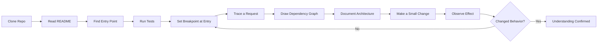

# Chapter 6: Learning From Code

## Learning Objectives

After this chapter you will be able to:
- Apply the read-run-debug-modify cycle to understand any new codebase
- Reverse-engineer a project's architecture by tracing a request end-to-end
- Use documentation efficiently without getting stuck in tutorial hell
- Learn any new framework by building the same app 3 times
- Extract patterns from high-quality open-source code

## Theory

### The Read-Run-Debug-Modify Cycle

This is the fundamental unit of learning from code. Apply it to every new codebase, library, or framework you encounter.



**Step 1: Read (15 min)**
- Find the entry point (index.ts, main.py, package.json main field)
- Read the README (what does this project do? how do I run it?)
- Identify the high-level structure (src/, tests/, config/)

**Step 2: Run (5 min)**
- Get the project running locally
- Run the test suite — passing tests confirm your setup is correct
- Execute the main functionality

**Step 3: Debug (20 min)**
- Set a breakpoint at the entry point
- Trace one request/feature end-to-end
- Understand: input → transformation → output
- See which functions call which

**Step 4: Modify (20 min)**
- Change something small (a log message, a return value, a color)
- Observe the effect
- If you predicted the change correctly, you understand the code
- If you didn't, debug again

### Reverse Engineering a Codebase

When approaching an unfamiliar codebase, follow this systematic process:

1. **Find the entry point:** In TypeScript/Node projects, check package.json for "main" or "bin". In Python, check setup.py or the main module. In frameworks, check the router/index file
2. **Trace a single request:** Pick one feature. Set a breakpoint at the entry point. Step through every function call until you reach the response. Draw the call stack
3. **Draw the dependency graph:** Which files import what? Identify core modules vs utilities vs configuration. A project with good separation will have a clear core with dependencies flowing inward
4. **Identify the data flow:** Input (API request, CLI args, file) → Transformation (business logic, processing) → Output (response, file write, database save). Document each step
5. **Document in your own words:** Write a 200-word summary of the architecture. If you can't explain it simply, you don't understand it yet

### Documentation Strategy

Most developers read documentation wrong. They start at the beginning and read linearly. This is inefficient.

| Source | How to Read | Purpose |
|--------|-------------|---------|
| README | First, always | What, why, how to start |
| Getting Started | Follow exactly | Set up and run |
| API Reference | Search, don't read | Dictionary for lookups |
| Tutorials | One per feature | Guided practice |
| Source code | When docs fail | Ultimate truth |
| Tests | Before modifying | Expected behavior |

**Rule:** Read just enough to accomplish your next task. Don't read the entire documentation before writing code. You'll forget most of it. Read → Code → Repeat.

### Framework Learning Blueprint

Build the same app 3 times with increasing complexity:

**Version 1 (Day 1): Hello World**
- One route or component
- Minimal setup
- Goal: get it running

**Version 2 (Day 3): CRUD**
- Full create/read/update/delete
- Database integration
- Goal: understand the core patterns

**Version 3 (Day 7): Production Patterns**
- Authentication or authorization
- Error handling
- Testing
- Goal: understand real-world usage

Example: Learning a new Node.js framework (Express → Fastify → Hono)?

- V1: Hello World route
- V2: Todo API with SQLite
- V3: Add JWT auth, input validation, and tests

### Learning From Open Source
### Code Reading Workout Plan

Treat code reading like a gym workout. Do this weekly:

**Monday — Read:**
- Pick a function from a well-known open-source project
- Read it. Understand every line. Look up any syntax you don't know
- Time: 30 min

**Wednesday — Trace:**
- Set breakpoints. Step through the function with sample inputs
- Document the output at each step
- Time: 30 min

**Friday — Modify:**
- Change the function's behavior in some way
- Predict what will happen. Run the tests. Did it match?
- Time: 30 min

**Saturday — Write:**
- Implement the same function from scratch without looking
- Compare with the original. What did you miss?
- Time: 30 min

### Common Code Learning Mistakes

| Mistake | Fix |
|---------|-----|
| Reading without running | Always run the code. Always. |
| Copy-pasting examples | Type every example manually. Muscle memory helps |
| Skipping documentation | Read the README. Always. It's there for a reason |
| Not using debugger | Breakpoints reveal what's actually happening |
| Learning in isolation | Compare your understanding with tests |
| Moving too fast | Master one function before moving to the next |
| Not taking notes | Write what you learned after every session |

### Project Ideas for Each Skill Level

**Beginner (V1 level):**
- Todo app (CLI version)
- Weather CLI tool (calls an API)
- Markdown file parser
- Personal bookmark manager

**Intermediate (V2 level):**
- Todo app with database and REST API
- URL shortener with redirect tracking
- Habit tracker with streak counting
- Blog engine with markdown support

**Advanced (V3 level):**
- Rate-limited API gateway
- Real-time chat application
- Key-value store with persistence
- Load-balanced web server


Studying production code is one of the fastest ways to improve:

- **Read PRs:** See how experienced developers review code. What do they catch? What patterns do they enforce?
- **Read tests:** Tests document expected behavior better than any README. Read the test file before reading the implementation
- **Read issues:** Common pitfalls, edge cases, and debugging techniques
- **Read the CHANGELOG:** Understand how the project evolved. Why was each change made?
- **Contribute:** Fix a typo in documentation. Then fix a small bug. Then add a small feature. Each contribution deepens your understanding

## Examples

### Example 1: Codebase Analyzer

```typescript
interface ModuleNode {
    path: string
    imports: string[]
    exports: string[]
    type: 'core' | 'test' | 'config' | 'util'
}

interface DependencyGraph {
    nodes: ModuleNode[]
    edges: { from: string; to: string }[]
}

class CodebaseAnalyzer {
    analyze(files: { path: string; content: string }[]): DependencyGraph {
        const nodes: ModuleNode[] = files.map(f => ({
            path: f.path,
            imports: this.extractImports(f.content),
            exports: this.extractExports(f.content),
            type: this.classifyModule(f.path)
        }))

        const edges: { from: string; to: string }[] = []
        nodes.forEach(node => {
            node.imports.forEach(imp => {
                const target = nodes.find(n => n.path.includes(imp))
                if (target) edges.push({ from: node.path, to: target.path })
            })
        })

        return { nodes, edges }
    }

    findEntryPoint(nodes: ModuleNode[]): ModuleNode | null {
        // Entry points are imported by nothing but export the main interfaces
        const candidates = nodes.filter(n =>
            n.type === 'core' && n.exports.length > 0
        )
        return candidates.find(c =>
            !nodes.some(n => n.imports.some(i => c.path.includes(i)))
        ) ?? candidates[0] ?? null
    }

    getDependencyDepth(node: ModuleNode, graph: DependencyGraph): number {
        const visited = new Set<string>()
        const dfs = (current: string, depth: number): number => {
            if (visited.has(current)) return depth
            visited.add(current)
            const deps = graph.edges.filter(e => e.from === current)
            if (deps.length === 0) return depth
            return Math.max(...deps.map(e => dfs(e.to, depth + 1)))
        }
        return dfs(node.path, 0)
    }

    private extractImports(content: string): string[] {
        const imports: string[] = []
        const regex = /from ['"]([^'"]+)['"]/g
        let match
        while ((match = regex.exec(content)) !== null) {
            imports.push(match[1])
        }
        return imports
    }

    private extractExports(content: string): string[] {
        const exports: string[] = []
        const regex = /export (?:default |const |function |class )(\w+)/g
        let match
        while ((match = regex.exec(content)) !== null) {
            exports.push(match[1])
        }
        return exports
    }

    private classifyModule(path: string): 'core' | 'test' | 'config' | 'util' {
        if (path.includes('.test.') || path.includes('.spec.')) return 'test'
        if (path.includes('config')) return 'config'
        if (path.includes('util') || path.includes('helper')) return 'util'
        return 'core'
    }
}
```

### Example 2: Request Tracer

```typescript
interface CallFrame {
    function: string
    file: string
    line: number
    args: unknown[]
    result?: unknown
}

class RequestTracer {
    private trace: CallFrame[] = []

    enter(functionName: string, file: string, line: number, args: unknown[]): void {
        this.trace.push({ function: functionName, file, line, args })
    }

    exit(result: unknown): void {
        const last = this.trace[this.trace.length - 1]
        if (last) last.result = result
    }

    getFullTrace(): CallFrame[] {
        return [...this.trace]
    }

    summarize(): TraceSummary {
        const uniqueFiles = [...new Set(this.trace.map(t => t.file))]
        const depth = this.trace.length

        return {
            totalCalls: depth,
            uniqueFiles,
            entryPoint: this.trace[0]?.function ?? 'unknown',
            lastCall: this.trace[depth - 1]?.function ?? 'unknown',
        }
    }
}

interface TraceSummary {
    totalCalls: number
    uniqueFiles: string[]
    entryPoint: string
    lastCall: string
}
```

### Example 3: Framework Learning Plan Generator

```typescript
interface FrameworkVersion {
    version: number
    name: string
    day: number
    features: string[]
    description: string
}

interface FrameworkLearningPlan {
    framework: string
    language: string
    versions: FrameworkVersion[]
}

class FrameworkLearningPlanGenerator {
    generate(framework: string, language: string): FrameworkLearningPlan {
        return {
            framework,
            language,
            versions: [
                {
                    version: 1,
                    name: 'Hello World',
                    day: 1,
                    features: ['Single route or component', 'Return static response'],
                    description: 'Get the framework running. Minimal setup. Verify dev server works.'
                },
                {
                    version: 2,
                    name: 'CRUD API',
                    day: 3,
                    features: [
                        'Full create/read/update/delete operations',
                        `Database integration (SQLite for ${language})`,
                        'Input validation',
                        'Error handling for 404 and 400'
                    ],
                    description: 'Build a complete Todo API. Understand routing, database, and request lifecycle.'
                },
                {
                    version: 3,
                    name: 'Production Patterns',
                    day: 7,
                    features: [
                        'Authentication (JWT)',
                        'Middleware for logging and auth',
                        'Unit and integration tests',
                        'Environment configuration',
                        'Rate limiting'
                    ],
                    description: 'Add production patterns. Deploy to a cloud platform for bonus points.'
                }
            ]
        }
    }
}
```

## Summary

- The read-run-debug-modify cycle is the fundamental unit of learning from code
- Reverse-engineer codebases by tracing one request end-to-end and drawing the dependency graph
- Read documentation strategically: README → Getting Started → Tests → API Reference
- Learn any framework by building the same app 3 times (Hello World → CRUD → Production)
- Study open-source code: read PRs, tests, issues, and the CHANGELOG

## Practical Takeaways

1. Before writing any code in a new project, trace one existing feature end-to-end with a debugger
2. Read the test file before reading the implementation — tests document expected behavior
3. Spend 15 minutes max on documentation before writing code. Read → Code → Repeat
4. Build every new framework app 3 times: V1 (Hello World), V2 (CRUD), V3 (Production)
5. Contribute one small fix (doc typo, small bug) to an open-source project you use

## Chapter Quiz

<details>
<summary>1. What are the 4 steps of the read-run-debug-modify cycle?</summary>
<p>Read (15 min — entry point, README, structure), Run (5 min — verify it works), Debug (20 min — trace a request end-to-end), Modify (20 min — change something and observe the effect).</p>
</details>

<details>
<summary>2. Where should you find the entry point of a TypeScript project?</summary>
<p>Check package.json for the "main" or "bin" field. If the project uses a framework, check the router or index file (typically src/index.ts or src/app.ts).</p>
</details>

<details>
<summary>3. What's the first thing to read when approaching a new codebase?</summary>
<p>The README. It should tell you what the project does, how to run it, and the high-level architecture. If the README is unclear, check the tests — they document expected behavior.</p>
</details>

<details>
<summary>4. How many times should you build the same app to learn a framework?</summary>
<p>3 times. V1 (Day 1): Hello World, get it running. V2 (Day 3): CRUD with database. V3 (Day 7): Production patterns (auth, testing, error handling). Each iteration adds one layer of complexity.</p>
</details>

<details>
<summary>5. What's the most reliable documentation when the official docs are unclear?</summary>
<p>The source code. Specifically the tests — they document expected behavior better than any README. Read the test file before reading the implementation to understand what the code should do.</p>
</details>

## Exercises

1. **Trace a project:** Clone an open-source TypeScript project (< 10K files). Use the CodebaseAnalyzer to build a dependency graph. Identify the entry point
2. **Trace a request:** Use the RequestTracer pattern. Set breakpoints and trace one API endpoint or CLI command end-to-end. Document the call stack
3. **Framework V1:** Pick a framework you want to learn. Build V1 (Hello World) in under 30 minutes
4. **Framework V2:** Same framework. Build V2 (CRUD Todo API) with database integration. Time yourself
5. **Open-source contribution:** Find an open-source project you use. Read 3 open PRs to understand the review process. Fix a documentation typo or small bug
