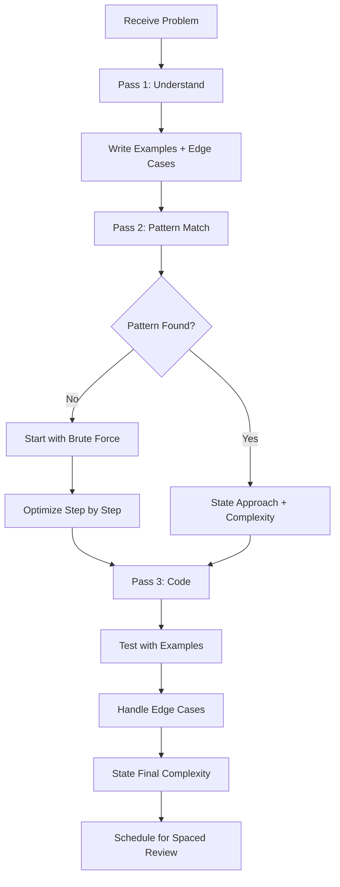

# Chapter 7: Practice System for Mastery

## Learning Objectives

After this chapter you will be able to:
- Design a deliberate practice plan for any subject — math, reasoning, GK, vocabulary, coding
- Use the 3-pass method (Understand → Attempt → Analyze) for any problem type
- Build a spaced review schedule that prevents forgetting
- Track your accuracy and speed on practice problems
- Identify weak areas and target them systematically

## Theory

### The 3-Pass Method

Every practice problem — whether in math, reasoning, vocabulary, or coding — follows the same process. Do not skip passes — especially Pass 1.



**Pass 1: Understand (5 minutes)**

Most people fail because they start coding before they understand the problem. Force yourself to:
- Restate the problem in your own words
- Write 2-3 examples with input and expected output
- Identify edge cases: empty input, single element, duplicates, negatives, max constraints
- Ask clarifying questions: "Can I assume the input is sorted?" "What should I return if no solution exists?"

**Pass 2: Brainstorm (10 minutes)**

- State the brute force approach first (even if obvious). This proves you can find a solution
- Analyze the brute force complexity
- Identify which pattern matches: Is it asking for a contiguous subarray? Two pointers. Is it a shortest path? BFS
- Propose the optimized approach with complexity analysis
- Get buy-in from the interviewer before coding

**Pass 3: Code (15-20 minutes)**

- Write clean code with meaningful variable names
- Explain as you type — narrate your reasoning
- Test with your examples after writing
- Handle edge cases explicitly
- State final time and space complexity

### Pattern Recognition System

These 8 patterns cover 90% of coding interview problems:

| Pattern | When to Use | Common Problems |
|---------|-------------|----------------|
| Arrays & Hashing | Need fast lookup, frequency counting, or duplicate detection | Two Sum, Group Anagrams, Top K Frequent |
| Two Pointers | Sorted array, palindrome, or need to find a pair | Valid Palindrome, Container With Most Water |
| Sliding Window | Contiguous subarray/substring with a condition | Longest Substring Without Repeating, Minimum Window |
| Binary Search | Sorted array, or need to find a boundary | Search Rotated Array, Find First/Last Position |
| BFS/DFS | Tree traversal, graph connectivity, shortest path (unweighted) | Level Order Traversal, Number of Islands |
| Dynamic Programming | Overlapping subproblems, optimal substructure | Climbing Stairs, Coin Change, LCS |
| Backtracking | Generate all possibilities, combinatorial search | Subsets, Permutations, N-Queens |
| Greedy | Local optimum leads to global optimum | Jump Game, Interval Scheduling |

**How to identify the pattern:**
- "Longest/shortest contiguous" → Sliding Window
- "Find a pair/triplet" → Two Pointers or Hash Map
- "Count ways/min cost/max value" → DP
- "All combinations/permutations" → Backtracking
- "Sorted" + "search" → Binary Search
- "Shortest path" → BFS
- "Local decision leads to global" → Greedy

### Difficulty Progression

| Phase | Difficulty | Problems per Pattern | Goal |
|-------|-----------|---------------------|------|
| Learn | Easy | 10 | Understand the pattern. Can solve with hints |
| Practice | Medium | 20 | Apply pattern in different contexts. No hints |
| Master | Hard | 5 | Combine patterns. Optimize aggressively |
| Maintain | Mixed | 5/week | Spaced review. Re-solve without looking |

Move to the next difficulty level when you can solve 3 consecutive problems at the current level without hints and within time.

### Spaced Review for DSA

Solving a problem once is not enough. You need to re-solve it at increasing intervals:

```
Solve → Next day → 3 days → 7 days → 30 days
```

At each review, re-solve without looking at your previous solution:
- If you can solve in under 15 minutes, check it off
- If you struggle or use hints, add it back to the new queue
- If you can't solve at all, study the pattern and add 3 more similar problems

### Interview Simulation Protocol

Before your real interview, simulate the conditions:

1. **Set a timer:** 20 min for Easy, 35 min for Medium, 45 min for Hard
2. **Plain editor:** No autocomplete, no syntax highlighting, no AI
3. **Talk out loud:** Narrate your thought process as if the interviewer is in the room
4. **Record yourself:** Watch the recording. Did you communicate clearly? Did you get stuck silently?
5. **Grade yourself:** Correctness (passes all test cases), Speed (within time), Communication (clear narration), Edge cases (handled)

## Examples

### 📝 Plain-Language Walkthrough

**Scenario:** You're practicing Quantitative Aptitude for SSC CGL and want to improve from 15/25 to 22/25.

**Step 1: Diagnostic (2 hours)**
Take a full-length quant section. For each question, tag it:
- ✅ Correct + confident
- ✅ Correct + lucky guess
- ❌ Wrong + no idea
- ❌ Wrong + knew the concept

**Step 2: Categorize Errors**
```
Error Type           Count  Fix Strategy
Concept gap          3     Review theory + do 10 easy problems
Calculation mistake  5     Slow down. Verify each step. Do 5 speed drills
Time pressure        4      Practice timed sets. Reduce time per question by 10%
Read incorrectly     2     Underline key numbers. Re-read before solving
```

**Step 3: The 3-Pass Practice Method**
For each weak topic:
- Pass 1 (Understand): Review 2-3 solved examples. Explain each step aloud
- Pass 2 (Attempt): Solve 5 problems without looking at solutions. Time yourself
- Pass 3 (Analyze): For wrong answers, write why you got it wrong. Write the correct approach

**Step 4: Spaced Review Schedule**
Create review slots for past topics:
```
Day 1: New topic (e.g., Time & Work)
Day 2: New topic + review Day 1 (5 problems)
Day 4: Review Day 1 + Day 2 (3 problems each)
Day 7: Review all (5 random problems)
Day 14: Quick review (3 problems)
Day 30: Mastery check (10 problems, timed)
```

### 💻 TypeScript Implementation (Optional)

### Example 1: DSA Review Scheduler
interface DSAProblem {
    id: string
    title: string
    pattern: string
    difficulty: 'easy' | 'medium' | 'hard'
    url: string
    lastSolved: Date | null
    nextReview: Date | null
    reviewsCompleted: number
    status: 'new' | 'learning' | 'review' | 'mastered'
}

class DSAReviewScheduler {
    private problems: DSAProblem[] = []

    addProblem(problem: Omit<DSAProblem, 'id' | 'lastSolved' | 'nextReview' | 'reviewsCompleted' | 'status'>): void {
        this.problems.push({
            ...problem,
            id: crypto.randomUUID(),
            lastSolved: null,
            nextReview: new Date(),
            reviewsCompleted: 0,
            status: 'new'
        })
    }

    getProblemsForToday(): DSAProblem[] {
        const now = new Date()
        return this.problems.filter(p => p.nextReview && p.nextReview <= now)
    }

    recordAttempt(problemId: string, solved: boolean): void {
        const problem = this.problems.find(p => p.id === problemId)
        if (!problem) return

        const now = new Date()
        problem.lastSolved = now
        problem.reviewsCompleted++

        if (solved) {
            const intervals = [1, 3, 7, 30] // days
            const nextInterval = intervals[Math.min(problem.reviewsCompleted - 1, intervals.length - 1)]
            problem.nextReview = new Date(now.getTime() + nextInterval * 86400000)

            if (problem.reviewsCompleted >= intervals.length) {
                problem.status = 'mastered'
            } else {
                problem.status = 'review'
            }
        } else {
            // Failed: reset to new
            problem.nextReview = new Date(now.getTime() + 86400000) // tomorrow
            problem.status = 'learning'
        }
    }

    getWeakPatterns(): { pattern: string; score: number }[] {
        const patternStats = new Map<string, { solved: number; total: number }>()

        this.problems.forEach(p => {
            const stats = patternStats.get(p.pattern) ?? { solved: 0, total: 0 }
            stats.total++
            if (p.status === 'mastered') stats.solved++
            patternStats.set(p.pattern, stats)
        })

        return [...patternStats.entries()]
            .map(([pattern, stats]) => ({
                pattern,
                score: stats.total > 0 ? stats.solved / stats.total : 0
            }))
            .sort((a, b) => a.score - b.score)
    }

    getWeeklyPlan(weakPatternsCount: number = 3): DSAProblem[] {
        const weak = this.getWeakPatterns().slice(0, weakPatternsCount)
        const weakPatternNames = new Set(weak.map(w => w.pattern))

        return this.problems.filter(p =>
            weakPatternNames.has(p.pattern) &&
            p.status !== 'mastered'
        ).slice(0, 15) // 5 per weak pattern
    }
}
```

### Example 2: Interview Simulator

```typescript
interface SimulationResult {
    problemTitle: string
    difficulty: string
    timeSpent: number       // minutes
    passed: boolean
    score: SimulationScore
    notes: string
}

interface SimulationScore {
    correctness: 1 | 2 | 3 | 4 | 5
    speed: 1 | 2 | 3 | 4 | 5
    communication: 1 | 2 | 3 | 4 | 5
    edgeCases: 1 | 2 | 3 | 4 | 5
}

class InterviewSimulator {
    private results: SimulationResult[] = []

    runSimulation(
        problem: string,
        difficulty: string,
        timeLimit: number,
        solve: () => boolean
    ): SimulationResult {
        console.log(`Starting simulation: ${problem}`)
        console.log(`Time limit: ${timeLimit} min`)

        console.log("Pass 1: Understand the problem (5 min)")
        console.log("  - Restate in your own words")
        console.log("  - Write examples + edge cases")
        console.log("  - Ask clarifying questions")

        console.log("Pass 2: Brainstorm approach (10 min)")
        console.log("  - State brute force + complexity")
        console.log("  - Identify pattern")
        console.log("  - Propose optimized approach")
        console.log("  - Confirm with 'interviewer'")

        console.log("Pass 3: Code (remaining time)")
        console.log("  - Write clean code")
        console.log("  - Explain as you type")
        console.log("  - Test with examples")
        console.log("  - State final complexity")

        const startTime = Date.now()
        const passed = solve()
        const timeSpent = (Date.now() - startTime) / 60000

        const result: SimulationResult = {
            problemTitle: problem,
            difficulty,
            timeSpent,
            passed,
            score: this.calculateScore(timeSpent, timeLimit, passed),
            notes: ''
        }

        this.results.push(result)
        return result
    }

    private calculateScore(timeSpent: number, timeLimit: number, passed: boolean): SimulationScore {
        const timeRatio = timeSpent / timeLimit

        return {
            correctness: passed ? 5 : 2,
            speed: timeRatio <= 0.8 ? 5 : timeRatio <= 1.0 ? 4 : 2,
            communication: 3, // subjective — review recording
            edgeCases: passed ? 4 : 1
        }
    }

    getProgressReport(): ProgressReport {
        const recent = this.results.slice(-10)
        return {
            totalSimulations: this.results.length,
            passRate: this.results.filter(r => r.passed).length / this.results.length,
            avgCorrectness: recent.reduce((s, r) => s + r.score.correctness, 0) / recent.length,
            avgSpeed: recent.reduce((s, r) => s + r.score.speed, 0) / recent.length,
        }
    }
}

interface ProgressReport {
    totalSimulations: number
    passRate: number
    avgCorrectness: number
    avgSpeed: number
}
```

### Example 3: Pattern Identifier

```typescript
interface ProblemDescription {
    keywords: string[]
    constraints: string[]
    examples: { input: string; output: string }[]
}

class PatternIdentifier {
    identify(description: ProblemDescription): PatternMatch[] {
        const matches: PatternMatch[] = []

        const keywordPatterns: { pattern: string; keywords: string[] }[] = [
            { pattern: 'Arrays & Hashing', keywords: ['frequency', 'count', 'duplicate', 'unique', 'sum', 'map'] },
            { pattern: 'Two Pointers', keywords: ['sorted', 'pair', 'triplet', 'palindrome', 'sorted array'] },
            { pattern: 'Sliding Window', keywords: ['contiguous', 'subarray', 'substring', 'longest', 'shortest', 'window'] },
            { pattern: 'Binary Search', keywords: ['sorted', 'search', 'find', 'minimum', 'maximum', 'rotated'] },
            { pattern: 'BFS/DFS', keywords: ['tree', 'graph', 'island', 'path', 'connected', 'shortest'] },
            { pattern: 'Dynamic Programming', keywords: ['ways', 'maximum', 'minimum', 'subsequence', 'cost', 'optimal'] },
            { pattern: 'Backtracking', keywords: ['all', 'combinations', 'permutations', 'subsets', 'generate'] },
            { pattern: 'Greedy', keywords: ['minimum number of', 'maximum number of', 'schedule', 'interval'] },
        ]

        keywordPatterns.forEach(kp => {
            const matchedKeywords = description.keywords.filter(k =>
                kp.keywords.some(kw => k.toLowerCase().includes(kw))
            )

            if (matchedKeywords.length > 0) {
                matches.push({
                    pattern: kp.pattern,
                    confidence: matchedKeywords.length / kp.keywords.length,
                    matchedKeywords
                })
            }
        })

        return matches.sort((a, b) => b.confidence - a.confidence)
    }
}

interface PatternMatch {
    pattern: string
    confidence: number
    matchedKeywords: string[]
}
```

## Summary

- The 3-pass method (Understand → Brainstorm → Code) prevents the most common interview mistakes
- 8 core patterns cover 90% of coding problems. Learn to identify which pattern matches the problem before coding
- Progress through difficulty levels: Easy (10 per pattern) → Medium (20) → Hard (5)
- Spaced review prevents forgetting: solve → next day → 3 days → 7 days → 30 days
- Simulate interview conditions: timer, plain editor, talk out loud, record and review

## Practical Takeaways

1. Before coding any problem, write down the edge cases first. This alone prevents 50% of interview failures
2. If stuck for 5 minutes, go back to Pass 1. Most people get stuck because they didn't understand the problem
3. Pattern identification comes from volume. Solve 10 Easy problems per pattern before moving to Medium
4. Schedule re-solves at 1, 3, 7, and 30 days. If you can't re-solve, you didn't learn it
5. Record every mock interview. Watch the recording. Grade yourself honestly on correctness, speed, communication, and edge cases

## Chapter Quiz

<details>
<summary>1. How long should Pass 1 (understanding) take?</summary>
<p>5 minutes. Restate the problem, write examples with edge cases, ask clarifying questions. Do not skip this step even if the problem seems obvious. Most interview failures happen because the candidate didn't understand the problem.</p>
</details>

<details>
<summary>2. What's the first approach to try when you can't identify the pattern?</summary>
<p>Start with brute force. State it, analyze its complexity, then optimize step by step. Interviewers would rather see a working brute force than an elegant solution that doesn't work. You can optimize after you have something working.</p>
</details>

<details>
<summary>3. How many problems per pattern at the Easy difficulty?</summary>
<p>10 problems per pattern. At Easy difficulty, you're learning the pattern — not testing yourself. Use hints, look at solutions, understand the approach. Move to Medium when you can solve 3 Easy problems in a row without hints.</p>
</details>

<details>
<summary>4. What's the spaced review cadence after solving a problem?</summary>
<p>Re-solve the problem at: next day, 3 days, 7 days, and 30 days. At each review, re-solve from scratch without looking at your previous solution. If you can't solve it in under 15 minutes, add it back to the new queue.</p>
</details>

<details>
<summary>5. What should you do if you can't re-solve a problem at review time?</summary>
<p>Add it back to the new queue. If you couldn't re-solve it, you didn't learn it. Before re-solving, study the pattern by solving 3 similar problems. Then attempt the problem again.</p>
</details>

## Exercises

1. **Error categorization on paper:** Take any practice test (quant, reasoning, GK, or coding). For each wrong answer, categorize the error: concept gap, calculation mistake, time pressure, or misread. Count frequencies. Write a fix strategy for the top 2 error types
2. **3-pass method on any subject:** Pick a weak topic (e.g., Time & Work, Blood Relations, Vocabulary). Apply the 3-pass method: Understand (review 3 solved examples), Attempt (solve 5 problems timed), Analyze (write why each wrong answer was wrong). Repeat for 1 week
3. **Spaced review calendar:** Create a physical or digital calendar for the next 30 days. For each day, schedule: 1 new topic + review of past topics at 1/3/7/14/30 day intervals. Follow it for 2 weeks. Adjust intervals based on what you actually remember
4. **DSA Review Scheduler (TypeScript):** Implement the DSAReviewScheduler with your actual problem list. Run it for 7 days
5. **Interview Simulator (TypeScript):** Do one timed simulation per day for 5 days using the InterviewSimulator. Grade yourself honestly
