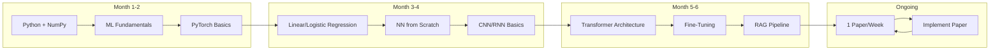

# Chapter 9: AI/ML Learning Strategy

## Learning Objectives

After this chapter you will be able to:
- Navigate the AI/ML learning stack from math fundamentals to production deployment
- Read research papers efficiently using the 3-pass hierarchical method
- Learn any ML framework by building the same model 3 times
- Stay current with the field without information overload
- Build a personal learning system for continuous AI education

## Theory

### The AI Learning Stack

AI/ML is not one skill — it's a stack of interconnected skills. Trying to learn everything at once leads to overwhelm. Learn layer by layer.



**Layer 1: Math (Just-in-time)**
Don't study math in isolation. Learn it when you need it:
- Need backpropagation? Learn derivatives (chain rule)
- Need attention? Learn matrix multiplication
- Need loss functions? Learn probability and information theory
- Need optimization? Learn gradient descent and its variants

**Layer 2: ML Fundamentals**
- Supervised learning: regression, classification, decision trees, ensemble methods
- Unsupervised learning: clustering, dimensionality reduction
- Evaluation: train/test split, cross-validation, metrics (accuracy, precision, recall, F1, AUC)
- Overfitting/underfitting: bias-variance tradeoff, regularization

**Layer 3: Frameworks**
- Start with PyTorch: low-level enough to understand what's happening, high-level enough to be practical
- Then TensorFlow/Keras: see how the same concepts are implemented differently
- Then JAX: functional programming approach for research

**Layer 4: Papers**
- Read 1 paper per week minimum
- Focus on the papers that matter for your goal
- Implement the key contribution to verify understanding

**Layer 5: Production**
- Model serving (TorchServe, TensorFlow Serving, Triton)
- A/B testing, monitoring, drift detection
- Feature stores, model registries, pipeline orchestration

### Paper Reading Workflow (3-Pass)

Most people read papers wrong — they start at the beginning and read linearly. Use the hierarchical approach instead:

**Pass 1 (5 min):**
- Read title, abstract, and figures
- Answer: What problem does this solve? What's the key insight? Is this relevant to me?
- Decision: Skip, skim, or read full

**Pass 2 (30 min):**
- Read introduction, method, and experiments
- Answer: How does the method work? What are the key results? How does it compare to baselines?
- Take notes on the approach and results

**Pass 3 (2+ hours):**
- Read the full paper in detail
- Reproduce the method or implement the key contribution
- Identify: What assumptions does this make? What's the limitation? What's the next step?

### Framework Learning Blueprint

Build the same model 3 times to learn any framework:

**V1 (PyTorch):**
- Low-level: define the model, loss, optimizer, training loop yourself
- Full control over every detail
- Understands what's happening under the hood

**V2 (TensorFlow/Keras):**
- High-level: use Keras API with minimal code
- See how the same model is expressed differently
- Faster to iterate, less boilerplate

**V3 (JAX):**
- Functional approach: pure functions, transformations (jit, grad, vmap)
- Understand the modern research workflow
- Growing ecosystem in the ML research community

### Staying Current Without Overwhelm

AI moves fast. You can't follow everything. Be selective:

| What | How Many | Why |
|------|----------|-----|
| Researchers to follow | 10-15 on Twitter/X | Daily exposure to new ideas |
| Papers to read | 1 per week | Consistency beats volume |
| Newsletters | 1 (The Batch, Import AI) | Weekly summary is enough |
| Podcasts | 1 during commute | Passive learning |
| Courses | 1 per quarter | Structured depth |

**Your weekly AI learning schedule:**
- Monday: Read 1 paper (Pass 1 + Pass 2)
- Wednesday: Implement key insight (2 hours)
- Friday: Write a summary or share with peers
- Saturday: Explore (follow links, read random papers, try new tools)

### Building a Continuous Learning System
### Recommended Reading Order for AI/ML

If you're starting from scratch:

**Phase 1: Foundations (Months 1-2)**
1. ML Fundamentals (course or book) — understand regression, classification, clustering, evaluation
2. PyTorch basics — tensors, autograd, nn.Module, training loop
3. Build: linear regression in NumPy, then PyTorch

**Phase 2: Core (Months 3-4)**
4. Neural networks — backpropagation, activation functions, regularization
5. CNN/RNN basics — convolution, pooling, recurrence, LSTM
6. Build: image classifier, text classifier

**Phase 3: Advanced (Months 5-6)**
7. Transformers — attention mechanism, positional encoding, multi-head attention
8. Pre-trained models — BERT, GPT, CLIP — fine-tuning basics
9. RAG — embedding, retrieval, generation pipeline

**Phase 4: Ongoing**
10. 1 paper per week
11. Implement key contributions
12. Build projects end-to-end

### Paper Replication Workflow

To truly understand a paper, replicate its key results:

1. Read Pass 1 + Pass 2 (understand the method)
2. Find the official code repository (or unofficial implementations)
3. Run the pre-trained model on sample inputs
4. Train a small version of the model on a toy dataset
5. Implement the core contribution from scratch
6. Compare your implementation to the reference
7. Document: what you got right, what you got wrong, what you still don't understand

### AI/ML Interview Study Plan

If you're preparing for ML engineering interviews:

**Weeks 1-2:** ML fundamentals — all algorithms, bias-variance, evaluation metrics, feature engineering
**Weeks 3-4:** Deep learning — architectures, backpropagation, regularization, transfer learning
**Weeks 5-6:** NLP/transformers — attention, BERT, GPT, fine-tuning, RAG
**Weeks 7-8:** ML system design — recommendation systems, feature stores, model serving, A/B testing

### AI Learning Resources Guide

**Best courses:**
- Fast.ai: Practical, top-down. Build real models from day 1
- Stanford CS229: Theoretical foundations. Heavy math
- DeepLearning.AI: Broad coverage, accessible

**Best books:**
- Hands-On ML with Scikit-Learn, Keras & TF (Aurélien Géron): Practical, code-first
- Deep Learning (Goodfellow et al.): The textbook. Reference, not tutorial
- Pattern Recognition and ML (Bishop): Mathematical foundations

**Best paper sources:**
- arxiv-sanity.com: Filter papers by what you're interested in
- paperswithcode.com: Papers with implementations
- Twitter: Follow @karpathy, @ylecun, @f_chollet, @seb_ruder


AI/ML requires ongoing learning because the field changes constantly. Build these habits:

1. **Daily (15 min):** Scan Twitter/X feed from your chosen researchers. Read 1-2 posts deeply
2. **Weekly (2 hours):** Read and implement 1 paper. Write a summary
3. **Monthly (1 day):** Build a small project using what you learned. Deploy it somewhere
4. **Quarterly (3 days):** Take a structured course or build a substantial project

## Examples

### Example 1: Paper Study Planner

```typescript
type PaperStatus = 'unread' | 'pass1' | 'pass2' | 'pass3' | 'implemented'
type PaperVenue = 'arxiv' | 'conference' | 'blog' | 'workshop'

interface Paper {
    title: string
    authors: string[]
    year: number
    venue: PaperVenue
    url: string
    status: PaperStatus
    tags: string[]
    keyIdea: string
    implementationUrl?: string
    dateAdded: Date
}

class PaperStudyPlanner {
    private papers: Paper[] = []
    private readonly PAPERS_PER_WEEK = 1

    addPaper(paper: Omit<Paper, 'status' | 'dateAdded'>): void {
        this.papers.push({
            ...paper,
            status: 'unread',
            dateAdded: new Date()
        })
    }

    getThisWeeksReading(): Paper[] {
        const unread = this.papers.filter(p => p.status === 'unread')
        return unread.slice(0, this.PAPERS_PER_WEEK)
    }

    readPass1(paperTitle: string, keyIdea: string): void {
        const paper = this.papers.find(p => p.title === paperTitle)
        if (paper) {
            paper.status = 'pass1'
            paper.keyIdea = keyIdea
        }
    }

    readPass2(paperTitle: string): void {
        const paper = this.papers.find(p => p.title === paperTitle)
        if (paper && paper.status === 'pass1') {
            paper.status = 'pass2'
        }
    }

    markImplemented(paperTitle: string, implUrl: string): void {
        const paper = this.papers.find(p => p.title === paperTitle)
        if (paper) {
            paper.status = 'implemented'
            paper.implementationUrl = implUrl
        }
    }

    getReadingStats(): ReadingStats {
        return {
            total: this.papers.length,
            unread: this.papers.filter(p => p.status === 'unread').length,
            pass1: this.papers.filter(p => p.status === 'pass1').length,
            pass2: this.papers.filter(p => p.status === 'pass2').length,
            implemented: this.papers.filter(p => p.status === 'implemented').length
        }
    }

    getPapersByTag(tag: string): Paper[] {
        return this.papers.filter(p => p.tags.includes(tag))
    }
}

interface ReadingStats {
    total: number
    unread: number
    pass1: number
    pass2: number
    implemented: number
}
```

### Example 2: Learning Stack Tracker

```typescript
type StackLayer = 'math' | 'fundamentals' | 'frameworks' | 'papers' | 'production'

interface LearningStackItem {
    layer: StackLayer
    topic: string
    status: 'not-started' | 'in-progress' | 'completed'
    completedDate?: Date
    notes: string
}

class LearningStackTracker {
    private items: LearningStackItem[] = []

    constructor() {
        this.initializeDefaultStack()
    }

    private initializeDefaultStack(): void {
        const defaultItems: LearningStackItem[] = [
            { layer: 'math', topic: 'Linear Algebra (just-in-time)', status: 'not-started', notes: '' },
            { layer: 'math', topic: 'Calculus (just-in-time)', status: 'not-started', notes: '' },
            { layer: 'math', topic: 'Probability & Statistics', status: 'not-started', notes: '' },
            { layer: 'fundamentals', topic: 'Supervised Learning', status: 'not-started', notes: '' },
            { layer: 'fundamentals', topic: 'Unsupervised Learning', status: 'not-started', notes: '' },
            { layer: 'fundamentals', topic: 'Evaluation & Metrics', status: 'not-started', notes: '' },
            { layer: 'fundamentals', topic: 'Overfitting & Regularization', status: 'not-started', notes: '' },
            { layer: 'frameworks', topic: 'PyTorch Basics', status: 'not-started', notes: '' },
            { layer: 'frameworks', topic: 'PyTorch Advanced', status: 'not-started', notes: '' },
            { layer: 'frameworks', topic: 'TensorFlow/Keras', status: 'not-started', notes: '' },
            { layer: 'frameworks', topic: 'JAX Basics', status: 'not-started', notes: '' },
            { layer: 'papers', topic: 'Read 1 paper/week', status: 'not-started', notes: '' },
            { layer: 'papers', topic: 'Implement paper contributions', status: 'not-started', notes: '' },
            { layer: 'production', topic: 'Model Serving', status: 'not-started', notes: '' },
            { layer: 'production', topic: 'ML Pipelines', status: 'not-started', notes: '' },
            { layer: 'production', topic: 'Monitoring & Drift', status: 'not-started', notes: '' },
        ]
        this.items = defaultItems
    }

    updateStatus(topic: string, status: LearningStackItem['status']): void {
        const item = this.items.find(i => i.topic === topic)
        if (item) {
            item.status = status
            if (status === 'completed') item.completedDate = new Date()
        }
    }

    getProgress(): StackProgress {
        const byLayer = new Map<StackLayer, { total: number; completed: number }>()
        this.items.forEach(item => {
            const stats = byLayer.get(item.layer) ?? { total: 0, completed: 0 }
            stats.total++
            if (item.status === 'completed') stats.completed++
            byLayer.set(item.layer, stats)
        })

        return {
            overall: Math.round(
                (this.items.filter(i => i.status === 'completed').length / this.items.length) * 100
            ),
            byLayer: [...byLayer.entries()].map(([layer, stats]) => ({
                layer,
                progress: Math.round((stats.completed / stats.total) * 100)
            })),
            nextRecommended: this.getNextRecommended()
        }
    }

    private getNextRecommended(): string {
        // Find the lowest layer with incomplete items
        const layers: StackLayer[] = ['math', 'fundamentals', 'frameworks', 'papers', 'production']
        for (const layer of layers) {
            const incomplete = this.items.filter(i => i.layer === layer && i.status !== 'completed')
            if (incomplete.length > 0) return incomplete[0].topic
        }
        return 'All completed!'
    }
}

interface StackProgress {
    overall: number
    byLayer: { layer: StackLayer; progress: number }[]
    nextRecommended: string
}
```

### Example 3: Weekly AI Learning Schedule

```typescript
interface AITask {
    day: string
    duration: number  // minutes
    activity: string
    type: 'read' | 'code' | 'write' | 'explore'
}

class WeeklyAISchedule {
    generate(): AITask[] {
        return [
            { day: 'Monday', duration: 45, activity: 'Paper: Pass 1 + Pass 2', type: 'read' },
            { day: 'Tuesday', duration: 30, activity: 'Implement paper key insight', type: 'code' },
            { day: 'Wednesday', duration: 60, activity: 'Continue implementation', type: 'code' },
            { day: 'Thursday', duration: 30, activity: 'Review implementation + document', type: 'write' },
            { day: 'Friday', duration: 30, activity: 'Write summary / share with peers', type: 'write' },
            { day: 'Saturday', duration: 60, activity: 'Explore: new tools, random papers', type: 'explore' },
            { day: 'Sunday', duration: 0, activity: 'Rest', type: 'read' },
        ]
    }

    getWeeklyHours(tasks: AITask[]): number {
        return tasks.reduce((s, t) => s + t.duration, 0) / 60
    }
}
```

## Summary

- Learn the AI/ML stack layer by layer: math (just-in-time) → fundamentals → frameworks → papers → production
- Read papers with the 3-pass method: Pass 1 (5 min for relevance), Pass 2 (30 min for understanding), Pass 3 (2+ hours for implementation)
- Learn any framework by building the same model 3 times (PyTorch → TensorFlow → JAX)
- Stay current with 1 paper/week, 10-15 researchers, 1 newsletter — not more
- Build a daily/weekly/monthly/quarterly learning rhythm for continuous education

## Practical Takeaways

1. Never study math in isolation. Learn it when you need it for a specific model or paper
2. Spend 5 minutes on Pass 1 of a paper before deciding to invest 2+ hours in Pass 3
3. Build the same model in 2+ frameworks to build transferable knowledge
4. Follow 10-15 researchers, not 100. Quality over quantity
5. Your weekly AI learning schedule: 1 paper, implement it, write a summary

## Chapter Quiz

<details>
<summary>1. What's the first ML framework to learn and why?</summary>
<p>PyTorch. It's low-level enough to understand what's happening under the hood (you write the forward pass, loss, and training loop) but high-level enough to be practical. Once you understand PyTorch, TensorFlow and JAX are easier to learn.</p>
</details>

<details>
<summary>2. How much time should Pass 1 of paper reading take?</summary>
<p>5 minutes. Read the title, abstract, and figures. Answer: What problem does this solve? Is it relevant to me? Then decide: skip (5 min), skim (30 min), or read fully (2+ hours). Most papers should be skipped after Pass 1.</p>
</details>

<details>
<summary>3. What's the just-in-time approach to learning math for ML?</summary>
<p>Don't study math in isolation. Learn it when you need it. Need backpropagation? Learn derivatives. Need attention? Learn matrix multiplication. Need loss functions? Learn information theory. This is 10x more efficient than a full math course.</p>
</details>

<details>
<summary>4. How many research papers should you read per week?</summary>
<p>1 paper per week minimum. Consistency beats volume. Reading 1 paper per week for a year = 50 papers deeply understood. Reading 5 papers per week = burnout and shallow understanding.</p>
</details>

<details>
<summary>5. How many AI newsletters should you subscribe to?</summary>
<p>1. Just one. The Batch (from Andrew Ng) or Import AI (from Jack Clark) are good choices. More than 1 creates noise. For daily learning, follow 10-15 researchers on Twitter/X instead of subscribing to multiple newsletters.</p>
</details>

## Exercises

1. **Read 1 paper:** Pick a foundational paper (start with "Attention Is All You Need"). Do Pass 1 (5 min), Pass 2 (30 min). Write the key insight in 1 sentence
2. **Implement a paper:** Take the attention mechanism from the Transformer paper. Implement scaled dot-product attention in TypeScript (or Python). Verify it works with sample inputs
3. **Build a model 3 times:** Implement a 2-layer neural network in PyTorch, then the same model in TensorFlow/Keras, then JAX. Compare the code side by side
4. **Follow 5 researchers:** Find 5 AI researchers on Twitter/X whose work interests you. Follow them. For 2 weeks, spend 10 min/day reading their posts
5. **Set up your schedule:** Use the WeeklyAISchedule generator to create your weekly AI learning schedule. Follow it for 2 weeks. Adjust based on what's working
