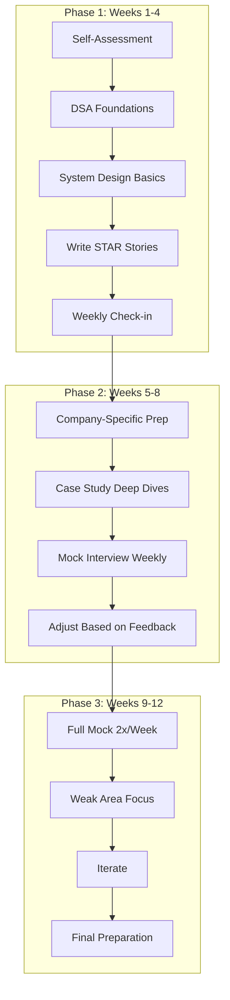
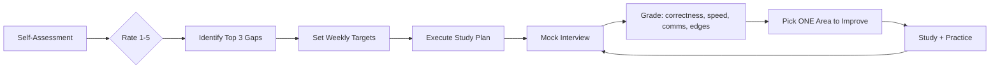

# Chapter 10: Interview Preparation Workflow

> ⏱ **2.5 hours total** · 🎯 **Intermediate** · 📋 **Recommended: Ch 8 (Study Plan)**

## Learning Objectives

After this chapter you will be able to:
- Design a complete interview preparation system from self-assessment through offers
- Structure preparation into 3 phases: foundations → company-specific → mocks
- Balance technical, behavioral, and domain-specific preparation across weeks
- Use mock interviews as the primary improvement driver
- Make data-driven decisions about where to focus each week

## Quick Start (10 min)

1. Read the 3-Phase Preparation System in Theory (3 min)
2. Write down 3 STAR stories from your experience (5 min)
3. Identify which phase you're currently in (1 min)
4. Write ONE action for this week to move to the next phase (1 min)
5. **Save for later:** Weekly balance table, mock feedback template, Common Mistakes

## Theory

### The 3-Phase Preparation System

Interview preparation follows a predictable arc. Trying to do everything at once leads to scattered effort.



**Phase 1: Foundations (Weeks 1-4)**

Goal: Build baseline competence in all areas.

- DSA: Complete all 8 core patterns at Easy difficulty (10 problems each). You should be able to identify the pattern within 2 minutes of reading a problem
- System Design: Learn all building blocks (CAP, hashing, caching, DB scaling, queues). Design 2 systems per week from scratch
- Behavioral: Write 10 STAR stories covering: conflict, failure, success, leadership, technical challenge, disagreement, mentorship, innovation, data-driven decision, cross-functional work
- Weekly check: Timed Easy LeetCode (15 min) + 30-min design + 1 STAR story told out loud

**Phase 2: Company-Specific (Weeks 5-8)**

Goal: Align preparation with target company format and values.

- Research: Interview format (number of rounds, types), company values (Leadership Principles, Googleyness), common question patterns
- DSA: Medium difficulty, company-tagged problems. 20 per week
- System Design: Case studies of systems similar to the company's products
- Behavioral: Adapt STAR stories to highlight company-specific values. Do 1 mock per week

**Phase 3: Peak Performance (Weeks 9-12)**

Goal: Perform under pressure consistently.

- 2 mocks per week (1 coding, 1 system design, alternate behavioral)
- Focus exclusively on weak areas identified in mocks
- Review all 10 STAR stories daily (tell them out loud in under 2 minutes each)
- Simulate interview day conditions: same time, same setup, full format

### Weekly Balance

A balanced week during Phase 1 looks like this:

| Category | Hours | Activities |
|----------|-------|------------|
| DSA | 8 | 15 problems + spaced review + pattern study |
| System Design | 5 | 1 building block + 1 case study |
| Behavioral | 3 | 2 STAR stories written + told out loud |
| Mock + Review | 4 | 1 mock + grade + adjust plan |

Total: 20 hours/week (adjust based on your timeline)

As you progress through phases, shift time toward weak areas. If your mocks show DSA is strong but system design is weak, shift 3 hours from DSA to design.

### Company Research Framework

For each target company, answer these questions:

| Question | Where to Find |
|----------|--------------|
| What's the interview format? | Glassdoor, Levels.fyi, Blind |
| How many rounds? What types? | Company career page |
| What values do they assess? | Company blog, annual report |
| What's the bar raiser process? | Interview experience posts |
| What LeetCode tags are common? | LeetCode company tag |

**Example: Google**
- Format: Phone screen (1-2 coding) → Onsite (4-5 rounds: 2-3 coding, 1 system design, 1 Googleyness)
- Googleyness: Ambiguity, feedback, collaboration, intellectual humility
- Common tags: Arrays, Strings, DP, Trees, Graphs

**Example: Amazon**
- Format: Phone screen (1-2 coding) → Onsite (4-5 rounds: 3 coding, 1 system design, 1 LP bar raiser)
- Leadership Principles: Customer Obsession, Ownership, Dive Deep, Deliver Results
- Common tags: Arrays, Two Pointers, DP, Design (OOD)



### Mock Interview Feedback Loop

The mock is not the learning event — the feedback loop after the mock is.

```
Mock → Grade → Identify Weak Areas → Study → Next Mock
```

After each mock, grade yourself:
- Correctness: Did the solution pass all test cases?
- Speed: Did you finish within time?
- Communication: Did you narrate clearly throughout?
- Edge cases: Did you handle off-by-one, null, overflow?
- Tradeoffs: Did you discuss complexity and alternatives?

Then identify exactly ONE area to improve before the next mock. Don't try to fix everything at once.

## Examples

### 📝 Plain-Language Walkthrough

**Scenario:** You have 8 weeks to prepare for a government job interview (SSC, Banking, or UPSC interview).

**Phase 1: Foundations (Weeks 1-3)**
- Week 1: Self-assessment. Identify your strengths and gaps across all subjects
- Week 2: Domain knowledge refresh (your optional subject / specialization)
- Week 3: Current affairs + general awareness review

**Phase 2: Company/Department-Specific (Weeks 4-6)**
- Week 4: Research the organization. Understand their mission, recent news, priorities
- Week 5: Prepare answers for common questions: "Why do you want to join?" "What do you know about us?"
- Week 6: Practice structured answers using STAR format (Situation, Task, Action, Result)

**Phase 3: Mock Interviews (Weeks 7-8)**
- Week 7: First mock interview with a friend or mentor. Record it. Analyze.
- Week 8: Second mock. Focus on weak areas from first mock. Polish STAR stories.

**Weekly Balance Template**
```
Subject                 Mon  Tue  Wed  Thu  Fri  Sat  Sun
Domain Knowledge        1h   1h   1h   1h   1h   2h    -
Current Affairs         30m  30m  30m  30m  30m   -    -
STAR Story Practice     -    -    30m  -    30m  -    -
Full Mock (from wk 7)   -    -    -    -    -    -    2h
```

### 💻 TypeScript Implementation (Optional)

### Example 1: Interview Prep Tracker

```typescript
type PrepPhase = 'foundations' | 'company-specific' | 'peak'
type SkillArea = 'dsa' | 'system-design' | 'behavioral' | 'ml-design'

interface WeeklyPlan {
    week: number
    phase: PrepPhase
    focus: SkillArea[]
    hoursPerArea: Record<SkillArea, number>
    mockSchedule: string[]  // dates
    weakAreas: string[]
}

class InterviewPrepTracker {
    private plans: WeeklyPlan[] = []
    private mockScores: MockScore[] = []

    generate12WeekPlan(targetCompany: string): WeeklyPlan[] {
        const plans: WeeklyPlan[] = []

        // Phase 1: Weeks 1-4 — Foundations
        for (let w = 1; w <= 4; w++) {
            plans.push({
                week: w,
                phase: 'foundations',
                focus: ['dsa', 'system-design', 'behavioral'],
                hoursPerArea: { dsa: 8, 'system-design': 5, behavioral: 3, 'ml-design': 2 },
                mockSchedule: [],
                weakAreas: []
            })
        }

        // Phase 2: Weeks 5-8 — Company-Specific
        for (let w = 5; w <= 8; w++) {
            plans.push({
                week: w,
                phase: 'company-specific',
                focus: ['dsa', 'system-design', 'behavioral'],
                hoursPerArea: { dsa: 10, 'system-design': 5, behavioral: 3, 'ml-design': 2 },
                mockSchedule: [`Week ${w}: Mock 1`],
                weakAreas: []
            })
        }

        // Phase 3: Weeks 9-12 — Peak
        for (let w = 9; w <= 12; w++) {
            plans.push({
                week: w,
                phase: 'peak',
                focus: ['dsa', 'system-design', 'behavioral'],
                hoursPerArea: { dsa: 8, 'system-design': 6, behavioral: 4, 'ml-design': 2 },
                mockSchedule: [`Week ${w}: Mock 1`, `Week ${w}: Mock 2`],
                weakAreas: []
            })
        }

        this.plans = plans
        return plans
    }

    logMockScore(score: MockScore): void {
        this.mockScores.push(score)
        this.updatePlan(score)
    }

    private updatePlan(score: MockScore): void {
        const currentWeek = Math.ceil((score.date.getTime() - new Date().getTime()) / (7 * 86400000))
        const plan = this.plans.find(p => p.week === currentWeek)
        if (!plan) return

        if (score.correctness < 4) plan.weakAreas.push(`${score.type}: correctness`)
        if (score.speed < 4) plan.weakAreas.push(`${score.type}: speed`)
        if (score.communication < 3) plan.weakAreas.push(`${score.type}: communication`)
    }

    getCurrentFocus(): string[] {
        const latest = this.mockScores[this.mockScores.length - 1]
        if (!latest) return ['Start with foundations: DSA, System Design, Behavioral']

        const issues: string[] = []
        if (latest.correctness < 4) issues.push('Focus on correctness — write test cases before coding')
        if (latest.speed < 4) issues.push('Focus on speed — time-box each pass')
        if (latest.communication < 3) issues.push('Focus on communication — narrate everything')

        return issues.length > 0 ? issues : ['Maintain current trajectory']
    }
}

interface MockScore {
    date: Date
    type: 'coding' | 'system-design' | 'behavioral' | 'ml-design'
    correctness: 1 | 2 | 3 | 4 | 5
    speed: 1 | 2 | 3 | 4 | 5
    communication: 1 | 2 | 3 | 4 | 5
    notes: string
}
```

### Example 2: Weekly Allocator

```typescript
interface WeeklyAllocation {
    category: string
    hours: number
    activities: string[]
}

class WeeklyAllocator {
    allocate(
        weakAreas: string[],
        availableHours: number = 20
    ): WeeklyAllocation[] {
        const baseAllocation: WeeklyAllocation[] = [
            { category: 'DSA', hours: 8, activities: ['15 problems', 'Spaced review', 'Pattern study'] },
            { category: 'System Design', hours: 5, activities: ['1 building block', '1 case study'] },
            { category: 'Behavioral', hours: 3, activities: ['2 STAR stories', 'Out loud practice'] },
            { category: 'Mock + Review', hours: 4, activities: ['1 mock', 'Grade + adjust'] },
        ]

        // If weak areas detected, shift hours
        if (weakAreas.includes('dsa')) {
            this.shiftHours(baseAllocation, 'DSA', 3)
        }
        if (weakAreas.includes('system-design')) {
            this.shiftHours(baseAllocation, 'System Design', 3)
        }
        if (weakAreas.includes('behavioral')) {
            this.shiftHours(baseAllocation, 'Behavioral', 2)
        }

        // Ensure total doesn't exceed available hours
        const total = baseAllocation.reduce((s, a) => s + a.hours, 0)
        if (total > availableHours) {
            const ratio = availableHours / total
            baseAllocation.forEach(a => {
                a.hours = Math.round(a.hours * ratio)
            })
        }

        return baseAllocation
    }

    private shiftHours(
        allocation: WeeklyAllocation[],
        category: string,
        extraHours: number
    ): void {
        const target = allocation.find(a => a.category === category)
        const others = allocation.filter(a => a.category !== category)

        if (target) {
            target.hours += extraHours
            // Reduce others proportionally
            const reduction = extraHours / others.length
            others.forEach(o => {
                o.hours = Math.max(2, o.hours - reduction)
            })
        }
    }
}
```

### Example 3: STAR Story Manager

```typescript
type STARCategory =
    | 'conflict' | 'failure' | 'success' | 'leadership'
    | 'technical-challenge' | 'disagreement' | 'mentorship'
    | 'innovation' | 'data-driven' | 'cross-functional'

interface STARStory {
    situation: string   // Where/when
    task: string        // What needed to be done
    action: string      // What YOU did (use "I", not "we")
    result: string      // Measurable outcome
    category: STARCategory
    companyValue: string  // Which company value this demonstrates
}

class STARStoryManager {
    private stories: STARStory[] = []

    addStory(story: STARStory): void {
        this.stories.push(story)
    }

    getByCategory(category: STARCategory): STARStory[] {
        return this.stories.filter(s => s.category === category)
    }

    getByCompanyValue(value: string): STARStory[] {
        return this.stories.filter(s => s.companyValue === value)
    }

    practiceSession(): string {
        // Pick a random story and format it for practice
        const story = this.stories[Math.floor(Math.random() * this.stories.length)]
        return [
            `Category: ${story.category}`,
            `Company value: ${story.companyValue}`,
            '',
            'Tell the story out loud in under 2 minutes:',
            `Situation: ${story.situation}`,
            `Task: ${story.task}`,
            `Action: ${story.action}`,
            `Result: ${story.result}`,
            '',
            'After telling, check:',
            '- Did you use "I" statements?',
            '- Was the result specific and measurable?',
            '- Did it fit in under 2 minutes?'
        ].join('\n')
    }

    getAllCompanyValues(): string[] {
        return [...new Set(this.stories.map(s => s.companyValue))]
    }

    getCompletionStatus(): { written: number; target: number } {
        const targetCategories: STARCategory[] = [
            'conflict', 'failure', 'success', 'leadership',
            'technical-challenge', 'disagreement', 'mentorship',
            'innovation', 'data-driven', 'cross-functional'
        ]
        return {
            written: this.stories.length,
            target: targetCategories.length
        }
    }
}
```

### Example 4: Company Research Analyzer

```typescript
interface CompanyProfile {
    name: string
    format: string
    rounds: number
    codingTags: string[]
    values: string[]
    commonQuestions: string[]
}

class CompanyResearchAnalyzer {
    private companies: Map<string, CompanyProfile> = new Map()

    addCompany(profile: CompanyProfile): void {
        this.companies.set(profile.name.toLowerCase(), profile)
    }

    getPreparationAdvice(companyName: string): string[] {
        const profile = this.companies.get(companyName.toLowerCase())
        if (!profile) return ['Company not found. Research format, values, and common questions.']

        const advice: string[] = [
            `Format: ${profile.format} (${profile.rounds} rounds)`,
            `Focus coding tags: ${profile.codingTags.join(', ')}`,
            `Prepare stories for values: ${profile.values.join(', ')}`,
            `Common questions: ${profile.commonQuestions.join(', ')}`,
            `Do ${profile.rounds} mocks before the real interview`,
        ]

        return advice
    }

    getTopCodingTags(companyNames: string[]): Map<string, number> {
        const tagCount = new Map<string, number>()
        companyNames.forEach(name => {
            const profile = this.companies.get(name.toLowerCase())
            if (profile) {
                profile.codingTags.forEach(tag => {
                    tagCount.set(tag, (tagCount.get(tag) ?? 0) + 1)
                })
            }
        })
        return tagCount
    }
}
```

### Example 5: Mock Feedback Analyzer

```typescript
interface MockFeedback {
    date: Date
    round: string
    correctness: number
    speed: number
    communication: number
    edgeCases: number
    notes: string
}

class MockFeedbackAnalyzer {
    private feedbacks: MockFeedback[] = []

    addFeedback(fb: MockFeedback): void {
        this.feedbacks.push(fb)
    }

    getTrend(): { metric: string; trend: 'improving' | 'declining' | 'stable'; score: number }[] {
        if (this.feedbacks.length < 2) return []

        const recent = this.feedbacks.slice(-3)
        const metrics: (keyof MockFeedback)[] = ['correctness', 'speed', 'communication', 'edgeCases']

        return metrics.map(m => {
            const scores = recent.map(f => f[m] as number)
            const avg = scores.reduce((s, v) => s + v, 0) / scores.length
            const trend: 'improving' | 'declining' | 'stable' =
                scores.length >= 2 && scores[scores.length - 1] > scores[0] ? 'improving'
                : scores.length >= 2 && scores[scores.length - 1] < scores[0] ? 'declining'
                : 'stable'

            return { metric: m, trend, score: Math.round(avg * 10) / 10 }
        })
    }

    getWeakestArea(): string {
        const trend = this.getTrend()
        if (trend.length === 0) return 'Need more data. Do at least 2 mocks.'

        const weakest = trend.reduce((min, t) => t.score < min.score ? t : min)
        const recommendations: Record<string, string> = {
            correctness: 'Write test cases before coding. Trace through examples.',
            speed: 'Time-box each pass. Practice with a timer every session.',
            communication: 'Narrate everything. Record yourself. Review for gaps.',
            edgeCases: 'Before coding, list 3 edge cases (empty, null, overflow).',
        }

        return `${weakest.metric} (${weakest.score}/5): ${recommendations[weakest.metric] ?? 'Practice more.'}`
    }
}
```

## Summary

- Interview prep has 3 phases: Foundations (weeks 1-4), Company-Specific (weeks 5-8), Peak Performance (weeks 9-12)
- Balance your week: 40% DSA, 25% System Design, 20% Behavioral, 15% Review
- Research your target company's format and values before Phase 2
- Mock interviews are the primary improvement driver — the feedback loop after the mock is where you actually learn
- Use data from mocks to decide where to focus each week

## Practical Takeaways

1. Do a self-assessment before starting: rate 1-5 in DSA, system design, behavioral, ML design
2. Write 10 STAR stories in Phase 1 — one for each common category
3. Research your target company format in Phase 2 — adapt your preparation
4. Do 1 mock per week in Phase 2, 2 per week in Phase 3
5. After every mock, identify exactly ONE area to improve before the next one

## Common Mistakes

| Mistake | Why It Fails | Fix |
|---------|-------------|-----|
| Starting mocks too late | First mock reveals panic-inducing gaps | Take a mock in WEEK 1 (diagnostic). No need to "prepare" for it |
| Practicing alone | No one tells you about your blind spots | Do at least one mock per week with a partner or recorded |
| Preparing answers, not stories | Facts are forgettable. Stories stick | Write 5 STAR stories. Practice them aloud until they flow |
| Spreading too thin | Jack of all trades, master of none | Pick 3 core topics. Master them. The rest is review |

## Chapter Quiz

<details>
<summary>1. What's the mock interview frequency in Phase 2?</summary>
<p>1 mock per week. In Phase 2, mocks are diagnostic — they tell you what to focus on. In Phase 3, increase to 2 mocks per week for performance conditioning.</p>
</details>

<details>
<summary>2. What's the ideal weekly time split between DSA and System Design?</summary>
<p>Roughly 8 hours DSA and 5 hours System Design (40/25 split). Adjust based on your mock performance. If your design mocks are weak, shift hours from DSA to design.</p>
</details>

<details>
<summary>3. How many STAR stories should you have written by the end of Phase 1?</summary>
<p>10 stories covering: conflict, failure, success, leadership, technical challenge, disagreement, mentorship, innovation, data-driven decision, cross-functional work. Each should follow the STAR format (Situation, Task, Action, Result) with measurable outcomes.</p>
</details>

<details>
<summary>4. What's the first thing to do after a mock interview?</summary>
<p>Grade yourself immediately while the details are fresh. Score correctness, speed, communication, and edge cases. Then identify ONE area to improve before the next mock. Don't try to fix everything at once.</p>
</details>

<details>
<summary>5. How should you adjust your plan when you identify a weak area?</summary>
<p>Shift hours from strong areas to the weak area. If design is weak, reduce DSA by 2 hours and add those hours to design study. The total hours stay the same — the allocation shifts based on data from mocks.</p>
</details>

## Exercises

1. **Write 3 STAR stories:** Pick 3 categories (conflict, failure, success, leadership, etc.). Write complete STAR stories with measurable outcomes. Practice telling each out loud in under 2 minutes
2. **Organization research:** Research your target organization (company, government department, or institution). Understand their mission, recent news, and priorities. Write a one-page summary of how your background aligns
3. **Mock interview setup:** Arrange a mock interview with a friend or mentor. Prepare 5 likely questions. Record the session. Afterward, identify ONE weak area to improve for the next mock
4. **Interview prep tracker (bonus):** Use the InterviewPrepTracker to create a 12-week plan for your target organization. Log at least 2 mock scores and adjust based on feedback
5. **STAR story manager (bonus):** Use the STARStoryManager to manage 5+ stories. Run a practice session and verify each story fits in under 2 minutes

## Quick Reference

### 3-Phase Interview Prep
| Phase | Duration | Focus |
|-------|----------|-------|
| Foundations | 40% of time | Core knowledge + STAR stories |
| Company-Specific | 30% of time | Organization research + targeted prep |
| Mock Peak | 30% of time | 1-2 mocks per week + feedback loop |

### STAR Story Structure
**S**ituation: Set the context (1-2 sentences)
**T**ask: What was your responsibility?
**A**ction: What specifically did YOU do?
**R**esult: What happened? Use numbers if possible

### Weekly Balance Rule
60% technical/domain prep | 20% mock practice | 20% behavioral/stories

### Mock Feedback Template
- What went well: ___
- What I'd change: ___
- Question I struggled with: ___
