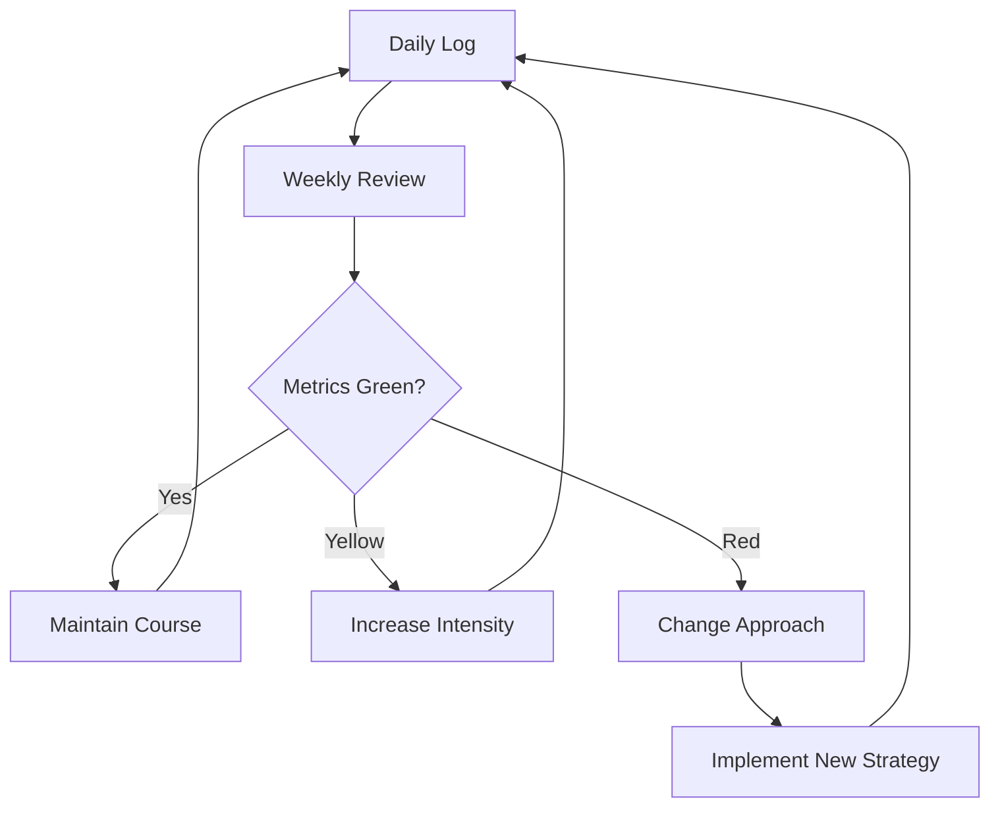

# Chapter 11: Tracking & Course Correction

## Learning Objectives

After this chapter you will be able to:
- Define leading and lagging metrics that actually measure learning
- Build a personal learning dashboard using simple tools
- Detect plateaus early and break through with targeted intervention
- Run an effective weekly review that drives continuous improvement
- Make data-driven decisions about what to study next

## Theory

### Leading vs Lagging Indicators

Most people track the wrong metrics. They measure time spent (lagging) instead of output produced (leading).



| Leading (Actions You Control) | Lagging (Outcomes You Want) |
|------------------------------|------------------------------|
| Hours of deep work | Mock interview score |
| Problems attempted | Problems solved under 30 min |
| Anki reviews completed | Retention rate |
| Pages of notes written | Concepts you can explain without notes |
| Lines of code written | Deployed projects |

Leading indicators tell you if you're doing the work. Lagging indicators tell you if the work is working. Track both.

**The North Star Metric:** Pick ONE metric that correlates most strongly with your goal. For interview prep: "mock interview score improvement." For learning a framework: "hours from first code to working CRUD app."

### The Learning Dashboard

You don't need fancy tools. A simple spreadsheet updated daily is more effective than a complex app you don't maintain.

**Minimum viable dashboard:**
1. Daily log: date, topic, hours, problems solved, focus rating
2. Weekly summary: total hours, trend lines, weak areas
3. Monthly review: milestone progress, retention rate, mock scores

| Metric | How to Track | Action if Red |
|--------|-------------|---------------|
| Deep work hours | Timer at start of session | Block calendar, remove phone |
| Problems solved | Count after session | Change difficulty or pattern |
| Anki retention | Anki stats | Review card design |
| Mock score | After each mock | Identify weak area, shift focus |

### Plateau Detection and Breakthrough

A plateau is when your metrics stay flat for 2+ weeks despite consistent effort.

**Signs of a plateau:**
- Same mock score 3 weeks in a row
- Solving problems at the same difficulty without progression
- Retention rate dropping (you're forgetting faster than you're learning)
- Motivation declining (studying feels like a chore)

**Breakthrough strategies (in order):**

1. **Change the input:** If you've been studying from one book/course, switch to a different one. A new perspective reveals what you missed
2. **Change the method:** If you've been reading, start building. If you've been solving easy problems, try a hard one. If you've been working alone, join a study group
3. **Change the pace:** Sometimes the fastest way forward is to slow down. Spend a week reviewing fundamentals. Fill the gaps you skipped
4. **Take a break:** 1-3 days of zero study. Your brain consolidates learning during rest. Many people return from a break with new insights

### The Weekly Review Protocol

Schedule 30 minutes every Sunday. No exceptions.

**Agenda:**
1. **Wins (5 min):** 3 things that went well this week. This builds momentum
2. **Challenges (5 min):** 3 things that didn't go well. Be specific — not "I was lazy" but "I didn't schedule my study time"
3. **Metrics (10 min):** Review your dashboard. Compare to targets. Mark green/yellow/red
4. **Insights (5 min):** What did you learn this week about how you learn best?
5. **Next week (5 min):** Top 3 priorities. Schedule them in your calendar now

**After the review, update your dashboard and adjust next week's plan.**

### When to Pivot

You should consider a major change when:

- You keep making the same mistakes on mocks (same weak area for 3+ weeks)
- You're consistently bored during study sessions
- Your metrics have been flat for 3+ weeks despite adjusting your approach
- You found a more efficient path (book, course, mentor)
- Your goal has changed (new target company, different role)

**How to pivot gracefully:**
1. Document what you learned (so you don't have to re-learn it)
2. Save useful work (notes, code, summaries)
3. Take a 1-day break before starting the new approach
4. Start fresh with clear metrics for the new approach

## Examples

### Example 1: Learning Dashboard

```typescript
interface MetricEntry {
    date: string
    deepWorkHours: number
    problemsSolved: number
    problemsAttempted: number
    ankiReviewsCompleted: number
    focusRating: 1 | 2 | 3 | 4 | 5
    notes: string
}

class LearningDashboard {
    private entries: MetricEntry[] = []
    private readonly TARGET_HOURS = 20  // weekly

    log(entry: MetricEntry): void {
        this.entries.push(entry)
    }

    getWeeklySummary(): WeeklyMetricSummary {
        const week = this.entries.slice(-7)

        const deepWorkTotal = week.reduce((s, e) => s + e.deepWorkHours, 0)
        const problemsSolved = week.reduce((s, e) => s + e.problemsSolved, 0)
        const problemsAttempted = week.reduce((s, e) => s + e.problemsAttempted, 0)
        const avgFocus = week.reduce((s, e) => s + e.focusRating, 0) / week.length

        return {
            weekEnding: new Date().toISOString().slice(0, 10),
            totalHours: deepWorkTotal,
            targetHours: this.TARGET_HOURS,
            hoursStatus: deepWorkTotal >= this.TARGET_HOURS ? 'green' : 'red',
            problemsSolved,
            problemsAttempted,
            solveRate: problemsAttempted > 0 ? problemsSolved / problemsAttempted : 0,
            avgFocus
        }
    }

    getMonthlyTrend(): TrendReport[] {
        // Group entries by week and show weekly averages
        const weeks = this.groupByWeek()
        return weeks.map((week, i) => ({
            week: i + 1,
            avgDailyHours: week.reduce((s, e) => s + e.deepWorkHours, 0) / week.length,
            avgDailyProblems: week.reduce((s, e) => s + e.problemsSolved, 0) / week.length,
            avgFocus: week.reduce((s, e) => s + e.focusRating, 0) / week.length,
        }))
    }

    detectPlateaus(): PlateauAlert[] {
        const trend = this.getMonthlyTrend().slice(-4) // last 4 weeks
        if (trend.length < 3) return []

        const alerts: PlateauAlert[] = []

        // Check for flat hours
        const hoursVariance = Math.max(...trend.map(t => t.avgDailyHours)) -
            Math.min(...trend.map(t => t.avgDailyHours))
        if (hoursVariance < 0.5 && trend[trend.length - 1].avgDailyHours < 3) {
            alerts.push({
                type: 'effort',
                message: 'Deep work hours are flat. Increase by 30 min/day.',
                severity: 'yellow'
            })
        }

        // Check for flat problem-solving rate
        const rateVariance = Math.max(...trend.map(t => t.avgDailyProblems)) -
            Math.min(...trend.map(t => t.avgDailyProblems))
        if (rateVariance < 2 && trend[trend.length - 1].avgDailyProblems < 5) {
            alerts.push({
                type: 'output',
                message: 'Problems solved per day is stagnant. Try harder difficulty or new patterns.',
                severity: 'red'
            })
        }

        return alerts
    }

    private groupByWeek(): MetricEntry[][] {
        const weeks: MetricEntry[][] = []
        for (let i = 0; i < this.entries.length; i += 7) {
            weeks.push(this.entries.slice(i, i + 7))
        }
        return weeks
    }
}

interface WeeklyMetricSummary {
    weekEnding: string
    totalHours: number
    targetHours: number
    hoursStatus: 'green' | 'red'
    problemsSolved: number
    problemsAttempted: number
    solveRate: number
    avgFocus: number
}

interface TrendReport {
    week: number
    avgDailyHours: number
    avgDailyProblems: number
    avgFocus: number
}

interface PlateauAlert {
    type: 'effort' | 'output' | 'retention' | 'motivation'
    message: string
    severity: 'green' | 'yellow' | 'red'
}
```

### Example 2: Weekly Review Generator

```typescript
interface WeeklyReview {
    weekNumber: number
    wins: string[]
    challenges: string[]
    metrics: WeeklyMetricSummary
    insights: string[]
    nextWeekPriorities: string[]
    actionItems: string[]
}

class WeeklyReviewGenerator {
    generate(
        weekNumber: number,
        dashboard: LearningDashboard
    ): WeeklyReview {
        const metrics = dashboard.getWeeklySummary()
        const plateaus = dashboard.detectPlateaus()

        const insights: string[] = []
        const actionItems: string[] = []

        if (metrics.hoursStatus === 'red') {
            insights.push('Deep work hours below target. Consider blocking calendar earlier.')
            actionItems.push('Add 30 min deep work block to morning schedule')
        }

        if (metrics.solveRate < 0.5) {
            insights.push('Problem solve rate is low. Are the problems too hard or is focus low?')
            actionItems.push('Drop one difficulty level. Master Easy before Medium.')
        }

        if (metrics.avgFocus < 3) {
            insights.push('Focus rating is low. Check sleep, environment, and phone habits.')
            actionItems.push('Phone in another room during study blocks')
        }

        plateaus.forEach(p => {
            if (p.severity === 'red') {
                actionItems.push(`URGENT: ${p.message}`)
            }
        })

        return {
            weekNumber,
            wins: [],  // Fill in during review
            challenges: [],
            metrics,
            insights,
            nextWeekPriorities: [],
            actionItems
        }
    }

    printReview(review: WeeklyReview): string {
        const statusEmoji = review.metrics.hoursStatus === 'green' ? '✅' : '❌'
        return [
            `=== Week ${review.weekNumber} Review ===`,
            '',
            'Metrics:',
            `  Hours: ${review.metrics.totalHours.toFixed(1)}/${review.metrics.targetHours} ${statusEmoji}`,
            `  Problems: ${review.metrics.problemsSolved}/${review.metrics.problemsAttempted} (${(review.metrics.solveRate * 100).toFixed(0)}%)`,
            `  Avg Focus: ${review.metrics.avgFocus.toFixed(1)}/5`,
            '',
            'Action Items:',
            ...review.actionItems.map(a => `  ☐ ${a}`),
            '',
            '=== End Review ==='
        ].join('\n')
    }
}
```

### Example 3: Course Correction Advisor

```typescript
interface LearnerProfile {
    mockScores: number[]  // last 5 scores
    weeklyProblemCount: number[]
    retentionRate: number
    currentPhase: string
    targetDate: Date
}

interface CorrectionAdvice {
    action: string
    reason: string
    priority: 'immediate' | 'this-week' | 'this-month'
}

class CourseCorrectionAdvisor {
    analyze(profile: LearnerProfile): CorrectionAdvice[] {
        const advice: CorrectionAdvice[] = []

        // Check mock score trend
        if (profile.mockScores.length >= 3) {
            const recent = profile.mockScores.slice(-3)
            const trend = recent[2] - recent[0]

            if (trend < 0) {
                advice.push({
                    action: 'Pause new content. Review fundamentals for 1 week.',
                    reason: 'Mock scores declining. Adding more content is making things worse.',
                    priority: 'immediate'
                })
            } else if (trend < 0.5) {
                advice.push({
                    action: 'Change your study method. If reading, switch to building. If solo, join a group.',
                    reason: `Scores flat at ${recent[2].toFixed(1)} for 3+ mocks. Input change needed.`,
                    priority: 'this-week'
                })
            }
        }

        // Check problem-solving volume
        const avgProblems = profile.weeklyProblemCount.slice(-2)
            .reduce((s, c) => s + c, 0) / 2
        if (avgProblems < 10) {
            advice.push({
                action: 'Increase weekly problem count to 15 minimum. Volume builds pattern recognition.',
                reason: `Averaging ${avgProblems.toFixed(0)} problems/week.`,
                priority: 'this-week'
            })
        }

        // Check retention
        if (profile.retentionRate < 0.7) {
            advice.push({
                action: 'Reduce new cards. Focus on reviewing existing cards until retention > 80%.',
                reason: `Retention at ${(profile.retentionRate * 100).toFixed(0)}%. New content adding without consolidating.`,
                priority: 'immediate'
            })
        }

        // Check timeline
        const daysUntilTarget = Math.ceil(
            (profile.targetDate.getTime() - Date.now()) / 86400000
        )
        if (daysUntilTarget < 30) {
            advice.push({
                action: 'Enter peak preparation mode. Max 2 hours new content, rest mock + review.',
                reason: `${daysUntilTarget} days until target date. Time to shift from learning to performing.`,
                priority: 'immediate'
            })
        }

        return advice
    }
}
```

## Summary

- Track leading indicators (actions you control) and lagging indicators (outcomes you want)
- A simple daily log + weekly review is more effective than a complex dashboard you don't maintain
- Detect plateaus early: flat metrics for 2+ weeks = time to change something
- Run a 30-minute weekly review every Sunday with wins, challenges, metrics, insights, and next priorities
- Pivot when: same mistakes persist, boredom sets in, metrics stay flat, or you find a better path

## Practical Takeaways

1. Track 3 metrics daily: deep work hours, problems solved, focus rating — that's enough to start
2. Run a 30-minute weekly review every Sunday. Block the time in your calendar
3. If metrics are flat for 2 weeks, change ONE thing (input, method, or pace)
4. The North Star Metric for interview prep: "Can I solve this problem under time pressure?"
5. Pivot gracefully: document what you learned, save your work, take a 1-day break, start fresh

## Chapter Quiz

<details>
<summary>1. What's the difference between a leading and lagging indicator?</summary>
<p>Leading indicators are actions you control (hours of deep work, problems attempted). Lagging indicators are outcomes you want (mock scores, retention rate). Leading tells you if you're doing the work; lagging tells you if the work is working.</p>
</details>

<details>
<summary>2. How many weeks of flat scores indicate a plateau?</summary>
<p>2+ weeks of flat metrics despite consistent effort. If your mock scores haven't improved in 3 attempts or your problem solve rate is stagnant for 2 weeks, you've hit a plateau. Time to change your approach.</p>
</details>

<details>
<summary>3. What's the recommended weekly review duration?</summary>
<p>30 minutes every Sunday. Structure: 5 min wins, 5 min challenges, 10 min metrics, 5 min insights, 5 min next week priorities. Block it in your calendar as non-negotiable.</p>
</details>

<details>
<summary>4. What's the first thing to check when you're off track?</summary>
<p>Your leading indicators. Are you actually doing the work? Check deep work hours and problems attempted first. If leading indicators are green but lagging is red, your method is wrong. If leading indicators are red, your effort is wrong.</p>
</details>

<details>
<summary>5. When should you consider pivoting to a new approach?</summary>
<p>Same mistakes on 3+ mocks, boredom/dread about study sessions, 3+ weeks of flat metrics despite adjustments, finding a clearly better path, or your goal changes. Pivot gracefully: document learnings, save work, take 1 day off, start fresh.</p>
</details>

## Exercises

1. **Set up tracking:** Choose 3 daily metrics (recommended: deep work hours, problems solved, focus rating). Track them for 14 consecutive days using the LearningDashboard class
2. **Run a weekly review:** Schedule 30 minutes next Sunday. Use the WeeklyReviewGenerator to structure your review. Fill in wins, challenges, and next priorities
3. **Detect a plateau:** Review your last 2-4 weeks of data using detectPlateaus(). If you find a plateau, choose ONE breakthrough strategy and implement it this week
4. **Course correction:** Use the CourseCorrectionAdvisor with your actual data. Implement the top priority advice this week
5. **Build your dashboard:** Create a simple dashboard (spreadsheet or implement the LearningDashboard class). Use it daily for 2 weeks. At week 2, review: what did tracking reveal that you wouldn't have noticed otherwise?
