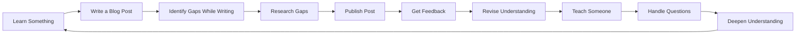

# Chapter 12: Building in Public & Teaching

## Learning Objectives

After this chapter you will be able to:
- Use the protege effect to deepen your understanding in any subject
- Share your learning journey through blogs, study groups, or social media
- Build projects or practice sets that serve as learning accelerators
- Teach others through mentoring, tutoring, or content creation
- Create a feedback loop that accelerates your growth

## Theory

### The Protege Effect

Teaching is the highest form of learning. When you prepare to teach, your brain organizes knowledge differently — into clear, structured, explainable units.



Studies show that students who teach others retain 90% of material, compared to 10% from reading and 30% from practice. The act of explaining forces you to:
- Organize knowledge into logical sequences
- Identify gaps in your own understanding
- Simplify complex ideas for a beginner audience
- Handle unexpected questions that reveal weak spots

You don't truly know something until you can teach it to a beginner without notes.

### Learning by Writing

Writing a blog post or tutorial forces you to answer these questions:
- What problem am I solving?
- Why should the reader care?
- How does the solution work, step by step?
- What are the common pitfalls?

**The blog post template:**
```
Title: [Action Verb] [Topic] in [Framework/Language]

1. The Problem — What are we trying to solve? (2-3 sentences)
2. The Approach — High-level solution (1 paragraph)
3. Implementation — Step-by-step with code (the bulk of the post)
4. Key Insights — What did you learn while building this? (3-5 bullet points)
5. Code — Link to the full implementation
```

Publish 1 post per month minimum. Don't worry about originality. Your unique perspective on a familiar topic is valuable because no one else has your exact learning journey.

### Learning by Building

Projects consolidate scattered knowledge into a working whole. The build-learn cycle:

1. Identify a problem you care about
2. Learn just enough to build a minimal solution
3. Build it (even if it's ugly)
4. Encounter gaps in your knowledge (you will — this is the point)
5. Research the gaps
6. Rebuild with the new knowledge
7. Repeat

Each cycle adds depth. Start with a clone of something familiar (Netflix, Twitter, Todo app) in a new technology, then build something original.

**Project levels for learning:**
- Level 1 (2 days): Single-file script that works
- Level 2 (1 week): Multi-file app with architecture
- Level 3 (2 weeks): Deployed, tested, documented
- Level 4 (1 month): Production-ready with monitoring

### Building in Public

Sharing your learning journey publicly creates accountability, feedback, and network effects:

**What to share:**
- Daily: One thing you learned today (1 tweet)
- Weekly: Progress on your current project (thread)
- Monthly: Deep dive into a concept you mastered (blog post)

**Where to share:**
- Twitter/X: Short updates, network with peers
- LinkedIn: Professional posts, portfolio building
- Dev.to: Long-form technical writing
- GitHub: Code, READMEs, project documentation

**The benefits:**
- Accountability: People are watching — you study even on low-motivation days
- Feedback: Correct misconceptions early before they become habits
- Network: Attract mentors, peers, and opportunities
- Portfolio: Your learning journey becomes your resume

Start small: 1 tweet per day about what you learned. Do this for 30 days.

### Mentoring as Mastery

The mentor learns more than the mentee. Every mentoring interaction forces you to:
- Articulate knowledge you take for granted
- Justify design decisions and tradeoffs
- Defend your understanding against questions
- Find simpler explanations when the mentee doesn't understand

**How to find mentees:**
- Online communities (coding bootcamps, Discord servers, Reddit)
- Your college or workplace (junior developers, juniors)
- LinkedIn (write "open to mentoring" in your bio)
- GitHub (review PRs and offer constructive feedback)

**Sustainable mentoring:**
- 1-2 mentees at a time (more than that and quality drops)
- 30 min/week per mentee
- Format: code review, pair programming, or structured discussion
- Focus on teaching the skill, not giving the answer

## Examples

### 📝 Plain-Language Walkthrough

**Method 1: The Protege Effect (No Tech Needed)**

Find a friend, family member, or study partner. Once a week:
1. Pick one concept you learned this week
2. Explain it to them in 5 minutes without notes
3. Ask them to ask you 3 questions about it
4. Note any questions you couldn't answer well → those are your gaps

Example for SSC prep:
- You studied the Fundamental Rights this week
- Explain all 6 rights to a friend
- They ask: "What's the difference between Right to Equality and Right against Exploitation?"
- If you stumble, you know what to review

**Method 2: Build a Learning Log (Public or Private)**
Start a simple document (Google Docs, Notion, or just a notebook):
```
Week 1: Learned Percentage and Profit/Loss. Key insight: CP vs SP distinction.
Week 2: Applied percentage to Data Interpretation. Discovered: I'm slow on pie charts.
Week 3: Focused on pie charts. Did 30 problems. Accuracy improved from 60% to 85%.
```

**Method 3: Create a One-Page Cheat Sheet**
After mastering a topic, summarize it on ONE page:
- Top 5 formulas/concepts
- 3 most common mistakes
- 1 mnemonic or memory trick

Share this with a study group. Teaching forces clarity.

### 💻 TypeScript Implementation (Optional)

### Example 1: Blog Post Planner

```typescript
interface BlogSection {
    heading: string
    content: string
    codeBlock?: string
}

interface BlogPost {
    title: string
    topic: string
    sections: BlogSection[]
    estimatedReadTime: number  // minutes
    tags: string[]
}

class BlogPostPlanner {
    plan(topic: string, codeSnippets: string[]): BlogPost {
        const sections: BlogSection[] = [
            {
                heading: 'The Problem',
                content: `Many developers struggle with ${topic}. They understand the basics but hit a wall when trying to apply it in real projects. This post walks through ${topic} from first principles to a working implementation.`
            },
            {
                heading: 'The Approach',
                content: `We'll build ${topic} step by step. First, we understand the core concept. Then we implement a minimal version. Finally, we add production considerations.`
            },
            {
                heading: 'Implementation',
                content: `Let's start with the core data structures and work up to the full implementation.`,
                codeBlock: codeSnippets[0]
            },
            {
                heading: 'Common Pitfalls',
                content: `After building this several times, here are the mistakes I made so you don't have to:`,
                codeBlock: codeSnippets[1]
            },
            {
                heading: 'Key Insights',
                content: `What I learned while building this that you won't find in the docs:`
            },
            {
                heading: 'Full Code',
                content: `The complete implementation is available on GitHub.`
            }
        ]

        return {
            title: `Building ${topic}: A Step-by-Step Guide`,
            topic,
            sections,
            estimatedReadTime: sections.length * 3,
            tags: [topic.toLowerCase(), 'tutorial', 'typescript']
        }
    }

    generateOutline(post: BlogPost): string {
        return [
            `# ${post.title}`,
            '',
            ...post.sections.map(s =>
                `## ${s.heading}\n\n${s.content}\n`
            ),
            '---',
            `Tags: ${post.tags.join(', ')}`,
            `Read time: ${post.estimatedReadTime} min`
        ].join('\n')
    }
}
```

### Example 2: Public Learning Tracker

```typescript
type ContentFormat = 'tweet' | 'thread' | 'blog' | 'video' | 'talk' | 'code'

interface PublicLearningEntry {
    date: Date
    topic: string
    format: ContentFormat
    title: string
    url?: string
    feedback: string[]
    insightsGained: string[]
}

class PublicLearningTracker {
    private entries: PublicLearningEntry[] = []

    addEntry(entry: PublicLearningEntry): void {
        this.entries.push(entry)
        console.log(`Published: "${entry.title}" (${entry.format})`)
    }

    getMonthlyStats(date: Date = new Date()): MonthlyStats {
        const monthEntries = this.entries.filter(e => {
            const sameMonth = e.date.getMonth() === date.getMonth()
            const sameYear = e.date.getFullYear() === date.getFullYear()
            return sameMonth && sameYear
        })

        const byFormat = new Map<ContentFormat, number>()
        monthEntries.forEach(e => {
            byFormat.set(e.format, (byFormat.get(e.format) ?? 0) + 1)
        })

        const totalFeedback = monthEntries.reduce((s, e) => s + e.feedback.length, 0)

        return {
            month: date.toLocaleString('default', { month: 'long' }),
            year: date.getFullYear(),
            totalPosts: monthEntries.length,
            byFormat: [...byFormat.entries()].map(([format, count]) => ({ format, count })),
            totalFeedback,
            avgFeedbackPerPost: monthEntries.length > 0
                ? Math.round(totalFeedback / monthEntries.length)
                : 0
        }
    }

    getLearningInsights(): string[] {
        // Extract common insights across entries
        const allInsights = this.entries.flatMap(e => e.insightsGained)
        const frequency = new Map<string, number>()
        allInsights.forEach(i => {
            frequency.set(i, (frequency.get(i) ?? 0) + 1)
        })

        return [...frequency.entries()]
            .sort((a, b) => b[1] - a[1])
            .slice(0, 5)
            .map(([insight, count]) => `${insight} (mentioned ${count}x)`)
    }

    suggestNextFormat(history: PublicLearningEntry[] = this.entries): ContentFormat {
        if (history.length === 0) return 'tweet'

        const byFormat = new Map<ContentFormat, number>()
        history.forEach(e => {
            byFormat.set(e.format, (byFormat.get(e.format) ?? 0) + 1)
        })

        // Suggest the format used least recently
        return [...byFormat.entries()].sort((a, b) => a[1] - b[1])[0]?.[0] ?? 'blog'
    }

    getWeekStreak(): number {
        if (this.entries.length === 0) return 0

        let streak = 1
        const sorted = [...this.entries].sort((a, b) => b.date.getTime() - a.date.getTime())

        for (let i = 1; i < sorted.length; i++) {
            const diffDays = (sorted[i - 1].date.getTime() - sorted[i].date.getTime()) / 86400000
            if (diffDays <= 7) {
                streak++
            } else {
                break
            }
        }

        return streak
    }
}

interface MonthlyStats {
    month: string
    year: number
    totalPosts: number
    byFormat: { format: ContentFormat; count: number }[]
    totalFeedback: number
    avgFeedbackPerPost: number
}
```

### Example 3: Mentoring Session Tracker

```typescript
interface Mentee {
    id: string
    name: string
    goal: string
    currentLevel: 'beginner' | 'intermediate' | 'advanced'
    topicsCovered: string[]
    sessionCount: number
}

interface MentoringSession {
    date: Date
    menteeId: string
    duration: number  // minutes
    topic: string
    format: 'code-review' | 'pair-programming' | 'discussion' | 'mock-interview'
    keyPoints: string[]
    menteeQuestions: string[]
    insightsForMentor: string[]
}

class MentoringTracker {
    private mentees: Mentee[] = []
    private sessions: MentoringSession[] = []

    addMentee(mentee: Omit<Mentee, 'id' | 'topicsCovered' | 'sessionCount'>): Mentee {
        const newMentee: Mentee = {
            ...mentee,
            id: crypto.randomUUID(),
            topicsCovered: [],
            sessionCount: 0
        }
        this.mentees.push(newMentee)
        return newMentee
    }

    logSession(session: Omit<MentoringSession, 'insightsForMentor'>): MentoringSession {
        const insightsForMentor: string[] = []

        // Generate insights based on mentee questions
        if (session.menteeQuestions.length > 3) {
            insightsForMentor.push(
                'Mentee had many questions — consider breaking topic into smaller sessions'
            )
        }

        const fullSession: MentoringSession = {
            ...session,
            insightsForMentor
        }

        this.sessions.push(fullSession)

        // Update mentee stats
        const mentee = this.mentees.find(m => m.id === session.menteeId)
        if (mentee) {
            mentee.sessionCount++
            if (!mentee.topicsCovered.includes(session.topic)) {
                mentee.topicsCovered.push(session.topic)
            }
        }

        return fullSession
    }

    getMentorInsights(): string[] {
        // What the mentor learned from mentoring
        const allInsights = this.sessions.flatMap(s => s.insightsForMentor)
        const mentorInsights = this.sessions.flatMap(s =>
            s.menteeQuestions.map(q => `Question I had to think about: ${q}`)
        )

        return [...new Set([...allInsights, ...mentorInsights])].slice(0, 5)
    }

    getMenteeProgress(menteeId: string): MenteeProgress | null {
        const mentee = this.mentees.find(m => m.id === menteeId)
        if (!mentee) return null

        const menteeSessions = this.sessions.filter(s => s.menteeId === menteeId)

        return {
            name: mentee.name,
            totalSessions: mentee.sessionCount,
            topicsCovered: mentee.topicsCovered,
            improvement: this.estimateImprovement(menteeSessions)
        }
    }

    private estimateImprovement(sessions: MentoringSession[]): string {
        if (sessions.length < 3) return 'Too early to measure'
        return 'Progressing — questions are more specific, code is more structured'
    }
}

interface MenteeProgress {
    name: string
    totalSessions: number
    topicsCovered: string[]
    improvement: string
}
```

## Summary

- Teaching others is the highest form of learning — you retain 90% of what you teach
- Writing forces you to organize knowledge into clear, structured explanations
- Building projects consolidates scattered knowledge through the build-learn cycle
- Building in public creates accountability, feedback, and a professional network
- Mentoring deepens your understanding — the mentor learns more than the mentee

## Practical Takeaways

1. Publish 1 blog post per month minimum. Don't worry about perfection — ship it
2. Share 1 tweet per day about something you learned. Do this for 30 days
3. Build one project per month that pushes your current skill boundary
4. Find 1 person to mentor (or offer code reviews to a peer). 30 min/week
5. Every time you teach something, note what questions they asked — those are gaps in your understanding

## Chapter Quiz

<details>
<summary>1. What percentage of material do students retain when they teach?</summary>
<p>90%. Compared to 10% from reading, 30% from practice, and 50% from discussion. Teaching forces the highest level of cognitive processing — you must organize, simplify, and articulate knowledge.</p>
</details>

<details>
<summary>2. How often should you publish a blog post as a minimum?</summary>
<p>1 per month. Consistency beats volume. Publishing 1 post per month for a year = 12 pieces of content, a portfolio of your learning journey, and 12 opportunities for feedback.</p>
</details>

<details>
<summary>3. What's the first step of the build-learn cycle?</summary>
<p>Identify a problem you care about. Not "I want to learn React" but "I want to build a habit tracker." The problem motivates the learning. Without a problem, you'll learn aimlessly and forget most of it.</p>
</details>

<details>
<summary>4. What's the minimum commitment for starting to build in public?</summary>
<p>1 tweet per day about what you learned. That's it. No blog, no video, no thread. Just one tweet daily for 30 days. This builds the habit of reflecting on what you learned and articulating it concisely.</p>
</details>

<details>
<summary>5. How many mentees should you take on at once?</summary>
<p>1-2 mentees at a time. More than that and the quality of mentoring drops. Each mentee needs 30 min/week minimum. Beyond 2 mentees, you're spreading yourself too thin and learning less from each interaction.</p>
</details>

## Exercises

1. **Apply the protege effect:** Find a friend, family member, or study partner. Pick one concept you learned this week and explain it to them in 5 minutes without notes. Ask them to ask you 3 questions. Note any gaps in your explanation
2. **Create a one-page cheat sheet:** After mastering any topic (current affairs, math formula, language rule), summarize it on ONE page with: top 5 concepts, 3 common mistakes, 1 mnemonic. Share it with a study group
3. **Write a learning log entry:** Write a 3-5 sentence weekly log entry about what you studied, what you discovered, and what you plan to improve next week. Keep it simple — even a notebook entry counts
4. **TypeScript bonus — Write and publish:** Write a blog post using the BlogPostPlanner. Publish it on Dev.to, Medium, or your own blog
5. **TypeScript bonus — Track your public learning:** Use the PublicLearningTracker or MentoringTracker to log your content creation and teaching sessions. Review your insights after 4 entries
