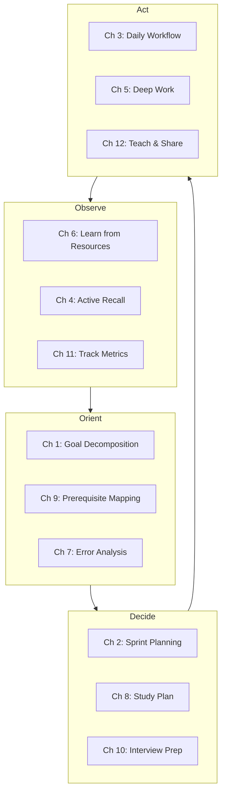
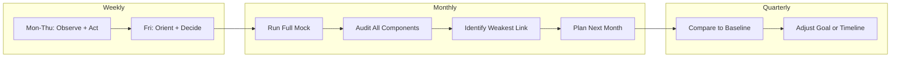

# Chapter 13: Final Capstone — Design Your Learning System

> ⏱ **3 hours total** · 🎯 **Advanced** · 📋 **Requires: All chapters 1-12**

## Learning Objectives

After this chapter you will be able to:
- Integrate all 12 techniques from this course into one unified learning system
- Design a personalized learning workflow that matches your goal, style, and schedule
- Build a complete 90-day learning plan for any subject or exam
- Create your own set of templates, checklists, and tracking tools
- Identify and fix the weakest link in your current learning approach

## Quick Start (10 min)

1. Read the 4-Phase Learning System framework in Theory (4 min)
2. Complete the Learning System Audit table (3 min)
3. Identify your weakest link from the audit (1 min)
4. Write: "I will fix ___ by ___" (2 min)
5. **Save for later:** TypeScript implementation, 90-day plan, monthly review template

## Theory

### Why Integration Matters

Each chapter so far taught you a standalone technique. But techniques don't work in isolation — they work as a system. Active recall without a study plan is random. Deep work without energy scheduling is unsustainable. Tracking without course correction is just data collection.

The OODA loop from Chapter 1 is the backbone. Every other technique slots into one of its four phases.



### The 4-Phase Learning System

**Phase 1: Observe** — Gather information and measure current state
- Resource learning (Ch 6): Use SQ3R to extract knowledge from any source
- Active recall (Ch 4): Close the book. Write what you remember. Identify gaps
- Tracking (Ch 11): Log leading metrics daily (focus, problems solved, errors)

**Phase 2: Orient** — Analyze and understand what the data means
- Goal decomposition (Ch 1): Break big goals into milestones
- Prerequisite mapping (Ch 9): What do you need to learn BEFORE you can learn this?
- Error analysis (Ch 7): Categorize mistakes. Are they concept gaps, speed issues, or carelessness?

**Phase 3: Decide** — Choose the best next action based on evidence
- Sprint planning (Ch 2): Plan the next 30 days. Set a daily minimum
- Study plan (Ch 8): Create a phased timeline with mocks and milestones
- Interview prep (Ch 10): If interviewing, structure company-specific prep

**Phase 4: Act** — Execute with focus, then teach to solidify
- Daily workflow (Ch 3): Schedule study blocks around your energy peaks
- Deep work (Ch 5): Execute distraction-free sessions
- Teaching (Ch 12): Share what you learned. Fill gaps discovered while teaching



### The Learning System Audit

Before building your system, audit your current approach. Ask yourself:

| Question | What to Check | Related Chapter |
|----------|--------------|-----------------|
| Do I have a clear learning goal? | Is it specific and measurable? | Ch 1 |
| Do I have a plan to reach it? | Is it broken into phases? | Ch 2, Ch 8 |
| Do I study during my peak energy? | Track energy for 3 days | Ch 3 |
| Do I use active recall? | Or do I re-read? | Ch 4 |
| Can I focus for 45+ minutes? | Track interruptions | Ch 5 |
| Do I learn from mistakes? | Categorize last 10 errors | Ch 7 |
| Do I track progress? | Leading vs lagging metrics | Ch 11 |
| Do I teach what I learn? | Have I explained it to anyone? | Ch 12 |

## Examples

### 📝 Plain-Language Walkthrough

**Scenario:** You want to prepare for SSC CGL 2027 using this system.

**Step 1: Observe (Week 1)**

Day 1-2: Take a full SSC CGL mock test (available online). Score each section. This is your baseline.

Day 3-4: For each section, identify your current level:
```
Section              Score   Weakest Topics
Quant Aptitude       12/25   Geometry, Mensuration, Algebra
Reasoning            18/25   (decent — focus on speed)
General Awareness    10/25   History, Polity, Geography
English              15/25   Vocabulary, Idioms
```

Day 5-7: Learn one general topic using SQ3R (Ch 6) and Active Recall (Ch 4). Start with a topic you know nothing about — "The Indian Constitution" for Polity.

**Step 2: Orient (Week 2)**

Map prerequisites for each weak topic:
```
Geometry (Quant)
├── Lines and Angles (remember 70% — quick review)
├── Triangles and Pythagoras (remember 40% — study 2 hrs)
├── Circles and Tangents (remember 20% — study 3 hrs)
└── Coordinate Geometry (remember 10% — study 4 hrs)
```

Categorize your mock test errors:
- Concept gap: 40% of wrong answers → study theory
- Calculation mistake: 30% → slow down, verify steps
- Time pressure: 20% → speed drills after accuracy improves
- Read incorrectly: 10% → underline key numbers

**Step 3: Decide (Week 3)**

Create a 90-day plan:
```
Phase 1 (Month 1): Foundations
- Quant: Geometry + Algebra theory
- GA: History (Ancient → Medieval → Modern)
- English: 10 vocabulary words/day
- Weekly: 1 section-wise test

Phase 2 (Month 2): Practice
- Topic-wise tests for each subject
- GA: Polity + Geography
- English: Grammar rules + comprehension
- Weekly: 1 full mock test

Phase 3 (Month 3): Mastery
- Full mocks every 2 days
- Error analysis after every mock
- Speed drills for Reasoning
- Revision of all formulas
```

Set your daily minimum: "I will study at least 30 minutes and solve 5 quant problems every day. No exceptions."

**Step 4: Act (Month 1-3)**

Your daily schedule (energy-aware):
```
6:00-7:00 AM   Deep work: New quant topic (peak energy)
7:00-7:15 AM   Break + breakfast
7:15-8:00 AM   Active recall: Yesterday's topic (blank page method)
8:00-8:30 AM   Commute — listen to GA podcast (auditory learning)
...
7:00-8:00 PM   Practice problems: Today's topic + review past topics
8:00-8:15 PM   Log metrics. Quick evening review.
8:15-8:30 PM   Teach one concept to a study partner or write a summary
```

Every Sunday: Weekly review (15 min). Check your progress tracker. Adjust next week's plan.

At month end: Take a full mock. Compare with baseline. Celebrate progress. Update error log.

**Step 5: Teach to Solidify (Weekly)**

After the weekly review, teach ONE concept from the past week to someone:
- Tell a friend about the Preamble of the Constitution
- Write a one-paragraph summary of Pythagoras theorem applications
- Record a 2-minute voice note explaining the difference between simple and compound interest

The act of teaching forces you to organize your knowledge. The gaps you discover while teaching are your real learning gaps.

---

**Alternative Scenario:** You're preparing for AI/ML engineering interviews in 90 days.

**Phase 1 (Month 1): ML Foundations**
- ML fundamentals: regression, classification, evaluation metrics, overfitting
- Implement: linear regression from scratch, logistic regression from scratch
- Daily: 45 min theory (chapter + paper) + 30 min coding (implement what you learned)
- Set daily minimum: "I will train one model today or debug one implementation"

**Phase 2 (Month 2): Deep Learning + System Design**
- Neural networks: backpropagation, CNNs, RNNs, transformers
- ML system design: feature stores, model serving, A/B testing, monitoring
- Daily: 1 ML design exercise + 1 implementation (PyTorch)
- Weekly: 1 mock ML system design session (45 min timed)

**Phase 3 (Month 3): Mock Interviews + Weak Area Focus**
- Alternating coding and design mocks (3 per week)
- Review weak areas from mock feedback
- Prepare STAR stories for ML-specific scenarios (failed experiment, data issue, production incident)
- Final week: review all fundamentals, confidence building

**Alternative Scenario:** You're learning Spanish from scratch in 90 days.

**Phase 1 (Month 1): Foundations**
- Core vocabulary: 20 most common verbs, 100 most common words
- Grammar: Present tense conjugations, gendered nouns, basic sentence structure
- Daily: 15 min Duolingo + 15 min Anki (new vocab) + 15 min listening (music/podcasts)

**Phase 2 (Month 2): Practice**
- Expand vocabulary to 500 words
- Grammar: Past tense, future tense, reflexive verbs
- Daily: 15 min reading (news articles) + 15 min writing (journal) + 15 min speaking (tandem app)
- Weekly: 1 conversation with a native speaker (italki/HelloTalk)

**Phase 3 (Month 3): Immersion**
- Read a short novel (graded reader)
- Watch TV shows in Spanish with Spanish subtitles
- Write a 1-page essay about your daily routine
- Record yourself speaking for 2 minutes. Compare with native speaker audio.

The system stays the same. Only the content changes.

### 💻 TypeScript Implementation (Optional)

```typescript
interface LearningSystemConfig {
  goal: string
  baselineScore: number
  targetScore: number
  deadline: Date
  weeklyHours: number
  subjects: SubjectPlan[]
}

interface SubjectPlan {
  name: string
  baselineScore: number
  weakTopics: string[]
  dailyMinimum: number
  phase: 'foundation' | 'practice' | 'mastery'
}
```

```typescript
class LearningSystem {
  private config: LearningSystemConfig
  private dailyLog: DailyLogEntry[] = []

  constructor(config: LearningSystemConfig) {
    this.config = config
  }

  getProgress(): { overall: number; subjects: SubjectProgress[] } {
    const subjects = this.config.subjects.map((s) => {
      const logs = this.dailyLog.filter((l) => l.subject === s.name)
      const avgScore =
        logs.length > 0
          ? logs.reduce((sum, l) => sum + l.score, 0) / logs.length
          : s.baselineScore
      const progress = ((avgScore - s.baselineScore) / (100 - s.baselineScore)) * 100
      return { name: s.name, currentScore: Math.round(avgScore), progress: Math.round(progress) }
    })

    const overall = Math.round(
      subjects.reduce((sum, s) => sum + s.progress, 0) / subjects.length
    )

    return { overall, subjects }
  }

  getWeakestLink(): { subject: string; issue: string } {
    const today = this.dailyLog[this.dailyLog.length - 1]
    if (!today) return { subject: 'N/A', issue: 'No data yet. Start your daily log.' }

    const recent = this.dailyLog.slice(-7)
    const avgFocus = recent.reduce((s, l) => s + l.focus, 0) / recent.length
    const avgHours = recent.reduce((s, l) => s + l.hoursStudied, 0) / recent.length
    const errorRate =
      recent.reduce((s, l) => s + l.problemsWrong, 0) /
      Math.max(recent.reduce((s, l) => s + l.problemsSolved, 0), 1)

    if (avgFocus < 3) return { subject: 'All', issue: 'Focus too low. Check environment (Ch 5).' }
    if (errorRate > 0.4) return { subject: today.subject, issue: `Error rate ${Math.round(errorRate * 100)}%. Use 3-pass method (Ch 7).` }
    if (avgHours < 1) return { subject: 'All', issue: `Only ${avgHours.toFixed(1)}h/day. Increase daily minimum (Ch 2).` }
    if (!today.taught) return { subject: today.subject, issue: 'No teaching today. Use protege effect (Ch 12).' }

    return { subject: 'All', issue: 'System is running smoothly. Keep going.' }
  }

  logEntry(entry: DailyLogEntry): void {
    this.dailyLog.push(entry)
    const { issue } = this.getWeakestLink()
    console.log(`Today: ${entry.subject} — ${entry.hoursStudied}h, score ${entry.score}, focus ${entry.focus}`)
    console.log(`Weakest link: ${issue}`)
  }
}
```

```typescript
interface DailyLogEntry {
  date: Date
  subject: string
  hoursStudied: number
  score: number
  focus: 1 | 2 | 3 | 4 | 5
  problemsSolved: number
  problemsWrong: number
  taught: boolean
  errors?: string[]
}

function create90DayPlan(subjects: string[], weeklyHours: number): string[] {
  const plan: string[] = []
  const phases = ['Foundation', 'Practice', 'Mastery']
  const daysPerPhase = 30

  phases.forEach((phase, phaseIdx) => {
    plan.push(`\n### Phase ${phaseIdx + 1}: ${phase} (Days ${phaseIdx * 30 + 1}-${(phaseIdx + 1) * 30})`)
    subjects.forEach((subject) => {
      const hoursPerWeek = weeklyHours / subjects.length
      plan.push(`- ${subject}: ${hoursPerWeek}h/week`)
    })
    if (phase === 'Mastery') {
      plan.push('- Full mock tests: 3x/week')
      plan.push('- Error analysis after every mock')
    }
  })

  return plan
}

type Phase = 'foundation' | 'practice' | 'mastery'

function recommendNextPhase(currentPhase: Phase, accuracy: number, mockCount: number): { nextPhase: Phase; reason: string } {
  if (currentPhase === 'foundation' && accuracy >= 80) {
    return { nextPhase: 'practice', reason: `Accuracy ${accuracy}% ≥ 80%. Move to topic-wise tests.` }
  }
  if (currentPhase === 'practice' && mockCount >= 4 && accuracy >= 85) {
    return { nextPhase: 'mastery', reason: `Done ${mockCount} mocks at ${accuracy}%. Move to full mocks and speed drills.` }
  }
  if (currentPhase === 'mastery' && accuracy >= 90) {
    return { nextPhase: 'mastery', reason: `Sustained ${accuracy}%. Maintain with 1 mock/week.` }
  }
  return { nextPhase: currentPhase, reason: `Stay in ${currentPhase}. Target: ${currentPhase === 'foundation' ? '80% accuracy' : '85% accuracy + 4 mocks'}.` }
}

function calculateErrorFix(errorType: string): string {
  const fixes: Record<string, string> = {
    'concept gap': 'Review theory chapter. Solve 10 easy problems.',
    'calculation mistake': 'Slow down. Verify every step. Use scratch paper.',
    'time pressure': 'Accuracy first (90%+), then reduce time by 10% per session.',
    'read incorrectly': 'Underline key numbers. Re-read question before solving.',
    'vocabulary': 'Add 10 new words to Anki. Review daily.',
    'grammar': 'Re-read the grammar rule. Write 5 example sentences.',
    'forgot formula': 'Create a formula cheat sheet. Review every morning.',
  }
  return fixes[errorType.toLowerCase()] ?? 'Review the topic from scratch. Take notes.'
}

### Example 2: Weekly Review Engine

```typescript
interface WeekData {
  weekNumber: number
  dailyLogs: DailyLogEntry[]
  mockScores: { subject: string; score: number }[]
}

interface WeekReport {
  totalHours: number
  avgFocus: number
  subjectsCovered: string[]
  strongestSubject: string
  weakestSubject: string
  errorBreakdown: Record<string, number>
  recommendation: string
}

class WeeklyReviewEngine {
  generateReport(data: WeekData): WeekReport {
    const totalHours = data.dailyLogs.reduce((s, l) => s + l.hoursStudied, 0)
    const avgFocus = data.dailyLogs.reduce((s, l) => s + l.focus, 0) / data.dailyLogs.length
    const subjects = [...new Set(data.dailyLogs.map(l => l.subject))]
    const errors = this.aggregateErrors(data.dailyLogs)
    const weakest = data.mockScores.reduce((min, m) => m.score < min.score ? m : min, data.mockScores[0])

    const recommendation = weakest.score < 60
      ? `Focus on ${weakest.subject}. Review fundamentals. Do 10 easy problems daily.`
      : `Maintain current pace. Next week: increase mock frequency.`

    return {
      totalHours: Math.round(totalHours * 10) / 10,
      avgFocus: Math.round(avgFocus * 10) / 10,
      subjectsCovered: subjects,
      strongestSubject: data.mockScores.reduce((max, m) => m.score > max.score ? m : max).subject,
      weakestSubject: weakest.subject,
      errorBreakdown: errors,
      recommendation
    }
  }

  private aggregateErrors(logs: DailyLogEntry[]): Record<string, number> {
    const counts: Record<string, number> = {}
    logs.forEach(l => {
      if (l.errors) {
        l.errors.forEach(e => {
          counts[e] = (counts[e] ?? 0) + 1
        })
      }
    })
    return counts
  }
}
```

### Example 3: System Health Checker

```typescript
interface SystemHealth {
  component: string
  score: number
  status: 'healthy' | 'warning' | 'critical'
  action: string
}

class SystemHealthChecker {
  check(config: LearningSystemConfig, logs: DailyLogEntry[]): SystemHealth[] {
    const recent = logs.slice(-7)
    const health: SystemHealth[] = []

    // Check consistency
    const daysLogged = recent.length
    health.push({
      component: 'Consistency',
      score: Math.round((daysLogged / 7) * 100),
      status: daysLogged >= 5 ? 'healthy' : daysLogged >= 3 ? 'warning' : 'critical',
      action: daysLogged < 5 ? 'Log daily. Minimum 5/7 days per week.' : 'Good consistency.'
    })

    // Check focus
    const avgFocus = recent.reduce((s, l) => s + l.focus, 0) / Math.max(recent.length, 1)
    health.push({
      component: 'Focus',
      score: Math.round(avgFocus * 20),
      status: avgFocus >= 4 ? 'healthy' : avgFocus >= 3 ? 'warning' : 'critical',
      action: avgFocus < 3 ? 'Remove phone. Use 50/10 Pomodoro. Check sleep (Ch 5).' : 'Focus is adequate.'
    })

    // Check teaching
    const taught = recent.filter(l => l.taught).length
    health.push({
      component: 'Teaching',
      score: Math.round((taught / 7) * 100),
      status: taught >= 3 ? 'healthy' : taught >= 1 ? 'warning' : 'critical',
      action: taught < 1 ? 'Teach one concept this week (Ch 12). Even a 2-min voice note counts.' : 'Keep teaching weekly.'
    })

    return health
  }
}
```

## Summary

1. **Integration > isolation.** Techniques from each chapter amplify each other when used together in the OODA loop framework
2. **Audit first.** Before building a system, measure your current state — baseline score, error categories, energy patterns
3. **Weakest link wins.** Your system is only as strong as its weakest component. Fix that first
4. **Daily minimum > perfect plan.** A consistent 30 minutes beats a perfect plan you abandon on day 4
5. **The system improves itself.** Use tracking + weekly review to continuously refine your approach

## Practical Takeaways

1. **Build your learning system this week.** Use the 4-phase framework. Don't wait until you've reviewed all chapters
2. **Print the system audit.** Pin it above your desk. Check one question per day
3. **Find your weakest link.** Use the audit table. Fix it before optimizing anything else
4. **Set your daily minimum.** It should be so easy you can't say no. Never break the streak
5. **Schedule your first monthly review.** Compare baseline vs current. Adjust the next month's plan

## Common Mistakes

| Mistake | Why It Fails | Fix |
|---------|-------------|-----|
| Trying to use all 12 techniques at once | Overwhelm leads to quitting | Start with 3: your weakest area + Ch 1 (system) + Ch 4 (recall) |
| Building a system but not using it daily | A perfect plan on paper changes nothing | Set a daily minimum. Do it before anything else |
| Ignoring the weakest link | You optimize what you're already good at | Run the audit. Fix the lowest score first |
| Not adapting the system | Your needs change but your system doesn't | Monthly review: what's working, what's not, what to change |
| Going solo | No feedback, no accountability, no teaching | Share your system with someone. Teach one concept per week |

## Chapter Quiz

<details>
<summary>1. What is the backbone that connects all 12 techniques?</summary>
<p><strong>Correct answer:</strong> The OODA loop (Observe → Orient → Decide → Act). Every technique fits into one of the four phases.</p>
<p><strong>Common wrong answer:</strong> "Active recall" — Active recall is powerful but it's just one tool. The OODA loop is the meta-system that organizes all tools. <em>Why it's wrong:</em> Active recall is the engine, but the OODA loop is the steering wheel. You need both.</p>
</details>

<details>
<summary>2. What should you do first when building your learning system?</summary>
<p><strong>Correct answer:</strong> Audit your current state — take a baseline test, identify weak areas, track energy patterns, categorize errors.</p>
<p><strong>Common wrong answer:</strong> "Pick the best techniques" — you don't know which techniques you need until you know what's broken. <em>Why it's wrong:</em> Choosing techniques without diagnosis is like taking medicine without a diagnosis.</p>
</details>

<details>
<summary>3. According to the weakest link principle, what should you optimize first?</summary>
<p><strong>Correct answer:</strong> The component with the lowest score. If your focus is 2/5, fix environment and distractions before optimizing your study plan.</p>
<p><strong>Common wrong answer:</strong> "The technique I'm best at" — this feels good but doesn't move the needle. <em>Why it's wrong:</em> Improving a strength from 8/10 to 9/10 helps less than fixing a weakness from 2/10 to 5/10.</p>
</details>

<details>
<summary>4. What is the role of the daily minimum in a learning system?</summary>
<p><strong>Correct answer:</strong> It ensures consistency by setting a bar so low you can't fail (e.g., 5 problems, 15 min). Never break the streak.</p>
<p><strong>Common wrong answer:</strong> "It's the maximum I should study each day" — the daily minimum is a floor, not a ceiling. <em>Why it's wrong:</em> You should study MORE than the minimum whenever possible. The minimum just ensures you never have a zero day.</p>
</details>

<details>
<summary>5. How often should you run a full system review?</summary>
<p><strong>Correct answer:</strong> Monthly. Compare current mock scores with baseline. Review error logs. Adjust the next month's plan based on data.</p>
<p><strong>Common wrong answer:</strong> "Only when I fail a test" — waiting for failure is reactive, not proactive. <em>Why it's wrong:</em> A monthly review catches problems before they become failures. Leading indicators tell you early.</p>
</details>

## Exercises

1. **System audit (all levels):** Go through the audit table in the Theory section. Score yourself 1-5 on each question. Your lowest score is your weakest link. Write one sentence: "This week I will fix ___ by ___"
2. **Build your 90-day plan:** Pick any goal (SSC, UPSC, coding interview, language). Use the 3-phase framework from this chapter. Write out each phase with specific topics and milestones. Use a notebook or a Google Doc — no code needed
3. **Daily log for 7 days:** Track these 5 metrics daily: (a) hours studied, (b) focus 1-5, (c) problems solved, (d) problems wrong, (e) did I teach? On day 7, review. What patterns do you see?
4. **Learning system CLI (bonus):** Implement the full `LearningSystem` class in TypeScript. Add a `suggestNextAction` method that uses `getWeakestLink()` to recommend what to focus on tomorrow
5. **90-day plan generator (bonus):** Extend the `create90DayPlan` function to take a target exam date and work backward. Generate a countdown with daily tasks

## Quick Reference

### The 4-Phase Learning System

| Phase | What You Do | Key Chapters |
|-------|-------------|-------------|
| **Observe** | Learn resources, test yourself, track metrics | 4, 6, 11 |
| **Orient** | Decompose goals, map prerequisites, analyze errors | 1, 7, 9 |
| **Decide** | Plan sprints, create study plan, prep for interviews | 2, 8, 10 |
| **Act** | Schedule daily blocks, do deep work, teach others | 3, 5, 12 |

### System Audit (Score 1-5)
- Goal clarity: ___ | Study plan: ___ | Energy scheduling: ___ | Active recall: ___
- Deep work ability: ___ | Error analysis: ___ | Progress tracking: ___ | Teaching: ___

### Weakest Link Formula
Find your lowest score from the audit above. Fix it FIRST. Then re-audit.

### Daily Minimum Template
"I will study at least ___ minutes and solve ___ problems every day. Never break the streak."

### 90-Day Plan Structure
| Phase | Duration | Focus | Milestone |
|-------|----------|-------|-----------|
| Foundation | 30 days | Core concepts + vocabulary | Complete all topics at level 3+ |
| Practice | 30 days | Topic-wise tests + error analysis | 80%+ accuracy per topic |
| Mastery | 30 days | Full mocks + speed drills | 90%+ in mock tests |

### Monthly Review Questions
1. What did I accomplish this month?
2. What's my baseline vs current score?
3. Which metric improved the most? Which stayed flat?
4. What's my ONE change for next month?
5. What did I teach someone this month?
