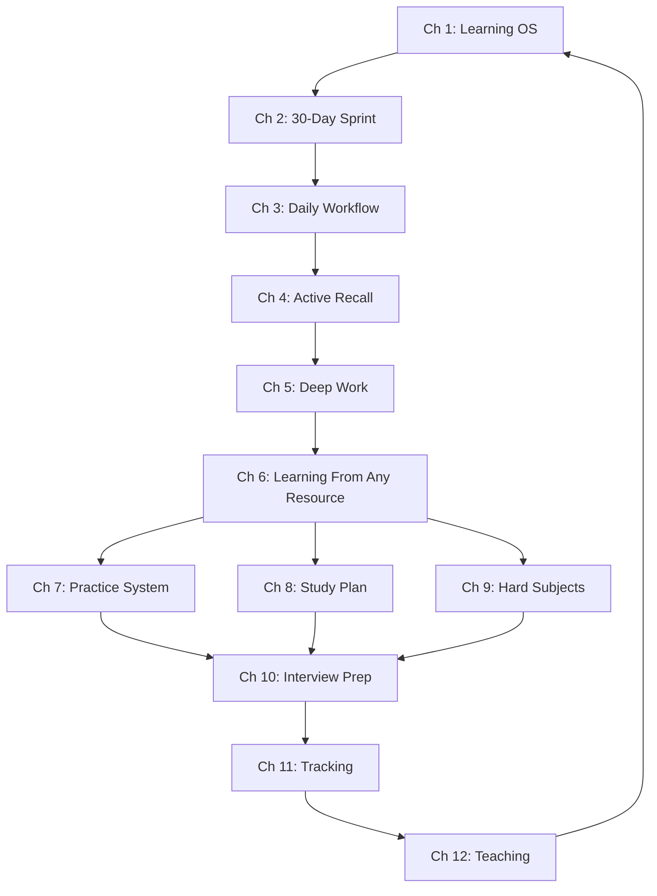

# Learning How to Learn (Practical Edition)

> **Learning systems for any goal. Plain-language walkthroughs for everyone, TypeScript examples for engineers. Designed for SSC, UPSC, GATE, FAANG, language learning, or any skill you want to master.**

## When This Course Helps

| Situation | Start Here |
|-----------|-----------|
| "I'm preparing for SSC CGL / Banking exams" | [Ch 7](ch-07-dsa-practice-system.md) + [Ch 4](ch-04-active-recall-spaced-repetition.md) |
| "I'm studying for UPSC / state PCS" | [Ch 8](ch-08-system-design-study-plan.md) + [Ch 5](ch-05-deep-work-focus.md) |
| "I don't know where to start with System Design" | [Ch 8](ch-08-system-design-study-plan.md) + [Ch 2](ch-02-the-30-day-sprint.md) |
| "I solved 100 LeetCode problems but still fail interviews" | [Ch 7](ch-07-dsa-practice-system.md) + [Ch 4](ch-04-active-recall-spaced-repetition.md) |
| "I read papers but forget everything in a week" | [Ch 4](ch-04-active-recall-spaced-repetition.md) + [Ch 11](ch-11-tracking-course-correction.md) |
| "I have 3 months to prepare for interviews" | [Ch 10](ch-10-interview-prep-workflow.md) + [Ch 2](ch-02-the-30-day-sprint.md) |
| "I keep procrastinating on my study plan" | [Ch 5](ch-05-deep-work-focus.md) + [Ch 3](ch-03-daily-workflow-energy.md) |
| "I want to learn a new language" | [Ch 2](ch-02-the-30-day-sprint.md) + [Ch 4](ch-04-active-recall-spaced-repetition.md) |
| "I want to learn AI/ML but feel overwhelmed" | [Ch 9](ch-09-ai-ml-learning-strategy.md) + [Ch 1](ch-01-your-learning-os.md) |
| "I've been studying for months with no improvement" | [Ch 11](ch-11-tracking-course-correction.md) + [Ch 12](ch-12-building-in-public-teaching.md) |

## Quick Start (Choose Your Path)

- **I'm preparing for SSC / Banking exams:** Start with [Ch 7](ch-07-dsa-practice-system.md) (Practice System), then [Ch 4](ch-04-active-recall-spaced-repetition.md) (Active Recall), then [Ch 8](ch-08-system-design-study-plan.md) (Study Plan)
- **I'm preparing for UPSC / state PCS:** Start with [Ch 8](ch-08-system-design-study-plan.md) (Study Plan), then [Ch 5](ch-05-deep-work-focus.md) (Deep Work), then [Ch 11](ch-11-tracking-course-correction.md) (Tracking)
- **I have 30 days to level up:** Start with [Ch 2](ch-02-the-30-day-sprint.md) (30-Day Sprint), then [Ch 4](ch-04-active-recall-spaced-repetition.md) (Active Recall), then [Ch 5](ch-05-deep-work-focus.md) (Deep Work)
- **I need DSA structure:** Start with [Ch 7](ch-07-dsa-practice-system.md) (Practice System), then [Ch 4](ch-04-active-recall-spaced-repetition.md) (Spaced Repetition), then [Ch 11](ch-11-tracking-course-correction.md) (Tracking)
- **I'm learning a new language:** Start with [Ch 2](ch-02-the-30-day-sprint.md) (30-Day Sprint), then [Ch 4](ch-04-active-recall-spaced-repetition.md) (Active Recall), then [Ch 12](ch-12-building-in-public-teaching.md) (Teaching)
- **I'm learning AI/ML:** Start with [Ch 9](ch-09-ai-ml-learning-strategy.md) (Hard Subjects), then [Ch 6](ch-06-learning-from-code.md) (Learning From Any Resource), then [Ch 12](ch-12-building-in-public-teaching.md) (Teaching)
- **I'm preparing for interviews:** Start with [Ch 10](ch-10-interview-prep-workflow.md) (Interview Prep), then [Ch 8](ch-08-system-design-study-plan.md) (Study Plan), then [Ch 7](ch-07-dsa-practice-system.md) (Practice System)
- **I want the full system:** Read in order, [Ch 1](ch-01-your-learning-os.md) through [Ch 12](ch-12-building-in-public-teaching.md)

## Chapters

| # | Chapter | What You'll Build |
|---|---------|-------------------|
| 1 | [Your Learning OS](ch-01-your-learning-os.md) | OODA learning loop + learning style assessment |
| 2 | [The 30-Day Sprint](ch-02-the-30-day-sprint.md) | Sprint planner for any goal |
| 3 | [Daily Workflow & Energy](ch-03-daily-workflow-energy.md) | Energy-aware study schedule |
| 4 | [Active Recall & Spaced Repetition](ch-04-active-recall-spaced-repetition.md) | Leitner box + SM-2 review system |
| 5 | [Deep Work & Focus](ch-05-deep-work-focus.md) | Focus session tracker |
| 6 | [Learning From Any Resource](ch-06-learning-from-code.md) | Universal resource deconstructor |
| 7 | [Practice System for Mastery](ch-07-dsa-practice-system.md) | Deliberate practice tracker |
| 8 | [Study Plan for Any Exam](ch-08-system-design-study-plan.md) | Exam prep roadmap generator |
| 9 | [Mastering Hard Subjects](ch-09-ai-ml-learning-strategy.md) | Spiral learning planner |
| 10 | [Interview Prep Workflow](ch-10-interview-prep-workflow.md) | Interview preparation tracker |
| 11 | [Tracking & Course Correction](ch-11-tracking-course-correction.md) | Learning dashboard (digital + paper) |
| 12 | [Building in Public & Teaching](ch-12-building-in-public-teaching.md) | Public learning tracker |

## Chapter Structure

Every chapter has two tracks:

```
Learning Objectives      → 5 things you'll be able to do
Theory                   → Core concepts with Mermaid diagram
Examples                 → 📝 Plain-language walkthrough + 💻 TypeScript (optional)
Summary                  → 5 key takeaways
Practical Takeaways      → 3-5 actionable items
Chapter Quiz             → 5 MCQ with answers
Exercises                → 3 universal tasks + 2 TypeScript bonus
```

> The TypeScript examples are **optional**. Every concept is explained in plain language first. Non-programmers can skip the code and still get a complete course.

## Prerequisites

- A learning goal you care about (pick one before starting)
- 30 minutes per day minimum to practice
- *No coding experience required. TypeScript examples are optional bonuses for engineers.*

## Connection to Other Courses

These techniques apply to any learning goal:

| Practical Chapter | Helps With |
|------------------|-----------|
| [Ch 4](ch-04-active-recall-spaced-repetition.md) (Recall) | Retaining any subject — history dates, math formulas, vocabulary, DSA patterns |
| [Ch 6](ch-06-learning-from-code.md) (Resource) | Learning from textbooks, video courses, lectures, or codebases |
| [Ch 7](ch-07-dsa-practice-system.md) (Practice) | Deliberate practice for quant, reasoning, GK, vocabulary, coding |
| [Ch 8](ch-08-system-design-study-plan.md) (Study Plan) | Building a study plan for SSC, UPSC, GATE, FAANG, any exam |
| [Ch 9](ch-09-ai-ml-learning-strategy.md) (Hard Subjects) | Mastering advanced topics — ML, finance, law, medicine |
| [Ch 10](ch-10-interview-prep-workflow.md) (Interview) | Structuring prep for any interview — tech, government, campus |

## Full 12-Week Study Plan

| Week | Chapters | Focus | Weekly Hours |
|------|----------|-------|-------------|
| 1 | [Ch 1](ch-01-your-learning-os.md) + [Ch 3](ch-03-daily-workflow-energy.md) | Set up your learning system + daily workflow | 12 |
| 2 | [Ch 2](ch-02-the-30-day-sprint.md) + [Ch 4](ch-04-active-recall-spaced-repetition.md) | Sprint planning + active recall setup | 14 |
| 3 | [Ch 5](ch-05-deep-work-focus.md) + [Ch 6](ch-06-learning-from-code.md) | Deep work protocol + resource learning | 16 |
| 4 | [Ch 7](ch-07-dsa-practice-system.md) | Practice system foundations | 18 |
| 5 | [Ch 7](ch-07-dsa-practice-system.md) + [Ch 8](ch-08-system-design-study-plan.md) | Practice + study plan | 18 |
| 6 | [Ch 8](ch-08-system-design-study-plan.md) | Study plan deep dive | 18 |
| 7 | [Ch 9](ch-09-ai-ml-learning-strategy.md) | Mastering hard subjects | 16 |
| 8 | [Ch 9](ch-09-ai-ml-learning-strategy.md) + [Ch 10](ch-10-interview-prep-workflow.md) | Hard subjects + interview prep | 18 |
| 9 | [Ch 10](ch-10-interview-prep-workflow.md) | Interview prep workflow | 20 |
| 10 | [Ch 11](ch-11-tracking-course-correction.md) | Tracking and course correction | 14 |
| 11 | [Ch 12](ch-12-building-in-public-teaching.md) | Building in public and teaching | 12 |
| 12 | All | Review, retrospect, plan next 12 weeks | 12 |

## Concept Map



## FAQ

### Do I need to read the original Learning How to Learn course first?

No. This practical edition is self-contained. The original course is a reference with 290+ Q&As for deep dives. Use it when you want more theory on a specific topic.

### How much time do I need per day?

Minimum 30 minutes for the daily minimum. Optimal is 1.5-2 hours if you want to complete the 12-week plan. The most important thing is consistency — 30 min daily beats 4 hours twice a week.

### I already use Anki. Do I need Chapter 4?

[Chapter 4](ch-04-active-recall-spaced-repetition.md) covers active recall beyond flashcards — the blank page method, the Leitner box, and recall techniques for any subject. Even if you're an Anki power user, the non-digital techniques will help.

### Can I skip chapters?

Yes. Each chapter is self-contained. Use the "[When This Course Helps](#when-this-course-helps)" table or the "[Diagnostic Pre-Test](#diagnostic-pre-test)" to find your starting point. The chapters build on each other if read in order, but you can skip to any chapter based on your current need.

### What if I don't know TypeScript?

You don't need it. Every concept has a **plain-language walkthrough** before any code. The TypeScript blocks are optional bonuses for engineers. Read only the plain sections — you'll still get a complete, actionable course.

### How do I track my progress?

[Chapter 11](ch-11-tracking-course-correction.md) provides a complete dashboard — available as a digital tracker or a paper journal template. Start tracking from day 1. Run a weekly review every Sunday.

### Can I use this for SSC / government exam preparation?

Yes. Chapters 4, 5, 7, 8, and 11 are especially relevant. The course teaches you **how** to learn any subject — the techniques work for quantitative aptitude, general awareness, reasoning, and language sections.

### Does this work for learning a new language?

Yes. The 30-Day Sprint (Ch 2), Active Recall (Ch 4), and Teaching (Ch 12) are especially effective for language acquisition.

## Prerequisites Detail

### Required
- **A learning goal:** This course teaches you how to learn anything. Pick one: SSC/UPSC exam prep, coding interviews, a new language, AI/ML, or any skill
- **30 min/day minimum:** The techniques require practice. Reading alone won't change your learning

### Recommended
- **A notebook or note-taking app** for the learning dashboard in [Chapter 11](ch-11-tracking-course-correction.md)
- **Access to Anki or physical flashcards** for spaced repetition in [Chapter 4](ch-04-active-recall-spaced-repetition.md)
- **A code editor** (VS Code recommended) — only if you want to run the TypeScript examples

## How This Course Is Different

| Traditional Approach | This Course |
|---------------------|-------------|
| Read about learning techniques | Apply them with templates and walkthroughs |
| Generic advice for students | Specific, actionable frameworks for your goal |
| Neuroscience-heavy explanations | Practical "what to do Monday morning" |
| Passive reading | Active exercises every chapter (no-code + optional code) |
| One-size-fits-all | Two tracks: plain language for everyone + TypeScript for engineers |
| Requires special tools | Works with just a notebook and pen |

## Diagnostic Pre-Test

Which chapters do you actually need? Answer these 10 questions:

| # | Question | If NO → Study |
|---|----------|--------------|
| 1 | Can you describe your current learning workflow in 3 sentences? | [Ch 1](ch-01-your-learning-os.md) |
| 2 | Do you have a specific, measurable learning goal right now? | [Ch 1](ch-01-your-learning-os.md) |
| 3 | Can you structure a 30-day plan for any new topic? | [Ch 2](ch-02-the-30-day-sprint.md) |
| 4 | Do you know when your peak energy hours are and schedule study accordingly? | [Ch 3](ch-03-daily-workflow-energy.md) |
| 5 | Do you use active recall (not re-reading) as your primary study method? | [Ch 4](ch-04-active-recall-spaced-repetition.md) |
| 6 | Can you do 90 minutes of uninterrupted focused work? | [Ch 5](ch-05-deep-work-focus.md) |
| 7 | Do you have a system for learning from any resource (book, video, lecture)? | [Ch 6](ch-06-learning-from-code.md) |
| 8 | Do you have a deliberate practice routine with error analysis? | [Ch 7](ch-07-dsa-practice-system.md) |
| 9 | Do you have a phased study plan for your upcoming exam? | [Ch 8](ch-08-system-design-study-plan.md) |
| 10 | Can you break down a complex topic into prerequisite steps? | [Ch 9](ch-09-ai-ml-learning-strategy.md) |

> **How to use:** Answer honestly. For every "NO", add that chapter to your must-read list. For "YES" answers, skim the Theory and go straight to the Quick Reference cheat sheet at the end.

## Course Progress Tracker

Print this checklist. Mark chapters as you complete them.

| # | Chapter | Theory | Plain Walkthrough | Quiz (8/10) | Exercises | Quick Reference |
|---|---------|--------|-------------------|------------|-----------|-----------------|
| ☐ | 1 | [Your Learning OS](ch-01-your-learning-os.md) | ☐ | ☐ | ☐ | ☐ | ☐ |
| ☐ | 2 | [The 30-Day Sprint](ch-02-the-30-day-sprint.md) | ☐ | ☐ | ☐ | ☐ | ☐ |
| ☐ | 3 | [Daily Workflow & Energy](ch-03-daily-workflow-energy.md) | ☐ | ☐ | ☐ | ☐ | ☐ |
| ☐ | 4 | [Active Recall & Spaced Repetition](ch-04-active-recall-spaced-repetition.md) | ☐ | ☐ | ☐ | ☐ | ☐ |
| ☐ | 5 | [Deep Work & Focus](ch-05-deep-work-focus.md) | ☐ | ☐ | ☐ | ☐ | ☐ |
| ☐ | 6 | [Learning From Any Resource](ch-06-learning-from-code.md) | ☐ | ☐ | ☐ | ☐ | ☐ |
| ☐ | 7 | [Practice System for Mastery](ch-07-dsa-practice-system.md) | ☐ | ☐ | ☐ | ☐ | ☐ |
| ☐ | 8 | [Study Plan for Any Exam](ch-08-system-design-study-plan.md) | ☐ | ☐ | ☐ | ☐ | ☐ |
| ☐ | 9 | [Mastering Hard Subjects](ch-09-ai-ml-learning-strategy.md) | ☐ | ☐ | ☐ | ☐ | ☐ |
| ☐ | 10 | [Interview Prep Workflow](ch-10-interview-prep-workflow.md) | ☐ | ☐ | ☐ | ☐ | ☐ |
| ☐ | 11 | [Tracking & Course Correction](ch-11-tracking-course-correction.md) | ☐ | ☐ | ☐ | ☐ | ☐ |
| ☐ | 12 | [Building in Public & Teaching](ch-12-building-in-public-teaching.md) | ☐ | ☐ | ☐ | ☐ | ☐ |
| ☐ | 13 | [Final Capstone: Design Your System](ch-13-final-capstone.md) | ☐ | ☐ | ☐ | ☐ | ☐ |

## Learning Outcomes

After completing this course, you will have:
1. A personal learning system that works for any goal ([Ch 1](ch-01-your-learning-os.md))
2. The ability to master any topic in 30 days ([Ch 2](ch-02-the-30-day-sprint.md))
3. A daily workflow optimized for your energy patterns ([Ch 3](ch-03-daily-workflow-energy.md))
4. Active recall and spaced repetition skills you can use anywhere ([Ch 4](ch-04-active-recall-spaced-repetition.md))
5. The ability to do deep, focused work on demand ([Ch 5](ch-05-deep-work-focus.md))
6. A repeatable process for learning from any resource ([Ch 6](ch-06-learning-from-code.md))
7. A structured practice system for any subject ([Ch 7](ch-07-dsa-practice-system.md))
8. A study plan for any exam, from SSC to FAANG ([Ch 8](ch-08-system-design-study-plan.md))
9. A strategy for mastering hard subjects without burnout ([Ch 9](ch-09-ai-ml-learning-strategy.md))
10. A complete interview preparation workflow ([Ch 10](ch-10-interview-prep-workflow.md))
11. A learning dashboard to track and course-correct ([Ch 11](ch-11-tracking-course-correction.md))
12. The habit of teaching to solidify your knowledge ([Ch 12](ch-12-building-in-public-teaching.md))
13. A complete learning system integrating all 12 techniques ([Ch 13](ch-13-final-capstone.md))

## How to Read

1. **Diagnose:** Take the [Diagnostic Pre-Test](#diagnostic-pre-test). Skip chapters you already know. Focus on your gaps
2. **Track:** Print the [Course Progress Tracker](#course-progress-tracker). Check off each chapter as you complete it
3. **Daily:** Pick one chapter per week. Read the Theory section (15 min). Follow the plain-language walkthrough (20 min). Do the exercises (25 min)
4. **Weekly:** Review the Practical Takeaways from the previous week. Take the Chapter Quiz. Use the Quick Reference cheat sheet for review
5. **Graduate:** Complete [Ch 13: Final Capstone](ch-13-final-capstone.md) to integrate everything into one system
6. **Reference:** Return to any chapter's Common Mistakes and Quick Reference when you hit a specific problem

> **Start with [Chapter 1: Your Learning OS](ch-01-your-learning-os.md)** — because without a system, no technique will save you.

---

*Also available: the original [Learning How to Learn reference course](../learning-how-to-learn/index.md) with 290+ Q&As and deep dives into cognitive science.*

---

**[Next: Chapter 1 — Your Learning OS](ch-01-your-learning-os.md)**
