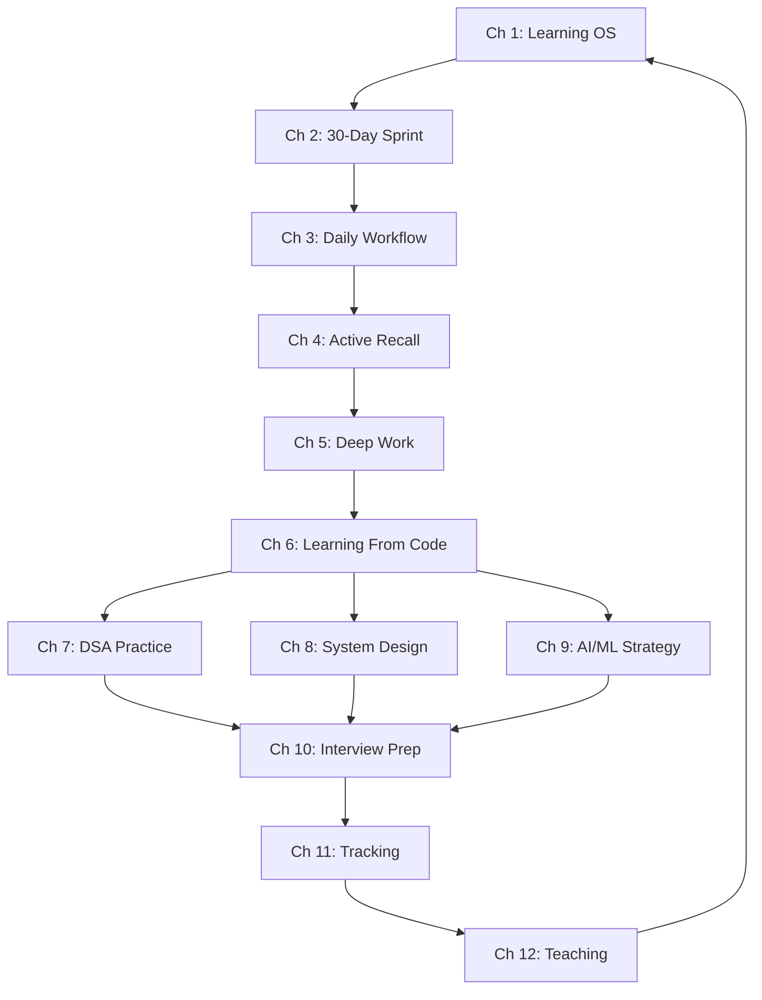

# Learning How to Learn (Practical Edition)

> **Actionable systems. Real TypeScript. Zero fluff. Designed for engineers who want to crack FAANG/MNC interviews.**

## When This Course Helps

| Situation | Start Here |
|-----------|-----------|
| "I don't know where to start with System Design" | Ch 8 + Ch 2 |
| "I solved 100 LeetCode problems but still fail interviews" | Ch 7 + Ch 4 |
| "I read papers but forget everything in a week" | Ch 4 + Ch 11 |
| "I have 3 months to prepare for interviews" | Ch 10 + Ch 2 |
| "I keep procrastinating on my study plan" | Ch 5 + Ch 3 |
| "I want to learn AI/ML but feel overwhelmed" | Ch 9 + Ch 1 |
| "I've been studying for months with no improvement" | Ch 11 + Ch 12 |

## Quick Start (Choose Your Path)

- **I have 30 days to level up:** Start with Ch 2 (30-Day Sprint), then Ch 4 (Active Recall), then Ch 5 (Deep Work)
- **I need DSA structure:** Start with Ch 7 (DSA System), then Ch 4 (Spaced Repetition), then Ch 11 (Tracking)
- **I'm learning AI/ML:** Start with Ch 9 (AI/ML Strategy), then Ch 6 (Learning From Code), then Ch 12 (Teaching)
- **I'm preparing for interviews:** Start with Ch 10 (Interview Prep), then Ch 8 (System Design), then Ch 7 (DSA)
- **I want the full system:** Read in order, Ch 1 through Ch 12

## Chapters

| # | Chapter | Lines | TypeScript | Mermaid | What You'll Build |
|---|---------|-------|------------|---------|-------------------|
| 1 | Your Learning OS | ~550 | 3 blocks | 1 | OODA learning loop |
| 2 | The 30-Day Sprint | ~500 | 2 blocks | 1 | Sprint planner |
| 3 | Daily Workflow & Energy | ~480 | 3 blocks | 1 | Energy-aware scheduler |
| 4 | Active Recall & Spaced Repetition | ~550 | 3 blocks | 1 | SM-2 algorithm |
| 5 | Deep Work & Focus | ~480 | 3 blocks | 1 | Focus session tracker |
| 6 | Learning From Code | ~500 | 3 blocks | 1 | Codebase analyzer |
| 7 | DSA Practice System | ~550 | 3 blocks | 1 | Review scheduler |
| 8 | System Design Study Plan | ~520 | 3 blocks | 1 | Design evaluator |
| 9 | AI/ML Learning Strategy | ~480 | 3 blocks | 1 | Paper study planner |
| 10 | Interview Prep Workflow | ~550 | 3 blocks | 1 | Interview tracker |
| 11 | Tracking & Course Correction | ~480 | 3 blocks | 1 | Learning dashboard |
| 12 | Building in Public & Teaching | ~480 | 3 blocks | 1 | Public learning tracker |

## Chapter Structure

Every chapter follows the same format:

```
Learning Objectives     → 5 things you'll be able to do
Theory                  → Core concepts with Mermaid diagram
Examples                → TypeScript code you can run
Summary                 → 5 key takeaways
Practical Takeaways     → 3-5 actionable items
Chapter Quiz            → 5 MCQ with answers
Exercises               → 5 tasks you can do today
```

## Prerequisites

- Basic TypeScript/JavaScript (understand classes, interfaces, functions)
- A learning goal you care about (pick one before starting)
- 30 minutes per day minimum to practice

## Connection to Other Courses

This course is designed to support your FAANG/MNC interview preparation:

| Practical Chapter | Helps With |
|------------------|-----------|
| Ch 4 (Recall) | Retaining DSA patterns, system design concepts |
| Ch 6 (Code) | Learning any new framework or codebase |
| Ch 7 (DSA) | Structuring LeetCode practice |
| Ch 8 (System Design) | Building a study plan for design rounds |
| Ch 9 (AI/ML) | Navigating papers and frameworks |
| Ch 10 (Interview) | Structuring your full prep cycle |


## Full 12-Week Study Plan

| Week | Chapters | Focus | Weekly Hours |
|------|----------|-------|-------------|
| 1 | Ch 1 + Ch 3 | Set up your learning system + daily workflow | 12 |
| 2 | Ch 2 + Ch 4 | Sprint planning + active recall setup | 14 |
| 3 | Ch 5 + Ch 6 | Deep work protocol + code learning | 16 |
| 4 | Ch 7 | DSA practice system foundations | 18 |
| 5 | Ch 7 + Ch 8 | DSA + system design study plan | 18 |
| 6 | Ch 8 | System design deep dive | 18 |
| 7 | Ch 9 | AI/ML learning strategy | 16 |
| 8 | Ch 9 + Ch 10 | AI/ML + interview prep | 18 |
| 9 | Ch 10 | Interview prep workflow | 20 |
| 10 | Ch 11 | Tracking and course correction | 14 |
| 11 | Ch 12 | Building in public and teaching | 12 |
| 12 | All | Review, retrospect, plan next 12 weeks | 12 |

## Concept Map

This diagram shows how the chapters connect:



## FAQ

### Do I need to read the original Learning How to Learn course first?

No. This practical edition is self-contained. The original course is a reference with 290+ Q&As for deep dives. Use it when you want more theory on a specific topic.

### How much time do I need per day?

Minimum 30 minutes for the daily minimum. Optimal is 1.5-2 hours if you want to complete the 12-week plan. The most important thing is consistency — 30 min daily beats 4 hours twice a week.

### I already use Anki. Do I need Chapter 4?

Chapter 4 covers active recall beyond flashcards — the blank page method, code tracing, and design recall. Even if you're an Anki power user, the non-flashcard techniques will help.

### Can I skip chapters?

Yes. Each chapter is self-contained. Use the "When This Course Helps" table to find your starting point. The chapters build on each other if read in order, but you can jump to any chapter based on your current need.

### What if I don't know TypeScript?

The TypeScript code is simple — classes, interfaces, functions. Even without TypeScript knowledge, the concepts and comments explain what each function does. You can implement the same ideas in Python, Java, or any language.

### How do I track my progress?

Chapter 11 (Tracking & Course Correction) provides a complete dashboard. Start tracking from day 1 using the LearningDashboard class. Run a weekly review every Sunday.

## Prerequisites Detail

### Required
- **Basic programming:** Understand variables, functions, classes, if/else, loops. TypeScript is used for examples but transferable
- **A learning goal:** This course teaches you how to learn anything. You need something specific to apply it to. Pick one: DSA mastery, system design, a new framework, or interview prep
- **30 min/day minimum:** The techniques require practice. Reading alone won't change your learning

### Recommended
- **Access to Anki** (free, all platforms) for spaced repetition in Chapter 4
- **A code editor** (VS Code recommended) for TypeScript examples
- **A notebook or note-taking app** for the learning dashboard in Chapter 11

## How This Course Is Different

| Traditional Approach | This Course |
|---------------------|-------------|
| Read about learning techniques | Implement them in TypeScript |
| Generic advice for students | Specific to FAANG/MNC interview prep |
| Neuroscience-heavy explanations | Practical "what to do Monday morning" |
| Passive reading | Active exercises every chapter |
| One-size-fits-all | Choose your own path based on goal |
| No code | Real TypeScript implementations |

## Learning Outcomes

After completing this course, you will have:
1. A personal learning system that works for any goal (Ch 1)
2. The ability to master any topic in 30 days (Ch 2)
3. A daily workflow optimized for your energy patterns (Ch 3)
4. Active recall and spaced repetition skills with real tools (Ch 4)
5. The ability to do deep, focused work on demand (Ch 5)
6. A repeatable process for learning any codebase (Ch 6)
7. A structured DSA practice system with spaced review (Ch 7)
8. A system design study plan from zero to mock-ready (Ch 8)
9. An AI/ML learning strategy that avoids overwhelm (Ch 9)
10. A complete interview preparation workflow (Ch 10)
11. A learning dashboard to track and course-correct (Ch 11)
12. The habit of teaching to solidify your knowledge (Ch 12)


## How to Read

1. **Daily:** Pick one chapter per week. Read the Theory section (15 min). Run the TypeScript examples (20 min). Do the exercises (25 min)
2. **Weekly:** Review the Practical Takeaways from the previous week. Take the Chapter Quiz. Track your progress in Ch 11's dashboard
3. **Reference:** Return to any chapter when you hit a specific problem (procrastination, forgetting, plateaus)

> **Start with Chapter 1: Your Learning OS** — because without a system, no technique will save you.

---

*Also available: the original [Learning How to Learn reference course](../learning-how-to-learn/index.md) with 290+ Q&As and deep dives into cognitive science.*
