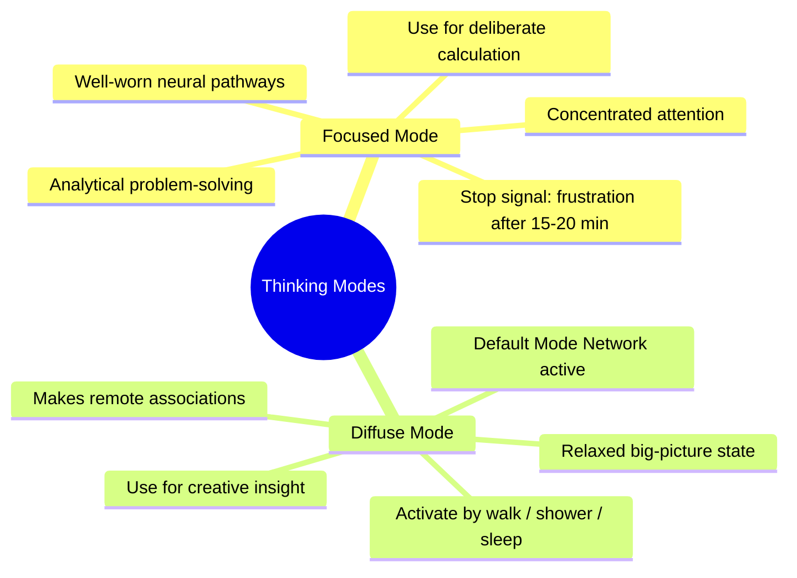
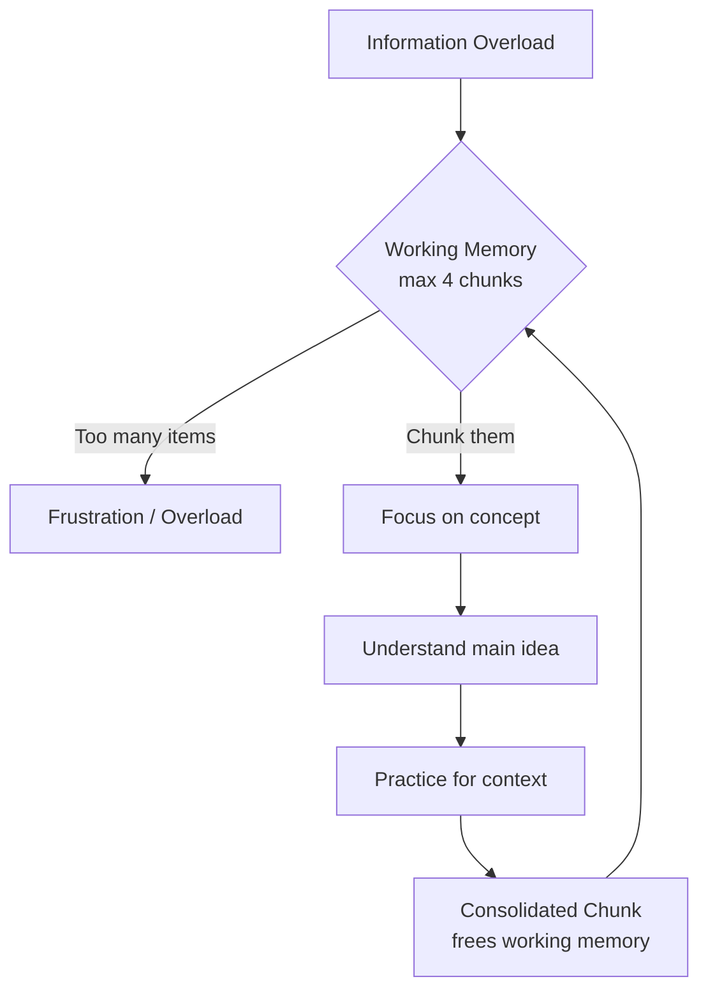
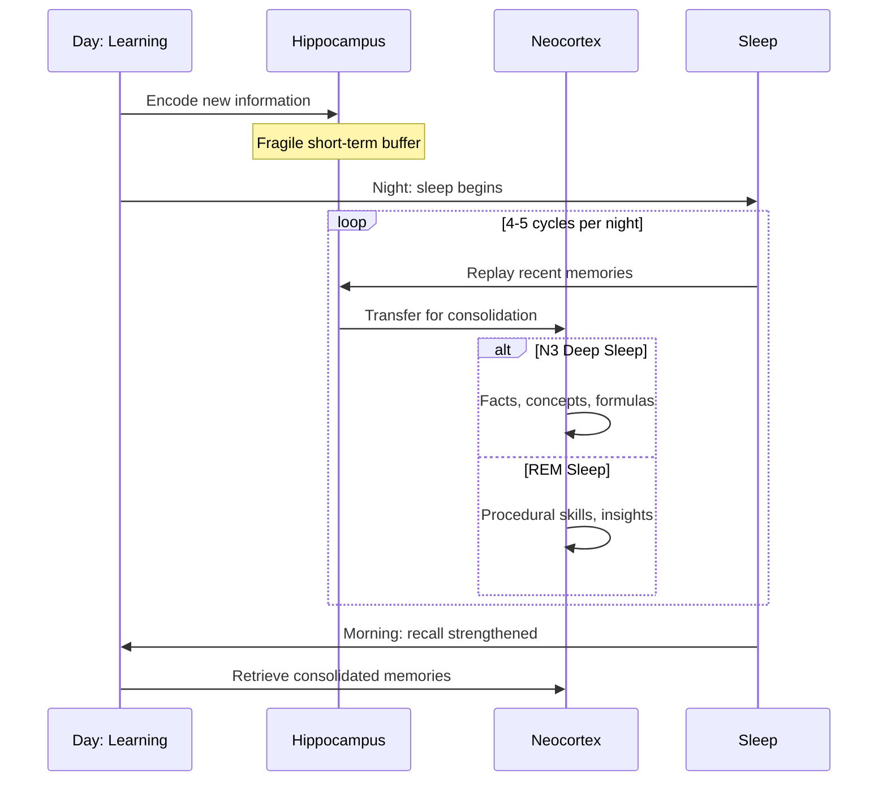
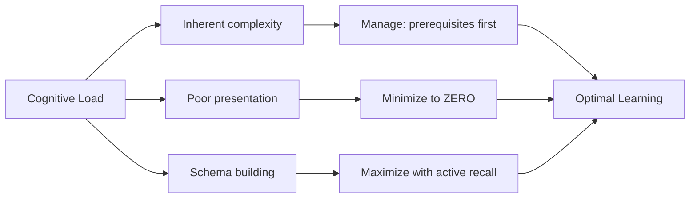

# Chapter 1: How Your Brain Learns

This chapter covers the brain's two learning modes — focused and diffuse — and how switching between them accelerates understanding. You'll learn about chunking (how working memory's 4-slot limit shapes studying), the difference between procedural and declarative knowledge, and why sleep is essential for memory consolidation. By the end, you'll have a practical framework for learning any technical subject more effectively.

## Learning Objectives


- Understand focused vs diffuse thinking and when to use each
- Explain the 4-chunk limit and how to build chunks
- Distinguish procedural knowledge from declarative knowledge
- Explain sleep's role in memory consolidation
- Explain neuroplasticity and how the brain physically changes with learning
- Describe how sleep architecture, exercise, and stress affect memory and cognition
- Apply cognitive load theory and circadian rhythm awareness to design effective study sessions

### Chapter at a Glance

| Topic | Key Insight | Practical Takeaway |
|-------|-------------|-------------------|
| Focused vs Diffuse Mode | Brain switches between concentrated & relaxed thinking | Switch every 15-20 min when stuck |
| Chunking | Working memory holds ~4 chunks | Build chunks via focus → understand → practice |
| Procedural vs Declarative | Knowing-that vs knowing-how | Test by doing, not re-reading |
| Sleep & Memory | Sleep consolidates → long-term storage | Review before bed, sleep 7+ hours |
| Neuroplasticity | Brain rewires with practice | Consistent practice > cramming |
| Cognitive Load | Intrinsic + extraneous + germane load | Remove distractions, scaffold learning |
| Multitasking | Attention residue costs 40% efficiency | Single-task, batch interruptions |
| Exercise & BDNF | BDNF boosts hippocampal growth | 20 min cardio before study sessions |

---

### Q1: What are focused and diffuse modes of thinking, and when should you use each?

**Answer:** Focused mode is concentrated, attentive thinking on a specific problem using well-worn neural pathways. Diffuse mode is a relaxed, big-picture state where your brain makes remote associations. You need both.



When you sit down to solve a subnetting problem from `docs/courses/gate-cs-preparation/09-computer-networks.md` — say, finding the network address for `192.168.15.42/27` — you engage focused mode. You apply the formula: `/27` means 255.255.255.224, block size = 32, network address = `192.168.15.32`. Your brain fires precise, practiced circuits.

But if you stare at the problem for 20 minutes and still can't figure out why the broadcast address is `192.168.15.63`, you need diffuse mode. Get up. Walk. Shower. Your brain's default mode network continues working subconsciously, making remote connections. Many students report the answer arrives while brushing their teeth.

```java
// Focused mode: deliberate calculation
public class SubnetCalculator {
    public static String getNetworkAddress(String ip, int cidr) {
        String[] octets = ip.split("\\.");
        int mask = 0xFFFFFFFF << (32 - cidr);
        int ipInt = (Integer.parseInt(octets[0]) << 24) |
                    (Integer.parseInt(octets[1]) << 16) |
                    (Integer.parseInt(octets[2]) << 8)  |
                     Integer.parseInt(octets[3]);
        int network = ipInt & mask;
        return String.format("%d.%d.%d.%d",
            (network >> 24) & 0xFF, (network >> 16) & 0xFF,
            (network >> 8) & 0xFF, network & 0xFF);
    }
}
```

**Try This:** Open `docs/courses/computer-networks/index.md` and study the OSI model for 10 minutes in focused mode. Then close it and go for a 5-minute walk without thinking about it. When you return, try to recall all 7 layers from memory.

---

### Q2: How do you know when to switch between focused and diffuse modes?

**Answer:** The signal is **frustration**. If you've been working on a problem for 15-20 minutes and feel stuck, confused, or annoyed — that's your cue to switch to diffuse mode.

In `docs/courses/placement-preparation/02-dsa-problem-bank.md`, Q37 asks you to find the median of two sorted arrays in O(log(min(n,m))). This is a hard problem. If you've sketched three approaches (merge-and-find, two-pointer, binary search on the smaller array) and all have flaws, continuing to stare at the screen yields diminishing returns. Your mental "chalkboard" is full.

Stop. Take a walk. Let your brain's diffuse networks re-organize what you've learned. When you return, the approach (binary search on partitions) often feels obvious. The neural replay during rest cements what you've been studying.

**Try This:** Pick a DSA problem from `02-dsa-problem-bank.md` you couldn't solve last week. Work on it for 15 minutes. If stuck, walk away for 10 minutes. Come back and solve it. Notice the difference.

---

### Q3: What is the 4-chunk limit, and how does it affect studying?

**Answer:** Working memory can hold roughly 4 discrete chunks of information simultaneously (the "magic number 4"). Each chunk is a package of related concepts. To learn complex material, you must compress information into larger chunks.



Look at the Java course structure in `docs/courses/java/index.md`. The course has 13 parts with 66+ chapters. If you tried to hold "Part III: Spring Boot Fundamentals" as 6 separate chapters (DI, auto-configuration, properties, Actuator, logging, testing), that's 6 items — over the limit. Instead, chunk it:

1. **Spring Boot Core** (DI, auto-config, properties, profiles)
2. **Actuator & Observability** (Actuator, logging, metrics)
3. **Testing** (unit, integration, security tests)

Now it's 3 chunks. Each chunk is a rich neural pattern containing sub-knowledge, but your conscious mind sees just 3 items — well within limits.

```java
public class ChunkExample {
    // Before: 6 separate concepts (overload)
    @Configuration @EnableAutoConfiguration
    @ComponentScan
    public class FragmentedApp { }

    // After: 1 chunk — "@SpringBootApplication does it all"
    @SpringBootApplication  // = @Config + @EnableAutoConfig + @ComponentScan
    public class ChunkedApp { }
}
```

**Try This:** Open `docs/courses/java/index.md`. The entire Spring Boot part (Part III, chapters 9-14) has 6 chapters. Write down 2-3 chunks that cover all 6. Use those chunks to explain Spring Boot to a friend.

---

### Q4: How do you build a chunk from new material?

**Answer:** A chunk is built through three steps: (1) **focus** your attention on the concept, (2) **understand** the main idea, (3) **practice** to build context so you know when to use it.

Take "Binary Search Tree" from `docs/courses/data-structures/09-bst.md`. Here's how to chunk it:

**Step 1 — Focus:** Read the BST property: left subtree < node < right subtree. Write it down.
**Step 2 — Understand:** Trace through insert(50), insert(30), insert(80), insert(20), insert(40). Draw each step. Why does 20 go left of 30? Why does 40 go right of 30? Understand the recursive structure.
**Step 3 — Context:** When do you use a BST vs a hash table? BST gives ordered traversal (sorted order), floor/ceiling, range queries. Hash table gives O(1) lookup but no order.

```java
class BST {
    Node root;
    // Chunked understanding: "smaller goes left, larger goes right"
    Node insert(Node node, int key) {
        if (node == null) return new Node(key);
        if (key < node.key) node.left = insert(node.left, key);
        else if (key > node.key) node.right = insert(node.right, key);
        return node;
    }
    // After chunking, you see this pattern everywhere
}
```

**Try This:** Open `docs/courses/data-structures/index.md`, pick any chapter (e.g., Heaps), and apply the 3-step chunking process. Write a one-sentence summary that captures the entire data structure.

---

### Q5: How does chunk hierarchy help you understand layered systems?

**Answer:** Complex systems have natural chunk hierarchies. Understanding the hierarchy lets you "zoom in" on details or "zoom out" to the big picture without getting lost.

The OSI 7-layer model from `docs/courses/gate-cs-preparation/09-computer-networks.md` (section 1) is a classic example. Instead of memorizing 7 separate layers, compress them into 4 functional groups:

1. **Media layers** (Physical + Data Link) — getting bits from A to B on the same wire
2. **Network layer** — routing across different networks (IP)
3. **Transport layer** — reliable end-to-end delivery (TCP)
4. **Application layers** (Session + Presentation + Application) — what the user sees

Now your brain holds 4 chunks instead of 7. Each chunk can expand when needed. If a GATE question asks about "which layer handles encryption," you zoom into the Application chunk and recall: Presentation layer (Layer 6).

```java
public enum OsiLayer {
    PHYSICAL(1, "Bits"),   DATA_LINK(2, "Frames"),
    NETWORK(3, "Packets"), TRANSPORT(4, "Segments"),
    SESSION(5, "Data"),    PRESENTATION(6, "Data"),
    APPLICATION(7, "Data");

    // Chunk: "Please Do Not Throw Sausage Pizza Away"
    // Better chunk: Media(1-2) → Net(3) → Transport(4) → App(5-7)
}
```

**Try This:** Open `docs/courses/computer-networks/index.md` and create your own chunk hierarchy for the TCP/IP model (4 layers). Map each to its job in one sentence.

---

### Q6: What's the difference between procedural and declarative knowledge, and why does it matter?

**Answer:** Declarative knowledge is "knowing *that*" — facts, concepts, theories. Procedural knowledge is "knowing *how*" — the ability to execute a process. Learning requires both, but they live in different memory systems.

From `docs/courses/placement-preparation/02-dsa-problem-bank.md`: you can **declare** that recursion has a base case and a recursive case (declarative). But **procedurally** writing a recursive DFS on a tree requires practice:

```java
// Declarative knowledge: "DFS visits all nodes depth-first"
// Procedural knowledge: writing this code from scratch
void dfs(TreeNode node) {
    if (node == null) return;               // base case
    System.out.print(node.val + " ");       // visit
    dfs(node.left);                          // recurse left
    dfs(node.right);                         // recurse right
}
```

Many students read the code and think "I understand" — that's declarative. But ask them to write it from memory and they freeze. The illusion of competence (Q9) comes from confusing declarative and procedural knowledge. You only truly know something when you can *do* it.

**Try This:** Read the explanation of BFS in `docs/courses/data-structures/12-graph-traversals.md` (declarative). Then close the file and implement BFS from memory (procedural). Open it again and compare. Repeat until you can write it perfectly.

---

### Q7: How does sleep affect memory consolidation?

**Answer:** Sleep is when your brain moves information from short-term (hippocampus) to long-term (neocortex) memory. Without adequate sleep, learning that happened during the day is not consolidated — it's like saving a file without clicking "Save."



Before a GATE exam, many students pull all-nighters studying `docs/courses/gate-cs-preparation/07-operating-systems.md`. This is counterproductive. The formulas for CPU scheduling (TAT, WT, RT from the Cheat Sheet) need sleep to consolidate. If you study them at 10 PM and sleep 8 hours, you'll recall them better at 9 AM than if you studied until 4 AM.

**Sleep stages matter:** Stage 3 (deep sleep) strengthens factual knowledge. REM sleep integrates procedural skills and creative problem-solving. Both are essential. A 7-8 hour sleep cycle contains 4-5 full cycles.

```java
// Your brain during sleep ≈ background database backup
public class MemoryConsolidation {
    // During wake: buffer writes (hippocampus)
    Map<Concept, String> shortTerm = new HashMap<>();
    // During sleep: flush to persistent storage (neocortex)
    Database longTerm = new Database();

    void sleep() {
        for (var entry : shortTerm.entrySet()) {
            longTerm.upsert(entry.getKey(), entry.getValue());
        }
        shortTerm.clear();  // ready for tomorrow
    }
}
```

**Try This:** Tonight, spend 20 minutes reviewing the formula sheet in `docs/courses/gate-cs-preparation/07-operating-systems.md` before bed. Do NOT look at your phone. Sleep 7+ hours. Test yourself in the morning. Compare recall with what you remember from last night.

---

### Q8: What is neuroplasticity and how does it enable lifelong learning?

**Answer:** Neuroplasticity is the brain's ability to reorganize itself by forming new neural connections throughout life. It is the biological basis of learning.

The core mechanism is **Hebbian plasticity**, summarized as "neurons that fire together wire together." When you repeatedly practice a skill, the synapses between the involved neurons strengthen through a process called **long-term potentiation (LTP)**. Think of it like a footpath in a forest: the first time you walk through, there's barely a trace. After 100 walks, a clear trail exists. After 1,000, it's a road.

At the molecular level, LTP involves glutamate receptors (AMPA and NMDA) on the post-synaptic neuron increasing in density and sensitivity. More receptors means a stronger signal passes more easily. This is synapse strengthening — your brain literally grows more hardware for frequently used circuits.

This is why **practice is not just mental** — it's structural. Every time you solve a recursion problem, you are physically changing the dendrites and spines in your prefrontal cortex. The myelin sheaths around frequently fired axons thicken, increasing signal speed by up to 100x. This is why experts can spot patterns novices miss: their neural infrastructure is physically different.

```java
// Neural pathways behave like JIT-compiled methods
public class NeuralJITAnalogy {
    // First invocation: slow interpretation (novice)
    public int solveRecursion(int n) {
        // interpretive path, many cycle overheads
        if (n <= 1) return n;
        return solveRecursion(n - 1) + solveRecursion(n - 2);
    }

    // After 10,000 invocations: JIT-compiled (expert)
    // The JIT replaces the method call with inlined, optimized
    // native code — same as neural pathways becoming myelinated
    // fast-track routes after repeated practice.
}
```

**Key implication for students:** Your intelligence is not fixed. Every hour of deliberate practice literally grows your neural capacity. The growth is slow (measurable over days and weeks, not minutes), but it compounds. The student who practices consistently for 30 days will have structurally different brains from the one who crammed for 2 days.

**Try This:** Pick one skill you want to improve — writing recursive functions, using Git, or debugging. Practice it for 15 minutes every day for the next 3 days. At the end of day 3, compare your fluency to day 1. Note the specific improvements in speed, accuracy, and confidence. That's your brain rewiring itself.

---


### Q9: What is the Default Mode Network and how does it support diffuse thinking?

**Answer:** The Default Mode Network (DMN) is a network of brain regions — including the medial prefrontal cortex, posterior cingulate cortex, and angular gyrus — that is most active when you are not focused on any external task. It is the neural basis of diffuse mode.

When you daydream, shower, walk, or stare out a window, your DMN lights up. It connects disparate pieces of knowledge stored across your cortex, forming associations your focused mode would never make. This is why your best ideas arrive when you are not trying.


The DMN has been confirmed through fMRI studies showing that during mind-wandering, the same regions activated during creative problem-solving show elevated activity. When you are stuck on a hard DSA problem from `02-dsa-problem-bank.md` and decide to take a shower, the DMN is actively cross-referencing your recent study material with older, related knowledge stored in long-term memory.

**The insight paradox:** The harder you try to have a creative insight, the less likely it is to arrive. Insight requires DMN activation, but the DMN is suppressed when you deliberately focus. This is why walk-away time is not wasted time — it's neurobiologically essential.

```java
// DMN as a background indexer
public class DefaultModeNetwork {
    private Set<Chunk> longTermMemory = new HashSet<>();
    private List<Association> insights = new ArrayList<>();

    // Runs when you're NOT focusing — like Lucene's near-realtime search
    void idleCycle(List<RecentStudy> today) {
        for (var study : today) {
            for (var memory : longTermMemory) {
                double relevance = cosineSimilarity(study, memory);
                if (relevance > INSIGHT_THRESHOLD) {
                    insights.add(new Association(study, memory));
                }
            }
        }
    }

    double cosineSimilarity(RecentStudy a, Chunk b) {
        // In your brain, this is the DMN making remote connections
        return random() * 0.8 + 0.2;  // simplified
    }
}
```

**Try This:** Pick a problem you've been stuck on for more than an hour. Stop working on it entirely. Go for a 15-minute walk with no music, no phone, no podcasts — just your thoughts. Bring a small notebook. When an idea surfaces (and it will), write it down immediately. Notice that the insight emerged only when you stopped trying.

---

### Q10: What is Cognitive Load Theory and how does it affect studying?

**Answer:** Cognitive Load Theory (CLT), developed by John Sweller in the 1980s, describes how the limited capacity of working memory constrains learning.



Learning is effective only when instructional design respects these limits.

There are three types of cognitive load:

**1. Intrinsic Load** — the inherent complexity of the material itself. A problem with 5 interacting variables has higher intrinsic load than a problem with 2 independent variables. Intrinsic load cannot be eliminated, but it can be managed by sequencing prerequisites (learn arrays before hash tables, hash tables before tries).

**2. Extraneous Load** — unnecessary cognitive demands caused by poor presentation. Cluttered slides, irrelevant diagrams, noisy study environments, and ambiguous instructions all add extraneous load. This load is pure waste and should be minimized to zero.

**3. Germane Load** — the productive mental effort devoted to building schemas (chunks). Active recall, elaboration, and self-explanation increase germane load. This is the "good" cognitive load that leads to learning.

```java
// Working memory as a 4-slot register file
public class WorkingMemory {
    private static final int MAX_CHUNKS = 4;
    private List<Chunk> slots = new ArrayList<>(MAX_CHUNKS);

    public LearningOutcome study(Material material, Environment env) {
        int intrinsicLoad = material.complexity();
        int extraneousLoad = env.distractions() + material.clutter();
        int totalLoad = intrinsicLoad + extraneousLoad;

        if (totalLoad > MAX_CHUNKS) {
            // Cognitive overload — no learning happens
            return LearningOutcome.OVERLOAD;
        }

        // Remaining capacity is germane load
        int germaneCapacity = MAX_CHUNKS - totalLoad;
        return processDeeply(material, germaneCapacity);
    }
}
```

**Practical strategies:**

| Load Type | Strategy | Example |
|-----------|----------|---------|
| Intrinsic | Prerequisites first | Study arrays before ArrayLists, then priority queues |
| Intrinsic | Progressive learning | Solve easy → medium → hard, not hard first |
| Extraneous | Clean notes | Use consistent formatting, one idea per line |
| Extraneous | No distractions | Phone in another room, notifications off |
| Germane | Active recall | Close the book and write what you remember |
| Germane | Elaboration | Explain the concept in your own words |

From `docs/courses/placement-preparation/02-dsa-problem-bank.md`, a hard problem like Q37 (median of two sorted arrays) has high intrinsic load because it involves two arrays, log complexity constraint, and partition logic. If you study it in a noisy café (high extraneous load), you will hit cognitive overload. Study it in a quiet room after reviewing binary search fundamentals (low intrinsic + low extraneous = room for germane processing).

**Try This:** Take a topic you find difficult from `02-dsa-problem-bank.md`. Identify the intrinsic load (what prerequisites are you missing?), the extraneous load (what clutter can you remove from your notes?), and the germane load (what active recall strategy will you use?). Write all three down before your next study session.

---


### Q11: What are the different types of attention and how do they affect learning?

**Answer:** Attention is not a single ability — it has multiple subtypes, each with different implications for learning.

**Selective attention** — the ability to focus on one input while ignoring others. This is what you use when studying a single chapter. Selective attention operates like a **spotlight**: you can direct it voluntarily (top-down, goal-driven) or it can be captured by salient stimuli (bottom-up, like a phone notification).

**Sustained attention (vigilance)** — the ability to maintain focus over time. The attention spotlight naturally decays after 15-20 minutes of continuous focus. After this point, errors increase and comprehension drops. This is why the **Pomodoro technique** (25-minute focused intervals) aligns with your brain's natural attention cycle.

**Divided attention** — trying to focus on multiple inputs simultaneously. Contrary to popular belief, divided attention does not exist as true multitasking. What you are actually doing is rapid task-switching, with significant switching costs.

**Executive attention** — managing competing responses and monitoring for errors. This is your brain's "air traffic control," mediated by the anterior cingulate cortex and prefrontal cortex. When you decide to study instead of scrolling social media, executive attention is doing the work.

```java
// The attention spotlight model
public class AttentionSystem {
    private static final int SPOTLIGHT_DURATION_MINUTES = 20;
    private FocusResource currentFocus = new FocusResource();

    public void study(Material material) {
        for (int minute = 0; minute < SPOTLIGHT_DURATION_MINUTES; minute++) {
            currentFocus.apply(material);
            currentFocus.decay(0.05); // attention naturally degrades
        }
        // After ~20 minutes: attention residue is high
        // Switch to diffuse mode or take a break
        if (currentFocus.level() < 0.3) {
            recommendBreak();
        }
    }

    // A phone notification captures attention BOTTOM-UP
    public void notificationArrives() {
        currentFocus.capture(); // redirects spotlight involuntarily
        // Takes 23 minutes on average to fully return to original task
    }
}
```

**Attention residue** is a critical concept: after switching from Task A to Task B, part of your brain remains cognitively engaged with Task A for several minutes. Each context switch carries a residue cost. If you check your phone every 5 minutes while studying, your brain accumulates multiple overlapping residues, and effective working memory drops from 4 chunks to 1-2.

**Try This:** Time yourself studying for 25 minutes without any interruptions. Note your comprehension level. The next day, study the same material but check your phone every time a notification arrives. Compare how much you retained from each session. The difference is the cost of attention fragmentation.

---

### Q12: Why is multitasking a myth for learning?

**Answer:** The human brain does not process multiple attention-demanding tasks simultaneously. What we call multitasking is actually **rapid task-switching**, and it carries a significant performance penalty.

The **task-switching cost** has been measured at up to 40% loss in productive time. When you switch from solving a DSA problem to answering a text message, several things happen:

1. **Goal shifting** — your brain must consciously disengage from the current goal ("find the partition point in binary search")
2. **Rule activation** — your brain must load the rules for the new task ("reply to this message about dinner plans")
3. **Attention residue** — after switching back, your brain still has active neural representations of the previous task, competing for working memory

The **Yerkes-Dodson law** describes the relationship between arousal and performance as an inverted-U curve. Moderate arousal (mild stress, focused attention) produces peak performance. Low arousal (boredom) and high arousal (anxiety) both degrade performance. Multitasking artificially increases arousal beyond the optimal zone, pushing you down the far side of the curve.

```java
// Context-switch overhead in OS scheduling ≈ task-switching in the brain
public class TaskScheduler {
    private PCB currentProcess;

    // Context switch: save state, load state — pure overhead
    void contextSwitch(PCB nextProcess) {
        // Save current registers (what you were thinking)
        saveRegisters(currentProcess);
        // Flush TLB (clear working memory)
        flushTLB();
        // Load next process registers (restore new task state)
        loadRegisters(nextProcess);
        // Cost: ~10-100 microseconds per switch in OS
        // Cost: ~23 minutes per switch in human attention
    }

    // Multitasking version: rapid switching between N tasks
    void multitask(List<PCB> tasks) {
        while (true) {
            for (PCB task : tasks) {
                contextSwitch(task);
                task.execute(QUANTUM_MS); // tiny slice per task
            }
        }
        // Total throughput is LOWER than sequential execution
        // because of accumulated context-switch overhead
    }
}
```

**Why students fall for the multitasking myth:** Task-switching feels productive because you are constantly busy. But busy is not the same as effective. The 40% productivity loss is invisible to the person experiencing it because you have no baseline for comparison. Only measuring output (problems solved, pages understood) reveals the true cost.

**Research finding:** A study at the University of California found that it takes an average of **23 minutes and 15 seconds** to fully return to a primary task after being interrupted. A single phone check can cost you over 20 minutes of focused study time.

**Try This:** For one study session, track every interruption. Every time you check your phone, switch tabs, or respond to a notification, note the time. At the end of the session, calculate: how many minutes did you lose to context-switching? The next session, eliminate all interruptions and compare how much material you covered.

---

### Q13: How does stress (cortisol) affect learning and memory?

**Answer:** Stress affects learning through the hormone cortisol, which binds to receptors throughout the brain — especially the hippocampus, amygdala, and prefrontal cortex. The relationship follows the **Yerkes-Dodson inverted-U curve**.

**Acute stress (optimal zone):** Mild to moderate stress before an exam improves performance. Cortisol enhances memory consolidation: events encoded under moderate emotional arousal are remembered more vividly. This is why a little nervousness before an interview or exam is actually helpful — it sharpens focus and boosts memory encoding.

**Acute stress (high zone):** High stress impairs the prefrontal cortex, which handles executive functions like planning, reasoning, and impulse control. This is why you "blank out" during high-pressure exams. The working memory slots (normally 4) can drop to 1-2.

**Chronic stress (toxic zone):** Prolonged stress damages the hippocampus — the brain's primary memory-encoding structure. High cortisol levels over weeks and months actually shrink hippocampal neurons and reduce neurogenesis (growth of new neurons). This is measurable as reduced volume on MRI scans. Chronic stress also enlarges the amygdala, making you more reactive to future stressors — a feedback loop that makes studying increasingly difficult.

```java
public class StressResponse {
    private final AdrenalGland adrenal = new AdrenalGland();

    public CortisolLevel respondToExam(Preparation prep) {
        if (!prep.isAdequate()) {
            // No preparation → high cortisol → impaired recall
            return new CortisolLevel(HIGH, Effect.IMPAIRS_PFC);
        }

        CortisolLevel optimal = new CortisolLevel(MODERATE, Effect.ENHANCES_MEMORY);
        // Moderate cortisol: boosts hippocampal consolidation
        // but doesn't impair prefrontal retrieval
        return optimal;
    }

    public void chronicStress(int weeks) {
        if (weeks > 4) {
            hippocampus.volume *= 0.95;  // measurable shrinkage
            amygdala.sensitivity *= 1.2;   // increased reactivity
            // Recovery requires weeks of reduced stress
        }
    }
}
```

**Practical exam-period stress management:**

| Strategy | Effect | Implementation |
|----------|--------|----------------|
| Deep breathing | Lowers cortisol in 2-5 minutes | Box breathing: 4-4-4-4 |
| Exercise | Burns off cortisol, releases endorphins | 20 min cardio before study |
| Sleep | Clears cortisol from system | 7-8 hours, consistent schedule |
| Social connection | Releases oxytocin, buffers cortisol | 10-min conversation with friend |
| Study groups | Reduces uncertainty (a major stressor) | Collaborative problem-solving |

**Try This:** Before your next practice test from `02-dsa-problem-bank.md`, rate your stress level 1-10. Do the test. Afterward, rate again. Then try this: before the next test, do 2 minutes of box breathing (inhale 4s, hold 4s, exhale 4s, hold 4s). Notice whether the breathing session improved your recall. Most people see a 10-20% improvement just from regulating stress.

---

### Q14: How does exercise boost neurogenesis and learning?

**Answer:** Exercise is one of the most powerful tools for enhancing learning — not indirectly through stress reduction, but through direct biological effects on the brain.

**BDNF (Brain-Derived Neurotrophic Factor):** Exercise triggers the release of BDNF, a protein that acts like "fertilizer" for brain cells. BDNF supports the survival of existing neurons and encourages the growth and differentiation of new neurons (neurogenesis) — especially in the hippocampus, the brain's memory center.

**Aerobic exercise and hippocampal volume:** Studies using MRI have shown that 6 months of aerobic exercise (3x per week, 30-40 minutes) increases hippocampal volume by 2-5%. This is significant because the hippocampus typically shrinks with age and chronic stress. Exercise literally reverses this decline.

**Optimal timing for learning:**

| Timing | Effect | Recommended |
|--------|--------|-------------|
| Before study (20 min cardio) | Increases alertness, BDNF primes the brain for encoding | Ideal for hard conceptual material |
| After study (30 min walk) | Enhances memory consolidation, reduces cortisol | Ideal for locking in what you just learned |
| Morning routine | Sets circadian rhythm, improves mood | Beneficial for overall cognitive function |
| Evening (intense) | May interfere with sleep if within 2 hours of bedtime | Avoid |

```java
public class ExerciseAndLearning {
    private BdnfLevel bdnf = new BdnfLevel(BASELINE);

    public void cardio(LocalTime now, StudySession session) {
        if (isMorningOrAfternoon(now)) {
            // 20 min cardio before study: primes hippocampus for encoding
            bdnf = bdnf.multiply(2.5);  // BDNF surges 2-3x baseline
            session.hippocampalEncoding().boost(bdnf);
        } else if (now.isAfter(LocalTime.of(20, 0))) {
            // Late exercise may impair sleep quality
            System.out.println("Stick to light stretching or walking");
        }
    }

    public void afterStudyWalk(StudySession session) {
        // Low-intensity walking consolidates memory
        // through hippocampal replay mechanisms
        session.consolidate(session.material());

        // Bonus: walking activates DMN for diffuse connections
        List<Insight> newInsights = defaultModeNetwork.idleCycle();
        logInsights(newInsights);
    }
}
```

**Practical study-exercise integration:**

1. **Morning study session:** Wake up, do 20 minutes of jumping jacks or jogging in place, shower, then study. The BDNF peak lasts 1-2 hours. Use this window for the hardest problems from `02-dsa-problem-bank.md`.

2. **Afternoon slump:** When you feel drowsy after lunch, instead of coffee, do a 10-minute brisk walk. The walk increases blood flow to the brain more effectively than caffeine for overcoming the post-prandial dip.

3. **Post-study consolidation:** After finishing a study session, do light activity (walking, stretching) for 15-20 minutes. During this period, your hippocampus replays and consolidates what you just studied — and the low-intensity movement does not interfere with this process the way phone checking would.

**Try This:** Tomorrow, before your study session, do 15-20 minutes of cardio (jogging, jumping jacks, cycling, or a brisk walk that gets your heart rate up). Immediately after, study the hardest topic on your list for 25 minutes. Compare your focus and retention to a day when you studied without pre-exercise. Most students report noticeably sharper concentration.

---

### Q15: How do circadian rhythms affect optimal study timing?

**Answer:** Circadian rhythms are 24-hour biological cycles that regulate sleep-wake patterns, hormone release (cortisol, melatonin), body temperature, and cognitive performance. Learning effectiveness varies dramatically across the day based on these rhythms.

**Chronotypes:** People differ in their natural peak timing:

| Chronotype | Peak Alertness | Best Study Window | Population |
|------------|---------------|-------------------|------------|
| Morning lark | 6 AM - 12 PM | 8 AM - 12 PM | ~25% |
| Intermediate | 8 AM - 2 PM | 10 AM - 2 PM | ~55% |
| Night owl | 12 PM - 8 PM | 2 PM - 8 PM | ~20% |

Your chronotype is genetically determined (the PER3 gene plays a role). Fighting your chronotype by studying at your non-peak hours can reduce learning efficiency by 30-50%.

**Ultradian rhythms:** Within the 24-hour cycle, your brain operates in 90-minute ultradian cycles of high focus followed by 15-20 minutes of lower arousal. After 3-4 ultradian cycles, a longer break (30-60 minutes) is needed. This is the biological basis of the Pomodoro-like study intervals, though the natural cycle is 90 minutes, not 25.

**Peak cognitive hours for different task types:**

| Task Type | Best Timing | Reason |
|-----------|-------------|--------|
| Analytical work (math, DSA, logic) | Morning (peak cortisol) | Cortisol boosts focused attention |
| Creative work (design, writing) | Late morning / early afternoon | DMN more accessible after initial arousal |
| Memory consolidation | During sleep (all night) | Slow-wave and REM stages |
| Routine review | Afternoon slump (low-energy tasks) | Passive recall, not deep focus |
| Problem-solving | Your chronotype's peak window | Maximum working memory capacity |

```java
public class CircadianStudyPlanner {
    private Chronotype chronotype;

    public StudyPlan planDay(List<Topic> topics) {
        StudyPlan plan = new StudyPlan();

        for (Topic topic : topics) {
            TimeSlot bestSlot = findOptimalSlot(topic);
            plan.schedule(topic, bestSlot);
        }
        return plan;
    }

    private TimeSlot findOptimalSlot(Topic topic) {
        LocalTime now = LocalTime.now();
        boolean isPeak = chronotype.isPeakWindow(now);

        // Hard analytical problems need peak focus
        if (topic.difficulty() > 7 && topic.type() == ANALYTICAL) {
            return isPeak ? now : waitForPeak(topic);
        }

        // Creative exploration benefits from slightly lower arousal
        if (topic.type() == CREATIVE) {
            return isPeak ? now.plusHours(3) : now;
        }

        // Routine review is fine in any non-slump period
        return now;
    }
}
```

**Practical scheduling strategies:**

1. **Know your chronotype:** Track your alertness for 3 days (rate 1-10 every 2 hours). Find your natural peak. Schedule your hardest subject there.

2. **Use the 90-minute ultradian cycle:** Study in 90-minute blocks, not 25-minute Pomodoros, when you are in your peak window. The 25-minute cycle is for low-energy periods.

3. **Protect your peak window:** If you are a morning lark, do not schedule meetings or emails before noon. Your 8 AM - 12 PM window is for deep work. Night owls should protect 2 PM - 8 PM.

4. **Align sleep and study:** Studying a hard topic close to bedtime leverages sleep consolidation (Q7). Schedule your hardest conceptual material in your peak window AND review it before bed.

**Try This:** For the next 3 days, rate your mental alertness every 2 hours on a scale of 1-10 and note what you are doing. At the end of 3 days, find your peak window. Then for the next 3 days, schedule your hardest DSA problems from `02-dsa-problem-bank.md` exclusively in that window. Compare your problem-solving speed and accuracy with your previous sessions.

---

### Q16: How does sleep architecture work and how can you optimize it for learning?

**Answer:** Sleep is not a single state — it is a structured cycle of stages that repeat approximately every 90 minutes throughout the night. Understanding this architecture lets you optimize both the quantity and quality of your sleep for learning.

**The four sleep stages:**

| Stage | Type | Duration | What Happens | Learning Function |
|-------|------|----------|-------------|-------------------|
| N1 | Light sleep | 1-5 min | Transition from wakefulness, theta waves | Brief memory replay, sensory disengagement |
| N2 | Light sleep | 10-25 min | Sleep spindles (bursts of brain activity) | Memory reactivation, spindle density correlates with IQ |
| N3 | Deep sleep (slow-wave) | 20-40 min | Delta waves, hardest to wake from | Declarative memory consolidation (facts, concepts) |
| REM | Dream sleep | 10-20 min (increases later in night) | Rapid eye movement, brain nearly as active as waking | Procedural memory, creative insight, emotional regulation |


**The 90-minute cycle pattern:** In a 7-8 hour night, you go through 4-5 complete cycles. The composition changes across the night:

- **Early cycles (hours 1-3):** More N3 deep sleep (declarative memory consolidation — facts, formulas, concepts). This is critical for studying material from `docs/courses/gate-cs-preparation/07-operating-systems.md`.
- **Late cycles (hours 5-8):** More REM sleep (procedural memory, creative insight). This is critical for problem-solving skills and integrating knowledge.

**The consequence of short sleep (5-6 hours):** You lose the late cycles, which are predominantly REM. You lose the creative integration and procedural learning. You can still recall facts (those consolidated in early cycles), but you struggle to apply them creatively to novel problems — exactly the skill tested in competitive exams and interviews.

```java
// Sleep cycles as database checkpointing + log replay
public class SleepArchitecture {
    private static final int CYCLE_MINUTES = 90;
    private static final int CYCLES_PER_NIGHT = 5;

    public void overnightLearning(DayMemory today) {
        Database neocortex = new Database();
        RedoLog hippocampus = today.getAllMemories();

        for (int cycle = 1; cycle <= CYCLES_PER_NIGHT; cycle++) {
            // Each cycle replays and integrates different memory types
            SleepStage stage = getStageForCycle(cycle);

            switch (stage) {
                case N3_DEEP:
                    // Checkpoint: flush declarative (facts, formulas) to neocortex
                    neocortex.fullCheckpoint(hippocampus.getDeclarative());
                    break;
                case REM:
                    // Log replay: replay procedural memories for pattern integration
                    hippocampus.getProcedural().forEach(neocortex::replayAndMerge);
                    break;
                case N2:
                    // Spindle-assisted reactivation for fragile memories
                    hippocampus.getFragileEntries().forEach(e ->
                        neocortex.upsert(e.key(), e.value()));
                    break;
            }

            hippocampus.trim(); // Clear space for tomorrow
        }
    }
}
```

**Practical sleep optimization for students:**

| Strategy | Why It Works | Implementation |
|----------|-------------|----------------|
| Consistent sleep/wake time | Entrains circadian rhythm, improves sleep quality | Same bedtime ± 30 min, even weekends |
| 7-9 hours for adults | Ensures 4-5 full cycles with sufficient REM | Count backward from wake time |
| No screens 60 min before bed | Blue light suppresses melatonin by 50%+ | Read physical book, review paper notes |
| Cool room (65-68°F / 18-20°C) | Core body temperature drop triggers sleep | Adjust thermostat or use lighter blankets |
| No caffeine after 2 PM | Caffeine half-life is 5-6 hours | Switch to decaf or herbal tea |
| Study before bed, then sleep | Memory consolidation strongest for pre-sleep study | Review key concepts, no new heavy material |
| Wake without alarm (if possible) | Alarm during deep sleep causes sleep inertia | Use sunrise alarm or consistent schedule |

**The pre-sleep study protocol:** Spend 15-20 minutes reviewing material right before bed. Do not check your phone afterward (the blue light and dopamine stimulation interfere with sleep onset). Go directly to sleep. Your first sleep cycle (rich in N3 deep sleep) will prioritize consolidating the material you reviewed last. This is more effective than morning review for declarative memory.

**Try This:** Tonight, implement the pre-sleep study protocol. Review a topic from `docs/courses/gate-cs-preparation/07-operating-systems.md` (the CPU scheduling formulas section) for 20 minutes before bed. Turn off all screens. Sleep 7-8 hours. In the morning, without re-reading, write down everything you remember about CPU scheduling. Then check your notes. Most students recall 60-80% of the material with zero morning review — significantly better than studying in the morning and testing the same day.

---


---


### Self-Assessment Quiz

**1. Which brain network is primarily responsible for diffuse-mode thinking?**
a) Task-positive network b) Default Mode Network c) Reticular activating system d) Basal ganglia
**Answer:** b) Default Mode Network. The DMN is most active during mind-wandering and rest, making remote associations that characterize diffuse-mode thinking.

**2. What is the maximum number of chunks working memory can hold simultaneously?**
a) 2 b) 4 c) 7 d) Unlimited
**Answer:** b) 4. Research by Cowan (2010) established the 4-chunk limit of working memory, updating Miller's earlier "magic number 7" estimate.

**3. Which sleep stage is most critical for consolidating declarative memory (facts and concepts)?**
a) N1 b) N2 (spindles) c) N3 (deep sleep) d) REM
**Answer:** c) N3 (deep sleep). Slow-wave sleep dominates early sleep cycles and is the primary period for transferring declarative memories from the hippocampus to the neocortex.

**4. What is the molecular mechanism behind "neurons that fire together wire together"?**
a) Dopamine release b) Long-term potentiation (LTP) c) Serotonin reuptake d) Cortisol binding
**Answer:** b) Long-term potentiation (LTP). LTP strengthens synapses through increased AMPA receptor density, making frequently used neural pathways more efficient.

**5. Which type of cognitive load should be minimized to zero?**
a) Intrinsic load b) Extraneous load c) Germane load d) Working load
**Answer:** b) Extraneous load. Extraneous load is caused by poor presentation or environmental distractions and contributes nothing to learning — pure waste.

**6. How long does it take on average to fully return focus to a primary task after an interruption?**
a) 30 seconds b) 5 minutes c) 23 minutes d) 2 hours
**Answer:** c) 23 minutes. Research at the University of California found it takes over 23 minutes to fully re-engage with a primary task after being interrupted.

**7. What protein released during exercise acts as "fertilizer" for brain neurons?**
a) Cortisol b) Melatonin c) BDNF (Brain-Derived Neurotrophic Factor) d) Dopamine
**Answer:** c) BDNF. Brain-Derived Neurotrophic Factor surges 2-3x during aerobic exercise and supports neurogenesis, synaptic plasticity, and hippocampal health.

**8. According to the Yerkes-Dodson law, what level of arousal produces peak performance?**
a) Very low arousal b) Moderate arousal c) Very high arousal d) Zero arousal
**Answer:** b) Moderate arousal. The Yerkes-Dodson law describes an inverted-U curve where moderate stress enhances performance, and both low and high stress impair it.

**9. A night owl studying for a GATE exam schedules analytical problems at 7 AM. What is the likely outcome?**
a) Peak performance due to morning cortisol b) 30-50% reduced efficiency due to chronotype mismatch c) No difference from any other time d) Better creative insight
**Answer:** b) 30-50% reduced efficiency due to chronotype mismatch. Night owls reach peak cognitive function later in the day. Fighting your chronotype significantly reduces analytical performance.

**10. Why does pulling an all-nighter before an exam backfire despite more study hours?**
a) Sleep deprivation reduces working memory capacity b) Memory consolidation requires sleep c) Cortisol levels impair recall d) All of the above
**Answer:** d) All of the above. Sleep deprivation impairs the prefrontal cortex (reducing working memory capacity), prevents the overnight consolidation of recently studied material, and elevates cortisol (which impairs recall during the exam).

---

## Concept Comparison Table

| Concept | Definition | Signal to Use | Pitfall |
|---------|-----------|---------------|---------|
| Focused Mode | Concentrated attention on practiced neural paths | Starting a new problem, applying formulas | Staying past 20 min when frustrated |
| Diffuse Mode | Relaxed big-picture thinking via DMN | Stuck after 15-20 min of focused work | Avoiding focused work by "giving up" too early |
| Chunking | Compressing info into ~4 working-memory slots | Material feels overwhelming | Building shallow chunks without context |
| Procedural Knowledge | Knowing how (riding a bike, coding) | Must build muscle memory | Mistaking reading for doing |
| Declarative Knowledge | Knowing that (facts, formulas) | Must recall from memory | Mistaking recognition for recall |
| Sleep Consolidation | Memory transfer from hippocampus → cortex | Before/after studying new material | Sacrificing sleep for extra study hours |
| Cognitive Load | Mental effort used in working memory | Designing a study session | Ignoring extraneous load (phone, noise) |
| Multitasking | Rapid task-switching with 40% efficiency loss | Any high-focus work | Convincing yourself you're multitasking well |

## Chapter Summary

- Focused mode uses concentrated attention on well-worn neural pathways; diffuse mode uses relaxed big-picture thinking for remote associations
- Frustration after 15-20 minutes signals it's time to switch from focused to diffuse mode
- Working memory holds roughly 4 chunks — build chunks through focus, understanding, and practice for context
- Declarative knowledge ("knowing that") differs from procedural knowledge ("knowing how"); the illusion of competence comes from confusing them
- Sleep consolidates short-term memories to long-term storage; both deep sleep and REM are essential for learning
- Neuroplasticity means your brain physically rewires itself with practice; the Default Mode Network is the neural basis of diffuse mode
- Cognitive load theory explains why managing intrinsic, extraneous, and germane load is essential for effective study
- Multitasking is a myth; attention residue from task-switching can cost 40% of productive time
- Exercise boosts BDNF and hippocampal volume; circadian rhythms and sleep architecture determine when and how effectively you learn

## Exercises

1. Study a subnetting problem for 10 minutes in focused mode, walk away for 5 minutes, then recall the answer from memory
2. Pick a DSA problem you previously couldn't solve, work on it for 15 minutes, walk away for 10, then solve it
3. Open any course index file and compress 5-6 related chapters into 2-3 chunks; explain to a friend using only those chunks
4. Read a data structure explanation, close the file, implement it from memory, then compare and repeat until perfect
5. Spend 20 minutes reviewing formulas before bed, sleep 7+ hours, and test recall in the morning
6. Practice a new skill for 15 minutes daily for 3 days and journal the improvement curve
7. Time how long it takes to refocus after checking your phone during a study session; eliminate all interruptions the next day and compare throughput
8. Use box breathing for 2 minutes before your next practice test and measure the difference in recall
9. Schedule your hardest study topic in your chronotype's peak window for 3 days and track problem-solving accuracy

## Further Reading

- [Chapter 2: Practice and Mindset](ch-02-practice-mindset.md)
- [Archive: Complete Reference](archive-complete-reference.md)

