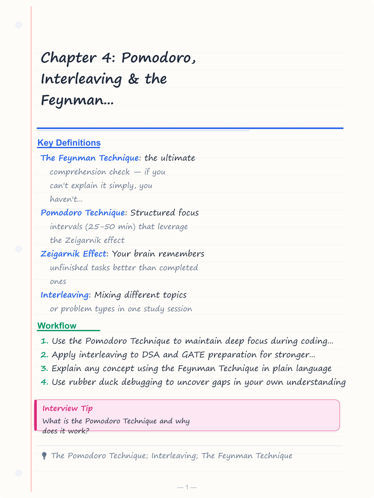
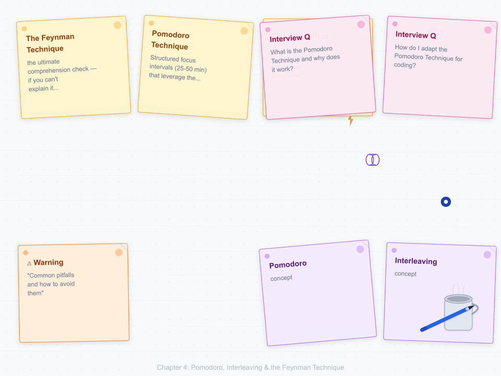
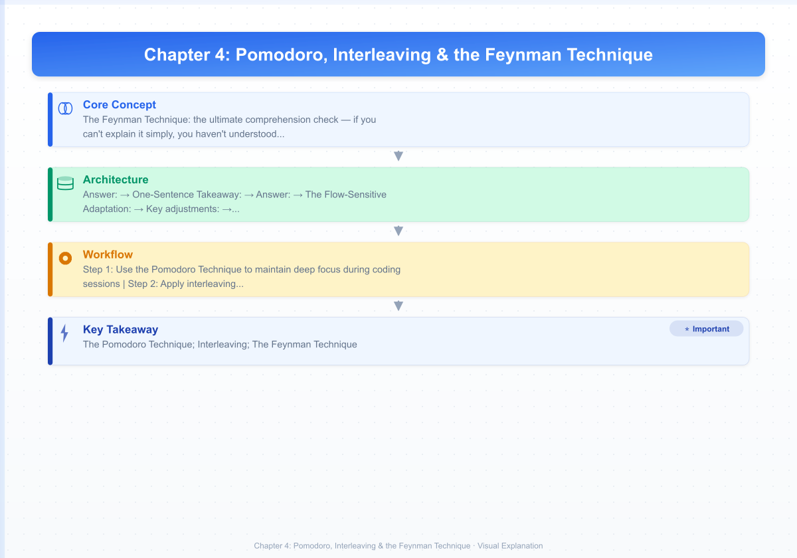
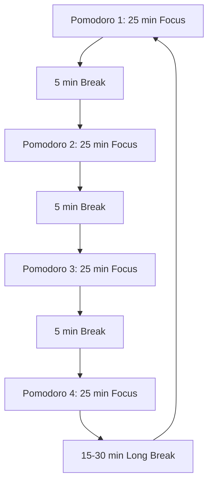
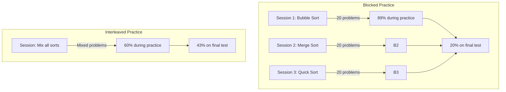
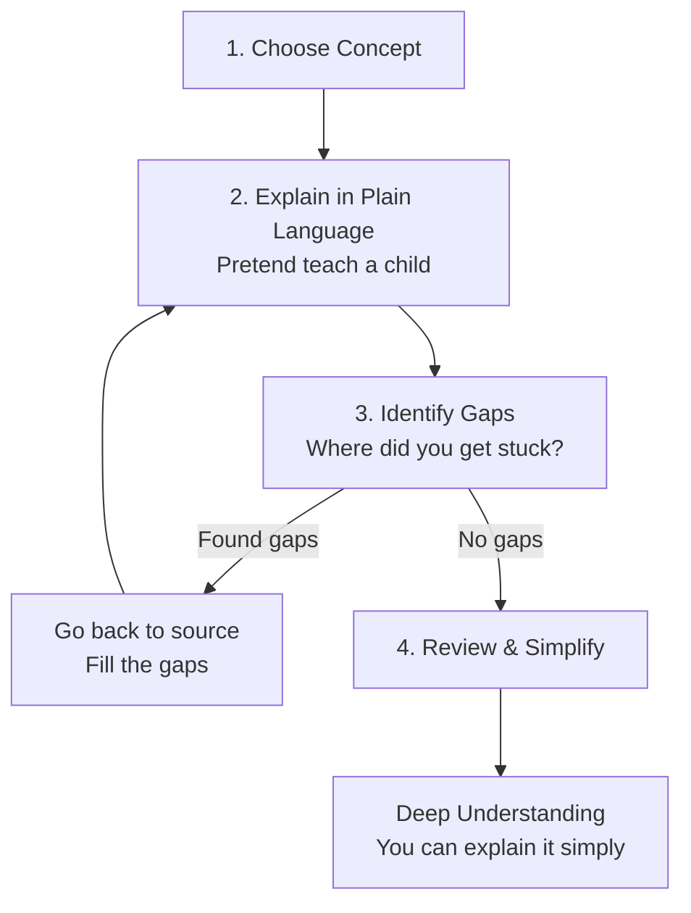
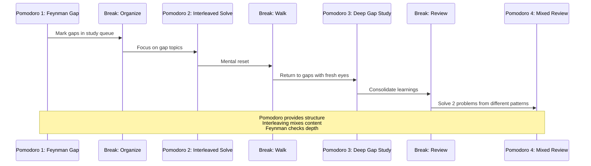

# Chapter 4: Pomodoro, Interleaving & the Feynman Technique

> **Prerequisites:** [Chapter 3: Active Recall & Spaced Repetition](./ch-03-active-recall-spaced-repetition.md) — Retrieval practice and spaced repetition systems.
> **Next:** [Chapter 5: Memory Systems & Mnemonics](./ch-05-memory-systems.md) — Transform your memory with ancient and modern techniques.

In Chapter 3 you learned active recall and spaced repetition — how to pull information out of your brain and when to do it. This chapter gives you three more weapons: **Pomodoro** (focus discipline), **Interleaving** (mixed practice that builds flexible knowledge), and the **Feynman Technique** (the ultimate comprehension check). These three techniques work together like a tripod — Pomodoro gives you the time, interleaving gives you the structure, and Feynman gives you the truth about what you actually know.

## Learning Objectives

By the end of this chapter, you will be able to:

<!-- Image Gallery -->
<section class="lesson-visuals" aria-label="Visual learning resources">
  <header><span>VISUAL LEARNING</span><h2>See it. Review it. Remember it.</h2></header>
  <a class="lesson-visual-card" href="../../assets/images/lessons/learning-how-to-learn/ch-04-pomodoro-interleaving-feynman/handwritten-notes.png" target="_blank" rel="noopener">
    
    <span><strong>Handwritten notes</strong>Condensed notes for deliberate review.</span>
  </a>
  <a class="lesson-visual-card" href="../../assets/images/lessons/learning-how-to-learn/ch-04-pomodoro-interleaving-feynman/sticky-notes.png" target="_blank" rel="noopener">
    
    <span><strong>Sticky-note revision</strong>Fast recall prompts for revision.</span>
  </a>
  <a class="lesson-visual-card" href="../../assets/images/lessons/learning-how-to-learn/ch-04-pomodoro-interleaving-feynman/visual-explanation.png" target="_blank" rel="noopener">
    
    <span><strong>Visual concept guide</strong>A connected explanation of the key ideas.</span>
  </a>
</section>
<!-- End Image Gallery -->


- Use the Pomodoro Technique to maintain deep focus during coding sessions
- Apply interleaving to DSA and GATE preparation for stronger retention
- Explain any concept using the Feynman Technique in plain language
- Use rubber duck debugging to uncover gaps in your own understanding
- Teach peers to deepen and cement your own knowledge


---

### Chapter at a Glance

| Topic | Key Insight | Practical Takeaway |
|-------|-------------|-------------------|
| Pomodoro Technique | Structured focus intervals (25-50 min) that leverage the Zeigarnik effect | Adapt the interval to your task — code for 50 min, revise for 25 min |
| Zeigarnik Effect | Your brain remembers unfinished tasks better than completed ones | Use the Pomodoro break to let diffuse mode process the problem |
| Interleaving | Mixing different topics or problem types in one study session | Alternate between two DSA patterns instead of drilling one at a time |
| Blocked Practice | Studying one topic exhaustively before moving to the next | Avoid this for long-term retention — it creates false fluency |
| Feynman Technique | If you can't explain it simply, you haven't understood it | Teach a concept to a child using plain language; identify gaps immediately |
| Rubber Duck Debugging | Explaining code line-by-line to an inanimate object reveals hidden assumptions | Read code aloud when stuck — the gap in your explanation IS the bug |
| Peer Teaching | Teaching a peer with prepared questions tests your knowledge under pressure | Ask your partner to prepare 3 hard questions in advance |
| Master Session | Combining all three techniques in a single 2-hour workflow | Run the full cycle: Feynman → gap study → interleaved problems → teach |


---

## Q&A Content

### Q31: What is the Pomodoro Technique and why does it work?

**Answer:**

The Pomodoro Technique is a time management method developed by Francesco Cirillo in the late 1980s. The core idea is brutally simple: work in focused 25-minute intervals (called "pomodoros") separated by 5-minute breaks. After four pomodoros, take a longer break of 15–30 minutes.

```
┌─────────────┐    ┌─────────────┐    ┌─────────────┐    ┌─────────────┐    ┌──────────────┐
│  Pomodoro 1 │    │  Pomodoro 2 │    │  Pomodoro 3 │    │  Pomodoro 4 │    │   Long       │
│  25 min     │ →  │  25 min     │ →  │  25 min     │ →  │  25 min     │ →  │   Break      │
│  Focus      │    │  Focus      │    │  Focus      │    │  Focus      │    │   15-30 min  │
└─────────────┘    └─────────────┘    └─────────────┘    └─────────────┘    └──────────────┘
       ↓                  ↓                  ↓                  ↓
  ┌─────────┐       ┌─────────┐       ┌─────────┐       ┌─────────┐
  │ 5 min   │       │ 5 min   │       │ 5 min   │       │ 5 min   │
  │ break   │       │ break   │       │ break   │       │ break   │
   └─────────┘       └─────────┘       └─────────┘       └─────────┘
```



Why it works, backed by cognitive science:

1. **The Zeigarnik Effect** — your brain hates unfinished tasks. Knowing a break is coming in 25 minutes lowers the activation barrier to start.

2. **Attention residue reduction** — a structured break clears your mental workspace. Without structure, you check Slack for "just a second" and lose 23 minutes recovering focus (attention residue research by Sophie Leroy).

3. **Dopamine cycles** — completing a pomodoro gives a small completion hit. Four pomodoros = four hits. This builds momentum that keeps you going.

4. **Time constraint forces prioritization** — you cannot do everything in 25 minutes, so you naturally prioritize the most important task.


```java
// A simple Pomodoro timer in Java
import java.util.Timer;
import java.util.TimerTask;
import java.util.concurrent.atomic.AtomicInteger;

public class PomodoroTimer {
    private static final int WORK_DURATION = 25 * 60 * 1000;  // 25 minutes
    private static final int SHORT_BREAK = 5 * 60 * 1000;     // 5 minutes
    private static final int LONG_BREAK = 20 * 60 * 1000;     // 20 minutes
    private static final int POMODOROS_BEFORE_LONG_BREAK = 4;

    private final AtomicInteger pomodorosCompleted = new AtomicInteger(0);
    private final Timer timer = new Timer();

    public void startSession() {
        System.out.println("=== Pomodoro Session Started ===");
        startPomodoro();
    }

    private void startPomodoro() {
        System.out.printf("Pomodoro #%d — Focus for 25 minutes!%n",
                pomodorosCompleted.get() + 1);
        timer.schedule(new TimerTask() {
            @Override
            public void run() {
                int completed = pomodorosCompleted.incrementAndGet();
                System.out.println("Pomodoro complete!");
                if (completed % POMODOROS_BEFORE_LONG_BREAK == 0) {
                    startBreak(LONG_BREAK, "Long break — 20 minutes");
                } else {
                    startBreak(SHORT_BREAK, "Short break — 5 minutes");
                }
            }
        }, WORK_DURATION);
    }

    private void startBreak(int duration, String message) {
        System.out.println(message);
        timer.schedule(new TimerTask() {
            @Override
            public void run() {
                System.out.println("Break over! Get back to work.");
                startPomodoro();
            }
        }, duration);
    }

    public static void main(String[] args) {
        new PomodoroTimer().startSession();
    }
}
```

> **Try This:** Set a 25-minute timer right now. Work on ONE task until it rings. No phone, no tabs, no distractions. Then take exactly 5 minutes. Notice how much you got done.

> **Pro Tip:** The hardest part of Pomodoro isn't the 25 minutes of work — it's the 5-minute break. Don't spend it checking email or social media. Those activities create attention residue that contaminates your next focus block. Stand up, stretch, look out a window. Let your brain truly disengage.

**One-Sentence Takeaway:** The Pomodoro Technique's true power lies in the quality of the break — attention residue from checking email during a 5-minute break contaminates the next focus block, making the break discipline more important than the work interval.

---

### Q32: How do I adapt the Pomodoro Technique for coding?

**Answer:**

Coding has a different rhythm than reading or writing — you enter flow states that are deeper and harder to interrupt. The standard 25-minute pomodoro can actually harm productivity if you're in the zone. Adapt it:

**The Flow-Sensitive Adaptation:**

```
┌─────────────────────────────────────────────────────┐
│                 Coding Pomodoro Flow                 │
├─────────────────────────────────────────────────────┤
│                                                      │
│  Phase 1: Setup (2 min)                              │
│  ├── State what you're about to work on              │
│  └── Open the specific file / test                   │
│                                                      │
│  Phase 2: Deep Coding Block (40-50 min)              │
│  ├── No interruptions, no context switching          │
│  └── Ignore the timer if you're in flow              │
│                                                      │
│  Phase 3: Commit & Diff Review (5 min)               │
│  ├── Review what you wrote                           │
│  ├── `git diff` — does it make sense?                │
│  └── Write a commit message                          │
│                                                      │
│  Phase 4: Active Break (5-10 min)                    │
│  ├── Step away from the keyboard                     │
│  └── Walk, stretch, or stare out a window            │
│                                                      │
└─────────────────────────────────────────────────────┘
```

**Key adjustments:**

1. **Extend to 40-50 minutes** for deep coding sessions. The original 25 minutes was designed for desk work in the 1980s. Modern coding requires longer uninterrupted blocks.

2. **Always commit before the break.** This gives you a clean stopping point and makes the break truly restful — your brain knows exactly where you are.

3. **Use breaks for diffuse-mode processing.** When you step away from a bug, your diffuse mode keeps working on it. Many solutions arrive during the break.

4. **Track interruptions.** Every time you context-switch, add a tally mark. Review at the end of the day. This alone reduces interruptions by 50% within a week.

```java
// Coding-adapted Pomodoro tracker
import java.time.Duration;
import java.time.Instant;
import java.util.ArrayList;
import java.util.List;

public class CodingSessionTracker {
    static class Interruption {
        final Instant timestamp;
        final String source;
        final String description;

        Interruption(String source, String description) {
            this.timestamp = Instant.now();
            this.source = source;
            this.description = description;
        }
    }

    private final List<Interruption> interruptions = new ArrayList<>();
    private Instant codingStart;
    private int pomodorosCompleted = 0;

    public void startCodingBlock(String task) {
        codingStart = Instant.now();
        System.out.printf("[START] Task: %s at %s%n", task, codingStart);
    }

    public void recordInterruption(String source, String description) {
        interruptions.add(new Interruption(source, description));
        long elapsed = Duration.between(codingStart, Instant.now()).toMinutes();
        System.out.printf("[INTERRUPTION] %s — %s (elapsed: %d min)%n",
                source, description, elapsed);
    }

    public void completePomodoro() {
        pomodorosCompleted++;
        long elapsed = Duration.between(codingStart, Instant.now()).toMinutes();
        System.out.printf("[COMPLETE] Pomodoro #%d — %d minutes, %d interruptions%n",
                pomodorosCompleted, elapsed, interruptions.size());
    }

    public void generateReport() {
        System.out.println("=== Session Report ===");
        System.out.printf("Pomodoros: %d%n", pomodorosCompleted);
        System.out.printf("Total interruptions: %d%n", interruptions.size());
        interruptions.stream()
                .map(i -> String.format("  [%s] %s: %s", i.timestamp, i.source, i.description))
                .forEach(System.out::println);
    }
}
```

> **Try This:** For your next coding session, use a 45-minute timer. Track every interruption. At the end, count them. Aim to get below 3 interruptions per session.

> **Warning:** Don't extend your coding Pomodoro beyond 90 minutes. After 90 minutes of intense focus, your prefrontal cortex shows measurable fatigue. Past this point, you're making errors you wouldn't normally make — and those errors take longer to fix than the extra time gained.

**One-Sentence Takeaway:** For deep coding work, a 45-minute Pomodoro is ideal, but never exceed 90 minutes of intense focus — prefrontal fatigue past that point produces errors that cost more time than the extra work yields.

---

### Q33: How do I handle interruptions during a Pomodoro?

**Answer:**

Interruptions are the #1 killer of Pomodoro productivity. The technique itself gives you a structured way to handle them, but you need a concrete protocol.

**The Capture-and-Delegate Protocol:**

```
                    ┌─────────────────────┐
                    │  INTERRUPTION       │
                    │  DETECTED           │
                    └────────┬────────────┘
                             ↓
                    ┌─────────────────────┐
                    │ Is it urgent &       │
                    │ will take < 2 min?   │
                    └──────┬──────────────┘
                       │          │
                      YES        NO
                       │          │
                       ↓          ↓
              ┌──────────────┐  ┌────────────────────────────┐
              │ Handle it    │  │ Write it down on the       │
              │ immediately  │  │ "parking lot" list         │
              │ (under 2 min)│  │ (do NOT act on it now)     │
              └──────┬───────┘  └────────────┬───────────────┘
                     │                       │
                     ↓                       ↓
              ┌──────────────┐  ┌────────────────────────────┐
              │ Resume       │  │ Process during next        │
              │ pomodoro     │  │ break or after session     │
              └──────────────┘  └────────────────────────────┘
```

**The "Parking Lot" technique:**

Keep a physical notepad or text file beside your workspace. When an interruption arrives:

1. Write it down immediately (one line)
2. Do NOT act on it
3. Return to your pomodoro
4. Process the list during breaks or at the end of the session

This works because the act of writing reduces the cognitive load of holding the interruption in working memory. Your brain trusts that it's captured and stops nagging you.

```java
// Interruption parking lot
import java.time.LocalDateTime;
import java.time.format.DateTimeFormatter;
import java.util.ArrayList;
import java.util.List;

public class ParkingLot {
    record ParkingItem(
        LocalDateTime timestamp,
        String source,
        String description,
        boolean urgent
    ) {}

    private final List<ParkingItem> items = new ArrayList<>();

    public void capture(String source, String description, boolean urgent) {
        items.add(new ParkingItem(
            LocalDateTime.now(), source, description, urgent));
        System.out.printf("[PARKING LOT] Captured: %s (from %s, urgent=%s)%n",
                description, source, urgent);
    }

    public void processAll() {
        System.out.println("=== Processing Parking Lot ===");
        for (ParkingItem item : items) {
            if (item.urgent()) {
                System.out.printf("  [URGENT] %s — handle immediately%n",
                        item.description());
            } else {
                System.out.printf("  [NORMAL] %s — schedule for later%n",
                        item.description());
            }
        }
        items.clear();
        System.out.println("Parking lot cleared.");
    }

    public int pendingCount() {
        return items.size();
    }
}
```

> **Try This:** For one day, keep a parking lot file open in your editor. Every time you get interrupted, write it down. Process at the end of the day. Notice how many interruptions were actually not urgent.

> **Remember:** The 2-minute rule — if an interruption can be handled in under 2 minutes, do it immediately and return to your Pomodoro. If it takes longer, it goes on the parking lot. This prevents the "just a quick check" trap that actually costs 20+ minutes of attention recovery.

**One-Sentence Takeaway:** The 2-minute rule prevents the "quick check" trap — handle interruptions under 2 minutes immediately, log longer ones in a parking lot, avoiding the 20+ minute attention recovery cost.

---

### Q34: How do I chunk my study sessions using Pomodoro?

**Answer:**

Chunking is the process of grouping related information into meaningful units. The Pomodoro Technique gives you a natural container for chunking: one pomodoro = one chunk.

**The 3-Level Chunking Hierarchy:**

```
Level 1: Micro-Chunk (One Pomodoro)
├── A single concept or technique
├── Example: One sorting algorithm, one SQL JOIN type
└── ~25-45 minutes

Level 2: Meso-Chunk (2-4 Pomodoros)
├── A related group of concepts
├── Example: All sorting algorithms, all JOIN types
└── One study session (2-3 hours)

Level 3: Macro-Chunk (Multiple Sessions)
├── A complete skill or subject area
├── Example: DSA mastery, GATE CS preparation
└── Weeks or months
```

**How to plan chunked sessions:**

```java
import java.util.ArrayList;
import java.util.List;

public class StudyChunkPlanner {
    record Chunk(String name, String topic, int estimatedPomodoros) {}

    private final List<Chunk> chunks = new ArrayList<>();

    public void addChunk(String name, String topic, int pomodoros) {
        chunks.add(new Chunk(name, topic, pomodoros));
        System.out.printf("[CHUNK] %s (%s) — %d pomodoros%n",
                name, topic, pomodoros);
    }

    public void generatePlan() {
        int totalPomodoros = chunks.stream()
                .mapToInt(Chunk::estimatedPomodoros).sum();
        int totalMinutes = totalPomodoros * 25;
        int totalBreaks = totalMinutes / 25;
        int totalStudyTime = totalMinutes + (totalBreaks * 5) +
                ((totalBreaks / 4) * 15);

        System.out.println("=== Study Plan ===");
        System.out.printf("Chunks: %d%n", chunks.size());
        System.out.printf("Total pomodoros: %d%n", totalPomodoros);
        System.out.printf("Study time: %d min%n", totalMinutes);
        System.out.printf("Total (with breaks): %d min (~%.1f hours)%n",
                totalStudyTime, totalStudyTime / 60.0);
        System.out.println();

        for (int i = 0; i < chunks.size(); i++) {
            Chunk c = chunks.get(i);
            System.out.printf("  Chunk %d: %s — %d pomodoros%n",
                    i + 1, c.name(), c.estimatedPomodoros());
        }
    }
}
```

**Example: Chunking a DSA study session:**

```
Pomodoro 1: Understand the problem (read, draw, examples)
Pomodoro 2: Brute-force solution (code it)
Pomodoro 3: Optimize (space/time tradeoffs)
Pomodoro 4: Edge cases & test
Break: 20 min
Pomodoro 5: Write up the solution in words (Feynman)
Pomodoro 6: Solve 2 similar problems (interleaving prep)
```

> **Try This:** Take a topic you're studying right now and break it into chunks. Assign each chunk a number of pomodoros. Execute one chunk today.

> **Pro Tip:** Keep your chunk sizes flexible. A 25-minute Pomodoro is ideal for reading or revision. A 45-minute block works better for coding or deep problem-solving. A 10-minute micro-block is great for Anki reviews or quick recall drills. Match the interval to the task type.

**One-Sentence Takeaway:** Match Pomodoro intervals to task type — 25-minute for reading, 45-minute for deep problem-solving, 10-minute micro-blocks for Anki reviews — flexibility beats rigid adherence.

---

### Q35: What is interleaving and why does it beat blocked practice?

**Answer:**

Interleaving means mixing different types of problems or topics within a single study session — instead of practicing one thing to mastery before moving to the next (blocked practice), you alternate between related but distinct skills.

**Blocked Practice (what most people do):**

```
Session 1           Session 2           Session 3
┌──────────────┐   ┌──────────────┐   ┌──────────────┐
│ Bubble Sort  │   │ Merge Sort   │   │ Quick Sort   │
│ 20 problems  │   │ 20 problems  │   │ 20 problems  │
└──────────────┘   └──────────────┘   └──────────────┘
```

**Interleaved Practice (what research says works):**

```
Session 1
┌──────────────────────────────────────────────┐
│ Bubble 1 → Merge 1 → Quick 1 → Bubble 2      │
│ → Merge 2 → Quick 2 → Bubble 3 → Merge 3     │
   └──────────────────────────────────────────────┘
```



**Why interleaving wins (the research):**

Rohrer & Taylor (2007) gave two groups of students the same number of practice problems. Group A used blocked practice (all problems of one type together). Group B used interleaved practice (mixed types). One week later:

| Measure | Blocked | Interleaved |
|---------|---------|-------------|
| Accuracy during practice | 89% | 60% |
| Accuracy on final test (1 week later) | 20% | 43% |

Blocked practice creates an **illusion of competence** — during practice you get every problem right because you already know which strategy applies. Interleaving feels harder (that's good) because you have to **choose the strategy** every time, which is what real tests demand.


```java
// Demonstrating blocked vs interleaved practice
import java.util.*;

public class InterleavingDemo {
    static class Problem {
        final String topic;
        final String question;
        final String answer;

        Problem(String topic, String question, String answer) {
            this.topic = topic;
            this.question = question;
            this.answer = answer;
        }
    }

    static class StudySession {
        final String name;
        final List<Problem> problems;

        StudySession(String name, List<Problem> problems) {
            this.name = name;
            this.problems = problems;
        }

        void run() {
            System.out.printf("=== %s ===%n", name);
            int correct = 0;
            // During practice, the student sees the problems in order
            for (Problem p : problems) {
                // In blocked practice, student knows the topic before reading
                // In interleaved, they must identify the topic first
                boolean gotCorrect = solve(p);
                if (gotCorrect) correct++;
            }
            System.out.printf("Practice score: %d/%d (%.0f%%)%n",
                    correct, problems.size(),
                    (double) correct / problems.size() * 100);
        }

        boolean solve(Problem p) {
            // Simulated — student answers based on topic recognition
            return Math.random() > 0.3; // interleaved feels harder
        }
    }

    public static void main(String[] args) {
        var bubbleSortProblems = List.of(
            new Problem("Bubble Sort", "Sort [3,1,4,1,5]", "O(n²)"),
            new Problem("Bubble Sort", "Sort [9,2,7,4,6]", "O(n²)")
        );
        var mergeSortProblems = List.of(
            new Problem("Merge Sort", "Sort [3,1,4,1,5]", "O(n log n)"),
            new Problem("Merge Sort", "Sort [9,2,7,4,6]", "O(n log n)")
        );

        // Blocked: all bubble, then all merge
        var blockedSession = new StudySession("Blocked Practice",
                new ArrayList<Problem>() {{
                    addAll(bubbleSortProblems);
                    addAll(mergeSortProblems);
                }});

        // Interleaved: alternate
        var interleavedSession = new StudySession("Interleaved Practice",
                List.of(
                    bubbleSortProblems.get(0),
                    mergeSortProblems.get(0),
                    bubbleSortProblems.get(1),
                    mergeSortProblems.get(1)
                ));

        blockedSession.run();
        interleavedSession.run();
    }
}
```

> **Try This:** Pick two related topics you're studying (e.g., two sorting algorithms, two SQL JOIN types). Solve alternate problems: A1, B1, A2, B2, A3, B3. Notice how much harder it feels — that's the learning happening.

> **Warning:** Interleaving will feel wrong. Your accuracy during practice will drop from ~89% to ~60%. This is NOT a sign that you're doing it wrong — it's the desirable difficulty that produces stronger long-term learning. Trust the process. The test results will prove it.

**One-Sentence Takeaway:** Interleaving drops practice accuracy from ~89% to ~60%, but this desirable difficulty is precisely what builds pattern-identification skill and produces stronger long-term retention.

---

### Q36: What's the difference between blocked and mixed practice, and when do I use each?

**Answer:**

Blocked practice and mixed (interleaved) practice serve different purposes. Use the wrong one and you waste time.

| Criterion | Blocked Practice | Mixed/Interleaved Practice |
|-----------|-----------------|---------------------------|
| **Purpose** | Initial learning | Long-term retention & transfer |
| **When to use** | First exposure to a concept | After basic understanding |
| **Feels like** | Easy, productive | Hard, confusing |
| **Actual learning** | Low (illusion of competence) | High (desirable difficulty) |
| **Best for** | Building basic fluency | Exam preparation |
| **Example** | Practice 20 bubble sort problems in a row | Mix bubble, merge, quick, heap problems randomly |

**The 80/20 Rule for Practice Types:**

```
Phase 1: Blocked Practice (20% of time)
├── Goal: Understand the concept
├── Activity: 3-5 problems of the SAME type
└── Outcome: Basic procedural fluency

Phase 2: Mixed Practice (80% of time)
├── Goal: Build discrimination skills
├── Activity: Random mix of ALL problem types
└── Outcome: Transferable knowledge that works on tests
```

```java
import java.util.*;

public class PracticePlanner {
    enum Phase { BLOCKED, MIXED }

    static class StudyPlan {
        final String topic;
        final Phase phase;
        final int numProblems;
        final List<String> relatedTopics;

        StudyPlan(String topic, Phase phase, int numProblems, List<String> related) {
            this.topic = topic;
            this.phase = phase;
            this.numProblems = numProblems;
            this.relatedTopics = related;
        }

        void execute() {
            System.out.printf("Topic: %s (%s)%n", topic, phase);
            if (phase == Phase.BLOCKED) {
                System.out.printf("  Do %d problems all on %s%n", numProblems, topic);
                System.out.println("  Goal: Understand the basic pattern");
            } else {
                System.out.printf("  Do %d problems mixing: %s%n",
                        numProblems, String.join(", ", relatedTopics));
                System.out.println("  Goal: Learn to identify which technique to use");
            }
        }
    }

    public static void main(String[] args) {
        // Blocked: first exposure
        new StudyPlan("Binary Search", Phase.BLOCKED, 5,
                List.of("Binary Search")).execute();

        System.out.println();

        // Mixed: exam preparation
        new StudyPlan("Searching Algorithms", Phase.MIXED, 15,
                List.of("Binary Search", "Linear Search",
                        "Ternary Search", "Exponential Search")).execute();
    }
}
```

> **Try This:** Pick a concept you learned recently. Spend 20% of your practice time on blocked problems (3-5 of the same type), then 80% on mixed problems with related concepts. Compare your test performance to your usual approach.

> **Pro Tip:** The 80/20 rule applies here: use blocked practice for the initial understanding phase (20% of your time), then switch to mixed interleaved practice for the retention phase (80%). The blocked phase builds fluency; the interleaved phase builds discrimination. Both are necessary.

**One-Sentence Takeaway:** Use blocked practice for initial fluency (20% of time) then interleaved mixed practice for discrimination skill (80%) — both phases are essential for mastery.

---

### Q37: How do I apply interleaving to GATE CS preparation?

**Answer:**

GATE CS is the perfect candidate for interleaving because it tests 10+ subjects, each with multiple problem types. Most students study subject-by-subject (blocked), which means on exam day they struggle to identify which approach a problem needs.

**GATE Subject Interleaving Map:**

```
Week                   Subjects Interleaved
────────────────────────────────────────────────────────
Week 1-2:  CO → OS → CO → CN → OS → CO → CN → OS
Week 3-4:  DS → Algo → TOC → DS → Algo → TOC → DS
Week 5-6:  All 6 subjects mixed randomly
Week 7-8:  Full-length mock tests (natural interleaving)
```

**Step-by-step interleaving strategy for GATE:**

1. **Start each session with a warm-up.** Solve 2-3 problems from yesterday's subjects before tackling today's.

2. **Within each subject, interleave problem types.** For Operating Systems, mix CPU scheduling, memory management, and synchronization problems in one session — don't do 20 scheduling problems in a row.

3. **Create an interleaving schedule:**

```java
import java.time.DayOfWeek;
import java.time.LocalDate;
import java.util.*;

public class GATEInterleavingScheduler {
    static class StudyBlock {
        final String subject;
        final String topic;
        final int problems;

        StudyBlock(String subject, String topic, int problems) {
            this.subject = subject;
            this.topic = topic;
            this.problems = problems;
        }

        @Override
        public String toString() {
            return String.format("%s → %s (%d problems)",
                    subject, topic, problems);
        }
    }

    private final List<String> subjects = List.of(
        "CO", "OS", "CN", "DS", "Algo", "TOC", "DBMS", "CD"
    );

    public List<StudyBlock> generateDayPlan(LocalDate date) {
        Random rng = new Random((long) date.toEpochDay());
        int dayOfYear = date.getDayOfYear();
        int numBlocks = 4; // 4 pomodoro blocks per day

        List<StudyBlock> plan = new ArrayList<>();
        List<String> todaySubjects = new ArrayList<>(subjects);
        Collections.shuffle(todaySubjects, rng);

        for (int i = 0; i < numBlocks; i++) {
            String subject = todaySubjects.get(i % todaySubjects.size());
            String topic = pickTopic(subject, dayOfYear + i);
            int problems = 3 + rng.nextInt(3); // 3-5 problems
            plan.add(new StudyBlock(subject, topic, problems));
        }

        // Ensure no two adjacent blocks are the same subject
        for (int i = 1; i < plan.size(); i++) {
            if (plan.get(i).subject.equals(plan.get(i - 1).subject)) {
                Collections.swap(plan, i, (i + 1) % plan.size());
            }
        }

        return plan;
    }

    private String pickTopic(String subject, int seed) {
        Map<String, List<String>> topics = new HashMap<>();
        topics.put("OS", List.of("CPU Scheduling", "Memory Mgmt",
                "Sync", "Deadlock", "File Systems"));
        topics.put("CO", List.of("Pipeline", "Cache", "ALU",
                "Control Unit", "IO"));
        topics.put("CN", List.of("TCP/IP", "Routing", "MAC",
                "Application Layer", "Error Control"));
        topics.put("DS", List.of("Arrays", "Trees", "Graphs",
                "Hashing", "Linked Lists"));
        topics.put("Algo", List.of("Sorting", "DP", "Greedy",
                "Graph Algo", "Complexity"));
        topics.put("TOC", List.of("DFA", "CFG", "Turing Machine",
                "Undecidability", "Regular Expressions"));
        topics.put("DBMS", List.of("SQL", "Normalization",
                "Transactions", "Indexing", "ER Diagrams"));
        topics.put("CD", List.of("Parsing", "Lexical Analysis",
                "Code Gen", "Optimization"));

        List<String> topicList = topics.getOrDefault(subject,
                List.of("General"));
        return topicList.get(seed % topicList.size());
    }

    public void printWeeklyPlan(LocalDate startDate) {
        System.out.println("=== GATE Interleaving Plan ===");
        for (int i = 0; i < 7; i++) {
            LocalDate day = startDate.plusDays(i);
            System.out.printf("%s:%n", day.getDayOfWeek());
            for (StudyBlock block : generateDayPlan(day)) {
                System.out.printf("  • %s%n", block);
            }
            System.out.println();
        }
    }

    public static void main(String[] args) {
        new GATEInterleavingScheduler()
                .printWeeklyPlan(LocalDate.now());
    }
}
```

4. **Use PYQs as your interleaving fuel.** Previous Year Questions are already interleaved — every GATE paper is a random mix. Do PYQs from 3 different years in one session instead of 3 years of the same subject.

> **Try This:** Instead of studying "OS for 2 hours," study "OS → CN → OS → TOC" for 2 hours, 30 minutes per block. Do this for one week and compare your PYQ score to the previous week.

> **Pro Tip:** Previous Year Questions (PYQs) are already naturally interleaved — every GATE paper mixes subjects randomly. Instead of doing 3 years of OS questions in a row, do the OS questions from 3 different years shuffled together. This gives you the interleaving benefit while using authentic exam material.

**One-Sentence Takeaway:** PYQs are naturally interleaved — shuffle questions from different years and subjects in a single session rather than studying one subject for hours to build exam-authentic pattern recognition.

---

### Q38: How do I apply interleaving to DSA problem-solving?

**Answer:**

DSA interleaving is about mixing problem patterns, not data structures. The goal is to train your brain to identify the **pattern** before reaching for the **tool**.

**The DSA Interleaving Matrix:**

```
Session         Problem 1           Problem 2           Problem 3           Problem 4
────────────────────────────────────────────────────────────────────────────────────────
Day 1        Two Pointers       Sliding Window      Binary Search        Two Pointers
Day 2        BFS                DFS                  Topo Sort           BFS
Day 3        DP (Knapsack)      Greedy              DP (LCS)            Greedy
Day 4        Union Find         Graph BFS           Union Find          Graph DFS
```

**The 3-Level Interleaving System for DSA:**

```
Level 1: Within-Pattern Interleaving (Early Practice)
└── Same pattern, different problems
    Example: 3 Two Pointer problems, but different difficulty

Level 2: Cross-Pattern Interleaving (Mid Practice)
└── Related patterns that are easy to confuse
    Example: Sliding Window vs Two Pointer (both use left/right indices)
    Example: BFS vs DFS (both traverse graphs)

Level 3: Random Interleaving (Exam Preparation)
└── Any pattern, any difficulty
    Example: Open LeetCode and solve problems in order of appearance
```

```java
import java.util.*;

public class DSAInterleaving {
    static class Problem {
        final String id;
        final String pattern;
        final String name;
        final String link;

        Problem(String id, String pattern, String name, String link) {
            this.id = id;
            this.pattern = pattern;
            this.name = name;
            this.link = link;
        }
    }

    static class InterleavingSession {
        private final List<Problem> problems;
        private final Random rng = new Random();

        InterleavingSession(List<Problem> problems) {
            this.problems = problems;
        }

        void run() {
            // Interleaving means we shuffle problems from different patterns
            Map<String, List<Problem>> byPattern = new HashMap<>();
            for (Problem p : problems) {
                byPattern.computeIfAbsent(p.pattern, k -> new ArrayList<>()).add(p);
            }

            System.out.println("=== DSA Interleaving Session ===");
            System.out.printf("Patterns: %s%n", byPattern.keySet());
            System.out.println("Order: take one from each pattern round-robin");
            System.out.println();

            // Round-robin through patterns
            List<String> patterns = new ArrayList<>(byPattern.keySet());
            for (int round = 0; round < 3; round++) {
                for (String pattern : patterns) {
                    List<Problem> pool = byPattern.get(pattern);
                    if (pool.isEmpty()) continue;
                    Problem p = pool.remove(rng.nextInt(pool.size()));
                    System.out.printf("Round %d | %s | %s%n",
                            round + 1, p.pattern, p.name);
                }
            }
        }
    }

    public static void main(String[] args) {
        List<Problem> problems = Arrays.asList(
            new Problem("P1", "Two Pointers", "3Sum", "LC15"),
            new Problem("P2", "Two Pointers", "Container With Most Water", "LC11"),
            new Problem("P3", "Sliding Window", "Longest Substring Without Repeating", "LC3"),
            new Problem("P4", "Sliding Window", "Minimum Window Substring", "LC76"),
            new Problem("P5", "Binary Search", "Search in Rotated Array", "LC33"),
            new Problem("P6", "Binary Search", "Find Peak Element", "LC162")
        );

        new InterleavingSession(problems).run();
    }
}
```

**The "3+1" DSA Session Template:**

```
Part 1: Warm-up (1 problem, any pattern) — 10 min
Part 2: Interleaved Core (3 problems, different patterns) — 60 min
Part 3: Review & Feynman (explain your solutions aloud) — 15 min
```

> **Try This:** Pick 3 patterns you've studied (e.g., Two Pointers, Sliding Window, Binary Search). Solve 2 problems from each. Do them in interleaved order: A1, B1, C1, A2, B2, C2. Not A1, A2, B1, B2, C1, C2.

> **Remember:** The goal of interleaving is not to make every session maximally mixed. The goal is to build the skill of "pattern identification" — looking at a problem and deciding which tool to use. That skill only develops when you practice choosing, not just executing.

**One-Sentence Takeaway:** The goal of interleaving is not maximal mixing but building pattern-identification skill — the ability to look at a problem and decide which tool to use, which only develops when you practice choosing, not just executing.

---

### Q39: What is the Feynman Technique?

**Answer:**

The Feynman Technique is a four-step method for learning anything deeply, named after physicist Richard Feynman. The core insight: if you can't explain it simply, you don't understand it well enough.

**The Four Steps:**

```
┌─────────────────────────────────────────────────────────┐
│                 FEYNMAN TECHNIQUE                        │
├─────────────────────────────────────────────────────────┤
│                                                          │
│  Step 1: Choose a concept                                │
│  ├── Write the name at the top of a blank page           │
│  └── Add any notes or references you have                │
│                                                          │
│  Step 2: Explain it in plain language                    │
│  ├── Pretend you're teaching a child                    │
│  ├── No jargon, no technical terms without definition    │
│  └── Use simple analogies and concrete examples          │
│                                                          │
│  Step 3: Identify gaps                                   │
│  ├── Where did you get stuck?                            │
│  ├── Where did you use a word without understanding it?  │
│  └── These ARE your study targets — mark them            │
│                                                          │
│  Step 4: Review and simplify                             │
│  ├── Go back to your source material                     │
│  ├── Fill the gaps                                       │
│  └── Rewrite the explanation more simply                 │
│                                                          │
└─────────────────────────────────────────────────────────┘
```

**Example: Feynman-ing HashMap**

```
Step 1: Write "HashMap" at the top of a page.

Step 2: Explain to a 12-year-old:
  "A HashMap is like a coat check at a restaurant. You give
  the attendant your coat (the value), and they give you a
  ticket (the key). When you want your coat back, you hand
  them the ticket. You don't need to search through all the
  coats — you just use the ticket to get it instantly."

Step 3: Identify gaps:
  - "How does the ticket map to the coat?" → hashing function
  - "What if two coats get the same ticket?" → collision handling
  - "What if the coat check runs out of space?" → rehashing/load factor

Step 4: Go back and study hashing functions, separate chaining vs
  open addressing, load factors, and rehashing. Then rewrite:
  "A HashMap uses a math formula (hash function) to convert the
  key into an index. Multiple keys can map to the same index —
  we handle this by storing them in a linked list at that index
  (separate chaining) or finding the next empty slot (open
  addressing). When the map gets too full (>75%), we create a
  bigger array and rehash everything.
```



```java
// Feynman Technique implementation — simulate the process
import java.util.*;

public class FeynmanLearner {
    static class Concept {
        final String name;
        final String technicalDefinition;
        String simpleExplanation;
        final List<String> jargonTerms = new ArrayList<>();
        final List<String> gapQuestions = new ArrayList<>();

        Concept(String name, String technicalDefinition) {
            this.name = name;
            this.technicalDefinition = technicalDefinition;
        }

        void identifyJargon() {
            // Extract terms that need definition
            String[] words = technicalDefinition.split("\\s+");
            String[] jargon = {"amortized", "contiguous", "recursive",
                    "polymorphic", "abstraction", "deterministic",
                    "idempotent", "asymptotic"};
            for (String word : words) {
                String clean = word.replaceAll("[^a-zA-Z]", "").toLowerCase();
                for (String j : jargon) {
                    if (clean.equals(j) || clean.contains(j)) {
                        jargonTerms.add(word);
                        break;
                    }
                }
            }
        }

        void findGaps() {
            // Every jargon term is a potential gap
            for (String term : jargonTerms) {
                gapQuestions.add("What does \"" + term + "\" mean in simple language?");
                gapQuestions.add("Can I give an example of \"" + term + "\"?");
            }
            // General gap questions
            gapQuestions.add("Can I explain this to someone without a CS degree?");
            gapQuestions.add("Can I code a minimal working example?");
            gapQuestions.add("What problem does this solve better than alternatives?");
        }

        void teach() {
            System.out.printf("=== Feynman Technique: %s ===%n", name);
            System.out.printf("Technical definition: %s%n%n", technicalDefinition);

            identifyJargon();
            System.out.println("Jargon identified (potential gaps):");
            jargonTerms.forEach(t -> System.out.printf("  • %s%n", t));

            findGaps();
            System.out.println("\nGap questions to answer:");
            gapQuestions.forEach(q -> System.out.printf("  • %s%n", q));

            System.out.println("\nNow close your book and write the explanation");
            System.out.println("in plain language on a blank page.");
        }
    }

    public static void main(String[] args) {
        new Concept("HashMap",
                "A HashMap provides amortized O(1) put and get operations " +
                "by using a hash function to map keys to array indices, " +
                "handling collisions via separate chaining with linked lists " +
                "or balanced trees, and dynamically resizing when the load " +
                "factor exceeds a threshold."
        ).teach();
    }
}
```

> **Try This:** Take a concept you "know" (like recursion, TCP handshake, or normalization). Write down the simplest explanation you can without looking at any reference. Where did you get stuck? That's what you need to study.

> **Pro Tip:** Start your Feynman explanation with "So basically..." as a trigger phrase. If you find yourself using technical terms right away, stop and define them first. The rule: every term you use must be understandable to a 12-year-old. If it's not, you've found a gap.

**One-Sentence Takeaway:** The Feynman Technique finds gaps by forcing jargon-free explanation — start with "So basically..." and if any term a 12-year-old can't understand slips in, you've found a gap.

---

### Q40: How do I perform a gap analysis using the Feynman Technique?

**Answer:**

Gap analysis is the systematic identification of what you don't know you don't know. The Feynman Technique is the best tool for this because it forces you to surface gaps that passive review never reveals.

**The Feynman Gap Analysis Protocol:**

```
Step 1: Choose a topic
Step 2: Explain it aloud (record yourself or write it down)
Step 3: Mark every hesitation, vague word, or jargon you used
Step 4: For each mark, ask: "Can I give a concrete example of this?"
Step 5: If not → it's a gap. Add to your study queue.
Step 6: Study the gaps. Repeat from Step 2.
```

**Gap Types and How to Fix Them:**

| Gap Type | Signal | Fix |
|----------|--------|-----|
| **Jargon Masking** | Using technical terms without definition | Define every term in plain language |
| **Analogy Dependency** | Can only explain via analogy, not mechanics | Study the underlying mechanism |
| **Code Blindness** | Can describe it but can't code it | Implement from scratch without reference |
| **Boundary Ignorance** | Knows the happy path but not edge cases | List 5 edge cases and handle each |
| **Comparison Void** | Can't explain when to use X vs Y | Write a comparison table |
| **Origin Gap** | Doesn't know why it was designed this way | Research the history/context |

```java
import java.util.*;

public class GapAnalyzer {
    static class FeynmanTranscript {
        final String topic;
        final String explanation;
        final List<String> hesitations = new ArrayList<>();
        final List<String> vagueTerms = new ArrayList<>();
        final List<String> jargonUsed = new ArrayList<>();

        FeynmanTranscript(String topic, String explanation) {
            this.topic = topic;
            this.explanation = explanation;
        }

        void analyze() {
            String[] sentences = explanation.split("[.!?]");
            Set<String> jargon = Set.of(
                "amortized", "polymorphic", "abstract", "recursive",
                "concatenate", "enumerate", "orthogonal", "canonical",
                "deterministic", "non-deterministic", "idempotent",
                "asymptotic", "transitive", "saturated"
            );

            for (String sentence : sentences) {
                String trimmed = sentence.trim().toLowerCase();
                if (trimmed.isEmpty()) continue;

                // Detect hesitations
                if (trimmed.endsWith("...") || trimmed.contains("uh") ||
                    trimmed.contains("kind of") || trimmed.contains("sort of")) {
                    hesitations.add(trimmed);
                }

                // Detect jargon
                for (String word : trimmed.split("\\s+")) {
                    String clean = word.replaceAll("[^a-zA-Z]", "");
                    if (jargon.contains(clean)) {
                        jargonUsed.add(clean);
                    }
                }

                // Detect vague terms
                if (trimmed.contains("thing") || trimmed.contains("stuff") ||
                    trimmed.contains("somehow") || trimmed.contains("basically")) {
                    vagueTerms.add(trimmed);
                }
            }
        }

        void generateGapReport() {
            analyze();
            System.out.printf("=== Gap Analysis: %s ===%n", topic);
            System.out.printf("Hesitations found: %d%n", hesitations.size());
            hesitations.forEach(h -> System.out.printf("  • %s%n", h));

            System.out.printf("Jargon without definition: %d%n", jargonUsed.size());
            jargonUsed.forEach(j -> System.out.printf("  • Define: %s%n", j));

            System.out.printf("Vague language: %d%n", vagueTerms.size());
            vagueTerms.forEach(v -> System.out.printf("  • Clarify: %s%n", v));

            if (hesitations.isEmpty() && jargonUsed.isEmpty() && vagueTerms.isEmpty()) {
                System.out.println("No gaps detected — you may understand this topic deeply.");
            } else {
                System.out.printf("%nPriority study targets:%n");
                jargonUsed.forEach(j -> System.out.printf("  1. Study %s — implement an example%n", j));
                vagueTerms.forEach(v -> System.out.printf("  2. Rewrite: %s%n", v.substring(0, Math.min(60, v.length()))));
            }
        }
    }

    public static void main(String[] args) {
        // Simulating a Feynman explanation with gaps
        String explanation = """
            So, a thread pool is basically a collection of threads that
            sort of handle tasks concurrently. When a task arrives, it's
            somehow assigned to an available thread... and uh, the
            executor service manages the lifecycle. The blocking queue
            holds tasks when all threads are busy. You can configure the
            core pool size and maximum pool size. There's also a keepalive
            time for threads above the core size. And uh, the RejectedExecutionHandler
            determines what happens when the queue is full.
            """;

        new FeynmanTranscript("Thread Pools", explanation).generateGapReport();
    }
}
```

> **Try This:** Record yourself explaining a topic you're studying for 2 minutes. Transcribe it. Mark every "uh," "kind of," "basically," and jargon word. These are your gaps. Study them, then explain again without the crutch words.

> **Warning:** Don't skip the "teach to a child" mindset. If you explain to an expert, you'll unconsciously use jargon as a crutch. If you explain to a child, you must break concepts down into fundamental pieces. The child is not optional — the simplification constraint IS the mechanism that finds gaps.

**One-Sentence Takeaway:** The "teach to a child" constraint is not optional — eliminating jargon forces you to break concepts down to fundamentals, and the simplification itself IS the gap-detection mechanism.

---

### Q41: What is rubber duck debugging and how does it relate to the Feynman Technique?

**Answer:**

Rubber duck debugging is the practice of explaining your code or problem to an inanimate object (traditionally a rubber duck) line by line. The idea: by articulating your assumptions aloud, you spot the flaw that you couldn't see while thinking silently.

**Origin Story:**

The term was popularized by Andrew Hunt and David Thomas in *The Pragmatic Programmer* (1999). A programmer carried a rubber duck on their desk and would explain code to it when stuck. The act of speaking aloud revealed the bug.

**Why it works (same mechanism as Feynman):**

Both rubber duck debugging and the Feynman Technique work because they force you to:

1. **Shift from pattern-matching to understanding** — silent debugging often becomes "try random changes until it works." Speaking forces you to reason step by step.

2. **Engage different neural pathways** — speaking aloud recruits Broca's area (speech production) and Wernicke's area (language comprehension), which are not active during silent reading. This gives you a second channel for detecting inconsistencies.

3. **Slow down** — you cannot talk as fast as you think. The forced slowness prevents skipping over assumptions.

```
┌──────────────────────────────────────────────────────────┐
│                                                          │
│    Silent Debugging          Rubber Duck Debugging       │
│    ────────────────          ─────────────────────       │
│                                                          │
│    Reads code quickly        Reads code aloud slowly     │
│    "I know this works"       "This if-condition checks   │
│                               whether the list is null"  │
│    Fills in gaps by          States every assumption     │
│    assumption explicitly                                  │
│                                                          │
│    Result: often misses      Result: finds the bug       │
│    the obvious bug           within 3-5 lines            │
│                                                          │
└──────────────────────────────────────────────────────────┘
```

```java
import java.util.*;

public class RubberDuckDebugger {
    interface Duck {
        void listen(String explanation);
    }

    static class RubberDuck implements Duck {
        private final String name;
        private int timesSaved = 0;

        RubberDuck(String name) {
            this.name = name;
        }

        @Override
        public void listen(String explanation) {
            // The duck just listens — the magic is in the speaking
            System.out.printf("🦆 %s listens...%n", name);
        }

        void saveTheDay(String bug) {
            timesSaved++;
            System.out.printf("🦆 %s helped find: %s%n", name, bug);
        }

        int getTimesSaved() { return timesSaved; }
    }

    // The problematic code you'd explain to the duck
    static class BuggyCode {
        // Intended: return the first non-null matching element
        static String findFirstMatch(List<String> items, String target) {
            // Bug: doesn't check for null items in the list
            for (int i = 0; i <= items.size(); i++) { // Bug: <= instead of <
                String item = items.get(i);
                if (item != null && item.equals(target)) {
                    return item;
                }
            }
            return null;
        }

        // The duck-guided debugging process
        static void debugWithDuck() {
            RubberDuck duck = new RubberDuck("Quacksworth");

            // Step 1: Explain to the duck what the code SHOULD do
            duck.listen("This method should return the first element " +
                    "that matches the target string, skipping nulls.");

            // Step 2: Read each line aloud to the duck
            duck.listen("Line 1: for loop from i=0 to i<=size...");

            // Step 3: The act of speaking reveals the bug
            System.out.println("Wait — i <= size() means i goes up to " +
                    "and INCLUDING size. The last index is size()-1. " +
                    "This is an off-by-one error!");

            duck.saveTheDay("Off-by-one: <= should be < in for loop");
        }
    }

    public static void main(String[] args) {
        BuggyCode.debugWithDuck();
    }
}
```

**The Rubber Duck + Feynman Connection:**

| Aspect | Rubber Duck Debugging | Feynman Technique |
|--------|----------------------|-------------------|
| **Domain** | Code and bugs | Any concept |
| **Output** | Finding the bug | Finding knowledge gaps |
| **Method** | Read code aloud line by line | Explain in plain language |
| **Core mechanism** | Articulation forces logical scrutiny | Simplification forces gap detection |
| **Can combine?** | Yes — explain your approach to the duck before coding | Yes — Feynman your understanding of a bug's root cause |


> **Try This:** Next time you're stuck on a bug, open a text file and explain the code line by line as if you're teaching someone who has never seen it. Write it down. You will find the bug within 5 minutes — usually before you finish explaining.

> **Pro Tip:** You don't need a physical rubber duck. Any inanimate object works — a mug, a plant, a stuffed animal. The key is speaking aloud, not the object itself. Speaking engages different neural pathways than silent thinking, which is why bugs become obvious when you verbalize them.

**One-Sentence Takeaway:** Any object works for rubber duck debugging — speaking aloud engages different neural pathways than silent thinking, which is why problems become obvious when verbalized.

---

### Q42: How does learning by writing deepen understanding?

**Answer:**

Writing is not just a way to *show* what you know — it's a way to *discover* what you know. When you write about a topic, you engage in a form of self-teaching that reveals gaps, forces structure, and cements memory.

**Why Writing Accelerates Learning:**

1. **The Generation Effect** — information you generate yourself (by writing) is remembered better than information you read. Slamecka & Graf (1978) showed that self-generated material has 30-40% better recall.

2. **Coherence Forcing** — writing requires logical flow. You cannot jump between unrelated points in writing the way you can in casual thought. This forces you to build a coherent mental model.

3. **Permanent Record** — a written explanation is inspectable. You can come back to it, refine it, and compare it to new understanding. Verbal explanations disappear.

4. **Dual Coding** — writing combines language generation (verbal coding) with visual-spatial processing (seeing the text on the page/ screen). This creates two memory traces instead of one.

**The Learning-by-Writing Workflow:**

```
┌────────────┐   ┌────────────┐   ┌────────────┐   ┌────────────┐
│ Read /     │   │ Close all  │   │ Write an   │   │ Compare &  │
│ Study the  │ → │ references  │ → │ explanation │ → │ Fill Gaps   │
│ Material   │   │             │   │ in your own │   │             │
│            │   │             │   │ words       │   │             │
└────────────┘   └────────────┘   └────────────┘   └────────────┘
```

**The Five Writing Formats for Learning:**

| Format | When to Use | Example |
|--------|------------|---------|
| **Tutorial/Guide** | After learning a complete concept | "How Merge Sort Works" |
| **FAQ** | When learning something with common confusion points | "5 Questions About Indexes" |
| **Comparison** | When choosing between alternatives | "ArrayList vs LinkedList" |
| **Cheat Sheet** | After building fluency | "SQL JOIN Reference" |
| **Bug Postmortem** | After debugging something tricky | "Why My Transaction Deadlocked" |

```java
import java.time.LocalDate;
import java.util.*;

public class LearningJournal {
    static class Entry {
        final LocalDate date;
        final String topic;
        final String format; // tutorial, FAQ, comparison, cheat-sheet, postmortem
        final String content;
        final List<String> gapsDiscovered;

        Entry(LocalDate date, String topic, String format,
              String content, List<String> gaps) {
            this.date = date;
            this.topic = topic;
            this.format = format;
            this.content = content;
            this.gapsDiscovered = gaps;
        }

        void summarize() {
            System.out.printf("[%s] %s (%s)%n", date, topic, format);
            System.out.printf("  Length: %d words%n", content.split("\\s+").length);
            System.out.printf("  Gaps found: %d%n", gapsDiscovered.size());
            if (!gapsDiscovered.isEmpty()) {
                System.out.println("  Gaps to study:");
                gapsDiscovered.forEach(g -> System.out.printf("    • %s%n", g));
            }
        }
    }

    static class Journal {
        private final List<Entry> entries = new ArrayList<>();

        void addEntry(Entry entry) {
            entries.add(entry);
            entry.summarize();
            System.out.println();
        }

        void weeklyReview() {
            System.out.println("=== Weekly Review ===");
            long totalGaps = entries.stream()
                    .mapToInt(e -> e.gapsDiscovered.size()).sum();
            System.out.printf("Entries: %d, Total gaps found: %d%n",
                    entries.size(), totalGaps);
            System.out.println("Writing deepens understanding by forcing ");
            System.out.println("coherent explanations — gaps become obvious.");
        }
    }

    public static void main(String[] args) {
        Journal journal = new Journal();

        journal.addEntry(new Entry(
            LocalDate.now(), "TCP Handshake",
            "tutorial",
            "TCP uses a three-way handshake to establish a connection..." +
            "The client sends SYN. The server responds with SYN-ACK..." +
            "The client sends ACK. This ensures both sides are ready...",
            List.of("What happens if SYN-ACK is lost?",
                    "What is a half-open connection?")
        ));

        journal.addEntry(new Entry(
            LocalDate.now(), "HashMap vs TreeMap",
            "comparison",
            "HashMap: O(1) average, unsorted, allows null. TreeMap: " +
            "O(log n), sorted, Red-Black tree implementation...",
            List.of("When is TreeMap actually faster?",
                    "How does the Red-Black tree rebalance?")
        ));

        journal.weeklyReview();
    }
}
```

> **Try This:** Today, after studying something, close all your references and write a 300-word explanation of the topic in your own words. Don't check anything while writing. At the end, mark the parts you're unsure about — those are your gaps.

> **Remember:** Writing an explanation is NOT the same as taking notes. Notes are for reference. Writing from memory is a recall test. The difference is whether you're looking at the source material. If your eyes are on the screen, not the book, you're doing active recall through writing.

**One-Sentence Takeaway:** Writing an explanation from memory is active recall, not note-taking — if your eyes are on the screen instead of the book, you're genuinely testing yourself.

---

### Q43: How does peer teaching deepen understanding?

**Answer:**

Peer teaching — explaining a concept to a fellow learner — is one of the highest-leverage learning activities you can do. It's not just altruistic; it's selfishly beneficial for your own understanding.

**The Learning Pyramid (National Training Laboratories):**

```
                         ┌─────────────────────────┐
                         │   Lecture (5%)          │
                         └─────────────────────────┘
                      ┌──────────────────────────────┐
                      │     Reading (10%)              │
                      └──────────────────────────────┘
                   ┌───────────────────────────────────┐
                   │    Audio/Visual (20%)              │
                   └───────────────────────────────────┘
                ┌────────────────────────────────────────┐
                │     Demonstration (30%)                 │
                └────────────────────────────────────────┘
             ┌─────────────────────────────────────────────┐
             │    Discussion Group (50%)                   │
             └─────────────────────────────────────────────┘
          ┌──────────────────────────────────────────────────┐
          │     Practice by Doing (75%)                      │
          └──────────────────────────────────────────────────┘
       ┌───────────────────────────────────────────────────────┐
       │     Teach Others / Immediate Use (90%)                │
       └───────────────────────────────────────────────────────┘
```

**Why teaching beats every other study method:**

1. **Prediction Error** — When you teach, you must predict what a learner will find confusing. Making these predictions trains your brain to see the structure of knowledge, not just the content.

2. **Question Exposure** — Learners ask questions you never thought of. Every question reveals a gap or a new angle. A single 30-minute teaching session can surface more gaps than 3 hours of solo study.

3. **Retrieval Pressure** — Teaching is a high-stakes retrieval practice. You cannot fake it in front of a live person (unlike flashcards where you can peek). This intensity strengthens memory.

4. **Dual Perspective** — You must simultaneously hold the learner's mental model (what they currently understand) and the expert model (what you want them to understand). This dual-track thinking deepens your own grasp.

**The Peer Teaching Protocol:**

```
Phase 1: Prepare (10 min)
├── Identify the 3 most important points
├── Prepare one concrete example per point
└── Anticipate 2-3 confusing aspects

Phase 2: Teach (20 min)
├── Start with the big picture (why this matters)
├── Walk through each point with examples
├── Check for understanding every 5 minutes
└── Ask: "Does that make sense? What's confusing?"

Phase 3: Debrief (10 min)
├── Note every question you couldn't answer well
├── Identify gaps in your own explanation
└── Study those gaps immediately
```

```java
import java.time.LocalDateTime;
import java.util.*;

public class PeerTeachingSession {
    static class TeachingSession {
        final String topic;
        final LocalDateTime dateTime;
        final List<String> keyPoints = new ArrayList<>();
        final List<String> learnerQuestions = new ArrayList<>();
        final List<String> gapsFound = new ArrayList<>();

        TeachingSession(String topic) {
            this.topic = topic;
            this.dateTime = LocalDateTime.now();
        }

        void prepare() {
            keyPoints.addAll(Arrays.asList(
                "Core concept and why it matters",
                "How it works (step-by-step)",
                "Common pitfalls and how to avoid them"
            ));
            System.out.printf("Prepared to teach: %s%n", topic);
        }

        void handleQuestion(String question) {
            learnerQuestions.add(question);
            boolean couldAnswer = Math.random() > 0.3; // realistic

            if (couldAnswer) {
                System.out.printf("Answered: %s%n", question);
            } else {
                String gap = "Need to study: " + question;
                gapsFound.add(gap);
                System.out.printf("GAP FOUND: %s%n", gap);
            }
        }

        void debrief() {
            System.out.printf("%n=== Teaching Debrief: %s ===%n", topic);
            System.out.printf("Points taught: %d%n", keyPoints.size());
            System.out.printf("Questions received: %d%n", learnerQuestions.size());
            System.out.printf("Gaps discovered: %d%n", gapsFound.size());

            if (!gapsFound.isEmpty()) {
                System.out.println("Gaps to study before next session:");
                gapsFound.forEach(g -> System.out.printf("  • %s%n", g));
            }
        }
    }

    public static void main(String[] args) {
        TeachingSession session = new TeachingSession("Hash Indexes in DBMS");
        session.prepare();

        // Simulated learner questions that expose gaps
        session.handleQuestion("What happens if two keys hash to the same value?");
        session.handleQuestion("Why not use a hash index for range queries?");
        session.handleQuestion("How does the database rebuild indexes after a crash?");
        session.handleQuestion("Is a hash index faster than B-tree for equality lookups?");

        session.debrief();
    }
}
```

**Where to find teaching opportunities:**

- Study groups (in-person or Discord/ Slack)
- Open-source issue discussions
- Answer questions on Stack Overflow or Reddit
- Write blog tutorials about what you're learning
- Present a 10-minute lightning talk at a meetup
- Pair program with a junior developer

> **Try This:** Find someone who's learning the same topic as you. Offer to teach them one concept you're confident about. After 20 minutes, swap roles. Note the questions you couldn't answer — those are your real gaps.

> **Pro Tip:** If you can't find a real person to teach, use the "empty chair" method. Explain the concept to an imaginary classmate sitting across from you. The act of speaking aloud to a perceived audience creates enough social pressure to surface gaps that silent self-talk doesn't trigger.

**One-Sentence Takeaway:** The "empty chair" method works because explaining to an imaginary audience creates social pressure that surfaces gaps silent self-talk misses.

---

### Q44: How do I combine all three techniques (Pomodoro, Interleaving, Feynman) into a single study session?

**Answer:**

The three techniques are synergistic — each one enhances the others. Here's how to combine them into a single powerful study session:

**The Master Session Template (2 hours):**

```
┌──────────────────────────────────────────────────────────────┐
│                  MASTER STUDY SESSION (2 hours)               │
├──────────────────────────────────────────────────────────────┤
│                                                               │
│  Pomodoro 1: Feynman Gap Analysis (25 min)                    │
│  ├── Pick a topic you studied yesterday                      │
│  ├── Explain it aloud / write it down                        │
│  └── Mark gaps                                                 │
│                                                               │
│  Break: Park gaps into study queue (5 min)                    │
│                                                               │
│  Pomodoro 2: Interleaved Problem Solving (25 min)             │
│  ├── Solve 2-3 problems from different patterns               │
│  ├── Apply the technique you're learning today                │
│  └── Mix with one problem from a related topic                │
│                                                               │
│  Break: Walk, stretch, hydrate (5 min)                        │
│                                                               │
│  Pomodoro 3: Deep Study of Gaps (25 min)                      │
│  ├── Take the gaps from Pomodoro 1                            │
│  ├── Study each gap with a focused resource                   │
│  └── Write a one-paragraph explanation of each                │
│                                                               │
│  Break: Review parking lot (5 min)                             │
│                                                               │
│  Pomodoro 4: Teach What You Learned (25 min)                  │
│  ├── Write a summary for your study partner / blog            │
│  ├── Or record a 2-minute audio explanation                   │
│  └── Check: can you explain without notes?                    │
│                                                               │
│  Long Break (15-20 min): Complete disconnection                │
│                                                               │
└──────────────────────────────────────────────────────────────┘
```



**Why this combination works:**

```
Pomodoro          →  Provides the structure and focus containers
Interleaving      →  Provides the content mixing strategy
Feynman           →  Provides the quality check

Each technique covers a weakness of the others:
  - Pomodoro without Feynman → busywork, no depth check
  - Feynman without Pomodoro → endless rabbit holes, no progress
  - Interleaving without Pomodoro → chaos, no sustained practice
  - Pomodoro without Interleaving → blocked practice, poor transfer
```

```java
import java.time.LocalTime;
import java.util.*;

public class MasterSession {
    static class SessionPhase {
        final String name;
        final int durationMinutes;
        final Runnable activity;

        SessionPhase(String name, int durationMinutes, Runnable activity) {
            this.name = name;
            this.durationMinutes = durationMinutes;
            this.activity = activity;
        }

        void run() {
            System.out.printf("[%s] START: %s (%d min)%n",
                    LocalTime.now().withNano(0), name, durationMinutes);
            activity.run();
            System.out.printf("[%s] END: %s%n",
                    LocalTime.now().withNano(0), name);
        }
    }

    static class CombinedSession {
        private final List<SessionPhase> phases = new ArrayList<>();

        void addPhase(String name, int minutes, Runnable activity) {
            phases.add(new SessionPhase(name, minutes, activity));
        }

        void execute() {
            System.out.println("=== Master Study Session ===");
            int totalMinutes = phases.stream()
                    .mapToInt(p -> p.durationMinutes).sum();
            System.out.printf("Total time: %d minutes%n", totalMinutes);
            System.out.println();

            for (SessionPhase phase : phases) {
                phase.run();
                System.out.println("---");
            }

            System.out.println("Session complete!");
        }
    }

    public static void main(String[] args) {
        CombinedSession session = new CombinedSession();

        session.addPhase("Feynman Gap Analysis", 25, () -> {
            System.out.println("  Topic: Binary Search Trees");
            System.out.println("  Explaining insertion, deletion, traversal...");
            System.out.println("  GAP FOUND: Can't explain deletion clearly");
            System.out.println("  GAP FOUND: Unsure about self-balancing");
        });

        session.addPhase("Study Gaps", 25, () -> {
            System.out.println("  Studying BST deletion cases...");
            System.out.println("  Case 1: No child (just remove)");
            System.out.println("  Case 2: One child (replace with child)");
            System.out.println("  Case 3: Two children (find inorder successor)");
            System.out.println("  Now studying AVL rotations...");
        });

        session.addPhase("Interleaved Problems", 25, () -> {
            System.out.println("  Problem 1: BST validation (Trees)");
            System.out.println("  Problem 2: Level-order traversal (BFS)");
            System.out.println("  Problem 3: Lowest common ancestor (Trees)");
            System.out.println("  Problem 4: Graph cycle detection (Graphs)");
        });

        session.addPhase("Teach & Summarize", 25, () -> {
            System.out.println("  Writing a 2-minute explanation:");
            System.out.println("  'A BST is a tree where left < parent < right.'");
            System.out.println("  'Deletion has three cases...'");
            System.out.println("  'AVL trees self-balance using rotations.'");
            System.out.println("  [Saving to learning journal]");
        });

        session.execute();
    }
}
```

**Weekly rhythm:**

| Day | Session Type | Focus |
|-----|-------------|-------|
| Mon | Master Session | New concept |
| Tue | Interleaved Practice | Review + mixed problems |
| Wed | Master Session | New concept |
| Thu | Peer Teaching | Teach + get questions |
| Fri | Gap Analysis | Feynman everything from the week |
| Sat | Mock Test | Timed, interleaved by default |
| Sun | Rest or Light Review | Anki only |

> **Try This:** Tomorrow, run one Master Session (2 hours) using the template above. Compare what you retain to your usual study method.

**One-Sentence Takeaway:** A Master Session combines all techniques — 120 minutes of interleaved recall across subjects using Pomodoro blocks and Feynman explanations, with rest days reserved for recovery.

---

### Q45: I tried Feynman/rubber duck/teaching and it felt awkward. Am I doing it wrong?

**Answer:**

You are absolutely doing it right. Feeling awkward is not a bug — it's a feature. Here's why:

**The "Awkward" Feeling is the Learning Signal:**

When you explain something aloud and it sounds clumsy, that's not embarrassment — that's your brain detecting a gap in real-time. Smooth, effortless explanations are usually illusions of competence. Awkward, halting explanations mean you're actually thinking.

**Common Awkwardness Patterns and What They Mean:**

| How It Felt | What It Means | What To Do |
|-------------|---------------|------------|
| "I kept using jargon to cover my confusion" | Jargon masking — you don't understand the mechanism | Define every technical term you used |
| "I couldn't finish sentences" | Fragile knowledge — you haven't connected the pieces | Draw a concept map before explaining |
| "I forgot basic terms" | Retrieval weakness — you recognize but can't recall | Do more active recall (Chapter 3) |
| "My analogies were terrible" | You're reaching for connections — that's great | Keep trying. Bad analogies lead to good ones |
| "I sounded like a robot reading a script" | You memorized words, not understanding | Close the book and re-explain without references |

**The 3-Explanation Rule:**

Your first explanation of any topic will be terrible. Your second will be acceptable. Your third will be good. You must do three passes — there are no shortcuts.

```
Pass 1: Messy, full of jargon, stops and starts
  ├── This is the gap detection pass
  └── Success metric: number of gaps found

Pass 2: Cleaner, better structure, fewer jargon crutches
  ├── This is the reorganization pass
  └── Success metric: can you explain without stopping?

Pass 3: Simple, fluid, with good analogies
  ├── This is the mastery pass
  └── Success metric: can a non-expert understand?
```

```java
import java.time.LocalDateTime;
import java.util.*;

public class ExplanationTracker {
    static class ExplanationAttempt {
        final int attemptNumber;
        final String topic;
        final LocalDateTime timestamp;
        final int jargonCount;
        final int hesitations;
        final boolean completedExplanation;

        ExplanationAttempt(int attemptNumber, String topic,
                int jargonCount, int hesitations, boolean completed) {
            this.attemptNumber = attemptNumber;
            this.topic = topic;
            this.timestamp = LocalDateTime.now();
            this.jargonCount = jargonCount;
            this.hesitations = hesitations;
            this.completedExplanation = completed;
        }

        String verdict() {
            if (attemptNumber == 1) {
                return "EXPECTED — First attempts are always rough. " +
                        "You found " + jargonCount + " jargon terms to simplify.";
            } else if (attemptNumber == 2) {
                return "IMPROVING — Second attempt. Fewer hesitations (" +
                        hesitations + " vs probably more in attempt 1).";
            } else {
                return "MASTERY — Third attempt. You can explain this now. " +
                        (completedExplanation ? "Fluently." : "Almost there.");
            }
        }
    }

    static class LearningJournal {
        private final Map<String, List<ExplanationAttempt>> topics = new HashMap<>();

        void recordAttempt(String topic, int jargon, int hesitations, boolean completed) {
            int attemptNum = topics.getOrDefault(topic, new ArrayList<>()).size() + 1;
            var attempt = new ExplanationAttempt(
                    attemptNum, topic, jargon, hesitations, completed);

            topics.computeIfAbsent(topic, k -> new ArrayList<>()).add(attempt);

            System.out.printf("Attempt %d at \"%s\": %s%n",
                    attemptNum, topic, attempt.verdict());
        }

        void weeklySummary() {
            System.out.println("=== Weekly Explanation Summary ===");
            for (var entry : topics.entrySet()) {
                List<ExplanationAttempt> attempts = entry.getValue();
                System.out.printf("%s: %d explanations, " +
                                "avg %.1f jargon/attempt%n",
                        entry.getKey(),
                        attempts.size(),
                        attempts.stream()
                                .mapToInt(a -> a.jargonCount)
                                .average().orElse(0));
            }
        }
    }

    public static void main(String[] args) {
        LearningJournal journal = new LearningJournal();

        // Simulating the 3-explanation journey for one topic
        System.out.println("=== Your Feynman Journey for 'Indexes' ===");
        System.out.println();

        journal.recordAttempt("Database Indexes", 8, 5, false);
        System.out.println("  → You used 'B-tree', 'clustered', 'cardinality'");
        System.out.println("    without defining any of them.");
        System.out.println();

        journal.recordAttempt("Database Indexes", 4, 2, true);
        System.out.println("  → Better. You defined B-tree as 'a balanced tree");
        System.out.println("    that keeps data sorted for efficient search.'");
        System.out.println();

        journal.recordAttempt("Database Indexes", 1, 0, true);
        System.out.println("  → Great! 'An index is like a book's table of");
        System.out.println("    contents — it tells the database where to");
        System.out.println("    find rows without reading every page.'");
        System.out.println();

        journal.weeklySummary();
    }
}
```

**Practical advice for pushing through awkwardness:**

1. **Start alone.** Explain to an empty chair, a rubber duck, or a voice memo app. The self-consciousness fades after 3 sessions.

2. **Lower the stakes.** You're not giving a TED talk. You're just thinking out loud. The only person who needs to understand is future-you.

3. **Use a template.** "Today I learned X. It works like Y. Here's an example: Z." Having a structure reduces the blank-page anxiety.

4. **Quantity over quality.** Aim for 10 mediocre explanations this week, not 1 perfect one. Volume builds the neural pathways.

5. **Record yourself.** Listen back 24 hours later. You'll be surprised at how much you actually got right — and the gaps will be obvious.

> **Try This:** Pick a topic you're struggling with. Explain it badly for 5 minutes into a voice recorder. Don't stop. Tomorrow, listen to the recording and write down 3 things you got wrong. Study those 3 things. Explain again. Compare the two recordings.

**One-Sentence Takeaway:** Awkward, halting explanations mean real learning is happening — record yourself explaining badly, identify 3 gaps, study them, and explain again for measurable progress.

---

### Self-Assessment Quiz

**1. What cognitive phenomenon does the Pomodoro Technique leverage to lower the activation barrier for starting a task?**
a) The Serial Position Effect  b) The Zeigarnik Effect  c) The Dunning-Kruger Effect  d) The Testing Effect
**Answer:** b. The Zeigarnik Effect — your brain hates unfinished tasks, and knowing a break is coming in 25 minutes makes starting feel easier because you're not committing to an endless slog.

**2. What is the recommended Pomodoro interval adaptation for deep coding sessions?**
a) 15-minute intervals with 2-minute breaks  b) 25-minute intervals (keep the original)  c) 40-50 minute intervals  d) 60-minute intervals with no breaks
**Answer:** c. Coding requires longer uninterrupted blocks to reach flow. Extending to 40-50 minutes with a commit-before-break protocol gives better results than the original 25-minute desk-work interval.

**3. In the Capture-and-Delegate protocol for interruptions, what should you do when a non-urgent interruption arrives mid-pomodoro?**
a) Handle it immediately to clear your mind  b) Write it on a parking lot list and return to work  c) Extend the pomodoro to deal with it  d) End the pomodoro early
**Answer:** b. Writing the interruption on a parking lot list reduces cognitive load (your brain trusts it's captured) without breaking focus. Process the list during breaks or after the session.

**4. In Rohrer & Taylor's 2007 study on interleaving vs blocked practice, which group scored higher on the final test one week later, and why?**
a) Blocked practice — higher accuracy during practice led to better retention  b) Interleaved practice — the desirable difficulty of mixing problem types built stronger discrimination skills  c) Both scored equally — practice volume was the same  d) Blocked practice — students felt more confident and performed better under pressure
**Answer:** b. Blocked practice created an illusion of competence (89% during practice but only 20% on the final test), while interleaved practice felt harder (60% during practice) but produced more than double the retention (43%).

**5. According to the 80/20 rule for practice types, what proportion of your study time should be spent on mixed (interleaved) practice after achieving basic understanding?**
a) 20%  b) 50%  c) 80%  d) 100%
**Answer:** c. Use 20% of time for blocked practice (3-5 problems of the same type to build basic fluency), then 80% for mixed/interleaved practice to build the discrimination skills that exams require.

**6. In the three-level DSA interleaving system, what is the goal of Level 2 (Cross-Pattern Interleaving)?**
a) Same pattern, different difficulties  b) Related patterns that are easy to confuse (e.g., BFS vs DFS)  c) Any pattern at any difficulty  d) Only easy problems across all patterns
**Answer:** b. Level 2 targets related patterns that are easy to confuse — like Sliding Window vs Two Pointer (both use left/right indices) or BFS vs DFS (both traverse graphs). This builds the ability to distinguish between similar techniques.

**7. What is the second step of the Feynman Technique?**
a) Choose a concept and write it at the top of a page  b) Explain the concept in plain language as if teaching a child  c) Identify gaps by marking jargon and vague terms  d) Review source material and rewrite the explanation more simply
**Answer:** b. Step 1 is choosing the concept, Step 2 is explaining it in plain language (no jargon, as if teaching a child), Step 3 is identifying gaps, and Step 4 is reviewing and simplifying.

**8. What type of Feynman gap is indicated when you can describe a concept but cannot implement it from scratch?**
a) Jargon Masking  b) Analogy Dependency  c) Code Blindness  d) Boundary Ignorance
**Answer:** c. Code Blindness means you can talk about a concept fluently but cannot write working code for it. The fix is to implement from scratch without any references.

**9. What is the core mechanism that both rubber duck debugging and the Feynman Technique share?**
a) Both require a partner to listen  b) Both force you to articulate assumptions aloud, which recruits additional brain regions for logical scrutiny  c) Both involve writing code  d) Both require a physical rubber duck
**Answer:** b. Articulation forces you to slow down, engage Broca's and Wernicke's areas (speech and language comprehension), and state every assumption explicitly — revealing gaps that silent thinking misses.

**10. According to the Generation Effect (Slamecka & Graf, 1978), how much better is recall for self-generated material compared to read material?**
a) 10-20%  b) 30-40%  c) 50-60%  d) 70-80%
**Answer:** b. Information you generate yourself (by writing) is remembered 30-40% better than information you read. Writing also forces coherence — you cannot jump between unrelated points the way you can in casual thought.

**11. According to the Learning Pyramid, what retention rate does teaching others achieve?**
a) 50%  b) 75%  c) 90%  d) 95%
**Answer:** c. Teaching others achieves approximately 90% retention — the highest of any study method listed. Teaching exposes you to unexpected questions, forces retrieval under pressure, and trains dual-track thinking (holding the learner's model and the expert model simultaneously).

**12. What does the 3-Explanation Rule say about your first attempt to explain a concept?**
a) It will be perfect if you studied enough  b) It will be terrible — and that is expected because the first pass is for gap detection, not mastery  c) You should record it and never repeat it  d) You should only explain if you can do it fluently the first time
**Answer:** b. The 3-Explanation Rule says the first pass is messy and full of jargon — it's for gap detection. The second pass builds structure. The third pass achieves fluency. Awkwardness is the signal that learning is happening.

---

### Concept Comparison Table

| Concept | Definition | Signal to Use | Pitfall |
|---------|-----------|---------------|---------|
| Pomodoro Technique | Work in focused intervals (25-50 min) separated by short breaks | When you struggle to start or maintain focus | Using rigid 25-min intervals for deep coding — extend to 40-50 min when in flow |
| Zeigarnik Effect | Unfinished tasks are remembered better than completed ones | After a Pomodoro break when a solution arrives unexpectedly | Cutting a task mid-flow too often — use natural break points |
| Interleaving | Mixing multiple topics or problem types in one session | When exam questions feel unfamiliar despite hours of blocked practice | Feeling uncomfortable during practice — interleaving always feels harder (that's the benefit) |
| Blocked Practice | Studying one topic completely before moving to another | When you need initial understanding of a new concept | Using blocked practice as your only strategy — it fails for long-term retention |
| Feynman Technique | Explaining a concept in plain language to reveal gaps | When you finish studying a topic and need to verify understanding | Skipping the actual explanation step and just reviewing the topic again |
| Rubber Duck Debugging | Talking through code line-by-line to uncover hidden assumptions | When stuck on a bug or confusing piece of code | Staying silent while debugging — verbalizing forces your brain to slow down |
| Peer Teaching | Teaching a classmate with prepared questions | Before an exam or when you need deep verification | Only teaching easy topics — challenge yourself with what you're least confident about |
| Master Session | 2-hour cycle combining Feynman, gap study, interleaving, and teaching | Weekly deep study session for maximum retention | Attempting the Master Session without first mastering each individual technique |


## Cross-Application Matrix

| Technique | DSA Prep | GATE/Theory | System Design | Coding Interviews |
|-----------|----------|-------------|---------------|-------------------|
| Pomodoro | 45-min focused coding blocks | 25-min theory burst sessions | 50-min design deep dives | 40-min mock interview sprints |
| Zeigarnik Effect | Leave mid-problem for insight | Pause theorem to spark understanding | Break at design inflection point | Stop mid-solution for retention |
| Interleaving | Mix pattern types per session | Rotate subjects within study block | Alternate architectural approaches | Vary problem categories randomly |
| Feynman Technique | Explain solution path in plain words | Teach concept as if to a child | Simplify architecture with analogies | Describe code logic simply |
| Rubber Duck Debugging | Trace code line-by-line aloud | Verbalize formula derivation steps | Walk through design choices audibly | Talk through solution out loud |
| Peer Teaching | Review pattern approaches with peers | Explain theory to classmates | Discuss tradeoffs with teammates | Conduct mock interviews together |

## Quick Reference

| Category | Key Points |
|----------|-----------|
| Pomodoro Technique | - Work in focused intervals (25-50 min) with short breaks - Adapt interval to task: code 50 min, revise 25 min - Leverages the Zeigarnik effect (unfinished tasks stick) - Use breaks for diffuse mode, not screen time |
| Interleaving | - Mix different topics/problem types in one session - Feels harder than blocked practice — that's the benefit - Builds discrimination skills for exams and real-world problems - Beat blocked practice for long-term retention |
| Feynman Technique | - Explain a concept in plain language to reveal gaps - Four-step loop: pick → teach → identify gaps → simplify - Combine with rubber duck debugging for code - Use the 3-Explanation Rule: first pass = gap detection |
| Master Session | - 2-hour cycle: Feynman (25) + gap study (25) + interleaving (25) + teaching (25) - Run weekly for maximum retention - Prerequisite: master each technique individually first - Awkwardness is the signal that learning is happening |

---

## Chapter Summary

- **The Pomodoro Technique** provides structured focus containers (25-50 minutes) that leverage the Zeigarnik effect and reduce attention residue. Adapt the interval to your task — coding benefits from longer blocks, revision from shorter ones.
- **Interleaving** beats blocked practice for long-term retention and transfer. Despite feeling harder during practice (that's the desirable difficulty), it builds the discrimination skills that exams and real-world problem-solving demand.
- **The Feynman Technique** is the ultimate comprehension check — if you can't explain it simply, you haven't understood it. Combine it with rubber duck debugging and learning by writing for the deepest engagement.
- **The three techniques are synergistic.** Pomodoro provides the container, interleaving provides the structure, and Feynman provides the quality control. Use the Master Session template to combine all three.
- **Awkwardness is the signal that learning is happening.** Push through it with the 3-Explanation Rule: first pass finds gaps, second pass builds structure, third pass achieves fluency.

## Exercises

1. **Pomodoro Adaptation:** Track your current study sessions for 2 days. Identify your natural focus block length. Design a custom Pomodoro interval (between 25 and 50 minutes). Use it for 5 sessions and compare productivity.

2. **Interleaving Practice:** Pick 2 related DSA patterns (e.g., Sliding Window and Two Pointers). Find 6 problems (3 of each). Solve them in interleaved order, not blocked. Time yourself. Compare your accuracy to your typical blocked practice session.

3. **Feynman Deep Dive:** Choose a concept from GATE CS that you find confusing (e.g., cache mapping, deadlock prevention, or pipeline hazards). Apply the four-step Feynman Technique. Write down every gap you discover. Study the gaps. Repeat until the explanation flows.

4. **Rubber Duck Debugging:** Open a piece of code you wrote last week that you don't fully understand. Read it aloud line by line as if explaining to someone who has never seen it. Write down every moment you think "I'm not sure why this works" — those are gaps to study.

5. **Peer Teaching:** Find a classmate or study partner. Spend 20 minutes teaching them a topic you're confident about. Ask them to prepare 3 questions in advance. Debrief afterward: what questions stumped you? Study those topics.

6. **The Master Session:** Run one complete 2-hour Master Session combining all three techniques: Feynman gap analysis (25 min), gap study (25 min), interleaved problem solving (25 min), and teaching/ summary writing (25 min). Compare your retention 48 hours later to a typical study session.

7. **Self-Assessment:** Rate your comfort level with each technique on a scale of 1-5 before and after this chapter. Revisit the techniques you rated below 3 after one week of practice.

## Chapter Quiz

**Q1:** A student practices 20 binary-search problems in one sitting, then does 20 DP problems the next day. A week later, they can solve binary search perfectly but struggle to distinguish when a problem needs binary search vs. DP. What went wrong?
- A) They did not study enough hours
- B) Blocked practice creates an illusion of competence — interleaving would have built discrimination skills
- C) They should have started with DP first
- D) Binary search is inherently easier than DP

<details>
<summary>Answer&lt;/summary&gt;

**Answer:** B — Blocked practice (drilling one pattern at a time) inflates performance during practice but produces poor discrimination on mixed tests. Interleaving problems from different patterns teaches the brain to distinguish when each approach applies.
</details>

**Q2:** A student tries the Feynman Technique and their first explanation is full of jargon, gaps, and awkward phrasing. According to the chapter, what should they do?
- A) Abandon the technique — if they can't explain it fluently, they haven't studied enough
- B) Accept the awkwardness as gap detection, study the gaps, and do a second and third pass
- C) Read the textbook again before attempting the Feynman Technique
- D) Switch to Pomodoro instead

<details>
<summary>Answer&lt;/summary&gt;

**Answer:** B — The 3-Explanation Rule states the first pass is always messy — it is for gap detection, not mastery. The second pass builds structure, and the third achieves fluency. Awkwardness signals that learning is happening.
</details>

**Q3:** During a Pomodoro session, an urgent notification appears. Per the chapter, what should the student do if the interruption is non-urgent?
- A) Handle it immediately to clear mental clutter
- B) Write it on a parking lot list and return to the Pomodoro
- C) Extend the Pomodoro to deal with it
- D) End the Pomodoro early and start a new one after

<details>
<summary>Answer&lt;/summary&gt;

**Answer:** B — Writing the interruption on a parking lot list reduces cognitive load (the brain trusts the item is captured) without breaking focus. Process the list during breaks or after the session.
</details>

## Further Reading

- **Chapter 3: Active Recall & Spaced Repetition** — Prerequisites for this chapter. If you haven't already, learn why pulling information out of your brain is more important than putting it in: `ch-03-active-recall-spaced-repetition.md`
- **Chapter 5: Memory Systems & Mnemonics** — Take your learning further with the Method of Loci, memory palaces, and visual mnemonics: `ch-05-memory-systems-mnemonics.md`
- **Cirillo, F. (2006).** *The Pomodoro Technique.* — The original book that started it all.
- **Rohrer, D. (2012).** Interleaving helps students distinguish among similar concepts. *Educational Psychology Review.* — The key research paper on interleaving.
- **Feynman, R. P. (1999).** *The Pleasure of Finding Things Out.* — Feynman's own essays on understanding and explanation.
- **Hunt, A. & Thomas, D. (1999).** *The Pragmatic Programmer.* — The original source of rubber duck debugging (still one of the best books on the craft).
