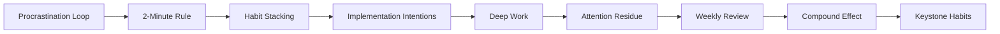
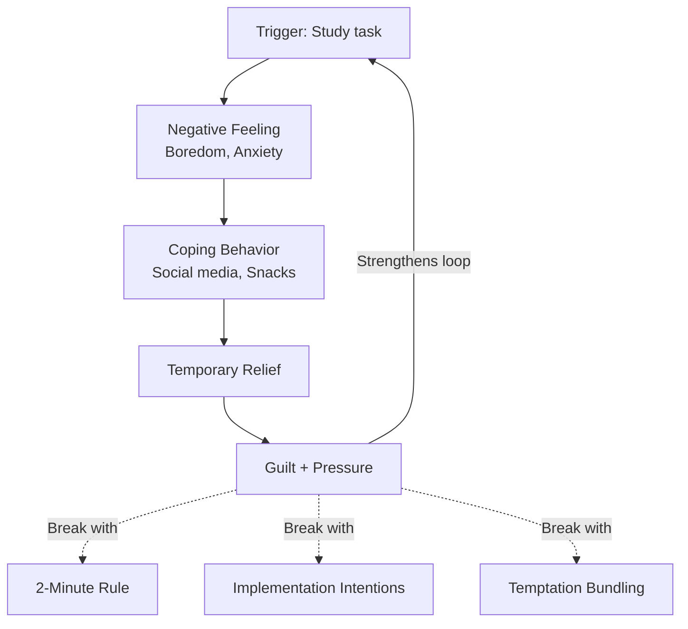
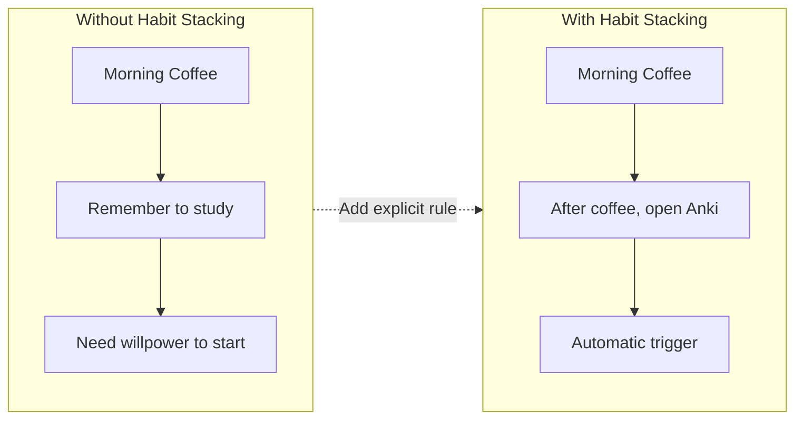
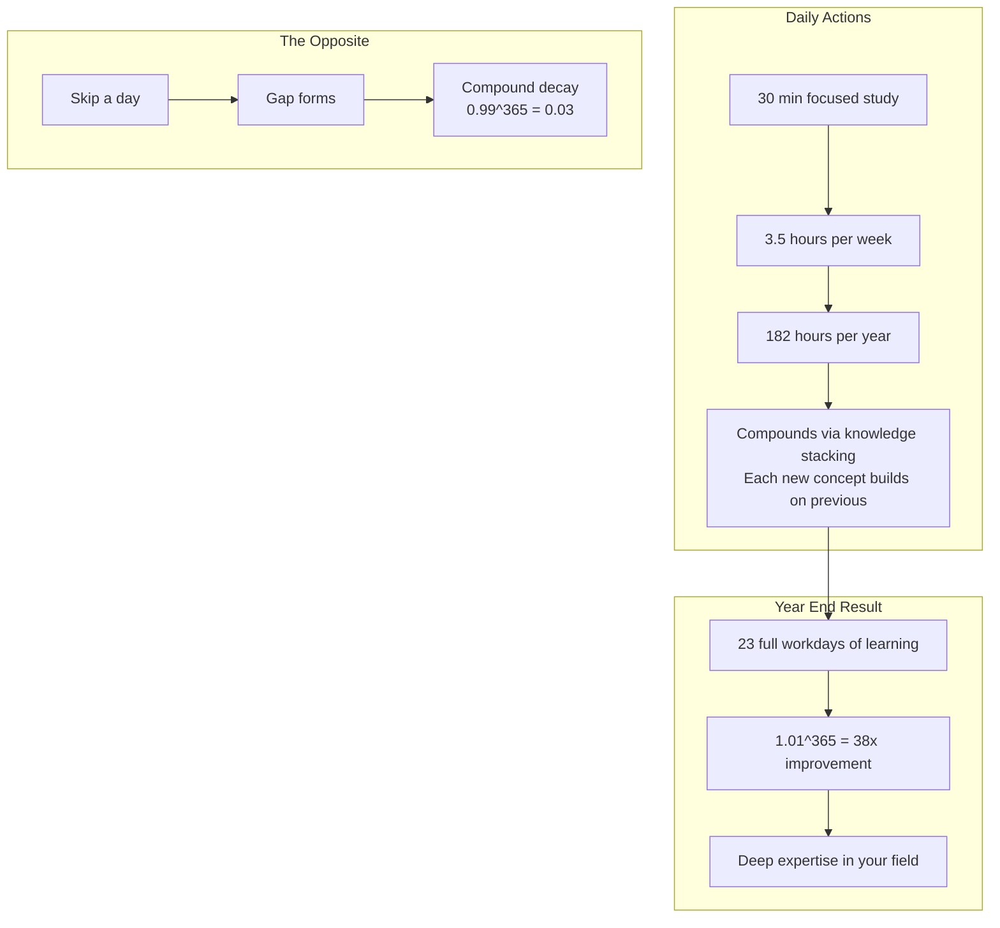

# Chapter 6: Procrastination, Habits & Deep Work

> **Prerequisites:** [Chapter 5: Memory Systems & Mnemonics](./ch-05-memory-systems.md) — Memory techniques for encoding and retrieval.
> **Next:** [Chapter 7: DSA & Coding Interview Prep](./ch-07-dsa-coding-interview.md) — Apply all learning techniques to coding interview preparation.

> **Understanding why you procrastinate — and what to do about it — is the single highest-leverage skill in learning.**
> 20 Q&As · Practical frameworks grounded in behavioral psychology and cognitive science.

You know what to study. You have the resources. You've set your goals. And yet — somehow — you're on YouTube, cleaning your desk, or reorganizing your bookmarks. Procrastination isn't laziness; it's an emotional regulation problem. Your brain perceives studying as a threat (boring, difficult, uncertain) and reaches for a guaranteed dopamine hit instead.

This chapter gives you the toolkit to hack that response. You'll learn:

- **Why** you procrastinate (the procrastination loop and what triggers it)
- **How** to build habits that make studying automatic (habit stacking, keystone habits, the 20-second rule)
- **How** to protect deep focus (deep work, attention residue, the 4DX framework)
- **How** to sustain progress over months (weekly reviews, streak tracking, compound effect)

These aren't abstract theories. Every technique here is something you can apply today — often in two minutes or less.

---

## Learning Objectives


<!-- Image Gallery -->
<section class="lesson-visuals" aria-label="Visual learning resources">
  <header><span>VISUAL LEARNING</span><h2>See it. Review it. Remember it.</h2></header>
  <a class="lesson-visual-card" href="../../../assets/images/lessons/learning-how-to-learn/ch-06-procrastination-habits-deep-work/handwritten-notes.svg" target="_blank" rel="noopener">
    
    <span><strong>Handwritten notes</strong>Condensed notes for deliberate review.</span>
  </a>
  <a class="lesson-visual-card" href="../../../assets/images/lessons/learning-how-to-learn/ch-06-procrastination-habits-deep-work/sticky-notes.svg" target="_blank" rel="noopener">
    
    <span><strong>Sticky-note revision</strong>Fast recall prompts for revision.</span>
  </a>
  <a class="lesson-visual-card" href="../../../assets/images/lessons/learning-how-to-learn/ch-06-procrastination-habits-deep-work/visual-explanation.svg" target="_blank" rel="noopener">
    
    <span><strong>Visual concept guide</strong>A connected explanation of the key ideas.</span>
  </a>
</section>
<!-- End Image Gallery -->


After completing this chapter, you will be able to:

- **Identify your procrastination triggers** by recognizing the four components of the procrastination loop
- **Break the procrastination loop** using the 2-minute rule, implementation intentions, and temptation bundling
- **Build learning habits** using habit stacking and keystone habits that compound over time
- **Practice deep work** by scheduling distraction-free sessions and managing attention residue
- **Implement weekly reviews and monthly retrospectives** to keep your learning on track
- **Maintain streaks** and navigate slumps using motivation-resilience strategies

---

### Chapter at a Glance


| Topic | Key Insight | Practical Takeaway |
|-------|-------------|-------------------|
| Procrastination Loop | Trigger → negative feeling → coping → relief → guilt | Break the loop at the trigger stage with a 2-minute start |
| 2-Minute Rule | Starting is the only hard part — lowering the barrier bypasses the threat response | Commit to 2 minutes of any task; allow yourself to stop after — you rarely will |
| Habit Stacking | Attaching a new habit to an existing one makes it automatic | "After [existing habit], I will [2-minute learning action]" |
| Implementation Intentions | If-then plans automate decision-making and reduce willpower dependence | "If it's 7 PM at my desk, then I will open my problem set" |
| Deep Work | Distraction-free concentration that pushes cognitive limits | Schedule 90-minute deep work blocks; ritualize transitions |
| Attention Residue | Partial attention left on a previous task after switching | Batch context switches; never start deep work mid-thought |
| 4DX Framework | Four disciplines: WIG, lead measures, scoreboard, weekly cadence | Pick one learning goal, track daily actions, review every Sunday |
| Weekly Review | Weekly pause that catches drift and maintains strategic alignment | Every Sunday: review wins, struggles, lead measures, and next week's commitment |
| Compound Effect | Small daily improvements compound into massive gains over time | 1% daily improvement yields 38x growth in a year |
| Keystone Habits | One habit that triggers positive chain reactions across multiple areas | Identify and establish one keystone habit first (e.g., morning study block) |



---

## Q61: What is the procrastination loop and why do we fall into it?

**Answer:**

Procrastination isn't a time-management problem — it's an **emotional-regulation problem**. When you face a task you find boring, difficult, or ambiguous, your brain's anterior cingulate cortex (ACC) detects conflict and triggers a mild pain response. Your limbic system — the part of the brain that prioritizes immediate rewards — hijacks your decision-making and steers you toward a more pleasant activity.

This creates the **procrastination loop**:

```
Trigger (study task) → Negative feeling (boredom, anxiety) → 
Coping behavior (social media, snacks) → Temporary relief → 
Guilt + increased pressure → Even stronger negative feeling next time
```



Each iteration strengthens the neural pathway. Over time, the task becomes conditioned to trigger avoidance automatically — you don't *decide* to procrastinate; your brain does it before you're consciously aware.

**The four components of the loop:**

| Component | Description | Example |
|-----------|-------------|---------|
| Trigger | Cue that activates avoidance | Opening your textbook at 7 PM |
| Negative feeling | Discomfort, boredom, anxiety | "This is hard. I don't get it." |
| Coping behavior | Easy, rewarding alternative | Checking YouTube, cleaning |
| Relief + guilt | Short-term gain, long-term pain | "I'll start tomorrow — for real this time." |

**Breaking the loop** requires interrupting at the trigger stage (before the feeling arises) or substituting the coping behavior with a learning-adjacent action.

```java
// The procrastination loop modeled as code
import java.time.LocalDateTime;
import java.util.function.Supplier;

class ProcrastinationLoop {

    static class Cycle {
        String trigger;
        String feeling;
        String copingBehavior;
        boolean feltGuilt;

        Cycle(String trigger, String feeling, String copingBehavior, boolean feltGuilt) {
            this.trigger = trigger;
            this.feeling = feeling;
            this.copingBehavior = copingBehavior;
            this.feltGuilt = feltGuilt;
        }
    }

    static Cycle runLoop(String trigger, Supplier<String> copingAction) {
        System.out.println("Trigger: " + trigger);
        String feeling = "boredom or anxiety";
        System.out.println("Feeling: " + feeling);

        String behavior = copingAction.get();
        System.out.println("Coping: " + behavior);

        boolean guilt = true;
        System.out.println("Guilt: yes — loop strengthened");

        return new Cycle(trigger, feeling, behavior, guilt);
    }

    public static void main(String[] args) {
        for (int i = 0; i < 3; i++) {
            System.out.println("=== Cycle " + (i + 1) + " ===");
            runLoop("Open DSA practice problems", () -> "Scrolled Twitter for 15 min");
            System.out.println();
        }
        // Without intervention, the neural pathway strengthens each time.
        // Next chapter shows how to break it at the trigger stage.
    }
}
```

**Key insight:** The guilt after procrastinating makes you *more* likely to procrastinate next time — it increases the emotional weight of the task. Self-compassion, paradoxically, is more effective than self-criticism.

> **Remember:** The procrastination loop is not a character flaw — it's a neural pattern. Each time you catch yourself early and redirect, you weaken the loop and strengthen a new pathway. The goal isn't to eliminate the feeling; it's to change your response to it.

---


## Q62: How does the 2-minute rule kill procrastination before it starts?

**Answer:**

The **2-minute rule** states: *If a task takes less than two minutes, do it immediately.* But for learning, the more powerful version is: *When starting a difficult study session, commit to just two minutes of work.*

This works because the **activation energy** for two minutes is tiny. Your brain doesn't perceive it as a threat. Once you start, momentum carries you forward — the **Zeigarnik effect** (Q65) kicks in, and your brain wants to finish what it started.

```java
import java.time.LocalTime;
import java.time.Duration;

class TwoMinuteRule {

    interface StudyTask {
        void doWork(int minutes);
    }

    public static void main(String[] args) {
        String task = "Learn AVL tree rotations";

        // Normal approach — overwhelming
        System.out.println("Normal thought: 'I'll study AVL trees for 2 hours'");
        System.out.println("Result: Feels heavy. Opens YouTube instead.");
        System.out.println();

        // 2-minute approach — trivial
        System.out.println("2-minute thought: 'I'll open my notes and read one paragraph'");

        StudyTask twoMinutes = (min) -> {
            System.out.println("> Studying " + task + " for " + min + " minute(s)...");
            System.out.println("> 1 minute in: 'This isn't so bad...'");
            System.out.println("> 2 minutes in: hit by curiosity — keeps going");
            System.out.println("> Actual time spent: 47 minutes");
        };

        twoMinutes.doWork(2);
        System.out.println();
        System.out.println("Key: Starting is the only hard part. The 2-minute rule");
        System.out.println("lowers the barrier below your brain's threat threshold.");
    }
}
```

**Implementation checklist:**

1. Pick the smallest possible unit of the task: "Open the PDF" not "Master recursion"
2. Set a timer for 2 minutes (use Pomodoro if you have one)
3. Allow yourself to stop after 2 minutes — no guilt
4. Observe that you almost never actually stop

**Why it works:** Behavioral activation — action precedes motivation, not the other way around. You don't wait until you feel like studying; you study for 2 minutes, and the feeling follows.

> **Pro Tip:** The 2-minute rule works because of the Zeigarnik effect (Q65) — once you start, your brain wants to finish. But it only works if you genuinely allow yourself to stop after 2 minutes. If you secretly guilt-trip yourself into continuing, the starting barrier stays high. Mean what you say: 2 minutes is enough.

---

## Q63: What are implementation intentions and how do they force follow-through?

**Answer:**

An **implementation intention** is a concrete plan that specifies *when, where, and how* you will perform a behavior. Instead of a vague goal ("I'll study more"), you create an **if-then plan**:

> **If** [situation], **then** I will [specific action].

This works because the situation becomes a trigger that automatically activates the behavior — no willpower required. The concept comes from Peter Gollwitzer's research, which shows that implementation intentions double or triple the probability of following through on a goal.

```java
class ImplementationIntention {

    static class Intention {
        String situation;
        String action;
        boolean completed;

        Intention(String situation, String action) {
            this.situation = situation;
            this.action = action;
        }

        boolean evaluate(String currentTime, String currentLocation) {
            if (currentTime.equals("7:00 PM") && currentLocation.equals("desk")) {
                completed = true;
                System.out.println("Trigger matched! Executing: " + action);
            }
            return completed;
        }
    }

    public static void main(String[] args) {
        // Vague goal (fails)
        System.out.println("Vague goal: 'I will study data structures this week'");
        System.out.println("Result: Friday arrives, studied 0 hours.");
        System.out.println();

        // Implementation intention (succeeds)
        Intention plan = new Intention(
            "it is 7:00 PM and I am at my desk",
            "open Anki and review 20 cards on linked lists"
        );

        System.out.println("Intention: If " + plan.situation + ", then " + plan.action);
        boolean done = plan.evaluate("7:00 PM", "desk");
        System.out.println("Followed through: " + done);
        System.out.println();

        System.out.println("Formula for any learning goal:");
        System.out.println("If [TIME + LOCATION], then I will [SPECIFIC ACTION]");
        System.out.println("If 8:00 AM at coffee shop, then I will read one section");
        System.out.println("If 12:30 PM after lunch, then I will solve one LeetCode problem");
    }
}
```

**Advanced: Boundary conditions.** Add specificity for context where the intention might fail:

```java
class RobustIntention {
    String primary;
    String ifObstacle;
    String thenAlternate;

    RobustIntention(String primary, String ifObstacle, String thenAlternate) {
        this.primary = primary;
        this.ifObstacle = ifObstacle;
        this.thenAlternate = thenAlternate;
    }

    void execute(boolean hasObstacle) {
        if (hasObstacle) {
            System.out.println("Obstacle: " + ifObstacle);
            System.out.println("Fallback: " + thenAlternate);
        } else {
            System.out.println("Primary: " + primary);
        }
    }

    public static void main(String[] args) {
        RobustIntention plan = new RobustIntention(
            "Study recursion for 30 minutes at my desk",
            "My desk is occupied (roommate on call)",
            "Study at the kitchen table instead — same 30 minutes"
        );
        plan.execute(true);
    }
}
```

**Research result:** In a study by Milne et al. (2002), 91% of participants who formed implementation intentions exercised, compared to 39% who only had the goal. For learning, the effect is similar: specificity creates automaticity.

> **Remember:** The most common failure with implementation intentions is a vague trigger. "After work" is not a trigger — it's a time window that can stretch 5 hours. "After I close my laptop at 6 PM and stand up from my desk" is a trigger. The more specific the trigger, the more automatic the response.

---

## Q64: What is temptation bundling and how can it make studying feel less painful?

**Answer:**

**Temptation bundling** is the practice of pairing an activity you *should* do with an activity you *want* to do. The technique was popularized by behavioral scientist Katy Milkman at Wharton. By linking studying with a guilty pleasure, you transform the learning session from a chore into something you actually look forward to.

**The formula:**

```
Temptation bundling = Desired behavior (learning) × Guilty pleasure (reward)
```

**Examples for developers:**

| Learning Task | Temptation Bundle |
|--------------|-------------------|
| Read technical documentation | Do it at your favorite coffee shop with a latte |
| Solve LeetCode problems | Listen to a podcast you only allow during coding |
| Review Anki cards | Use a fancy mechanical keyboard you enjoy typing on |
| Write notes on a new topic | Use a nice notebook + pen (or a premium note-taking app) |
| Watch a course lecture | Only while on a treadmill or stationary bike |

```java
class TemptationBundle {

    static class Bundle {
        String learningTask;
        String temptation;
        int durationMinutes;

        Bundle(String learningTask, String temptation, int durationMinutes) {
            this.learningTask = learningTask;
            this.temptation = temptation;
            this.durationMinutes = durationMinutes;
        }

        void execute() {
            System.out.println("Starting: " + learningTask);
            System.out.println("Reward: " + temptation);
            System.out.println("Duration: " + durationMinutes + " minutes");
            System.out.println("--- Study session in progress ---");

            for (int i = 0; i < durationMinutes; i++) {
                if (i % 10 == 0) {
                    System.out.println("  " + i + " minutes: still focused (temptation is working)");
                }
            }
            System.out.println("Result: Completed " + durationMinutes + " minutes of focused learning.");
            System.out.println("Key insight: The anticipation of the reward carries you through.");
        }
    }

    public static void main(String[] args) {
        Bundle readingSession = new Bundle(
            "Read 'Designing Data-Intensive Applications' Chapter 5",
            "Sipping a cortado at Blue Bottle",
            30
        );
        readingSession.execute();
    }
}
```

**Important rules:**

1. **The temptation must be reserved** — if you allow the podcast/coffee/treat at other times, the bundling loses power. The rule is: *Only do X while studying.*
2. **The temptation can't be too distracting** — watching Netflix while studying doesn't work (split attention). Ideal bundles are ambient: nice environment, audio in the background, tactile satisfaction.
3. **Start with the temptation first** for 30 seconds to build anticipation, then switch to the learning task with the temptation running in the background.

**Pro tip for coding:** Use a terminal theme or IDE color scheme you find visually beautiful as a low-level temptation. Or use a focus app with aesthetic rewards (Forest app grows trees, Habitica gamifies tasks). The visual pleasure becomes a trigger for study mode.

---

## Q65: What is the Zeigarnik effect and how does it keep you studying?

**Answer:**

The **Zeigarnik effect** is the psychological phenomenon where interrupted or incomplete tasks are remembered better than completed ones. Named after Soviet psychologist Bluma Zeigarnik, who noticed that waiters remembered orders only until they were delivered — then forgot them instantly.

**Why it matters for learning:**

When you start a task and leave it incomplete, your brain maintains subconscious tension. It keeps the task active in working memory, nagging you until it's resolved. This is why:

- Cliffhangers in TV shows make you want to watch the next episode
- A half-finished puzzle keeps calling your attention from across the room
- An interrupted study session feels "unfinished" and pulls you back

```java
import java.util.ArrayList;
import java.util.List;

class ZeigarnikEffect {

    static class StudySession {
        String topic;
        boolean isIncomplete;
        String status;

        StudySession(String topic, boolean isIncomplete) {
            this.topic = topic;
            this.isIncomplete = isIncomplete;
            this.status = isIncomplete ? "INTERRUPTED — tension active" : "COMPLETED — tension released";
        }
    }

    public static void main(String[] args) {
        List<StudySession> sessions = new ArrayList<>();
        sessions.add(new StudySession("Read Chapter 7: B-Trees", false));
        sessions.add(new StudySession("Solve LeetCode 206 (Reverse LinkedList)", true));
        sessions.add(new StudySession("Watch lecture on dynamic programming", false));
        sessions.add(new StudySession("Implement Trie from scratch", true));

        System.out.println("=== Zeigarnik Effect in Action ===");
        System.out.println("Sessions you'll remember tonight:\n");

        for (StudySession s : sessions) {
            if (s.isIncomplete) {
                System.out.println("  - " + s.topic + " [BRAIN KEEPS THIS ACTIVE]");
            }
        }

        System.out.println();
        System.out.println("Strategy: Always stop mid-session, not at a natural break.");
        System.out.println("Your brain will nag you to continue tomorrow.");
        System.out.println("This is why the best study sessions end with:");
        System.out.println("  'I'll just solve one more problem...'");
    }
}
```

**How to use it strategically:**

1. **Stop mid-stream.** End your study session on an interesting sub-problem, not a completed one. Your brain will continue processing subconsciously and pull you back more eagerly.
2. **Leave a question unanswered.** Before bed, read a challenging problem statement but don't solve it. Your brain works on it during sleep (diffuse mode).
3. **Start multiple threads.** Begin 2-3 learning topics in parallel. The Zeigarnik tension across multiple incomplete tasks creates a productive mental buzz.

**The dark side:** Too many incomplete tasks creates overwhelm (open loops everywhere). Use Zeigarnik strategically — keep 2-3 at most. Track open loops in a notebook to get them off your mental stack.

> **Pro Tip:** The Zeigarnik effect is strongest when you stop at a point of high interest, not at a natural stopping point. If you stop mid-problem (not after solving it), your brain keeps working on it subconsciously. This is how "sleep on it" actually works — diffuse mode processes incomplete problems during rest.

---

## Q66: What is the 20-second rule and how does it lower the barrier to starting?

**Answer:**

The **20-second rule**, coined by behavioral psychologist Shawn Achor, states that increasing the activation energy for a bad habit by 20 seconds (or decreasing it for a good habit by 20 seconds) can be the difference between doing and not doing.

**The principle:** Human behavior follows the path of least resistance. If a good habit takes 20 seconds less effort to start, you'll do it. If a bad habit takes 20 seconds more, you'll skip it.

```java
class TwentySecondRule {

    static class Habit {
        String name;
        int activationEnergySeconds;
        boolean isDesirable;

        double getLikelihood() {
            // Lower activation energy = higher likelihood
            return Math.max(0, 1.0 - (activationEnergySeconds / 120.0));
        }
    }

    public static void main(String[] args) {
        Habit studying = new Habit();
        studying.name = "Study DSA";
        studying.activationEnergySeconds = 45; // find laptop, open IDE, navigate to problems
        studying.isDesirable = true;

        Habit distractions = new Habit();
        distractions.name = "Open YouTube";
        distractions.activationEnergySeconds = 3; // click bookmark
        distractions.isDesirable = false;

        System.out.println("=== Default State ===");
        System.out.println("Study likelihood: " + (studying.getLikelihood() * 100) + "%");
        System.out.println("Distraction likelihood: " + (distractions.getLikelihood() * 100) + "%");
        System.out.println("No contest — brain picks the 3-second option.\n");

        // Apply 20-second rule: reduce friction for studying, increase for distraction
        studying.activationEnergySeconds = 10; // laptop already open, IDE ready
        distractions.activationEnergySeconds = 30; // logged out, site blocker active

        System.out.println("=== After 20-Second Rule Applied ===");
        System.out.println("What I did: Left IDE open with problem loaded");
        System.out.println("What I did: Logged out of social media + used site blocker");
        System.out.println();
        System.out.println("Study likelihood: " + (studying.getLikelihood() * 100) + "%");
        System.out.println("Distraction likelihood: " + (distractions.getLikelihood() * 100) + "%");
    }
}
```

**Practical applications for developers:**

| Goal | Increase Friction (Bad Habits) | Decrease Friction (Good Habits) |
|------|-------------------------------|--------------------------------|
| Code more | Phone on silent in another room | Editor open with yesterday's file |
| Read docs | Block news sites during focus hours | Open the docs page to the relevant section |
| Solve coding problems | Log out of social media | Keep LeetCode/HackerRank tab open |
| Review notes | Close all unrelated browser tabs | Anki open with 5 cards queued |
| Write technical blog | Put gaming console in another room | Start a draft with bullet points |

**Automation trick:** Use a script to prepare your learning environment automatically.

```java
class EnvironmentPrep {
    public static void main(String[] args) {
        System.out.println("=== Automated friction reduction ===");
        System.out.println("#!/bin/bash");
        System.out.println("code ~/projects/dsa-practice/  # Open editor with problem set");
        System.out.println("open -a 'Obsidian' ~/notes/     # Open notes to today's page");
        System.out.println("anki -b ~/Anki                  # Launch Anki");
        System.out.println("open 'https://leetcode.com'     # Open practice platform");
        System.out.println();
        System.out.println("Run this script every morning. One click and your");
        System.out.println("entire study environment is ready.");
    }
}
```

> **Remember:** The 20-second rule applies to digital friction too. Turn off notifications, close Slack, and put your phone in another room before starting a study session. The tiny effort to reach for your phone is often enough to break focus — increase it to 20 seconds by putting it in a drawer.

---

## Q67: What is habit stacking and how do you apply it to learning?

**Answer:**

**Habit stacking**, introduced by James Clear in *Atomic Habits*, is the practice of attaching a new habit to an existing one. The formula:

> **After/Before [CURRENT HABIT], I will [NEW HABIT].**

This works because the existing habit is already automatic — it serves as a reliable trigger. You don't need to remember to do the new habit; the old habit cues it.



**Learning stack examples:**

| Existing Habit | Stacked Learning Habit |
|---|---|
| Morning coffee | After coffee, open Anki for 10 min |
| Lunch break | During lunch, read 1 documentation page |
| Evening commute | Listen to a tech podcast |
| Before bed | Write 3 things you learned today |

```java
import java.util.ArrayList;
import java.util.List;

class HabitStack {

    static class StackedHabit {
        String existingHabit;
        String newHabit;
        boolean completed;

        StackedHabit(String existing, String newHabit) {
            this.existingHabit = existing;
            this.newHabit = newHabit;
        }

        boolean trigger() {
            System.out.println("Existing habit triggered: " + existingHabit);
            System.out.println("Stacked action: " + newHabit);
            this.completed = true;
            return completed;
        }
    }

    public static void main(String[] args) {
        List<StackedHabit> morningRoutine = new ArrayList<>();

        morningRoutine.add(new StackedHabit(
            "Pour morning coffee",
            "Review 5 Anki cards while the coffee brews"
        ));
        morningRoutine.add(new StackedHabit(
            "Sit down at desk",
            "Open my IDE and read yesterday's code for 2 minutes"
        ));
        morningRoutine.add(new StackedHabit(
            "After lunch — brush teeth",
            "Solve one LeetCode easy problem"
        ));
        morningRoutine.add(new StackedHabit(
            "Get into bed",
            "Read one section of a technical book"
        ));

        System.out.println("=== Developer Habit Stacks ===");
        for (StackedHabit habit : morningRoutine) {
            habit.trigger();
            System.out.println("Status: " + (habit.completed ? "DONE" : "MISSED"));
            System.out.println();
        }
    }
}
```

**Developer-specific habit stacks:**

| Existing Habit | Stacked Learning Habit |
|---------------|----------------------|
| After pouring my morning coffee | Open Anki and review 5 cards |
| After booting my computer | Read one article from my dev bookmarks |
| Before opening Twitter/Reddit | Read one page of a technical book |
| After my standup meeting | Review today's learning goal from my tracker |
| Before closing my laptop for lunch | Write down one thing I learned this morning |
| After my evening workout | Code for 30 minutes on a side project |
| Before brushing my teeth at night | Do one mental recall of the day's key concept |

**The minimum viable stack:** Don't try to stack 5 habits at once. Start with one stack and execute it for 2 weeks. The pattern to aim for:

```
[Strong existing habit] → [Tiny new habit] → [Immediate reward]
```

Example: *After I pour my morning coffee → I open Anki and review 5 cards → I enjoy the coffee while the answers load.* The reward reinforces the chain.

> **Warning:** The most common habit stacking failure is choosing an existing habit that's too variable. "After I finish work" fails because work ends at different times with different energy levels. Better stacks use fixed triggers like "After I brush my teeth" or "After I pour my morning coffee."

---

## Q68: What are keystone habits and which ones matter most for learning?

**Answer:**

**Keystone habits** are habits that, once established, trigger a cascade of positive changes across unrelated areas of your life. They create a **ripple effect** — improving one habit naturally improves others. The concept comes from Charles Duhigg's *The Power of Habit*.

For a software engineer/learner, the keystone habits that matter most are:

| Keystone Habit | Cascade Effects |
|---------------|----------------|
| **Regular sleep schedule** | Better focus, memory consolidation, emotional regulation, lower procrastination |
| **Morning learning session** | Sets a learning-first tone for the day, builds identity as a learner |
| **Weekly review** | Surface-level habit that forces organization, reflection, and planning |
| **Exercise (any form)** | Increased BDNF, better executive function, stress reduction, more energy |
| **Consistent Pomodoro practice** | Trains attention span, builds work/break rhythm, reduces overwhelm |

```java
class KeystoneHabitAnalysis {

    static class Keystone {
        String name;
        String[] cascadeEffects;
        double weeklyFrequency;

        Keystone(String name, String[] cascadeEffects, double weeklyFrequency) {
            this.name = name;
            this.cascadeEffects = cascadeEffects;
            this.weeklyFrequency = weeklyFrequency;
        }

        void displayImpact() {
            System.out.println("Keystone: " + name);
            System.out.println("Frequency: " + weeklyFrequency + "x per week");
            System.out.println("Cascade effects:");
            for (String effect : cascadeEffects) {
                System.out.println("  -> " + effect);
            }
            System.out.println();
        }
    }

    public static void main(String[] args) {
        Keystone sleep = new Keystone(
            "Sleep at least 7 hours",
            new String[]{
                "25% better memory retention (next-day recall)",
                "Lower cortisol = less procrastination",
                "Better mood during study sessions",
                "Faster skill acquisition (motor + cognitive)"
            },
            7.0
        );

        Keystone morningStudy = new Keystone(
            "60-minute deep work block before noon",
            new String[]{
                "Highest leverage hours used productively",
                "Builds 'I am a learner' identity",
                "Reduces decision fatigue for the rest of the day",
                "Compound effect: 7 hours/week of focused learning"
            },
            5.0
        );

        Keystone weeklyReview = new Keystone(
            "30-minute weekly learning review (Sunday)",
            new String[]{
                "Prevents drift — keeps goals aligned",
                "Identifies gaps before they become problems",
                "Builds metacognitive awareness",
                "Strengthens motivation through visible progress"
            },
            1.0
        );

        System.out.println("=== Keystone Habits for Learning ===\n");
        sleep.displayImpact();
        morningStudy.displayImpact();
        weeklyReview.displayImpact();

        System.out.println("The 'Big Three': sleep + morning deep work + weekly review");
        System.out.println("These three habits alone will transform your learning rate.");
    }
}
```

**How to identify YOUR keystone habits:**

1. **Track correlation.** For one week, log your habits and your daily learning output. Look for patterns — what habit correlates with good days?
2. **Start with sleep.** If you fix nothing else, fix your sleep. It's the foundation habit that affects everything.
3. **Pick ONE.** Don't try to install all keystone habits at once. Choose one and practice it until it's automatic (usually 4-6 weeks).

**For developers specifically:** The single highest-leverage keystone habit is *the morning deep work block before checking email/slack/Twitter*. This one habit alone can double your learning output.

> **Pro Tip:** Don't try to identify your keystone habits by intuition. Log your daily habits and learning output for one week, then look for correlations. You might discover that your learning doubles on days you exercise — or plummets on days you skip breakfast. Data beats guessing.

---

## Q69: What is willpower depletion and how should you schedule learning around it?

**Answer:**

**Willpower depletion** (also called ego depletion) is the theory that self-control is a finite resource that gets used up throughout the day. Every decision, every temptation resisted, and every moment of concentration draws from the same limited pool.

While the exact mechanism is debated (some researchers argue it's more about motivation than resource depletion), the practical implication is well-established: **your ability to focus and resist distraction declines as the day progresses.**

```java
import java.time.LocalTime;

class WillpowerDepletion {

    static class Decision {
        String action;
        int willpowerCost; // 1-10 scale

        Decision(String action, int cost) {
            this.action = action;
            this.willpowerCost = cost;
        }
    }

    static int remainingWillpower = 100; // start of day

    static void spend(Decision d) {
        if (remainingWillpower >= d.willpowerCost) {
            remainingWillpower -= d.willpowerCost;
            System.out.println("  [SPENT " + d.willpowerCost + "] " + d.action);
            System.out.println("  Remaining willpower: " + remainingWillpower);
        } else {
            System.out.println("  [FAILED] " + d.action + " — no willpower left");
        }
    }

    public static void main(String[] args) {
        System.out.println("=== A Developer's Willpower Budget ===\n");
        System.out.println("Daily willpower: 100 units");
        System.out.println();

        spend(new Decision("Wake up, decide what to wear", 3));
        spend(new Decision("Decide what to eat for breakfast", 3));
        spend(new Decision("Commute — resist checking phone at red lights", 5));
        spend(new Decision("Morning standup — stay focused, don't zone out", 8));
        spend(new Decision("Decide which bug to fix first", 6));
        spend(new Decision("Resist urge to check HN/Twitter (x3)", 15));
        spend(new Decision("Decide what to eat for lunch", 4));
        spend(new Decision("Decide which learning topic to study tonight", 8));

        System.out.println();
        System.out.println("Willpower remaining by 3 PM: " + remainingWillpower);
        System.out.println("Enough for focused study? " +
            (remainingWillpower > 30 ? "LIKELY YES" : "UNLIKELY — will procrastinate"));
        System.out.println();
        System.out.println("SOLUTION: Schedule learning for MORNING, not evening.");
        System.out.println("Morning willpower remaining: ~75");
        System.out.println("Evening willpower remaining: ~20");
        System.out.println("The math is clear: study before noon.");
    }
}
```

**The learning schedule framework:**

| Time | Use For | Why |
|------|---------|-----|
| 6 AM - 10 AM | **Deep learning** (new concepts, hard problems) | Willpower at peak, distractions minimal |
| 10 AM - 12 PM | **Practice** (solve problems, write code) | Good concentration, some fatigue |
| 12 PM - 2 PM | **Review** (Anki, notes, light reading) | Post-lunch dip — low cognitive demand |
| 2 PM - 5 PM | **Shallow work** (organize notes, plan) | Willpower declining — avoid new concepts |
| 5 PM - 8 PM | **Exercise, rest, social** | Recovery — willpower bank replenishes |
| 8 PM - 10 PM | **Diffuse mode** (browse related topics) | Low-pressure exposure, incidental learning |
| 10 PM+ | **Sleep prep** | No screens, consolidate learning via sleep |

**Important nuance:** Willpower depletion is reduced by:
- **Habits** (automatic behaviors don't draw from the willpower pool)
- **Implementation intentions** (Q63) — they automate decision-making
- **Glucose** (stable blood sugar supports self-control)
- **Belief** (if you don't believe willpower is limited, depletion is less pronounced)

**The practical takeaway:** Don't fight your biology. Schedule your hardest learning for the morning. Use evenings for review, organization, and low-cognitive-load tasks.

> **Remember:** Willpower depletion research has been partially challenged (the "ego depletion" replication crisis), but the practical advice still holds: decision fatigue is real. The mechanism may be motivational rather than energetic, but the result is the same — you make worse choices about studying as the day goes on. Schedule learning early.

---

## Q70: What is deep work and why is it essential for mastering difficult material?

**Answer:**

**Deep work**, a term coined by Cal Newport in his book of the same name, is:

> *"Professional activities performed in a state of distraction-free concentration that push your cognitive capabilities to their limit."*

The opposite is **shallow work** — non-cognitively demanding, logistical tasks performed while distracted. These include email, Slack messages, browsing documentation, and reorganizing files.

**Why deep work is essential for learning:**

1. **Chunk formation** — your brain needs sustained focus to build strong neural chunks. Distraction prevents consolidation.
2. **Diffuse mode activation** — deep work requires intense focus, but it's followed by diffuse processing. Without deep focus, diffuse mode has nothing to work on.
3. **Deliberate practice** — you can't do deliberate practice (Chapter 2) in a distracted state. It requires full cognitive engagement with timely feedback.
4. **Attention residue** (Q74) — each shift of attention leaves residue that impairs subsequent performance. Deep work minimizes context switching.

```java
import java.time.LocalTime;

class DeepWork {

    static class Session {
        String task;
        int durationMinutes;
        boolean distractionsBlocked;
        String outcome;

        Session(String task, int duration, boolean blocked) {
            this.task = task;
            this.durationMinutes = duration;
            this.distractionsBlocked = blocked;
            this.outcome = blocked
                ? "Deep understanding achieved — chunks formed"
                : "Surface familiarity only — shallow engagement";
        }
    }

    static Session work(String task, int minutes, boolean deep) {
        System.out.println(LocalTime.now() + " Starting: " + task);
        System.out.println("Mode: " + (deep ? "DEEP WORK" : "SHALLOW WORK"));

        for (int i = 1; i <= minutes; i++) {
            // Simulate cognitive load
            if (i == 15 && !deep) {
                System.out.println("  [interruption: Slack notification]");
            }
            if (i == 22 && !deep) {
                System.out.println("  [interruption: email pops up — read it]");
            }
            if (i == 33 && !deep) {
                System.out.println("  [interruption: phone buzzes — check it]");
            }
        }

        return new Session(task, minutes, deep);
    }

    public static void main(String[] args) {
        System.out.println("=== Deep Work vs Shallow Work ===\n");

        Session shallow = work("Watch tutorial on system design", 45, false);
        System.out.println("Result: " + shallow.outcome);
        System.out.println("Knowledge retained after 1 week: ~10%");
        System.out.println();

        Session deep = work("Implement a distributed rate limiter from scratch", 45, true);
        System.out.println("Result: " + deep.outcome);
        System.out.println("Knowledge retained after 1 week: ~80%");
    }
}
```

**Deep work thresholds:**

| Session Length | Cognitive State | Best For |
|---------------|----------------|----------|
| 0 - 10 min | Warm-up / ramp-up | Not truly deep yet |
| 10 - 30 min | Shallow focus | Review, familiar material |
| 30 - 60 min | Deep focus | New concepts, hard problems |
| 60 - 90 min | Peak deep work | Complex systems, creative work |
| 90+ min | Diminishing returns (for most) | Only after weeks of practice |

**The 4-hour rule:** Most people can produce a maximum of 4 hours of genuine deep work per day. Schedule learning accordingly — one 90-minute block and one 60-minute block is more realistic than trying to "study all day."

> **Pro Tip:** Deep work is a skill that needs training. If 25 minutes of focus feels hard now, that's normal. Start with 25-minute deep work blocks (your Pomodoro timer), then add 5 minutes each week. Within 2 months, you'll be doing 60-minute blocks comfortably. Your attention span is a muscle — train it progressively.

---


## Q71: When should you learn a new skill vs. clarify what you already know?

**Answer:**

One of the most common learning mistakes is confusing *learning something new* with *clarifying something you've already seen*. The two require fundamentally different approaches, and mixing them up leads to frustration and wasted time.

**Learn a new skill vs. clarify:**

| Dimension | Learning New | Clarifying Existing |
|-----------|-------------|-------------------|
| Feeling | Confused, slow, uncertain | "I've seen this before but can't recall" |
| What you need | Structured introduction, analogies | Active recall, spaced repetition |
| Best technique | Feynman, chunking, worked examples | Retrieval practice, flash cards, problem sets |
| Time needed | Hours to weeks | Minutes to hours |
| Depth of understanding | Shallow → building toward deep | Deepening existing connections |

```java
enum LearningMode {
    NEW_SKILL,
    CLARIFY_EXISTING
}

class LearningDecision {

    static LearningMode diagnose(String feeling, String priorExposure) {
        if (priorExposure.equals("none") || priorExposure.equals("minimal")) {
            return LearningMode.NEW_SKILL;
        }
        if (feeling.contains("forgot") || feeling.contains("vague")) {
            return LearningMode.CLARIFY_EXISTING;
        }
        return LearningMode.NEW_SKILL;
    }

    public static void main(String[] args) {
        String[][] scenarios = {
            {"never seen B-Trees before", "none"},
            {"I know what a HashMap is but can't implement one", "some"},
            {"I've watched 3 tutorials on recursion but still can't solve problems", "significant"},
            {"What is a monad?", "none"},
            {"I studied SQL joins last year and I'm blanking", "some"}
        };

        System.out.println("=== Diagnose Your Learning Mode ===\n");

        for (String[] scenario : scenarios) {
            LearningMode mode = diagnose(scenario[0], scenario[1]);
            System.out.println("Situation: " + scenario[0]);
            System.out.println("Mode: " + mode);
            System.out.println("Recommended action: " +
                (mode == LearningMode.NEW_SKILL
                    ? "Find a beginner-friendly tutorial + work through examples slowly"
                    : "Close the tutorial. Open a blank page. Try to recall and write from memory."));
            System.out.println();
        }
    }
}
```

**The heuristic:** If you've seen the material before and feel like you "should know it but can't remember," you don't need MORE resources — you need ACTIVE RECALL. Read Q21-Q25 in Chapter 3 for the retrieval practice protocol.

If you've NEVER seen the material, don't start with active recall (you have nothing to recall). Start with the Feynman technique (Q33-Q36): read, explain simply, identify gaps, repeat.

**The trap:** Buying more courses, bookmarking more tutorials, or downloading more cheatsheets when what you really need is to practice recalling what you already have. Recognize this pattern and break it.

> **Remember:** The "learning vs. clarifying" decision is critical. New material needs structured input (tutorials, analogies, examples). Familiar material that feels slippery needs active recall (blank page, flash cards, problem sets). Applying the wrong approach to either wastes hours. Ask yourself: "Have I seen this before and forgotten it, or am I seeing it for the first time?"

---

## Q72: What is the 4DX framework and how does it apply to learning?

**Answer:**

**4DX** (The 4 Disciplines of Execution) is a framework from Chris McChesney, Sean Covey, and Jim Huling for executing strategic goals despite the whirlwind of daily urgencies. It was designed for organizations but maps perfectly to personal learning.

**The 4 Disciplines:**

1. **Focus on the wildly important** — Choose 1-2 learning goals (not 10)
2. **Act on lead measures** — Track the inputs, not just the outcomes
3. **Keep a compelling scoreboard** — Visual tracking of progress
4. **Create a cadence of accountability** — Weekly review and commitment

```java
import java.time.LocalDate;
import java.util.ArrayList;
import java.util.List;

class FourDXForLearning {

    static class WildlyImportantGoal {
        String lagMeasure;
        String leadMeasure1;
        String leadMeasure2;
        LocalDate deadline;

        WildlyImportantGoal(String lag, String lead1, String lead2, LocalDate deadline) {
            this.lagMeasure = lag;
            this.leadMeasure1 = lead1;
            this.leadMeasure2 = lead2;
            this.deadline = deadline;
        }
    }

    static class Scoreboard {
        int lead1Count;
        int lead2Count;

        void recordWeek(int l1, int l2) {
            lead1Count += l1;
            lead2Count += l2;
            System.out.println("Week " + (lead1Count > 0 ? "(updated)" : "") + ": " +
                "Lead 1: " + l1 + " | " +
                "Lead 2: " + l2 + " | " +
                "Total: " + (lead1Count + lead2Count));
        }

        boolean isWinning() {
            return (lead1Count + lead2Count) >= 50; // 50+ actions = meaningful progress
        }
    }

    public static void main(String[] args) {
        System.out.println("=== 4DX for Learning ===\n");

        // 1. Wildly Important Goal
        WildlyImportantGoal wig = new WildlyImportantGoal(
            "Ace the system design interview in 12 weeks",
            "Solve 2 system design problems per week (lead measure)",
            "Explain one system from memory without notes (lead measure)",
            LocalDate.now().plusWeeks(12)
        );

        System.out.println("WIG: " + wig.lagMeasure);
        System.out.println("Deadline: " + wig.deadline);
        System.out.println("Lead Measure 1: " + wig.leadMeasure1);
        System.out.println("Lead Measure 2: " + wig.leadMeasure2);
        System.out.println("(Lead measures are 100% in your control — lag is not)");
        System.out.println();

        // 2 & 3. Scoreboard
        Scoreboard board = new Scoreboard();
        System.out.println("Scoreboard (tracking lead measures weekly):");
        board.recordWeek(2, 1);
        board.recordWeek(2, 0);
        board.recordWeek(3, 1);
        board.recordWeek(2, 1);
        board.recordWeek(1, 1);
        System.out.println("Winning: " + board.isWinning());
        System.out.println();

        // 4. Cadence of accountability
        System.out.println("Weekly cadence:");
        System.out.println("  Sunday 7 PM: Review lead measures");
        System.out.println("  Commit to next week's lead measure targets");
        System.out.println("  Identify what's blocking progress");
        System.out.println("  Adjust if needed (don't abandon the WIG)");
    }
}
```

**Applying 4DX to your learning:**

| Discipline | Application |
|-----------|-------------|
| **WIG** | What is the ONE learning outcome that matters most this quarter? Trim everything else. |
| **Lead Measures** | Instead of "learn DSA," track: *solve 10 LeetCode problems/week* and *explain 3 algorithms from memory* |
| **Scoreboard** | A simple spreadsheet or habit tracker. Can you see at a glance whether you're winning? |
| **Cadence** | Every Sunday: review the week, set next week's lead measure targets, solve obstacles |

> **Pro Tip:** The 4DX framework's most powerful insight is "lead measures" — tracking inputs (hours studied, problems solved) rather than outcomes (exam scores). Lead measures are within your control; lag measures aren't. When you optimize for lead measures, the lag measures (scores, promotions) follow automatically.

**The most common failure:** Choosing lag measures as your primary metric. "I want to learn Java" is a lag measure — it's the outcome, not the process. Lead measures are: *I will write 100 lines of Java code per day* and *I will pass 3 Java tests on Hyperskill per week.*

---

## Q73: How can a working developer find time for deep work and learning?

**Answer:**

This is the #1 question from professional developers. You have a full-time job, possibly a commute, family responsibilities, and a life. The idea of finding 2-3 hours for deep learning seems impossible — but it's not.

The answer is a combination of **segmentation, batching, and energy management**.

```java
import java.time.LocalTime;
import java.util.ArrayList;
import java.util.List;

class WorkingDevSchedule {

    static class TimeBlock {
        LocalTime start;
        LocalTime end;
        String activity;
        String energyLevel;

        TimeBlock(LocalTime start, LocalTime end, String activity, String energy) {
            this.start = start;
            this.end = end;
            this.activity = activity;
            this.energyLevel = energy;
        }

        int durationMinutes() {
            return (end.getHour() - start.getHour()) * 60 + (end.getMinute() - start.getMinute());
        }
    }

    public static void main(String[] args) {
        List<TimeBlock> schedule = new ArrayList<>();

        // Strategy 1: Morning block (steal 1 hour before work)
        schedule.add(new TimeBlock(LocalTime.of(6, 0), LocalTime.of(7, 0),
            "Deep learning block (study new concept, solve problems)", "HIGH"));

        // Day job
        schedule.add(new TimeBlock(LocalTime.of(9, 0), LocalTime.of(17, 0),
            "Work — stay focused, minimize context switching", "VARIED"));

        // Strategy 2: Evening micro-sessions
        schedule.add(new TimeBlock(LocalTime.of(20, 0), LocalTime.of(20, 30),
            "Review Anki cards + recap day's learning", "LOW-MEDIUM"));

        schedule.add(new TimeBlock(LocalTime.of(20, 30), LocalTime.of(21, 0),
            "Read one section of technical book", "LOW"));

        System.out.println("=== Schedule for the Working Developer ===\n");
        for (TimeBlock block : schedule) {
            System.out.println(block.start + " - " + block.end +
                " (" + block.durationMinutes() + "min) | " +
                block.activity + " [" + block.energyLevel + "]");
        }

        System.out.println();
        System.out.println("Daily learning total: 90 minutes");
        System.out.println("Weekly learning total: 10.5 hours (with weekend bonus)");
        System.out.println("Yearly learning total: ~500 hours = mastery in any domain");
    }
}
```

**The five strategies:**

**1. The morning block (highest leverage)**
Wake up 60 minutes earlier. No phone, no email — go straight to learning. Your willpower is at peak, your notifications are silent, and the rest of the world isn't demanding your attention yet. This one habit is worth more than all other strategies combined.

**2. The commute window**
If you commute via public transit, that's 30-90 minutes of potential learning. Use Anki (mobile app), listen to technical podcasts, or read documentation. Even 15 minutes daily = 90 hours/year.

**3. Lunch + power hour**
Eat lunch in 20 minutes at your desk. Spend the remaining 40 minutes on learning. Schedule one "learning lunch" per week where you study a new concept for the full hour.

**4. The 30-minute evening slot**
After dinner but before screen-off time. Use this for review and encoding: recap what you learned today, update your notes, do 10 minutes of Anki.

**5. Weekend deep dives**
Reserve one weekend morning (Saturday or Sunday) for a 2-hour deep work session. This is where you tackle the hardest material — the stuff that requires sustained concentration.

**Energy alignment:**

| Energy Level | Best Learning Activity |
|-------------|-----------------------|
| High | New concepts, hard problem-solving, coding |
| Medium | Practice recall, implement known patterns |
| Low | Review notes, passive reading, organize bookmarks |
| Very Low | Listen to a podcast, do light Anki review |

**The cost of NOT learning:** A developer who studies 5 hours/week accumulates ~250 hours/year of deliberate skill building. Over 3 years, that's 750 hours — roughly the difference between a junior and a senior engineer. The question isn't "can I afford the time?" — it's "can I afford NOT to make the time?"

---

## Q74: What is attention residue and how does it destroy your focus?

**Answer:**

**Attention residue** is the phenomenon where after switching from Task A to Task B, part of your attention remains stuck on Task A. Your brain takes time — sometimes 10-20 minutes — to fully disengage from the previous task.

The term was coined by Sophie Leroy, a University of Washington professor who studied multitasking in knowledge workers. Her research showed that when people switch tasks, their performance on Task B is measurably impaired by the lingering thoughts about Task A.

```java
class AttentionResidue {

    static double productivityLoss(int previousTaskComplexity, int numSwitches) {
        // Each switch causes ~20 minutes of residue
        // More complex tasks = more residue
        int residueMinutes = 20 * numSwitches * previousTaskComplexity;
        return Math.min(100, residueMinutes);
    }

    public static void main(String[] args) {
        System.out.println("=== Attention Residue Analysis ===\n");

        // Scenario 1: Interruption-heavy day
        System.out.println("Scenario 1: Typical day with many switches");
        System.out.println("9:00 - Debug production issue (complex task)");
        System.out.println("9:45 - Slack message → reply → switch back to debugging");
        System.out.println("10:00 - Quick code review → switch back to debugging");
        System.out.println("10:15 - Standup meeting → ... try to remember where you were");

        double loss1 = productivityLoss(3, 3);
        System.out.println("Productivity loss: ~" + loss1 + "%");
        System.out.println("Time wasted to residue: ~60 minutes");
        System.out.println();

        // Scenario 2: Batched, focused day
        System.out.println("Scenario 2: Optimized for focus");
        System.out.println("6:00-7:00 - Deep learning (no notifications, no switches)");
        System.out.println("9:00-11:00 - Focused coding block (Slack closed, email muted)");
        System.out.println("11:00-11:15 - Batch reply to all messages");

        double loss2 = productivityLoss(1, 1);
        System.out.println("Productivity loss: ~" + loss2 + "%");
        System.out.println("Time wasted to residue: ~20 minutes");
        System.out.println();

        System.out.println("The fix: Batch your switching. Do 90-min blocks with");
        System.out.println("zero interruption. Then switch. Then batch all comms.");
    }
}
```

**How attention residue harms learning:**

| Scenario | Effect |
|----------|--------|
| You glance at Slack before starting your study block | 10-15 minutes of residue = degraded learning |
| You check email during a Pomodoro break | Carry-over thoughts interrupt consolidation |
| You study 3 different topics in 1 hour | Each switch costs residue — all 3 topics learned badly |
| You keep your phone on the desk | Residue from the last notification lingers |

**The solution — ritualize transitions:**

```java
class TransitionRitual {

    static void beginDeepWorkBlock() {
        System.out.println("=== Transition Ritual ===");
        System.out.println("1. Close all browser tabs except learning resource");
        System.out.println("2. Put phone on airplane mode in another room");
        System.out.println("3. Write down: 'What is the ONE thing I want to learn?'");
        System.out.println("4. Set a timer for 60 minutes");
        System.out.println("5. Take 3 deep breaths");
        System.out.println("6. Start.");
        System.out.println();
        System.out.println("This ritual signals to your brain: 'Previous context is gone.");
        System.out.println("We are now in LEARNING MODE.'");
    }

    public static void main(String[] args) {
        beginDeepWorkBlock();
    }
}
```

**The rule:** Any interruption during a learning session costs more than the interruption time. A 30-second glance at a notification costs 10-15 minutes of attention residue. Batch. Protect. Focus.

> **Warning:** Attention residue is why "just checking Slack quickly" during a study break is self-deception. Your brain spends the next 10-15 minutes processing that Slack message instead of focusing on the material. True breaks require complete context switching — walk, stretch, stare out a window. No screens.

---

## Q75: What is the G-C-S error and how does it cause motivation collapse?

**Answer:**

The **G-C-S error** stands for **Goal - Current State - Strategy** error. It's the cognitive gap between:

- **G (Goal):** Where you want to be
- **CS (Current State):** Where you are now
- **S (Strategy):** The gap between them and what to do about it

When the gap between G and CS feels too large, and S is unclear or absent, motivation collapses. The goal starts to feel impossible, and your brain deprioritizes it to protect you from failure.

```java
class GCSError {

    static class LearnerState {
        String goal;
        String currentState;
        String strategy;
        boolean hasStrategy;

        LearnerState(String goal, String currentState, String strategy) {
            this.goal = goal;
            this.currentState = currentState;
            this.strategy = strategy;
            this.hasStrategy = !strategy.isEmpty();
        }

        double getMotivationLevel() {
            if (!hasStrategy) {
                return 0.15; // 15% — feels hopeless
            }

            // Even with strategy, assess gap perception
            int gap = Math.abs(goal.length() - currentState.length()); // crude proxy
            if (gap > 50) {
                return 0.35; // 35% — overwhelming gap
            }
            return 0.85; // 85% — manageable
        }
    }

    public static void main(String[] args) {
        System.out.println("=== G-C-S Error: Why Motivation Collapses ===\n");

        // Without explicit strategy
        LearnerState noStrategy = new LearnerState(
            "Become a senior software engineer",
            "Can solve LeetCode easy, struggling with medium",
            "" // no strategy
        );

        System.out.println("Goal: " + noStrategy.goal);
        System.out.println("Current: " + noStrategy.currentState);
        System.out.println("Strategy: NONE");
        System.out.println("Motivation level: " + (noStrategy.getMotivationLevel() * 100) + "%");
        System.out.println("Result: Procrastination. Feels impossible.");
        System.out.println();

        // With explicit, broken-down strategy
        LearnerState withStrategy = new LearnerState(
            "Become a senior software engineer",
            "Can solve LeetCode easy, struggling with medium",
            "1. Master arrays & strings (2 weeks)\n" +
            "2. Master recursion & trees (3 weeks)\n" +
            "3. Learn DP patterns (4 weeks)\n" +
            "4. System design fundamentals (3 weeks)\n" +
            "5. Mock interviews + feedback (2 weeks)"
        );

        System.out.println("Goal: " + withStrategy.goal);
        System.out.println("Current: " + withStrategy.currentState);
        System.out.println("Strategy:");
        System.out.println(withStrategy.strategy);
        System.out.println("Motivation level: " + (withStrategy.getMotivationLevel() * 100) + "%");
        System.out.println("Result: Clear path. Proceeding with confidence.");
    }
}
```

**How to fix G-C-S error when you feel it:**

| Step | Action | Example |
|------|--------|---------|
| 1 | Name the goal explicitly | "I want to pass GATE CS 2026 with top 100 AIR" |
| 2 | Assess current state honestly | "I've done 40% of the GATE syllabus, scored 60 on the last mock" |
| 3 | Identify the gap | "I need +25 percentile across Theory of Computation, OS, and Networks" |
| 4 | Build a strategy | "Weeks 1-2: TOC intensive. Weeks 3-4: OS deep dive. Weeks 5-6: Networks + mocks." |

> **Pro Tip:** The G-C-S error is most painful when you feel "stuck" despite working hard. If you're putting in hours but not progressing, you're likely in the gap without realizing it. Stop. Write down your exact goal, your exact current state, and the measurable gap. The gap defines the next action, not the goal.


**The core insight:** The brain needs S (Strategy) as much as it needs G (Goal). Without a bridge between current state and the goal, motivation evaporates. If you feel stuck and unmotivated, you're probably in G-C-S error. Drop everything and write out your strategy.

---

## Q76: What is a weekly review and how do you run an effective one?

**Answer:**

The **weekly review** is a 30-minute ritual, ideally on Sunday, where you step back from the week's learning activity and evaluate what's working, what's not, and what to adjust. It's the most underrated learning practice — and the one most consistently practiced by top performers.

Based on David Allen's *Getting Things Done* weekly review model, adapted for learning:

```java
import java.time.LocalDate;
import java.util.HashMap;
import java.util.Map;

class WeeklyLearningReview {

    static class WeekData {
        LocalDate weekEnding;
        int hoursStudied;
        int problemsSolved;
        int topicsStarted;
        int topicsCompleted;
        int ankiReviews;
        String highestHigh;
        String lowestLow;
        String nextWeekCommitment;

        WeekData(LocalDate weekEnding, int hoursStudied, int problemsSolved,
                 int topicsStarted, int topicsCompleted, int ankiReviews,
                 String highestHigh, String lowestLow, String nextWeekCommitment) {
            this.weekEnding = weekEnding;
            this.hoursStudied = hoursStudied;
            this.problemsSolved = problemsSolved;
            this.topicsStarted = topicsStarted;
            this.topicsCompleted = topicsCompleted;
            this.ankiReviews = ankiReviews;
            this.highestHigh = highestHigh;
            this.lowestLow = lowestLow;
            this.nextWeekCommitment = nextWeekCommitment;
        }
    }

    public static void main(String[] args) {
        System.out.println("=== Weekly Learning Review ===");
        System.out.println("Every Sunday, answer these 7 questions:\n");

        WeekData week = new WeekData(
            LocalDate.of(2026, 6, 14),
            14,      // hours studied
            8,       // problems solved
            2,       // topics started
            1,       // topics completed
            450,     // Anki reviews
            "Finally understood recursion tree method for recurrences",
            "Struggled to stay focused on Wednesday after bad sleep",
            "Complete DP foundations: 5 problems on knapsack + memoization"
        );

        System.out.println("1. How many hours did I study? " + week.hoursStudied);
        System.out.println("   (target: 12 — exceeded!)");
        System.out.println();
        System.out.println("2. What did I complete? " + week.topicsCompleted + " topic(s)");
        System.out.println("3. What did I start that's still open? " + week.topicsStarted + " topic(s)");
        System.out.println();
        System.out.println("4. What was my highest high this week?");
        System.out.println("   " + week.highestHigh);
        System.out.println();
        System.out.println("5. What was my biggest struggle?");
        System.out.println("   " + week.lowestLow);
        System.out.println("   Root cause: " + (
            week.lowestLow.contains("sleep")
                ? "Sleep consistency. Fix: no screens after 10 PM."
                : "Need more practice on this topic."
        ));
        System.out.println();
        System.out.println("6. What am I committed to for next week?");
        System.out.println("   " + week.nextWeekCommitment);
        System.out.println();
        System.out.println("7. Am I on track with my WIG (wildly important goal)?");
        System.out.println("   Progress: " + (week.hoursStudied >= 12 ? "ON TRACK" : "NEEDS ADJUSTMENT"));
    }
}
```

**The 7-question weekly review template:**

```
Date: [Sunday, Date]

1. Hours studied this week: ___
   (target: ___)

2. What did I complete?
   - Topic/concept mastered:
   - Problems solved:

3. What's still open / started but not finished?
   -

4. What was my biggest win this week? (conceptual breakthrough, solved hard problem, etc.)
   -

5. What was my biggest struggle? (procrastination, poor focus, confusing topic, etc.)
   -
   Root cause:
   Fix for next week:

6. My commitment for next week:
   - Specific learning outcome:
   - Number of hours:
   - Number of problems:

7. Am I on track with my quarterly learning goal?
   - Yes / No / Needs adjustment
```

**Why it works:**

1. **Prevents drift** — without review, weeks blur into months of unfocused effort
2. **Catches problems early** — a bad week becomes data, not a spiral
3. **Builds self-efficacy** — seeing your progress week over week is deeply motivating
4. **Forces strategic thinking** — you can't optimize what you don't measure
5. **Maintains momentum** — the act of committing publicly creates accountability

**Tooling:** A simple text file, a Google Doc, a Notion database, or a dedicated journal. The format matters less than the consistency. Never skip two weeks in a row.

> **Pro Tip:** The weekly review doesn't need to be long. Five minutes answering three questions is enough: (1) What did I learn this week? (2) What went well? (3) What will I change next week? The act of writing forces consolidation. Skip the format debates — use a text file.

---

## Q77: What is a monthly retrospective and how should you structure one?

**Answer:**

The **monthly retrospective** is a deeper review than the weekly review. Where the weekly review focuses on operational adjustments ("am I on track?"), the monthly retrospective focuses on strategic evaluation ("is this the right track?").

It's borrowed from agile software development (sprint retrospectives) and adapted for learning:

```java
import java.time.LocalDate;
import java.util.ArrayList;
import java.util.List;

class MonthlyRetrospective {

    static class Retro {
        String whatWorked;
        String whatDidntWork;
        String whatToChange;
        String[] oneThingToStop;
        String[] oneThingToStart;
        String[] oneThingToContinue;
        double satisfactionScore; // 1-10

        Retro(String worked, String didntWork, String change,
              String[] stop, String[] start, String[] cont, double satisfaction) {
            this.whatWorked = worked;
            this.whatDidntWork = didntWork;
            this.whatToChange = change;
            this.oneThingToStop = stop;
            this.oneThingToStart = start;
            this.oneThingToContinue = cont;
            this.satisfactionScore = satisfaction;
        }
    }

    public static void main(String[] args) {
        List<Retro> months = new ArrayList<>();

        months.add(new Retro(
            "Morning deep work blocks were highly effective",
            "Evening study sessions were low quality — stopped after 2 weeks",
            "Drop evening sessions entirely, extend morning block by 30 min",
            new String[]{"Studying after 9 PM — low retention"},
            new String[]{"Weekly review on Sunday 7 PM — mandatory calendar event"},
            new String[]{"Morning Anki review before work"},
            7.0
        ));

        System.out.println("=== Monthly Learning Retrospective ===");
        System.out.println("Date: " + LocalDate.now());
        System.out.println();

        for (Retro r : months) {
            System.out.println("What worked this month?");
            System.out.println("  " + r.whatWorked);
            System.out.println();
            System.out.println("What didn't work?");
            System.out.println("  " + r.whatDidntWork);
            System.out.println();
            System.out.println("What will I change?");
            System.out.println("  " + r.whatToChange);
            System.out.println();
            System.out.println("One thing to STOP:");
            for (String s : r.oneThingToStop) System.out.println("  - " + s);
            System.out.println("One thing to START:");
            for (String s : r.oneThingToStart) System.out.println("  - " + s);
            System.out.println("One thing to CONTINUE:");
            for (String s : r.oneThingToContinue) System.out.println("  - " + s);
            System.out.println();
            System.out.println("Satisfaction: " + r.satisfactionScore + "/10");
        }
    }
}
```

**Monthly retrospective template:**

```
## Month: [Month Year]

### 1. What worked this month?

(List 3-5 things that went well. Be specific.)

### 2. What didn't work?

(List 3-5 things. No sugar-coating. This is data, not judgment.)

### 3. What will I change?

(For each thing that didn't work, propose a concrete change.)

### 4. Stop / Start / Continue


Stop doing:    _______  (one low-value activity to eliminate)
Start doing:   _______  (one new behavior to try)
Continue doing: _______  (one high-value behavior to maintain)

### 5. Progress on quarterly WIG

- [WIG statement]:
- Progress: ___%
- On track? Yes / No
- If no, what needs to change?

### 6. Key insight this month

(A single sentence capturing the most important thing you learned about learning itself.)
```

**The innovation of Stop/Start/Continue:** Most people only think about what to ADD to their routine. But subtraction is often more powerful. If you identify ONE thing to stop each month, over a year you eliminate 12 time-wasting patterns.

**When to do it:** Last Sunday of every month, after your weekly review. Block 45 minutes.

> **Pro Tip:** The "Stop" column of the monthly retrospective is the most valuable one. Most people focus on adding new habits, but the fastest path to better learning is often removing things — unsubscribe from distracting newsletters, delete social media apps, stop attending meetings that don't need you. Subtraction compounds.

---

---

## Q78: How do you track learning streaks without becoming obsessive?

**Answer:**

**Streak tracking** — the practice of logging consecutive days of learning — is one of the most effective motivation tools available. It leverages the **loss aversion** bias: the pain of breaking a 30-day streak is more motivating than the pleasure of starting a new one.

However, streak tracking has a dark side: **all-or-nothing thinking**. If you miss one day, you feel like you've failed completely, which triggers procrastination (the "what the hell" effect: "I already broke my streak, might as well take the whole week off").

```java
import java.time.LocalDate;
import java.time.temporal.ChronoUnit;
import java.util.Map;
import java.util.TreeMap;

class StreakTracker {

    static class Streak {
        TreeMap<LocalDate, Boolean> log; // date -> completed (true/false)
        String habitName;

        Streak(String habitName) {
            this.habitName = habitName;
            this.log = new TreeMap<>();
        }

        void recordDay(LocalDate date, boolean completed) {
            log.put(date, completed);
        }

        int getCurrentStreak() {
            int streak = 0;
            LocalDate today = LocalDate.now();
            for (int i = 0; i < 365; i++) {
                LocalDate check = today.minusDays(i);
                Boolean completed = log.get(check);
                if (completed == null || !completed) {
                    break; // streak broken
                }
                streak++;
            }
            return streak;
        }

        int getLongestStreak() {
            int maxStreak = 0;
            int currentRun = 0;

            for (Map.Entry<LocalDate, Boolean> entry : log.entrySet()) {
                if (entry.getValue()) {
                    currentRun++;
                    maxStreak = Math.max(maxStreak, currentRun);
                } else {
                    currentRun = 0;
                }
            }
            return maxStreak;
        }

        String getStatus() {
            int current = getCurrentStreak();
            int longest = getLongestStreak();

            if (current == 0) {
                return "Start today! Zero streak. Longest ever: " + longest;
            }
            if (current < 7) {
                return "Building momentum: " + current + " day streak. Longest: " + longest;
            }
            if (current < 30) {
                return "Solid run: " + current + " day streak. Longest: " + longest;
            }
            if (current < 100) {
                return "Elite: " + current + " day streak. Longest: " + longest;
            }
            return "Legendary: " + current + " day streak. Longest: " + longest;
        }
    }

    public static void main(String[] args) {
        Streak streak = new Streak("Daily LeetCode problem");

        // Simulate 60 days of logging
        LocalDate start = LocalDate.now().minusDays(60);
        for (int i = 0; i < 60; i++) {
            boolean completed = true;
            // Missed day 30 and day 45
            if (i == 30 || i == 45) completed = false;
            streak.recordDay(start.plusDays(i), completed);
        }

        System.out.println("=== Streak Tracker ===");
        System.out.println("Habit: " + streak.habitName);
        System.out.println("Current streak: " + streak.getCurrentStreak() + " days");
        System.out.println("Longest streak: " + streak.getLongestStreak() + " days");
        System.out.println("Status: " + streak.getStatus());
        System.out.println();
        System.out.println("=== Streak Rules to Stay Healthy ===");
        System.out.println("1. Minimum Viable Day: 5 minutes counts");
        System.out.println("2. No zero days: do SOMETHING, even tiny");
        System.out.println("3. If you break it: forgive, restart tomorrow");
        System.out.println("4. Streak is a tool, not an identity");
    }
}
```

**The rules for healthy streak tracking:**

| Rule | Why |
|------|-----|
| **Minimum viable day** = 5 minutes | One problem, one Anki card, one paragraph. This prevents all-or-nothing thinking. |
| **No zero days** | Even on your worst day, do the minimum. The streak survives. |
| **Forgive and restart** | If you break the streak, don't binge or give up. Start fresh the next day. |
| **Streak is a tool, not identity** | Your streak measures consistency, not worth. A broken streak doesn't mean you failed. |
| **Celebrate streaks, mourn breakage minimally** | Each streak day gets a checkbox ✓. A break is just a data point. |

**Tools for tracking:**
- **Don't Break the Chain** (Jerry Seinfeld's method) — mark an X on each calendar day you study. The chain becomes the motivation.
- **Habit trackers** (Habitica, Streaks, Loop Habit Tracker) — automatic logging with reminders
- **Plain notebook** — simplest, most reliable

**The compound effect of streaks:**
- 1 problem/day = 365 problems/year
- 30 minutes/day = 182 hours/year
- 5 Anki cards/day = 1,825 reviews/year

Streaks aren't about intensity. They're about identity. Someone who studies every day starts to see themselves as "a learner." That identity shift is the real prize.

> **Warning:** Streaks are a tool, not an identity. If you break a 50-day streak, the risk is catastrophic thinking: "I've lost my progress, I might as well stop." This is false — the 50 days of learning still happened. A broken streak is just a data point. Forgive, restart, and keep going.

---

## Q79: How do you handle slumps and plateaus in your learning journey?

**Answer:**

**Slumps and plateaus are not signs of failure — they're signs that you've passed the easy growth stage and entered the real learning zone.** Every learner hits them, and every successful learner has strategies for navigating through.

**The learning curve reality:**

```
Phase 1: Rapid progress (days 1-10)  — everything is new, every session yields progress
Phase 2: The plateau (days 10-40)    — feels like no progress, motivation dips
Phase 3: Breakthrough (around day 40) — things click, visible improvement
Phase 4: New plateau (days 40-80)    — repeat
```

The problem is that most people quit during Phase 2, mistaking the plateau for a permanent ceiling.

```java
class SlumpNavigator {

    enum SlumpType {
        MOTIVATIONAL,  // "I don't feel like studying"
        COGNITIVE,     // "Nothing is making sense"
        LOGISTICAL,    // "I don't have time / environment isn't right"
        PHYSICAL       // "I'm exhausted, brain fog"
    }

    static class Slump {
        SlumpType type;
        int durationDays;
        String trigger;
        String[] remedies;

        Slump(SlumpType type, int durationDays, String trigger, String[] remedies) {
            this.type = type;
            this.durationDays = durationDays;
            this.trigger = trigger;
            this.remedies = remedies;
        }

        void diagnose() {
            System.out.println("Slump type: " + type);
            System.out.println("Trigger: " + trigger);
            System.out.println("Remedies:");
            for (String r : remedies) {
                System.out.println("  - " + r);
            }
        }
    }

    static Slump diagnoseSlump(String[] symptoms) {
        // Heuristic diagnosis
        for (String s : symptoms) {
            if (s.contains("tired") || s.contains("sleep") || s.contains("brain fog")) {
                return new Slump(SlumpType.PHYSICAL, 3, "Sleep deprivation / overwork", new String[]{
                    "Sleep 8+ hours for 3 consecutive nights",
                    "Reduce study load by 50% for a week",
                    "Add light exercise — 15 min walk before sessions"
                });
            }
            if (s.contains("bored") || s.contains("why") || s.contains("pointless")) {
                return new Slump(SlumpType.MOTIVATIONAL, 5, "Lost sight of the goal", new String[]{
                    "Re-read your 'why' document (why you're learning this)",
                    "Connect current topic to a project you care about",
                    "Change format: tutorial → build something → tutorial",
                    "Tell someone what you're learning — social accountability"
                });
            }
            if (s.contains("confused") || s.contains("stuck") || s.contains("no progress")) {
                return new Slump(SlumpType.COGNITIVE, 7, "Hit the edge of current understanding", new String[]{
                    "Go back to prerequisites — what foundation is weak?",
                    "Use Feynman technique: explain it to a 5-year-old",
                    "Switch to a different resource (different explanation)",
                    "Take a 2-day break from this topic; your brain needs incubation",
                    "Solve easier problems first, then ramp up"
                });
            }
        }
        return new Slump(SlumpType.LOGISTICAL, 2, "Environmental friction", new String[]{
            "Fix your study environment (desk, lighting, noise)",
            "Review your learning schedule — does it need adjustment?",
            "Remove one commitment to free up mental space"
        });
    }

    public static void main(String[] args) {
        System.out.println("=== Slump Diagnosis ===");
        System.out.println("I feel: 'I'm studying every day but nothing is clicking'");
        System.out.println();

        String[] symptoms = {"confused", "stuck", "no progress"};
        Slump slump = diagnoseSlump(symptoms);
        slump.diagnose();
    }
}
```

**The 5 strategies for navigating plateaus:**

| Strategy | What to Do |
|----------|------------|
| **Drop the intensity** | Reduce by 50% for one week. Plateaus are often exhaustion in disguise. |
| **Change the input** | Switch to a different book, course, or instructor. A new explanation can unlock understanding. |
| **Go back to basics** | The plateau often means a prerequisite is weak. Revisit foundational concepts. |
| **Incubation break** | Take 2-3 days off the topic entirely. Let diffuse mode work. |
| **Talk to someone** | Explain where you're stuck to a peer, mentor, or rubber duck. The act of articulating the problem often reveals the gap. |

**When a slump is actually a signal:**

Sometimes the slump isn't about learning — it's about the wrong goal. If you've been stuck for weeks with no enjoyment and no progress, ask:

- Do I actually WANT to learn this?
- Is this goal mine, or someone else's (parent, manager, peer pressure)?
- Would a different approach (building a project vs. taking a course) re-engage me?

Learning should involve struggle, but it shouldn't feel like punishment. If you're consistently miserable, reconsider the goal — not the effort.

> **Pro Tip:** Slumps come in two flavors: motivational (you don't want to study) and strategic (your current approach isn't working). The fix is different for each. For motivational slumps, lower the bar to 5 minutes and trust momentum. For strategic slumps, change the method — switch from reading to building, or from solo to pair learning.

---

## Q80: What is the compound effect of learning and how do you harness it?

**Answer:**

The **compound effect** is the principle that small, consistent actions produce massive results over time — but the payoff is delayed. It's the most important concept in this entire chapter, because it reframes everything else.

A 1% improvement every day doesn't feel like much. But:

```
1.01^365 = 37.78
```

A 1% daily improvement compounds to 38x over a year. The same math applies to learning: 30 minutes of focused study daily equals 182 hours per year — roughly 23 full workdays of deliberate skill building.



```java
class CompoundEffect {

    static double dailyImprovement = 0.01; // 1% better each day
    static double dailyDecline = 0.01;      // 1% worse (slipping)

    static void showCompoundGrowth(int days) {
        double growth = 1.0;
        double decline = 1.0;

        System.out.println("Day | 1% Better | 1% Worse");
        System.out.println("----|-----------|----------");

        for (int day = 0; day <= days; day += 30) {
            growth = Math.pow(1 + dailyImprovement, day);
            decline = Math.pow(1 - dailyDecline, day);

            System.out.println(
                String.format("%3d | %8.2fx | %8.2fx", day, growth, decline)
            );
        }

        System.out.println();
        System.out.println("After 365 days:");
        System.out.println("1% better daily: " + String.format("%.2f", Math.pow(1.01, 365)) + "x improvement");
        System.out.println("1% worse daily:  " + String.format("%.2f", Math.pow(0.99, 365)) + "x (nearly zero)");
    }

    static void showLearningCompound(int minutesPerDay, int days) {
        double totalHours = (minutesPerDay * days) / 60.0;
        double weeks = days / 7.0;

        System.out.println("\n=== Your Learning Compound ===");
        System.out.println("Minutes per day: " + minutesPerDay);
        System.out.println("Over " + days + " days (" + String.format("%.0f", weeks) + " weeks)");
        System.out.println("Total study hours: " + String.format("%.0f", totalHours));
        System.out.println();

        // Skill levels based on hours (Gladwell / Ericsson research)
        String level;
        if (totalHours < 20) level = "Casual familiarity";
        else if (totalHours < 100) level = "Competent beginner";
        else if (totalHours < 400) level = "Solid intermediate";
        else if (totalHours < 1000) level = "Advanced practitioner";
        else if (totalHours < 5000) level = "Expert / near-mastery";
        else level = "World-class mastery";

        System.out.println("Skill level reached: " + level);
    }

    public static void main(String[] args) {
        System.out.println("=== The Compound Effect of Learning ===\n");

        showCompoundGrowth(365);
        System.out.println();

        // 30 min/day for 3 years = ~547 hours
        showLearningCompound(30, 365 * 3);
        System.out.println();

        // 60 min/day for 1 year = ~365 hours
        showLearningCompound(60, 365);
        System.out.println();

        System.out.println("=== How to Harness the Compound Effect ===");
        System.out.println("1. Be consistent (daily, not binges)");
        System.out.println("2. Trust the delay (months 1-3 feel slow)");
        System.out.println("3. Stack habits (Q67) to make consistency automatic");
        System.out.println("4. Track streaks (Q78) to maintain momentum");
        System.out.println("5. Review weekly (Q76) to adjust and stay on course");
        System.out.println();
        System.out.println("The people who succeed are not the most talented.");
        System.out.println("They are the ones who show up consistently,");
        System.out.println("trust the compound effect, and keep going");
        System.out.println("while everyone else quits during the plateau.");
    }
}
```

**The three phases of the compound effect in learning:**

| Phase | Time | Experience | What's Happening |
|-------|------|-----------|------------------|
| **Seed phase** | Months 1-2 | Feels like no progress | Neural connections forming, chunks not yet visible |
| **Growth phase** | Months 3-6 | Occasional breakthroughs | Chunks consolidating, patterns emerging |
| **Exponential phase** | Months 6+ | Rapid progress, deep insights | Networks of chunks, automaticity, transfer |

**Why most people never reach exponential:**
They quit during the seed phase. They compare their Day 30 to someone else's Year 3. They don't see immediate results and conclude the method doesn't work.

**The antidote:** Trust the math. The compound effect doesn't care about your feelings. 30 minutes daily for 3 years will make you an expert in almost any area of software engineering. The only way to fail is to stop showing up.

**Your daily minimum:** 5 minutes. Do 5 minutes on your worst day. That's 30 hours over a year — enough to become dangerous in any new topic. Compound works even at 5 minutes.

---


### Self-Assessment Quiz


**1. What are the four components of the procrastination loop, in order?**
a) Trigger → coping behavior → negative feeling → relief + guilt
b) Trigger → negative feeling → coping behavior → relief + guilt
c) Negative feeling → trigger → coping behavior → relief + guilt
d) Coping behavior → trigger → negative feeling → guilt + relief
**Answer:** B. Trigger (cue) → negative feeling (boredom/anxiety) → coping behavior (avoidance) → temporary relief followed by guilt, which strengthens the loop for next time.

**2. Why does the 2-minute rule effectively overcome procrastination?**
a) Two minutes of work burns more calories than sitting idle
b) It lowers activation energy below the brain's threat threshold, and the Zeigarnik effect then carries momentum forward
c) It tricks the brain into producing extra dopamine for exactly two minutes
d) It works only for physical tasks, not cognitive learning
**Answer:** B. The barrier to starting for two minutes is so low that the brain does not perceive threat. Once started, the Zeigarnik effect (desire to finish what was started) usually keeps you going well beyond the initial two minutes.

**3. What is an implementation intention?**
a) A detailed plan for implementing a new software feature
b) A vague goal like "I will study harder this semester"
c) An if-then plan specifying when, where, and how you will perform a behavior
d) A legal contract you sign with yourself to enforce study habits
**Answer:** C. Implementation intentions use the format "If [situation], then I will [specific action]." Research by Gollwitzer shows they double or triple follow-through rates because the situation automatically triggers the behavior without willpower.

**4. What is the key rule that makes temptation bundling effective?**
a) The temptation must be something you dislike
b) The temptation must be reserved exclusively for the learning task and not available at other times
c) You must study for at least two hours before allowing the temptation
d) The temptation must be food-based
**Answer:** B. The guilty pleasure (podcast, coffee, special pen) must be reserved only for study time. If you allow it at other times, the bundling loses its power to create anticipation and motivation.

**5. The Zeigarnik effect states that:**
a) Completed tasks are remembered better than interrupted ones
b) Interrupted or incomplete tasks are remembered better than completed ones
c) Tasks completed in the morning are recalled more accurately
d) Multitasking improves overall task completion rates
**Answer:** B. Named after Bluma Zeigarnik, this effect explains why your brain maintains subconscious tension around unfinished tasks — and why stopping a study session mid-stream pulls you back to continue later.

**6. According to the 20-second rule (Shawn Achor), how does environmental design influence habit formation?**
a) Every 20 seconds of willpower replenishes one unit of self-control
b) Decreasing activation energy for good habits by 20 seconds (or increasing it for bad habits) can determine whether a behavior happens or not
c) You should spend exactly 20 seconds deciding whether to study
d) Twenty-second study bursts are the optimal learning interval
**Answer:** B. Human behavior follows the path of least resistance. Making good habits easier by 20 seconds (e.g., leaving your IDE open) and bad habits harder by 20 seconds (e.g., logging out of social media) shifts which behavior wins.

**7. What is habit stacking and what formula does it follow?**
a) Performing all habits simultaneously to save time
b) After/Before [current habit], I will [new habit] — attaching a new behavior to an existing automatic one
c) Stacking multiple new habits at once for faster results
d) Replacing one bad habit with one good habit each week
**Answer:** B. Habit stacking (James Clear, *Atomic Habits*) leverages an existing automatic behavior as a reliable trigger. The new habit inherits the reliability of the old one, making it far more likely to stick than if started in isolation.

**8. Which of the following is NOT a keystone habit for learners?**
a) Regular sleep schedule
b) Morning deep work block before checking notifications
c) Checking email every 15 minutes to stay responsive
d) Weekly review and reflection
**Answer:** C. Keystone habits trigger positive cascades across many areas. Checking email frequently fragments attention and undermines deep work — it is an anti-pattern, not a keystone. The real keystones are sleep, morning deep work, weekly review, exercise, and consistent Pomodoro practice.

**9. What does willpower depletion (ego depletion) imply for scheduling learning?**
a) Willpower is unlimited, so schedule doesn't matter
b) Willpower replenishes fastest during exercise
c) Self-control is a finite resource that declines through the day, so the hardest learning should be scheduled in the morning
d) Learning in the evening is more effective because the brain has warmed up
**Answer:** C. Research shows that decision fatigue and self-control depletion accumulate throughout the day. Morning hours — when willpower is at its peak — are optimal for difficult new concepts and deep problem-solving.

**10. Which of the following best describes Cal Newport's four philosophies of deep work?**
a) Pomodoro, Eisenhower, GTD, and Getting Things Done
b) Monastic, Bimodal, Rhythmic, and Journalistic
c) Linear, Circular, Chaotic, and Structured
d) Individual, Pair, Mob, and Solo
**Answer:** B. The four deep-work philosophies are: Monastic (complete isolation for long periods), Bimodal (alternating long deep-work days with shallow days), Rhythmic (daily scheduled deep blocks, e.g., 90 minutes every morning), and Journalistic (fitting deep work into any available gap, requiring rapid switching into focus).

**11. What is attention residue and how does it affect learning?**
a) The ability to pay attention to multiple things at once
b) The phenomenon where after switching tasks, part of your attention remains stuck on the previous task, impairing performance for 10-20 minutes
c) The mental energy left over after a deep work session
d) A meditation technique for clearing the mind before studying
**Answer:** B. Coined by Sophie Leroy, attention residue means every task switch costs more than the interruption time — a 30-second glance at a notification can cause 10-15 minutes of degraded focus. Batching switches and ritualizing transitions protect against this.

**12. What is the purpose of a weekly review and which practice does it complement?**
a) To plan every hour of the upcoming week in detail; complements deep work
b) To step back and evaluate what worked, what didn't, and what to adjust; complements the 4DX framework's "cadence of accountability"
c) To re-read all notes from the week; complements spaced repetition
d) To set annual goals; complements the compound effect
**Answer:** B. The weekly review (adapted from David Allen's GTD) is the fourth discipline of 4DX — it creates a cadence of accountability. By reviewing lead measures, wins, struggles, and commitments every Sunday, you prevent drift and maintain strategic alignment.

---

### Concept Comparison Table

| Concept | Definition | Signal to Use | Pitfall |
|---------|-----------|---------------|---------|
| Procrastination Loop | Cycle of trigger → negative feeling → coping relief → guilt | When you find yourself avoiding studying despite knowing you should | Treating the symptom (coping behavior) instead of the trigger |
| 2-Minute Rule | Starting any task for just 2 minutes bypasses the brain's threat response | When you feel resistance to starting any task | Setting a timer and actually stopping at 2 minutes — you almost never will |
| Habit Stacking | Linking a new habit to an existing automatic behavior | When you need a new habit to stick without relying on motivation | Choosing too many habits at once — stack just ONE new habit per week |
| Implementation Intentions | Pre-decided if-then plans that remove in-the-moment decision fatigue | When willpower is low or you're prone to rationalization | Making the plan too vague — "If X at Y, then Z" must be concrete and specific |
| Deep Work | Intense, distraction-free cognitive focus on a single task | When you need to learn something complex or solve a hard problem | Staying in shallow work because it feels productive — check email is not deep work |
| Attention Residue | Lingering mental focus on a previous task that degrades current performance | After any context switch — before starting deep work | Multitasking between learning tasks — batch study topics in Pomodoro blocks |
| 4DX Framework | Four Disciplines of Execution: WIG, lead measures, scoreboard, cadence | When you have vague goals that never materialize into daily action | Tracking lag measures (outcomes) instead of lead measures (daily behaviors) |
| Weekly Review | Structured 30-minute weekly check-in to catch drift early | Every Sunday to maintain alignment with learning goals | Skipping it when you're "too busy" — the weeks you skip are when you need it most |
| Compound Effect | Small consistent actions producing exponential results over time | When you feel like daily 5-minute learning sessions aren't enough | Stopping during the invisible seed phase before results compound |
| Keystone Habits | One habit that naturally triggers positive downstream behaviors | When you want maximum behavioral leverage per unit of effort | Adding keystone habits from the wrong domain — pick one that directly triggers learning |


## Cross-Application Matrix

| Technique | DSA Prep | GATE/Theory | System Design | Coding Interviews |
|-----------|----------|-------------|---------------|-------------------|
| 2-Minute Rule | Start one problem immediately | Open one formula page now | Begin one design sketch | Write one solution line |
| Habit Stacking | Code after morning coffee | Study theory after lunch | Design after standup | Practice after daily standup |
| Implementation Intentions | "If stuck, try brute force first" | "If confused, draw a diagram" | "If blocked, list tradeoffs" | "If silent, narrate thinking" |
| Deep Work | 90-min DSA problem sprints | Deep theory comprehension dives | Focused architecture sessions | Distraction-free mock interviews |
| Attention Residue | Batch one DSA pattern per block | Single-topic theory sessions | Isolate design mode completely | Dedicate full session to prep |
| Weekly Review | Audit DSA progress on patterns | Review theory topic coverage | Assess design comprehension | Evaluate interview readiness |

## Quick Reference

| Category | Key Points |
|----------|-----------|
| Procrastination | - Loop: trigger → negative feeling → coping → guilt - Break it at the trigger with the 2-minute rule - Use implementation intentions (If/Then plans) - Reduce activation energy with the 20-second rule |
| Habits & Systems | - Habit stacking: attach new habit to existing one - Keystone habits (sleep, morning block, review) trigger cascades - Temptation bundling: reserve a guilty pleasure for study time - Stack one new habit per week, not many at once |
| Deep Work | - Distraction-free, intense cognitive focus on one task - Use 90-min blocks with zero interruptions - Ritualize transitions to clear attention residue - Four philosophies: Monastic, Bimodal, Rhythmic, Journalistic |
| Tracking & Review | - Weekly review (Sunday, 30 min): 7 questions to catch drift - Monthly retrospective: Stop/Start/Continue - Track streaks with minimum viable day (5 min) - Use 4DX: WIG + lead measures + scoreboard + cadence |

---

## Chapter Summary

- **Procrastination is emotional, not logical.** The procrastination loop (trigger → negative feeling → coping → relief → guilt) can be broken at the trigger stage using the 2-minute rule, implementation intentions, and temptation bundling. Reducing activation energy (20-second rule) and using habit stacking makes good habits automatic.
- **Deep work is the foundation of mastery.** Distraction-free concentration pushes cognitive limits and enables chunk formation. Attention residue from context switching is the hidden killer of focus — batch your switches and ritualize transitions to protect deep work time.
- **Systems beat goals.** The 4DX framework (wildly important goal, lead measures, scoreboard, weekly cadence) turns vague aspirations into measurable progress. Weekly reviews catch drift early; monthly retrospectives ensure you're on the right path.
- **Consistency compounds exponentially.** 1% daily improvement yields 38x growth over a year. Small daily actions (5 minutes minimum) outperform massive binges. Streaks and habit tracking maintain momentum through the seed phase when results are invisible.
- **Plateaus are not failure — they are the real learning zone.** Most progress happens during the invisible seed phase. When you hit a slump, diagnose the type (motivational, cognitive, logistical, or physical) and apply the targeted remedy. The only true failure is quitting before the compound effect kicks in.

---

## Exercises

### Exercise 1: Diagnose Your Procrastination Loop
For the next 3 days, every time you catch yourself procrastinating on studying, write down:
1. What was the trigger? (time, location, task, feeling)
2. What did you do instead? (coping behavior)
3. What feeling came right after? (guilt, relief, anxiety)
Then identify the most common pattern and design ONE countermeasure.

### Exercise 2: Write 3 Implementation Intentions
Using the template `If [TIME + LOCATION], then I will [SPECIFIC ACTION]`, write implementation intentions for:
- Your daily study session
- What happens when you encounter a difficult concept
- What happens when you feel the urge to procrastinate

### Exercise 3: Build a Habit Stack
Identify one existing habit you do every day (brushing teeth, making coffee, commuting). Stack a 2-minute learning habit onto it. Execute for 7 days. Adjust and repeat for another 7.

### Exercise 4: Schedule Your Deep Work
Block out one 90-minute deep work session for learning this week. Before you start, spend 2 minutes on the transition ritual (Q74). After the session, write down: What did I accomplish? How deep was my focus? What interrupted me?

### Exercise 5: Run Your First Weekly Review
This Sunday, spend 30 minutes running the 7-question weekly review (Q76 template). Be honest. Commit to one specific change for next week.

### Exercise 6: Calculate Your Compound
Pick one skill you want to develop. Calculate: if I study X minutes per day for Y months, how many total hours is that? Look up the skill-level ranges in Q80. Does the math make you more or less motivated? Adjust your daily commitment until you find a number that feels sustainable and exciting.

### Exercise 7: The Stop/Start/Continue Retrospective
Run a 15-minute mini-retro right now:
- What is ONE thing I should STOP doing (distraction, over-studying, perfectionism)?
- What is ONE thing I should START doing (habit, ritual, tracking)?
- What is ONE thing I should CONTINUE doing (something that's already working)?

Write them down. Post them where you'll see them daily for the next 30 days.

---

## Chapter Quiz

**Q1:** A student consistently finds themselves watching YouTube instead of studying. According to the chapter, what is the root cause and the most effective immediate action?
- A) They lack willpower; they should force themselves to sit longer
- B) The brain perceives studying as a threat; use the 2-minute rule to bypass the emotional trigger
- C) They need a better study playlist
- D) They should study later when they feel more motivated

<details>
<summary>Answer&lt;/summary&gt;

**Answer:** B — Procrastination is an emotional regulation problem, not a willpower deficit. The brain interprets studying as a threat (difficult, boring, uncertain). The 2-minute rule lowers the activation barrier below the threat threshold, making starting nearly effortless.
</details>

**Q2:** A student checks Slack for 30 seconds mid-way through a deep work session. What is the hidden cost beyond those 30 seconds?
- A) None — they will immediately refocus
- B) Attention residue causes 10-20 minutes of degraded focus after resuming
- C) Slack notifications permanently break concentration for the entire session
- D) They will lose 30 seconds of data in working memory

<details>
<summary>Answer&lt;/summary&gt;

**Answer:** B — Attention residue means part of your attention remains on the previous task after switching. A 30-second notification check creates lingering cognitive drag that takes 10-20 minutes to fully dissipate, making the true cost far higher than the interruption itself.
</details>

**Q3:** A student creates a wildly important goal to "master dynamic programming" and tracks "hours studied" on a scoreboard. What is wrong with this 4DX setup?
- A) "Hours studied" is a lag measure, not a lead measure — they should track problems solved per day
- B) The WIG is not ambitious enough
- C) The scoreboard should track weekly hours, not daily
- D) 4DX only works for teams, not individuals

<details>
<summary>Answer&lt;/summary&gt;

**Answer:** A — The 4DX framework requires lead measures (actions you control that drive the goal), not lag measures (outcomes you want). "Problems solved per day" is a lead measure; "mastering DP" is the lag measure. Tracking lead measures gives actionable daily feedback.
</details>

## Further Reading

- **← Chapter 5: Memory Systems & Mnemonics** ([ch-05-memory-systems-mnemonics.md](./ch-05-memory-systems.md)) — Memory palaces, the peg system, desirable difficulties, and encoding specificity. Before you can learn deeply, you need reliable storage and retrieval.
- **Chapter 7: DSA & Coding Interview Prep →** ([ch-07-dsa-coding-interview.md](./ch-07-dsa-coding-interview.md)) — Domain-specific applications of everything you've learned. The 3-pass method for problem-solving, pattern recognition, and the interview workflow.
- **Atomic Habits by James Clear** — The definitive practical guide to habit formation. Habit stacking, the 4 laws of behavior change, and how to build systems that make good habits inevitable.
- **Deep Work by Cal Newport** — The book that defined deep work. Rules for focused success in a distracted world, including the 4DX framework applied to knowledge work.
- **The Power of Habit by Charles Duhigg** — The science of habit formation in organizations and individuals. The source material for keystone habits and the habit loop.
- **Getting Things Done by David Allen** — The source of the weekly review practice. A complete productivity system that complements the learning-focused approach in this chapter.
- **Mindset by Carol Dweck** — The psychology of how your beliefs about learning shape your outcomes. Essential context for why growth mindset makes the compound effect possible.
