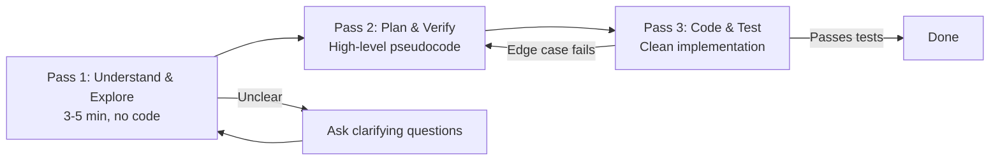
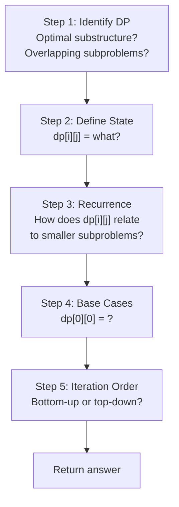
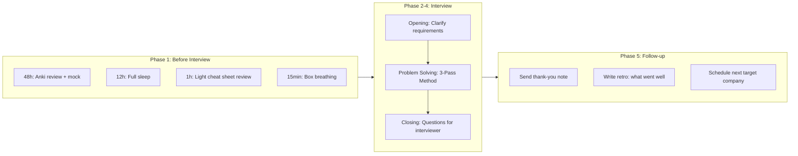

# Chapter 7: DSA & Coding Interview Prep


> **Prerequisites:** [Chapter 6: Procrastination, Habits & Deep Work](./ch-06-procrastination-habits-deep-work.md) — Emotional regulation and focus management.

> **Next:** [Chapter 8: GATE & Theory Exam Prep](./ch-08-gate-theory-prep.md) — Strategic preparation for theory-heavy exams.


> **Apply every learning technique from Chapters 1–6 specifically to DSA and coding interview preparation. Bridge the gap between knowing a concept and solving it under a whiteboard.**


This chapter teaches you how to learn data structures and algorithms efficiently for coding interviews — not by grinding 500 problems blindly, but by applying the cognitive science you've already mastered. You'll learn the 3-pass method that top candidates use, how to classify problems into patterns that reduce novel questions to familiar templates, and how to build a spaced-repetition system for DSA that actually works. Domain-specific workflows for dynamic programming, complexity analysis, system design, and low-level design are covered with concrete Java examples. By the end, you'll have a complete interview preparation system that replaces panic with process.


## Learning Objectives


- Apply the 3-pass method to any DSA problem

- Classify problem types into patterns to reduce unfamiliar questions to known templates

- Create effective Anki decks specifically for DSA retention

- Use the DP workflow (state ? recurrence ? base ? iteration) consistently

- Speed up complexity analysis intuition with the Big O pattern matcher

- Understand space-time tradeoffs and articulate them in interviews

- Distinguish SQL from NoSQL and choose based on access patterns

- Grasp system design fundamentals for the interview context

- Build a design patterns study plan using active recall

- Develop code review and debugging skills through deliberate practice

- Prepare for Low-Level Design rounds with a structured approach

- Understand concurrency basics: threads, locks, and the Java Memory Model

- Execute a complete interview workflow from warm-up to follow-up


---


### Chapter at a Glance


| Topic | Key Insight | Practical Takeaway |

|-------|-------------|-------------------|

| 3-Pass Method | Understand ? Plan ? Code replaces panic with process | Do not write code until the Plan phase is complete — trace examples first |

| Pattern Classification | ~500 LeetCode problems reduce to ~20 recurring patterns | Train yourself to classify the pattern before solving — under 30 seconds per problem |

| DSA Anki Decks | Four card types test pattern recognition, not solution memorization | Create cards for Problem?Approach, Approach?Complexity, Pattern?Problems, Buggy Code?Fix |

| DP Workflow | State ? Recurrence ? Base ? Iteration — the universal DP template | Write only steps 1-4 on paper for 5 DP problems before writing any code |

| Big O Matcher | Pattern recognition for time/space complexity across common structures | Use the complexity tier table to estimate bounds before coding |

| System Design Framework | 5-step process: requirements ? estimation ? data model ? API ? deep dive | Start with the simplest design that could work, then add scale |

| LLD Workflow | 5-step design: clarify ? identify objects ? define contracts ? implement ? test | Write the full Java implementation without looking at references |

| Interview Workflow | Warm-up ? Clarify ? Plan ? Code ? Test ? Follow-up | Verbalize your reasoning even when stuck — silence makes interviewers nervous |

| Meta-Learning Loop | Interview ? Reflect ? Adjust ? Practice compounds every experience | After every mock interview, write down exactly one thing to practice tomorrow |


**One-Sentence Takeaway:** The 3-pass method enforces understanding before coding — 6 minutes for Pass 1 (plan in plain English) followed by Pass 2 (code with plan visible) and Pass 3 (review and optimize).


---


### Q81: What is the 3-pass method for solving DSA problems, and why does it work?


**Answer:**


The 3-pass method is a structured approach to solving any unfamiliar DSA problem during an interview. It prevents the most common failure mode: jumping to code too early and painting yourself into a corner.





**Pass 1: Understand & Explore**


- Restate the problem in your own words

- Walk through examples — including edge cases (empty input, single element, duplicates, overflow)

- Ask clarifying questions: input size bounds, memory constraints, character set, mutability

- Brainstorm approaches out loud: brute force first, then ask "can we do better?"

- Time: 3–5 minutes. No code.


**Pass 2: Plan & Verify**


- Write a high-level approach in pseudocode or bullet points

- Verify on at least two examples, including an edge case

- Annotate time and space complexity of each step

- Identify potential bugs: off-by-one, null pointers, overflow

- Ask the interviewer: "Does this approach make sense before I start coding?"


**Pass 3: Code & Test**


- Write clean, readable code with meaningful variable names

- Use helper methods to keep each function focused

- After writing, walk through your code with the example inputs

- Test edge cases explicitly: send empty, null, single element

- If there's a bug, explain what went wrong, fix it, and move on — do not spiral


Why it works:


```java

// Pass 1 output (spoken, not written):

// "We need to find if any two numbers in a sorted array sum to target.

//  Brute force is O(n^2) checking all pairs.

//  Since it's sorted, can we use two pointers moving inward? O(n) time, O(1) space."


// Pass 2 output (written on the whiteboard / doc):

// Approach: Two pointers

// 1. left = 0, right = n-1

// 2. while left < right:

//      sum = arr[left] + arr[right]

//      if sum == target -> return true

//      if sum < target -> left++

//      else -> right--

// 3. return false


// Pass 3 output:

public boolean hasPairSum(int[] arr, int target) {

    if (arr == null || arr.length < 2) return false;

    int left = 0, right = arr.length - 1;

    while (left < right) {

        int sum = arr[left] + arr[right];

        if (sum == target) return true;

        if (sum < target) left++;

        else right--;

    }

    return false;

}

```


The 3-pass method works because it matches how your brain solves problems: diffuse mode exploration first (Pass 1), then focused mode planning (Pass 2), then execution (Pass 3). Most candidates crash because they skip straight to Pass 3.


**Try This:** Pick any unsolved LeetCode problem. Set a 6-minute timer. Do Pass 1 only. Write nothing but sentences. When the timer rings, cover your notes and try to reconstruct the plan from memory.


> **Pro Tip:** The 6-minute limit for Pass 1 is intentional. If you can't explain the approach in 6 minutes, you don't understand the problem well enough to code. If you can explain it in 6 minutes, the coding becomes mechanical. The bottleneck for most interview problems is understanding, not coding.


**One-Sentence Takeaway:** The bottleneck for most interview problems is understanding, not coding — if you can't explain the approach in 6 minutes, you're not ready to write code.


---


### Q82: How do you classify DSA problems into patterns?


**Answer:**


Pattern recognition is the single highest-leverage skill for DSA interviews. There are roughly 20 recurring patterns that cover 90%+ of interview problems. When you see a new problem, classify it into one of these buckets before designing a solution.


**The 20 Essential Patterns**


| # | Pattern | Signal | Example |

|---|---------|--------|---------|

| 1 | Two Pointers | Sorted array, find pair, palindrome | Two Sum II, Container With Most Water |

| 2 | Sliding Window | Contiguous subarray/substring, max/min/longest | Longest Substring Without Repeating Characters |

| 3 | Binary Search | Sorted or "first/last position" | Search in Rotated Sorted Array |

| 4 | BFS | Shortest path, level order, graph distance | Word Ladder, Tree Level Order Traversal |

| 5 | DFS / Backtracking | All permutations, combinations, paths | Subsets, N-Queens, Word Search |

| 6 | Topological Sort | Dependency ordering, course schedule | Course Schedule II |

| 7 | Union-Find | Dynamic connectivity, number of components | Number of Islands, Connected Components |

| 8 | Heap / Priority Queue | Top K, median, merge K sorted | Top K Frequent Elements, Merge K Sorted Lists |

| 9 | Monotonic Stack | Next greater/smaller element | Daily Temperatures, Largest Rectangle |

| 10 | Fast & Slow Pointers | Cycle detection, middle of linked list | Linked List Cycle, Find Duplicate Number |

| 11 | Merge Intervals | Overlapping intervals, meeting rooms | Merge Intervals, Insert Interval |

| 12 | Recursion / Divide & Conquer | Tree problems, sorted array to BST | Construct Binary Tree from Traversals |

| 13 | Greedy | Locally optimal choice, sorting first | Jump Game II, Activity Selection |

| 14 | DP — 1D | Single variable state | Climbing Stairs, House Robber |

| 15 | DP — 2D | Matrix, two strings | Longest Common Subsequence, Edit Distance |

| 16 | Trie | Prefix matching, autocomplete | Implement Trie, Word Search II |

| 17 | Bit Manipulation | XOR properties, power of two | Single Number, Missing Number |

| 18 | Sorting + Custom Comparator | Complex ordering rules | Merge Intervals, Reorder Data Logs |

| 19 | Prefix Sum | Subarray sum queries | Subarray Sum Equals K |

| 20 | Simulation / Math | Problem defines exact steps | Spiral Matrix, Robot Return to Origin |


**Classification Drill**


When you encounter a problem, ask these questions in order:


1. Is the data sorted? ? Binary search or two pointers

2. Does it involve subarray/substring contiguity? ? Sliding window or prefix sum

3. Is it a graph/tree? ? BFS (shortest path) or DFS (all paths)

4. Does it ask for top K or smallest K? ? Heap

5. Does it ask for all permutations/combinations? ? Backtracking

6. Does it ask for optimal value with overlapping subproblems? ? DP

7. Does it smell like greedy? ? Sort first, then verify with a counterexample


```java

// Example: classification in action

// Problem: "Find the maximum sum of any contiguous subarray"

//

// Step 1: Is data sorted? No.

// Step 2: Contiguous subarray? Yes. -> Sliding window or Kadane.

// Step 3: DP? Optimal value + overlapping subproblems? Yes.

// Pattern: DP-1D / Kadane's Algorithm


public int maxSubArray(int[] nums) {

    int maxEndingHere = nums[0];

    int maxSoFar = nums[0];

    for (int i = 1; i < nums.length; i++) {

        maxEndingHere = Math.max(nums[i], maxEndingHere + nums[i]);

        maxSoFar = Math.max(maxSoFar, maxEndingHere);

    }

    return maxSoFar;

}

```


**Try This:** Go through the last 10 LeetCode problems you solved. Write down which pattern each one belongs to. If you haven't solved any, go to LeetCode's "Top Interview Questions" and classify the first 10 by reading only the description — not the solution.


> **Remember:** Pattern recognition is built through comparison, not repetition. Solving 100 problems without connecting them to patterns teaches you 100 individual solutions. Solving 10 problems while actively classifying each one into a pattern framework teaches you the framework. The classification step IS the learning.


**One-Sentence Takeaway:** Solving 10 problems while actively classifying them into patterns teaches you the framework — the classification step IS the learning, not the repetition.


---


### Q83: How do you create Anki decks specifically for DSA?


**Answer:**


Most people's DSA Anki decks fail because they put too much on each card. A DSA-specific card must test active recall of the *pattern*, not the *solution text*.


**DSA Card Types**


**Type 1: Problem ? Approach (Front: problem description, Back: pattern + high-level plan)**


```

Front:

Given an array of integers, find the longest subarray with at most K distinct characters.


Back:

Pattern: Sliding window (variable size)

Approach: Expand right pointer, track character count in a hashmap.

When distinct characters > K, shrink left pointer until valid.

Update max window length each time we have a valid window.

Time: O(n), Space: O(K)

```


**Type 2: Approach ? Complexity (Front: approach description, Back: time/space + why)**


```

Front:

What is the time and space complexity of merge sort?

Why can't it be O(n) time?


Back:

Time: O(n log n) — divide step is log n levels, merge step is O(n) per level

Space: O(n) — auxiliary array for merging

Why not O(n)? Comparison-based sorting has a proven lower bound of O(n log n)

```


**Type 3: Pattern ? Problem (Front: pattern name, Back: signal words + example problems)**


```

Front:

What signals that a problem uses Union-Find (Disjoint Set Union)?


Back:

Signal words: "connected components", "dynamic connectivity", "union", "find"

Graph problems where edges are given and you need to detect cycles or count components.

Examples: Number of Islands, Number of Connected Components in an Undirected Graph,

Accounts Merge, Redundant Connection

```


**Type 4: Code Snippet ? Identify Bug (Front: buggy code, Back: bug + fix)**


```

Front:

public int firstBadVersion(int n) {

    int left = 0, right = n;          // <-- Bug

    while (left < right) {

        int mid = left + (right - left) / 2;

        if (isBadVersion(mid)) right = mid;

        else left = mid + 1;

    }

    return left;

}


Back:

Bug: left should start at 1, not 0. Version numbers are 1-indexed per the problem.

Fix: int left = 1, right = n;

Also: the loop condition left < right works for this search pattern,

but left <= right would be the standard binary search variant.

```


**Deck Organization**


- **Master Deck: DSA Patterns** (subdecks per pattern: SlidingWindow, TwoPointers, DP, etc.)

- Tags: `#dsa::pattern::sliding-window`, `#dsa::difficulty::medium`, `#dsa::topic::array`

- New cards per day: 10–15 (higher than general knowledge because you'll review solutions as you practice)

- Maximum 20 cards per subdeck or split it


**Review cadence:**


- Same day: review after solving

- Next day: recall the approach from memory before looking at your notes

- Day 4: solve a variant (not the same problem — a new problem in the same pattern)

- Day 7: speed round — write the approach in 30 seconds

- Day 30: classify 5 random problems into patterns


**Try This:** Create 3 cards using the templates above for the last DSA problem you solved. Add them to a new Anki deck called "DSA Patterns". Set the daily new card limit to 10.


> **Warning:** The most common DSA Anki mistake is testing recognition instead of recall. A card that shows "Two Pointers: [full explanation]" tests only reading comprehension. A good card shows a problem description on the front and asks "Which pattern? Why?" — forcing you to retrieve the classification from memory.


**One-Sentence Takeaway:** DSA Anki cards must test recall, not recognition — show the problem description and ask "Which pattern? Why?" instead of listing the pattern name.


---


### Q84: What is the DP workflow and how do I use it consistently?


**Answer:**


Dynamic Programming is the most feared DSA topic. The problem is emotional, not intellectual. The DP workflow replaces panic with a checklist. Memorize this sequence:





**DP Workflow — 5 Steps**


**Step 1: Identify DP**

Ask: "Does the problem have optimal substructure and overlapping subproblems?"

- Optimal substructure: the optimal solution depends on optimal solutions to subproblems

- Overlapping subproblems: the same subproblems are solved repeatedly

- Signal words: "minimum number of ways", "maximum profit", "longest", "shortest"


**Step 2: Define State**

Ask: "What are the parameters that uniquely describe a subproblem?"

- 1D DP: `dp[i]` = answer for first i elements / problem of size i

- 2D DP: `dp[i][j]` = answer for i elements of first input and j elements of second

- State must be complete: two subproblems with the same (i,j) must have the same answer


**Step 3: Recurrence Relation**

Ask: "How does dp[i] relate to dp[i-1], dp[i-2], etc.?"

- Write it in English first, then translate to code

- The last decision is usually the key: "either we take item i or we skip it"


**Step 4: Base Case**

Ask: "What is the answer for the smallest input?"

- Typically dp[0] = 0, dp[1] = 1, or similar

- Base cases are the anchor that prevents infinite recursion


**Step 5: Iteration / Memoization**

Ask: "Do I solve bottom-up (table) or top-down (memoization)?"

- Bottom-up: iterate from small to large

- Top-down: recursive with memoization cache


```java

// Step 1: Identify DP

// Problem: "Given a 2D grid, find the minimum path sum from top-left to bottom-right,

//  moving only down or right."

// Optimal substructure: min path to (i,j) depends on min path to (i-1,j) and (i,j-1)

// Overlapping subproblems: the grid is traversed from multiple paths


// Step 2: Define state

// dp[i][j] = minimum path sum to reach cell (i,j)


// Step 3: Recurrence

// dp[i][j] = grid[i][j] + min(dp[i-1][j], dp[i][j-1])


// Step 4: Base case

// dp[0][0] = grid[0][0]

// first row: dp[0][j] = dp[0][j-1] + grid[0][j]

// first col: dp[i][0] = dp[i-1][0] + grid[i][0]


// Step 5: Iteration

public int minPathSum(int[][] grid) {

    int m = grid.length, n = grid[0].length;

    int[][] dp = new int[m][n];

    dp[0][0] = grid[0][0];

    for (int j = 1; j < n; j++) dp[0][j] = dp[0][j-1] + grid[0][j];

    for (int i = 1; i < m; i++) dp[i][0] = dp[i-1][0] + grid[i][0];

    for (int i = 1; i < m; i++)

        for (int j = 1; j < n; j++)

            dp[i][j] = grid[i][j] + Math.min(dp[i-1][j], dp[i][j-1]);

    return dp[m-1][n-1];

}


// Space-optimized: O(n) instead of O(m*n)

public int minPathSumOptimized(int[][] grid) {

    int m = grid.length, n = grid[0].length;

    int[] dp = new int[n];

    dp[0] = grid[0][0];

    for (int j = 1; j < n; j++) dp[j] = dp[j-1] + grid[0][j];

    for (int i = 1; i < m; i++) {

        dp[0] += grid[i][0];

        for (int j = 1; j < n; j++)

            dp[j] = grid[i][j] + Math.min(dp[j], dp[j-1]);

    }

    return dp[n-1];

}

```


**How to practice DP:**


1. Solve every DP problem on paper using the 5-step workflow — no code allowed until step 5

2. After solving, mutate the problem (e.g., "what if we could also move left?") and re-derive

3. Create one Anki card per DP pattern (0/1 Knapsack, Unbounded Knapsack, LCS, LIS, Edit Distance, Matrix DP, Interval DP, DP on Trees)


**Try This:** Take the "Coin Change" problem (minimum coins to make an amount). Write out the 5 DP workflow steps on paper. Do not code until step 5. Time yourself: target under 10 minutes for the full workflow.


> **Pro Tip:** The 5-step DP workflow (define state ? recurrence ? base ? order ? code) is designed to prevent the most common DP failure: jumping to code before understanding the recurrence. If you can state the recurrence in plain English ("dp[i] = min coins to make amount i"), you're 80% done. If you can't, you're not ready to code.


**One-Sentence Takeaway:** The 5-step DP workflow (state ? recurrence ? base ? order ? code) prevents the most common mistake — if you can't state the recurrence in plain English, you're not ready to code.


---


### Q85: How do I use LeetCode solutions without abusing them?


**Answer:**


The most common mistake in DSA preparation is reading the solution immediately after failing for 10 minutes. This teaches pattern-matching to *existing code*, not problem-solving. Use the stair-step approach below.


**The Stair-Step Solution Protocol**


**Step 0: Fight (15–30 minutes)**


- Do not look at any external resource

- Apply the 3-pass method (Q81)

- Write down your best-attempt approach, even if incomplete

- If you truly have zero ideas after 30 minutes, move to Step 1


**Step 1: Hint (5 minutes)**


- Read only the first sentence of the solution (pattern name)

- Example: "This problem uses two pointers" — then stop reading

- Try to derive the full solution from just the pattern name

- If you succeed, you earned the solution. If not, move to Step 2.


**Step 2: Skeleton (5 minutes)**


- Read the high-level approach (bullet points, not code)

- Write the code yourself based on that plan

- If you get stuck, refer to the skeleton, not the full code


**Step 3: Read Full Solution (compare and learn)**


- Now read the complete code

- Compare with your implementation

- Ask: "What did they do differently? Why is theirs cleaner? Did I miss an edge case?"

- Rewrite the solution from memory (active recall)


```java

// Example: Stair-step for "Subarray Sum Equals K"


// Step 0: You try brute force O(n^2) or O(n^3)

// Step 1: Hint: "Prefix sum + hashmap"

// Step 2: Skeleton:

//   - Build cumulative prefix sums

//   - Use a hashmap to count how many times each prefix sum has appeared

//   - For each prefix, check if (prefixSum - k) exists in the map

// Step 3: Write it yourself:


public int subarraySum(int[] nums, int k) {

    Map<Integer, Integer> prefixCount = new HashMap<>();

    prefixCount.put(0, 1);

    int sum = 0, count = 0;

    for (int num : nums) {

        sum += num;

        if (prefixCount.containsKey(sum - k))

            count += prefixCount.get(sum - k);

        prefixCount.put(sum, prefixCount.getOrDefault(sum, 0) + 1);

    }

    return count;

}

```


**When to abandon the stair-step:**


- You have fewer than 3 weeks before the interview ? partial solution reading is acceptable, but never full code first

- You're revisiting a problem you already solved ? write from memory, then check

- You're studying a new pattern ? read the explanation for 2–3 examples, then solve the next 5 yourself


**The 48-hour rule:**


After reading a solution, you must re-solve the same problem from scratch within 48 hours. If you can't, the solution didn't stick. Create an Anki card (Q83) to schedule the re-solve.


**Try This:** Pick a LeetCode Medium you've never seen. Set a 30-minute timer. Do Step 0. If you don't solve it, move to Step 1. Record how many hints you needed. Target: after 20 problems using this protocol, you should need at most Step 1 for most Mediums.


> **Pro Tip:** The stair-step protocol works because it prevents the "solution spoiler" problem. Most learners read the solution too early and fool themselves into thinking they understand. By forcing yourself through graduated hints, you maximize the time spent in productive struggle — which is where real learning happens.


**One-Sentence Takeaway:** The stair-step protocol (graduated hints) maximizes productive struggle — learning happens during the effort, not from reading the solution early.


---


### Q86: How do I develop intuition for time and space complexity quickly?


**Answer:**


Complexity analysis becomes intuitive when you stop doing big-O math in your head and start pattern-matching code structures to their complexity class. Build a "complexity reflex" by training on code skeletons.


**The Big O Pattern Matcher**


| Code Structure | Complexity | Why |

|---|---|---|

| Single loop over n | O(n) | Each element processed once |

| Nested loops (i, j both up to n) | O(n^2) | For each of n, do n work |

| Two separate loops (not nested) | O(n + m) or O(n) | Sequential, not multiplicative |

| Binary search (halving each step) | O(log n) | Size halves each iteration |

| Divide and conquer with O(n) merge | O(n log n) | log n levels, n work each |

| Recursion with two branches (no memo) | O(2^n) | Each call spawns 2 more |

| Recursion with memo on n states | O(n) | Each state computed once |

| Sorting | O(n log n) | Comparison-based sort lower bound |

| Hashmap operations | O(1) average | Constant time per insert/lookup |

| Heap push/pop | O(log n) | Tree height is log n |

| Graph: BFS/DFS | O(V + E) | Visit each vertex and edge once |

| Graph: Floyd-Warshall | O(V^3) | Three nested loops over vertices |


**Speed Training Drill**


1. Write the complexity for each snippet in under 10 seconds:


```java

// Example A:  (answer: O(n), O(1) space)

for (int x : arr) sum += x;


// Example B:  (answer: O(n^2), O(1) space)

for (int i = 0; i < n; i++)

    for (int j = i; j < n; j++)

        System.out.println(arr[i] + arr[j]);


// Example C:  (answer: O(log n), O(1) space)

while (low <= high) {

    int mid = low + (high - low) / 2;

    if (arr[mid] == target) return mid;

    if (arr[mid] < target) low = mid + 1;

    else high = mid - 1;

}


// Example D:  (answer: O(2^n), O(n) stack space)

int fib(int n) {

    if (n <= 1) return n;

    return fib(n-1) + fib(n-2);

}


// Example E:  (answer: O(n), O(1) space — tail recursion optimizable)

int factorial(int n, int acc) {

    if (n == 0) return acc;

    return factorial(n-1, n * acc);

}

```


2. Derive complexity by tracing one input:

   - Count how many times the inner loop body runs

   - For recursion, draw the call tree and count nodes

   - For multi-step algorithms, add the complexities (not multiply) unless they're nested


3. Common traps to develop intuition for:

   - `O(n)` inside `O(n)` is `O(n^2)` — but only if the inner loop's work grows with n

   - `O(n/2)` is `O(n)` — constants don't matter

   - `O(n + n log n)` simplifies to `O(n log n)` — keep the dominant term

   - String concatenation in a loop is `O(n * k)` not `O(n)` if strings are immutable


```java

// Trap: O(n) loops internally do O(k) work where k grows

// Complexity: O(n * avgStringLength), effectively O(n * m)

public String joinStrings(List<String> words) {

    String result = "";               // O(1)

    for (String w : words) {          // n iterations

        result += w;                  // O(len(result)) due to immutability! -> O(n) per iteration

    }

    return result;                    // Total: O(1 + 2 + 3 + ... + n) = O(n^2)

}

// Fix: StringBuilder -> total O(n)

```


**Try This:** Create a flashcard deck with 20 code snippets on the front and their complexity on the back. Practice speed-running the deck: you should be able to identify O(n log n), O(n^2), O(2^n), and O(n!) patterns in under 5 seconds each.


> **Remember:** Big-O analysis in interviews is less about exact calculation and more about recognizing common patterns. Nested loops over the same data ? O(n²). Divide-and-conquer recursion ? O(n log n). Single pass with constant work per element ? O(n). Learn to spot the pattern, not compute the math.


**One-Sentence Takeaway:** Big-O analysis in interviews is about pattern recognition — nested loops = O(n²), divide-and-conquer = O(n log n), single pass = O(n) — not about computing exact math.


---


### Q87: How do I think about space-time tradeoffs in interviews?


**Answer:**


Most interview problems have a "standard" space-time tradeoff: you can use extra memory to reduce time, or accept slower time to use less memory. Interviewers specifically test your ability to identify, articulate, and implement these tradeoffs.


**The Four Common Tradeoffs**


**Tradeoff 1: Hashmap vs. Nested Loop**


The most common tradeoff. A hashmap gives O(1) lookups at the cost of O(n) extra memory.


```java

// O(n^2) time, O(1) space

public boolean containsDuplicate(int[] nums) {

    for (int i = 0; i < nums.length; i++)

        for (int j = i + 1; j < nums.length; j++)

            if (nums[i] == nums[j]) return true;

    return false;

}


// O(n) time, O(n) space — trade memory for speed

public boolean containsDuplicate(int[] nums) {

    Set<Integer> seen = new HashSet<>();

    for (int num : nums) {

        if (seen.contains(num)) return true;

        seen.add(num);

    }

    return false;

}

```


**Tradeoff 2: Precomputation / Caching**


Spend O(n) precomputation to answer each query in O(1) instead of O(n).


```java

// Without precomputation: O(n) per query

public int rangeSum(int[] arr, int i, int j) {

    int sum = 0;

    for (int k = i; k <= j; k++) sum += arr[k];

    return sum;

}


// With prefix sum precomputation: O(1) per query, O(n) precomputation, O(n) space

class PrefixSum {

    int[] prefix;


    PrefixSum(int[] arr) {           // O(n) precomputation

        prefix = new int[arr.length + 1];

        for (int i = 0; i < arr.length; i++)

            prefix[i + 1] = prefix[i] + arr[i];

    }


    int rangeSum(int i, int j) {     // O(1) per query

        return prefix[j + 1] - prefix[i];

    }

}

```


**Tradeoff 3: Recursion (implicit stack) vs. Iteration**


Recursion is elegant but uses O(depth) stack space. Iteration uses O(1) extra but is more complex.


```java

// Recursive DFS: O(h) stack space (h = tree height)

public int maxDepth(TreeNode root) {

    if (root == null) return 0;

    return 1 + Math.max(maxDepth(root.left), maxDepth(root.right));

}


// Iterative BFS: O(w) queue space (w = max width) — trades stack space for queue space

public int maxDepth(TreeNode root) {

    if (root == null) return 0;

    Queue<TreeNode> q = new LinkedList<>();

    q.offer(root);

    int depth = 0;

    while (!q.isEmpty()) {

        int size = q.size();

        depth++;

        for (int i = 0; i < size; i++) {

            TreeNode node = q.poll();

            if (node.left != null) q.offer(node.left);

            if (node.right != null) q.offer(node.right);

        }

    }

    return depth;

}

```


**Tradeoff 4: In-place modification vs. Copy**


Modifying input saves space but makes code destructive and harder to debug.


```java

// In-place: O(1) space, but mutates input

public void reverse(char[] s) {

    int l = 0, r = s.length - 1;

    while (l < r) {

        char tmp = s[l];

        s[l++] = s[r];

        s[r--] = tmp;

    }

}


// Copy: O(n) space, preserves original

public char[] reverseCopy(char[] s) {

    char[] result = new char[s.length];

    for (int i = 0; i < s.length; i++)

        result[i] = s[s.length - 1 - i];

    return result;

}

```


**How to discuss tradeoffs in an interview:**


- State both solutions explicitly: "The brute force is O(n^2) time with O(1) space. We can improve to O(n) time by using a hashmap, which gives us O(1) lookups but costs O(n) memory."

- Ask which dimension matters: "Are we optimizing for time or memory here? If the input fits in memory, the hashmap approach is preferred."

- Mention constraints: "If the input is a stream and we can't store everything, we need the in-place approach."


**Try This:** For the problem "Find the intersection of two arrays", write three solutions: (1) nested loop O(n*m) time, O(1) space, (2) hashset O(n+m) time, O(min(n,m)) space, (3) sort + two pointers O(n log n + m log m) time, O(1) space. For each, articulate the tradeoff in one sentence.


> **Pro Tip:** In an interview, don't just state the tradeoff — show you can make a decision. Say "For this specific case, the input arrays are small and I don't know the data distribution, so I'll start with the hashset approach for best average-case time. If memory becomes an issue, I can fall back to sort + two pointers." This demonstrates engineering judgment.


**One-Sentence Takeaway:** In interview tradeoff discussions, don't just state the options — make a decision justified by specific constraints, with a fallback plan.


---


### Q88: How do I decide between SQL and NoSQL for an interview problem?


**Answer:**


Interviewers increasingly ask database design questions even in DSA-focused interviews. The key is to map the application's access patterns to database properties.


**Decision Framework**


Ask these questions in order:


1. **Does the data have a fixed schema with relationships?** ? SQL

   - Users have orders; orders have items; items have categories

   - You need joins, foreign keys, ACID transactions

   - Examples: e-commerce, banking, ERP


2. **Does the schema evolve rapidly or vary per record?** ? NoSQL (Document)

   - Each document might have different fields

   - Product catalog where different products have different attributes

   - Examples: CMS, personalization data, event logging


3. **Is the primary access pattern key-value lookup?** ? NoSQL (Key-Value)

   - Session store, user profile cache, feature flags

   - Examples: Redis, DynamoDB


4. **Are you storing relationships / graphs?** ? NoSQL (Graph)

   - Social networks, recommendation engines, fraud detection

   - Examples: Neo4j, Amazon Neptune


5. **Are you storing time-series or write-heavy data?** ? NoSQL (Wide-Column)

   - IoT sensor data, stock tickers, application logs

   - Examples: Cassandra, InfluxDB, TimescaleDB


**The SQL vs. NoSQL Comparison Table for Interviews**


| Dimension | SQL (PostgreSQL, MySQL) | NoSQL (MongoDB, Cassandra) |

|-----------|------------------------|----------------------------|

| Schema | Fixed, rigid | Flexible, dynamic |

| Relationships | Joins, foreign keys | Embedded documents or references |

| ACID | Full ACID support | BASE (Basically Available, Soft state, Eventually consistent) |

| Scaling | Vertical (scale up) | Horizontal (scale out) |

| Consistency | Strong consistency | Tunable / eventual consistency |

| Query language | SQL (standardized) | API-specific (MQL, CQL) |

| Use case | Transactions, complex queries | High volume, flexible schema |


**How to discuss in an interview:**


```java

// Interview question: "Design a system for a ride-sharing app.

//  How would you store drivers, riders, and trips?"


// Answer structure:

// "For the relational parts — trip history with driver and rider details —

//  I'd use PostgreSQL because trips have a fixed schema and need ACID for payments.

//  For real-time driver location updates, I'd use Redis (key-value with TTL)

//  because it's high-write, low-latency, and doesn't need joins.

//  For ride preferences and user profiles with varying fields,

//  I'd use MongoDB because different users have different profile attributes."


// Concrete schema example:

-- SQL schema for the transactional parts

CREATE TABLE users (

    id BIGSERIAL PRIMARY KEY,

    name VARCHAR(100) NOT NULL,

    email VARCHAR(255) UNIQUE NOT NULL,

    user_type VARCHAR(10) CHECK (user_type IN ('driver', 'rider'))

);


CREATE TABLE trips (

    id BIGSERIAL PRIMARY KEY,

    rider_id BIGINT REFERENCES users(id),

    driver_id BIGINT REFERENCES users(id),

    pickup_lat DECIMAL(9,6),

    pickup_lng DECIMAL(9,6),

    dropoff_lat DECIMAL(9,6),

    dropoff_lng DECIMAL(9,6),

    fare DECIMAL(10,2),

    status VARCHAR(20),

    created_at TIMESTAMP DEFAULT NOW()

);


-- NoSQL (Redis) for live location:

-- Key: "driver:{driverId}:location"

-- Value: "{lat: 12.345, lng: 67.890, updatedAt: timestamp}"

-- TTL: 5 seconds (ephemeral)

```


**Try This:** Design the storage layer for a URL shortener (like bit.ly). Write down which database(s) you'd use for each data type (user accounts, shortened URLs, click analytics). Justify each choice using the 5-question framework.


**One-Sentence Takeaway:** System design requires a structured framework — assess requirements, estimate scale, design data model, plan components, and evaluate tradeoffs at each step.


---


### Q89: How do I approach system design fundamentals for interviews?


**Answer:**


System design interviews test your ability to architect scalable systems, not your knowledge of specific technologies. The framework below works for any design question.


**The 5-Step System Design Framework**


**Step 1: Scope & Requirements (2–3 minutes)**


- Functional requirements: what must the system do?

- Non-functional requirements: scale (DAU, QPS), latency (read/write), durability, availability

- Out of scope: explicitly state what you won't cover


**Step 2: High-Level Design (3–5 minutes)**


- Draw the main components: client ? load balancer ? app servers ? database ? cache

- Explain the request flow end-to-end for the core use case


**Step 3: Deep Dive (10–15 minutes)**


- Go deeper on 1–2 components the interviewer cares about

- Database schema, caching strategy, data partitioning, consistency model

- Discuss tradeoffs explicitly: "I'm choosing SQL here because..."


**Step 4: Scale & Optimize (5 minutes)**


- What breaks at 10x scale?

- Add CDN for static assets, read replicas for read-heavy workloads

- Shard the database, add a message queue for async processing


**Step 5: Wrap (2 minutes)**


- Summarize the architecture

- Mention 1–2 things you'd improve with more time


```java

// Design a URL Shortener (tinyurl.com)


// Step 1: Requirements

// Functional: create short URL, redirect to original, optional custom alias

// Non-functional: 100M URLs/month, redirect in < 100ms, 99.99% uptime

// Out of scope: user accounts, analytics


// Step 2: High-Level Design

// Client -> Load Balancer -> App Servers -> PostgreSQL (primary) + Redis (cache)

// Write path: POST /shorten {url} -> generate 7-char key -> store in DB + cache -> return

// Read path: GET /{key} -> check cache -> check DB -> redirect 301


// Step 3: Deep Dive — Key Generation

// We need 62^7 = ~3.5 trillion unique keys.

// Approach 1: Base62 encoding of DB auto-increment ID (simple, sequential)

// Approach 2: Pre-generate keys in a key-service (KGS) to avoid collisions


// Step 4: Scale

// Cache with LRU eviction for hot URLs

// Read replicas for analytics queries

// Shard by first character of short key for write scaling


// Step 5: Wrap

// "We have a scalable URL shortener with Redis caching for low-latency reads,

//  PostgreSQL for durability, and a key-generation service to avoid collisions.

//  With more time I'd add rate limiting and analytics."

```


**Key components to know for any system design interview:**


- Load balancers (round-robin, least connections, consistent hashing)

- Caching (Redis, Memcached; cache-aside, write-through, write-behind)

- Database replication (leader-follower, multi-leader, quorum)

- Database sharding (hash-based, range-based, directory-based)

- Message queues (Kafka, RabbitMQ; pub/sub, point-to-point)

- CDN (edge caching for static assets)

- Rate limiting (token bucket, sliding window)

- Consistent hashing (distributed caching with minimal rehashing)


**Try This:** Design Twitter. Spend exactly 30 minutes going through the 5-step framework. Draw the architecture (you can use a text diagram or paper). Focus on the timeline feed use case: how does a user see tweets from people they follow?


**One-Sentence Takeaway:** Practice system design with realistic scenarios like Twitter's timeline feed — focus on the core use case and apply a consistent 5-step framework.


---


### Q90: How do I study design patterns for interviews?


**Answer:**


Design pattern questions in interviews don't test whether you can recite the GoF catalog. They test whether you can recognize when a pattern simplifies code and implement it correctly.


**The Only Patterns You Need for Interviews**


| Pattern | Frequency | Typical Question |

|---------|-----------|------------------|

| Singleton | Very High | "Ensure only one instance of Logger" |

| Factory Method | High | "Create different types of notification" |

| Strategy | Very High | "Implement multiple payment methods" |

| Observer | High | "Event system / pub-sub" |

| Decorator | Medium | "Add logging/metrics dynamically" |

| Adapter | Medium | "Make incompatible interfaces work together" |

| Builder | Medium | "Construct complex object step by step" |

| State | Low-Medium | "Vending machine / order workflow" |


**Active Recall Study Plan**


**Week 1: Pattern Exploration (2 patterns per day)**


- Day 1–2: Singleton + Factory Method

- Day 3–4: Strategy + Observer

- Day 5–6: Decorator + Adapter

- Day 7: Builder + State + Review


For each pattern:


1. Read the definition (2 minutes)

2. Write a real-world example from your experience (5 minutes)

3. Implement it in Java from memory (15 minutes)

4. Create an Anki card (front: pattern name, back: intent + when to use + code skeleton)


**Week 2: Pattern Recognition**


- For each problem in your practice set, ask: "Which pattern would simplify this?"

- Re-implement each pattern without looking at last week's code

- Interview drill: "I notice this payment system has multiple if-else branches. That's a sign we should extract a Strategy pattern."


**Week 3: Pattern Integration**


- Combine patterns: "Can I use Factory + Strategy together?"

- Refactor a messy codebase into patterns (use a small GitHub project)

- Mock interview: have someone describe a design problem, you identify and implement the pattern


```java

// Example: Strategy Pattern for payment processing


// Step 1: Define the strategy interface

interface PaymentStrategy {

    void pay(int amount);

}


// Step 2: Implement concrete strategies

class CreditCardPayment implements PaymentStrategy {

    private String cardNumber;

    CreditCardPayment(String cardNumber) { this.cardNumber = cardNumber; }

    public void pay(int amount) {

        System.out.println("Paid " + amount + " using credit card " + cardNumber);

    }

}


class PayPalPayment implements PaymentStrategy {

    private String email;

    PayPalPayment(String email) { this.email = email; }

    public void pay(int amount) {

        System.out.println("Paid " + amount + " using PayPal account " + email);

    }

}


class UPIPayment implements PaymentStrategy {

    private String upiId;

    UPIPayment(String upiId) { this.upiId = upiId; }

    public void pay(int amount) {

        System.out.println("Paid " + amount + " via UPI ID " + upiId);

    }

}


// Step 3: Context class treats strategies interchangeably

class ShoppingCart {

    private List<Integer> items = new ArrayList<>();


    void addItem(int price) { items.add(price); }


    void checkout(PaymentStrategy paymentStrategy) {

        int total = items.stream().mapToInt(Integer::intValue).sum();

        paymentStrategy.pay(total);

    }

}


// Usage

// ShoppingCart cart = new ShoppingCart();

// cart.addItem(100);

// cart.addItem(250);

// cart.checkout(new UPI("user@upi"));  // Strategy selected at runtime

```


**How to discuss patterns in interviews:**


- Never lead with the pattern name. Lead with the problem: "I see we have multiple algorithms that vary by type. I could extract a Strategy interface here."

- Connect to SOLID: "This makes our code Open for extension (new payment methods) but Closed for modification (the ShoppingCart doesn't change)."

- Show tradeoff awareness: "The Strategy pattern adds complexity with extra classes, but the benefit is that adding a new payment method doesn't touch existing code."


**Try This:** Implement the Observer pattern for a weather station. The WeatherStation (subject) tracks temperature. Two observers (PhoneDisplay, WindowDisplay) display updates whenever the temperature changes. Write the complete Java code from memory. Do not look at a reference.


**One-Sentence Takeaway:** Study design patterns by implementing them from memory for a real scenario — connection to SOLID principles and tradeoff awareness matters more than memorizing definitions.


---


### Q91: How do I develop code review and debugging skills through deliberate practice?


**Answer:**


Code review and debugging are separate skills from writing code, and they need separate deliberate practice. Most candidates can write code but freeze when asked "find the bug in this function."


**How to Practice Code Review**


**Drill 1: Bug Hunt (10 minutes/day)**


- Go to LeetCode or any code on GitHub

- Deliberately read the code *without* running it

- Find as many bugs as you can in 10 minutes

- Categories to check:

  - Off-by-one errors in loop bounds

  - Null pointer / empty input

  - Integer overflow

  - Mutating input that shouldn't be mutated

  - Race conditions (if multithreaded)

  - Resource leaks (files, connections not closed)


```java

// Bug hunt drill — find the bugs:

class BuggyCode {

    // Bug 1: Off-by-one — missing last element

    static int sum(int[] arr) {

        int sum = 0;

        for (int i = 0; i <= arr.length; i++) sum += arr[i];  // <-- arr.length, not <=

        return sum;

    }


    // Bug 2: Integer overflow — use long

    static long factorial(int n) {

        long result = 1;

        for (int i = 2; i <= n; i++) result *= i;

        return result;

    }

    // (Actually correct for long — but test n=21 and it overflows silently)


    // Bug 3: Mutating input in place, caller may not expect it

    static void sortAndPrint(List<Integer> list) {

        Collections.sort(list);  // <-- modifies original

        System.out.println(list);

        // Fix: make a defensive copy

    }

}

```


**Drill 2: Style Review (10 minutes/day)**


- Read code on GitHub and evaluate against:

  - Naming conventions: does `x` mean anything? Is `processData` too vague?

  - Function length: can you understand it without scrolling?

  - Comments: do they explain *why* not *what*?

  - Error handling: what happens when a file doesn't exist?


**Drill 3: Refactor Review (15 minutes/day)**


- Take any function you wrote yesterday

- Read it as if someone else wrote it

- Identify 3 things you'd change

- Rewrite it


**The Debugging Workflow**


1. **Reproduce:** Can I trigger the bug consistently? What're the exact steps?

2. **Isolate:** Where in my code does the behavior diverge from expectations? Use binary search on print statements or breakpoints.

3. **Hypothesize:** What could cause this? List 2–3 possible root causes.

4. **Test:** Write a minimal test case for each hypothesis.

5. **Fix:** Once confirmed, apply the minimal fix.

6. **Verify:** Does the fix work? Does it break anything else?


```java

// Debugging workflow example

// Bug: "My binary search returns -1 for elements that exist"


public int binarySearch(int[] arr, int target) {

    int left = 0, right = arr.length - 1;

    while (left < right) {  // Step 2: Isolate — is this condition correct?

        int mid = left + (right - left) / 2;

        if (arr[mid] == target) return mid;

        if (arr[mid] < target) left = mid + 1;

        else right = mid - 1;

    }

    // Step 3: Hypothesize — "left < right" fails when we narrow to a single element.

    // If arr[left] == target, we never check it because the loop exits before returning.

    // Step 4: Test — pass arr = [1, 2], target = 1. left=0, right=1, mid=0, match at 0 returns.

    // But for arr = [1], target = 1: left=0, right=0, loop doesn't execute. Returns -1. Confirmed.

    // Step 5: Fix — use left <= right, or add the final check outside the loop.

    return arr[left] == target ? left : -1;  // or change condition to left <= right

}

```


**Try This:** Go to LeetCode, pick any problem you've solved recently. Read only the problem statement, then look at the "Discuss" tab's most-downvoted solution. Find 3 bugs or style issues in it. Write a brief code review comment for each.


**One-Sentence Takeaway:** Develop code review skills by finding bugs in others' solutions — deliberate practice at reading and critiquing code builds debugging intuition faster than writing perfect code.


---


### Q92: How do I prepare for Low-Level Design (LLD) rounds?


**Answer:**


LLD rounds test your ability to design object-oriented systems — class hierarchies, interfaces, design patterns, and clean abstractions. Unlike system design (which is about distributed systems), LLD is about in-memory object models for a single process.


**The LLD Workflow**


**Step 1: Requirements Gathering (3 minutes)**


- List the entities (nouns): User, Order, Product, Inventory, Payment

- List the actions (verbs): place order, add to cart, cancel order, process payment

- Identify states and transitions: Order: PENDING ? CONFIRMED ? SHIPPED ? DELIVERED or CANCELLED


**Step 2: Class Design (5 minutes)**


- Define each class with fields and methods

- Identify relationships: inheritance (is-a), composition (has-a), association (uses-a)

- Apply the right design pattern (Q90)


**Step 3: Interface Design (3 minutes)**


- Define interfaces for the core abstractions

- This lets you swap implementations later


**Step 4: Implementation (7 minutes)**


- Write the main classes and their key methods

- Use enums for state, exceptions for edge cases

- Write clean, compilable Java


**Step 5: Test (2 minutes)**


- Write a quick main method or test that exercises the core flow

- Cover edge cases: empty cart, invalid product, duplicate order


```java

// LLD Example: Design a Parking Lot System


// Step 1: Entities — Vehicle, ParkingSpot, ParkingFloor, ParkingLot, Ticket

// Actions: park vehicle, unpark vehicle, check availability, calculate fee


// Step 2: Classes

enum VehicleType { BIKE, CAR, TRUCK }


abstract class Vehicle {

    String licensePlate;

    VehicleType type;

    Vehicle(String licensePlate, VehicleType type) {

        this.licensePlate = licensePlate;

        this.type = type;

    }

}


class Car extends Vehicle {

    Car(String licensePlate) { super(licensePlate, VehicleType.CAR); }

}


class Bike extends Vehicle { ... }

class Truck extends Vehicle { ... }


class ParkingSpot {

    int id;

    VehicleType spotType;

    boolean isAvailable;

    Vehicle parkedVehicle;


    ParkingSpot(int id, VehicleType spotType) {

        this.id = id;

        this.spotType = spotType;

        this.isAvailable = true;

    }


    void park(Vehicle vehicle) {

        if (!isAvailable) throw new IllegalStateException("Spot occupied");

        if (vehicle.type != spotType) throw new IllegalArgumentException("Wrong spot type");

        this.parkedVehicle = vehicle;

        this.isAvailable = false;

    }


    void unpark() {

        this.parkedVehicle = null;

        this.isAvailable = true;

    }

}


class ParkingFloor {

    int floorNumber;

    List<ParkingSpot> spots;


    ParkingFloor(int floorNumber, int bikeSpots, int carSpots, int truckSpots) {

        this.floorNumber = floorNumber;

        this.spots = new ArrayList<>();

        int id = 1;

        for (int i = 0; i < bikeSpots; i++) spots.add(new ParkingSpot(id++, VehicleType.BIKE));

        for (int i = 0; i < carSpots; i++) spots.add(new ParkingSpot(id++, VehicleType.CAR));

        for (int i = 0; i < truckSpots; i++) spots.add(new ParkingSpot(id++, VehicleType.TRUCK));

    }


    ParkingSpot findAvailableSpot(VehicleType type) {

        return spots.stream()

            .filter(s -> s.isAvailable && s.spotType == type)

            .findFirst()

            .orElse(null);

    }

}


class ParkingLot {

    List<ParkingFloor> floors;


    ParkingLot(int numFloors, int[] spotsConfig) { ... }


    ParkingSpot park(Vehicle vehicle) {

        for (ParkingFloor floor : floors) {

            ParkingSpot spot = floor.findAvailableSpot(vehicle.type);

            if (spot != null) {

                spot.park(vehicle);

                return spot;

            }

        }

        throw new RuntimeException("No available spot");

    }


    void unpark(ParkingSpot spot) {

        spot.unpark();

    }

}

```


**Common LLD problems to practice:**


- Parking Lot (most classic — practice this until fluent)

- Vending Machine

- Tic Tac Toe / Chess

- Splitwise / Expense Sharing

- Library Management System

- Elevator System

- ATM Machine

- Hotel Booking System


**Try This:** Design a Vending Machine. Follow the 5-step LLD workflow. Define classes for Item, Shelf, VendingMachine, Payment (cash/card), and Transaction. Write the Java code for at least: inserting money, selecting an item, dispensing it, and returning change.


**One-Sentence Takeaway:** Low-Level Design practice requires hands-on implementation of realistic systems — follow a structured workflow from class definition through complete working code.


---


### Q93: How do I prepare for concurrency and multithreading questions?


**Answer:**


Concurrency questions test your understanding of threads, synchronization, and the Java Memory Model. Most interviews only ask about fundamental concepts, but you need to know them deeply.


**The Concurrency Minimum**


**Concept 1: Thread Safety**


Code is thread-safe if it works correctly when accessed by multiple threads simultaneously.


```java

// NOT thread-safe — race condition

class Counter {

    private int count = 0;

    public void increment() { count++; }  // Read + increment + write = not atomic

}


// Thread-safe — synchronized

class Counter {

    private int count = 0;

    public synchronized void increment() { count++; }

    // Or use AtomicInteger: private AtomicInteger count = new AtomicInteger(0);

}


// Thread-safe — Lock

class Counter {

    private int count = 0;

    private final Lock lock = new ReentrantLock();

    public void increment() {

        lock.lock();

        try { count++; } finally { lock.unlock(); }

    }

}

```


**Concept 2: The Three Synchronization Problems**


| Problem | Description | Solution |

|---------|-------------|----------|

| Race Condition | Two threads read/write shared data simultaneously | Synchronize access (synchronized, Lock, Atomic) |

| Deadlock | Thread A holds lock 1, waits for lock 2; Thread B holds lock 2, waits for lock 1 | Consistent lock ordering, tryLock with timeout |

| Visibility | Thread A writes value, Thread B never sees the update | volatile, synchronized, or Atomic classes |


**Concept 3: volatile vs synchronized vs Atomic**


| Mechanism | Visibility | Atomicity | When to use |

|-----------|------------|-----------|-------------|

| volatile | Guarantees visibility | No | Flags, status variables |

| synchronized | Guarantees visibility | Yes | Multi-step operations |

| AtomicInteger / AtomicBoolean | Guarantees visibility | Yes (single operation) | Counters, accumulators |


```java

// volatile example — used for flags where only one thread writes

class TaskRunner {

    private volatile boolean running = true;


    public void stop() { running = false; }    // Called by one thread

    public void run() {

        while (running) {                      // Read by another thread

            // do work — guaranteed to see the update to 'running'

        }

    }

}

```


**Concept 4: The Producer-Consumer Pattern**


The most common concurrency interview question pattern.


```java

class BlockingQueue<T> {

    private Queue<T> queue = new LinkedList<>();

    private int capacity;


    BlockingQueue(int capacity) { this.capacity = capacity; }


    public synchronized void produce(T item) throws InterruptedException {

        while (queue.size() == capacity) wait();  // Busy wait avoided — releases lock

        queue.add(item);

        notifyAll();  // Wake up consumers

    }


    public synchronized T consume() throws InterruptedException {

        while (queue.isEmpty()) wait();

        T item = queue.poll();

        notifyAll();  // Wake up producers

        return item;

    }

}


// Usage with Java's built-in BlockingQueue

// BlockingQueue<Runnable> taskQueue = new LinkedBlockingQueue<>(10);

// ExecutorService executor = Executors.newFixedThreadPool(4);

// executor.submit(() -> { /* task */ });

```


**Concept 5: ExecutorService and CompletableFuture**


Modern Java concurrency for interviews — demonstrate this to show you know current APIs.


```java

// Submitting tasks and handling results

ExecutorService executor = Executors.newFixedThreadPool(4);

Future<Integer> future = executor.submit(() -> {

    Thread.sleep(1000);  // Simulate computation

    return 42;

});

Integer result = future.get();  // Blocks until done

executor.shutdown();


// CompletableFuture for async pipeline

CompletableFuture.supplyAsync(() -> fetchData())

    .thenApply(data -> transform(data))

    .thenAccept(result -> save(result))

    .exceptionally(ex -> { System.err.println(ex); return null; });

```


**Study plan for concurrency:**


1. Week 1: Thread basics + synchronized + volatile (write 5 examples)

2. Week 2: Locks + Conditions + BlockingQueue (implement your own)

3. Week 3: ExecutorService + CompletableFuture + ForkJoinPool

4. Week 4: Common concurrency problems (dining philosophers, readers-writers, producer-consumer)


**Try This:** Implement a thread-safe BoundedBuffer with `synchronized`, `wait()`, and `notify()`. The buffer has a fixed capacity. Write a test with one producer thread and two consumer threads. Verify that no items are lost and no exceptions are thrown.


**One-Sentence Takeaway:** Prepare for concurrency questions by implementing classic thread-safe patterns — a structured weekly plan builds progressively from fundamentals to complex problems.


---


### Q94: What is the complete interview workflow from start to follow-up?


**Answer:**


Most candidates focus only on the technical portion and neglect everything else. The complete interview workflow has five phases, and each one can be prepared with deliberate practice.


**Phase 1: Before the Interview (Preparation)**


- **48 hours before:** Review your Anki deck (DSA patterns, complexity cheat sheet, concurrency). Do a 30-minute mock interview with a friend or recording yourself.

- **12 hours before:** Get a full night's sleep. The single biggest performance predictor is sleep quality the night before — it consolidates your DSA pattern memory (Chapters 1 and 5).

- **1 hour before:** Light review of your personal "cheat sheet" (one page of patterns and complexities). No deep problem-solving.

- **15 minutes before:** Deep breathing. Box breathing: 4 seconds in, 4 hold, 4 out, 4 hold.


**Phase 2: The Opening (First 5 Minutes)**


- Introduction: "Hi, I'm [name]. I'm a [level] engineer with [years] of experience working on [domain]."

- Listen carefully to the problem statement

- Ask 2–3 clarifying questions: "Should I handle empty input?" "What are the size constraints?"

- Confirm with the interviewer: "Does that cover the requirements?"


**Phase 3: Problem Solving (25–35 Minutes)**


- Follow the 3-pass method (Q81)

- **Think aloud:** Silent thinking makes interviewers nervous. Narrate your thought process even if you're stuck.

- **When stuck:** "Let me consider a brute force first and then optimize." Or "Let me try a smaller example and look for a pattern."

- **When you find a bug:** "I found an issue with my approach. Let me trace through the example again." Calmly fix it.

- **Time check:** After 15 minutes, you should have a written plan. After 25 minutes, you should have working code.


**Phase 4: The Follow-Up (5 Minutes)**


- Questions to ask the interviewer (prepare 2–3):

  - "What does a typical day look like on your team?"

  - "What's the most technically challenging problem your team has solved recently?"

  - "How does the team handle on-call and incident response?"

  - "What's the engineering culture like regarding code review?"

  - "What would success look like for this role in the first 6 months?"


**Phase 5: After the Interview (The Feedback Loop)**


- Immediately write down:

  - What went well?

  - What went wrong? (specific: "I didn't clarify the input size and assumed O(n^2) was fine" not "I did bad")

  - What pattern was the problem? Did I recognize it?

  - What should I review tonight?

- Add 1–2 Anki cards for the gaps you identified

- Continue practicing. One interview failure is data, not identity.


**The Exit Criteria Checklist**


Before you hit "submit" or "I'm done":


| Check | Question |

|-------|----------|

| Compilation | Would this code compile? (Check imports, syntax, type matching) |

| Edge cases | Have I tested null, empty, single element, duplicate values? |

| Complexity | Can I state time and space in one sentence? |

| Naming | Would someone else understand my variable names? |

| Dead code | Are there unused variables or unreachable branches? |

| Overflow | Could any operation overflow an int? |

| Formatting | Is the code consistently indented and readable? |


**Try This:** Do a full mock interview with a friend or by recording yourself. Use a LeetCode Medium you haven't seen. Set a 45-minute timer. Follow all five phases. Afterward, review the recording and identify one thing to improve for next time.


**One-Sentence Takeaway:** The meta-skill of learning through interviews — treat each interview as a data point, maintain learning streaks, and conduct weekly retrospectives to compound growth.


---


### Q95: How do I maintain the meta-skill of learning itself through the interview process?


**Answer:**


The interview process is a crucible that will either reinforce or destroy your learning systems. The difference between "I got lucky" and "I'm a better engineer now" is whether you treat every interview experience as a learning experiment.


**The Meta-Learning Loop**


```

Interview ? Reflect ? Adjust System ? Practice ? Next Interview

```


Each interview produces data. Every rejection, every question you couldn't answer, every moment of panic — it's all data for your learning system.


**Retrospective Template (fill within 2 hours of interview)**


```

Date:

Company:

Role:

Round: (phone / onsite / system design / behavioral)


SYSTEM METRICS:

- Sleep last night: __ hours

- Review completed in last 48h? Y/N

- Panic felt? Y/N  At what point?


TECHNICAL:

- Problem pattern: ___

- Did I recognize it? Y/N

- If no, which pattern did I mistake it for?

- Solution approach: ___

- Did I find the optimal solution? Y/N

- Bug I almost introduced: ___


BEHAVIORAL:

- Question I struggled with: ___

- STAR story I should have prepared: ___

- Question I asked the interviewer: ___


ADJUSTMENTS:

- One pattern to review tonight: ___

- One behavioral story to craft: ___

- One meta-skill to improve: (active recall / pomodoro / focus / calm)


ACTION:

- [ ] Add pattern card to Anki

- [ ] Write behavioral story

- [ ] Review one chapter from this course

```


**The Knowledge Graph of Your Weaknesses**


After 3+ interviews, patterns emerge:


- "I always forget to handle `null` input" ? Create a mental checklist: "Before any method body, write `if (x == null) throw...`"

- "I freeze on DP problems" ? Drill the DP 5-step workflow (Q84) every morning for a week

- "I can't estimate complexity for recursive code" ? Practice recursion tree depth counting, add complexity cards to Anki


**The Infinite Game**


The most important meta-lesson of this entire course:


> **Learning how to learn is a compound skill. Every interview you take — pass or fail — compounds your knowledge if you reflect on it.**


The interview is a test of your learning system, not your innate ability. If you build the system (active recall, spaced repetition, Pomodoro, interleaving, Feynman), the outcomes take care of themselves.


```java

// The meta-learning system as code:

class LearningSystem {

    private AnkiDeck dsaPatterns = new AnkiDeck();

    private ReviewLog reflectionLog = new ReviewLog();


    void processInterview(String pattern, boolean solved, String mistake) {

        if (!solved) {

            dsaPatterns.addCard(new Card(pattern, mistake));   // Active recall

            dsaPatterns.scheduleReview(1, 4, 7, 30);           // Spaced repetition

        }

        reflectionLog.record(pattern, solved, mistake);         // Deliberate practice

        // Interleave: after this pattern, practice a different category

        scheduleNextPracticeOfDifferentCategory();

    }

}

```





**Final Takeaway**


Chapters 1–6 gave you the tools. This chapter gave you the domain application. The remaining chapters will give you more domain applications (GATE, frameworks, lifelong learning). But the tool is the same:


1. **Active recall** — test yourself, don't re-read

2. **Spaced repetition** — review at expanding intervals

3. **Pomodoro** — focused sprints prevent burnout

4. **Interleaving** — mix patterns, don't block-practice

5. **Feynman** — teach it to understand it


Everything else is just the domain wrapping. You now know how to learn DSA. Go practice.


**Try This:** Write down your "interview learning system" as code or pseudocode — the way you'll handle the next 30 days of preparation. Include: daily practice structure, weekly review cadence, Anki settings, and the retro template you'll use after each mock interview. This becomes your personal playbook.


---


### Self-Assessment Quiz


**1. Which of the following is the correct order of passes in the 3-pass method for solving DSA problems?**


a) Code & Test ? Understand & Explore ? Plan & Verify  

b) Plan & Verify ? Understand & Explore ? Code & Test  

c) Understand & Explore ? Plan & Verify ? Code & Test  

d) Understand & Explore ? Code & Test ? Plan & Verify


**Answer:** c. Pass 1 is Understand & Explore (brainstorm out loud, no code). Pass 2 is Plan & Verify (pseudocode, complexity, verify on examples). Pass 3 is Code & Test (write clean code, walk through with edge cases).


---


**2. A problem reads: "Find the maximum sum of any contiguous subarray." Which pattern applies?**


a) Two Pointers  

b) Sliding Window / Kadane's Algorithm  

c) Topological Sort  

d) Binary Search


**Answer:** b. Contiguous subarray with a maximum-sum question signals Kadane's Algorithm (a DP-1D / sliding window variant). Two pointers would be used for sorted arrays or pair searches; topological sort applies to dependency ordering.


---


**3. When practicing DP, what is the correct order of the 5-step workflow?**


a) State ? Recurrence ? Base ? Identify DP ? Iteration  

b) Identify DP ? State ? Recurrence ? Base ? Iteration  

c) Iteration ? State ? Recurrence ? Base ? Identify DP  

d) Identify DP ? Base ? State ? Recurrence ? Iteration


**Answer:** b. Step 1: Identify DP (optimal substructure + overlapping subproblems). Step 2: Define state (parameters that uniquely describe a subproblem). Step 3: Recurrence relation (how dp[i] relates to smaller subproblems). Step 4: Base case (smallest input). Step 5: Iteration / memoization (bottom-up table or top-down with cache).


---


**4. Which database type would you choose for a ride-sharing app's payment transactions and trip history?**


a) NoSQL Document DB (MongoDB) — because schema evolves rapidly  

b) NoSQL Key-Value (Redis) — because reads need to be fast  

c) SQL (PostgreSQL) — because trip data has a fixed schema and needs ACID for payments  

d) NoSQL Graph (Neo4j) — because riders and drivers have relationships


**Answer:** c. Trip history and payment transactions have a fixed schema with foreign-key relationships and require ACID guarantees (no double-charges, consistent trip records). A SQL database handles joins (user ? trip ? payment) reliably. Redis is better for ephemeral driver-location data; MongoDB suits flexible profile fields.


---


**5. In the system design 5-step framework, which step includes discussing tradeoffs like sharding strategy and consistency models?**


a) Step 1: Scope & Requirements  

b) Step 2: High-Level Design  

c) Step 3: Deep Dive  

d) Step 4: Scale & Optimize


**Answer:** c. Step 3 (Deep Dive) is where you go into detail on 1–2 components the interviewer cares about — database schema, caching strategy, sharding, consistency model — and explicitly discuss tradeoffs. Step 4 (Scale & Optimize) adds CDNs, read replicas, queues for 10x scale.


---


**6. Which design pattern is most appropriate when you have multiple if-else branches for different payment methods?**


a) Singleton  

b) Observer  

c) Strategy  

d) Decorator


**Answer:** c. The Strategy pattern lets you define a family of algorithms (credit card, PayPal, UPI), encapsulate each one, and make them interchangeable at runtime. This eliminates the if-else chain and follows the Open/Closed principle. Singleton would handle logging; Observer handles pub-sub events; Decorator wraps behavior dynamically.


---


**7. In the stair-step solution protocol, what should you do after fighting a problem for 30 minutes with zero progress?**


a) Read the full solution code immediately  

b) Read only the pattern name (first sentence of the solution) and try to derive the rest  

c) Skip the problem and move to the next one  

d) Copy the solution and re-submit it


**Answer:** b. Step 1 is to read only the first sentence (the pattern name), then try to derive the full solution yourself. If that fails, proceed to Step 2 (skeleton/bullet points). Never read full code first — it trains pattern-matching to existing code, not problem-solving.


---


**8. What is the time and space complexity of recursive Fibonacci without memoization?**


a) O(n) time, O(1) space  

b) O(n log n) time, O(n) space  

c) O(2^n) time, O(n) stack space  

d) O(n^2) time, O(log n) space


**Answer:** c. Each call spawns two more, creating a binary call tree of depth n. The number of nodes is O(2^n). Space is O(n) because the call stack depth reaches n (the longest path from root to leaf). With memoization this drops to O(n) time, O(n) space.


---


**9. Which of the following is NOT a correct way to discuss a space-time tradeoff in an interview?**


a) "The brute force is O(n^2) time with O(1) space. Using a hashmap gives O(n) time but costs O(n) memory."  

b) "We should always optimize for time regardless of space constraints."  

c) "If the input fits in memory, the hashmap approach is preferred for its speed advantage."  

d) "For a streaming input where we cannot store everything, the in-place approach is necessary."


**Answer:** b. You should never declare a one-size-fits-all optimization priority. The correct approach is to ask which dimension matters or discuss the tradeoff explicitly. Interviewers specifically test whether you can identify and articulate tradeoffs, not pick a default winner.


---


**10. What is the correct LLD workflow order?**


a) Requirements ? Class Design ? Interface Design ? Implementation ? Test  

b) Implementation ? Class Design ? Requirements ? Interface Design ? Test  

c) Interface Design ? Requirements ? Class Design ? Implementation ? Test  

d) Requirements ? Interface Design ? Class Design ? Implementation ? Test


**Answer:** a. Step 1: Requirements (list entities/actions/states). Step 2: Class Design (fields, methods, relationships). Step 3: Interface Design (core abstractions). Step 4: Implementation (write main classes). Step 5: Test (exercise core flow + edge cases).


---


**11. In the complete interview workflow, what is the recommended action 48 hours before the interview?**


a) Solve 10 new LeetCode problems to warm up  

b) Review your Anki deck and do a 30-minute mock interview  

c) Study new patterns you haven't learned yet  

d) Skip sleep to maximize study time


**Answer:** b. Forty-eight hours before is review and consolidation time — run your Anki deck, do a 30-minute mock, get a full night's sleep. Learning new material at this point causes interference. Sleep is the single biggest performance predictor (it consolidates pattern memory, per Chapters 1 and 5).


---


**12. When you encounter an unfamiliar problem during an interview and feel stuck, which approach is best?**


a) Remain silent and keep thinking until the solution comes  

b) Say "I don't know" and ask for the next problem  

c) Narrate your thought process: "Let me consider a brute force first and then optimize," or trace a small example  

d) Start coding the first thing that comes to mind


**Answer:** c. Silent thinking makes interviewers nervous. Verbalizing your reasoning — even when stuck — shows your problem-solving process. The recommended fallback is to try brute force or walk through a smaller example. Never stay silent, never jump to code without a plan.


---


### Concept Comparison Table


| Concept | Definition | Signal to Use | Pitfall |

|---------|-----------|---------------|---------|

| 3-Pass Method | Understand (examples) ? Plan (approach + complexity) ? Code (implement + test) | Every LeetCode problem you attempt | Jumping to code before the plan is clear — this is the #1 interview killer |

| Pattern Classification | Mapping problems to ~20 recurring algorithmic patterns | When facing an unfamiliar problem — classify before you solve | Overfitting: treating a problem as pattern X when it's actually pattern Y |

| DSA Anki Cards | Atomic flashcards that test pattern recognition and complexity tradeoffs | Daily review to maintain DSA pattern memory | Writing solution code on cards instead of high-level approach + tradeoffs |

| DP Workflow | State definition ? recurrence relation ? base cases ? iteration order | Any problem asking for optimal value with overlapping subproblems | Starting with code instead of defining the recurrence relation formally |

| Big O Analysis | Estimating time and space complexity before implementation | During the Plan phase of the 3-pass method | Guessing complexity without tracing through the algorithm's loops and recursion |

| System Design 5-Step | Requirements ? Estimation ? Data Model ? API ? Deep Dive | Whiteboard rounds or take-home design problems | Jumping to scale solutions (sharding, caching) before nailing the core design |

| LLD 5-Step | Clarify ? Identify Objects ? Contracts ? Implementation ? Test | Low-level design rounds in interviews | Making classes too abstract or over-engineering the design upfront |

| Interview Workflow | Structured 40-minute process: warm-up through follow-up | Every mock interview or real coding interview | Staying silent when stuck — always verbalize your thought process |

| Meta-Learning Loop | Post-interview reflection that feeds the next practice session | After every interview or mock regardless of outcome | Ignoring the reflection step — the real growth comes from the loop, not the interview |


## Cross-Application Matrix


| Technique | DSA Prep | GATE/Theory | System Design | Coding Interviews |

|-----------|----------|-------------|---------------|-------------------|

| 3-Pass Method | Solve DSA systematically per pass | Understand before solving theory | Design before implementation | Plan before writing code |

| Pattern Classification | Map to 20 recurring DSA patterns | Classify theory question types | Categorize design problem forms | Identify interview question type |

| DSA Anki | Review pattern cards daily | Create formula cards weekly | System design cards twice-weekly | Interview principle cards daily |

| DP Workflow | Apply to optimization problems | Use for counting and combinatorics | Design with state machines | Frame optimization questions |

| Big O Analysis | Estimate complexity before coding | Analyze formula growth rates | Evaluate design scalability | Discuss tradeoffs confidently |

| Interview Workflow | Narrate problem-solving throughout | Walk through theory reasoning | Present design options clearly | Follow structured 40-min process |


## Quick Reference


| Category | Key Points |

|----------|-----------|

| Problem Solving | - Use the 3-pass method: Understand ? Plan ? Code - Classify every problem into one of ~20 patterns - Never jump to code without a clear plan - Verbalize your thinking — silence makes interviewers nervous |

| Pattern Classification | - 20 patterns cover 500+ LeetCode problems - Focus on Arrays, Trees, DP (48% of problem bank) - Train classification in under 30 seconds per problem - Use stair-step protocol: read pattern name ? derive solution |

| Domain Workflows | - DP 5-step: Identify DP ? State ? Recurrence ? Base ? Iteration - Big O: trace loops and recursion depth before coding - System Design 5-step: Requirements ? Estimation ? Data ? API ? Deep - LLD 5-step: Entities ? Classes ? Interfaces ? Code ? Test |

| Interview Process | - 48h before: Anki review + mock interview - 12h before: full sleep (biggest performance predictor) - During: narrate everything, even when stuck - After: write retro within 2 hours, add Anki cards for gaps |


---


## Chapter Summary


- **The 3-pass method** (Understand ? Plan ? Code) replaces panic with process and maps directly to how your brain solves problems in diffuse ? focused ? execution modes.

- **Pattern classification** reduces the 500+ LeetCode problems to ~20 recurring patterns. Train yourself to classify before you solve.

- **DSA-specific Anki decks** use four card types (Problem?Approach, Approach?Complexity, Pattern?Problems, Buggy Code?Fix) and pair with the stair-step solution protocol.

- **Domain-specific workflows** (DP 5-step, Big O pattern matcher, LLD 5-step, system design 5-step, debugging workflow, concurrency checklist) convert open-ended complexity into repeatable processes.

- **The meta-learning loop** (Interview ? Reflect ? Adjust ? Practice) compounds every interview experience into permanent system improvement, regardless of outcome.


## Exercises


1. **3-Pass Method Sprint:** Solve 3 LeetCode Mediums using only the 3-pass method. Set a timer for each pass: 5 min (Understand), 7 min (Plan), 13 min (Code). Do not write code before the Plan phase is complete.


2. **Pattern Classification Challenge:** Go to LeetCode's "Problem List." Read the first sentence of 20 random problems. Classify each into exactly one pattern from the 20-pattern table in Q82. Time yourself: under 30 seconds per classification.


3. **DP Workflow Drill:** Take 5 DP problems (Knapsack, LCS, LIS, Coin Change, Edit Distance). For each, write only Steps 1–4 of the DP workflow on paper. No code. Then check against known solutions.


4. **LLD Design Session:** Design a Library Management System using the 5-step LLD workflow. Write the full Java implementation (classes, enums, exceptions, a main method for testing) without looking at any reference.


5. **System Design Sprint:** Design WhatsApp using the 5-step framework. Focus on: chat message flow, group chat, message delivery status, last seen, and media sharing.


6. **Concurrency Lab:** Implement a thread-safe BoundedBuffer using ReentrantLock and Condition. Write a test with 2 producers and 4 consumers. Run it 100 times and verify no race conditions.


7. **Code Review Session:** Find any 3 solutions on LeetCode's discussion section. Write a formal code review for each, identifying at least 2 bugs or style issues per solution.


8. **Mock Interview:** Record yourself solving a new LeetCode Medium in 40 minutes. Review the recording. Note: (a) where you paused too long, (b) where you missed a clarifying question, (c) one thing to practice tomorrow.


## Chapter Quiz


**Q1:** In a coding interview, a candidate immediately starts coding after reading a problem. According to the chapter, what mistake are they making?

- A) No mistake — fast coders impress interviewers

- B) They skipped the Understand and Plan phases, which is the #1 interview killer

- C) They should have asked for hints first

- D) They should have told the interviewer they are starting to code


<details>

<summary>Answer&lt;/summary&gt;


**Answer:** B — The 3-pass method (Understand ? Plan ? Code) is designed to prevent jumping to code. The Plan phase ensures the approach is correct before implementation. Jumping to code without a plan is the single most common and most costly interview mistake.

</details>


**Q2:** A student solved 200 LeetCode problems but cannot recognize the pattern on new problems. What is the most likely missing skill?

- A) They need to solve 500+ problems

- B) They practiced blocked (by topic) instead of training pattern classification under 30 seconds

- C) They studied the wrong patterns

- D) They need to watch more solution videos


<details>

<summary>Answer&lt;/summary&gt;


**Answer:** B — Pattern classification is a separate skill from solving. The chapter recommends training to classify a problem in under 30 seconds before solving, using a stair-step protocol. Without explicit classification practice, 200 blocked-practice problems do not build discrimination skills.

</details>


**Q3:** A candidate performs well on solo practice but freezes during the actual interview. What workflow element are they most likely neglecting?

- A) They are not solving enough problems

- B) They are skipping mock interviews and the meta-learning loop

- C) They need better sleep

- D) They are studying the wrong topics


<details>

<summary>Answer&lt;/summary&gt;


**Answer:** B — Mock interviews simulate the social pressure and time constraints of real interviews. The meta-learning loop (Interview ? Reflect ? Adjust ? Practice) compounds every experience into system improvement. Without mocks and structured reflection, practice does not transfer to performance.

</details>


## Further Reading


- **Previous:** [Chapter 6: Procrastination, Habits & Deep Work](ch-06-procrastination-habits-deep-work.md) — Master the focus and discipline that make DSA practice productive.

- **Next:** [Chapter 8: GATE & Theory Prep](ch-08-gate-theory-prep.md) — Apply the same learning techniques to GATE CS theory preparation with formula cheat sheets, PYQ strategies, and 30-day study plans.

- **DSA Problem Bank:** [Problem Bank](../placement-preparation/02-dsa-problem-bank.md) — 100+ solved DSA problems with explanations across all 20 patterns.

- **Concurrency:** [Java Concurrency Course](../java/02-concurrency.md) — Deeper dive into threads, locks, and concurrent data structures.

- **Design Patterns:** [Java Design Patterns Course](../java/64-interview-design-patterns.md) — Complete coverage of GoF patterns with Java examples and interview questions.

- **System Design:** [Java System Design Course](../java/65-interview-system-design.md) — Distributed systems fundamentals with design deep-dives.

