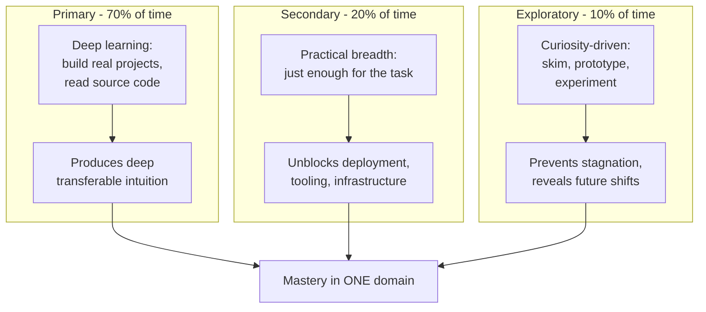
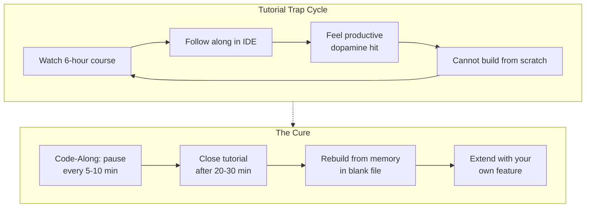

# Chapter 9: Framework & Language Learning

> **Prerequisites:** [Chapter 8: GATE & Theory Exam Prep](./ch-08-gate-theory-prep.md) � Strategies for mastering theory-heavy material.
> **Next:** [Chapter 10: Meta-Learning & Your Lifelong System](./ch-10-meta-learning-system.md) � Build a learning system that compounds knowledge.

Learning a new programming language or framework is a recurring challenge throughout your career. This chapter gives you a repeatable blueprint � five phases that apply to any technology, from Java to Laravel to DevOps tools. You'll learn the right priority order for each language in this repo, why you should never learn two frameworks at once, the Minimal Viable Project (MVP) pattern that accelerates any framework learning, how to read documentation like a pro, and how debugging and building in public cement your understanding forever.

## Learning Objectives

- Apply the universal learning blueprint (Docs ? Tutorial ? Build ? Refactor ? Teach) to any framework or language
- Learn Java with the right priority order using this repo's course structure
- Learn Python with the right priority order using this repo's course structure
- Learn DevOps fundamentals with the right priority order using this repo's course structure
- Learn Laravel efficiently with a repeatable learning sequence
- Use the Minimal Viable Project (MVP) pattern to accelerate any framework learning
- Read documentation effectively and know when to use tutorials instead
- Develop systematic debugging skills using StackOverflow and root-cause analysis
- Use "Building in Public" to compound your learning through contributions
- Learn React, Go, Rust, and TypeScript through dedicated learning blueprints
- Master Docker, Kubernetes, and cloud platform fundamentals
- Use AI coding assistants as effective learning tools
- Navigate the open-source contribution workflow
- Apply the T-model for learning multiple technologies in parallel
- Avoid the tutorial trap by learning through active construction, not passive consumption

<!-- Image Gallery -->
<section class="lesson-visuals" aria-label="Visual learning resources">
  <header><span>VISUAL LEARNING</span><h2>See it. Review it. Remember it.</h2></header>
  <a class="lesson-visual-card" href="../../../assets/images/lessons/learning-how-to-learn/ch-09-framework-language-learning/handwritten-notes.svg" target="_blank" rel="noopener">
    
    <span><strong>Handwritten notes</strong>Condensed notes for deliberate review.</span>
  </a>
  <a class="lesson-visual-card" href="../../../assets/images/lessons/learning-how-to-learn/ch-09-framework-language-learning/sticky-notes.svg" target="_blank" rel="noopener">
    
    <span><strong>Sticky-note revision</strong>Fast recall prompts for revision.</span>
  </a>
  <a class="lesson-visual-card" href="../../../assets/images/lessons/learning-how-to-learn/ch-09-framework-language-learning/visual-explanation.svg" target="_blank" rel="noopener">
    
    <span><strong>Visual concept guide</strong>A connected explanation of the key ideas.</span>
  </a>
</section>
<!-- End Image Gallery -->


---

### Chapter at a Glance


| Topic | Key Insight | Practical Takeaway |
|-------|-------------|-------------------|
| Universal Blueprint | Five phases: Docs ? Tutorial ? Build ? Refactor ? Teach | Follow the sequence for every new framework � never skip straight to building |
| MVP Pattern | Build a User/Post/Comment CRUD app to learn any framework | This standard project exposes real problems that tutorials hide |
| T-Model | 70-20-10 split: primary depth, secondary support, exploratory breadth | Learn one technology deeply before branching � never two new frameworks at once |
| Tutorial Trap | Passive consumption that feels productive but produces no durable skill | Close the tutorial and rebuild from memory � active construction beats watching |
| Debugging Protocol | Reproduce ? Isolate ? Search ? Understand root cause | Write the exact search query you used � the search IS the skill |
| Building in Public | Contributing to open source compounds your learning permanently | Find one unsolved problem, fix it, and open a PR � teaching verifies mastery |
| AI Tutor Usage | Use AI assistants as tutors (explanations + alternatives), not crutches | Ask "Why does this work?" and "What are the alternatives?" � never blind copy-paste |
| Docs vs Tutorials | Read docs for the why (mental model), tutorials for the how (setup, errors) | Spend 10% of time on docs, 90% on tutorials � don't read docs cover-to-cover |


**One-Sentence Takeaway:** Every successful framework learning follows the same sequence � read the philosophy, follow a tutorial, build a project, and read the source code.

---

### Q111: What is the universal framework learning blueprint?


**Answer:** Five phases: Docs ? Tutorial ? Build ? Refactor ? Teach.

**Phase 1 � Docs (2-3 days):** Read the official documentation's "Getting Started" and "Core Concepts" sections. Not the whole docs � just what you need to understand the mental model. From the Java course index (`java/index.md`), each chapter has Learning Objectives at the top � use those as a filter.

**Phase 2 � Tutorial (3-5 days):** Follow one complete tutorial end-to-end. Don't modify yet � just understand the flow. The Spring chapter (`57-interview-spring.md`) includes compilable examples that function as mini-tutorials for DI, MVC, data access.

**Phase 3 � Build (1-2 weeks):** Build the Minimal Viable Project (next question). This is where learning accelerates because you encounter real problems.

**Phase 4 � Refactor (1 week):** Go back and improve your MVP. Add error handling, tests, logging. The DevOps course (`devops/index.md`) shows how to add CI/CD at this stage.

```mermaid
flowchart LR
    P1[Docs 2-3 days] --> P1a[Official getting-started +<br/>core concepts only]
    P1a --> P2[Tutorial 3-5 days]
    P2 --> P2a[One complete tutorial<br/>end-to-end]
    P2a --> P3[Build 1-2 weeks]
    P3 --> P3a[Minimal Viable Project<br/>real problems emerge]
    P3a --> P4[Refactor 1 week]
    P4 --> P4a[Add error handling,<br/>tests, logging, CI/CD]
    P4a --> P5[Teach ongoing]
    P5 --> P5a[Write guide, give talk,<br/>solve real problem]
```



**Phase 5 � Teach (ongoing):** Write a short guide, give a brown-bag talk, or solve a real problem publicly. Teaching reveals gaps instantly.

The 27 courses in this repo follow this blueprint: each starts with learning objectives (Docs), progresses through examples (Tutorial), and ends with exercises (Build).

**One-Sentence Takeaway:** Learn Java from this repo by following the ch-01 to ch-10 progression — each chapter builds the next, from Hello World to concurrency.


---

### Q112: How do I learn Java from this repo?


**Path:** `java/index.md` ? Chapters P1-P6 (foundations) ? Chapters 1-6 (core Java) ? Chapter 57 (Spring interview) ? Chapter 60 (microservices).

The Java course (`java/index.md`) is organized into 13 parts with 66 chapters:

- **Part 0 (P1-P6):** Java foundations � syntax, OOP, collections, I/O, generics, lambdas
- **Part I (1-6):** JVM internals, concurrency, NIO, modules, functional deep, performance
- **Part III (9-14):** Spring Boot � DI, auto-config, Actuator, logging
- **Part IV (15-18):** Spring Web � REST APIs, validation, documentation, file handling
- **Part XIII (56-66):** Interview prep � Java, Spring, REST, databases, microservices, security, testing, patterns, system design

If you're new to Java:
1. Start with Part 0 (P1-P6) � one chapter per day for 6 days. Each has exercises at the end.
2. Move to Part I, Chapter 1 (JVM Architecture, `01-jvm-memory.md`) � understand how Java runs.
3. For placement, jump to chapters 56-57 after foundations. The Spring chapter (`57-interview-spring.md`) is 8670 lines with 50 Q&As � it covers DI, beans, AOP, security, caching, Actuator, and everything you need.

```java
// From Spring chapter Q1 � the first thing to learn:
@Service
class UserService {
    private final UserRepository userRepository;
    public UserService(UserRepository userRepository) {
        this.userRepository = userRepository;
    }
}
```

**One-Sentence Takeaway:** Python is best learned by doing � this repo gives you the roadmap; your job is to code every example and build every project.

---

### Q113: How do I learn Python from this repo?


**Path:** `python-programming/` ? `machine-learning/` ? `applied-ai/`.

The Python programming course covers fundamentals (variables, control flow, functions, OOP, data structures). After mastering those:

1. Read the machine-learning course � builds on Python with NumPy, Pandas, scikit-learn.
2. Move to applied-ai � practical ML applications, model deployment, MLOps basics.

For each Python topic, there's a parallel Java topic in the Java course. Map concepts to leverage existing knowledge:

```python
# Python � list comprehension
squares = [x**2 for x in range(10)]

# Java equivalent (Java 16+ Stream API)
List<Integer> squares = IntStream.range(0, 10)
    .map(x -> x * x)
    .boxed()
    .collect(Collectors.toList());
```

If you're interviewing for Python roles, the placement preparation chapter's DSA solutions (Q1-Q125) are primarily Java, but the logic is language-agnostic. Translate them to Python:

```python
# Python Two Sum
def two_sum(nums, target):
    seen = {}
    for i, num in enumerate(nums):
        complement = target - num
        if complement in seen:
            return [seen[complement], i]
        seen[num] = i
    return [-1, -1]
```

**One-Sentence Takeaway:** DevOps requires touching each tool yourself � set up a CI/CD pipeline for this repo to connect theory to practice.

---

### Q114: How do I learn DevOps from this repo?


**Path:** `devops/` ? `cloud-computing/` ? apply to deploy this repo.

The DevOps course (`devops/index.md`) has 18 chapters covering the full lifecycle:

1. **Chapters 1-3:** DevOps culture, Linux fundamentals, Git
2. **Chapters 4-6:** CI/CD, Docker, Kubernetes
3. **Chapters 7-9:** Terraform, Ansible, CD
4. **Chapters 10-13:** SRE, Monitoring, Logging, Observability
5. **Chapters 14-17:** DevSecOps, Database DevOps, Container Networking, SRE Principles
6. **Chapter 18:** Capstone project

Learning workflow for each chapter:
1. Read the learning objectives and theory.
2. Run the examples locally (e.g., set up Docker for chapter 5, write a basic Dockerfile).
3. Deploy something real � the simplest deploy for this repo is using GitHub Pages or Vercel.

```dockerfile
# From chapter 5 � basic Dockerfile for this repo (static site)
FROM nginx:alpine
COPY . /usr/share/nginx/html
EXPOSE 80
```

After Docker, learn Docker Compose (multi-container), then Kubernetes (chapter 6), then Terraform (chapter 7). Add CI/CD with GitHub Actions (chapter 4) to automate building and deploying this repo.

**One-Sentence Takeaway:** Laravel is best learned by building a real project � a blog with auth, payment, and APIs covers most concepts you need.

---

### Q115: How do I learn Laravel from this repo?


**Path:** The Laravel course (`laravel/index.md`) has 54 chapters across 10 parts.

Learning sequence for a new framework:
1. **Part 0 (P1-P6):** PHP, MySQL, HTML, CSS, JS, AI/ML foundations � skip if you know these.
2. **Part I (1-6):** Laravel fundamentals � routing, Eloquent ORM, Blade, auth, queues
3. **Build a CRUD app:** Users, Posts, Comments � the same three models for every framework.

Example Laravel CRUD route from the course:

```php
// routes/web.php
Route::resource('posts', PostController::class);

// app/Http/Controllers/PostController.php
class PostController extends Controller {
    public function index() {
        return view('posts.index', ['posts' => Post::latest()->paginate(10)]);
    }
    public function store(Request $request) {
        Post::create($request->validate([
            'title' => 'required|max:255',
            'body' => 'required',
        ]));
        return redirect()->route('posts.index');
    }
}
```

After CRUD, add authentication (chapter 5 � Breeze/Jetstream), then API endpoints (chapter 7), then queues (chapter 6). Each builds on the previous.

**One-Sentence Takeaway:** Learning two frameworks at once causes interference � master one before starting the next to avoid mixed mental models.

---

### Q116: Why shouldn't I learn two new frameworks at once?


**Answer:** Learning a new framework rewires your mental model of how applications work. Two simultaneous models cause interference � you'll confuse Laravel's service container with Spring's DI container, or Eloquent's active record with JPA's entity manager.

The 27 courses in this repo span Java, Python, PHP, JavaScript/TypeScript, and DevOps tools. If you're studying Java for placement and Laravel for a side project:

**Wrong approach:** "I'll do Java in the morning and Laravel in the evening."
- Morning: Spring DI � `@Autowired`, `@Bean`, `@Configuration`
- Evening: Laravel service container � `$app->bind()`, `$app->make()`
- Next morning: "Wait, does Laravel have `@Autowired`?" � mental interference.

**Right approach:** Phase them � master Java/Spring first (it's your interview target), then learn Laravel afterward. The transfer is actually faster once you deeply understand one framework: you recognize the patterns (DI, ORM, middleware, routing) in the new framework.

Evidence: After mastering the Spring chapter (57), learning Laravel's service container takes 2 days instead of 2 weeks because you already understand IoC, DI, and service providers conceptually.

**One-Sentence Takeaway:** Before any framework, build the app without it � a CRUD app in raw PHP teaches what the framework is actually solving.

---

### Q117: What is the Minimal Viable Project pattern for learning?


**Answer:** For any framework, build exactly one CRUD app first. The template is identical across all frameworks:

```
Models:   User, Post, Comment
Features: Create, Read (list + detail), Update, Delete
Extras:   Validation, Pagination, Auth (login/logout)
```


Spring Boot version (from chapters 9-14 of the Java course):

```java
@RestController
@RequestMapping("/api/posts")
public class PostController {
    private final PostRepository repository;

    PostController(PostRepository repository) { this.repository = repository; }

    @GetMapping
    List<Post> getAll() { return repository.findAll(); }

    @PostMapping
    Post create(@Valid @RequestBody Post post) { return repository.save(post); }

    @GetMapping("/{id}")
    Post getById(@PathVariable Long id) { return repository.findById(id)
        .orElseThrow(() -> new ResponseStatusException(HttpStatus.NOT_FOUND)); }
}
```

Laravel version (from the Laravel course):

```php
// routes/web.php
Route::resource('posts', PostController::class);

// Equal in ~15 lines with php artisan make:model Post -mcr
```

DevOps version (deploy it � from DevOps chapter 9):

```yaml
# .github/workflows/deploy.yml
name: Deploy
on: [push]
jobs:
  deploy:
    runs-on: ubuntu-latest
    steps:
      - uses: actions/checkout@v4
      - run: echo "Deploying CRUD app..."
```

Build this one project in the new framework. Skip everything else until the CRUD works end-to-end. Then add auth. Then add APIs. The CRUD is the foundation.

**One-Sentence Takeaway:** Documentation teaches concepts, tutorials teach sequences � use docs to understand architecture and tutorials for the first working app.

---

### Q118: How do I read documentation effectively vs tutorials?


**Answer:** Documentation tells you what's possible. Tutorials tell you one path. You need both � but extract different things from each.

From the Spring chapter (`57-interview-spring.md`), the pattern for reading Spring docs:

**What to extract from docs (10% skim):**
- Core mental model (e.g., Spring = container that manages beans with DI)
- Key annotations and their lifecycle (`@Component`, `@Service`, `@Repository`, `@Bean`)
- Configuration options (application.properties common keys)
- The "why" � why does this framework exist? (Spring: to simplify enterprise Java)

**What to extract from tutorials (90% focus):**
- Complete working setup � pom.xml, application class, one controller, one service
- The exact import statements and class paths
- Error messages and how to debug them
- The deployment workflow

Example: Spring DI from chapter 57 shows constructor injection with three concrete code examples. The doc says "use constructor injection for required dependencies." The tutorial shows the code pattern:

```java
@Service
class UserService {
    private final UserRepository userRepository;
    public UserService(UserRepository userRepository) { this.userRepository = userRepository; }
}
```

The doc tells you *why* (immutability, testability). The code tells you *how*. Read the doc to understand the philosophy; study the code to implement.

**One-Sentence Takeaway:** Use systematic debugging � reproduce the problem, isolate the variable, read the error message fully, and understand the root cause before applying a fix.

---

### Q119: How do I debug using StackOverflow and systematic methods?


**Answer:** Reproduce ? Isolate ? Search ? Understand root cause. Never paste code without understanding it.

From the repo's Java/Spring examples, a common error:

```java
// Error: NullPointerException in UserService
@Service
class UserService {
    @Autowired
    private UserRepository userRepository; // Might be null if Spring context not loaded

    public User findUser(Long id) {
        return userRepository.findById(id).orElse(null);
    }
}
```

Step-by-step debugging protocol:
1. **Reproduce:** Run the code, confirm the NPE. Get the exact stack trace line number.
2. **Isolate:** Is `userRepository` null? Add a breakpoint or `System.out.println(userRepository == null)`.
3. **Search:** Google "NullPointerException @Autowired Spring" ? StackOverflow. Most common cause: the class isn't managed by Spring (missing `@Service`, or instantiated with `new` instead of injected).
4. **Understand root cause:** Spring DI only works for beans in the Spring context. If you do `new UserService()`, no DI happens. Fix by injecting `UserService` into the class that uses it.

General search pattern: `[framework] [error type] [operation]`. Examples:
- "Spring Boot @Autowired null in constructor"
- "Laravel Eloquent N+1 query"
- "Docker container exit code 137"

Always look for the *accepted* answer with the most upvotes. Read the explanation, not just the code fix. Understanding the root cause prevents the same error � copying the fix only solves it once.

**One-Sentence Takeaway:** Building in public creates accountability, feedback, and documentation - your learning deepens because you have to explain it.

---

### Q120: How does "Building in Public" accelerate learning?


**Answer:** Building in public means sharing your work as you learn � open-source contributions, blog posts, or solving problems from this repo publicly.

The learning accelerator:
- **Motivation:** Public commits create accountability. The GitHub contribution graph is visible to everyone.
- **Networking:** People discover your work through PRs and issues. The company-specific chapter (`04-company-specific.md`) lists referral networks � open-source contributions are a path to referrals.
- **Deep understanding:** To explain something publicly, you need to understand it well. A StackOverflow answer or a PR comment forces clarity.

How to contribute to this repo:
1. Find a problem in the DSA bank (Q1-Q125) � attempt it yourself.
2. If your solution is better (cleaner code, better complexity, additional edge cases), open a PR.
3. The Spring chapter (`57-interview-spring.md`) has 50 Q&As � add one more with a new compilable example.
4. The SQL bank (`03-sql-problem-bank.md`) has 75 problems � propose new queries.

Contributing workflow: fork ? clone ? branch ? commit ? PR. Even fixing a typo in documentation is valid public building. The compound effect: each contribution deepens understanding of that topic permanently.

**One-Sentence Takeaway:** Understanding the error is more valuable than fixing it � if you copy-paste a solution, come back and retrace the steps until you understand why it worked.

---

### Q121: How do I learn React from this repo?


**Answer:** React learning blueprint follows the same five phases but with a critical mental model shift: **UI = f(state)**. Unlike traditional frameworks where you manually manipulate the DOM, React re-renders the entire UI when state changes.

**The Component Mental Model:** A React component is a function that receives props and returns a description of what should appear on screen. The framework figures out the minimum DOM changes needed. This declarative approach is the opposite of jQuery's imperative style � you describe *what* you want, not *how* to get there.

**JSX:** JavaScript XML � a syntax extension that looks like HTML but compiles to `React.createElement()` calls. Every JSX element is sugar for a function call:

```jsx
// JSX you write:
const element = <h1 className="greeting">Hello</h1>;

// What it compiles to:
const element = React.createElement('h1', { className: 'greeting' }, 'Hello');
```

**Props vs State:** Props flow down (parent passes data to child), state lives within a component and triggers re-renders when changed. Never mutate state directly � always use the setter function.

**Core Hooks � Your Mental Toolkit:**

- `useState(initialValue): [value, setter]` � local component state
- `useEffect(fn, deps[])` � side effects (fetching, subscriptions, timers)
- `useContext(MyContext)` � consume context without prop drilling
- `useReducer(reducer, initialState)` � complex state logic (like Redux but built-in)

**Counter Example � The "Hello World" of React:**

```jsx
import { useState } from 'react';

function Counter() {
    const [count, setCount] = useState(0);

    return (
        <div>
            <p>Count: {count}</p>
            <button onClick={() => setCount(count + 1)}>+</button>
            <button onClick={() => setCount(count - 1)}>-</button>
            <button onClick={() => setCount(0)}>Reset</button>
        </div>
    );
}
```

This example demonstrates the fundamental React principle: when `setCount` is called, the component re-renders with the new count value. You never wrote a single DOM manipulation line � React handles it.

**Custom Hook Example � Abstractions that Scale:**

```jsx
import { useState, useEffect } from 'react';

function useLocalStorage(key, initialValue) {
    const [storedValue, setStoredValue] = useState(() => {
        try {
            const item = window.localStorage.getItem(key);
            return item ? JSON.parse(item) : initialValue;
        } catch (error) {
            return initialValue;
        }
    });

    useEffect(() => {
        try {
            window.localStorage.setItem(key, JSON.stringify(storedValue));
        } catch (error) {
            console.error('Failed to save to localStorage:', error);
        }
    }, [key, storedValue]);

    return [storedValue, setStoredValue];
}

// Usage in any component:
function ThemeToggle() {
    const [theme, setTheme] = useLocalStorage('theme', 'light');
    return (
        <button onClick={() => setTheme(theme === 'light' ? 'dark' : 'light')}>
            Current: {theme}
        </button>
    );
}
```

**State Management:** Start with local `useState`. When prop drilling becomes painful, reach for `useContext`. For global state that changes frequently (user preferences, cart items), consider Zustand (lightweight, no boilerplate) over Redux (heavy, ceremony-heavy).

**Learning Path in This Repo:**
1. Read the JavaScript chapters in `web-development/` (JS fundamentals, ES6+).
2. The web development course covers component architecture as a concept.
3. Apply the universal blueprint: build a todo app (see Try This), then a CRUD app with a backend, then a full-stack project.

**Try This:** Build a todo app with React using only `useState`. Requirements: add items, toggle completion, filter (all/active/completed), and persist to localStorage with a custom hook. If you can build this from scratch without following a tutorial, you've grasped the component mental model.

> **Pro Tip:** The universal blueprint (tutorial ? modified clone ? scratch rebuild) is the same for every language. Spending 3 days struggling through the scratch rebuild is worth more than 3 weeks following tutorials. The struggle is where the mental model solidifies.

**One-Sentence Takeaway:** React is best learned through the mental model shift to components and state � the struggle with thinking in components is where real understanding forms.

---

### Q122: How do I learn Go/Golang effectively?


**Answer:** Go is a systems language designed for concurrency, simplicity, and fast compilation. Its learning curve is shallow *if* you accept its opinionated choices.

**The Goroutine Mental Model:** A goroutine is a lightweight thread managed by the Go runtime. You launch one by prefixing any function call with `go`. Channels connect goroutines � they are typed conduits that synchronize by default (sending blocks until someone receives). This is Hoare's Communicating Sequential Processes (CSP) made practical.

**Key Mental Models to Internalize:**

- **defer/panic/recover:** `defer` schedules a function call to run when the enclosing function exits � used for cleanup, closing files, unlocking mutexes. `panic()` stops normal execution (like an exception, but only for truly unrecoverable errors). `recover()` catches a panic � there are no try/catch blocks in Go.

- **Interfaces (Structural Typing):** A type implicitly satisfies an interface if it implements the required methods. No `implements` keyword � the compiler figures it out. This enables duck typing at compile time.

- **Error Handling (No Exceptions):** Go returns errors as values. You *must* check every error return. This is by design � it forces explicit error handling rather than letting exceptions bubble up invisibly.

**Concurrent Web Scraper � The Must-Build Example:**

```go
package main

import (
    "fmt"
    "net/http"
    "sync"
    "time"
)

func fetchURL(url string, wg *sync.WaitGroup, results chan<- string) {
    defer wg.Done()
    start := time.Now()
    resp, err := http.Get(url)
    if err != nil {
        results <- fmt.Sprintf("%s -> ERROR: %v", url, err)
        return
    }
    defer resp.Body.Close()
    elapsed := time.Since(start)
    results <- fmt.Sprintf("%s -> %d (%v)", url, resp.StatusCode, elapsed)
}

func main() {
    urls := []string{
        "https://golang.org",
        "https://pkg.go.dev",
        "https://github.com",
    }
    var wg sync.WaitGroup
    results := make(chan string, len(urls))

    for _, url := range urls {
        wg.Add(1)
        go fetchURL(url, &wg, results)
    }

    wg.Wait()
    close(results)

    for result := range results {
        fmt.Println(result)
    }
}
```

This example teaches four essential Go patterns: goroutines (`go fetchURL`), WaitGroup (synchronization), channels (typed communication), and defer (resource cleanup). The output shows each URL's status and elapsed time, demonstrating true parallelism.

**The Standard Library is Your Superpower:** Go's standard library includes an HTTP server, JSON encoding, templating, testing, cryptography, compression, and file I/O � no third-party packages needed for most tasks. The `net/http` package alone replaces Express.js/FastAPI for basic web services.

**Learning Path:**
1. Tour of Go (tour.golang.org) � the official interactive tutorial, 2-3 hours.
2. Build a CLI tool (Go excels here � single binary output).
3. Build a concurrent HTTP server (see Try This).
4. Study the standard library source � it's designed to be readable.

**Try This:** Build a simple HTTP server that serves a `/healthz` endpoint returning `{"status": "ok"}`, and a `/greet?name=Alice` endpoint returning `{"message": "Hello, Alice!"}`. Use only the standard library. Then add a mutex-protected in-memory counter that tracks total requests. This exercise forces you to learn `net/http`, `encoding/json`, `sync.Mutex`, and the `http.Request` type � the four pillars of Go web development.

> **Warning:** Don't skip the standard library phase of learning a new language. Beginners often reach for frameworks immediately (Gin for Go, Express for Node, Spring Boot for Java), bypassing the core language. Framework knowledge doesn't transfer between languages; standard library knowledge does. Build one project with only the stdlib first.

**One-Sentence Takeaway:** Go emphasizes simplicity and concurrency � build a CLI tool with only the standard library to internalize its philosophy before adding third-party dependencies.

---

### Q123: How do I learn Rust effectively?


**Answer:** Rust is the hardest language in this chapter because it forces you to rethink how memory works. The payoff: zero-cost abstractions with C++-level performance and memory safety guaranteed at compile time.

**The Ownership Mental Model (The Hardest Leap):**

Every value in Rust has exactly one owner. When the owner goes out of scope, the value is dropped. This is the single most important concept � nothing else makes sense until you internalize it.

- **Ownership rules:** (1) Each value has one owner. (2) There can be one mutable reference OR any number of immutable references, but not both simultaneously. (3) References must never outlive the data they point to.
- **Borrowing:** Passing a reference (`&T`) lets you read without taking ownership. A mutable reference (`&mut T`) lets you modify without owning.
- **Lifetimes:** The compiler's way of ensuring references are always valid. Written as `'a`, `'b`, etc. Most of the time, the compiler infers them � you only write them in function signatures with multiple references.

**Ownership Transfer Example � Watch the Move:**

```rust
fn main() {
    let s1 = String::from("hello");
    let len = calculate_length(s1);
    // println!("{}", s1); // COMPILE ERROR! s1 was MOVED
    println!("The length is: {}", len);
}

fn calculate_length(s: String) -> usize {
    s.len() // s goes out of scope here, memory is freed
}
```

When `s1` is passed to `calculate_length`, ownership *moves* to `s`. After the call, `s1` is invalid. To keep using `s1`, you either return ownership or pass a reference:

```rust
fn main() {
    let s1 = String::from("hello");
    let len = calculate_length(&s1); // Borrow, not move
    println!("'{}' has length {}", s1, len); // Works!
}

fn calculate_length(s: &String) -> usize {
    s.len() // s is a reference, no ownership taken
}
```

**Key Language Features:**

- **No null, no garbage collector:** Rust uses `Option<T>` for nullable values (`Some(T)` or `None`) and `Result<T, E>` for fallible operations (`Ok(T)` or `Err(E)`). You must handle both � the compiler won't compile code that ignores a potential `None` or `Err`.
- **Pattern matching:** `match` is Rust's switch statement on steroids. Combined with `Option` and `Result`, it forces exhaustive handling of all cases.
- **Traits:** Like Java interfaces but more powerful � they can define default implementations, associated types, and even implementations on existing types (extension traits).
- **Cargo:** Build system, package manager, test runner, documentation generator, and benchmarking tool � all in one binary. `cargo new`, `cargo build`, `cargo test`, `cargo doc`, `cargo clippy`.

**Learning Path:**

1. Read "The Book" (doc.rust-lang.org/book) chapters 1-6 and 10 (ownership, structs, enums, generics, traits, lifetimes).
2. Use Rustlings (github.com/rust-lang/rustlings) � 100+ small exercises that teach each concept interactively.
3. Build a CLI tool with `clap` crate � Rust's sweet spot.
4. Study the standard library's `Option` and `Result` � understanding these is 50% of Rust proficiency.

**Try This:** Write a function that takes a vector of integers and returns the sum, average, and median in a struct using only standard library features (no `stats` crate). Make it handle the empty-vector case safely (no panics). This exercises ownership (passing a `Vec<i32>`), pattern matching, and the `Option` type when computing median on an empty slice. Once it compiles, it's memory-safe and data-race-free � Rust guarantees it at compile time.

**One-Sentence Takeaway:** Go emphasizes simplicity and concurrency - build a CLI tool with only the standard library to internalize its philosophy before adding third-party dependencies.

---

### Q124: How do I learn TypeScript effectively?


**Answer:** TypeScript is JavaScript with a type system � but that type system is fundamentally different from Java's. Learning TypeScript is less about memorizing syntax and more about understanding *structural typing*.

**The Structural Type System (Nominal vs Structural):**

Java checks types by name: `class Dog implements Animal` establishes a named relationship. TypeScript checks types by shape: if an object has all the properties Animal requires, it *is* an Animal � regardless of any explicit declaration.

```typescript
interface Point {
    x: number;
    y: number;
}

function logPoint(p: Point): void {
    console.log(`${p.x}, ${p.y}`);
}

// No "implements" keyword needed:
const point = { x: 12, y: 26 };
logPoint(point); // Works � shape matches
```

This structural typing is the single biggest mental shift for Java developers. It enables duck typing with static safety.

**Generics � Same Concept, Different Syntax:**

```typescript
// Generic identity function
function identity<T>(arg: T): T {
    return arg;
}

// Generic constraint � like Java's bounded type parameters
function getProperty<T, K extends keyof T>(obj: T, key: K): T[K] {
    return obj[key];
}

const user = { name: 'Alice', age: 30 };
getProperty(user, 'name'); // string
// getProperty(user, 'email'); // COMPILE ERROR � 'email' not in keyof user
```

**Union and Intersection Types � Something Java Cannot Do:**

```typescript
// Union type: value can be string OR number
type ID = string | number;
function lookup(id: ID): User | undefined { /* ... */ }

// Intersection type: object must satisfy both
type AdminWithPermissions = Admin & { permissions: string[] };

// Type narrowing � TypeScript refines types based on checks:
function process(value: string | string[]): void {
    if (Array.isArray(value)) {
        // Here, TypeScript KNOWS value is string[]
        value.map(s => s.toUpperCase());
    } else {
        // Here, TypeScript KNOWS value is string
        console.log(value.toUpperCase());
    }
}
```

**Mapped Types � Transform Existing Types:**

```typescript
type Readonly<T> = {
    readonly [K in keyof T]: T[K];
};

type Optional<T> = {
    [K in keyof T]?: T[K];
};

// Mark all properties as readonly
interface User { name: string; age: number; }
type ReadonlyUser = Readonly<User>;
// { readonly name: string; readonly age: number; }
```

**The `satisfies` Keyword (TypeScript 4.9+):**

Type-checks an expression without changing its inferred type:

```typescript
type Color = 'red' | 'green' | 'blue';
type Palette = Record<Color, string>;

const palette = {
    red: '#ff0000',
    green: '#00ff00',
    blue: '#0000ff',
    black: '#000000', // Error: 'black' is not in Color
} satisfies Palette;
```

**Cross-Reference to Java Generics:** Java's `List<? extends Number>` becomes TypeScript's `Array<number extends T>` � but TypeScript's structural typing makes generics more flexible and less verbose. Java wildcards (`? extends`, `? super`) exist because of nominal typing; TypeScript doesn't need them because shape matching handles variance naturally.

**Learning Path:**
1. Complete the TypeScript Handbook chapters on Types, Interfaces, Generics, and Unions.
2. Convert an existing JavaScript project to TypeScript file by file � the error messages teach you the type system.
3. Study utility types (`Partial`, `Pick`, `Omit`, `Record`) � understanding these replaces writing custom types from scratch.

**Try This:** Write a generic `createApiResponse<T>` function that takes data and a success boolean, returns `{ data: T, success: true }` on success and `{ error: string, success: false }` on failure using a discriminated union. Then write a type guard that narrows the result. This exercises generics, union types, and type narrowing � the three pillars of practical TypeScript.

**One-Sentence Takeaway:** TypeScript adds a type layer to JavaScript - learn the type system, strict mode, and generics before diving into framework-specific types.

---

### Q125: How do I learn Docker and Kubernetes effectively?


**Answer:** Learn Docker *first*, thoroughly, before touching Kubernetes. Trying to learn K8s without Docker fluency is like learning Spring before Java � the abstractions won't make sense.

**Phase 1: Docker (2-3 weeks)**

The mental model: a container is a running process with its own isolated filesystem. An image is the blueprint � a read-only template that layers filesystem changes.

**Core Concepts to Master:**
- **Images:** Read-only templates built from Dockerfiles. Layers cache for speed.
- **Containers:** Running instances of images. Stateless by default � data disappears when the container stops.
- **Volumes:** Persistent storage that survives container restarts and removal.
- **Networks:** Containers communicate over isolated virtual networks (bridge, host, overlay).
- **Docker Compose:** Define multi-container applications in YAML. One command to start your entire stack.

**Multi-Stage Dockerfile � The Professional Pattern:**

```dockerfile
# Stage 1: Build
FROM golang:1.22 AS builder
WORKDIR /app
COPY go.mod go.sum ./
RUN go mod download
COPY . .
RUN CGO_ENABLED=0 GOOS=linux go build -o /app/server ./cmd/server

# Stage 2: Production image � contains ONLY the binary
FROM alpine:3.19
RUN apk --no-cache add ca-certificates tzdata
WORKDIR /app
COPY --from=builder /app/server .
EXPOSE 8080
CMD ["./server"]
```

The final image contains only the compiled binary � no Go compiler, no source code, no build tools. The image size drops from ~800MB (single-stage) to ~15MB.

**Phase 2: Kubernetes (4-6 weeks)**

The mental model: K8s is a distributed operating system for containers. You declare the *desired state*, and the control loop continuously reconciles actual state toward it. This is called the *reconciliation loop* (or the M:N scheduling problem � M nodes, N pods, the scheduler finds the optimal placement).

**Core Resources (in Learning Order):**
- **Pod:** The smallest deployable unit � one or more containers that share a network namespace.
- **Deployment:** Declares desired number of pod replicas. Handles rolling updates and rollbacks.
- **Service:** Stable network endpoint (ClusterIP, NodePort, LoadBalancer) that load-balances across pods.
- **ConfigMap:** Inject configuration as environment variables or files.
- **Ingress:** HTTP/HTTPS routing � domain-based and path-based routing to services.

**Basic Deployment Manifest:**

```yaml
apiVersion: apps/v1
kind: Deployment
metadata:
  name: api-server
  labels:
    app: api-server
spec:
  replicas: 3
  selector:
    matchLabels:
      app: api-server
  template:
    metadata:
      labels:
        app: api-server
    spec:
      containers:
        - name: server
          image: myregistry/api-server:v1.2
          ports:
            - containerPort: 8080
          env:
            - name: DB_URL
              valueFrom:
                configMapKeyRef:
                  name: app-config
                  key: db_url
          resources:
            requests:
              memory: "128Mi"
              cpu: "250m"
            limits:
              memory: "512Mi"
              cpu: "500m"
          livenessProbe:
            httpGet:
              path: /healthz
              port: 8080
            initialDelaySeconds: 5
            periodSeconds: 10
```

This single manifest declares: run 3 replicas, use this image, inject config, set resource limits, and check health every 10 seconds. K8s handles the rest � scheduling, load balancing, self-healing, and rolling updates.

**Try This:** Dockerize a simple Go HTTP server (from Q122's Try This) with a multi-stage Dockerfile. Build the image, run it locally, verify it works on `localhost:8080`. Then create a `docker-compose.yml` that adds a PostgreSQL service and passes the DB URL to your app. Finally, write a Kubernetes deployment and service manifest for the same app. The progression (Docker ? Compose ? K8s) mirrors how the industry deploys software at scale.

**One-Sentence Takeaway:** Start Docker locally with a simple app, then add Compose for multi-service setups � the progression from local container to orchestrated deployment mirrors industry practice.

---

### Q126: How do I learn databases (SQL + NoSQL) systematically?


**Answer:** Start with SQL � relational databases are the foundation of 90% of production systems. Only after SQL fluency should you explore NoSQL categories, each solving a specific problem that relational databases handle poorly.

**Phase 1: SQL Fundamentals (3-4 weeks)**

Your learning sequence, mapped to this repo's SQL chapter (`04-sql-interview.md`):

1. **SELECT and Filtering:** `WHERE`, `AND/OR`, `IN`, `BETWEEN`, `LIKE` � the query basics.
2. **JOINs:** `INNER JOIN` (intersection), `LEFT JOIN` (all from left, matched from right), `SELF JOIN` (a table joined to itself). The interview chapter has 75 problems � attempt the first 20 on joins alone.
3. **GROUP BY and Aggregation:** `COUNT`, `SUM`, `AVG`, `MIN`, `MAX` with `HAVING` (filtering groups, not rows).
4. **Subqueries and CTEs:** `WITH` (Common Table Expressions) for readable, composable queries. CTEs are the SQL equivalent of refactoring a complex function into smaller named pieces.
5. **Window Functions:** `ROW_NUMBER()`, `RANK()`, `LAG()`, `LEAD()` � advanced analytics without self-joins.

**Normalization (The Design Discipline):**

Learn the three normal forms *before* designing any schema:
- **1NF:** Each column contains atomic values (no arrays or JSON in a single cell).
- **2NF:** Every non-key column depends on the entire primary key (composite key problem).
- **3NF:** Every non-key column depends *directly* on the primary key (no transitive dependencies).

You'll break these rules sometimes (denormalization for read performance), but you must know the rules first.

**Indexing Strategy � The Performance Lever:**

```sql
-- B-tree index (default) � good for equality and range queries
CREATE INDEX idx_orders_customer_id ON orders(customer_id);

-- Composite index � column order matters: put high-selectivity columns first
CREATE INDEX idx_orders_customer_date ON orders(customer_id, order_date);

-- Partial index � only index relevant rows (PostgreSQL)
CREATE INDEX idx_active_orders ON orders(status) WHERE status = 'active';
```

A missing index makes a query 1000x slower. An extra index slows writes by ~10%. Trade-off: index columns used in `WHERE`, `JOIN`, and `ORDER BY`. Index every foreign key.

**Phase 2: NoSQL Categories (2-3 weeks per category)**

- **Document Stores (MongoDB):** JSON-like documents with flexible schemas. Best for: content management, catalogs, event logging. The DBMS course (`dbms/index.md`) has a MongoDB chapter.
- **Key-Value (Redis):** In-memory with optional persistence. Best for: caching, session storage, real-time counters, rate limiting. The Spring chapter (`57-interview-spring.md`) shows Redis caching via `@Cacheable`.
- **Wide-Column (Cassandra):** Designed for write-heavy workloads across many nodes. Best for: time-series data, IoT sensor readings, recommendation engines.
- **Graph (Neo4j):** Nodes and relationships as first-class citizens. Best for: social networks, fraud detection, recommendation systems, knowledge graphs.

**The Polyglot Persistence Rule:** Use the database that matches your access pattern. You might have PostgreSQL (user accounts) + Redis (session cache) + MongoDB (product catalog) + Elasticsearch (full-text search) in the same application. Each solves a different problem optimally.

**Learning Path in This Repo:**
1. Complete the SQL interview chapter (`04-sql-interview.md`) � 75 problems from basic to advanced.
2. Read the DBMS course (`dbms/index.md`) for database internals (transactions, indexing algorithms, query planning).
3. For Java developers: the Spring data chapter covers JPA, Hibernate, and `@Query` annotations for custom SQL.

**Try This:** Design a schema for a library management system (books, members, loans). Normalize to 3NF. Write queries to: (a) find all overdue books joined with member names, (b) find the top 5 most borrowed books using GROUP BY, and (c) rank members by borrowing count using a window function. Then identify the columns that need indexes. This single exercise covers normalization, joins, aggregation, window functions, and indexing � the complete SQL core.


**One-Sentence Takeaway:** Learn SQL first (joins, aggregations, indexing), then understand NoSQL trade-offs (eventual consistency, denormalization) - the SQL foundation transfers everywhere.
---

### Q127: How do I use AI coding assistants as learning tools (not crutches)?


**Answer:** AI coding assistants (Copilot, ChatGPT, Cursor, Claude) are the most powerful learning tools since StackOverflow � but they accelerate *bad* habits just as fast as good ones. The difference is *how* you prompt them.

**Using AI as a Tutor (Good):**

Ask for explanations, not code:

> "Explain how Java's `ConcurrentHashMap` segments work internally. Include the locking strategy and how it differs from `Collections.synchronizedMap()`."

This forces you to understand the concept. Now ask the follow-up:

> "Show me a code example where using `ConcurrentHashMap` would cause a performance problem that a regular `HashMap` wouldn't."

Now you're learning edge cases. Synthesize the explanation and the counterexample into a mental model.

**Request Alternative Approaches:**

> "Show me three ways to implement this Spring `@Scheduled` task. Compare cron expression, fixedDelay, and fixedRate. When would each fail?"

The AI generates a comparison table. You learn not just one approach but the *trade-offs* between approaches � this is the difference between tutorial-level knowledge and production-level judgment.

**Compare Patterns Across Languages (Leverage This Repo's Multi-Language Structure):**

> "Compare Java `Stream.collect(Collectors.toList())` with Python's list comprehension and Rust's `collect::<Vec<_>>()`. What pattern do they share? What's different about their memory behavior?"

This maps concepts across the 27 courses in this repo, building a transferable mental model of functional transformation irrespective of language.

**The Socratic Follow-Up:**

After getting an answer, ask: "What would change if..." � changing parameters forces you to think causally:

- "What would change if I used `ArrayList` instead of `LinkedList`?"
- "What would change if this database had 10 million rows instead of 10,000?"
- "What would change if I deployed this on Kubernetes with 3 replicas instead of 1?"

**Using AI as a Writer (Bad � The Crutch Pattern):**

> "Write a complete Spring Boot application with JWT auth, user registration, and role-based access control."

Then copy-paste without reading. The code compiles. You learned nothing. Next week, when asked in an interview how JWT works, you can't explain it because you never thought about it.

**Anti-Pattern Checklist:**

| Anti-Pattern | Symptom | Fix |
|---|---|---|
| Blind copy-paste | Can't explain the code 10 minutes later | Ask for explanation, then rewrite from memory |
| Accepting first answer | One approach, no context of alternatives | Ask for 2-3 alternatives with trade-offs |
| No follow-up questions | Shallow understanding | Ask "what would change if..." until you hit a knowledge gap |
| Never debugging AI code | Fragile system you can't maintain | Deliberately introduce a bug and debug it yourself |

**Try This:** Pick a problem from the DSA bank (Q1-Q125) that you *cannot* solve. Ask an AI assistant to explain the approach *without* writing code. Spend 15 minutes with the explanation. Then close the chat and implement it yourself. Only if you get stuck for 10+ minutes should you peek. This exercise trains you to use AI for conceptual understanding while retaining the implementation struggle that builds genuine skill.

**One-Sentence Takeaway:** AI coding assistants accelerate learning when you always ask why � they are pair programmers, not answer keys; the struggle of manual implementation builds genuine skill.

---

### Q128: How do I learn cloud platforms (AWS, GCP, Azure)?


**Answer:** Cloud platforms are vast � each has 200+ services. The trap is learning services in alphabetical order (EC2, ECS, EKS, ElastiCache, ...) without understanding the *categories* and the *shared responsibility model*.

**The Shared Responsibility Model (Learn This First):**

| Layer | Customer manages | Provider manages |
|---|---|---|
| SaaS (Gmail, Salesforce) | Data, users, configuration | Everything else |
| PaaS (Heroku, App Engine, Elastic Beanstalk) | Application code, data | Runtime, OS, hardware |
| IaaS (EC2, GCE, Azure VMs) | Application, OS, security patches | Virtualization, hardware |
| FaaS (Lambda, Cloud Functions) | Function code only | Everything else |

This model determines your learning priority: if you're deploying a web app, focus on PaaS/FaaS first (fastest path to deployment). If you're a DevOps engineer, start with IaaS and networking.

**Core Services � Learn in This Order:**

1. **Compute:**
   - AWS: EC2 (IaaS), Elastic Beanstalk (PaaS), Lambda (FaaS), ECS/EKS (containers)
   - GCP: Compute Engine, App Engine, Cloud Functions, GKE
   - Azure: VMs, App Service, Functions, AKS
   - *Build first:* Deploy a simple web app on the cheapest PaaS option (Beanstalk/App Engine/App Service). Then containerize it and deploy on a managed Kubernetes service.

2. **Storage:**
   - AWS: S3 (object storage � the most important AWS service), EBS (block storage), EFS (file storage)
   - GCP: Cloud Storage, Persistent Disk, Filestore
   - Azure: Blob Storage, Managed Disks, Files
   - *Build first:* Host a static website on S3/Cloud Storage/Blob behind a CDN (CloudFront/Cloud CDN/Azure CDN).

3. **Networking:**
   - VPC/Virtual Network/Cloud VPC � your isolated network in the cloud
   - Subnets, routing tables, security groups (stateful firewalls at instance level), NACLs (stateless at subnet level)
   - *Build first:* Create a VPC with public and private subnets. Deploy a web server in the public subnet and a database in the private subnet. Connect them.

4. **Databases:**
   - Managed SQL (RDS/Cloud SQL/Azure SQL) � skip self-managed DB on VMs unless required
   - Managed NoSQL (DynamoDB/Firestore/Cosmos DB)
   - In-memory cache (ElastiCache/Memorystore/Redis Cache)

**Serverless (Second Phase):**

After core services, learn serverless: AWS Lambda + API Gateway + DynamoDB (the "serverless triad"). This teaches event-driven architecture, cold starts, and pay-per-execution billing � a fundamentally different mental model from always-on servers.

**Managed AI Services (Third Phase):**

Each cloud has pre-built AI services that require zero ML expertise: AWS Rekognition (image analysis), Comprehend (NLP), Polly (text-to-speech), Translate; GCP Vision AI, Natural Language, Translation AI; Azure Cognitive Services. These are the fastest path to building AI features into your applications.

**Infrastructure as Code � Always Provision Programmatically:**

```hcl
# Terraform example � deploy an S3 bucket and EC2 instance
provider "aws" {
  region = "us-east-1"
}

resource "aws_s3_bucket" "static_assets" {
  bucket = "my-app-assets-${random_id.suffix.hex}"
  acl    = "public-read"

  website {
    index_document = "index.html"
  }
}

resource "random_id" "suffix" {
  byte_length = 4
}

resource "aws_instance" "web_server" {
  ami           = "ami-0c55b159cbfafe1f0" # Ubuntu 22.04 LTS
  instance_type = "t2.micro"

  user_data = <<-EOF
    #!/bin/bash
    apt-get update
    apt-get install -y nginx
    systemctl start nginx
  EOF

  tags = {
    Name = "web-server"
  }
}
```

Never click through the web console for infrastructure setup � it's not reproducible, auditable, or recoverable. Terraform/Terraform CDK/Pulumi/SST all enforce infrastructure-as-code discipline.

**Learning Path in This Repo:**
1. DevOps course (`devops/index.md`) � CI/CD, Docker, K8s
2. Cloud computing course (`cloud-computing/index.md`) � focused on cloud services
3. Apply: Deploy an application from any course (Java, Python, Laravel) to your chosen cloud.

**Try This:** Deploy a containerized application (from Q125's Try This) to a cloud platform. Use AWS EC2 with Docker (cheapest), or Google Cloud Run (simplest), or Azure Container Instances. Then add a managed database. Then set up a CI/CD pipeline with GitHub Actions that rebuilds and redeploys on every push. If you can do this without looking up each step, you've mastered cloud deployment fundamentals.

**One-Sentence Takeaway:** Learn one cloud platform deeply (AWS) before comparing others - deploying a full-stack app with networking, databases, and scaling covers the fundamentals.

---

### Q129: How do I learn through open-source contributions?


**Answer:** Open-source contribution is the fastest way to learn production code, code review culture, and collaborative development � but the learning accelerates only if you follow a structured workflow instead of randomly submitting pull requests.

**Step 1: Find the Right Project**

Look for projects tagged `good-first-issue` or `help-wanted`. On GitHub, use the search:

```
label:good-first-issue language:java
label:help-wanted language:python
```

This repo itself is an open-source learning resource � fixing typos, adding missing test cases, or improving existing Q&A explanations in any of the 27 courses counts as a valid contribution.

**Step 2: Read Before You Code**

Every mature project has:
- `CONTRIBUTING.md` � how to set up, coding style, PR workflow
- `CODE_OF_CONDUCT.md` � community expectations
- Issue templates � the expected format for bug reports and feature requests
- Existing PRs � learn what code style the maintainers prefer

Spend 30 minutes reading before writing any code. This is the open-source equivalent of reading documentation before starting a tutorial.

**Step 3: Set Up Locally (The Most Educational Step)**

Clone, install dependencies, run tests. If tests fail on your machine, you've found your first contribution � the documentation for setup is incomplete. Submit a fix to the setup guide. This is the most common and valued first contribution type.

```bash
git clone https://github.com/username/project.git
cd project
# Follow CONTRIBUTING.md setup instructions
make install   # or npm install, or cargo build, or ./gradlew build
make test      # verify everything passes
```

**Step 4: Make Small, Focused PRs First**

Your first PR should be small � a documentation fix, a test for an uncovered edge case, or a bug fix with a clear reproduction. Large feature PRs on the first attempt often get rejected because you haven't yet internalized the project's design philosophy.

```java
// Example first PR: adding a missing edge case test
@Test
void testFindUser_ReturnsNull_WhenNotFound() {
    UserService service = new UserService(new InMemoryUserRepository());
    assertNull(service.findUser(999L));
}
```

**Step 5: Communicate on Issues**

Before coding, comment on an issue: "I'd like to work on this. My approach would be [X]. Does that sound right?" This:
- Prevents duplicate work
- Gets early feedback on your approach
- Shows maintainers you're thoughtful, not just spamming PRs

**Step 6: Build Reputation Gradually**

Each merged PR builds your GitHub profile. Maintainers recognize returning contributors and give them more complex tasks. After 3-5 merged PRs, you're trusted with architectural changes. The reputation is transferable � employers check your GitHub profile.

**Cross-Reference to This Repo:**

The Spring chapter (`57-interview-spring.md`) is 7297 lines with 50 Q&As. Each Q&A has a compilable Java example. Contribution ideas:
- Add a Q&A on a Spring topic not covered (Spring Cloud Stream? RSocket?)
- Improve existing examples to use newer Spring Boot 3.x features
- Add missing `@Test` annotations or assertions to code examples
- Translate error-prone concepts into clearer explanations

**Try This:** Using this repo, find a file that has a typo, an outdated code example, or a missing edge case. Fork this repo, fix it locally, and submit a PR. The task is deliberately trivial � the goal is to practice the workflow (fork ? clone ? branch ? commit ? push ? PR) with zero stakes. Once you've done it once, the mental barrier for future contributions drops significantly.

**One-Sentence Takeaway:** Start open-source by reading the contributor guide, fixing a typo, then a documentation bug � each PR lowers the barrier for the next contribution.

---

### Q130: How do I learn multiple new technologies in parallel without getting overwhelmed?


**Answer:** The T-model: go deep on ONE primary technology (the vertical bar of the T) while learning breadth across others (the horizontal bar). The problem isn't learning multiple things � it's trying to go deep on multiple things simultaneously.

**The 70-20-10 Rule for Time Allocation:**

| Category | Time | Strategy | Example (Spring-focused learner) |
|---|---|---|---|
| Primary (T vertical) | 70% | Deep learning � build production projects, read source code, write about it | Master Spring Boot: build 3 real apps, read Spring source | 
| Secondary (T horizontal) | 20% | Practical breadth � learn just enough to complete a specific task | Learn Docker to containerize your Spring app, K8s basics to deploy it |
| Exploratory | 10% | Curiosity-driven � skim docs, try tutorials, build small prototypes | Try Rust, glance at Go concurrency, read about AWS Lambda |

**Why This Works:**

- **70% depth builds transferable intuition.** Deeply understanding Spring DI makes learning Laravel's service container trivial (both are IoC containers). Deeply understanding Go's goroutines and channels makes understanding Java's virtual threads (Project Loom) a matter of syntax, not concept.
- **20% breadth prevents bottlenecks.** Every technology needs infrastructure, tooling, and deployment knowledge around it. You don't need to be a Docker expert � you need enough to containerize your app.
- **10% exploration prevents stagnation.** Curiosity-driven learning keeps you motivated and may reveal a technology worth moving to the 20% or 70% bucket.

**Personal Curriculum Example (12-Week Plan for a Java Developer Learning DevOps + Cloud):**

| Week | 70% (Primary) | 20% (Secondary) | 10% (Exploratory) |
|---|---|---|---|
| 1-2 | Spring Boot CRUD (chapters 9-14) | Docker basics (images, containers, Dockerfile) | Read Go tour (tour.golang.org) |
| 3-4 | Spring Security + JWT | Docker Compose (app + DB), GitHub Actions CI | Try Rustlings (first 20 exercises) |
| 5-6 | Spring Data JPA + PostgreSQL | Kubernetes: pods, deployments, services | AWS Lambda "Hello World" |
| 7-8 | Spring Actuator + monitoring | Terraform: EC2 + S3 | Read Python ML chapter |
| 9-10 | Spring Cloud Config + Gateway | Terraform + K8s (EKS/GKE) | Gen AI: prompt engineering |
| 11-12 | Microservices with Spring Boot | Full CI/CD (build, test, deploy pipeline) | Build a CLI tool in Rust |

The primary track produces a production-ready Spring application. The secondary track builds the infrastructure to deploy it. The exploratory track satisfies curiosity without derailing focus.

**Warning Signs of Overload:**
- You can't answer "what did I learn yesterday" without checking notes
- You're bouncing between 3+ tutorials in one day
- You feel guilty about *not* studying the other technologies on your list

**Cure:** Drop everything except the 70% track for one week. The secondary and exploratory tracks will still be there when you return.




**Try This:** Right now, list every technology you're trying to learn. Pick ONE as your 70% (the one that matters most for your next career milestone). For each remaining technology, declare it either "20% (need it to deploy)" or "10% (curiosity)". Then create a weekly schedule allocatig 70% of your study time to the primary, 20% to the secondary, and 10% to the exploratory. Follow it for two weeks and audit your progress. The constraint (only 20% for secondary) forces ruthless prioritization.

**One-Sentence Takeaway:** Learn multiple technologies by designating one primary (60%) and one secondary (20%) � the remaining 20% for exploration prevents overload without losing focus.

---

### Q131: How do I transition between programming paradigms (OOP ? Functional)?


**Answer:** Start with OOP (which you likely already know from Java/Python/PHP), then progressively incorporate functional concepts without fully abandoning OOP. Most modern code is a hybrid � the question is where to draw the line.

**Phase 1: Understand the Core Difference**

| Concept | OOP | Functional |
|---|---|---|
| State | Mutable objects with encapsulated state | Immutable data passed through functions |
| Composition | Object hierarchies (inheritance) | Function composition (pipeline) |
| Control flow | Loops, conditionals, polymorphism | Recursion, pattern matching, higher-order functions |
| Side effects | Methods freely mutate object state | Pure functions with controlled side effects (monads, effects) |
| Concurrency | Locks, synchronized, volatile | Immutable data (safe to share), actor model |

**Phase 2: Incorporate Immutability First**

The highest-ROI functional practice is immutability. Start here:

```java
// OOP style � mutable
public class Order {
    private List<Item> items = new ArrayList<>();
    public void addItem(Item item) { items.add(item); }
}

// Functional-adjacent � return new instances instead of mutating
public record Order(List<Item> items) {
    public Order addItem(Item item) {
        List<Item> newItems = new ArrayList<>(items);
        newItems.add(item);
        return new Order(Collections.unmodifiableList(newItems));
    }
}
```

**Phase 3: Learn Pure Functions and Higher-Order Functions**

A pure function: same inputs always produce same output, no side effects. A higher-order function: takes a function as an argument or returns one.

```java
// Imperative OOP � loop with mutable accumulator
double totalImperative(List<Order> orders) {
    double sum = 0;
    for (Order o : orders) {
        for (Item i : o.items()) {
            sum += i.price() * i.quantity();
        }
    }
    return sum;
}

// Functional � declarative pipeline, no mutation
double totalFunctional(List<Order> orders) {
    return orders.stream()
        .flatMap(order -> order.items().stream())
        .mapToDouble(item -> item.price() * item.quantity())
        .sum();
}
```

The functional version is shorter, more readable, and inherently safe for parallel execution (add `.parallel()` to use multiple threads) because there's no mutable state.

**Phase 4: Monads as Design Patterns (Not Magic)**

A monad is a wrapper around a value that defines how to apply functions to it. In practice: `Optional<T>` (maybe a value or absent), `Result<T, E>` (success or error), `Stream<T>` (zero or many values, lazily computed).

```java
// Without monads � nested null checks
String getCityName(User user) {
    if (user != null) {
        Address addr = user.getAddress();
        if (addr != null) {
            return addr.getCity();
        }
    }
    return "Unknown";
}

// With Optional monad � chained operations, no null checks
String getCityName(User user) {
    return Optional.ofNullable(user)
        .map(User::getAddress)
        .map(Address::getCity)
        .orElse("Unknown");
}
```

**Phase 5: Recognize When Functional Is Worse**

Functional purity isn't always the goal. Some cases where OOP is superior:

- **Complex state transitions:** A UI component with 15 interacting state fields is clearer with mutable state and explicit mutations than a chain of immutable transformations.
- **Performance-critical code:** Immutable allocations create garbage collector pressure. A mutable loop can be 10x faster for tight numerical operations.
- **CRUD applications:** The dominant pattern is mutate-then-persist. Pure functions add ceremony without benefit.

**Rust's Hybrid Model (Learning Example):**

Rust isn't purely functional, but it borrows heavily: `Option` and `Result` monads, `map`/`and_then`/`or_else` combinators, immutability by default with `mut` opt-in. It's a model of a pragmatic hybrid paradigm � use `Result<T, E>` for error handling (functional style) and mutable `Vec` for efficient data processing (imperative style).

**Try This:** Take an OOP Java class you've written (any class from the Java course exercises) that mutates state. Refactor it to: (1) use `record` classes instead of mutable POJOs, (2) replace loops with `Stream` operations, (3) replace null checks with `Optional`, and (4) replace try-catch for checked exceptions with `Result` type (use a library or write your own sealed class `Result<T, E>`). Count how many lines the imperative vs functional versions are � and note which version you'd rather debug at 3 AM.

**One-Sentence Takeaway:** Transition between paradigms by solving the same problem in both - write a to-do app in OOP, then in functional style, and feel the difference in debugging.

---

### Q132: How to handle the "tutorial trap" � watching videos without coding?


**Answer:** The tutorial trap is the most common reason self-taught developers fail to reach job readiness. You watch a 6-hour course, follow along in your IDE, and feel productive � but a week later you can't build anything from scratch because you never encoded the patterns into procedural memory.

**What the Tutorial Trap Actually Is:**

It's not "tutorials are bad." Good tutorials are essential. The trap is *passive consumption disguised as active learning*. The psychological hook is powerful: each completed video gives a dopamine hit of progress without the frustration of staring at a blank editor. You mistake *recognizing* the solution (when the instructor shows it) for the ability to *produce* the solution yourself.

**The Four Psychological Hooks:**

1. **Illusion of competence:** Following along feels like building. You're typing what you're told � that's transcription, not programming.
2. **Fear of the blank page:** It's easier to start another tutorial than to face your own project with no hand-holding.
3. **Comfort of structure:** Tutorials tell you exactly what to do next. Real projects don't � and that ambiguity is where real learning happens.
4. **Stacking without absorbing:** "I'll finish this 40-hour course, then I'll build something." You won't. You'll start another course because you still don't feel ready.



**The Cure � Code-Along, Close, Rebuild, Extend:**

**Step 1 � Code-Along (But Don't Just Copy):**
When watching a tutorial, pause after each logical block (5-10 minutes). Don't just type what the instructor types � ask yourself: "Why this? Why not the other way?" Type the code, but break it deliberately to see the error, then fix it.

**Step 2 � Close the Tutorial:**
After 20-30 minutes, close the video completely. Not minimized � closed. You now have a messy half-working implementation.

**Step 3 � Rebuild from Memory:**
Open a blank file and rebuild what you just watched from scratch. This is where the discomfort lives. You'll discover gaps in your understanding immediately. Fight through the urge to reopen the tutorial � that's precisely the neural pattern you need to build.

**Step 4 � Extend with Your Own Feature:**
Once you have a working version, add *one thing* the tutorial didn't show. This transforms the code from "their code" into "your code with your reasoning." Example: the tutorial built a todo list with add/delete. You add a "mark as important" toggle.

**The 20-Minute Rule for Tutorials:**

Never watch more than 20 minutes of a tutorial without closing it and coding without it. If you can't code for longer than 20 minutes at a stretch, you don't have the attention span � and that's also something to practice separately.

**How This Applies to This Repo:**

Each Q&A in this repo is a self-contained tutorial snippet. The trap is reading 50 Q&As in the Spring chapter without coding any of them. The cure: read one Q&A, close the file, write the Spring Boot controller from memory, extend it with one new endpoint you designed yourself, then move to the next Q&A.

> "I fear not the man who has practiced 10,000 kicks once, but I fear the man who has practiced one kick 10,000 times." � Bruce Lee (misattributed to him but the point stands: deep practice of one thing beats shallow exposure to many things)

**Try This:** Pick any 20-minute tutorial on YouTube about a topic you already partially know. Watch it with your IDE closed. Then close the browser, open your IDE, and build what you saw without any reference. If you get stuck, write down *exactly* what you forgot (a specific function name? the order of arguments? the import statement?). Those gaps are your actual learning needs � not the 80% you already knew. Repeat this cycle with different tutorials until your gap list shrinks to zero per session.

---

### Self-Assessment Quiz


**Q1:** What are the five phases of the universal framework learning blueprint?
A) Read, Write, Test, Deploy, Maintain
B) Docs, Tutorial, Build, Refactor, Teach
C) Plan, Code, Review, Test, Ship
D) Watch, Copy, Paste, Run, Forget

**Answer:** B. The five phases are Docs (understand the mental model), Tutorial (follow one complete flow), Build (create your MVP), Refactor (improve with tests/logging/error handling), and Teach (explain to others to cement understanding). Option D is a parody of the tutorial trap described in Q132.

---

**Q2:** According to the chapter, why shouldn't you learn two new frameworks simultaneously?
A) It takes twice as long to finish both
B) The licenses may conflict
C) Mental model interference � you confuse DI containers, ORM patterns, and routing logic
D) Most IDEs only support one framework at a time

**Answer:** C. Two new frameworks cause conceptual interference: Spring's `@Autowired` vs Laravel's `$app->make()`, Eloquent's active record vs JPA's entity manager. The right approach is phase them sequentially � deep understanding of one framework makes the second one faster because you recognize the underlying patterns.

---

**Q3:** What three models does the Minimal Viable Project (MVP) pattern always build?
A) Controller, Service, Repository
B) User, Post, Comment
C) Frontend, Backend, Database
D) Model, View, Controller

**Answer:** B. User, Post, Comment � the universal CRUD template that works identically across Spring Boot, Laravel, Django, Express, and any other framework. The features are Create, Read, Update, Delete with Validation, Pagination, and Authentication.

---

**Q4:** In React, what is the fundamental mental model?
A) UI = class(Functions)
B) UI = template(Data)
C) UI = f(state)
D) UI = render(Component)

**Answer:** C. In React, the UI is a function of state. When state changes, the entire component re-renders. You describe *what* the UI should look like for a given state, and React handles the DOM mutations. This is the declarative paradigm shift from imperative DOM manipulation.

---

**Q5:** In Go, what mechanism allows lightweight concurrent execution?
A) Threads
B) Goroutines
C) Async/await
D) Callbacks

**Answer:** B. Goroutines are lightweight threads managed by the Go runtime. You launch one with `go functionName()`. Channels connect goroutines, providing typed communication with built-in synchronization. This implements Hoare's Communicating Sequential Processes (CSP).

---

**Q6:** In Rust, what happens when ownership of a value is moved to a new variable?
A) The original variable is still valid but read-only
B) A deep copy is made so both variables own the data
C) The original variable is invalidated and the compiler prevents further use
D) The value is reference-counted by the runtime

**Answer:** C. Under Rust's ownership rules, each value has exactly one owner. When ownership moves (e.g., passing a `String` to a function), the original variable is immediately invalidated � the compiler will refuse to compile any subsequent use of it. This ensures memory safety without a garbage collector.

---

**Q7:** How does TypeScript's type system differ fundamentally from Java's?
A) TypeScript has fewer primitive types
B) TypeScript uses structural typing (shape-based) rather than nominal typing (name-based)
C) TypeScript types are dynamically checked at runtime
D) TypeScript doesn't support generics

**Answer:** B. TypeScript checks types by shape (structural typing) � if an object has all the required properties, it satisfies the interface without an explicit `implements` declaration. Java checks by name (nominal typing) � a class must explicitly declare `implements Interface`. TypeScript's approach enables duck typing with static safety.

---

**Q8:** In the 70-20-10 rule for learning multiple technologies, what does the 70% represent?
A) The time spent on secondary technologies needed for deployment
B) The time spent on exploratory curiosity-driven learning
C) The time spent on your primary technology (deep learning, building production projects)
D) The time spent watching tutorials

**Answer:** C. The 70% is dedicated to your primary technology (the vertical bar of the T-model) � building production projects, reading source code, writing about it. 20% goes to secondary technologies needed for deployment, and 10% to exploratory curiosity-driven learning.

---

**Q9:** According to the chapter, what is the correct first step when contributing to an open-source project?
A) Fork the repository and submit a large feature PR
B) Find issues tagged `good-first-issue` or `help-wanted`, read CONTRIBUTING.md, and set up the project locally
C) Email the maintainers asking for tasks
D) Copy the code and start modifying it immediately

**Answer:** B. The structured workflow is: find issues labeled `good-first-issue`, read `CONTRIBUTING.md` thoroughly, set up the project locally, run tests to verify the setup, then start with small focused PRs like documentation fixes or edge case tests. Large feature PRs on the first attempt are often rejected.

---

**Q10:** What is the "tutorial trap"?
A) Following a buggy tutorial that teaches incorrect patterns
B) Paying for a tutorial that turns out to be low quality
C) Passive consumption disguised as active learning � watching tutorials without coding independently
D) A subscription service that auto-renews without notice

**Answer:** C. The tutorial trap is the psychological pattern where you watch tutorials, follow along in your IDE, feel productive, but cannot build anything from scratch because you never practiced retrieving the knowledge from memory. The cure: code-along, close the tutorial, rebuild from memory, extend with your own feature.

---

**Q11:** According to the shared responsibility model, what does the customer manage in IaaS (Infrastructure as a Service)?
A) Only the application data
B) The application, operating system, and security patches
C) Nothing � the provider manages everything
D) Only the network configuration

**Answer:** B. In IaaS (EC2, GCE, Azure VMs), the customer manages the application, operating system, and security patches. The cloud provider manages the virtualization layer and hardware. This determines learning priority: DevOps engineers should start with IaaS; web developers should start with PaaS or FaaS.

---

**Q12:** What is the recommended approach for learning SQL vs NoSQL databases?
A) Learn both simultaneously to compare them
B) Master SQL first (3-4 weeks), then explore NoSQL categories
C) Start with NoSQL because it's easier
D) Pick one category and ignore the others

**Answer:** B. SQL fundamentals should come first � SELECT, JOIN, GROUP BY, normalization, indexing. Then explore NoSQL categories (document, key-value, wide-column, graph), each solving specific problems that relational databases handle poorly. The polyglot persistence rule: use the database matching your access pattern.

---

### Concept Comparison Table

| Concept | Definition | Signal to Use | Pitfall |
|---------|-----------|---------------|---------|
| Universal Blueprint (DTBTT) | Docs ? Tutorial ? Build ? Refactor ? Teach � five-phase learning sequence | Every time you start learning a new language or framework | Following only the first two phases and never building � tutorials alone don't produce skill |
| MVP Pattern | Building the same standard CRUD app (User/Post/Comment) for every framework | When starting a new framework and you need to learn its core fast | Building a trivial "Hello World" instead � it doesn't expose real framework mechanics |
| T-Model | Allocating 70-20-10 of study time across primary, secondary, and exploratory technologies | When studying multiple technologies simultaneously | Learning two new frameworks at the same time � mental interference kills both |
| Tutorial Trap | Passively following guides without active construction | When you've watched 5+ tutorials but can't build from scratch | Starting another tutorial instead of closing the window and rebuilding from memory |
| Debugging Protocol | Reproduce ? Isolate ? Search ? Understand | When you encounter any error or unexpected behavior | Searching before isolating � a precise search query requires knowing what to search for |
| Building in Public | Solving real problems via open-source contributions | When you want to cement your understanding permanently | Submitting code you don't fully understand � review your own PR before submitting |
| AI Tutor Usage | Treating AI as a teacher who explains, not an oracle who writes code | When stuck on a concept or debugging an issue | Blindly accepting AI-generated code without understanding every line |
| Documentation vs Tutorials | Docs build mental models; tutorials teach execution patterns | At the start of learning any tool � use both | Reading docs cover-to-cover instead of using them as a reference while building |


## Cross-Application Matrix

| Technique | DSA Prep | GATE/Theory | System Design | Coding Interviews |
|-----------|----------|-------------|---------------|-------------------|
| Universal Blueprint | Learn patterns: Docs?Code?Master | Read theory?Apply?Teach | Learn designs via Build?Refine | Follow mock?feedback?improve |
| MVP Pattern | Build minimal pattern implementations | Implement core theorems in code | Prototype basic system architecture | Start with simplest solution |
| T-Model | 70% DSA, 20% DB, 10% explore | 70% core, rest breadth | 70% primary patterns, rest explore | 70% main language, rest breadth |
| Tutorial Trap | Code DSA approaches from memory | Close book before solving theorems | Rebuild designs from specs alone | Recreate solution from scratch |
| Debugging Protocol | Debug DSA approach failures | Trace theory error steps | Isolate design flaws methodically | Debug interview mistakes |
| AI Tutor Usage | Ask for approach hints only | Request theorem explanations | Discuss design alternatives | Get interview feedback |

## Quick Reference

| Category | Key Points |
|----------|-----------|
| Learning Blueprint | - Five phases: Docs ? Tutorial ? Build ? Refactor ? Teach - Never learn two new frameworks simultaneously - MVP pattern: build User/Post/Comment CRUD for any framework - Docs give the "why", tutorials give the "how" (10/90 split) |
| New Paradigms | - React: UI = f(state) � declarative rendering - Go: goroutines + channels for lightweight concurrency - Rust: ownership model � one owner per value, no GC - TypeScript: structural typing (shape-based, not name-based) |
| Tools & Infrastructure | - SQL before NoSQL � master joins, normalization, indexing first - Docker before Kubernetes � containers are the prerequisite - Cloud: start with PaaS/FaaS, then IaaS - IaC always: Terraform, never click-ops |
| Active Learning | - AI as tutor: ask for explanations and trade-offs, not code - Avoid the tutorial trap: code-along ? close ? rebuild from memory - Debug: Reproduce ? Isolate ? Search ? Understand - Contribute to open source: fix docs first, then small PRs |

---

## Chapter Summary

- The universal learning blueprint (Docs ? Tutorial ? Build ? Refactor ? Teach) applies to every language and framework in this repo � start with learning objectives, end by teaching others
- Never learn two new frameworks simultaneously; phase them sequentially to avoid mental interference and accelerate pattern recognition
- The Minimal Viable Project (MVP) pattern � build a User/Post/Comment CRUD app � is the fastest way to learn any framework; it exposes real problems that tutorials hide
- Read docs for the "why" (mental model, philosophy), study tutorials for the "how" (imports, setup, error patterns) � this 10/90 split is far more efficient than reading either alone
- Debugging is a systematic skill: Reproduce ? Isolate ? Search ? Understand root cause; building in public through contributions compounds your learning permanently
- React, Go, Rust, and TypeScript each have unique mental models (component-as-function, goroutines, ownership, structural typing) that you must internalize before the syntax makes sense
- Docker is a prerequisite for Kubernetes; SQL is a prerequisite for NoSQL; the progression mirrors how production systems are built
- AI coding assistants accelerate learning when used as tutors (asking for explanations and alternatives) but become crutches when used for blind copy-paste
- The T-model (70-20-10 rule) enables learning multiple technologies by allocating most time to one primary depth area
- The tutorial trap is overcome by closing the tutorial and rebuilding from memory � active construction beats passive consumption

## Exercises

1. **Apply the blueprint:** Pick a framework you've never used from this repo (e.g., Laravel if you're a Java developer, or DevOps if you're a Python developer). Spend 2 days reading its docs (Phase 1), 3 days following a tutorial (Phase 2), then build a CRUD app (Phase 3). Track your time and note where you got stuck.

2. **Map your learning path:** Choose a target language (Java, Python, or DevOps). Write down the specific chapters from this repo you'll study in order, week by week, for the next 4 weeks. Follow the priority sequences from Q112-Q114.

3. **Document vs. tutorial challenge:** Find one concept in any course (e.g., Spring DI from `57-interview-spring.md`). Read the official documentation for it (10 minutes). Then find a tutorial for the same concept (10 minutes). Write down what each taught you. Were they complementary?

4. **Debug a real error:** Introduce a bug into one of the code examples from this chapter � remove `@Service` from the `UserService` class. What error do you get? Follow the Reproduce ? Isolate ? Search ? Understand protocol. Write the search query you used and the StackOverflow link you found.

5. **Build in public:** Find one problem in the DSA bank (Q1-Q125) that you can solve. Solve it, then open a PR with your solution. Alternatively, improve an existing Q&A in any chapter � fix a typo, add a missing edge case, or write a clearer explanation.

6. **Two-framework test:** Pick two frameworks from this repo (e.g., Spring Boot and Laravel). Spend 30 minutes reading about each one's dependency injection. Write down what's similar and what's different. Now imagine learning both simultaneously � what would you confuse? This exercise proves why phasing matters.

7. **Tutorial trap test:** Watch a 20-minute tutorial on a Go HTTP server or a React counter component. Close the tutorial completely. Rebuild it from memory in 20 minutes. Note every gap you encountered. Repeat until gaps shrink to zero.

8. **T-model audit:** List every technology you're currently studying. Categorize each as "primary (70%)", "secondary (20%)", or "exploratory (10%)". If you have more than one primary, pick one and demote the rest. Follow the plan for one week.

## Chapter Quiz

**Q1:** A developer watches 10 Laravel tutorials, follows along in their editor, and feels productive. When asked to build a simple CRUD app from scratch, they cannot write a line. What is this phenomenon called and what is the cure?
- A) Imposter syndrome � they know more than they think; just start coding
- B) Tutorial trap � close the tutorial, rebuild the app from memory, then extend it
- C) Tool fatigue � they should switch to a simpler framework
- D) Debugging debt � they need to fix their development environment

<details>
<summary>Answer&lt;/summary&gt;

**Answer:** B � The tutorial trap is passive consumption disguised as active learning. Following along feels productive but never requires retrieval from memory. The cure is to close the tutorial and rebuild from scratch, then add one original feature.
</details>

**Q2:** A student wants to learn React and Node.js simultaneously. According to the T-model, what should they do?
- A) Learn both at the same time since they complement each other
- B) Choose one as primary (70% of time), learn it to competence, then add the second
- C) Learn neither and focus on fundamentals first
- D) Spend 50% on each to make balanced progress

<details>
<summary>Answer&lt;/summary&gt;

**Answer:** B � The T-model allocates 70% of time to one primary technology. Learning two new frameworks simultaneously causes mental interference and slows progress on both. Phase them sequentially: master one, then add the other.
</details>

**Q3:** A developer encounters an unfamiliar error while building a project. According to the debugging protocol, what is their first step?
- A) Copy the error into Google immediately
- B) Reproduce the error consistently and isolate the minimal reproducing code
- C) Ask a colleague for help
- D) Reinstall the framework

<details>
<summary>Answer&lt;/summary&gt;

**Answer:** B � The debugging protocol is Reproduce ? Isolate ? Search ? Understand. Searching before isolating the exact cause produces imprecise queries and wastes time. A minimal reproducing case leads directly to the root cause.
</details>

## Further Reading

- **Chapter 8: GATE & Theory Prep** (`ch-08-gate-theory-prep.md`) � the prior chapter on preparing for theoretical exams, which uses many of the same meta-learning principles
- **Chapter 10: Meta-Learning & Lifelong System** (`ch-10-meta-learning-system.md`) � the next chapter on building a complete lifelong learning system, meta-learning, skill trees, and the compounding effect of teaching others
