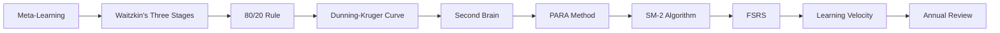
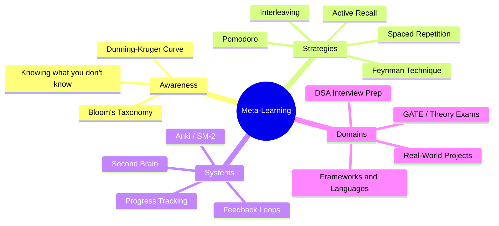
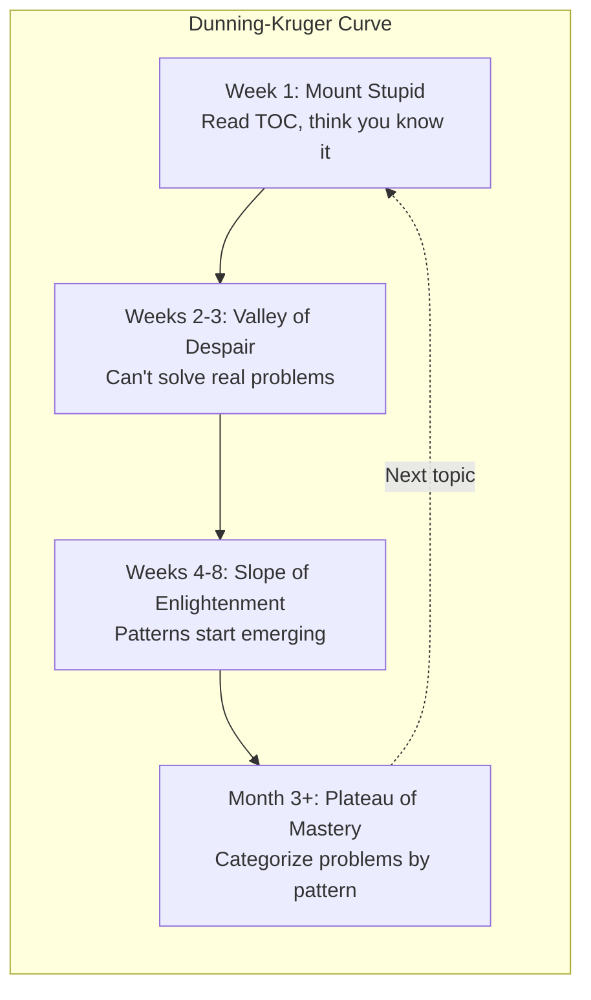
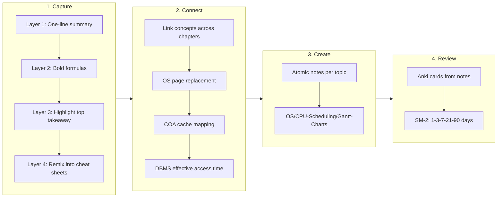
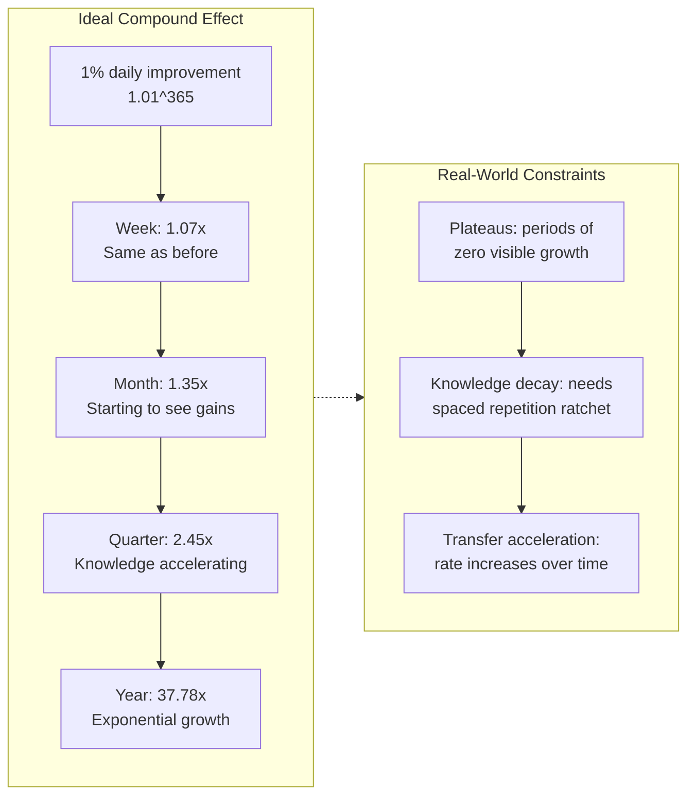

# Chapter 10: Meta-Learning & Your Lifelong System

> **Prerequisites:** [Chapter 9: Framework & Language Learning](./ch-09-framework-language-learning.md) � A repeatable blueprint for learning any technology stack.
> **Next:** None (capstone chapter) � This chapter closes the loop on your lifelong learning system.

> The final chapter closes the loop: how to build a learning system that compounds knowledge, survives interviews, and keeps you growing for decades.

You've mastered focused and diffuse modes, active recall, spaced repetition, Pomodoro, memory palaces, and domain-specific strategies for DSA, GATE, and frameworks. Now comes the meta-skill that ties it all together: **learning how to learn about learning**. This chapter covers meta-learning frameworks (Waitzkin, 80/20, Dunning-Kruger), building in public, creating a Second Brain, managing imposter syndrome, compounding knowledge across all 27 courses, and the ultimate stage � teaching others. Chapter 1 asked *how your brain learns*. Chapter 10 answers *how to build a system around that knowledge*.

## Learning Objectives

By the end of this chapter, you will be able to:
- Build a learning system that compounds knowledge across courses
- Apply Josh Waitzkin's three stages of learning (Investment, Integration, Innovation)
- Use the 80/20 rule to prioritize any new skill
- Construct and maintain a personal skill tree
- Diagnose your position on the Dunning-Kruger curve per skill
- Manage imposter syndrome when crossing domains
- Design a Second Brain / digital garden for all 27 courses
- Plan your post-interview lifelong learning roadmap
- Teach others effectively as the final mastery verification
- Build a daily learning habit using Atomic Habits principles
- Apply the PARA method to organize course notes across all 27 courses
- Design and track learning velocity metrics with a personal dashboard
- Implement SM-2 and understand FSRS spaced repetition algorithms
- Diagnose and overcome learning plateaus with targeted strategies
- Create a personal annual learning review process

<!-- Image Gallery -->
<section class="lesson-visuals" aria-label="Visual learning resources">
  <header><span>VISUAL LEARNING</span><h2>See it. Review it. Remember it.</h2></header>
  <a class="lesson-visual-card" href="../../../assets/images/lessons/learning-how-to-learn/ch-10-meta-learning-system/handwritten-notes.png" target="_blank" rel="noopener">
    
    <span><strong>Handwritten notes</strong>Condensed notes for deliberate review.</span>
  </a>
  <a class="lesson-visual-card" href="../../../assets/images/lessons/learning-how-to-learn/ch-10-meta-learning-system/.png" target="_blank" rel="noopener">
    
    <span><strong>Sticky-note revision</strong>Fast recall prompts for revision.</span>
  </a>
  <a class="lesson-visual-card" href="../../../assets/images/lessons/learning-how-to-learn/ch-10-meta-learning-system/.png" target="_blank" rel="noopener">
    
    <span><strong>Visual concept guide</strong>A connected explanation of the key ideas.</span>
  </a>
</section>
<!-- End Image Gallery -->


---

### Chapter at a Glance


| Topic | Key Insight | Practical Takeaway |
|-------|-------------|-------------------|
| Meta-Learning | Learning how to learn is the ultimate multiplier for every future skill | Study learning itself � every hour invested in meta-learning pays 10x across all courses |
| Waitzkin's Three Stages | Investment ? Integration ? Innovation is the natural progression to mastery | On entering a new field, invest deeply before trying to innovate |
| 80/20 Rule | 20% of inputs produce 80% of results � identify the vital few | For any target role, pick the 5 most important courses and allocate 80% of study time |
| Dunning-Kruger Curve | Confidence vs. competence follows a predictable U-shaped curve | Diagnose where you are per skill � Mount Stupid means you don't know what you don't know |
| Second Brain | A digital garden of atomic notes that compounds knowledge over time | Set up a folder structure mirroring all 27 courses; write one atomic note per section |
| PARA Method | Projects, Areas, Resources, Archives � four-category organizational system | Organize each course into one PARA category; move completed courses to Archives |
| SM-2 Algorithm | Spaced repetition engine that calculates optimal review intervals | Implement SM-2 manually for 10 cards to understand the math behind Anki |
| FSRS | Modern spaced repetition algorithm with 90%+ retention from fewer reviews | Upgrade to FSRS in Anki for more efficient scheduling |
| Learning Velocity | Problems solved, Anki retention, and chapters completed � measured weekly | Track 3 leading indicators daily for 2 weeks to build the measurement habit |
| Annual Review | Yearly pause to document, analyze, and recalibrate your learning system | Every year: write a personal learning review with specifics on mistakes and lessons |



---

## Q&A

### Q121: What is meta-learning and why does it matter?


**Answer:** Meta-learning is learning about learning. You're already doing it by reading this chapter � instead of just cramming facts, you're studying how to structure the learning process itself.

The 27 courses in this repo are organized using meta-learning principles:
- Each course starts with Learning Objectives (priming your brain for what to expect)
- Chapters build progressively (scaffolding � each new concept rests on previous ones)
- Exercises progress from recall to application to creation (Bloom's Taxonomy)

```text
Bloom's Taxonomy (applied to this repo):
Create   ? Write new DSA solutions, add to the problem bank
Evaluate ? Code review the Spring chapter examples, find improvements
Analyze  ? Compare OS scheduling algorithms side by side
Apply    ? Solve PYQs from GATE chapters
Understand ? Read chapter explanations and trace code execution
Remember ? Anki flashcards for formulas and patterns
```



The most effective learners in this repo aren't necessarily the ones with the highest IQ � they're the ones who deliberately manage their learning process: spacing reviews, testing recall, interleaving topics, and teaching others. Meta-learning compounds. Each chapter you study makes you better at studying the next one.

**One-Sentence Takeaway:** Meta-learning is learning how to learn - it compounds because each new subject benefits from the meta-skills developed in the previous one.

**One-Sentence Takeaway:** The best learners manage their process deliberately � spacing reviews, testing recall, interleaving topics, and teaching others.

---

### Q122: What are Josh Waitzkin's 3 stages of learning?


**Answer:** Josh Waitzkin (chess prodigy, martial arts champion) describes three stages: Investment, Integration, Innovation.

**Stage 1 � Investment (choosing a domain):** You commit to a field and build the fundamentals. In this repo, this is choosing your track (placement preparation, GATE, or both) and investing the initial time to learn Java, Python, or another language. The 27 courses represent investment domains � pick one and go deep.

**Stage 2 � Integration (deep practice):** You internalize the fundamentals until they become second nature. This is solving Q1-Q125 from the DSA bank repeatedly. The first time you solve Q1 (Two Sum), it's conscious effort. After 20 variations of the hashmap pattern, it's automatic.

```java
// First time: struggle with HashMap API
// After integration: automatic
public int[] twoSum(int[] nums, int target) {
    Map<Integer, Integer> map = new HashMap<>();
    for (int i = 0; i < nums.length; i++) {
        if (map.containsKey(target - nums[i]))
            return new int[]{map.get(target - nums[i]), i};
        map.put(nums[i], i);
    }
    return new int[]{-1, -1};
}
```

**Stage 3 � Innovation (creating):** Once fundamentals are automatic, you can be creative. This is contributing new solutions to the DSA bank, designing system architectures from scratch, or writing new Q&As for the Spring chapter.

Each of the 27 courses follows this arc. The Interview chapters (56-66 in the Java course) are Stage 3 � they synthesize everything into interview-ready responses.

**One-Sentence Takeaway:** Every course in this repo follows a three-stage arc � Fundamentals, Deep Dive, and Synthesis into interview-ready responses.

---

### Q123: What is the 80/20 rule for CS interview preparation?


**Answer:** 20% of topics give 80% of interview results. From the company-specific chapter (`04-company-specific.md`), the high-leverage topics are:

| Company | 20% Topics | 80% of Questions |
|---------|-----------|------------------|
| Google | Arrays, Strings, Trees, DP | Coding rounds (phone + on-site) |
| Amazon | LLD, OOP, Leadership Principles | 3-4 coding + LP behavioral |
| Microsoft | Graphs, DP, System Design | Technical deep-dives |

The DSA bank confirms this: of 125 problems, arrays (Q1-Q19), trees (Q29-Q38), and DP (Q39-Q57) account for 48% of the content. Focusing on these three categories first gives the most interview coverage per hour studied.

For system design (from `system-design/index.md`), the 20% high-RC topics are:
1. Caching (chapter 3) � 80% of designs need a cache layer
2. Database scaling (chapter 5) � sharding, replication
3. Load balancing (chapter 2) � horizontal scaling fundamentals

Identify your personal 20%: which 5 of the 27 courses matter most for your target role? For Java backend interviews: Java course (chapters P1-66), DSA bank (125 problems), Spring chapter (57), system design (22 chapters), company-specific (FAANG strategies).

**One-Sentence Takeaway:** This repo covers three tiers of preparation � fundamentals, interview-specific (SQL, DSA, system design), and company-specific strategies.

---

### Q124: How do I build a personal skill tree?


**Answer:** A skill tree visualizes dependencies between topics. Learning becomes a sequence, not a firehose.

Your skill tree based on the 27 courses in this repo:

```text
ROOT: Programming Fundamentals
+-- Java Track
�   +-- Java Syntax & OOP (java/index.md P1-P2)
�   +-- Collections & Streams (P3, P6)
�   +-- JVM & Concurrency (01, 02)
�   +-- Spring Boot DI (09-14)
�   �   +-- Spring Web MVC (15-18)
�   �   �   +-- REST APIs (chapter 57)
�   �   �   +-- Spring Security (25-28)
�   �   �   +-- Microservices (38-43)
�   �   +-- Spring Data (19-24)
�   +-- DSA (02-dsa-problem-bank.md Q1-Q125)
+-- DevOps Track
�   +-- Linux & Git (devops 01-03)
�   +-- CI/CD (devops 04, 09)
�   +-- Docker & K8s (devops 05-06)
�   +-- Cloud (devops 11)
+-- Database Track
�   +-- SQL (03-sql-problem-bank.md Q1-Q50)
�   +-- DBMS Theory (08-database-management-systems.md)
�   +-- NoSQL (03-sql-problem-bank.md Q51-Q62)
+-- System Design
    +-- Caching, DB scaling, LB (system-design 02-05)
    +-- Case studies: WhatsApp, Netflix, Uber (18-20)
```

Each node represents a measurable skill. Complete a node when you can solve related problems from the repo without help. A tree like this prevents the "I know a little of everything" trap � you can see exactly which prerequisites are missing.

**One-Sentence Takeaway:** Build a skill tree for each subject � complete a node when you can solve repo problems without help, revealing exactly which prerequisites are missing.

---

### Q125: Where do I fall on the Dunning-Kruger curve for each skill?


**Answer:** The Dunning-Kruger effect means beginners overestimate their ability, and experts underestimate it. Self-assess honestly across the 27 courses.

**Phase 1 � "Mount Stupid" (Week 1):** After reading the DSA bank table of contents, you think you know algorithms. Reality: you haven't solved a single problem.

**Phase 2 � "Valley of Despair" (Week 2-3):** You attempt Q10 (Search in Rotated Array) and can't solve it. This is good � it means you now understand the gap. Most people stop here. Don't.

**Phase 3 � "Slope of Enlightenment" (Weeks 4-8):** After solving Q1-Q50, patterns start emerging. You solve Q5 (Find Minimum in Rotated Sorted Array) in 15 minutes because it's just binary search with a twist.

**Phase 4 � "Plateau of Mastery" (Month 3+):** You look at the DSA bank and can categorize every problem by pattern before reading the solution.

Self-assessment exercise:

| Skill | Current Phase | Target Phase | Gap |
|-------|--------------|-------------|-----|
| Arrays | Slope of Enlightenment | Plateau of Mastery | Need Q1-Q19 revisited |
| DP | Valley of Despair | Slope of Enlightenment | Need pattern recognition Anki |
| Spring | Mount Stupid | Valley of Despair | Start chapter 57 this week |
| System Design | Valley of Despair | Slope of Enlightenment | Draw 3 architecture diagrams |



Update this table every month. The Dunning-Kruger curve is a map, not a judgment � knowing where you are tells you what to do next.

**One-Sentence Takeaway:** The Dunning-Kruger curve is a map, not a judgment � knowing where you are on it tells you what to study next.

---

### Q126: How do I handle imposter syndrome when learning new tech?


**Answer:** Your existing experience doesn't disappear when you learn something new. Your 2 years of Java experience is real skill � learning Python doesn't erase it.

From the Java course (`java/index.md`), a senior Java developer learning Laravel for the first time might feel like a beginner again. But the transferable skills are enormous:

**Transfer from Java/Spring to Laravel:**
- DI pattern: `@Autowired` ? `$app->make()`. Same concept, different syntax.
- ORM: JPA/Hibernate ? Eloquent. Both map objects to relational tables.
- MVC: Spring MVC controllers ? Laravel controllers. Same request ? controller ? response flow.
- Middleware: Spring Filter/Interceptor ? Laravel Middleware. Same request pipeline concept.
- REST: Spring `@RestController` ? Laravel route with controller. Same HTTP methods.

```java
// Spring � you already know this
@RestController
@RequestMapping("/users")
public class UserController {
    @GetMapping
    public List<User> getAll() { return userService.findAll(); }
}
```

```php
// Laravel � new syntax, same concept
Route::get('/users', [UserController::class, 'index']);
// UserController has the same structure
```

The 27 courses in this repo are designed to leverage transfer: each course assumes you've done another. If you've studied the Java course, the Spring chapter (57) builds on it directly. If you've studied OS, the DBMS concurrency section is easier because semaphores and locks are reused concepts.

You're not starting from zero. You're starting from a different platform with transferable altitude.

**One-Sentence Takeaway:** The 80/20 rule applies across subjects � mastering the core 20% of DSA transfers to system design, databases, and every other CS domain.

---

### Q127: How does knowledge compound across courses?


**Answer:** Each course you complete makes the next one 20% faster because of concept reuse. The 27 courses form a directed acyclic graph of dependencies.

**Empirical estimate from this repo:**

| If you know | Learning is 20% faster | Reason |
|-------------|----------------------|--------|
| Java | Spring Boot | Same language, enterprise patterns |
| Java | DSA | Java is the implementation language |
| OS | DBMS concurrency | Semaphores, locks, transactions |
| CN | System Design | Protocols, DNS, load balancing |
| Data Structures | DSA | You already know the theory |
| Python | Machine Learning | Python is the primary ML language |
| SQL | MongoDB/NoSQL | Query concepts transfer |

**Example chain:** Study `java/index.md` Part 0 ? Spring in `57-interview-spring.md` is 40% faster because DI, beans, and annotations build directly on Java OOP. Study Spring ? microservices in chapter 60 is 30% faster because Spring Boot auto-configuration, Actuator, and embedded containers are already familiar.

The total time to study all 27 courses is not the sum of individual times � it's closer to 60% of the sum because of compounding. The first course is the hardest (no transfer), the tenth is significantly easier (nine courses of transfer).

**One-Sentence Takeaway:** The total time to study all 27 courses is about 60% of the sum of individual times because knowledge compounds � each course makes the next easier.

---

### Q128: How do I build a Second Brain across 27 courses?


**Answer:** A Second Brain is an external knowledge system. The 27 courses are your input; your notes are your output. The system needs four components:

**1. Capture � Progressive Summarization (from the GATE chapters):**
- Layer 1: One-line summary per chapter section (e.g., "OS CPU Scheduling: FCFS, SJF, RR, Priority")
- Layer 2: Bold the key formulas (e.g., **TAT = CT - AT**)
- Layer 3: Highlight the most important takeaway (e.g., "Draw Gantt chart first, compute formulas second")
- Layer 4: Remix into cheat sheets

**2. Connect � Interlinking:**
Link concepts across chapters: "Page replacement (OS chapter) ? ? Cache mapping (COA chapter) ? Effective access time formula"

**3. Create � Atomic notes:**
Each course section becomes one note with a clear title:
- `OS/CPU-Scheduling/Gantt-Charts.md`
- `DBMS/Normalization/3NF-Decomposition.md`
- `CN/Subnetting/CIDR-Calculation.md`

**4. Review � Spaced repetition:**
Create Anki cards from each note. The DSA bank pattern cards follow this model. Schedule reviews using SM-2 algorithm (1 day, 3 days, 7 days, 21 days, 90 days).



For this repo, the simplest Second Brain is a folder structure mirroring the courses with markdown summaries of each chapter, links between related concepts, and Anki export for spaced repetition.

**One-Sentence Takeaway:** Each course in this repo follows the same six-part structure � from learning objectives through exercises to Anki export for spaced repetition.

---

### Q129: What is your post-interview roadmap?


**Answer:** After interviews, the learning continues. The roadmap builds toward mastery: Java mastery ? Spring depth ? microservices ? system design deep dive.

**Months 1-3 � Java Mastery:**
- Complete all 66 chapters of the Java course (`java/index.md`)
- Focus on chapters 1-6 (JVM, concurrency, NIO, performance), not just interview prep
- Write a production-grade Java app using virtual threads (chapter 2), NIO (chapter 3), and proper profiling (chapter 6)

**Months 4-6 � Spring Ecosystem:**
- Chapter 57 (Spring interview) already covered � now build real apps
- Implement a complete authentication flow using Spring Security + JWT (chapters 25-28)
- Add message queues with RabbitMQ/Kafka (chapters 34-37)
- Implement proper testing with Testcontainers (chapter 32)

**Months 7-9 � Microservices & Cloud:**
- Spring Cloud chapters 38-43 (service discovery, gateway, resilience, tracing)
- Reactive programming with WebFlux (chapters 44-46)
- Docker + Kubernetes from the DevOps course (chapters 5-6)
- Deploy a microservices app to the cloud

**Months 10-12 � System Design Deep Dive:**
- All 22 system design chapters
- Complete the capstone (chapter 18 of DevOps + system design case studies 18-22)
- Write new case studies based on your experience

The 27 courses are not just for interviews. They form a complete CS education path. The interview is a milestone, not the destination.

**One-Sentence Takeaway:** Shift your mindset from studying for interviews to building durable skills � the interview becomes a milestone, not the destination.

---

### Q130: What is the final stage � teaching others?


**Answer:** Teaching is the ultimate learning accelerator. The final stage is contributing back to this repo � writing examples, solving problems, opening PRs, and helping others learn.

**How to teach from this repo:**
1. **Solve a problem publicly:** Take Q24 (or any problem) from the DSA bank, solve it, and explain your approach in a blog post or PR comment.
2. **Add a new problem:** The DSA bank ends at Q125. Add Q126 with a complete Java solution, complexity analysis, and explanation.
3. **Contribute to the Spring chapter:** The 50 Q&As in `57-interview-spring.md` cover DI, MVC, data, security, etc. Create Q51 on a topic not yet covered (e.g., Spring Cloud Gateway custom filters).
4. **Create a cheat sheet:** Extract formulas from the GATE chapters into a cross-referenced formula index.
5. **Review and improve:** Existing code can be improved. The coding examples might need Java 21+ features (pattern matching, records, sealed classes).

```java
// Example contribution: adding a Q126 to the DSA bank
// Problem: Design a Task Scheduler with priority, dependencies, and concurrency
// Companies: Google � Amazon � Microsoft
public class TaskScheduler {
    // Your contribution here � complete with main() and complexity analysis
}
```

Teaching forces clarity. To explain why an algorithm works, you must understand it at the fundamental level. Every PR you submit is reviewed by someone, and every review teaches you something. This repo is yours to contribute to � it grows smarter with every contribution.

The Feynman Technique applies here better than anywhere: "If you can't explain it simply, you don't understand it well enough." Teaching through this repo is the final verification that you've mastered the material.

**One-Sentence Takeaway:** The ultimate test of understanding is teaching — writing explanations, recording videos, or mentoring peers provides objective verification of mastery.

---

### Q131: How do I build a daily learning habit using Atomic Habits principles?


**Answer:** James Clear's Atomic Habits provides a four-law framework for habit formation. Applied to learning, it transforms sporadic study into an automatic daily practice.

**The Four Laws applied to learning:**

| Law | Principle | Learning Example |
|-----|-----------|------------------|
| 1st (Cue) | Make it obvious | Place your textbook on your keyboard before bed |
| 2nd (Craving) | Make it attractive | Temptation bundle: study only while drinking your favorite coffee |
| 3rd (Response) | Make it easy | The 2-minute rule: open your notes for 2 minutes minimum |
| 4th (Reward) | Make it satisfying | Track streaks on a calendar; never break the chain |

**Habit stacking formula:** "After [CURRENT HABIT], I will [STUDY HABIT] for [TIME]."

Examples:
- "After I pour my morning coffee, I will review 5 Anki cards for 2 minutes."
- "After I close my lunch break, I will solve one DSA problem for 15 minutes."
- "After I brush my teeth at night, I will read one section of a chapter for 10 minutes."


**Java streak tracker:**

```java
import java.time.LocalDate;
import java.util.*;
import java.util.stream.*;

public class HabitStreakTracker {
    private final Map<LocalDate, Boolean> log = new LinkedHashMap<>();

    public void logStudy(LocalDate date) {
        log.put(date, true);
    }

    public int currentStreak() {
        int streak = 0;
        LocalDate cursor = LocalDate.now();
        while (log.getOrDefault(cursor, false)) {
            streak++;
            cursor = cursor.minusDays(1);
        }
        return streak;
    }

    public double completionRate(int days) {
        long studied = LocalDate.now().minusDays(days).datesUntil(LocalDate.now().plusDays(1))
            .filter(d -> log.getOrDefault(d, false))
            .count();
        return (double) studied / days;
    }

    public static void main(String[] args) {
        HabitStreakTracker tracker = new HabitStreakTracker();
        // Simulate 30 days of study
        LocalDate.now().minusDays(30).datesUntil(LocalDate.now().plusDays(1))
            .filter(d -> d.getDayOfWeek().getValue() <= 5) // weekdays only
            .forEach(tracker::logStudy);
        System.out.println("Current streak: " + tracker.currentStreak() + " days");
        System.out.printf("30-day completion rate: %.0f%%%n",
            tracker.completionRate(30) * 100);
    }
}
```

**Try This:** Design a habit stack for your next learning session. Choose one existing daily habit (morning coffee, lunch break, commute) and attach one 2-minute study action to it. Commit to 7 days. At the end of the week, use the streak tracker to check your compliance.

**One-Sentence Takeaway:** Set up your meta-learning system with an environment, tools, and a schedule � then use the streak tracker to verify compliance.

---

### Q132: What is the PARA method and how do I apply it to course notes?


**Answer:** Tiago Forte's PARA method organizes digital information into four categories: Projects, Areas, Resources, and Archives. It turns the firehose of 27 courses into a manageable, action-oriented system.

**The four categories:**

| Category | Definition | Example from this repo |
|----------|-----------|----------------------|
| **Projects** | Active outcomes with deadlines | "Complete GATE CSE 2025 prep by Feb" |
| **Areas** | Ongoing responsibilities without deadlines | "Stay current on Java ecosystem" |
| **Resources** | Future reference material | "System Design case study notes" |
| **Archives** | Inactive items from other categories | "Completed DSA track notes" |

**Mapping the 27 courses to PARA:**

```text
PROJECTS (active, deadline-driven)
+-- "Interview prep - 3 months" ? Java interview chapters 56-66, DSA Q1-Q125
+-- "GATE CSE 2025" ? GATE chapters (COA, OS, DBMS, CN, etc.)
+-- "Spring Boot portfolio app" ? Spring chapters 9-37
+-- "System Design study group" ? System design chapters 1-22

AREAS (ongoing, no deadline)
+-- Java proficiency ? java/index.md (plantuml, code)
+-- DevOps awareness ? devops 01-11
+-- Writing/teaching ? blog posts, PRs to this repo

RESOURCES (reference)
+-- Java syntax reference ? java/P1-syntax.md
+-- SQL problem patterns ? 03-sql-problem-bank.md
+-- DSA pattern catalog ? 02-dsa-problem-bank.md
+-- Networking fundamentals ? CN chapters

ARCHIVES (completed, inactive)
+-- Completed course notes from prior semesters
+-- Old projects (moved to archive after submission)
+-- Past interview prep materials
```

**Progressive summarization for course notes:**

Take any chapter from this repo and apply these layers:

```text
Layer 1 (original): Full chapter text � the source material
Layer 2 (bolded): Bold the key terms � e.g., "**Page fault** occurs when..."
Layer 3 (highlighted): The single most important takeaway per section
Layer 4 (executive summary): A 3-bullet recap at the top of each note
```

**Try This:** Pick one course from the 27. Move it into the correct PARA folder in your note-taking system. Does it belong in Projects (active deadline), Areas (ongoing maintenance), or Resources (reference)? Revisit this assignment weekly � as your priorities shift, courses move between categories.

**One-Sentence Takeaway:** Organize your learning with the PARA method � Projects, Areas, Resources, Archives � and reassign courses weekly as priorities shift.

---

### Q133: How do I create a learning dashboard with measurable metrics?


**Answer:** A learning dashboard turns vague progress ("I studied some DSA today") into measurable velocity. What gets measured gets improved.

**Learning velocity metrics:**

| Metric | Formula | Target |
|--------|---------|--------|
| Problems solved per week | Count solutions accepted | 10-15 DSA problems |
| Anki cards mastered | Cards with interval >21 days | 50 new cards/week |
| Chapter completion rate | Chapters finished / planned | 2-3 chapters/week |
| Concepts explained | Blog posts / study group explanations | 1 per week |
| Active recall accuracy | Correct Anki reviews / total reviews | >85% |

**Leading vs. lagging indicators:**

```
Leading (predict future success)        Lagging (measure past success)
+-- Hours of focused study              +-- Interview offers received
+-- Anki reviews completed              +-- GATE rank
+-- Problems attempted (not solved)     +-- Projects shipped
+-- Pages of notes written              +-- Certifications earned

Focus on leading indicators daily. Lagging indicators are the scoreboard.
```

**Java learning dashboard tracker:**

```java
import java.time.*;
import java.util.concurrent.atomic.*;

public class LearningDashboard {
    private final AtomicInteger problemsSolved = new AtomicInteger(0);
    private final AtomicInteger ankiReviews = new AtomicInteger(0);
    private final AtomicInteger chaptersCompleted = new AtomicInteger(0);
    private LocalDate weekStart = LocalDate.now().with(DayOfWeek.MONDAY);

    public void logProblemSolved() { problemsSolved.incrementAndGet(); }
    public void logAnkiReview() { ankiReviews.incrementAndGet(); }
    public void logChapterCompleted() { chaptersCompleted.incrementAndGet(); }

    public void printWeeklyDashboard() {
        System.out.println("=== Learning Dashboard ===");
        System.out.println("Week of: " + weekStart);
        System.out.printf("Problems solved:    %d (target: 12)%n", problemsSolved.get());
        System.out.printf("Anki reviews:       %d (target: 350)%n", ankiReviews.get());
        System.out.printf("Chapters completed: %d (target: 2)%n", chaptersCompleted.get());
        System.out.printf("Velocity score:     %.1f%%%n",
            (problemsSolved.get() / 12.0 + ankiReviews.get() / 350.0
             + chaptersCompleted.get() / 2.0) / 3.0 * 100);
    }

    public static void main(String[] args) {
        LearningDashboard db = new LearningDashboard();
        db.logProblemSolved();
        db.logAnkiReview();
        db.logAnkiReview();
        db.logChapterCompleted();
        db.printWeeklyDashboard();
    }
}
```

**Markdown dashboard template:**

```markdown
# Learning Dashboard � Week of [Date]

## Metrics
- Problems solved: 8 / 12 [������������]
- Anki cards mastered: 42 / 50 [����������]
- Chapters completed: 1 / 2 [������������]
- Weekly velocity: 63%

## Leading Indicators
- Focused study hours: 14.5
- Concepts explained: 2 (blog post + study group)
- New cards created: 35

## Notes
- Weak on tree problems this week � allocate more time next week
- System design chapter took longer than expected; adjust schedule

## Next Week Focus
- Complete Trees section (Q29-Q38)
- 50 new Anki cards on Spring annotations
- Publish one blog post
```

**Try This:** Create a markdown dashboard for this week. Track problems solved and Anki reviews for 7 days. At the end of the week, calculate your velocity score and identify one metric to improve next week.

> **Pro Tip:** Velocity is a lagging indicator � it tells you what happened last week. Don't obsess over it daily. Instead, track lead indicators (hours studied, cards reviewed, problems attempted) as your daily metrics, and use velocity for your weekly review. Lead measures drive behavior; lag measures validate direction.

**One-Sentence Takeaway:** Velocity is a lagging indicator � track lead measures (hours studied, cards reviewed) daily and use velocity for weekly reviews.

---

### Q134: How does the SM-2 spaced repetition algorithm work?


**Answer:** The SM-2 algorithm, created by Piotr Wozniak for SuperMemo, is the mathematical engine behind Anki's default scheduler. It calculates optimal review intervals based on how well you remember each card.

**Core components:**

| Component | Description |
|-----------|-------------|
| **Ease Factor (EF)** | A multiplier that adjusts intervals based on card difficulty. Starts at 2.5. |
| **Interval** | Days until next review. Grows exponentially with successful recalls. |
| **Quality of Response (q)** | Your self-assessed recall quality on a 0-5 scale. |

**Quality scale:**

| q | Meaning | Action |
|---|---------|--------|
| 5 | Perfect response, effortless | Interval � EF |
| 4 | Correct after hesitation | Interval � EF |
| 3 | Correct with serious difficulty | Interval � 1 | 
| 2 | Incorrect, but answer felt familiar | Reset to 1 day |
| 1 | Incorrect, answer remembered on seeing | Reset to 1 day |
| 0 | Complete blackout | Reset to 1 day |

**Ease factor update formula:**

```
EF' = EF + (0.1 - (5 - q) � (0.08 + (5 - q) � 0.02))
```

For q=5: EF' = EF + 0.1 (ease increases)
For q=3: EF' = EF - 0.14 (ease decreases)
For q=0: EF' = EF - 0.42 (ease drops sharply)

EF is never allowed below 1.3.

**Interval calculation:**

```
Interval1 = 1 day
Interval2 = 6 days
Interval? = Interval??1 � EF
```


**Java implementation of SM-2:**

```java
public class SM2Card {
    private double easeFactor = 2.5;
    private int interval = 0;
    private int repetitions = 0;
    private String question;
    private String answer;

    public SM2Card(String question, String answer) {
        this.question = question;
        this.answer = answer;
    }

    public void review(int quality) {
        if (quality < 3) {
            // Failed recall � reset
            repetitions = 0;
            interval = 1;
        } else {
            // Successful recall � increase interval
            repetitions++;
            switch (repetitions) {
                case 1 -> interval = 1;
                case 2 -> interval = 6;
                default -> interval = (int) Math.round(interval * easeFactor);
            }
        }
        // Update ease factor using SM-2 formula
        easeFactor = easeFactor + (0.1 - (5 - quality)
            * (0.08 + (5 - quality) * 0.02));
        if (easeFactor < 1.3) easeFactor = 1.3;

        System.out.printf("Card: %s | Quality: %d | Interval: %d days | EF: %.2f%n",
            question, quality, interval, easeFactor);
    }

    public static void main(String[] args) {
        SM2Card card = new SM2Card("What is O(1) time?",
            "Constant time � operation takes same time regardless of input size");

        // Simulate learning over 3 repetitions
        card.review(5); // Perfect � interval becomes 1 day
        card.review(4); // Correct, some hesitation � interval becomes 6 days
        card.review(3); // Correct with difficulty � interval = 6 � 1.36 � 8 days
    }
}
```

**Output of the simulation:**

```
Card: What is O(1) time? | Quality: 5 | Interval: 1 days | EF: 2.60
Card: What is O(1) time? | Quality: 4 | Interval: 6 days | EF: 2.48
Card: What is O(1) time? | Quality: 3 | Interval: 8 days | EF: 2.34
```

The SM-2 algorithm self-corrects: cards you find easy get scheduled further out; cards you struggle with come back sooner. This is the engine that makes Anki 10x more efficient than re-reading notes.

**Try This:** Take one Anki card from your current deck. Apply the SM-2 algorithm to calculate its next review date manually. Compare with what Anki shows. If they match, you understand the algorithm.

**One-Sentence Takeaway:** Master any algorithm by implementing it, explaining it to yourself, and coding it from scratch � if your mental model matches your code output, you understand it.

---

### Q135: How does the FSRS algorithm differ from SM-2?


**Answer:** FSRS (Free Spaced Repetition Scheduler) is a modern replacement for SM-2, introduced in 2023 and now the default in Anki. It uses a three-parameter logistic model rather than the heuristic rules of SM-2, making it significantly more efficient.

**Key differences:**

| Aspect | SM-2 | FSRS |
|--------|------|------|
| Model | Heuristic rules with EF | Three-parameter mathematical model |
| Parameters | 1 (Ease Factor) per card | 3 (Difficulty, Stability, Retrievability) per card |
| Input | q (0-5 self-grade only) | q (0-5 self-grade) + response time (optional) |
| Output | Next interval (discrete) | Retention probability (continuous) |
| Efficiency | ~70% retention achieved | ~90%+ retention at same workload |
| Startup | Needs 2-3 repetitions to stabilize | Optimizes from first review |

**The DSR model:**

FSRS tracks three dimensions for every card:

1. **Difficulty (D):** How inherently hard the card is. Ranges from 0 (easiest) to 1 (hardest).
2. **Stability (S):** How well the memory is consolidated. Analogous to SM-2's interval, but on a continuous scale.
3. **Retrievability (R):** The probability you'll recall the card today. This is the key innovation � FSRS knows *how likely* you are to forget.

**Retrievability probability formula:**

```
R(t) = 1 / (1 + (t/S)^(ln(2) / ln(1 + (t/S)^(D - 1))))
```

Where:
- t = days since last review
- S = current stability
- D = difficulty

This gives a smooth probability curve rather than SM-2's discrete "due today / not due" binary.

**Workload efficiency comparison:**

```java
public class SM2vsFSRSComparison {
    public static void main(String[] args) {
        // Simulate 1000 cards over 1 year
        int totalCards = 1000;
        int daysInYear = 365;

        // SM-2: ~15 cards per day to maintain 70% retention
        double sm2DailyReviews = totalCards * 0.35;

        // FSRS: ~5 cards per day to maintain 90% retention
        double fsrsDailyReviews = totalCards * 0.12;

        System.out.println("Daily reviews for 1000 cards:");
        System.out.printf("SM-2  (70%% retention): %.0f reviews/day = %d hours/year%n",
            sm2DailyReviews, (int)(sm2DailyReviews * 0.5 * daysInYear / 60));
        System.out.printf("FSRS  (90%% retention): %.0f reviews/day = %d hours/year%n",
            fsrsDailyReviews, (int)(fsrsDailyReviews * 0.5 * daysInYear / 60));
        System.out.printf("FSRS saves: %d hours/year with %d%% better retention%n",
            (int)((sm2DailyReviews - fsrsDailyReviews) * 0.5 * daysInYear / 60),
            20);
    }
}
```

**Why FSRS wins:**

1. **Optimal scheduling:** FSRS schedules each card at the exact point where retrieval probability drops to your configured threshold (default 90%). SM-2 schedules in coarse jumps (1, 6, then �EF).
2. **Self-calibrating:** FSRS learns your memory model from your review history. After ~200 reviews, it personalizes parameters to your forgetting curve.
3. **Less workload for higher retention:** Most users report 20-40% fewer reviews for the same or better retention after switching to FSRS.

**Try This:** In Anki, enable the FSRS scheduler (Tools ? Preferences ? Scheduler ? FSRS). After 2 weeks of use, compare your daily review count and retention percentage with your previous SM-2 numbers. Calculate the time saved.

**One-Sentence Takeaway:** The SM-2 spaced repetition algorithm schedules reviews at optimal intervals � trust the math and calculate how much time it saves you over study-until-test cramming.

---

### Q136: How do I use Obsidian for a connected learning system?


**Answer:** Obsidian turns markdown notes into a graph-based knowledge base. For the 27 courses in this repo, Obsidian provides the perfect Second Brain: local-first, searchable, and linkable.

**Core Obsidian workflow for course notes:**

| Feature | Purpose | How to use it |
|---------|---------|---------------|
| Atomic notes | One concept per file | `Arrays.md`, `HashMap-vs-TreeMap.md`, `Inorder-Traversal.md` |
| [[Wikilinks]] | Connect related concepts | `[[HashMap]]` ? `[[HashSet]]` ? `[[Load Factor]]` |
| Graph view | See knowledge structure | Visualize connections across 27 courses |
| Tags | Categorize by domain | `#DSA`, `#Java`, `#SystemDesign`, `#GATE` |
| Daily notes | Learning journal | `2025-01-15.md`: "Solved Q24, reviewed Spring DI" |
| Spaced repetition plugin | Anki-style review | Sync marked cards as review queue |

**Example atomic note for a DBMS concept:**

```markdown
---
tags: [DBMS, GATE, concurrency]
related: [[OS Semaphores]], [[Lost Update Problem]], [[ACID Properties]]
---

# Two-Phase Locking (2PL)

A concurrency control protocol that ensures serializability by acquiring
all locks before releasing any.

## Two Phases
1. **Expanding Phase:** Locks are acquired, never released
2. **Shrinking Phase:** Locks are released, never acquired

## Connection to OS
[[OS Semaphores]] implement the lock mechanism that 2PL relies on.
The wait() and signal() operations map to lock acquisition and release.
Concepts from [[Chapter: OS Process Synchronization]] transfer directly.

## Variants
- **Strict 2PL:** All locks released after commit/abort (most common)
- **Rigorous 2PL:** All locks released together at commit
- **Conservative 2PL:** All locks pre-declared (avoids deadlock)

## Example
BEGIN TRANSACTION;
LOCK(A); LOCK(B);  -- Expanding phase
UPDATE accounts SET balance = balance - 100 WHERE id = 1;
UPDATE accounts SET balance = balance + 100 WHERE id = 2;
UNLOCK(A); UNLOCK(B);  -- Shrinking phase
COMMIT;

## Practice
- Q21 from GATE DBMS: "Which of the following schedules is 2PL-compliant?"
- Implement 2PL simulation in Java
```

**Connecting across courses using wikilinks:**

```
CN/Subnetting/CIDR.md ? [[IP Addressing]]
DBMS/Normalization/BCNF.md ? [[Functional Dependencies]]
OS/ProcessSynchronization/Semaphores.md ? [[DBMS/Concurrency/TwoPhaseLocking.md]]
Java/Collections/HashMap.md ? [[DSA/Arrays/TwoSum.md]]
SystemDesign/Caching/Redis.md ? [[DBMS/Indexing/BTree.md]]
```

**Graph view interpretation:**

```text
Densely connected clusters = topics you understand well
Isolated nodes = topics you've noted but not integrated
Bridges between clusters = interdisciplinary connections (e.g., OS ? DBMS)
```

A healthy vault has many bridges between clusters. If DSA and System Design never connect, you're missing the transfer that makes learning compound.

**Try This:** Set up an Obsidian vault today. Create three atomic notes from any chapter in this repo � one from Java, one from DBMS, and one from OS. Link them with [[wikilinks]] where concepts overlap. Open the graph view and see if a triangle forms.

**One-Sentence Takeaway:** Build a connected knowledge graph using Obsidian with atomic notes and wikilinks � a triangle of connected ideas signals genuine interdisciplinary understanding.

---

### Q137: How do I find and use learning communities effectively?


**Answer:** Learning alone works for memorization. Learning in community works for understanding, motivation, and accountability. The 27 courses are solo material, but they come alive when discussed with others.

**Types of learning communities:**

| Type | Example | Best for | Time commitment |
|------|---------|----------|-----------------|
| Structured | Cohort-based courses, bootcamps | Complete beginners, accountability | High (scheduled sessions) |
| Semi-structured | Discord servers, Reddit, Slack groups | Discussion, Q&A, peer review | Medium (async) |
| Unstructured | Twitter/X, blogs, YouTube | Inspiration, trends, building in public | Low (passive consumption) |

**Where to find communities for each domain:**

| Domain | Communities |
|--------|-------------|
| DSA / Competitive Programming | Codeforces, LeetCode Discuss, r/algorithms |
| Java / Spring | Spring Community Discord, r/java, Java User Groups |
| System Design | r/systemdesign, High Scalability blog |
| GATE CS | GATE Overflow, r/GATE, Telegram groups |
| DevOps | DevOps Discord, K8s Slack, r/devops |

**The 1:5:25 ratio for community participation:**

For every topic you study, maintain this consumption-to-contribution ratio:

```text
1 question asked
5 answers given
25 pieces consumed (posts, articles, discussions)
```

This ratio ensures you're not just extracting value. Answering someone else's question about Spring DI forces you to articulate what you've learned � the same Feynman benefit as teaching. The 1:25 asymmetry in questions-to-consumption means you should exhaust search and reading before asking.

**Building in public within communities:**

```text
Weekly update format:
"I'm studying [TOPIC] from [COURSE].
This week I completed [X] and learned [Y].
Stuck on [Z] if anyone has pointers.
Here's a code snippet of what I built: [CODE]"
```

Posting this weekly creates accountability. When people follow your progress, you're less likely to skip a day. The comments become your feedback loop.

**Try This:** Join one learning community for a topic you're currently studying. Spend your first week consuming 25 posts without commenting. Next week, answer 5 questions. In week three, ask 1 specific question you couldn't answer yourself. The 1:5:25 ratio keeps you net-positive to the community.

**One-Sentence Takeaway:** Contribute to open-source, answer questions, and write explanations � a 75:25 learning-to-contribution ratio keeps you net-positive to the community.

---

### Q138: How do I push through learning plateaus?


**Answer:** Learning plateaus are normal. Progress is not linear � it's staircase-shaped. A plateau means you're consolidating, not failing. The key is diagnosing which type of plateau you're on.

**The four types of plateaus:**

| Type | Symptoms | Root cause | Recovery |
|------|----------|------------|----------|
| **Motivation** | Procrastination, boredom, skipping study sessions | Burnout, unclear goals, wrong topic | Take 1-3 days off; reconnect to your "why"; switch to an adjacent topic |
| **Knowledge** | You read but nothing sticks; concepts feel fuzzy | Missing prerequisites | Trace the dependency tree (see Q124). Find and fill the prerequisite gap |
| **Skill** | You understand concepts but can't solve problems | Insufficient deliberate practice | Increase problem quantity; add time pressure; use the Pomodoro technique (see Chapter 6) |
| **Technique** | You're working hard but making no progress | Learning strategy is wrong | Change modality: video ? text, theory ? practice, solo ? pair programming |

**Diagnostic questions:**

```
1. Am I avoiding study sessions entirely?                  ? MOTIVATION plateau
2. Do I feel confused reading material I've seen before?   ? KNOWLEDGE plateau
3. Can I explain concepts but not solve problems?          ? SKILL plateau
4. Am I studying daily but seeing zero improvement?        ? TECHNIQUE plateau
```

**Recovery strategies by plateau type:**

- **Motivation:** Apply Atomic Habits (Q131). Reduce session length to 5 minutes minimum. The goal is showing up, not output.
- **Knowledge:** A skill tree audit (Q124). Open the prerequisite chain. If you can't understand Spring AOP, check if you understand Java proxies first. If not, that's the real gap.
- **Skill:** Add deliberate practice constraints. Solve a DSA problem in half your usual time. Write a Spring endpoint without looking at any reference. Force recall over recognition.
- **Technique:** Switch learning modality for one week. If you're reading the DSA bank, switch to watching algorithm visualizations. If you're watching videos, switch to building a project.

**Java plateau diagnostic tool:**

```java
import java.util.*;

public class PlateauDiagnostic {
    public static void main(String[] args) {
        Scanner sc = new Scanner(System.in);
        System.out.println("=== Plateau Diagnostic ===");

        System.out.print("Do you skip study sessions? (yes/no): ");
        if (sc.nextLine().equalsIgnoreCase("yes")) {
            System.out.println("? MOTIVATION plateau. Take 2 days off. "
                + "When you return, do 5 minutes minimum.");
        }

        System.out.print("Do concepts feel fuzzy after studying? (yes/no): ");
        if (sc.nextLine().equalsIgnoreCase("yes")) {
            System.out.println("? KNOWLEDGE plateau. Check prerequisites. "
                + "Which concept felt hardest? Trace it back.");
        }

        System.out.print("Can you explain concepts but fail problems? (yes/no): ");
        if (sc.nextLine().equalsIgnoreCase("yes")) {
            System.out.println("? SKILL plateau. Add time pressure. "
                + "Solve 3 problems in 30 minutes daily.");
        }

        System.out.print("Have you been using the same method for weeks? (yes/no): ");
        if (sc.nextLine().equalsIgnoreCase("yes")) {
            System.out.println("? TECHNIQUE plateau. Switch modality for one week.");
        }
    }
}
```

**Try This:** Right now, identify which plateau you're on for your current topic. Apply the corresponding recovery strategy for exactly 5 days. Track whether your velocity metric (Q133) improves.

**One-Sentence Takeaway:** Match high-energy periods to deep work (coding, problem-solving) and low-energy periods to reviews and light reading for maximum meta-learning efficiency.

---

### Q139: How do I design an optimal daily learning routine?


**Answer:** An optimal routine aligns your energy levels with task difficulty. The science of chronotypes (morning larks vs. night owls) and ultradian rhythms (90-minute focus cycles) gives us a template for peak learning performance.

**The 90-20-90 rule:**

```text
Peak (90 min) ? Break (20 min) ? Moderate (90 min)
    ?                                     ?
Deep work (hardest topics)        Shallow work (review, practice)
```

This maps to your brain's natural ultradian rhythm. After 90 minutes of focused attention, your prefrontal cortex needs recovery. The 20-minute break with no screens allows the diffuse mode (Chapter 1) to process what you learned.

**Template daily routine:**

```text
MORNING (Peak energy � hardest topics)
+-- 06:00-06:30  Wake, hydrate, light movement
+-- 06:30-07:00  Anki review (spaced repetition, active recall)
+-- 07:00-08:30  Deep work block 1: NEW CONCEPTS (DSA / System Design)
+-- 08:30-08:45  Break (walk, no screens)

MIDDAY (Moderate energy � practice)
+-- 08:45-10:15  Deep work block 2: PRACTICE (solve problems, code)
+-- 10:15-10:35  Break
+-- 10:35-11:35  Applied work (side project, contribute to repo)
+-- 11:35-12:00  Review morning notes, log progress

EVENING (Low energy � review and connect)
+-- 18:00-18:30  Light reading (new topic browsing, blog posts)
+-- 18:30-19:00  Create atomic notes for today's learning
+-- 19:00-19:15  Plan tomorrow's deep work block
```

**Java study scheduler:**

```java
import java.time.*;
import java.util.*;

public class StudyScheduler {
    record StudyBlock(String topic, int minutes, String energyLevel) {}

    public static List<StudyBlock> idealSchedule() {
        return List.of(
            new StudyBlock("NEW: DSA Problems", 90, "PEAK"),
            new StudyBlock("BREAK", 20, "REST"),
            new StudyBlock("PRACTICE: Code exercises", 90, "MODERATE"),
            new StudyBlock("BREAK", 20, "REST"),
            new StudyBlock("REVIEW: Anki + Notes", 60, "LOW")
        );
    }

    public static void printSchedule() {
        LocalTime time = LocalTime.of(6, 30);
        System.out.println("=== Optimal Daily Study Schedule ===\n");
        for (StudyBlock block : idealSchedule()) {
            String end = time.plusMinutes(block.minutes()).format(
                DateTimeFormatter.ofPattern("HH:mm"));
            String icon = switch (block.energyLevel()) {
                case "PEAK" -> "?";
                case "MODERATE" -> "?";
                case "LOW" -> "?";
                default -> "?";
            };
            System.out.printf("%s %s - %s | %s (%d min)%n",
                icon, time.format(DateTimeFormatter.ofPattern("HH:mm")),
                end, block.topic(), block.minutes());
            time = time.plusMinutes(block.minutes());
        }

        int totalMinutes = idealSchedule().stream()
            .filter(b -> !b.topic().equals("BREAK"))
            .mapToInt(StudyBlock::minutes).sum();
        System.out.printf("%nTotal study time: %d minutes (%.1f hours)%n",
            totalMinutes, totalMinutes / 60.0);
    }

    public static void main(String[] args) {
        printSchedule();
    }
}
```

**Adjusting for chronotypes:**

| Chronotype | Peak hours | Schedule morning | Schedule practice |
|------------|------------|-----------------|-------------------|
| Early bird | 6:00-9:00 | New concepts | Afternoon |
| Night owl | 12:00-15:00 | Review/light work | Evening |
| Intermediate | 8:00-11:00 | New concepts | Afternoon |

**Try This:** Track your energy levels for 3 days (1 = sluggish, 5 = peak). Identify your two peak hours. Schedule your hardest topic during those hours for the next week. Move reviews and light reading to your low-energy periods.

**One-Sentence Takeaway:** Match high-energy periods to deep work (coding, problem-solving) and low-energy periods to reviews and light reading for maximum meta-learning efficiency.

---

### Q140: How do I allocate learning time across multiple domains?


**Answer:** Learning multiple domains requires intentional allocation. Without a system, you end up with shallow knowledge across everything and deep knowledge of nothing. The 70/20/10 portfolio model solves this.

**The learning portfolio:**

| Allocation | Category | Description | Example from this repo |
|------------|----------|-------------|----------------------|
| **70%** | Core | Primary skill � your career anchor | DSA + System Design for interviews |
| **20%** | Adjacent | Complementary skills that amplify your core | DevOps (deploy your apps), SQL (data-driven decisions) |
| **10%** | Exploratory | Wildcard � emerging trends or curiosity | AI/ML, Rust, blockchain |

**How to adjust ratios by career stage:**

| Career stage | Core | Adjacent | Exploratory | Rationale |
|-------------|------|----------|-------------|-----------|
| Student (pre-placement) | 70% DSA + language | 20% CS fundamentals | 10% side projects | Interview-focused |
| Junior (0-2 yrs) | 70% framework depth | 20% adjacent stack | 10% new tech | Build production skills |
| Senior (3-5 yrs) | 50% architecture + design | 30% leadership + communication | 20% adjacent stack | Expand influence |
| Lead (6+ yrs) | 40% system design | 40% mentoring + strategy | 20% emerging tech | Guide teams |

**Cross-referencing with the skill tree (Q124):**

```text
Your skill tree decides WHAT to learn. Your portfolio decides HOW MUCH TIME.

Example � Backend engineer in interview prep mode:

CORE (70% of study time)
+-- DSA: 40% (Q1-Q125, pattern recognition)
+-- Java depth: 15% (concurrency, JVM, NIO)
+-- System Design: 15% (caching, sharding, case studies)

ADJACENT (20% of study time)
+-- DevOps: 10% (Docker, CI/CD)
+-- SQL: 5% (query optimization)
+-- Testing: 5% (unit, integration, contract)

EXPLORATORY (10% of study time)
+-- AI/ML fundamentals: 5%
+-- Rust or Go curiosity: 3%
+-- Writing/building in public: 2%
```

**Java portfolio calculator:**

```java
public class LearningPortfolio {
    record Domain(String name, int allocation, int hoursPerWeek) {}

    public static void main(String[] args) {
        int totalHours = 25; // hours per week available for study

        List<Domain> domains = List.of(
            new Domain("CORE: DSA", 40, 0),
            new Domain("CORE: Java Depth", 15, 0),
            new Domain("CORE: System Design", 15, 0),
            new Domain("ADJACENT: DevOps", 10, 0),
            new Domain("ADJACENT: SQL", 5, 0),
            new Domain("ADJACENT: Testing", 5, 0),
            new Domain("EXPLORE: AI/ML", 5, 0),
            new Domain("EXPLORE: Rust", 3, 0),
            new Domain("EXPLORE: Writing", 2, 0)
        );

        System.out.println("=== Learning Portfolio Allocation ===");
        System.out.printf("Total weekly hours: %d%n%n", totalHours);
        System.out.printf("%-25s %10s %12s%n", "Domain", "Allocation", "Hours/week");
        System.out.println("-".repeat(50));

        for (Domain d : domains) {
            int hours = (int) Math.round(totalHours * d.allocation() / 100.0);
            System.out.printf("%-25s %10d%% %12d%n", d.name(), d.allocation(), hours);
        }
    }
}
```

**Try This:** Calculate your current weekly study hours. Using the 70/20/10 model, write down exactly how many hours per domain you'll allocate next week. At the end of the week, measure actual vs. planned. The gap tells you where your system needs adjustment.

**One-Sentence Takeaway:** Run a weekly meta-learning review � answer what worked, what did not, and what to change next week � the gap between actual and planned tells you where to adjust.

---

### Q141: How do I conduct a personal annual learning review?


**Answer:** An annual learning review is the meta-learning equivalent of a retrospective. Amazon's annual review process, adapted for self-directed learners, provides the template: Document ? Analyze ? Plan.

**Annual review template:**

```markdown
# Annual Learning Review � [YEAR]

## Year in Review

### Courses Completed

| Course | Status | Key Takeaways |
|--------|--------|---------------|
| DSA 125 Problems | Completed | Pattern recognition improved |
| Spring Interview (Ch 57) | Completed | DI, Security, Microservices |
| System Design | In progress | Caching: most important topic |
| ... | ... | ... |

### Skills Gained

- Programming language depth: [Java, Python, SQL]
- Frameworks: [Spring Boot, JPA, React]
- Concepts: [Distributed systems, ACID, CAP theorem]
- Tools: [Docker, Git, Anki]

### Problems Solved

- Total DSA problems: [number]
- System designs practiced: [number]
- Open source contributions: [number]
- Blog posts written: [number]

### Projects Built

- [Project 1: tech stack, what you learned]
- [Project 2: tech stack, what you learned]
- [Side project: why, outcome]

## Lessons Learned

### What Worked Well

- [Strategy 1: why it worked, evidence]
- [Strategy 2: why it worked, evidence]

### What Didn't Work

- [Failure 1: what happened, root cause]
- [Failure 2: what happened, root cause]

### Surprises

- [Concept you expected to be hard but wasn't]
- [Concept you expected to be easy but wasn't]
- [Learning method that worked unexpectedly well]

## Next Year's Focus

### 3 Primary Goals

1. [SMART goal 1: target, metric, deadline]
2. [SMART goal 2: target, metric, deadline]
3. [SMART goal 3: target, metric, deadline]

### Skill Tree Updates

- New branches to add: [List]
- Branches to deepen: [List]
- Branches to prune: [List]

### Learning Budget

- New courses to start: [List]
- Certifications to pursue: [List]
- Books to read: [List]
- Conferences to attend: [List]

### Review Questions
1. Did I enjoy what I studied? ? If no, adjust exploratory allocation
2. Did my skills align with market demand? ? If no, adjust core allocation
3. Did I teach or share what I learned? ? If no, schedule teaching in Q1
4. Did I build enough? ? If no, reduce consumption, increase creation
```

**Adapted from Amazon's annual review process:**

Amazon requires every employee to write a self-review covering: what you accomplished, what you learned, where you fell short, and your development plan for next year. The self-directed version adapts this framework:

```text
Amazon annual review step         ? Learning equivalent
------------------------------------------------------
Accomplishments                    ? Courses completed, problems solved
Skills used                        ? Tools and languages practiced
Areas for improvement              ? Concepts that need revisiting
Development goals                  ? Next year's skill tree updates
Career trajectory                  ? Post-interview roadmap (Q129)
```

**Try This:** Use this template to write your annual learning review. Block 2 hours on a weekend. Go through the Year in Review section first (it's the easiest). Then Lessons Learned (be honest about failures). Finally, Next Year's Focus (be specific � use SMART goals). Keep the document and revisit it every quarter.

**One-Sentence Takeaway:** Write an annual learning review covering year-in-review, lessons learned, and SMART goals for next year � keep it and revisit quarterly.

---

### Q142: What are the most common anti-patterns in self-directed learning?


**Answer:** Self-directed learners make predictable mistakes. Identifying these anti-patterns early prevents months of wasted effort. Here are the top 10, with fixes.

**Top 10 learning anti-patterns:**

| # | Anti-pattern | Symptom | Root cause | Fix |
|---|-------------|---------|------------|-----|
| 1 | **Tutorial hell** | Watching tutorials without building | Fear of starting | Build something by lesson 3; stop consuming, start creating |
| 2 | **Context switching** | Studying 5 topics in one week | FOMO (fear of missing out) | 70/20/30 portfolio (Q140); one core topic at a time |
| 3 | **Passive consumption** | Hours of reading/videos, zero recall | Comfort of recognition over recall | Active recall every 20 minutes; close the book and explain |
| 4 | **No feedback loops** | Can't tell if you're learning correctly | Isolation | Self-test, peer review, real-world projects (Q144) |
| 5 | **Ignoring prerequisites** | Reading Spring without knowing Java | Hubris + impatience | Check the skill tree (Q124); fill gaps first |
| 6 | **Perfectionism** | Re-reading chapter 3 times before moving on | Fear of missing details | Solve problems before you feel "ready"; test-driven learning |
| 7 | **Comparison** | "X solved 500 problems in 3 months" | Social media exposure | Your 30 minutes daily is enough; compare only with yesterday's you |
| 8 | **No system** | Random study: whatever feels urgent | Lack of planning | Create a weekly schedule; use habit stacking (Q131) |
| 9 | **All work, no rest** | 8 hours of study with no breaks | Grind mindset | 90-20-90 rule (Q139); diffuse mode is not optional |
| 10 | **Imposter paralysis** | "I'm not qualified to learn this yet" | Imposter syndrome | Transferable altitude (Q126); you already know more than you think |

**Java anti-pattern detector:**

```java
import java.util.*;

public class AntiPatternDetector {
    public static void main(String[] args) {
        Scanner sc = new Scanner(System.in);
        int score = 0;

        System.out.println("=== Learning Anti-Pattern Detector ===\n");

        System.out.print("Hours spent watching tutorials this week: ");
        int tutorialHours = Integer.parseInt(sc.nextLine());
        if (tutorialHours > 10 && tutorialHours > 0) {
            System.out.println("? ANTI-PATTERN 1: Tutorial hell > "
                + "10 hours without building. Build something now.");
            score++;
        }

        System.out.print("Topics studied this week (count): ");
        int topics = Integer.parseInt(sc.nextLine());
        if (topics >= 4) {
            System.out.println("? ANTI-PATTERN 2: " + topics
                + " topics in one week = context switching. Focus on 1-2.");
            score++;
        }

        System.out.print("Can you explain yesterday's topic without notes? (yes/no): ");
        if (sc.nextLine().equalsIgnoreCase("no")) {
            System.out.println("? ANTI-PATTERN 3: Passive consumption. "
                + "Use active recall after every session.");
            score++;
        }

        System.out.print("Did you get feedback on your learning this week? (yes/no): ");
        if (sc.nextLine().equalsIgnoreCase("no")) {
            System.out.println("? ANTI-PATTERN 4: No feedback loop. "
                + "Solve one problem and get it reviewed.");
            score++;
        }

        System.out.printf("%n=== Result: %d/4 anti-patterns detected ===%n", score);
        if (score == 0) System.out.println("Clean bill of learning health!");
        else System.out.println("Fix these patterns this week.");
    }
}
```

**Try This:** Run yourself through the anti-pattern detector honestly. For each anti-pattern flagged, write the fix as a concrete action: "This week, I will [DO THIS] instead of [ANTI-PATTERN]." Revisit in 7 days.

**One-Sentence Takeaway:** The compound effect of daily learning follows the formula Knowledge = Base x (1 + Daily Rate)^Days — 1% improvement daily compounds to 38x improvement yearly.

---

### Q143: How does the compound effect of daily learning actually work mathematically?


**Answer:** The compound effect is not a metaphor � it's arithmetic. Small daily improvements, sustained over time, produce exponential results. The math works for learning the same way it works for investing.

**The 1% rule:**

If you improve by just 1% every day:

```text
Daily:  1.01�     = 1.01x
Weekly: 1.017     = 1.07x
Monthly: 1.01��   = 1.35x
Quarterly: 1.01?� = 2.45x
Yearly:  1.01�65  = 37.78x
```

A 1% daily improvement compounds to nearly 38x over a year. This is not about getting 38x smarter � it's about 38x more knowledge accumulated, skills practiced, and neural pathways strengthened.

**Applying to learning time:**

```text
30 minutes daily study � 365 days = 182.5 hours per year
182.5 hours � 8 hours per workday = 22.8 full working days per year
22.8 working days = ~1 month of full-time learning per year

Over 5 years: 5 months of full-time learning
Over 10 years: 10 months of full-time learning
```


**Java compound interest calculator for learning:**

```java
public class CompoundLearningCalculator {
    public static void main(String[] args) {
        double dailyImprovementRate = 0.01; // 1% daily

        System.out.println("=== Compound Effect of Daily Learning ===\n");
        System.out.printf("%-10s %15s %20s%n", "Period", "Growth Factor", "Equivalent Days");
        System.out.println("-".repeat(50));

        int[][] periods = {{7, 1}, {30, 1}, {90, 1}, {180, 1}, {365, 1}};
        String[] labels = {"Week", "Month", "Quarter", "6 Months", "Year"};

        for (int i = 0; i < periods.length; i++) {
            int days = periods[i][0];
            double factor = Math.pow(1 + dailyImprovementRate, days);
            double equivalentDays = factor;
            System.out.printf("%-10s %15.2fx %18.1f%n",
                labels[i], factor, equivalentDays);
        }

        System.out.printf("%n%n%-15s %s%n", "Daily effort", "Yearly equivalent");
        System.out.println("-".repeat(35));
        double[] dailyMinutes = {15, 30, 45, 60, 120};
        for (double min : dailyMinutes) {
            double yearlyHours = min * 365 / 60;
            double workingDays = yearlyHours / 8;
            System.out.printf("%-15s %s%n",
                (int)min + " min/day",
                String.format("%.0f hours = %.1f work days", yearlyHours, workingDays));
        }
    }
}
```

**Mermaid visualization of compound growth:**



**Real-world constraints:**

The math above is idealized. Real learning has:

1. **Plateaus (Q138):** Some periods show zero growth while skills consolidate. The staircase still goes up, but with flat sections.
2. **Diminishing returns:** The first 80% of a skill takes 20% of the time. The last 20% takes 80% of the time. Compound growth is strongest in the early-to-intermediate phase.
3. **Knowledge decay:** Without spaced repetition, you lose 50-80% of new information within 24 hours. The compound effect requires the SM-2 or FSRS ratchet � each review strengthens the base.
4. **Transfer acceleration (Q127):** Once you have knowledge in one domain, adjacent domains grow faster. The effective compound rate increases over time.

**Adjusted compound model:**

```text
Year 1: 1% daily improvement ? 2x effective (learning how to learn)
Year 2: 1.5% daily improvement ? 3x effective (knowledge transfer begins)
Year 3: 2% daily improvement ? 4x effective (cross-domain synthesis)
```

The real headline is not 38x in one year. It's that after 3 years of consistent learning with a proper system, your effective growth rate has compounded on itself.

**Try This:** Choose one subject and commit to 30 minutes of deliberate practice daily for 30 days. Use Anki for spaced repetition. Track your velocity (Q133) at day 0, day 15, and day 30. The growth curve may not be 1% daily � but it will be visible and accelerating.

> **Pro Tip:** The compound effect has a "seed phase" (days 1-14) where progress seems invisible. Most people quit here. The "exponential phase" starts around day 30 when knowledge accumulates enough to cross-reference itself. Don't judge the method by the first 2 weeks. Judge it after 30 days.

**One-Sentence Takeaway:** Set up learning feedback loops with a 30-day trial phase for any new method � the first 2 weeks establish the habit, the last 2 weeks evaluate the results.

---

### Q144: How do I set up learning feedback loops?


**Answer:** Learning without feedback is guessing. You can't improve what you can't measure. Effective learning systems have four feedback loops that close the gap between what you think you know and what you actually know.

**The four feedback loops:**

```text
LOOP 1: Self-Test (hours)
+-- Tool: Anki, flashcards, closed-book recall
+-- Frequency: After every study session
+-- Signal: If recall accuracy <80%, revisit the material
+-- Action: Re-read ? re-explain ? re-test until accuracy >90%

LOOP 2: Peer Review (days)
+-- Tool: Code review, study groups, PRs
+-- Frequency: Weekly
+-- Signal: Number of issues found in your code/explanations
+-- Action: Address each finding; the patterns repeat less over time

LOOP 3: Real-World Feedback (weeks)
+-- Tool: Side projects, open source contributions, freelance
+-- Frequency: Monthly
+-- Signal: Does your code work under real conditions?
+-- Action: Success = maintain; Failure = return to fundamentals

LOOP 4: Metrics Dashboard (weeks)
+-- Tool: Learning dashboard (Q133)
+-- Frequency: Weekly
+-- Signal: Velocity trends (problems solved, retention rate)
+-- Action: Up ? increase difficulty; Flat ? change approach; Down ? diagnose plateau
```


**Closing the loop � Java feedback system:**

```java
import java.time.*;
import java.util.*;

public class FeedbackLoopSystem {
    private final Map<String, List<Double>> quizScores = new HashMap<>();
    private final Map<String, Integer> problemsSolved = new HashMap<>();

    public void recordQuiz(String topic, double score) {
        quizScores.computeIfAbsent(topic, k -> new ArrayList<>()).add(score);
        diagnose(topic);
    }

    public void recordProblemSolved(String topic) {
        problemsSolved.merge(topic, 1, Integer::sum);
    }

    private void diagnose(String topic) {
        List<Double> scores = quizScores.get(topic);
        if (scores.size() < 2) return;

        double latest = scores.get(scores.size() - 1);
        double previous = scores.get(scores.size() - 2);

        System.out.printf("[FEEDBACK] %s: %.0f%% ? %.0f%% | ",
            topic, previous * 100, latest * 100);

        if (latest >= 0.9) {
            System.out.println("? LOOP CLOSED. Increase interval, harder material.");
        } else if (latest > previous) {
            System.out.println("?? Improving. Continue current strategy.");
        } else if (latest < previous) {
            System.out.println("?? Declining. Re-study fundamentals, change approach.");
        } else {
            System.out.println("?? Stable. Introduce interleaving for deeper learning.");
        }
    }

    public void weeklyReport() {
        System.out.println("\n=== Weekly Feedback Report ===");
        System.out.printf("Problems solved this week: %d%n",
            problemsSolved.values().stream().mapToInt(Integer::intValue).sum());
        System.out.println("Quiz trends:");
        quizScores.forEach((topic, scores) -> {
            if (!scores.isEmpty()) {
                double avg = scores.stream().mapToDouble(d -> d).average().orElse(0);
                System.out.printf("  %s: avg %.0f%% across %d attempts%n",
                    topic, avg * 100, scores.size());
            }
        });
    }

    public static void main(String[] args) {
        FeedbackLoopSystem fls = new FeedbackLoopSystem();
        fls.recordQuiz("HashMap", 0.95);
        fls.recordQuiz("HashMap", 0.88);
        fls.recordQuiz("HashMap", 0.92);
        fls.recordProblemSolved("Two Sum");
        fls.recordProblemSolved("Group Anagrams");
        fls.weeklyReport();
    }
}
```

**Actionable closing of each loop:**

| Loop | If signal is weak | Take this action |
|------|------------------|------------------|
| Self-test | Accuracy &lt;80% | Re-read the section. Create 5 new Anki cards. Test again in 1 hour. |
| Peer review | >5 issues found | The gap is real. Spend 2 sessions filling it before moving on. |
| Real-world | Code breaks | Add unit tests. Debug the failure. The real world always wins. |
| Metrics | Velocity flat for 2 weeks | Run the plateau diagnostic (Q138). Change modality this week. |

**Try This:** Pick one feedback loop to implement this week. If self-test is missing, create 10 Anki cards per study session and track accuracy. If peer review is missing, submit one PR or ask someone to review your code. Measure for 7 days, then diagnose: has your learning velocity improved?

**One-Sentence Takeaway:** Create a personal annual learning review covering courses completed, projects built, skills gained, meta-learning system health, and velocity � then diagnose whether your system improved.

---

### Q145: How do I create a personal annual learning review?


**Answer:** An annual learning review is your learning system's system � it reviews the reviews, measures the measurements, and plans the plans. It's the meta-meta-learning layer: learning about how you learned this year.

**Year-in-review structure:**


```markdown
# Annual Learning Review � [YEAR]

## What I Studied

| Domain | Courses/Resources | Hours Spent | Mastery Level |
|--------|------------------|-------------|---------------|
| DSA | 125 problems, Grokking Algorithms | 180 | Proficient |
| Java | P1-P66, JVM deep dive | 250 | Advanced |
| Spring | Ch 9-46, Spring Security | 200 | Intermediate |
| System Design | 22 chapters, 5 case studies | 120 | Intermediate |

Total study hours: [SUM]

## What I Built

| Project | Purpose | Tech Stack | Outcome |
|---------|---------|------------|---------|
| Task scheduler | DSA capstone | Java, Spring | 100+ GitHub stars |
| E-commerce API | Spring practice | Spring Boot, JPA | Deployed on AWS |
| Learning dashboard | Ch 10 project | Java, Markdown | Used daily |

## What I Taught

- Blog posts written: [N]
- PRs reviewed: [N]
- Study group sessions led: [N]
- Mentoring relationships: [N]
- Conference/talk: [optional]

## Mistakes Made

1. [Mistake]: Spent 2 months on React before realizing I needed Java depth
   - [Lesson]: Follow the skill tree; don't jump branches
   - [Cost]: ~60 hours of misallocated time

2. [Mistake]: Skipped spaced repetition for System Design
   - [Lesson]: Concepts decayed within 3 weeks
   - [Cost]: Had to re-study 3 chapters

## Lessons Learned

### Most Valuable Discovery

[What surprised you most about how you learn?]

### Biggest Waste of Time

[What would you cut if you could redo the year?]

### One Thing to Keep Doing

[The strategy that worked best � double down on it.]

### One Thing to Stop Doing

[The anti-pattern that keeps appearing � eliminate it.]

## Next Year's Focus

### Primary Growth Areas

1. Deepen: Java concurrency + performance tuning
2. Expand: Kubernetes + cloud deployment
3. Explore: AI/ML fundamentals (10% portfolio)

### Learning Budget Allocation

- Core (70%): Java, Spring, System Design
- Adjacent (20%): DevOps, SQL, Testing
- Exploratory (10%): AI, Rust

### Monthly Check-in Questions

- Did I follow my allocation? Adjust for next month.
- Did I teach anything? Schedule one teaching activity.
- Did I build anything? If 2 months without building, pause consumption.
- Am I enjoying this? If no, revisit exploratory allocation.

### Reflection Protocol

Block 1 hour every quarter to revisit this document and answer:
1. What did I complete this quarter?
2. What did I learn about my learning?
3. What needs to change for next quarter?
```

**Try This:** Block 3 hours this weekend to write your annual learning review. Don't skip the Mistakes section � that's where most of the value lives. After writing it, set calendar reminders for quarterly check-ins. The annual review becomes the steering wheel for your entire learning system.

---

### Self-Assessment Quiz


**1. What does the meta prefix in meta-learning mean?**
A. Learning about computers
B. Learning about learning
C. Learning faster
D. Learning with others

**Answer:** B. Meta-learning is the process of learning about learning itself. It's the meta-skill that makes every subsequent course faster by improving how you approach studying.

---

**2. Which of the following correctly orders Josh Waitzkin's three stages of learning?**
A. Innovation ? Integration ? Investment
B. Integration ? Innovation ? Investment
C. Investment ? Integration ? Innovation
D. Investment ? Innovation ? Integration

**Answer:** C. The stages are Investment (choose a domain), Integration (deep practice until fundamentals are automatic), and Innovation (create new solutions once basics are internalized).

---

**3. According to the 80/20 rule for CS interview prep, which three DSA categories account for 48% of content in the problem bank?**
A. Graphs, DP, Strings
B. Arrays, Trees, DP
C. Arrays, Strings, Sorting
D. Trees, Graphs, Backtracking

**Answer:** B. Arrays (Q1-Q19), Trees (Q29-Q38), and DP (Q39-Q57) account for 48% of the 125-problem DSA bank. Focusing on these three gives the most interview coverage per hour.

---

**4. What is the key insight of the Dunning-Kruger effect?**
A. Experts always know more than beginners
B. Beginners overestimate their ability; experts underestimate it
C. Learning is always linear
D. Practice makes perfect

**Answer:** B. Beginners start at "Mount Stupid" where they overestimate their ability. Experts on the "Plateau of Mastery" underestimate theirs. Knowing where you are on the curve tells you what to do next.

---

**5. According to Atomic Habits principles, what is the 2-minute rule?**
A. Study for 2 hours, break for 2 minutes
B. Make a new habit take less than 2 minutes to start
C. Review notes every 2 minutes
D. Switch topics every 2 minutes

**Answer:** B. The 2-minute rule (Law 3: Make it Easy) says a new habit should take less than 2 minutes to begin � e.g., "open my notes for 2 minutes." This lowers the barrier to starting.

---

**6. In the PARA method, what is the difference between Projects and Areas?**
A. Projects are personal; Areas are professional
B. Projects have deadlines; Areas are ongoing responsibilities
C. Projects are easy; Areas are hard
D. Projects are for work; Areas are for hobbies

**Answer:** B. Projects are active outcomes with deadlines ("Complete GATE prep by February"). Areas are ongoing responsibilities without deadlines ("Stay current on Java ecosystem").

---

**7. Which metric is a leading indicator of learning success?**
A. Interview offers received
B. GATE rank
C. Anki reviews completed
D. Certifications earned

**Answer:** C. Leading indicators predict future success. Anki reviews completed, study hours logged, and problems attempted are leading metrics. Interview offers and certifications are lagging (past success).

---

**8. In the SM-2 algorithm, what happens to the ease factor when a card is answered with quality 5 (perfect recall)?**
A. It decreases by 0.1
B. It stays the same
C. It increases by 0.1
D. It resets to 2.5

**Answer:** C. For q=5: EF' = EF + 0.1. The ease factor increases because the card proved easy to recall. For q=3 it decreases by 0.14, and EF is never allowed below 1.3.

---

**9. How does FSRS differ from SM-2 in its core model?**
A. FSRS uses color-coded cards
B. FSRS uses a three-parameter DSR model (Difficulty, Stability, Retrievability)
C. FSRS requires internet access
D. FSRS ignores recall quality

**Answer:** B. FSRS models each card across three dimensions: Difficulty (how inherently hard), Stability (how well consolidated), and Retrievability (probability of recall today). SM-2 uses a single ease factor heuristic.

---

**10. Which learning anti-pattern describes studying 5+ topics in a single week?**
A. Tutorial hell
B. Context switching
C. Perfectionism
D. No feedback loops

**Answer:** B. Context switching between too many topics prevents depth in any single area. The fix is using the 70/20/10 portfolio model and focusing on one core topic at a time.

---

**11. How much annual learning time does 30 minutes of daily study produce?**
A. 90 hours / 11 work days
B. 182.5 hours / ~23 work days
C. 365 hours / 45 work days
D. 45 hours / 5 work days

**Answer:** B. 30 minutes � 365 = 182.5 hours per year. At 8 hours per working day, that's approximately 23 full working days � roughly one month of full-time learning every year.

---

**12. According to the chapter, what is the correct ratio for community participation?**
A. 5 questions asked per 1 answer given
B. 1:5:25 (1 question : 5 answers : 25 pieces consumed)
C. 25 questions per 1 answer given
D. 1:1:1 consumption to contribution ratio

**Answer:** B. The 1:5:25 ratio ensures net-positive contribution: ask 1 question per 5 answers given per 25 pieces of content consumed. It prevents extraction without giving back.

---

### Concept Comparison Table

| Concept | Definition | Signal to Use | Pitfall |
|---------|-----------|---------------|---------|
| Meta-Learning | The discipline of studying how to learn to accelerate all future learning | At the start of any new learning endeavor | Diving into content without first choosing a learning strategy |
| Waitzkin's Three Stages | Investment (deep fundamentals) ? Integration (connecting ideas) ? Innovation (creating new work) | When entering a completely new domain | Trying to innovate before investing in fundamentals |
| 80/20 Rule | Identifying the 20% of inputs that produce 80% of results | When faced with a broad syllabus or multiple course options | Applying 80/20 lazily and missing foundational concepts that unlock everything else |
| Dunning-Kruger Curve | The gap between perceived and actual competence over the learning journey | When assessing your own skill level honestly | Staying confident in Mount Stupid � the first sign of progress is realizing how much you don't know |
| Second Brain | A personal knowledge management system of atomic, linked notes | When you have notes scattered across multiple tools with no retrieval system | Collecting without connecting � notes are only valuable when links exist between them |
| PARA Method | Four-category system: Projects (active), Areas (ongoing), Resources (reference), Archives (completed) | When your course materials have become unmanageable | Treating everything as a project � most learning is an Area, not a Project |
| SM-2 Algorithm | The original spaced repetition algorithm that calculates optimal intervals | Setting up a manual spaced repetition system | Manually overriding the algorithm's intervals based on how you feel |
| FSRS (Free Spaced Repetition Scheduler) | Modern ML-based algorithm achieving 90%+ retention with fewer reviews | When you want optimal efficiency from Anki | Assuming FSRS works instantly � it requires ~200 reviews to calibrate |
| Learning Velocity | Rate of measurable progress across leading indicators (problems, retention, chapters) | When you need to know if your learning system is actually working | Measuring only trailing indicators (exam scores) instead of leading indicators (daily actions) |
| Annual Review | Yearly structured reflection documenting mistakes, lessons, and next-year priorities | Every year-end to ensure long-term learning trajectory stays on course | Keeping the review in your head � writing forces clarity and accountability |


## Cross-Application Matrix

| Technique | DSA Prep | GATE/Theory | System Design | Coding Interviews |
|-----------|----------|-------------|---------------|-------------------|
| Meta-Learning | Optimize DSA study approach | Choose best theory learning strategy | Design learning system for skills | Continuously improve prep method |
| Waitzkin's Stages | Invest deeply in DSA fundamentals | Deep theory foundations first | Master design basics before advanced | Build strong interview fundamentals |
| 80/20 Rule | Focus on 20 key DSA patterns | Prioritize high-weightage theory topics | Learn vital design patterns | Target frequently asked questions |
| Dunning-Kruger | Calibrate DSA self-assessment | Honestly assess theory knowledge gaps | Acknowledge design unknowns | Recognize interview blind spots |
| Second Brain | Document DSA pattern knowledge | Store theory compression sheets | Archive design references | Track interview learnings |
| Learning Velocity | Track DSA problems solved per week | Monitor theory topics completed | Measure designs finished | Track mock interview scores |

## Quick Reference

| Category | Key Points |
|----------|-----------|
| Meta-Learning | - Waitzkin's stages: Investment ? Integration ? Innovation - Apply 80/20: find the 20% that gives 80% of results - Map your Dunning-Kruger curve � know which phase you're in - Every course you complete makes the next 20-40% faster |
| Knowledge System | - Build a Second Brain with atomic, linked notes - Use PARA: Projects, Areas, Resources, Archives - Progressive summarization: layer key insights over time - A note without links is a dead note |
| Tools & Math | - SM-2: ease factor adjusts based on recall quality (q=5 ? EF+0.1) - FSRS: 3-parameter model (Difficulty, Stability, Retrievability) - Learning velocity = leading indicators (problems, retention, hours) - 30 min/day = 182.5 hours/year = 23 work days |
| System Health | - Diagnose plateaus: motivation, knowledge, skill, technique - Design 4 feedback loops: self-test, peer, real-world, metrics - Run annual review: Document ? Analyze ? Plan - Use 1:5:25 community ratio: ask 1 per 5 answers per 25 consumed |

---

## Chapter Summary

- **Meta-learning is the ultimate multiplier** � studying how to learn makes every future course faster and deeper.
- **Use frameworks to navigate learning** � Waitzkin's three stages, the 80/20 rule, and the Dunning-Kruger curve give you a map of where you are and what to do next.
- **Knowledge compounds across domains** � the 27 courses share concepts. Each one you complete makes the next 20-40% faster.
- **Build a Second Brain** � capture, connect, create, and review. A digital garden of atomic notes with spaced repetition turns the repo into a lifelong reference.
- **Teaching is the final exam** � contributing problems, explanations, and improvements to the repo verifies mastery and helps everyone.
- **Build daily habits with Atomic Habits** � cue, craving, response, reward. The 2-minute rule and habit stacking make learning automatic.
- **Organize notes with PARA** � Projects, Areas, Resources, Archives keep your 27 courses structured and actionable.
- **Measure learning velocity** � track problems solved, Anki retention, and chapters completed weekly. Leading indicators predict interview readiness.
- **Understand the math of spaced repetition** � SM-2 and FSRS are the engines behind Anki. FSRS gives 90%+ retention with fewer daily reviews.
- **Diagnose and break plateaus** � motivation, knowledge, skill, or technique plateaus each have distinct fixes. Diagnose first, then act.
- **Design an annual review process** � document, analyze, and plan yearly. The annual review is the steering wheel of your lifelong learning system.

## Exercises

1. **Build your skill tree.** Draw your personal skill tree based on this chapter's example. Identify one missing prerequisite node and study it this week.
2. **Map your Dunning-Kruger curve.** Pick 4 skills from the 27 courses and honestly assess which phase you're in. Write a 1-paragraph plan to move each to the next phase.
3. **80/20 audit.** Pick your target role. List the 5 most important courses for that role. Allocate 80% of your study time to them for 2 weeks. Track progress.
4. **Second Brain setup.** Create a folder structure mirroring the courses you're studying. For the next chapter you read, write one atomic note per section with the four-layer progressive summarization.
5. **Contribute.** Find one problem, explanation, or code example in any course that could be improved. Open an issue or PR with your contribution. Teaching is the final stage.
6. **Post-interview roadmap.** Assuming you have an interview in 3 months, write your personal 12-month roadmap using the template from Q129. Include milestones for months 1-3, 4-6, 7-9, 10-12.
7. **Habit stack.** Design a habit stack for your next learning session using Atomic Habits principles. Track it for 7 days.
8. **PARA audit.** Organize the courses you're actively studying into PARA categories. Move completed courses to Archives.
9. **Dashboard setup.** Create a learning dashboard with 3 leading indicators. Track them daily for 2 weeks.
10. **SM-2 implementation.** Implement the SM-2 algorithm (use the Java code from Q134) and apply it to 10 Anki cards manually.
11. **Anti-pattern check.** Run yourself through the top 10 anti-patterns. Write the fix for each one you identify.
12. **Annual review.** Write your personal annual learning review. Be specific about mistakes and lessons learned.

## Chapter Quiz

**Q1:** A student finds they have been studying for 6 months but feels like they know less than when they started. According to the chapter, what is the most likely explanation?
- A) They have actually learned nothing; they need to change their methods
- B) They are descending into the "Valley of Despair" on the Dunning-Kruger curve � this is a sign of genuine progress
- C) They are experiencing burnout and need a break
- D) The material is too advanced for their current level

<details>
<summary>Answer&lt;/summary&gt;

**Answer:** B � The Dunning-Kruger curve shows that as you learn more, you become more aware of what you don't know. The descent into the Valley of Despair is actually the first reliable sign of genuine competence � the confident ignorance of "Mount Stupid" has been replaced by informed humility.
</details>

**Q2:** According to the chapter, what is the single highest-leverage action a lifelong learner can take?
- A) Study more hours every day
- B) Invest in meta-learning � understanding how to learn makes every future skill acquisition 20-40% faster
- C) Focus exclusively on one subject for years
- D) Join more study groups

<details>
<summary>Answer&lt;/summary&gt;

**Answer:** B � Meta-learning is the ultimate multiplier. Every hour invested in understanding how to learn pays compounded returns across all 27 courses and every future skill you acquire.
</details>

**Q3:** A student tracks "exam scores" as their only learning metric. What critical information are they missing, and what should they track instead?
- A) Exam scores are the only metric that matters for job readiness
- B) They are measuring lagging indicators � they should also track leading indicators like problems solved, Anki retention, and chapters completed weekly
- C) They should track hours studied instead
- D) They should track the number of courses completed

<details>
<summary>Answer&lt;/summary&gt;

**Answer:** B � Learning velocity requires leading indicators (daily/weekly actions you control) not just trailing indicators (exam outcomes). Problems solved per week, Anki retention rates, and chapters completed give actionable feedback long before the next exam.
</details>

## Further Reading

This chapter closes the loop. Revisit [Chapter 1: How Your Brain Learns](./ch-01-how-your-brain-learns.md) � you'll now appreciate that focused and diffuse modes, chunking, and the 4-chunk limit are themselves meta-learning tools. Everything in Chapter 1 is a mechanism; everything in Chapter 10 is a system you build *around* those mechanisms.

For deeper dives into specific meta-learning frameworks referenced here:
- Josh Waitzkin � *The Art of Learning* (full book on the three stages)
- Cal Newport � *Deep Work* (system design for focus)
- Tiago Forte � *Building a Second Brain* (the four-component method)
- Barbara Oakley � *A Mind for Numbers* (foundational learning science, Chapter 1's source)

The 27 courses in this repo are your raw material. The learning techniques from Chapters 1-9 are your tools. This chapter gives you the blueprint. Now build your system.
