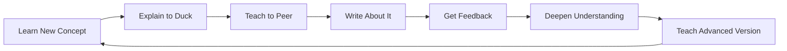

# Chapter 12: Teaching & Knowledge Transfer

> **Prerequisites:** [Chapter 2: Practice, Mindset & Performance](./ch-02-practice-mindset.md), [Chapter 4: Pomodoro, Interleaving & Feynman](./ch-04-pomodoro-interleaving-feynman.md)
> **Next:** [Chapter 14: Social Learning & Communities](./ch-14-social-learning-communities.md)

Teaching is the master key to learning. Every time you explain a concept to someone else — a peer, a rubber duck, a blog audience, a rubber duck — you strengthen your own understanding. This chapter covers the science of the protégé effect, the Feynman technique at scale, technical writing, code review as teaching, building in public, and how to design a sustainable teaching practice that accelerates your learning more than any amount of solo study.

## Learning Objectives

- Explain the protégé effect and why teaching doubles learning efficiency
- Apply the Feynman technique across multiple skill levels
- Write clear technical explanations using structured frameworks
- Use rubber duck debugging and pair programming as teaching tools
- Build in public as a structured learning strategy
- Use code review as a two-way teaching opportunity
- Design a sustainable weekly teaching practice

<!-- Image Gallery -->
<div style="display:flex;flex-wrap:wrap;gap:4px;margin:16px 0;padding:12px;background:#f8fafc;border-radius:8px;border:1px solid #e2e8f0;">
<a href="../../../assets/images/lessons/learning-how-to-learn/ch-12-teaching-knowledge-transfer/hero.svg" target="_blank" rel="noopener">
  
</a>
<a href="../../../assets/images/lessons/learning-how-to-learn/ch-12-teaching-knowledge-transfer/handwritten-notes.svg" target="_blank" rel="noopener">
  
</a>
<a href="../../../assets/images/lessons/learning-how-to-learn/ch-12-teaching-knowledge-transfer/sticky-notes.svg" target="_blank" rel="noopener">
  
</a>
<a href="../../../assets/images/lessons/learning-how-to-learn/ch-12-teaching-knowledge-transfer/visual-explanation.svg" target="_blank" rel="noopener">
  
</a>
<a href="../../../assets/images/lessons/learning-how-to-learn/ch-12-teaching-knowledge-transfer/architecture.svg" target="_blank" rel="noopener">
  
</a>
<a href="../../../assets/images/lessons/learning-how-to-learn/ch-12-teaching-knowledge-transfer/workflow.svg" target="_blank" rel="noopener">
  
</a>
<a href="../../../assets/images/lessons/learning-how-to-learn/ch-12-teaching-knowledge-transfer/mindmap.svg" target="_blank" rel="noopener">
  
</a>
<a href="../../../assets/images/lessons/learning-how-to-learn/ch-12-teaching-knowledge-transfer/comparison.svg" target="_blank" rel="noopener">
  
</a>
<a href="../../../assets/images/lessons/learning-how-to-learn/ch-12-teaching-knowledge-transfer/cheatsheet.svg" target="_blank" rel="noopener">
  
</a>
<a href="../../../assets/images/lessons/learning-how-to-learn/ch-12-teaching-knowledge-transfer/interview-quiz.svg" target="_blank" rel="noopener">
  
</a>
<a href="../../../assets/images/lessons/learning-how-to-learn/ch-12-teaching-knowledge-transfer/social-card.svg" target="_blank" rel="noopener">
  
</a>
</div>
<!-- End Image Gallery -->


### Chapter at a Glance

<a href="../../../assets/images/diagrams/learning-how-to-learn/ch-12-teaching-knowledge-transfer/chapter-at-a-glance-handwritten.svg" target="_blank" rel="noopener">
  
</a>
<a href="../../../assets/images/diagrams/learning-how-to-learn/ch-12-teaching-knowledge-transfer/chapter-at-a-glance-diagram.svg" target="_blank" rel="noopener">
  
</a>
<a href="../../../assets/images/diagrams/learning-how-to-learn/ch-12-teaching-knowledge-transfer/chapter-at-a-glance-sticky.svg" target="_blank" rel="noopener">
  
</a>


| Topic | Key Insight | Practical Takeaway |
|-------|-------------|-------------------|
| Protégé Effect | Teaching forces active recall and gap detection | Teach one concept daily to solidify learning |
| Feynman Technique | "If you can't explain it simply, you don't understand it" | Explain at 3 levels: child, peer, expert |
| Rubber Duck Debugging | Verbalizing code reveals assumptions | Talk through logic aloud before asking for help |
| Code Review as Teaching | Reviewing code teaches patterns to both parties | Review 1 PR per day, write explanatory comments |
| Building in Public | Public accountability compounds learning | Write 1 technical post per week |
| Technical Writing | Writing forces precise thinking | Use the BLUF framework for every explanation |



---

### Q1: Why does teaching accelerate your own learning more than studying?

<a href="../../../assets/images/diagrams/learning-how-to-learn/ch-12-teaching-knowledge-transfer/why-does-teaching-accelerate-your-own-learning-more-than-studying-handwritten.svg" target="_blank" rel="noopener">
  
</a>
<a href="../../../assets/images/diagrams/learning-how-to-learn/ch-12-teaching-knowledge-transfer/why-does-teaching-accelerate-your-own-learning-more-than-studying-diagram.svg" target="_blank" rel="noopener">
  
</a>
<a href="../../../assets/images/diagrams/learning-how-to-learn/ch-12-teaching-knowledge-transfer/why-does-teaching-accelerate-your-own-learning-more-than-studying-sticky.svg" target="_blank" rel="noopener">
  
</a>


**Answer:** The **protégé effect** is a psychological phenomenon where teaching someone else — or even expecting to teach — improves your own learning more than studying for yourself. Multiple studies show that students who study material expecting to teach it recall more and understand it more deeply than those studying for a test.

```typescript
interface TeachingSession {
  topic: string;
  audience: 'self' | 'peer' | 'junior' | 'public';
  duration: number; // minutes
  preparationTime: number;
  recallRate: number; // % retained after 1 week
}

class ProtegeEffectSimulator {
  simulateLearningOutcome(
    studyApproach: 'self-test' | 'teach-prep' | 'teach-execute',
    topicComplexity: number
  ): TeachingSession {
    const baseRecall = 0.3; // baseline retention after 1 week

    switch (studyApproach) {
      case 'self-test': {
        // Self-testing improves recall significantly
        const recall = Math.min(0.7, baseRecall + 0.3);
        return {
          topic: 'any',
          audience: 'self',
          duration: 30,
          preparationTime: 0,
          recallRate: recall,
        };
      }
      case 'teach-prep': {
        // Just EXPECTING to teach improves encoding
        const recall = Math.min(0.75, baseRecall + 0.4);
        return {
          topic: 'any',
          audience: 'peer',
          duration: 30,
          preparationTime: 15,
          recallRate: recall,
        };
      }
      case 'teach-execute': {
        // Actually teaching provides the strongest retention
        const recall = Math.min(0.9, baseRecall + 0.55);
        return {
          topic: 'any',
          audience: 'junior',
          duration: 45,
          preparationTime: 20,
          recallRate: recall,
        };
      }
    }
  }

  // The mechanism behind the protégé effect
  explainMechanism(): string[] {
    return [
      '1. Active recall: Teaching forces you to retrieve knowledge rather than recognize it',
      '2. Gap detection: You discover what you don\'t know when you try to explain it',
      '3. Reorganization: Teaching requires restructuring knowledge into a logical narrative',
      '4. Elaboration: You generate examples, analogies, and connections',
      '5. Metacognition: You monitor your own understanding through the listener\'s questions',
      '6. Social pressure: The expectation of teaching increases motivation and focus',
    ];
  }
}
```

**Try This:** This week, study two different topics. For topic A, study normally (read, review, self-test). For topic B, study with the intention of teaching it to a friend (even if you never actually teach). After 7 days, test yourself on both topics. Topic B will almost always score higher.

**One-Sentence Takeaway:** The protégé effect means the best way to learn something is to prepare to teach it — the expectation of teaching changes how your brain encodes the material.

---

### Q2: How do you apply the Feynman technique at scale?

<a href="../../../assets/images/diagrams/learning-how-to-learn/ch-12-teaching-knowledge-transfer/how-do-you-apply-the-feynman-technique-at-scale-handwritten.svg" target="_blank" rel="noopener">
  
</a>
<a href="../../../assets/images/diagrams/learning-how-to-learn/ch-12-teaching-knowledge-transfer/how-do-you-apply-the-feynman-technique-at-scale-diagram.svg" target="_blank" rel="noopener">
  
</a>
<a href="../../../assets/images/diagrams/learning-how-to-learn/ch-12-teaching-knowledge-transfer/how-do-you-apply-the-feynman-technique-at-scale-sticky.svg" target="_blank" rel="noopener">
  
</a>


**Answer:** The Feynman technique has four steps, but you can scale it across different audiences and topics. The key insight is that you need to explain at three levels of abstraction.

```typescript
interface FeynmanLevel {
  audience: string;
  vocabulary: 'everyday' | 'technical' | 'expert';
  allowedComplexity: number; // 1-10
  expectedTime: string;
}

class FeynmanTechnique {
  private levels: FeynmanLevel[] = [
    { audience: 'Child (age 10)', vocabulary: 'everyday', allowedComplexity: 2, expectedTime: '2 min' },
    { audience: 'Peer developer', vocabulary: 'technical', allowedComplexity: 6, expectedTime: '5 min' },
    { audience: 'Domain expert', vocabulary: 'expert', allowedComplexity: 9, expectedTime: '10 min' },
  ];

  evaluateExplanation(concept: string, explanation: string): {
    gaps: string[];
    jargonUsed: string[];
    missingAnalogies: string[];
    score: number;
  } {
    const gaps: string[] = [];
    const jargonUsed: string[] = [];
    const missingAnalogies: string[] = [];

    // Detect jargon that wasn't explained
    const jargonPatterns = [
      'algorithm', 'polynomial', 'recursive', 'asymptotic',
      'encapsulation', 'polymorphism', 'inheritance',
      'normalization', 'transaction', 'index',
      'callback', 'promise', 'closure', 'memoization',
    ];

    jargonPatterns.forEach(jargon => {
      if (explanation.toLowerCase().includes(jargon)) {
        jargonUsed.push(jargon);
      }
    });

    // Detect missing analogies — look for explanatory structure
    if (!explanation.includes('like') && !explanation.includes('is similar to')) {
      missingAnalogies.push('No real-world analogy found — analogies bridge new concepts to existing mental models');
    }

    // Detect unsubstantiated claims
    if (explanation.includes('obviously') || explanation.includes('clearly') || explanation.includes('simply')) {
      gaps.push('Used "obviously/clearly/simply" — this signals an explanation gap for your audience');
    }

    return {
      gaps,
      jargonUsed,
      missingAnalogies,
      score: Math.max(0, 100 - gaps.length * 15 - jargonUsed.length * 5 - missingAnalogies.length * 10),
    };
  }

  // The three-level Feynman exercise
  threeLevelExplain(concept: string): string[] {
    return [
      `## Level 1: Explain to a Child (age 10)`,
      `- Use only everyday language`,
      `- Start with an analogy from everyday life`,
      `- Max 3 sentences`,
      `- No jargon at all`,
      ``,
      `## Level 2: Explain to a Peer Developer`,
      `- Use technical terms but define each one`,
      `- Include a TypeScript code example`,
      `- Mention tradeoffs or alternatives`,
      `- Max 1 paragraph + 1 code block`,
      ``,
      `## Level 3: Explain to a Domain Expert`,
      `- Use full technical vocabulary`,
      `- Include edge cases and failure modes`,
      `- Reference known patterns or papers`,
      `- Focus on nuance, not fundamentals`,
    ];
  }
}
```

**Practical Feynman workflow:**

| Step | Action | Time |
|------|--------|------|
| 1 | Write the concept name at the top of a blank page | 10 seconds |
| 2 | Explain it as if to a 10-year-old (no jargon, use analogies) | 5 minutes |
| 3 | Identify where you got stuck or vague | 2 minutes |
| 4 | Go back to source material for those gaps | 10-20 minutes |
| 5 | Repeat step 2 until the child-level explanation flows | 5-10 minutes |
| 6 | Now explain at the peer level (add technical detail) | 5 minutes |
| 7 | Finally, explain at the expert level (nuance, edge cases) | 5 minutes |

**Try This:** Pick a concept from a DSA course (e.g., dynamic programming). Write out all three levels of explanation on paper. For the child level, use a restaurant-ordering analogy. For the peer level, include a TypeScript recursion example. For the expert level, discuss memoization vs tabulation tradeoffs.

**One-Sentence Takeaway:** The Feynman technique isn't one explanation — it's three: child (analogy), peer (code), expert (nuance) — and each level reveals different gaps in your understanding.

---

### Q3: How does rubber duck debugging work as a teaching tool?

<a href="../../../assets/images/diagrams/learning-how-to-learn/ch-12-teaching-knowledge-transfer/how-does-rubber-duck-debugging-work-as-a-teaching-tool-handwritten.svg" target="_blank" rel="noopener">
  
</a>
<a href="../../../assets/images/diagrams/learning-how-to-learn/ch-12-teaching-knowledge-transfer/how-does-rubber-duck-debugging-work-as-a-teaching-tool-diagram.svg" target="_blank" rel="noopener">
  
</a>
<a href="../../../assets/images/diagrams/learning-how-to-learn/ch-12-teaching-knowledge-transfer/how-does-rubber-duck-debugging-work-as-a-teaching-tool-sticky.svg" target="_blank" rel="noopener">
  
</a>


**Answer:** Rubber duck debugging is the practice of explaining your code line-by-line to an inanimate object (traditionally a rubber duck). The act of verbalizing forces you to slow down, articulate assumptions, and often spot the bug yourself before the duck "responds."

```typescript
interface CodeBlock {
  file: string;
  lines: string[];
  purpose: string;
}

class RubberDuckSession {
  private code: CodeBlock;
  private revealedAssumptions: string[] = [];
  private foundBugs: string[] = [];
  private understandingGaps: string[] = [];

  constructor(code: CodeBlock) {
    this.code = code;
  }

  // Simulates walking through code line by line
  walkThrough(): {
    bugsFound: string[];
    assumptionsRevealed: string[];
    gapsIdentified: string[];
  } {
    this.code.lines.forEach((line, index) => {
      console.log(`Line ${index + 1}: ${line}`);

      // Pattern 1: Conditional without else
      if (line.includes('if') && !line.includes('else')) {
        this.revealedAssumptions.push(
          `Line ${index + 1}: You assume the if-condition is the only path — what happens otherwise?`
        );
      }

      // Pattern 2: Method calls with no null check
      if (line.includes('.') && !line.includes('?.') && !line.includes('if')) {
        this.revealedAssumptions.push(
          `Line ${index + 1}: You assume the object before '${line.trim().split('.')[0]}' exists`
        );
      }

      // Pattern 3: Magic numbers
      if (/\b\d{2,}\b/.test(line) && !line.includes('const') && !line.includes('let')) {
        this.revealedAssumptions.push(
          `Line ${index + 1}: What does ${line.match(/\b\d{2,}\b/)?.[0]} represent? This is a magic number.`
        );
      }

      // Pattern 4: Empty catch blocks
      if (line.includes('catch') && line.includes('{}')) {
        this.revealedAssumptions.push(
          `Line ${index + 1}: Empty catch block swallows errors — you assume this never fails`
        );
      }
    });

    return {
      bugsFound: this.foundBugs,
      assumptionsRevealed: this.revealedAssumptions,
      gapsIdentified: this.understandingGaps,
    };
  }

  // After the duck session, identify patterns for future learning
  getLearningRecommendations(): string[] {
    const recommendations: string[] = [];

    if (this.revealedAssumptions.some(a => a.includes('null'))) {
      recommendations.push('Study: Optional chaining, null-safety patterns in TypeScript');
    }
    if (this.revealedAssumptions.some(a => a.includes('catch') || a.includes('error'))) {
      recommendations.push('Study: Error handling patterns, Result types, Either monad');
    }
    if (this.revealedAssumptions.some(a => a.includes('magic number'))) {
      recommendations.push('Study: Named constants, configuration management');
    }

    return recommendations;
  }
}
```

**The four-step duck debugging protocol:**

| Step | Action | Why |
|------|--------|-----|
| 1 | Get a physical object (duck, action figure, plant) | The physical object creates a real "teaching" context |
| 2 | Place it next to your keyboard | Visual reminder to verbalize, not just think |
| 3 | Explain each line aloud: "This line does X because Y" | Verbalizing uses different neural pathways than silent reading |
| 4 | When you find the bug, explain why it's wrong | Ensures you understand the root cause, not just the symptom |

**Try This:** The next time you're debugging, place an object next to your keyboard and explain your code aloud line by line. Count how many bugs you find yourself vs how many you needed to look up. Most developers find 50-70% of their own bugs this way.

**One-Sentence Takeaway:** Rubber duck debugging transforms silent reading into active teaching — verbalizing assumptions reveals gaps that silent thinking hides.

---

### Q4: How can pair programming accelerate learning?

<a href="../../../assets/images/diagrams/learning-how-to-learn/ch-12-teaching-knowledge-transfer/how-can-pair-programming-accelerate-learning-handwritten.svg" target="_blank" rel="noopener">
  
</a>
<a href="../../../assets/images/diagrams/learning-how-to-learn/ch-12-teaching-knowledge-transfer/how-can-pair-programming-accelerate-learning-diagram.svg" target="_blank" rel="noopener">
  
</a>
<a href="../../../assets/images/diagrams/learning-how-to-learn/ch-12-teaching-knowledge-transfer/how-can-pair-programming-accelerate-learning-sticky.svg" target="_blank" rel="noopener">
  
</a>


**Answer:** Pair programming creates a continuous teaching loop. Two roles rotate: the **driver** writes code, the **navigator** reviews each line in real time. The navigator is effectively teaching the driver by catching mistakes and suggesting approaches, while the driver teaches the navigator by explaining their reasoning.

```typescript
interface PairProgrammingSession {
  driver: string;
  navigator: string;
  duration: number; // minutes
  role: 'driver' | 'navigator';
  skillLevel: number; // 1-10
}

class PairProgrammingLearning {
  private sessions: PairProgrammingSession[] = [];
  private skillsLearned: Set<string> = new Set();

  runSession(
    yourRole: 'driver' | 'navigator',
    partnerSkill: number,
    topic: string
  ): string[] {
    const learningOutcomes: string[] = [];

    if (yourRole === 'navigator') {
      // As navigator, you teach by reviewing and suggesting
      // This forces you to articulate your reasoning
      learningOutcomes.push(
        'As navigator: You explained tradeoffs between approaches',
        'As navigator: You caught edge cases the driver missed',
        'As navigator: You practiced communicating feedback clearly',
      );

      // If teaching a less experienced partner, you solidify fundamentals
      if (partnerSkill < 5) {
        learningOutcomes.push(
          'Teaching a junior: Simplified complex concepts → deepened your own understanding',
          'Teaching a junior: Had to break down assumptions → revealed your own gaps',
        );
      }
    } else {
      // As driver, you teach by explaining your approach
      learningOutcomes.push(
        'As driver: You verbalized your reasoning for each decision',
        'As driver: You received immediate feedback on your approach',
      );

      // If learning from a more experienced partner
      if (partnerSkill > 7) {
        learningOutcomes.push(
          'Learning from expert: Observed advanced patterns you wouldn\'t find alone',
          'Learning from expert: Received targeted feedback on weak areas',
        );
      }
    }

    this.skillsLearned.add(topic);
    return learningOutcomes;
  }

  // Recommended rotation pattern
  getRotationSchedule(totalHours: number): string[] {
    const slots = Math.floor(totalHours / 0.5); // 30-min rotations
    const schedule: string[] = [];

    for (let i = 0; i < slots; i++) {
      const role = i % 2 === 0 ? 'driver' : 'navigator';
      schedule.push(`Slot ${i + 1}: ${role} (30 min)`);

      if ((i + 1) % 4 === 0) {
        schedule.push('   → 10 min break (consolidation)');
      }
    }

    return schedule;
  }

  getRetentionComparison(): string {
    return `
Retention rates after 1 week:
- Solo coding:       25-40% (depends on active recall practice)
- Pair programming:  60-75% (immediate teaching feedback loop)
- Navigator role:    65-80% (continuous code review)
- Driver role:       55-70% (real-time verbalization)
- Both roles:        70-85% (full teaching cycle)`;
  }
}
```

**Learning-maximizing pair programming rules:**

| Rule | Why |
|------|-----|
| Rotate roles every 30 minutes | Both roles teach different skills; prolonged driver fatigue reduces learning |
| Explain EVERY non-obvious line | If the navigator doesn't understand, the driver hasn't truly learned |
| Navigators ask "why" before "what" | Understanding intent is more valuable than catching typos |
| Debrief for 5 minutes after each session | Consolidate what each person learned |
| Pair across skill levels | Both benefit: junior learns patterns, senior solidifies fundamentals by teaching |

**Try This:** Find a study partner. Pair on a DSA problem for 45 minutes (22 min driver, 22 min navigator, 1 min switch). The driver explains every line. The navigator asks "why" before pointing out mistakes. Debrief for 5 minutes.

**One-Sentence Takeaway:** Pair programming creates a real-time teaching loop where both roles learn — driving forces verbalization, navigating forces evaluation, and rotating maximizes both.

---

### Q5: How does building in public accelerate learning?

<a href="../../../assets/images/diagrams/learning-how-to-learn/ch-12-teaching-knowledge-transfer/how-does-building-in-public-accelerate-learning-handwritten.svg" target="_blank" rel="noopener">
  
</a>
<a href="../../../assets/images/diagrams/learning-how-to-learn/ch-12-teaching-knowledge-transfer/how-does-building-in-public-accelerate-learning-diagram.svg" target="_blank" rel="noopener">
  
</a>
<a href="../../../assets/images/diagrams/learning-how-to-learn/ch-12-teaching-knowledge-transfer/how-does-building-in-public-accelerate-learning-sticky.svg" target="_blank" rel="noopener">
  
</a>


**Answer:** Building in public — sharing your learning journey through blog posts, social media, open-source contributions, or documentation — creates a powerful learning flywheel. The public commitment forces deeper understanding, and the feedback loop compounds your learning.

```typescript
interface PublicLearningPost {
  title: string;
  format: 'tutorial' | 'case-study' | 'explanation' | 'retrospective';
  topic: string;
  publishDate: Date;
  words: number;
  engagement: {
    comments: number;
    corrections: number; // valuable — they reveal gaps
    shares: number;
  };
  learningOutcomes: string[];
}

class BuildInPublicEngine {
  private posts: PublicLearningPost[] = [];

  planPost(topic: string, format: PublicLearningPost['format']): string[] {
    // The planning process itself forces structured thinking
    const plan: string[] = [];

    switch (format) {
      case 'tutorial':
        plan.push(
          '## Tutorial Structure',
          '1. Prerequisites: What must the reader already know?',
          '2. Problem statement: What are we building and why?',
          '3. Step-by-step implementation with code blocks',
          '4. Common pitfalls and how to avoid them',
          '5. Complete working example at the end',
          '6. Exercises for the reader',
          '',
          '## Teaching Effect',
          'Writing a tutorial forces you to understand each step deeply',
          '— if you can\'t explain WHY a step matters, you don\'t know it yet.',
        );
        break;

      case 'case-study':
        plan.push(
          '## Case Study Structure',
          '1. Context: What problem were you solving?',
          '2. Approach: What did you try first? Why?',
          '3. What went wrong (this is the most valuable part)',
          '4. What worked instead and why',
          '5. Key takeaways and actionable advice',
          '',
          '## Teaching Effect',
          'Case studies teach by narrative — readers learn from your mistakes',
          'without making them. Writing one forces you to analyze WHY something failed.',
        );
        break;

      case 'explanation':
        plan.push(
          '## Explanation Structure',
          '1. What is this concept? (TL;DR in one sentence)',
          '2. Why does it matter? (real-world motivation)',
          '3. How it works (with analogy)',
          '4. Code example (minimal, runnable)',
          '5. Deeper dive (edge cases, tradeoffs)',
          '6. Related concepts',
          '',
          '## Teaching Effect',
          'Explanations are the Feynman technique at scale',
          '— if you can\'t make it clear to strangers, your understanding has gaps.',
        );
        break;
    }

    return plan;
  }

  logPost(post: PublicLearningPost): void {
    this.posts.push(post);
  }

  analyzeLearningVelocity(): string {
    if (this.posts.length < 2) {
      return 'Publish at least 2 posts to measure learning velocity.';
    }

    const topics = new Set(this.posts.map(p => p.topic));
    const corrections = this.posts.reduce((s, p) => s + p.engagement.corrections, 0);

    return `
📊 Learning Velocity Report
━━━━━━━━━━━━━━━━━━━━━━━━━━━━━━━━━━━━
Posts published: ${this.posts.length}
Unique topics covered: ${topics.size}
Corrections received: ${corrections}
  (Each correction is a gap you filled)
━━━━━━━━━━━━━━━━━━━━━━━━━━━━━━━━━━━━
Learning is not linear — each post compounds on previous ones.`;
  }
}
```

**Weekly build-in-public rhythm:**

| Day | Activity | Time |
|-----|----------|------|
| Monday | Learn something new | 45 min |
| Tuesday | Write a draft explanation | 30 min |
| Wednesday | Add code examples, test them | 30 min |
| Thursday | Review draft for gaps (Feynman check) | 15 min |
| Friday | Publish and share | 10 min |
| Weekend | Engage with comments and corrections | 20 min |

**Try This:** Pick a concept you learned this week. Write a 300-word explanation of it as if teaching a peer. Include one TypeScript code example. Publish it somewhere — a blog, a tweet thread, a LinkedIn post, or a GitHub Gist. Set a goal of one post per week for 4 weeks.

**One-Sentence Takeaway:** Building in public creates a learning flywheel — publishing forces deep understanding, corrections fill your gaps, and each post compounds on the previous one.

---

### Q6: How can code review function as a teaching tool?

<a href="../../../assets/images/diagrams/learning-how-to-learn/ch-12-teaching-knowledge-transfer/how-can-code-review-function-as-a-teaching-tool-handwritten.svg" target="_blank" rel="noopener">
  
</a>
<a href="../../../assets/images/diagrams/learning-how-to-learn/ch-12-teaching-knowledge-transfer/how-can-code-review-function-as-a-teaching-tool-diagram.svg" target="_blank" rel="noopener">
  
</a>
<a href="../../../assets/images/diagrams/learning-how-to-learn/ch-12-teaching-knowledge-transfer/how-can-code-review-function-as-a-teaching-tool-sticky.svg" target="_blank" rel="noopener">
  
</a>


**Answer:** Code review is one of the most underrated teaching opportunities in software engineering. Both the author and the reviewer learn: the author receives targeted feedback on their blind spots, and the reviewer must understand the code deeply enough to evaluate it.

```typescript
interface ReviewComment {
  line: number;
  type: 'teaching' | 'nitpick' | 'critical';
  content: string;
  learningMoment: string; // What the author should learn from this
}

class CodeReviewAsTeaching {
  private reviews: ReviewComment[] = [];

  // Teaching-oriented review: explain WHY, not just WHAT
  reviewForLearning(code: string, authorLevel: 'junior' | 'mid' | 'senior'): ReviewComment[] {
    const comments: ReviewComment[] = [];

    // Instead of just saying "fix this", explain the pattern
    if (code.includes('var ')) {
      comments.push({
        line: this.findLine(code, 'var '),
        type: 'teaching',
        content: 'Use const/let instead of var. `var` has function scoping which can cause subtle bugs — const is block-scoped and communicates intent. This is a common interview topic.',
        learningMoment: 'Variable scoping rules (var vs let vs const)',
      });
    }

    if (code.includes('==') && !code.includes('===')) {
      comments.push({
        line: this.findLine(code, '=='),
        type: 'teaching',
        content: 'Use === instead of ==. `==` performs type coercion which can lead to unexpected results (e.g., 0 == false is true). === checks both value AND type.',
        learningMoment: 'Type coercion and strict equality',
      });
    }

    // For junior devs, include more explanatory comments
    if (authorLevel === 'junior') {
      comments.forEach(c => {
        if (c.type === 'teaching') {
          c.content += '\n\n💡 Learning resource: [link to relevant documentation]';
        }
      });
    }

    // For senior devs, focus on architecture and tradeoffs
    if (authorLevel === 'senior') {
      comments.push({
        line: 0,
        type: 'teaching',
        content: 'Consider the scalability of this approach — what happens when data grows 100x? What\'s the performance envelope?',
        learningMoment: 'Architectural thinking and scalability analysis',
      });
    }

    this.reviews.push(...comments);
    return comments;
  }

  // For the reviewer: review as a learning tool
  reviewerLearningOutcomes(): string[] {
    return [
      '1. Reading others\' code exposes you to patterns you haven\'t seen',
      '2. Explaining WHY something is wrong forces you to articulate principles',
      '3. Reviewing diverse codebases broadens your experience faster than writing your own',
      '4. Junior code forces you to question assumptions you\'ve internalized',
      '5. Giving teaching-oriented reviews builds your communication skills',
    ];
  }

  private findLine(code: string, pattern: string): number {
    const lines = code.split('\n');
    return lines.findIndex(l => l.includes(pattern)) + 1;
  }
}
```

**Two-way learning from code review:**

| What the Author Learns | What the Reviewer Learns |
|------------------------|-------------------------|
| Their specific blind spots (e.g., always forgetting null checks) | Different approaches to the same problem |
| Why certain patterns are preferred over others | Must evaluate tradeoffs to give good feedback |
| How to communicate intent more clearly | New patterns from the author's code |
| Production-readiness standards | How to give constructive, actionable feedback |

**Try This:** This week, review one PR or piece of code written by someone else. For every comment, add a "why" explanation: "You should use X instead of Y because Z." Don't just point out issues — teach the reason behind the fix.

**One-Sentence Takeaway:** Code review is bidirectional teaching — the reviewer learns patterns from reading code, the author learns principles from receiving explanations of why something should change.

---

### Q7: How do study groups accelerate learning?

<a href="../../../assets/images/diagrams/learning-how-to-learn/ch-12-teaching-knowledge-transfer/how-do-study-groups-accelerate-learning-handwritten.svg" target="_blank" rel="noopener">
  
</a>
<a href="../../../assets/images/diagrams/learning-how-to-learn/ch-12-teaching-knowledge-transfer/how-do-study-groups-accelerate-learning-diagram.svg" target="_blank" rel="noopener">
  
</a>
<a href="../../../assets/images/diagrams/learning-how-to-learn/ch-12-teaching-knowledge-transfer/how-do-study-groups-accelerate-learning-sticky.svg" target="_blank" rel="noopener">
  
</a>


**Answer:** Study groups create a structured teaching environment where each member teaches the others. The person explaining learns the most, but even listeners benefit from hearing multiple explanations of the same concept.

```typescript
interface StudyGroupMember {
  name: string;
  strengths: string[];
  teachingTopics: string[];
  sessionsAttended: number;
}

interface StudyGroupSession {
  date: Date;
  topic: string;
  teacher: string;
  attendees: string[];
  effectiveness: number; // 1-10
}

class StudyGroupOrchestrator {
  private members: StudyGroupMember[] = [];
  private sessions: StudyGroupSession[] = [];

  addMember(member: StudyGroupMember): void {
    this.members.push(member);
  }

  // The golden rule: each member teaches one topic per cycle
  assignTopicsForCycle(cycleTopics: string[]): Map<string, string> {
    const assignments = new Map<string, string>();

    for (let i = 0; i < cycleTopics.length; i++) {
      // Assign topic to the member with the most relevant strength
      const member = this.members
        .filter(m => !assignments.has(m.name))
        .sort((a, b) => {
          const aScore = a.strengths.filter(s =>
            cycleTopics[i].toLowerCase().includes(s.toLowerCase())
          ).length;
          const bScore = b.strengths.filter(s =>
            cycleTopics[i].toLowerCase().includes(s.toLowerCase())
          ).length;
          return bScore - aScore;
        })[0];

      if (member) {
        assignments.set(cycleTopics[i], member.name);
      }
    }

    return assignments;
  }

  runSession(topic: string, teacher: StudyGroupMember): StudyGroupSession {
    // The teacher learns the most from teaching
    teacher.teachingTopics.push(topic);

    const session: StudyGroupSession = {
      date: new Date(),
      topic,
      teacher: teacher.name,
      attendees: this.members.filter(m => m.name !== teacher.name).map(m => m.name),
      effectiveness: 7 + Math.floor(Math.random() * 3), // 7-10
    };

    this.sessions.push(session);
    return session;
  }

  analyzeLearningDistribution(): string {
    const teachingCounts = new Map<string, number>();
    this.sessions.forEach(s => {
      teachingCounts.set(s.teacher, (teachingCounts.get(s.teacher) || 0) + 1);
    });

    const mostActive = [...teachingCounts.entries()]
      .sort((a, b) => b[1] - a[1]);

    return `
📚 Study Group Analysis
━━━━━━━━━━━━━━━━━━━━━━━━━━━━━━━━━━━━━━━━
Total sessions: ${this.sessions.length}
Most active teacher: ${mostActive[0]?.[0] || 'N/A'} (${mostActive[0]?.[1] || 0} sessions)

⚠️ The person who teaches the most learns the most.
If distribution is uneven, the quiet members learn LESS.
Rotate teaching responsibilities every cycle.`;
  }
}
```

**Study group best practices:**

| Practice | Why |
|----------|-----|
| Max 5 members per group | Larger groups reduce individual teaching time |
| Each member teaches one topic per cycle | The teacher always learns the most |
| Rotate topics so everyone teaches | Prevents passive learning by quiet members |
| 30 min teaching + 15 min Q&A per session | Balance between instruction and active processing |
| Record sessions for absent members | Maintains continuity without penalizing attendance |
| End with each person writing a one-paragraph summary | Forces individual active recall after group learning |

**Try This:** Form a study group of 3-5 people (peers, colleagues, or online study partners). Each person picks a topic to teach for 20 minutes. After each teaching session, everyone writes a 3-sentence summary from memory. After 4 weeks, compare notes on what each person retained.

**One-Sentence Takeaway:** In study groups, the person teaching learns the most — rotate topics so every member gets maximum teaching time per cycle.

---

### Q8: How do you write effective technical explanations?

<a href="../../../assets/images/diagrams/learning-how-to-learn/ch-12-teaching-knowledge-transfer/how-do-you-write-effective-technical-explanations-handwritten.svg" target="_blank" rel="noopener">
  
</a>
<a href="../../../assets/images/diagrams/learning-how-to-learn/ch-12-teaching-knowledge-transfer/how-do-you-write-effective-technical-explanations-diagram.svg" target="_blank" rel="noopener">
  
</a>
<a href="../../../assets/images/diagrams/learning-how-to-learn/ch-12-teaching-knowledge-transfer/how-do-you-write-effective-technical-explanations-sticky.svg" target="_blank" rel="noopener">
  
</a>


**Answer:** Technical writing is a superpower for learning. The act of writing forces you to organize thoughts sequentially, fill logical gaps, and articulate assumptions. The best technical explanations follow the BLUF framework: Bottom Line Up Front.

```typescript
interface TechnicalExplanation {
  topic: string;
  summary: string; // BLUF — one sentence
  prerequisites: string[];
  analogy: string; // Bridge from known to unknown
  body: string[];
  codeExample: string;
  commonMistakes: string[];
  summary_reprise: string;
}

class TechnicalWriter {
  write(config: {
    topic: string;
    audience: string;
    format: 'tutorial' | 'reference' | 'deep-dive';
  }): TechnicalExplanation {
    // BLUF: start with the bottom line
    const summary = `${config.topic}: [One-sentence explanation of what it is and why it matters].`;

    // Analogy: bridge from known to unknown
    const analogy = `${config.topic} is like [everyday concept] because [structural similarity].`;

    // Body: structured progression
    const body = [
      '## How It Works',
      '1. [Fundamental concept — what IS this?]',
      '2. [Mechanism — how does it work step by step?]',
      '3. [Example — show it in action]',
      '4. [Edge cases — what are the boundaries?]',
      '5. [Tradeoffs — when NOT to use it]',
    ];

    // Code example
    const codeExample = `
\`\`\`typescript
// ${config.topic} — minimal working example
// Readers should be able to copy, paste, and run this
function demonstrate${config.topic.replace(/\s+/g, '')}(): string {
  return "Hello from ${config.topic}";
}
\`\`\``;

    return {
      topic: config.topic,
      summary,
      prerequisites: ['List what the reader must already know'],
      analogy,
      body,
      codeExample,
      commonMistakes: [
        'Mistake 1: [What beginners usually do wrong]',
        '  → Fix: [What to do instead]',
        'Mistake 2: [Another common error]',
        '  → Fix: [Better approach]',
      ],
      summary_reprise: 'Restate the BLUF in different words to reinforce understanding.',
    };
  }

  // The self-test: evaluate your own writing for clarity
  selfEvaluate(explanation: string): string[] {
    const issues: string[] = [];

    if (explanation.split(' ').length > 5 && !explanation.includes('\n')) {
      issues.push('First paragraph is too dense — break it into smaller sections');
    }

    const sentenceLengths = explanation.split(/[.!?]+/).map(s => s.split(' ').length);
    const avgSentenceLength = sentenceLengths.reduce((a, b) => a + b, 0) / sentenceLengths.length;

    if (avgSentenceLength > 25) {
      issues.push(`Average sentence length ${Math.round(avgSentenceLength)} words — aim for under 20`);
    }

    const weakWords = ['very', 'really', 'quite', 'basically', 'actually', 'essentially'];
    weakWords.forEach(w => {
      if (explanation.toLowerCase().includes(w)) {
        issues.push(`Weak filler word: "${w}" — be precise or remove it`);
      }
    });

    return issues;
  }
}
```

**The BLUF writing workflow:**

| Step | Action | Time |
|------|--------|------|
| 1 | Write the one-sentence bottom line | 2 min |
| 2 | List prerequisites (what must the reader know?) | 3 min |
| 3 | Brainstorm an analogy that bridges known → unknown | 5 min |
| 4 | Write the body in progressive detail | 20-30 min |
| 5 | Add a minimal, runnable code example | 10 min |
| 6 | List common mistakes (these come from YOUR mistakes) | 5 min |
| 7 | Restate the bottom line in different words | 2 min |
| 8 | Self-evaluate: check sentence length, weak words, density | 5 min |

**Try This:** Pick a concept you learned this week. Write a BLUF explanation for it in 4 sections: (1) one-sentence summary, (2) analogy, (3) 3-paragraph body with code example, (4) common mistakes. Then ask a peer to read it and tell you where they got confused.

**One-Sentence Takeaway:** Technical writing forces structured thinking — BLUF (bottom line first), analogy, progressive detail, and common mistakes create explanations that teach both the reader and the writer.

---

### Q9: How can mentoring accelerate your learning?

<a href="../../../assets/images/diagrams/learning-how-to-learn/ch-12-teaching-knowledge-transfer/how-can-mentoring-accelerate-your-learning-handwritten.svg" target="_blank" rel="noopener">
  
</a>
<a href="../../../assets/images/diagrams/learning-how-to-learn/ch-12-teaching-knowledge-transfer/how-can-mentoring-accelerate-your-learning-diagram.svg" target="_blank" rel="noopener">
  
</a>
<a href="../../../assets/images/diagrams/learning-how-to-learn/ch-12-teaching-knowledge-transfer/how-can-mentoring-accelerate-your-learning-sticky.svg" target="_blank" rel="noopener">
  
</a>


**Answer:** Mentoring is a force multiplier for learning. The mentor solidifies their knowledge by teaching, and the mentee gains from structured guidance. But the mentor often learns MORE than the mentee.

```typescript
interface MentoringCycle {
  mentorLevel: 'junior-teaching-junior' | 'mid-teaching-junior' | 'senior-teaching-mid';
  sessionType: 'code-review' | 'architecture' | 'career' | 'technical-deep-dive';
  topics: string[];
  mentorLearnings: string[];
  menteeLearnings: string[];
}

class MentoringLearningEngine {
  runSession(
    mentorExperience: number, // years
    menteeExperience: number,
    topic: string
  ): MentoringCycle {
    const mentorLearnings: string[] = [];
    const menteeLearnings: string[] = [];

    // The mentor learns by explaining fundamentals
    if (menteeExperience < 2) {
      mentorLearnings.push(
        'Explaining fundamentals → solidified first-principles understanding',
        'Answering "why" questions → revealed assumptions you didn\'t know you had',
        'Seeing a beginner\'s perspective → fresh insights on familiar problems',
      );
    }

    // The mentor learns by exploring advanced topics
    if (menteeExperience >= 3) {
      mentorLearnings.push(
        'Deep-dive discussions → forced deeper research to stay ahead',
        'Debating tradeoffs → sharpened architectural reasoning',
        'Reviewing mentee\'s code → exposure to different approaches',
      );
    }

    // Universal mentor learning
    mentorLearnings.push(
      'Teaching forces you to organize knowledge into teachable chunks',
      'Regular mentoring sessions require staying current with best practices',
      'Explaining WHY you make decisions improves your own decision-making',
    );

    return {
      mentorLevel: mentorExperience > 5 ? 'senior-teaching-mid' :
                    mentorExperience > 2 ? 'mid-teaching-junior' :
                    'junior-teaching-junior',
      sessionType: 'technical-deep-dive',
      topics: [topic],
      mentorLearnings,
      menteeLearnings: [
        `Learned ${topic} from structured guidance`,
        'Received targeted feedback on blind spots',
        'Built mental models through guided practice',
      ],
    };
  }

  getOptimalMentoringCadence(): string {
    return `
📅 Recommended Mentoring Cadence
━━━━━━━━━━━━━━━━━━━━━━━━━━━━━━━━━━━━━━━━
Weekly (30 min):    Code review + quick questions
Bi-weekly (60 min): Deep-dive on a specific topic
Monthly (90 min):   Architecture review or career discussion
Quarterly:          Retrospective on learning progress
━━━━━━━━━━━━━━━━━━━━━━━━━━━━━━━━━━━━━━━━
The mentor should ALWAYS prepare a structured agenda.
Wandering sessions waste both people's time.`;
  }
}
```

**The mentor's learning checklist:**

After each mentoring session, the mentor should ask:
- What question did I struggle to answer? → That's YOUR knowledge gap
- What assumption did I have to question? → That's YOUR blind spot
- What did the mentee teach ME? → That's YOUR new perspective
- What do I need to research before the next session? → That's YOUR growth area

**Try This:** Find someone with less experience than you and offer to mentor them for 30 minutes per week. Before each session, prepare a 3-point agenda. After each session, write down one thing you learned from the process of teaching.

**One-Sentence Takeaway:** Mentoring is a force multiplier — mentees gain guidance, but mentors gain deeper understanding, fresh perspectives, and the discipline of structured thinking.

---

### Q10: How do you handle questions you can't answer while teaching?

<a href="../../../assets/images/diagrams/learning-how-to-learn/ch-12-teaching-knowledge-transfer/how-do-you-handle-questions-you-can-t-answer-while-teaching-handwritten.svg" target="_blank" rel="noopener">
  
</a>
<a href="../../../assets/images/diagrams/learning-how-to-learn/ch-12-teaching-knowledge-transfer/how-do-you-handle-questions-you-can-t-answer-while-teaching-diagram.svg" target="_blank" rel="noopener">
  
</a>
<a href="../../../assets/images/diagrams/learning-how-to-learn/ch-12-teaching-knowledge-transfer/how-do-you-handle-questions-you-can-t-answer-while-teaching-sticky.svg" target="_blank" rel="noopener">
  
</a>


**Answer:** The moment you can't answer a question is the single best learning opportunity in any teaching session. It reveals a gap in your understanding that you didn't know existed.

```typescript
interface UnknownQuestion {
  question: string;
  context: string;
  whyStumped: 'missing-fundamental' | 'edge-case' | 'outdated-knowledge' | 'never-encountered';
  researchPlan: string[];
  followUpAnswer?: string;
}

class GapRecorder {
  private gaps: UnknownQuestion[] = [];

  encounterUnknown(question: string, context: string): UnknownQuestion {
    const gap: UnknownQuestion = {
      question,
      context,
      whyStumped: this.classifyGap(question),
      researchPlan: this.generateResearchPlan(question),
    };

    this.gaps.push(gap);
    return gap;
  }

  private classifyGap(question: string): UnknownQuestion['whyStumped'] {
    const q = question.toLowerCase();

    if (q.includes('why') && q.includes('work')) {
      return 'missing-fundamental';
    }
    if (q.includes('what if') || q.includes('edge case') || q.includes('boundary')) {
      return 'edge-case';
    }
    if (q.includes('new') || q.includes('latest') || q.includes('version')) {
      return 'outdated-knowledge';
    }
    return 'never-encountered';
  }

  private generateResearchPlan(question: string): string[] {
    const plan = [
      `1. Acknowledge: "That's a great question. I want to give you an accurate answer — let me research it properly."`,
      `2. Research: Search documentation, source code, or experiments`,
      `3. Understand: Work through the answer until you can explain it without notes`,
      `4. Follow up: Send the answer to the person who asked within 24 hours`,
      `5. Add to your notes: This gap is now a permanent part of your knowledge`,
    ];

    if (this.classifyGap(question) === 'missing-fundamental') {
      plan.push('6. Self-study: Revisit the fundamentals of this topic — the gap is foundational');
    }

    return plan;
  }

  analyzeGapPatterns(): string[] {
    const categories = new Map<string, number>();
    this.gaps.forEach(g => {
      categories.set(g.whyStumped, (categories.get(g.whyStumped) || 0) + 1);
    });

    const sorted = [...categories.entries()].sort((a, b) => b[1] - a[1]);
    const topGap = sorted[0];

    const analysis: string[] = [
      `Total unanswered questions logged: ${this.gaps.length}`,
    ];

    if (topGap) {
      analysis.push(
        `Most common gap type: ${topGap[0]} (${topGap[1]} occurrences)`,
        `This suggests you should focus on: ${this.getFocusArea(topGap[0])}`,
      );
    }

    return analysis;
  }

  private getFocusArea(gapType: string): string {
    const foci: Record<string, string> = {
      'missing-fundamental': 'Revisiting core principles and first-principles understanding',
      'edge-case': 'Studying boundary conditions and failure modes',
      'outdated-knowledge': 'Reading recent changelogs, RFCs, and migration guides',
      'never-encountered': 'Broadening experience through diverse projects and codebases',
    };
    return foci[gapType] || 'General knowledge broadening';
  }

  // The follow-up protocol
  async followUp(gap: UnknownQuestion): Promise<string> {
    const answer = `After researching "${gap.question}", here's what I found:
[Clear, structured answer with examples and sources]

Thank you for asking — this helped me discover a gap in my understanding of ${gap.context}.`;

    gap.followUpAnswer = answer;
    return answer;
  }
}
```

**The four-step response to an unknown question:**

1. **Acknowledge honestly** — "That's a great question. I want to research it properly rather than guess."
2. **Classify the gap** — Is this a fundamental I missed? An edge case? Outdated knowledge? Something I've literally never encountered?
3. **Research within 24 hours** — Learn it well enough to teach it without notes.
4. **Follow up with the asker** — Send your answer. This builds trust and cements your learning.

**Try This:** The next time someone asks you a question you can't answer, don't deflect or guess. Say "I don't know, but I'll find out." Research it within 24 hours. Send them the answer. Add the gap to your personal knowledge base.

**One-Sentence Takeaway:** Unanswered questions are gold — each one reveals a specific gap in your knowledge that you can systematically fill with a 24-hour research cycle.

---

### Q11: How do you create effective learning materials for others?

<a href="../../../assets/images/diagrams/learning-how-to-learn/ch-12-teaching-knowledge-transfer/how-do-you-create-effective-learning-materials-for-others-handwritten.svg" target="_blank" rel="noopener">
  
</a>
<a href="../../../assets/images/diagrams/learning-how-to-learn/ch-12-teaching-knowledge-transfer/how-do-you-create-effective-learning-materials-for-others-diagram.svg" target="_blank" rel="noopener">
  
</a>
<a href="../../../assets/images/diagrams/learning-how-to-learn/ch-12-teaching-knowledge-transfer/how-do-you-create-effective-learning-materials-for-others-sticky.svg" target="_blank" rel="noopener">
  
</a>


**Answer:** Creating learning materials — cheat sheets, reference guides, flashcards, practice problems — is one of the highest-leverage learning activities because you must organize knowledge for transfer. The act of creating the material teaches you more than consuming it.

```typescript
interface LearningMaterial {
  type: 'cheat-sheet' | 'flashcard-deck' | 'practice-set' | 'mind-map' | 'reference-guide';
  topic: string;
  format: string;
  audience: string;
  estimatedCreationTime: number; // minutes
}

class MaterialCreator {
  createCheatSheet(topic: string, keyConcepts: Array<{
    concept: string;
    definition: string;
    example: string;
  }>): string {
    // The constraint of a single page forces prioritization
    return `# ${topic} — Quick Reference

━━━━━━━━━━━━━━━━━━━━━━━━━━━━━━━━━━━━━━━━
${keyConcepts.map(k =>
  `${k.concept}
  Definition: ${k.definition}
  Example:    ${k.example}
━━━━━━━━━━━━━━━━━━━━━━━━━━━━━━━━━━━━━━━━`
).join('\n')}

Created by: [Your Name]
Purpose: Personal reference — created from memory as a learning exercise
`;
  }

  createFlashcardSet(topic: string, qa: Array<{ question: string; answer: string }>): string {
    // Creating flashcards forces you to identify what's important
    return qa.map((item, i) =>
      `Q${i + 1}: ${item.question}\nA: ${item.answer}\n`
    ).join('\n');
  }

  private analyzeLearningEffect(material: LearningMaterial): string[] {
    return [
      `Creating a ${material.type} forces you to:`,
      '- Identify what's truly important vs. nice-to-know',
      '- Organize information hierarchically',
      '- Write precise, unambiguous definitions',
      '- Find concrete examples for every abstract concept',
      '- Test your own understanding during creation',
      '',
      `Retention after creating vs. reading:`,
      '- Reading a cheat sheet: 20-30% retention after 1 week',
      '- Creating a cheat sheet from memory: 70-85% retention after 1 week',
    ];
  }
}
```

**Learning material creation protocol:**

| Material Type | Best For | Creation Time | Learning Benefit |
|---------------|----------|---------------|------------------|
| Cheat Sheet | Exam prep, quick reference | 30-45 min | Forces prioritization |
| Flashcard Deck | Spaced repetition | 20-30 min per 10 cards | Tests question formulation |
| Practice Problem Set | Skill development | 45-60 min per 5 problems | Tests application |
| Mind Map | Understanding relationships | 20-30 min | Reveals knowledge structure |
| Reference Guide | Deep understanding | 60-90 min | Forces comprehensive coverage |

**Try This:** Pick a topic you're studying. Instead of finding a cheat sheet online, create one yourself from memory. Limit yourself to one page. Then compare it to a reference source and note what you missed. Those misses are your learning gaps.

**One-Sentence Takeaway:** Creating learning materials forces prioritization, organization, and precision — the act of creation teaches far more than the act of consumption.

---

### Q12: How do you teach across different skill levels?

<a href="../../../assets/images/diagrams/learning-how-to-learn/ch-12-teaching-knowledge-transfer/how-do-you-teach-across-different-skill-levels-handwritten.svg" target="_blank" rel="noopener">
  
</a>
<a href="../../../assets/images/diagrams/learning-how-to-learn/ch-12-teaching-knowledge-transfer/how-do-you-teach-across-different-skill-levels-diagram.svg" target="_blank" rel="noopener">
  
</a>
<a href="../../../assets/images/diagrams/learning-how-to-learn/ch-12-teaching-knowledge-transfer/how-do-you-teach-across-different-skill-levels-sticky.svg" target="_blank" rel="noopener">
  
</a>


**Answer:** Teaching effectively requires adapting your explanation to the listener's current mental model. The same concept needs different framing for beginners, intermediates, and experts.

```typescript
type SkillLevel = 'beginner' | 'intermediate' | 'advanced';

interface LevelAdaptation {
  level: SkillLevel;
  vocabulary: string;
  examples: string;
  depth: string;
  questions: string[];
}

class AdaptiveTeacher {
  adapt(topic: string, level: SkillLevel): LevelAdaptation {
    const adaptations: Record<SkillLevel, LevelAdaptation> = {
      beginner: {
        level: 'beginner',
        vocabulary: 'Everyday language only. Define every technical term.',
        examples: 'Real-world analogies. No code or math if possible.',
        depth: 'What it is and why it matters. NOT how it works internally.',
        questions: [
          'Can you describe this in your own words?',
          'Where might you use this in real life?',
        ],
      },
      intermediate: {
        level: 'intermediate',
        vocabulary: 'Technical terms OK, but define each one on first use.',
        examples: 'Concrete code examples. Real-world scenarios.',
        depth: 'How it works. Common pitfalls. Comparison to alternatives.',
        questions: [
          'What tradeoffs does this approach have?',
          'What happens when you push this to its limits?',
        ],
      },
      advanced: {
        level: 'advanced',
        vocabulary: 'Full technical vocabulary assumed. Focus on nuance.',
        examples: 'Edge cases. Performance characteristics. Production patterns.',
        depth: 'Internal mechanisms. Optimization techniques. Research frontiers.',
        questions: [
          'How would you implement this differently?',
          'What are the unsolved problems in this area?',
        ],
      },
    };

    return adaptations[level];
  }

  // Check if your explanation matches the intended level
  checkLevelMatch(explanation: string, targetLevel: SkillLevel): string[] {
    const issues: string[] = [];
    const words = explanation.split(/\s+/);
    const avgWordLength = words.reduce((s, w) => s + w.length, 0) / words.length;

    if (targetLevel === 'beginner') {
      if (avgWordLength > 5) {
        issues.push('Explanation uses complex words — simplify for beginners');
      }
      const technicalTerms = ['function', 'algorithm', 'recursive', 'asynchronous', 'polymorphism'];
      technicalTerms.forEach(t => {
        if (explanation.toLowerCase().includes(t)) {
          issues.push(`Contains "${t}" — define this for beginners or replace with an analogy`);
        }
      });
    }

    if (targetLevel === 'advanced' && avgWordLength < 4) {
      issues.push('Explanation may be too basic for advanced audience — add nuance and depth');
    }

    return issues;
  }
}
```

**The adaptive teaching checklist:**

| Signal from Learner | Adapt To | Example Response |
|--------------------|----------|------------------|
| Confused expression | Beginner mode | "Let me try a different analogy..." |
| Asking "why" repeatedly | Beginner mode | "Great question — let's step back to fundamentals" |
| Nodding but not asking questions | Check for understanding | "Can you summarize what I just said in your own words?" |
| Asking "what about X?" | Intermediate mode | "Good question — let's compare" |
| Proposing alternatives | Advanced mode | "That's a valid approach. Let's discuss the tradeoffs" |
| Debating design decisions | Advanced mode | "What evidence supports that choice?" |

**Try This:** Pick one concept and write three versions of the explanation — one for each skill level. Read them to different people (or the same person at different times). Notice which level feels most natural to you. That's your default teaching mode — the others require conscious effort.

**One-Sentence Takeaway:** Teaching across levels requires adapting vocabulary, examples, and depth — your default teaching level is the one closest to how you learned, not necessarily the one your audience needs.

---

### Q13: How do you build a sustainable teaching practice?

<a href="../../../assets/images/diagrams/learning-how-to-learn/ch-12-teaching-knowledge-transfer/how-do-you-build-a-sustainable-teaching-practice-handwritten.svg" target="_blank" rel="noopener">
  
</a>
<a href="../../../assets/images/diagrams/learning-how-to-learn/ch-12-teaching-knowledge-transfer/how-do-you-build-a-sustainable-teaching-practice-diagram.svg" target="_blank" rel="noopener">
  
</a>
<a href="../../../assets/images/diagrams/learning-how-to-learn/ch-12-teaching-knowledge-transfer/how-do-you-build-a-sustainable-teaching-practice-sticky.svg" target="_blank" rel="noopener">
  
</a>


**Answer:** A sustainable teaching practice doesn't require being a professor or writing a book. It's a small, consistent habit integrated into your weekly routine. The key is starting small and letting the practice grow organically.

```typescript
interface TeachingPractice {
  frequency: 'daily' | 'weekly' | 'biweekly';
  activity: string;
  timeCommitment: number; // minutes
  learningROI: number; // 1-10
}

class TeachingPracticeBuilder {
  getPracticeOptions(): TeachingPractice[] {
    return [
      { frequency: 'daily', activity: 'Explain one concept to a rubber duck', timeCommitment: 5, learningROI: 7 },
      { frequency: 'daily', activity: 'Write one flashcard from memory', timeCommitment: 5, learningROI: 8 },
      { frequency: 'weekly', activity: 'Write and publish one technical post', timeCommitment: 60, learningROI: 9 },
      { frequency: 'weekly', activity: 'Code review one PR with teaching comments', timeCommitment: 30, learningROI: 8 },
      { frequency: 'weekly', activity: 'Pair program for 1 hour', timeCommitment: 60, learningROI: 8 },
      { frequency: 'weekly', activity: 'Mentor a junior developer for 30 min', timeCommitment: 30, learningROI: 9 },
      { frequency: 'weekly', activity: 'Teach one topic in a study group', timeCommitment: 45, learningROI: 9 },
      { frequency: 'biweekly', activity: 'Write a tutorial or deep-dive article', timeCommitment: 120, learningROI: 10 },
      { frequency: 'biweekly', activity: 'Record a short screencast or demo', timeCommitment: 45, learningROI: 7 },
      { frequency: 'biweekly', activity: 'Review and update your cheat sheets', timeCommitment: 30, learningROI: 6 },
    ];
  }

  designRoutine(availableMinutesPerWeek: number): TeachingPractice[] {
    const options = this.getPracticeOptions()
      .filter(p => {
        const weeklyTime = p.frequency === 'daily' ? p.timeCommitment * 5 :
                           p.frequency === 'weekly' ? p.timeCommitment :
                           p.timeCommitment / 2; // biweekly
        return weeklyTime <= availableMinutesPerWeek;
      })
      .sort((a, b) => b.learningROI - a.learningROI);

    const routine: TeachingPractice[] = [];
    let remainingMinutes = availableMinutesPerWeek;

    for (const practice of options) {
      if (remainingMinutes <= 0) break;
      const weeklyTime = practice.frequency === 'daily' ? practice.timeCommitment * 5 :
                         practice.frequency === 'weekly' ? practice.timeCommitment :
                         practice.timeCommitment / 2;

      if (weeklyTime <= remainingMinutes) {
        routine.push(practice);
        remainingMinutes -= weeklyTime;
      }
    }

    return routine;
  }

  showProgressTrack(): string {
    return `
📈 Teaching Practice Progress Tracker

Week | Sessions | Topics Taught | Gaps Found | Confidence
─────┼──────────┼───────────────┼────────────┼───────────
  1  |          |               |            |
  2  |          |               |            |
  3  |          |               |            |
  4  |          |               |            |

Track: sessions completed, what you taught, what questions you couldn't
answer, and how confident you feel explaining each topic.`;
  }
}
```

**The minimum viable teaching practice:**

| Week | Daily (5 min) | Weekly (30-60 min) |
|------|---------------|--------------------|
| 1-2 | Explain one concept to a duck | Write one short explanation |
| 3-4 | Write one flashcard from memory | Review one PR with teaching comments |
| 5-6 | Teach-back after reading anything | Mentor someone for 30 min |
| 7-8 | Record one question you couldn't answer | Publish one technical post |
| 9-10 | Review previous week's flashcards | Teach a study group session |
| 11-12 | Combine: teach-back + gap recording | Write a tutorial with code examples |

**Try This:** Design your minimum viable teaching practice using the table above. Start with week 1-2 level. Do it for 2 weeks. Then add one level. After 12 weeks, you'll have a sustainable teaching habit that doubles as your most powerful learning tool.

**One-Sentence Takeaway:** A sustainable teaching practice starts at 5 minutes per day — the habit is more important than the volume, and consistency compounds faster than intensity.

---

### Self-Assessment Quiz

<a href="../../../assets/images/diagrams/learning-how-to-learn/ch-12-teaching-knowledge-transfer/self-assessment-quiz-handwritten.svg" target="_blank" rel="noopener">
  
</a>
<a href="../../../assets/images/diagrams/learning-how-to-learn/ch-12-teaching-knowledge-transfer/self-assessment-quiz-diagram.svg" target="_blank" rel="noopener">
  
</a>
<a href="../../../assets/images/diagrams/learning-how-to-learn/ch-12-teaching-knowledge-transfer/self-assessment-quiz-sticky.svg" target="_blank" rel="noopener">
  
</a>


**1. Why does the protégé effect improve learning more than self-study?**
a) Teaching takes more time, so you study longer
b) The expectation of teaching changes how your brain encodes information
c) Other people explain things better than you can
d) Teaching is easier than studying

**Answer:** b) The expectation of teaching triggers different encoding strategies — you organize information for transfer, anticipate questions, and identify gaps during preparation.

**2. What is the correct order of the three-level Feynman explanation?**
a) Expert level → child level → peer level
b) Child level (analogy) → peer level (code) → expert level (nuance)
c) Peer level → expert level → child level
d) Any order works equally well

**Answer:** b) Start with the simplest explanation (child/analogy) to find fundamental gaps, then add technical detail (peer/code), then nuance (expert/edge cases).

**3. What is the primary learning benefit of rubber duck debugging?**
a) The duck catches syntax errors
b) Verbalizing code reveals hidden assumptions
c) Ducks have excellent pattern recognition
d) Speaking aloud is faster than reading silently

**Answer:** b) The act of verbalizing code line by line forces you to articulate every assumption you're making, revealing gaps and bugs that silent review misses.

**4. In pair programming, which role learns the most about code quality?**
a) The driver, because they write every line
b) The navigator, because they review and evaluate each line
c) Both learn equally
d) Neither learns from pair programming

**Answer:** b) The navigator learns by continuously evaluating code quality, spotting edge cases, and articulating alternative approaches — this active evaluation builds stronger pattern recognition.

**5. What is the most important step after receiving a question you can't answer?**
a) Guess and move on
b) Research the answer within 24 hours and follow up
c) Say "I don't know" and end the conversation
d) Change the subject

**Answer:** b) The 24-hour follow-up protocol turns a knowledge gap into a permanent learning moment — researching and then teaching back the answer solidifies the knowledge.

**6. What does BLUF stand for in technical writing?**
a) Big List of Useful Facts
b) Bottom Line Up Front
c) Basic Language Usage Framework
d) Best Learning Unit Format

**Answer:** b) Bottom Line Up Front — start every explanation with the one-sentence summary of what the concept is and why it matters, then fill in details.

**7. What is the optimal size for a study group?**
a) 2 people (one-on-one)
b) 3-5 people
c) 10-15 people
d) Unlimited — more is always better

**Answer:** b) 3-5 people ensures each member gets meaningful teaching time per cycle while maintaining diverse perspectives.

**8. Why should mentors prepare a structured agenda before each session?**
a) To impress the mentee with organization
b) To ensure the session has clear learning objectives and doesn't wander
c) To justify the time commitment
d) To have documentation for performance reviews

**Answer:** b) A structured agenda ensures every session has clear learning objectives and makes efficient use of both people's time.

**9. How does creating learning materials (cheat sheets, flashcards) improve your own understanding?**
a) The physical act of writing improves memory
b) Creation forces prioritization, organization, and precision
c) Other people will correct your mistakes
d) Digital materials are searchable later

**Answer:** b) Creating materials from memory forces you to prioritize what's important, organize it logically, and write precise definitions — this is far more effective than consuming pre-made materials.

**10. What is the minimum viable daily teaching practice?**
a) 30 minutes of formal teaching
b) 5 minutes of teaching one concept to a duck or writing one flashcard
c) 2 hours of content creation
d) Teaching is not a daily activity — it's weekly at best

**Answer:** b) A sustainable practice starts at 5 minutes per day — consistency matters more than volume, and daily micro-teaching habits compound into deep understanding over time.

---

## Concept Comparison Table

| Concept | Definition | Best For | Pitfall |
|---------|-----------|----------|---------|
| Protégé Effect | Teaching expectation improves encoding | Learning new topics | Teaching without preparing (reduces benefit) |
| Feynman Technique | Three-level explanation | Gap detection | Skipping the child-level explanation |
| Rubber Duck Debugging | Verbalizing code line by line | Finding logic bugs | Not using a physical object (reduces engagement) |
| Pair Programming | Real-time teaching loop | Code quality, pattern learning | Staying in one role too long |
| Building in Public | Public learning journey | Accountability, feedback | Perfectionism preventing publication |
| Code Review as Teaching | Explanatory feedback | Pattern recognition | Only giving nits, not teaching |
| BLUF Writing | Bottom Line Up Front | Technical explanations | Starting with background instead of conclusion |
| Adaptive Teaching | Level-matched explanations | Mixed audiences | Using default teaching level for everyone |

## Cross-Application Matrix

| Technique | DSA Prep | GATE/Theory | Framework Learning | Coding Interviews |
|-----------|----------|-------------|-------------------|-------------------|
| Feynman Level 1 (Child) | Sorting → organizing books | Logic gates → light switches | Components → LEGO blocks | Big-O → speed ranking |
| Feynman Level 2 (Peer) | Recursion trees in TypeScript | Automata theory code examples | React hooks implementation | System design tradeoffs |
| Building in Public | Post your LeetCode solutions | Write theory explainers | Share framework learning journey | Publish interview prep notes |
| Code Review Teaching | Review algorithm approaches | Check solution correctness | Review config/architecture | Review solution clarity |
| Pair Programming | Solve DSA in pairs | Study group theory sessions | Build features in pairs | Mock interviews in pairs |

## Quick Reference

| Category | Key Points |
|----------|-----------|
| Teaching Effect | - Protégé effect: preparing to teach improves encoding - 3-level Feynman: child, peer, expert - Teach 5 min daily for compounding returns |
| Verbalization | - Rubber duck debugging reveals hidden assumptions - Pair programming: rotate roles every 30 min - Navigators learn more about quality |
| Public Learning | - Build in public: publish 1 post/week - BLUF framework: bottom line first - Corrections fill your gaps |
| Code Review | - Review 1 PR/day with teaching comments - Explain WHY, not just WHAT - Both author and reviewer learn |
| Handling Gaps | - Unknown questions are learning gold - Research within 24 hours - Classify gaps into 4 types |
| Teaching Practice | - Start at 5 min/day - Progress from duck → flashcard → post - Consistency beats intensity |

## Chapter Summary

- The protégé effect means preparing to teach improves your learning more than studying for yourself — use it daily
- The Feynman technique scales to three levels: child (analogy), peer (code), expert (nuance) — each reveals different gaps
- Rubber duck debugging forces you to verbalize assumptions that silent reading hides
- Pair programming creates a real-time teaching loop where rotating roles maximizes learning for both participants
- Building in public compounds learning through public commitment, structured writing, and reader feedback
- Code review is bidirectional teaching — teaching-oriented comments explain WHY, building understanding for both parties
- Unknown questions are the highest-value learning moments — research within 24 hours and follow up
- Creating learning materials (cheat sheets, flashcards, practice problems) teaches more than consuming them
- Sustainable teaching starts at 5 minutes per day — consistency compounds over intensity

## Exercises

1. Pick a concept you learned this week. Write all three Feynman-level explanations (child, peer, expert).
2. The next time you debug, use a physical object (rubber duck, action figure) and explain every line aloud.
3. Find a study partner and pair program for 45 minutes with 30-minute role rotations.
4. Write and publish a 300-word technical explanation using the BLUF framework.
5. Review one piece of code this week with teaching-oriented comments (explain WHY).
6. Create a one-page cheat sheet from memory for a topic you're studying.
7. Log 3 questions you couldn't answer this week. Research each within 24 hours.
8. Design your minimum viable teaching practice using the 12-week progression table.
9. Form a study group of 3-5 people and run one session where each person teaches a topic.
10. Mentor someone for 30 minutes with a structured 3-point agenda. Afterward, write down what you learned.

## Chapter Quiz

**Q1:** A student teaches a concept to a peer and notices their own understanding improved more than the peer's. What explains this?
- A) The student spent more time with the material
- B) The protégé effect — teaching forces the teacher to organize, retrieve, and elaborate knowledge
- C) The peer wasn't paying attention
- D) The material was too easy for the student

<details>
<summary>Answer&lt;/summary&gt;

**Answer:** B — Teaching forces active recall, gap detection, reorganization, and elaboration. The teacher engages in multiple encoding processes that the listener doesn't.
</details>

**Q2:** A developer explains a sorting algorithm to a child using a "organizing books on a shelf" analogy. Which Feynman level is this?
- A) Level 1 (Child) — everyday language, concrete analogy
- B) Level 2 (Peer) — technical terms with code
- C) Level 3 (Expert) — nuance and edge cases
- D) None — analogies are not part of the Feynman technique

<details>
<summary>Answer&lt;/summary&gt;

**Answer:** A — Level 1 uses everyday language and real-world analogies to build a bridge from known to unknown without any technical jargon.
</details>

**Q3:** In a code review, which type of comment creates the most learning for the author?
- A) "Fix this line" (directive)
- B) "This is wrong because [principle], use [alternative] instead" (teaching)
- C) "LGTM" (approval)
- D) "Nit: spacing" (style)

<details>
<summary>Answer&lt;/summary&gt;

**Answer:** B — Teaching-oriented comments explain the principle behind the fix, helping the author understand WHY, not just WHAT to change. This builds transferable knowledge.
</details>

**Q4:** A developer encounters a question they can't answer while mentoring. What is the most effective response?
- A) "I don't know" and end the session
- B) "That's a great question. Let me research it and follow up within 24 hours"
- C) "Let me look it up right now" (during the session)
- D) Give their best guess

<details>
<summary>Answer&lt;/summary&gt;

**Answer:** B — Acknowledging the gap honestly, researching within 24 hours, and following up turns the gap into a permanent learning moment for the mentor.
</details>

**Q5:** What is the recommended time allocation for a sustainable weekly teaching practice?
- A) 5 hours minimum for meaningful results
- B) Start with 5 minutes daily (micro-teaching) and build from there
- C) Teaching is not a weekly activity
- D) Only teach when someone asks you a question

<details>
<summary>Answer&lt;/summary&gt;

**Answer:** B — A sustainable practice starts at 5 minutes per day (explain one concept to a duck, write one flashcard). Consistency beats intensity, and the habit grows organically from the micro-foundation.
</details>

## Further Reading

- [Chapter 2: Practice, Mindset & Performance](ch-02-practice-mindset.md)
- [Chapter 4: Pomodoro, Interleaving & Feynman](ch-04-pomodoro-interleaving-feynman.md)
- [Chapter 10: Meta-Learning & Lifelong System](ch-10-meta-learning-system.md)
- [Chapter 11: AI-Assisted Learning](ch-11-ai-assisted-learning.md)
- [Archive: Complete Reference](archive-complete-reference.md)
