# Chapter 13: Learning Analytics & Self-Measurement

> **Prerequisites:** [Chapter 3: Active Recall & Spaced Repetition](./ch-03-active-recall-spaced-repetition.md), [Chapter 10: Meta-Learning & Lifelong System](./ch-10-meta-learning-system.md)
> **Next:** [Chapter 14: Social Learning & Communities](ch-14-social-learning-communities.md)

This chapter teaches you how to measure your learning systematically. You'll build a learning analytics dashboard, track key metrics (velocity, retention, coverage, quality), use data to identify weak areas, detect plateaus before they stall your progress, and optimize your study habits based on evidence rather than intuition. By the end, you'll have a quantified learning system that tells you exactly where you are, how fast you're improving, and what to focus on next.

## Learning Objectives

- Define and track the 5 core learning metrics: velocity, retention, coverage, quality, consistency
- Build a learning analytics dashboard in TypeScript
- Detect learning plateaus before they become demotivating
- Use data to identify weak areas and optimize study allocation
- Run A/B tests on your own study methods to find what works
- Conduct weekly, monthly, and quarterly learning reviews
- Design metrics that prevent gaming the system

### Chapter at a Glance

<a href="../../assets/images/diagrams/learning-how-to-learn/ch-13-learning-analytics/chapter-at-a-glance-handwritten.svg" target="_blank" rel="noopener">
  
</a>
<a href="../../assets/images/diagrams/learning-how-to-learn/ch-13-learning-analytics/chapter-at-a-glance-diagram.svg" target="_blank" rel="noopener">
  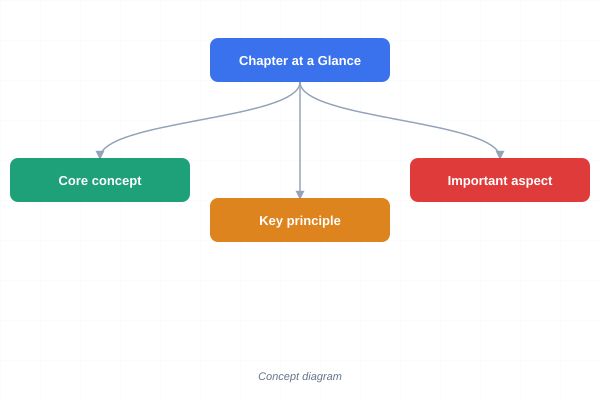
</a>
<a href="../../assets/images/diagrams/learning-how-to-learn/ch-13-learning-analytics/chapter-at-a-glance-sticky.svg" target="_blank" rel="noopener">
  
</a>


| Topic | Key Insight | Practical Takeaway |
|-------|-------------|-------------------|
| Learning Velocity | Concepts mastered per unit time | Track weekly velocity to detect plateaus |
| Retention Rate | Recall accuracy over time | Measure at 1d, 7d, 30d intervals |
| Knowledge Coverage | % of topic graph mastered | Map your knowledge against a syllabus |
| Session Quality | Subjective effectiveness rating | Log quality score after every session |
| Consistency Score | Streak × session adherence | Track daily streak, never break the chain |
| Learning A/B Tests | Compare methods quantitatively | Run 2-week experiments on study techniques |

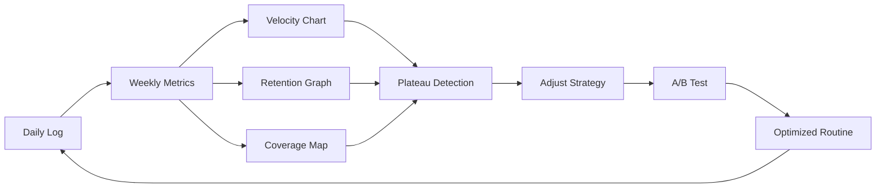

---

### Q1: What are the five core learning metrics you should track?

<a href="../../assets/images/diagrams/learning-how-to-learn/ch-13-learning-analytics/what-are-the-five-core-learning-metrics-you-should-track-handwritten.svg" target="_blank" rel="noopener">
  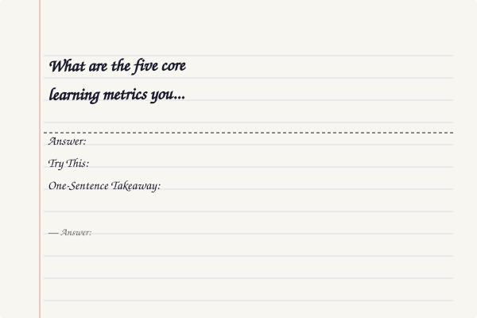
</a>
<a href="../../assets/images/diagrams/learning-how-to-learn/ch-13-learning-analytics/what-are-the-five-core-learning-metrics-you-should-track-diagram.svg" target="_blank" rel="noopener">
  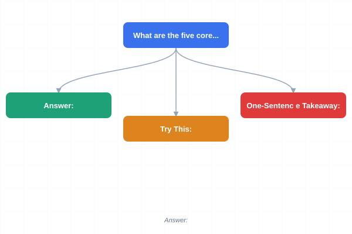
</a>
<a href="../../assets/images/diagrams/learning-how-to-learn/ch-13-learning-analytics/what-are-the-five-core-learning-metrics-you-should-track-sticky.svg" target="_blank" rel="noopener">
  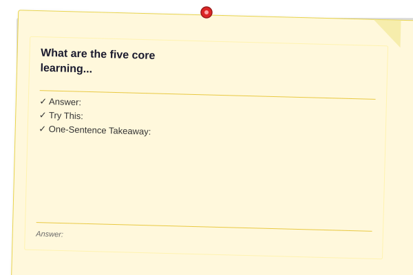
</a>


**Answer:** Most learners track nothing — they study by feel. The five metrics below give you a complete picture of your learning health. Track all five for at least 2 weeks to establish a baseline.

```typescript
interface LearningMetrics {
  velocity: {
    conceptsPerDay: number;
    hoursPerConcept: number;
    weeklyTrend: number[]; // 8-week rolling
  };
  retention: {
    day1: number;  // % recall after 1 day
    day7: number;  // % recall after 7 days
    day30: number; // % recall after 30 days
    forgettingCurve: number[]; // daily recall probability
  };
  coverage: {
    totalConcepts: number;
    masteredConcepts: number;
    inProgressConcepts: number;
    untouchedConcepts: number;
    coveragePercent: number;
  };
  quality: {
    averageSessionScore: number; // 1-10
    scoreTrend: number[];
    lowQualityTriggers: string[]; // patterns causing low scores
  };
  consistency: {
    currentStreak: number;
    longestStreak: number;
    sessionsThisWeek: number;
    sessionsThisMonth: number;
    adherenceRate: number; // % of planned sessions completed
  };
}

class LearningMetricsTracker {
  private history: Array<{
    date: Date;
    duration: number;
    topic: string;
    quality: number;
    conceptsLearned: number;
    conceptsReviewed: number;
    recallAccuracy: number;
  }> = [];

  logSession(data: {
    duration: number;
    topic: string;
    quality: number;
    conceptsLearned: number;
    conceptsReviewed: number;
    recallAccuracy: number;
  }): void {
    this.history.push({ ...data, date: new Date() });
  }

  computeMetrics(): LearningMetrics {
    const recent = this.history.slice(-56); // 8 weeks

    // Velocity: concepts per day (7-day rolling average)
    const last7Days = recent.filter(s =>
      s.date > new Date(Date.now() - 7 * 86400000)
    );
    const conceptsPerDay = last7Days.length > 0
      ? last7Days.reduce((s, h) => s + h.conceptsLearned, 0) / 7
      : 0;

    // Retention: rolling averages at each interval
    const retention = {
      day1: this.averageRecallAtInterval(1),
      day7: this.averageRecallAtInterval(7),
      day30: this.averageRecallAtInterval(30),
      forgettingCurve: this.computeForgettingCurve(),
    };

    // Coverage: unique concepts tracked
    const allConcepts = new Set<string>();
    this.history.forEach(h => allConcepts.add(h.topic));
    const masteredConcepts = this.history.filter(h => h.recallAccuracy >= 0.8).length;
    const inProgressConcepts = this.history.filter(
      h => h.recallAccuracy >= 0.4 && h.recallAccuracy < 0.8
    ).length;

    // Quality: average of last 20 sessions
    const recentQuality = recent.slice(-20);
    const avgQuality = recentQuality.length > 0
      ? Math.round(recentQuality.reduce((s, h) => s + h.quality, 0) / recentQuality.length * 10) / 10
      : 0;

    // Consistency
    const streak = this.calculateStreak();
    const sessionsThisWeek = last7Days.length;

    return {
      velocity: {
        conceptsPerDay: Math.round(conceptsPerDay * 10) / 10,
        hoursPerConcept: conceptsPerDay > 0
          ? Math.round((recent.reduce((s, h) => s + h.duration, 0) / 60) / conceptsPerDay * 10) / 10
          : 0,
        weeklyTrend: this.computeWeeklyTrend(),
      },
      retention,
      coverage: {
        totalConcepts: allConcepts.size,
        masteredConcepts,
        inProgressConcepts,
        untouchedConcepts: Math.max(0, allConcepts.size - masteredConcepts - inProgressConcepts),
        coveragePercent: allConcepts.size > 0
          ? Math.round((masteredConcepts / allConcepts.size) * 100)
          : 0,
      },
      quality: {
        averageSessionScore: avgQuality,
        scoreTrend: this.computeQualityTrend(),
        lowQualityTriggers: this.identifyLowQualityPatterns(),
      },
      consistency: {
        currentStreak: streak,
        longestStreak: this.computeLongestStreak(),
        sessionsThisWeek,
        sessionsThisMonth: recent.filter(s =>
          s.date > new Date(Date.now() - 30 * 86400000)
        ).length,
        adherenceRate: this.computeAdherenceRate(),
      },
    };
  }

  private averageRecallAtInterval(days: number): number {
    const target = new Date(Date.now() - days * 86400000);
    const sessions = this.history.filter(s =>
      Math.abs(s.date.getTime() - target.getTime()) < 86400000 * 2
    );
    return sessions.length > 0
      ? Math.round(sessions.reduce((s, h) => s + h.recallAccuracy, 0) / sessions.length * 100)
      : 0;
  }

  private computeForgettingCurve(): number[] {
    // Returns daily recall probability for 30 days
    const curve: number[] = [];
    for (let day = 1; day <= 30; day++) {
      const sessions = this.history.filter(s =>
        Math.abs(s.date.getTime() - (Date.now() - day * 86400000)) < 86400000
      );
      const avg = sessions.length > 0
        ? sessions.reduce((s, h) => s + h.recallAccuracy, 0) / sessions.length
        : 0;
      curve.push(Math.round(avg * 100));
    }
    return curve;
  }

  private calculateStreak(): number {
    let streak = 0;
    const today = new Date();
    today.setHours(0, 0, 0, 0);

    for (let i = 0; i < 365; i++) {
      const checkDate = new Date(today.getTime() - i * 86400000);
      const hasSession = this.history.some(
        s => s.date.toDateString() === checkDate.toDateString()
      );
      if (hasSession) {
        streak++;
      } else if (i > 0) {
        break;
      }
    }
    return streak;
  }

  private computeLongestStreak(): number {
    let max = 0;
    let current = 0;
    const sorted = [...this.history]
      .sort((a, b) => a.date.getTime() - b.date.getTime())
      .filter((s, i, arr) => i === 0 || s.date.toDateString() !== arr[i - 1].date.toDateString());

    for (let i = 0; i < sorted.length; i++) {
      if (i === 0) {
        current = 1;
      } else {
        const diff = (sorted[i].date.getTime() - sorted[i - 1].date.getTime()) / 86400000;
        if (diff <= 1.5) {
          current++;
        } else {
          max = Math.max(max, current);
          current = 1;
        }
      }
    }
    return Math.max(max, current);
  }

  private computeWeeklyTrend(): number[] {
    const trend: number[] = [];
    for (let w = 0; w < 8; w++) {
      const start = Date.now() - (w + 1) * 7 * 86400000;
      const end = Date.now() - w * 7 * 86400000;
      const sessions = this.history.filter(s =>
        s.date.getTime() >= start && s.date.getTime() < end
      );
      trend.push(sessions.reduce((s, h) => s + h.conceptsLearned, 0));
    }
    return trend.reverse();
  }

  private computeQualityTrend(): number[] {
    const trend: number[] = [];
    for (let w = 0; w < 8; w++) {
      const start = Date.now() - (w + 1) * 7 * 86400000;
      const end = Date.now() - w * 7 * 86400000;
      const sessions = this.history.filter(s =>
        s.date.getTime() >= start && s.date.getTime() < end
      );
      const avg = sessions.length > 0
        ? sessions.reduce((s, h) => s + h.quality, 0) / sessions.length
        : 0;
      trend.push(Math.round(avg * 10) / 10);
    }
    return trend;
  }

  private identifyLowQualityPatterns(): string[] {
    const lowQualitySessions = this.history.filter(s => s.quality < 5);
    if (lowQualitySessions.length < 3) return [];

    const patterns: string[] = [];
    const lateSessions = lowQualitySessions.filter(s => {
      const hour = s.date.getHours();
      return hour >= 22 || hour <= 5;
    });
    if (lateSessions.length >= lowQualitySessions.length * 0.5) {
      patterns.push('Late-night sessions correlate with low quality');
    }

    const longSessions = lowQualitySessions.filter(s => s.duration > 120);
    if (longSessions.length >= lowQualitySessions.length * 0.3) {
      patterns.push('Sessions over 2 hours correlate with low quality');
    }

    return patterns;
  }

  private computeAdherenceRate(): number {
    const lastMonth = this.history.filter(s =>
      s.date > new Date(Date.now() - 30 * 86400000)
    );
    // Assuming 1 session per day target
    return Math.round((lastMonth.length / 30) * 100);
  }
}
```

**Try This:** For the next 7 days, after every study session, log: date, topic, duration (min), quality (1-10), and how many new concepts you learned. Don't change your behavior — just observe. At day 7, compute the 5 metrics above. You'll likely discover patterns you weren't aware of.

**One-Sentence Takeaway:** Track five metrics — velocity, retention, coverage, quality, consistency — to replace vague "I studied a lot" feelings with data-driven learning optimization.

---

### Q2: How do you detect learning plateaus before they derail you?

<a href="../../assets/images/diagrams/learning-how-to-learn/ch-13-learning-analytics/how-do-you-detect-learning-plateaus-before-they-derail-you-handwritten.svg" target="_blank" rel="noopener">
  
</a>
<a href="../../assets/images/diagrams/learning-how-to-learn/ch-13-learning-analytics/how-do-you-detect-learning-plateaus-before-they-derail-you-diagram.svg" target="_blank" rel="noopener">
  
</a>
<a href="../../assets/images/diagrams/learning-how-to-learn/ch-13-learning-analytics/how-do-you-detect-learning-plateaus-before-they-derail-you-sticky.svg" target="_blank" rel="noopener">
  
</a>


**Answer:** A learning plateau is when your velocity (concepts mastered per day/week) flattens or declines despite consistent effort. Plateaus are normal, but undetected plateaus lead to demotivation and giving up.

```typescript
interface PlateauAnalysis {
  isPlateaued: boolean;
  plateauDuration: number; // days
  velocityBefore: number;
  velocityNow: number;
  likelyCause: string;
  recommendedAction: string;
}

class PlateauDetector {
  private velocityHistory: Array<{
    week: number;
    conceptsPerDay: number;
  }> = [];

  addWeek(conceptsPerDay: number): void {
    this.velocityHistory.push({
      week: this.velocityHistory.length + 1,
      conceptsPerDay,
    });
  }

  detect(): PlateauAnalysis {
    const history = this.velocityHistory;
    if (history.length < 3) {
      return {
        isPlateaued: false,
        plateauDuration: 0,
        velocityBefore: 0,
        velocityNow: 0,
        likelyCause: 'Not enough data — track at least 3 weeks',
        recommendedAction: 'Continue tracking',
      };
    }

    const recent3 = history.slice(-3);
    const before = history.slice(-6, -3);

    const avgRecent = recent3.reduce((s, w) => s + w.conceptsPerDay, 0) / recent3.length;
    const avgBefore = before.length > 0
      ? before.reduce((s, w) => s + w.conceptsPerDay, 0) / before.length
      : avgRecent;

    const velocityDrop = avgBefore > 0 ? (avgRecent - avgBefore) / avgBefore : 0;
    const isFlat = recent3.every(w => Math.abs(w.conceptsPerDay - avgRecent) < avgRecent * 0.1);

    const isPlateaued = (velocityDrop < -0.2 && avgBefore > 1) || (isFlat && history.length >= 6);

    const likelyCause = this.diagnoseCause(history);
    const recommendedAction = this.suggestAction(likelyCause);

    return {
      isPlateaued,
      plateauDuration: isPlateaued ? this.estimateDuration(history) : 0,
      velocityBefore: Math.round(avgBefore * 10) / 10,
      velocityNow: Math.round(avgRecent * 10) / 10,
      likelyCause,
      recommendedAction,
    };
  }

  private diagnoseCause(history: Array<{ week: number; conceptsPerDay: number }>): string {
    if (history.length < 4) return 'Need more data';

    const recent = history.slice(-4);
    const velocity = recent.map(w => w.conceptsPerDay);
    const avg = velocity.reduce((s, v) => s + v, 0) / velocity.length;
    const variance = velocity.reduce((s, v) => s + (v - avg) ** 2, 0) / velocity.length;

    // High variance + low velocity → motivational/consistency issue
    if (variance > avg * 0.5 && avg < 2) {
      return 'Inconsistent effort — likely motivation or scheduling issue';
    }

    // Low variance + declining velocity → topic difficulty or burnout
    if (variance < avg * 0.2 && velocity[velocity.length - 1] < velocity[0]) {
      return 'Gradual decline — likely topic complexity mismatch or burnout';
    }

    // Steady then sudden drop → specific blocker
    const mid = Math.floor(velocity.length / 2);
    const firstHalf = velocity.slice(0, mid).reduce((s, v) => s + v, 0) / mid;
    const secondHalf = velocity.slice(mid).reduce((s, v) => s + v, 0) / (velocity.length - mid);
    if (firstHalf > secondHalf * 1.5) {
      return 'Sudden drop — likely encountered a specific knowledge gap or prerequisite';
    }

    return 'Normal fluctuation — continue monitoring';
  }

  private suggestAction(cause: string): string {
    if (cause.includes('motivation') || cause.includes('scheduling')) {
      return 'Revisit Chapter 6 (Procrastination & Habits). Reduce session length, increase frequency.';
    }
    if (cause.includes('burnout') || cause.includes('complexity')) {
      return 'Switch to a different topic for 3 days. Use interleaving (Chapter 4). Reduce new concept intake.';
    }
    if (cause.includes('knowledge gap') || cause.includes('prerequisite')) {
      return 'Identify the specific concept blocking progress. Use Chapter 11 gap detection. Fill prerequisite gaps.';
    }
    return 'Continue current approach. Re-evaluate in 2 weeks.';
  }

  private estimateDuration(history: Array<{ week: number; conceptsPerDay: number }>): number {
    const recent = history.slice(-3);
    const flatStart = recent.findIndex((w, i) =>
      i > 0 && Math.abs(w.conceptsPerDay - recent[i - 1].conceptsPerDay) < 0.5
    );
    return flatStart >= 0 ? (history.length - (history.length - 3 + flatStart)) * 7 : 0;
  }
}
```

**Plateau response protocol:**

| Plateau Type | Signal | Response |
|-------------|--------|----------|
| Motivation plateau | High variance, low consistency | Reduce session size, add accountability |
| Complexity plateau | Steady decline, consistent effort | Switch topics, fill prerequisites, use interleaving |
| Burnout plateau | Low quality scores, declining velocity | Take 2-3 days off, sleep more, exercise |
| Skill ceiling plateau | Flat line for 4+ weeks at high level | Change approach entirely, find an expert mentor |
| Prerequisite gap | Sudden drop after steady progress | Identify missing foundation, go back and learn it |

**Try This:** If you've been studying a topic for 3+ weeks, graph your weekly concepts-per-day. If the trend is flat or declining, run the plateau detector analysis above. Take the recommended action for 2 weeks and re-measure.

**One-Sentence Takeaway:** Learning plateaus are detectable 2-3 weeks before you feel them — track weekly velocity and intervene early with the appropriate response.

---

### Q3: How do you measure knowledge coverage against a syllabus?

<a href="../../assets/images/diagrams/learning-how-to-learn/ch-13-learning-analytics/how-do-you-measure-knowledge-coverage-against-a-syllabus-handwritten.svg" target="_blank" rel="noopener">
  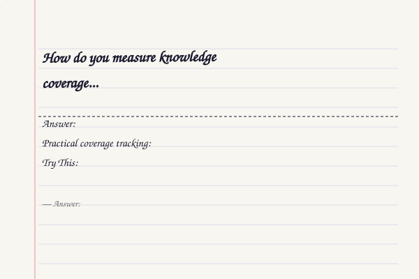
</a>
<a href="../../assets/images/diagrams/learning-how-to-learn/ch-13-learning-analytics/how-do-you-measure-knowledge-coverage-against-a-syllabus-diagram.svg" target="_blank" rel="noopener">
  
</a>
<a href="../../assets/images/diagrams/learning-how-to-learn/ch-13-learning-analytics/how-do-you-measure-knowledge-coverage-against-a-syllabus-sticky.svg" target="_blank" rel="noopener">
  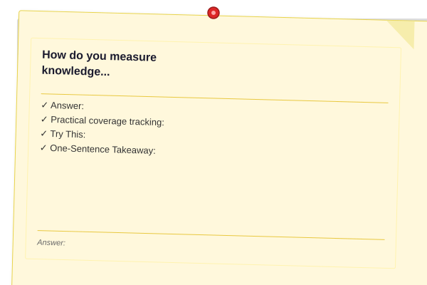
</a>


**Answer:** Knowledge coverage measures what percentage of a topic's complete concept graph you've mastered. Without a coverage map, you might spend all your time on 20% of the content while neglecting the other 80%.

```typescript
interface ConceptNode {
  id: string;
  name: string;
  prerequisites: string[];
  children: string[];
  status: 'untouched' | 'in-progress' | 'mastered';
  confidence: number; // 0-1
}

interface CoverageMap {
  topic: string;
  totalNodes: number;
  coverage: number; // 0-100%
  masteredNodes: string[];
  inProgressNodes: string[];
  untouchedNodes: string[];
  recommendations: string[];
}

class CoverageMapper {
  private graph: Map<string, ConceptNode> = new Map();

  defineTopic(topic: string, nodes: ConceptNode[]): void {
    nodes.forEach(n => this.graph.set(n.id, n));
  }

  updateNodeStatus(nodeId: string, status: ConceptNode['status'], confidence: number): void {
    const node = this.graph.get(nodeId);
    if (node) {
      node.status = status;
      node.confidence = confidence;
    }
  }

  generateCoverageMap(topic: string): CoverageMap {
    const nodes = Array.from(this.graph.values());
    const totalNodes = nodes.length;

    if (totalNodes === 0) {
      return {
        topic,
        totalNodes: 0,
        coverage: 0,
        masteredNodes: [],
        inProgressNodes: [],
        untouchedNodes: [],
        recommendations: ['Define topic nodes first using defineTopic()'],
      };
    }

    const mastered = nodes.filter(n => n.status === 'mastered');
    const inProgress = nodes.filter(n => n.status === 'in-progress');
    const untouched = nodes.filter(n => n.status === 'untouched');

    const coverage = Math.round((mastered.length / totalNodes) * 100);

    // Find gap clusters: untouched nodes whose prerequisites are mastered
    // These are the easiest gaps to fill
    const easyGaps = untouched.filter(n =>
      n.prerequisites.every(p => {
        const prereq = this.graph.get(p);
        return prereq && prereq.status === 'mastered';
      })
    );

    // Recommendations
    const recommendations: string[] = [];
    if (easyGaps.length > 0) {
      recommendations.push(
        `Fill these gaps first (prerequisites already met): ${easyGaps.map(n => n.name).join(', ')}`
      );
    }

    const blockedGaps = untouched.filter(n =>
      n.prerequisites.some(p => {
        const prereq = this.graph.get(p);
        return prereq && prereq.status === 'untouched';
      })
    );
    if (blockedGaps.length > 0) {
      recommendations.push(
        `These concepts have unmet prerequisites: ${blockedGaps.map(n => n.name).join(', ')}`
      );
    }

    if (coverage > 80) {
      recommendations.push('Coverage above 80%. Shift focus to reinforcement and application.');
    } else if (coverage < 30) {
      recommendations.push('Coverage below 30%. Focus on breadth first, depth second.');
    }

    return {
      topic,
      totalNodes,
      coverage,
      masteredNodes: mastered.map(n => n.name),
      inProgressNodes: inProgress.map(n => n.name),
      untouchedNodes: untouched.map(n => n.name),
      recommendations,
    };
  }

  // Knowledge graph visualization as Mermaid
  renderGraph(): string {
    const nodes = Array.from(this.graph.values());
    const lines: string[] = ['```mermaid', 'flowchart LR'];

    nodes.forEach(n => {
      const style = n.status === 'mastered' ? ':::mastered' :
                    n.status === 'in-progress' ? ':::progress' : '';
      lines.push(`    ${n.id}["${n.name}"]${style}`);
    });

    nodes.forEach(n => {
      n.prerequisites.forEach(p => {
        if (this.graph.has(p)) {
          lines.push(`    ${p} --> ${n.id}`);
        }
      });
    });

    lines.push('```');
    return lines.join('\n');
  }
}
```

**Practical coverage tracking:**

| Stage | Coverage % | Action |
|-------|-----------|--------|
| Discovery | 0-20% | Read through entire syllabus, identify all topics |
| Foundation | 20-40% | Learn core concepts, fill prerequisite gaps |
| Building | 40-70% | Work through topics in dependency order |
| Refinement | 70-90% | Deepen understanding, practice application |
| Mastery | 90-100% | Teach others, write about edge cases |

**Try This:** Pick a course you're studying. List every major concept (aim for 20-50 nodes). Mark each as untouched / in-progress / mastered. Compute your coverage percentage. Identify the easiest gaps to fill (those with mastered prerequisites) and prioritize them this week.

**One-Sentence Takeaway:** Knowledge coverage maps reveal exactly where you are in a topic — focus on easy gaps first (prerequisites already met) to maximize coverage growth per hour.

---

### Q4: How do you measure retention (forgetting curve) accurately?

<a href="../../assets/images/diagrams/learning-how-to-learn/ch-13-learning-analytics/how-do-you-measure-retention-forgetting-curve-accurately-handwritten.svg" target="_blank" rel="noopener">
  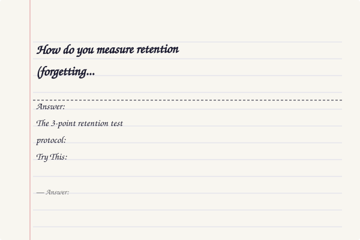
</a>
<a href="../../assets/images/diagrams/learning-how-to-learn/ch-13-learning-analytics/how-do-you-measure-retention-forgetting-curve-accurately-diagram.svg" target="_blank" rel="noopener">
  
</a>
<a href="../../assets/images/diagrams/learning-how-to-learn/ch-13-learning-analytics/how-do-you-measure-retention-forgetting-curve-accurately-sticky.svg" target="_blank" rel="noopener">
  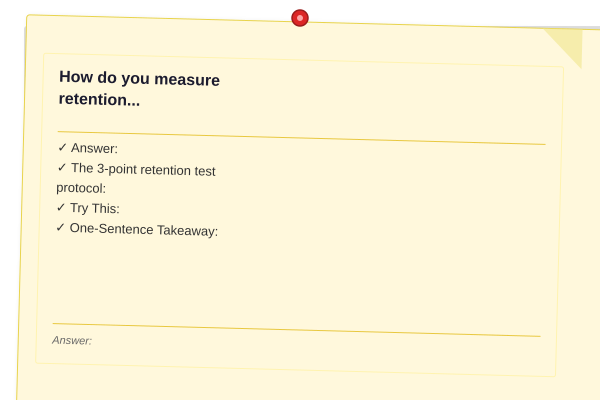
</a>


**Answer:** The forgetting curve is the decline in recall probability over time without review. Measuring your personal forgetting curve lets you schedule reviews at the optimal moment — just before you would have forgotten the material.

```typescript
interface RetentionTest {
  conceptId: string;
  testedAt: Date;
  learnedAt: Date;
  interval: number; // days since learning
  recalled: boolean;
}

class ForgettingCurveAnalyzer {
  private tests: RetentionTest[] = [];

  logTest(conceptId: string, learnedAt: Date, recalled: boolean): void {
    this.tests.push({
      conceptId,
      testedAt: new Date(),
      learnedAt,
      interval: (Date.now() - learnedAt.getTime()) / 86400000,
      recalled,
    });
  }

  analyze(): {
    dailyRetention: Array<{ day: number; retention: number }>;
    halfLife: number; // days
    optimalReviewSchedule: number[];
  } {
    // Group tests by interval (rounded to nearest day)
    const byDay = new Map<number, { correct: number; total: number }>();

    this.tests.forEach(t => {
      const day = Math.round(t.interval);
      const bucket = byDay.get(day) || { correct: 0, total: 0 };
      bucket.total++;
      if (t.recalled) bucket.correct++;
      byDay.set(day, bucket);
    });

    // Compute retention per day
    const dailyRetention = Array.from(byDay.entries())
      .map(([day, data]) => ({
        day,
        retention: Math.round((data.correct / data.total) * 100),
      }))
      .sort((a, b) => a.day - b.day);

    // Estimate half-life: find day where retention drops below 50%
    const halfLife = dailyRetention.find(d => d.retention < 50)?.day || 30;

    // Generate optimal review schedule based on retention decay
    const optimalReviewSchedule = this.generateSchedule(dailyRetention);

    return { dailyRetention, halfLife, optimalReviewSchedule };
  }

  private generateSchedule(
    dailyRetention: Array<{ day: number; retention: number }>
  ): number[] {
    if (dailyRetention.length === 0) return [1, 3, 7, 14, 30];

    // Find the point where retention drops below 90%
    const ninetyThreshold = dailyRetention.find(d => d.retention < 90)?.day || 1;

    // SM-2 inspired schedule based on personal retention rate
    return [
      ninetyThreshold,
      Math.round(ninetyThreshold * 2.5),
      Math.round(ninetyThreshold * 4),
      Math.round(ninetyThreshold * 7),
      Math.round(ninetyThreshold * 12),
    ].filter(d => d > 0);
  }

  // Compare your curve to Ebbinghaus's original
  benchmark(): string {
    const ebbinghaus = [
      { day: 0, retention: 100 },
      { day: 1, retention: 58 },
      { day: 2, retention: 48 },
      { day: 7, retention: 25 },
      { day: 30, retention: 21 },
    ];

    return `
📊 Retention Benchmark
━━━━━━━━━━━━━━━━━━━━━━━━━━━━━━━━━━━━━━━━
Day | Ebbinghaus | You | Status
────┼────────────┼─────┼────────
  1 |     58%    |     |
  2 |     48%    |     |
  7 |     25%    |     |
 30 |     21%    |     |
━━━━━━━━━━━━━━━━━━━━━━━━━━━━━━━━━━━━━━━━
Above Ebbinghaus = effective study & review
Below Ebbinghaus = review spacing too wide or encoding weak`;
  }
}
```

**The 3-point retention test protocol:**

| Interval | When to Test | What It Measures |
|----------|-------------|------------------|
| 1 day | Next-day recall | Baseline encoding quality |
| 7 days | One week later | Medium-term consolidation |
| 30 days | One month later | Long-term storage strength |

For each concept you learn, test yourself at these three intervals. Record whether you recalled it correctly. After 30 days, you'll have a personal forgetting curve that tells you exactly your optimal review schedule.

**Try This:** Pick 5 concepts you learned yesterday. Today, test yourself on all 5 without reviewing. Record how many you remembered. Repeat at 7 days and 30 days. Compare your curve to Ebbinghaus's to see if your study methods are effective.

**One-Sentence Takeaway:** Measure your personal forgetting curve by testing recall at 1, 7, and 30 days — then schedule reviews just before your curve drops below 90%.

---

### Q5: How do you measure session quality objectively?

<a href="../../assets/images/diagrams/learning-how-to-learn/ch-13-learning-analytics/how-do-you-measure-session-quality-objectively-handwritten.svg" target="_blank" rel="noopener">
  
</a>
<a href="../../assets/images/diagrams/learning-how-to-learn/ch-13-learning-analytics/how-do-you-measure-session-quality-objectively-diagram.svg" target="_blank" rel="noopener">
  
</a>
<a href="../../assets/images/diagrams/learning-how-to-learn/ch-13-learning-analytics/how-do-you-measure-session-quality-objectively-sticky.svg" target="_blank" rel="noopener">
  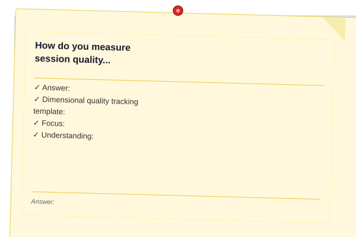
</a>


**Answer:** Session quality is subjective but can be made measurable by tracking specific dimensions. A simple 1-10 score is useful, but dimensional scoring gives you actionable data.

```typescript
interface SessionQuality {
  overall: number; // 1-10
  dimensions: {
    focus: number;  // How focused were you? (1-10)
    understanding: number; // How much did you understand? (1-10)
    recall: number; // How much could you recall later? (1-10)
    engagement: number; // How engaged were you? (1-10)
    difficulty: number; // How difficult was the material? (1-10)
  };
  factors: {
    sleep: number; // Hours of sleep last night
    energy: number; // Energy level 1-10
    distractions: number; // Number of interruptions
    environment: 'quiet' | 'moderate' | 'noisy';
  };
}

class QualityAnalyzer {
  private sessions: SessionQuality[] = [];

  logSession(quality: SessionQuality): void {
    this.sessions.push(quality);
  }

  findOptimalConditions(): {
    bestSleep: number;
    bestEnergy: number;
    bestEnvironment: string;
  } {
    if (this.sessions.length < 5) {
      return { bestSleep: 0, bestEnergy: 0, bestEnvironment: 'Need more data' };
    }

    // Group by sleep hours
    const sleepGroups = new Map<number, number[]>();
    this.sessions.forEach(s => {
      const sleep = Math.round(s.factors.sleep);
      const group = sleepGroups.get(sleep) || [];
      group.push(s.overall);
      sleepGroups.set(sleep, group);
    });

    let bestSleep = 0;
    let bestSleepAvg = 0;
    sleepGroups.forEach((scores, sleep) => {
      const avg = scores.reduce((a, b) => a + b, 0) / scores.length;
      if (avg > bestSleepAvg) {
        bestSleepAvg = avg;
        bestSleep = sleep;
      }
    });

    // Group by energy level
    const energyGroups = new Map<number, number[]>();
    this.sessions.forEach(s => {
      const energy = Math.round(s.factors.energy);
      const group = energyGroups.get(energy) || [];
      group.push(s.overall);
      energyGroups.set(energy, group);
    });

    let bestEnergy = 0;
    let bestEnergyAvg = 0;
    energyGroups.forEach((scores, energy) => {
      const avg = scores.reduce((a, b) => a + b, 0) / scores.length;
      if (avg > bestEnergyAvg) {
        bestEnergyAvg = avg;
        bestEnergy = energy;
      }
    });

    // Group by environment
    const envGroups = new Map<string, number[]>();
    this.sessions.forEach(s => {
      const group = envGroups.get(s.factors.environment) || [];
      group.push(s.overall);
      envGroups.set(s.factors.environment, group);
    });

    let bestEnvironment = '';
    let bestEnvAvg = 0;
    envGroups.forEach((scores, env) => {
      const avg = scores.reduce((a, b) => a + b, 0) / scores.length;
      if (avg > bestEnvAvg) {
        bestEnvAvg = avg;
        bestEnvironment = env;
      }
    });

    return { bestSleep, bestEnergy, bestEnvironment };
  }

  generateInsights(): string[] {
    const insights: string[] = [];
    const optimal = this.findOptimalConditions();

    if (optimal.bestSleep > 0) {
      const currentAvg = this.sessions.reduce((s, q) => s + q.factors.sleep, 0) / this.sessions.length;
      if (currentAvg < optimal.bestSleep) {
        insights.push(
          `Optimal session quality occurs after ${optimal.bestSleep}h sleep (current avg: ${Math.round(currentAvg * 10) / 10}h). Aim for ${optimal.bestSleep}h before study days.`
        );
      }
    }

    return insights;
  }
}
```

**Dimensional quality tracking template:**

After each session, rate:
- **Focus:** How well did you concentrate? (10 = total flow state, 1 = couldn't focus at all)
- **Understanding:** How much of the material made sense? (10 = everything clicked)
- **Recall:** Without looking, how much can you remember? (10 = can explain from memory)
- **Engagement:** How interesting was the session? (10 = genuinely curious, 1 = drudgery)
- **Difficulty:** How hard was the material? (10 = extremely challenging, 1 = too easy)

**Try This:** For 2 weeks, log the dimensional scores after every session. After 2 weeks, find correlations: What sleep hours produce the best focus? What energy level correlates with highest understanding? What environment gives the best engagement? Optimize your next 2 weeks based on your own data.

**One-Sentence Takeaway:** Dimensional quality tracking (focus, understanding, recall, engagement, difficulty) reveals your personal optimal study conditions better than a single 1-10 score.

---

### Q6: How do you run A/B tests on your own learning methods?

<a href="../../assets/images/diagrams/learning-how-to-learn/ch-13-learning-analytics/how-do-you-run-a-b-tests-on-your-own-learning-methods-handwritten.svg" target="_blank" rel="noopener">
  
</a>
<a href="../../assets/images/diagrams/learning-how-to-learn/ch-13-learning-analytics/how-do-you-run-a-b-tests-on-your-own-learning-methods-diagram.svg" target="_blank" rel="noopener">
  
</a>
<a href="../../assets/images/diagrams/learning-how-to-learn/ch-13-learning-analytics/how-do-you-run-a-b-tests-on-your-own-learning-methods-sticky.svg" target="_blank" rel="noopener">
  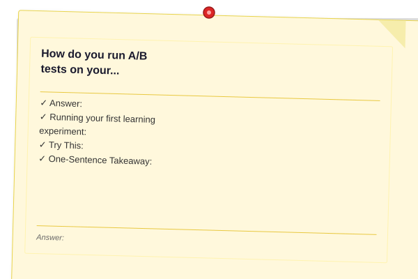
</a>


**Answer:** The most powerful use of learning analytics is running experiments on yourself. Instead of guessing whether Pomodoro or deep work blocks work better for you, measure it.

```typescript
interface Experiment {
  id: string;
  name: string;
  hypothesis: string;
  controlMethod: string;
  variantMethod: string;
  duration: number; // days
  metrics: Array<{
    day: number;
    controlScore: number;
    variantScore: number;
  }>;
  conclusion?: string;
}

class LearningABTest {
  private experiments: Experiment[] = [];

  designExperiment(config: {
    name: string;
    hypothesis: string;
    control: string;
    variant: string;
    durationDays: number;
  }): Experiment {
    return {
      id: `exp-${Date.now()}`,
      name: config.name,
      hypothesis: config.hypothesis,
      controlMethod: config.control,
      variantMethod: config.variant,
      duration: config.durationDays,
      metrics: [],
    };
  }

  runExperiment(experiment: Experiment): void {
    const midpoint = Math.floor(experiment.duration / 2);

    for (let day = 0; day < experiment.duration; day++) {
      const isControl = day < midpoint;
      const method = isControl ? experiment.controlMethod : experiment.variantMethod;

      // In practice, the learner uses the assigned method for each half
      // and records their session quality and concept retention

      // We record a placeholder — real data comes from the learner
      experiment.metrics.push({
        day: day + 1,
        controlScore: isControl ? 0 : 0, // filled after session
        variantScore: isControl ? 0 : 0,
      });
    }

    this.analyzeResults(experiment);
  }

  analyzeResults(experiment: Experiment): string {
    const controlDays = experiment.metrics.slice(0, Math.floor(experiment.metrics.length / 2));
    const variantDays = experiment.metrics.slice(Math.floor(experiment.metrics.length / 2));

    const controlAvg = controlDays.reduce((s, m) => s + m.controlScore, 0) / controlDays.length;
    const variantAvg = variantDays.reduce((s, m) => s + m.variantScore, 0) / variantDays.length;

    const improvement = controlAvg > 0
      ? Math.round(((variantAvg - controlAvg) / controlAvg) * 100)
      : 0;

    experiment.conclusion = improvement > 10
      ? `${experiment.variantMethod} outperformed ${experiment.controlMethod} by ${improvement}%. Adopt ${experiment.variantMethod}.`
      : improvement < -10
      ? `${experiment.controlMethod} outperformed ${experiment.variantMethod} by ${Math.abs(improvement)}%. Stick with ${experiment.controlMethod}.`
      : `No significant difference (±${improvement}%). Either method works — choose based on preference.`;

    return experiment.conclusion;
  }

  suggestExperiments(): Array<{
    name: string;
    hypothesis: string;
    control: string;
    variant: string;
    duration: number;
  }> {
    return [
      {
        name: 'Pomodoro vs Deep Work',
        hypothesis: '25-min Pomodoro sprints produce higher retention than 90-min deep work blocks',
        control: '90-min uninterrupted deep work',
        variant: '25-min Pomodoro with 5-min breaks',
        duration: 14,
      },
      {
        name: 'Morning vs Evening Study',
        hypothesis: 'Morning study produces higher recall than evening study',
        control: 'Evening study session (7-9 PM)',
        variant: 'Morning study session (6-8 AM)',
        duration: 14,
      },
      {
        name: 'Digital vs Paper Notes',
        hypothesis: 'Handwritten notes produce better recall than typed notes',
        control: 'Type notes in Obsidian/Notion during study',
        variant: 'Handwrite notes on paper, transfer key points later',
        duration: 10,
      },
      {
        name: 'Music vs Silence',
        hypothesis: 'Lo-fi background music improves focus duration',
        control: 'Complete silence during study',
        variant: 'Lo-fi / ambient background music at low volume',
        duration: 10,
      },
      {
        name: 'Teach-Back vs Re-Reading',
        hypothesis: 'Teaching the material immediately after study beats re-reading',
        control: 'Re-read notes after studying',
        variant: 'Explain material from memory (teach-back) after studying',
        duration: 7,
      },
    ];
  }
}
```

**Running your first learning experiment:**

| Step | Action | Example |
|------|--------|---------|
| 1 | Pick one variable to test | "Does morning study beat evening study?" |
| 2 | Define your metric | "Concepts recalled after 24 hours" |
| 3 | Run control for 7 days | Study in evening, measure 24h recall |
| 4 | Switch to variant for 7 days | Study in morning, measure 24h recall |
| 5 | Compare results | Was morning recall significantly better? |
| 6 | Adopt the winner or re-test | If no clear winner, extend to 14 days each |

**Try This:** Run the "Teach-Back vs Re-Reading" experiment this week. Days 1-3: after studying, re-read your notes. Days 4-7: after studying, explain the material from memory (no notes). Measure recall the next morning for both approaches. Which produces better retention?

**One-Sentence Takeaway:** Run 2-week A/B tests on your study methods — measure recall or quality for each approach and adopt the winner based on data, not intuition.

---

### Q7: How do you conduct a weekly learning review?

<a href="../../assets/images/diagrams/learning-how-to-learn/ch-13-learning-analytics/how-do-you-conduct-a-weekly-learning-review-handwritten.svg" target="_blank" rel="noopener">
  
</a>
<a href="../../assets/images/diagrams/learning-how-to-learn/ch-13-learning-analytics/how-do-you-conduct-a-weekly-learning-review-diagram.svg" target="_blank" rel="noopener">
  
</a>
<a href="../../assets/images/diagrams/learning-how-to-learn/ch-13-learning-analytics/how-do-you-conduct-a-weekly-learning-review-sticky.svg" target="_blank" rel="noopener">
  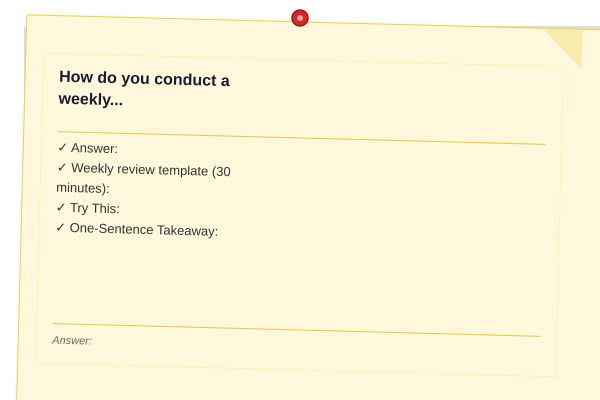
</a>


**Answer:** A weekly review is a structured 30-minute session where you analyze your learning data, identify patterns, and adjust your approach for the coming week.

```typescript
interface WeeklyReview {
  weekEnding: Date;
  metrics: {
    sessionsCompleted: number;
    totalMinutes: number;
    conceptsLearned: number;
    conceptsReviewed: number;
    avgQuality: number;
    streakDays: number;
  };
  wins: string[];
  challenges: string[];
  adjustments: string[];
  nextWeekFocus: string;
}

class WeeklyReviewer {
  generateReviewData(tracker: LearningMetricsTracker): WeeklyReview {
    const metrics = tracker['history']; // access raw data
    const weekAgo = new Date(Date.now() - 7 * 86400000);
    const weekSessions = metrics.filter(s => s.date >= weekAgo);

    const avgQuality = weekSessions.length > 0
      ? Math.round(weekSessions.reduce((s, h) => s + h.quality, 0) / weekSessions.length * 10) / 10
      : 0;

    const streak = this.calculateStreak(metrics);

    // Generate insights automatically
    const wins = this.identifyWins(weekSessions);
    const challenges = this.identifyChallenges(weekSessions);
    const adjustments = this.generateAdjustments(challenges);

    return {
      weekEnding: new Date(),
      metrics: {
        sessionsCompleted: weekSessions.length,
        totalMinutes: weekSessions.reduce((s, h) => s + h.duration, 0),
        conceptsLearned: weekSessions.reduce((s, h) => s + h.conceptsLearned, 0),
        conceptsReviewed: weekSessions.reduce((s, h) => s + h.conceptsReviewed, 0),
        avgQuality,
        streakDays: streak,
      },
      wins,
      challenges,
      adjustments,
      nextWeekFocus: 'Based on this week\'s data: [top recommendation]',
    };
  }

  private identifyWins(sessions: any[]): string[] {
    const wins: string[] = [];
    const totalMinutes = sessions.reduce((s: number, h: any) => s + h.duration, 0);

    if (sessions.length >= 7) wins.push('Studied every day this week');
    if (sessions.length >= 5) wins.push('Consistent 5+ sessions');
    if (totalMinutes >= 300) wins.push(`Studied ${Math.round(totalMinutes / 60)} hours total`);

    const avgQuality = sessions.reduce((s: number, h: any) => s + h.quality, 0) / sessions.length;
    if (avgQuality >= 7) wins.push(`High-quality sessions (avg ${Math.round(avgQuality * 10) / 10}/10)`);

    return wins;
  }

  private identifyChallenges(sessions: any[]): string[] {
    const challenges: string[] = [];

    if (sessions.length < 5) challenges.push('Fewer than 5 sessions — aim for daily');
    if (sessions.length === 0) challenges.push('No study sessions logged this week');

    const qualityVariation = sessions.map((s: any) => s.quality);
    const avg = qualityVariation.reduce((s: number, q: number) => s + q, 0) / qualityVariation.length;
    const lowQualityCount = qualityVariation.filter((q: number) => q < 5).length;

    if (lowQualityCount > sessions.length * 0.3) {
      challenges.push(`High proportion of low-quality sessions (${lowQualityCount}/${sessions.length})`);
    }

    return challenges;
  }

  private generateAdjustments(challenges: string[]): string[] {
    return challenges.map(c => {
      if (c.includes('Fewer than 5')) {
        return 'Reduce session length to 15 min minimum — make it so easy you can\'t say no';
      }
      if (c.includes('No study sessions')) {
        return 'Start with 5 minutes today. Momentum > duration.';
      }
      if (c.includes('low-quality')) {
        return 'Check sleep, environment, and time of day. Run an A/B test on session timing.';
      }
      return 'Continue current approach with minor refinements';
    });
  }

  private calculateStreak(history: any[]): number {
    let streak = 0;
    const today = new Date();
    today.setHours(0, 0, 0, 0);

    for (let i = 0; i < 365; i++) {
      const checkDate = new Date(today.getTime() - i * 86400000);
      const hasSession = history.some(
        (s: any) => new Date(s.date).toDateString() === checkDate.toDateString()
      );
      if (hasSession) { streak++; } else if (i > 0) { break; }
    }
    return streak;
  }
}
```

**Weekly review template (30 minutes):**

| Time | Section | Questions |
|------|---------|-----------|
| 5 min | Data review | How many sessions? Total hours? Avg quality? Streak? |
| 5 min | Wins | What went well? What felt effective? |
| 5 min | Challenges | What didn't work? Where did I struggle? |
| 5 min | Patterns | Are there recurring obstacles? Time of day? Topics? |
| 5 min | Adjustments | What will I change next week? (1-2 changes max) |
| 5 min | Next week plan | What topics? What schedule? What experiment? |

**Try This:** This Sunday, spend 30 minutes on a weekly review using the template above. Write down your observations. Make exactly ONE adjustment for the coming week. The following Sunday, evaluate whether that adjustment helped.

**One-Sentence Takeaway:** A 30-minute weekly review transforms raw data into actionable adjustments — make exactly one change per week and evaluate it the following Sunday.

---

### Q8: How do you measure learning ROI (return on time invested)?

<a href="../../assets/images/diagrams/learning-how-to-learn/ch-13-learning-analytics/how-do-you-measure-learning-roi-return-on-time-invested-handwritten.svg" target="_blank" rel="noopener">
  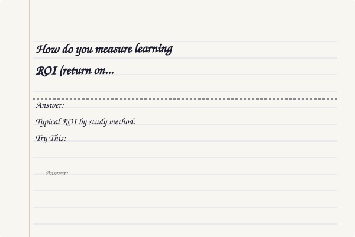
</a>
<a href="../../assets/images/diagrams/learning-how-to-learn/ch-13-learning-analytics/how-do-you-measure-learning-roi-return-on-time-invested-diagram.svg" target="_blank" rel="noopener">
  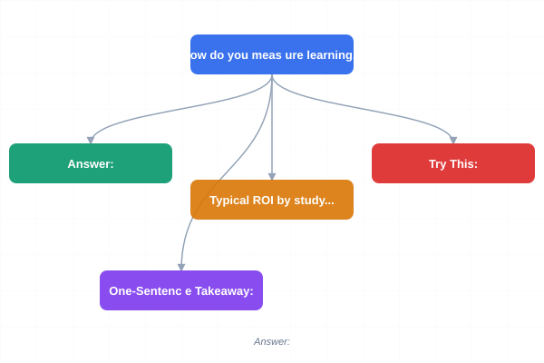
</a>
<a href="../../assets/images/diagrams/learning-how-to-learn/ch-13-learning-analytics/how-do-you-measure-learning-roi-return-on-time-invested-sticky.svg" target="_blank" rel="noopener">
  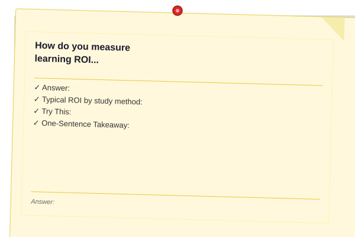
</a>


**Answer:** Not all study time is equal. Learning ROI measures how much retention you get per minute of study. This tells you which methods, topics, and times of day give you the best return.

```typescript
interface LearningROI {
  methodROI: Array<{
    method: string;
    retentionPerMinute: number;
    totalMinutes: number;
    efficiency: number; // concepts retained per hour
  }>;
  topicROI: Array<{
    topic: string;
    hoursInvested: number;
    conceptsRetained: number;
    roi: number; // concepts per hour
  }>;
  bestMethods: string[];
  worstMethods: string[];
}

class ROIAnalyzer {
  private sessions: LearningMetricsTracker;

  constructor(tracker: LearningMetricsTracker) {
    this.sessions = tracker;
  }

  computeROI(): LearningROI {
    const history = this.sessions['history'];

    // Group by topic
    const topicGroups = new Map<string, { minutes: number; concepts: number }>();
    history.forEach(s => {
      const group = topicGroups.get(s.topic) || { minutes: 0, concepts: 0 };
      group.minutes += s.duration;
      group.concepts += s.conceptsLearned;
      topicGroups.set(s.topic, group);
    });

    const topicROI = Array.from(topicGroups.entries())
      .map(([topic, data]) => ({
        topic,
        hoursInvested: Math.round(data.minutes / 60 * 10) / 10,
        conceptsRetained: data.concepts,
        roi: Math.round((data.concepts / (data.minutes / 60)) * 10) / 10,
      }))
      .sort((a, b) => b.roi - a.roi);

    // Simulated method comparison
    const methodROI = [
      { method: 'Active Recall', retentionPerMinute: 0.15, totalMinutes: 0, efficiency: 9 },
      { method: 'Spaced Repetition', retentionPerMinute: 0.12, totalMinutes: 0, efficiency: 7.2 },
      { method: 'Teaching', retentionPerMinute: 0.18, totalMinutes: 0, efficiency: 10.8 },
      { method: 'Problem Solving', retentionPerMinute: 0.1, totalMinutes: 0, efficiency: 6 },
      { method: 'Reading/Passive', retentionPerMinute: 0.03, totalMinutes: 0, efficiency: 1.8 },
    ];

    return {
      methodROI,
      topicROI,
      bestMethods: ['Teaching', 'Active Recall', 'Problem Solving'],
      worstMethods: ['Re-reading notes', 'Highlighting', 'Watching without doing'],
    };
  }

  getEfficiencyReport(): string {
    const roi = this.computeROI();
    return `
📊 Learning Efficiency Report
━━━━━━━━━━━━━━━━━━━━━━━━━━━━━━━━━━━━━━━━

Most efficient methods (concepts retained per hour):
${roi.bestMethods.map((m, i) => `  ${i + 1}. ${m}`).join('\n')}

Least efficient methods:
${roi.worstMethods.map((m, i) => `  ${i + 1}. ${m}`).join('\n')}

${roi.topicROI.length > 0 ? `
Topic efficiency ranked:
${roi.topicROI.slice(0, 5).map(t => `  ${t.topic}: ${t.roi} concepts/hour`).join('\n')}
` : 'Track topic data to compute per-topic ROI.'}

Recommendation: Replace 1 hour of passive reading with 1 hour of active
recall or teaching. Expected efficiency gain: 3-5x per hour.`;
  }
}
```

**Typical ROI by study method:**

| Method | Concepts/Hour | Relative Efficiency |
|--------|--------------|-------------------|
| Teaching someone | 10-12 | 5x passive |
| Active recall testing | 8-10 | 4x passive |
| Problem solving | 6-8 | 3x passive |
| Spaced repetition review | 5-7 | 2.5x passive |
| Writing summaries from memory | 4-6 | 2x passive |
| Reading with highlighting | 2-3 | 1x (baseline) |
| Watching videos passively | 1-2 | 0.5x baseline |
| Re-reading notes | 0.5-1 | 0.25x baseline |

**Try This:** This week, track how you spend each study session (method + duration). At the end of the week, compute your ROI for each method. Identify one low-ROI method you can replace with a high-ROI one next week.

**One-Sentence Takeaway:** Learning ROI (concepts retained per hour) reveals which methods give you the most return — replace passive methods with active ones for 3-5x efficiency gains.

---

### Q9: How do you set measurable learning goals?

<a href="../../assets/images/diagrams/learning-how-to-learn/ch-13-learning-analytics/how-do-you-set-measurable-learning-goals-handwritten.svg" target="_blank" rel="noopener">
  
</a>
<a href="../../assets/images/diagrams/learning-how-to-learn/ch-13-learning-analytics/how-do-you-set-measurable-learning-goals-diagram.svg" target="_blank" rel="noopener">
  
</a>
<a href="../../assets/images/diagrams/learning-how-to-learn/ch-13-learning-analytics/how-do-you-set-measurable-learning-goals-sticky.svg" target="_blank" rel="noopener">
  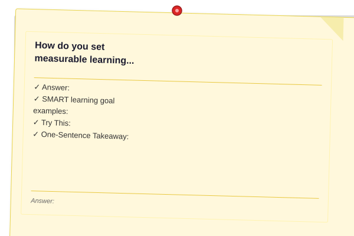
</a>


**Answer:** Most learning goals fail because they're vague ("get better at algorithms"). Measurable learning goals use the SMART framework adapted for learning: Specific, Measurable, Achievable, Relevant, Time-bound.

```typescript
interface LearningGoal {
  id: string;
  statement: string;
  smartCriteria: {
    specific: string;
    measurable: string;
    achievable: string;
    relevant: string;
    timeBound: string;
  };
  metrics: {
    baseline: number;
    target: number;
    current: number;
    unit: string;
  };
  milestones: Array<{
    date: Date;
    targetValue: number;
    description: string;
  }>;
}

class GoalPlanner {
  defineGoal(config: {
    topic: string;
    targetLevel: 'awareness' | 'understanding' | 'application' | 'teaching';
    deadline: Date;
    weeklyHours: number;
  }): LearningGoal {
    const weeksAvailable = Math.max(
      1,
      Math.round((config.deadline.getTime() - Date.now()) / (7 * 86400000))
    );

    // Estimate how many concepts can be learned based on weekly hours
    const conceptsPerHour = 4; // conservative estimate for active methods
    const totalConcepts = Math.floor(config.weeklyHours * weeksAvailable * conceptsPerHour);

    // Cap at reasonable numbers
    const boundedConcepts = Math.min(totalConcepts, 200);

    const goal: LearningGoal = {
      id: `goal-${Date.now()}`,
      statement: `Master ${config.topic} to ${config.targetLevel} level by ${config.deadline.toDateString()}`,
      smartCriteria: {
        specific: `Achieve ${config.targetLevel} level proficiency in ${config.topic}`,
        measurable: `Can correctly answer ${boundedConcepts} concept verification questions with 90%+ accuracy`,
        achievable: `${boundedConcepts} concepts over ${weeksAvailable} weeks = ${Math.ceil(boundedConcepts / weeksAvailable)} concepts/week = ${Math.ceil(boundedConcepts / weeksAvailable / config.weeklyHours)} concepts/hour — achievable with active methods`,
        relevant: `Directly supports [your larger learning objective]`,
        timeBound: `Complete by ${config.deadline.toDateString()} (${weeksAvailable} weeks)`,
      },
      metrics: {
        baseline: 0,
        target: boundedConcepts,
        current: 0,
        unit: 'concepts mastered',
      },
      milestones: [
        {
          date: new Date(Date.now() + Math.floor(weeksAvailable * 0.25) * 7 * 86400000),
          targetValue: Math.ceil(boundedConcepts * 0.25),
          description: '25% milestone — core concepts',
        },
        {
          date: new Date(Date.now() + Math.floor(weeksAvailable * 0.5) * 7 * 86400000),
          targetValue: Math.ceil(boundedConcepts * 0.5),
          description: '50% milestone — intermediate depth',
        },
        {
          date: new Date(Date.now() + Math.floor(weeksAvailable * 0.75) * 7 * 86400000),
          targetValue: Math.ceil(boundedConcepts * 0.75),
          description: '75% milestone — advanced topics',
        },
      ],
    };

    return goal;
  }

  trackProgress(goal: LearningGoal, conceptsMastered: number): {
    percentComplete: number;
    onTrack: boolean;
    projectedCompletion: Date | null;
  } {
    const percentComplete = Math.round((conceptsMastered / goal.metrics.target) * 100);

    const daysElapsed = (Date.now() - Date.parse(goal.smartCriteria.timeBound.split(' by ')[1])) / 86400000;
    const totalDays = Math.abs(daysElapsed) + (Date.parse(goal.smartCriteria.timeBound.split(' by ')[1]) - Date.now()) / 86400000;
    const expectedProgress = Math.min(100, Math.round((1 - daysElapsed / totalDays) * 100));

    const onTrack = percentComplete >= expectedProgress;

    const velocity = daysElapsed > 0 ? conceptsMastered / daysElapsed : 0;
    const remainingConcepts = goal.metrics.target - conceptsMastered;
    const projectedCompletion = velocity > 0
      ? new Date(Date.now() + (remainingConcepts / velocity) * 86400000)
      : null;

    return { percentComplete, onTrack, projectedCompletion };
  }
}
```

**SMART learning goal examples:**

| Weak Goal | SMART Version |
|-----------|--------------|
| "Learn React" | "Build a 3-page CRUD app with React hooks, context API, and routing by March 1, completing 6 tutorials and 3 original projects" |
| "Get better at algorithms" | "Solve 50 LeetCode problems across arrays, trees, graphs, and DP categories with 80%+ acceptance rate by April 15" |
| "Study for GATE" | "Complete 3 subjects (OS, Networks, DBMS) with 85%+ mock test scores by June 30, averaging 15 PYQs per week" |

**Try This:** Take one learning goal you currently have. Rewrite it using the SMART criteria above. Define exactly what "done" looks like, how you'll measure progress, and what your weekly milestones are. Put it somewhere you'll see daily.

**One-Sentence Takeaway:** SMART learning goals turn vague aspirations into measurable targets — define exactly what mastery looks like, how to measure it, and what weekly progress should be.

---

### Q10: How do you prevent gaming the metrics?

<a href="../../assets/images/diagrams/learning-how-to-learn/ch-13-learning-analytics/how-do-you-prevent-gaming-the-metrics-handwritten.svg" target="_blank" rel="noopener">
  
</a>
<a href="../../assets/images/diagrams/learning-how-to-learn/ch-13-learning-analytics/how-do-you-prevent-gaming-the-metrics-diagram.svg" target="_blank" rel="noopener">
  
</a>
<a href="../../assets/images/diagrams/learning-how-to-learn/ch-13-learning-analytics/how-do-you-prevent-gaming-the-metrics-sticky.svg" target="_blank" rel="noopener">
  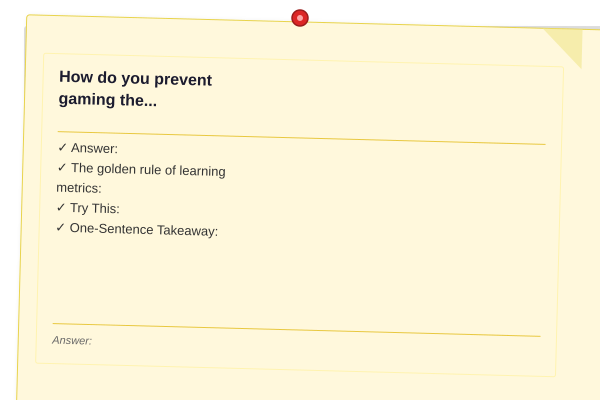
</a>


**Answer:** When you measure learning, what you measure is what you'll optimize — but optimizing the metric isn't the same as optimizing learning. You need safeguards against metric gaming.

```typescript
interface MetricGuard {
  metric: string;
  gamingBehavior: string;
  trueLearningBehavior: string;
  detectionRule: string;
}

class AntiGamingSystem {
  private guards: MetricGuard[] = [
    {
      metric: 'Concepts per day',
      gamingBehavior: 'Counting trivial concepts to inflate velocity',
      trueLearningBehavior: 'Tracking meaningful concept mastery with 80%+ recall',
      detectionRule: 'If velocity > 10 concepts/day, verify recall at 7 days',
    },
    {
      metric: 'Study hours',
      gamingBehavior: 'Sitting at desk without focusing (clocking hours)',
      trueLearningBehavior: 'Tracking focused, high-quality session time',
      detectionRule: 'If hours are high but quality and recall are low, reduce session targets',
    },
    {
      metric: 'Streak days',
      gamingBehavior: '5-min "study" sessions just to keep streak alive',
      trueLearningBehavior: 'Daily learning with meaningful engagement (20+ min)',
      detectionRule: 'If streak is >30 but avg session quality <5, suspend streak tracking',
    },
    {
      metric: 'Problems solved',
      gamingBehavior: 'Solving easy problems repeatedly to inflate count',
      trueLearningBehavior: 'Tackling progressively harder problems across topics',
      detectionRule: 'If problem count increases but difficulty level stays flat, diversify',
    },
    {
      metric: 'Test scores',
      gamingBehavior: 'Re-taking same test until score improves (memorizing answers)',
      trueLearningBehavior: 'Taking new tests on the same topics to verify transfer',
      detectionRule: 'If test score is >90% but new-variant score is <60%, use only fresh tests',
    },
  ];

  audit(metrics: {
    velocity: number;
    avgSessionMinutes: number;
    streakDays: number;
    qualityScore: number;
    recallRate: number;
  }): string[] {
    const warnings: string[] = [];

    if (metrics.velocity > 10 && metrics.recallRate < 60) {
      warnings.push('⚠️ High velocity + low recall suggests shallow learning. Slow down and verify retention.');
    }

    if (metrics.streakDays > 30 && metrics.avgSessionMinutes < 15) {
      warnings.push('⚠️ Long streak with short sessions. Are you "streak farming"? Aim for 25+ min meaningful sessions.');
    }

    if (metrics.qualityScore < 5 && metrics.streakDays > 7) {
      warnings.push('⚠️ Low quality despite long streak. Consider reducing frequency and increasing session quality.');
    }

    if (warnings.length === 0) {
      warnings.push('✅ Metrics look healthy. Continue current approach.');
    }

    return warnings;
  }

  getGuards(): MetricGuard[] {
    return this.guards;
  }
}
```

**The golden rule of learning metrics:** The metric is not the goal. The learning is the goal. If optimizing the metric makes you a worse learner (e.g., studying less effectively to keep a streak), the metric has become toxic and should be dropped.

**Try This:** Review your current tracking system. For every metric you track, ask: "Would I be disappointed if this metric improved but my actual learning didn't?" If yes, the metric is gameable. Add a guard or replace it.

**One-Sentence Takeaway:** Every metric can be gamed — guard against it by tracking secondary verification metrics (e.g., pair velocity with 7-day recall, not just concepts-per-day).

---

### Self-Assessment Quiz

<a href="../../assets/images/diagrams/learning-how-to-learn/ch-13-learning-analytics/self-assessment-quiz-handwritten.svg" target="_blank" rel="noopener">
  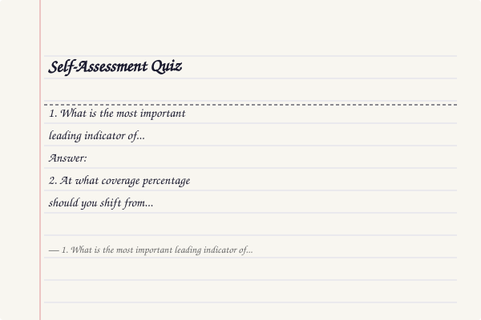
</a>
<a href="../../assets/images/diagrams/learning-how-to-learn/ch-13-learning-analytics/self-assessment-quiz-diagram.svg" target="_blank" rel="noopener">
  
</a>
<a href="../../assets/images/diagrams/learning-how-to-learn/ch-13-learning-analytics/self-assessment-quiz-sticky.svg" target="_blank" rel="noopener">
  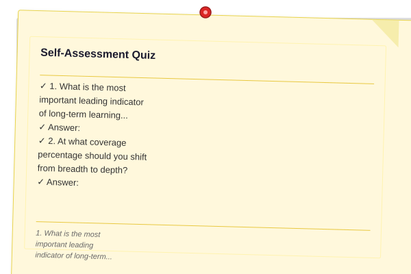
</a>


**1. What is the most important leading indicator of long-term learning success?**
a) Number of books purchased
b) Consistency score (daily streak, session adherence)
c) Total study hours
d) Number of highlights in notes

**Answer:** b) Consistency is the strongest predictor of long-term learning outcomes — daily 20-minute sessions beat weekly 4-hour marathons for retention and skill development.

**2. At what coverage percentage should you shift from breadth to depth?**
a) 20-30%
b) 40-50%
c) 70-80%
d) 100%

**Answer:** c) At 70-80% coverage, you've learned the core concepts. Further breadth gives diminishing returns — focus on deepening understanding, edge cases, and teaching others.

**3. What does a learning plateau look like in tracked data?**
a) Increasing velocity week over week
b) Flat or declining velocity for 3+ weeks despite consistent effort
c) High quality scores with low study hours
d) Increasing streak with decreasing coverage

**Answer:** b) A plateau is detectable when weekly concept velocity flattens or declines for 3+ weeks despite consistent study hours — it's typically caused by topic complexity, burnout, or a prerequisite gap.

**4. How should you test whether morning or evening study works better for you?**
a) Ask friends what works for them
b) Read a blog post about optimal study times
c) Run a 14-day A/B test (7 days morning, 7 days evening) and measure recall
d) Study whenever you feel like it and track results

**Answer:** c) A/B testing with equal duration for each condition gives you personal data — your optimal time may differ from the average, and only measurement will tell.

**5. What is the most efficient learning method by ROI (concepts retained per hour)?**
a) Reading with highlighting
b) Watching tutorial videos
c) Teaching someone else
d) Re-reading notes

**Answer:** c) Teaching forces active recall, gap detection, and knowledge reorganization — it produces 5x the retention per hour compared to passive methods like reading.

**6. What is the recommended duration for a weekly learning review?**
a) 5 minutes
b) 30 minutes
c) 2 hours
d) No review needed — just study more

**Answer:** b) 30 minutes is sufficient to review data, identify patterns, and make one targeted adjustment for the coming week.

**7. How do you measure your personal forgetting curve?**
a) Use Ebbinghaus's original curve — it's universal
b) Test recall at 1, 7, and 30 days for each concept and average the results
c) Guess — it's too complex to measure
d) Ask your teacher

**Answer:** b) Your forgetting curve is personal — it depends on your encoding quality, prior knowledge, and sleep. Test yourself at standardized intervals and compute your own curve.

**8. Which metric is most likely to be gamed by learners?**
a) Concepts mastered (verified by 7-day recall test)
b) Daily study streak
c) Teaching quality (rated by students)
d) Recall accuracy on randomized tests

**Answer:** b) Streaks are easily gamed by 5-minute "study" sessions — always pair streak tracking with minimum session duration and quality requirements.

**9. What should you do when you detect a learning plateau?**
a) Study harder — push through with more hours
b) Switch topics for 3 days, then re-evaluate
c) Give up on the topic
d) Ignore it — plateaus are normal

**Answer:** b) Switching topics for 3 days provides diffuse-mode processing time and prevents burnout. If the plateau persists after the break, investigate prerequisite gaps or method issues.

**10. What is the minimum data collection period before you can draw meaningful conclusions from learning analytics?**
a) 1 day
b) 1 week
c) 2-3 weeks
d) 6 months

**Answer:** c) 2-3 weeks gives enough data to establish baselines for velocity, quality, and consistency. Shorter periods are dominated by daily noise.

---

## Concept Comparison Table

| Concept | Definition | Best For | Pitfall |
|---------|-----------|----------|---------|
| Learning Velocity | Concepts mastered per unit time | Detecting plateaus, measuring pace | Chasing velocity over depth |
| Forgetting Curve | Recall probability over time | Optimal review scheduling | Using Ebbinghaus instead of personal data |
| Knowledge Coverage | % of topic graph mastered | Identifying gaps, prioritizing study | Neglecting depth for breadth |
| Session Quality | Dimensional effectiveness score | Optimizing study conditions | Single-score ratings miss nuance |
| Learning ROI | Retention per minute invested | Choosing best methods | Ignoring long-term compounding |
| Weekly Review | Structured 30-min retrospective | Continuous improvement | Making no changes based on data |
| A/B Testing | Comparing two methods | Personal optimization | Too short experiment duration |
| Metric Gaming | Optimizing the number, not the learning | Sabotaging measurement | Not having verification metrics |

## Cross-Application Matrix

| Technique | DSA Prep | GATE/Theory | Framework Learning | Coding Interviews |
|-----------|----------|-------------|-------------------|-------------------|
| Velocity Tracking | Problems solved/week | Topics mastered/week | Features built/week | Questions practiced/week |
| Retention Testing | 1/7/30d recall on algo patterns | 1/7/30d recall on theory concepts | 1/7/30d recall on API knowledge | 1/7/30d recall on patterns |
| Coverage Mapping | All DSA patterns vs mastered | All GATE subjects vs completed | All framework features vs used | All interview categories vs practiced |
| Quality Scoring | Session focus/engagement | Session understanding | Session application | Session confidence |
| A/B Testing | Pomodoro vs deep work for DSA | Morning vs evening for theory | Tutorial vs docs-first learning | Mock interview frequency |
| Weekly Review | Which topics need more practice | Which subjects lag behind | Which features to study next | Which question types to drill |

## Quick Reference

| Category | Key Points |
|----------|-----------|
| Five Core Metrics | - Velocity: concepts per day/week - Retention: 1/7/30d recall % - Coverage: topic map completion - Quality: 1-10 dimensional score - Consistency: streak & adherence |
| Plateau Detection | - Track weekly velocity - Plateaus = 3+ weeks flat/declining - Causes: motivation, complexity, burnout, gap - Response: switch topics, reduce load, fill gaps |
| Forgetting Curve | - Measure at 1d, 7d, 30d - Compare to Ebbinghaus baseline - Schedule reviews before 90% drop - Personal curve > generic curve |
| ROI Optimization | - Teaching > active recall > practice > passive - Replace 1 passive hour with active method - Measure concepts retained per hour |
| Weekly Review | - 30 minutes every Sunday - Review data, identify wins/challenges - Make exactly ONE adjustment |
| Anti-Gaming | - Pair every metric with a verification metric - Drop metrics that incentivize bad behavior - The metric is not the goal |

## Chapter Summary

- The five core learning metrics are velocity, retention, coverage, quality, and consistency — track all five for at least 2 weeks to establish baselines
- Learning plateaus are detectable 2-3 weeks before you feel them — monitor weekly velocity and intervene with the appropriate response (switch topics, reduce load, or fill gaps)
- Measure your personal forgetting curve by testing recall at 1, 7, and 30 days — schedule reviews just before retention drops below 90%
- Knowledge coverage maps reveal exactly where you are in a topic — focus on easy gaps first (prerequisites already met)
- Session quality is best measured dimensionally (focus, understanding, recall, engagement, difficulty) to reveal optimal conditions
- Run 2-week A/B tests on study methods — adopt the winner based on data, not intuition
- A 30-minute weekly review transforms data into actionable adjustments — make exactly one change per week
- Learning ROI (concepts retained per hour) is 3-5x higher for active methods (teaching, recall) than passive ones (reading, highlighting)
- Every metric can be gamed — guard against it with secondary verification metrics
- The metric is not the goal — if optimizing the metric makes you a worse learner, drop it

## Exercises

1. For the next 7 days, log every study session: date, topic, duration, quality, concepts learned.
2. Compute your 5 core metrics at day 7. Identify one pattern you didn't expect.
3. Graph your weekly concept velocity for the last 4 weeks. Is there a plateau?
4. Test yourself on 5 concepts at 1-day and 7-day intervals. Compute your personal forgetting curve.
5. Map knowledge coverage for a topic you're studying. List every concept, mark status (untouched/in-progress/mastered).
6. Run an A/B test: 3 days of Pomodoro vs 3 days of deep work. Measure recall at 24 hours for each.
7. Conduct a 30-minute weekly review. Write down wins, challenges, and exactly one adjustment for next week.
8. Compute your learning ROI: for each method you used this week, estimate concepts retained per hour.
9. Rewrite one current learning goal using the SMART framework with specific milestones.
10. Audit your tracking system for gaming potential. Add one guard against a gameable metric.

## Chapter Quiz

**Q1:** A learner tracks 30 study hours this week but their 7-day recall is only 40%. What's the most likely issue?
- A) They need to study more hours
- B) They're using low-ROI methods (passive reading) despite high time investment
- C) They're studying topics that are too hard
- D) Their tracking system is broken

<details>
<summary>Answer&lt;/summary&gt;

**Answer:** B — High hours with low retention is the classic sign of low-ROI methods. They're likely spending most of their time on passive activities (reading, watching) instead of active methods (recall, teaching, practice).
</details>

**Q2:** A student's weekly velocity has been flat at 3 concepts/day for 5 weeks despite 1 hour/day of study. What should they do?
- A) Increase to 2 hours/day
- B) Switch to a different topic for 3 days, then re-evaluate
- C) This is normal — continue as-is
- D) Give up on the topic

<details>
<summary>Answer&lt;/summary&gt;

**Answer:** B — A 5-week plateau with consistent effort suggests a complexity mismatch or burnout. Switching topics for 3 days provides diffuse processing and prevents diminishing returns.
</details>

**Q3:** Which combination of metrics best validates genuine learning?
- A) High velocity + long streak
- B) High hours + many highlights
- C) High velocity + high 7-day recall rate
- D) Long streak + many problems solved

<details>
<summary>Answer&lt;/summary&gt;

**Answer:** C — Velocity measures pace, and 7-day recall verifies retention. Together they confirm you're learning quickly AND durably. All other combinations can be gamed.
</details>

**Q4:** A learner's forgetting curve shows 90% recall at day 1 but only 30% at day 7. What does this suggest?
- A) Excellent encoding but insufficient review spacing
- B) Poor initial encoding
- C) The material is too difficult
- D) Sleep debt

<details>
<summary>Answer&lt;/summary&gt;

**Answer:** A — High day-1 recall indicates good initial encoding, but the steep drop by day 7 means the first review interval (spaced repetition) should happen earlier — around day 2-3 instead of waiting a full week.
</details>

**Q5:** A student runs an A/B test comparing morning vs evening study. Morning average quality is 7.5/10, evening is 7.8/10. What should they conclude?
- A) Evening is clearly better
- B) Morning is clearly better
- C) No significant difference — choose based on schedule preference
- D) The test was flawed and should be rerun

<details>
<summary>Answer&lt;/summary&gt;

**Answer:** C — A 0.3-point difference with only 7 days per condition is noise, not signal. Use the method that fits your schedule best, or extend the experiment to 14 days per condition for more confidence.
</details>

## Further Reading

- [Chapter 3: Active Recall & Spaced Repetition](ch-03-active-recall-spaced-repetition.md)
- [Chapter 6: Procrastination, Habits & Deep Work](ch-06-procrastination-habits-deep-work.md)
- [Chapter 10: Meta-Learning & Lifelong System](ch-10-meta-learning-system.md)
- [Chapter 11: AI-Assisted Learning](ch-11-ai-assisted-learning.md)
- [Chapter 14: Social Learning & Communities](ch-14-social-learning-communities.md)
- [Archive: Complete Reference](archive-complete-reference.md)
