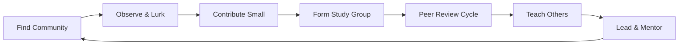

# Chapter 14: Social Learning & Communities

> **Prerequisites:** [Chapter 6: Procrastination, Habits & Deep Work](./ch-06-procrastination-habits-deep-work.md), [Chapter 12: Teaching & Knowledge Transfer](./ch-12-teaching-knowledge-transfer.md)
> **Next:** None (final chapter)

Learning alone is limited. Learning with others compounds. This chapter covers how to leverage social dynamics — accountability groups, online communities, open-source contribution, conferences, study partners, and peer review — to accelerate your learning far beyond what solo study can achieve. You'll learn how to find your learning community, contribute effectively, avoid common social learning pitfalls, and build a network that pulls you upward.

## Learning Objectives

- Design an accountability group that actually works
- Find and evaluate online learning communities
- Use open-source contribution as a structured learning path
- Extract maximum value from conferences and meetups
- Find and maintain effective study partnerships
- Give and receive peer review for learning growth
- Avoid social learning traps (comparison, performance, echo chambers)

### Chapter at a Glance

| Topic | Key Insight | Practical Takeaway |
|-------|-------------|-------------------|
| Accountability Groups | Commitment devices beat willpower | Form a 3-5 person group with weekly check-ins |
| Online Communities | The right community compresses learning years | Find communities with active mentorship |
| Open Source Learning | Real codebase exposure beats tutorials | Start with docs, then test, then small fixes |
| Conferences & Meetups | In-person density accelerates serendipity | Attend 2-3 events/year, focus on conversations |
| Study Partnerships | Peer teaching doubles retention | Weekly 1-hour paired sessions |
| Peer Review | Having your work reviewed reveals blind spots | Request reviews early and often |



---

### Q1: How do you form an effective accountability group?

**Answer:** Accountability groups work because they convert vague intentions into specific commitments with social consequences. But most accountability groups fail because they lack structure.

```typescript
interface AccountabilityGroup {
  name: string;
  members: string[];
  maxSize: number;
  meetingCadence: 'daily' | 'weekly' | 'biweekly';
  meetingDuration: number; // minutes
  checkInTemplate: CheckInTemplate;
}

interface CheckInTemplate {
  whatILearned: string;
  whatIStruggledWith: string;
  myCommitmentForNextPeriod: string;
  helpNeeded: string;
}

class AccountabilityGroupBuilder {
  recommendStructure(preferences: {
    availableFrequency: 'daily' | 'weekly' | 'biweekly';
    commitmentLevel: 'casual' | 'serious' | 'intense';
    topic: string;
  }): AccountabilityGroup {
    const maxSize = preferences.commitmentLevel === 'intense' ? 3 :
                    preferences.commitmentLevel === 'serious' ? 5 : 8;

    const duration = preferences.commitmentLevel === 'intense' ? 30 :
                     preferences.commitmentLevel === 'serious' ? 20 : 15;

    return {
      name: `${preferences.topic} Study Group`,
      members: [],
      maxSize,
      meetingCadence: preferences.availableFrequency,
      meetingDuration: duration,
      checkInTemplate: {
        whatILearned: 'What I learned this period:',
        whatIStruggledWith: 'What I struggled with:',
        myCommitmentForNextPeriod: 'My commitment for next period:',
        helpNeeded: 'Where I need help:',
      },
    };
  }

  generateRules(level: string): string[] {
    const commonRules = [
      'Commitments are specific and measurable ("complete chapters 5-7" not "study more")',
      'Missed check-ins require a written explanation within 24 hours',
      'No judgment zone — struggle is expected and encouraged',
    ];

    if (level === 'intense') {
      commonRules.push('Two missed check-ins = removal from group');
      commonRules.push('Daily standup posts in shared channel (5 min max)');
    }

    if (level === 'serious') {
      commonRules.push('Three missed check-ins = probation for 2 weeks');
      commonRules.push('Weekly 20-minute video standup');
    }

    return commonRules;
  }

  // First meeting agenda
  getFirstMeetingAgenda(): string[] {
    return [
      '1. Introductions and learning goals (5 min each)',
      '2. Set group rules and commitment level (10 min)',
      '3. Define check-in format and frequency (5 min)',
      '4. Schedule first 4 weeks of meetings (5 min)',
      '5. Each person makes their first public commitment (10 min)',
      '6. Set up shared communication channel (5 min)',
    ];
  }
}
```

**Accountability group rules that work:**

| Rule | Why |
|------|-----|
| Specific commitments | "Study DSA" won't work — "Solve 10 LeetCode medium on graphs" will |
| Fixed check-in time | Same time every week builds habit, no scheduling friction |
| Public commitments | Saying it to the group activates social accountability |
| Help requests required | Every check-in must include one ask — prevents passive participation |
| Max 5 members | Larger groups dilute accountability and reduce individual time |
| Fixed duration (8-12 weeks) | Finite commitment lowers the barrier to joining; renew if it works |

**Try This:** Find 2-4 people who want to learn something in the next 8 weeks. Set up a weekly 20-minute check-in using the template above. Each person commits to exactly one measurable goal per week. After 8 weeks, evaluate: did you learn more than you would have alone?

**One-Sentence Takeaway:** Accountability groups work through specific commitments and social consequences — keep it small (3-5 people), structured (same time, same format), and time-boxed (8-12 weeks).

---

### Q2: How do you find and evaluate online learning communities?

**Answer:** The right online community can compress years of learning into months. The wrong one can waste your time or, worse, teach you incorrect patterns. Here's how to evaluate a community systematically.

```typescript
interface CommunityEvaluation {
  name: string;
  platform: 'discord' | 'reddit' | 'slack' | 'github' | 'forum' | 'twitter';
  topic: string;
  score: number; // 0-100
  criteria: {
    activeMentorship: number; // 0-10
    signalToNoise: number; // 0-10
    beginnerFriendliness: number; // 0-10
    expertPresence: number; // 0-10
    projectActivity: number; // 0-10
    responseTime: number; // 0-10
  };
  recommendation: 'join' | 'lurk' | 'avoid';
}

class CommunityEvaluator {
  evaluate(options: {
    name: string;
    platform: string;
    observations: {
      mentorsActive: boolean;
      beginnersWelcome: boolean;
      expertsEngage: boolean;
      projectsShared: boolean;
      responseToQuestions: 'hours' | 'days' | 'never';
    };
  }): CommunityEvaluation {
    let score = 0;
    const criteria = {
      activeMentorship: options.observations.mentorsActive ? 8 : 2,
      signalToNoise: 5, // hard to judge without extended observation
      beginnerFriendliness: options.observations.beginnersWelcome ? 8 : 3,
      expertPresence: options.observations.expertsEngage ? 9 : 3,
      projectActivity: options.observations.projectsShared ? 7 : 3,
      responseTime: options.observations.responseToQuestions === 'hours' ? 9 :
                    options.observations.responseToQuestions === 'days' ? 5 : 1,
    };

    score = Object.values(criteria).reduce((s, v) => s + v, 0);
    const normalizedScore = Math.round((score / 60) * 100);

    const recommendation = normalizedScore >= 70 ? 'join' :
                           normalizedScore >= 40 ? 'lurk' : 'avoid';

    return {
      name: options.name,
      platform: options.platform as any,
      topic: options.name.split(' ')[0],
      score: normalizedScore,
      criteria,
      recommendation,
    };
  }

  getCommunityTypes(): Array<{
    type: string;
    bestFor: string;
    examples: string;
    evaluationTip: string;
  }> {
    return [
      {
        type: 'Discord/Slack groups',
        bestFor: 'Real-time help, casual discussion, study groups',
        examples: 'Programming language servers, framework-specific communities',
        evaluationTip: 'Check if questions get answered within hours. If a question sits for days unanswered, the community is dead.',
      },
      {
        type: 'Reddit subreddits',
        bestFor: 'Discussion, resources, broader perspective',
        examples: 'r/learnprogramming, r/MachineLearning, r/cscareerquestions',
        evaluationTip: 'Sort by new, not hot. The "hot" feed shows popular content, not the actual state of the community.',
      },
      {
        type: 'Forum communities',
        bestFor: 'Deep technical discussions, archives, searchable knowledge',
        examples: 'Stack Overflow, Dev.to, Hashnode',
        evaluationTip: 'Search for questions you have. If they already have good answers, the community is healthy.',
      },
      {
        type: 'GitHub communities',
        bestFor: 'Code review, contribution, real project exposure',
        examples: 'Any active open-source project',
        evaluationTip: 'Check recent PRs and their review quality. Good reviews indicate a healthy learning environment.',
      },
      {
        type: 'Twitter/X communities',
        bestFor: 'Following experts, trends, networking',
        examples: '#100DaysOfCode, tech Twitter',
        evaluationTip: 'Follow people who share their learning process, not just their successes. Avoid pure hype accounts.',
      },
    ];
  }
}
```

**Community evaluation checklist:**

| Criterion | Good Sign | Bad Sign |
|-----------|-----------|----------|
| Mentorship | Senior members answer beginner questions | Experts only talk to each other |
| Response time | Questions answered within hours | Questions go unanswered for days |
| Beginner treatment | Beginners are welcomed and guided | Beginners are ignored or mocked |
| Signal-to-noise | Most posts are substantive | Mostly memes, self-promotion, or rants |
| Project sharing | Members share work-in-progress | Only finished projects are shared |
| Code review quality | Reviews explain WHY, not just WHAT | Reviews are superficial or absent |

**Try This:** This week, lurk in 3 different communities related to a topic you're studying. Evaluate each using the checklist above. Pick one to actively participate in and one to monitor passively. After 2 weeks of active participation, evaluate whether your learning has accelerated.

**One-Sentence Takeaway:** Lurk before you join — evaluate a community by response time, beginner treatment, mentorship presence, and signal-to-noise ratio before investing time in participation.

---

### Q3: How do you use open-source contribution as a learning tool?

**Answer:** Open-source contribution is one of the most effective ways to learn real-world software development. You get code review from experienced developers, exposure to production codebases, and real user impact. But the key is starting small and following a structured learning path.

```typescript
interface OSSLearningPath {
  phase: string;
  activities: string[];
  estimatedDuration: string;
  skillsBuilt: string[];
}

class OSSLearner {
  getPath(): OSSLearningPath[] {
    return [
      {
        phase: 'Phase 1: Consume',
        activities: [
          'Read the project README and CONTRIBUTING.md',
          'Set up the project locally (document any issues)',
          'Read through open issues to understand the project rhythm',
          'Study merged PRs to understand review standards',
        ],
        estimatedDuration: '1-2 weeks',
        skillsBuilt: ['Project setup', 'Documentation navigation', 'Understanding code review standards'],
      },
      {
        phase: 'Phase 2: Contribute Documentation',
        activities: [
          'Fix typos in README or docs',
          'Improve unclear documentation sections',
          'Add code examples to existing docs',
          'Update out-of-date installation instructions',
        ],
        estimatedDuration: '1-2 weeks',
        skillsBuilt: ['PR workflow', 'CI checks', 'Writing for clarity', 'Asking for review'],
      },
      {
        phase: 'Phase 3: Contribute Tests',
        activities: [
          'Find untested edge cases in existing code',
          'Add unit tests for uncovered functions',
          'Improve test descriptions and assertions',
          'Run existing tests and fix any that fail',
        ],
        estimatedDuration: '2-4 weeks',
        skillsBuilt: ['Testing patterns', 'Edge case thinking', 'Assertion design'],
      },
      {
        phase: 'Phase 4: Contribute Small Fixes',
        activities: [
          'Fix label: "good first issue" bugs',
          'Handle simple error cases',
          'Add input validation',
          'Refactor small functions for clarity',
        ],
        estimatedDuration: '4-8 weeks',
        skillsBuilt: ['Bug fixing', 'Code navigation', 'Working within existing patterns'],
      },
      {
        phase: 'Phase 5: Contribute Features',
        activities: [
          'Pick label: "help wanted" issues',
          'Write design doc for feature approach',
          'Implement feature with tests',
          'Respond to review feedback iteratively',
        ],
        estimatedDuration: '8-16 weeks',
        skillsBuilt: ['Feature design', 'Iterative development', 'Technical communication', 'Project management'],
      },
    ];
  }

  findBeginnerFriendlyProjects(criteria: {
    language: string;
    interest: string;
  }): string[] {
    // In practice, search GitHub with these labels:
    const labels = [
      'good-first-issue',
      'help-wanted',
      'beginner-friendly',
      'up-for-grabs',
    ];

    return [
      `Search GitHub for: ${criteria.language} repositories with "${labels[0]}" label in ${criteria.interest} domain`,
      `Recommended starting points:`,
      `- First contributions: https://github.com/firstcontributions/first-contributions`,
      `- Up For Grabs: https://up-for-grabs.net`,
      `- Good First Issues: https://goodfirstissues.com`,
    ];
  }

  // Track learning from OSS contribution
  trackContributions(log: Array<{
    project: string;
    contributionType: string;
    linesChanged: number;
    reviewComments: number;
    merged: boolean;
    skillsLearned: string[];
  }>): string {
    const totalPRs = log.length;
    const merges = log.filter(c => c.merged).length;
    const allSkills = new Set(log.flatMap(c => c.skillsLearned));

    return `
📊 Open Source Learning Report
━━━━━━━━━━━━━━━━━━━━━━━━━━━━━━━━━━━━━━━━
Total contributions: ${totalPRs}
Merged: ${merges}/${totalPRs} (${totalPRs > 0 ? Math.round(merges / totalPRs * 100) : 0}%)
Skills gained: ${allSkills.size}
  - ${Array.from(allSkills).join('\n  - ')}
━━━━━━━━━━━━━━━━━━━━━━━━━━━━━━━━━━━━━━━━
Next: ${merges >= 5 ? 'Move to Phase 5 (feature contributions)' : 'Continue Phase 4 (small fixes)'}`;
  }
}
```

**OSS learning progression:**

| Phase | Activity | Learning Goal | Time |
|-------|----------|---------------|------|
| 1 | Consume (read, set up, study) | Understand project structure and culture | 1-2 weeks |
| 2 | Fix docs | Learn PR workflow with low stakes | 1-2 weeks |
| 3 | Write tests | Learn testing patterns and edge cases | 2-4 weeks |
| 4 | Fix small bugs | Practice code navigation and fixing | 4-8 weeks |
| 5 | Implement features | Full feature development cycle | 8-16 weeks |
| 6 | Review others' PRs | Learn evaluation and communication | Ongoing |

**Try This:** Pick one open-source project you use or admire. Spend one week in Phase 1 (set up, read issues, study merged PRs). Submit one documentation fix or test improvement in Phase 2-3. Experience the review process. The learning from that single contribution is worth more than 10 tutorials.

**One-Sentence Takeaway:** Open-source contribution follows a structured progression (docs → tests → fixes → features) — each phase builds skills for the next, with the review process being the primary learning mechanism.

---

### Q4: How do you find and maintain effective study partnerships?

**Answer:** A good study partner multiplies learning through accountability, peer teaching, and shared struggle. A bad study partnership wastes time with distraction and comparison.

```typescript
interface StudyPartnerProfile {
  name: string;
  topic: string;
  skillLevel: number; // 1-10
  availability: string;
  preferredFormat: 'pair-program' | 'discuss' | 'quiz' | 'review';
  commitmentLevel: 'casual' | 'regular' | 'intense';
}

interface PartnershipAgreement {
  partner1: StudyPartnerProfile;
  partner2: StudyPartnerProfile;
  meetingSchedule: string;
  sessionFormat: string;
  duration: number; // weeks
  communicationChannel: string;
}

class StudyPartnerMatcher {
  findCompatiblePartners(
    you: StudyPartnerProfile,
    candidates: StudyPartnerProfile[]
  ): Array<{ partner: StudyPartnerProfile; compatibility: number }> {
    return candidates
      .filter(c => c.name !== you.name)
      .map(candidate => {
        let compatibility = 50; // base score

        // Topic match: same or adjacent topic
        if (candidate.topic === you.topic) compatibility += 25;
        else if (this.topicsRelated(candidate.topic, you.topic)) compatibility += 10;

        // Skill level: close but not identical (you can learn from each other)
        const skillDiff = Math.abs(candidate.skillLevel - you.skillLevel);
        if (skillDiff <= 2) compatibility += 20;
        else if (skillDiff <= 4) compatibility += 10;

        // Commitment match
        if (candidate.commitmentLevel === you.commitmentLevel) compatibility += 15;

        // Format match
        if (candidate.preferredFormat === you.preferredFormat) compatibility += 10;

        return { partner: candidate, compatibility };
      })
      .sort((a, b) => b.compatibility - a.compatibility);
  }

  private topicsRelated(t1: string, t2: string): boolean {
    const related: Record<string, string[]> = {
      'algorithms': ['data-structures', 'competitive-programming'],
      'react': ['javascript', 'typescript', 'frontend'],
      'python': ['data-science', 'automation', 'backend'],
    };
    return (related[t1] || []).includes(t2) || (related[t2] || []).includes(t1);
  }

  createAgreement(
    partner1: StudyPartnerProfile,
    partner2: StudyPartnerProfile
  ): PartnershipAgreement {
    return {
      partner1,
      partner2,
      meetingSchedule: this.suggestSchedule(partner1, partner2),
      sessionFormat: partner1.preferredFormat,
      duration: 8, // 8-week trial
      communicationChannel: 'Set up a shared channel',
    };
  }

  private suggestSchedule(p1: StudyPartnerProfile, p2: StudyPartnerProfile): string {
    if (p1.commitmentLevel === 'intense' && p2.commitmentLevel === 'intense') {
      return 'Twice weekly, 45 minutes each';
    }
    if (p1.commitmentLevel === 'regular' || p2.commitmentLevel === 'regular') {
      return 'Weekly, 60 minutes';
    }
    return 'Biweekly, 45 minutes';
  }

  getPartnershipRules(): string[] {
    return [
      '1. Set specific goals for each session ("solve 3 DP problems" not "study together")',
      '2. Alternate who teaches each session — both must teach, both must learn',
      '3. No passive watching — if one person is coding, the other is actively reviewing',
      '4. End each session by writing down what each person learned',
      '5. After 4 sessions, evaluate: is this partnership working?',
      '6. It\'s OK to end a partnership that isn\'t working — politely and honestly',
    ];
  }
}
```

**Study partnership formats:**

| Format | Best For | Structure |
|--------|----------|-----------|
| Peer quizzing | Memorization, active recall | 30 min: each quizzes the other on last week's material |
| Pair solving | Problem-solving skills | 45 min: solve problems together, alternating driver/navigator |
| Concept teaching | Deep understanding | 40 min: each teaches a concept for 20 min, Q&A follows |
| Code review | Code quality | 30 min: review each other's code before it's submitted |
| Mock interview | Interview prep | 60 min: full mock with feedback |

**Try This:** Find one study partner for a topic you're actively learning. Set up a weekly 60-minute session for 4 weeks. Use alternating teaching: week 1 you teach, week 2 they teach. After 4 weeks, evaluate whether your learning accelerated. Research shows paired learning produces 2x retention vs solo study.

**One-Sentence Takeaway:** The best study partnerships pair people at similar levels with complementary strengths — alternate teaching roles, set specific session goals, and don't be afraid to end a partnership that isn't working.

---

### Q5: How do you extract maximum value from conferences and meetups?

**Answer:** Conferences are expensive in both money and time. Most attendees get minimal value because they treat it like TV (passive consumption). The real value is in the conversations between sessions.

```typescript
interface ConferencePlan {
  name: string;
  date: Date;
  talksSelected: string[];
  peopleToMeet: string[];
  questionsToAsk: string[];
  networkingGoals: string[];
  followUpPlan: string[];
}

class ConferenceOptimizer {
  planConference(config: {
    name: string;
    talks: string[];
    speakers: string[];
    attendees: string[];
    duration: number; // days
  }): ConferencePlan {
    return {
      name: config.name,
      date: new Date(),
      talksSelected: this.selectTalks(config.talks),
      peopleToMeet: this.prioritizePeople(config.speakers, config.attendees),
      questionsToAsk: [],
      networkingGoals: [
        'Have 5 substantive conversations (10+ min each)',
        'Exchange contact info with 3 people I want to follow up with',
        'Learn one new approach or tool I can apply immediately',
        'Identify one community I want to join or contribute to',
      ],
      followUpPlan: [
        'Send LinkedIn/follow request within 24 hours of meeting',
        'Reference something specific from the conversation',
        'Share one takeaway from their talk or discussion',
        'Set up a 15-min virtual coffee if mutual interest',
      ],
    };
  }

  private selectTalks(talks: string[]): string[] {
    // Rule 1: Attend talks outside your immediate expertise
    // (you already know what you know)
    // Rule 2: Skip talks that will be recorded (watch later)
    // Rule 3: Prioritize interactive sessions (workshops > lectures)
    return talks.slice(0, Math.ceil(talks.length * 0.4));
  }

  private prioritizePeople(speakers: string[], attendees: string[]): string[] {
    // Priority 1: Speakers whose work you admire
    // Priority 2: People doing interesting work in your area
    // Priority 3: Other attendees you can learn from
    return speakers.slice(0, 3).concat(attendees.slice(0, 3));
  }

  getMaxValueSchedule(): string {
    return `
📅 Conference Schedule for Maximum Learning

Before:
- Research speakers and their recent work
- Prepare 2-3 questions per speaker you want to meet
- Set specific goals (not "network" but "find 3 people doing X")

During:
- Day 1 morning: Attend keynotes (set context)
- Day 1 afternoon: Workshops (interactive > passive)
- Day 2: Minimal talks — maximize hallway conversations
- Every break: Talk to strangers. Ask "what brought you here?"
- Evening social events: Go. This is where deep connections form.

After:
- 24 hours: Send follow-ups to everyone you connected with
- 1 week: Implement one thing you learned
- 1 month: Check in with 2-3 connections
- 3 months: Evaluate ROI — was it worth the investment?`;
  }

  calculateROI(config: {
    cost: number;
    days: number;
    newConnections: number;
    actionableInsights: number;
    ongoingRelationships: number;
  }): string {
    const costPerActionableInsight = config.actionableInsights > 0
      ? Math.round(config.cost / config.actionableInsights)
      : config.cost;

    return `
💰 Conference ROI Analysis
━━━━━━━━━━━━━━━━━━━━━━━━━━━━━━━━━━━━━━━━
Total cost: $${config.cost}
Days invested: ${config.days}
New connections: ${config.newConnections}
Actionable insights: ${config.actionableInsights}
Ongoing relationships: ${config.ongoingRelationships}
Cost per actionable insight: $${costPerActionableInsight}
━━━━━━━━━━━━━━━━━━━━━━━━━━━━━━━━━━━━━━━━
Good ROI: >5 ongoing relationships or >10 actionable insights
Consider: is your time better spent elsewhere next year?`;
  }
}
```

**The 80/20 rule for conferences:**
- **80% of value** comes from conversations between sessions, not the sessions themselves
- **20% of talks** are worth attending live (the rest you can watch later)
- **Strategy:** Attend fewer talks, maximize hallway conversations

**Try This:** The next conference you attend, skip 60% of the talks. Spend that time in the hallway, coffee line, or expo floor talking to people. Prepare 3 questions before each conversation: What are you working on? What's the hardest problem you've solved recently? What should I read/watch/follow to learn more about your area?

**One-Sentence Takeaway:** Conferences are for conversations, not content — the sessions are recorded, but hallway chats with strangers are the irreproducible value.

---

### Q6: How does peer review accelerate learning?

**Answer:** Having your work reviewed by peers reveals blind spots you can't see yourself. Reviewing others' work trains your evaluation skills and exposes you to different approaches. Both directions teach.

```typescript
interface PeerReviewSession {
  reviewer: string;
  author: string;
  workType: 'code' | 'writing' | 'design' | 'plan';
  strengths: string[];
  improvements: string[];
  questions: string[];
  learningPoints: string[]; // What the reviewer learned
}

class PeerReviewSystem {
  requestReview(
    author: string,
    work: string,
    workType: PeerReviewSession['workType']
  ): PeerReviewSession {
    // In practice, this structures a review request
    return {
      reviewer: 'peer',
      author,
      workType,
      strengths: [],
      improvements: [],
      questions: [],
      learningPoints: [],
    };
  }

  // Structured review format
  generateReviewTemplate(workType: string): string {
    const templates: Record<string, string> = {
      code: `
## Code Review
### Strengths (what's working well)
- 
### Suggestions (what could improve)
- 
### Questions (what I don't understand)
- 
### Learning (what I learned from reading this)
- `,
      writing: `
## Writing Review
### Strengths (clarity, structure, examples)
- 
### Confusion points (where I got lost)
- 
### Missing elements (what would help)
- 
### Learning (what I learned from reading this)
- `,
    };

    return templates[workType] || 'Use a structured format with Strengths, Improvements, Questions, and Learning.';
  }

  // Benefits of giving reviews (often underestimated)
  benefitsForReviewer(): string[] {
    return [
      'Reading others\' code exposes you to patterns and techniques you haven\'t seen',
      'Evaluating someone else\'s work trains your critical thinking',
      'Explaining why something could be improved forces you to articulate principles',
      'Seeing different approaches to the same problem broadens your solution space',
      'Regular reviewing builds your communication and mentoring skills',
      'You internalize quality standards by applying them to others\' work',
    ];
  }

  // Benefits of receiving reviews
  benefitsForAuthor(): string[] {
    return [
      'External perspective catches blind spots you can\'t see',
      'Specific feedback is faster than learning everything by trial and error',
      'Knowing you\'ll be reviewed raises your quality bar before submission',
      'Receiving feedback builds resilience and separates ego from work',
      'Patterns in feedback across reviews reveal your systematic weaknesses',
    ];
  }
}
```

**Peer review protocol:**

| Step | Action | Time |
|------|--------|------|
| 1 | Submit work with specific review requests ("focus on error handling") | 5 min |
| 2 | Reviewer reads and notes observations (no feedback during first pass) | 15-30 min |
| 3 | Reviewer writes structured feedback: strengths, suggestions, questions, learning | 15-20 min |
| 4 | Author reads feedback and writes down questions before discussing | 10 min |
| 5 | Live discussion (or async thread) to clarify and debate | 15-20 min |
| 6 | Author revises and thanks reviewer (always acknowledge good reviews) | varies |

**Try This:** This week, ask someone to review a piece of your work (code, writing, design) using the structured template above. Also review someone else's work. After both, write down one thing you learned from receiving feedback and one thing you learned from giving it.

**One-Sentence Takeaway:** Peer review is bidirectional learning — receiving reviews reveals your blind spots, giving reviews trains your evaluation skills and exposes you to different approaches.

---

### Q7: How do you find your learning community?

**Answer:** A learning community is a group of people at similar stages who share progress, struggle together, and pull each other up. Finding yours takes intentional effort, but the ROI is enormous.

```typescript
interface CommunitySearch {
  criteria: string[];
  platforms: string[];
  redFlags: string[];
  greenFlags: string[];
}

class CommunityFinder {
  getSearchStrategy(topic: string, location: string): CommunitySearch {
    return {
      criteria: [
        `Active ${topic} community in ${location}`,
        `Members are at a similar level or slightly ahead of me`,
        `There's a culture of helping beginners`,
        `Projects or discussions happen regularly, not just Q&A`,
        `No tolerance for toxic behavior or gatekeeping`,
      ],
      platforms: [
        `Discord: "awesome ${topic}" GitHub repos often list community servers`,
        `Reddit: r/${topic} sidebar links to related communities`,
        `Meetup.com: ${topic} meetups near ${location}`,
        `GitHub: project repositories with active issue discussions`,
        `Twitter: follow ${topic} experts and see what communities they mention`,
        `Local: university clubs, coworking spaces, library groups`,
      ],
      redFlags: [
        'Newcomers are ignored or mocked',
        'Only a few people dominate all discussions',
        'Questions go unanswered for days',
        'The community is mostly self-promotion',
        'There\'s a single "right way" enforced by moderators',
      ],
      greenFlags: [
        'Beginners are welcomed with resources',
        'Multiple people answer questions with different perspectives',
        'Members share work-in-progress, not just finished work',
        'There are regular events or study sessions',
        'Senior members actively mentor junior ones',
      ],
    };
  }

  evaluateCommunity(observations: {
    name: string;
    beginnerTreatment: string;
    responseTime: string;
    discussionQuality: string;
    mentorshipPresent: boolean;
    redFlags: number;
    greenFlags: number;
  }): 'join' | 'lurk' | 'avoid' {
    if (observations.redFlags >= 3) return 'avoid';
    if (observations.greenFlags >= 4) return 'join';
    if (observations.greenFlags >= 2) return 'lurk';
    return 'avoid';
  }
}
```

**The 30-day community audit:**

| Week | Action | Goal |
|------|--------|------|
| 1 | Search for 5 communities related to your topic | Build a candidate list |
| 2 | Lurk in each — evaluate using red/green flags | Narrow to 2-3 communities |
| 3 | Start participating — answer one question, ask one question | Break the ice |
| 4 | Form a micro-community within the community | Find 3-5 study partners |

**Try This:** This week, search for 5 communities related to anything you're currently learning. Apply the red/green flag evaluation. Choose one to actively join. Within 2 weeks, introduce yourself and ask or answer one question.

**One-Sentence Takeaway:** Finding your learning community is an active search process — apply red/green flags to evaluate, lurk before committing, and look for communities that welcome beginners and have active mentorship.

---

### Q8: How do you avoid social learning pitfalls?

**Answer:** Social learning has a dark side. Comparison, imposter syndrome, echo chambers, groupthink, and performative learning can all undermine your progress. Here's how to recognize and avoid each.

```typescript
interface SocialPitfall {
  name: string;
  symptom: string;
  mechanism: string;
  prevention: string;
  recovery: string;
}

class SocialPitfallGuard {
  private pitfalls: SocialPitfall[] = [
    {
      name: 'Comparison Trap',
      symptom: 'Feeling behind because others seem to learn faster or know more',
      mechanism: 'Social media shows highlights while you compare against your behind-the-scenes',
      prevention: 'Track your own metrics (Chapter 13). Compare against your past self, not strangers.',
      recovery: 'Social media detox for 1 week. Compile a "my progress" list of what you\'ve achieved.',
    },
    {
      name: 'Performative Learning',
      symptom: 'Spending more time documenting learning than actually learning',
      mechanism: 'External validation (likes, retweets) rewards posting over understanding',
      prevention: 'Track creation-to-learning ratio: max 20% of study time on creating content',
      recovery: '1 week of silent learning: study without posting anything. Measure if depth improves.',
    },
    {
      name: 'Echo Chamber Effect',
      symptom: 'Everyone agrees on one approach; alternatives feel wrong',
      mechanism: 'Communities attract like-minded people, creating a closed feedback loop',
      prevention: 'Actively seek out opposing views. Read criticism of tools/methods you use.',
      recovery: 'Join a community that uses a competing technology. Learn their perspective.',
    },
    {
      name: 'Groupthink in Study Groups',
      symptom: 'Everyone in the group has the same blind spots because they learn together',
      mechanism: 'Groups reinforce each other\'s understanding, including misconceptions',
      prevention: 'Regularly invite outside experts or rotate group membership',
      recovery: 'Have each member independently solve a problem, then compare approaches.',
    },
    {
      name: 'Tutorial Dependency',
      symptom: 'Can only learn through structured content created by community members',
      mechanism: 'Community produces endless tutorials, creating passive consumption habit',
      prevention: 'Alternate tutorial weeks with "from scratch" weeks (no resources allowed)',
      recovery: 'Pick a project and build it without any tutorial — only reference docs.',
    },
    {
      name: 'Social Procrastination',
      symptom: 'Chatting about learning replaces actual learning',
      mechanism: 'Talking about studying feels productive but isn\'t',
      prevention: 'No learning discussion in the first 45 minutes of any study session',
      recovery: 'Track discussion-to-study ratio. Target: <10% discussion time.',
    },
  ];

  auditBehavior(log: Array<{
    activity: string;
    duration: number;
    type: 'study' | 'discuss' | 'create' | 'consume';
  }>): string[] {
    const warnings: string[] = [];

    const discussTime = log.filter(l => l.type === 'discuss').reduce((s, l) => s + l.duration, 0);
    const studyTime = log.filter(l => l.type === 'study').reduce((s, l) => s + l.duration, 0);

    if (studyTime > 0 && discussTime / studyTime > 0.3) {
      warnings.push('⚠️ Discussion time > 30% of study time. You may be social-procrastinating.');
    }

    const createTime = log.filter(l => l.type === 'create').reduce((s, l) => s + l.duration, 0);
    if (studyTime > 0 && createTime / studyTime > 0.5) {
      warnings.push('⚠️ Content creation > 50% of study time. Are you performing or learning?');
    }

    if (warnings.length === 0) {
      warnings.push('✅ Healthy study-to-discussion-to-creation balance.');
    }

    return warnings;
  }

  getAllPitfalls(): SocialPitfall[] {
    return this.pitfalls;
  }
}
```

**Self-diagnosis: Are you falling into social learning traps?**

Rate yourself on each (1 = never, 5 = constantly):
- [ ] I feel behind when I see what others are learning
- [ ] I spend significant time deciding how to present my learning publicly
- [ ] My study group has never disagreed on anything
- [ ] I prefer tutorials over reading documentation
- [ ] I spend more time in learning Discord servers than actually learning
- [ ] I've never seriously considered an opposing technical viewpoint

**Score 15+:** You have multiple active social learning traps. Implement the recovery strategies from the pitfalls above. Take a 1-week "silent learning" break.

**Try This:** For 1 week, track your time in four categories: actual study, discussing learning, creating content, and consuming content. If discussing + creating exceeds 30% of study time, implement a "study first, discuss later" rule for the next week.

**One-Sentence Takeaway:** Social learning has six common traps — comparison, performative learning, echo chambers, groupthink, tutorial dependency, and social procrastination — audit your behavior regularly and intervene when discussing exceeds 30% of study time.

---

### Q9: How do you use social media for learning without getting distracted?

**Answer:** Social media is a double-edged sword for learning. Used intentionally, it gives you access to experts and communities. Used passively, it fragments your attention and triggers comparison.

```typescript
interface LearningFeed {
  platform: string;
  accounts: string[];
  topics: string[];
  timeBudget: number; // minutes per day
  peakHours: string; // when to check
}

class SocialMediaLearner {
  designLearningFeed(preferences: {
    topics: string[];
    maxDailyMinutes: number;
    preferredPlatforms: string[];
  }): LearningFeed[] {
    return preferences.preferredPlatforms.map(platform => ({
      platform,
      accounts: [], // Curate, don't consume the algorithmic feed
      topics: preferences.topics,
      timeBudget: Math.floor(preferences.maxDailyMinutes / preferences.preferredPlatforms.length),
      peakHours: 'Morning, before deep work starts',
    }));
  }

  getPlatformStrategies(): Array<{
    platform: string;
    strategy: string;
    doThis: string;
    avoidThis: string;
  }> {
    return [
      {
        platform: 'Twitter/X',
        strategy: 'Follow experts, not influencers. Create lists by topic.',
        doThis: 'Create topic-specific lists. Check lists, not the main feed.',
        avoidThis: 'Scrolling the algorithmic feed. Engaging in arguments.',
      },
      {
        platform: 'LinkedIn',
        strategy: 'Follow companies and practitioners in your target field.',
        doThis: 'Engage with posts by commenting insights (builds reputation).',
        avoidThis: 'Spending time on viral posts that don\'t teach anything.',
      },
      {
        platform: 'YouTube',
        strategy: 'Subscribe to structured course creators, not entertainment.',
        doThis: 'Watch at 1.5-2x speed. Keep a notes tab open. Pause and implement.',
        avoidThis: 'Auto-playing recommended videos. Watching without coding along.',
      },
      {
        platform: 'Discord',
        strategy: 'Join topic-specific servers. Use channel mute aggressively.',
        doThis: 'Check specific channels once daily. Answer questions (teaching!).',
        avoidThis: 'Leaving notifications on. Reading every message. General chat.',
      },
      {
        platform: 'Reddit',
        strategy: 'Subscribe to niche subreddits. Use multireddits for topic clusters.',
        doThis: 'Search for specific questions. Read top posts of the month.',
        avoidThis: 'Sorting by "new" in large subreddits. Getting into debates.',
      },
    ];
  }

  auditSocialMediaHabits(dailyLog: Array<{
    platform: string;
    minutes: number;
    learningValue: number; // 1-10
  }>): string {
    const totalMinutes = dailyLog.reduce((s, e) => s + e.minutes, 0);
    const avgValue = dailyLog.reduce((s, e) => s + e.learningValue, 0) / dailyLog.length;

    const lowValueTime = dailyLog.filter(e => e.learningValue < 4).reduce((s, e) => s + e.minutes, 0);

    return `
📱 Social Media Learning Audit
━━━━━━━━━━━━━━━━━━━━━━━━━━━━━━━━━━━━━━━━
Daily total: ${totalMinutes} min
Avg learning value: ${Math.round(avgValue * 10) / 10}/10
Low-value time: ${lowValueTime} min (${totalMinutes > 0 ? Math.round(lowValueTime / totalMinutes * 100) : 0}%)
━━━━━━━━━━━━━━━━━━━━━━━━━━━━━━━━━━━━━━━━
Target: <20% low-value, avg value >6/10
If below target: unfollow accounts that don't teach, set stricter time limits.`;
  }
}
```

**Social media rules for learners:**

| Rule | Why |
|------|-----|
| Use lists, not feeds | The algorithmic feed is optimized for engagement, not learning |
| Time-box to 15 min/day | Social media has diminishing returns after 15 minutes |
| Morning only, never during deep work | Checking social media creates attention residue |
| Follow teachers, not entertainers | Teachers explain concepts; entertainers optimize for likes |
| Engage by asking questions | Asking "why" in comments forces you to think critically |
| Post to teach, not to show off | Teaching crystallizes understanding; showing off triggers comparison |

**Try This:** This week, restructure your social media use. Create topic-specific lists on Twitter/X. Set a 15-minute timer. Only check your lists, never the algorithmic feed. At the end of the week, audit whether you learned more than usual or less.

**One-Sentence Takeaway:** Social media for learning requires deliberate curation — use topic-specific lists, time-box to 15 min/day, follow teachers not influencers, and engage by asking questions.

---

### Q10: How do you build a personal board of advisors for your learning?

**Answer:** The most successful learners don't learn in isolation — they cultivate a network of people who can guide them. A personal board of learning advisors provides mentorship, accountability, and opportunities.

```typescript
interface LearningAdvisor {
  role: string;
  expertise: string;
  meetingCadence: string;
  valueTheyProvide: string;
  howToFind: string;
}

interface PersonalBoard {
  advisors: LearningAdvisor[];
  gaps: string[]; // expertise areas not yet covered
}

class AdvisoryBoard {
  recommendBoard(topic: string): PersonalBoard {
    const advisors: LearningAdvisor[] = [
      {
        role: 'The Expert',
        expertise: 'Deep knowledge of the topic',
        meetingCadence: 'Monthly, 30 min',
        valueTheyProvide: 'Answers specific questions, reviews work, suggests resources',
        howToFind: 'Reach out after reading their work. Offer value in return.',
      },
      {
        role: 'The Peer',
        expertise: 'Similar level, learning same things',
        meetingCadence: 'Weekly, 45-60 min',
        valueTheyProvide: 'Shared struggle, accountability, pair learning',
        howToFind: 'Study groups, online communities, coworking spaces.',
      },
      {
        role: 'The Mentor',
        expertise: '5+ years ahead in career/learning',
        meetingCadence: 'Monthly, 30 min',
        valueTheyProvide: 'Career guidance, pattern recognition, network access',
        howToFind: 'Cold outreach with specific request. Alumni networks. Conferences.',
      },
      {
        role: 'The Beginner',
        expertise: 'New to the field',
        meetingCadence: 'Weekly, 20 min',
        valueTheyProvide: 'Forces you to explain fundamentals. Fresh perspective.',
        howToFind: 'Mentor someone younger. Teaching solidifies your own knowledge.',
      },
    ];

    return {
      advisors,
      gaps: ['Industry practitioner (someone who uses this daily)', 'Cross-domain thinker (adjacent field)'],
    };
  }

  getOutreachTemplate(): string {
    return `
Cold outreach template for finding advisors:

Subject: Learning [Topic] — would value your perspective

Hi [Name],

I'm [your name], a [your role/background]. I've been studying [topic]
and came across your work on [specific thing they did].

I'm building a personal learning board and would love to have your
perspective. Would you be open to a 20-minute video call once a month?

To make it worth your time, I'll come with:
1. A specific question I'm stuck on
2. What I've tried so far
3. One thing I can teach you in return

No pressure at all if you're too busy. Either way, thank you for
[publishing/sharing/creating] [specific thing].

Best,
[Your name]`;
  }

  evaluateBoard(current: PersonalBoard): string[] {
    const recommendations: string[] = [];

    if (current.advisors.length < 3) {
      recommendations.push(`You have ${current.advisors.length} advisor(s). Aim for 4-5 with different perspectives.`);
    }

    const roles = current.advisors.map(a => a.role);
    if (!roles.includes('The Expert')) {
      recommendations.push('Missing: a domain expert who can answer deep technical questions.');
    }
    if (!roles.includes('The Peer')) {
      recommendations.push('Missing: a peer for accountability and shared learning.');
    }
    if (!roles.includes('The Beginner')) {
      recommendations.push('Missing: someone to teach — teaching solidifies understanding.');
    }

    return recommendations;
  }
}
```

**Your learning board composition:**

| Advisor Type | How Many | What They Provide | How to Find |
|-------------|----------|-------------------|-------------|
| Domain Expert | 1-2 | Deep answers, work reviews, resource recommendations | Cold outreach after reading their work |
| Peer | 2-3 | Shared learning, accountability, pair work | Study groups, online communities |
| Mentor | 1 | Career guidance, pattern recognition, network | Alumni networks, conferences |
| Beginner/Mentee | 1 | Forces teaching, fresh perspective | Junior colleagues, online forums |

**Try This:** Identify 4-5 people who could serve on your learning board. Reach out to ONE of them this week using the template above. Start with a peer — they're the easiest to find and the most likely to say yes.

**One-Sentence Takeaway:** A personal board of learning advisors provides expert guidance, peer accountability, mentorship, and teaching opportunities — reach out to one person this week and offer value in return.

---

### Self-Assessment Quiz

**1. What is the optimal size for an accountability group?**
a) 2 people
b) 3-5 people
c) 10-15 people
d) Unlimited

**Answer:** b) 3-5 people balances individual attention with diverse perspectives. Larger groups reduce accountability; smaller groups lack critical mass.

**2. What should you evaluate first when considering joining an online learning community?**
a) Number of members
b) How beginners are treated and how fast questions get answered
c) How old the community is
d) How many expert members there are

**Answer:** b) Beginner treatment and response time are the strongest indicators of a healthy learning community — a large but inactive or hostile community provides no value.

**3. What is the recommended first contribution to an open-source project?**
a) A major feature implementation
b) A documentation fix or test improvement
c) A redesign of the codebase
d) Reporting a bug without offering to fix it

**Answer:** b) Documentation fixes and test improvements are low-risk, teach the PR workflow, and build familiarity with the project before tackling code changes.

**4. What is the 80/20 rule for conferences?**
a) 80% of talks are worth attending
b) 80% of value comes from conversations between sessions
c) 80% of attendees are experts
d) 80% of sessions should be workshops

**Answer:** b) The irreproducible value of conferences is the hallway conversations. Talks are recorded and can be watched later. Focus on meeting people.

**5. What should you track to avoid social procrastination?**
a) Total study hours
b) Ratio of discussion time to study time
c) Number of friends in your study group
d) How many questions you answer in community chats

**Answer:** b) If discussion time exceeds 30% of study time, you're likely social-procrastinating — chatting about learning feels productive but isn't.

**6. Which social learning pitfall is most common in tightly-knit study groups?**
a) Comparison trap
b) Groupthink — everyone shares the same blind spots
c) Performative learning
d) Tutorial dependency

**Answer:** b) Groups that always study together and never bring in outside perspectives develop shared blind spots. Regular rotation and external input prevent this.

**7. What is the most effective format for a study partnership?**
a) Both study silently in the same room
b) Alternating teaching roles each session
c) One person always teaches, the other always listens
d) Both watch tutorials together

**Answer:** b) Alternating teaching ensures both participants engage in the encoding-rich activity of teaching. Fixed roles mean one person never gets the teaching benefit.

**8. How should you use social media for learning?**
a) Scroll the algorithmic feed daily for serendipitous discovery
b) Create topic-specific lists and check those, not the main feed
c) Follow as many people as possible for diverse perspectives
d) Post daily about what you're learning

**Answer:** b) Topic-specific lists give you control over your feed. The algorithmic feed optimizes for engagement, not learning quality.

**9. What is the minimum number of advisors you should have on a personal learning board?**
a) 1 (a single mentor is enough)
b) 3-5 (covering expert, peer, mentor, and beginner roles)
c) 10+ (the more the better)
d) None — self-study is sufficient

**Answer:** b) 3-5 advisors covering different roles (expert, peer, mentor, mentee) provides balanced guidance without creating overhead.

**10. How often should you step away from social learning to study silently?**
a) Never — social learning is always better
b) At least 1 week per month of "silent learning" (no posting, no communities)
c) Only when you feel overwhelmed
d) Every day should be social

**Answer:** b) A weekly or monthly silent learning period prevents performative learning, social procrastination, and comparison trap — you need solo encoding time.

---

## Concept Comparison Table

| Concept | Definition | Best For | Pitfall |
|---------|-----------|----------|---------|
| Accountability Group | Small group with structured check-ins | Maintaining consistency | No specific commitments |
| Online Community | Topic-focused group for discussion | Q&A, resources, networking | Echo chamber, time sink |
| OSS Contribution | Learning through real codebase work | Production code exposure | Starting too complex |
| Study Partnership | One-on-one peer learning | Deep practice, teaching | Mismatched commitment levels |
| Peer Review | Structured feedback exchange | Blind spot detection | Superficial reviews |
| Learning Board | Curated advisor network | Long-term guidance | Over-reliance on one person |
| Silent Learning | Solo study without social interaction | Deep encoding | Isolation for too long |

## Cross-Application Matrix

| Technique | DSA Prep | GATE/Theory | Framework Learning | Coding Interviews |
|-----------|----------|-------------|-------------------|-------------------|
| Accountability Group | Weekly DSA problem commitments | Weekly topic completion goals | Weekly framework feature goals | Weekly mock interview targets |
| Study Partnership | Pair solve problems | Peer quizzing on theory | Pair build projects | Pair mock interviews |
| OSS Contribution | Contribute to algo libraries | Contribute to education tools | Contribute to the framework itself | N/A |
| Peer Review | Review each other's solutions | Review each other's answers | Review each other's code | Review each other's interview approach |
| Community | LeetCode discuss, Reddit | GATE-specific forums | Framework Discord/Slack | Blind, TeamBlind |

## Quick Reference

| Category | Key Points |
|----------|-----------|
| Accountability Groups | - 3-5 people, weekly check-ins - Specific measurable commitments - Fixed duration (8-12 weeks) |
| Online Communities | - Lurk 1-2 weeks before joining - Evaluate: response time, beginner treatment, mentorship - Green flags: active help, project sharing, no gatekeeping |
| OSS Learning Path | - Phase 1: Setup & read - Phase 2: Docs - Phase 3: Tests - Phase 4: Bug fixes - Phase 5: Features |
| Conferences | - Hallway conversations > talks - Prepare questions before each conversation - Follow up within 24 hours |
| Social Pitfalls | - Comparison: track your own metrics - Performative: track creation/study ratio - Groupthink: invite outside perspectives - Social procrastination: discuss &lt; 30% of study time |
| Learning Board | - Expert: deep answers - Peer: accountability - Mentor: career guidance - Beginner: forces teaching |

## Chapter Summary

- Accountability groups work with 3-5 people, specific commitments, and fixed durations — the social contract replaces willpower
- Evaluate online communities by lurking first: check beginner treatment, response time, mentorship presence, and signal-to-noise ratio
- Open-source contribution follows a structured path: docs → tests → fixes → features — each phase builds skills and project familiarity
- Conferences are for conversations, not content — prepare questions, maximize hallway time, and follow up within 24 hours
- Study partnerships work best with alternating teaching roles, specific session goals, and commitment-matched partners
- Peer review is bidirectional learning — receiving reviews reveals blind spots, giving reviews trains evaluation skills
- Six social learning pitfalls to avoid: comparison trap, performative learning, echo chambers, groupthink, tutorial dependency, and social procrastination
- Use social media intentionally: topic lists, 15-minute timebox, follow teachers not influencers
- Build a personal learning board with 4-5 advisors covering expert, peer, mentor, and beginner roles

## Exercises

1. Form an accountability group of 3-5 people. Set weekly check-ins with specific commitments for 8 weeks.
2. Lurk in 3 online communities for a topic you're studying. Evaluate each using the red/green flag checklist.
3. Set up an open-source project locally. Submit one documentation fix this week.
4. Find one study partner. Schedule 4 weekly sessions with alternating teaching roles.
5. Request a peer review on a piece of work. Use the structured template. Also review someone else's work.
6. The next time you attend a conference or meetup, skip 60% of talks and maximize hallway conversations.
7. Audit your social media use: time-box to 15 min/day, use topic lists, avoid the algorithmic feed.
8. Track your discussion-to-study ratio for 1 week. If it exceeds 30%, implement a "study first" rule.
9. Identify one person for each of the 4 advisor roles. Reach out to one this week.
10. Take a 1-week "silent learning" break: no posting, no community discussion, pure solo study. Compare depth.

## Chapter Quiz

**Q1:** A learner joins a Discord server with 10,000 members but their questions go unanswered for days. What's the issue?
- A) The community is too large for meaningful interaction
- B) They're asking the wrong questions
- C) They need to be more active before asking
- D) Discord is not for learning

<details>
<summary>Answer&lt;/summary&gt;

**Answer:** A — Large communities often have low engagement per member. Better to find a smaller, more active community (500-2000 members) where questions get answered.
</details>

**Q2:** A developer spends 2 hours posting about learning on Twitter but only 30 minutes actually coding. What's happening?
- A) They're building a valuable personal brand
- B) Performative learning — documenting exceeds learning
- C) Twitter is a valid learning platform
- D) They need to post more for better engagement

<details>
<summary>Answer&lt;/summary&gt;

**Answer:** B — When content creation exceeds actual learning time, you're optimizing for external validation, not understanding. The creation-to-learning ratio should be &lt;20%.
</details>

**Q3:** A study group has been meeting for 6 weeks and everyone agrees on everything. What's the risk?
- A) No risk — agreement means group harmony
- B) Groupthink — shared blind spots that never get challenged
- C) They've mastered the material
- D) The group is too small

<details>
<summary>Answer&lt;/summary&gt;

**Answer:** B — Complete agreement in a study group is a red flag. Groups need periodic outside perspectives or structured debate to prevent shared blind spots.
</details>

**Q4:** What is the first thing you should do when joining a new open-source project?
- A) Submit a PR fixing a bug
- B) Read the CONTRIBUTING.md and set up the project locally
- C) Ask the maintainers for a task
- D) Fork the repository and start refactoring

<details>
<summary>Answer&lt;/summary&gt;

**Answer:** B — Always start by reading the contribution guidelines and setting up locally. Understanding the project's conventions and workflow prevents wasted effort from both you and the maintainers.
</details>

**Q5:** A learner finds a mentor but stops learning independently, relying on the mentor for guidance. What's the problem?
- A) The mentor isn't good enough
- B) Mentor dependency — advisors should complement, not replace, self-directed learning
- C) They need a better mentor
- D) They're learning too fast

<details>
<summary>Answer&lt;/summary&gt;

**Answer:** B — A learning board supplements your own learning; it doesn't replace it. If you can't make progress without advisor input, you've become dependent. Reset with silent learning.
</details>

## Further Reading

- [Chapter 6: Procrastination, Habits & Deep Work](ch-06-procrastination-habits-deep-work.md)
- [Chapter 10: Meta-Learning & Lifelong System](ch-10-meta-learning-system.md)
- [Chapter 12: Teaching & Knowledge Transfer](ch-12-teaching-knowledge-transfer.md)
- [Chapter 13: Learning Analytics & Self-Measurement](ch-13-learning-analytics.md)
- [Archive: Complete Reference](archive-complete-reference.md)
