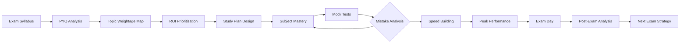
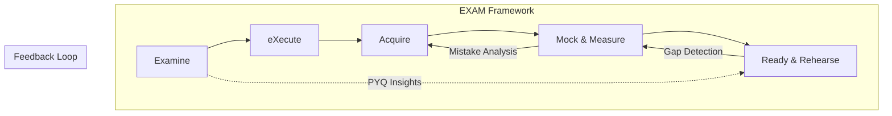
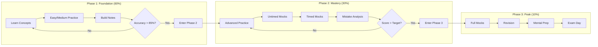
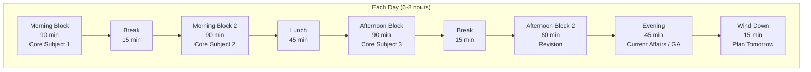
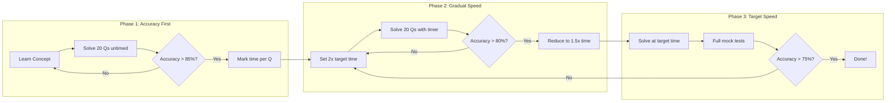
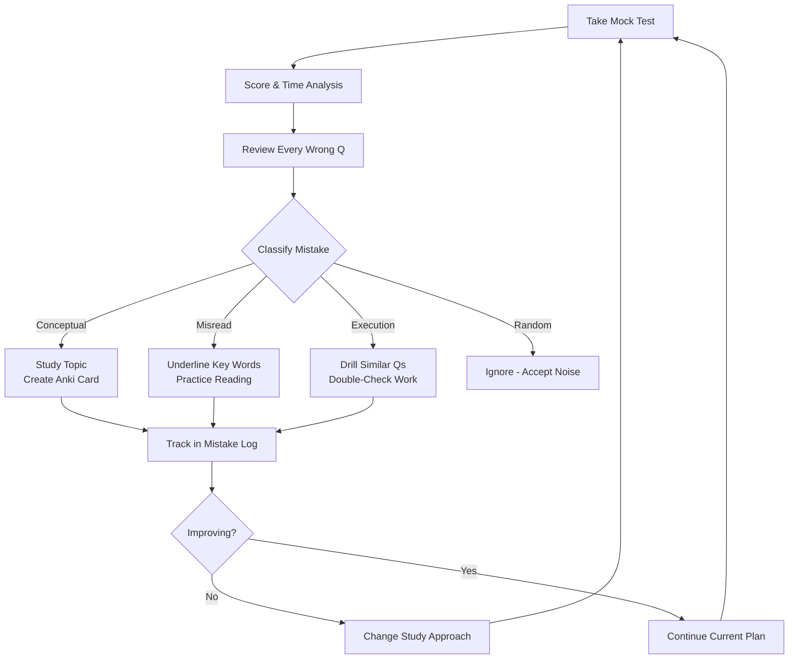
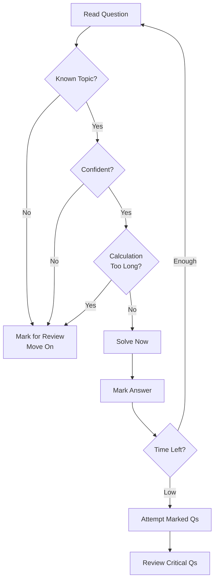
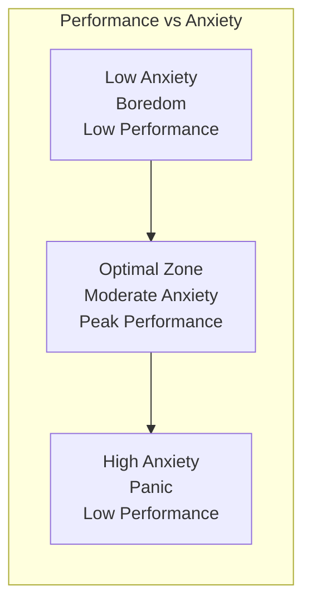

# Chapter 15: Exam Cracking Mastery — Universal Strategy for Any Exam

> **Prerequisites:** [Chapter 3: Active Recall & Spaced Repetition](./ch-03-active-recall-spaced-repetition.md) — Core memory techniques.
> **Next:** This is the final domain-specific chapter — apply what you learn here to any exam in this repository.

> **A universal framework to crack any competitive exam — GATE, IBPS SO, NIC Scientist, SBI PO, RBI Grade B, SSC CGL, UPSC, campus placements, coding interviews, or certifications — by reverse-engineering the exam design and building a precision preparation system.**
> Covers Q226–Q260 — 35 Q&As

Every exam, regardless of type, follows a hidden architecture: a pattern of topic weightage, question difficulty distribution, time pressure points, and marking scheme incentives. Once you understand this architecture, you can design a preparation strategy that maximizes your score per unit time. This chapter teaches you how to decode any exam and build a winning strategy — from the first day of preparation to the final minute in the exam hall.

---

## Learning Objectives

After completing this chapter, you will be able to:

<!-- Image Gallery -->
<section class="lesson-visuals" aria-label="Visual learning resources">
  <header><span>VISUAL LEARNING</span><h2>See it. Review it. Remember it.</h2></header>
  <a class="lesson-visual-card" href="../../../assets/images/lessons/learning-how-to-learn/ch-15-exam-cracking-mastery/handwritten-notes.svg" target="_blank" rel="noopener">
    
    <span><strong>Handwritten notes</strong>Condensed notes for deliberate review.</span>
  </a>
  <a class="lesson-visual-card" href="../../../assets/images/lessons/learning-how-to-learn/ch-15-exam-cracking-mastery/sticky-notes.svg" target="_blank" rel="noopener">
    
    <span><strong>Sticky-note revision</strong>Fast recall prompts for revision.</span>
  </a>
  <a class="lesson-visual-card" href="../../../assets/images/lessons/learning-how-to-learn/ch-15-exam-cracking-mastery/visual-explanation.svg" target="_blank" rel="noopener">
    
    <span><strong>Visual concept guide</strong>A connected explanation of the key ideas.</span>
  </a>
</section>
<!-- End Image Gallery -->

- Reverse-engineer any exam syllabus to identify high-ROI topics and question patterns
- Design a 3-phase preparation strategy (Foundation → Mastery → Peak) for any exam timeline
- Build a weekly study schedule that balances multiple subjects and revision cycles
- Apply speed and accuracy techniques to maximize attempts and minimize errors
- Implement mock test analysis using the C/M/E/R taxonomy to eliminate mistakes
- Execute last-month, last-week, last-day, and last-hour strategies for peak performance
- Create personalized strategy templates for GATE, IBPS SO, NIC Scientist, SBI PO, RBI Grade B, SSC CGL, coding interviews, and university exams
- Develop a continuous improvement loop using post-exam analysis and feedback

---

### Chapter at a Glance

| Topic | Key Insight | Practical Takeaway |
|-------|-------------|-------------------|
| Exam Architecture | Every exam has a hidden pattern of weightage, difficulty, and time pressure | Analyze last 5 years of PYQs to build an exam DNA profile |
| 3-Phase Strategy | Foundation → Mastery → Peak — each phase has different goals | Allocate 60% time to Foundation, 30% to Mastery, 10% to Peak |
| ROI-Based Prioritization | Not all topics are equal — focus on high-weightage, low-effort topics first | Score each topic on Weightage × Learnability × Retention |
| Spiral Schedule | Cover all subjects weekly, not in blocks | Rotate 4-5 subjects per day in 90-minute blocks |
| Speed-Accuracy Curve | Speed increases naturally with accuracy; never sacrifice accuracy for speed | Target 90% accuracy first, then gradually reduce time per question |
| Mock Test Analysis | Every wrong answer is a learning opportunity | Classify mistakes as C/M/E/R and fix root causes |
| Exam Day Protocol | Physical and mental preparation is as important as subject knowledge | Follow a rehearsed routine for sleep, meals, and warm-up |



---

## Q226: What is the universal exam-cracking framework?

Any competitive exam can be cracked using a 5-step framework that works regardless of the exam type, difficulty, or duration.

**The EXAM Framework:**

| Step | Component | What You Do | Time Allocation |
|------|-----------|-------------|-----------------|
| **E** | Examine the Exam | Analyze syllabus, PYQs, weightage, pattern, marking scheme | First 1-2 days |
| **X** | eXecute a Strategy | Build study plan, schedule subjects, allocate time | First week |
| **A** | Acquire Mastery | Learn concepts, practice questions, build notes | 60% of total time |
| **M** | Mock & Measure | Take tests, analyze mistakes, improve speed | 30% of total time |
| **R** | Ready & Rehearse | Final revision, exam simulation, mental preparation | Last 10% of time |



**Why it works:** The framework is recursive — after each mock test, you loop back to Acquire to fix weaknesses. This creates a continuous improvement cycle that compounds over time.

**Exam-specific adaptations:**

- **GATE CS:** Focus heavily on PYQ pattern recognition (questions repeat in style if not in content)
- **IBPS SO:** Prioritize Professional Knowledge (60 Qs) and speed in Reasoning/Quant
- **NIC Scientist B:** Balance CS fundamentals with current programming practices
- **UPSC:** Emphasize answer writing, interlinking subjects, and current affairs
- **Coding Interviews:** Replace mocks with platform tests (LeetCode, HackerRank)
- **University Exams:** Focus more on previous year papers and less on mock tests

---

## Q227: How do I analyze a new exam in 48 hours?

When you encounter a new exam, follow this rapid analysis protocol:

### Day 1: Gather Intelligence

| Source | What to Extract |
|--------|-----------------|
| Official syllabus | Topic list, weightage percentages, skill levels |
| Last 5 years PYQs | Actual questions, difficulty distribution, repeated concepts |
| Toppers' strategy blogs | Subject prioritization, book recommendations, time management |
| Exam analysis videos | Difficulty trends, cutoff analysis, surprise topics |
| Official notifications | Exam pattern changes, new sections, marking scheme updates |

### Day 2: Build Exam DNA Profile

Create a single-page cheat sheet containing:

```
EXAM DNA PROFILE
=================
Exam Name: [IBPS SO IT Officer Scale 1]
Total Questions: 175 | Duration: 150 min | Marks: 175
Time per Question: ~51 seconds

SECTION BREAKDOWN:
  Reasoning: 45 Qs (25.7%) | 40 min | 53 sec/Qs
  Quant: 35 Qs (20%) | 40 min | 68 sec/Qs  
  English: 35 Qs (20%) | 35 min | 60 sec/Qs
  Professional Knowledge: 60 Qs (34.3%) | 35 min | 35 sec/Qs

TOPIC WEIGHTAGE (from PYQ analysis):
  #1 Puzzles & Seating: 15-20 Qs (33-44% of Reasoning)
  #2 DBMS + SQL: 15-18 Qs (25-30% of Prof Knowledge)
  #3 Data Interpretation: 8-10 Qs (23-29% of Quant)
  ...

CUTOFF ANALYSIS:
  Gen: 55-60 marks | OBC: 50-55 | SC/ST: 45-50
  Sectional: 8-10 marks in each section

YOUR TARGET:
  Overall: 75+ | Reasoning: 25+ | Quant: 20+ | English: 18+ | Prof Knowledge: 30+
```

**TypeScript — Exam Analyzer Tool:**

```typescript
interface ExamProfile {
  name: string;
  totalQuestions: number;
  durationMinutes: number;
  sections: Section[];
  cutoffs: Record<string, number>;
  pyqYears: number[];
}

interface Section {
  name: string;
  questions: number;
  suggestedMinutes: number;
  topics: TopicWeight[];
}

interface TopicWeight {
  topic: string;
  avgQuestions: number;
  weightPercent: number;
  priority: 'High' | 'Medium' | 'Low';
  learnability: number; // 1-5 how easy to master
}

function calculateROI(topic: TopicWeight): number {
  return topic.weightPercent * topic.learnability;
}

function buildStudyPlan(profile: ExamProfile): string[] {
  const allTopics = profile.sections.flatMap(s => s.topics);
  allTopics.sort((a, b) => calculateROI(b) - calculateROI(a));
  return allTopics.map(t =>
    `${t.priority}: ${t.topic} (ROI=${calculateROI(t).toFixed(1)})`
  );
}

const ibpsSO: ExamProfile = {
  name: 'IBPS SO IT Officer',
  totalQuestions: 175,
  durationMinutes: 150,
  sections: [
    {
      name: 'Professional Knowledge',
      questions: 60,
      suggestedMinutes: 35,
      topics: [
        { topic: 'DBMS & SQL', avgQuestions: 16, weightPercent: 27, priority: 'High', learnability: 4 },
        { topic: 'Operating Systems', avgQuestions: 10, weightPercent: 17, priority: 'High', learnability: 4 },
        { topic: 'Computer Networks', avgQuestions: 10, weightPercent: 17, priority: 'High', learnability: 4 },
        { topic: 'Data Structures', avgQuestions: 8, weightPercent: 13, priority: 'Medium', learnability: 3 },
        { topic: 'Software Engineering', avgQuestions: 6, weightPercent: 10, priority: 'Medium', learnability: 5 },
        { topic: 'Web Technologies', avgQuestions: 5, weightPercent: 8, priority: 'Medium', learnability: 4 },
        { topic: 'OOP Concepts', avgQuestions: 5, weightPercent: 8, priority: 'Medium', learnability: 5 }
      ]
    }
  ],
  cutoffs: { General: 55, OBC: 50, SC: 45 },
  pyqYears: [2020, 2021, 2022, 2023, 2024]
};

console.log(buildStudyPlan(ibpsSO));
// [
//   "High: DBMS & SQL (ROI=108.0)",
//   "Medium: Software Engineering (ROI=50.0)",
//   "Medium: OOP Concepts (ROI=40.0)",
//   "High: Operating Systems (ROI=68.0)",
//   ...
// ]
```

---

## Q228: How do I design a 3-phase preparation strategy?

Every exam preparation should follow three distinct phases, regardless of total available time.

### Phase 1: Foundation (60% of total time)

**Goal:** Build conceptual understanding across all topics

| Activity | Time Share | Details |
|----------|------------|---------|
| Learn concepts | 50% | Read textbooks, watch lectures, build mental models |
| Practice basics | 30% | Solve easy/medium questions topic-wise |
| Build notes | 20% | Create cheat sheets, formula cards, mind maps |
| Target accuracy | 90%+ | Don't worry about speed yet |

**Key principle:** Don't skip topics in this phase. A weak foundation will cause repeated mistakes throughout your preparation.

### Phase 2: Mastery (30% of total time)

**Goal:** Deepen understanding, improve speed, start mock tests

| Activity | Time Share | Details |
|----------|------------|---------|
| Topic-wise advanced practice | 30% | Solve medium/hard questions |
| Mock tests (untimed) | 20% | Focus on accuracy, no time pressure |
| Mock tests (timed) | 30% | Full exam simulation |
| Mistake analysis | 20% | Classify and fix every error |

**Key principle:** Start mocks even if you feel unprepared. The first mock will reveal gaps you didn't know existed.

### Phase 3: Peak (10% of total time)

**Goal:** Peak performance on exam day

| Activity | Time Share | Details |
|----------|------------|---------|
| Timed mocks | 40% | Full exam simulation, exam-like conditions |
| Revision | 40% | Formula sheets, mistake logs, high-yield topics |
| Mental preparation | 20% | Sleep schedule, stress management, visualization |

**Key principle:** Stop learning NEW content 2 weeks before the exam. Only review what you already know.



### Time Scaling (when total prep time is short)

| Total Time | Phase 1 | Phase 2 | Phase 3 | Strategy |
|------------|---------|---------|---------|----------|
| 12 months | 7 months | 3.5 months | 1.5 months | Deep coverage, 2-3 revisions |
| 6 months | 3.5 months | 2 months | 2 weeks | Focus on high-weightage topics |
| 3 months | 7 weeks | 4 weeks | 1 week | Aggressive prioritization |
| 1 month | 2 weeks | 10 days | 4 days | Only high-ROI topics, minimal theory |
| 1 week | 3 days | 2 days | 2 days | PYQs + formula revision only |

---

## Q229: How do I create the optimal weekly study schedule?

The key to effective preparation is **spiral scheduling** — covering all subjects every week instead of blocking by subject.

### The Spiral Schedule Template



### Sample 6-Day Weekly Schedule (9 subjects rotation)

```
DAY 1:
  Morning 1: 90 min — Data Structures & Algorithms (coding practice)
  Morning 2: 90 min — Operating Systems (theory + MCQs)
  Afternoon 1: 90 min — Quant (DI + Arithmetic)
  Afternoon 2: 60 min — Revision of Day 1 & 2 topics
  Evening: 45 min — Current Affairs

DAY 2:
  Morning 1: 90 min — Database Management Systems (SQL + theory)
  Morning 2: 90 min — Reasoning (Puzzles + Seating)
  Afternoon 1: 90 min — Computer Networks (theory + numericals)
  Afternoon 2: 60 min — Revision of Day 2 & 3 topics
  Evening: 45 min — English (Grammar + Vocabulary)

DAY 3:
  Morning 1: 90 min — Mock Test (full-length, timed)
  Morning 2: 90 min — Mock Test Analysis (detailed mistake review)
  Afternoon 1: 90 min — Weak area improvement from mock analysis
  Afternoon 2: 60 min — Formula/Concept revision
  Evening: 45 min — Banking/Financial Awareness

DAY 4: Repeat Day 1 with different topic depth
DAY 5: Repeat Day 2 with different topic depth  
DAY 6: Repeat Day 3 with different mock test

DAY 7: REST or catch-up (max 2 hours light revision)
```

**TypeScript — Schedule Generator:**

```typescript
interface Subject {
  name: string;
  priority: number; // 1-5
  hoursPerWeek: number;
  type: 'Theory' | 'Coding' | 'Quant' | 'Reasoning' | 'Language' | 'GA';
}

interface DayPlan {
  day: number;
  blocks: { subject: string; duration: number; type: string }[];
}

function generateSchedule(subjects: Subject[], totalDays: number): DayPlan[] {
  // Sort by priority descending
  const sorted = [...subjects].sort((a, b) => b.priority - a.priority);
  
  const days: DayPlan[] = [];
  let subjectIndex = 0;
  
  for (let day = 1; day <= totalDays; day++) {
    const blocks: DayPlan['blocks'] = [];
    let remainingMinutes = 480; // 8 hours
    
    while (remainingMinutes > 30 && subjectIndex < sorted.length * 2) {
      const subj = sorted[subjectIndex % sorted.length];
      const duration = Math.min(90, remainingMinutes);
      blocks.push({ subject: subj.name, duration, type: subj.type });
      remainingMinutes -= duration + 15; // +15 for break
      subjectIndex++;
    }
    
    days.push({ day, blocks });
  }
  
  return days;
}

const examSubjects: Subject[] = [
  { name: 'DBMS', priority: 5, hoursPerWeek: 8, type: 'Theory' },
  { name: 'OS', priority: 5, hoursPerWeek: 6, type: 'Theory' },
  { name: 'Computer Networks', priority: 4, hoursPerWeek: 5, type: 'Theory' },
  { name: 'Reasoning', priority: 5, hoursPerWeek: 7, type: 'Reasoning' },
  { name: 'Quant', priority: 4, hoursPerWeek: 6, type: 'Quant' },
  { name: 'English', priority: 3, hoursPerWeek: 4, type: 'Language' },
  { name: 'Current Affairs', priority: 3, hoursPerWeek: 3, type: 'GA' },
  { name: 'Data Structures', priority: 4, hoursPerWeek: 5, type: 'Coding' },
];

const schedule = generateSchedule(examSubjects, 30);
console.log(JSON.stringify(schedule.slice(0, 3), null, 2));
```

---

## Q230: How do I prioritize topics using ROI analysis?

Not all topics are worth equal time. Use the **ROI (Return on Investment)** formula to decide what to study first.

### The ROI Formula

```
ROI = Weightage × Learnability × Retention
```

| Factor | Scale | How to Measure |
|--------|-------|----------------|
| **Weightage** | 1-10 | Percentage of total marks from PYQ analysis |
| **Learnability** | 1-5 | How quickly you can master the topic (1 = very slow, 5 = very fast) |
| **Retention** | 1-5 | How long the knowledge lasts (1 = forgets quickly, 5 = sticks permanently) |

### Topic ROI Matrix

| Topic | Weightage | Learnability | Retention | ROI | Strategy |
|-------|-----------|--------------|-----------|-----|----------|
| DBMS + SQL | 9 | 4 | 4 | **144** | Study first, high return |
| Data Interpretation | 8 | 3 | 4 | **96** | Regular practice |
| Operating Systems | 7 | 3 | 3 | **63** | Moderate investment |
| Web Technologies | 3 | 4 | 2 | **24** | Low priority, study last |
| General Awareness | 5 | 5 | 1 | **25** | Daily 30 min, don't cram |

### Priority Buckets

| Bucket | ROI Score | Action |
|--------|-----------|--------|
| 🔴 Must Cover | >80 | Allocate 50% of study time, master completely |
| 🟡 Should Cover | 40-80 | Allocate 35% of study time, good understanding |
| 🟢 Nice to Cover | 20-40 | Allocate 15% of study time, basic familiarity |
| ⚪ Skip If Needed | <20 | Only if time permits |

**TypeScript — ROI Calculator:**

```typescript
interface TopicROI {
  name: string;
  weightage: number; // 1-10
  learnability: number; // 1-5
  retention: number; // 1-5
}

function calculateROI(topic: TopicROI): number {
  return topic.weightage * topic.learnability * topic.retention;
}

function getPriority(roi: number): string {
  if (roi >= 80) return '🔴 Must Cover';
  if (roi >= 40) return '🟡 Should Cover';
  if (roi >= 20) return '🟢 Nice to Cover';
  return '⚪ Skip If Needed';
}

function prioritizeTopics(topics: TopicROI[]): TopicROI[] {
  return [...topics]
    .map(t => ({ ...t, roi: calculateROI(t) }))
    .sort((a, b) => b.roi - a.roi)
    .map(({ roi, ...t }) => t);
}

const topics: TopicROI[] = [
  { name: 'DBMS & SQL', weightage: 9, learnability: 4, retention: 4 },
  { name: 'Data Interpretation', weightage: 8, learnability: 3, retention: 4 },
  { name: 'Operating Systems', weightage: 7, learnability: 3, retention: 3 },
  { name: 'Web Technologies', weightage: 3, learnability: 4, retention: 2 },
];

topics.forEach(t => {
  const roi = calculateROI(t);
  console.log(`${getPriority(roi)}: ${t.name} (ROI=${roi})`);
});
// 🔴 Must Cover: DBMS & SQL (ROI=144)
// 🔴 Must Cover: Data Interpretation (ROI=96)
// 🟡 Should Cover: Operating Systems (ROI=63)
// 🟢 Nice to Cover: Web Technologies (ROI=24)
```

---

## Q231: How do I build speed without sacrificing accuracy?

Speed and accuracy follow a predictable curve — speed increases as accuracy solidifies.

### The Speed-Accuracy Curve



### Speed Building Techniques

| Technique | How It Works | Time Saved |
|-----------|-------------|------------|
| **Elimination First** | Eliminate obviously wrong options before solving | 30-50% reduction |
| **Unit Digit Check** | Check last digit for multiplication/division answers | 10-15 sec per Q |
| **Approximation** | Round numbers to nearest 10/100 | 20-30% faster calculations |
| **Pattern Recognition** | Identify question type instantly from keywords | 15-20 sec per Q |
| **Skip Strategy** | Skip if >30 sec without clear path | Prevents time loss |
| **Option Substitution** | Plug options back into the question | Works for 40% of quant Qs |

### Section-wise Time Targets (IBPS SO Example)

| Section | Total Qs | Time Given | Target Time | Sec per Q |
|---------|----------|------------|-------------|-----------|
| Reasoning | 45 | 40 min | 35 min | 47 sec |
| Quant | 35 | 40 min | 35 min | 60 sec |
| English | 35 | 35 min | 30 min | 51 sec |
| Professional Knowledge | 60 | 35 min | 30 min | 30 sec |

**TypeScript — Speed Tracker:**

```typescript
interface SpeedMetrics {
  subject: string;
  accuracy: number; // %
  avgTimePerQ: number; // seconds
  targetTimePerQ: number;
  questionsAttempted: number;
}

function trackSpeed(metrics: SpeedMetrics): string {
  const timeRatio = metrics.avgTimePerQ / metrics.targetTimePerQ;
  const accuracyOk = metrics.accuracy >= 75;
  const speedOk = timeRatio <= 1.0;
  
  if (!accuracyOk && !speedOk) return '❌ Focus on accuracy first — ignore speed';
  if (!accuracyOk) return '🎯 Build accuracy — slow down to 2x target time';
  if (!speedOk) return '⚡ Improving speed — reduce time by 10% per session';
  return '✅ On track — maintain both speed and accuracy';
}

const session: SpeedMetrics = {
  subject: 'Quant DI',
  accuracy: 82,
  avgTimePerQ: 75,
  targetTimePerQ: 60,
  questionsAttempted: 10
};

console.log(trackSpeed(session)); // "⚡ Improving speed — reduce time by 10% per session"
```

---

## Q232: How do I analyze mock tests to maximize improvement?

Mock tests are useless without proper analysis. Follow the **C/M/E/R Taxonomy** to classify every mistake.

### The C/M/E/R Mistake Taxonomy

| Category | Meaning | % of Mistakes | Fix Strategy |
|----------|---------|---------------|--------------|
| **C** | Conceptual — you didn't know the concept | 40% | Review the topic, create Anki cards |
| **M** | Misread — you misread the question | 25% | Slow down, underline key words |
| **E** | Execution — you knew it but made a calculation/typo error | 20% | Practice similar problems, check twice |
| **R** | Random — pure guess or lucky/unlucky | 15% | Accept as noise, focus on C/M/E |

### Mock Test Analysis Protocol

```
STEP 1: Take mock test under exam conditions (no pauses, no phone)
STEP 2: Score yourself immediately
STEP 3: For EVERY wrong answer, classify as C/M/E/R
STEP 4: For C mistakes: Study the topic, create revision note
STEP 5: For M mistakes: Practice mindful reading exercises
STEP 6: For E mistakes: Drill similar problems, check work twice
STEP 7: Track trends across 5+ mocks (are C mistakes decreasing?)
STEP 8: Adjust study plan based on mistake patterns
```



**TypeScript — Mistake Tracker:**

```typescript
type MistakeType = 'C' | 'M' | 'E' | 'R';

interface Mistake {
  question: string;
  topic: string;
  type: MistakeType;
  correctAnswer: string;
  yourAnswer: string;
  notes: string;
}

interface MockAnalysis {
  mockNumber: number;
  score: number;
  totalQuestions: number;
  mistakes: Mistake[];
}

function analyzeMistakes(analysis: MockAnalysis): string {
  const categories: Record<string, number> = { C: 0, M: 0, E: 0, R: 0 };
  analysis.mistakes.forEach(m => categories[m.type]++);
  
  const total = analysis.mistakes.length;
  const result: string[] = [];
  
  result.push(`Mock #${analysis.mockNumber}: ${analysis.score}/${analysis.totalQuestions}`);
  result.push(`Mistakes: ${total}`);
  
  for (const [type, count] of Object.entries(categories)) {
    const pct = ((count / total) * 100).toFixed(1);
    const typeName = { C: 'Conceptual', M: 'Misread', E: 'Execution', R: 'Random' }[type];
    result.push(`  ${typeName} (${type}): ${count} (${pct}%)`);
  }
  
  const conceptualPct = (categories['C'] / total) * 100;
  if (conceptualPct > 40) {
    result.push('⚠️ High conceptual mistakes — study weak topics first');
  }
  
  return result.join('\n');
}

const mock1: MockAnalysis = {
  mockNumber: 1,
  score: 85,
  totalQuestions: 175,
  mistakes: [
    { question: 'Q12', topic: 'OS Scheduling', type: 'C', correctAnswer: 'B', yourAnswer: 'C', notes: 'Didn\'t know SJF preemptive' },
    { question: 'Q34', topic: 'DI Table', type: 'E', correctAnswer: 'D', yourAnswer: 'A', notes: 'Calculation error' },
    { question: 'Q56', topic: 'DBMS Joins', type: 'M', correctAnswer: 'C', yourAnswer: 'B', notes: 'Read "left" as "right" join' },
    { question: 'Q78', topic: 'Puzzle', type: 'C', correctAnswer: 'A', yourAnswer: 'D', notes: 'Wrong arrangement logic' },
    { question: 'Q102', topic: 'Vocabulary', type: 'R', correctAnswer: 'B', yourAnswer: 'C', notes: 'Guessed' },
  ]
};

console.log(analyzeMistakes(mock1));
```

---

## Q233: What is the optimal last-month exam strategy?

The final month before any exam follows a specific pattern regardless of exam type.

### Last 30 Days Blueprint

```
WEEK 1 (Days 30-23): Consolidation
  - Complete all remaining syllabus
  - Take 2 full-length mocks
  - Fix conceptual gaps from mocks
  
WEEK 2 (Days 22-15): Intensification
  - Stop learning new topics
  - Take 4 full-length mocks (alternate days)
  - Analyze every mistake thoroughly
  - Revise formula sheets daily
  
WEEK 3 (Days 14-8): Stabilization
  - Reduce to 3 mocks per week
  - Focus on weak areas identified in Week 2
  - Practice speed drills for quant/reasoning
  - Start regulating sleep schedule
  
WEEK 4 (Days 7-1): Peak Preparation
  DAY 7: Take one full mock, review lightly
  DAY 6: Light revision of strong topics
  DAY 5: Revise formula sheets, current affairs
  DAY 4: Take final mock, no analysis after
  DAY 3: Light revision, organize admit card/stationery
  DAY 2: Complete rest, light reading
  DAY 1: No study, complete rest, early sleep
```

### Week-wise Focus Areas

| Week | Focus | Mock Frequency | Study Hours |
|------|-------|---------------|-------------|
| Week 1 | Complete syllabus + first mocks | 2 mocks | 8-10 hrs/day |
| Week 2 | Mocks + mistake analysis | 4 mocks | 8-10 hrs/day |
| Week 3 | Weak area + speed building | 3 mocks | 6-8 hrs/day |
| Week 4 | Revision + mental prep | 1 mock | 4-6 hrs/day (tapering) |

---

## Q234: What is the optimal last-week exam strategy?

The final week is about **preservation and execution**, not learning.

### 7-Day Countdown

```
DAY -7: 
  Morning: Take a full-length mock (exam conditions)
  Afternoon: Review only the mock, no new study
  Evening: Revise top 3 weak topics from mock

DAY -6:
  Morning: Formula sheets + memory maps revision
  Afternoon: Current affairs + GA quick revision
  Evening: Light quant/reasoning practice (50 Qs)

DAY -5:
  Morning: Subject-wise PYQ review (last 2 years)
  Afternoon: Mock test analysis review (all previous mocks)
  Evening: Rest, light walk

DAY -4:
  Morning: Take final full-length mock
  Afternoon: Light review — don't analyze deeply
  Evening: Organize exam kit (admit card, ID, stationery)

DAY -3:
  Morning: Formula sheets — one final pass
  Afternoon: Current affairs — headlines only
  Evening: Plan exam strategy (question selection, time allocation)

DAY -2:
  Light revision only (4 hours max)
  Visit exam center if possible
  Early sleep (10 PM)

DAY -1:
  No study at all
  Light walk, healthy meals
  Prepare outfit, pack bag
  Sleep by 9 PM
  Set 3 alarms

EXAM DAY:
  Wake up 2 hours before exam
  Light breakfast
  Reach center 45 min early
  Warm-up: Solve 5 easy Qs mentally
  Enter exam hall calm and confident
```

---

## Q235: What is the exam day protocol?

Your performance on exam day depends 60% on preparation and 40% on execution.

### Before the Exam (Morning of)

| Time | Activity | Why |
|------|----------|-----|
| T-3 hours | Wake up, hydrate | Brain takes 2 hours to fully wake |
| T-2.5 hours | Light breakfast (protein + complex carbs) | Steady energy, no sugar crash |
| T-2 hours | Revisit one-page formula sheet | Primes your memory |
| T-1.5 hours | Stop studying, relax | Prevents anxiety |
| T-1 hour | Leave for exam center | Buffer for traffic |
| T-45 min | Reach center, find your hall | Settle in |
| T-15 min | Bathroom break | Don't lose exam time |
| T-5 min | Deep breathing (4-7-8 technique) | Calms nerves |

### In the Exam Hall (Question Paper Strategy)

**First 5 Minutes: Scan and Strategize**

1. Quickly flip through all pages — check for surprises
2. Identify the easiest section — mark it as your starting section
3. Identify the toughest section — mark it for last
4. Allocate approximate time per section based on your strengths

**Question Selection Protocol**



**Time Bucket Strategy (for a 150-min exam)**

| Bucket | Time | Action |
|--------|------|--------|
| First pass | 0-90 min | Answer all confident questions, skip tough ones |
| Second pass | 90-120 min | Attempt skipped questions now |
| Third pass | 120-140 min | Re-check critical answers, calculation-heavy Qs |
| Final pass | 140-150 min | Quick review of marked answers, guess remaining |

### Section-wise Attempt Strategy

**For Negative Marking Exams:**
- Attempt only questions you're 75%+ confident about
- Don't guess unless you can eliminate 2+ options
- Leave questions where you're completely unsure

**For No Negative Marking Exams:**
- Attempt every single question
- Use elimination to improve guess probability
- Last resort: choose one option (e.g., always C) for blind guesses

**For Descriptive Exams:**
- Spend 5 min planning before writing
- Use bullet points and subheadings for clarity
- Leave 5 min at end for proofreading

---

## Q236: How do I create exam-specific strategies?

Each exam type requires a tailored approach. Here are strategy templates for the most common exam categories.

### GATE CS Strategy

```
GATE CS QUICK STRATEGY
=======================
Pattern: 65 Qs (10 GA + 55 Technical) | 3 hours | Negative marking

Subject Prioritization (by marks):
  🔴 Must: DS&Algo (15-18%), OS (10-12%), DBMS (8-10%), CN (8-10%)
  🟡 Should: TOC (8-10%), CD (8-10%), COA (8-10%), Discrete Math (8-10%)
  🟢 Nice: Digital Logic (5-7%), Engineering Math (10-12%)
  ⚪ Skip: Nothing in GATE — every subject contributes

Key Strategy:
  - 1 Mark Qs > 2 Mark Qs (easier, less time per mark)
  - General Aptitude = free marks (15% of paper, easy to master)
  - Solve 45 Qs confidently = 55+ marks = top 5%
  - Numerical answer type (NAT) questions have no negative marking
  - Practice with virtual calculator beforehand

Preparation Materials:
  - Standard textbooks (Cormen, Tanenbaum, Silberschatz, Korth)
  - GATE-specific: Made Easy/ACE Academy notes
  - PYQs: Last 15 years minimum
  - Online: GoClass, Unacademy for specific topics
```

### IBPS SO IT Officer Strategy

```
IBPS SO IT OFFICER QUICK STRATEGY
==================================
Pattern: 175 Qs | 150 min | Negative marking (-1/4 for wrong)

Section Prioritization:
  🔴 Professional Knowledge (60 Qs, 35 min, 0.58 min/Qs — FAST!)
    - DBMS+SQL: 15-18 Qs (master all SQL queries, normalization, transactions)
    - OS: 10-12 Qs (focus on scheduling, memory, deadlocks)
    - CN: 8-10 Qs (OSI, TCP/IP, routing, security)
    - DS: 8-10 Qs (arrays, linked lists, trees, sorting)
    - SE: 5-6 Qs (SDLC, testing, agile)
    - OOP: 4-5 Qs (Java/C++ concepts)
    - Web Tech: 4-5 Qs (HTML, CSS, JavaScript basics)
  
  🟡 Reasoning (45 Qs, 40 min — most time-consuming)
    - Puzzles & Seating: 15-20 Qs (priotitize — high weightage)
    - Syllogism: 5 Qs (easy if you know Venn diagrams)
    - Inequality: 5 Qs (free marks)
    - Data Sufficiency: 5 Qs
    - Blood Relation: 3-5 Qs
  
  🟡 Quant (35 Qs, 40 min)
    - DI: 8-10 Qs (master calculation speed)
    - Number Series: 5 Qs (pattern recognition)
    - Quadratic: 5 Qs (root comparison tricks)
    - Arithmetic: 15 Qs (time/work, profit/loss, SI/CI)
  
  🟢 English (35 Qs, 35 min)
    - Reading Comprehension: 10 Qs
    - Grammar: 10 Qs (error spotting, fillers)
    - Vocabulary: 10 Qs (cloze test, synonyms)
    - Verbal: 5 Qs (para jumbles)

Attempt Strategy:
  First 30 min: Professional Knowledge (60 Qs — quick answers)
  Next 40 min: Reasoning (45 Qs — time-consuming, do this when fresh)
  Next 35 min: Quant (35 Qs — calculation focus)
  Last 35 min: English (35 Qs — reading speed matters)
  Last 10 min: Review marked questions

Target Score (General): 75+/175
  Prof Knowledge: 35+/60
  Reasoning: 20+/45
  Quant: 12+/35
  English: 10+/35
```

### NIC Scientist B Strategy

```
NIC SCIENTIST B QUICK STRATEGY
===============================
Pattern: 100 Qs | 120 min | No negative marking (varies by year)

Section Prioritization:
  🔴 Section A — CS Fundamentals (50 Qs)
    - DS & Algorithms: 12-15 Qs
    - OS: 8-10 Qs
    - DBMS: 8-10 Qs
    - Computer Networks: 8-10 Qs
    - Software Engineering: 5-7 Qs
    - Computer Architecture: 4-5 Qs
  
  🔴 Section B — Programming (30 Qs)
    - C Programming: 12-15 Qs (pointers, memory, recursion)
    - Java: 8-10 Qs (OOP, exception handling, collections)
    - OOP Concepts: 5-8 Qs (general OOP)
  
  🟡 Section C — Aptitude (20 Qs)
    - Quant: 8-10 Qs
    - Reasoning: 5-7 Qs
    - English: 5-7 Qs

Key Difference from IBPS SO:
  - Much deeper CS concepts (algorithm analysis, advanced data structures)
  - Programming questions require actual code reading ability
  - No current affairs or banking knowledge needed
  - Slower pace (72 sec/Qs vs 51 sec/Qs in IBPS SO)

Attempt Strategy:
  Attempt ALL questions (no negative marking)
  Start with Section A (CS fundamentals — your strength)
  Then Section B (Programming — needs fresh mind)
  End with Section C (Aptitude — faster to answer)
```

### SBI PO Strategy

```
SBI PO PRELIMS QUICK STRATEGY
==============================
Pattern: 100 Qs | 60 min | Negative marking (-1/4)

Section Prioritization (all sections equally important):
  🔴 English (30 Qs, 20 min)
    - Reading Comprehension: 10 Qs
    - Grammar: 10 Qs
    - Vocabulary: 5 Qs
    - Verbal: 5 Qs
  
  🔴 Quant (35 Qs, 20 min)
    - DI: 10 Qs
    - Number Series: 5 Qs
    - Quadratic: 5 Qs
    - Arithmetic: 15 Qs
  
  🔴 Reasoning (35 Qs, 20 min)
    - Puzzles & Seating: 15 Qs
    - Syllogism: 5 Qs
    - Inequality: 5 Qs
    - Miscellaneous: 10 Qs

Critical: Time is EXTREMELY tight (36 sec/Qs)
  - You CANNOT solve every question
  - Target 70-75% accuracy on 70% of paper
  - Skip long puzzles — do them last
  - English is fastest to answer — start there

Prelims Cutoff (General): 60-65/100
Mains Target: 200+/300 (Reasoning 45, English 40, Quant 45, GA 30, Descriptive 40)
```

### General Competitive Exam (Combined) Strategy

```
UNIVERSAL EXAM CRACKING CHECKLIST
=================================

□ STEP 1: Decode the Exam (48 hours)
  □ Download syllabus
  □ Collect last 5 years PYQs
  □ Build topic weightage table
  □ Identify question patterns
  □ Note marking scheme and cutoffs
  □ Set your target score

□ STEP 2: Build Foundation (60% of prep time)
  □ Cover all topics conceptually
  □ Create one-page formula sheets
  □ Build Anki decks for theory subjects
  □ Achieve 85%+ accuracy in topic-wise practice

□ STEP 3: Master Through Mocks (30% of prep time)
  □ Start with untimed mocks
  □ Progress to timed mocks
  □ Analyze every mistake (C/M/E/R)
  □ Fix conceptual gaps
  □ Build speed gradually

□ STEP 4: Peak Performance (10% of prep time)
  □ Stop learning new topics
  □ Full exam simulation mocks
  □ Formula sheet revision only
  □ Sleep schedule regulation
  □ Mental preparation

□ STEP 5: Exam Day Execution
  □ Morning routine (wake up early, light breakfast)
  □ Reach center 45 min early
  □ First pass: answer confident questions
  □ Second pass: attempt marked questions
  □ Final pass: review critical answers
  □ Don't change answers unless certain

□ POST-EXAM: Continuous Improvement
  □ Note what worked and what didn't
  □ Update strategy for next attempt
  □ Document key learnings
```

---

## Q237: How do I handle multiple exams simultaneously?

Many candidates prepare for multiple exams at once (e.g., GATE + IBPS SO + campus placements). Here's how to manage.

### Overlap Analysis

| Subject | GATE CS | IBPS SO | NIC Scientist | SBI PO | Campus |
|---------|---------|---------|---------------|--------|--------|
| DS & Algorithms | ✅ High | ✅ Med | ✅ High | ❌ | ✅ High |
| Operating Systems | ✅ High | ✅ Med | ✅ High | ❌ | ✅ Med |
| DBMS | ✅ High | ✅ High | ✅ High | ❌ | ✅ Med |
| Computer Networks | ✅ High | ✅ Med | ✅ High | ❌ | ✅ Low |
| General Aptitude | ❌ | ✅ Med | ✅ Med | ✅ High | ✅ High |
| Reasoning | ❌ | ✅ High | ✅ Low | ✅ High | ✅ Med |
| English | ❌ | ✅ Med | ❌ | ✅ High | ❌ |
| Current Affairs | ❌ | ✅ High | ❌ | ✅ High | ❌ |

### Strategy for Multiple Exams

| Scenario | Primary Focus | Secondary | Strategy |
|----------|---------------|-----------|----------|
| GATE + IBPS SO | GATE (deep) | IBPS SO (speed) | Master CS first, then add speed/quant/reasoning |
| GATE + Campus | GATE | Campus | GATE covers 70% of campus, add SQL/system design |
| IBPS SO + SBI PO | IBPS SO (harder) | SBI PO | Both have Reasoning+Quant+English — study together |
| NIC + IBPS SO | NIC (deeper CS) | IBPS SO | NIC CS prep covers IBPS pro knowledge, add GA/reasoning |

**Unified Schedule Template:**

```
Monday/Wednesday/Friday: CS Core (serves GATE + NIC + IBPS SO)
  90 min — DS & Algos
  90 min — OS + DBMS
  60 min — Computer Networks

Tuesday/Thursday/Saturday: Aptitude + Language (serves IBPS SO + SBI PO)
  90 min — Quant (DI + Arithmetic)
  90 min — Reasoning (Puzzles + Syllogism)
  60 min — English (Grammar + RC)

Sunday: Mock Test + Analysis
  150 min — Full-length mock (rotate between exams)
  90 min — Detailed analysis
  60 min — Weak area improvement
```

---

## Q238: How do I handle exam anxiety and stress?

Exam anxiety is natural — the goal isn't to eliminate it, but to channel it productively.

### The Yerkes-Dodson Curve



**Your optimal anxiety zone:** You should feel slightly nervous but in control. Your heart rate is elevated, but your thinking is clear.

### Stress Management Techniques

| Technique | When to Use | How It Works |
|-----------|-------------|--------------|
| 4-7-8 Breathing | During exam, before tough section | Inhale 4 sec, hold 7 sec, exhale 8 sec |
| Box Breathing | During breaks | Inhale 4, hold 4, exhale 4, hold 4 |
| Progressive Muscle Relaxation | Night before exam | Tense/relax each muscle group |
| Visualization | Morning of exam | Mentally rehearse a successful exam |
| Power Pose | Before entering hall | 2 min confident posture |
| Cognitive Reframing | When anxious | "I'm excited" instead of "I'm nervous" |

### Common Anxiety Triggers and Solutions

| Trigger | Solution |
|---------|----------|
| "I haven't studied enough" | Review your preparation log — you've done the work |
| "Other candidates are better prepared" | Focus on your own paper, not others' |
| "This question looks unfamiliar" | Mark it and move on — come back later |
| "I'm running out of time" | Recalculate: 70% of paper done = still on track |
| "I made a stupid mistake" | One mistake won't ruin your score — stay focused |
| "I can't concentrate" | 30-second breathing exercise, then restart |

---

## Q239: How do I create and use effective revision notes?

Revision notes are your most valuable asset in the last month before any exam.

### The One-Page Rule

Every subject should be compressed into ONE page (front and back). This forces you to identify what's truly important.

**Template for a Subject Summary Page:**

```
┌─────────────────────────────────────────────────────────┐
│  SUBJECT: Database Management Systems                    │
│  ───────────────────────────────────────────────────────│
│  KEY CONCEPTS:                                          │
│  • DBMS → Software to manage data                       │
│  • Schema = Structure, Instance = Data at a time         │
│  • 3-level architecture: Physical → Conceptual → External│
│  • Data Independence: Logical (change schema) / Physical │
│                                                         │
│  ER MODEL: Entity (□), Attribute (○), Relation (◇)      │
│  • Keys: Super, Candidate, Primary, Foreign              │
│  • Mapping: 1:1, 1:M, M:N (weak entities need owner)    │
│                                                         │
│  NORMALIZATION:                                          │
│  • 1NF: Atomic values, no repeating groups              │
│  • 2NF: 1NF + no partial dependency                     │
│  • 3NF: 2NF + no transitive dependency                  │
│  • BCNF: Every determinant is a candidate key           │
│                                                         │
│  SQL CHEAT SHEET:                                       │
│  SELECT ... FROM ... JOIN ... WHERE ... GROUP BY ...    │
│  HAVING ... ORDER BY ... LIMIT ...                      │
│  Subqueries: IN, EXISTS, ANY, ALL                       │
│  Functions: COUNT, SUM, AVG, MIN, MAX                   │
│                                                         │
│  TRANSACTIONS: ACID (Atomicity, Consistency, Isolation, │
│  Durability). Schedules: Serial, Serializable.          │
│  Conflict serializability → Precedence graph            │
└─────────────────────────────────────────────────────────┘
```

### Digital Revision System

```typescript
interface RevisionNote {
  subject: string;
  topic: string;
  formula: string;
  example: string;
  commonMistake: string;
  lastReviewed: Date;
  nextReview: Date;
}

class RevisionManager {
  private notes: RevisionNote[] = [];
  
  addNote(note: Omit<RevisionNote, 'lastReviewed' | 'nextReview'>): void {
    this.notes.push({
      ...note,
      lastReviewed: new Date(),
      nextReview: new Date(Date.now() + 24 * 60 * 60 * 1000) // Review tomorrow
    });
  }
  
  getDueForReview(): RevisionNote[] {
    return this.notes.filter(n => new Date() >= n.nextReview);
  }
  
  reviewNote(subject: string, topic: string): void {
    const note = this.notes.find(n => n.subject === subject && n.topic === topic);
    if (note) {
      note.lastReviewed = new Date();
      // Spaced repetition: next review doubles
      const interval = (note.nextReview.getTime() - note.lastReviewed.getTime()) * 2;
      note.nextReview = new Date(Date.now() + interval);
    }
  }
}

const rm = new RevisionManager();
rm.addNote({
  subject: 'DBMS',
  topic: 'Normalization',
  formula: '1NF→2NF→3NF→BCNF',
  example: 'Remove partial deps for 2NF',
  commonMistake: 'Forgetting 3NF vs BCNF difference'
});
```

---

## Q240: How do I recover from a bad mock test?

Every candidate faces a disastrous mock test. The difference between success and failure is how you respond.

### The 24-Hour Recovery Protocol

```
IMMEDIATELY AFTER (First 30 min):
  - Put the test away completely
  - Go for a walk or do something physical
  - Don't discuss scores with anyone
  - Remind yourself: "This is data, not destiny"

SAME DAY (After cooling down):
  - Review only the mistake LOG (not the full paper)
  - Classify each mistake as C/M/E/R
  - Identify the TOP 3 mistake patterns
  - Write ONE sentence: "I lost marks because ___"

NEXT DAY:
  - Re-study the 3 weakest concepts identified
  - Solve 10-15 questions ONLY on those concepts
  - Don't take another mock — do focused practice
  - Review your preparation to ensure you're on track

IF IT'S A PATTERN (3+ bad mocks in a row):
  - Change your study approach (not just intensity)
  - Consider: are you sleeping enough? Eating well?
  - Might need to reset strategy entirely
```

---

## Q241: What is the 80/20 rule for exam preparation?

The Pareto Principle applies powerfully to exam prep — 80% of your score comes from 20% of your effort.

### The 80/20 Analysis

| Exam Type | Top 20% Topics (80% of Score) |
|-----------|-------------------------------|
| GATE CS | DS&Algo + OS + DBMS + CN + General Aptitude |
| IBPS SO | Professional Knowledge (all 7 subjects) + Puzzles + DI |
| NIC Scientist | CS Fundamentals + C/Java Programming |
| SBI PO | Reasoning Puzzles + DI + Reading Comprehension |
| Campus Coding | Arrays + Strings + Linked Lists + DP + Graphs |
| University Exam | PYQs patterns + high-weightage chapters |

### Applying the 80/20 Rule

```
WRONG WAY: Study all topics equally → 20% effort per topic = 20% score
RIGHT WAY: 
  - Identify the 20% of topics that deliver 80% of marks
  - Master those topics completely (95%+ accuracy)
  - For remaining 80% of topics: basic familiarity (60% accuracy)
  - Total: 0.2 × 95% + 0.8 × 60% = 19% + 48% = 67% → well above cutoff

Even better: Identify the top 5% that delivers 60% of marks and master those
```

---

## Q242: How do I use Anki effectively for exam preparation?

Anki is the most powerful revision tool for theory-heavy exams.

### Anki Setup for Exams

**Deck Structure:**

```
┌── Exam Master Deck
│   ├── 📂 Subject: DBMS
│   │   ├── 🏷️ Normalization (15 cards)
│   │   ├── 🏷️ SQL (25 cards)
│   │   ├── 🏷️ Transactions (20 cards)
│   │   └── 🏷️ Indexing (10 cards)
│   ├── 📂 Subject: OS
│   │   ├── 🏷️ Scheduling (20 cards)
│   │   ├── 🏷️ Memory (18 cards)
│   │   ├── 🏷️ Deadlocks (12 cards)
│   │   └── 🏷️ File Systems (10 cards)
│   └── 📂 Subject: Current Affairs
│       └── 🏷️ Monthly (30 cards/month)
```

**Card Types for Exam Prep:**

```
#1: CONCEPT CARD (For definitions, facts)
  Front: What is BCNF?
  Back: A relation is in BCNF if every determinant is a candidate key.
        It's a stronger version of 3NF.

#2: FORMULA CARD (For formulas, conversions)
  Front: Speed formula
  Back: Speed = Distance / Time (S = D/T)

#3: COMPARISON CARD (For differentiating concepts)
  Front: Compare 3NF vs BCNF
  Back: 3NF: No transitive dependency
        BCNF: Every determinant is a key
        BCNF is stricter than 3NF

#4: PROCEDURE CARD (For step-by-step processes)
  Front: Steps for deadlock detection
  Back: 1. Build wait-for graph
        2. Find cycle in graph
        3. If cycle exists → deadlock
        4. Select victim to terminate

#5: MCQ CARD (For quick recall)
  Front: Which normal form removes partial dependencies?
  Options: A) 1NF B) 2NF C) 3NF D) BCNF
  Back: B) 2NF
```

**Daily Anki Routine for Exam Prep:**
- Morning: 20 new cards + 50 reviews (25 min)
- Afternoon: 20 new cards + 50 reviews (25 min) 
- Evening: Quick review of missed cards (10 min)

---

## Q243: How do I handle negative marking?

Negative marking changes your strategy significantly.

### The Negative Marking Formula

```
Expected Value = (Probability of Correct × Marks) - (Probability of Wrong × Penalty)

For a 1-mark question with -1/4 penalty:
  If you guess blindly: EV = (0.25 × 1) - (0.75 × 0.25) = 0.25 - 0.1875 = +0.0625
  If you eliminate 2 options: EV = (0.5 × 1) - (0.5 × 0.25) = 0.5 - 0.125 = +0.375
  If you eliminate 3 options: EV = (0.75 × 1) - (0.25 × 0.25) = 0.75 - 0.0625 = +0.6875
```

### Decision Matrix

| Confidence Level | Options Eliminated | Action |
|------------------|-------------------|--------|
| 100% sure | N/A | Definite attempt |
| 75% sure | 1 eliminated | Attempt |
| 50% sure | 2 eliminated | Attempt |
| 25% sure (blind) | 0 eliminated | Skip (unless no neg marking) |
| No idea | 0 eliminated | Always skip |

### Marking Scheme Strategy by Exam

| Exam | Marking | Strategy |
|------|---------|----------|
| GATE CS | +1/-0.33 (1M), +2/-0.66 (2M) | Attempt only 70-75% questions, high accuracy |
| IBPS SO | +1/-0.25 | Attempt 80-85%, be careful in quant |
| SBI PO | +1/-0.25 | Attempt 70% questions, focus on English |
| NIC Scientist | No negative marking | Attempt 100% — never leave blank |
| UPSC Prelims | +2/-0.66 | Very cautious — penalty is high |

---

## Q244: How do I improve weak areas systematically?

Use the **Weak Area Improvement Protocol (WAIP)**:

### 6-Step WAIP

```
STEP 1: Identify
  - From mock analysis: which topics have most C-type mistakes?
  - List top 3 weakest topics

STEP 2: Isolate
  - Study ONLY that topic for 2-3 days
  - No multi-tasking, no other subjects

STEP 3: Understand
  - Watch 2-3 different explanations (multiple perspectives)
  - Read textbook, watch video, solve examples

STEP 4: Practice
  - Solve 30-50 questions ONLY on this topic
  - Start easy, progress to medium, then hard

STEP 5: Verify
  - Take a mini-test (10 Qs on this topic)
  - Target 90%+ accuracy

STEP 6: Maintain
  - Add to Anki with daily review
  - Re-test after 1 week to ensure retention
```

### Tracking Improvement

```typescript
interface WeakArea {
  topic: string;
  initialAccuracy: number;
  currentAccuracy: number;
  initialTime: number; // seconds per question
  currentTime: number;
  practiceQuestionsDone: number;
  lastPracticed: Date;
}

function trackImprovement(area: WeakArea): string {
  const accuracyGain = area.currentAccuracy - area.initialAccuracy;
  const timeImprovement = area.initialTime - area.currentTime;
  
  if (accuracyGain < 10 && timeImprovement < 10) {
    return `❌ ${area.topic}: Not improving — change approach`;
  }
  if (accuracyGain >= 20 && timeImprovement >= 30) {
    return `✅ ${area.topic}: Strong improvement (${accuracyGain.toFixed(1)}% / -${timeImprovement}s)`;
  }
  return `🔄 ${area.topic}: Improving slowly — continue practice`;
}

const weakArea: WeakArea = {
  topic: 'DBMS — Normalization',
  initialAccuracy: 45,
  currentAccuracy: 82,
  initialTime: 90,
  currentTime: 45,
  practiceQuestionsDone: 35,
  lastPracticed: new Date()
};

console.log(trackImprovement(weakArea));
// "✅ DBMS — Normalization: Strong improvement (37.0% / -45s)"
```

---

## Q245: How do I prepare for descriptive/written exams?

Some exams (UPSC Mains, IBPS PO Mains, university exams) have descriptive sections.

### Descriptive Exam Strategy

**Answer Writing Framework:**

```
FRAMEWORK: BLUF → EVIDENCE → SUMMARY

1. BLUF (Bottom Line Up Front): State your answer in 1-2 sentences
2. EVIDENCE: Support with examples, data, diagrams
3. SUMMARY: Conclude with key takeaway

Example Question: "Explain the CAP theorem"
  BLUF: The CAP theorem states that a distributed system can only 
        guarantee two of three properties: Consistency, Availability, 
        and Partition Tolerance.
  
  EVIDENCE: 
  - Consistency: All nodes see same data at same time
  - Availability: Every request gets a response (success/failure)
  - Partition Tolerance: System continues despite network failures
  - CP systems: Banking (prefer consistency)
  - AP systems: Social media (prefer availability)
  
  Mermaid diagram showing CAP triangle
  
  SUMMARY: Choose CP or AP based on use case — CA is not possible 
           in distributed systems.
```

**Time Management for Descriptive Exams:**

| Activity | Time Share | Example (3-hour exam) |
|----------|------------|----------------------|
| Reading & planning | 10% | 18 min |
| Writing answers | 75% | 135 min |
| Review & edit | 15% | 27 min |

---

## Q246: How do I crack computer-based tests (CBT)?

Most modern exams are computer-based. Here's how to optimize for CBT.

### CBT-Specific Strategies

| Challenge | Solution |
|-----------|----------|
| No scratch paper (some exams) | Use virtual notepad, practice mental calculations |
| Screen reading fatigue | Take 5-sec eye breaks every 20 min |
| Calculator dependence | Learn virtual calculator shortcuts (GATE-specific) |
| Review/mark functionality | Use "mark for review" aggressively |
| Section switching | Plan which section order works best |
| Font size issues | Check display settings before exam starts |
| System crash during exam | Inform invigilator immediately, time will be compensated |

### CBT Practice Protocol

```
WEEKLY CBT PRACTICE:
  - Take at least 2 mocks on computer (not paper)
  - Use the exact same interface as the real exam
  - Practice with on-screen calculator
  - Practice flagging and reviewing questions
  - Simulate exam conditions (no phone, no breaks)
  - Build muscle memory for the interface
```

---

## Q247: How do I prepare for group discussions and interviews?

### GD Preparation Strategy

| GD Topic Type | Preparation Approach | Key Techniques |
|---------------|---------------------|----------------|
| Current Affairs | Read newspaper daily, note key facts | Statistics, recent developments |
| Abstract Topics | Practice lateral thinking | Multiple perspectives, analogies |
| Case Studies | Business frameworks (SWOT, PESTLE) | Structured analysis |
| Technical Topics | Deep subject knowledge | Examples from real systems |

**GD Execution Strategy:**

```
OPENING (First 30 sec):
  - Listen to others first (don't rush to speak)
  - Enter with a unique point or different perspective

BODY (Next 3-4 min):
  - Make 2-3 quality points (not 10 shallow ones)
  - Support with data/examples
  - Quote relevant facts or recent news
  - Acknowledge others' points: "Building on Rohan's point..."

CLOSING (Last 30 sec):
  - Summarize the discussion
  - Add a forward-looking statement
  - Thank the group
```

### Interview Preparation Strategy

| Interview Type | Preparation Focus | Key Questions |
|----------------|------------------|---------------|
| Technical | Core CS concepts, projects, coding | "Explain OS paging", "Write a function to..." |
| HR/Behavioral | STAR format, resume depth | "Tell me about yourself", "Why this company?" |
| Panel/Govt | Subject knowledge, current affairs | Policy questions, domain expertise |
| Case/Consulting | Structured thinking, frameworks | "Estimate market size for..." |

---

## Q248: How do I create a preparation tracker?

Track your preparation to stay motivated and identify blind spots.

### Preparation Dashboard

```typescript
interface PrepMetrics {
  hoursStudied: number;
  topicsCompleted: string[];
  mocksTaken: number;
  averageScore: number;
  highestScore: number;
  mistakesByType: Record<string, number>;
  accuracy: number; // %
  streak: number; // consecutive study days
  daysToExam: number;
}

function generateDashboard(metrics: PrepMetrics): string {
  const dailyTarget = 8; // hours
  const mockTarget = 15; // total mocks before exam
  const accuracyTarget = 75; // %
  
  return `
📊 PREPARATION DASHBOARD
━━━━━━━━━━━━━━━━━━━━━━━
📅 Days to Exam: ${metrics.daysToExam}
📚 Today Studied: ${metrics.hoursStudied}h / ${dailyTarget}h ${metrics.hoursStudied >= dailyTarget ? '✅' : '⚠️'}
🔥 Streak: ${metrics.streak} days
📝 Topics Done: ${metrics.topicsCompleted.length}
🎯 Mocks: ${metrics.mocksTaken} / ${mockTarget} ${metrics.mocksTaken >= mockTarget ? '✅' : '⚠️'}
📈 Avg Score: ${metrics.averageScore}% | High: ${metrics.highestScore}%
🎯 Accuracy: ${metrics.accuracy}% / ${accuracyTarget}% ${metrics.accuracy >= accuracyTarget ? '✅' : '⚠️'}
🔴 Mistakes: C=${metrics.mistakesByType.C || 0} M=${metrics.mistakesByType.M || 0} E=${metrics.mistakesByType.E || 0}
`;
}

const today: PrepMetrics = {
  hoursStudied: 8.5,
  topicsCompleted: ['DBMS', 'OS', 'Quant'],
  mocksTaken: 12,
  averageScore: 72,
  highestScore: 85,
  mistakesByType: { C: 23, M: 12, E: 8 },
  accuracy: 78,
  streak: 45,
  daysToExam: 30
};

console.log(generateDashboard(today));
```

---

## Q249: How do I prepare for surprise topics in exams?

Exam patterns change. New topics appear. Here's how to handle it.

### The Surprise Topic Protocol

```
BEFORE THE EXAM (Preparation):
  - Cover at least 80% of syllabus → you can afford 20% surprise
  - Master fundamentals → they transfer to new topics
  - Read exam notification changes carefully every year
  
DURING THE EXAM (When encountering surprise questions):
  Step 1: Don't panic — everyone else is equally surprised
  Step 2: Is it related to something you know? (Most "new" topics are)
  Step 3: Use elimination to narrow options
  Step 4: Apply general knowledge / common sense
  Step 5: If truly unknown, leave it (negative marking) or guess (no neg marking)

AFTER THE EXAM:
  - Note the surprise topics for future reference
  - If retaking, add them to your study plan
```

---

## Q250: What is the final 24-hour protocol before any exam?

Consistency is key — follow the same routine regardless of exam.

### T-24 Hours Checklist

```
T-24 hours (Yesterday morning):
  □ Take one final mock (light, not full intensity)
  □ Review only formula sheets
  □ NO new study from this point

T-12 hours (Yesterday evening):
  □ Pack exam bag: admit card, ID proof, pens/pencils, 
    water bottle, watch, mask (if required), snacks
  □ Plan route to exam center (check traffic)
  □ Set 3 alarms (primary + 2 backups)
  □ Sleep by 9-10 PM

T-1 hour (Exam morning):
  □ Wake up, fresh up
  □ Light stretching
  □ Light breakfast (avoid new foods)
  □ Last glance at one-page formula sheet
  □ Leave for exam center

T-30 min (At exam center):
  □ Find your hall and seat
  □ Bathroom break
  □ Deep breathing (4-7-8 technique)

T-5 min (At your desk):
  □ Keep ID + admit card on desk
  □ Read instructions carefully
  □ Deep breaths
  □ Positive self-talk: "I am prepared, I will do well"

EXAM STARTS:
  □ First 2 min: Scan entire paper
  □ Next 3 min: Decide section order
  □ Execute your strategy
  □ Stay calm — expect some tough questions
  □ Don't compare with others
  □ Do your best until the final bell
```

---

## Q251: How do I prepare for the exam cycle (multiple attempts)?

Many candidates take 2-3 attempts to crack competitive exams. Here's how to approach multiple attempts.

### The Multi-Attempt Strategy

```
ATTEMPT 1: Learning Attempt
  Goal: Experience the real exam, identify gaps
  Target: Just passing (understand the process)
  Focus: Full syllabus coverage, real exam experience
  Outcome: Score report + topic-wise gap analysis

BETWEEN ATTEMPTS (Gap Period):
  Week 1-2: Complete rest, no study
  Week 3-4: Analyze scorecard, identify exact weak areas
  Month 2-3: Aggressive improvement on weak topics
  Month 4: Full mocks, speed building
  Final month: Same as Phase 3 strategy

ATTEMPT 2: Competitive Attempt
  Goal: Clear the exam with good rank
  Target: 90th+ percentile
  Focus: Weak areas, speed, mock mastery
  Outcome: Selection or at least 95th percentile

ATTEMPT 3: Final Attempt (if needed)
  Goal: Absolute best performance
  Target: Top 1%
  Focus: Eliminate every mistake, peak performance
```

---

## Q252: How do I use this repository's content for exam preparation?

This repository contains everything you need for GATE CS, IBPS SO, NIC Scientist, and general interview prep.

### Mapping Repository Content to Exam Preparation

| Need | Where to Find | How to Use |
|------|---------------|------------|
| CS Theory | courses/operating-systems, database-management-systems, computer-networks, etc. | Read chapters → solve MCQs → Anki cards |
| Coding Practice | courses/coding-problems/ | Solve problems by topic → company tagged |
| Mock Tests | courses/mock-tests/ | Timed full-length mocks → C/M/E/R analysis |
| Speed Drills | courses/speed-drills/ | Timed drills → accuracy tracking |
| Company Questions | courses/interview-preparation/11-17 | Company-specific problem patterns |
| GATE PYQs | courses/gate-cs-preparation/23-32 | Year-wise solved papers |
| Aptitude | courses/quantitative-aptitude, reasoning-ability, english-language | Subject-wise chapters + exercises |
| Learning Strategy | This chapter + Chapter 8 | Apply EXAM framework + C/M/E/R analysis |

---

## Summary

Cracking any competitive exam requires a systematic approach that goes beyond subject knowledge. The key principles are:

1. **Reverse-engineer the exam** — Analyze PYQs to understand the hidden architecture of topic weightage, difficulty distribution, and time pressure
2. **Use the EXAM Framework** — Examine, eXecute, Acquire, Mock, Ready — a recursive cycle of preparation and improvement
3. **Prioritize with ROI** — Not all topics are equal; focus on high-weightage, learnable, retentive topics first
4. **Spiral schedule** — Cover all subjects weekly, not in blocks, to maintain familiarity
5. **Speed follows accuracy** — Build accuracy first (90%+), then gradually increase speed
6. **Analyze every mistake** — Use the C/M/E/R taxonomy to classify errors and fix root causes
7. **Three phases of preparation** — Foundation (60%) → Mastery (30%) → Peak (10%)
8. **The last month is for revision, not learning** — Stop new content 2 weeks before the exam
9. **Exam day is about execution** — Follow a rehearsed protocol for sleep, meals, warm-up, and time management
10. **Continuous improvement** — Every exam, every mock, every mistake is data to improve your system

---

## Chapter Quiz

1. What is the recommended time allocation for Phase 1 (Foundation) in the 3-phase strategy?
   - A) 30% of total time
   - B) 45% of total time
   - C) 60% of total time
   - D) 75% of total time

<details>
<summary>Show Answer</summary>
**Answer:** C) 60% of total time. Phase 1 is the foundation phase where you build conceptual understanding across all topics.
</details>

2. In the C/M/E/R mistake taxonomy, what does 'M' stand for?
   - A) Misunderstanding
   - B) Misread
   - C) Mistake
   - D) Memory

<details>
<summary>Show Answer</summary>
**Answer:** B) Misread. M mistakes occur when you misread the question (e.g., read "left" as "right" join).
</details>

3. What is the recommended time per question for the Professional Knowledge section of IBPS SO?
   - A) 30 seconds
   - B) 35 seconds
   - C) 45 seconds
   - D) 60 seconds

<details>
<summary>Show Answer</summary>
**Answer:** B) 35 seconds. With 60 questions in 35 minutes, you have approximately 35 seconds per question.
</details>

4. What should you do during the first 5 minutes of an exam?
   - A) Start solving the first question immediately
   - B) Scan the entire paper and decide section order
   - C) Read all instructions carefully three times
   - D) Close your eyes and meditate

<details>
<summary>Show Answer</summary>
**Answer:** B) Scan the entire paper and decide section order. This helps you identify the easiest sections and plan your time allocation.
</details>

5. When should you stop learning NEW content before an exam?
   - A) 1 day before
   - B) 1 week before
   - C) 2 weeks before
   - D) 1 month before

<details>
<summary>Show Answer</summary>
**Answer:** C) 2 weeks before. New content needs time to consolidate; the final weeks should be for revision and recall, not learning.
</details>

---

## Practical Takeaways

| Concept | Action This Week | Time Required |
|---------|------------------|---------------|
| Exam DNA Profile | Analyze your target exam using PYQs | 2 hours |
| ROI Prioritization | Score all topics by Weightage × Learnability × Retention | 1 hour |
| Weekly Schedule | Build a spiral schedule covering all subjects | 30 min |
| First Mock Test | Take a full-length mock and analyze with C/M/E/R | 3.5 hours |
| Mistake Log | Create a spreadsheet to track mistake patterns | 30 min |
| Formula Sheets | Create one-page summaries for each subject | 3 hours |
| Anki Deck | Set up Anki with 5 card types for your exam | 1 hour |
| Speed Baseline | Track your current speed/accuracy per section | 1 hour |
| Last Month Plan | Draft your 30-day countdown strategy | 30 min |
| Exam Day Protocol | Write your personal exam day checklist | 15 min |

---

## Exercises

1. **Build an Exam DNA Profile:** Choose any exam (GATE CS, IBPS SO, NIC Scientist, or SBI PO). Collect the last 3 years of PYQs and build a complete topic weightage table with percentage breakdown for each section.

2. **ROI Analysis:** List 10 topics from your target exam. Score each on Weightage (1-10), Learnability (1-5), and Retention (1-5). Calculate ROI and assign priority buckets (🔴/🟡/🟢/⚪). Create a study schedule that allocates time proportionally.

3. **Mock Test Analysis:** Take a full-length mock test. Classify every wrong answer into C/M/E/R. Calculate the percentage of each category. Identify the top 3 mistake patterns and create a one-page fix plan.

4. **Spiral Schedule Design:** Design a 7-day spiral schedule that covers 8-9 subjects with appropriate time allocation. Ensure every subject is touched at least twice per week.

5. **C/M/E/R Mistake Log:** Create a spreadsheet or use the TypeScript mistake tracker to log mistakes across 5 mock tests. Track whether your C-type mistakes are decreasing over time.

6. **Formula Sheet Creation:** Create a one-page formula sheet for your weakest subject. Include key formulas, concepts, common mistakes, and memory triggers.

7. **Speed Baseline:** Time yourself on 20 questions each from quant, reasoning, and professional knowledge. Record your accuracy and time per question. Set target times for the next session.

8. **Exam Day Protocol:** Write your personal exam day protocol from T-24 hours to the final bell. Include wake-up time, meals, travel, warm-up, and in-exam strategy.

9. **Multiple Exam Strategy:** If preparing for multiple exams, create a unified schedule that leverages overlapping topics (e.g., CS fundamentals for GATE + IBPS SO + NIC).

10. **Preparation Dashboard:** Build the preparation dashboard using the TypeScript template. Track your hours, topics, mocks, and mistakes daily for one week.

---

## Further Reading

- **Chapter 3:** [Active Recall & Spaced Repetition](./ch-03-active-recall-spaced-repetition.md) — The core memory techniques behind all exam prep
- **Chapter 4:** [Pomodoro, Interleaving & Feynman](./ch-04-pomodoro-interleaving-feynman.md) — Study techniques for effective learning
- **Chapter 6:** [Procrastination, Habits & Deep Work](./ch-06-procrastination-habits-deep-work.md) — Building discipline for long-term prep
- **Chapter 8:** [GATE & Theory Exam Prep](./ch-08-gate-theory-prep.md) — GATE-specific strategies (complements this chapter)
- **Coding Problems Bank:** `../coding-problems/index.md` — 220+ coding problems with company tags
- **Mock Tests:** `../mock-tests/index.md` — Full-length mock tests for IBPS SO, NIC, SBI, RBI, SSC, GATE
- **Speed Drills:** `../speed-drills/index.md` — Timed drills for quant, reasoning, verbal ability
- **Company Question Banks:** `../interview-preparation/11-company-tcs-nqt.md` through `17-company-psus-govt.md`
