# Chapter 16: Self-Assessment & Structured Preparation Strategy

> **Prerequisites:** [Chapter 15: Exam Cracking Mastery](./ch-15-exam-cracking-mastery.md) — Universal exam strategy framework.
> **Also see:** [Chapter 13: Learning Analytics](./ch-13-learning-analytics.md) — Measuring your learning progress.

> **A complete system for self-assessment, gap analysis, strategy creation, progress tracking, and structured preparation — so you always know where you stand, what to study next, and how to improve.**
> Covers Q261–Q290 — 30 Q&As

Most learners fail not because they lack ability, but because they lack clarity. They don't know what they know, what they don't know, or how to bridge the gap. This chapter gives you a repeatable system for self-assessment, strategy creation, and structured preparation — applicable to any exam, skill, or career goal.

---

## Learning Objectives

After completing this chapter, you will be able to:

<!-- Image Gallery -->
<section class="lesson-visuals" aria-label="Visual learning resources">
  <header><span>VISUAL LEARNING</span><h2>See it. Review it. Remember it.</h2></header>
  <a class="lesson-visual-card" href="../../assets/images/lessons/learning-how-to-learn/ch-16-self-assessment-strategy/handwritten-notes.png" target="_blank" rel="noopener">
    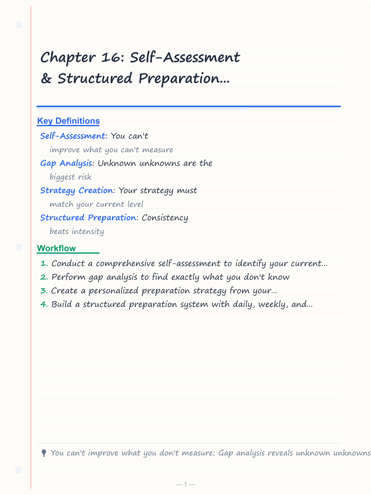
    <span><strong>Handwritten notes</strong>Condensed notes for deliberate review.</span>
  </a>
  <a class="lesson-visual-card" href="../../assets/images/lessons/learning-how-to-learn/ch-16-self-assessment-strategy/sticky-notes.png" target="_blank" rel="noopener">
    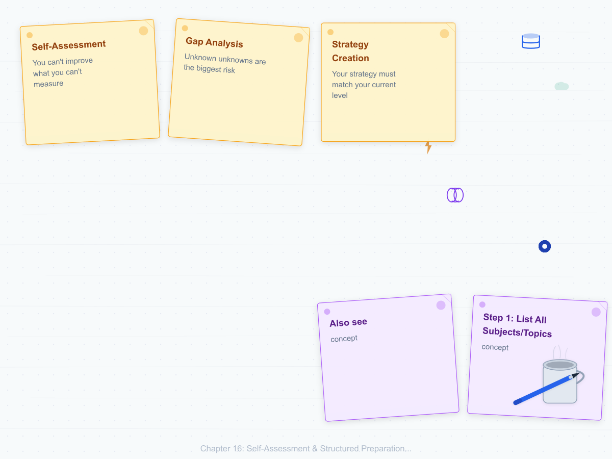
    <span><strong>Sticky-note revision</strong>Fast recall prompts for revision.</span>
  </a>
  <a class="lesson-visual-card" href="../../assets/images/lessons/learning-how-to-learn/ch-16-self-assessment-strategy/visual-explanation.png" target="_blank" rel="noopener">
    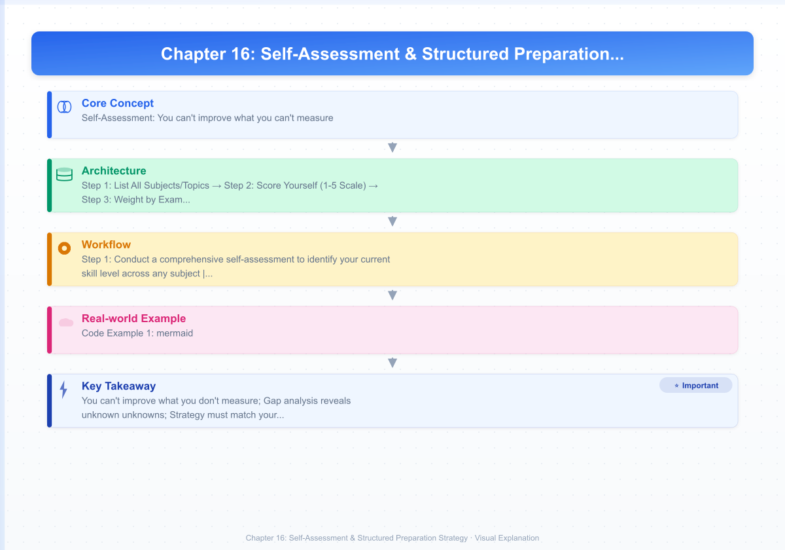
    <span><strong>Visual concept guide</strong>A connected explanation of the key ideas.</span>
  </a>
</section>
<!-- End Image Gallery -->

- Conduct a comprehensive self-assessment to identify your current skill level across any subject
- Perform gap analysis to find exactly what you don't know
- Create a personalized preparation strategy from your self-assessment results
- Build a structured preparation system with daily, weekly, and monthly cycles
- Track progress with objective metrics and adjust strategy based on data
- Identify and fix skill plateaus using the Dreyfus model of skill acquisition
- Apply the OODA loop (Observe, Orient, Decide, Act) to your learning process
- Design feedback loops that accelerate improvement

---

### Chapter at a Glance

| Topic | Key Insight | Practical Takeaway |
|-------|-------------|-------------------|
| Self-Assessment | You can't improve what you can't measure | Score yourself on a 1-5 scale per topic using objective criteria |
| Gap Analysis | Unknown unknowns are the biggest risk | Use PYQs and mock tests to surface hidden gaps |
| Strategy Creation | Your strategy must match your current level | Beginner → Intermediate → Advanced → Expert requires different approaches |
| Structured Preparation | Consistency beats intensity | Build daily/weekly/monthly cycles that compound over time |
| Progress Tracking | Measure inputs (hours) AND outputs (scores) | Track both effort metrics and performance metrics |
| Dreyfus Model of Skill | There are 5 stages from Novice to Expert | Identify your stage per subject and use stage-appropriate techniques |
| OODA Loop | Learning is a cycle of observe, orient, decide, act | Run weekly strategy reviews to adjust your approach |
| Feedback Loops | Fast feedback accelerates learning | Build C/M/E/R analysis into every practice session |

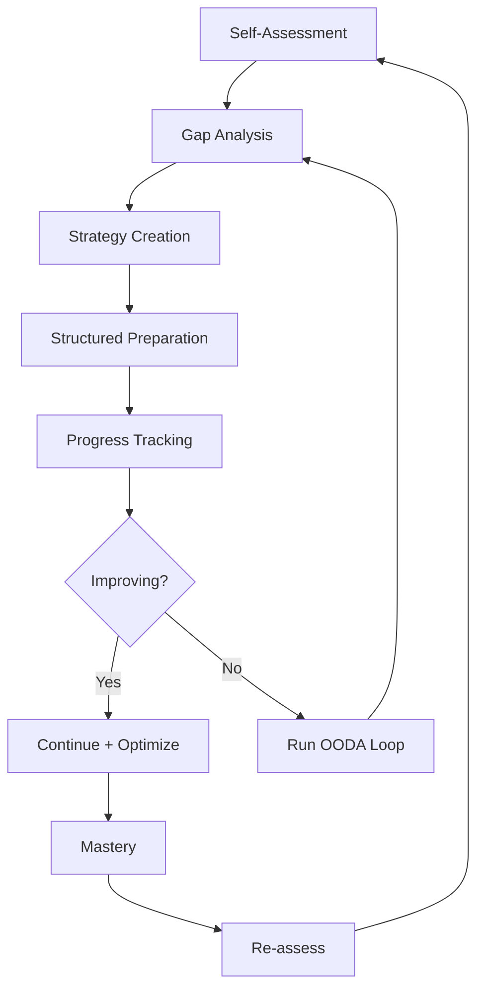

---

## Q261: How do I conduct a comprehensive self-assessment?

Self-assessment is the foundation of all improvement. Without knowing where you stand, you can't plan where to go.

### The 5-Step Self-Assessment Protocol

**Step 1: List All Subjects/Topics**

Create a complete inventory of everything you need to learn. For a GATE CS exam:

```
GATE CS SUBJECT INVENTORY:
  1. Data Structures & Algorithms (15-18% weightage)
  2. Operating Systems (10-12%)
  3. Database Management Systems (8-10%)
  4. Computer Networks (8-10%)
  5. Theory of Computation (8-10%)
  6. Compiler Design (8-10%)
  7. Computer Architecture (8-10%)
  8. Discrete Mathematics (8-10%)
  9. Digital Logic (5-7%)
  10. Engineering Mathematics (10-12%)
  11. General Aptitude (15%)
```

**Step 2: Score Yourself (1-5 Scale)**

| Score | Meaning | You Can... |
|-------|---------|------------|
| 1 | Never studied | Define basic terms |
| 2 | Beginner | Solve simple problems with help |
| 3 | Intermediate | Solve standard problems independently |
| 4 | Advanced | Solve complex problems, teach others |
| 5 | Expert | Solve any problem, identify novel patterns |

**Step 3: Weight by Exam Priority**

Multiply your score by the topic weightage to get a **weighted readiness score**.

```
Example: DBMS (weightage 9/10)
  Your score: 3 (Intermediate)
  Weighted readiness: 3 × 9 = 27/45 possible

Example: Digital Logic (weightage 5/10)
  Your score: 4 (Advanced)
  Weighted readiness: 4 × 5 = 20/45 possible
```

**Step 4: Identify Priority Gaps**

Topics with low weighted readiness scores need immediate attention.

**Step 5: Create Baseline Document**

Record all scores in a spreadsheet. Re-assess monthly.

---

### Self-Assessment Template

```typescript
interface TopicAssessment {
  name: string;
  weightage: number; // 1-10 based on exam
  selfScore: number; // 1-5 based on Dreyfus model
  confidence: 'Low' | 'Medium' | 'High'; // how sure you are of your score
  lastStudied: Date | null;
  preferredResource: string;
}

interface AssessmentResult {
  topic: string;
  weightedScore: number; // weightage × selfScore
  maxScore: number; // weightage × 5
  percentReady: number; // (weightedScore / maxScore) × 100
  priority: 'Critical' | 'High' | 'Medium' | 'Low';
}

function assessReadiness(topics: TopicAssessment[]): AssessmentResult[] {
  return topics.map(t => {
    const weightedScore = t.weightage * t.selfScore;
    const maxScore = t.weightage * 5;
    const percentReady = (weightedScore / maxScore) * 100;
    
    let priority: AssessmentResult['priority'];
    if (percentReady < 40) priority = 'Critical';
    else if (percentReady < 60) priority = 'High';
    else if (percentReady < 80) priority = 'Medium';
    else priority = 'Low';
    
    return { topic: t.name, weightedScore, maxScore, percentReady, priority };
  });
}

const myTopics: TopicAssessment[] = [
  { name: 'DBMS', weightage: 9, selfScore: 3, confidence: 'High', lastStudied: new Date(), preferredResource: 'Textbook' },
  { name: 'OS', weightage: 7, selfScore: 2, confidence: 'Medium', lastStudied: null, preferredResource: 'Video' },
  { name: 'Computer Networks', weightage: 7, selfScore: 2, confidence: 'Low', lastStudied: null, preferredResource: 'Video' },
  { name: 'DS & Algorithms', weightage: 9, selfScore: 4, confidence: 'High', lastStudied: new Date(), preferredResource: 'Practice' },
  { name: 'Digital Logic', weightage: 5, selfScore: 1, confidence: 'High', lastStudied: null, preferredResource: 'Book' },
];

const results = assessReadiness(myTopics);
results.forEach(r => {
  console.log(`${r.priority}: ${r.topic} (${r.percentReady.toFixed(0)}% ready)`);
});
// Critical: Digital Logic (20% ready)
// High: OS (28% ready)
// High: Computer Networks (28% ready)
// Medium: DBMS (60% ready)
// Low: DS & Algorithms (80% ready)
```

---

## Q262: How do I perform gap analysis?

Gap analysis finds the difference between where you are and where you need to be.

### The 4 Types of Knowledge Gaps

| Gap Type | Description | How to Find | Fix Strategy |
|----------|-------------|-------------|--------------|
| **Known Knowns** | You know you know | Easy questions, quick recall | Maintain with spaced repetition |
| **Known Unknowns** | You know you don't know | You can identify topics you haven't studied | Study systematically |
| **Unknown Knowns** | You don't know you know | Surprise yourself by solving unfamiliar problems | Build confidence, take more mocks |
| **Unknown Unknowns** | You don't know you don't know | The most dangerous — gaps revealed only by PYQs/mocks | Take diagnostic tests first |

### Gap Discovery Methods

| Method | What It Reveals | When to Use |
|--------|-----------------|-------------|
| **PYQ Analysis** | Topic weightage + question patterns | Before starting prep |
| **Topic-wise Test** | Your actual ability per topic | After studying each topic |
| **Full Mock Test** | Overall readiness + surprise gaps | Weekly during Phase 2-3 |
| **Teaching Attempt** | Depth of understanding (Feynman technique) | After completing a subject |
| **Peer Discussion** | Alternative approaches + blind spots | Ongoing |

### The Gap Analysis Spreadsheet

Create a spreadsheet with these columns:

```
| Topic | Sub-topic | Self Score | Test Score | Gap | Priority | Action Plan |
|-------|-----------|------------|------------|-----|----------|-------------|
| DBMS  | Normalization | 3 | 2 | -1 | High | Re-study 3NF, BCNF with examples |
| DBMS  | SQL Joins | 4 | 4 | 0 | Low | Maintain with practice |
| DBMS  | Transactions | 2 | 1 | -1 | Critical | Study ACID, schedules, serializability |
```

**TypeScript — Gap Analyzer:**

```typescript
interface Gap {
  topic: string;
  subTopic: string;
  selfScore: number; // 1-5
  testScore: number; // 1-5 (actual performance)
  gap: number; // testScore - selfScore
  priority: string;
  actionPlan: string;
}

function analyzeGaps(topics: Omit<Gap, 'gap' | 'priority' | 'actionPlan'>[]): Gap[] {
  return topics.map(t => {
    const gap = t.testScore - t.selfScore;
    let priority: string;
    let actionPlan: string;
    
    if (gap < -1 && t.selfScore >= 3) {
      priority = '🔴 Critical Overestimate';
      actionPlan = 'Complete re-study from basics — your confidence is misleading';
    } else if (gap < 0) {
      priority = '🟡 Needs Work';
      actionPlan = 'Targeted practice on weak sub-topics';
    } else if (gap === 0 && t.selfScore <= 2) {
      priority = '🟠 Needs Improvement';
      actionPlan = 'Continue current study plan';
    } else {
      priority = '🟢 On Track';
      actionPlan = 'Maintain with spaced repetition';
    }
    
    return { ...t, gap, priority, actionPlan };
  });
}

const gaps = analyzeGaps([
  { topic: 'DBMS', subTopic: 'Normalization', selfScore: 4, testScore: 2 },
  { topic: 'DBMS', subTopic: 'SQL Joins', selfScore: 4, testScore: 4 },
  { topic: 'OS', subTopic: 'Scheduling', selfScore: 2, testScore: 1 },
]);

gaps.forEach(g => console.log(`${g.priority}: ${g.topic} — ${g.subTopic}`));
// 🔴 Critical Overestimate: DBMS — Normalization
// 🟢 On Track: DBMS — SQL Joins
// 🟠 Needs Improvement: OS — Scheduling
```

---

## Q263: How do I create a personalized preparation strategy?

Your strategy must match your current level. The same plan won't work for a beginner and an advanced learner.

### Strategy by Skill Level

| Level | Goal | Strategy | Weekly Hours | Resources |
|-------|------|----------|--------------|-----------|
| **1 — Novice** | Build foundational understanding | Read/watch tutorials, solve easy problems, build mental models | 15-20 | Textbook + video + simple exercises |
| **2 — Advanced Beginner** | Apply concepts independently | Solve medium problems, take topic tests, identify weak areas | 20-25 | Practice sets + PYQs by topic |
| **3 — Competent** | Develop speed and accuracy | Timed practice, mock tests, mistake analysis | 25-30 | Full mocks + time-bound drills |
| **4 — Proficient** | Achieve mastery and consistency | Advanced problems, peer teaching, edge cases | 20-25 | Hard problems + explain to others |
| **5 — Expert** | Maintain and innovate | Stay current, teach, contribute, solve novel problems | 10-15 | Research papers + mentoring |

### The Strategy Creation Framework (SCF)

```
STEP 1: SELF-ASSESS
  Score each subject 1-5 using the assessment protocol
  → Creates a baseline of where you are
  
STEP 2: DEFINE TARGET
  What score/rank/cutoff do you need?
  → Creates a clear target
  
STEP 3: CALCULATE GAP
  Target — Baseline = Gap
  → Quantifies the work needed
  
STEP 4: ALLOCATE RESOURCES
  More time to bigger gaps × higher weightage topics
  → Creates a time budget per subject
  
STEP 5: CHOOSE METHODS
  Novice → video + textbook
  Intermediate → practice + mocks
  Advanced → peer teaching + advanced problems
  → Selects the right approach per subject
  
STEP 6: BUILD SCHEDULE
  Daily + weekly + monthly cycles
  → Creates an executable plan
  
STEP 7: ADD FEEDBACK LOOPS
  Weekly review, monthly re-assessment
  → Creates a system that self-corrects
```

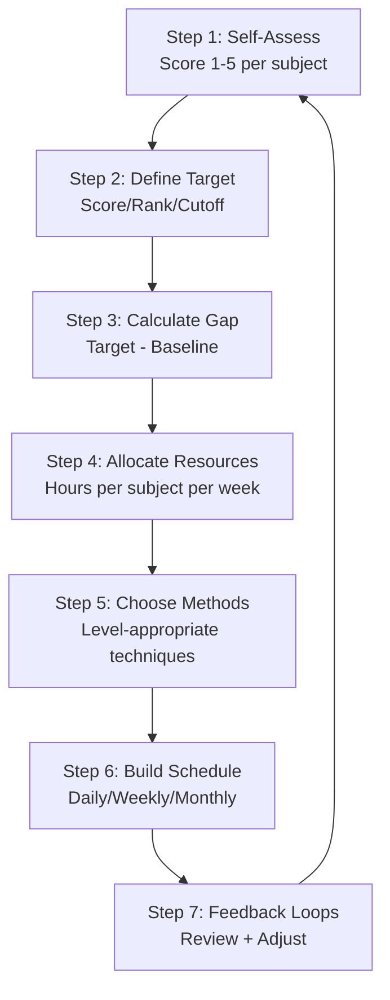

### Weekly Time Allocation Calculator

```typescript
interface StrategyInput {
  subject: string;
  currentLevel: number; // 1-5
  targetLevel: number; // 1-5
  weightage: number; // 1-10
}

interface StrategyOutput {
  subject: string;
  gapSize: number;
  hoursPerWeek: number;
  primaryMethod: string;
  resources: string;
}

function createStrategy(inputs: StrategyInput[], totalHoursPerWeek: number): StrategyOutput[] {
  const totalGap = inputs.reduce((sum, i) => sum + (i.targetLevel - i.currentLevel) * i.weightage, 0);
  
  return inputs.map(i => {
    const gapSize = i.targetLevel - i.currentLevel;
    const weightedGap = gapSize * i.weightage;
    const hoursPerWeek = Math.round((weightedGap / totalGap) * totalHoursPerWeek);
    
    let primaryMethod: string;
    let resources: string;
    
    if (i.currentLevel <= 2) {
      primaryMethod = 'Conceptual learning + basic practice';
      resources = 'Video lectures + textbook + easy exercises';
    } else if (i.currentLevel <= 3) {
      primaryMethod = 'Applied practice + mock tests';
      resources = 'PYQs + topic-wise tests + mistake analysis';
    } else {
      primaryMethod = 'Advanced problems + teaching';
      resources = 'Hard problems + explain to peers + edge cases';
    }
    
    return { subject: i.subject, gapSize, hoursPerWeek, primaryMethod, resources };
  });
}

const myStrategy = createStrategy([
  { subject: 'DBMS', currentLevel: 3, targetLevel: 5, weightage: 9 },
  { subject: 'OS', currentLevel: 2, targetLevel: 4, weightage: 7 },
  { subject: 'Computer Networks', currentLevel: 2, targetLevel: 4, weightage: 7 },
  { subject: 'DS & Algorithms', currentLevel: 4, targetLevel: 5, weightage: 9 },
  { subject: 'Digital Logic', currentLevel: 1, targetLevel: 3, weightage: 5 },
], 35);

myStrategy.forEach(s => {
  console.log(`${s.subject}: ${s.hoursPerWeek}h/week — ${s.primaryMethod}`);
});
```

---

## Q264: What is the structured preparation system?

A structured preparation system has three nested cycles: daily, weekly, and monthly.

### The 3-Cycle System

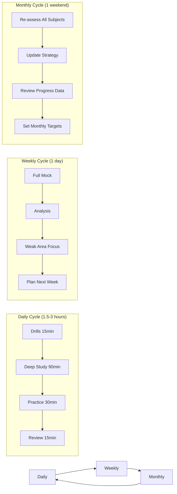

### Daily Preparation Template (3 hours)

| Time | Duration | Activity | Resource |
|------|----------|----------|----------|
| 0-15 min | 15 min | Warm-up drill | [Speed Drills](courses/speed-drills/) or 5 easy MCQs |
| 15-105 min | 90 min | Deep study (1 subject) | Textbook/video + notes + Anki |
| 105-135 min | 30 min | Practice (same subject) | Topic-wise questions |
| 135-150 min | 15 min | Review + Anki cards | Mistake log, spaced repetition |
| Bonus | 30 min | Current affairs / GA | [General Awareness](courses/general-awareness/) |

### Weekly Preparation Template

| Day | Morning (2 hr) | Afternoon (2 hr) | Evening (1 hr) |
|-----|----------------|------------------|----------------|
| Mon | Deep study: Subject A | Practice: Subject A Drills | Revision + Anki |
| Tue | Deep study: Subject B | Practice: Subject B Drills | Speed drill set |
| Wed | Deep study: Subject C | Practice: Subject C Drills | PYQ analysis |
| Thu | Deep study: Subject D | Practice: Subject D Drills | Mistake log review |
| Fri | Revision: All subjects | Formula sheets + Anki | Light review |
| Sat | **Full Mock Test** (timed) | **Mock Analysis** (C/M/E/R) | Rest |
| Sun | Weak area focus | Next week planning | Rest |

### Monthly Preparation Template

| Weekend | Activity |
|---------|----------|
| Week 1 | Re-assess all subjects (1-5 scoring) |
| Week 2 | Update strategy based on assessment |
| Week 3 | Review 30-day progress data |
| Week 4 | Set targets for next month + celebrate wins |

---

## Q265: How do I track my progress with objective metrics?

Tracking the right metrics is essential for knowing if your strategy is working.

### Input Metrics (What You Do)

| Metric | How to Measure | Daily Target | Weekly Target |
|--------|----------------|--------------|---------------|
| Study hours | Timer/tracker app | 2-4 hours | 20-30 hours |
| Questions solved | Count per session | 20-30 | 150-200 |
| Anki reviews | Anki stats | 50-100 | 350-700 |
| Speed drill sets | Completed sets | 1-2 | 7-10 |
| Pages read | Pages per session | 10-20 | 70-140 |

### Output Metrics (What You Achieve)

| Metric | How to Measure | Target |
|--------|----------------|--------|
| Topic test accuracy | % correct on topic-wise tests | 85%+ |
| Mock test score | Full-length test score | Above cutoff |
| Mistake reduction | C/M/E/R counts week-over-week | Decreasing trend |
| Speed | Questions per minute | Match exam requirement |
| Rank/Percentile | Relative to peers (if available) | Top 10% |

### The Progress Dashboard

```typescript
interface ProgressData {
  week: number;
  hoursStudied: number;
  questionsSolved: number;
  avgAccuracy: number; // %
  mockScore: number; // out of total
  mistakesC: number;
  mistakesM: number;
  mistakesE: number;
  topic: string;
}

function analyzeTrend(data: ProgressData[]): string {
  if (data.length < 2) return 'Need at least 2 weeks of data';
  
  const first = data[0];
  const last = data[data.length - 1];
  
  const accuracyTrend = last.avgAccuracy - first.avgAccuracy;
  const mockTrend = last.mockScore - first.mockScore;
  const mistakeTrend = (last.mistakesC + last.mistakesM + last.mistakesE) -
    (first.mistakesC + first.mistakesM + first.mistakesE);
  
  const result: string[] = [];
  result.push(`📊 Progress Report: Week ${first.week} → Week ${last.week}`);
  
  if (accuracyTrend > 5) result.push('✅ Accuracy: Improving significantly');
  else if (accuracyTrend > 0) result.push('🟡 Accuracy: Slight improvement');
  else result.push('🔴 Accuracy: Declining — review fundamentals');
  
  if (mockTrend > 10) result.push('✅ Mock Score: Strong improvement');
  else if (mockTrend > 0) result.push('🟡 Mock Score: Marginal gain');
  else result.push('🔴 Mock Score: Dropping — change strategy');
  
  if (mistakeTrend < 0) result.push('✅ Mistakes: Decreasing (good)');
  else result.push('🔴 Mistakes: Increasing — need more analysis');
  
  return result.join('\n');
}

const myProgress: ProgressData[] = [
  { week: 1, hoursStudied: 28, questionsSolved: 180, avgAccuracy: 65, mockScore: 55, mistakesC: 25, mistakesM: 15, mistakesE: 10, topic: 'DBMS' },
  { week: 4, hoursStudied: 32, questionsSolved: 210, avgAccuracy: 78, mockScore: 72, mistakesC: 15, mistakesM: 8, mistakesE: 12, topic: 'DBMS' },
];

console.log(analyzeTrend(myProgress));
```

### Key Metrics Dashboard

```mermaid
flowchart TD
    subgraph "Input Metrics"
        A[Study Hours] --> E{Dashboard}
        B[Questions Solved] --> E
        C[Anki Reviews] --> E
        D[Speed Drills] --> E
    end
    
    subgraph "Output Metrics"
        F[Accuracy %] --> E
        G[Mock Score] --> E
        H[C/M/E/R Counts] --> E
        I[Speed per Q] --> E
    end
    
    E --> J{Healthy?}
    J -->|Input ↑ Output ↑| K[✅ On Track]
    J -->|Input ↑ Output ↓| L[🔴 Change Methods]
    J -->|Input ↓ Output ↓| M[🔴 Increase Effort]
    J -->|Input ↓ Output ↑| N[🟡 Efficiency Gain]
```

---

## Q266: How do I identify and fix plateaus?

Plateaus are normal in any learning journey. The key is recognizing them and knowing how to break through.

### The Dreyfus Model of Skill Acquisition

| Stage | Description | Time at Stage | How to Progress |
|-------|-------------|---------------|-----------------|
| **1 — Novice** | Follows rules, needs context-free instructions | 1-4 weeks | Study examples, practice with guidance |
| **2 — Advanced Beginner** | Can apply rules to familiar situations | 1-3 months | Practice varied problems, build pattern recognition |
| **3 — Competent** | Can plan and prioritize, troubleshoot | 3-12 months | Deliberate practice, identify weak spots |
| **4 — Proficient** | Sees the big picture, learns from experience | 1-5 years | Teach others, review holistically |
| **5 — Expert** | Intuitive, doesn't rely on rules | 5+ years | Contribute new knowledge, mentor |

### Breaking Through Plateaus

| Plateau Type | Symptoms | Cause | Fix |
|-------------|----------|-------|-----|
| **Motivation Plateau** | Can't start studying, feels pointless | Lack of clear goals or progress visibility | Set micro-goals, track streaks, study with partner |
| **Technique Plateau** | Same methods aren't working | Wrong approach for your level | Change from reading to practice, or practice to teaching |
| **Knowledge Plateau** | Not learning new concepts | Content too easy or too hard | Adjust difficulty, switch resources |
| **Performance Plateau** | Scores not improving | Weak fundamentals or bad habits | Go back to basics, analyze mistake patterns |
| **Burnout Plateau** | Mental exhaustion | Too much intensity without rest | Take 2-3 days off, active recovery |

### The 3-Day Plateau Break Protocol

```
DAY 1: REST
  - No study at all
  - Physical activity (walk, run, gym)
  - Sleep 8+ hours
  - Review your progress data (not your content)

DAY 2: DIAGNOSE
  - Identify plateau type from the table above
  - Take a diagnostic test on your plateau subject
  - Analyze mistakes deeply (C/M/E/R)
  - Talk to a study partner or mentor

DAY 3: CHANGE
  - Implement one specific change based on diagnosis
  - If technique plateau: switch from reading to practice
  - If knowledge plateau: find a different resource
  - If performance plateau: drill fundamentals
  - Set a small, achievable goal for the next week
```

---

## Q267: What is the OODA loop and how do I apply it to learning?

The OODA loop (Observe, Orient, Decide, Act) was developed by military strategist John Boyd. It's the perfect framework for iterative learning.

### The OODA Learning Loop

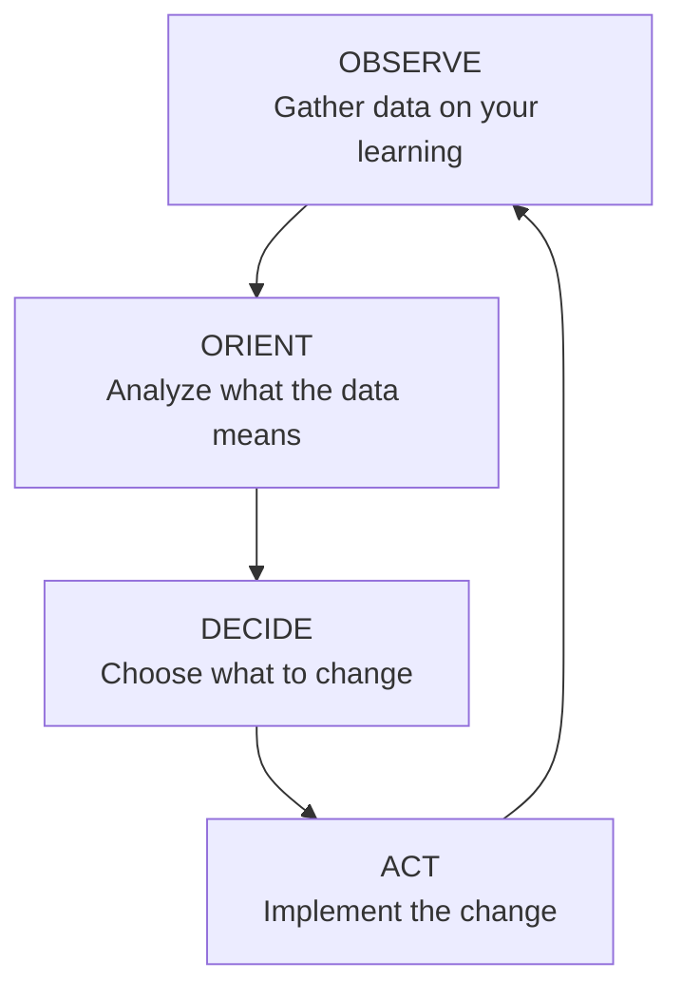

### Applied to Exam Preparation

| Phase | Questions to Ask | Actions |
|-------|------------------|---------|
| **OBSERVE** | What did I study? How many hours? What scores? | Track metrics, log activity, record mock scores |
| **ORIENT** | What do the numbers mean? What patterns do I see? | Identify trends, classify mistakes, find root causes |
| **DECIDE** | What should I change? | Adjust subject allocation, change resources, focus on weak areas |
| **ACT** | Execute the change | Follow the new plan for one week, then re-observe |

### Weekly OODA Review Protocol

Every Sunday, spend 30 minutes running the OODA loop:

```
📋 SUNDAY OODA REVIEW
─────────────────────

OBSERVE (10 min):
  â–¡ Hours studied this week: ___
  â–¡ Questions solved: ___
  â–¡ Mock score: ___/___
  â–¡ Mistake counts: C=___ M=___ E=___ R=___
  â–¡ Anki reviews done: ___

ORIENT (10 min):
  â–¡ Top 3 things that went well: 1.___ 2.___ 3.___
  â–¡ Top 3 things that went wrong: 1.___ 2.___ 3.___
  â–¡ Is my accuracy improving? Y/N
  â–¡ Are my C-type mistakes decreasing? Y/N
  â–¡ Am I spending time on the right subjects? Y/N

DECIDE (5 min):
  â–¡ Next week's focus subject: ___
  â–¡ One thing to STOP doing: ___
  â–¡ One thing to START doing: ___
  â–¡ One thing to CONTINUE: ___

ACT (5 min):
  â–¡ Update weekly schedule
  â–¡ Adjust Anki deck priorities
  â–¡ Plan next week's mock test
```

---

## Q268: How do I build effective feedback loops?

Feedback loops are the engine of improvement. The faster and more accurate your feedback, the faster you improve.

### Types of Feedback Loops

| Loop Type | Speed | Accuracy | Example |
|-----------|-------|----------|---------|
| **Immediate** | Seconds | High | Solving a problem and checking the answer |
| **Daily** | Hours | Medium | Reviewing today's mistakes |
| **Weekly** | Days | Medium | Mock test analysis |
| **Monthly** | Weeks | Low-Medium | Self-assessment re-score |
| **External** | Variable | High | Mentor/teacher feedback |

### Building Fast Feedback Into Your Study

| Activity | Feedback Type | How to Implement |
|----------|---------------|------------------|
| Topic-wise MCQ | Immediate | Answers at end of each set |
| Coding problem | Immediate | Run tests, see output |
| Formula recall | Immediate | Active recall with Anki |
| Mistake log review | Daily | End-of-day 15-min review |
| Peer teaching | Daily/Weekly | Explain concept to study partner |
| Mock test analysis | Weekly | Full C/M/E/R classification |
| Mentor check-in | Monthly | External perspective on blind spots |

### The Feedback Quality Formula

```
Feedback Quality = Speed × Accuracy × Actionability

Speed: How quickly after the action?
Accuracy: How precise is the feedback?
Actionability: Can you directly use it to improve?

Example - Solving a coding problem:
  Speed: Immediate (9/10) ✓
  Accuracy: Exact test case output (10/10) ✓
  Actionability: Fix specific bug (8/10) ✓
  → Quality Score: 9 × 10 × 8 = 720/1000

Example - Reading a textbook chapter:
  Speed: Delayed (3/10) ✗
  Accuracy: General understanding (5/10) ✗
  Actionability: Unclear (3/10) ✗
  → Quality Score: 3 × 5 × 3 = 45/1000
```

---

## Q269: How do I create a personal learning plan from scratch?

Combining everything in this chapter into one actionable plan.

### The Complete 7-Step Personal Learning Plan

**Step 1: Define Your Goal**

Be specific, measurable, and time-bound.

```
❌ Bad: "I want to clear IBPS SO"
✅ Good: "I want to score 75+ in IBPS SO IT Officer 2027 exam (October 2027)"
✅ Better: "I want to score 75+/175 with sectional: PK 35+, Reasoning 20+, Quant 12+, English 10+"
```

**Step 2: Assess Your Current State**

Use the self-assessment protocol from Q261. Score every subject on the 1-5 scale.

**Step 3: Calculate the Gap**

| Your Score | Target | Gap | Priority |
|------------|--------|-----|----------|
| DBMS: 3 | Target: 5 | 2 | High |
| OS: 2 | Target: 4 | 2 | High |
| Quant: 3 | Target: 4 | 1 | Medium |
| Reasoning: 1 | Target: 3 | 2 | Critical |

**Step 4: Determine Available Time**

```
Exam date: October 2027
Today: July 2026
Available months: 15 months = 60 weeks = ~420 days
Available hours: 3 hrs/day × 6 days/week × 60 weeks = 1,080 hours
Study hours per subject = (weighted gap / total weighted gap) × 1,080
```

**Step 5: Build the Schedule**

Use the structured preparation templates from Q264.

**Step 6: Add Measurement Points**

| Milestone | When | What to Measure |
|-----------|------|-----------------|
| Baseline | Week 1 | Subject scores (1-5), mock score |
| Check 1 | Month 1 | Topic test scores |
| Check 2 | Month 3 | First full mock |
| Check 3 | Month 6 | Second full mock + re-assessment |
| Check 4 | Month 9 | Third full mock + trend analysis |
| Check 5 | Month 12 | Fourth full mock + all subjects 4+ |
| Final | Month 15 | Peak mock performance |

**Step 7: Create Feedback Loops**

- Daily: Mistake log + Anki
- Weekly: OODA review + mock analysis
- Monthly: Re-assessment + strategy update

---

## Q270: How do I use this repository for structured preparation?

This repository is designed to support every stage of your preparation journey.

### Preparing with This Repository

| Stage | What to Use | How to Use |
|-------|-------------|------------|
| **Self-Assessment** | [Learning How to Learn ch 16](ch-16-self-assessment-strategy.md) | Score yourself 1-5 per subject, identify gaps |
| **Concept Learning** | Subject courses (DBMS, OS, CN, DS, etc.) | Read chapters → solve MCQs → create Anki cards |
| **Topic Practice** | Chapter exercises + MCQs | Solve all exercises per chapter |
| **Applied Practice** | [Coding Problems](courses/coding-problems/) | Solve problems by topic with company tags |
| **Speed Building** | [Speed Drills](courses/speed-drills/) | Timed sets with accuracy tracking |
| **Mock Tests** | [Mock Tests](courses/mock-tests/) | Full-length timed mocks |
| **PYQs** | [Government PYQs](courses/government-pyqs/) + [GATE PYQs](courses/gate-cs-preparation/) | Year-wise solved papers |
| **Company Prep** | [Company QBs](courses/interview-preparation/) | Target-specific problems |
| **Revision** | Formula sheets + Anki + mistake log | Daily review |
| **Re-assessment** | Self-assessment protocol (this chapter) | Monthly re-score |

### Recommended Path Through This Repository

```
1. Start here: [Learning How to Learn](index.md) — all 16 chapters in order
2. Self-assess using this chapter's protocol
3. Choose your path from the [Complete Roadmap](../../roadmap.md)
4. Study subject courses → practice → mock tests → analyze → repeat
5. Use the OODA loop weekly to refine your approach
6. Re-assess monthly to track progress
```

---

## Q271: How do I handle self-assessment honestly?

The biggest challenge with self-assessment is bias. Most people overestimate or underestimate their abilities.

### Common Self-Assessment Biases

| Bias | Description | Fix |
|------|-------------|-----|
| **Dunning-Kruger Effect** | Low performers overestimate, high performers underestimate | Take objective tests to calibrate |
| **Recency Bias** | Judging based on recent experience (good or bad) | Look at long-term trend, not just last session |
| **Confirmation Bias** | Seeking evidence that confirms your self-view | Use blind testing (don't know topic before test) |
| **Optimism Bias** | Overestimating future performance | Use historical data, not projected data |

### Calibration Protocol

```
MONTH 1: ESTABLISH BASELINE
  - Take a full diagnostic test on each subject
  - Score yourself BEFORE the test (predicted score)
  - Compare predicted vs actual
  - Note your bias (overestimator or underestimator)

MONTH 2+: ADJUST
  - If you overestimate: Apply -15% correction to self-scores
  - If you underestimate: Apply +10% correction to self-scores
  - Re-calibrate monthly
```

---

## Q272: How do I adapt my strategy when things change?

Life happens. Exams get postponed. You get sick. Motivation dips. Your strategy must be adaptable.

### The Adaptive Strategy Framework

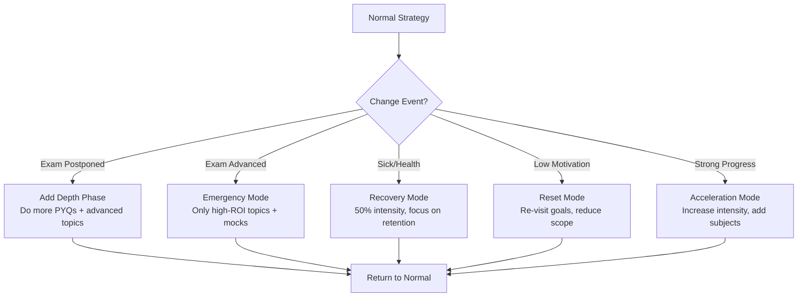

### Strategy Adjustment Templates

| Situation | Adjustment | Example |
|-----------|------------|---------|
| Exam postponed by 6 months | Add depth: study advanced topics, do more PYQs | Study B+ trees and advanced query optimization |
| Exam advanced by 2 months | Cut low-weightage topics, focus on mocks only | Skip Web Technologies (8%), focus on DBMS (27%) |
| Sick for 1 week | 50% intensity: only Anki + light revision | No new topics, just review existing cards |
| Low motivation | Reduce daily target, focus on enjoyment | Switch to easier subject temporarily |
| Strong mock performance | Increase intensity, add additional subjects | Add 2 more subjects to weekly rotation |
| Weak mock performance | Cut breadth, increase depth on weak areas | Study just 2 subjects for 2 weeks |

---

## Q273: How do I conduct a monthly strategy review?

The monthly review is your most important feedback loop.

### Monthly Review Template

Run this on the last weekend of every month.

```
📅 MONTHLY STRATEGY REVIEW
──────────────────────────
Date: __________

INPUT METRICS:
  Total study hours: ___ (target: 80-120)
  Questions solved: ___ (target: 600-800)
  Anki reviews: ___ (target: 2000-3000)
  Speed drill sets: ___ (target: 20-30)

OUTPUT METRICS:
  Subject scores (1-5):
    DBMS: __ → __ (change: __)
    OS: __ → __ (change: __)
    CN: __ → __ (change: __)
    DS: __ → __ (change: __)
    [continue for all subjects]
  
  Best mock score: ___/___
  Latest mock score: ___/___
  Trend: Improving / Plateau / Declining

MISTAKE ANALYSIS (last 4 mocks):
  Total C-type: __ (trend: up/down/same)
  Total M-type: __ (trend: up/down/same)
  Total E-type: __ (trend: up/down/same)

STRATEGY REVIEW:
  What worked well this month?
    1. ___
    2. ___
  
  What didn't work?
    1. ___
    2. ___
  
  What surprised me?
    1. ___
    2. ___

NEXT MONTH'S PLAN:
  Focus subject: ___
  One thing to STOP: ___
  One thing to START: ___
  One thing to CONTINUE: ___
  Next month's target scores:
    Subject improvements: ___, ___, ___
    Mock score target: ___/___
```

---

## Q274: How do I prepare for a retake or second attempt?

Many successful candidates needed multiple attempts. Here's how to make each attempt count.

### After a Failed Attempt — First 48 Hours

```
HOURS 0-24: PROCESS
  - Let yourself feel disappointed (it's normal)
  - Don't look at the answer key yet
  - Talk to someone about it
  - Sleep on it

HOURS 24-48: ANALYZE
  - Now look at the answer key
  - Score yourself by section
  - Compare to cutoff in each section
  - Identify: was it lack of knowledge or bad execution?
```

### Section-Wise Gap Analysis After Failure

| Section | Your Score | Cutoff | Gap | Root Cause |
|---------|------------|--------|-----|------------|
| Professional Knowledge | 28/60 | 30/60 | -2 | Misc: C-type mistakes on OS |
| Reasoning | 22/45 | 15/45 | +7 | Strength area |
| Quant | 10/35 | 10/35 | 0 | Barely passed — needs work |
| English | 8/35 | 8/35 | 0 | Barely passed — needs work |
| **Total** | **68/175** | **55-60** | **+8** | Passed overall but weak sections |

### Retake Strategy

| Phase | Duration | Focus |
|-------|----------|-------|
| Rest | 1-2 weeks | No study, recover mentally |
| Analysis | 1 week | Deep analysis of failure reasons |
| Foundation | 2 months | Fix all weak areas identified |
| Practice | 2 months | More mocks, higher frequency |
| Peak | 1 month | Exam simulation, mental prep |

---

## Q275: How do I create a study plan for someone else?

If you're mentoring or coaching someone, use this framework.

### Mentoring Assessment Protocol

| Question | What It Reveals |
|----------|-----------------|
| "Score yourself 1-5 on each subject" | Baseline assessment |
| "What was your last mock score?" | Objective performance data |
| "How many hours do you study daily?" | Input effort metric |
| "What's your biggest challenge?" | Perceived weakness |
| "Describe your current study routine" | Strategy quality |
| "What resources are you using?" | Resource quality |
| "Do you track your progress?" | Self-awareness level |

### Creating a Plan for Someone Else

```
1. Assess using the questions above
2. Identify the gap between self-score and test score
3. Identify the gap between current hours and required hours
4. Build a plan that addresses both gaps
5. Set clear weekly targets
6. Schedule weekly check-ins for accountability
7. Adjust based on progress
```

---

## Q276: How do I handle conflicting priorities?

When you have multiple goals (job + exam + health + relationships), use the Eisenhower Matrix.

### The Priority Matrix

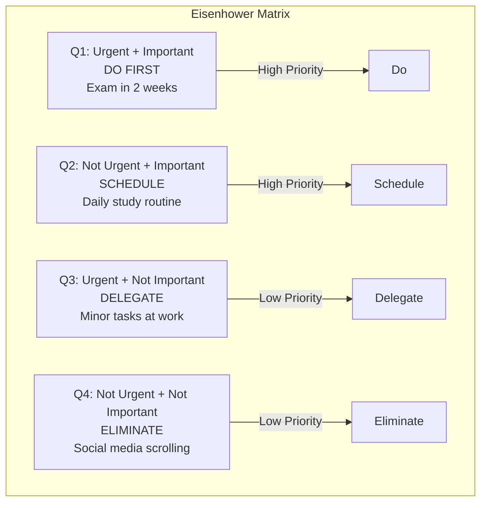

### Time Allocation for Working Professionals

| Time Block | Duration | Activity |
|------------|----------|----------|
| Early morning (6-7:30 AM) | 1.5 hr | Deep study (high focus) |
| Commute (7:30-8:30 AM) | 1 hr | Light revision / Anki |
| Lunch break (12-12:30 PM) | 30 min | Quick MCQs / speed drill |
| Evening (7-9 PM) | 2 hr | Practice + mock analysis |
| Late night (9-9:30 PM) | 30 min | Review next day's plan |

---

## Q277: How do I create a preparation calendar?

A visual calendar helps you see the big picture and stay motivated.

### 6-Month Preparation Calendar Template

```
MONTH 1 — FOUNDATION
  Week 1: Self-assessment + strategy creation
  Week 2-3: Subject A + Subject B (deep study)
  Week 4: Subject C + Subject D (deep study)
  First mock: End of Month 1

MONTH 2 — BUILDING
  Week 1-2: Subject E + Subject F (deep study)
  Week 3: All subjects — topic-wise practice
  Week 4: Full revision of all subjects
  Second mock: End of Month 2

MONTH 3 — PRACTICE
  Week 1-2: 2 mocks per week + detailed analysis
  Week 3-4: Weak area focus + speed building
  Third + Fourth mock

MONTH 4 — INTENSIFICATION
  Week 1-2: 3 mocks per week
  Week 3: Advanced topic coverage
  Week 4: Full analysis + trend review
  Fifth, Sixth, Seventh mock

MONTH 5 — PEAK
  Week 1-2: 3 mocks per week + mistake elimination
  Week 3: Formula revision + mental prep
  Week 4: Reduced intensity, confidence building

MONTH 6 — EXAM READY
  Week 1: 2 mocks + final gap fixing
  Week 2: Light revision + exam simulation
  Week 3: Last week prep (per ch 15 protocol)
  Week 4: EXAM WEEK
```

---

## Q278: How do I maintain motivation over long preparation periods?

Long-term preparation requires motivation management as much as knowledge management.

### The Motivation Curve

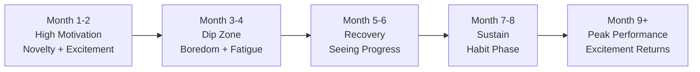

### Motivation Maintenance Techniques

| Technique | How It Works | When to Use |
|-----------|-------------|-------------|
| **Streak Tracking** | Don't break the chain — visual progress | Daily |
| **Study Group** | Social accountability | Weekly |
| **Reward System** | Treat yourself after milestones | After each mock/test |
| **Visual Progress** | Progress bar, graph of scores | Weekly review |
| **Role Model** | Follow someone who succeeded | When demotivated |
| **Why Wall** | Write your reasons on sticky notes | Morning ritual |
| **Mini-Goals** | Break 6-month goal into weekly wins | Weekly planning |

---

## Q279: How do I use the tools in this repository together?

All the tools in this repository are designed to work together as a complete preparation system.

### The Integrated System

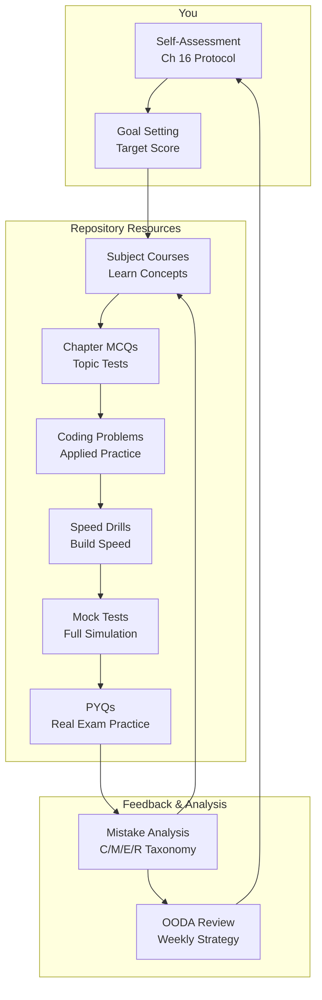

### Quick Reference Card

| Need | Go To |
|------|-------|
| Assess my current level | [Self-Assessment Protocol](ch-16-self-assessment-strategy.md#q261) |
| Learn a CS subject | Subject courses (DBMS, OS, CN, etc.) |
| Practice coding | [Coding Problems](courses/coding-problems/) |
| Build speed | [Speed Drills](courses/speed-drills/) |
| Take a mock test | [Mock Tests](courses/mock-tests/) |
| Solve PYQs | [Government PYQs](courses/government-pyqs/) or [GATE PYQs](courses/gate-cs-preparation/) |
| Analyze mistakes | [C/M/E/R Taxonomy](https://github.com/Raushan666java/ai-engineering-journey/blob/main/docs/courses/learning-how-to-learn/ch-15-exam-cracking-mastery.md#q232) |
| Review strategy | [OODA Loop](ch-16-self-assessment-strategy.md#q267) |
| Stay motivated | [Motivation Techniques](ch-16-self-assessment-strategy.md#q278) |
| Plan my month | [Monthly Review](ch-16-self-assessment-strategy.md#q273) |
| Get the big picture | [Complete Roadmap](../../roadmap.md) |

---

## Summary

Self-assessment and structured preparation are the meta-skills that amplify every other skill you learn. The key principles are:

1. **You can't improve what you don't measure** — Use the 1-5 scoring system to objectively assess every subject
2. **Gap analysis reveals unknown unknowns** — PYQs and mock tests surface gaps you didn't know existed
3. **Strategy must match your level** — Novice, Competent, and Expert learners need different approaches
4. **Structured preparation uses three cycles** — Daily execution, weekly review, monthly strategy adjustment
5. **Track both inputs and outputs** — Hours studied (input) and scores achieved (output) tell different stories
6. **Plateaus are normal and breakable** — Use the Dreyfus model to identify your stage and the right fix
7. **The OODA loop keeps you on track** — Weekly Observe-Orient-Decide-Act review prevents drift
8. **Fast feedback accelerates improvement** — Immediate, accurate, actionable feedback is the engine of growth
9. **Adaptability is essential** — Have contingency plans for when life changes
10. **This repository is a complete system** — All resources are designed to work together for any exam

---

## Chapter Quiz

1. In the 1-5 self-assessment scale, what does a score of 3 mean?
   - A) Never studied the topic
   - B) Can solve simple problems with help
   - C) Can solve standard problems independently
   - D) Can solve complex problems and teach others

<details>
<summary>Show Answer</summary>
**Answer:** C) Score 3 = Intermediate = Can solve standard problems independently.
</details>

2. What is the most dangerous type of knowledge gap?
   - A) Known Knowns
   - B) Known Unknowns
   - C) Unknown Knowns
   - D) Unknown Unknowns

<details>
<summary>Show Answer</summary>
**Answer:** D) Unknown Unknowns — gaps you don't know exist, revealed only by diagnostic tests and PYQs.
</details>

3. Which OODA loop phase involves analyzing what your metrics mean?
   - A) Observe
   - B) Orient
   - C) Decide
   - D) Act

<details>
<summary>Show Answer</summary>
**Answer:** B) Orient — where you analyze the data you've observed to understand what it means.
</details>

4. What is the recommended frequency for running the OODA loop on your preparation?
   - A) Daily
   - B) Weekly
   - C) Monthly
   - D) After each mock test

<details>
<summary>Show Answer</summary>
**Answer:** B) Weekly — the Sunday OODA review keeps you on track without being too frequent.
</details>

5. According to the Dreyfus model, how long does it typically take to reach the "Competent" stage in a subject?
   - A) 1-4 weeks
   - B) 1-3 months
   - C) 3-12 months
   - D) 1-5 years

<details>
<summary>Show Answer</summary>
**Answer:** C) 3-12 months to reach the Competent stage (can plan, prioritize, and troubleshoot independently).
</details>

---

## Practical Takeaways

| Concept | Action This Week | Time Required |
|---------|------------------|---------------|
| Self-Assessment | Score yourself 1-5 on all exam subjects | 1 hour |
| Gap Analysis | Create a gap spreadsheet with self-score vs test score | 1 hour |
| Strategy Creation | Build a personalized strategy using the 7-step framework | 2 hours |
| Structured Schedule | Design your daily/weekly/monthly schedule | 1 hour |
| Metrics Dashboard | Set up tracking for inputs and outputs | 30 min |
| OODA Review | Run your first Sunday OODA review | 30 min |
| Feedback Loop Audit | Identify your fastest and slowest feedback loops | 30 min |
| Plateau Plan | Write a plan for handling your current plateau | 30 min |
| Motivation System | Set up streak tracking + reward system | 30 min |
| Resource Map | Map repository resources to your study plan | 1 hour |

---

## Exercises

1. **Complete Self-Assessment:** List all subjects for your target exam. Score each 1-5 using the objective criteria. Calculate weighted readiness scores. Identify your top 3 priority subjects.

2. **Gap Analysis Spreadsheet:** Create a spreadsheet with columns: Subject, Sub-topic, Self Score, Test Score, Gap, Priority, Action Plan. Fill in at least 20 rows from your latest mock test.

3. **Strategy Creation:** Use the 7-step framework (Goal → Assess → Gap → Resources → Methods → Schedule → Feedback) to create your complete preparation strategy. Write it down as a one-page document.

4. **OODA Review Journal:** Start a weekly OODA review journal. Every Sunday for the next 4 weeks, run through Observe-Orient-Decide-Act and write down your reflections.

5. **Feedback Loop Audit:** List every feedback loop in your current study routine. Score each on Speed (1-10), Accuracy (1-10), and Actionability (1-10). Identify your weakest loop and improve it this week.

6. **Motivation System Design:** Design a complete motivation maintenance system with: streak tracker, reward milestones, study group/partner accountability, visual progress dashboard, and a "why wall."

7. **Monthly Review Template:** Create your personalized monthly review template. Use the template from Q273 as a starting point and customize it for your exam.

8. **Resource Map:** Draw a flow chart (like the one in Q279) showing how you will use each repository resource in your preparation journey.

9. **Plateau Protocol:** Write your personal 3-day plateau break protocol. Customize the generic protocol from Q266 to your specific learning style and exam.

10. **Second Attempt Plan:** If you're preparing for a retake, create a complete second attempt strategy using the framework from Q274. Include rest, analysis, foundation, practice, and peak phases.

---

## Further Reading

- **Chapter 13:** [Learning Analytics](./ch-13-learning-analytics.md) — Measuring your learning with objective metrics
- **Chapter 14:** [Social Learning & Communities](./ch-14-social-learning-communities.md) — Learning with others for accountability
- **Chapter 15:** [Exam Cracking Mastery](./ch-15-exam-cracking-mastery.md) — Universal exam strategy, mock analysis, C/M/E/R taxonomy
- **Roadmap:** [Complete Course Roadmap](../../roadmap.md) — All preparation paths in one place
- **Coding Problems:** [Coding Problems Bank](../../courses/coding-problems/index.md) — 220 problems with company tags
- **Mock Tests:** [Full-Length Mocks](../../courses/mock-tests/index.md) — IBPS SO, NIC, SBI, RBI, SSC, GATE
