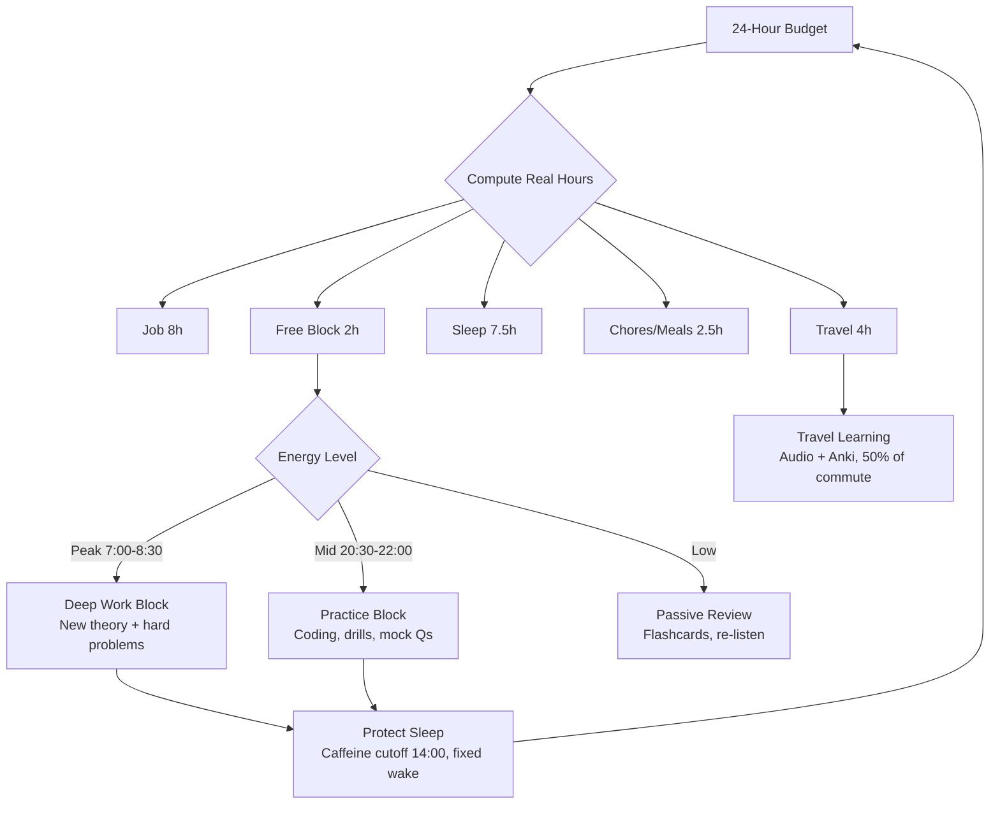
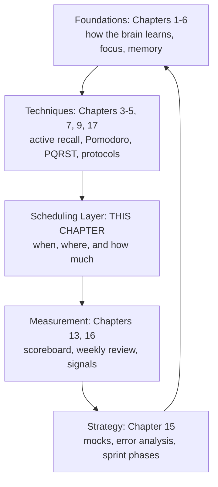

# Chapter 18: Professional Routine & Energy Design

> **Prerequisites:** [Chapter 6: Procrastination, Habits & Deep Work](./ch-06-procrastination-habits-deep-work.md) — Deep-work blocks and habit systems are the raw materials this chapter schedules.
> **Also see:** [Chapter 17: Study Protocols & Brain Hacks](./ch-17-study-protocols.md) — The Warrior Protocol this chapter adapts to a working professional's calendar.

> **The full architecture for learning while employed: how a 10-to-6 job, 4 hours of daily travel, family, and a placement goal fit into one sustainable weekly system — built on the science of circadian rhythms, ultradian cycles, and energy economics, not motivation.**
> Covers Q319–Q340 — 22 Q&As

Most study advice assumes you have unlimited evenings and weekends. You do not. You have a fixed work window (say 10:00–18:00), a brutal commute (say 2 hours each way), and a finite energy budget that your job consumes first. This chapter is the design manual for that reality: how to compute your true study budget, match tasks to energy instead of time, convert dead travel hours into learning hours, protect the sleep that makes it all possible, and build a weekly template that survives overtime, meetings, and bad days.

The core shift: **stop asking "how much time do I have?" and start asking "how much energy do I have, and when?"** A professional with 90 minutes of high-energy time beats a jobless student with 6 hours of drained time. This chapter shows you how to find, protect, and compound that 90 minutes.

---

## Learning Objectives

After completing this chapter, you will be able to:

- Compute your true weekly study budget from your actual work, travel, sleep, and chore hours
- Distinguish time-based scheduling from energy-based scheduling, and apply the right one to each block
- Design a morning deep-work block that produces before your job begins
- Convert 2+ hours of daily commute into passive and semi-active learning without burning out
- Apply the lunch-hour rule (walk, low-GI food, no caffeine after 2 p.m.) to eliminate the afternoon crash
- Structure an evening practice block that survives a drained brain
- Protect sleep with the caffeine cutoff, alcohol limit, fixed wake time, and sleep-restriction protocol
- Build a weekend that alternates mock-test pressure with genuine recovery
- Run a minimum-viable-day protocol when work explodes, so one bad day never kills the system
- Assemble the Professional Warrior Protocol and the 90-day placement sprint

---

### Chapter at a Glance

| Concept | Key Insight | Practical Takeaway |
|---------|-------------|-------------------|
| Time Budget | Time is not the constraint — energy is | Compute study hours from real calendar, not idealistic plans |
| Energy Scheduling | Match task type to energy level | Deep work at peak, practice at mid, review at low |
| Morning Deep Block | The job cannot steal 7:00–8:30 a.m. | One hard topic before work changes your whole day |
| Travel Learning | Commute is 10+ hours/week of dead time | Passive audio + flashcard reviews turn it into 5+ study hours |
| Lunch-Hour Rule | Food, water, and walking decide your afternoon | Low-GI lunch, 15-min walk, no afternoon caffeine |
| Evening Practice | Drained brain needs retrieval, not intake | Code practice and flashcards — never new theory at night |
| Sleep Protection | Sleep is the multiplier for everything else | Caffeine cutoff 2 p.m., fixed wake time, alcohol off |
| Weekend Design | Mocks on Saturday, review on Sunday | Pressure day + recovery day, never both |
| Minimum Viable Day | Bad days are inevitable, failure is optional | 45-minute floor protocol keeps the streak alive |
| 90-Day Sprint | A finite sprint beats an infinite grind | 3 phases: foundation → pressure → polish, with deload weeks |



---

## Q319: Why do I fail to study even when I "have time"?

Because you are scheduling by **clock hours**, not by **energy hours**. After a 10-to-6 job and a 2-hour commute, your 8 p.m. self is a different person from your 8 a.m. self — and most study plans assume the same person all day.

### The Time Trap

Consider a professional with this day:

| Window | What Actually Happens | Energy After |
|--------|----------------------|--------------|
| 07:00–08:30 | Morning routine + commute prep | Peak — rested, undamaged |
| 08:30–10:00 | Commute to office | Moderate — already spent 90 min |
| 10:00–18:00 | Job: meetings, code, pressure | Draining — cognitive + emotional |
| 18:00–20:00 | Commute home | Low — social battery gone |
| 20:00–21:00 | Dinner, family, chores | Recovering |
| 21:00–23:00 | "Free time" | Low-moderate — but reactive |

The trap: the plan says "study 21:00–23:00, that's 2 hours." Reality says: after 8 hours of focused work, a commute, and family time, those 2 hours are **low-octane hours**. You open the book, your brain refuses, you close it, and you conclude "I'm not disciplined." You are disciplined — you're just scheduling hard work in your brain's downtime.

### The Two Laws of Professional Learning

1. **Energy is the real currency.** Time is a container; energy decides what fits inside. Two hours at 40% energy ≠ two hours at 90% energy.
2. **Your job is the landlord of your energy.** It collects rent on your focus all day. The question is what remains after rent, and when.

### The Fix in One Line

**Do your hardest learning when your brain is at its daily peak — which for most people is BEFORE work, not after.** Chapter 1's circadian science (Q10–Q16) shows the morning peak is the most reliable high-energy window for most chronotypes. That single shift — from "evening study" to "morning deep work + evening practice" — is the highest-leverage change a professional can make.

### Try This

Write your own energy audit table like the one above. For 3 days, rate your energy 1–10 at 7:00, 12:00, 18:00, and 21:00. You will find your personal peak windows — and they are almost certainly not "after work."

---

## Q320: How do I compute my real study budget?

Add up the actual hours, not the idealized ones. A budget computed from fantasy collapses the first week; a budget computed from reality survives a year.

### The 168-Hour Week Math

| Category | Hours/Week (example) | Notes |
|----------|---------------------|-------|
| Work (10–6, 5 days) | 40 | Job only, not commute |
| Commute (2h × 2 × 5) | 20 | The hidden time asset |
| Sleep (7.5h × 7) | 52.5 | Non-negotiable, fixed first |
| Meals + hygiene | 10.5 | 1.5h/day |
| Chores + family | 10.5 | 1.5h/day |
| Exercise + breaks | 5 | Includes 3 × 15-min lunch walks |
| **Remaining free** | **~29** | 4h/day weekdays + 9h weekend |

### What Those 29 Hours Really Contain

| Sub-Block | Hours | Best Use | Energy |
|-----------|-------|----------|--------|
| Morning deep block (7:00–8:30, weekdays) | 7.5 | New theory, hard DSA, system design | Peak |
| Travel out (60–75 min/day) | 5–6 | Lecture audio, new-topic exposure | Moderate |
| Travel back (45–60 min/day) | 4–5 | Flashcards, voice-note recall, re-listen | Low-moderate |
| Evening practice (21:00–22:00, 4 nights) | 4 | Code practice, mock questions, revision | Low-moderate |
| Saturday (3h morning) | 3 | Full mock test under timed conditions | Peak |
| Sunday (2h) | 2 | Weekly review, Anki catch-up, planning | Recovery |

**Total realistic: 25–29 study-touching hours/week — roughly 12–15 hours of genuine deep learning and 10+ hours of passive reinforcement.** That is enough to clear 400+ DSA problems and 30 theory chapters in 3 months. Most working aspirants study 5–8 hours/week; doubling that with a real system is a competitive weapon.

### Budget Rules

- **Sleep first.** Fix 7.5h and never borrow from it — Chapter 1 (Q14) and Chapter 6 (Q75) show sleep consolidation is where learning happens.
- **Free time is not study time.** Family, social, and rest are line items in the budget, not leftovers.
- **One number to track:** your *deep hours* (peak-energy focused study). Everything else is bonus.

### Try This

Fill the table with YOUR numbers (your commute may be 1h or 3h; your job may end at 5 or 8). Then set a weekly target: **deep hours ≥ 10, passive hours ≥ 8.** Print it and keep it visible.

---

## Q321: What is energy-based scheduling, and how do I use it?

Time-based scheduling asks "what do I do at 9 p.m.?" Energy-based scheduling asks "what task does my current energy level support?" — and the answer is never the same all day.

### The Energy-Task Matrix

| Energy Level | Best Tasks | Worst Tasks |
|--------------|-----------|-------------|
| **Peak** (morning, rested) | New theory, hard problems, system design, writing | Admin, emails, passive reading |
| **Moderate** (post-lunch, early evening) | Practice: coding drills, mock MCQs, flashcards, revisions | Brand-new hard concepts |
| **Low** (late evening, post-commute) | Passive: re-listen lectures, Anki reviews, voice notes, light reading | Anything requiring working memory |
| **Recovery** (weekend evening) | Nothing study-critical | Anything — protect rest |

### Why Matching Matters (The Science)

- **New learning is expensive.** Encoding a novel concept needs working memory, attention, and effort — all of which live in your prefrontal cortex and all of which are depleted by a workday (Chapter 1, Q8–Q9 on cognitive load and attention).
- **Retrieval is cheaper.** Recalling something already encoded (flashcards, practice questions) runs on partially automated circuits. It works even when tired.
- **Exposure is cheapest.** Listening to a lecture while commuting, without pressure to understand deeply, builds familiarity — the "preview" that makes the next peak-time read 2× faster (Chapter 4's PQRST Preview phase).

### The One-Line Scheduler

> **Peak hours → new material. Mid hours → practice. Low hours → review and exposure. Never the reverse.**

### Try This

For one week, move your hardest topic to your identified peak window (probably morning) and demote your evening session to practice/review only. Measure your recall of the morning topic vs. the old evening-topic schedule after 7 days. The morning topic will win — often by 2×.

---

## Q322: How do I build the morning deep-work block?

The morning block (07:00–08:30 before a 10:00 job, or 06:30–08:00 for a 9:00 job) is the single most valuable 90 minutes of your week. It is the only window your job cannot touch, your energy is at peak, and nobody else is awake to demand things.

### The 7-Step Morning Block Protocol

```
Step 1  (5 min)   Wake at a fixed time. Water first. No phone.
Step 2  (5 min)   Sunlight or bright light + 2-min stretch.
                  (Chapter 1, Q15: light sets circadian anchor.)
Step 3  (2 min)   Write TODAY'S ONE DEEP TARGET on paper:
                  "Finish arrays-partition pattern" / "Read chapter 3 of
                  theory course" — one target, not three.
Step 4  (45-60 min) DEEP WORK on that target. Phone in another room.
                  Blackout zone (Chapter 17's 45-Minute Focus Rule).
Step 5  (10 min)  ACTIVE RECALL CLOSE-OUT: close everything, write
                  everything you remember. 3-5 bullet points.
Step 6  (3 min)   Schedule tonight's review: add 5 flashcards + set the
                  travel re-listen track.
Step 7  (5 min)   Transition ritual: coffee, dress, leave.
```

### Why 45–60 Minutes Beats 2 Hours

- A 90-minute ultradian cycle (Chapter 1) means the first 45–60 minutes of intense focus is where retention peaks; the tail fights fatigue.
- The block must be **guaranteed, not long.** A guaranteed 50 minutes every weekday (250 min/week of peak study) beats an ambitious 2 hours that collapses on day 3.
- Consistency compounds: 250 peak minutes/week × 12 weeks = 50 hours of peak-quality learning — roughly 2 months of a student's evening study.

### Failure Modes and Fixes

| Failure | Fix |
|---------|-----|
| Snooze loop | Phone alarm across the room + fixed wake time (never negotiate) |
| "I'm not a morning person" | Night-owl chronotype: shift peak block to 30 min after waking regardless of hour — consistency beats clock time; only the wake FIXED time matters (Q326) |
| Family needs you at 7 | Negotiate 45 protected minutes; put it in the family calendar as a standing appointment |
| Bedtime drifts late | The morning block enforces bedtime — Q326's sleep rules are the enabler, not the victim |

### Try This

Tomorrow: wake 30 minutes earlier than usual, run Steps 1–5 on ONE topic, and go to work. Tonight, rate how different you felt all day. Repeat 5 times this week — the block becomes your identity, not a chore.

---

## Q323: How do I convert travel time into learning time?

Two hours daily (or four, in your case) of commute is either your biggest leak or your biggest study asset. With the right passive system, 2 hours of travel = 5+ hours of study credit per week, because the brain processes exposure and review at near-zero effort cost.

### The Travel Learning Stack

| Layer | What You Do | Best For | Energy Cost |
|-------|-------------|----------|-------------|
| **1. Audio exposure** | Lecture recordings, tech podcasts, interview Q&A audio | First pass on new topics, frameworks | Low |
| **2. Flashcard reviews** | Anki on the phone (cards made yesterday) | Spaced repetition — the single best ROI | Low-moderate |
| **3. Voice-note recall** | Dictate: "explain X" → record 2 min → compare with notes | Active recall without writing | Moderate |
| **4. Reading** | Articles/PDFs on your phone (only if seat-stable, e.g., train) | Shallow theory | Moderate |

### The 50% Rule

**Never spend more than 50% of travel time on study.** The commute also has to be a psychological buffer between work and home. A person who studies 100% of both legs arrives home already exhausted, resentful of study, and will quit in 3 weeks. Study one leg hard (60–75 min) and let the other leg be music, podcasts you enjoy, or silence.

### Sample Travel Sessions (2h each way)

```
OUTBOUND (07:00-08:30 style or evening commute):
  Min 0-20   : 5-min meditation/grounding + 15 min music (buffer)
  Min 20-50  : Audio lecture on today's morning topic (2nd pass)
  Min 50-75  : 20 Anki reviews of yesterday's cards (speak answers aloud, low voice)
  Min 75-90  : Free (music, rest, daydreaming = diffuse mode, Chapter 1)
  Min 90-120 : Pre-work buffer: review today's meeting agenda / nothing

INBOUND (18:00-20:00):
  Min 0-25  : Buffer: decompress, music, look out the window (crucial)
  Min 25-60 : Anki new cards + missed reviews (review mode, cheap)
  Min 60-90 : Re-listen to the morning topic at 1.25x — catch what you missed
  Min 90-120: Free / family call / planning tomorrow's deep target
```

### Rules That Keep It Sustainable

- **Same playlist per topic, reused across days** — repetition builds memory (Chapter 5's spacing science) and cues recall.
- **Never study both legs.** One leg study, one leg buffer. Non-negotiable.
- **Public-transport only for reading; never while driving.** Driving study = driving while distracted — one accident ends the whole plan.
- **Ear fatigue rule:** 75 minutes max of continuous audio, then silence.

### Try This

Tomorrow's commute: run the outbound session above exactly once. Log how much you remembered at tonight's review vs. how much you normally remember from a commute spent scrolling. Then repeat for a week and count the review wins.

---

## Q324: What is the lunch-hour rule?

The lunch hour decides your afternoon. A heavy carb lunch + no walk + a coffee at 3 p.m. produces the classic 15:00–17:00 fog — exactly when your job demands the most. The rule fixes the afternoon with three moves.

### The Three Moves

**Move 1 — Low-GI lunch.** Replace white rice/refined carbs with whole grains, dal/protein, vegetables, nuts, and olive oil (Harvard Health's energy article, tip #6). Slow-absorbing sugars keep blood glucose steady, avoiding the post-lunch insulin spike-and-crash that tanks afternoon energy. A heavy carb meal at midday is the #1 cause of the 3 p.m. crash.

**Move 2 — A 15-minute walk.** After eating, walk outside for 15 minutes. This triggers the exercise-sleep-energy loop (Harvard tip #3): better glucose clearance, higher brain oxygenation, dopamine lift. The walk is also your daily exercise floor — 15 min × 5 days beats a heroic gym session you skip.

**Move 3 — No caffeine after 2 p.m.** Caffeine's half-life is ~5 hours; a 3 p.m. coffee is still half-active at 8 p.m. and interferes with deep sleep at 11 p.m. (Harvard tip #7). The rule: last caffeine by 14:00, full stop. If you must have something, decaf or water.

### The 4-P.M. Emergency Protocol

If you still crash at 4 p.m.: 2 minutes of stairs or squats (blood flow + oxygen), a glass of water, and 5 minutes of window daylight. This is the "nature reset" (Chapter 17) applied mid-work — cheaper and faster than coffee, with no sleep debt.

### Why It Works (The Science)

- **Glycemic stability:** low-GI foods release glucose over 3–4 hours; high-GI foods spike it in 30–60 min then drop it, producing the crash (Harvard tip #6).
- **Exercise → sleep → energy loop:** midday movement deepens sleep and raises daytime alertness (Harvard tips #3).
- **Caffeine timing:** alertness from caffeine is real, but its sleep cost is paid tonight — and tomorrow's energy is today's sleep (Harvard tip #7, Chapter 1 Q14).

### Try This

For 5 workdays: low-GI lunch, 15-min walk, no caffeine after 14:00. Rate your 15:00–17:00 energy (1–10) each day. Compare against your baseline week. Most people see +2 to +3 points by day 3 — that's an extra 1–2 hours of usable afternoon focus.

---

## Q325: How do I structure the evening practice block?

The evening block (say 21:00–22:00) is your **retrieval and practice window** — never your intake window. By 9 p.m., after a 10-to-6 job and a 2-hour commute, your working memory is drained; learning new theory then is fighting the tide. But retrieval — recalling, applying, drilling — runs on circuits that still work.

### The Evening Practice Template (60 minutes)

```
Min 0-10    : Setup ritual: desk, water, flashcards app open, phone in another room
Min 10-30   : ANKI / REVIEW — yesterday's cards + morning topic flashcards (20-25 min)
Min 30-55   : PRACTICE — one coding problem OR 10 mock MCQs OR one Feynman
              explanation of today's morning topic (retrieval, not reading)
Min 55-60   : CLOSE-OUT — write 3 lines: what I practiced, what I missed,
              tomorrow's ONE deep target
```

### The 4 Rules of the Evening Block

1. **Practice, don't consume.** Coding problems, mock questions, flashcards, Feynman explanations. Never "start chapter 5" at 9 p.m. — that's a morning task.
2. **One problem or 10 MCQs — never five problems.** A single well-solved problem with a written solution beats five half-attempted ones (Chapter 2's deliberate practice, Chapter 7's 3-pass method).
3. **Four nights, not seven.** Protect 3 evenings/week for family and rest. Consistency over quantity: 4 × 60 min weekly beats 7 × 60 min for 2 weeks followed by burnout.
4. **The 21:00–22:00 window is a standup appointment.** It exists in the calendar like a meeting. Family knows: 21:00–22:00 is study time. (Negotiate the exact window with them — Q332.)

### The "Too Tired" Protocol

Some evenings you're at 20% — meetings ran long, a deadline hit. Run the **minimum viable evening**: 10 minutes of flashcards only. That's it. The streak survives, the habit stays warm, and you go to sleep with a win instead of guilt (Chapter 6's habit science, "never two days in a row" from Chapter 17).

### Try This

Tonight: run the 60-minute template exactly. Tomorrow: rate how different tomorrow's morning deep block feels when last night was practice vs. when last night was doomscrolling. The difference is the system working.

---

## Q326: How do I protect sleep as a professional?

Sleep is the multiplier: every other block in this chapter produces returns only if sleep is protected. A 6.5-hour night destroys the next day's deep block, travel learning, and practice — one bad night costs two study days. The professional's sleep system has 5 rules.

### The 5 Sleep Rules

| Rule | What You Do | Why |
|------|-------------|-----|
| 1. Fixed wake time | Same wake time 7 days/week (±30 min) | Anchors the circadian clock (Chapter 1, Q15); enables morning block |
| 2. Caffeine cutoff 14:00 | No caffeine after 2 p.m. | Half-life ~5h; 3 p.m. coffee still active at 8 p.m. (Harvard tip #7) |
| 3. Alcohol off | No alcohol in the 3h before bed; ideally none on weekdays | Alcohol suppresses REM — you "sleep" but don't consolidate (Harvard tip #8, Chapter 1 Q14) |
| 4. Screen sunset 22:30 | Phones/tablets off 30–45 min before sleep; dim light | Blue light delays melatonin; screens before bed worsen sleep latency |
| 5. Bed = sleep only | If awake >20 min at night, get up, do dull stuff, return | Rebuilds the bed-sleep association (sleep restriction therapy, Harvard tip #5) |

### The Sleep-Restriction Protocol (When You Lie Awake)

If you regularly spend an hour lying awake at night:

```
Week 1: go to bed LATER (cut time in bed to ~6h). Get up at the SAME fixed time.
        If you sleep soundly in that 6h, add 15-30 min next week.
        Keep adding 15-30 min each week as long as you sleep through.
        Stop adding when you wake naturally before the alarm.
```

Counterintuitive but Harvard-backed (tip #5): restricting time in bed builds sleep pressure, making sleep deeper and faster — which paradoxically gives you MORE effective sleep, not less. This is the single best fix for the professional whose brain "won't switch off."

### The 90-Minute Wind-Down Stack

```
22:00   Stop all study. No new information.
22:15   Lights low. Shower/hygiene (warm water drops core temp = sleep signal).
22:30   Phone in another room. Read paper book OR 10-min meditation.
22:45   In bed. Gratitude/journal 2 min (Chapter 17's Vedic habits).
23:00   Lights out. Fixed target: 7.5h sleep.
```

### Try This

For one week, run Rules 1–3 strictly (fixed wake, 14:00 caffeine cutoff, no weekday alcohol). Log your sleep quality and your 7:00 a.m. energy. Then check your week's study output — you will see the correlation immediately.

---

## Q327: How do I design the weekend for pressure and recovery?

The weekend is where a working professional turns the corner — it carries the mock tests, the deep catch-up, and the reset that makes Monday possible. Design it as **pressure day + recovery day**, never two pressure days.

### Saturday: Pressure Day (3–4 hours)

```
07:30-08:00  Morning routine + light breakfast (low-GI)
08:00-11:00  FULL MOCK TEST — timed, silent, no phone, exam conditions
              (aptitude/quant/DSA set, per your exam — Chapter 15's EXAM framework)
11:00-12:00  ERROR ANALYSIS — C/M/E/R taxonomy, write the fix list
              (Chapter 15 Q231: mistake analysis beats more practice)
12:00-14:00  Lunch, walk, rest — genuinely off
14:00-15:30  FIX THE ERRORS — re-solve every missed problem (this is where scores rise)
15:30+       Free. Family, friends, hobby, rest. NO guilt.
```

### Sunday: Recovery + Review Day (2 hours)

```
09:00-10:00  WEEKLY REVIEW (Chapter 16): 
              - Study hours vs. target (deep hours)
              - Mock score trend (3-week moving average)
              - What worked / what didn't (3 + 3 lines)
10:00-10:30  ANKI CATCH-UP — clear the week's backlog (never skip; backlog kills decks)
10:30-11:00  PLAN NEXT WEEK — pick Monday's deep target + travel playlist
11:00+       Genuine rest: nature, family, hobby. Protect this fully.
```

### Why Two Days ≠ Two Study Days

- **Recovery is a study technique.** Sleep and downtime consolidate learning (Chapter 1, Q14; Chapter 6). A Sunday spent resting makes Monday's deep block 30% stronger.
- **Guilt-free rest is renewable energy.** A professional who feels guilty resting will skip rest, burn out, and quit the whole system by week 6. Scheduled rest is part of the plan, not a leak in it.
- **The mock test is the highest-ROI weekend hour.** One timed mock + error analysis teaches more than 6 hours of passive reading (Chapter 15).

### Try This

This weekend: run Saturday pressure + Sunday recovery exactly once. Log your Monday deep-block quality vs. last Monday. You will feel the difference by Tuesday.

---

## Q328: What is the minimum viable day when work explodes?

Overtime, deadline crunch, travel chaos, family emergencies — they will happen. The system's strength is not that it never breaks; it's that a broken day never becomes a broken week.

### The Minimum Viable Day (MVD) Protocol

When the plan is impossible, run this 45-minute floor — in this order of priority:

```
1. (10 min) Morning MINI-BLOCK — even 10 minutes of the deep target,
            before the day starts. Keeps the peak-time habit alive.
2. (10 min) Lunch walk — non-negotiable, protects the afternoon.
3. (15 min) Anki reviews ONLY (travel or evening) — the deck survives.
4. (10 min) Tomorrow's target written before bed.
```

That's it. 45 minutes of floor beats zero. The psychological rule (Chapter 17's "never two days in a row"): **one MVD day is fine; two in a row means the system needs a redesign, not more willpower.**

### The Overtime Week Strategy

If a whole week is brutal (release week, incident):

```
Week strategy: drop to MVD every day + Saturday mock (even a half-mock).
Goal: survivability, not progress. Protect sleep FIRST, deep block SECOND,
practice THIRD, travel learning LAST.
```

Priorities invert in a crisis: normally deep > practice > travel; in a crisis it's sleep > deep > practice > travel. You can rebuild progress next week — you cannot rebuild a ruined streak or a ruined week's sleep.

### Try This

Write your personal MVD card (the 4 steps above with YOUR times) and keep it in your phone notes. Practice it once when you DON'T need it — so it's automatic when you do.

---

## Q329: How do I handle meetings, overtime, and interruptions?

Work will leak into your study windows no matter how well you design the calendar. The professional's defense is three layered shields: **the boundary, the buffer, and the recovery rule.**

### Shield 1: The Boundary

- Your job ends at 18:00. Your study system starts at 20:30 (after commute + dinner). The 2.5-hour gap is the decompression moat.
- **No work phone in the study window.** The evening block phone is in another room (Chapter 17's blackout rule).
- **Negotiate family time first.** The study window is a family-agreed appointment, not a secret (Q332). Family buys into boundaries they understand.

### Shield 2: The Buffer

- **Never schedule study directly against a known pressure point.** If Mondays are meeting-heavy, make Monday's evening block the light one (flashcards only) and shift the practice block to Tuesday.
- Keep **one flex slot** (say Saturday afternoon) that absorbs a missed weekday block. Missed Monday practice → flex slot, not guilt.

### Shield 3: The Recovery Rule

- An interruption that steals a block is **not a failure** — it's a data point. Log it in the weekly review: "Monday evening lost to release." Then decide: cut the block, move it, or accept it. Never three days in a row.

### The Meeting-Day Special

If you have back-to-back meetings all day (which deplete the same attention resource as study — Chapter 1's attention residue):

```
Morning: deep block unchanged (it's before work).
Lunch: walk + no caffeine.
Travel home: NO study. Full buffer. 
Evening: Anki-only MVD (15 min) — because meeting-day attention is spent.
```

The person who studies "normally" after a 10-meeting day is running on fumes and building a burnout bill. The professional who downgrades gracefully wins the month.

### Try This

For 2 weeks, log every interrupted block as data (not guilt): date, cause, and recovery action. Review the pattern in your Sunday review. You'll discover the interruptions cluster predictably — and predictable interruptions can be scheduled around.

---

## Q330: What does the full weekly template look like?

Here is the complete, printable week — the Professional Warrior Protocol assembled from everything above. Times are for a 10–6 job with 2h×2 commute; shift the columns to your hours.

### The Professional Warrior Week

| Time | Mon | Tue | Wed | Thu | Fri | Sat | Sun |
|------|-----|-----|-----|-----|-----|-----|-----|
| 06:45 | Wake, water, light | Same | Same | Same | Same | Wake 07:00 | Wake 08:00 |
| 07:00–08:30 | **DEEP BLOCK** (theory) | **DEEP BLOCK** (DSA) | **DEEP BLOCK** (theory) | **DEEP BLOCK** (DSA) | **DEEP BLOCK** (review weak topic) | — | — |
| 08:30–10:00 | Commute (study leg 1) | Commute | Commute | Commute | Commute | — | — |
| 10:00–18:00 | Job | Job | Job | Job | Job | — | — |
| 12:00–13:00 | Low-GI lunch + 15-min walk | Same | Same | Same | Same | — | — |
| 18:00–20:00 | Commute (buffer leg) | Commute | Commute | Commute | Commute | — | — |
| 20:00–20:45 | Dinner + family | Same | Same | Same | Same | Lunch + free | Brunch + free |
| 20:45–22:00 | **PRACTICE** (DSA) | **PRACTICE** (aptitude) | Family night (rest) | **PRACTICE** (theory Qs) | Family night (rest) | **FIX ERRORS** 14:00–15:30 | **REVIEW** 09:00–11:00 |
| 22:00–23:00 | Wind down | Wind down | Wind down | Wind down | Wind down | Free | Free |
| 23:00 | Sleep | Sleep | Sleep | Sleep | Sleep | Sleep | Sleep |
| Saturday 08:00–11:00 | — | — | — | — | — | **FULL MOCK** | — |

### The Weekly Scoreboard

Track 4 numbers weekly (Chapter 16):

```
1. Deep hours (target ≥ 10)      →  count from your morning blocks
2. Passive hours (target ≥ 8)    →  travel learning time
3. Anki reviews done (target ≥ 200 cards/week)
4. Mock / practice sessions      →  Saturday mock + 3 evening practices
```

**The rule:** score yourself against the targets every Sunday. If 3 of 4 hit consistently for 3 weeks, raise one target. If 2+ miss for 2 weeks, the design (not your discipline) needs adjustment — redesign the schedule, don't shame yourself.

### Try This

Print this table. Fill in YOUR times (adjust commute length, job hours, family obligations). Run it for 2 weeks, then do a Sunday review: which row failed most? Fix that row only. Iterate weekly — a schedule you tune is a schedule that survives.

---

## Q331: What do I do about family and social life?

A professional's study system doesn't exist in a vacuum — it lives inside a household. The most common reason systems die isn't laziness; it's family resentment or self-inflicted isolation. Both are design problems.

### The 3 Family Rules

**Rule 1 — The study window is a negotiated appointment.** Sit down and say: "I'm preparing for X for 90 days. I need 07:00–08:30 (unaffected by you) and 21:00–22:00 four nights a week. Saturday afternoon is my fix-time, Sunday morning my review. Everything else is yours — fully." Negotiate the nights; protect the mornings (which cost family nothing).

**Rule 2 — Be fully present outside the window.** A person who studies 10 hours/week but is *half-present* at dinner every night will lose family support fast. The 3 protected family nights (Tue/Thu in the template) are phone-free, study-free, genuinely yours. Presence outside study = permission to study.

**Rule 3 — Schedule your wins to the family.** Celebrate mock improvements *with them* — a shared dinner on score-up weeks. Your win becomes their win; their support becomes the system's second engine.

### The Social Life Equation

- **Study 12–15h/week ≠ social death.** It's one evening block + a morning block. The rest of the week is untouched.
- **Friendships get scheduled too.** One fixed weekly hangout (a Saturday evening, a Sunday walk) is a line item — because spontaneous social time disappears when the calendar is full. Protect one; it protects you.
- **The 90-day sprint framing makes it temporary.** "Until December" is supportable; "forever" is not. Sprint, then renegotiate.

### Try This

Have the negotiation conversation this week. Write the outcome (which nights, which mornings, which flex slot) and post it where the family can see it. Then protect Rule 2 with total presence — and watch support become automatic.

---

## Q332: What are the 5 energy killers I must eliminate first?

Adapted from Harvard Health's "9 tips to boost your energy naturally" (tips #1–#5, #8), these five drain a working professional's study energy regardless of schedule design. Fix these before adding any new technique.

| # | Energy Killer | How It Destroys Study | The Fix |
|---|---------------|----------------------|---------|
| 1 | Unmanaged stress | Stress hormones (cortisol) consume the same attention you need for study (Harvard tip #1) | 10-min daily meditation/tai chi/yoga OR 2-min breathing at lunch; talk it out weekly |
| 2 | Overwork ("load") | Fatigue from piled-up obligations leaves zero energy for learning (Harvard tip #2) | Ruthless prioritization: one deep target/day, say no to non-essential asks, ask for help at work |
| 3 | No exercise | Without movement, sleep worsens and cellular energy drops (Harvard tip #3) | 15-min lunch walks ×5 + 1 weekend walk/sport session |
| 4 | Alcohol | Destroys REM sleep and next-day focus (Harvard tip #8) | Weekdays zero; weekends at most 1–2 drinks, never in the 3h before bed |
| 5 | Dehydration | Fatigue is the first sign of low fluids — before hunger (Harvard tip #9) | 2–3 liters/day, water on the desk during study blocks |

**Order of attack (one per week):** Week 1: caffeine cutoff + fixed wake. Week 2: lunch walk + low-GI lunch. Week 3: evening alcohol off. Week 4: 10-min meditation daily. One habit per week beats five simultaneous attempts (Chapter 6's habit stacking).

### Try This

Score yourself 1–5 on each killer today. Fix the lowest-scoring one this week using its Fix column. Re-score next Sunday. This is the energy dashboard — it predicts your study output better than hours alone.

---

## Q333: How do I measure whether my routine is actually working?

You can't improve what you don't measure — and the professional's metric set is different from a student's. You're measuring **system health**, not just progress.

### The 4 Metric Families

| Family | Metrics | Read It As |
|--------|---------|------------|
| **Study volume** | Deep hours/week (≥10), passive hours (≥8), Anki reviews | Input — is the system running? |
| **Study quality** | Mock scores, error-re-solve rate, recall % on weekly self-test | Output — is the system working? |
| **Energy** | 1–10 ratings at 7:00/12:00/18:00/21:00, afternoon-crash count | Fuel — is the engine fed? |
| **Sleep** | Hours, wake consistency (±30 min), sleep quality 1–10 | Foundation — is the engine rebuilt nightly? |

### The Sunday Signal Check

```
SIGNAL 1: If deep hours < 8 for 2 weeks → the morning block is failing
          (wake time drifting, family conflict). Fix wake FIRST.
SIGNAL 2: If mock scores plateau 3 weeks → practice quality, not quantity.
          Reduce volume, increase error analysis (Chapter 15).
SIGNAL 3: If energy ratings drop across all windows → sleep or food problem,
          not schedule problem. Run the 5 sleep rules hard for 1 week.
SIGNAL 4: If Anki backlog grows > 3 days → reduce new cards to 10/day
          until the backlog clears. Never let the deck win.
```

### The 30-Day Rule

Never judge the system before 30 days. The first 2 weeks are adaptation (your body adjusting to the new wake time, your family adjusting to the new boundaries); weeks 3–4 are the first real data. A plan judged on day 5 is a plan that gets abandoned on day 10.

### Try This

Set up your weekly scoreboard (Q330) today. This Sunday, collect your first baseline row — even if the week was a mess. The baseline is the starting point, not the verdict. Two weeks from now, the trend line is what matters.

---

## Q334: What is the Professional Warrior Protocol (the full assembly)?

Everything in this chapter assembles into one named system — the **Professional Warrior Protocol**: a 5-week adoption plan that builds the routine one layer at a time, exactly as Chapter 17's Warrior Protocol built daily focus, but designed for a working calendar.

### The 5-Week Adoption Plan

| Week | Add | Daily Time Cost | Weekly Study Hours |
|------|-----|-----------------|--------------------|
| Week 1 | Fixed wake time + caffeine cutoff 14:00 + morning mini-block (15 min) | +15 min | ~2h |
| Week 2 | Full morning deep block (50 min) + low-GI lunch + 15-min walk | +65 min | ~5h |
| Week 3 | Travel learning (one leg) + Anki daily (15 min) | +80 min | ~8h |
| Week 4 | Evening practice block (4 nights × 45 min) | +110 min | ~11h |
| Week 5 | Saturday mock + Sunday review + sleep rules complete | +3h weekend | ~14h |

**Rule:** never advance a week until the previous layer is stable (4/7 days consistent). If a layer fails 3 weeks straight, redesign that layer before adding the next. This is Chapter 6's habit stacking applied to a professional schedule.

### The Protocol in 12 Lines

```
WAKE    06:45 fixed (7 days)            → sleep 23:00
MORNING 07:00-08:30 deep block (5 days) → one target, blackout zone
LUNCH   12:15 low-GI + 15-min walk      → no caffeine after 14:00
TRAVEL  one leg study / one leg buffer  → audio + Anki, max 75 min
EVENING 21:00-22:00 practice (4 nights) → retrieval only; MVD on bad days
WEEKEND Sat mock + error fix / Sun review + Anki catch-up
ALWAYS  sleep protected > deep > practice > travel
```

### Why It Works

- **Layered adoption** avoids the all-at-once collapse (Chapter 6's activation energy).
- **Energy-matched tasks** put each block where the brain can do it (Q321).
- **Sleep is the keystone habit** — everything else compounds on top of it.
- **The MVD floor** makes failure recoverable, so the system survives real life.

### Try This

Start Week 1 today. Just two rules: fixed wake time and caffeine cutoff. Add Week 2's layer next Monday. Track your weekly scoreboard from Q330 — you'll watch deep hours climb from 0 to 10 over five weeks without a single heroic effort.

---

## Q335: How do I plan a 90-day placement sprint as a professional?

A professional can't study "until it's done" — the sprint must have a defined shape: 3 phases, a finite end, and deload weeks built in. This is Chapter 16's strategy framework compressed for working hours.

### The 90-Day Sprint Architecture

| Phase | Weeks | Focus | Study Budget | Exit Criterion |
|-------|-------|-------|--------------|----------------|
| **1. Foundation** | 1–4 | Morning deep: theory + DSA patterns. Evening: retrieval only. Travel: exposure. Build the system (Weeks 1–4 of the Warrior Protocol) | 8–11 h/week | 3 weeks of stable deep hours + first mock done |
| **2. Pressure** | 5–10 | Saturday mocks every week, error-fix cycles, weak-topic targeting. Deep block = targeted drills | 12–14 h/week | Mock score trend rising 3 consecutive weeks |
| **3. Polish** | 11–12 | Deload: 50% study volume, full-length mocks every 3 days, sleep max-protected, family time | 6–7 h/week | Two consecutive mocks at target score, rested |
| Deload week | After wk 4 and wk 8 | 50% volume, no new material, nature + sleep | 4–5 h/week | Energy ratings back to baseline |

### The Deload Is Not Optional

Without a deload, weeks 8–10 hit the professional burnout wall (the same one that kills gym progress — Chapter 1's stress science). The deload week recharges the system so the final push lands at full power. It is a weapon, not a holiday.

### Scheduling the Sprint Around Life

- **Set the end date** (e.g., "December 31") and work backward: mock schedule, then phase boundaries.
- **Protect the sprint from itself:** no new frameworks mid-sprint, no "let me also learn X" — Chapter 9's tutorial trap, in sprint form.
- **Family buy-in is secured at sprint start** (Q331) — the negotiation happens once, upfront, with the end date on the table.

### Try This

Write your 12-week sprint plan tonight: end date, phase boundaries, mock dates (every Saturday), and 2 deload weeks. That single page is worth more than any study technique without a timeline.

---

## Q336: How do I stay motivated for months as a professional?

Motivation is the wrong fuel — systems and identity are the right ones (Chapter 6). But a 90-day professional sprint needs three specific motivation structures that students rarely need: **visible progress, social stakes, and a finish line.**

### Structure 1: Visible Progress

- The weekly scoreboard (Q330) makes progress visible in numbers — deep hours, mock trend, recall %. A person watching a mock trend line rise from 40 → 65 doesn't need motivation; the chart is the motivation.
- **The 3-week moving average rule:** judge the trend over 3 weeks, never one bad week. One bad mock is noise; three rising mocks is signal (Chapter 13's analytics).

### Structure 2: Social Stakes

- **Tell people.** Family knows the sprint plan (Q331). Tell 2–3 trusted friends: "I'm prepping for X, mock every Saturday, ask me how the trend looks." Accountability that costs nothing is worth its weight.
- **Public tracking (optional):** a study log or the learning dashboard from the companion playground repo makes streaks self-enforcing (Chapter 10's building-in-public).

### Structure 3: The Finish Line

- **A defined end date** converts the grind into a race. Mid-sprint dips are survivable when the finish line is visible ("7 weeks left, 3 mocks to go").
- **The post-sprint celebration is part of the plan** — a planned treat (trip, gadget, week off) tied to the finish. Dopamine Loading (Chapter 17) applied at the month scale.

### The Motivational Paradox

- **At the start:** motivation is highest, skill is lowest — the danger is over-training. Cap week 1 at two rules.
- **Weeks 4–8:** the grind zone — this is where the scoreboard and social stakes carry you.
- **Weeks 9–12:** momentum returns as mock scores climb — the system has become identity ("I'm a person who studies at 7 a.m.").

### Try This

Tonight, do three 2-minute tasks: (1) print the scoreboard, (2) text two friends about your Saturday mock, (3) write the sprint end date on the calendar. That's the entire motivation infrastructure — the rest is the system doing its job.

---

## Q337: How do I handle study guilt — "I'm not doing enough"?

Guilt is the #1 system-killer for working professionals: it converts one missed day into a spiral ("I failed, so why bother"), then into abandonment. The professional's antidote is the **system frame** — guilt is data, not judgment.

### The Guilt → Data Reframe

| Guilt Thought | System-Frame Replacement |
|---------------|--------------------------|
| "I only studied 4 hours this week" | "Deep hours were 4 of my 10 target — which block failed and why?" |
| "I skipped Wednesday's practice" | "One MVD floor executed, streak intact — what caused the skip? Predictable?" |
| "Everyone else is doing 6 hours/day" | "I'm comparing my week to a student's fantasy. My 10 deep hours beat their 6 drained ones." |
| "I'm 3 weeks in and scores haven't moved" | "Scores move at weeks 5–8 (Q333's 30-day rule). Am I re-solving errors, or just grinding mocks?" |

### The 3 Guilt Rules

1. **Never two days in a row** (Chapter 17) — one slip is data; two is a design signal. Redesign, don't shame.
2. **The scoreboard is the judge, not your feelings.** If deep hours are green and mock trend is rising, the plan is working — feelings are noise.
3. **Compare to your last quarter, not to strangers.** The professional's progress metric is week-over-week trend on YOUR chart.

### The One-Question Check

When guilt hits, ask: *"Did I protect sleep and execute the morning block today?"* If yes, the system is healthy — the evening was sacrificed to real life, which the MVD is designed for. If no, fix tomorrow's wake time, not tonight's feelings.

### Try This

Keep a guilt log for one week: every guilt thought → rewrite it as a system question (table above). You'll find 90% of guilt dissolves when it becomes a schedule question instead of a character verdict.

---

## Q338: How do I adapt this system to a changing job or commute?

Jobs change: WFH weeks, hybrid days, a commute that shrinks to 10 minutes or swells to 4 hours, shift changes, travel-for-work. The system must survive all of it — because the one constant is your goal.

### The Configuration Table

| Situation | What Changes | What Stays |
|-----------|-------------|------------|
| WFH day | Travel legs vanish → move travel study into morning (deep + 30 min exposure) and evening | Deep block, evening practice, sleep rules |
| Hybrid (3 office / 2 home) | Home days get +2h (no commute) → use for extra practice or an earlier sleep night | The full protocol core |
| Commute grows to 4h/day | Travel study maxes at 75 min/leg with hard buffer — accept that free time shrinks; MVD floor becomes default on hard days | Sleep, deep block, weekly mock |
| Commute shrinks to 10 min | Bonus 2h/week → invest in sleep (earlier night) or one extra practice block | Everything else |
| Work travel (outstation) | Hotel nights: morning deep block in hotel + evening mock questions from phone; skip normal blocks without guilt | Sleep rules (protect hardest) |
| New job / notice period | First 2 weeks: run MVD only — job-switching drains energy brutally | The weekly review continues; scale back up in week 3 |

### The Rule That Makes Adaptation Automatic

**The order of protection never changes: sleep > deep > practice > travel.** Any configuration is evaluated against that order. If a change forces you to cut, cut from the bottom (travel) first, never from the top (sleep). That single rule makes every future change survivable without redesigning the system.

### Try This

Write YOUR configuration table for your actual next month: which days are office/home, when is the next change expected. Pre-decide what you'll cut and what you'll keep. A system with pre-decided cuts never panics.

---

## Q339: What does a bad week look like, and how do I recover from one?

Even a designed system has bad weeks: illness, family events, a job crisis, a travel emergency. The recovery protocol is as important as the protocol itself.

### The Bad-Week Recovery Protocol

```
STEP 1 — STOP THE BLEEDING (days 1-2):
        Run MVD only. Protect sleep with maximum strictness (early night,
        no caffeine after 14:00). Accept 45-min floor days without guilt
        (Q337's reframe).

STEP 2 — RECONNECT (day 3):
        One full morning deep block on the MOST important topic.
        Then one Anki catch-up session (30 min). Nothing else.
        The streak is back — you did not miss 3 days in a row.

STEP 3 — REBUILD (day 4-5):
        Resume the full template. Saturday mock as scheduled (even a
        half-mock counts — data is data).

STEP 4 — REVIEW (Sunday):
        Scoreboard: mark the bad week. Write 2 lines: cause + prevention
        (e.g., "family wedding → planned MVD, rescheduled mock to Sunday").
```

### What NOT to Do

- **Do not double up** ("I'll do 4 hours tonight to catch up") — it breaks sleep, produces the next bad week, and proves nothing.
- **Do not change the plan mid-week** — a bad week is a data point, not a redesign trigger. Redesigns happen only at the Sunday review (Q333's signals).
- **Do not restart the 90-day clock** — a bad week extends the sprint by a week, not a month. One bad week in 12 is a 92% success rate.

### The 80% Rule

The system is designed for **80% consistency**, not 100%. 80% of weeks executed at full strength produces results; 100% execution for 3 weeks followed by a collapse produces nothing. Aim for 4 of 5 weekdays, 5 of 6 weeks. Perfection is the enemy of the professional — Chapter 6's habit science is explicit: streaks survive imperfections.

### Try This

Print the recovery protocol card (Steps 1–4) and keep it with your MVD card. You won't need it often — but when you do, having it printed is the difference between a 2-day dip and a 2-month abandonment.

---

## Q340: Where does this fit in the bigger learning system?

This chapter is the **scheduling layer** of your meta-learning system (Chapter 10). It doesn't replace any technique — it puts every technique from Chapters 1–17 into a calendar your life can actually run.

### The Layered Architecture



| Layer | Chapter | Your Job Here |
|-------|---------|---------------|
| Brain foundations | 1–2 | Know why morning deep work and sleep matter |
| Core techniques | 3–5 | Know HOW to recall, space, and focus |
| Domain playbooks | 7, 8, 15 | Know WHAT to practice (DSA, GATE, aptitude) |
| **Scheduling** | **18 (this)** | **When it happens in your real calendar** |
| Measurement | 13, 16 | Know IF it's working (scoreboard, signals) |
| Meta system | 10, 11 | Know how it all compounds into a career-long system |

### The Chapter-18 One-Pager

```
1. Compute your real budget (Q320)      → deep ≥ 10h, passive ≥ 8h weekly
2. Energy-match every block (Q321)      → peak = new, mid = practice, low = review
3. Protect the morning deep block (Q322) → the job-proof window
4. Mine the commute (Q323)              → one leg study, one leg buffer
5. Run the lunch-hour rule (Q324)       → low-GI + walk + no caffeine after 14:00
6. Evening = retrieval only (Q325)      → practice, never new theory
7. Sleep is the keystone (Q326)         → fixed wake, 14:00 cutoff, no alcohol
8. Weekend = pressure + recovery (Q327) → Sat mock, Sun review
9. Bad day? Run the MVD floor (Q328)    → 45 min beats zero, never 2 in a row
10. 90-day sprint with deloads (Q335)   → foundation → pressure → polish
```

### The Final Truth

A working professional does not need more willpower. They need a schedule that respects their energy, protects their sleep, mines their dead time, and survives real life. Build the system in Week 1–5 layers (Q334), measure with the scoreboard (Q330), and let the 90-day sprint carry you (Q335). The placement goal is reachable from a 10-to-6 job — the only question is whether the calendar says so.

---

## Summary

1. **Time is not your constraint — energy is.** A professional with 10 peak-energy hours/week outlearns a jobless person with 30 drained hours. Schedule by energy, not by clock.
2. **Your real budget is ~25–29 study-touching hours/week** (deep ≥ 10, passive ≥ 8) once you count morning blocks, commute, and weekends — nearly all of it currently wasted.
3. **The morning deep block is the job-proof window.** 50 minutes before work, every weekday, on ONE target — it can't be cancelled by meetings.
4. **The commute is a hidden study asset.** One leg for audio exposure + Anki, one leg as a psychological buffer — 5+ passive hours/week at near-zero effort cost.
5. **The lunch-hour rule eliminates the afternoon crash:** low-GI food, 15-minute walk, no caffeine after 2 p.m.
6. **The evening block is retrieval-only** — practice, flashcards, and error-fixing on a drained brain; never new theory after work.
7. **Sleep is the keystone habit:** fixed wake time, caffeine cutoff 14:00, no weekday alcohol, bed-sleep association protected — one bad night costs two study days.
8. **Weekends are pressure + recovery:** Saturday mock + error fix, Sunday review + Anki catch-up, never two full study days.
9. **The Minimum Viable Day (45 minutes) makes failure recoverable** — one bad day is data; two in a row is a design signal.
10. **The Professional Warrior Protocol builds the whole system in 5 weekly layers**, and the 90-day sprint (with deloads) gives it a finish line.
11. **Family and social life are part of the design** — negotiated study windows, full presence outside them, one protected social night.
12. **Energy killers are fixed first:** stress, overwork, no exercise, alcohol, dehydration — one habit per week.
13. **Measure with the weekly scoreboard:** deep hours, passive hours, Anki reviews, mock trend — and trust 3-week trends over daily feelings.
14. **Guilt is data, not judgment.** The system frame converts every miss into a schedule question, and the 80% rule makes consistency sustainable.

---

## Chapter Quiz

1. What is the core shift this chapter recommends for professional learners?
   - A) Study more hours on weekends
   - B) Schedule by energy level, not clock time
   - C) Quit caffeine entirely
   - D) Study only during the job

<details>
<summary>Show Answer</summary>
**Answer:** B) The chapter's core shift is energy-based scheduling: match task type (new theory, practice, review) to your daily energy curve instead of scheduling by available hours.
</details>

2. Which window is the most reliable high-energy study time for most working professionals?
   - A) Immediately after dinner
   - B) 21:00–23:00
   - C) The morning deep block before work
   - D) Saturday evening

<details>
<summary>Show Answer</summary>
**Answer:** C) The morning block (e.g., 07:00–08:30) is peak-energy, job-proof, and untouched by meetings — the highest-leverage change in the chapter.
</details>

3. What is the "50% rule" for travel learning?
   - A) Study only 50% of your flashcards per trip
   - B) Never spend more than 50% of travel time on study
   - C) Review each topic 50% faster
   - D) Study 50 minutes per leg maximum

<details>
<summary>Show Answer</summary>
**Answer:** B) One leg of the commute is study, the other leg is a psychological buffer — studying 100% of travel time leads to burnout and abandonment.
</details>

4. Why is the evening block restricted to retrieval and practice?
   - A) Coding problems are easier at night
   - B) A drained working memory handles retrieval (cheap) better than encoding new concepts (expensive)
   - C) Flashcards are more fun at night
   - D) Morning is reserved for family

<details>
<summary>Show Answer</summary>
**Answer:** B) After a full workday, working memory is depleted; retrieval runs on cheaper, partially automated circuits, so evenings are for practice and review — new theory belongs to the morning peak.
</details>

5. What is the caffeine rule in this chapter's sleep system?
   - A) No coffee ever
   - B) Last caffeine by 14:00 (2 p.m.)
   - C) Caffeine only on weekends
   - D) One coffee per day, any time

<details>
<summary>Show Answer</summary>
**Answer:** B) Caffeine's half-life is ~5 hours; a 3 p.m. coffee still interferes with 11 p.m. sleep. The cutoff is 14:00.
</details>

6. What is the Minimum Viable Day protocol?
   - A) A 45-minute floor: mini morning block, lunch walk, Anki, tomorrow's target
   - B) A full day of rest every week
   - C) The first day of the 90-day sprint
   - D) Skipping all study when tired

<details>
<summary>Show Answer</summary>
**Answer:** A) The MVD is the 45-minute floor run when the plan is impossible — it keeps the streak alive so one bad day never becomes a broken week.
</details>

7. How should a professional design the weekend?
   - A) Two full study days for maximum progress
   - B) Saturday mock + error fix, Sunday review + recovery
   - C) Study only Sunday evening
   - D) Complete rest both days

<details>
<summary>Show Answer</summary>
**Answer:** B) Pressure day (Saturday mock + error analysis) + recovery day (Sunday review, Anki catch-up, rest) — recovery is a study technique, not a leak.
</details>

8. What is the 80% rule for system consistency?
   - A) Study 80% of each topic deeply
   - B) 80% weekly execution (4 of 5 days) beats perfect execution that collapses
   - C) Keep 80% of your evenings free
   - D) Score 80% on every mock before advancing

<details>
<summary>Show Answer</summary>
**Answer:** B) Aim for 80% consistency (about 4 of 5 weekdays) — perfectionism produces collapse; a sustainable 80% produces compounding results.
</details>

9. What is the "never two days in a row" rule?
   - A) Never study two days in a row
   - B) Never miss two consecutive days without a system redesign
   - C) Never sleep two nights without study
   - D) Never take two rest days

<details>
<summary>Show Answer</summary>
**Answer:** B) One missed day is recoverable data; two consecutive misses signal the design needs adjustment — the rule comes from Chapter 17's habit science.
</details>

10. What is the order of protection when job changes force cuts?
    - A) Practice > deep > travel > sleep
    - B) Sleep > deep > practice > travel
    - C) Travel > practice > deep > sleep
    - D) Family > sleep > practice > travel

<details>
<summary>Show Answer</summary>
**Answer:** B) Cut from the bottom (travel) first, never from the top (sleep) — the order makes every future change survivable without redesign.
</details>

---

## Practical Takeaways

| Concept | Action This Week | Time Required |
|---------|------------------|---------------|
| Time Budget | Fill in your real 168-hour table | 30 min |
| Energy Audit | Rate energy at 7:00/12:00/18:00/21:00 for 3 days | 2 min/day |
| Morning Deep Block | Run the 7-step protocol 5 mornings | 50 min/day |
| Travel Learning | One-leg study session (audio + Anki) | 1 commute |
| Lunch-Hour Rule | Low-GI lunch + 15-min walk + no caffeine after 14:00 | Daily |
| Evening Practice | 4 nights × 45-min retrieval template | 3 h |
| Sleep Rules | Fixed wake time + caffeine cutoff + no weekday alcohol | Daily |
| Weekend Design | Saturday mock + Sunday review | 5 h |
| MVD Card | Write and practice the 45-min floor | 10 min |
| Family Negotiation | Hold the study-window conversation | 30 min |
| Energy Killers | Score 1–5, fix the lowest one | 10 min |
| Scoreboard | Set up the 4-metric weekly tracker | 20 min |
| 90-Day Sprint | Write the 12-week sprint plan | 30 min |
| Guilt Reframe | Keep the guilt→data log for a week | 2 min/day |
| Configuration Table | Map next month's office/home days | 20 min |
| Recovery Card | Print the 4-step bad-week protocol | 5 min |

---

## Exercises

1. **The 168-Hour Audit:** Fill in your real weekly hours (work, commute, sleep, meals, chores, family) and compute your true study budget. Write your deep-hours target (≥10) and passive-hours target (≥8).

2. **The 3-Day Energy Audit:** Rate your energy 1–10 at 7:00, 12:00, 18:00, and 21:00 for 3 days. Identify your personal peak windows. Redesign one block around the findings.

3. **Morning Block Launch:** Run the 7-step morning protocol (Q322) for 5 consecutive weekdays on ONE deep target. Log the target and your recall score each day.

4. **Commute Conversion:** For one week, run the outbound travel session (Q323) — audio exposure + 20 Anki reviews. Track your weekly passive hours and your evening-review wins.

5. **The Lunch-Hour Experiment:** For 5 workdays, run low-GI lunch + 15-minute walk + no caffeine after 14:00. Rate your 15:00–17:00 energy each day and compare to baseline.

6. **Evening Retrieval Week:** Run the 60-minute evening template (Q325) 4 nights. Never introduce new theory — practice and review only. Compare next-morning deep-block quality.

7. **Sleep Rules Sprint:** Run the 5 sleep rules (Q326) strictly for one week. Log sleep quality and 7:00 a.m. energy. If you lie awake >20 min, run the sleep-restriction protocol.

8. **Weekend Pressure Test:** Run Saturday mock + error fix and Sunday review exactly once. Compare Monday's deep block quality against the previous Monday.

9. **MVD Practice Run:** Write your MVD card and practice it once on a normal day — so it's automatic on a bad day.

10. **The Family Negotiation:** Hold the study-window conversation (Q331). Write the agreed nights, mornings, and flex slot. Post it at home.

11. **Energy Killer Fix:** Score yourself 1–5 on the 5 energy killers (Q332). Fix the lowest-scoring one for a full week, then re-score.

12. **Scoreboard Setup:** Create your 4-metric weekly scoreboard (deep hours, passive hours, Anki reviews, mock/practice count). Collect your baseline row this Sunday.

13. **The 90-Day Sprint Plan:** Write your 12-week sprint: end date, 3 phases, mock dates, 2 deload weeks, and the finish-line celebration.

14. **Guilt Log:** For one week, rewrite every guilt thought as a system question (Q337). Count how many dissolve.

15. **Configuration Mapping:** Map your next month's office/home/travel days and pre-decide what you'll cut if work changes (Q338).

16. **Bad-Week Drill:** Print the 4-step recovery protocol (Q339). Walk through it mentally with a recent real bad week — write the cause + prevention line.

17. **The 5-Week Adoption:** Start the Professional Warrior Protocol (Q334) — Week 1 only (fixed wake + caffeine cutoff). Add Week 2's layer next Monday. Continue until all 5 layers are stable.

18. **The One-Pager:** Compress this chapter into the 10-line one-pager (Q340) with your actual times. Post it above your desk. Read it every Sunday.

---

## Further Reading

- **Chapter 1:** [How Your Brain Learns](./ch-01-how-your-brain-learns.md) — circadian rhythms, sleep, cognitive load: the science behind energy scheduling
- **Chapter 4:** [Pomodoro, Interleaving & Feynman](./ch-04-pomodoro-interleaving-feynman.md) — the focus technique inside every deep block
- **Chapter 6:** [Procrastination, Habits & Deep Work](./ch-06-procrastination-habits-deep-work.md) — habit stacking, keystone habits, attention residue
- **Chapter 13:** [Learning Analytics](./ch-13-learning-analytics.md) — the metrics behind the weekly scoreboard
- **Chapter 15:** [Exam Cracking Mastery](./ch-15-exam-cracking-mastery.md) — EXAM framework, mock analysis, C/M/E/R taxonomy
- **Chapter 16:** [Self-Assessment & Strategy](./ch-16-self-assessment-strategy.md) — the weekly review and strategy framework
- **Chapter 17:** [Study Protocols & Brain Hacks](./ch-17-study-protocols.md) — the Warrior Protocol and 45-Minute Focus Rule this chapter schedules
- **Learning Methods (playground):** `energy-scheduler.md`, `deep-work-log.md`, `sprint-planner.md` — companion tools for scheduling and tracking
- **Harvard Health:** ["9 tips to boost your energy - naturally"](https://www.health.harvard.edu/healthbeat/9-tips-to-boost-your-energy-naturally) — the energy science behind the lunch-hour rule and sleep system