# Chapter 1: Loop Foundations

> **Last Updated:** June 2026 | **Estimated Reading Time:** 75 minutes

All intelligent behavior — biological, mechanical, or artificial — emerges from **loops**. A thermostat loops over temperature readings and adjusts a heater. A chess engine loops over board evaluations and search candidates. An LLM agent loops over observations and tool calls. Without the loop, each is just a single-shot computation; with the loop, each becomes a goal-seeking, adaptive system.

This chapter establishes the mathematical and architectural vocabulary you need to design, analyze, and debug production agent loops. We draw heavily on **control theory** — a 150-year-old engineering discipline that formalizes feedback — but we translate every concept into terms immediately useful for TypeScript agent builders.

---

## Learning Objectives

After completing this chapter you will be able to:

1.  **Distinguish open-loop from closed-loop control** and explain why closed loops are essential for robust agents.
2.  **Identify positive and negative feedback** in any agent architecture and predict their stability consequences.
3.  **Define gain margin, phase margin, and oscillation criteria** in the context of software loops.
4.  **Calculate convergence rate, error per cycle, and settling time** from empirical loop traces.
5.  **Implement a generic measurement harness** that quantifies loop quality in real time.
6.  **Recognize pathological loop behaviors** — runaway amplification, limit cycles, and deadband hunting — before they reach production.

---

## Theory

### 1. Open vs Closed Control Loops


A **control loop** is any system that compares a current state against a desired state and takes action to close the gap. The two fundamental topologies are open and closed.

**Open-loop control** executes a predetermined sequence without reading the result. A toaster that fires its heating element for exactly 90 seconds and pops regardless of toast color is open-loop. An LLM that generates code once and returns it without compiling or testing is open-loop. Open-loop systems are simple, fast, and **brittle** — they cannot detect or correct error.

```
reference ──► [controller] ──► [plant] ──► output
                (action)         (system)
```

**Closed-loop control** reads the output, compares it to the reference, and adjusts the next action. A thermostat reads room temperature, compares to the set point, and decides whether to keep the furnace running. A ReAct agent reads the tool-call result, compares it to the task, and generates the next thought.

```
reference ──► [comparator] ──► [controller] ──► [plant] ──► output
                  ▲                                      │
                  └────────── feedback ──────────────────┘
```

Closed loops add two things: a **sensor** that measures output and a **comparator** that computes error. These are the essential machinery of any capable agent.

| Property | Open Loop | Closed Loop |
|----------|-----------|-------------|
| Disturbance rejection | None | Automatic |
| Accuracy | Depends on calibration | Depends on feedback quality |
| Stability | Always stable | Can oscillate or diverge |
| Complexity | Low | Moderate |
| Agent analogy | Single-shot LLM call | ReAct / Reflexion |

### 2. Positive vs Negative Feedback


Feedback is the signal path from output back to input. Its **sign** determines the loop's behavior.

**Negative feedback** subtracts the measured output from the reference to produce an **error signal**. The controller acts to drive that error to zero. This is the dominant feedback type in both engineering and biology — homeostasis, thermostats, cruise control, and virtually all stable agent loops use negative feedback.

```
error = reference - measurement
action = f(error)  // f is designed to reduce |error|
```

**Positive feedback** adds the measured output to the reference, amplifying deviations. A microphone held too close to a speaker produces a shrieking crescendo — positive feedback. Positive feedback is useful for **exploration, divergence, and escape from local optima** but is dangerous for goal-seeking. In agent systems, positive feedback appears in:
- **Self-reinforcing loops**: an agent that praises its own output and uses it as future training data
- **Exploration bonuses**: adding noise proportional to uncertainty to encourage novel actions
- **Adversarial amplification**: two agents that each make the other's argument more extreme

```typescript
// Negative feedback: reduce error
gain = 0.5;
error = target - current;
adjustment = gain * error;   // diminishes as error shrinks

// Positive feedback: amplify deviation
gain = 1.2;
deviation = current - baseline;
adjustment = gain * deviation; // accelerates away from baseline
```

**Key insight for agents:** the ReAct loop (`thought → action → observation → thought`) is fundamentally a **negative feedback control system**. Each observation corrects the next thought. If your agent ignores observations and repeats the same action, positive feedback has taken over — the loop is diverging.

### 3. Loop Stability


A stable loop converges to a bounded region around the target. An unstable loop diverges, oscillates, or enters a limit cycle. Stability is governed by **gain** — the amplification factor applied to the error signal per cycle.

**Gain Margin** is how much additional gain the loop can tolerate before it becomes unstable. In an agent context, gain is the **aggressiveness** with which the agent responds to each observation. A very high gain means the agent overcorrects on every cycle — one failed tool call causes it to abandon the entire plan.

```
gain_margin = gain_at_instability / current_gain
```

A gain margin of 2× means you could double the aggressiveness before hitting instability. Production agent loops should target a gain margin of 3× or higher.

**Phase Margin** measures how much **delay** the loop can tolerate before oscillation. Every cycle introduces a phase delay: the time between taking an action and receiving its observation. If that delay approaches the loop's natural period, the feedback becomes positive.

```
phase_margin = 180° - phase_lag_at_crossover
```

In agent terms: if a tool call takes 10 seconds to return, and the agent's natural cycle frequency is one thought per 2 seconds, the phase margin is low. You need either faster tool calls or slower thinking.

**Oscillation Criteria (the Barkhausen Criterion)** states that a loop oscillates when:
1. The **gain around the loop** is ≥ 1 (unity gain), AND
2. The **phase shift around the loop** is 0° (or 360°).

In plain English: an agent oscillates when its corrections are strong enough AND arrive at exactly the wrong time. This manifests as:
- **Flip-flopping**: alternating between two contradictory conclusions
- **Thrashing**: repeatedly attempting and abandoning the same approach
- **Tone-switching**: oscillating between sycophantic and hostile in successive messages

### 4. Convergence Rate, Error per Cycle, Settling Time


These three numbers describe **how fast** a loop reaches its target.

**Error per cycle** (`e_t`) is the remaining distance to the target after cycle `t`. For an agent, this might be the fraction of unverified test cases, the semantic distance between the generated output and the spec, or the number of unresolved sub-tasks.

```
e_t = distance_to_target_after_cycle_t
initial_error = e_0
```

**Convergence rate** (`r`) measures the fraction of remaining error eliminated each cycle. A constant-rate loop follows:

```
e_t = e_0 * (1 - r)^t
```

If `r = 0.5`, each cycle halves the remaining error. After 3 cycles, error is reduced to `e_0 * 0.125`. In practice, agent loops rarely achieve constant rates — the first cycles make big progress, later cycles struggle with edge cases.

**Settling time** is the number of cycles required for the error to stay below a threshold (typically 2% or 5% of the initial error). For a constant-rate loop:

```
t_settle = log(threshold / e_0) / log(1 - r)
```

With `r = 0.3` and a 5% threshold: `t_settle = log(0.05) / log(0.7) ≈ 8.4` cycles.

### 5. Measuring Loop Quality


Production agent loops need four observability signals:

| Metric | Definition | Warning Sign |
|--------|------------|--------------|
| **Cycle time** | Wall-clock duration of one full iteration | Growing cycle time suggests tool degradation |
| **Convergence rate** | Fraction of error eliminated per cycle | Rate &lt; 0.1 means the loop is stalled |
| **Error per cycle** | Distance to target after each cycle | Error that increases indicates divergence |
| **Settling time** | Cycles to reach threshold | Exceeding budget × 3 suggests wrong approach |

Every loop runner should emit a **trace** — an array of per-cycle measurements — that can be post-processed for these metrics. The examples below build this tracing infrastructure.

---

## Examples

### Example 1: Generic Loop Runner with Convergence Measurement

This example builds a `LoopRunner` that executes any async callback `N` times and records per-cycle telemetry. It is the foundation for every loop in this course.

```typescript
// ch01-example1-loop-runner.ts
// bun run ch01-example1-loop-runner.ts

interface CycleResult<T> {
  cycle: number;
  output: T;
  error: number | null;
  durationMs: number;
}

interface LoopSummary {
  totalCycles: number;
  totalDurationMs: number;
  avgCycleTimeMs: number;
  finalError: number | null;
  settled: boolean;
  settlingCycle: number | null;
  convergenceRate: number | null;
  trace: CycleResult<unknown>[];
}

class LoopRunner<T> {
  private trace: CycleResult<T>[] = [];

  constructor(
    private readonly options: {
      maxCycles: number;
      target: number;
      tolerance?: number;
      onCycle?: (cycle: number, result: CycleResult<T>) => void;
    }
  ) {}

  async run(
    cycleFn: (cycle: number, previous: T | null) => Promise<T>,
    errorFn: (output: T) => number
  ): Promise<LoopSummary> {
    const { maxCycles, target, tolerance = 0.05 } = this.options;
    let previous: T | null = null;
    const startTime = performance.now();

    for (let i = 0; i < maxCycles; i++) {
      const cycleStart = performance.now();
      const output = await cycleFn(i, previous);
      const durationMs = performance.now() - cycleStart;
      const error = errorFn(output);

      const result: CycleResult<T> = {
        cycle: i,
        output,
        error,
        durationMs,
      };

      this.trace.push(result);
      this.options.onCycle?.(i, result);

      if (error !== null && error <= tolerance) {
        const elapsed = performance.now() - startTime;
        const errors = this.trace.map((r) => r.error).filter((e) => e !== null) as number[];
        const rate = errors.length >= 2
          ? 1 - errors[errors.length - 1] / errors[errors.length - 2]
          : null;

        return {
          totalCycles: i + 1,
          totalDurationMs: elapsed,
          avgCycleTimeMs: elapsed / (i + 1),
          finalError: error,
          settled: true,
          settlingCycle: i + 1,
          convergenceRate: rate,
          trace: [...this.trace],
        };
      }

      previous = output;
    }

    const elapsed = performance.now() - startTime;
    const errors = this.trace.map((r) => r.error).filter((e) => e !== null) as number[];

    const rate =
      errors.length >= 2
        ? 1 - errors[errors.length - 1] / errors[errors.length - 2]
        : null;

    return {
      totalCycles: maxCycles,
      totalDurationMs: elapsed,
      avgCycleTimeMs: elapsed / maxCycles,
      finalError: errors[errors.length - 1] ?? null,
      settled: false,
      settlingCycle: null,
      convergenceRate: rate,
      trace: [...this.trace],
    };
  }
}

// ─── Demo ──────────────────────────────────────────────────────────

async function approximatePi(cycles: number): Promise<number> {
  let inside = 0;
  for (let i = 0; i < 10_000; i++) {
    const x = Math.random();
    const y = Math.random();
    if (x * x + y * y <= 1) inside++;
  }
  return (inside / 10_000) * 4;
}

async function main() {
  const runner = new LoopRunner({
    maxCycles: 20,
    target: Math.PI,
    tolerance: 0.01,
    onCycle: (c, r) => {
      console.log(
        `Cycle ${c}: pi ≈ ${(r.output as number).toFixed(4)}, ` +
        `error=${r.error?.toFixed(6)}, ${r.durationMs.toFixed(0)}ms`
      );
    },
  });

  const summary = await runner.run(
    () => approximatePi(10_000),
    (output: number) => Math.abs(output - Math.PI)
  );

  console.log("\n── Loop Summary ──");
  console.log(`Settled: ${summary.settled} (cycle ${summary.settlingCycle})`);
  console.log(`Final error: ${summary.finalError?.toFixed(6)}`);
  console.log(`Convergence rate: ${summary.convergenceRate?.toFixed(4)}`);
  console.log(`Avg cycle time: ${summary.avgCycleTimeMs.toFixed(1)}ms`);
  console.log(`Total: ${summary.totalDurationMs.toFixed(0)}ms`);
}

await main();
```

**Key concepts demonstrated:**
- **Generic typing** — the runner works with any `T`; only the error function is domain-specific
- **Per-cycle telemetry** — every iteration records output, error, and timing
- **Early termination** — the loop stops when error drops below tolerance (the settling condition)
- **Convergence rate estimation** — simple ratio of consecutive errors approximates `r`

### Example 2: Feedback Controller — Positive vs Negative Feedback

This example builds a `FeedbackController` that adjusts a parameter toward a target using configurable gain. You can flip the sign to see positive feedback diverge.

```typescript
// ch01-example2-feedback-controller.ts
// bun run ch01-example2-feedback-controller.ts

interface FeedbackConfig {
  target: number;
  initialValue: number;
  gain: number;
  feedbackSign: 1 | -1; // +1 for positive, -1 for negative
  noise?: number;       // simulated disturbance per cycle
  maxCycles: number;
}

interface FeedbackTrace {
  cycle: number;
  value: number;
  error: number;
  adjustment: number;
}

function runFeedback(config: FeedbackConfig): {
  trace: FeedbackTrace[];
  settled: boolean;
  finalError: number;
} {
  const { target, gain, feedbackSign, noise = 0, maxCycles } = config;
  const trace: FeedbackTrace[] = [];
  let value = config.initialValue;
  const tolerance = 0.001;

  for (let i = 0; i < maxCycles; i++) {
    const error = target - value;

    // Core feedback equation: adjustment = sign × gain × error
    const adjustment = feedbackSign * gain * error;

    value += adjustment;

    // Simulate random disturbance
    value += (Math.random() - 0.5) * noise;

    trace.push({ cycle: i, value, error, adjustment });

    if (Math.abs(error) <= tolerance) {
      return { trace, settled: true, finalError: error };
    }
  }

  return { trace, settled: false, finalError: target - value };
}

function analyzeTrace(trace: FeedbackTrace[]): void {
  const errors = trace.map((t) => t.error);
  const values = trace.map((t) => t.value);

  // Check for oscillation: count sign changes in error
  let signChanges = 0;
  for (let i = 1; i < errors.length; i++) {
    if (errors[i] * errors[i - 1] < 0) signChanges++;
  }

  // Check for divergence: error magnitude growing?
  const diverging = errors.length >= 3 &&
    errors.slice(-3).every((e, i, arr) => i === 0 || Math.abs(e) > Math.abs(arr[i - 1]));

  console.log(`  Final value: ${values[values.length - 1].toFixed(4)}`);
  console.log(`  Final error: ${errors[errors.length - 1].toFixed(6)}`);
  console.log(`  Sign changes (oscillation indicator): ${signChanges}`);
  console.log(`  Diverging: ${diverging}`);
  console.log(`  Value range: [${Math.min(...values).toFixed(4)}, ${Math.max(...values).toFixed(4)}]`);
}

// ─── Demo ──────────────────────────────────────────────────────────

console.log("=== Negative Feedback (stable convergence) ===");
const negResult = runFeedback({
  target: 100,
  initialValue: 0,
  gain: 0.3,
  feedbackSign: -1,
  noise: 0.5,
  maxCycles: 30,
});
analyzeTrace(negResult.trace);
console.log(`  Settled: ${negResult.settled}`);

console.log("\n=== Positive Feedback (divergence) ===");
const posResult = runFeedback({
  target: 100,
  initialValue: 0,
  gain: 0.3,
  feedbackSign: 1,
  noise: 0,
  maxCycles: 30,
});
analyzeTrace(posResult.trace);
console.log(`  Settled: ${posResult.settled}`);

console.log("\n=== High-Gain Negative Feedback (oscillation) ===");
const highGainResult = runFeedback({
  target: 100,
  initialValue: 0,
  gain: 1.8,
  feedbackSign: -1,
  noise: 0.2,
  maxCycles: 30,
});
analyzeTrace(highGainResult.trace);
console.log(`  Settled: ${highGainResult.settled}`);

console.log("\n=== Critical Gain (boundary of stability) ===");
const criticalResult = runFeedback({
  target: 100,
  initialValue: 0,
  gain: 1.0,
  feedbackSign: -1,
  noise: 0,
  maxCycles: 30,
});
analyzeTrace(criticalResult.trace);
```

**Expected behavior:**
- **Negative feedback (gain=0.3):** smooth convergence; error decreases monotonically
- **Positive feedback (gain=0.3):** value accelerates away from target; error grows
- **High-gain negative (gain=1.8):** oscillation — the controller overcorrects each cycle, producing a decaying or sustained limit cycle depending on gain
- **Critical gain (gain=1.0):** sustained oscillation (the Barkhausen criterion — gain = 1, phase = 180° which is effectively 0° for a discrete-time loop with one-cycle delay)

### Example 3: Convergence Analysis Tool

This example runs a loop multiple times under different configurations and reports error per cycle, convergence rate, and settling time. It's the diagnostic toolkit you'll use throughout this course.

```typescript
// ch01-example3-convergence-analysis.ts
// bun run ch01-example3-convergence-analysis.ts

interface ConvergenceConfig {
  label: string;
  initialValue: number;
  target: number;
  gain: number;
  noise: number;
  maxCycles: number;
  tolerance: number;
}

interface PerCycleData {
  cycle: number;
  value: number;
  error: number;
}

interface ConvergenceReport {
  label: string;
  reachedTarget: boolean;
  settlingCycle: number | null;
  settlingTimeMs: number;
  errors: number[];
  avgConvergenceRate: number | null;
  cycleTimesMs: number[];
}

function simulateConvergence(config: ConvergenceConfig): ConvergenceReport {
  const { label, initialValue, target, gain, noise, maxCycles, tolerance } = config;
  const trace: PerCycleData[] = [];
  const cycleTimes: number[] = [];
  let value = initialValue;

  for (let i = 0; i < maxCycles; i++) {
    const start = performance.now();
    const error = target - value;
    const adjustment = gain * error;
    value += adjustment;
    value += (Math.random() - 0.5) * noise;
    const elapsed = performance.now() - start;

    trace.push({ cycle: i, value, error });
    cycleTimes.push(elapsed);

    if (Math.abs(error) <= tolerance) {
      return buildReport(label, trace, cycleTimes, i);
    }
  }

  return buildReport(label, trace, cycleTimes, null);
}

function buildReport(
  label: string,
  trace: PerCycleData[],
  cycleTimes: number[],
  settlingCycle: number | null
): ConvergenceReport {
  const errors = trace.map((t) => t.error);
  const absErrors = errors.map(Math.abs);

  // Convergence rate: geometric mean of per-cycle error ratios
  let rate: number | null = null;
  if (absErrors.length >= 3 && absErrors[0] > 0) {
    const ratios: number[] = [];
    for (let i = 1; i < absErrors.length; i++) {
      if (absErrors[i - 1] > 0) {
        ratios.push(absErrors[i] / absErrors[i - 1]);
      }
    }
    if (ratios.length >= 2) {
      const product = ratios.reduce((a, b) => a * b, 1);
      rate = 1 - Math.pow(product, 1 / ratios.length);
    }
  }

  return {
    label,
    reachedTarget: settlingCycle !== null,
    settlingCycle: settlingCycle !== null ? settlingCycle + 1 : null,
    settlingTimeMs: settlingCycle !== null ? cycleTimes.slice(0, settlingCycle + 1).reduce((a, b) => a + b, 0) : -1,
    errors,
    avgConvergenceRate: rate,
    cycleTimesMs: cycleTimes,
  };
}

function printReport(report: ConvergenceReport): void {
  const last = report.errors[report.errors.length - 1];
  const avgCycle = report.cycleTimesMs.reduce((a, b) => a + b, 0) / report.cycleTimesMs.length;

  console.log(`\n── ${report.label} ──`);
  console.log(`  Target reached: ${report.reachedTarget}`);
  console.log(`  Settling cycle: ${report.settlingCycle ?? "did not settle"}`);
  console.log(`  Settling time:  ${report.settlingTimeMs.toFixed(1)}ms`);
  console.log(`  Final error:    ${Math.abs(last).toFixed(6)}`);
  console.log(`  Avg convergence rate: ${(report.avgConvergenceRate ?? 0).toFixed(4)}`);
  console.log(`  Avg cycle time: ${avgCycle.toFixed(2)}ms`);

  // Print error trace for visual inspection
  if (report.errors.length <= 20) {
    console.log("\n  Error per cycle:");
    for (const e of report.errors) {
      const bar = "█".repeat(Math.min(Math.round(Math.abs(e) * 50), 50));
      console.log(`    ${bar} ${Math.abs(e).toFixed(4)}`);
    }
  }
}

// ─── Demo: Compare Gains ───────────────────────────────────────────

const configs: ConvergenceConfig[] = [
  { label: "Conservative (gain=0.2)", initialValue: 0, target: 100, gain: 0.2, noise: 0.3, maxCycles: 40, tolerance: 0.5 },
  { label: "Moderate (gain=0.5)",    initialValue: 0, target: 100, gain: 0.5, noise: 0.3, maxCycles: 40, tolerance: 0.5 },
  { label: "Aggressive (gain=0.8)",  initialValue: 0, target: 100, gain: 0.8, noise: 0.3, maxCycles: 40, tolerance: 0.5 },
  { label: "Too High (gain=1.5)",    initialValue: 0, target: 100, gain: 1.5, noise: 0.3, maxCycles: 40, tolerance: 0.5 },
];

console.log("Convergence Analysis — Gain Comparison");
console.log("======================================");

const reports = configs.map((c) => simulateConvergence(c));

// Find the best trade-off
const best = reports
  .filter((r) => r.reachedTarget)
  .sort((a, b) => a.settlingCycle! - b.settlingCycle!)[0];

for (const report of reports) {
  printReport(report);
}

console.log("\n── Best Configuration ──");
if (best) {
  console.log(`  ${best.label} settled in ${best.settlingCycle} cycles (${best.settlingTimeMs.toFixed(0)}ms)`);
} else {
  console.log("  None of the configurations reached the target within the cycle budget.");
}

// Compute optimal gain for this system
console.log("\n── Gain Sweep ──");
for (let g = 0.1; g <= 2.0; g += 0.1) {
  const r = simulateConvergence({
    label: `gain=${g.toFixed(1)}`,
    initialValue: 0,
    target: 100,
    gain: g,
    noise: 0.2,
    maxCycles: 40,
    tolerance: 0.5,
  });
  const cycles = r.reachedTarget ? `${r.settlingCycle}` : "∞";
  const rate = r.avgConvergenceRate !== null ? r.avgConvergenceRate.toFixed(3) : "N/A";
  const osc = r.errors.length >= 4 && r.errors.slice(-4).some((e, i, a) => i > 0 && e * a[i - 1] < 0) ? " ⚠ OSC" : "";
  console.log(`  gain=${g.toFixed(1)}  settle=${cycles.padEnd(3)}  rate=${rate}${osc}`);
}
```

**What the gain sweep reveals:**
- Gains &lt; 0.3: slow but guaranteed convergence
- Gains 0.3–0.8: fastest convergence; the "sweet spot"
- Gains 0.9–1.2: fast initial progress, then oscillation (ringing)
- Gains > 1.2: diverging oscillation or monotonic divergence

This maps directly to agent loops: a low-gain agent is cautious and takes many cycles but never diverges; a high-gain agent makes big moves but may thrash.

---

### Extended Implementation: Loop Gain Analyzer and PID Controller Suite

This section builds a comprehensive control-theory toolkit: a gain/phase analyzer with Bode-plot data generation, a Barkhausen criterion checker, a configurable PID controller, an adaptive gain scheduler, a discrete-time transfer function simulator, and a stability margin calculator.

```typescript
// ch01-advanced-control-suite.ts
// bun run ch01-advanced-control-suite.ts

// ─── Bode Plot Data Generator ──────────────────────────────────────────

interface BodePoint {
  frequencyRad: number;
  magnitudeDb: number;
  phaseDeg: number;
}

class BodeAnalyzer {
  generateData(
    frequencies: number[],
    transferFunction: (omega: number) => { magnitude: number; phase: number }
  ): BodePoint[] {
    return frequencies.map((omega) => {
      const { magnitude, phase } = transferFunction(omega);
      return {
        frequencyRad: omega,
        magnitudeDb: 20 * Math.log10(Math.max(magnitude, 1e-10)),
        phaseDeg: (phase * 180) / Math.PI,
      };
    });
  }

  findCrossoverFrequencies(data: BodePoint[]): {
    gainCrossoverRad: number | null;
    phaseCrossoverRad: number | null;
  } {
    let gainCrossover: number | null = null;
    let phaseCrossover: number | null = null;

    for (let i = 1; i < data.length; i++) {
      if (data[i - 1].magnitudeDb >= 0 && data[i].magnitudeDb <= 0) {
        gainCrossover = data[i].frequencyRad;
      }
      if (
        Math.abs(Math.abs(data[i - 1].phaseDeg) - 180) <= 5 ||
        Math.abs(Math.abs(data[i].phaseDeg) - 180) <= 5
      ) {
        phaseCrossover = data[i].frequencyRad;
      }
    }
    return { gainCrossoverRad: gainCrossover, phaseCrossoverRad: phaseCrossover };
  }

  computeGainMargin(data: BodePoint[]): number | null {
    for (const point of data) {
      if (Math.abs(Math.abs(point.phaseDeg) - 180) <= 1) {
        return -point.magnitudeDb;
      }
    }
    return null;
  }

  computePhaseMargin(data: BodePoint[]): number | null {
    for (const point of data) {
      if (Math.abs(point.magnitudeDb) <= 0.5) {
        return 180 - Math.abs(point.phaseDeg);
      }
    }
    return null;
  }
}

// ─── Barkhausen Criterion Checker ──────────────────────────────────────

interface BarkhausenResult {
  oscillates: boolean;
  gainCondition: boolean;
  phaseCondition: boolean;
  loopGain: number;
  loopPhaseDeg: number;
}

class BarkhausenChecker {
  check(loopGain: number, loopPhaseDeg: number): BarkhausenResult {
    const gainCondition = loopGain >= 1.0;
    const phaseCondition = Math.abs(loopPhaseDeg % 360) < 5;
    return {
      oscillates: gainCondition && phaseCondition,
      gainCondition,
      phaseCondition,
      loopGain,
      loopPhaseDeg,
    };
  }

  isMarginallyStable(loopGain: number, loopPhaseDeg: number): boolean {
    return Math.abs(loopGain - 1.0) < 0.05 && Math.abs(loopPhaseDeg % 360) < 10;
  }

  recommendedGain(phaseDeg: number, targetMarginDeg: number = 45): number {
    const phaseMargin = 180 - Math.abs(phaseDeg % 360);
    if (phaseMargin < targetMarginDeg) {
      const safetyFactor = phaseMargin / targetMarginDeg;
      return Math.max(0.1, 0.5 * safetyFactor);
    }
    return 0.7;
  }
}

// ─── PID Controller Simulator ──────────────────────────────────────────

interface PIDConfig {
  kp: number;
  ki: number;
  kd: number;
  dt: number;
  outputMin: number;
  outputMax: number;
}

interface PIDState {
  proportional: number;
  integral: number;
  derivative: number;
  output: number;
  setpoint: number;
  measurement: number;
}

class PIDController {
  private config: PIDConfig;
  private integral = 0;
  private prevError = 0;

  constructor(config: PIDConfig) {
    this.config = config;
  }

  update(setpoint: number, measurement: number): PIDState {
    const { kp, ki, kd, dt, outputMin, outputMax } = this.config;
    const error = setpoint - measurement;
    const proportional = kp * error;
    this.integral += ki * error * dt;
    this.integral = Math.max(outputMin, Math.min(outputMax, this.integral));
    const derivative = kd * ((error - this.prevError) / (dt || 1e-6));
    let output = proportional + this.integral + derivative;
    output = Math.max(outputMin, Math.min(outputMax, output));
    this.prevError = error;
    return { proportional, integral: this.integral, derivative, output, setpoint, measurement };
  }

  reset(): void {
    this.integral = 0;
    this.prevError = 0;
  }

  simulateStepResponse(
    setpoint: number,
    initialValue: number,
    plantFn: (control: number) => number,
    steps: number
  ): PIDState[] {
    const trace: PIDState[] = [];
    let measurement = initialValue;
    for (let i = 0; i < steps; i++) {
      const state = this.update(setpoint, measurement);
      measurement = plantFn(state.output);
      trace.push(state);
    }
    return trace;
  }

  static tuneZieglerNichols(ultimateGain: number, ultimatePeriod: number): PIDConfig {
    return {
      kp: 0.6 * ultimateGain,
      ki: 1.2 * ultimateGain / ultimatePeriod,
      kd: 0.075 * ultimateGain * ultimatePeriod,
      dt: 0.01,
      outputMin: -100,
      outputMax: 100,
    };
  }

  getConfig(): PIDConfig {
    return { ...this.config };
  }
}

// ─── Convergence Rate Estimator ────────────────────────────────────────

interface ConvergenceStats {
  estimatedRate: number;
  settlingCycles: number | null;
  overshoot: number;
  steadyStateError: number;
  oscillationDetected: boolean;
  noiseTolerance: number;
}

class ConvergenceRateEstimator {
  constructor(private readonly tolerance: number = 0.05) {}

  analyze(errorTrace: number[]): ConvergenceStats {
    const absErrors = errorTrace.map(Math.abs);
    const n = absErrors.length;
    let rate = 0;
    if (n >= 3 && absErrors[0] > 0) {
      const ratios: number[] = [];
      for (let i = 1; i < n; i++) {
        if (absErrors[i - 1] > 0) ratios.push(absErrors[i] / absErrors[i - 1]);
      }
      if (ratios.length > 0) {
        const product = ratios.reduce((a, b) => a * b, 1);
        rate = 1 - Math.pow(product, 1 / ratios.length);
      }
    }

    let settlingCycle: number | null = null;
    for (let i = 0; i < n; i++) {
      if (absErrors[i] <= this.tolerance) {
        settlingCycle = i + 1;
        break;
      }
    }

    const peakError = Math.max(...absErrors);
    const finalError = absErrors[absErrors.length - 1];
    const overshoot = peakError > absErrors[0] ? (peakError - absErrors[0]) / absErrors[0] : 0;

    let signChanges = 0;
    for (let i = 2; i < n; i++) {
      if (errorTrace[i] * errorTrace[i - 2] < 0) signChanges++;
    }

    const noiseEstimate = n >= 5
      ? absErrors.slice(-5).reduce((s, e, i, a) => s + (i > 0 ? Math.abs(e - a[i - 1]) : 0), 0) / 4
      : 0;

    return {
      estimatedRate: rate,
      settlingCycles: settlingCycle,
      overshoot,
      steadyStateError: finalError,
      oscillationDetected: signChanges >= 3,
      noiseTolerance: noiseEstimate,
    };
  }

  predictCyclesRemaining(currentError: number, estimatedRate: number): number {
    if (estimatedRate <= 0) return Infinity;
    if (currentError <= this.tolerance) return 0;
    return Math.ceil(Math.log(this.tolerance / currentError) / Math.log(1 - estimatedRate));
  }
}

// ─── Adaptive Gain Scheduler ────────────────────────────────────────────

class AdaptiveGainScheduler {
  private gain: number;
  private errorHistory: number[] = [];
  private readonly minGain = 0.05;
  private readonly maxGain = 2.0;
  private signChangeCount = 0;
  private consecutiveImprovement = 0;

  constructor(initialGain: number = 0.5) {
    this.gain = initialGain;
  }

  adapt(error: number): number {
    this.errorHistory.push(error);
    if (this.errorHistory.length < 2) return this.gain;

    const prevError = this.errorHistory[this.errorHistory.length - 2];
    const improving = Math.abs(error) < Math.abs(prevError);

    if (error * prevError < 0) {
      this.signChangeCount++;
      this.consecutiveImprovement = 0;
      if (this.signChangeCount >= 2) {
        this.gain *= 0.5;
        this.signChangeCount = 0;
      }
    } else if (improving) {
      this.consecutiveImprovement++;
      this.signChangeCount = 0;
      if (this.consecutiveImprovement >= 3) {
        this.gain *= 1.1;
        this.consecutiveImprovement = 0;
      }
    } else {
      this.consecutiveImprovement = 0;
    }

    this.gain = Math.max(this.minGain, Math.min(this.maxGain, this.gain));
    return this.gain;
  }

  getGain(): number {
    return this.gain;
  }

  reset(gain?: number): void {
    this.gain = gain ?? 0.5;
    this.errorHistory = [];
    this.signChangeCount = 0;
    this.consecutiveImprovement = 0;
  }
}

// ─── Discrete-Time Transfer Function Simulator ─────────────────────────

class DiscreteTransferFunction {
  private numCoeffs: number[];
  private denCoeffs: number[];
  private inputHistory: number[] = [];
  private outputHistory: number[] = [];

  constructor(numCoeffs: number[], denCoeffs: number[]) {
    this.numCoeffs = numCoeffs;
    this.denCoeffs = denCoeffs;
  }

  step(input: number): number {
    this.inputHistory.unshift(input);
    if (this.inputHistory.length > this.numCoeffs.length) {
      this.inputHistory.pop();
    }
    let output = 0;
    for (let i = 0; i < this.numCoeffs.length; i++) {
      output += this.numCoeffs[i] * (this.inputHistory[i] ?? 0);
    }
    for (let i = 1; i < this.denCoeffs.length; i++) {
      output -= this.denCoeffs[i] * (this.outputHistory[i - 1] ?? 0);
    }
    const denom = this.denCoeffs[0] ?? 1;
    output /= denom;
    this.outputHistory.unshift(output);
    if (this.outputHistory.length > this.denCoeffs.length) {
      this.outputHistory.pop();
    }
    return output;
  }

  simulate(inputs: number[]): number[] {
    return inputs.map((u) => this.step(u));
  }

  reset(): void {
    this.inputHistory = [];
    this.outputHistory = [];
  }
}

// ─── Stability Margin Calculator ──────────────────────────────────────

interface StabilityMargins {
  gainMargin: number | null;
  phaseMarginDeg: number | null;
  delayMargin: number | null;
  verdict: "stable" | "marginally-stable" | "unstable";
}

class StabilityCalculator {
  compute(
    openLoopGain: number,
    openLoopPhaseDeg: number,
    crossoverFreqRad: number
  ): StabilityMargins {
    const gm = openLoopGain > 0 ? 1 / openLoopGain : null;
    const pm = 180 - Math.abs(openLoopPhaseDeg % 360);
    const dm = crossoverFreqRad > 0 ? (pm * Math.PI) / (180 * crossoverFreqRad) : null;
    let verdict: StabilityMargins["verdict"] = "stable";
    if (gm !== null && gm < 1) verdict = "unstable";
    else if (pm < 0) verdict = "unstable";
    else if ((gm !== null && gm < 2) || pm < 30) verdict = "marginally-stable";
    return { gainMargin: gm, phaseMarginDeg: pm, delayMargin: dm, verdict };
  }

  static computeFromBode(bodeData: BodePoint[]): StabilityMargins[] {
    const analyzer = new BodeAnalyzer();
    const margins: StabilityMargins[] = [];
    for (const point of bodeData) {
      margins.push({
        gainMargin: analyzer.computeGainMargin(bodeData),
        phaseMarginDeg: analyzer.computePhaseMargin(bodeData),
        delayMargin: null,
        verdict: "stable",
      });
    }
    return margins;
  }
}

// ─── Demo ──────────────────────────────────────────────────────────────

function main() {
  console.log("=== Extended Control Suite Demo ===\n");

  // 1. Bode Analyzer + Barkhausen
  const analyzer = new BodeAnalyzer();
  const freqs = [0.1, 0.5, 1, 2, 5, 10, 20, 50, 100];
  const tf = (omega: number) => ({
    magnitude: 5 / Math.sqrt(1 + (omega * 0.2) ** 2),
    phase: -Math.atan2(omega * 0.2, 1),
  });
  const bodeData = analyzer.generateData(freqs, tf);
  console.log("Bode Data (first 3 points):");
  bodeData.slice(0, 3).forEach((p) =>
    console.log(`  ω=${p.frequencyRad}rad  |G|=${p.magnitudeDb.toFixed(1)}dB  φ=${p.phaseDeg.toFixed(1)}°`)
  );

  const checker = new BarkhausenChecker();
  const result = checker.check(1.2, 358);
  console.log(`\nBarkhausen (gain=1.2, phase=358°): oscillates=${result.oscillates}`);

  // 2. PID Controller
  const pid = new PIDController({ kp: 2.0, ki: 0.5, kd: 0.1, dt: 0.01, outputMin: -50, outputMax: 50 });
  const plant = (u: number) => u * 0.8 + (Math.random() - 0.5) * 0.2;
  const trace = pid.simulateStepResponse(100, 0, plant, 50);
  const finalState = trace[trace.length - 1];
  console.log(`\nPID Step Response (50 steps): final=${finalState.measurement.toFixed(2)} error=${(100 - finalState.measurement).toFixed(2)}`);

  // 3. Convergence Estimator
  const estimator = new ConvergenceRateEstimator(0.05);
  const errorTrace = Array.from({ length: 20 }, (_, i) => 100 * Math.pow(0.6, i));
  const stats = estimator.analyze(errorTrace);
  console.log(`\nConvergence Stats: rate=${stats.estimatedRate.toFixed(3)} settling=${stats.settlingCycles} overshoot=${(stats.overshoot * 100).toFixed(1)}%`);
  console.log(`Predicted remaining cycles (error=2.5, rate=0.4): ${estimator.predictCyclesRemaining(2.5, 0.4)}`);

  // 4. Adaptive Gain Scheduler
  const scheduler = new AdaptiveGainScheduler(0.5);
  const errors = [50, 30, -10, 5, -2, 1, 0.5];
  console.log("\nAdaptive Gain Schedule:");
  for (const e of errors) {
    const g = scheduler.adapt(e);
    console.log(`  error=${e.toFixed(1)} → gain=${g.toFixed(3)}`);
  }

  // 5. Transfer Function
  const tfsys = new DiscreteTransferFunction([0.2, 0.15], [1, -0.7, 0.1]);
  const inputs = Array.from({ length: 10 }, (_, i) => (i === 0 ? 1 : 0));
  const outputs = tfsys.simulate(inputs);
  console.log(`\nTransfer Function Impulse Response (first 5): ${outputs.slice(0, 5).map((o) => o.toFixed(4)).join(", ")}`);

  // 6. Stability Margin
  const stabCalc = new StabilityCalculator();
  const margins = stabCalc.compute(0.8, 35, 5);
  console.log(`\nStability: ${margins.verdict}  GM=${margins.gainMargin?.toFixed(2) ?? "N/A"}  PM=${margins.phaseMarginDeg?.toFixed(1)}°`);
}

main();
```

**Key concepts demonstrated:**
- **Bode plots** map frequency-domain gain/phase for stability analysis
- **Barkhausen criterion** predicts oscillation from loop gain and phase conditions
- **PID controller** with configurable gains, anti-windup clamping, and Ziegler-Nichols tuning
- **Convergence rate estimator** computes settling time, overshoot, and noise tolerance from error traces
- **Adaptive gain scheduler** detects oscillation sign changes and adjusts gain dynamically
- **Discrete transfer function** simulates any rational system in the z-domain
- **Stability margins** (gain, phase, delay) give concrete pass/fail criteria for loop design

---

### Advanced Tooling: Loop Analyzers, Optimizers, and Filters

This section adds production-grade analysis and filtering tools: a `LoopAnalyzerTool` that computes gain/phase margins from transfer function data, a `SettlingTimeOptimizer` using golden-section search, a `NoiseFilter` combining EMA and median filtering, a `StepResponseAnalyzer` that measures rise time/overshoot/settling time, and a `BodePlotGenerator` that maps frequency response magnitude/phase.

```typescript
// ch01-advanced-tooling.ts
// bun run ch01-advanced-tooling.ts

// ─── Loop Type Comparison Mermaid Diagram ───────────────────────────────

/*

```mermaid
graph TD
    subgraph "Open-Loop Control"
        A1[Reference] --> B1[Controller] --> C1[Plant] --> D1[Output]
    end
    
    subgraph "Closed-Loop Control"
        A2[Reference] --> B2[Comparator] --> C2[Controller] --> D2[Plant] --> E2[Output]
        E2 --> F2[Sensor] --> B2
    end
    
    subgraph "Positive Feedback"
        A3[Reference] --> B3[Sum] --> C3[Controller] --> D3[Plant] --> E3[Output]
        E3 --> F3[Sensor] -->|+ added to reference| B3
    end
    
    subgraph "Negative Feedback"
        A4[Reference] --> B4[Sum] --> C4[Controller] --> D4[Plant] --> E4[Output]
        E4 --> F4[Sensor] -->|- subtracted from reference| B4
    end
    
    style D1 fill:#e74c3c,color:#fff
    style E2 fill:#2ecc71,color:#fff
    style E3 fill:#e74c3c,color:#fff
    style E4 fill:#2ecc71,color:#fff
```

*/

// ─── LoopAnalyzerTool ──────────────────────────────────────────────────

interface GainPhaseData {
  frequencyRad: number;
  gainLinear: number;
  phaseRad: number;
}

interface MarginResult {
  gainMargin: number | null;
  gainMarginDb: number | null;
  phaseMarginDeg: number | null;
  crossoverFreqGain: number | null;
  crossoverFreqPhase: number | null;
  verdict: "stable" | "marginally-stable" | "unstable";
}

class LoopAnalyzerTool {
  computeMargins(data: GainPhaseData[]): MarginResult {
    let gainMargin: number | null = null;
    let phaseMarginDeg: number | null = null;
    let crossoverFreqGain: number | null = null;
    let crossoverFreqPhase: number | null = null;

    for (let i = 1; i < data.length; i++) {
      const prev = data[i - 1];
      const curr = data[i];

      if (Math.abs(prev.phaseRad) >= Math.PI && Math.abs(curr.phaseRad) <= Math.PI) {
        const gainAtPhaseCrossover = (prev.gainLinear + curr.gainLinear) / 2;
        gainMargin = gainAtPhaseCrossover > 0 ? 1 / gainAtPhaseCrossover : null;
        gainMarginDb = gainMargin !== null ? 20 * Math.log10(gainMargin) : null;
        crossoverFreqPhase = curr.frequencyRad;
      }

      if (prev.gainLinear >= 1 && curr.gainLinear <= 1) {
        const interp = (1 - prev.gainLinear) / (curr.gainLinear - prev.gainLinear);
        const phaseAtGainCrossoverRad = prev.phaseRad + interp * (curr.phaseRad - prev.phaseRad);
        phaseMarginDeg = 180 - Math.abs(phaseAtGainCrossoverRad * 180 / Math.PI);
        crossoverFreqGain = curr.frequencyRad;
      }
    }

    let verdict: MarginResult["verdict"] = "stable";
    if (gainMargin !== null && gainMargin < 1) verdict = "unstable";
    if (phaseMarginDeg !== null && phaseMarginDeg < 0) verdict = "unstable";
    if ((gainMargin !== null && gainMargin < 2) || (phaseMarginDeg !== null && phaseMarginDeg < 30)) {
      if (verdict !== "unstable") verdict = "marginally-stable";
    }

    return { gainMargin, gainMarginDb, phaseMarginDeg, crossoverFreqGain, crossoverFreqPhase, verdict };
  }

  static generateTestData(
    baseGain: number,
    poleRad: number,
    frequencies: number[]
  ): GainPhaseData[] {
    return frequencies.map((omega) => {
      const h = baseGain / (1 + 1j * omega / poleRad);
      const magnitude = Math.sqrt(h.real * h.real + h.imag * h.imag);
      const phase = Math.atan2(h.imag, h.real);
      return { frequencyRad: omega, gainLinear: magnitude, phaseRad: phase };
    });
  }
}

// Complex number helper for the static method
const 1j = { real: 0, imag: 1 } as const;
function complexDiv(num: { real: number; imag: number }, den: { real: number; imag: number }): { real: number; imag: number } {
  const denom = den.real * den.real + den.imag * den.imag;
  return {
    real: (num.real * den.real + num.imag * den.imag) / denom,
    imag: (num.imag * den.real - num.real * den.imag) / denom,
  };
}

// ─── SettlingTimeOptimizer (Golden-Section Search) ─────────────────────

class SettlingTimeOptimizer {
  private readonly phi = (1 + Math.sqrt(5)) / 2;
  private readonly resphi = 2 - this.phi;

  optimize(
    gainRange: [number, number],
    tolerance: number,
    target: number,
    noiseLevel: number,
    maxCycles: number,
    iterations: number = 20
  ): { optimalGain: number; settlingTime: number; iterations: number } {
    let [a, b] = gainRange;
    let c = b - this.resphi * (b - a);
    let d = a + this.resphi * (b - a);

    for (let i = 0; i < iterations; i++) {
      const fc = this.simulateSettlingTime(c, tolerance, target, noiseLevel, maxCycles);
      const fd = this.simulateSettlingTime(d, tolerance, target, noiseLevel, maxCycles);

      if (fc < fd) {
        b = d;
      } else {
        a = c;
      }

      c = b - this.resphi * (b - a);
      d = a + this.resphi * (b - a);

      if (Math.abs(b - a) < 1e-4) break;
    }

    const optimalGain = (a + b) / 2;
    const settlingTime = this.simulateSettlingTime(optimalGain, tolerance, target, noiseLevel, maxCycles);
    return { optimalGain, settlingTime, iterations };
  }

  private simulateSettlingTime(
    gain: number,
    tolerance: number,
    target: number,
    noiseLevel: number,
    maxCycles: number
  ): number {
    let value = 0;
    for (let i = 0; i < maxCycles; i++) {
      const error = target - value;
      if (Math.abs(error) <= tolerance) return i;
      value += gain * error + (Math.random() - 0.5) * noiseLevel;
    }
    return maxCycles;
  }

  gainSweep(
    gains: number[],
    tolerance: number,
    target: number,
    noiseLevel: number,
    maxCycles: number
  ): Array<{ gain: number; settlingTime: number }> {
    return gains.map((g) => ({
      gain: g,
      settlingTime: this.simulateSettlingTime(g, tolerance, target, noiseLevel, maxCycles),
    }));
  }
}

// ─── NoiseFilter (EMA + Median) ────────────────────────────────────────

class NoiseFilter {
  private emaValue: number | null = null;
  private medianWindow: number[] = [];
  private readonly emaAlpha: number;
  private readonly medianWindowSize: number;

  constructor(emaAlpha: number = 0.3, medianWindowSize: number = 5) {
    this.emaAlpha = emaAlpha;
    this.medianWindowSize = medianWindowSize;
  }

  ema(input: number): number {
    if (this.emaValue === null) {
      this.emaValue = input;
    } else {
      this.emaValue = this.emaAlpha * input + (1 - this.emaAlpha) * this.emaValue;
    }
    return this.emaValue;
  }

  median(input: number): number {
    this.medianWindow.push(input);
    if (this.medianWindow.length > this.medianWindowSize) {
      this.medianWindow.shift();
    }
    const sorted = [...this.medianWindow].sort((a, b) => a - b);
    const mid = Math.floor(sorted.length / 2);
    return sorted.length % 2 === 0 ? (sorted[mid - 1] + sorted[mid]) / 2 : sorted[mid];
  }

  both(input: number): number {
    const emaOut = this.ema(input);
    return this.median(emaOut);
  }

  reset(): void {
    this.emaValue = null;
    this.medianWindow = [];
  }

  static filterNoiseTrace(
    rawTrace: number[],
    alpha: number,
    windowSize: number
  ): { raw: number[]; ema: number[]; median: number[]; combined: number[] } {
    const emaFilter = new NoiseFilter(alpha, windowSize);
    const medianFilter = new NoiseFilter(alpha, windowSize);
    const combinedFilter = new NoiseFilter(alpha, windowSize);

    const ema: number[] = [];
    const median: number[] = [];
    const combined: number[] = [];

    for (const v of rawTrace) {
      ema.push(emaFilter.ema(v));
      median.push(medianFilter.median(v));
      combined.push(combinedFilter.both(v));
    }

    return { raw: rawTrace, ema, median, combined };
  }
}

// ─── StepResponseAnalyzer ──────────────────────────────────────────────

interface StepResponseMetrics {
  riseTime: number;
  overshoot: number;
  settlingTime: number;
  peakValue: number;
  steadyStateValue: number;
  delayTime: number;
}

class StepResponseAnalyzer {
  analyze(trace: number[], setpoint: number, tolerance: number = 0.02): StepResponseMetrics {
    const n = trace.length;
    const finalValue = trace[n - 1];
    const steadyStateValue = trace.slice(-Math.min(5, n)).reduce((a, b) => a + b, 0) / Math.min(5, n);

    const targetLow = setpoint * (1 - tolerance);
    const targetHigh = setpoint * (1 + tolerance);
    const settleBandLow = steadyStateValue * (1 - tolerance);
    const settleBandHigh = steadyStateValue * (1 + tolerance);

    let riseStart = 0;
    let riseEnd = 0;
    let settlingTime = n;
    let peakValue = trace[0];
    let delayTime = 0;

    for (let i = 0; i < n; i++) {
      if (trace[i] >= setpoint * 0.1 && riseStart === 0) riseStart = i;
      if (trace[i] >= setpoint * 0.9 && riseStart > 0 && riseEnd === 0) {
        riseEnd = i;
      }
      if (trace[i] >= setpoint * 0.5 && delayTime === 0) delayTime = i;
      if (trace[i] > peakValue) peakValue = trace[i];
    }

    for (let i = n - 1; i >= 0; i--) {
      if (trace[i] < settleBandLow || trace[i] > settleBandHigh) {
        settlingTime = i + 2;
        break;
      }
    }

    const overshoot = steadyStateValue > 0
      ? ((peakValue - steadyStateValue) / steadyStateValue) * 100
      : 0;

    return {
      riseTime: Math.max(0, riseEnd - riseStart),
      overshoot: Math.max(0, overshoot),
      settlingTime: Math.min(settlingTime, n),
      peakValue,
      steadyStateValue,
      delayTime,
    };
  }

  static generateStepResponse(
    gain: number,
    timeConstant: number,
    steps: number,
    noise: number = 0
  ): number[] {
    const trace: number[] = [];
    let value = 0;
    for (let i = 0; i < steps; i++) {
      value += (gain * 100 - value) / timeConstant;
      value += (Math.random() - 0.5) * noise;
      trace.push(value);
    }
    return trace;
  }

  printMetrics(metrics: StepResponseMetrics): void {
    console.log(`  Rise time: ${metrics.riseTime} samples`);
    console.log(`  Overshoot: ${metrics.overshoot.toFixed(1)}%`);
    console.log(`  Settling time: ${metrics.settlingTime} samples`);
    console.log(`  Peak value: ${metrics.peakValue.toFixed(2)}`);
    console.log(`  Steady-state value: ${metrics.steadyStateValue.toFixed(2)}`);
    console.log(`  Delay time: ${metrics.delayTime} samples`);
  }
}

// ─── BodePlotGenerator ─────────────────────────────────────────────────

interface BodePoint {
  frequencyRad: number;
  magnitudeDb: number;
  phaseDeg: number;
}

class BodePlotGenerator {
  generate(
    frequencies: number[],
    numeratorZeros: number[],
    denominatorPoles: number[],
    gain: number
  ): BodePoint[] {
    return frequencies.map((omega) => {
      const s = { real: 0, imag: omega };
      let num = { real: gain, imag: 0 };
      for (const zero of numeratorZeros) {
        const term = { real: s.real - zero, imag: s.imag };
        num = this.complexMultiply(num, term);
      }
      let den = { real: 1, imag: 0 };
      for (const pole of denominatorPoles) {
        const term = { real: s.real - pole, imag: s.imag };
        den = this.complexMultiply(den, term);
      }
      const h = this.complexDivide(num, den);
      const magnitudeDb = 20 * Math.log10(Math.sqrt(h.real * h.real + h.imag * h.imag) + 1e-15);
      const phaseDeg = (Math.atan2(h.imag, h.real) * 180) / Math.PI;
      return { frequencyRad: omega, magnitudeDb, phaseDeg };
    });
  }

  private complexMultiply(a: { real: number; imag: number }, b: { real: number; imag: number }): { real: number; imag: number } {
    return {
      real: a.real * b.real - a.imag * b.imag,
      imag: a.real * b.imag + a.imag * b.real,
    };
  }

  private complexDivide(a: { real: number; imag: number }, b: { real: number; imag: number }): { real: number; imag: number } {
    const denom = b.real * b.real + b.imag * b.imag;
    return {
      real: (a.real * b.real + a.imag * b.imag) / denom,
      imag: (a.imag * b.real - a.real * b.imag) / denom,
    };
  }

  findCrossover(data: BodePoint[]): { gainCrossover: number | null; phaseCrossover: number | null } {
    let gainCrossover: number | null = null;
    let phaseCrossover: number | null = null;
    for (let i = 1; i < data.length; i++) {
      if (data[i - 1].magnitudeDb >= 0 && data[i].magnitudeDb <= 0) gainCrossover = data[i].frequencyRad;
      if (Math.abs(data[i].phaseDeg) >= 175 && Math.abs(data[i].phaseDeg) <= 185) phaseCrossover = data[i].frequencyRad;
    }
    return { gainCrossover, phaseCrossover };
  }
}

// ─── Demo ──────────────────────────────────────────────────────────────

function mainAdvancedTools() {
  console.log("=== Advanced Loop Tooling Demo ===\n");

  // 1. Loop Analyzer
  const analyzer = new LoopAnalyzerTool();
  const freqs = [0.1, 0.2, 0.5, 1, 2, 5, 10, 20, 50];
  const testData: GainPhaseData[] = freqs.map((omega) => {
    const mag = 5 / Math.sqrt(1 + (omega * 0.3) ** 2);
    const phase = -Math.atan2(omega * 0.3, 1);
    return { frequencyRad: omega, gainLinear: mag, phaseRad: phase };
  });
  const margins = analyzer.computeMargins(testData);
  console.log("Loop Analyzer — Margins:");
  console.log(`  Gain Margin: ${margins.gainMargin?.toFixed(2) ?? "N/A"} (${margins.gainMarginDb?.toFixed(1) ?? "N/A"} dB)`);
  console.log(`  Phase Margin: ${margins.phaseMarginDeg?.toFixed(1) ?? "N/A"}°`);
  console.log(`  Verdict: ${margins.verdict}`);

  // 2. Settling Time Optimizer
  const optimizer = new SettlingTimeOptimizer();
  const result = optimizer.optimize([0.05, 1.5], 0.5, 100, 0.2, 50, 15);
  console.log(`\nSettlingTime Optimizer: optimal gain=${result.optimalGain.toFixed(3)}, settle=${result.settlingTime} cycles`);
  
  const sweep = optimizer.gainSweep([0.1, 0.3, 0.5, 0.7, 0.9, 1.1, 1.3], 0.5, 100, 0.2, 50);
  console.log("Gain sweep:");
  for (const s of sweep) {
    console.log(`  gain=${s.gain.toFixed(1)} → settle=${s.settlingTime} cycles`);
  }

  // 3. Noise Filter
  const rawSignal: number[] = [];
  let sig = 0;
  for (let i = 0; i < 30; i++) {
    sig += (100 - sig) * 0.2;
    rawSignal.push(sig + (Math.random() - 0.5) * 30);
  }
  const filtered = NoiseFilter.filterNoiseTrace(rawSignal, 0.25, 5);
  const lastRaw = rawSignal[rawSignal.length - 1];
  const lastCombined = filtered.combined[filtered.combined.length - 1];
  console.log(`\nNoise Filter: raw=${lastRaw.toFixed(1)} ema=${filtered.ema[filtered.ema.length - 1].toFixed(1)} median=${filtered.median[filtered.median.length - 1].toFixed(1)} combined=${lastCombined.toFixed(1)}`);

  // 4. Step Response Analyzer
  const stepTrace = StepResponseAnalyzer.generateStepResponse(0.8, 5, 40, 0.5);
  const stepAnalyzer = new StepResponseAnalyzer();
  const metrics = stepAnalyzer.analyze(stepTrace, 80);
  console.log("\nStep Response Analyzer:");
  stepAnalyzer.printMetrics(metrics);

  // 5. Bode Plot Generator
  const bode = new BodePlotGenerator();
  const bodeFreqs = [0.1, 0.2, 0.5, 1, 2, 5, 10, 20];
  const points = bode.generate(bodeFreqs, [], [-5], 10);
  console.log("\nBode Plot Generator (first 3 points):");
  points.slice(0, 3).forEach((p) => {
    console.log(`  ω=${p.frequencyRad.toFixed(1)} rad  |G|=${p.magnitudeDb.toFixed(1)} dB  φ=${p.phaseDeg.toFixed(1)}°`);
  });
  const cross = bode.findCrossover(points);
  console.log(`  Gain crossover: ${cross.gainCrossover ?? "none"} rad/s`);
  console.log(`  Phase crossover: ${cross.phaseCrossover ?? "none"} rad/s`);
}

mainAdvancedTools();
```

**Key concepts demonstrated:**
- **LoopAnalyzerTool** computes gain margin, phase margin, and stability verdict from frequency-domain data; includes crossover frequency detection
- **SettlingTimeOptimizer** uses golden-section search to find the gain that minimizes settling cycles without exhaustive sweep
- **NoiseFilter** combines exponential moving average (smoothing) with median filtering (spike rejection) for robust feedback signal conditioning
- **StepResponseAnalyzer** measures rise time (10%-90%), overshoot (percentage above steady state), settling time (within 2% band), peak value, and delay time
- **BodePlotGenerator** accepts numerator zeros and denominator poles to produce magnitude/phase arrays suitable for plotting or crossover analysis

---

## Summary

1.  **All agent loops are feedback control systems.** The ReAct cycle (`thought → action → observation`) is a negative-feedback closed loop. Understanding control theory lets you debug convergence failures by reasoning about gain, phase, and stability.

2.  **Closed loops reject disturbances; open loops do not.** Every production agent needs feedback from tools, evaluations, or humans. Without it, errors compound silently.

3.  **Negative feedback drives error toward zero; positive feedback amplifies deviation.** Most agent architectures use negative feedback. Positive feedback appears in exploration, adversarial setups, and — accidentally — in runaway loops.

4.  **Loop stability depends on gain and phase.** The Barkhausen criterion (gain ≥ 1, phase = 0° around the loop) predicts oscillation. A gain margin of 3× is a safe target for production agents.

5.  **Three numbers quantify loop quality:** convergence rate (fraction of error eliminated per cycle), error per cycle (remaining distance to target), and settling time (cycles to reach tolerance).

6.  **Gain sweep analysis finds the optimal operating point.** Run your agent architecture under different "aggressiveness" configurations and measure settling time vs stability. The knee of the curve is your optimal gain.

7.  **Always instrument every loop.** The trace array — one entry per cycle with output, error, and duration — is the single most valuable diagnostic tool for agent debugging.

---

## Exercises

### Review Questions

1.  **RQ1:** What is the fundamental difference between an open-loop and a closed-loop system? Give one example of each from the domain of AI agents.

2.  **RQ2:** Explain why the ReAct pattern (Thought → Action → Observation) is a negative-feedback closed loop. Where is the "comparator"? Where is the "plant"?

3.  **RQ3:** According to the Barkhausen criterion, what two conditions must be met for a loop to oscillate? Translate these conditions into prose about an agent that keeps repeating the same failed tool call.

4.  **RQ4:** What does a convergence rate of `r = 0.4` mean? If the initial error is 100 units and the rate stays constant, what is the error after 5 cycles?

5.  **RQ5:** Why does high gain cause oscillation in a discrete-time feedback loop? Use the terms "overcorrection" and "phase delay" in your answer.

### Application Problems

1.  **AP1:** Modify `LoopRunner` (Example 1) to emit a `"diverged"` event when the error increases for three consecutive cycles. Test it by using a positive-feedback error function.

2.  **AP2:** Implement an **adaptive gain controller** that starts with `gain = 0.8` but reduces gain by half whenever the error sign changes (a crude phase-margin detector). Compare settling time against fixed-gain runs.

3.  **AP3:** Using the convergence analysis tool (Example 3), add a **noise profile** parameter that models latency spikes: every 5th cycle should have 5× the normal noise. Report how this affects settling time and convergence rate.

4.  **AP4:** Build a loop that converges on **two targets simultaneously** (like balancing speed and quality). Use two separate error signals with different gains. Plot the trade-off curve.

### Challenge Problem

**CP1: Self-Tuning Agent Loop**

Design and implement a `SelfTuningLoop` that:
- Runs a configurable task function in a loop (like a code-generation agent)
- Uses negative feedback with an initial gain of 0.3
- Measures the error after each cycle (your choice of error metric — test pass rate, lint error count, spec coverage, etc.)
- **Adapts gain online**: if the error sign changes (oscillation detected), reduce gain by 20%. If error has shrunk for 3 consecutive cycles without a sign change, increase gain by 10%.
- Emits a trace and stops when error &lt; 5% or maxCycles reached

Your submission must include:
1. A full TypeScript implementation
2. A demonstration with a simulated agent task (writing a function, optimizing a query, etc.)
3. A report comparing the self-tuning loop against fixed-gain baselines at gains 0.2, 0.5, and 0.9

**Hints:**
- The key challenge is distinguishing oscillation from noise. Require 2 consecutive sign changes before declaring oscillation.
- Gain adaptation is itself a feedback loop — be careful of the meta-gain.
- Test with both a well-behaved task (smoothly improving) and a noisy task (random success/failure).
