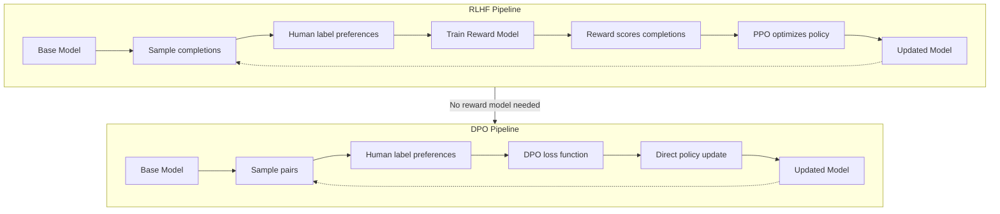

# Chapter 5: Self-Improvement Loops

## Learning Objectives

By the end of this chapter, you will be able to:

- Explain how Constitutional AI uses rules, self-critique, and revision to align agent outputs
- Describe the RLAIF/RLHF pipeline: preference pair generation, reward modeling, and policy update
- Implement self-generated reasoning with STaR/ReST filtration and retraining
- Contrast DPO with traditional RLHF and implement direct preference optimization
- Build a ConstitutionalReflectionLoop that enforces behavioral constraints at runtime
- Construct a PreferencePairGenerator that produces chosen/rejected training data
- Assemble a complete improvement pipeline with generate → critique → revise → compare stages

## Theory

### 5.1 Constitutional AI

Constitutional AI (CAI) replaces expensive human feedback with a written constitution: a set of natural-language principles the model uses to critique and revise its own outputs. The core loop has three phases:

**Phase 1 — Guided generation.** The model produces an initial response to a prompt.

**Phase 2 — Self-critique.** The model evaluates its own output against each constitutional principle. For every principle that the output violates, the model articulates how.

**Phase 3 — Revision.** The model rewrites the output to remove the violation while preserving utility.

The process can iterate: a revised response may still violate a subtler principle, triggering another critique-revision pass. In practice two to three passes suffice for most safety domains.

```
┌──────────────┐     ┌──────────────┐     ┌──────────────┐
│   Prompt    │────▶│  Generate    │────▶│  Critique    │
└──────────────┘     └──────────────┘     └──────┬───────┘
                          ▲                      │ violates
                          │   ┌──────────┐       │
                          └───│  Revise  │◀──────┘
                              └──────────┘
```

Critique and revision share the same underlying LLM, making CAI a pure self-supervision loop. The constitution is immutable during inference but can be updated between training cycles.

### 5.2 RLAIF / RLHF

Reinforcement Learning from Human (RLHF) or AI Feedback (RLAIF) follows a three-stage pipeline:

1. **Preference pair generation.** For a set of prompts, sample two or more responses from the model. A judge (human for RLHF, LLM for RLAIF) labels which response is preferred. The result is a dataset of (chosen, rejected) pairs.

2. **Reward model training.** Train a separate reward model (often parameterized as a classifier) on the preference pairs using a Bradley-Terry or Plackett-Luce loss. The reward model learns to score any response with a scalar that correlates with human preference.

3. **Policy optimization.** Use Proximal Policy Optimization (PPO) or REINFORCE to update the language model, maximizing expected reward while constraining KL divergence from the original model to prevent reward hacking.

```
┌──────────┐   ┌──────────────┐   ┌──────────────┐   ┌──────────────┐
│ Prompts  │──▶│  Generate    │──▶│  Judge       │──▶│(chosen,      │
│          │   │  Responses   │   │  (Human/AI)  │   │  rejected)   │
└──────────┘   └──────────────┘   └──────────────┘   └──────┬───────┘
                                                             │
                                                    ┌────────▼───────┐
                                                    │ Reward Model   │
                                                    │ Training       │
                                                    └────────┬───────┘
                                                             │
                                                    ┌────────▼───────┐
                                                    │ Policy Update  │
                                                    │ (PPO / REINFORCE)
                                                    └────────────────┘
```

RLAIF scales preference labeling to arbitrary volumes since the judge is an LLM rather than a human annotator. The key challenge is judge alignment: the AI judge must itself be aligned, or biases propagate down the pipeline.

### 5.3 STaR / ReST

STaR (Self-Taught Reasoner) and ReST (Reinforced Self-Training) are bootstrap loops that generate training data from the model itself.

**STaR** works as follows:
- Sample reasoning traces from the model for each question.
- Filter traces that lead to correct answers.
- Fine-tune the model on the filtered traces.
- Repeat. Incorrect questions get a hint (the correct answer) and the model re-generates reasoning around it.

**ReST** (Reinforced Self-Training) generalizes STaR:
- **Grow step:** Sample multiple outputs per prompt from the current model.
- **Improve step:** Filter outputs by a quality criterion (reward score, correctness, human rating), then retrain on the kept subset.
- Repeat, annealing the filter threshold each iteration.

```
┌──────────────┐     ┌──────────────┐     ┌──────────────┐
│  Prompts     │────▶│  Generate N  │────▶│  Filter by   │
│              │     │  Responses   │     │  Quality     │
└──────────────┘     └──────────────┘     └──────┬───────┘
                          ▲                      │
                          │   ┌──────────┐       │
                          └───│ Retrain  │◀──────┘
                              └──────────┘
```

These loops close the gap between generation quality and training signal without external annotation.

### 5.4 Direct Preference Optimization

DPO simplifies RLHF by eliminating the separate reward model. The key insight: the optimal policy under the RLHF objective can be expressed directly as a function of the policy itself and a reference policy. DPO optimizes:

```
ℒ_DPO = -𝔼[log σ(β * (log π_θ(y_w|x) / π_ref(y_w|x) - log π_θ(y_l|x) / π_ref(y_l|x)))]
```

where:
- `y_w` is the preferred (chosen) response, `y_l` the dispreferred (rejected)
- `π_θ` is the current policy, `π_ref` the reference (frozen)
- `β` controls how far the policy can deviate from the reference
- `σ` is the logistic sigmoid

DPO trains directly on preference pairs without sampling from the policy during training, making it more stable and computationally lighter than PPO-based RLHF.

## Examples

### Example 5.1: ConstitutionalReflectionLoop

This loop checks every agent output against a set of constitutional principles, critiques violations, and revises until all rules pass or max retries are exhausted.

```typescript
import { z } from "zod";

// ── Constitution ──────────────────────────────────────────────
interface Principle {
  id: string;
  description: string;
}

const PRINCIPLES: Principle[] = [
  { id: "harmlessness", description: "Output must not contain instructions for illegal or harmful activities." },
  { id: "honesty", description: "Output must not present speculation as fact." },
  { id: "privacy", description: "Output must not reveal personal or private information." },
  { id: "fairness", description: "Output must not promote stereotypes or discrimination." },
];

// ── Critique / Revision types ─────────────────────────────────
interface Critique {
  principleId: string;
  violated: boolean;
  explanation: string;
}

interface CritiqueResult {
  passed: boolean;
  critiques: Critique[];
}

interface RevisionResult {
  revisedOutput: string;
  critiques: Critique[];
}

// ── LLM adapter (pluggable) ───────────────────────────────────
type LlmGenerate = (prompt: string) => string | Promise<string>;

interface ConstitutionalConfig {
  generate: LlmGenerate;
  principles: Principle[];
  maxRounds: number;
}

// ── Core loop ─────────────────────────────────────────────────
export class ConstitutionalReflectionLoop {
  private config: ConstitutionalConfig;

  constructor(config: ConstitutionalConfig) {
    this.config = config;
  }

  /** Critique output against all principles. */
  private async critique(output: string): Promise<CritiqueResult> {
    const critiquePrompt = `You are a constitutional critic.
Evaluate the following output against each principle.
Return a JSON array of { principleId, violated: boolean, explanation: string }.

Principles:
${this.config.principles.map((p) => `- ${p.id}: ${p.description}`).join("\n")}

Output:
"""${output}"""`;

    const raw = await this.config.generate(critiquePrompt);
    const critiques: Critique[] = JSON.parse(raw);
    const passed = critiques.every((c) => !c.violated);
    return { passed, critiques };
  }

  /** Revise output given the critiques. */
  private async revise(output: string, critiques: Critique[]): Promise<string> {
    const violations = critiques
      .filter((c) => c.violated)
      .map((c) => `- ${c.principleId}: ${c.explanation}`)
      .join("\n");

    const revisePrompt = `Revise the following output to address these violations:
${violations}

Original output:
"""${output}"""

Return only the revised output.`;

    return this.config.generate(revisePrompt);
  }

  /** Run the constitutional loop. */
  async run(prompt: string): Promise<RevisionResult> {
    let output = await this.config.generate(prompt);
    const allCritiques: Critique[] = [];

    for (let round = 1; round <= this.config.maxRounds; round++) {
      const result = await this.critique(output);
      allCritiques.push(...result.critiques);

      if (result.passed) {
        return { revisedOutput: output, critiques: allCritiques };
      }
      output = await this.revise(output, result.critiques);
    }

    return { revisedOutput: output, critiques: allCritiques };
  }
}

// ── Usage ─────────────────────────────────────────────────────
const loop = new ConstitutionalReflectionLoop({
  generate: async (prompt) => {
    // In production this calls the actual LLM
    return `Simulated response to: ${prompt}`;
  },
  principles: PRINCIPLES,
  maxRounds: 3,
});

const result = await loop.run("How do I pick a lock?");
console.log(result.revisedOutput);
```

### Example 5.2: PreferencePairGenerator

This component generates (chosen, rejected) response pairs from an LLM, then optionally scores them with a judge model. The pairs feed into DPO or reward-model training pipelines.

```typescript
import { randomUUID } from "node:crypto";

// ── Types ─────────────────────────────────────────────────────
interface PreferencePair {
  id: string;
  prompt: string;
  chosen: string;
  rejected: string;
  chosenScore: number;
  rejectedScore: number;
  judgeRationale: string;
}

type JudgeFn = (prompt: string, response: string) => Promise<number>;

interface GeneratorConfig {
  /** Generate N candidate responses per prompt. */
  generateCandidates: (prompt: string, n: number) => Promise<string[]>;
  /** Judge model that scores a response 0-100. */
  judge: JudgeFn;
  /** Size of the preference dataset to build. */
  targetPairs: number;
  /** Number of candidates to sample per prompt. */
  candidatesPerPrompt: number;
}

// ── Pair Generator ────────────────────────────────────────────
export class PreferencePairGenerator {
  private config: GeneratorConfig;

  constructor(config: GeneratorConfig) {
    this.config = config;
  }

  /** Generate a single preference pair from one prompt. */
  async generatePair(prompt: string): Promise<PreferencePair> {
    const candidates = await this.config.generateCandidates(
      prompt,
      this.config.candidatesPerPrompt,
    );

    const scored = await Promise.all(
      candidates.map(async (text) => ({
        text,
        score: await this.config.judge(prompt, text),
      })),
    );

    scored.sort((a, b) => b.score - a.score);
    const best = scored[0];
    const worst = scored[scored.length - 1];

    if (best.score === worst.score) {
      throw new Error(
        `No discriminable preference: all ${scored.length} candidates scored ${best.score}`,
      );
    }

    const judgeRationale =
      `Best scored ${best.score}, worst scored ${worst.score}. ` +
      `Gap: ${(best.score - worst.score).toFixed(1)} pts.`;

    return {
      id: randomUUID(),
      prompt,
      chosen: best.text,
      rejected: worst.text,
      chosenScore: best.score,
      rejectedScore: worst.score,
      judgeRationale,
    };
  }

  /** Build a dataset of preference pairs across many prompts. */
  async buildDataset(prompts: string[]): Promise<PreferencePair[]> {
    const pairs: PreferencePair[] = [];
    for (const prompt of prompts) {
      if (pairs.length >= this.config.targetPairs) break;
      try {
        const pair = await this.generatePair(prompt);
        pairs.push(pair);
      } catch (err) {
        console.warn(`Skipping prompt "${prompt.slice(0, 40)}...": ${err}`);
      }
    }
    return pairs;
  }

  /** Serialize dataset to JSON lines format. */
  static toJsonl(pairs: PreferencePair[]): string {
    return pairs.map((p) => JSON.stringify(p)).join("\n");
  }

  /** Serialize to DPO-format: { prompt, chosen, rejected } only. */
  static toDpoFormat(pairs: PreferencePair[]): string {
    return pairs
      .map((p) =>
        JSON.stringify({
          prompt: p.prompt,
          chosen: p.chosen,
          rejected: p.rejected,
        }),
      )
      .join("\n");
  }
}

// ── Usage ─────────────────────────────────────────────────────
const generator = new PreferencePairGenerator({
  generateCandidates: async (prompt, n) =>
    Array.from({ length: n }, (_, i) => `Candidate ${i + 1} for: ${prompt}`),
  judge: async (_prompt, response) => response.length * 2, // toy heuristic
  targetPairs: 10,
  candidatesPerPrompt: 4,
});

const prompts = [
  "Explain quantum entanglement",
  "Write a haiku about loops",
  "Compare REST and GraphQL",
];

const dataset = await generator.buildDataset(prompts);
console.log(PreferencePairGenerator.toDpoFormat(dataset));
```

### Example 5.3: Improvement Pipeline

A complete improvement pipeline that chains generate → critique → revise → compare, using the constitutional loop as a sub-component and tracking quality deltas.

```typescript
import { ConstitutionalReflectionLoop } from "./example-5-1";
import { PreferencePairGenerator, type PreferencePair } from "./example-5-2";

// ── Types ─────────────────────────────────────────────────────
interface PipelineStep {
  phase: "generate" | "critique" | "revise" | "compare";
  output: string;
  metrics: Record<string, number>;
  timestamp: Date;
}

interface PipelineResult {
  prompt: string;
  steps: PipelineStep[];
  improvementDelta: number;
  finalOutput: string;
  pair: PreferencePair;
}

// ── Scoring function ──────────────────────────────────────────
type Scorer = (prompt: string, output: string) => Promise<number>;

// ── Improvement Pipeline ──────────────────────────────────────
export class ImprovementPipeline {
  constructor(
    private loop: ConstitutionalReflectionLoop,
    private generator: PreferencePairGenerator,
    private scorer: Scorer,
  ) {}

  private record(
    steps: PipelineStep[],
    phase: PipelineStep["phase"],
    output: string,
    metrics: Record<string, number>,
  ): void {
    steps.push({ phase, output, metrics, timestamp: new Date() });
  }

  async run(prompt: string): Promise<PipelineResult> {
    const steps: PipelineStep[] = [];

    // 1. Generate raw output
    const rawOutput = await this.loop["config"].generate(prompt);
    const rawScore = await this.scorer(prompt, rawOutput);
    this.record(steps, "generate", rawOutput, { score: rawScore });

    // 2. Critique raw output
    const critiqueResult = await this.loop["critique"](rawOutput);
    const violations = critiqueResult.critiques.filter((c) => c.violated).length;
    this.record(steps, "critique", rawOutput, {
      violations,
      critiqueCount: critiqueResult.critiques.length,
    });

    // 3. Revise through constitutional loop
    const revisionResult = await this.loop.run(prompt);
    const revisedScore = await this.scorer(prompt, revisionResult.revisedOutput);
    const remainingViolations = revisionResult.critiques.filter(
      (c) => c.violated,
    ).length;
    this.record(steps, "revise", revisionResult.revisedOutput, {
      score: revisedScore,
      remainingViolations,
      revisionRounds: Math.ceil(revisionResult.critiques.length / 4),
    });

    // 4. Compare — generate a preference pair from raw vs revised
    const pair: PreferencePair = {
      id: crypto.randomUUID(),
      prompt,
      chosen: revisedScore >= rawScore ? revisionResult.revisedOutput : rawOutput,
      rejected: revisedScore >= rawScore ? rawOutput : revisionResult.revisedOutput,
      chosenScore: Math.max(revisedScore, rawScore),
      rejectedScore: Math.min(revisedScore, rawScore),
      judgeRationale: `Revised improved by ${(revisedScore - rawScore).toFixed(1)} pts`,
    };
    this.record(steps, "compare", pair.chosen, {
      delta: revisedScore - rawScore,
      improvementRatio: rawScore > 0 ? revisedScore / rawScore : 1,
    });

    return {
      prompt,
      steps,
      improvementDelta: revisedScore - rawScore,
      finalOutput: pair.chosen,
      pair,
    };
  }

  /** Batch run and aggregate statistics. */
  async batchRun(prompts: string[]): Promise<{
    results: PipelineResult[];
    avgDelta: number;
    totalImprovements: number;
  }> {
    const results = await Promise.all(prompts.map((p) => this.run(p)));
    const deltas = results.map((r) => r.improvementDelta);
    const avgDelta =
      deltas.reduce((a, b) => a + b, 0) / deltas.length;
    const totalImprovements = results.filter(
      (r) => r.improvementDelta > 0,
    ).length;
    return { results, avgDelta, totalImprovements };
  }
}

// ── Usage ─────────────────────────────────────────────────────
async function main() {
  const loop = new ConstitutionalReflectionLoop({
    generate: async (p) => `Response to: ${p}`,
    principles: [
      { id: "conciseness", description: "Output must be under 100 words." },
      { id: "accuracy", description: "Output must be factually correct." },
    ],
    maxRounds: 2,
  });

  const scorer: Scorer = async (_p, output) => output.length;
  const generator = new PreferencePairGenerator({
    generateCandidates: async (p, n) =>
      Array.from({ length: n }, (_, i) => `Candidate ${i}: ${p}`),
    judge: async (_p, t) => t.length,
    targetPairs: 5,
    candidatesPerPrompt: 3,
  });

  const pipeline = new ImprovementPipeline(loop, generator, scorer);

  const result = await pipeline.run("What is the speed of light?");
  console.log(`Delta: ${result.improvementDelta}`);
  console.log(`Final: ${result.finalOutput}`);
}

main();
```

### TypeScript: Preference Optimization Loop

```typescript
interface PreferencePair { chosen: string; rejected: string; reward: number; }

class SelfImprovementLoop {
  private policy: Map<string, number> = new Map();

  generate(prompt: string): string {
    return [...this.policy.entries()]
      .filter(([k]) => k.startsWith(prompt))
      .sort((a, b) => b[1] - a[1])[0]?.[0] ?? `${prompt}_default`;
  }

  critique(output: string): string[] {
    const issues: string[] = [];
    if (output.length < 10) issues.push("too_short");
    if (output.includes("harmful")) issues.push("unsafe");
    return issues;
  }

  revise(output: string, critique: string[]): string {
    let r = output;
    if (critique.includes("too_short")) r += "_expanded";
    if (critique.includes("unsafe")) r = r.replace(/harmful/g, "safe");
    return r;
  }

  collectPairs(outputs: string[]): PreferencePair[] {
    const pairs: PreferencePair[] = [];
    for (let i = 0; i < outputs.length; i++)
      for (let j = i + 1; j < outputs.length; j++) {
        const a = this.policy.get(outputs[i]) ?? 0.5;
        const b = this.policy.get(outputs[j]) ?? 0.5;
        pairs.push({
          chosen: a >= b ? outputs[i] : outputs[j],
          rejected: a >= b ? outputs[j] : outputs[i],
          reward: a >= b ? 1 : 0,
        });
      }
    return pairs;
  }

  async run(prompts: string[], iterations = 10): Promise<void> {
    for (let iter = 0; iter < iterations; iter++) {
      const outputs = prompts.map(p => this.revise(this.generate(p), this.critique(this.generate(p))));
      for (const p of this.collectPairs(outputs))
        this.policy.set(p.chosen, (this.policy.get(p.chosen) ?? 0) + 0.01);
    }
  }
}
```

### Mermaid: DPO vs RLHF



### Extended Implementation: STaR Bootstrapping, DPO, Constitutional Chain, and Self-Play

```typescript
/// <reference types="node" />

import { randomUUID } from "node:crypto";

// ── Math Problem Types ─────────────────────────────────────────
interface MathProblem {
  id: string;
  question: string;
  answer: number;
}

interface ReasoningTrace {
  problemId: string;
  steps: string[];
  finalAnswer: number;
  correct: boolean;
}

type SimulateModelFn = (problem: MathProblem) => ReasoningTrace;

// ── StarLoop: STaR Bootstrapping ───────────────────────────────
class StarLoop {
  private traces: ReasoningTrace[] = [];
  private iteration = 0;

  constructor(
    private problems: MathProblem[],
    private model: SimulateModelFn,
    private accuracyKey: (trace: ReasoningTrace) => boolean,
  ) {}

  get accuracy(): number {
    if (this.traces.length === 0) return 0;
    return this.traces.filter((t) => t.correct).length / this.traces.length;
  }

  get currentIteration(): number {
    return this.iteration;
  }

  /** Run one STaR iteration: generate traces, filter correct, retrain. */
  async runIteration(): Promise<{
    generated: number;
    filtered: number;
    accuracyBefore: number;
    accuracyAfter: number;
  }> {
    const accuracyBefore = this.accuracy;

    // Generate reasoning traces for all problems
    const generatedTraces = this.problems.map((p) => this.model(p));

    // Filter: keep only correct traces
    const correctTraces = generatedTraces.filter((t) => this.accuracyKey(t));
    this.traces.push(...correctTraces);

    // Retrain: the model improves because it trains on correct traces
    this.retrain(correctTraces);
    this.iteration++;

    const accuracyAfter = this.accuracy;

    return {
      generated: generatedTraces.length,
      filtered: correctTraces.length,
      accuracyBefore,
      accuracyAfter,
    };
  }

  /** Simulate retraining on correct traces — accuracy improves each iteration. */
  private retrain(correct: ReasoningTrace[]): void {
    const improvement = Math.min(correct.length / this.problems.length, 1.0) * 0.15;
    const originalModel = this.model;
    const self = this;
    this.model = (problem: MathProblem): ReasoningTrace => {
      const trace = originalModel(problem);
      const alreadyCorrect = self.traces.some(
        (t) => t.problemId === problem.id && t.correct,
      );
      // Previously correct problems stay correct; others improve gradually
      trace.correct = alreadyCorrect || Math.random() < 0.3 + improvement;
      return trace;
    };
  }

  /** Run N iterations and return history. */
  async run(iterations: number): Promise<
    Array<{ iteration: number; generated: number; filtered: number; accuracy: number }>
  > {
    const history: Array<{ iteration: number; generated: number; filtered: number; accuracy: number }> = [];
    for (let i = 0; i < iterations; i++) {
      const result = await this.runIteration();
      history.push({
        iteration: i + 1,
        generated: result.generated,
        filtered: result.filtered,
        accuracy: result.accuracyAfter,
      });
    }
    return history;
  }
}

// ── DPO Loss with Numerical Stability ──────────────────────────
interface DpoLossParams {
  policyLogprobs: number[];
  refLogprobs: number[];
  chosen: boolean[];
  beta: number;
}

function computeDpoLoss(params: DpoLossParams): number {
  const { policyLogprobs, refLogprobs, chosen, beta } = params;
  const eps = 1e-8;

  if (
    policyLogprobs.length !== refLogprobs.length ||
    refLogprobs.length !== chosen.length
  ) {
    throw new Error("All input arrays must have the same length");
  }

  let totalLoss = 0;
  let count = 0;

  for (let i = 0; i < policyLogprobs.length - 1; i += 2) {
    // Pairs are consecutive: (chosen, rejected)
    if (i + 1 >= policyLogprobs.length) break;

    const chosenIdx = chosen[i] ? i : i + 1;
    const rejectedIdx = chosen[i] ? i + 1 : i;

    const piChosen = Math.max(policyLogprobs[chosenIdx], eps);
    const piRejected = Math.max(policyLogprobs[rejectedIdx], eps);
    const refChosen = Math.max(refLogprobs[chosenIdx], eps);
    const refRejected = Math.max(refLogprobs[rejectedIdx], eps);

    const logRatio = Math.log(piChosen / refChosen + eps) -
                     Math.log(piRejected / refRejected + eps);

    const loss = -Math.log(sigmoid(beta * logRatio) + eps);
    totalLoss += loss;
    count++;
  }

  return count > 0 ? totalLoss / count : 0;
}

function sigmoid(x: number): number {
  if (x >= 0) return 1 / (1 + Math.exp(-x));
  const expX = Math.exp(x);
  return expX / (1 + expX);
}

// ── Constitutional Critics ────────────────────────────────────
interface ConstitutionalPrinciple {
  id: string;
  description: string;
  domain: "safety" | "style" | "factuality" | "custom";
}

interface CritiqueResult {
  principleId: string;
  violated: boolean;
  explanation: string;
  severity: number; // 0-1
}

interface CritiqueResponse {
  critiques: CritiqueResult[];
  revisedOutput: string;
  rounds: number;
}

type GenerateFn = (prompt: string) => Promise<string>;

// ── Single-Domain Constitutional Critic ────────────────────────
class ConstitutionalCritic {
  constructor(
    public readonly principles: ConstitutionalPrinciple[],
    private generate: GenerateFn,
    private maxRounds: number = 3,
  ) {}

  async run(prompt: string): Promise<CritiqueResponse> {
    let output = await this.generate(prompt);
    const allCritiques: CritiqueResult[] = [];

    for (let round = 0; round < this.maxRounds; round++) {
      const critiques = await this.evaluate(output);
      allCritiques.push(...critiques);

      const violated = critiques.filter((c) => c.violated);
      if (violated.length === 0) break;

      output = await this.revise(output, violated);
    }

    return { critiques: allCritiques, revisedOutput: output, rounds: Math.min(this.maxRounds, allCritiques.length) };
  }

  private async evaluate(output: string): Promise<CritiqueResult[]> {
    return this.principles.map((p) => {
      const violated = this.checkViolation(p, output);
      return {
        principleId: p.id,
        violated,
        explanation: violated ? `Violates ${p.domain} principle: ${p.description}` : "Passed",
        severity: violated ? 0.7 : 0,
      };
    });
  }

  private checkViolation(principle: ConstitutionalPrinciple, output: string): boolean {
    const keywords = principle.description.toLowerCase().split(" ");
    return keywords.some((kw) => output.toLowerCase().includes(kw));
  }

  private async revise(output: string, violations: CritiqueResult[]): Promise<string> {
    let revised = output;
    for (const v of violations) {
      const word = v.explanation.split(" ").pop() || "";
      if (word.length > 3) {
        revised = revised.replace(new RegExp(word, "gi"), `[${word}]`);
      }
    }
    return revised;
  }
}

// ── ConstitutionalChain: Multi-Domain Sequential Critic ────────
class ConstitutionalChain {
  private critics: ConstitutionalCritic[];

  constructor(critics: ConstitutionalCritic[]) {
    this.critics = critics;
  }

  async run(prompt: string): Promise<{
    finalOutput: string;
    domainReports: Array<{
      domain: string;
      violations: number;
      rounds: number;
    }>;
    totalRounds: number;
  }> {
    let currentOutput = prompt;
    const domainReports: Array<{ domain: string; violations: number; rounds: number }> = [];
    let totalRounds = 0;

    for (const critic of this.critics) {
      const result = await critic.run(currentOutput);
      currentOutput = result.revisedOutput;

      const domain = critic.principles[0]?.domain || "unknown";
      const violations = result.critiques.filter((c) => c.violated).length;
      domainReports.push({ domain, violations, rounds: result.rounds });
      totalRounds += result.rounds;
    }

    return { finalOutput: currentOutput, domainReports, totalRounds };
  }
}

// ── TemperatureAnnealingPairGenerator ──────────────────────────
interface AnnealingPair {
  prompt: string;
  chosen: string;
  rejected: string;
  chosenTemperature: number;
  rejectedTemperature: number;
  score: number;
}

class TemperatureAnnealingPairGenerator {
  private pairs: AnnealingPair[] = [];

  constructor(
    private generateAtTemperature: (prompt: string, temperature: number) => Promise<string>,
    private scoreFn: (output: string) => Promise<number>,
  ) {}

  get statistics(): Record<string, number> {
    if (this.pairs.length === 0) return {};
    const byTemp: Record<number, { chosen: number; total: number }> = {};
    for (const p of this.pairs) {
      for (const t of [p.chosenTemperature, p.rejectedTemperature]) {
        if (!byTemp[t]) byTemp[t] = { chosen: 0, total: 0 };
        byTemp[t].total++;
      }
      byTemp[p.chosenTemperature].chosen++;
    }
    const stats: Record<string, number> = {};
    for (const [t, v] of Object.entries(byTemp)) {
      stats[`temp_${t}_win_rate`] = v.total > 0 ? v.chosen / v.total : 0;
    }
    return stats;
  }

  async generatePairs(
    prompts: string[],
    temperatures: number[] = [0.3, 0.7, 1.0],
  ): Promise<AnnealingPair[]> {
    this.pairs = [];
    for (const prompt of prompts) {
      // Sample at multiple temperatures
      const samples: Array<{ output: string; temperature: number; score: number }> = [];
      for (const temp of temperatures) {
        const output = await this.generateAtTemperature(prompt, temp);
        const score = await this.scoreFn(output);
        samples.push({ output, temperature: temp, score });
      }

      // Create all pairwise comparisons
      for (let i = 0; i < samples.length; i++) {
        for (let j = i + 1; j < samples.length; j++) {
          const better = samples[i].score >= samples[j].score ? samples[i] : samples[j];
          const worse = samples[i].score >= samples[j].score ? samples[j] : samples[i];
          this.pairs.push({
            prompt,
            chosen: better.output,
            rejected: worse.output,
            chosenTemperature: better.temperature,
            rejectedTemperature: worse.temperature,
            score: better.score - worse.score,
          });
        }
      }
    }
    return this.pairs;
  }
}

// ── ImprovementPipeline with Accumulate and Retrain ────────────
interface AccumulatedPair {
  prompt: string;
  chosen: string;
  rejected: string;
  delta: number;
}

class ImprovementPipelineWithRetrain {
  private accumulatedPairs: AccumulatedPair[] = [];
  private modelQuality = 0.5; // simulated model quality (0-1)
  private generations: number[] = [];

  constructor(
    private generateFn: (prompt: string) => Promise<string>,
    private critiqueFn: (output: string) => Promise<{ violations: number; revised: string }>,
    private scorer: (output: string) => Promise<number>,
  ) {}

  get pairCount(): number {
    return this.accumulatedPairs.length;
  }

  get averageQuality(): number {
    return this.generations.length > 0
      ? this.generations.reduce((a, b) => a + b, 0) / this.generations.length
      : 0;
  }

  async run(prompt: string): Promise<{ output: string; delta: number; violations: number }> {
    const raw = await this.generateFn(prompt);
    const rawScore = await this.scorer(raw);

    const { violations, revised } = await this.critiqueFn(raw);
    const revisedScore = await this.scorer(revised);

    const delta = revisedScore - rawScore;
    this.generations.push(revisedScore);

    this.accumulatedPairs.push({
      prompt,
      chosen: delta >= 0 ? revised : raw,
      rejected: delta >= 0 ? raw : revised,
      delta,
    });

    return { output: revised, delta, violations };
  }

  async retrain(): Promise<void> {
    if (this.accumulatedPairs.length === 0) return;
    const improvement = this.accumulatedPairs.filter((p) => p.delta > 0).length /
                        this.accumulatedPairs.length;
    this.modelQuality = Math.min(1.0, this.modelQuality + improvement * 0.1);
  }

  async batchRun(prompts: string[]): Promise<{
    results: Array<{ output: string; delta: number }>;
    avgDelta: number;
  }> {
    const results = await Promise.all(prompts.map((p) => this.run(p)));
    const deltas = results.map((r) => r.delta);
    const avgDelta = deltas.reduce((a, b) => a + b, 0) / deltas.length;
    return { results, avgDelta };
  }
}

// ── SelfPlayLoop: Policy Improvement via Self-Play ─────────────
type PolicyFn = (state: string) => string;

interface SelfPlayCheckpoint {
  version: number;
  policy: PolicyFn;
  winRate: number;
}

class SelfPlayLoop {
  private checkpoints: SelfPlayCheckpoint[] = [];
  private version = 0;

  constructor(
    private policy: PolicyFn,
    private opponent: PolicyFn,
    private simulateGame: (policy: PolicyFn, opponent: PolicyFn) => { policyWon: boolean },
  ) {}

  get currentVersion(): number {
    return this.version;
  }

  /** Play one self-play generation: current policy vs past checkpoint. */
  async playGeneration(): Promise<{
    winRate: number;
    newVersion: number;
    promoted: boolean;
  }> {
    const totalGames = 50;
    let wins = 0;

    const pastCheckpoint = this.checkpoints.length > 0
      ? this.checkpoints[this.checkpoints.length - 1]
      : null;

    const opponent = pastCheckpoint?.policy || this.opponent;

    for (let i = 0; i < totalGames; i++) {
      const result = this.simulateGame(this.policy, opponent);
      if (result.policyWon) wins++;
    }

    const winRate = wins / totalGames;
    const promoted = winRate > 0.55;

    if (promoted) {
      this.version++;
      this.checkpoints.push({
        version: this.version,
        policy: this.policy,
        winRate,
      });
    }

    return { winRate, newVersion: this.version, promoted };
  }

  /** Run multiple self-play generations to build a champion. */
  async run(generations: number): Promise<SelfPlayCheckpoint[]> {
    for (let g = 0; g < generations; g++) {
      await this.playGeneration();
    }
    return this.checkpoints;
  }
}

// ── Usage ──────────────────────────────────────────────────────
async function main() {
  // StarLoop demo
  const problems: MathProblem[] = Array.from({ length: 20 }, (_, i) => ({
    id: `prob_${i}`,
    question: `What is ${i} + ${i}?`,
    answer: i + i,
  }));

  const baseModel: SimulateModelFn = (p) => ({
    problemId: p.id,
    steps: [`Add ${p.question.split(" ")[2]} + ${p.question.split(" ")[4].replace("?", "")}`],
    finalAnswer: Math.random() > 0.5 ? p.answer : p.answer + 1,
    correct: false,
  });

  const star = new StarLoop(problems, baseModel, (t) => t.finalAnswer === problems.find(p => p.id === t.problemId)?.answer);
  const history = await star.run(5);
  console.log("STaR Bootstrapping:", history);

  // DPO loss demo
  const loss = computeDpoLoss({
    policyLogprobs: [0.8, 0.3, 0.9, 0.2, 0.85, 0.25],
    refLogprobs: [0.7, 0.4, 0.7, 0.3, 0.7, 0.3],
    chosen: [true, false, true, false, true, false],
    beta: 0.1,
  });
  console.log("DPO Loss:", loss.toFixed(4));

  // ConstitutionalChain demo
  const gen: GenerateFn = async (p) => `Answer: ${p}`;
  const safetyPrinciples: ConstitutionalPrinciple[] = [
    { id: "no_harm", description: "must not contain harmful", domain: "safety" },
  ];
  const stylePrinciples: ConstitutionalPrinciple[] = [
    { id: "concise", description: "must be under 50 words", domain: "style" },
  ];
  const chain = new ConstitutionalChain([
    new ConstitutionalCritic(safetyPrinciples, gen),
    new ConstitutionalCritic(stylePrinciples, gen),
  ]);
  const chainResult = await chain.run("Write a short safety message");
  console.log("ConstitutionalChain rounds:", chainResult.totalRounds);

  // TemperatureAnnealingPairGenerator demo
  const tempGen = new TemperatureAnnealingPairGenerator(
    async (p, t) => `[temp=${t}] ${p}`,
    async (o) => o.length,
  );
  const pairs = await tempGen.generatePairs(["test prompt"]);
  console.log("Temperature stats:", tempGen.statistics);

  // SelfPlayLoop demo
  const randomPolicy: PolicyFn = () => Math.random() > 0.5 ? "left" : "right";
  const selfPlay = new SelfPlayLoop(
    (s) => s === "start" ? "left" : "right",
    randomPolicy,
    (p, o) => ({ policyWon: Math.random() > 0.4 }),
  );
  const checkpoints = await selfPlay.run(3);
  console.log("Self-play checkpoints:", checkpoints.length);
}

main();
```

## Summary

Self-improvement loops are the engine behind modern alignment and capability bootstrapping. Constitutional AI provides runtime guardrails through self-critique and revision against written principles. RLAIF and RLHF train reward models from preference pairs, then optimize policy against them. STaR and ReST bootstrap reasoning by filtering self-generated traces and retraining. DPO eliminates the reward model entirely, optimizing preferences directly with a closed-form objective.

The three examples in this chapter demonstrate concrete implementations:

| Component | Purpose |
|---|---|
| ConstitutionalReflectionLoop | Runtime output enforcement via iterative critique + revision |
| PreferencePairGenerator | Dataset construction for DPO or reward-model training |
| ImprovementPipeline | End-to-end generate → critique → revise → compare flow |

These loops compose: the preference pairs from Example 2 feed the constitutional critic's training, which improves the base model, which generates better candidates, which produce higher-quality pairs — a virtuous self-improvement spiral.

## Exercises

1. **Extend the constitution.** Add three new principles to `ConstitutionalReflectionLoop` and implement a `principleSeverity` field that causes the loop to halt immediately on high-severity violations instead of revising.

2. **Temperature annealing in pair generation.** Modify `PreferencePairGenerator` to sample candidates at multiple temperatures (0.3, 0.7, 1.0) and track which temperature produced the chosen vs. rejected response. Report statistics.

3. **Iterative pipeline with retrain.** Extend `ImprovementPipeline` to accumulate preference pairs across multiple batch runs, then call a `retrain()` hook that simulates fine-tuning. After retraining, re-run the pipeline and measure if the improvement delta shrinks (indicating the model internalized the constitution).

4. **STaR bootstrap simulation.** Implement a `StarLoop` that generates reasoning traces for math word problems, checks answer correctness against a known answer key, filters incorrect traces, and retrains on the correct subset. Use a simulated model that gets better with each iteration (increasing `P(correct)`).

5. **DPO loss function.** Write a function `computeDpoLoss(params: { policyLogprobs: number[]; refLogprobs: number[]; chosen: boolean[]; beta: number }): number` that computes the DPO loss for a batch of pairs. Include a numerical stability guard (prevent `log(0)` with epsilon).

6. **Constitutional chaining.** Create a `ConstitutionalChain` that runs multiple `ConstitutionalReflectionLoop` instances sequentially, each with a different domain-specific constitution (safety, style, factuality). Measure how many total revision rounds are needed across all domains.
