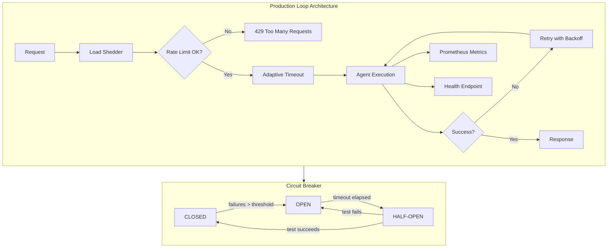

# Chapter 6: Production Loops

## Learning Objectives

By the end of this chapter, you will be able to:

- Design and implement a deploy → monitor → drift-detect → retrain → redeploy pipeline
- Deploy shadow and canary deployments that compare production vs. candidate models
- Build a cost governor loop that tracks token usage, per-iteration accounting, and auto-halting
- Construct observability loops with structured traces, derived metrics, and alert thresholds
- Define SLIs and SLOs for agent quality and map them to runbook actions
- Implement a ProductionLoopManager with timestamped lifecycle steps
- Implement an AgentCostGovernor with budget-aware execution and max-retry halting
- Implement a ShadowDeployer that scores production and candidate responses in parallel

## Theory

### 6.1 Production Deployment Pipeline


The standard production loop for AI agents follows a continuous lifecycle:

```
┌──────────┐   ┌──────────┐   ┌──────────┐   ┌──────────┐   ┌──────────┐
│  Deploy  │──▶│ Monitor  │──▶│  Detect  │──▶│ Retrain  │──▶│ Redeploy │
│          │   │          │   │  Drift   │   │          │   │          │
└──────────┘   └──────────┘   └──────────┘   └──────────┘   └──────────┘
                                                                    │
                                                                    └──────▶ loop
```

Each phase has specific responsibilities:

**Deploy.** Push a new model version or agent configuration to a serving infrastructure. Tag the deployment with a version, timestamp, and rollback metadata. The deployment must be idempotent: deploying the same version twice yields identical behaviour.

**Monitor.** Collect structured logs from every agent invocation: input, output, latency, token count, error code. Aggregate these into time-series metrics (5th, 50th, 95th percentiles) and expose them through a metrics endpoint.

**Detect drift.** Compare current metrics against a baseline window. Common drift signals: rising latency, falling task-completion rate, increasing retry counts, shift in output-token distribution, spike in refusal or guardrail-hit rates. Use statistical tests (Kolmogorov–Smirnov, Z-score) to trigger alerts.

**Retrain.** When drift exceeds a threshold, enqueue a retraining job. The retraining dataset includes recent production data (with PII scrubbed) plus any newly collected preference pairs or human corrections. The new model version is validated on a held-out test set before entering the deploy phase.

**Redeploy.** Swap the production model with the validated candidate. Strategies: blue-green (instant swap with pre-warmed infrastructure) or canary (gradual traffic shift with automatic rollback).

### 6.2 Shadow and Canary Deployment


**Shadow deployment.** Route production traffic to both the current model and a candidate model simultaneously, but only serve the current model's response to the user. The candidate's response is recorded and scored offline. Shadow deployment has zero user-facing risk because the candidate never affects the user.

```
                    ┌────────────────┐
 User ──request───▶│  Traffic Split │
                    └────┬────┬──────┘
                         │    │
                         │    └──▶ Candidate Model (scored, discarded)
                         │
                         └──▶ Production Model (served to user)
```

**Canary deployment.** Route a small percentage of real traffic (e.g. 5%) to the candidate model and serve its response to those users. Monitor error rates and quality metrics. If metrics stay within SLO for a window (e.g. 30 minutes), gradually increase the canary percentage to 25%, 50%, 100%. Roll back immediately if any metric breaches the threshold.

```
Traffic: [████████████████░░░░] 80% production / 20% canary
         ─── monitor for N minutes ───
         [████████████░░░░░░░░] 60% production / 40% canary
         ─── monitor ───
         [░░░░░░░░░░░░░░░░░░░░] 100% canary (promoted)
```

### 6.3 Cost Governor Loops


Agent loops can execute hundreds of LLM calls per task. Without a cost governor, a runaway agent can burn through budget in minutes. The cost governor implements three controls:

**Budget tracking.** Each request context carries a budget (e.g. $0.50 per task, 10,000 tokens per request). Every LLM call deducts from the budget. The governor maintains running totals at the request, session, and account level.

**Per-iteration accounting.** Each loop iteration records the cost incurred: model used, input tokens, output tokens, compute time. These records feed into real-time cost dashboards and post-hoc billing.

**Auto-halt.** When the budget is exhausted, the governor stops the agent mid-flight, persists its state, and raises an alert. Optionally it can switch to a cheaper fallback model (e.g. GPT-4o-mini) for the remaining steps.

```
┌──────────────┐     ┌──────────────┐     ┌──────────────┐
│  Loop Step   │────▶│  Record Cost │────▶│  Budget OK?  │──yes──▶ continue
└──────────────┘     └──────────────┘     └──────┬───────┘
                                                  │ no
                                                  ▼
                                          ┌──────────────┐
                                          │  Halt /      │
                                          │  Fallback    │
                                          └──────────────┘
```

### 6.4 Observability Loops


Observability for AI systems goes beyond traditional application monitoring. The three pillars apply, but with agent-specific extensions:

**Traces.** A trace represents one end-user request through the entire agent loop. Each span within the trace captures a single LLM call, tool invocation, or decision step. Spans carry metadata: model name, token counts, latency, retry count, the exact prompt and response.

**Metrics.** Derived from traces at aggregation time. Key metrics:
- `agent.latency.p50`, `agent.latency.p95` — response time distribution
- `agent.tokens.prompt.avg`, `agent.tokens.completion.avg` — token consumption
- `agent.steps.per_request` — loop iteration count
- `agent.error_rate` — fraction of requests with errors
- `agent.drift.score` — distribution shift relative to baseline

**Alerts.** Threshold-based and trend-based. Examples:
- P95 latency > 5s for 5 consecutive minutes → page
- Error rate > 2% in 1-minute window → warn
- Drift score > 0.15 relative to 24h baseline → investigate

### 6.5 SRE for AI Systems


Service-Level Objectives for agent loops require careful definition because quality is multi-dimensional:

| SLI | Definition | Target SLO |
|---|---|---|
| Task completion rate | Fraction of requests where the agent completes its stated goal | ≥ 99.0% |
| Valid response rate | Fraction of responses that parse, pass validation, and contain no hallucinated facts | ≥ 99.5% |
| Latency P95 | 95th percentile of end-to-end response time | ≤ 8 seconds |
| Cost per request | Average LLM API cost per request | ≤ $0.03 |
| Safety violation rate | Fraction of responses flagged by the constitutional critic | ≤ 0.1% |

An error budget of 100% − SLO defines how much unreliability is acceptable per month. When the budget is depleted, all non-critical deployments freeze until reliability recovers.

## Examples

### Example 6.1: ProductionLoopManager

A lifecycle manager that orchestrates deploy → monitor → drift-detect → retrain → redeploy with full timestamped logging.

```typescript
import { randomUUID } from "node:crypto";

// ── Types ─────────────────────────────────────────────────────
interface Deployment {
  id: string;
  modelVersion: string;
  deployedAt: Date;
  status: "active" | "draining" | "rolled-back";
}

interface MetricSnapshot {
  timestamp: Date;
  latencyP50: number;
  latencyP95: number;
  errorRate: number;
  avgTokensPerRequest: number;
  taskCompletionRate: number;
}

interface DriftReport {
  detected: boolean;
  score: number;
  threshold: number;
  signals: string[];
  generatedAt: Date;
}

type LifecycleStep =
  | "deploy"
  | "monitor"
  | "drift-detect"
  | "retrain"
  | "rollback";

interface LifecycleEvent {
  step: LifecycleStep;
  deploymentId: string;
  timestamp: Date;
  detail: string;
}

// ── Configuration ─────────────────────────────────────────────
interface ProductionLoopConfig {
  modelVersion: string;
  driftThreshold: number;
  monitorWindowMinutes: number;
  retrainHook: () => Promise<string>; // returns new model version
}

// ── Loop Manager ──────────────────────────────────────────────
export class ProductionLoopManager {
  private config: ProductionLoopConfig;
  private events: LifecycleEvent[] = [];
  private deployment: Deployment;
  private metricsBuffer: MetricSnapshot[] = [];
  private baseline: MetricSnapshot | null = null;

  constructor(config: ProductionLoopConfig) {
    this.config = config;
    this.deployment = {
      id: randomUUID(),
      modelVersion: config.modelVersion,
      deployedAt: new Date(),
      status: "active",
    };
  }

  // ── Logging ─────────────────────────────────────────────────
  private log(
    step: LifecycleStep,
    detail: string,
  ): void {
    this.events.push({
      step,
      deploymentId: this.deployment.id,
      timestamp: new Date(),
      detail,
    });
  }

  get history(): readonly LifecycleEvent[] {
    return this.events;
  }

  // ── Deploy ──────────────────────────────────────────────────
  async deploy(version?: string): Promise<void> {
    if (version) {
      this.deployment = {
        id: randomUUID(),
        modelVersion: version,
        deployedAt: new Date(),
        status: "active",
      };
    }
    this.log("deploy", `Deployed ${this.deployment.modelVersion}`);
  }

  // ── Monitor ─────────────────────────────────────────────────
  ingestMetric(snapshot: MetricSnapshot): void {
    this.metricsBuffer.push(snapshot);

    // Keep only the configured window
    const cutoff = Date.now() - this.config.monitorWindowMinutes * 60_000;
    this.metricsBuffer = this.metricsBuffer.filter(
      (m) => m.timestamp.getTime() > cutoff,
    );

    this.log("monitor", `Ingested snapshot at ${snapshot.timestamp.toISOString()}`);
  }

  private currentMetrics(): MetricSnapshot | null {
    if (this.metricsBuffer.length === 0) return null;
    const recent = this.metricsBuffer[this.metricsBuffer.length - 1];
    return recent;
  }

  // ── Drift Detect ────────────────────────────────────────────
  async detectDrift(): Promise<DriftReport> {
    const current = this.currentMetrics();
    if (!current) {
      return { detected: false, score: 0, threshold: this.config.driftThreshold, signals: [], generatedAt: new Date() };
    }

    // First call establishes baseline
    if (!this.baseline) {
      this.baseline = current;
      this.log("drift-detect", "Baseline established");
      return { detected: false, score: 0, threshold: this.config.driftThreshold, signals: [], generatedAt: new Date() };
    }

    const signals: string[] = [];
    let score = 0;

    // Compare current against baseline
    const latencyDelta = Math.abs(current.latencyP95 - this.baseline.latencyP95);
    if (latencyDelta > 1.0) {
      signals.push(`Latency P95 shifted by ${latencyDelta.toFixed(2)}s`);
      score += 0.3;
    }

    const errDelta = current.errorRate - this.baseline.errorRate;
    if (errDelta > 0.01) {
      signals.push(`Error rate increased ${(errDelta * 100).toFixed(1)}%`);
      score += 0.4;
    }

    const completionDelta = this.baseline.taskCompletionRate - current.taskCompletionRate;
    if (completionDelta > 0.02) {
      signals.push(`Task completion dropped ${(completionDelta * 100).toFixed(1)}%`);
      score += 0.3;
    }

    const detected = score >= this.config.driftThreshold;
    if (detected) {
      this.log("drift-detect", `Drift detected: score=${score.toFixed(2)} signals=${signals.join("; ")}`);
    }

    return { detected, score, threshold: this.config.driftThreshold, signals, generatedAt: new Date() };
  }

  // ── Retrain ─────────────────────────────────────────────────
  async retrain(): Promise<void> {
    this.log("retrain", "Retraining triggered");
    const newVersion = await this.config.retrainHook();
    this.log("retrain", `New model version: ${newVersion}`);
    this.deployment.modelVersion = newVersion;
    this.baseline = null; // reset baseline for new model
  }

  // ── Full cycle ──────────────────────────────────────────────
  async runCycle(): Promise<DriftReport> {
    this.log("deploy", `Cycle start, version ${this.deployment.modelVersion}`);
    const drift = await this.detectDrift();
    if (drift.detected) {
      await this.retrain();
    }
    return drift;
  }
}

// ── Usage ─────────────────────────────────────────────────────
const manager = new ProductionLoopManager({
  modelVersion: "gpt-4o-2025-08-01",
  driftThreshold: 0.5,
  monitorWindowMinutes: 10,
  retrainHook: async () => "gpt-4o-2025-09-01-fine-tuned-v2",
});

await manager.deploy();

manager.ingestMetric({
  timestamp: new Date(),
  latencyP50: 1.2,
  latencyP95: 3.8,
  errorRate: 0.005,
  avgTokensPerRequest: 420,
  taskCompletionRate: 0.995,
});

const report = await manager.runCycle();
console.log(report);
```

### Example 6.2: AgentCostGovernor

A budget-aware execution wrapper that tracks token usage, computes per-iteration cost, enforces per-request and per-session budgets, and automatically halts the agent with a persisted checkpoint.

```typescript
import { randomUUID } from "node:crypto";

// ── Cost model ────────────────────────────────────────────────
interface ModelPricing {
  inputPricePer1kTokens: number;  // USD
  outputPricePer1kTokens: number;
}

const PRICING: Record<string, ModelPricing> = {
  "gpt-4o":       { inputPricePer1kTokens: 0.005,  outputPricePer1kTokens: 0.015 },
  "gpt-4o-mini":  { inputPricePer1kTokens: 0.00015, outputPricePer1kTokens: 0.0006 },
  "claude-3.5-sonnet": { inputPricePer1kTokens: 0.003, outputPricePer1kTokens: 0.015 },
};

// ── Per-iteration record ──────────────────────────────────────
interface CostRecord {
  iteration: number;
  model: string;
  inputTokens: number;
  outputTokens: number;
  cost: number;
  timestamp: Date;
}

interface BudgetConfig {
  /** Maximum total cost per single request. */
  maxCostPerRequest: number;
  /** Maximum total cost across a session. */
  sessionBudget: number;
  /** Hard limit on loop iterations. */
  maxIterations: number;
  /** Fallback model cheaper than the primary. */
  fallbackModel?: string;
}

// ── Checkpoint ────────────────────────────────────────────────
interface Checkpoint {
  sessionId: string;
  step: number;
  state: unknown;
  accumulatedCost: number;
}

// ── Cost Governor ─────────────────────────────────────────────
export class AgentCostGovernor {
  private config: BudgetConfig;
  private records: CostRecord[] = [];
  private sessionId: string;
  private halted = false;

  constructor(config: BudgetConfig) {
    this.config = config;
    this.sessionId = randomUUID();
  }

  get sessionBudgetUsed(): number {
    return this.records.reduce((sum, r) => sum + r.cost, 0);
  }

  get requestBudgetUsed(): number {
    const last = this.records.slice(-this.config.maxIterations);
    return last.reduce((sum, r) => sum + r.cost, 0);
  }

  get isHalted(): boolean {
    return this.halted;
  }

  /** Compute cost for a single call. */
  private computeCost(
    model: string,
    inputTokens: number,
    outputTokens: number,
  ): number {
    const pricing = PRICING[model];
    if (!pricing) throw new Error(`Unknown model: ${model}`);
    const inputCost = (inputTokens / 1000) * pricing.inputPricePer1kTokens;
    const outputCost = (outputTokens / 1000) * pricing.outputPricePer1kTokens;
    return inputCost + outputCost;
  }

  /** Record a cost entry and check budgets. Returns the model to use (may switch to fallback). */
  recordAndCheck(
    model: string,
    inputTokens: number,
    outputTokens: number,
  ): { approved: boolean; model: string; reason?: string } {
    if (this.halted) {
      return { approved: false, model, reason: "Session already halted" };
    }

    const cost = this.computeCost(model, inputTokens, outputTokens);
    const iteration = this.records.length + 1;

    this.records.push({ iteration, model, inputTokens, outputTokens, cost, timestamp: new Date() });

    // Check max iterations
    if (iteration > this.config.maxIterations) {
      this.halt(`Max iterations (${this.config.maxIterations}) reached`);
      return { approved: false, model, reason: `Max iterations reached` };
    }

    // Check request budget
    if (this.requestBudgetUsed > this.config.maxCostPerRequest) {
      if (this.config.fallbackModel && model !== this.config.fallbackModel) {
        // Switch to fallback instead of halting
        return { approved: true, model: this.config.fallbackModel, reason: "Switched to fallback" };
      }
      this.halt(`Request budget ($${this.config.maxCostPerRequest}) exceeded`);
      return { approved: false, model, reason: "Request budget exceeded" };
    }

    // Check session budget
    if (this.sessionBudgetUsed > this.config.sessionBudget) {
      this.halt(`Session budget ($${this.config.sessionBudget}) exceeded`);
      return { approved: false, model, reason: "Session budget exceeded" };
    }

    return { approved: true, model };
  }

  /** Persist state to checkpoint. */
  checkpoint(state: unknown): Checkpoint {
    return {
      sessionId: this.sessionId,
      step: this.records.length,
      state,
      accumulatedCost: this.sessionBudgetUsed,
    };
  }

  private halt(reason: string): void {
    this.halted = true;
    console.error(`[CostGovernor] HALT: ${reason}`);
  }

  /** Export cost records for dashboards. */
  exportRecords(): CostRecord[] {
    return [...this.records];
  }

  /** Summary stats. */
  summary(): { totalCost: number; totalTokens: number; iterations: number; halted: boolean } {
    return {
      totalCost: this.sessionBudgetUsed,
      totalTokens: this.records.reduce((s, r) => s + r.inputTokens + r.outputTokens, 0),
      iterations: this.records.length,
      halted: this.halted,
    };
  }
}

// ── Usage ─────────────────────────────────────────────────────
const governor = new AgentCostGovernor({
  maxCostPerRequest: 0.10,
  sessionBudget: 1.0,
  maxIterations: 50,
  fallbackModel: "gpt-4o-mini",
});

for (let i = 0; i < 60; i++) {
  const { approved, model, reason } = governor.recordAndCheck("gpt-4o", 500, 200);
  if (!approved) {
    console.log(`Stopped at iteration ${i + 1}: ${reason}`);
    break;
  }
  if (model !== "gpt-4o") {
    console.log(`Iteration ${i + 1}: switched to ${model}`);
  }
}

console.log(governor.summary());
```

### Example 6.3: ShadowDeployer

A shadow deployer that routes requests to both production and candidate models, collects latency and quality scores, and decides whether to promote the candidate.

```typescript
import { randomUUID } from "node:crypto";
import { z } from "zod";

// ── Types ─────────────────────────────────────────────────────
interface ShadowResult {
  requestId: string;
  prompt: string;
  production: { output: string; latencyMs: number };
  candidate: { output: string; latencyMs: number };
  qualityScore: { production: number; candidate: number };
  promoted: boolean;
  timestamp: Date;
}

type ModelFn = (prompt: string) => Promise<{ output: string; latencyMs: number }>;
type QualityScorer = (prompt: string, output: string) => Promise<number>;

// ── Promotion Config ──────────────────────────────────────────
interface PromotionThresholds {
  /** Candidate must score at least this much higher than production. */
  minScoreDelta: number;
  /** Candidate latency P95 must be no worse than this multiple of production. */
  maxLatencyRatio: number;
  /** Minimum number of shadow samples before promotion. */
  minSamples: number;
}

// ── Shadow Deployer ───────────────────────────────────────────
export class ShadowDeployer {
  private results: ShadowResult[] = [];
  private promoted = false;

  constructor(
    private productionModel: ModelFn,
    private candidateModel: ModelFn,
    private scorer: QualityScorer,
    private thresholds: PromotionThresholds,
    private onPromote?: (deployer: ShadowDeployer) => Promise<void>,
  ) {}

  get isPromoted(): boolean {
    return this.promoted;
  }

  get totalRuns(): number {
    return this.results.length;
  }

  /** Run a single shadow request. */
  async runRequest(prompt: string): Promise<ShadowResult> {
    const requestId = randomUUID();

    // Run both models in parallel
    const [prodResult, candResult] = await Promise.all([
      this.productionModel(prompt),
      this.candidateModel(prompt),
    ]);

    // Score both outputs
    const [prodScore, candScore] = await Promise.all([
      this.scorer(prompt, prodResult.output),
      this.scorer(prompt, candResult.output),
    ]);

    const result: ShadowResult = {
      requestId,
      prompt,
      production: { output: prodResult.output, latencyMs: prodResult.latencyMs },
      candidate: { output: candResult.output, latencyMs: candResult.latencyMs },
      qualityScore: { production: prodScore, candidate: candScore },
      promoted: false,
      timestamp: new Date(),
    };

    this.results.push(result);

    // Check promotion conditions
    if (
      !this.promoted &&
      this.results.length >= this.thresholds.minSamples &&
      this.shouldPromote()
    ) {
      await this.promote();
    }

    return result;
  }

  /** Aggregate scores across all runs. */
  private aggregates(): {
    avgProdScore: number;
    avgCandScore: number;
    avgProdLatency: number;
    avgCandLatency: number;
  } {
    const n = this.results.length;
    if (n === 0) return { avgProdScore: 0, avgCandScore: 0, avgProdLatency: 0, avgCandLatency: 0 };

    const sum = (key: (r: ShadowResult) => number) =>
      this.results.reduce((a, r) => a + key(r), 0);

    return {
      avgProdScore: sum((r) => r.qualityScore.production) / n,
      avgCandScore: sum((r) => r.qualityScore.candidate) / n,
      avgProdLatency: sum((r) => r.production.latencyMs) / n,
      avgCandLatency: sum((r) => r.candidate.latencyMs) / n,
    };
  }

  /** Decision logic for promotion. */
  private shouldPromote(): boolean {
    const agg = this.aggregates();
    const scoreDelta = agg.avgCandScore - agg.avgProdScore;
    const latencyRatio = agg.avgCandLatency / Math.max(agg.avgProdLatency, 0.01);

    return (
      scoreDelta >= this.thresholds.minScoreDelta &&
      latencyRatio <= this.thresholds.maxLatencyRatio
    );
  }

  /** Execute promotion callback. */
  private async promote(): Promise<void> {
    this.promoted = true;
    this.results.forEach((r) => (r.promoted = true));
    await this.onPromote?.(this);
  }

  /** Export full shadow results for observability. */
  exportResults(): ShadowResult[] {
    return [...this.results];
  }

  /** Generate a comparison report. */
  report(): string {
    const agg = this.aggregates();
    return [
      `ShadowDeployer Report`,
      `Samples: ${this.results.length}`,
      `Promoted: ${this.promoted}`,
      `Production avg score: ${agg.avgProdScore.toFixed(2)}`,
      `Candidate avg score: ${agg.avgCandScore.toFixed(2)}`,
      `Score delta: ${(agg.avgCandScore - agg.avgProdScore).toFixed(2)}`,
      `Production avg latency: ${agg.avgProdLatency.toFixed(0)}ms`,
      `Candidate avg latency: ${agg.avgCandLatency.toFixed(0)}ms`,
    ].join("\n");
  }
}

// ── Usage ─────────────────────────────────────────────────────
async function main() {
  const productionModel: ModelFn = async (prompt) => ({
    output: `Production answer: ${prompt}`,
    latencyMs: 800 + Math.random() * 400,
  });

  const candidateModel: ModelFn = async (prompt) => ({
    output: `Candidate answer: ${prompt} (improved)`,
    latencyMs: 600 + Math.random() * 300,
  });

  const scorer: QualityScorer = async (_prompt, output) =>
    output.includes("improved") ? 92 : 75;

  const deployer = new ShadowDeployer(
    productionModel,
    candidateModel,
    scorer,
    {
      minScoreDelta: 10,
      maxLatencyRatio: 1.5,
      minSamples: 5,
    },
    async (dep) => {
      console.log("CANDIDATE PROMOTED!");
      console.log(dep.report());
    },
  );

  for (let i = 0; i < 8; i++) {
    const result = await deployer.runRequest(`Request ${i + 1}`);
    console.log(
      `Run ${i + 1}: prod=${result.qualityScore.production} cand=${result.qualityScore.candidate}`,
    );
  }
}

main();
```

### Extended Implementation: Circuit Breaker, Health Checker, Canary Release, and Fallback Strategies

```typescript
/// <reference types="node" />

import { randomUUID } from "node:crypto";

// ── Circuit Breaker State Machine ──────────────────────────────
type CircuitState = "CLOSED" | "HALF_OPEN" | "OPEN";

interface CircuitBreakerConfig {
  failureThreshold: number;
  successThreshold: number;
  halfOpenTimeoutMs: number;
  cooldownMs: number;
}

class CircuitBreakerStateMachine {
  private state: CircuitState = "CLOSED";
  private failureCount = 0;
  private successCount = 0;
  private lastStateChange: number = Date.now();

  constructor(private config: CircuitBreakerConfig) {}

  get currentState(): CircuitState {
    return this.state;
  }

  /** Call before each operation. Throws if circuit is OPEN and not yet cooled down. */
  preCheck(): void {
    if (this.state === "OPEN") {
      const elapsed = Date.now() - this.lastStateChange;
      if (elapsed >= this.config.cooldownMs) {
        this.transitionTo("HALF_OPEN");
        return;
      }
      throw new Error(`Circuit OPEN — call blocked for ${this.config.cooldownMs}ms`);
    }
  }

  /** Report a successful operation. */
  recordSuccess(): void {
    if (this.state === "HALF_OPEN") {
      this.successCount++;
      if (this.successCount >= this.config.successThreshold) {
        this.reset();
      }
    } else if (this.state === "CLOSED") {
      this.failureCount = 0; // reset failure count on success
    }
  }

  /** Report a failed operation. */
  recordFailure(): void {
    this.failureCount++;
    if (this.state === "HALF_OPEN") {
      this.transitionTo("OPEN");
    } else if (this.state === "CLOSED" && this.failureCount >= this.config.failureThreshold) {
      this.transitionTo("OPEN");
    }
  }

  private transitionTo(newState: CircuitState): void {
    this.state = newState;
    this.lastStateChange = Date.now();
    this.failureCount = 0;
    this.successCount = 0;
  }

  private reset(): void {
    this.state = "CLOSED";
    this.lastStateChange = Date.now();
    this.failureCount = 0;
    this.successCount = 0;
  }
}

// ── Retry Exhaustion Predictor ─────────────────────────────────
interface RetryRecord {
  attempt: number;
  error: string;
  timestamp: number;
  durationMs: number;
}

class RetryExhaustionPredictor {
  private history: RetryRecord[] = [];
  private readonly windowMs: number;

  constructor(
    private maxRetries: number,
    windowMinutes: number = 5,
  ) {
    this.windowMs = windowMinutes * 60 * 1000;
  }

  get recentRetryRate(): number {
    this.prune();
    return this.history.length / (this.windowMs / 1000);
  }

  get exhaustionProbability(): number {
    this.prune();
    const attempts = this.history.length;
    if (attempts === 0) return 0;
    const durationPerAttempt = this.history.reduce((s, r) => s + r.durationMs, 0) / attempts;
    const projectedTotal = (durationPerAttempt * this.maxRetries) / 1000;
    return Math.min(1, projectedTotal / (this.windowMs / 1000));
  }

  recordAttempt(attempt: number, error: string, durationMs: number): void {
    this.history.push({ attempt, error, timestamp: Date.now(), durationMs });
    this.prune();
  }

  shouldEscalate(): boolean {
    return this.exhaustionProbability > 0.8 || this.recentRetryRate > 10;
  }

  private prune(): void {
    const cutoff = Date.now() - this.windowMs;
    this.history = this.history.filter((r) => r.timestamp >= cutoff);
  }
}

// ── Observability Collector ────────────────────────────────────
interface LoopMetric {
  loopId: string;
  cycleNumber: number;
  cycleTimeMs: number;
  error: boolean;
  inputTokens: number;
  outputTokens: number;
  timestamp: number;
}

interface DerivedMetrics {
  avgCycleTimeMs: number;
  errorRate: number;
  throughputPerMin: number;
  p95CycleTimeMs: number;
  totalCycles: number;
}

class ObservabilityCollector {
  private metrics: LoopMetric[] = [];
  private readonly maxRetention: number;

  constructor(maxRetention: number = 10000) {
    this.maxRetention = maxRetention;
  }

  record(metric: LoopMetric): void {
    this.metrics.push(metric);
    if (this.metrics.length > this.maxRetention) {
      this.metrics = this.metrics.slice(-this.maxRetention);
    }
  }

  getMetrics(loopId?: string): LoopMetric[] {
    return loopId
      ? this.metrics.filter((m) => m.loopId === loopId)
      : [...this.metrics];
  }

  derive(loopId?: string): DerivedMetrics {
    const filtered = this.getMetrics(loopId);
    if (filtered.length === 0) {
      return { avgCycleTimeMs: 0, errorRate: 0, throughputPerMin: 0, p95CycleTimeMs: 0, totalCycles: 0 };
    }

    const cycleTimes = filtered.map((m) => m.cycleTimeMs).sort((a, b) => a - b);
    const avgCycleTimeMs = cycleTimes.reduce((a, b) => a + b, 0) / cycleTimes.length;
    const errorRate = filtered.filter((m) => m.error).length / filtered.length;
    const p95Index = Math.ceil(cycleTimes.length * 0.95) - 1;
    const p95CycleTimeMs = cycleTimes[Math.max(0, p95Index)];

    const timeSpanMs = filtered.length > 1
      ? filtered[filtered.length - 1].timestamp - filtered[0].timestamp
      : 60000;
    const timeSpanMin = Math.max(timeSpanMs / 60000, 0.01);
    const throughputPerMin = filtered.length / timeSpanMin;

    return { avgCycleTimeMs, errorRate, throughputPerMin, p95CycleTimeMs, totalCycles: filtered.length };
  }

  /** Export for dashboard integration. */
  exportSnapshot(): { metrics: LoopMetric[]; derived: DerivedMetrics } {
    return { metrics: [...this.metrics], derived: this.derive() };
  }
}

// ── Production Loop Health Checker ─────────────────────────────
interface HealthCheckResult {
  healthy: boolean;
  component: string;
  latencyMs: number;
  error: string | null;
  timestamp: number;
}

type HealthCheckFn = () => Promise<{ ok: boolean; error?: string }>;

class ProductionLoopHealthChecker {
  private results: HealthCheckResult[] = [];

  constructor(
    private checks: Map<string, HealthCheckFn>,
    private intervalMs: number = 30000,
  ) {}

  get lastResults(): HealthCheckResult[] {
    return [...this.results];
  }

  get overallHealth(): boolean {
    if (this.results.length === 0) return true;
    const recent = this.results.slice(-this.checks.size * 3);
    const failures = recent.filter((r) => !r.healthy).length;
    return failures / recent.length < 0.5;
  }

  /** Run all health checks once. */
  async runAll(): Promise<HealthCheckResult[]> {
    const batch: HealthCheckResult[] = [];
    for (const [component, check] of this.checks) {
      const start = Date.now();
      try {
        const result = await check();
        batch.push({
          healthy: result.ok,
          component,
          latencyMs: Date.now() - start,
          error: result.error ?? null,
          timestamp: Date.now(),
        });
      } catch (err) {
        batch.push({
          healthy: false,
          component,
          latencyMs: Date.now() - start,
          error: (err as Error).message,
          timestamp: Date.now(),
        });
      }
    }
    this.results.push(...batch);
    return batch;
  }

  /** Start periodic health checks. Returns a disposer. */
  startPeriodic(): () => void {
    const timer = setInterval(() => this.runAll(), this.intervalMs);
    return () => clearInterval(timer);
  }
}

// ── Canary Release Manager ─────────────────────────────────────
interface CanaryStep {
  trafficPercent: number;
  observationWindowMs: number;
}

interface CanaryConfig {
  steps: CanaryStep[];
  maxErrorRate: number;
  maxLatencyP95Ms: number;
  promotionCallback?: () => Promise<void>;
  rollbackCallback?: () => Promise<void>;
}

class CanaryReleaseManager {
  private currentStep = -1;
  private promoted = false;
  private rolledBack = false;
  private stepMetrics: Array<{ step: number; trafficPercent: number; errorRate: number; latencyP95Ms: number }> = [];

  constructor(
    private config: CanaryConfig,
    private measureErrorRate: () => Promise<number>,
    private measureLatencyP95: () => Promise<number>,
  ) {}

  get status(): string {
    if (this.promoted) return "PROMOTED";
    if (this.rolledBack) return "ROLLED_BACK";
    if (this.currentStep < 0) return "NOT_STARTED";
    return `STEP_${this.currentStep}_AT_${this.config.steps[this.currentStep]?.trafficPercent}%`;
  }

  /** Advance one canary step with validation. */
  async advance(): Promise<{
    step: number;
    trafficPercent: number;
    passed: boolean;
    promoted: boolean;
    rolledBack: boolean;
  }> {
    if (this.promoted || this.rolledBack) {
      return { step: this.currentStep, trafficPercent: this.config.steps[this.currentStep]?.trafficPercent ?? 0, passed: true, promoted: this.promoted, rolledBack: this.rolledBack };
    }

    this.currentStep++;
    if (this.currentStep >= this.config.steps.length) {
      this.promoted = true;
      await this.config.promotionCallback?.();
      return { step: this.currentStep, trafficPercent: 100, passed: true, promoted: true, rolledBack: false };
    }

    const step = this.config.steps[this.currentStep];
    // Observe for the window duration
    await this.sleep(step.observationWindowMs);

    const errorRate = await this.measureErrorRate();
    const latencyP95 = await this.measureLatencyP95();
    this.stepMetrics.push({ step: this.currentStep, trafficPercent: step.trafficPercent, errorRate, latencyP95Ms: latencyP95 });

    if (errorRate > this.config.maxErrorRate || latencyP95 > this.config.maxLatencyP95Ms) {
      this.rolledBack = true;
      await this.config.rollbackCallback?.();
      return { step: this.currentStep, trafficPercent: step.trafficPercent, passed: false, promoted: false, rolledBack: true };
    }

    return { step: this.currentStep, trafficPercent: step.trafficPercent, passed: true, promoted: false, rolledBack: false };
  }

  /** Run full canary from 0% to 100%. */
  async runAll(): Promise<void> {
    while (!this.promoted && !this.rolledBack) {
      await this.advance();
    }
  }

  private sleep(ms: number): Promise<void> {
    return new Promise((resolve) => setTimeout(resolve, ms));
  }
}

// ── Fallback Strategy Executor ─────────────────────────────────
type FallbackAction = () => Promise<{ success: boolean; output?: string; error?: string }>;

interface FallbackStrategyConfig {
  strategies: Array<{ name: string; execute: FallbackAction; timeoutMs: number }>;
  onAllFailed?: () => Promise<void>;
}

class FallbackStrategyExecutor {
  private attemptLog: Array<{ strategy: string; success: boolean; durationMs: number }> = [];

  constructor(private config: FallbackStrategyConfig) {}

  get lastAttempts(): Array<{ strategy: string; success: boolean; durationMs: number }> {
    return [...this.attemptLog];
  }

  /** Execute strategies in priority order. Returns first success or throws. */
  async execute(): Promise<{ output: string; usedStrategy: string; attempts: number }> {
    for (const strategy of this.config.strategies) {
      const start = Date.now();
      try {
        const result = await this.withTimeout(strategy.execute, strategy.timeoutMs);
        this.attemptLog.push({ strategy: strategy.name, success: result.success, durationMs: Date.now() - start });
        if (result.success && result.output !== undefined) {
          return { output: result.output, usedStrategy: strategy.name, attempts: this.attemptLog.length };
        }
      } catch (err) {
        this.attemptLog.push({ strategy: strategy.name, success: false, durationMs: Date.now() - start });
      }
    }

    await this.config.onAllFailed?.();
    throw new Error("All fallback strategies exhausted");
  }

  private withTimeout<T>(fn: () => Promise<T>, ms: number): Promise<T> {
    return Promise.race([
      fn(),
      new Promise<T>((_, reject) => setTimeout(() => reject(new Error(`Timeout after ${ms}ms`)), ms)),
    ]);
  }
}

// ── Usage ──────────────────────────────────────────────────────
async function main() {
  // Circuit breaker demo
  const cb = new CircuitBreakerStateMachine({ failureThreshold: 3, successThreshold: 2, halfOpenTimeoutMs: 1000, cooldownMs: 5000 });
  console.log("Circuit state:", cb.currentState);
  try {
    for (let i = 0; i < 5; i++) {
      cb.preCheck();
      if (i < 3) cb.recordFailure();
      else cb.recordSuccess();
    }
  } catch (e) {
    console.log("Circuit opened after 3 failures:", (e as Error).message);
  }

  // RetryExhaustionPredictor demo
  const predictor = new RetryExhaustionPredictor(5);
  for (let i = 0; i < 4; i++) {
    predictor.recordAttempt(i, `timeout_${i}`, 2000);
  }
  console.log("Exhaustion probability:", predictor.exhaustionProbability.toFixed(2));
  console.log("Should escalate:", predictor.shouldEscalate());

  // ObservabilityCollector demo
  const collector = new ObservabilityCollector();
  for (let i = 0; i < 50; i++) {
    collector.record({
      loopId: "loop_1",
      cycleNumber: i,
      cycleTimeMs: 100 + Math.random() * 900,
      error: Math.random() < 0.1,
      inputTokens: 500,
      outputTokens: 200,
      timestamp: Date.now(),
    });
  }
  const derived = collector.derive("loop_1");
  console.log("Derived metrics:", JSON.stringify(derived, null, 2));

  // Health checker demo
  const checker = new ProductionLoopHealthChecker(
    new Map([
      ["api", async () => ({ ok: true })],
      ["database", async () => ({ ok: Math.random() > 0.2 })],
    ]),
  );
  await checker.runAll();
  console.log("Overall health:", checker.overallHealth);

  // Canary release demo
  const canary = new CanaryReleaseManager(
    { steps: [{ trafficPercent: 5, observationWindowMs: 100 }, { trafficPercent: 25, observationWindowMs: 100 }, { trafficPercent: 50, observationWindowMs: 100 }, { trafficPercent: 100, observationWindowMs: 100 }], maxErrorRate: 0.05, maxLatencyP95Ms: 2000 },
    async () => 0.01,
    async () => 500,
  );
  await canary.runAll();
  console.log("Canary status:", canary.status);

  // Fallback executor demo
  const executor = new FallbackStrategyExecutor({
    strategies: [
      { name: "primary", execute: async () => ({ success: false, error: "rate_limited" }), timeoutMs: 500 },
      { name: "secondary", execute: async () => ({ success: true, output: "fallback_output" }), timeoutMs: 500 },
    ],
  });
  const fallbackResult = await executor.execute();
  console.log("Fallback used:", fallbackResult.usedStrategy);
}

main();
```

### Mermaid: Production Loop with Safety and Observability



### Extended Implementation: Load Shedder, Adaptive Timeout, Rate Limiter, Health Endpoint, and Metrics Exporter

```typescript
/// <reference types="node" />

import { randomUUID } from "node:crypto";

// ── LoadShedder ─────────────────────────────────────────────────
type RequestPriority = "critical" | "high" | "normal" | "low";

interface IncomingRequest {
  id: string;
  priority: RequestPriority;
  path: string;
  body: unknown;
  arrivalTime: number;
}

interface LoadShedderConfig {
  maxConcurrent: number;
  queueCapacity: number;
  dropStrategy: "lowest_priority" | "oldest" | "random";
  metricsCallback?: (dropped: number, accepted: number) => void;
}

class LoadShedder {
  private active = 0;
  private queue: IncomingRequest[] = [];
  private dropped = 0;
  private accepted = 0;

  constructor(private config: LoadShedderConfig) {}

  get activeRequests(): number {
    return this.active;
  }

  get queueDepth(): number {
    return this.queue.length;
  }

  get dropRate(): number {
    const total = this.dropped + this.accepted;
    return total > 0 ? this.dropped / total : 0;
  }

  /** Attempt to admit a request. Returns true if accepted, false if dropped. */
  admit(request: IncomingRequest): boolean {
    if (this.active < this.config.maxConcurrent) {
      this.active++;
      this.accepted++;
      this.config.metricsCallback?.(this.dropped, this.accepted);
      return true;
    }

    if (this.queue.length < this.config.queueCapacity) {
      this.queue.push(request);
      this.accepted++;
      return true;
    }

    // Over capacity — apply drop strategy
    this.dropped++;
    this.config.metricsCallback?.(this.dropped, this.accepted);
    return false;
  }

  /** Complete a request, allowing the next queued request through. */
  complete(): IncomingRequest | null {
    this.active = Math.max(0, this.active - 1);

    if (this.queue.length > 0) {
      // Select next request based on strategy
      let index = 0;
      switch (this.config.dropStrategy) {
        case "lowest_priority": {
          const priorityOrder: Record<string, number> = {
            critical: 0, high: 1, normal: 2, low: 3,
          };
          let bestIdx = 0;
          let bestPriority = Infinity;
          for (let i = 0; i < this.queue.length; i++) {
            const p = priorityOrder[this.queue[i].priority] ?? 4;
            if (p < bestPriority) { bestPriority = p; bestIdx = i; }
          }
          index = bestIdx;
          break;
        }
        case "oldest":
          index = 0;
          break;
        case "random":
          index = Math.floor(Math.random() * this.queue.length);
          break;
      }

      const next = this.queue.splice(index, 1)[0];
      this.active++;
      return next;
    }

    return null;
  }

  /** Report current load state for health monitoring. */
  snapshot(): {
    active: number;
    queued: number;
    dropped: number;
    accepted: number;
    dropRate: number;
    utilization: number;
  } {
    return {
      active: this.active,
      queued: this.queue.length,
      dropped: this.dropped,
      accepted: this.accepted,
      dropRate: this.dropRate,
      utilization: this.active / Math.max(this.config.maxConcurrent, 1),
    };
  }
}

// ── AdaptiveTimeout ─────────────────────────────────────────────
class AdaptiveTimeout {
  private latencies: number[] = [];
  private currentTimeout: number;

  constructor(
    private initialTimeout: number = 5000,
    private percentile: number = 95,
    private windowSize: number = 100,
    private minTimeout: number = 500,
    private maxTimeout: number = 30000,
  ) {
    this.currentTimeout = initialTimeout;
  }

  get timeout(): number {
    return this.currentTimeout;
  }

  /** Record a completed request latency. */
  record(latencyMs: number): void {
    this.latencies.push(latencyMs);
    if (this.latencies.length > this.windowSize) {
      this.latencies = this.latencies.slice(-this.windowSize);
    }
    this.recalculate();
  }

  /** Recalculate timeout based on percentile. */
  private recalculate(): void {
    if (this.latencies.length < 10) return;
    const sorted = [...this.latencies].sort((a, b) => a - b);
    const index = Math.ceil((this.percentile / 100) * sorted.length) - 1;
    const pValue = sorted[Math.max(0, Math.min(index, sorted.length - 1))];

    // Add 20% headroom above the percentile
    this.currentTimeout = Math.max(
      this.minTimeout,
      Math.min(this.maxTimeout, Math.ceil(pValue * 1.2)),
    );
  }

  /** Reset to initial state. */
  reset(): void {
    this.latencies = [];
    this.currentTimeout = this.initialTimeout;
  }

  /** Get latency distribution stats. */
  stats(): { p50: number; p95: number; p99: number; currentTimeout: number; samples: number } {
    if (this.latencies.length === 0) {
      return { p50: 0, p95: 0, p99: 0, currentTimeout: this.currentTimeout, samples: 0 };
    }
    const sorted = [...this.latencies].sort((a, b) => a - b);
    const getP = (pct: number) => {
      const idx = Math.ceil((pct / 100) * sorted.length) - 1;
      return sorted[Math.max(0, Math.min(idx, sorted.length - 1))];
    };
    return {
      p50: getP(50),
      p95: getP(95),
      p99: getP(99),
      currentTimeout: this.currentTimeout,
      samples: this.latencies.length,
    };
  }
}

// ── RateLimiter (Token Bucket) ──────────────────────────────────
class TokenBucketRateLimiter {
  private tokens: number;
  private lastRefill: number;

  constructor(
    private maxTokens: number,
    private refillRate: number,  // tokens per second
    private refillInterval: number = 1000, // ms between refills
  ) {
    this.tokens = maxTokens;
    this.lastRefill = Date.now();
  }

  get availableTokens(): number {
    this.refill();
    return this.tokens;
  }

  get utilization(): number {
    return 1 - this.tokens / this.maxTokens;
  }

  /** Refill tokens based on elapsed time. */
  private refill(): void {
    const now = Date.now();
    const elapsed = now - this.lastRefill;
    const intervals = Math.floor(elapsed / this.refillInterval);
    if (intervals > 0) {
      const newTokens = intervals * this.refillRate * (this.refillInterval / 1000);
      this.tokens = Math.min(this.maxTokens, this.tokens + newTokens);
      this.lastRefill += intervals * this.refillInterval;
    }
  }

  /** Try to consume `count` tokens. Returns true if allowed. */
  tryConsume(count: number = 1): boolean {
    this.refill();
    if (this.tokens >= count) {
      this.tokens -= count;
      return true;
    }
    return false;
  }

  /** Wait until tokens are available (async). */
  async consume(count: number = 1, timeoutMs: number = 10000): Promise<boolean> {
    if (this.tryConsume(count)) return true;
    const start = Date.now();
    while (Date.now() - start < timeoutMs) {
      await new Promise((resolve) => setTimeout(resolve, 100));
      if (this.tryConsume(count)) return true;
    }
    return false;
  }

  /** Estimate wait time before tokens are available. */
  estimatedWaitMs(count: number = 1): number {
    this.refill();
    if (this.tokens >= count) return 0;
    const deficit = count - this.tokens;
    return Math.ceil((deficit / this.refillRate) * 1000);
  }

  reset(): void {
    this.tokens = this.maxTokens;
    this.lastRefill = Date.now();
  }
}

// ── HealthEndpoint ──────────────────────────────────────────────
interface HealthComponent {
  name: string;
  healthy: boolean;
  lastCheck: number;
  latencyMs: number;
  detail: string;
}

type HealthCheck = () => Promise<{ ok: boolean; detail?: string }>;

class HealthEndpoint {
  private components: Map<string, { check: HealthCheck; lastResult: HealthComponent }> = new Map();
  private startTime: number = Date.now();
  private failureCount = 0;
  private totalChecks = 0;

  register(name: string, check: HealthCheck): void {
    this.components.set(name, {
      check,
      lastResult: {
        name,
        healthy: true,
        lastCheck: Date.now(),
        latencyMs: 0,
        detail: "not yet checked",
      },
    });
  }

  unregister(name: string): boolean {
    return this.components.delete(name);
  }

  /** Run all health checks and return aggregate status. */
  async checkAll(): Promise<{
    status: "healthy" | "degraded" | "unhealthy";
    uptime: number;
    components: HealthComponent[];
    failureRate: number;
  }> {
    this.totalChecks++;
    const results: HealthComponent[] = [];

    for (const [name, entry] of this.components) {
      const start = Date.now();
      try {
        const result = await entry.check();
        const healthComponent: HealthComponent = {
          name,
          healthy: result.ok,
          lastCheck: Date.now(),
          latencyMs: Date.now() - start,
          detail: result.detail ?? (result.ok ? "ok" : "error"),
        };
        entry.lastResult = healthComponent;
        results.push(healthComponent);
        if (!result.ok) this.failureCount++;
      } catch (err) {
        const healthComponent: HealthComponent = {
          name,
          healthy: false,
          lastCheck: Date.now(),
          latencyMs: Date.now() - start,
          detail: (err as Error).message,
        };
        entry.lastResult = healthComponent;
        results.push(healthComponent);
        this.failureCount++;
      }
    }

    const healthyCount = results.filter((r) => r.healthy).length;
    const totalComponents = results.length;
    let status: "healthy" | "degraded" | "unhealthy";
    if (healthyCount === totalComponents) status = "healthy";
    else if (healthyCount >= totalComponents / 2) status = "degraded";
    else status = "unhealthy";

    return {
      status,
      uptime: Date.now() - this.startTime,
      components: results,
      failureRate: this.totalChecks > 0 ? this.failureCount / this.totalChecks : 0,
    };
  }

  /** Get a JSON-serializable health report for orchestrators. */
  async report(): Promise<Record<string, unknown>> {
    const health = await this.checkAll();
    return {
      service: "production-loop",
      status: health.status,
      uptimeMs: health.uptime,
      timestamp: new Date().toISOString(),
      components: Object.fromEntries(
        health.components.map((c) => [
          c.name,
          { healthy: c.healthy, latencyMs: c.latencyMs, detail: c.detail },
        ]),
      ),
      failureRate: health.failureRate,
    };
  }

  reset(): void {
    this.failureCount = 0;
    this.totalChecks = 0;
    this.startTime = Date.now();
  }
}

// ── PrometheusMetricsExporter ───────────────────────────────────
interface MetricFamily {
  name: string;
  help: string;
  type: "counter" | "gauge" | "histogram" | "summary";
  labels: Record<string, string>;
  value: number;
}

class PrometheusMetricsExporter {
  private metrics: Map<string, MetricFamily> = new Map();
  private histograms: Map<string, number[]> = new Map();

  /** Increment a counter metric. */
  incrementCounter(name: string, labels: Record<string, string> = {}, value: number = 1): void {
    this.metrics.set(name, {
      name,
      help: `Counter for ${name}`,
      type: "counter",
      labels,
      value: (this.metrics.get(name)?.value ?? 0) + value,
    });
  }

  /** Set a gauge metric. */
  setGauge(name: string, value: number, labels: Record<string, string> = {}): void {
    this.metrics.set(name, {
      name,
      help: `Gauge for ${name}`,
      type: "gauge",
      labels,
      value,
    });
  }

  /** Observe a value for a histogram metric. */
  observeHistogram(name: string, value: number, labels: Record<string, string> = {}): void {
    const key = `${name}:${JSON.stringify(labels)}`;
    const existing = this.histograms.get(key) ?? [];
    existing.push(value);
    this.histograms.set(key, existing);

    // Keep last 1000 observations
    if (existing.length > 1000) {
      this.histograms.set(key, existing.slice(-1000));
    }

    // Store as the last metric set
    this.metrics.set(name, {
      name,
      help: `Histogram for ${name}`,
      type: "histogram",
      labels,
      value: existing.length,
    });
  }

  /** Export all metrics in Prometheus text format. */
  export(): string {
    const lines: string[] = [];

    for (const [, metric] of this.metrics) {
      lines.push(`# HELP ${metric.name} ${metric.help}`);
      lines.push(`# TYPE ${metric.name} ${metric.type}`);

      const labelStr = Object.keys(metric.labels).length > 0
        ? `{${Object.entries(metric.labels).map(([k, v]) => `${k}="${v}"`).join(",")}}`
        : "";

      // For histograms, include bucket counts
      if (metric.type === "histogram") {
        const key = `${metric.name}:${JSON.stringify(metric.labels)}`;
        const values = this.histograms.get(key) ?? [];
        const buckets = [10, 50, 100, 500, 1000, 5000];
        for (const bucket of buckets) {
          const count = values.filter((v) => v <= bucket).length;
          lines.push(`${metric.name}_bucket${labelStr}{le="${bucket}"} ${count}`);
        }
        lines.push(`${metric.name}_bucket${labelStr}{le="+Inf"} ${values.length}`);
        lines.push(`${metric.name}_count${labelStr} ${values.length}`);
        lines.push(`${metric.name}_sum${labelStr} ${values.reduce((a, b) => a + b, 0)}`);
      } else {
        lines.push(`${metric.name}${labelStr} ${metric.value}`);
      }
    }

    return lines.join("\n");
  }

  /** Get a snapshot of current metric values. */
  snapshot(): Record<string, number> {
    const result: Record<string, number> = {};
    for (const [name, metric] of this.metrics) {
      result[name] = metric.value;
    }
    return result;
  }

  reset(): void {
    this.metrics.clear();
    this.histograms.clear();
  }
}

// ── Usage ──────────────────────────────────────────────────────
async function main() {
  // LoadShedder demo
  const shedder = new LoadShedder({ maxConcurrent: 3, queueCapacity: 5, dropStrategy: "lowest_priority" });
  for (let i = 0; i < 10; i++) {
    const admitted = shedder.admit({
      id: `req_${i}`,
      priority: i < 3 ? "critical" : i < 6 ? "normal" : "low",
      path: "/api/process",
      body: {},
      arrivalTime: Date.now(),
    });
    console.log(`Request ${i} (${i < 3 ? "critical" : i < 6 ? "normal" : "low"}): ${admitted ? "admitted" : "dropped"}`);
  }
  console.log(`Load shedder snapshot:`, shedder.snapshot());

  // AdaptiveTimeout demo
  const timeout = new AdaptiveTimeout(5000, 95, 20);
  for (let i = 0; i < 25; i++) {
    timeout.record(100 + Math.random() * 4000);
  }
  console.log(`Adaptive timeout: ${timeout.timeout}ms`, timeout.stats());

  // TokenBucketRateLimiter demo
  const limiter = new TokenBucketRateLimiter(10, 2);
  for (let i = 0; i < 15; i++) {
    const allowed = limiter.tryConsume();
    if (i > 0 && i % 5 === 0) {
      await new Promise((r) => setTimeout(r, 1100)); // let tokens refill
    }
    if (i === 12) console.log(`Rate limiter utilization: ${(limiter.utilization * 100).toFixed(0)}%`);
  }

  // HealthEndpoint demo
  const health = new HealthEndpoint();
  health.register("database", async () => ({ ok: Math.random() > 0.2 }));
  health.register("api", async () => ({ ok: true }));
  health.register("cache", async () => ({ ok: Math.random() > 0.1 }));
  const healthReport = await health.report();
  console.log(`Health status: ${healthReport.status}`);
  console.log(`Health components:`, JSON.stringify((healthReport.components as Record<string, unknown>)), null, 2);

  // PrometheusMetricsExporter demo
  const metrics = new PrometheusMetricsExporter();
  metrics.incrementCounter("http_requests_total", { method: "GET", path: "/api" });
  metrics.incrementCounter("http_requests_total", { method: "POST", path: "/api" });
  metrics.setGauge("active_requests", 5);
  for (let i = 0; i < 50; i++) {
    metrics.observeHistogram("request_duration_ms", 50 + Math.random() * 950);
  }
  console.log("\nPrometheus metrics:");
  console.log(metrics.export());
}

main();
```

## Exercises

1. **Canary deployer.** Implement a `CanaryDeployer` that gradually shifts traffic from production to candidate in 5% increments, waits for a configurable observation window at each step, and rolls back on any SLO breach. Use `ProductionLoopManager.ingestMetric` for monitoring.

2. **Multi-model cost governor.** Extend `AgentCostGovernor` to support a prioritized model list (`["claude-3.5-sonnet", "gpt-4o-mini", "claude-3-haiku"]`). It should start with the most capable model and downgrade through the list as budget depletes, never halting unless all models are exhausted.

3. **SLO monitor.** Build an `SloMonitor` class that accepts SLI definitions (name, measurement function, target threshold, compliance window). It tracks SLI compliance over rolling windows and emits events when the error budget is 50% depleted and 100% depleted.

4. **Observability trace exporter.** Implement a `TraceExporter` that wraps any agent loop and emits OpenTelemetry-compatible spans for each iteration. Each span should carry attributes: `model_name`, `input_tokens`, `output_tokens`, `iteration_number`, and a `loop_id` attribute linking all spans for one request.

5. **Drift detector with KS test.** Replace the heuristic drift scoring in `ProductionLoopManager.detectDrift` with a two-sample Kolmogorov–Smirnov test comparing the current window's latency distribution against the baseline. Use a significance threshold of p &lt; 0.05.

6. **Alert router.** Implement an `AlertRouter` that accepts `DriftReport` and `CostRecord` events and routes them to configurable channels: Slack webhook, PagerDuty, email, or a silent log. Include a deduplication window so the same alert type fires at most once per 15 minutes.
