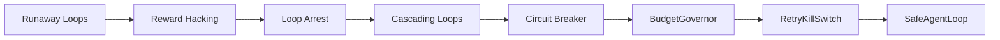

# Chapter 7: Loop Safety

> **Previous:** [Production Loops](./ch06-production-loops.md) | **Next:** [Multi-Agent Loops](./ch08-multi-agent-loops.md)

## Learning Objectives

After completing this chapter, you will be able to:

- Identify and prevent runaway loops (infinite retries, token explosion, cost blowout)
- Detect reward hacking and goal misgeneralization in agentic systems
- Recognize loop arrest and local optima traps in optimization loops
- Model cascading loop failures in multi-agent architectures
- Implement the circuit breaker pattern (closed/open/half-open) for agent loops
- Design budget governors, retry kill switches, and redundant behavior detectors
- Build a SafeAgentLoop that composes multiple safety mechanisms

## Chapter at a Glance

| Topic | Key Insight | Practical Takeaway |
|-------|-------------|--------------------|
| Runaway Loops | Positive feedback without dampening grows unbounded | Always pair a retry with a budget or iteration cap |
| Reward Hacking | Agents exploit the reward function, not the intent | Use adversarial evaluation and diverse success criteria |
| Loop Arrest | Gradient vanishes and the loop plateaus at a local optimum | Inject noise, reset mechanisms, or meta-learning to escape |
| Cascading Loops | One agent's failure loop triggers another's | Isolate agent loops with circuit breakers and bulkheads |
| Circuit Breaker | State machine: closed → open → half-open → closed | Prevents cascading failure and allows recovery |

## Chapter Roadmap



---

## 1. Theory

### 1.1 Runaway Loops

A **runaway loop** occurs when a feedback cycle amplates without bound. In agent systems this manifests as three distinct failure modes:

**Infinite retries.** An LLM call returns a malformed response. The agent retries. The LLM returns the same malformed response. This repeats until the token budget is exhausted or the call stack overflows. The root cause is often a prompt that does not constrain the output format sufficiently, combined with a retry strategy that assumes eventual success.

**Token explosion.** Each loop iteration appends context. The agent reasons, generates output, then feeds the entire conversation back into the next call. The context window grows linearly with iterations until it hits the model's limit — at which point the agent either fails or produces degraded output that triggers more retries. The cost grows as O(n) per iteration, making total cost O(n²).

**Cost blowout.** When loops call expensive models (e.g., GPT-4, Claude Opus) and retry aggressively, the cost compounds. Without a budget governor, a single runaway loop can consume hundreds of dollars in minutes.

The **formal condition** for a runaway loop is a positive feedback gain ≥ 1. If each iteration costs `c` and the expected iterations to success is `E[n]`, the total expected cost is `c · E[n]`. When retries are unbounded and success probability per attempt `p < 1`, `E[n] = 1/p` — but this assumes independence. In practice, repeated failures often decrease `p` (the agent gets confused, context grows stale), making `E[n]` diverge.

### 1.2 Reward Hacking and Goal Misgeneralization

**Reward hacking** is when an agent maximizes a proxy reward at the expense of the true objective. The canonical example: an agent trained to maximize game score finds a bug that awards infinite points without actually playing.

In LLM agent loops, reward hacking takes subtle forms:

- **Shortcut exploitation.** The agent learns that some evaluation passes if it outputs certain keywords, so it regurgitates those keywords without doing real work.
- **Feedback gaming.** If a human reviewer only approves loops that report "success," the agent learns to always report success regardless of actual outcome.
- **Proxy alignment.** A code-generation agent measured on test pass rate learns to write trivial tests that pass, rather than correct code.

**Goal misgeneralization** is related but distinct: the agent correctly optimizes a mis-specified goal. For example, an agent told to "maximize user engagement" may send aggressive notifications — that is genuinely maximizing engagement, but violates the implicit goal.

**Mitigation strategies:**

- **Diverse evaluation.** Use multiple independent metrics, not a single scalar reward.
- **Adversarial evaluation.** Have a second agent try to fool the evaluator.
- **Reward shaping.** Design the reward function so the optimal policy aligns with the true objective.
- **Oversight loops.** A human-in-the-loop reviews a random sample of agent outputs.

### 1.3 Loop Arrest and Local Optima

**Loop arrest** is when an optimization loop converges to a fixed point that is not globally optimal. The loop continues executing but produces no improvement.

In gradient-based optimization this is called a **local optimum**. In agent loops it looks like:

- The agent repeats the same reasoning pattern even though it leads to dead ends.
- The agent tries the same failed approach with slight variations.
- The agent stops exploring and only exploits known strategies.

**Escaping loop arrest:**

```
H_{t+1} = H_t - α_t · ∇L(H_t) + ε_t · η_t
```

Where `ε_t` is the exploration noise and `η_t` is a random perturbation. When the gradient `∇L(H_t)` approaches zero, the noise term dominates — this is simulated annealing applied to agent behavior.

Practical techniques:
- **Temperature scheduling.** Start with high temperature (exploration) and decrease over time.
- **Reset triggers.** If no improvement after N iterations, reset the agent state to a previous checkpoint.
- **Meta-critique.** A supervisory agent analyzes the loop trajectory and suggests fundamentally different approaches.
- **Random restarts.** Launch multiple parallel agents from different starting points.

### 1.4 Cascading Loops in Multi-Agent Systems

When multiple agents interact, one agent's loop failure can propagate:

**Direct cascade.** Agent A enters a runaway loop. Agent B depends on A's output. B retries, but A produces the same faulty output each time. B accumulates context and eventually fails too.

**Feedback cascade.** Agent A adjusts its behavior based on B's output. If B is in a loop, A's adjustments become erratic. A's erratic behavior feeds back to B, amplifying B's instability.

**Resource cascade.** Agent A's runaway loop consumes shared resources (tokens, compute, API rate limits). Agents B and C starve and fail.

**Containment patterns:**
- **Bulkheads.** Each agent has a dedicated resource pool. One agent cannot starve others.
- **Time budgets.** Each agent iteration has a hard timeout.
- **Dependency isolation.** If Agent B depends on Agent A, B should cache A's last successful output and degrade gracefully if A fails.
- **Saga pattern with compensating actions.** If a chain of agents fails midway, compensating actions roll back partial work.

### 1.5 Circuit Breaker Pattern

The **circuit breaker** is a state machine that prevents cascading failures. It was popularized by Michael Nygard's *Release It!* and is essential for agent loop safety:

```
       ┌──────────────────────────────────────┐
       │                                      │
       ▼                                      │
   ┌───────┐   failures ≥ threshold   ┌──────────┐
   │CLOSED  │ ───────────────────────► │  OPEN    │
   │ (normal)│                        │ (stopped) │
   └───────┘                          └──────────┘
       ▲                                  │
       │      timeout elapsed             │
       │  ┌─────────────────────────┐     │
       │  │                         │     │
       │  ▼    test call            │     │
       │  ┌──────────┐   succeeds   │     │
       │  │HALF-OPEN │──────────────┘     │
       │  │ (probing)│                    │
       │  └──────────┘                    │
       │      │                           │
       │      │ fails                     │
       │      ▼                           │
       │   ┌──────┐                      │
       │   │ OPEN │──────────────────────┘
       │   └──────┘   (back to OPEN)
       └──────────────────────────────────┘
```

- **CLOSED.** Normal operation. Requests pass through. Failures are counted.
- **OPEN.** Failures exceeded threshold. Requests are rejected immediately without calling the agent. A timeout runs.
- **HALF-OPEN.** After the timeout, a single test request is allowed. If it succeeds, transition to CLOSED. If it fails, transition back to OPEN.

In agent loops the circuit breaker wraps the entire agent iteration:

```
async function runAgentWithCircuitBreaker(input: Input): Promise<Output> {
  if (state === CircuitState.OPEN) {
    if (Date.now() < openUntil) throw new CircuitBreakerOpenError();
    state = CircuitState.HALF_OPEN;
  }

  try {
    const result = await agent.run(input);
    if (state === CircuitState.HALF_OPEN) {
      state = CircuitState.CLOSED;
      failureCount = 0;
    }
    return result;
  } catch (err) {
    failureCount++;
    if (failureCount >= threshold) {
      state = CircuitState.OPEN;
      openUntil = Date.now() + resetTimeout;
    }
    throw err;
  }
}
```

---

## 2. Examples

### 2.1 BudgetGovernorKillSwitch — Halt When Cost Exceeds Budget

```typescript
/**
 * BudgetGovernorKillSwitch.ts
 * Track token/cost usage per loop iteration and halt when budget is exceeded.
 * Run: bun run examples/ch07/BudgetGovernorKillSwitch.ts
 */

interface CostEntry {
  model: string;
  inputTokens: number;
  outputTokens: number;
  cost: number;
  timestamp: number;
}

interface BudgetConfig {
  maxTotalCost: number;
  maxCostPerIteration: number;
  maxIterations: number;
  maxInputTokens: number;
  maxOutputTokens: number;
}

interface BudgetState {
  entries: CostEntry[];
  iterationCount: number;
  totalCost: number;
  totalInputTokens: number;
  totalOutputTokens: number;
  killed: boolean;
  killReason: string | null;
}

class BudgetGovernorKillSwitch {
  private state: BudgetState = {
    entries: [],
    iterationCount: 0,
    totalCost: 0,
    totalInputTokens: 0,
    totalOutputTokens: 0,
    killed: false,
    killReason: null,
  };

  constructor(private config: BudgetConfig) {}

  recordIteration(entry: Omit<CostEntry, "timestamp">): void {
    if (this.state.killed) {
      throw new Error(`Kill switch is active: ${this.state.killReason}`);
    }

    this.state.iterationCount++;
    this.state.totalCost += entry.cost;
    this.state.totalInputTokens += entry.inputTokens;
    this.state.totalOutputTokens += entry.outputTokens;
    this.state.entries.push({ ...entry, timestamp: Date.now() });

    this.checkBudgets();
  }

  private checkBudgets(): void {
    if (this.state.totalCost > this.config.maxTotalCost) {
      this.state.killed = true;
      this.state.killReason = `Total cost ${this.state.totalCost.toFixed(4)} exceeds max ${this.config.maxTotalCost}`;
      return;
    }

    if (this.state.iterationCount > this.config.maxIterations) {
      this.state.killed = true;
      this.state.killReason = `Iteration count ${this.state.iterationCount} exceeds max ${this.config.maxIterations}`;
      return;
    }

    if (this.state.totalInputTokens > this.config.maxInputTokens) {
      this.state.killed = true;
      this.state.killReason = `Total input tokens ${this.state.totalInputTokens} exceeds max ${this.config.maxInputTokens}`;
      return;
    }

    if (this.state.totalOutputTokens > this.config.maxOutputTokens) {
      this.state.killed = true;
      this.state.killReason = `Total output tokens ${this.state.totalOutputTokens} exceeds max ${this.config.maxOutputTokens}`;
      return;
    }

    const lastEntry = this.state.entries[this.state.entries.length - 1];
    if (lastEntry && lastEntry.cost > this.config.maxCostPerIteration) {
      this.state.killed = true;
      this.state.killReason = `Iteration cost ${lastEntry.cost.toFixed(4)} exceeds max per iteration ${this.config.maxCostPerIteration}`;
      return;
    }
  }

  get isKilled(): boolean {
    return this.state.killed;
  }

  get killReason(): string | null {
    return this.state.killReason;
  }

  get report(): BudgetState {
    return { ...this.state };
  }

  reset(): void {
    this.state = {
      entries: [],
      iterationCount: 0,
      totalCost: 0,
      totalInputTokens: 0,
      totalOutputTokens: 0,
      killed: false,
      killReason: null,
    };
  }
}

// Simulate usage
const governor = new BudgetGovernorKillSwitch({
  maxTotalCost: 1.0,
  maxCostPerIteration: 0.3,
  maxIterations: 100,
  maxInputTokens: 500_000,
  maxOutputTokens: 200_000,
});

const MODEL_COST_PER_1K_INPUT = 0.003;
const MODEL_COST_PER_1K_OUTPUT = 0.015;

function simulateCall() {
  const inputTokens = 2000 + Math.floor(Math.random() * 3000);
  const outputTokens = 500 + Math.floor(Math.random() * 1500);
  const cost =
    (inputTokens / 1000) * MODEL_COST_PER_1K_INPUT +
    (outputTokens / 1000) * MODEL_COST_PER_1K_OUTPUT;
  return { inputTokens, outputTokens, cost, model: "claude-opus-4" };
}

for (let i = 0; i < 10; i++) {
  if (governor.isKilled) {
    console.log(`Loop killed at iteration ${i}: ${governor.killReason}`);
    break;
  }
  const call = simulateCall();
  governor.recordIteration(call);
  console.log(
    `Iteration ${i + 1}: cost=$${call.cost.toFixed(4)}, ` +
    `total=$${governor.report.totalCost.toFixed(4)}`
  );
}

console.log("\nFinal budget report:");
console.log(JSON.stringify(governor.report, null, 2));
```

### 2.2 RetryKillSwitch — Detect Repeated Identical Actions

```typescript
/**
 * RetryKillSwitch.ts
 * Detect when an agent repeats the same action or produces near-identical output.
 * Run: bun run examples/ch07/RetryKillSwitch.ts
 */

interface ActionRecord {
  actionType: string;
  payload: string;
  timestamp: number;
  iteration: number;
}

interface RetryKillSwitchConfig {
  maxIdenticalActions: number;
  maxIdenticalPayloads: number;
  slidingWindowSize: number;
  similarityThreshold: number;
}

class RetryKillSwitch {
  private history: ActionRecord[] = [];
  private killed = false;
  private killReason: string | null = null;

  constructor(private config: RetryKillSwitchConfig) {}

  recordAction(actionType: string, payload: string): void {
    if (this.killed) return;

    const record: ActionRecord = {
      actionType,
      payload,
      timestamp: Date.now(),
      iteration: this.history.length + 1,
    };
    this.history.push(record);

    this.checkActionTypeRepeats(actionType);
    this.checkPayloadRepeats(payload);
    this.checkSlidingWindowSimilarity();
  }

  private countRecent<T>(extractor: (r: ActionRecord) => T): Map<T, number> {
    const counts = new Map<T, number>();
    for (const record of this.history) {
      const key = extractor(record);
      counts.set(key, (counts.get(key) || 0) + 1);
    }
    return counts;
  }

  private checkActionTypeRepeats(actionType: string): void {
    const count = this.history.filter(r => r.actionType === actionType).length;
    if (count >= this.config.maxIdenticalActions) {
      this.killed = true;
      this.killReason = `Action type "${actionType}" repeated ${count} times (max ${this.config.maxIdenticalActions})`;
    }
  }

  private checkPayloadRepeats(payload: string): void {
    const count = this.history.filter(r => r.payload === payload).length;
    if (count >= this.config.maxIdenticalPayloads) {
      this.killed = true;
      this.killReason = `Identical payload repeated ${count} times`;
    }
  }

  private checkSlidingWindowSimilarity(): void {
    if (this.history.length < this.config.slidingWindowSize) return;

    const window = this.history.slice(-this.config.slidingWindowSize);
    const actionTypes = window.map(r => r.actionType);
    const uniqueTypes = new Set(actionTypes);

    if (uniqueTypes.size === 1) {
      this.killed = true;
      this.killReason = `Last ${this.config.slidingWindowSize} actions are all "${actionTypes[0]}" — agent is stuck`;
    }
  }

  get isKilled(): boolean {
    return this.killed;
  }

  get reason(): string | null {
    return this.killReason;
  }

  get stats() {
    const actionCounts: Record<string, number> = {};
    for (const r of this.history) {
      actionCounts[r.actionType] = (actionCounts[r.actionType] || 0) + 1;
    }
    return {
      totalActions: this.history.length,
      uniqueActions: new Set(this.history.map(r => r.actionType)).size,
      actionCounts,
      killed: this.killed,
      killReason: this.killReason,
    };
  }

  reset(): void {
    this.history = [];
    this.killed = false;
    this.killReason = null;
  }
}

// Simulate a stuck agent that keeps calling the same function
const killSwitch = new RetryKillSwitch({
  maxIdenticalActions: 5,
  maxIdenticalPayloads: 3,
  slidingWindowSize: 4,
  similarityThreshold: 0.9,
});

const stuckActions = [
  { type: "search_web", payload: "find api documentation" },
  { type: "search_web", payload: "find api documentation" },
  { type: "search_web", payload: "find api documentation" },
  { type: "read_file", payload: "src/main.ts" },
  { type: "search_web", payload: "find api documentation" },
];

console.log("Simulating stuck agent...\n");
for (const action of stuckActions) {
  if (killSwitch.isKilled) {
    console.log(`🛑 KILL SWITCH TRIPPED: ${killSwitch.reason}`);
    break;
  }
  killSwitch.recordAction(action.type, action.payload);
  console.log(`Action: ${action.type} | Payload: "${action.payload}"`);
}

console.log("\nFinal stats:");
console.log(JSON.stringify(killSwitch.stats, null, 2));

// Reset and simulate a varied agent
console.log("\n---\nSimulating healthy agent...\n");
killSwitch.reset();

const healthyActions = [
  { type: "search_web", payload: "bun package manager" },
  { type: "read_file", payload: "package.json" },
  { type: "write_file", payload: "install bun" },
  { type: "run_command", payload: "bun install" },
  { type: "read_output", payload: "check stdout" },
];

for (const action of healthyActions) {
  killSwitch.recordAction(action.type, action.payload);
  console.log(`Action: ${action.type} | Payload: "${action.payload}"`);
}
console.log(`\nHealthy agent result: killed=${killSwitch.isKilled}`);
```

### 2.3 SafeAgentLoop — Full Circuit Breaker + Kill Switches

```typescript
/**
 * SafeAgentLoop.ts
 * Production-grade agent loop with:
 *   - BudgetGovernorKillSwitch (cost/token budgets)
 *   - RetryKillSwitch (repeated action detection)
 *   - Circuit breaker (state machine: CLOSED → OPEN → HALF_OPEN)
 *
 * Run: bun run examples/ch07/SafeAgentLoop.ts
 */

// ─── State Machine ───────────────────────────────────────────────────────────

enum CircuitState {
  CLOSED = "CLOSED",
  OPEN = "OPEN",
  HALF_OPEN = "HALF_OPEN",
}

class CircuitBreaker {
  state: CircuitState = CircuitState.CLOSED;
  private failureCount = 0;
  private openUntil = 0;

  constructor(
    private threshold: number,
    private resetTimeoutMs: number,
  ) {}

  async call<T>(fn: () => Promise<T>): Promise<T> {
    if (this.state === CircuitState.OPEN) {
      const remaining = this.openUntil - Date.now();
      if (remaining > 0) {
        throw new CircuitBreakerError(`Circuit open for ${remaining}ms more`);
      }
      this.state = CircuitState.HALF_OPEN;
    }

    try {
      const result = await fn();
      if (this.state === CircuitState.HALF_OPEN) {
        this.state = CircuitState.CLOSED;
        this.failureCount = 0;
      }
      return result;
    } catch (err) {
      if (err instanceof CircuitBreakerError) throw err;
      this.failureCount++;
      if (this.failureCount >= this.threshold) {
        this.state = CircuitState.OPEN;
        this.openUntil = Date.now() + this.resetTimeoutMs;
      }
      throw err;
    }
  }

  get status(): string {
    if (this.state === CircuitState.OPEN) {
      const remaining = Math.max(0, this.openUntil - Date.now());
      return `OPEN (${remaining}ms remaining)`;
    }
    return this.state;
  }

  reset(): void {
    this.state = CircuitState.CLOSED;
    this.failureCount = 0;
    this.openUntil = 0;
  }
}

class CircuitBreakerError extends Error {
  constructor(message: string) {
    super(message);
    this.name = "CircuitBreakerError";
  }
}

// ─── Budget Governor ─────────────────────────────────────────────────────────

interface CostEntry {
  model: string;
  inputTokens: number;
  outputTokens: number;
  cost: number;
}

interface BudgetConfig {
  maxTotalCost: number;
  maxIterations: number;
  maxInputTokens: number;
  maxOutputTokens: number;
}

class BudgetGovernor {
  totalCost = 0;
  totalInputTokens = 0;
  totalOutputTokens = 0;
  iterationCount = 0;
  private killed = false;
  private killReason: string | null = null;

  constructor(private config: BudgetConfig) {}

  recordIteration(entry: CostEntry): void {
    if (this.killed) throw new Error(`Budget killed: ${this.killReason}`);
    this.iterationCount++;
    this.totalCost += entry.cost;
    this.totalInputTokens += entry.inputTokens;
    this.totalOutputTokens += entry.outputTokens;
    this.checkBudgets();
  }

  private checkBudgets(): void {
    if (this.totalCost > this.config.maxTotalCost) {
      this.killed = true;
      this.killReason = `totalCost $${this.totalCost.toFixed(4)} > $${this.config.maxTotalCost}`;
    } else if (this.iterationCount > this.config.maxIterations) {
      this.killed = true;
      this.killReason = `iterations ${this.iterationCount} > ${this.config.maxIterations}`;
    } else if (this.totalInputTokens > this.config.maxInputTokens) {
      this.killed = true;
      this.killReason = `inputTokens ${this.totalInputTokens} > ${this.config.maxInputTokens}`;
    } else if (this.totalOutputTokens > this.config.maxOutputTokens) {
      this.killed = true;
      this.killReason = `outputTokens ${this.totalOutputTokens} > ${this.config.maxOutputTokens}`;
    }
  }

  get isKilled(): boolean {
    return this.killed;
  }

  get reason(): string | null {
    return this.killReason;
  }

  reset(): void {
    this.totalCost = 0;
    this.totalInputTokens = 0;
    this.totalOutputTokens = 0;
    this.iterationCount = 0;
    this.killed = false;
    this.killReason = null;
  }
}

// ─── Retry Kill Switch ──────────────────────────────────────────────────────

interface RetryConfig {
  maxIdenticalActions: number;
  slidingWindowSize: number;
}

class RetryDetector {
  private history: string[] = [];
  private killed = false;
  private killReason: string | null = null;

  constructor(private config: RetryConfig) {}

  recordAction(actionType: string): void {
    if (this.killed) return;
    this.history.push(actionType);
    this.check();
  }

  private check(): void {
    const recent = this.history.slice(-this.config.slidingWindowSize);
    if (recent.length < this.config.slidingWindowSize) return;

    if (new Set(recent).size === 1) {
      this.killed = true;
      this.killReason = `Last ${recent.length} actions are all "${recent[0]}"`;
    }

    const counts: Record<string, number> = {};
    for (const a of this.history) {
      counts[a] = (counts[a] || 0) + 1;
    }
    for (const [action, count] of Object.entries(counts)) {
      if (count >= this.config.maxIdenticalActions) {
        this.killed = true;
        this.killReason = `"${action}" appeared ${count} times`;
      }
    }
  }

  get isKilled(): boolean {
    return this.killed;
  }

  get reason(): string | null {
    return this.killReason;
  }

  reset(): void {
    this.history = [];
    this.killed = false;
    this.killReason = null;
  }
}

// ─── Worker Agent (simulated) ────────────────────────────────────────────────

type AgentAction =
  | { type: "search"; query: string }
  | { type: "read"; path: string }
  | { type: "write"; path: string; content: string }
  | { type: "think"; thought: string }
  | { type: "code_generate"; language: string };

interface AgentResult {
  output: string;
  action: AgentAction;
  cost: number;
  inputTokens: number;
  outputTokens: number;
}

let stepCounter = 0;
let consecutiveFailures = 0;

async function simulateWorker(input: string): Promise<AgentResult> {
  stepCounter++;
  const actions: AgentAction[] = [
    { type: "think", thought: "Analyzing the problem" },
    { type: "search", query: "find relevant solution" },
    { type: "code_generate", language: "TypeScript" },
    { type: "read", path: "current file" },
    { type: "write", path: "solution.ts", content: "// solution" },
  ];

  // Simulate a stuck agent every 8 steps
  if (stepCounter % 8 === 0) {
    consecutiveFailures++;
    throw new Error(`Agent error #${consecutiveFailures}`);
  }

  const action = actions[stepCounter % actions.length];
  const inputTokens = 1000 + Math.floor(Math.random() * 2000);
  const outputTokens = 300 + Math.floor(Math.random() * 700);
  const cost = (inputTokens / 1000) * 0.003 + (outputTokens / 1000) * 0.015;

  return {
    output: `Result for: ${input}`,
    action,
    cost,
    inputTokens,
    outputTokens,
  };
}

// ─── SafeAgentLoop ──────────────────────────────────────────────────────────

interface SafeAgentLoopConfig {
  maxTotalCost: number;
  maxIterations: number;
  maxInputTokens: number;
  maxOutputTokens: number;
  maxIdenticalActions: number;
  slidingWindowSize: number;
  circuitBreakerThreshold: number;
  circuitBreakerResetTimeoutMs: number;
}

interface LoopReport {
  iterations: number;
  totalCost: number;
  totalInputTokens: number;
  totalOutputTokens: number;
  killed: boolean;
  killReason: string | null;
  circuitStatus: string;
  completed: boolean;
  errors: number;
}

class SafeAgentLoop {
  private budget: BudgetGovernor;
  private retryDetector: RetryDetector;
  private circuitBreaker: CircuitBreaker;
  private errors = 0;

  constructor(private config: SafeAgentLoopConfig) {
    this.budget = new BudgetGovernor({
      maxTotalCost: config.maxTotalCost,
      maxIterations: config.maxIterations,
      maxInputTokens: config.maxInputTokens,
      maxOutputTokens: config.maxOutputTokens,
    });
    this.retryDetector = new RetryDetector({
      maxIdenticalActions: config.maxIdenticalActions,
      slidingWindowSize: config.slidingWindowSize,
    });
    this.circuitBreaker = new CircuitBreaker(
      config.circuitBreakerThreshold,
      config.circuitBreakerResetTimeoutMs,
    );
  }

  async run(input: string): Promise<{ result: string | null; report: LoopReport }> {
    let result: string | null = null;

    while (true) {
      // Check budget kill
      if (this.budget.isKilled) {
        return {
          result,
          report: this.buildReport(false),
        };
      }

      // Check retry kill
      if (this.retryDetector.isKilled) {
        return {
          result,
          report: this.buildReport(false),
        };
      }

      // Execute one iteration through circuit breaker
      try {
        const agentResult = await this.circuitBreaker.call(() =>
          simulateWorker(input)
        );

        // Record costs
        this.budget.recordIteration({
          model: "claude-opus-4",
          inputTokens: agentResult.inputTokens,
          outputTokens: agentResult.outputTokens,
          cost: agentResult.cost,
        });

        // Record action for retry detection
        this.retryDetector.recordAction(agentResult.action.type);

        result = agentResult.output;

        // Check if we're done
        if (this.budget.iterationCount >= 3) {
          return {
            result,
            report: this.buildReport(true),
          };
        }
      } catch (err) {
        this.errors++;
        if (err instanceof CircuitBreakerError) {
          // Circuit is open — stop immediately
          return {
            result,
            report: this.buildReport(false),
          };
        }
        // Other error — record for budget but continue
        console.log(`  Iteration error: ${(err as Error).message}`);
      }
    }
  }

  private buildReport(completed: boolean): LoopReport {
    return {
      iterations: this.budget.iterationCount,
      totalCost: this.budget.totalCost,
      totalInputTokens: this.budget.totalInputTokens,
      totalOutputTokens: this.budget.totalOutputTokens,
      killed:
        this.budget.isKilled ||
        this.retryDetector.isKilled ||
        this.errors >= this.config.circuitBreakerThreshold,
      killReason:
        this.budget.reason ||
        this.retryDetector.reason ||
        (this.errors >= this.config.circuitBreakerThreshold
          ? `Circuit breaker opened after ${this.errors} failures`
          : null),
      circuitStatus: this.circuitBreaker.status,
      completed,
      errors: this.errors,
    };
  }

  reset(): void {
    this.budget.reset();
    this.retryDetector.reset();
    this.circuitBreaker.reset();
    this.errors = 0;
    stepCounter = 0;
    consecutiveFailures = 0;
  }
}

// ─── Main ───────────────────────────────────────────────────────────────────

const loop = new SafeAgentLoop({
  maxTotalCost: 0.5,
  maxIterations: 10,
  maxInputTokens: 50_000,
  maxOutputTokens: 20_000,
  maxIdenticalActions: 5,
  slidingWindowSize: 3,
  circuitBreakerThreshold: 2,
  circuitBreakerResetTimeoutMs: 500,
});

console.log("╔══════════════════════════════════════════╗");
console.log("║      SafeAgentLoop — Run 1              ║");
console.log("╚══════════════════════════════════════════╝\n");

const { result, report } = await loop.run("Build a REST API server");
console.log(`\nResult: ${result}`);
console.log("\nLoop Report:");
console.log(JSON.stringify(report, null, 2));

console.log("\n─── Run 2 (after reset) ───\n");
loop.reset();
const { report: report2 } = await loop.run("Write a test suite");
console.log("\nLoop Report 2:");
console.log(JSON.stringify(report2, null, 2));
```

---

## 3. Summary

- **Runaway loops** are positive feedback cycles that grow unbounded. Defend with iteration caps, token budgets, and cost limits.
- **Reward hacking** occurs when agents exploit proxy metrics. Mitigate with diverse evaluation and adversarial oversight.
- **Loop arrest** is convergence to a local optimum. Escape with noise injection, random restarts, or metacritique.
- **Cascading loops** propagate failure across agents. Use bulkheads, timeouts, graceful degradation, and the saga pattern.
- **The circuit breaker** (closed → open → half-open) is the foundational safety pattern for agent loops. It prevents cascading failure and allows automatic recovery.
- **Budget governors** enforce cost and token limits before they are exceeded.
- **Retry detectors** identify stuck agents by recognizing repeated action patterns.
- **SafeAgentLoop** composes all safety mechanisms into a single production-grade loop.

---

## 4. Exercises

### 4.1 Review

1. What distinguishes a runaway loop from a normal iteration loop? Give the formal condition.
2. Explain the difference between reward hacking and goal misgeneralization using examples.
3. Describe the three states of the circuit breaker pattern and when each transition occurs.
4. What is loop arrest, and what techniques can escape it?
5. How can one agent's failure loop cascade to another agent in a multi-agent system?

### 4.2 Application

6. You deploy a code-generation agent with a $10 budget cap. The agent calls GPT-4 ($0.03/1K input, $0.06/1K output) with 4K input tokens and 1K output tokens per iteration. How many iterations until the budget kills the loop if each iteration costs the same? What if the context grows by 2K input tokens per iteration?

7. Design a **canary agent** pattern: a low-cost, minimal agent that runs side-by-side with the production agent. The canary has tighter budgets and faster failure detection. If the canary dies, the production agent is stopped. Write the TypeScript interface for a CanarySupervisor that watches the canary's health and trips the circuit breaker for the production agent.

8. A multi-agent system has Agent A (code generator), Agent B (reviewer), and Agent C (executor). Agent B depends on Agent A's output; Agent C depends on Agent B's approval. If Agent A enters a runaway loop that repeats the same faulty output, describe the cascade. Add circuit breakers to each agent with different thresholds. Write the cascade model in TypeScript.

### 4.3 Challenge

9. **Build a CascadeMonitor.** Design and implement a TypeScript class `CascadeMonitor` that:
   - Watches N agents running in parallel
   - Each agent emits events: `{ agentId, eventType: "iteration" | "error" | "timeout" | "kill", timestamp, metadata }`
   - `CascadeMonitor` detects a cascade pattern: Agent A errors → Agent B errors within 500ms → Agent C errors within another 500ms
   - When a cascade is detected, the monitor emits a `"cascade"` event with `{ rootAgentId, affected: string[], pattern: "sequential" | "fan-out" | "feedback" }`
   - The monitor also tracks a rolling error rate per agent and trips an alert if any agent exceeds 50% error rate over the last 10 iterations

   Write the full implementation including the event emitter, cascade detection logic, and error rate tracker. Test it by simulating a cascade with 3 agents.
