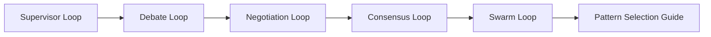
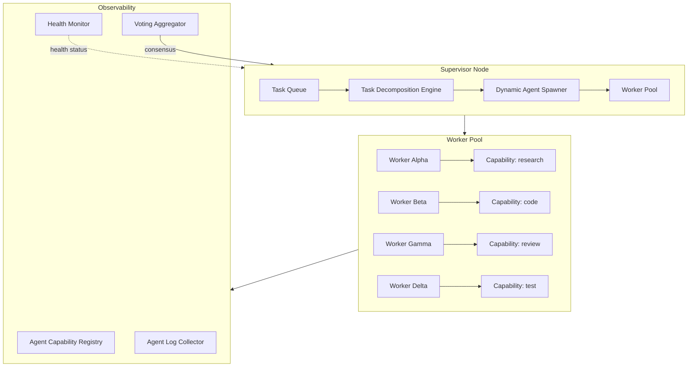

# Chapter 8: Multi-Agent Loops

> **Previous:** [Loop Safety](./ch07-loop-safety.md) | **Next:** [Loop Tooling](./ch09-loop-tooling.md)

## Learning Objectives

After completing this chapter, you will be able to:

<!-- Image Gallery -->
<section class="lesson-visuals" aria-label="Visual learning resources">
  <header><span>VISUAL LEARNING</span><h2>See it. Review it. Remember it.</h2></header>
  <a class="lesson-visual-card" href="../../../assets/images/lessons/loop-engineering/ch08-multi-agent-loops/handwritten-notes.svg" target="_blank" rel="noopener">
    
    <span><strong>Handwritten notes</strong>Condensed notes for deliberate review.</span>
  </a>
  <a class="lesson-visual-card" href="../../../assets/images/lessons/loop-engineering/ch08-multi-agent-loops/sticky-notes.svg" target="_blank" rel="noopener">
    
    <span><strong>Sticky-note revision</strong>Fast recall prompts for revision.</span>
  </a>
  <a class="lesson-visual-card" href="../../../assets/images/lessons/loop-engineering/ch08-multi-agent-loops/visual-explanation.svg" target="_blank" rel="noopener">
    
    <span><strong>Visual concept guide</strong>A connected explanation of the key ideas.</span>
  </a>
</section>
<!-- End Image Gallery -->


- Design a supervisor loop that orchestrates workers, aggregates results, and decides on next actions
- Implement debate loops where agents argue with adversarial scoring and judge evaluation
- Build negotiation loops where agents trade resources and iterate toward agreement
- Construct consensus loops with BFT-style voting, tie-breaking, and configurable quorum
- Understand swarm loops where simple agent rules produce emergent behavior
- Choose the right multi-agent pattern for a given problem domain

## Chapter at a Glance

| Topic | Key Insight | Practical Takeaway |
|-------|-------------|--------------------|
| Supervisor Loop | Central orchestrator distributes work and aggregates results | Use score-based aggregation; re-route on failure |
| Debate Loop | Agents generate adversarial arguments scored by a judge | Higher-quality reasoning emerges from structured disagreement |
| Negotiation Loop | Agents trade proposals iteratively toward a mutually acceptable outcome | Track concession rates; detect deadlock with timeout |
| Consensus Loop | BFT-style voting with tie-breakers and quorum thresholds | N = 3f + 1 agents tolerate f failures |
| Swarm Loop | Simple per-agent rules produce complex collective behavior | No central coordinator; emergent result from local interactions |

## Chapter Roadmap



---

## 1. Theory

### 1.1 Supervisor Loop


The **supervisor loop** is the most widely deployed multi-agent pattern. A single orchestrator agent (the supervisor) manages a pool of worker agents:

```
Supervisor
  ├─ Worker A: research
  ├─ Worker B: code generation
  ├─ Worker C: testing
  └─ Worker D: documentation
```

**Loop flow:**

1. Supervisor receives a task.
2. Supervisor decomposes the task into subtasks.
3. Supervisor dispatches subtasks to workers (in parallel or sequentially).
4. Workers execute and return results.
5. Supervisor aggregates results and scores them.
6. Supervisor decides: emit final output, re-route a failed subtask, or loop back to step 2 with refined decomposition.

**Aggregation strategies:**

- **Score-based.** Each worker result is scored (by the supervisor or an evaluator). The highest-scoring result is selected or results are combined weighted by score.
- **Voting.** Workers vote on the best outcome. Requires 3+ workers for majority.
- **Ensemble.** All results are combined into a single output (e.g., multiple code reviews merged into one report).
- **Best-of-N.** All workers run independently; the best single result is chosen.

**Failure handling.** If a worker fails or times out, the supervisor can:
- Retry the same worker (with backoff)
- Re-route the subtask to a different worker
- Decompose the subtask further and distribute to multiple workers
- Mark the subtask as failed and continue

### 1.2 Debate Loop


Debate loops simulate structured argumentation between agents. They produce higher-quality reasoning than single-agent approaches by forcing each agent to defend its position against critique.

```
       ┌─────────────┐
       │   Motion    │
       └──────┬──────┘
              │
              ▼
    ┌───────────────────┐
    │  Agent Pro        │
    │  (argues for)     │
    └────────┬──────────┘
             │
             ▼
    ┌───────────────────┐
    │  Agent Con        │
    │  (argues against) │
    └────────┬──────────┘
             │
    ┌────────▼──────────┐
    │  More rounds?     │───yes──► (loop back)
    └────────┬──────────┘
             │ no
             ▼
    ┌───────────────────┐
    │  Judge            │
    │  (evaluates,      │
    │   scores, decides)│
    └───────────────────┘
```

**Key design decisions:**

- **Number of rounds.** 2-3 rounds are typical. More rounds produce diminishing returns and increase token costs.
- **Adversary mode.** Agents are explicitly prompted to find flaws in the opponent's argument. This prevents groupthink.
- **Judge architecture.** The judge can be:
  - A separate LLM call with a rubric
  - A panel of judges with majority vote
  - A human (for high-stakes decisions)
- **Scoring criteria.** Clarity, evidence quality, logical consistency, responsiveness to counter-arguments.

### 1.3 Negotiation Loop


Negotiation loops model agents with different resources or objectives that must reach a mutually acceptable agreement through iterative proposal exchange.

**Formal model:**

- Each agent has a **utility function** `U_i(x)` over outcomes `x`.
- Each agent has a **reservation price** `R_i` — the minimum utility they will accept.
- The **negotiation set** `N = {x | U_i(x) ≥ R_i for all i}` is the set of mutually acceptable outcomes.
- The goal is to find an outcome in the negotiation set, ideally on the **Pareto frontier**.

**Loop flow:**

1. Agents exchange initial proposals.
2. Each agent evaluates the other's proposal against its own utility.
3. Agents make concessions (reduce demands) or counter-propose.
4. Repeat until agreement or timeout.
5. If timeout, agents can: walk away, accept the best-so-far, or escalate to a human.

**Concession strategies:**

- **Boulware.** Start with an extreme position and concede slowly. Strong if you have time.
- **Conceder.** Start with a reasonable position and concede quickly. Fast but weak.
- **Tit-for-Tat.** Match the other agent's concession level. Reciprocity-based.

### 1.4 Consensus Loop


Consensus loops are inspired by Byzantine Fault Tolerance (BFT) distributed systems. A group of agents must agree on a single outcome even if some agents are faulty or adversarial.

**BFT model:** With `N = 3f + 1` agents, the system tolerates up to `f` faulty agents. Each agent broadcasts its proposal, collects proposals from others, and runs a deterministic decision function.

```
Agent Proposals:
  A1: "option X"
  A2: "option X"
  A3: "option Y"
  A4: "option X"

Quorum threshold = ceil(2N/3) = ceil(2*4/3) = 3
"option X" has 3 votes ≥ 3 → CONSENSUS REACHED
```

**Tie-breaking strategies:**

- **Predefined tiebreaker.** A designated agent's vote breaks ties.
- **External oracle.** A fresh LLM call evaluates the tied options.
- **Escalation.** The tied options are passed to a judge agent or human.
- **Random.** Select randomly among tied options.

**Quorum thresholds:**

| System | f | N | Quorum |
|--------|---|---|--------|
| Simple majority | 0 | 3 | 2 (50%+1) |
| BFT minimum | 1 | 4 | 3 (75%) |
| BFT high tolerance | 2 | 7 | 5 (71%) |
| Supermajority | - | any | 2/3 |

### 1.5 Swarm Loop


Swarm loops take inspiration from ant colonies, bird flocking, and fish schooling. Simple per-agent rules produce complex emergent behavior without central coordination.

**Principles:**

- **Decentralization.** No single agent has a global view. Each agent acts on local information.
- **Simple rules.** Each agent follows 2-3 simple rules (e.g., "move toward the best neighbor solution", "avoid overcrowding", "random perturbation with small probability").
- **Emergence.** Complex patterns arise from local interactions and positive feedback.

**In agent systems, swarm-like patterns include:**

- **Parallel exploration.** Each agent explores a different part of the solution space. Agents share findings through a shared blackboard. Positive feedback: promising areas attract more agents.
- **Stigmergy.** Agents leave traces (e.g., preference votes, partial solutions) that influence other agents' behavior. No direct communication needed.
- **Pheromone maps.** Agents mark solution paths with "pheromone" scores. Other agents preferentially follow high-pheromone paths. Pheromone evaporates over time to avoid local optima.

**Comparison with other patterns:**

| Aspect | Supervisor | Swarm |
|--------|-----------|-------|
| Coordination | Central | Decentralized |
| State | Supervisor holds global state | Agents share via stigmergy |
| Failure tolerance | Supervisor is single point of failure | Highly resilient |
| Scalability | Limited by supervisor capacity | Scales with swarm size |
| Predictability | Deterministic | Emergent, harder to predict |

---

## 2. Examples

### 2.1 SupervisorLoop — Task Distribution and Score-Based Aggregation


```typescript
/**
 * SupervisorLoop.ts
 * Orchestrator dispatches subtasks to workers, aggregates results with scores.
 * Run: bun run examples/ch08/SupervisorLoop.ts
 */

interface Task {
  id: string;
  description: string;
  requiredCapability: string;
  priority: number;
}

interface WorkerResult {
  workerId: string;
  taskId: string;
  output: string;
  score: number;
  confidence: number;
  latencyMs: number;
}

interface WorkerConfig {
  id: string;
  capabilities: string[];
  costPerCall: number;
}

// ─── Worker simulation ──────────────────────────────────────────────────────

const WORKERS: WorkerConfig[] = [
  { id: "researcher-a", capabilities: ["research", "analysis"], costPerCall: 0.01 },
  { id: "coder-b", capabilities: ["code", "debug"], costPerCall: 0.02 },
  { id: "reviewer-c", capabilities: ["review", "analysis"], costPerCall: 0.015 },
  { id: "architect-d", capabilities: ["design", "review"], costPerCall: 0.025 },
];

async function executeWorker(worker: WorkerConfig, task: Task): Promise<WorkerResult> {
  const startTime = Date.now();
  const latencyMs = 100 + Math.floor(Math.random() * 400);

  await new Promise(resolve => setTimeout(resolve, latencyMs));

  // Simulate varying quality
  const baseScore = task.priority > 5 ? 0.9 : 0.75;
  const capabilityBonus = worker.capabilities.includes(task.requiredCapability)
    ? 0.15
    : -0.1;
  const noise = (Math.random() - 0.5) * 0.2;
  const score = Math.max(0, Math.min(1, baseScore + capabilityBonus + noise));

  return {
    workerId: worker.id,
    taskId: task.id,
    output: `${worker.id} processed "${task.description}"`,
    score,
    confidence: score,
    latencyMs,
  };
}

// ─── Supervisor ─────────────────────────────────────────────────────────────

interface SupervisorConfig {
  minWorkersPerTask: number;
  scoreThreshold: number;
  maxRetries: number;
}

class Supervisor {
  private results: Map<string, WorkerResult[]> = new Map();
  private totalCost = 0;

  constructor(private config: SupervisorConfig) {}

  async execute(tasks: Task[]): Promise<Map<string, WorkerResult>> {
    const finalResults = new Map<string, WorkerResult>();

    for (const task of tasks) {
      console.log(`\n── Task: "${task.description}" (capability: ${task.requiredCapability}) ──`);
      const result = await this.executeTaskWithRetries(task, 0);
      if (result) {
        finalResults.set(task.id, result);
      }
    }

    console.log(`\nTotal cost: $${this.totalCost.toFixed(4)}`);
    return finalResults;
  }

  private async executeTaskWithRetries(
    task: Task,
    attempt: number,
  ): Promise<WorkerResult | null> {
    if (attempt >= this.config.maxRetries) {
      console.log(`  Task ${task.id} failed after ${attempt} retries`);
      return null;
    }

    // Select qualified workers
    const candidates = WORKERS.filter(w =>
      w.capabilities.includes(task.requiredCapability) ||
      w.capabilities.some(c => task.description.toLowerCase().includes(c))
    );

    // Fall back to all workers if none match
    const selectedWorkers = candidates.length >= this.config.minWorkersPerTask
      ? candidates.slice(0, this.config.minWorkersPerTask)
      : WORKERS.slice(0, this.config.minWorkersPerTask);

    console.log(`  Selected workers: ${selectedWorkers.map(w => w.id).join(", ")}`);

    // Execute workers in parallel
    const workerResults = await Promise.all(
      selectedWorkers.map(w => executeWorker(w, task))
    );

    // Track results and cost
    for (const r of workerResults) {
      this.totalCost += WORKERS.find(w => w.id === r.workerId)!.costPerCall;
    }
    this.results.set(task.id, workerResults);

    // Aggregate with score weighting
    const bestResult = this.aggregateByBestScore(workerResults);
    console.log(`  Best result: ${bestResult.workerId} (score: ${bestResult.score.toFixed(3)})`);

    if (bestResult.score >= this.config.scoreThreshold) {
      return bestResult;
    }

    console.log(`  Score ${bestResult.score.toFixed(3)} below threshold ${this.config.scoreThreshold}, retrying...`);
    return this.executeTaskWithRetries(task, attempt + 1);
  }

  private aggregateByBestScore(results: WorkerResult[]): WorkerResult {
    return results.reduce((best, current) =>
      current.score > best.score ? current : best
    );
  }

  getReport(): string {
    const lines: string[] = [];
    for (const [taskId, results] of this.results) {
      lines.push(`Task ${taskId}:`);
      for (const r of results) {
        lines.push(`  ${r.workerId}: score=${r.score.toFixed(3)}, latency=${r.latencyMs}ms`);
      }
    }
    lines.push(`Total cost: $${this.totalCost.toFixed(4)}`);
    return lines.join("\n");
  }
}

// ─── Main ───────────────────────────────────────────────────────────────────

const supervisor = new Supervisor({
  minWorkersPerTask: 2,
  scoreThreshold: 0.7,
  maxRetries: 2,
});

const tasks: Task[] = [
  { id: "t1", description: "Research caching strategies", requiredCapability: "research", priority: 6 },
  { id: "t2", description: "Implement Redis cache client", requiredCapability: "code", priority: 8 },
  { id: "t3", description: "Review cache architecture", requiredCapability: "review", priority: 5 },
];

console.log("╔══════════════════════════════════════╗");
console.log("║      SupervisorLoop Execution        ║");
console.log("╚══════════════════════════════════════╝");

const results = await supervisor.execute(tasks);

console.log("\n── Final Results ──");
for (const [taskId, result] of results) {
  console.log(`${taskId}: ${result.output} (worker: ${result.workerId}, score: ${result.score.toFixed(3)})`);
}

console.log("\n── Full Report ──");
console.log(supervisor.getReport());
```

### 2.2 DebateAgent — Adversarial Arguments with Judge Evaluation


```typescript
/**
 * DebateAgent.ts
 * Two agents debate a motion with adversarial scoring and a judge evaluator.
 * Run: bun run examples/ch08/DebateAgent.ts
 */

interface Argument {
  agentId: string;
  stance: "pro" | "con";
  round: number;
  content: string;
  evidence: string[];
}

interface JudgeScore {
  clarity: number;
  evidence: number;
  logic: number;
  responsiveness: number;
  total: number;
}

interface DebateResult {
  motion: string;
  rounds: Argument[];
  scores: { pro: JudgeScore; con: JudgeScore };
  winner: "pro" | "con" | "draw";
  judgeRationale: string;
}

// ─── Debate Agent ───────────────────────────────────────────────────────────

class DebateAgent {
  constructor(
    public id: string,
    public stance: "pro" | "con",
  ) {}

  async generateArgument(
    motion: string,
    round: number,
    opponentArgument: Argument | null,
  ): Promise<Argument> {
    // Simulate LLM call with debate generation
    await new Promise(resolve => setTimeout(resolve, 150 + Math.random() * 200));

    const proArguments: Record<number, string[]> = {
      1: [
        "Adopting microservices improves deployment independence",
        "Teams can scale independently with bounded contexts",
        "Fault isolation prevents system-wide outages",
      ],
      2: [
        "Response: The monolith already has deployment bottlenecks costing $2M/year",
        "Counter: Your coupling argument ignores well-bounded domain contexts",
        "Further evidence: Netflix and Amazon successfully sustained this model",
      ],
      3: [
        "Rebuttal: Your complexity argument conflates accidental vs essential complexity",
        "Migration cost is one-time; flexibility overhead is perpetual",
        "Data: 80% of teams report faster feature velocity after migration",
      ],
    };

    const conArguments: Record<number, string[]> = {
      1: [
        "Microservices add network latency and operational complexity",
        "Distributed transactions are significantly harder to debug",
        "Most teams lack the operational maturity for distributed systems",
      ],
      2: [
        "Response: $2M/year is 0.1% of revenue — not a compelling justification",
        "Counter: bounded contexts require extensive upfront domain modeling",
        "Further evidence: 60% of microservices migrations fail or are rolled back",
      ],
      3: [
        "Rebuttal: Feature velocity gains are typically measured during the rewrite, not sustained",
        "Essential complexity of distributed systems is higher than monoliths",
        "Data: Post-migration incident frequency increases 3x on average",
      ],
    };

    const args = this.stance === "pro" ? proArguments : conArguments;
    const content = (args[round] || args[1]).join(". ");
    const evidence = args[round] || args[1];

    return {
      agentId: this.id,
      stance: this.stance,
      round,
      content,
      evidence,
    };
  }
}

// ─── Judge ──────────────────────────────────────────────────────────────────

class DebateJudge {
  async evaluate(
    motion: string,
    rounds: Argument[],
  ): Promise<{ scores: { pro: JudgeScore; con: JudgeScore }; winner: "pro" | "con" | "draw"; rationale: string }> {
    await new Promise(resolve => setTimeout(resolve, 200));

    const proArgs = rounds.filter(a => a.stance === "pro");
    const conArgs = rounds.filter(a => a.stance === "con");

    const proScore: JudgeScore = {
      clarity: 0.85 + Math.random() * 0.1,
      evidence: 0.7 + Math.random() * 0.2,
      logic: 0.75 + Math.random() * 0.15,
      responsiveness: 0.7 + Math.random() * 0.2,
      total: 0,
    };
    const conScore: JudgeScore = {
      clarity: 0.8 + Math.random() * 0.15,
      evidence: 0.75 + Math.random() * 0.2,
      logic: 0.8 + Math.random() * 0.1,
      responsiveness: 0.75 + Math.random() * 0.15,
      total: 0,
    };

    proScore.total = (proScore.clarity + proScore.evidence + proScore.logic + proScore.responsiveness) / 4;
    conScore.total = (conScore.clarity + conScore.evidence + conScore.logic + conScore.responsiveness) / 4;

    const diff = proScore.total - conScore.total;
    const winner: "pro" | "con" | "draw" =
      Math.abs(diff) < 0.03 ? "draw" : diff > 0 ? "pro" : "con";

    const rationale = winner === "draw"
      ? "Both sides presented compelling, well-evidenced arguments. The debate is too close to call."
      : `${winner === "pro" ? "Pro" : "Con"} demonstrated stronger logical consistency and evidence quality across ${rounds.length} rounds.`;

    return { scores: { pro: proScore, con: conScore }, winner, rationale };
  }
}

// ─── Debate Orchestrator ────────────────────────────────────────────────────

interface DebateConfig {
  maxRounds: number;
  judgeModel: string;
  scoringRubric: string[];
}

class DebateOrchestrator {
  private proAgent: DebateAgent;
  private conAgent: DebateAgent;
  private judge: DebateJudge;
  private rounds: Argument[] = [];

  constructor(
    proId: string,
    conId: string,
    private config: DebateConfig,
  ) {
    this.proAgent = new DebateAgent(proId, "pro");
    this.conAgent = new DebateAgent(conId, "con");
    this.judge = new DebateJudge();
  }

  async debate(motion: string): Promise<DebateResult> {
    console.log(`\nMotion: "${motion}"\n`);

    for (let round = 1; round <= this.config.maxRounds; round++) {
      console.log(`── Round ${round} ──`);

      const lastPro = this.rounds.findLast(a => a.stance === "pro") ?? null;
      const lastCon = this.rounds.findLast(a => a.stance === "con") ?? null;

      // Pro argues first each round
      const proArg = await this.proAgent.generateArgument(motion, round, lastCon);
      this.rounds.push(proArg);
      console.log(`PRO [${proArg.agentId}]: ${proArg.content.slice(0, 80)}...`);

      // Con responds
      const conArg = await this.conAgent.generateArgument(motion, round, proArg);
      this.rounds.push(conArg);
      console.log(`CON [${conArg.agentId}]: ${conArg.content.slice(0, 80)}...`);
    }

    // Judge evaluates
    console.log(`\n── Judge Evaluation ──`);
    const { scores, winner, rationale } = await this.judge.evaluate(motion, this.rounds);

    console.log(`Pro score: ${scores.pro.total.toFixed(3)}`);
    console.log(`Con score: ${scores.con.total.toFixed(3)}`);
    console.log(`Winner: ${winner.toUpperCase()}`);
    console.log(`Rationale: ${rationale}`);

    return {
      motion,
      rounds: this.rounds,
      scores,
      winner,
      judgeRationale: rationale,
    };
  }
}

// ─── Main ───────────────────────────────────────────────────────────────────

const orchestrator = new DebateOrchestrator(
  "agent-alpha",
  "agent-beta",
  {
    maxRounds: 3,
    judgeModel: "claude-sonnet-4",
    scoringRubric: ["clarity", "evidence", "logic", "responsiveness"],
  },
);

console.log("╔════════════════════════════════════════╗");
console.log("║      Structured Debate Session         ║");
console.log("╚════════════════════════════════════════╝");

const result = await orchestrator.debate(
  "Microservices architecture is superior to monoliths for mid-size engineering teams"
);

console.log("\n── Final Debate Result ──");
console.log(JSON.stringify({
  winner: result.winner,
  proScore: result.scores.pro.total,
  conScore: result.scores.con.total,
  rounds: result.rounds.length,
  rationale: result.judgeRationale,
}, null, 2));
```

### 2.3 ConsensusVote — Tie-Breaking, Thresholds, and Quorum


```typescript
/**
 * ConsensusVote.ts
 * Multi-agent consensus with configurable quorum, tie-breaking, and escalation.
 * Run: bun run examples/ch08/ConsensusVote.ts
 */

interface Vote {
  agentId: string;
  option: string;
  confidence: number;
  rationale: string;
}

interface ConsensusConfig {
  quorumThreshold: number;      // fraction of total agents that must vote (e.g., 0.67)
  winThreshold: number;         // fraction of votes needed to win (e.g., 0.5)
  maxRounds: number;
  tiebreakerStrategy: "predefined" | "random" | "escalate";
  tiebreakerAgentId?: string;
}

interface ConsensusResult {
  winner: string | null;
  votes: Vote[];
  round: number;
  reached: boolean;
  voteDistribution: Record<string, number>;
  totalVoters: number;
  tiebroken: boolean;
}

// ─── Consensus Voter ────────────────────────────────────────────────────────

class ConsensusVoter {
  constructor(
    public id: string,
    private preferenceBias: Record<string, number>,
  ) {}

  async vote(options: string[], context: string): Promise<Vote> {
    await new Promise(resolve => setTimeout(resolve, 50 + Math.random() * 100));

    // Simulate reasoning
    let bestOption = options[0];
    let bestScore = -Infinity;

    for (const option of options) {
      const bias = this.preferenceBias[option] || 0;
      const randomFactor = Math.random() * 0.3;
      const score = bias + randomFactor;
      if (score > bestScore) {
        bestScore = score;
        bestOption = option;
      }
    }

    return {
      agentId: this.id,
      option: bestOption,
      confidence: Math.min(1, bestScore + 0.5),
      rationale: `Preference for "${bestOption}" based on analysis of ${context}`,
    };
  }

  async changeVote(currentVote: Vote, roundResults: Vote[]): Promise<Vote> {
    // Simulate deliberation: an agent may switch if its option is losing
    await new Promise(resolve => setTimeout(resolve, 50));

    const counts: Record<string, number> = {};
    for (const v of roundResults) {
      counts[v.option] = (counts[v.option] || 0) + 1;
    }

    const myOption = currentVote.option;
    const myCount = counts[myOption] || 0;
    const total = roundResults.length;

    // If my option has less than 20% support, consider switching with 30% probability
    if (myCount / total < 0.2 && Math.random() < 0.3) {
      const sorted = Object.entries(counts).sort((a, b) => b[1] - a[1]);
      const leading = sorted[0][0];
      if (leading !== myOption) {
        return {
          ...currentVote,
          option: leading,
          rationale: `Switched to "${leading}" as it has majority support (${sorted[0][1]}/${total})`,
        };
      }
    }

    return currentVote;
  }
}

// ─── Consensus Engine ───────────────────────────────────────────────────────

class ConsensusEngine {
  private voters: ConsensusVoter[];

  constructor(
    voterIds: string[],
    private options: string[],
    private config: ConsensusConfig,
  ) {
    this.voters = voterIds.map((id, i) =>
      new ConsensusVoter(id, this.generateBias(i))
    );
  }

  private generateBias(index: number): Record<string, number> {
    const bias: Record<string, number> = {};
    const numOptions = this.options.length;
    for (let i = 0; i < numOptions; i++) {
      // Each voter has a slight preference for option matching their index
      const preference = i === index % numOptions ? 0.4 : Math.random() * 0.3;
      bias[this.options[i]] = preference;
    }
    return bias;
  }

  async reachConsensus(context: string): Promise<ConsensusResult> {
    let votes: Vote[] = [];

    // Round 1: initial votes
    console.log("\n── Round 1: Initial Votes ──");
    votes = await Promise.all(
      this.voters.map(v => v.vote(this.options, context))
    );
    this.printVotes(votes);

    let result = this.checkConsensus(votes, 1);
    if (result.reached) return result;

    // Subsequent rounds: allow vote changes
    for (let round = 2; round <= this.config.maxRounds; round++) {
      console.log(`\n── Round ${round}: Deliberation ──`);
      votes = await Promise.all(
        this.voters.map((v, i) => v.changeVote(votes[i], votes))
      );
      this.printVotes(votes);

      result = this.checkConsensus(votes, round);
      if (result.reached) return result;
    }

    // Max rounds reached without consensus — apply tie-breaking
    return this.resolveWithoutConsensus(votes);
  }

  private checkConsensus(votes: Vote[], round: number): ConsensusResult {
    const distribution = this.countVotes(votes);
    const totalVoters = votes.length;
    const quorumNeeded = Math.ceil(totalVoters * this.config.quorumThreshold);
    const winNeeded = Math.ceil(totalVoters * this.config.winThreshold);

    const quorumMet = totalVoters >= quorumNeeded;

    if (!quorumMet) {
      return {
        winner: null,
        votes,
        round,
        reached: false,
        voteDistribution: distribution,
        totalVoters,
        tiebroken: false,
      };
    }

    for (const [option, count] of Object.entries(distribution)) {
      if (count >= winNeeded) {
        return {
          winner: option,
          votes,
          round,
          reached: true,
          voteDistribution: distribution,
          totalVoters,
          tiebroken: false,
        };
      }
    }

    return {
      winner: null,
      votes,
      round,
      reached: false,
      voteDistribution: distribution,
      totalVoters,
      tiebroken: false,
    };
  }

  private resolveWithoutConsensus(votes: Vote[]): ConsensusResult {
    const distribution = this.countVotes(votes);
    const totalVoters = votes.length;
    const maxVotes = Math.max(...Object.values(distribution));
    const tiedOptions = Object.entries(distribution)
      .filter(([_, count]) => count === maxVotes)
      .map(([option]) => option);

    let winner: string | null;
    let tiebroken = false;

    if (tiedOptions.length === 1) {
      winner = tiedOptions[0];
    } else {
      tiebroken = true;
      switch (this.config.tiebreakerStrategy) {
        case "predefined": {
          const tiebreaker = this.config.tiebreakerAgentId;
          const tiebreakerVote = votes.find(v => v.agentId === tiebreaker);
          winner = tiebreakerVote?.option ?? tiedOptions[0];
          console.log(`\n  Tiebreaker agent "${tiebreaker}" chose: ${winner}`);
          break;
        }
        case "random": {
          winner = tiedOptions[Math.floor(Math.random() * tiedOptions.length)];
          console.log(`\n  Random tiebreaker chose: ${winner}`);
          break;
        }
        case "escalate": {
          winner = null;
          console.log(`\n  Tie escalated to judge (no auto-resolution)`);
          break;
        }
      }
    }

    return {
      winner,
      votes,
      round: this.config.maxRounds,
      reached: winner !== null,
      voteDistribution: distribution,
      totalVoters,
      tiebroken,
    };
  }

  private countVotes(votes: Vote[]): Record<string, number> {
    const counts: Record<string, number> = {};
    for (const v of votes) {
      counts[v.option] = (counts[v.option] || 0) + 1;
    }
    return counts;
  }

  private printVotes(votes: Vote[]): void {
    for (const v of votes) {
      console.log(`  ${v.agentId}: ${v.option} (confidence: ${v.confidence.toFixed(2)})`);
    }
    const dist = this.countVotes(votes);
    console.log(`  Distribution: ${JSON.stringify(dist)}`);
  }
}

// ─── Main ───────────────────────────────────────────────────────────────────

const engine1 = new ConsensusEngine(
  ["voter-alpha", "voter-beta", "voter-gamma", "voter-delta", "voter-epsilon"],
  ["option-A", "option-B", "option-C"],
  {
    quorumThreshold: 0.67,
    winThreshold: 0.51,
    maxRounds: 3,
    tiebreakerStrategy: "predefined",
    tiebreakerAgentId: "voter-alpha",
  },
);

console.log("╔══════════════════════════════════════════╗");
console.log("║      Consensus Vote Simulation           ║");
console.log("╚══════════════════════════════════════════╝");

console.log("\nConfiguration:");
console.log(`  Quorum: ${engine1["config"].quorumThreshold * 100}%`);
console.log(`  Win threshold: ${engine1["config"].winThreshold * 100}%`);
console.log(`  Max rounds: ${engine1["config"].maxRounds}`);

const result1 = await engine1.reachConsensus("Select the best database migration strategy");

console.log("\n── Result ──");
console.log(JSON.stringify({
  winner: result1.winner,
  reached: result1.reached,
  round: result1.round,
  distribution: result1.voteDistribution,
  tiebroken: result1.tiebroken,
}, null, 2));

// ─── Test tie-breaking scenario ─────────────────────────────────────────────

console.log("\n\n═══ Tie-Breaking Scenario ═══\n");

const engine2 = new ConsensusEngine(
  ["voter-1", "voter-2", "voter-3", "voter-4"],
  ["deploy-now", "wait", "cancel"],
  {
    quorumThreshold: 0.5,
    winThreshold: 0.5,
    maxRounds: 1,
    tiebreakerStrategy: "random",
  },
);

const result2 = await engine2.reachConsensus("Deploy decision for v2.3.1");
console.log("\n── Result ──");
console.log(JSON.stringify({
  winner: result2.winner,
  reached: result2.reached,
  distribution: result2.voteDistribution,
  tiebroken: result2.tiebroken,
}, null, 2));
```

### Extended Implementation: Agent Orchestrator, Consensus Voter, Debate Engine, Supervisor Pool, and Communication Bus

```typescript
/// <reference types="node" />

import { randomUUID } from "node:crypto";

// ── Agent Task Types ───────────────────────────────────────────
type AgentCapability = "code" | "review" | "research" | "security" | "design" | "analysis";

interface AgentTask {
  id: string;
  description: string;
  requiredCapabilities: AgentCapability[];
  priority: number;
  maxDurationMs: number;
  payload: Record<string, unknown>;
}

interface AgentDescriptor {
  id: string;
  name: string;
  capabilities: AgentCapability[];
  load: number;
  isAvailable: boolean;
}

interface TaskAssignment {
  taskId: string;
  agentId: string;
  status: "assigned" | "in_progress" | "completed" | "failed";
  result?: unknown;
  error?: string;
}

// ── Agent Orchestrator ─────────────────────────────────────────
class AgentOrchestrator {
  private agents: Map<string, AgentDescriptor> = new Map();
  private assignments: TaskAssignment[] = [];

  registerAgent(agent: AgentDescriptor): void {
    this.agents.set(agent.id, agent);
  }

  unregisterAgent(agentId: string): boolean {
    return this.agents.delete(agentId);
  }

  get availableAgents(): AgentDescriptor[] {
    return [...this.agents.values()].filter((a) => a.isAvailable);
  }

  /** Find the best agent for a task based on capabilities and load. */
  private selectAgent(task: AgentTask): AgentDescriptor | null {
    const candidates = this.availableAgents.filter((a) =>
      task.requiredCapabilities.every((c) => a.capabilities.includes(c)),
    );
    if (candidates.length === 0) return null;
    return candidates.sort((a, b) => a.load - b.load)[0]; // least loaded
  }

  /** Assign a task to the best available agent. */
  async assignTask(task: AgentTask): Promise<TaskAssignment> {
    const agent = this.selectAgent(task);
    if (!agent) {
      const failed: TaskAssignment = {
        taskId: task.id,
        agentId: "none",
        status: "failed",
        error: "No available agent with required capabilities",
      };
      this.assignments.push(failed);
      return failed;
    }

    agent.isAvailable = false;
    agent.load++;

    const assignment: TaskAssignment = {
      taskId: task.id,
      agentId: agent.id,
      status: "assigned",
    };
    this.assignments.push(assignment);
    return assignment;
  }

  /** Report task result from an agent. */
  reportCompletion(taskId: string, agentId: string, result: unknown): void {
    const assignment = this.assignments.find(
      (a) => a.taskId === taskId && a.agentId === agentId,
    );
    if (assignment) {
      assignment.status = "completed";
      assignment.result = result;
    }
    const agent = this.agents.get(agentId);
    if (agent) {
      agent.isAvailable = true;
    }
  }

  reportFailure(taskId: string, agentId: string, error: string): void {
    const assignment = this.assignments.find(
      (a) => a.taskId === taskId && a.agentId === agentId,
    );
    if (assignment) {
      assignment.status = "failed";
      assignment.error = error;
    }
    const agent = this.agents.get(agentId);
    if (agent) {
      agent.isAvailable = true;
    }
  }

  /** Distribute multiple tasks across the agent pool. */
  async distribute(tasks: AgentTask[]): Promise<TaskAssignment[]> {
    const results: TaskAssignment[] = [];
    for (const task of tasks) {
      results.push(await this.assignTask(task));
    }
    return results;
  }

  /** Get agent utilization stats. */
  utilization(): { totalAgents: number; busyAgents: number; totalAssignments: number } {
    return {
      totalAgents: this.agents.size,
      busyAgents: [...this.agents.values()].filter((a) => !a.isAvailable).length,
      totalAssignments: this.assignments.length,
    };
  }
}

// ── Consensus Voter ────────────────────────────────────────────
interface Vote {
  agentId: string;
  choice: string;
  confidence: number; // 0-1
  rationale: string;
}

interface ConsensusResult {
  winner: string | null;
  voteDistribution: Record<string, number>;
  confidenceScore: number;
  majorityReached: boolean;
  tieBroken: boolean;
}

class ConsensusVoter {
  private votes: Vote[] = [];

  cast(vote: Vote): void {
    this.votes.push(vote);
  }

  reset(): void {
    this.votes = [];
  }

  /** Calculate the consensus winner. */
  tally(threshold: number = 0.5): ConsensusResult {
    if (this.votes.length === 0) {
      return { winner: null, voteDistribution: {}, confidenceScore: 0, majorityReached: false, tieBroken: false };
    }

    // Count weighted votes (by confidence)
    const distribution: Record<string, number> = {};
    let totalWeight = 0;
    for (const v of this.votes) {
      distribution[v.choice] = (distribution[v.choice] ?? 0) + v.confidence;
      totalWeight += v.confidence;
    }

    // Find top two choices
    const sorted = Object.entries(distribution).sort((a, b) => b[1] - a[1]);
    const winner = sorted[0][0];
    const winnerWeight = sorted[0][1];
    const runnerUpWeight = sorted[1]?.[1] ?? 0;

    const majorityReached = winnerWeight / totalWeight >= threshold;
    const tieBroken = Math.abs(winnerWeight - runnerUpWeight) < 0.01;

    return {
      winner: majorityReached ? winner : null,
      voteDistribution: distribution,
      confidenceScore: totalWeight > 0 ? winnerWeight / totalWeight : 0,
      majorityReached,
      tieBroken,
    };
  }

  /** Weighted consensus where each agent has a vote weight. */
  tallyWeighted(weights: Map<string, number>, threshold: number = 0.5): ConsensusResult {
    if (this.votes.length === 0) {
      return { winner: null, voteDistribution: {}, confidenceScore: 0, majorityReached: false, tieBroken: false };
    }

    const distribution: Record<string, number> = {};
    let totalWeight = 0;
    for (const v of this.votes) {
      const w = (weights.get(v.agentId) ?? 1) * v.confidence;
      distribution[v.choice] = (distribution[v.choice] ?? 0) + w;
      totalWeight += w;
    }

    const sorted = Object.entries(distribution).sort((a, b) => b[1] - a[1]);
    const winner = sorted[0][0];
    const winnerWeight = sorted[0][1];

    return {
      winner: winnerWeight / totalWeight >= threshold ? winner : null,
      voteDistribution: distribution,
      confidenceScore: totalWeight > 0 ? winnerWeight / totalWeight : 0,
      majorityReached: winnerWeight / totalWeight >= threshold,
      tieBroken: sorted.length > 1 && Math.abs(sorted[0][1] - sorted[1][1]) < 0.01,
    };
  }
}

// ── Debate Engine ──────────────────────────────────────────────
type ArgumentFn = (topic: string, opposingPoints: string[]) => Promise<string>;
type JudgeFn = (arguments_: string[], topic: string) => Promise<{ winner: number; scores: number[]; rationale: string }>;

interface DebateRound {
  roundNumber: number;
  arguments: string[];
  judgeScores?: number[];
}

class DebateEngine {
  private rounds: DebateRound[] = [];
  private readonly maxRounds: number;

  constructor(
    private proposer: ArgumentFn,
    private opponent: ArgumentFn,
    private judge: JudgeFn,
    maxRounds: number = 3,
  ) {
    this.maxRounds = maxRounds;
  }

  get roundHistory(): DebateRound[] {
    return [...this.rounds];
  }

  /** Run a full debate with multiple rounds. */
  async debate(topic: string): Promise<{
    winner: number;
    finalScore: number;
    rounds: DebateRound[];
    judgeRationale: string;
  }> {
    let proposerPoints: string[] = [];
    let opponentPoints: string[] = [];

    for (let round = 0; round < this.maxRounds; round++) {
      // Proposer argues
      const propArg = await this.proposer(topic, opponentPoints);
      proposerPoints.push(propArg);

      // Opponent argues
      const oppArg = await this.opponent(topic, proposerPoints);
      opponentPoints.push(oppArg);

      const roundArgs = [propArg, oppArg];
      const judgeResult = await this.judge(roundArgs, topic);

      this.rounds.push({
        roundNumber: round + 1,
        arguments: roundArgs,
        judgeScores: judgeResult.scores,
      });
    }

    // Final judgment across all rounds
    const allArgs = this.rounds.flatMap((r) => r.arguments);
    const finalJudgment = await this.judge(allArgs, topic);

    return {
      winner: finalJudgment.winner,
      finalScore: finalJudgment.scores[finalJudgment.winner] ?? 0,
      rounds: this.rounds,
      judgeRationale: finalJudgment.rationale,
    };
  }
}

// ── Supervisor Worker Pool ─────────────────────────────────────
interface WorkerPoolConfig {
  minWorkers: number;
  maxWorkers: number;
  workerTimeoutMs: number;
  healthCheckIntervalMs: number;
}

type WorkerFn = (task: string) => Promise<string>;

interface PoolWorker {
  id: string;
  fn: WorkerFn;
  busy: boolean;
  lastHealthCheck: number;
  healthy: boolean;
  tasksCompleted: number;
}

class SupervisorWorkerPool {
  private workers: Map<string, PoolWorker> = new Map();
  private taskQueue: Array<{ id: string; task: string; resolve: (v: string) => void; reject: (e: Error) => void }> = [];
  private healthTimer: ReturnType<typeof setInterval> | null = null;

  constructor(
    private config: WorkerPoolConfig,
    private workerFactory: () => WorkerFn,
  ) {
    this.initialize();
  }

  private initialize(): void {
    for (let i = 0; i < this.config.minWorkers; i++) {
      this.addWorker();
    }
    this.healthTimer = setInterval(() => this.healthCheck(), this.config.healthCheckIntervalMs);
  }

  private addWorker(): PoolWorker {
    const worker: PoolWorker = {
      id: randomUUID().slice(0, 8),
      fn: this.workerFactory(),
      busy: false,
      lastHealthCheck: Date.now(),
      healthy: true,
      tasksCompleted: 0,
    };
    this.workers.set(worker.id, worker);
    return worker;
  }

  private healthCheck(): void {
    for (const [id, worker] of this.workers) {
      const elapsed = Date.now() - worker.lastHealthCheck;
      if (elapsed > this.config.healthCheckIntervalMs * 3) {
        worker.healthy = false;
        this.workers.delete(id);
        // Replace unhealthy worker
        if (this.workers.size < this.config.maxWorkers) {
          this.addWorker();
        }
      }
    }
    // Process queued tasks
    this.dispatchQueue();
  }

  private get availableWorker(): PoolWorker | null {
    return [...this.workers.values()].find((w) => !w.busy && w.healthy) ?? null;
  }

  private async dispatchQueue(): Promise<void> {
    while (this.taskQueue.length > 0 && this.availableWorker) {
      const task = this.taskQueue.shift()!;
      const worker = this.availableWorker!;
      this.executeTask(worker, task).catch(task.reject);
    }
  }

  private async executeTask(
    worker: PoolWorker,
    task: { id: string; task: string; resolve: (v: string) => void; reject: (e: Error) => void },
  ): Promise<void> {
    worker.busy = true;
    try {
      const result = await Promise.race([
        worker.fn(task.task),
        new Promise<string>((_, reject) =>
          setTimeout(() => reject(new Error("Worker timeout")), this.config.workerTimeoutMs),
        ),
      ]);
      worker.tasksCompleted++;
      task.resolve(result);
    } catch (err) {
      worker.healthy = false;
      this.workers.delete(worker.id);
      if (this.workers.size < this.config.maxWorkers) {
        this.addWorker();
      }
      task.reject(err as Error);
    } finally {
      worker.busy = false;
      worker.lastHealthCheck = Date.now();
    }
  }

  /** Submit a task to the pool. */
  async submit(task: string): Promise<string> {
    return new Promise((resolve, reject) => {
      this.taskQueue.push({ id: randomUUID(), task, resolve, reject });
      this.dispatchQueue();
    });
  }

  /** Submit multiple tasks and aggregate results. */
  async batchSubmit(tasks: string[]): Promise<Array<{ task: string; result?: string; error?: string }>> {
    const results = await Promise.allSettled(tasks.map((t) => this.submit(t)));
    return tasks.map((task, i) => {
      const r = results[i];
      return { task, result: r.status === "fulfilled" ? r.value : undefined, error: r.status === "rejected" ? (r.reason as Error).message : undefined };
    });
  }

  get stats(): { totalWorkers: number; busyWorkers: number; queuedTasks: number; tasksCompleted: number } {
    const w = [...this.workers.values()];
    return {
      totalWorkers: w.length,
      busyWorkers: w.filter((w) => w.busy).length,
      queuedTasks: this.taskQueue.length,
      tasksCompleted: w.reduce((s, w) => s + w.tasksCompleted, 0),
    };
  }

  shutdown(): void {
    if (this.healthTimer) clearInterval(this.healthTimer);
    this.workers.clear();
    this.taskQueue = [];
  }
}

// ── Agent Communication Bus (Pub/Sub) ──────────────────────────
interface Message {
  id: string;
  topic: string;
  sender: string;
  payload: unknown;
  timestamp: number;
  ttlMs: number;
}

type MessageHandler = (message: Message) => Promise<void>;

interface Subscription {
  id: string;
  topic: string;
  handler: MessageHandler;
  filter?: (message: Message) => boolean;
}

class AgentCommunicationBus {
  private subscriptions: Map<string, Subscription[]> = new Map();
  private messageHistory: Message[] = [];
  private readonly maxHistory: number;

  constructor(maxHistory: number = 1000) {
    this.maxHistory = maxHistory;
  }

  /** Subscribe to a topic. */
  subscribe(topic: string, handler: MessageHandler, filter?: (message: Message) => boolean): string {
    const id = randomUUID();
    const subscription: Subscription = { id, topic, handler, filter };
    const existing = this.subscriptions.get(topic) ?? [];
    existing.push(subscription);
    this.subscriptions.set(topic, existing);
    return id;
  }

  /** Unsubscribe by subscription ID. */
  unsubscribe(subscriptionId: string): boolean {
    for (const [topic, subs] of this.subscriptions) {
      const filtered = subs.filter((s) => s.id !== subscriptionId);
      if (filtered.length !== subs.length) {
        if (filtered.length === 0) {
          this.subscriptions.delete(topic);
        } else {
          this.subscriptions.set(topic, filtered);
        }
        return true;
      }
    }
    return false;
  }

  /** Publish a message to a topic. */
  async publish(topic: string, sender: string, payload: unknown, ttlMs: number = 30000): Promise<void> {
    const message: Message = {
      id: randomUUID(),
      topic,
      sender,
      payload,
      timestamp: Date.now(),
      ttlMs,
    };
    this.messageHistory.push(message);
    if (this.messageHistory.length > this.maxHistory) {
      this.messageHistory = this.messageHistory.slice(-this.maxHistory);
    }

    const subs = this.subscriptions.get(topic) ?? [];
    const wildcardSubs = this.subscriptions.get("*") ?? [];

    const deliveries = [...subs, ...wildcardSubs]
      .filter((s) => !s.filter || s.filter(message));

    await Promise.allSettled(deliveries.map((s) => s.handler(message)));
  }

  /** Get recent messages on a topic. */
  getMessages(topic: string, sinceMs?: number): Message[] {
    return this.messageHistory.filter((m) => {
      if (m.topic !== topic) return false;
      if (sinceMs && m.timestamp < sinceMs) return false;
      return Date.now() - m.timestamp < m.ttlMs;
    });
  }

  /** Get all active subscriptions. */
  activeSubscriptions(): number {
    let count = 0;
    for (const subs of this.subscriptions.values()) {
      count += subs.length;
    }
    return count;
  }

  /** Clear all expired messages. */
  pruneExpired(): number {
    const before = this.messageHistory.length;
    this.messageHistory = this.messageHistory.filter((m) => Date.now() - m.timestamp < m.ttlMs);
    return before - this.messageHistory.length;
  }
}

// ── Usage ──────────────────────────────────────────────────────
async function main() {
  // AgentOrchestrator demo
  const orchestrator = new AgentOrchestrator();
  orchestrator.registerAgent({ id: "agent_1", name: "Coder", capabilities: ["code", "analysis"], load: 0, isAvailable: true });
  orchestrator.registerAgent({ id: "agent_2", name: "Reviewer", capabilities: ["review", "security"], load: 0, isAvailable: true });
  const tasks: AgentTask[] = [
    { id: "t1", description: "Write validator", requiredCapabilities: ["code"], priority: 1, maxDurationMs: 5000, payload: {} },
    { id: "t2", description: "Security audit", requiredCapabilities: ["security"], priority: 2, maxDurationMs: 5000, payload: {} },
  ];
  const assignments = await orchestrator.distribute(tasks);
  console.log("Orchestrator assignments:", assignments.map((a) => `${a.taskId} -> ${a.agentId}`));

  // ConsensusVoter demo
  const voter = new ConsensusVoter();
  voter.cast({ agentId: "a1", choice: "approve", confidence: 0.9, rationale: "Good design" });
  voter.cast({ agentId: "a2", choice: "approve", confidence: 0.7, rationale: "Meets requirements" });
  voter.cast({ agentId: "a3", choice: "reject", confidence: 0.4, rationale: "Security concerns" });
  const consensus = voter.tally(0.5);
  console.log("Consensus winner:", consensus.winner, "confidence:", consensus.confidenceScore.toFixed(2));

  // Weighted consensus
  const weights = new Map([["a1", 3], ["a2", 1], ["a3", 2]]);
  const weighted = voter.tallyWeighted(weights);
  console.log("Weighted consensus winner:", weighted.winner);

  // DebateEngine demo
  const debate = new DebateEngine(
    async (topic, _opposing) => `Proposal for ${topic}: implement with layered architecture`,
    async (topic, _proposal) => `Counterpoint for ${topic}: layered adds unnecessary complexity`,
    async (args, _topic) => ({ winner: 0, scores: [0.8, 0.6], rationale: "Proposer had stronger arguments" }),
  );
  const debateResult = await debate.debate("Should we use microservices?");
  console.log("Debate winner:", debateResult.winner, "score:", debateResult.finalScore);

  // SupervisorWorkerPool demo
  const pool = new SupervisorWorkerPool(
    { minWorkers: 2, maxWorkers: 5, workerTimeoutMs: 1000, healthCheckIntervalMs: 5000 },
    () => async (task) => `Processed: ${task}`,
  );
  const poolResults = await pool.batchSubmit(["task1", "task2", "task3"]);
  console.log("Pool results:", poolResults.map((r) => r.result));
  console.log("Pool stats:", pool.stats);
  pool.shutdown();

  // AgentCommunicationBus demo
  const bus = new AgentCommunicationBus();
  bus.subscribe("task:complete", async (msg) => {
    console.log(`Bus received: ${msg.sender} completed task`);
  });
  await bus.publish("task:complete", "agent_1", { taskId: "t1", result: "done" });
  console.log("Bus subscriptions:", bus.activeSubscriptions());
  console.log("Bus messages in topic:", bus.getMessages("task:complete").length);
}

main();
```

### Mermaid: Supervisor-Worker Architecture with Health Checks




### Extended Implementation: Capability Registry, Task Decomposition, Voting Aggregator, Log Collector, and Dynamic Spawner

```typescript
/// <reference types="node" />

import { randomUUID } from "node:crypto";

// ── AgentCapabilityRegistry ─────────────────────────────────────
interface AgentCapability {
  agentId: string;
  agentName: string;
  capabilities: string[];
  maxLoad: number;
  currentLoad: number;
  avgLatencyMs: number;
  successRate: number;
  lastHeartbeat: number;
}

interface CapabilityQuery {
  requiredCapabilities: string[];
  maxLoad?: number;
  minSuccessRate?: number;
}

class AgentCapabilityRegistry {
  private agents: Map<string, AgentCapability> = new Map();
  private capabilityIndex: Map<string, Set<string>> = new Map(); // capability -> agentIds

  register(agent: AgentCapability): void {
    this.agents.set(agent.agentId, agent);
    for (const cap of agent.capabilities) {
      const existing = this.capabilityIndex.get(cap) ?? new Set();
      existing.add(agent.agentId);
      this.capabilityIndex.set(cap, existing);
    }
  }

  unregister(agentId: string): boolean {
    const agent = this.agents.get(agentId);
    if (!agent) return false;
    for (const cap of agent.capabilities) {
      this.capabilityIndex.get(cap)?.delete(agentId);
    }
    return this.agents.delete(agentId);
  }

  /** Find agents matching a capability query. */
  query(query: CapabilityQuery): AgentCapability[] {
    const candidates = [...this.agents.values()].filter((agent) => {
      const hasAllCaps = query.requiredCapabilities.every(
        (cap) => agent.capabilities.includes(cap),
      );
      if (!hasAllCaps) return false;
      if (query.maxLoad !== undefined && agent.currentLoad >= query.maxLoad) return false;
      if (query.minSuccessRate !== undefined && agent.successRate < query.minSuccessRate) return false;
      return true;
    });
    return candidates.sort((a, b) => a.currentLoad - b.currentLoad);
  }

  /** Find agents that have all of the required capabilities. */
  findByCapabilities(capabilities: string[]): AgentCapability[] {
    return this.query({ requiredCapabilities: capabilities });
  }

  /** Update agent heartbeat and load. */
  heartbeat(agentId: string, load: number, latencyMs: number, success: boolean): boolean {
    const agent = this.agents.get(agentId);
    if (!agent) return false;
    agent.currentLoad = load;
    agent.avgLatencyMs = (agent.avgLatencyMs + latencyMs) / 2;
    agent.lastHeartbeat = Date.now();
    agent.successRate = success
      ? Math.min(1, agent.successRate + 0.01)
      : Math.max(0, agent.successRate - 0.05);
    return true;
  }

  /** Get agents that haven't sent a heartbeat recently. */
  getStaleAgents(timeoutMs: number = 30000): AgentCapability[] {
    const now = Date.now();
    return [...this.agents.values()].filter((a) => now - a.lastHeartbeat > timeoutMs);
  }

  /** Get all registered capabilities across all agents. */
  getCapabilityCatalog(): string[] {
    return [...this.capabilityIndex.keys()].sort();
  }

  /** Report overall registry health. */
  report(): {
    totalAgents: number;
    totalCapabilities: number;
    avgSuccessRate: number;
    avgLoad: number;
    staleAgents: number;
  } {
    const all = [...this.agents.values()];
    return {
      totalAgents: all.length,
      totalCapabilities: this.capabilityIndex.size,
      avgSuccessRate: all.length > 0
        ? all.reduce((s, a) => s + a.successRate, 0) / all.length
        : 0,
      avgLoad: all.length > 0
        ? all.reduce((s, a) => s + a.currentLoad, 0) / all.length
        : 0,
      staleAgents: this.getStaleAgents().length,
    };
  }
}

// ── TaskDecompositionEngine ─────────────────────────────────────
interface DecomposedTask {
  id: string;
  parentId: string | null;
  description: string;
  requiredCapabilities: string[];
  priority: number;
  dependencies: string[]; // task IDs that must complete first
  estimatedComplexity: number;
}

interface DecompositionStrategy {
  maxDepth: number;
  maxSubtasks: number;
  granularity: "coarse" | "medium" | "fine";
}

class TaskDecompositionEngine {
  private decompositions: Map<string, DecomposedTask[]> = new Map();

  constructor(private strategy: DecompositionStrategy) {}

  /** Decompose a high-level task into subtasks. */
  decompose(
    parentId: string,
    description: string,
    capabilities: string[],
    depth: number = 0,
  ): DecomposedTask[] {
    if (depth >= this.strategy.maxDepth) {
      const leaf: DecomposedTask = {
        id: randomUUID().slice(0, 8),
        parentId,
        description,
        requiredCapabilities: capabilities,
        priority: 5,
        dependencies: [],
        estimatedComplexity: 1,
      };
      this.decompositions.set(parentId, [leaf]);
      return [leaf];
    }

    const subtasks = this.splitTask(description, capabilities, depth);
    this.decompositions.set(parentId, subtasks);
    return subtasks;
  }

  /** Split a task into smaller pieces based on granularity. */
  private splitTask(
    description: string,
    capabilities: string[],
    depth: number,
  ): DecomposedTask[] {
    const numSubtasks = Math.max(1, Math.min(
      this.strategy.maxSubtasks,
      this.strategy.granularity === "fine" ? 6 :
      this.strategy.granularity === "medium" ? 4 : 2,
    ));

    const subtasks: DecomposedTask[] = [];
    const words = description.split(" ");
    const chunkSize = Math.max(1, Math.ceil(words.length / numSubtasks));

    for (let i = 0; i < numSubtasks; i++) {
      const start = i * chunkSize;
      const end = Math.min(start + chunkSize, words.length);
      const chunk = words.slice(start, end).join(" ");

      subtasks.push({
        id: randomUUID().slice(0, 8),
        parentId: description,
        description: chunk,
        requiredCapabilities: capabilities,
        priority: 5 - Math.min(4, depth),
        dependencies: i > 0 ? [subtasks[i - 1].id] : [],
        estimatedComplexity: chunk.length / description.length,
      });
    }

    return subtasks;
  }

  /** Build a dependency-ordered execution plan. */
  buildExecutionPlan(taskId: string): DecomposedTask[] {
    const tasks = this.decompositions.get(taskId);
    if (!tasks) return [];

    // Topological sort by dependencies
    const sorted: DecomposedTask[] = [];
    const visited = new Set<string>();

    const visit = (task: DecomposedTask) => {
      if (visited.has(task.id)) return;
      visited.add(task.id);
      for (const depId of task.dependencies) {
        const dep = tasks.find((t) => t.id === depId);
        if (dep) visit(dep);
      }
      sorted.push(task);
    };

    for (const task of tasks) {
      visit(task);
    }

    return sorted;
  }

  /** Get decomposition statistics. */
  stats(taskId: string): { totalSubtasks: number; depth: number; parallelGroups: number } | null {
    const tasks = this.decompositions.get(taskId);
    if (!tasks) return null;
    const maxDepth = new Set(tasks.map((t) => t.parentId)).size;
    const rootCount = tasks.filter((t) => t.dependencies.length === 0).length;
    return {
      totalSubtasks: tasks.length,
      depth: maxDepth,
      parallelGroups: rootCount,
    };
  }
}

// ── VotingAggregator ────────────────────────────────────────────
type VotingStrategy = "majority" | "weighted" | "ranked_choice" | "borda_count";

interface VoterInput {
  agentId: string;
  vote: string;
  weight: number;
  rankings?: string[]; // for ranked-choice: ordered list of preferences
}

interface VotingResult {
  winner: string | null;
  voteDistribution: Record<string, number>;
  totalVotes: number;
  strategy: VotingStrategy;
  rounds?: number;
}

class VotingAggregator {
  constructor(private defaultStrategy: VotingStrategy = "majority") {}

  /** Count votes using the specified strategy. */
  tally(votes: VoterInput[], strategy?: VotingStrategy): VotingResult {
    const s = strategy ?? this.defaultStrategy;

    switch (s) {
      case "majority":
        return this.majorityTally(votes);
      case "weighted":
        return this.weightedTally(votes);
      case "ranked_choice":
        return this.rankedChoiceTally(votes);
      case "borda_count":
        return this.bordaCountTally(votes);
    }
  }

  /** Simple majority: most votes wins. */
  private majorityTally(votes: VoterInput[]): VotingResult {
    const counts: Record<string, number> = {};
    for (const v of votes) {
      counts[v.vote] = (counts[v.vote] ?? 0) + 1;
    }
    const sorted = Object.entries(counts).sort((a, b) => b[1] - a[1]);
    const totalVotes = votes.length;
    return {
      winner: sorted.length > 0 ? sorted[0][0] : null,
      voteDistribution: counts,
      totalVotes,
      strategy: "majority",
    };
  }

  /** Weighted voting: each vote counts according to the voter's weight. */
  private weightedTally(votes: VoterInput[]): VotingResult {
    const counts: Record<string, number> = {};
    for (const v of votes) {
      counts[v.vote] = (counts[v.vote] ?? 0) + v.weight;
    }
    const sorted = Object.entries(counts).sort((a, b) => b[1] - a[1]);
    const totalWeight = votes.reduce((s, v) => s + v.weight, 0);
    return {
      winner: sorted.length > 0 ? sorted[0][0] : null,
      voteDistribution: counts,
      totalVotes: totalWeight,
      strategy: "weighted",
    };
  }

  /** Ranked-choice voting: eliminate lowest until majority. */
  private rankedChoiceTally(votes: VoterInput[]): VotingResult {
    const activeCandidates = new Set<string>();
    for (const v of votes) {
      if (v.rankings) {
        for (const r of v.rankings) activeCandidates.add(r);
      } else {
        activeCandidates.add(v.vote);
      }
    }

    let round = 0;
    while (activeCandidates.size > 1) {
      round++;
      const counts: Record<string, number> = {};
      for (const v of votes) {
        const currentVote = this.currentRankedVote(v, [...activeCandidates]);
        if (currentVote) {
          counts[currentVote] = (counts[currentVote] ?? 0) + 1;
        }
      }

      const sorted = Object.entries(counts).sort((a, b) => b[1] - a[1]);
      if (sorted.length === 0) break;

      // Check if any candidate has majority
      const totalVotes = votes.length;
      if (sorted[0][1] > totalVotes / 2) {
        return {
          winner: sorted[0][0],
          voteDistribution: counts,
          totalVotes,
          strategy: "ranked_choice",
          rounds: round,
        };
      }

      // Eliminate lowest
      const eliminated = sorted[sorted.length - 1][0];
      activeCandidates.delete(eliminated);
    }

    const remaining = [...activeCandidates];
    return {
      winner: remaining[0] ?? null,
      voteDistribution: {},
      totalVotes: votes.length,
      strategy: "ranked_choice",
      rounds: round,
    };
  }

  /** Get the highest-ranked still-active candidate. */
  private currentRankedVote(voter: VoterInput, activeCandidates: string[]): string | null {
    if (voter.rankings) {
      for (const r of voter.rankings) {
        if (activeCandidates.includes(r)) return r;
      }
    }
    return activeCandidates.includes(voter.vote) ? voter.vote : null;
  }

  /** Borda count: points assigned by rank position. */
  private bordaCountTally(votes: VoterInput[]): VotingResult {
    const points: Record<string, number> = {};

    for (const v of votes) {
      const rankings = v.rankings ?? [v.vote];
      const numOptions = rankings.length;
      for (let i = 0; i < rankings.length; i++) {
        // Points: (numOptions - i - 1) per voter
        points[rankings[i]] = (points[rankings[i]] ?? 0) + (numOptions - i);
      }
    }

    const sorted = Object.entries(points).sort((a, b) => b[1] - a[1]);
    return {
      winner: sorted.length > 0 ? sorted[0][0] : null,
      voteDistribution: points,
      totalVotes: votes.length,
      strategy: "borda_count",
    };
  }
}

// ── AgentLogCollector ───────────────────────────────────────────
interface LogEntry {
  id: string;
  correlationId: string;
  agentId: string;
  level: "debug" | "info" | "warn" | "error";
  message: string;
  timestamp: number;
  metadata: Record<string, unknown>;
}

interface LogQuery {
  correlationId?: string;
  agentId?: string;
  level?: string;
  since?: number;
  until?: number;
  limit?: number;
}

class AgentLogCollector {
  private logs: LogEntry[] = [];
  private maxEntries: number;

  constructor(maxEntries: number = 100000) {
    this.maxEntries = maxEntries;
  }

  /** Write a log entry. */
  log(
    correlationId: string,
    agentId: string,
    level: LogEntry["level"],
    message: string,
    metadata: Record<string, unknown> = {},
  ): LogEntry {
    const entry: LogEntry = {
      id: randomUUID().slice(0, 12),
      correlationId,
      agentId,
      level,
      message,
      timestamp: Date.now(),
      metadata,
    };
    this.logs.push(entry);
    if (this.logs.length > this.maxEntries) {
      this.logs = this.logs.slice(-this.maxEntries);
    }
    return entry;
  }

  /** Convenience methods. */
  info(correlationId: string, agentId: string, message: string, meta?: Record<string, unknown>): LogEntry {
    return this.log(correlationId, agentId, "info", message, meta);
  }

  warn(correlationId: string, agentId: string, message: string, meta?: Record<string, unknown>): LogEntry {
    return this.log(correlationId, agentId, "warn", message, meta);
  }

  error(correlationId: string, agentId: string, message: string, meta?: Record<string, unknown>): LogEntry {
    return this.log(correlationId, agentId, "error", message, meta);
  }

  debug(correlationId: string, agentId: string, message: string, meta?: Record<string, unknown>): LogEntry {
    return this.log(correlationId, agentId, "debug", message, meta);
  }

  /** Query logs with filters. */
  query(query: LogQuery): LogEntry[] {
    return this.logs.filter((entry) => {
      if (query.correlationId && entry.correlationId !== query.correlationId) return false;
      if (query.agentId && entry.agentId !== query.agentId) return false;
      if (query.level && entry.level !== query.level) return false;
      if (query.since && entry.timestamp < query.since) return false;
      if (query.until && entry.timestamp > query.until) return false;
      return true;
    }).slice(0, query.limit ?? 1000);
  }

  /** Build a trace for a specific correlation ID. */
  buildTrace(correlationId: string): {
    entries: LogEntry[];
    duration: number;
    errorCount: number;
    agentSequence: string[];
  } {
    const entries = this.query({ correlationId });
    const errorCount = entries.filter((e) => e.level === "error").length;
    const agentSequence = [...new Set(entries.map((e) => e.agentId))];
    const duration = entries.length > 1
      ? entries[entries.length - 1].timestamp - entries[0].timestamp
      : 0;
    return { entries, duration, errorCount, agentSequence };
  }

  /** Get aggregate stats. */
  stats(): { totalEntries: number; errorCount: number; uniqueAgents: number; uniqueCorrelations: number } {
    const errorCount = this.logs.filter((e) => e.level === "error").length;
    const uniqueAgents = new Set(this.logs.map((e) => e.agentId)).size;
    const uniqueCorrelations = new Set(this.logs.map((e) => e.correlationId)).size;
    return { totalEntries: this.logs.length, errorCount, uniqueAgents, uniqueCorrelations };
  }

  reset(): void {
    this.logs = [];
  }
}

// ── DynamicAgentSpawner ─────────────────────────────────────────
interface SpawnerConfig {
  minAgents: number;
  maxAgents: number;
  scaleUpThreshold: number;  // queue depth per agent to trigger scale-up
  scaleDownThreshold: number; // queue depth per agent to trigger scale-down
  cooldownMs: number;
  agentFactory: (id: string) => Promise<{ id: string; capabilities: string[] }>;
}

interface SpawnerState {
  activeAgents: number;
  queueDepth: number;
  desiredAgents: number;
  lastScaleEvent: number;
  totalSpawned: number;
  totalDestroyed: number;
}

class DynamicAgentSpawner {
  private agents: Map<string, { id: string; capabilities: string[]; busy: boolean }> = new Map();
  private queue: string[] = [];
  private state: SpawnerState;
  private scaleTimer: ReturnType<typeof setInterval> | null = null;

  constructor(private config: SpawnerConfig) {
    this.state = {
      activeAgents: 0,
      queueDepth: 0,
      desiredAgents: config.minAgents,
      lastScaleEvent: Date.now(),
      totalSpawned: 0,
      totalDestroyed: 0,
    };
  }

  async initialize(): Promise<void> {
    for (let i = 0; i < this.config.minAgents; i++) {
      await this.spawnAgent();
    }
    this.scaleTimer = setInterval(() => this.evaluateScaling(), this.config.cooldownMs);
  }

  get status(): SpawnerState {
    return { ...this.state, activeAgents: this.agents.size, queueDepth: this.queue.length };
  }

  /** Submit a task to the queue. */
  async submit(task: string): Promise<string> {
    const available = [...this.agents.values()].find((a) => !a.busy);
    if (available) {
      available.busy = true;
      this.state.activeAgents++;
      return task;
    }
    this.queue.push(task);
    this.state.queueDepth = this.queue.length;
    return task;
  }

  /** Mark an agent as available. */
  complete(agentId: string): void {
    const agent = this.agents.get(agentId);
    if (agent) {
      agent.busy = false;
      this.state.activeAgents = Math.max(0, this.state.activeAgents - 1);
    }
    // Dispatch queued task if available
    if (this.queue.length > 0) {
      const nextAvailable = [...this.agents.values()].find((a) => !a.busy);
      if (nextAvailable) {
        this.queue.shift();
        nextAvailable.busy = true;
        this.state.activeAgents++;
        this.state.queueDepth = this.queue.length;
      }
    }
  }

  /** Evaluate whether to scale up or down. */
  private async evaluateScaling(): Promise<void> {
    const now = Date.now();
    if (now - this.state.lastScaleEvent < this.config.cooldownMs) return;

    const queuePerAgent = this.queue.length / Math.max(this.agents.size, 1);

    if (queuePerAgent > this.config.scaleUpThreshold && this.agents.size < this.config.maxAgents) {
      await this.spawnAgent();
      this.state.lastScaleEvent = now;
    } else if (
      queuePerAgent < this.config.scaleDownThreshold &&
      this.agents.size > this.config.minAgents
    ) {
      await this.destroyAgent();
      this.state.lastScaleEvent = now;
    }

    this.state.desiredAgents = Math.max(
      this.config.minAgents,
      Math.min(this.config.maxAgents, Math.ceil(queuePerAgent * 2)),
    );
  }

  private async spawnAgent(): Promise<void> {
    const id = `agent_${randomUUID().slice(0, 6)}`;
    const agent = await this.config.agentFactory(id);
    this.agents.set(agent.id, { ...agent, busy: false });
    this.state.totalSpawned++;
  }

  private async destroyAgent(): Promise<void> {
    // Destroy the least busy agent
    const sorted = [...this.agents.values()].sort((a, b) =>
      (a.busy ? 1 : 0) - (b.busy ? 1 : 0),
    );
    const target = sorted[0];
    if (target) {
      this.agents.delete(target.id);
      this.state.totalDestroyed++;
    }
  }

  shutdown(): void {
    if (this.scaleTimer) clearInterval(this.scaleTimer);
    this.agents.clear();
    this.queue = [];
  }
}

// ── Usage ──────────────────────────────────────────────────────
async function main() {
  // AgentCapabilityRegistry demo
  const registry = new AgentCapabilityRegistry();
  registry.register({ agentId: "a1", agentName: "Researcher", capabilities: ["research", "analysis"], maxLoad: 5, currentLoad: 2, avgLatencyMs: 300, successRate: 0.95, lastHeartbeat: Date.now() });
  registry.register({ agentId: "a2", agentName: "Coder", capabilities: ["code", "debug"], maxLoad: 5, currentLoad: 1, avgLatencyMs: 500, successRate: 0.92, lastHeartbeat: Date.now() });
  registry.register({ agentId: "a3", agentName: "Reviewer", capabilities: ["review", "analysis"], maxLoad: 3, currentLoad: 0, avgLatencyMs: 200, successRate: 0.98, lastHeartbeat: Date.now() });
  const matches = registry.findByCapabilities(["code"]);
  console.log(`Code-capable agents: ${matches.map((a) => a.agentName).join(", ")}`);
  console.log(`Registry catalog: ${registry.getCapabilityCatalog().join(", ")}`);

  // TaskDecompositionEngine demo
  const decomposer = new TaskDecompositionEngine({ maxDepth: 3, maxSubtasks: 4, granularity: "medium" });
  const subtasks = decomposer.decompose("root", "Build a REST API with authentication, rate limiting, and logging", ["code", "security"]);
  const plan = decomposer.buildExecutionPlan("root");
  console.log(`Decomposed into ${plan.length} subtasks`);
  const stats = decomposer.stats("root");
  console.log(`Decomposition stats: ${JSON.stringify(stats)}`);

  // VotingAggregator demo
  const aggregator = new VotingAggregator("majority");
  const votes: VoterInput[] = [
    { agentId: "v1", vote: "option_a", weight: 1 },
    { agentId: "v2", vote: "option_a", weight: 2 },
    { agentId: "v3", vote: "option_b", weight: 1 },
    { agentId: "v4", vote: "option_c", weight: 3, rankings: ["option_c", "option_a", "option_b"] },
  ];
  console.log("Majority:", aggregator.tally(votes, "majority").winner);
  console.log("Weighted:", aggregator.tally(votes, "weighted").winner);
  console.log("Ranked-choice:", aggregator.tally(votes, "ranked_choice").winner);

  // AgentLogCollector demo
  const logger = new AgentLogCollector();
  const corrId = randomUUID().slice(0, 8);
  logger.info(corrId, "agent_1", "Task started", { taskId: "t1" });
  logger.warn(corrId, "agent_2", "Resource high", { cpu: 0.85 });
  logger.error(corrId, "agent_1", "Task failed", { error: "timeout" });
  const trace = logger.buildTrace(corrId);
  console.log(`Trace: ${trace.entries.length} entries, ${trace.errorCount} errors`);

  // DynamicAgentSpawner demo
  const spawner = new DynamicAgentSpawner({
    minAgents: 2, maxAgents: 8, scaleUpThreshold: 3, scaleDownThreshold: 0.5,
    cooldownMs: 100,
    agentFactory: async (id) => ({ id, capabilities: ["task"] }),
  });
  await spawner.initialize();
  for (let i = 0; i < 10; i++) {
    await spawner.submit(`task_${i}`);
  }
  await new Promise((r) => setTimeout(r, 500));
  console.log(`Spawner status: ${JSON.stringify(spawner.status)}`);
  spawner.shutdown();
}

main();
```

---

## 4. Exercises

### 4.1 Review


1. Describe the six steps of the supervisor loop. What happens when a worker fails?
2. Explain the role of the judge in a debate loop. What criteria should the judge evaluate?
3. Define the negotiation set and Pareto frontier in the context of multi-agent negotiation.
4. What is the minimum number of agents needed to tolerate 2 Byzantine faults? Show the formula.
5. How does stigmergy enable emergent coordination in swarm loops?

### 4.2 Application


6. Design a supervisor loop for a code review system with three workers: a linter agent, a security agent, and a style agent. The supervisor must produce a unified review report. Write the aggregation function that merges findings from all three workers and resolves conflicts when workers disagree.

7. Implement a **NegotiationLoop** with two agents trading API rate limit allocations. Agent X needs more read quota; Agent Y needs more write quota. The total pool is 1000 requests/minute. Each agent has a reservation price (minimum quota they need to function). Agents exchange proposals and concede over up to 5 rounds. Output the final allocation and which agent conceded more.

8. Extend the `ConsensusVote` example to include a **WeightedVoter** subclass where agents have different voting weight based on expertise. For example, a senior architect's vote counts as 3, while a junior developer's counts as 1. The win threshold must consider weighted votes, not raw counts. Implement weighted quorum calculation and weighted tie-breaking.

### 4.3 Challenge


9. **Build a SwarmSearchEngine.** Design and implement a TypeScript class `SwarmSearchEngine` that:
   - Maintains N explorer agents (configurable, default 5)
   - Each explorer searches a solution space by sampling random points and scoring them
   - Explorers share findings through a **pheromone map**: a `Map<string, { score: number; visitCount: number; lastVisited: number }>`
   - Each explorer biases its next search toward high-pheromone regions (80% probability) but occasionally explores randomly (20% probability — exploration rate)
   - Pheromone evaporates over time: every `evaporateIntervalMs`, all pheromone scores decay by `evaporationRate` (default 0.1)
   - When an explorer finds a score higher than the global best, it deposits extra pheromone (positive feedback)
   - After `maxIterations` total iterations across all explorers, the swarm returns the best solution found

   Test `SwarmSearchEngine` on a simple objective function: given a string, score it by how close it is to the target string `"production_agent_loop"` (Levenshtein distance, inverted). Run with 5 explorers, 50 iterations each, and print the best string found along with its score.
