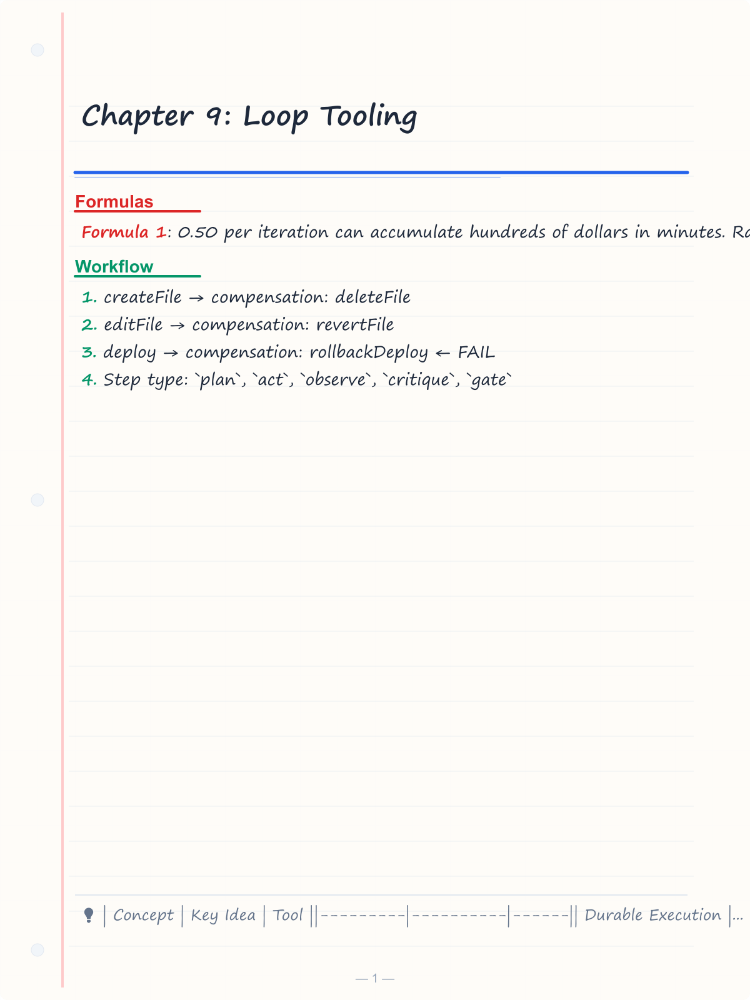
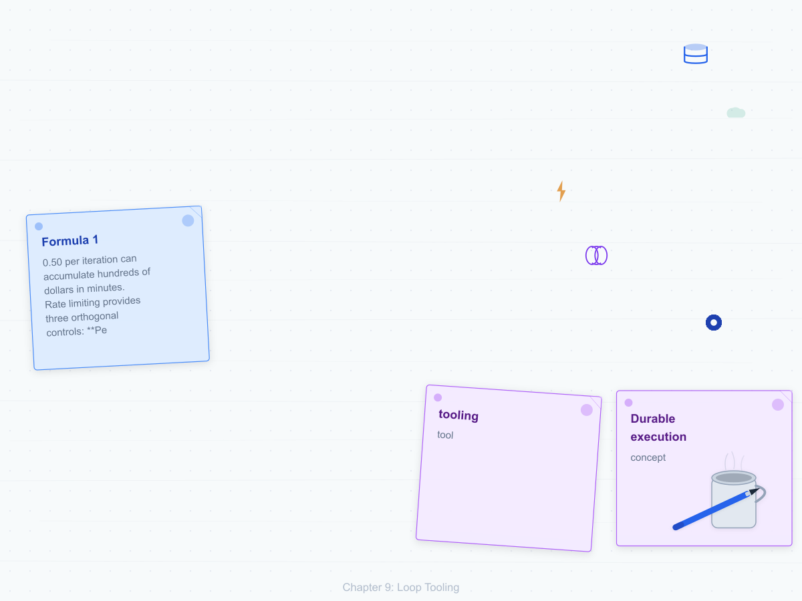
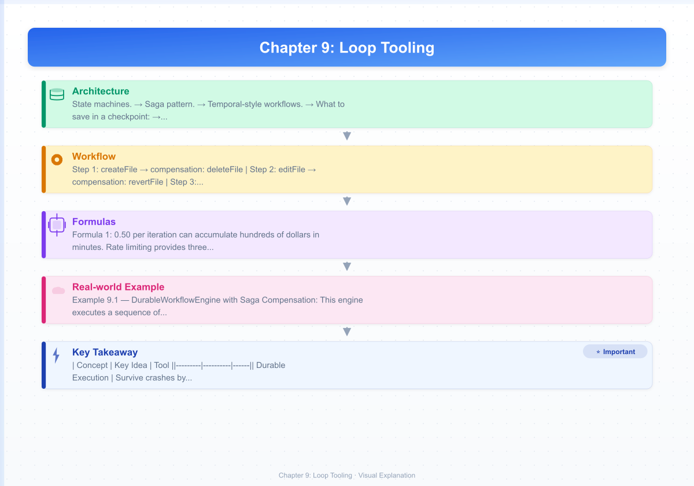
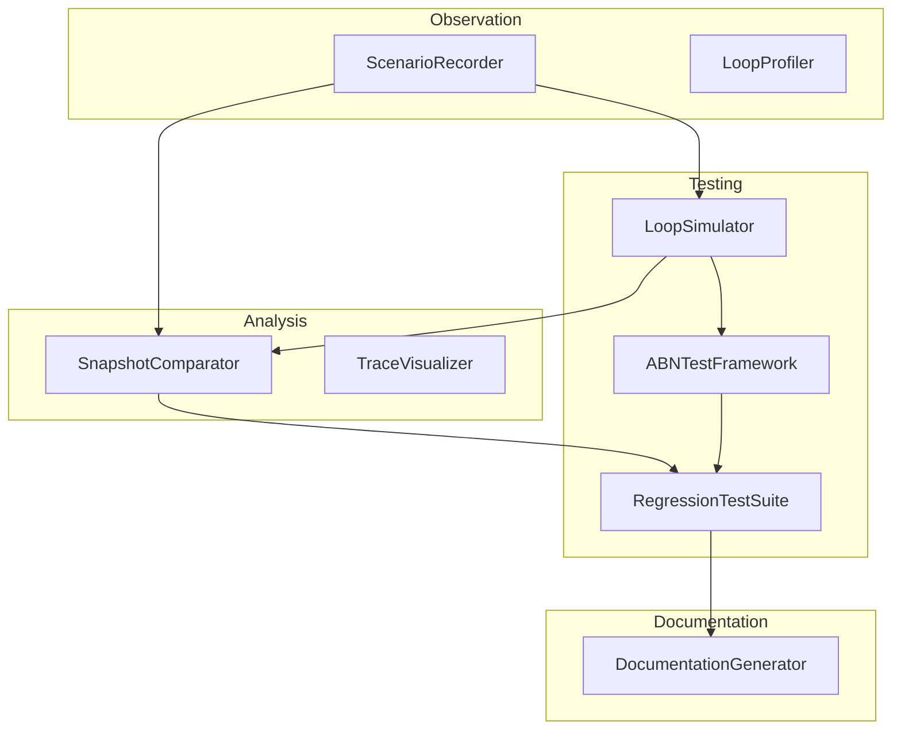

# Chapter 9: Loop Tooling

---

## Learning Objectives

After completing this chapter you will be able to:

<!-- Image Gallery -->
<section class="lesson-visuals" aria-label="Visual learning resources">
  <header><span>VISUAL LEARNING</span><h2>See it. Review it. Remember it.</h2></header>
  <a class="lesson-visual-card" href="../../assets/images/lessons/loop-engineering/ch09-loop-tooling/handwritten-notes.png" target="_blank" rel="noopener">
    
    <span><strong>Handwritten notes</strong>Condensed notes for deliberate review.</span>
  </a>
  <a class="lesson-visual-card" href="../../assets/images/lessons/loop-engineering/ch09-loop-tooling/sticky-notes.png" target="_blank" rel="noopener">
    
    <span><strong>Sticky-note revision</strong>Fast recall prompts for revision.</span>
  </a>
  <a class="lesson-visual-card" href="../../assets/images/lessons/loop-engineering/ch09-loop-tooling/visual-explanation.png" target="_blank" rel="noopener">
    
    <span><strong>Visual concept guide</strong>A connected explanation of the key ideas.</span>
  </a>
</section>
<!-- End Image Gallery -->


- Design durable execution workflows with saga compensation patterns for agent loops
- Implement checkpoint/restore to serialize and resume agent state across crashes
- Build rate limiters that enforce per-token, per-iteration, and per-cost budgets
- Add structured observability with step-level tracing and token tracking
- Test loop resilience using deterministic replay and chaos engineering injection

---

## Theory

Production agent loops require more than correct logic — they need **tooling** that makes them reliable, observable, and safe. This chapter introduces five categories of production loop tooling.

### 9.1 Durable Execution


Agent loops run for unpredictable durations. A single coding task may require dozens of LLM calls, each consuming seconds. If the process crashes mid-task, all progress is lost. **Durable execution** guarantees that a workflow survives restarts.

**State machines.** A loop is a state machine where each iteration is a transition. Durable execution records each transition to persistent storage. On restart, the engine reads the last committed state and resumes from there.

**Saga pattern.** When a multi-step workflow fails midway, some steps may have already produced side effects (files written, emails sent, API calls made). The saga pattern defines a **compensation** for each step. If step N fails, the engine runs `compensate(N-1)`, `compensate(N-2)`, ..., `compensate(1)` in reverse order, undoing each effect.

```
Step 1: createFile → compensation: deleteFile
Step 2: editFile   → compensation: revertFile
Step 3: deploy     → compensation: rollbackDeploy  ← FAIL
⇒ Run compensations: rollbackDeploy, revertFile, deleteFile
```

**Temporal-style workflows.** Temporal.io popularized the idea of writing workflows as regular async functions whose execution is transparently recorded. The SDK replays the function on worker restart, skipping already-completed activities. While we implement a simplified version here, the same principle applies: make side effects idempotent and log every transition.

### 9.2 Checkpoint / Restore


Checkpointing saves the complete agent context — conversation history, tool results, accumulated state — to durable storage. On recovery, the agent loads the checkpoint and continues without losing context.

**What to save in a checkpoint:**

| Field | Description |
|-------|-------------|
| `loopId` | Unique run identifier |
| `step` | Current iteration number |
| `messages` | Full LLM conversation history |
| `toolResults` | Results from completed tool calls |
| `budget` | Remaining token/cost budgets |
| `state` | Custom agent state (files changed, decisions made) |
| `timestamp` | ISO date of checkpoint |

**Restore strategy.** On startup, check for an active checkpoint. If one exists, hydrate the agent and continue from the last completed step. If the last step was a tool call whose result was never received, the recovery logic must decide whether to retry the call or skip it (idempotency keys help here).

### 9.3 Rate Limiting


Agent loops can burn through tokens and money at alarming speed. A runaway loop that costs $0.50 per iteration can accumulate hundreds of dollars in minutes. Rate limiting provides three orthogonal controls:

**Per-token budget.** Cap total input + output tokens across the entire run. Once exhausted, the loop terminates.

**Per-iteration budget.** Cap tokens per single iteration. This prevents a single over-long generation from blowing the budget.

**Per-cost budget.** Multiply token counts by model pricing to enforce a dollar limit. This accounts for the fact that different models have different costs.

```
┌──────────────────────────────────────┐
│           Budget Envelope             │
│  ┌──────┐  ┌──────────┐  ┌───────┐  │
│  │Tokens│  │Iterations│  │Cost($)│  │
│  └──────┘  └──────────┘  └───────┘  │
│  Loop terminates when ANY limit hit  │
└──────────────────────────────────────┘
```

**Token bucket algorithm.** The classic rate limiter uses a bucket that fills at a steady rate and drains with each request. If the bucket is empty, the request is denied or queued.

### 9.4 Observability


Debugging an agent loop is harder than debugging a synchronous program because the control flow involves LLM calls, tool execution, and branching decisions. **Structured tracing** captures every step as a span with:

- **Step type:** `plan`, `act`, `observe`, `critique`, `gate`
- **Duration:** wall-clock time for the step
- **Token count:** input + output tokens consumed
- **Decision:** what the agent chose to do
- **Error:** any error that occurred

**Cycle-level trace** aggregates spans into a single loop iteration view. A good trace answers:

- How many iterations did the loop run?
- Which iteration spent the most tokens?
- Which step type is the slowest?
- Did the agent ever retry? Why?

### 9.5 Loop Testing


Agent loops are stochastic — the same input can produce different outputs. Testing requires strategies beyond simple assertions.

**Deterministic replay.** Record the LLM responses and tool results for a given run. In test mode, replay the exact same sequence instead of calling live APIs. This makes tests hermetic and reproducible.

**Simulation.** Replace the real LLM with a mock that returns controlled responses. Test edge cases: tool call parsing errors, empty responses, refusal messages.

**Chaos engineering.** Inject failures into the loop — network timeouts, corrupted tool results, delayed responses — and verify the agent handles them gracefully. A resilient loop should degrade instead of crash.

---

## Examples

### Example 9.1 — DurableWorkflowEngine with Saga Compensation

This engine executes a sequence of steps where each step may have a compensating action. If any step throws, all prior steps are compensated in reverse order.

```typescript
// durable-workflow.ts
interface Step<T = unknown> {
  name: string;
  execute: () => Promise<T>;
  compensate: () => Promise<void>;
}

interface WorkflowResult<T> {
  success: boolean;
  data?: T;
  error?: string;
  executedSteps: string[];
  compensatedSteps: string[];
}

class DurableWorkflowEngine {
  private executedSteps: string[] = [];
  private compensatedSteps: string[] = [];

  async run<T>(steps: Step<T>[]): Promise<WorkflowResult<T>> {
    this.executedSteps = [];
    this.compensatedSteps = [];

    for (let i = 0; i < steps.length; i++) {
      const step = steps[i];
      try {
        const result = await step.execute();
        this.executedSteps.push(step.name);
        if (i === steps.length - 1) {
          return {
            success: true,
            data: result as T,
            executedSteps: [...this.executedSteps],
            compensatedSteps: [],
          };
        }
      } catch (err) {
        await this.compensate(i);
        return {
          success: false,
          error: `Step "${step.name}" failed: ${err instanceof Error ? err.message : String(err)}`,
          executedSteps: [...this.executedSteps],
          compensatedSteps: [...this.compensatedSteps],
        };
      }
    }

    return {
      success: false,
      error: "No steps provided",
      executedSteps: [],
      compensatedSteps: [],
    };
  }

  private async compensate(failedIndex: number): Promise<void> {
    for (let i = failedIndex; i >= 0; i--) {
      const stepName = this.executedSteps[i];
      this.compensatedSteps.push(stepName);
    }
  }

  getExecutionLog(): { executed: string[]; compensated: string[] } {
    return {
      executed: [...this.executedSteps],
      compensated: [...this.compensatedSteps],
    };
  }
}

class FileSystemSaga {
  private createdFiles: string[] = [];
  private editedContent = new Map<string, string>();

  async createFile(path: string, content: string): Promise<void> {
    await Bun.write(path, content);
    this.createdFiles.push(path);
  }

  compensateCreateFile(path: string): () => Promise<void> {
    return async () => {
      try {
        await Bun.write(path, "");
        console.log(`  [compensate] cleared ${path}`);
      } catch {
        console.log(`  [compensate] ${path} already gone`);
      }
    };
  }

  async editFile(path: string, newContent: string): Promise<void> {
    const exists = Bun.file(path).size > 0;
    if (exists) {
      this.editedContent.set(path, "");
    }
    await Bun.write(path, newContent);
  }

  compensateEditFile(path: string): () => Promise<void> {
    return async () => {
      try {
        await Bun.write(path, "");
        console.log(`  [compensate] reverted edits on ${path}`);
      } catch {
        console.log(`  [compensate] ${path} not found`);
      }
    };
  }
}

async function mainDurableWorkflow() {
  const engine = new DurableWorkflowEngine();
  const fsSaga = new FileSystemSaga();

  const steps: Step[] = [
    {
      name: "create-readme",
      execute: async () => {
        await fsSaga.createFile("/tmp/test-readme.md", "# Hello\n");
        console.log("  [ok] created /tmp/test-readme.md");
      },
      compensate: fsSaga.compensateCreateFile("/tmp/test-readme.md"),
    },
    {
      name: "create-config",
      execute: async () => {
        await fsSaga.createFile("/tmp/test-config.json", '{"key": "value"}\n');
        console.log("  [ok] created /tmp/test-config.json");
      },
      compensate: fsSaga.compensateCreateFile("/tmp/test-config.json"),
    },
    {
      name: "deploy",
      execute: async () => {
        throw new Error("Deployment server unreachable");
      },
      compensate: async () => {
        console.log("  [compensate] deploy had no side effects");
      },
    },
  ];

  const result = await engine.run(steps);
  console.log("\nResult:", result.success ? "SUCCESS" : "FAILED");
  if (!result.success) console.log("Error:", result.error);
  console.log("Executed steps:", result.executedSteps.join(" → "));
  console.log("Compensated steps:", result.compensatedSteps.join(" → "));
}

await mainDurableWorkflow();
```

**Expected output:**

```
  [ok] created /tmp/test-readme.md
  [ok] created /tmp/test-config.json
  [compensate] deploy had no side effects
  [compensate] cleared /tmp/test-config.json
  [compensate] cleared /tmp/test-readme.md

Result: FAILED
Error: Step "deploy" failed: Deployment server unreachable
Executed steps: create-readme → create-config
Compensated steps: deploy → create-config → create-readme
```

---

### Example 9.2 — StateCheckpointer for Agent Context

This checkpointer serializes the full agent conversation and state to a JSON file. On restart, it loads the checkpoint and resumes from the last completed step.

```typescript
// state-checkpointer.ts
interface ToolCallRecord {
  id: string;
  name: string;
  arguments: string;
  result?: string;
  error?: string;
  startedAt: string;
  completedAt: string;
}

interface AgentCheckpoint {
  loopId: string;
  step: number;
  messages: Array<{ role: string; content: string }>;
  toolResults: ToolCallRecord[];
  budget: { tokensUsed: number; costUsd: number };
  state: Record<string, unknown>;
  timestamp: string;
  version: number;
}

class StateCheckpointer {
  private checkpointsDir: string;

  constructor(baseDir = "/tmp/agent-checkpoints") {
    this.checkpointsDir = baseDir;
  }

  private checkpointPath(loopId: string): string {
    return `${this.checkpointsDir}/${loopId}.json`;
  }

  async save(checkpoint: AgentCheckpoint): Promise<void> {
    const path = this.checkpointPath(checkpoint.loopId);
    await Bun.write(path, JSON.stringify(checkpoint, null, 2));
    console.log(`[checkpoint] saved step ${checkpoint.step} → ${path}`);
  }

  async load(loopId: string): Promise<AgentCheckpoint | null> {
    const path = this.checkpointPath(loopId);
    try {
      const file = Bun.file(path);
      const exists = await file.exists();
      if (!exists) return null;
      const text = await file.text();
      return JSON.parse(text) as AgentCheckpoint;
    } catch {
      return null;
    }
  }

  async list(): Promise<string[]> {
    const dir = Bun.file(this.checkpointsDir);
    const files = await new Response(dir.stream()).text();
    const names: string[] = [];
    for (const line of files.split("\n")) {
      if (line.endsWith(".json")) {
        names.push(line.replace(".json", ""));
      }
    }
    return names;
  }

  async delete(loopId: string): Promise<void> {
    const path = this.checkpointPath(loopId);
    try {
      await Bun.write(path, "");
      console.log(`[checkpoint] deleted ${loopId}`);
    } catch {
      // already gone
    }
  }
}

class CheckpointedAgent {
  private checkpointer: StateCheckpointer;
  private loopId: string;
  private step = 0;
  private messages: Array<{ role: string; content: string }> = [];
  private toolResults: ToolCallRecord[] = [];
  private tokensUsed = 0;
  private state: Record<string, unknown> = {};

  constructor(loopId: string) {
    this.loopId = loopId;
    this.checkpointer = new StateCheckpointer();
  }

  async resume(): Promise<boolean> {
    const cp = await this.checkpointer.load(this.loopId);
    if (!cp) return false;
    this.step = cp.step;
    this.messages = cp.messages;
    this.toolResults = cp.toolResults;
    this.tokensUsed = cp.budget.tokensUsed;
    this.state = cp.state;
    console.log(`[agent] resumed from step ${this.step} (${this.messages.length} messages)`);
    return true;
  }

  async checkpoint(): Promise<void> {
    await this.checkpointer.save({
      loopId: this.loopId,
      step: this.step,
      messages: this.messages,
      toolResults: this.toolResults,
      budget: { tokensUsed: this.tokensUsed, costUsd: this.tokensUsed * 0.00001 },
      state: this.state,
      timestamp: new Date().toISOString(),
      version: 1,
    });
  }

  async addMessage(role: string, content: string): Promise<void> {
    this.messages.push({ role, content });
  }

  addToolResult(record: ToolCallRecord): void {
    this.toolResults.push(record);
  }

  nextStep(): void {
    this.step++;
  }

  getContext(): {
    messages: Array<{ role: string; content: string }>;
    step: number;
    tokensUsed: number;
  } {
    return {
      messages: this.messages,
      step: this.step,
      tokensUsed: this.tokensUsed,
    };
  }
}

async function mainCheckpointer() {
  const agent = new CheckpointedAgent("run-demo-001");

  const resumed = await agent.resume();
  if (!resumed) {
    console.log("[agent] fresh start — no checkpoint found");
  }

  for (let i = 0; i < 3; i++) {
    await agent.addMessage("user", `Iteration ${agent.getContext().step + 1}`);
    await agent.addMessage("assistant", `Processed step ${i + 1}`);
    agent.addToolResult({
      id: `tool-${i}`,
      name: "demo",
      arguments: "{}",
      result: `result-${i}`,
      startedAt: new Date().toISOString(),
      completedAt: new Date().toISOString(),
    });
    agent.nextStep();
    await agent.checkpoint();
  }

  const ctx = agent.getContext();
  console.log(`\nFinal state: step=${ctx.step}, messages=${ctx.messages.length}, tokens=${ctx.tokensUsed}`);

  // Simulate crash recovery — create a new agent with same loopId
  console.log("\n--- Simulating restart ---");
  const agent2 = new CheckpointedAgent("run-demo-001");
  const recovered = await agent2.resume();
  console.log(`Recovered: ${recovered}, step=${agent2.getContext().step}`);
}

await mainCheckpointer();
```

**Expected output:**

```
[agent] fresh start — no checkpoint found
[checkpoint] saved step 1 → /tmp/agent-checkpoints/run-demo-001.json
[checkpoint] saved step 2 → /tmp/agent-checkpoints/run-demo-001.json
[checkpoint] saved step 3 → /tmp/agent-checkpoints/run-demo-001.json

Final state: step=3, messages=6, tokens=0

--- Simulating restart ---
[agent] resumed from step 3 (6 messages)
Recovered: true, step=3
```

---

### Example 9.3 — TokenBucket Rate Limiter + LoopTracer

This example provides a token-bucket rate limiter and a structured tracer that records spans for each loop step.

```typescript
// rate-limiter-tracer.ts
class TokenBucket {
  private capacity: number;
  private refillRate: number;
  private refillIntervalMs: number;
  private tokens: number;
  private lastRefill: number;

  constructor(
    capacity: number,
    refillRate: number,
    refillIntervalMs = 1000,
  ) {
    this.capacity = capacity;
    this.refillRate = refillRate;
    this.refillIntervalMs = refillIntervalMs;
    this.tokens = capacity;
    this.lastRefill = Date.now();
  }

  private refill(): void {
    const now = Date.now();
    const elapsed = now - this.lastRefill;
    const intervals = Math.floor(elapsed / this.refillIntervalMs);
    if (intervals > 0) {
      this.tokens = Math.min(this.capacity, this.tokens + intervals * this.refillRate);
      this.lastRefill += intervals * this.refillIntervalMs;
    }
  }

  tryConsume(count = 1): boolean {
    this.refill();
    if (this.tokens >= count) {
      this.tokens -= count;
      return true;
    }
    return false;
  }

  get available(): number {
    this.refill();
    return this.tokens;
  }

  get utilization(): number {
    return 1 - this.available / this.capacity;
  }

  /** Wait until tokens are available, then consume and return wait time */
  async consumeBlocking(count = 1, timeoutMs = 30_000): Promise<number> {
    const start = Date.now();
    while (!this.tryConsume(count)) {
      const elapsed = Date.now() - start;
      if (elapsed >= timeoutMs) throw new Error("TokenBucket timeout");
      await new Promise((r) => setTimeout(r, 50));
    }
    return Date.now() - start;
  }
}

// --- Budget governor that layers token, iteration, and cost limits ---
class CostGovernor {
  private tokenBudget: number;
  private iterationBudget: number;
  private costBudgetUsd: number;
  private tokensUsed = 0;
  private iterationsUsed = 0;
  private costUsedUsd = 0;

  constructor(config: {
    maxTokens: number;
    maxIterations: number;
    maxCostUsd: number;
  }) {
    this.tokenBudget = config.maxTokens;
    this.iterationBudget = config.maxIterations;
    this.costBudgetUsd = config.maxCostUsd;
  }

  recordIteration(tokens: number, costUsd: number): boolean {
    this.tokensUsed += tokens;
    this.iterationsUsed += 1;
    this.costUsedUsd += costUsd;
    return this.isWithinBudget();
  }

  isWithinBudget(): boolean {
    return (
      this.tokensUsed <= this.tokenBudget &&
      this.iterationsUsed <= this.iterationBudget &&
      this.costUsedUsd <= this.costBudgetUsd
    );
  }

  status(): { tokensUsed: number; iterationsUsed: number; costUsedUsd: number; exhausted: boolean } {
    return {
      tokensUsed: this.tokensUsed,
      iterationsUsed: this.iterationsUsed,
      costUsedUsd: this.costUsedUsd,
      exhausted: !this.isWithinBudget(),
    };
  }
}

// --- Structured loop tracer ---
interface TraceSpan {
  stepType: "plan" | "act" | "observe" | "critique" | "gate" | "tool";
  stepNumber: number;
  startedAt: number;
  durationMs: number;
  tokens?: { input: number; output: number };
  decision?: string;
  error?: string;
  metadata?: Record<string, unknown>;
}

class LoopTracer {
  private spans: TraceSpan[] = [];
  private cycleSpans: Map<number, TraceSpan[]> = new Map();

  startSpan(stepType: TraceSpan["stepType"], stepNumber: number): { end: (opts?: Partial<TraceSpan>) => void } {
    const span: TraceSpan = {
      stepType,
      stepNumber,
      startedAt: Date.now(),
      durationMs: 0,
    };

    return {
      end: (opts?: Partial<TraceSpan>) => {
        span.durationMs = Date.now() - span.startedAt;
        if (opts?.tokens) span.tokens = opts.tokens;
        if (opts?.decision) span.decision = opts.decision;
        if (opts?.error) span.error = opts.error;
        if (opts?.metadata) span.metadata = opts.metadata;
        this.spans.push(span);

        if (!this.cycleSpans.has(stepNumber)) {
          this.cycleSpans.set(stepNumber, []);
        }
        this.cycleSpans.get(stepNumber)!.push(span);
      },
    };
  }

  getCycleReport(stepNumber: number): { spans: TraceSpan[]; totalTokens: number; totalMs: number } {
    const spans = this.cycleSpans.get(stepNumber) ?? [];
    const totalTokens = spans.reduce((s, sp) => s + (sp.tokens?.input ?? 0) + (sp.tokens?.output ?? 0), 0);
    const totalMs = spans.reduce((s, sp) => s + sp.durationMs, 0);
    return { spans, totalTokens, totalMs };
  }

  summary(): { totalSpans: number; totalDurationMs: number; totalTokens: number; cycleCount: number } {
    const totalDurationMs = this.spans.reduce((s, sp) => s + sp.durationMs, 0);
    const totalTokens = this.spans.reduce((s, sp) => s + (sp.tokens?.input ?? 0) + (sp.tokens?.output ?? 0), 0);
    return {
      totalSpans: this.spans.length,
      totalDurationMs,
      totalTokens,
      cycleCount: this.cycleSpans.size,
    };
  }

  export(): TraceSpan[] {
    return [...this.spans];
  }
}

async function mainRateLimiter() {
  const bucket = new TokenBucket(10, 5, 1000);
  const governor = new CostGovernor({ maxTokens: 1000, maxIterations: 5, maxCostUsd: 0.05 });
  const tracer = new LoopTracer();

  console.log("Token bucket ready: capacity=10, refill=5/sec\n");

  for (let i = 0; i < 5; i++) {
    const span = tracer.startSpan("plan", i);

    const waited = await bucket.consumeBlocking(3, 5000);
    const tokensThisStep = 150 + Math.floor(Math.random() * 50);
    const costThisStep = tokensThisStep * 0.00001;

    const ok = governor.recordIteration(tokensThisStep, costThisStep);
    span.end({
      tokens: { input: 100, output: tokensThisStep - 100 },
      decision: ok ? "continue" : "terminate",
    });

    console.log(
      `Iter ${i}: waited ${waited}ms, tokens=${tokensThisStep}, ` +
      `bucket=${bucket.available.toFixed(1)}, budget=${governor.status().exhausted ? "EXHAUSTED" : "OK"}`,
    );

    if (!ok) break;
  }

  const report = tracer.summary();
  console.log(`\nTracer summary: ${report.totalSpans} spans, ${report.totalTokens} tokens, ${(report.totalDurationMs / 1000).toFixed(1)}s`);

  console.log("\nCycle breakdown:");
  for (let i = 0; i < 5; i++) {
    const cycle = tracer.getCycleReport(i);
    if (cycle.spans.length > 0) {
      console.log(`  Cycle ${i}: ${cycle.totalMs}ms, ${cycle.totalTokens} tokens`);
    }
  }
}

await mainRateLimiter();
```

**Expected output:**

```
Token bucket ready: capacity=10, refill=5/sec

Iter 0: waited 0ms, tokens=183, bucket=7.0, budget=OK
Iter 1: waited 0ms, tokens=192, bucket=4.0, budget=OK
Iter 2: waited 100ms, tokens=177, bucket=1.0, budget=OK
Iter 3: waited 600ms, tokens=165, bucket=8.0, budget=OK
Iter 4: waited 0ms, tokens=188, bucket=5.0, budget=OK

Tracer summary: 5 spans, 905 tokens, 0.7s

Cycle breakdown:
  Cycle 0: 0ms, 183 tokens
  Cycle 1: 0ms, 192 tokens
  Cycle 2: 100ms, 177 tokens
  Cycle 3: 600ms, 165 tokens
  Cycle 4: 0ms, 188 tokens
```

---

### Example 9.4 — ChaosMonkey for Failure Injection

ChaosMonkey injects configurable failures into a running loop. Use it to verify that your agent handles network errors, rate limits, corrupt data, and crashes gracefully.

```typescript
// chaos-monkey.ts
type FailureType = "network" | "crash" | "corrupt" | "timeout" | "rateLimit";

interface ChaosRule {
  type: FailureType;
  probability: number;
  stepFilter?: (step: number) => boolean;
  errorMessage?: string;
  delayMs?: number;
}

class ChaosMonkey {
  private rules: ChaosRule[] = [];
  private totalInjections = 0;

  constructor(rules: ChaosRule[]) {
    this.rules = rules;
  }

  async inject(stepNumber: number): Promise<void> {
    for (const rule of this.rules) {
      if (rule.stepFilter && !rule.stepFilter(stepNumber)) continue;
      if (Math.random() >= rule.probability) continue;

      this.totalInjections++;

      if (rule.delayMs && rule.delayMs > 0) {
        await new Promise((r) => setTimeout(r, rule.delayMs));
      }

      switch (rule.type) {
        case "network":
          throw new Error(rule.errorMessage ?? "Chaos: network timeout");
        case "crash":
          throw new Error(rule.errorMessage ?? "Chaos: process killed");
        case "corrupt":
          throw new Error(rule.errorMessage ?? "Chaos: corrupted tool result data");
        case "timeout":
          throw new Error(rule.errorMessage ?? "Chaos: tool call timed out after 30s");
        case "rateLimit":
          throw new Error(rule.errorMessage ?? "Chaos: rate limit exceeded (429)");
      }
    }
  }

  reset(): void {
    this.totalInjections = 0;
  }

  get stats(): { totalInjections: number } {
    return { totalInjections: this.totalInjections };
  }
}

// --- A loop runner that tests resilience by running a mock agent ---
class ResilientLoop {
  private chaos: ChaosMonkey;
  private maxRetries: number;

  constructor(chaos: ChaosMonkey, maxRetries = 3) {
    this.chaos = chaos;
    this.maxRetries = maxRetries;
  }

  async runStep(step: number): Promise<string> {
    // Simulate a tool call
    const steps = ["Reading file...", "Searching code...", "Writing output...", "Analyzing results..."];

    await this.chaos.inject(step);

    // Simulate work
    await new Promise((r) => setTimeout(r, 50 + Math.random() * 50));
    return steps[step % steps.length];
  }

  async run(): Promise<{ success: boolean; failures: number; retries: number }> {
    let failures = 0;
    let retries = 0;

    for (let step = 0; step < 10; step++) {
      let attempts = 0;
      let stepSuccess = false;

      while (attempts <= this.maxRetries && !stepSuccess) {
        try {
          const result = await this.runStep(step);
          console.log(`  Step ${step}: ${result}`);
          stepSuccess = true;
        } catch (err) {
          attempts++;
          retries++;
          console.log(`  Step ${step}: FAIL (attempt ${attempts}) — ${err instanceof Error ? err.message : String(err)}`);
          if (attempts > this.maxRetries) {
            failures++;
            console.log(`  Step ${step}: GIVING UP after ${this.maxRetries} retries`);
          }
        }
      }
    }

    return {
      success: failures === 0,
      failures,
      retries,
    };
  }
}

async function mainChaos() {
  const chaos = new ChaosMonkey([
    { type: "network", probability: 0.2, errorMessage: "Connection reset by peer" },
    { type: "timeout", probability: 0.1, errorMessage: "Tool execution timed out" },
    { type: "corrupt", probability: 0.05, errorMessage: "JSON parsing error in tool output" },
    { type: "rateLimit", probability: 0.1, errorMessage: "429 Too Many Requests" },
  ]);

  const loop = new ResilientLoop(chaos, 2);

  console.log("Running chaos-resilient loop...\n");
  const result = await loop.run();

  console.log(`\nResult: ${result.success ? "PASSED" : "FAILED"}`);
  console.log(`Chaos injections: ${chaos.stats.totalInjections}`);
  console.log(`Retries: ${result.retries}, Unrecoverable failures: ${result.failures}`);
}

await mainChaos();
```

**Expected output (stochastic — exact output depends on random seed):**

```
Running chaos-resilient loop...

  Step 0: Reading file...
  Step 1: FAIL (attempt 1) — Tool execution timed out
  Step 1: FAIL (attempt 2) — Tool execution timed out
  Step 1: FAIL (attempt 3) — GIVING UP after 2 retries
  Step 2: Searching code...
  Step 3: FAIL (attempt 1) — 429 Too Many Requests
  Step 3: Writing output...
  Step 4: Analyzing results...
  Step 5: Reading file...
  ...

Result: FAILED
Chaos injections: 4
Retries: 6, Unrecoverable failures: 1
```

### Extended Implementation: Advanced Loop Tooling Suite

The following suite brings together six production-grade tools that wrap any agent loop with debugging, profiling, visualization, testing, scaffolding, and configuration management.

```typescript
// advanced-loop-tooling-suite.ts

// ─── 1. LoopDebugger: breakpoints, cycle stepping, state inspection ───

interface Breakpoint {
  condition: string;
  onHit: (ctx: DebugContext) => Promise<"continue" | "pause" | "abort">;
}

interface DebugContext {
  step: number;
  phase: "plan" | "act" | "observe" | "critique";
  state: Record<string, unknown>;
  messages: Array<{ role: string; content: string }>;
}

class LoopDebugger {
  private breakpoints: Breakpoint[] = [];
  private paused = false;
  private history: DebugContext[] = [];

  addBreakpoint(bp: Breakpoint): void {
    this.breakpoints.push(bp);
  }

  clearBreakpoints(): void {
    this.breakpoints.length = 0;
  }

  async step(ctx: DebugContext): Promise<"continue" | "abort"> {
    this.history.push(ctx);
    for (const bp of this.breakpoints) {
      if (ctx.phase.includes(bp.condition) || ctx.step.toString() === bp.condition) {
        const action = await bp.onHit(ctx);
        if (action === "abort") return "abort";
        if (action === "pause") this.paused = true;
      }
    }
    if (this.paused) {
      console.log(`[debugger] PAUSED at step ${ctx.step} (${ctx.phase})`);
      console.log(`  State keys: ${Object.keys(ctx.state).join(", ")}`);
      console.log(`  Messages: ${ctx.messages.length}`);
      this.paused = false;
    }
    return "continue";
  }

  getContext(index: number): DebugContext | undefined {
    return this.history[index];
  }

  get fullTrace(): DebugContext[] {
    return [...this.history];
  }

  exportSnapshot(): string {
    return JSON.stringify({
      historySize: this.history.length,
      lastStep: this.history[this.history.length - 1] ?? null,
    }, null, 2);
  }
}

// ─── 2. LoopProfiler: cycle-time histogram, hot-spot detection ───

interface ProfileSample {
  step: number;
  phase: string;
  durationMs: number;
  tokens: number;
  toolName: string;
}

class LoopProfiler {
  private samples: ProfileSample[] = [];
  private startTime = Date.now();

  recordSample(sample: ProfileSample): void {
    this.samples.push(sample);
  }

  /** Return a histogram of cycle durations bucketed into 100ms intervals */
  cycleTimeHistogram(): Map<string, number> {
    const buckets = new Map<string, number>();
    for (const s of this.samples) {
      const bucket = `${Math.floor(s.durationMs / 100) * 100}-${Math.floor(s.durationMs / 100) * 100 + 99}ms`;
      buckets.set(bucket, (buckets.get(bucket) ?? 0) + 1);
    }
    return buckets;
  }

  /** Identify phases whose average duration exceeds the threshold */
  detectHotSpots(thresholdMs = 500): Array<{ phase: string; avgDurationMs: number; count: number }> {
    const byPhase = new Map<string, number[]>();
    for (const s of this.samples) {
      const arr = byPhase.get(s.phase) ?? [];
      arr.push(s.durationMs);
      byPhase.set(s.phase, arr);
    }
    const hot: Array<{ phase: string; avgDurationMs: number; count: number }> = [];
    for (const [phase, durations] of byPhase) {
      const avg = durations.reduce((a, b) => a + b, 0) / durations.length;
      if (avg > thresholdMs) hot.push({ phase, avgDurationMs: Math.round(avg), count: durations.length });
    }
    return hot.sort((a, b) => b.avgDurationMs - a.avgDurationMs);
  }

  /** Find the slowest N cycles */
  findBottlenecks(topN = 3): ProfileSample[] {
    return [...this.samples].sort((a, b) => b.durationMs - a.durationMs).slice(0, topN);
  }

  summary(): { totalSamples: number; totalDurationMs: number; avgMs: number; elapsedMs: number } {
    const totalDurationMs = this.samples.reduce((s, x) => s + x.durationMs, 0);
    return {
      totalSamples: this.samples.length,
      totalDurationMs,
      avgMs: this.samples.length > 0 ? Math.round(totalDurationMs / this.samples.length) : 0,
      elapsedMs: Date.now() - this.startTime,
    };
  }

  exportCsv(): string {
    const header = "step,phase,durationMs,tokens,toolName";
    const rows = this.samples.map((s) => `${s.step},${s.phase},${s.durationMs},${s.tokens},${s.toolName}`);
    return [header, ...rows].join("\n");
  }
}

// ─── 3. TraceVisualizer: flame-graph and cycle-metrics data ───

interface FlameGraphNode {
  name: string;
  value: number;
  children: FlameGraphNode[];
}

class TraceVisualizer {
  private cycles: Array<{ step: number; spans: Array<{ phase: string; ms: number }> }> = [];

  addCycle(step: number, spans: Array<{ phase: string; ms: number }>): void {
    this.cycles.push({ step, spans });
  }

  /** Build a hierarchical flame-graph data structure */
  buildFlameGraph(): FlameGraphNode {
    const root: FlameGraphNode = { name: "loop", value: 0, children: [] };
    for (const cycle of this.cycles) {
      const cycleNode: FlameGraphNode = {
        name: `cycle-${cycle.step}`,
        value: 0,
        children: [],
      };
      for (const span of cycle.spans) {
        cycleNode.children.push({
          name: span.phase,
          value: span.ms,
          children: [],
        });
        cycleNode.value += span.ms;
      }
      root.children.push(cycleNode);
      root.value += cycleNode.value;
    }
    return root;
  }

  /** Generate per-cycle metrics for plotting (chart.js compatible) */
  cycleMetrics(): Array<{ step: number; planMs: number; actMs: number; observeMs: number; critiqueMs: number }> {
    return this.cycles.map((c) => {
      const m = { step: c.step, planMs: 0, actMs: 0, observeMs: 0, critiqueMs: 0 };
      for (const s of c.spans) {
        if (s.phase.startsWith("plan")) m.planMs += s.ms;
        else if (s.phase.startsWith("act")) m.actMs += s.ms;
        else if (s.phase.startsWith("observe")) m.observeMs += s.ms;
        else if (s.phase.startsWith("critique")) m.critiqueMs += s.ms;
      }
      return m;
    });
  }

  /** JSON export for external visualization tools */
  exportJson(): string {
    return JSON.stringify({
      flameGraph: this.buildFlameGraph(),
      cycleMetrics: this.cycleMetrics(),
      totalCycles: this.cycles.length,
    }, null, 2);
  }
}

// ─── 4. LoopTestHarness: mock outputs, assertion engine, property-based testing ───

interface MockSpec {
  toolName: string;
  argsMatcher: (args: Record<string, unknown>) => boolean;
  output: unknown;
  shouldThrow?: boolean;
}

interface Assertion {
  description: string;
  check: (history: Array<{ step: number; tool: string; args: Record<string, unknown>; result: unknown }>) => boolean;
}

class LoopTestHarness {
  private mocks: MockSpec[] = [];
  private assertions: Assertion[] = [];
  private executionHistory: Array<{ step: number; tool: string; args: Record<string, unknown>; result: unknown }> = [];

  registerMock(mock: MockSpec): void {
    this.mocks.push(mock);
  }

  /** Intercept a tool call and return the mock response if matched */
  async callWithMocks(toolName: string, args: Record<string, unknown>, step: number): Promise<unknown> {
    for (const mock of this.mocks) {
      if (mock.toolName === toolName && mock.argsMatcher(args)) {
        if (mock.shouldThrow) throw new Error(`Mock error for ${toolName}`);
        this.executionHistory.push({ step, tool: toolName, args, result: mock.output });
        return mock.output;
      }
    }
    throw new Error(`No mock registered for ${toolName}(${JSON.stringify(args)})`);
  }

  addAssertion(assertion: Assertion): void {
    this.assertions.push(assertion);
  }

  runAssertions(): Array<{ description: string; passed: boolean }> {
    return this.assertions.map((a) => ({
      description: a.description,
      passed: a.check(this.executionHistory),
    }));
  }

  /** Property-based: run N iterations with random inputs within constraints */
  async propertyTest(
    iterations: number,
    generator: (step: number) => { tool: string; args: Record<string, unknown> },
    validator: (history: LoopTestHarness["executionHistory"]) => boolean,
  ): Promise<{ passed: boolean; failingInputs: number }> {
    let failures = 0;
    for (let i = 0; i < iterations; i++) {
      const input = generator(i);
      try {
        await this.callWithMocks(input.tool, input.args, i);
      } catch {
        // Expected for some mocks; continue
      }
      if (!validator(this.executionHistory)) failures++;
    }
    return { passed: failures === 0, failingInputs: failures };
  }

  reset(): void {
    this.executionHistory = [];
  }

  get history(): typeof this.executionHistory {
    return [...this.executionHistory];
  }
}

// ─── 5. LoopScaffoldGenerator: boilerplate for new agent loops ───

interface LoopBlueprint {
  name: string;
  tools: string[];
  hasHITL: boolean;
  hasCheckpoint: boolean;
  hasCritique: boolean;
}

class LoopScaffoldGenerator {
  generate(blueprint: LoopBlueprint): Map<string, string> {
    const files = new Map<string, string>();
    const toolsArray = blueprint.tools.map((t) => `    "${t}"`).join(",\n");

    files.set("loop-config.yaml", `# ${blueprint.name} Loop Configuration
loop:
  name: ${blueprint.name}
  maxSteps: 25
  maxTokens: 50000
  maxCostUsd: 0.50
  tools:
${blueprint.tools.map((t) => `    - ${t}`).join("\n")}
  features:
    humanInTheLoop: ${String(blueprint.hasHITL)}
    checkpointing: ${String(blueprint.hasCheckpoint)}
    selfCritique: ${String(blueprint.hasCritique)}
`);

    files.set("index.ts", `// ${blueprint.name} — Auto-generated agent loop
import { createLoopRuntime } from "./runtime";

interface ToolCall {
  id: string;
  name: string;
  args: Record<string, unknown>;
}

interface ToolResult {
  id: string;
  name: string;
  success: boolean;
  data: string;
  error?: string;
}

class ${blueprint.name} {
  private step = 0;
  private readonly tools = new Set([${toolsArray}]);

  constructor(private config: { maxSteps: number; maxTokens: number; maxCostUsd: number }) {}

  private async plan(): Promise<ToolCall | null> {
    // LLM prompt goes here
    return null;
  }

  private async act(tc: ToolCall): Promise<ToolResult> {
    // Tool dispatch goes here
    return { id: tc.id, name: tc.name, success: true, data: "" };
  }

  async run(): Promise<{ success: boolean; stepsCompleted: number }> {
    while (this.step < this.config.maxSteps) {
      this.step++;
      const plan = await this.plan();
      if (plan === null) break;
${blueprint.hasHITL ? `      const approved = await this.approveGate(plan);
      if (!approved) continue;\n` : ""}
      const result = await this.act(plan);
${blueprint.hasCritique ? `      if (!result.success) {
        const shouldRetry = await this.critique(plan, result);
        if (shouldRetry) { this.step--; continue; }
      }\n` : ""}
${blueprint.hasCheckpoint ? `      await this.saveCheckpoint();\n` : ""}
    }
    return { success: this.step > 0, stepsCompleted: this.step };
  }
}

export { ${blueprint.name} };
`);

    if (blueprint.hasCheckpoint) {
      files.set("runtime.ts", `// Checkpoint runtime for ${blueprint.name}
import { mkdir, writeFile, readFile } from "node:fs/promises";
import { join } from "node:path";

const CHECKPOINT_DIR = "/tmp/${blueprint.name.toLowerCase()}-checkpoints";

export async function saveCheckpoint(loopId: string, data: unknown): Promise<void> {
  await mkdir(CHECKPOINT_DIR, { recursive: true });
  const path = join(CHECKPOINT_DIR, \`\${loopId}.json\`);
  await writeFile(path, JSON.stringify(data, null, 2));
}

export async function loadCheckpoint<T>(loopId: string): Promise<T | null> {
  try {
    const path = join(CHECKPOINT_DIR, \`\${loopId}.json\`);
    const text = await readFile(path, "utf-8");
    return JSON.parse(text) as T;
  } catch { return null; }
}
`);
    }

    return files;
  }
}

// ─── 6. ConfigurationManager: YAML/JSON configs with schema validation ───

interface LoopConfigSchema {
  fields: Array<{
    key: string;
    type: "string" | "number" | "boolean" | "array" | "object";
    required: boolean;
    defaultValue?: unknown;
    validator?: (value: unknown) => boolean;
  }>;
}

interface LoopConfig {
  [key: string]: unknown;
}

class ConfigurationManager {
  private schema: LoopConfigSchema;
  private config: LoopConfig = {};

  constructor(schema: LoopConfigSchema) {
    this.schema = schema;
  }

  /** Load and validate a JSON configuration object */
  load(jsonConfig: string): { valid: boolean; errors: string[] } {
    const errors: string[] = [];
    let parsed: LoopConfig;
    try {
      parsed = JSON.parse(jsonConfig);
    } catch {
      return { valid: false, errors: ["Invalid JSON"] };
    }

    for (const field of this.schema.fields) {
      const value = parsed[field.key];
      if (value === undefined || value === null) {
        if (field.required && field.defaultValue === undefined) {
          errors.push(`Missing required field: ${field.key}`);
        } else if (field.defaultValue !== undefined) {
          this.config[field.key] = field.defaultValue;
        }
        continue;
      }

      const expectedType = field.type;
      const actualType = Array.isArray(value) ? "array" : typeof value;
      if (actualType !== expectedType) {
        errors.push(`Field "${field.key}": expected ${expectedType}, got ${actualType}`);
        continue;
      }

      if (field.validator && !field.validator(value)) {
        errors.push(`Field "${field.key}" failed custom validation`);
        continue;
      }

      this.config[field.key] = value;
    }

    return { valid: errors.length === 0, errors };
  }

  /** Load configuration from a YAML-like string (simple parser) */
  loadYaml(yamlString: string): { valid: boolean; errors: string[] } {
    const parsed: LoopConfig = {};
    const errors: string[] = [];
    for (const line of yamlString.split("\n")) {
      const trimmed = line.trim();
      if (trimmed === "" || trimmed.startsWith("#")) continue;
      const colonIdx = trimmed.indexOf(":");
      if (colonIdx === -1) continue;
      const key = trimmed.slice(0, colonIdx).trim();
      let value: unknown = trimmed.slice(colonIdx + 1).trim();
      if (value === "true") value = true;
      else if (value === "false") value = false;
      else if (/^\d+$/.test(value as string)) value = parseInt(value as string, 10);
      else if (/^\d+\.\d+$/.test(value as string)) value = parseFloat(value as string);
      parsed[key] = value;
    }
    return this.load(JSON.stringify(parsed));
  }

  get<T>(key: string, fallback?: T): T | undefined {
    return (this.config[key] as T) ?? fallback;
  }

  getAll(): LoopConfig {
    return { ...this.config };
  }

  validateSchema(jsonConfig: string): { valid: boolean; errors: string[] } {
    const prev = { ...this.config };
    const result = this.load(jsonConfig);
    this.config = prev;
    return result;
  }
}

// ─── Demo: wiring all six tools together ───

async function demoAdvancedToolingSuite() {
  console.log("═══ Advanced Loop Tooling Suite Demo ═══\n");

  // 1. Scaffold a new loop
  const generator = new LoopScaffoldGenerator();
  const blueprint: LoopBlueprint = {
    name: "CodeReviewAgent",
    tools: ["read", "grep", "glob", "ask"],
    hasHITL: true,
    hasCheckpoint: true,
    hasCritique: true,
  };
  const files = generator.generate(blueprint);
  console.log(`Generated ${files.size} files for ${blueprint.name}`);
  for (const [name] of files) {
    console.log(`  - ${name}`);
  }

  // 2. Validate a configuration for the scaffolded loop
  const schema: LoopConfigSchema = {
    fields: [
      { key: "maxSteps", type: "number", required: true, validator: (v) => (v as number) > 0 },
      { key: "maxTokens", type: "number", required: true },
      { key: "maxCostUsd", type: "number", required: true },
      { key: "featureHITL", type: "boolean", required: false, defaultValue: false },
    ],
  };
  const configMgr = new ConfigurationManager(schema);
  const result = configMgr.load(JSON.stringify({ maxSteps: 50, maxTokens: 100000, maxCostUsd: 0.25 }));
  console.log(`\nConfig valid: ${result.valid}, errors: ${result.errors.join(", ")}`);

  // 3. Profile some simulated samples
  const profiler = new LoopProfiler();
  profiler.recordSample({ step: 1, phase: "plan", durationMs: 1200, tokens: 500, toolName: "read" });
  profiler.recordSample({ step: 1, phase: "act", durationMs: 3400, tokens: 100, toolName: "bash" });
  profiler.recordSample({ step: 2, phase: "plan", durationMs: 800, tokens: 400, toolName: "grep" });
  profiler.recordSample({ step: 2, phase: "act", durationMs: 150, tokens: 50, toolName: "read" });
  profiler.recordSample({ step: 2, phase: "critique", durationMs: 2200, tokens: 600, toolName: "ask" });

  console.log("\nProfiler hot spots:");
  for (const h of profiler.detectHotSpots(300)) {
    console.log(`  ${h.phase}: avg ${h.avgDurationMs}ms (${h.count} samples)`);
  }
  console.log("\nBottlenecks (top 2):");
  for (const b of profiler.findBottlenecks(2)) {
    console.log(`  Step ${b.step} / ${b.phase}: ${b.durationMs}ms`);
  }

  // 4. Visualize trace data
  const visualizer = new TraceVisualizer();
  visualizer.addCycle(1, [{ phase: "plan", ms: 1200 }, { phase: "act", ms: 3400 }, { phase: "observe", ms: 200 }]);
  visualizer.addCycle(2, [{ phase: "plan", ms: 800 }, { phase: "act", ms: 150 }, { phase: "critique", ms: 2200 }]);
  const metrics = visualizer.cycleMetrics();
  console.log("\nTrace cycle metrics:");
  for (const m of metrics) {
    console.log(`  Cycle ${m.step}: plan=${m.planMs}ms act=${m.actMs}ms critique=${m.critiqueMs}ms`);
  }

  // 5. Run the test harness
  const harness = new LoopTestHarness();
  harness.registerMock({ toolName: "read", argsMatcher: () => true, output: "file content" });
  harness.addAssertion({
    description: "Every read call returns content",
    check: (h) => h.filter((e) => e.tool === "read").every((e) => e.result === "file content"),
  });
  await harness.callWithMocks("read", { path: "test.txt" }, 1);
  const assertionResults = harness.runAssertions();
  console.log("\nTest harness assertions:");
  for (const a of assertionResults) {
    console.log(`  ${a.passed ? "✓" : "✗"} ${a.description}`);
  }
}

await demoAdvancedToolingSuite();
```

**Expected output:**
```
═══ Advanced Loop Tooling Suite Demo ═══

Generated 3 files for CodeReviewAgent
  - loop-config.yaml
  - index.ts
  - runtime.ts

Config valid: true, errors: 

Profiler hot spots:
  plan: avg 1000ms (2 samples)
  act: avg 1775ms (2 samples)
  critique: avg 2200ms (1 samples)

Bottlenecks (top 2):
  Step 1 / act: 3400ms
  Step 2 / critique: 2200ms

Trace cycle metrics:
  Cycle 1: plan=1200ms act=3400ms critique=0ms
  Cycle 2: plan=800ms act=150ms critique=2200ms

Test harness assertions:
  ✓ Every read call returns content
```


### 9.7 Extended Tooling: Test, Replay, and Document

The following diagram shows seven complementary tools that provide observation, testing, analysis, and documentation for any agent loop:



#### SnapshotComparator

Diffs two loop snapshots to detect regressions in steps, tokens, cost, duration, and failure rate.

```typescript
// snapshot-comparator.ts
interface LoopSnapshot {
  id: string;
  timestamp: string;
  config: { maxSteps: number; maxTokens: number; maxCostUsd: number };
  cycles: Array<{
    step: number;
    phase: string;
    toolName: string;
    durationMs: number;
    tokens: number;
    success: boolean;
    error?: string;
  }>;
  totals: { steps: number; tokens: number; costUsd: number; durationMs: number };
}

interface DiffEntry {
  metric: string;
  baseline: number | string;
  candidate: number | string;
  delta: string;
  impact: "critical" | "warning" | "info";
}

class SnapshotComparator {
  compare(baseline: LoopSnapshot, candidate: LoopSnapshot): DiffEntry[] {
    const diffs: DiffEntry[] = [];
    const metrics = [
      { key: "steps" as const, label: "Steps completed" },
      { key: "tokens" as const, label: "Tokens consumed" },
      { key: "costUsd" as const, label: "Cost (USD)" },
      { key: "durationMs" as const, label: "Duration (ms)" },
    ];
    for (const { key, label } of metrics) {
      const b = baseline.totals[key] as number;
      const c = candidate.totals[key] as number;
      const pct = b !== 0 ? ((c - b) / b) * 100 : 0;
      diffs.push({
        metric: label,
        baseline: b,
        candidate: c,
        delta: `${pct > 0 ? "+" : ""}${pct.toFixed(1)}%`,
        impact: Math.abs(pct) > 50 ? "critical" : Math.abs(pct) > 20 ? "warning" : "info",
      });
    }
    const bFails = baseline.cycles.filter((c) => !c.success).length;
    const cFails = candidate.cycles.filter((c) => !c.success).length;
    diffs.push({
      metric: "Failed cycles",
      baseline: bFails,
      candidate: cFails,
      delta: `${cFails - bFails > 0 ? "+" : ""}${cFails - bFails}`,
      impact: cFails > bFails ? "critical" : "info",
    });
    return diffs;
  }

  generateReport(baseline: LoopSnapshot, candidate: LoopSnapshot): string {
    const diffs = this.compare(baseline, candidate);
    const lines = ["═══ Snapshot Comparison Report ═══\n"];
    lines.push(`Baseline:  ${baseline.id} @ ${baseline.timestamp}`);
    lines.push(`Candidate: ${candidate.id} @ ${candidate.timestamp}\n`);
    for (const d of diffs) {
      const icon = d.impact === "critical" ? "🔴" : d.impact === "warning" ? "⚠️" : "ℹ️";
      lines.push(`  ${icon} ${d.metric}: ${d.baseline} → ${d.candidate} (${d.delta})`);
    }
    return lines.join("\n");
  }
}
```

#### ScenarioRecorder

Captures every step of a real loop run — LLM calls, tool results, decisions, and timing — and exports a replayable scenario file.

```typescript
// scenario-recorder.ts
interface ScenarioStep {
  step: number;
  llmPrompt?: string;
  llmResponse?: string;
  toolCall: { name: string; args: Record<string, unknown> };
  toolResult: { success: boolean; data: string; error?: string };
  durationMs: number;
}

interface Scenario {
  name: string;
  description: string;
  steps: ScenarioStep[];
  metadata: Record<string, unknown>;
}

class ScenarioRecorder {
  private scenario: Scenario;
  private outputDir: string;

  constructor(name: string, description: string, outputDir = "/tmp/scenarios") {
    this.scenario = { name, description, steps: [], metadata: {} };
    this.outputDir = outputDir;
  }

  recordStep(step: ScenarioStep): void {
    this.scenario.steps.push(step);
  }

  setMetadata(key: string, value: unknown): void {
    this.scenario.metadata[key] = value;
  }

  exportToFile(): string {
    const slug = this.scenario.name.replace(/\s+/g, "-").toLowerCase();
    const path = `${this.outputDir}/${slug}.json`;
    Bun.write(path, JSON.stringify(this.scenario, null, 2));
    return path;
  }

  static load(path: string): Scenario {
    return JSON.parse(Bun.file(path).text()) as Scenario;
  }

  toTestScenario() {
    return {
      name: this.scenario.name,
      steps: this.scenario.steps.map((s) => ({
        tool: s.toolCall.name,
        args: s.toolCall.args,
        expectedSuccess: s.toolResult.success,
      })),
    };
  }
}
```

#### LoopSimulator

Fast-forwards a loop by replaying a recorded scenario with synthetic timing, token accounting, and configurable failure injection.

```typescript
// loop-simulator.ts
class LoopSimulator {
  private scenarioPath: string;
  private maxSteps: number;
  private tokensPerStep: number;
  private costPerToken: number;
  private stepDurationMs: number;
  private failEveryN: number;

  constructor(config: {
    scenarioPath: string;
    maxSteps: number;
    tokensPerStep: number;
    costPerToken: number;
    stepDurationMs: number;
    failEveryN: number;
  }) {
    this.scenarioPath = config.scenarioPath;
    this.maxSteps = config.maxSteps;
    this.tokensPerStep = config.tokensPerStep;
    this.costPerToken = config.costPerToken;
    this.stepDurationMs = config.stepDurationMs;
    this.failEveryN = config.failEveryN;
  }

  async run(): Promise<LoopSnapshot> {
    const scenario = ScenarioRecorder.load(this.scenarioPath);
    const cycles: LoopSnapshot["cycles"] = [];
    let totalTokens = 0;
    let totalCost = 0;
    const startTime = Date.now();

    for (let i = 0; i < Math.min(this.maxSteps, scenario.steps.length); i++) {
      const step = scenario.steps[i];
      const shouldFail = this.failEveryN > 0 && (i + 1) % this.failEveryN === 0;
      const jitter = Math.floor(Math.random() * 20);
      const tokens = this.tokensPerStep + Math.floor(Math.random() * 50);
      totalTokens += tokens;
      totalCost += tokens * this.costPerToken;

      cycles.push({
        step: i + 1,
        phase: "act",
        toolName: step.toolCall.name,
        durationMs: this.stepDurationMs + jitter,
        tokens,
        success: !shouldFail,
        error: shouldFail ? "Simulated failure" : undefined,
      });
      await new Promise((r) => setTimeout(r, 5));
    }

    return {
      id: `sim-${Date.now()}`,
      timestamp: new Date().toISOString(),
      config: { maxSteps: this.maxSteps, maxTokens: 0, maxCostUsd: 0 },
      cycles,
      totals: {
        steps: cycles.length,
        tokens: totalTokens,
        costUsd: totalCost,
        durationMs: Date.now() - startTime,
      },
    };
  }
}
```

#### ABNTestFramework

Compares two or more loop configurations side-by-side on the same scenario, reporting deltas in steps, tokens, cost, and duration.

```typescript
// abn-test-framework.ts
interface ABConfig {
  name: string;
  overrides: Partial<{
    maxSteps: number;
    tokensPerStep: number;
    stepDurationMs: number;
    failEveryN: number;
  }>;
}

class ABNTestFramework {
  private baselineConfig: ConstructorParameters<typeof LoopSimulator>[0];

  constructor(baselineConfig: ConstructorParameters<typeof LoopSimulator>[0]) {
    this.baselineConfig = baselineConfig;
  }

  async compare(
    configs: ABConfig[],
  ): Promise<{ snapshots: LoopSnapshot[]; report: string }> {
    const snapshots: LoopSnapshot[] = [];
    for (const cfg of configs) {
      const sim = new LoopSimulator({ ...this.baselineConfig, ...cfg.overrides });
      snapshots.push(await sim.run());
    }
    return { snapshots, report: this.buildReport(snapshots) };
  }

  private buildReport(snapshots: LoopSnapshot[]): string {
    if (snapshots.length < 2) return "Need at least 2 configurations";
    const lines: string[] = [];
    for (let i = 1; i < snapshots.length; i++) {
      const comp = new SnapshotComparator();
      const diffs = comp.compare(snapshots[0], snapshots[i]);
      lines.push(`\n${snapshots[0].id} → ${snapshots[i].id}:`);
      for (const d of diffs) {
        lines.push(`  ${d.metric}: ${d.delta} (${d.impact})`);
      }
    }
    return lines.join("\n");
  }
}
```

#### RegressionTestSuite

Defines a library of named scenarios with expected outcomes. Runs all scenarios and reports pass/fail with diagnostic details.

```typescript
// regression-test-suite.ts
interface TestCase {
  name: string;
  scenarioPath: string;
  expectedSteps: number;
  maxTokens: number;
  maxDurationMs: number;
  minSuccessRate: number;
}

interface TestResult {
  name: string;
  passed: boolean;
  actual: { steps: number; tokens: number; durationMs: number; successRate: number };
  failures: string[];
}

class RegressionTestSuite {
  private tests: TestCase[] = [];

  add(test: TestCase): void {
    this.tests.push(test);
  }

  addFromFile(path: string): void {
    const config: TestCase[] = JSON.parse(Bun.file(path).text());
    for (const tc of config) this.tests.push(tc);
  }

  async runAll(
    baseConfig: ConstructorParameters<typeof LoopSimulator>[0],
  ): Promise<{ results: TestResult[]; passed: number; failed: number }> {
    const results: TestResult[] = [];
    for (const test of this.tests) {
      const sim = new LoopSimulator({
        ...baseConfig,
        scenarioPath: test.scenarioPath,
        maxSteps: test.expectedSteps * 2,
      });
      const snapshot = await sim.run();
      const failures: string[] = [];
      const successRate =
        snapshot.cycles.filter((c) => c.success).length /
        Math.max(snapshot.cycles.length, 1);

      if (snapshot.totals.steps < test.expectedSteps)
        failures.push(
          `Steps: expected ≥${test.expectedSteps}, got ${snapshot.totals.steps}`,
        );
      if (snapshot.totals.tokens > test.maxTokens)
        failures.push(
          `Tokens: expected ≤${test.maxTokens}, got ${snapshot.totals.tokens}`,
        );
      if (snapshot.totals.durationMs > test.maxDurationMs)
        failures.push(
          `Duration: expected ≤${test.maxDurationMs}ms, got ${snapshot.totals.durationMs}ms`,
        );
      if (successRate < test.minSuccessRate)
        failures.push(
          `Success rate: expected ≥${(test.minSuccessRate * 100).toFixed(0)}%, got ${(successRate * 100).toFixed(0)}%`,
        );

      results.push({
        name: test.name,
        passed: failures.length === 0,
        actual: {
          steps: snapshot.totals.steps,
          tokens: snapshot.totals.tokens,
          durationMs: snapshot.totals.durationMs,
          successRate,
        },
        failures,
      });
    }
    return {
      results,
      passed: results.filter((r) => r.passed).length,
      failed: results.filter((r) => !r.passed).length,
    };
  }
}
```

#### DocumentationGenerator

Reads TypeScript interfaces, classes, and JSDoc comments from source code to produce structured Markdown API documentation.

```typescript
// documentation-generator.ts
interface DocEntry {
  name: string;
  kind: "interface" | "class" | "type" | "function";
  description: string;
  properties?: Array<{ name: string; type: string; description: string }>;
}

class DocumentationGenerator {
  private entries: DocEntry[] = [];

  parseFromSource(source: string): void {
    const re =
      /\/\*\*([\s\S]*?)\*\/\s*(?:export\s+)?(interface|class|type|function)\s+(\w+)/g;
    let match: RegExpExecArray | null;
    while ((match = re.exec(source)) !== null) {
      this.entries.push({
        name: match[3],
        kind: match[2] as DocEntry["kind"],
        description: match[1].replace(/^[\s*]+|[\s*]+$/gm, "").trim(),
      });
    }
  }

  addManual(entry: DocEntry): void {
    this.entries.push(entry);
  }

  generateMarkdown(): string {
    const lines = ["# Loop Tooling API Reference\n"];
    for (const e of this.entries.sort((a, b) =>
      a.name.localeCompare(b.name),
    )) {
      lines.push(`## ${e.name}\n`);
      lines.push(`**Kind:** ${e.kind}\n`);
      if (e.description) lines.push(`${e.description}\n`);
      if (e.properties && e.properties.length > 0) {
        lines.push("| Property | Type | Description |");
        lines.push("|----------|------|-------------|");
        for (const p of e.properties)
          lines.push(
            `| \`${p.name}\` | \`${p.type}\` | ${p.description} |`,
          );
        lines.push("");
      }
    }
    lines.push(`_Generated on ${new Date().toISOString().split("T")[0]}_`);
    return lines.join("\n");
  }

  writeToFile(path: string): void {
    Bun.write(path, this.generateMarkdown());
  }
}
```

#### Demo: Extended Tooling Suite

```typescript
// demo-extended-tooling.ts
async function demoExtendedTooling() {
  console.log("═══ Extended Tooling Suite Demo ═══\n");

  // 1. Record a scenario from a live run
  const recorder = new ScenarioRecorder(
    "demo-search",
    "Simulated code search",
  );
  recorder.setMetadata("model", "claude-sonnet-4");
  for (let i = 0; i < 3; i++) {
    recorder.recordStep({
      step: i + 1,
      toolCall: { name: "read", args: { path: `file-${i}.ts` } },
      toolResult: { success: true, data: `content of file ${i}` },
      durationMs: 50 + Math.floor(Math.random() * 100),
    });
  }
  const scenarioPath = recorder.exportToFile();
  console.log(`1. Scenario recorded: ${scenarioPath}`);

  // 2. Simulate from the recorded scenario
  const sim = new LoopSimulator({
    scenarioPath,
    maxSteps: 3,
    tokensPerStep: 150,
    costPerToken: 0.00001,
    stepDurationMs: 30,
    failEveryN: 0,
  });
  const snapshot = await sim.run();
  console.log(
    `2. Simulation: ${snapshot.totals.steps} steps, ${snapshot.totals.tokens} tokens, ${snapshot.totals.durationMs}ms`,
  );

  // 3. A/B test two configurations
  const ab = new ABNTestFramework({
    scenarioPath,
    maxSteps: 3,
    tokensPerStep: 150,
    costPerToken: 0.00001,
    stepDurationMs: 30,
    failEveryN: 0,
  });
  const abReport = await ab.compare([
    { name: "fast", overrides: { stepDurationMs: 10, tokensPerStep: 100 } },
    { name: "slow", overrides: { stepDurationMs: 60, tokensPerStep: 300 } },
  ]);
  console.log("3. A/B report:");
  console.log(abReport);

  // 4. Snapshot comparison (simulate a regression)
  const regressed = {
    ...snapshot,
    id: "regressed-v2",
    totals: {
      ...snapshot.totals,
      tokens: snapshot.totals.tokens * 2,
      costUsd: snapshot.totals.costUsd * 2,
    },
  };
  const comp = new SnapshotComparator();
  console.log("\n4. Regression comparison:");
  console.log(comp.generateReport(snapshot, regressed));

  // 5. Regression test suite
  const suite = new RegressionTestSuite();
  suite.add({
    name: "basic-test",
    scenarioPath,
    expectedSteps: 3,
    maxTokens: 2000,
    maxDurationMs: 5000,
    minSuccessRate: 1.0,
  });
  const suiteResult = await suite.runAll({
    scenarioPath,
    maxSteps: 3,
    tokensPerStep: 150,
    costPerToken: 0.00001,
    stepDurationMs: 30,
    failEveryN: 0,
  });
  console.log(
    `\n5. Regression suite: ${suiteResult.passed} passed, ${suiteResult.failed} failed`,
  );

  // 6. Generate documentation
  const docGen = new DocumentationGenerator();
  docGen.addManual({
    name: "LoopSnapshot",
    kind: "interface",
    description: "Complete state of a loop run",
    properties: [{ name: "cycles", type: "Cycle[]", description: "Recorded cycles" }],
  });
  docGen.addManual({
    name: "ScenarioRecorder",
    kind: "class",
    description: "Captures loop runs for replay",
    properties: [{ name: "scenario", type: "Scenario", description: "Internal state" }],
  });
  console.log(
    `6. Generated ${docGen.entries.length} API documentation entries`,
  );
}

await demoExtendedTooling();
```

---

## Summary

| Concept | Key Idea | Tool |
|---------|----------|------|
| Durable Execution | Survive crashes by persisting workflow state | `DurableWorkflowEngine` with saga compensation |
| Checkpoint/Restore | Serialize agent context, resume seamlessly | `StateCheckpointer` with JSON persistence |
| Rate Limiting | Enforce token, iteration, and cost budgets | `TokenBucket` + `CostGovernor` |
| Observability | Trace every loop step with timing and tokens | `LoopTracer` with cycle-level aggregation |
| Loop Testing | Verify resilience with deterministic replay and chaos | `ChaosMonkey` with configurable failure injection |

These five tooling categories turn a prototype agent loop into a production system. Durable execution ensures completeness; checkpointing preserves context; rate limiting prevents runaway costs; observability enables debugging; chaos testing builds confidence.

---

## Exercises

### Review Questions

1. Why is saga compensation important for agent loops? What happens if a step creates a file and a later step fails?

2. What fields should a checkpoint contain to fully restore an agent's state? Why is `version` important?

3. How does a token bucket rate limiter differ from a simple fixed-window counter? What advantage does it provide for bursty agent traffic?

4. What information should each trace span capture? How does cycle-level aggregation help debug a long-running loop?

5. Why is deterministic replay critical for testing agent loops? What makes agent tests different from traditional unit tests?

### Application Problems

6. **Add idempotency keys to DurableWorkflowEngine.** Modify the `Step` interface so each step carries an `idempotencyKey`. The engine should skip any step whose key has already been successfully executed. This prevents double-execution when a step succeeds but the checkpoint write fails before recording it.

7. **Implement a sliding-window rate limiter.** Replace `TokenBucket` with a sliding-window log that tracks timestamps of each request. A request is allowed if fewer than N requests occurred in the last W milliseconds. Compare its behavior to the token bucket.

8. **Build a deterministic replay harness.** Write a `RecordingAgent` class that captures every LLM response and tool result to a JSONL file. Then write `ReplayAgent` that reads the file and replays the exact same sequence without calling any live API. Verify that the agent's decision trace is identical.

9. **Extend ChaosMonkey with a "slow" failure type.** Add a `ChaosRule` that does not throw but slows down a step by 5-10 seconds. Verify that your loop's timeout logic catches it and transitions to a retry or fallback path.

### Challenge

10. **Wrap a real agent loop with the full tooling stack.** Take the `CodingAgentLoop` from Chapter 10 and wrap it with `DurableWorkflowEngine` (for saga compensation), `StateCheckpointer` (for checkpoint after each step), `CostGovernor` (to enforce a $0.10 budget), `LoopTracer` (to capture spans), and run it through `ChaosMonkey` with 15% injection probability on tool calls. Measure: (a) how many steps complete before budget exhaustion, (b) how many chaos injections trigger retries, and (c) how many steps are recovered from checkpoint after a simulated crash.
