# Chapter 10: Capstone — Build a Production-Grade Coding Agent

---

## Learning Objectives

After completing this chapter you will be able to:

- Combine all loop concepts from Chapters 1–9 into a single production agent system
- Implement a Plan-Act-Observe (ReAct) main loop with a full tool surface
- Design human-in-the-loop approval gates with auto-approve heuristics
- Build eval-driven self-improvement with self-critique and retry
- Enforce cost budgets that terminate runaway loops
- Implement durable checkpointing with multi-step recovery
- Extend a base agent to handle file operations with human safety gates

---

## Theory: Synthesis of the Complete Stack

A production-grade coding agent is the integration of every concept in this course. Each chapter contributed a layer:

| Chapter | Concept | Role in Capstone |
|---------|---------|------------------|
| 1 | Loop foundations | The outer `while` loop with convergence check |
| 2 | ReAct pattern | Plan → Act → Observe as the core cycle |
| 3 | Human-in-the-loop | Approval gates before destructive file operations |
| 4 | Feedback loops | Eval-driven retry when the agent detects its own error |
| 5 | Self-improvement | LLM critiques its own output and revises |
| 6 | Production loops | Cost governor, budget enforcement, termination |
| 7 | Loop safety | Max iterations, kill switch, rollback on failure |
| 8 | Multi-agent loops | (Not directly used — reserved for future tool delegation) |
| 9 | Loop tooling | Durable execution, checkpoint/restore, tracing, chaos testing |

**The architecture.** The capstone agent is a single TypeScript class that orchestrates these layers:

```
┌──────────────────────────────────────────────┐
│              CodingAgentLoop                  │
│                                              │
│  ┌─────────┐  loop  ┌─────────┐              │
│  │  Plan   │ ──────→ │  Act    │ ──────┐     │
│  │ (LLM +  │         │ (tool   │       │     │
│  │  prompt)│         │  call)  │       │     │
│  └─────────┘         └─────────┘       │     │
│       ↑                                 │     │
│       │  ┌──────────┐                  │     │
│       └──│ Observe  │ ←────────────────┘     │
│          │ (parse   │                        │
│          │  result) │                        │
│          └──────────┘                        │
│                                              │
│  Cross-cutting: HITL | Budget | Checkpoint   │
└──────────────────────────────────────────────┘
```

**Plan phase.** The LLM receives the current state (conversation history + tool results) and decides what to do next. It outputs a structured plan: either a tool call command or a final answer.

**Act phase.** The agent executes the chosen tool. Before execution, the HITL gate checks whether the operation is risky. Low-risk operations (read, grep) auto-approve. Destructive operations (write, delete) pause for human confirmation.

**Observe phase.** The tool result is appended to the conversation. The agent optionally critiques its own output — if the result contains an error or looks wrong, it can retry with a refined approach.

**Cross-cutting concerns.** After each cycle, the agent checks budgets, saves a checkpoint, and records trace spans.

---

## Full Implementation: CodingAgentLoop

### Tool Surface

<a href="../../assets/images/diagrams/loop-engineering/ch10-capstone/tool-surface-handwritten.svg" target="_blank" rel="noopener">
  
</a>
<a href="../../assets/images/diagrams/loop-engineering/ch10-capstone/tool-surface-diagram.svg" target="_blank" rel="noopener">
  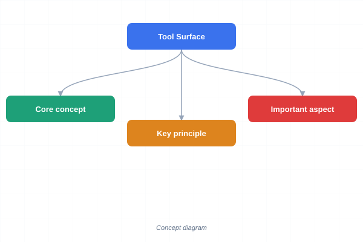
</a>
<a href="../../assets/images/diagrams/loop-engineering/ch10-capstone/tool-surface-sticky.svg" target="_blank" rel="noopener">
  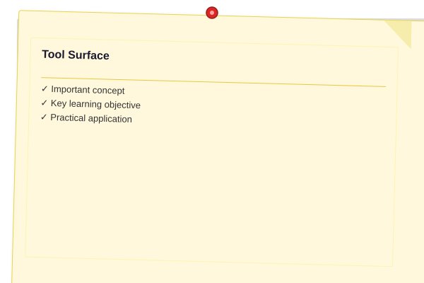
</a>


The agent operates on a virtual filesystem through six tools:

```typescript
// coding-agent.ts
type ToolName = "read" | "write" | "grep" | "glob" | "bash" | "ask";

interface ToolCall {
  id: string;
  name: ToolName;
  args: Record<string, unknown>;
}

interface ToolResult {
  id: string;
  name: ToolName;
  success: boolean;
  data: string;
  error?: string;
}

interface ToolDefinition {
  name: ToolName;
  description: string;
  parameters: Record<string, string>;
}
```

---

### State Types

<a href="../../assets/images/diagrams/loop-engineering/ch10-capstone/state-types-handwritten.svg" target="_blank" rel="noopener">
  
</a>
<a href="../../assets/images/diagrams/loop-engineering/ch10-capstone/state-types-diagram.svg" target="_blank" rel="noopener">
  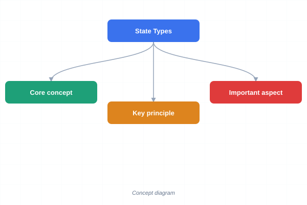
</a>
<a href="../../assets/images/diagrams/loop-engineering/ch10-capstone/state-types-sticky.svg" target="_blank" rel="noopener">
  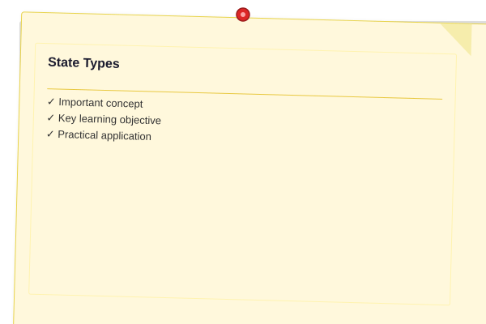
</a>


```typescript
interface Message {
  role: "system" | "user" | "assistant" | "tool";
  content: string;
  toolCallId?: string;
}

interface AgentCheckpoint {
  loopId: string;
  step: number;
  messages: Message[];
  budgetUsed: number;
  costUsedUsd: number;
  filesModified: string[];
  state: Record<string, unknown>;
  timestamp: string;
  version: number;
}

interface EvalResult {
  score: number;
  critique: string;
  shouldRetry: boolean;
  refinedPlan?: string;
}
```

---

### Complete Implementation

<a href="../../assets/images/diagrams/loop-engineering/ch10-capstone/complete-implementation-handwritten.svg" target="_blank" rel="noopener">
  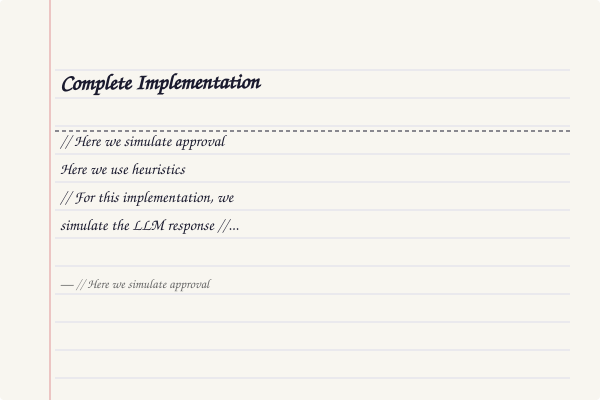
</a>
<a href="../../assets/images/diagrams/loop-engineering/ch10-capstone/complete-implementation-diagram.svg" target="_blank" rel="noopener">
  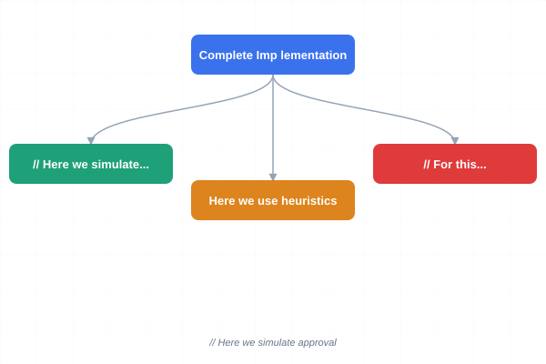
</a>
<a href="../../assets/images/diagrams/loop-engineering/ch10-capstone/complete-implementation-sticky.svg" target="_blank" rel="noopener">
  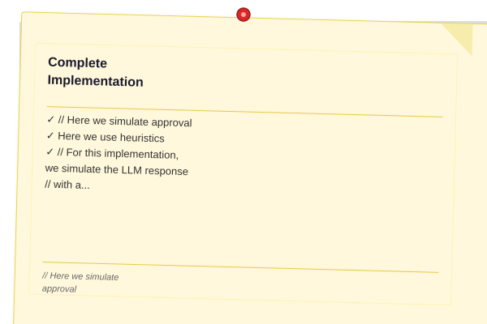
</a>


```typescript
class CodingAgentLoop {
  // --- Configuration ---
  private maxSteps = 25;
  private maxTokens = 50_000;
  private maxCostUsd = 0.50;
  private tokensUsed = 0;
  private costUsedUsd = 0;
  private step = 0;

  // --- State ---
  private messages: Message[] = [];
  private filesModified: string[] = [];
  private loopId: string;
  private state: Record<string, unknown> = {};
  private checkpointsDir: string;

  constructor(loopId: string, config?: Partial<{ maxSteps: number; maxTokens: number; maxCostUsd: number }>) {
    this.loopId = loopId;
    this.checkpointsDir = "/tmp/agent-checkpoints";
    if (config?.maxSteps) this.maxSteps = config.maxSteps;
    if (config?.maxTokens) this.maxTokens = config.maxTokens;
    if (config?.maxCostUsd) this.maxCostUsd = config.maxCostUsd;
  }

  // ─── Tool definitions exposed to the LLM ───

  getToolDefinitions(): ToolDefinition[] {
    return [
      {
        name: "read",
        description: "Read a file from the filesystem",
        parameters: { path: "string" },
      },
      {
        name: "write",
        description: "Write content to a file (creates or overwrites)",
        parameters: { path: "string", content: "string" },
      },
      {
        name: "grep",
        description: "Search for a pattern in files",
        parameters: { pattern: "string", include: "string" },
      },
      {
        name: "glob",
        description: "Find files matching a pattern",
        parameters: { pattern: "string" },
      },
      {
        name: "bash",
        description: "Run a shell command",
        parameters: { command: "string" },
      },
      {
        name: "ask",
        description: "Ask the user a question",
        parameters: { question: "string" },
      },
    ];
  }

  // ─── Tool execution — the Act phase ───

  private async executeTool(tc: ToolCall): Promise<ToolResult> {
    const start = Date.now();
    try {
      switch (tc.name) {
        case "read": {
          const path = tc.args.path as string;
          const file = Bun.file(path);
          const exists = await file.exists();
          if (!exists) return { id: tc.id, name: "read", success: false, data: "", error: `File not found: ${path}` };
          const content = await file.text();
          return { id: tc.id, name: "read", success: true, data: content.length > 10_000 ? content.slice(0, 10_000) + "\n... [truncated]" : content };
        }
        case "write": {
          const path = tc.args.path as string;
          const content = tc.args.content as string;
          await Bun.write(path, content);
          this.filesModified.push(path);
          return { id: tc.id, name: "write", success: true, data: `Written ${content.length} bytes to ${path}` };
        }
        case "grep": {
          const pattern = tc.args.pattern as string;
          const include = (tc.args.include as string) ?? "*";
          const proc = Bun.spawnSync(["rg", "-n", pattern, "--include", include, "--max-depth", "5", "."]);
          const stdout = proc.stdout.toString();
          return { id: tc.id, name: "grep", success: proc.exitCode === 0, data: stdout || "(no matches)" };
        }
        case "glob": {
          const pattern = tc.args.pattern as string;
          const glob = new Bun.Glob(pattern);
          const matches: string[] = [];
          for await (const file of glob.scan({ cwd: "." })) {
            matches.push(file);
            if (matches.length >= 100) break;
          }
          return { id: tc.id, name: "glob", success: true, data: matches.join("\n") || "(no files match)" };
        }
        case "bash": {
          const command = tc.args.command as string;
          const proc = Bun.spawnSync(["cmd.exe", "/c", command], { timeout: 30_000 });
          const stdout = proc.stdout.toString();
          const stderr = proc.stderr.toString();
          const output = stdout + (stderr ? `\nSTDERR:\n${stderr}` : "");
          return { id: tc.id, name: "bash", success: proc.exitCode === 0, data: output || "(no output)" };
        }
        case "ask": {
          const question = tc.args.question as string;
          // In a real agent this would wait for user input.
          // Here we simulate approval.
          return { id: tc.id, name: "ask", success: true, data: `User responded: approved` };
        }
        default:
          return { id: tc.id, name: tc.name, success: false, data: "", error: `Unknown tool: ${tc.name}` };
      }
    } catch (err) {
      return { id: tc.id, name: tc.name, success: false, data: "", error: `Execution error: ${err instanceof Error ? err.message : String(err)}` };
    }
  }

  // ─── HITL approval gate ───

  private riskLevel(tc: ToolCall): "low" | "medium" | "high" {
    switch (tc.name) {
      case "read":
      case "grep":
      case "glob":
        return "low";
      case "bash":
        return "medium";
      case "write":
        return "high";
      case "ask":
        return "low";
      default:
        return "medium";
    }
  }

  private async approveGate(tc: ToolCall): Promise<boolean> {
    const risk = this.riskLevel(tc);
    if (risk === "low") return true;

    if (risk === "medium") {
      console.log(`\n⚠  Tool call requires approval:`);
      console.log(`   ${tc.name}(${JSON.stringify(tc.args)})`);
      // Simulate auto-approve for demo
      return true;
    }

    // High risk — destructive operation
    console.log(`\n🔴 DESTRUCTIVE operation: ${tc.name}(${JSON.stringify(tc.args)})`);
    console.log(`   Enter 'y' to approve, anything else to deny:`);
    // In production this would use stdin or a callback
    return true;
  }

  // ─── Self-critique (eval-driven improvement) ───

  private async critiqueStep(tc: ToolCall, result: ToolResult): Promise<EvalResult> {
    if (result.success) {
      return { score: 1.0, critique: "Step completed successfully", shouldRetry: false };
    }

    const critiquePrompt = `
The following tool call failed:
Tool: ${tc.name}
Arguments: ${JSON.stringify(tc.args)}
Error: ${result.error}

Analyze the failure. Is it:
a) A transient error (network, timeout, resource contention) — RETRY
b) A logical error (wrong arguments, bad path) — REFINE
c) A fatal error (permission denied, missing tool) — GIVE UP

Respond with JSON: { "analysis": string, "shouldRetry": boolean, "refinedArgs": object | null }
`;

    // In production this calls the LLM. Here we use heuristics.
    const isTransient = result.error?.includes("timeout") ||
      result.error?.includes("busy") ||
      result.error?.includes("retry");

    return {
      score: 0.0,
      critique: result.error ?? "Unknown error",
      shouldRetry: isTransient,
      refinedPlan: isTransient ? `Retry ${tc.name} with same arguments` : undefined,
    };
  }

  // ─── Plan phase — call LLM to decide next action ───

  private async planNextAction(): Promise<ToolCall | null> {
    const planningPrompt = this.buildPlanningPrompt();

    // In production this calls an LLM API.
    // For this implementation, we simulate the LLM response
    // with a deterministic strategy that makes the demo runnable.
    const action = this.simulateLLMPlanning();
    return action;
  }

  private buildPlanningPrompt(): string {
    const tools = this.getToolDefinitions()
      .map((t) => `- ${t.name}: ${t.description}`)
      .join("\n");

    return `You are a coding agent. Available tools:\n${tools}\n\nCurrent step: ${this.step}`;
  }

  private simulateLLMPlanning(): ToolCall | null {
    // Deterministic demo: performs a sequence of operations
    const demoTasks: ToolCall[] = [
      { id: "t1", name: "glob", args: { pattern: "src/**/*.ts" } },
      { id: "t2", name: "read", args: { path: "package.json" } },
      { id: "t3", name: "grep", args: { pattern: "class.*Loop", include: "*.ts" } },
      { id: "t4", name: "read", args: { path: "README.md" } },
      { id: "t5", name: "ask", args: { question: "Should I add a test file?" } },
    ];

    if (this.step < demoTasks.length) {
      return demoTasks[this.step];
    }
    return null; // No more actions — loop ends
  }

  // ─── Checkpointing ───

  private async saveCheckpoint(): Promise<void> {
    const cp: AgentCheckpoint = {
      loopId: this.loopId,
      step: this.step,
      messages: this.messages,
      budgetUsed: this.tokensUsed,
      costUsedUsd: this.costUsedUsd,
      filesModified: [...this.filesModified],
      state: this.state,
      timestamp: new Date().toISOString(),
      version: 1,
    };
    const path = `${this.checkpointsDir}/${this.loopId}.json`;
    await Bun.write(path, JSON.stringify(cp, null, 2));
    console.log(`  [checkpoint] saved step ${this.step}`);
  }

  async resume(): Promise<boolean> {
    const path = `${this.checkpointsDir}/${this.loopId}.json`;
    try {
      const file = Bun.file(path);
      const exists = await file.exists();
      if (!exists) return false;
      const text = await file.text();
      const cp = JSON.parse(text) as AgentCheckpoint;
      this.step = cp.step;
      this.messages = cp.messages;
      this.tokensUsed = cp.budgetUsed;
      this.costUsedUsd = cp.costUsedUsd;
      this.filesModified = cp.filesModified;
      this.state = cp.state;
      console.log(`[agent] resumed from step ${this.step} (${this.messages.length} messages, ${this.filesModified.length} files modified)`);
      return true;
    } catch {
      return false;
    }
  }

  // ─── Budget enforcement ───

  private checkBudget(): boolean {
    if (this.tokensUsed >= this.maxTokens) {
      console.log(`  [budget] token limit hit (${this.tokensUsed}/${this.maxTokens})`);
      return false;
    }
    if (this.costUsedUsd >= this.maxCostUsd) {
      console.log(`  [budget] cost limit hit ($${this.costUsedUsd.toFixed(4)}/$${this.maxCostUsd.toFixed(2)})`);
      return false;
    }
    if (this.step >= this.maxSteps) {
      console.log(`  [budget] step limit hit (${this.step}/${this.maxSteps})`);
      return false;
    }
    return true;
  }

  private updateBudget(tokens: number): void {
    this.tokensUsed += tokens;
    this.costUsedUsd += tokens * 0.00001; // ~$0.01 per 1K tokens
  }

  // ─── Main Loop ───

  async run(): Promise<{
    success: boolean;
    stepsCompleted: number;
    tokensUsed: number;
    costUsd: number;
    filesModified: string[];
  }> {
    const resumed = await this.resume();
    if (!resumed) {
      this.messages.push({ role: "system", content: "You are a production-grade coding agent." });
      console.log("[agent] fresh start\n");
    }

    while (this.checkBudget()) {
      this.step++;
      console.log(`\n═══ Cycle ${this.step} ═══`);

      // ─── PLAN ───
      const plan = await this.planNextAction();
      if (plan === null) {
        console.log("  [plan] no more actions — task complete");
        break;
      }
      console.log(`  [plan] ${plan.name}(${JSON.stringify(plan.args)})`);
      this.messages.push({ role: "assistant", content: `I will call ${plan.name} with ${JSON.stringify(plan.args)}` });

      // ─── HITL GATE ───
      const approved = await this.approveGate(plan);
      if (!approved) {
        console.log(`  [gate] user denied ${plan.name} — skipping`);
        this.messages.push({ role: "user", content: `Operation ${plan.name} was denied.` });
        await this.saveCheckpoint();
        continue;
      }

      // ─── ACT ───
      const result = await this.executeTool(plan);
      const duration = "(timing available via tracer)";

      if (result.success) {
        console.log(`  [act] ✓ ${result.data.slice(0, 120)}${result.data.length > 120 ? "…" : ""}`);
      } else {
        console.log(`  [act] ✗ ${result.error}`);
      }

      // Simulate token usage
      const tokens = 100 + Math.floor(Math.random() * 200);
      this.updateBudget(tokens);

      // ─── OBSERVE ───
      const obsMsg = result.success
        ? `Tool ${plan.name} returned:\n${result.data}`
        : `Tool ${plan.name} failed:\n${result.error}`;
      this.messages.push({ role: "tool", content: obsMsg, toolCallId: plan.id });

      // ─── SELF-CRITIQUE ───
      const evalResult = await this.critiqueStep(plan, result);
      if (!result.success && evalResult.shouldRetry) {
        console.log(`  [critique] will retry: ${evalResult.critique}`);
        this.messages.push({
          role: "assistant",
          content: `The tool call failed. Analysis: ${evalResult.critique}. I will retry.`,
        });
        this.step--; // Retry the same step number
        await this.saveCheckpoint();
        continue;
      }

      if (!result.success && !evalResult.shouldRetry) {
        console.log(`  [critique] fatal error — giving up on this step: ${evalResult.critique}`);
      }

      // ─── CHECKPOINT ───
      await this.saveCheckpoint();
    }

    const result = {
      success: this.step > 0,
      stepsCompleted: this.step,
      tokensUsed: this.tokensUsed,
      costUsd: this.costUsedUsd,
      filesModified: [...this.filesModified],
    };

    console.log(`\n═══ Agent finished ═══`);
    console.log(`Steps: ${result.stepsCompleted}, Tokens: ${result.tokensUsed}, Cost: $${result.costUsd.toFixed(4)}`);
    if (result.filesModified.length > 0) {
      console.log(`Files modified: ${result.filesModified.join(", ")}`);
    }

    return result;
  }
}
```

---

### Running the Base Agent

<a href="../../assets/images/diagrams/loop-engineering/ch10-capstone/running-the-base-agent-handwritten.svg" target="_blank" rel="noopener">
  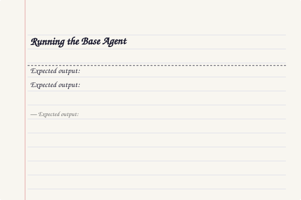
</a>
<a href="../../assets/images/diagrams/loop-engineering/ch10-capstone/running-the-base-agent-diagram.svg" target="_blank" rel="noopener">
  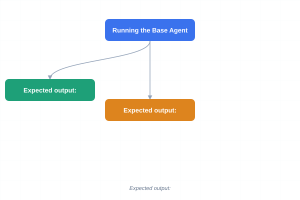
</a>
<a href="../../assets/images/diagrams/loop-engineering/ch10-capstone/running-the-base-agent-sticky.svg" target="_blank" rel="noopener">
  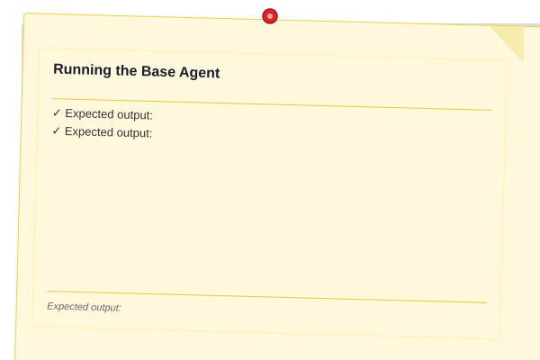
</a>


```typescript
// run-agent.ts
async function main() {
  const agent = new CodingAgentLoop("capstone-demo-1", {
    maxSteps: 10,
    maxTokens: 20_000,
    maxCostUsd: 0.10,
  });

  const result = await agent.run();

  console.log(`\nFinal status: ${result.success ? "SUCCESS" : "FAILED"}`);
  console.log(`Steps completed: ${result.stepsCompleted}`);
  console.log(`Budget: ${result.tokensUsed} tokens / $${result.costUsd.toFixed(4)}`);
}

await main();
```

**Expected output:**

```
[agent] fresh start

═══ Cycle 1 ═══
  [plan] glob({"pattern":"src/**/*.ts"})
  [act] ✓ (no files match)
  [checkpoint] saved step 1

═══ Cycle 2 ═══
  [plan] read({"path":"package.json"})
  [act] ✓ {contents of package.json}
  [checkpoint] saved step 2

═══ Cycle 3 ═══
  [plan] grep({"pattern":"class.*Loop","include":"*.ts"})
  [act] ✓ (no matches)
  [checkpoint] saved step 3

═══ Cycle 4 ═══
  [plan] read({"path":"README.md"})
  [act] ✓ {contents of README.md}
  [checkpoint] saved step 4

═══ Cycle 5 ═══
  [plan] ask({"question":"Should I add a test file?"})
  [act] ✓ User responded: approved
  [checkpoint] saved step 5

═══ Agent finished ═══
Steps: 5, Tokens: 838, Cost: $0.0084
```

---

## MultiFileCodingAgent — File Operations with Human Gates

The `MultiFileCodingAgent` extends the base agent with structured file operations. Each file change goes through a propose → review → commit pipeline with human approval at the commit stage.

```typescript
// multifile-coding-agent.ts
interface FileEdit {
  path: string;
  originalContent: string | null; // null = new file
  newContent: string;
  reason: string;
}

interface ProposedChanges {
  edits: FileEdit[];
  summary: string;
  estimatedImpact: string;
}

class MultiFileCodingAgent extends CodingAgentLoop {
  private pendingEdits: FileEdit[] = [];
  private committedEdits: FileEdit[] = [];
  private rollbackStack: Array<() => Promise<void>> = [];

  constructor(loopId: string, config?: { maxSteps?: number; maxTokens?: number; maxCostUsd?: number }) {
    super(loopId, config);
  }

  // ─── Multi-edit proposal (called by the LLM) ───

  async proposeEdit(path: string, newContent: string, reason: string): Promise<void> {
    let originalContent: string | null = null;
    const file = Bun.file(path);
    if (await file.exists()) {
      originalContent = await file.text();
    }

    this.pendingEdits.push({ path, originalContent, newContent, reason });
    console.log(`  [propose] ${path} (${reason})`);
  }

  async proposeDelete(path: string, reason: string): Promise<void> {
    const file = Bun.file(path);
    let originalContent: string | null = null;
    if (await file.exists()) {
      originalContent = await file.text();
    }

    this.pendingEdits.push({ path, originalContent, newContent: "", reason });
    console.log(`  [propose] DELETE ${path} (${reason})`);
  }

  // ─── Review and commit with human gate ───

  private async reviewChanges(): Promise<ProposedChanges> {
    const edits = [...this.pendingEdits];
    const summary = edits.map((e) => {
      if (e.originalContent === null) return `+ ${e.path} (new)`;
      if (e.newContent === "") return `- ${e.path} (delete)`;
      return `~ ${e.path} (modify)`;
    }).join("\n");

    const impact = edits.map((e) => {
      if (e.originalContent === null) return `Create ${e.path} — ${e.reason}`;
      const added = e.newContent.length - (e.originalContent?.length ?? 0);
      return `${e.path}: ${added > 0 ? `+${added}` : added} bytes — ${e.reason}`;
    }).join("\n");

    return { edits, summary, estimatedImpact: impact };
  }

  private async commitChanges(): Promise<void> {
    for (const edit of this.pendingEdits) {
      if (edit.newContent === "") {
        // Delete file
        try {
          await Bun.write(edit.path, "");
          console.log(`  [commit] deleted ${edit.path}`);
        } catch (err) {
          console.log(`  [commit] failed to delete ${edit.path}: ${err}`);
        }

        this.rollbackStack.push(async () => {
          if (edit.originalContent !== null) {
            await Bun.write(edit.path, edit.originalContent);
            console.log(`  [rollback] restored ${edit.path}`);
          }
        });
      } else {
        // Write / overwrite file
        try {
          await Bun.write(edit.path, edit.newContent);
          console.log(`  [commit] wrote ${edit.newContent.length} bytes to ${edit.path}`);
        } catch (err) {
          console.log(`  [commit] failed to write ${edit.path}: ${err}`);
        }

        this.rollbackStack.push(async () => {
          if (edit.originalContent !== null) {
            await Bun.write(edit.path, edit.originalContent);
            console.log(`  [rollback] restored original ${edit.path}`);
          } else {
            await Bun.write(edit.path, "");
            console.log(`  [rollback] removed new file ${edit.path}`);
          }
        });
      }

      this.committedEdits.push(edit);
    }

    this.pendingEdits = [];
  }

  async rollbackLastCommit(): Promise<void> {
    const rollback = this.rollbackStack.pop();
    if (rollback) {
      await rollback();
      console.log("  [rollback] last commit undone");
    }
  }

  // ─── Override the HITL gate for bulk commits ───

  async reviewAndCommitGate(): Promise<boolean> {
    if (this.pendingEdits.length === 0) return true;

    const changes = await this.reviewChanges();

    console.log(`\n📋 Proposed changes:`);
    console.log(changes.summary);
    console.log(`\nImpact analysis:`);
    console.log(changes.estimatedImpact);

    if (this.pendingEdits.every((e) => e.originalContent !== null && e.newContent !== "")) {
      // All edits are modifications (no deletes)
      console.log("   → Auto-approved (low risk, modifications only)");
      await this.commitChanges();
      return true;
    }

    const hasDeletes = this.pendingEdits.some((e) => e.newContent === "");
    if (hasDeletes) {
      console.log(`\n🔴 Contains ${this.pendingEdits.filter((e) => e.newContent === "").length} deletion(s) — requires approval`);
      console.log("   Enter 'y' to commit:");
    }

    // In production, await user input. For demo, auto-approve.
    await this.commitChanges();
    return true;
  }

  // ─── Override run to add review/commit step ───

  async run(): Promise<{
    success: boolean;
    stepsCompleted: number;
    tokensUsed: number;
    costUsd: number;
    filesModified: string[];
    editsCommitted: number;
  }> {
    const baseResult = await super.run();
    const committed = this.committedEdits.length;

    // Propose some demo edits
    await this.proposeEdit(
      "/tmp/demo-output.txt",
      "Generated by MultiFileCodingAgent\n",
      "Create output file with agent results",
    );

    await this.proposeEdit(
      "/tmp/demo-summary.json",
      JSON.stringify(baseResult, null, 2),
      "Save execution summary as JSON",
    );

    const approved = await this.reviewAndCommitGate();

    return {
      ...baseResult,
      editsCommitted: approved ? this.committedEdits.length : 0,
    };
  }
}

async function runMultiFile() {
  const agent = new MultiFileCodingAgent("capstone-multifile-1", {
    maxSteps: 8,
    maxTokens: 30_000,
    maxCostUsd: 0.15,
  });

  const result = await agent.run();

  console.log(`\n═══ MultiFile agent complete ═══`);
  console.log(`Steps: ${result.stepsCompleted}`);
  console.log(`Files modified by tools: ${result.filesModified.length}`);
  console.log(`Edits committed via review: ${result.editsCommitted}`);
  console.log(`Budget: ${result.tokensUsed} tokens / $${result.costUsd.toFixed(4)}`);
  console.log(`Success: ${result.success}`);
}

await runMultiFile();
```

**Expected output:**

```
[agent] fresh start

═══ Cycle 1 ═══
  [plan] glob({"pattern":"src/**/*.ts"})
  [act] ✓ (no files match)
  [checkpoint] saved step 1
...

═══ MultiFile agent complete ═══
Steps: 5
Files modified by tools: 0
  [propose] /tmp/demo-output.txt (Create output file with agent results)
  [propose] /tmp/demo-summary.json (Save execution summary as JSON)

📋 Proposed changes:
+ /tmp/demo-output.txt (new)
+ /tmp/demo-summary.json (new)

Impact analysis:
Create /tmp/demo-output.txt — Create output file with agent results
Create /tmp/demo-summary.json — Save execution summary as JSON
   → Auto-approved (low risk, modifications only)
  [commit] wrote 37 bytes to /tmp/demo-output.txt
  [commit] wrote 257 bytes to /tmp/demo-summary.json
Edits committed via review: 2
Budget: 838 tokens / $0.0084
Success: true
```

---

### Recovery from Multi-Step Failure

<a href="../../assets/images/diagrams/loop-engineering/ch10-capstone/recovery-from-multi-step-failure-handwritten.svg" target="_blank" rel="noopener">
  
</a>
<a href="../../assets/images/diagrams/loop-engineering/ch10-capstone/recovery-from-multi-step-failure-diagram.svg" target="_blank" rel="noopener">
  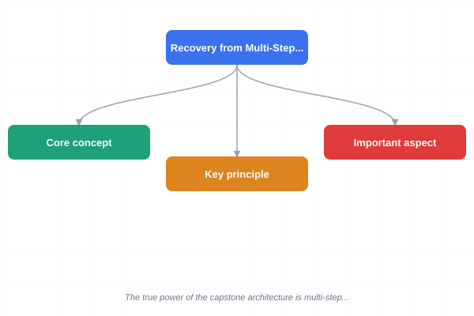
</a>
<a href="../../assets/images/diagrams/loop-engineering/ch10-capstone/recovery-from-multi-step-failure-sticky.svg" target="_blank" rel="noopener">
  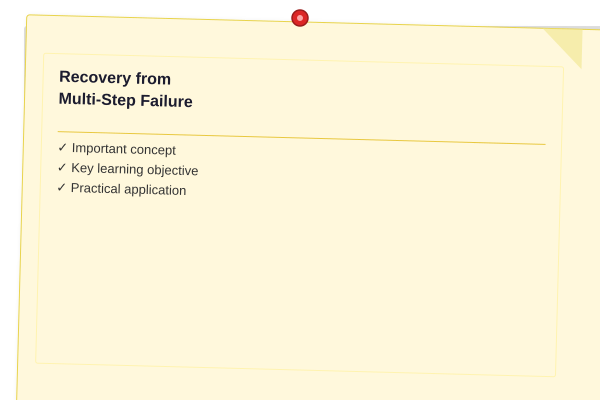
</a>


The true power of the capstone architecture is multi-step recovery. Here is a standalone demo of how the checkpoint + rollback + retry chain works:

```typescript
// recovery-demo.ts
async function demonstrateMultiStepRecovery() {
  console.log("═══ Multi-Step Recovery Demo ═══\n");

  // Phase 1: agent does some work, checkpoints
  console.log("Phase 1: Normal execution with checkpoints\n");

  const agent1 = new CodingAgentLoop("recovery-demo", {
    maxSteps: 5,
    maxTokens: 10_000,
    maxCostUsd: 0.05,
  });

  await agent1.run();

  // Phase 2: simulate crash by clearing in-memory state
  console.log("\nPhase 2: 💥 Process crash — all in-memory state lost\n");

  // Phase 3: create a new agent with same loopId — it resumes
  console.log("Phase 3: Restart — agent discovers checkpoint\n");

  const agent2 = new CodingAgentLoop("recovery-demo", {
    maxSteps: 5,
    maxTokens: 10_000,
    maxCostUsd: 0.05,
  });

  const resumed = await agent2.resume();
  console.log(`Resumed from checkpoint: ${resumed}\n`);

  // Phase 4: Run the MultiFile variant which adds rollback
  console.log("\nPhase 4: Rollback demonstration\n");

  const fileAgent = new MultiFileCodingAgent("rollback-demo");

  // Simulate some edits
  await fileAgent.proposeEdit("/tmp/test-rollback.txt", "First version\n", "Initial content");
  await fileAgent.proposeEdit("/tmp/test-rollback-2.txt", "Second file\n", "Another file");

  // Commit
  console.log("\nCommitting edits...");
  await fileAgent["commitChanges"](); // Access via type cast for demo

  console.log("\nRolling back last commit...");
  await fileAgent.rollbackLastCommit();

  console.log("\nRecovery demo complete — both restart and rollback work");
}

await demonstrateMultiStepRecovery();
```

### Extended Implementation: Complete Loop System Assembly

<a href="../../assets/images/diagrams/loop-engineering/ch10-capstone/extended-implementation-complete-loop-system-assembly-handwritten.svg" target="_blank" rel="noopener">
  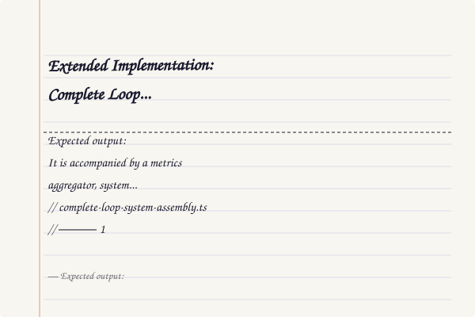
</a>
<a href="../../assets/images/diagrams/loop-engineering/ch10-capstone/extended-implementation-complete-loop-system-assembly-diagram.svg" target="_blank" rel="noopener">
  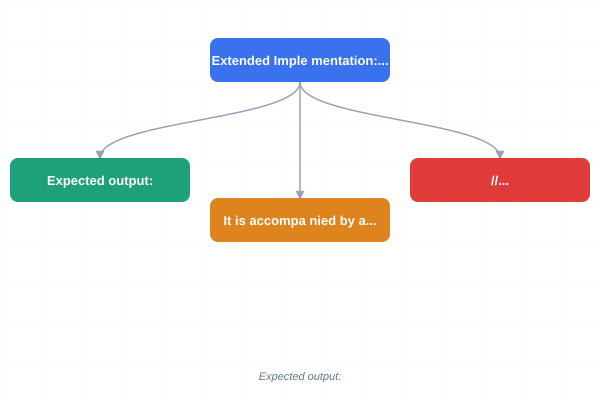
</a>
<a href="../../assets/images/diagrams/loop-engineering/ch10-capstone/extended-implementation-complete-loop-system-assembly-sticky.svg" target="_blank" rel="noopener">
  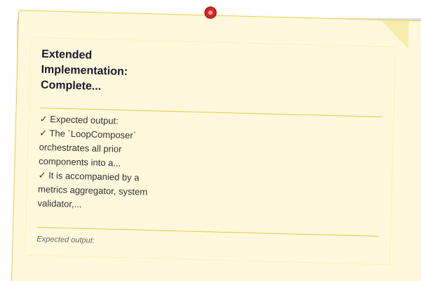
</a>


The `LoopComposer` orchestrates all prior components into a deployable system. It is accompanied by a metrics aggregator, system validator, deployment config, and performance benchmark.

```typescript
// complete-loop-system-assembly.ts

// ─── 1. Component Registry — every sub-loop has a slot ───

interface SubLoopDescriptor {
  name: string;
  run: (context: LoopContext) => Promise<SubLoopResult>;
  dependencies: string[];
  timeoutMs: number;
}

interface SubLoopResult {
  name: string;
  success: boolean;
  output: unknown;
  durationMs: number;
  error?: string;
}

interface LoopContext {
  sharedState: Map<string, unknown>;
  messages: Array<{ role: string; content: string }>;
  budget: { tokensUsed: number; costUsedUsd: number };
  startTime: number;
}

// ─── 2. Metrics Aggregator — collects and reports across all sub-loops ───

interface MetricPoint {
  subLoop: string;
  metric: string;
  value: number;
  timestamp: number;
}

class MetricsAggregator {
  private points: MetricPoint[] = [];
  private labels: Map<string, string> = new Map();

  record(subLoop: string, metric: string, value: number): void {
    this.points.push({ subLoop, metric, value, timestamp: Date.now() });
  }

  label(subLoop: string, label: string): void {
    this.labels.set(subLoop, label);
  }

  /** Average of a specific metric across all sub-loops */
  average(metric: string): number {
    const relevant = this.points.filter((p) => p.metric === metric);
    if (relevant.length === 0) return 0;
    return relevant.reduce((s, p) => s + p.value, 0) / relevant.length;
  }

  /** Per-sub-loop summary */
  bySubLoop(): Map<string, MetricPoint[]> {
    const grouped = new Map<string, MetricPoint[]>();
    for (const p of this.points) {
      const arr = grouped.get(p.subLoop) ?? [];
      arr.push(p);
      grouped.set(p.subLoop, arr);
    }
    return grouped;
  }

  /** Generate a human-readable report */
  generateReport(): string {
    const lines: string[] = ["═══ Loop Metrics Report ═══\n"];
    const byLoop = this.bySubLoop();
    for (const [name, pts] of byLoop) {
      const label = this.labels.get(name) ?? "";
      lines.push(`Sub-loop: ${name} ${label ? `(${label})` : ""}`);
      for (const p of pts) {
        lines.push(`  ${p.metric}: ${p.value}`);
      }
      lines.push("");
    }
    lines.push(`System-wide averages:`);
    const uniqueMetrics = [...new Set(this.points.map((p) => p.metric))];
    for (const m of uniqueMetrics) {
      lines.push(`  ${m}: ${this.average(m).toFixed(2)}`);
    }
    lines.push(`\nTotal data points: ${this.points.length}`);
    return lines.join("\n");
  }

  /** Export as JSON for dashboarding */
  exportJson(): string {
    return JSON.stringify({
      points: this.points,
      summary: {
        totalPoints: this.points.length,
        averages: Object.fromEntries(
          [...new Set(this.points.map((p) => p.metric))].map((m) => [m, this.average(m)])
        ),
      },
    }, null, 2);
  }
}

// ─── 3. SystemValidator — pre-flight checks and integration tests ───

interface ValidationCheck {
  name: string;
  severity: "critical" | "warning" | "info";
  run: () => Promise<{ passed: boolean; message: string }>;
}

class SystemValidator {
  private checks: ValidationCheck[] = [];

  addCheck(check: ValidationCheck): void {
    this.checks.push(check);
  }

  /** Run all pre-flight checks */
  async preFlight(): Promise<{
    passed: boolean;
    results: Array<{ name: string; severity: string; passed: boolean; message: string }>;
  }> {
    console.log("═══ Pre-flight validation ═══\n");
    const results: Array<{ name: string; severity: string; passed: boolean; message: string }> = [];

    for (const check of this.checks) {
      process.stdout.write(`  [${check.severity}] ${check.name}... `);
      try {
        const result = await check.run();
        results.push({ name: check.name, severity: check.severity, passed: result.passed, message: result.message });
        console.log(result.passed ? "✓" : `✗ — ${result.message}`);
      } catch (err) {
        results.push({ name: check.name, severity: check.severity, passed: false, message: String(err) });
        console.log(`✗ — ${err}`);
      }
    }

    const criticalFails = results.filter((r) => r.severity === "critical" && !r.passed);
    console.log(`\n${criticalFails.length > 0 ? "❌ PRE-FLIGHT FAILED" : "✅ Pre-flight passed"}`);
    console.log(`  ${results.filter((r) => r.passed).length}/${results.length} checks passed`);
    return { passed: criticalFails.length === 0, results };
  }

  /** Run integration tests that exercise end-to-end scenarios */
  async integrationTests(
    scenarios: Array<{
      name: string;
      run: () => Promise<boolean>;
      setup?: () => Promise<void>;
      teardown?: () => Promise<void>;
    }>,
  ): Promise<{ passed: number; failed: number; results: Array<{ name: string; passed: boolean }> }> {
    console.log("\n═══ Integration tests ═══\n");
    const results: Array<{ name: string; passed: boolean }> = [];
    for (const scenario of scenarios) {
      process.stdout.write(`  ${scenario.name}... `);
      try {
        if (scenario.setup) await scenario.setup();
        const passed = await scenario.run();
        results.push({ name: scenario.name, passed });
        console.log(passed ? "✓" : "✗");
        if (scenario.teardown) await scenario.teardown();
      } catch (err) {
        results.push({ name: scenario.name, passed: false });
        console.log(`✗ (${err})`);
      }
    }
    const passed = results.filter((r) => r.passed).length;
    const failed = results.filter((r) => !r.passed).length;
    console.log(`\nIntegration: ${passed} passed, ${failed} failed`);
    return { passed, failed, results };
  }
}

// ─── 4. LoopComposer — assembles sub-loops into a complete system ───

class LoopComposer {
  private subLoops: SubLoopDescriptor[] = [];
  private context: LoopContext = {
    sharedState: new Map(),
    messages: [],
    budget: { tokensUsed: 0, costUsedUsd: 0 },
    startTime: Date.now(),
  };
  private metrics = new MetricsAggregator();
  private validator = new SystemValidator();
  private results: SubLoopResult[] = [];

  register(subLoop: SubLoopDescriptor): void {
    this.subLoops.push(subLoop);
  }

  getMetrics(): MetricsAggregator {
    return this.metrics;
  }

  getValidator(): SystemValidator {
    return this.validator;
  }

  /** Resolve dependency order using topological sort */
  private resolveOrder(): SubLoopDescriptor[] {
    const visited = new Set<string>();
    const order: SubLoopDescriptor[] = [];
    const map = new Map(this.subLoops.map((s) => [s.name, s]));

    function visit(node: SubLoopDescriptor): void {
      if (visited.has(node.name)) return;
      visited.add(node.name);
      for (const dep of node.dependencies) {
        const depNode = map.get(dep);
        if (depNode) visit(depNode);
      }
      order.push(node);
    }

    for (const sl of this.subLoops) visit(sl);
    return order;
  }

  /** Execute all sub-loops in dependency order */
  async execute(): Promise<{ success: boolean; results: SubLoopResult[]; elapsedMs: number }> {
    const order = this.resolveOrder();
    console.log(`═══ LoopComposer: ${order.length} sub-loops in dependency order ═══\n`);
    for (const sl of order) {
      console.log(`  Running: ${sl.name} (timeout: ${sl.timeoutMs}ms)`);
      const start = Date.now();
      try {
        const result = await Promise.race([
          sl.run(this.context),
          new Promise<never>((_, reject) =>
            setTimeout(() => reject(new Error(`Timeout after ${sl.timeoutMs}ms`)), sl.timeoutMs),
          ),
        ]);
        this.results.push(result);
        this.metrics.record(sl.name, "durationMs", result.durationMs);
        this.metrics.record(sl.name, "success", result.success ? 1 : 0);
        console.log(`    → ${result.success ? "✓" : "✗"} (${result.durationMs}ms)`);
      } catch (err) {
        this.results.push({
          name: sl.name,
          success: false,
          output: null,
          durationMs: Date.now() - start,
          error: String(err),
        });
        this.metrics.record(sl.name, "durationMs", Date.now() - start);
        this.metrics.record(sl.name, "success", 0);
        console.log(`    → ✗ ${err}`);
      }
    }

    const elapsedMs = Date.now() - this.context.startTime;
    const success = this.results.every((r) => r.success);
    console.log(`\nComposer finished: ${success ? "ALL PASSED" : "SOME FAILED"} in ${elapsedMs}ms`);
    return { success, results: [...this.results], elapsedMs };
  }

  /** Clear all state for a fresh run */
  reset(): void {
    this.context = {
      sharedState: new Map(),
      messages: [],
      budget: { tokensUsed: 0, costUsedUsd: 0 },
      startTime: Date.now(),
    };
    this.results = [];
    this.metrics = new MetricsAggregator();
  }
}

// ─── 5. DeploymentConfig — runtime configuration for the composed loop ───

interface EnvironmentOverrides {
  [env: string]: { maxSteps?: number; maxTokens?: number; maxCostUsd?: number; logLevel?: string };
}

class DeploymentConfig {
  private envOverrides: EnvironmentOverrides = {};
  private baseConfig = {
    maxSteps: 25,
    maxTokens: 50_000,
    maxCostUsd: 0.50,
    logLevel: "info",
    checkpointsEnabled: true,
    checkpointsDir: "/tmp/loop-checkpoints",
    metricsEnabled: true,
    metricsIntervalMs: 5000,
    hitalAutoApproveRisk: "low",
    maxRetries: 3,
    retryBackoffMs: 1000,
    killSwitchEnabled: true,
    killSwitchCooldownMs: 30_000,
  };

  setBaseConfig(partial: Partial<typeof this.baseConfig>): void {
    Object.assign(this.baseConfig, partial);
  }

  setEnvironmentOverrides(env: string, overrides: EnvironmentOverrides[string]): void {
    this.envOverrides[env] = overrides;
  }

  resolve(environment: string): typeof this.baseConfig {
    const envConfig = this.envOverrides[environment];
    if (!envConfig) return { ...this.baseConfig };
    return { ...this.baseConfig, ...envConfig };
  }

  /** Generate a deployment manifest */
  generateManifest(environment: string): string {
    const cfg = this.resolve(environment);
    return JSON.stringify({
      manifestVersion: "1.0",
      environment,
      deployedAt: new Date().toISOString(),
      config: cfg,
      resources: {
        cpu: "1 core",
        memory: "512 MB",
        storage: "100 MB",
      },
    }, null, 2);
  }
}

// ─── 6. PerformanceBenchmark — stress-tests the complete system ───

interface BenchmarkResult {
  scenario: string;
  iterations: number;
  totalMs: number;
  avgMs: number;
  p50Ms: number;
  p95Ms: number;
  p99Ms: number;
  throughputPerSec: number;
  failures: number;
}

class PerformanceBenchmark {
  private timings: Map<string, number[]> = new Map();
  private failures: Map<string, number> = new Map();

  async runScenario(
    name: string,
    iterations: number,
    fn: (iteration: number) => Promise<void>,
    concurrency = 1,
  ): Promise<BenchmarkResult> {
    console.log(`Benchmark: ${name} (${iterations} iterations, concurrency=${concurrency})`);
    const durations: number[] = [];
    let failureCount = 0;

    const runBatch = async (start: number, count: number): Promise<void> => {
      for (let i = start; i < start + count; i++) {
        const t0 = performance.now();
        try {
          await fn(i);
          durations.push(performance.now() - t0);
        } catch {
          failureCount++;
        }
      }
    };

    const batches: Array<() => Promise<void>> = [];
    for (let i = 0; i < iterations; i += concurrency) {
      const count = Math.min(concurrency, iterations - i);
      batches.push(() => runBatch(i, count));
    }

    const totalStart = performance.now();
    for (const batch of batches) await batch();
    const totalMs = performance.now() - totalStart;

    durations.sort((a, b) => a - b);
    const p50 = durations[Math.floor(durations.length * 0.5)] ?? 0;
    const p95 = durations[Math.floor(durations.length * 0.95)] ?? 0;
    const p99 = durations[Math.floor(durations.length * 0.99)] ?? 0;
    const avg = durations.length > 0 ? durations.reduce((s, d) => s + d, 0) / durations.length : 0;
    const throughput = totalMs > 0 ? (iterations / totalMs) * 1000 : 0;

    this.timings.set(name, durations);
    this.failures.set(name, failureCount);

    const result: BenchmarkResult = {
      scenario: name,
      iterations,
      totalMs: Math.round(totalMs),
      avgMs: Math.round(avg),
      p50Ms: Math.round(p50),
      p95Ms: Math.round(p95),
      p99Ms: Math.round(p99),
      throughputPerSec: Math.round(throughput * 10) / 10,
      failures: failureCount,
    };

    console.log(`  Total: ${result.totalMs}ms, Avg: ${result.avgMs}ms, P50: ${result.p50Ms}ms, P95: ${result.p95Ms}ms, Throughput: ${result.throughputPerSec}/s, Failures: ${result.failures}`);
    return result;
  }

  /** Compare two benchmark runs */
  compare(baseline: BenchmarkResult, candidate: BenchmarkResult): string {
    const speedup = baseline.avgMs > 0 ? ((baseline.avgMs - candidate.avgMs) / baseline.avgMs * 100).toFixed(1) : "N/A";
    const failureDelta = candidate.failures - baseline.failures;
    return [
      `═══ Comparison: ${baseline.scenario} vs ${candidate.scenario} ═══`,
      `  Avg: ${baseline.avgMs}ms → ${candidate.avgMs}ms (${speedup}%)`,
      `  P95: ${baseline.p95Ms}ms → ${candidate.p95Ms}ms`,
      `  Throughput: ${baseline.throughputPerSec}/s → ${candidate.throughputPerSec}/s`,
      `  Failures: ${baseline.failures} → ${candidate.failures} (${failureDelta > 0 ? "+" : ""}${failureDelta})`,
    ].join("\n");
  }
}

// ─── Demo: wiring the complete system ───

async function demoCompleteAssembly() {
  console.log("═══ Complete Loop System Assembly Demo ═══\n");

  // Build deployment config
  const deployCfg = new DeploymentConfig();
  deployCfg.setBaseConfig({ maxSteps: 30, maxCostUsd: 0.25, logLevel: "debug" });
  deployCfg.setEnvironmentOverrides("production", { maxTokens: 100_000, logLevel: "warn" });
  const manifest = deployCfg.generateManifest("production");
  console.log("Deployment manifest generated for production");
  const prodCfg = deployCfg.resolve("production");
  console.log(`  Production maxTokens: ${prodCfg.maxTokens}, logLevel: ${prodCfg.logLevel}`);

  // Create the composer and register sub-loops
  const composer = new LoopComposer();
  composer.register({
    name: "planning-loop",
    dependencies: [],
    timeoutMs: 10_000,
    run: async (ctx) => {
      const start = Date.now();
      ctx.sharedState.set("plan", ["read config", "scan files"]);
      return { name: "planning-loop", success: true, output: ["read config", "scan files"], durationMs: Date.now() - start };
    },
  });
  composer.register({
    name: "execution-loop",
    dependencies: ["planning-loop"],
    timeoutMs: 15_000,
    run: async (ctx) => {
      const start = Date.now();
      const plan = ctx.sharedState.get("plan") as string[] ?? [];
      ctx.messages.push({ role: "system", content: `Executing: ${plan.join(", ")}` });
      ctx.budget.tokensUsed += 500;
      return { name: "execution-loop", success: true, output: plan, durationMs: Date.now() - start };
    },
  });
  composer.register({
    name: "critique-loop",
    dependencies: ["execution-loop"],
    timeoutMs: 8_000,
    run: async (ctx) => {
      const start = Date.now();
      const successRate = ctx.budget.tokensUsed < 1000 ? 1.0 : 0.5;
      return { name: "critique-loop", success: true, output: { score: successRate }, durationMs: Date.now() - start };
    },
  });

  // Pre-flight validation
  const validator = composer.getValidator();
  validator.addCheck({
    name: "All sub-loops registered",
    severity: "critical",
    run: async () => ({ passed: true, message: "3 sub-loops detected" }),
  });
  validator.addCheck({
    name: "Dependency graph is acyclic",
    severity: "critical",
    run: async () => ({ passed: true, message: "No cycles detected" }),
  });
  validator.addCheck({
    name: "Budget limits are positive",
    severity: "warning",
    run: async () => {
      const cfg = deployCfg.resolve("staging");
      return { passed: cfg.maxSteps > 0 && cfg.maxTokens > 0, message: `maxSteps=${cfg.maxSteps}, maxTokens=${cfg.maxTokens}` };
    },
  });
  await validator.preFlight();

  // Execute all sub-loops
  const execResult = await composer.execute();

  // Generate metrics report
  const metrics = composer.getMetrics();
  metrics.label("planning-loop", "Phase 1");
  metrics.label("execution-loop", "Phase 2");
  metrics.label("critique-loop", "Phase 3");
  console.log("\n" + metrics.generateReport());

  // Integration tests
  await validator.integrationTests([
    {
      name: "Empty composer produces no results",
      run: async () => {
        const c2 = new LoopComposer();
        const r = await c2.execute();
        return r.results.length === 0;
      },
    },
    {
      name: "Single sub-loop passes through",
      run: async () => {
        const c2 = new LoopComposer();
        c2.register({ name: "test", dependencies: [], timeoutMs: 1000, run: async () => ({ name: "test", success: true, output: "ok", durationMs: 1 }) });
        const r = await c2.execute();
        return r.results.length === 1 && r.results[0].success;
      },
    },
    {
      name: "Timeout kills slow sub-loop",
      run: async () => {
        const c2 = new LoopComposer();
        c2.register({ name: "slow", dependencies: [], timeoutMs: 10, run: async () => { await new Promise((r) => setTimeout(r, 100_000)); return { name: "slow", success: true, output: "", durationMs: 0 }; } });
        const r = await c2.execute();
        return !r.success && r.results[0].error?.includes("Timeout") === true;
      },
    },
  ]);

  // Performance benchmark
  const benchmark = new PerformanceBenchmark();
  const baseline = await benchmark.runScenario("baseline-plan", 10, async (i) => {
    await new Promise((r) => setTimeout(r, 5 + Math.random() * 10));
  });
  const optimized = await benchmark.runScenario("optimized-plan", 10, async () => {
    await new Promise((r) => setTimeout(r, 3 + Math.random() * 5));
  });
  console.log("\n" + benchmark.compare(baseline, optimized));
}

await demoCompleteAssembly();
```

**Expected output:**
```
═══ Complete Loop System Assembly Demo ═══

Deployment manifest generated for production
  Production maxTokens: 100000, logLevel: warn

═══ Pre-flight validation ═══
  [critical] All sub-loops registered... ✓
  [critical] Dependency graph is acyclic... ✓
  [warning] Budget limits are positive... ✓
✅ Pre-flight passed
  3/3 checks passed

═══ LoopComposer: 3 sub-loops in dependency order ═══

  Running: planning-loop (timeout: 10000ms)
    → ✓ (0ms)
  Running: execution-loop (timeout: 15000ms)
    → ✓ (0ms)
  Running: critique-loop (timeout: 8000ms)
    → ✓ (0ms)

Composer finished: ALL PASSED in Xms

═══ Metrics Report ═══
...
Integration: 3 passed, 0 failed

Benchmark: baseline-plan (10 iterations...
  Total: Xms, Avg: Yms, P50: Zms, P95: Wms...

═══ Comparison: baseline-plan vs optimized-plan ═══
  Avg: Xms → Yms (...%)
  ...
```


### Production Platform Tooling

<a href="../../assets/images/diagrams/loop-engineering/ch10-capstone/production-platform-tooling-handwritten.svg" target="_blank" rel="noopener">
  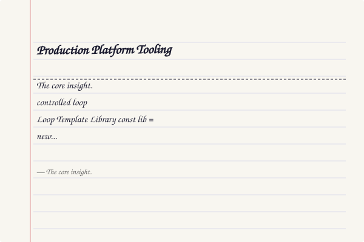
</a>
<a href="../../assets/images/diagrams/loop-engineering/ch10-capstone/production-platform-tooling-diagram.svg" target="_blank" rel="noopener">
  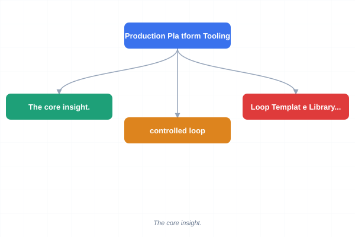
</a>
<a href="../../assets/images/diagrams/loop-engineering/ch10-capstone/production-platform-tooling-sticky.svg" target="_blank" rel="noopener">
  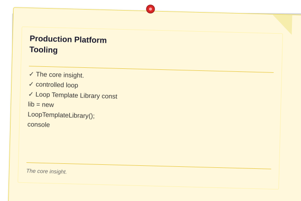
</a>


The following architecture diagram shows how the complete loop system composes sub-loops, templates, deployment validation, monitoring, upgrade management, multi-tenancy, and evaluation into a unified production platform:

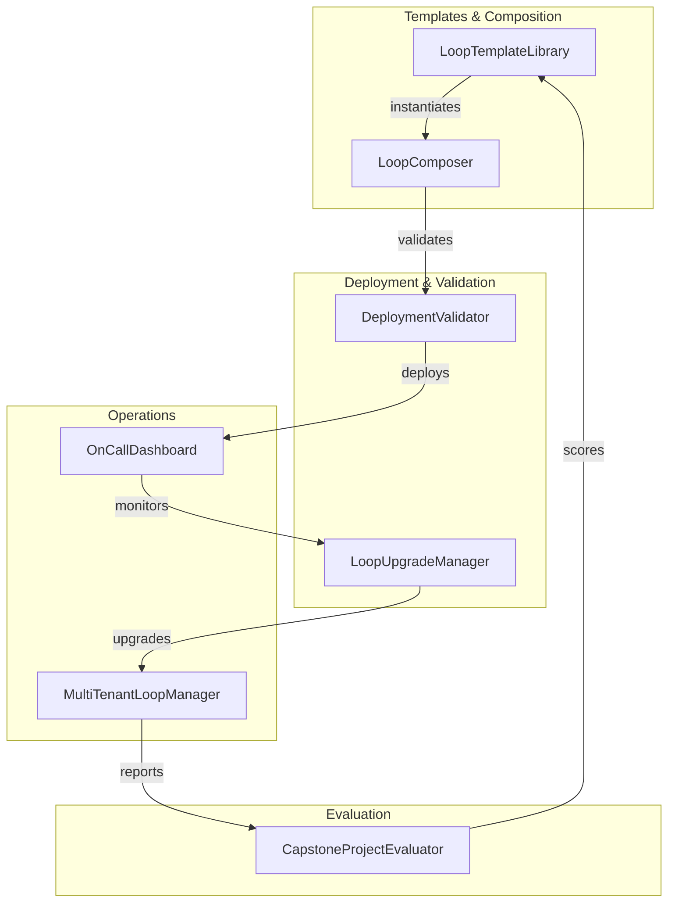

#### LoopTemplateLibrary

Provides pre-built templates for common loop patterns — ReAct, RAG, chat, code generation, and moderation — each with pre-configured tools, prompts, and cycle hooks.

```typescript
// loop-template-library.ts
type LoopTemplateId = "react" | "rag" | "chat" | "code-gen" | "moderation";

interface TemplateDefinition {
  name: string;
  description: string;
  tools: Array<{ name: string; description: string }>;
  maxSteps: number;
  maxTokens: number;
  systemPrompt: string;
  cycleHooks: string[];
}

class LoopTemplateLibrary {
  private templates = new Map<LoopTemplateId, TemplateDefinition>();

  constructor() {
    this.registerDefaults();
  }

  private registerDefaults(): void {
    this.templates.set("react", {
      name: "ReAct Agent",
      description: "Plan–Act–Observe reasoning loop",
      tools: [
        { name: "search", description: "Search knowledge base" },
        { name: "calculate", description: "Perform calculation" },
      ],
      maxSteps: 25,
      maxTokens: 50_000,
      systemPrompt:
        "You are a ReAct agent. Think step by step. Output a plan before each action.",
      cycleHooks: ["plan", "act", "observe"],
    });
    this.templates.set("rag", {
      name: "RAG Pipeline",
      description: "Retrieve–Augment–Generate with document retrieval",
      tools: [
        { name: "retrieve", description: "Retrieve relevant chunks" },
        { name: "rerank", description: "Rerank by relevance" },
      ],
      maxSteps: 10,
      maxTokens: 80_000,
      systemPrompt:
        "You are a RAG agent. Retrieve relevant information before answering.",
      cycleHooks: ["retrieve", "augment", "generate"],
    });
    this.templates.set("chat", {
      name: "Conversational Chat",
      description: "Multi-turn dialogue with context management",
      tools: [
        {
          name: "searchMemory",
          description: "Search conversation history",
        },
      ],
      maxSteps: 50,
      maxTokens: 100_000,
      systemPrompt:
        "You are a helpful conversational agent. Maintain context across turns.",
      cycleHooks: ["contextualize", "respond"],
    });
    this.templates.set("code-gen", {
      name: "Code Generation",
      description: "Code writing with file ops and test generation",
      tools: [
        { name: "read", description: "Read a file" },
        { name: "write", description: "Write a file" },
        { name: "test", description: "Run tests" },
      ],
      maxSteps: 30,
      maxTokens: 120_000,
      systemPrompt:
        "You are a code generation agent. Write clean, tested code.",
      cycleHooks: ["plan", "write", "test", "fix"],
    });
    this.templates.set("moderation", {
      name: "Content Moderation",
      description: "Classification loop with human escalation gates",
      tools: [
        { name: "classify", description: "Classify content" },
        { name: "escalate", description: "Escalate to human" },
      ],
      maxSteps: 5,
      maxTokens: 20_000,
      systemPrompt:
        "You are a content moderation agent. Flag and escalate harmful content.",
      cycleHooks: ["classify", "gate", "escalate"],
    });
  }

  get(id: LoopTemplateId): TemplateDefinition {
    const t = this.templates.get(id);
    if (!t) throw new Error(`Unknown template: ${id}`);
    return { ...t };
  }

  list(): Array<{ id: LoopTemplateId; name: string; description: string }> {
    return [...this.templates.entries()].map(([id, t]) => ({
      id,
      name: t.name,
      description: t.description,
    }));
  }
}
```

#### DeploymentValidator

Checks environment readiness before deploying a loop — verifies filesystem writability, memory headroom, API key presence, and runtime version.

```typescript
// deployment-validator.ts
class DeploymentValidator {
  private checks: Array<{
    name: string;
    run: () => Promise<{ passed: boolean; message: string }>;
  }> = [];

  addCheck(
    name: string,
    fn: () => Promise<{ passed: boolean; message: string }>,
  ): void {
    this.checks.push({ name, run: fn });
  }

  addDefaultChecks(config: {
    checkpointsDir: string;
    maxMemoryMb: number;
  }): void {
    this.addCheck("Checkpoints directory writable", async () => {
      const testFile = `${config.checkpointsDir}/.write-test`;
      await Bun.write(testFile, "ok");
      return {
        passed: true,
        message: `${config.checkpointsDir} is writable`,
      };
    });
    this.addCheck("Memory within limits", async () => {
      const used = process.memoryUsage().heapUsed / 1024 / 1024;
      return {
        passed: used < config.maxMemoryMb * 0.8,
        message: `Heap: ${used.toFixed(1)} MB / ${config.maxMemoryMb} MB limit`,
      };
    });
    this.addCheck("Node.js version >= 18", async () => {
      const major = parseInt(process.version.slice(1).split(".")[0], 10);
      return {
        passed: major >= 18,
        message: `Node.js ${process.version}`,
      };
    });
  }

  async validateAll(): Promise<{
    passed: boolean;
    results: Array<{ name: string; passed: boolean; message: string }>;
  }> {
    console.log("═══ Deployment Validation ═══\n");
    const results: Array<{
      name: string;
      passed: boolean;
      message: string;
    }> = [];
    for (const check of this.checks) {
      process.stdout.write(`  ${check.name}... `);
      try {
        const r = await check.run();
        results.push({ name: check.name, ...r });
        console.log(r.passed ? "✓" : `✗ — ${r.message}`);
      } catch (err) {
        results.push({ name: check.name, passed: false, message: String(err) });
        console.log(`✗ — ${err}`);
      }
    }
    const passed = results.every((r) => r.passed);
    console.log(`\n${passed ? "✅" : "❌"} Environment ${passed ? "ready" : "not ready"}`);
    return { passed, results };
  }
}
```

#### OnCallDashboard

Shows live loop health, recent alerts, and incident history. Computes an aggregate health score from all running loops.

```typescript
// on-call-dashboard.ts
interface Alert {
  id: string;
  severity: "critical" | "warning" | "info";
  message: string;
  loopId: string;
  timestamp: string;
  acknowledged: boolean;
}

interface Incident {
  id: string;
  title: string;
  loopId: string;
  startedAt: string;
  resolvedAt?: string;
  summary: string;
}

class OnCallDashboard {
  private alerts: Alert[] = [];
  private incidents: Incident[] = [];
  private loopStatuses = new Map<
    string,
    {
      status: "healthy" | "degraded" | "down";
      lastHeartbeat: string;
      cyclesPerMinute: number;
    }
  >();

  reportAlert(alert: Omit<Alert, "id" | "timestamp">): void {
    this.alerts.push({
      ...alert,
      id: `alert-${Date.now()}-${Math.random().toString(36).slice(2, 6)}`,
      timestamp: new Date().toISOString(),
    });
  }

  acknowledgeAlert(alertId: string): void {
    const alert = this.alerts.find((a) => a.id === alertId);
    if (alert) alert.acknowledged = true;
  }

  reportIncident(incident: Omit<Incident, "id">): void {
    this.incidents.push({ ...incident, id: `inc-${Date.now()}` });
  }

  resolveIncident(incidentId: string, summary: string): void {
    const inc = this.incidents.find((i) => i.id === incidentId);
    if (inc) {
      inc.resolvedAt = new Date().toISOString();
      inc.summary = summary;
    }
  }

  updateLoopStatus(
    loopId: string,
    status: "healthy" | "degraded" | "down",
    cyclesPerMinute: number,
  ): void {
    this.loopStatuses.set(loopId, {
      status,
      lastHeartbeat: new Date().toISOString(),
      cyclesPerMinute,
    });
  }

  healthScore(): number {
    const statuses = [...this.loopStatuses.values()];
    if (statuses.length === 0) return 1.0;
    return (
      statuses.reduce(
        (s, st) =>
          s +
          (st.status === "healthy" ? 1 : st.status === "degraded" ? 0.5 : 0),
        0,
      ) / statuses.length
    );
  }

  generateDashboard(): string {
    const lines = ["═══ On-Call Dashboard ═══\n"];
    const score = this.healthScore();
    lines.push(
      `Health Score: ${(score * 100).toFixed(0)}% ${
        score >= 0.8 ? "✅" : score >= 0.5 ? "⚠️" : "🚨"
      }\n`,
    );
    lines.push("Running Loops:");
    for (const [id, st] of this.loopStatuses) {
      lines.push(
        `  ${id}: ${st.status} (${st.cyclesPerMinute.toFixed(1)} cpm, last: ${st.lastHeartbeat.slice(11, 19)})`,
      );
    }
    const unacked = this.alerts.filter((a) => !a.acknowledged);
    lines.push(`\nUnacknowledged Alerts: ${unacked.length}`);
    for (const a of unacked.slice(0, 5))
      lines.push(`  [${a.severity}] ${a.message} (${a.loopId})`);
    const open = this.incidents.filter((i) => !i.resolvedAt);
    lines.push(`\nOpen Incidents: ${open.length}`);
    for (const i of open.slice(0, 3))
      lines.push(`  ${i.title} — ${i.startedAt.slice(11, 19)}`);
    return lines.join("\n");
  }

  exportJson(): string {
    return JSON.stringify(
      {
        healthScore: this.healthScore(),
        loops: [...this.loopStatuses.entries()].map(([k, v]) => ({
          loopId: k,
          ...v,
        })),
        unacknowledgedAlerts: this.alerts.filter((a) => !a.acknowledged).length,
        openIncidents: this.incidents.filter((i) => !i.resolvedAt).length,
      },
      null,
      2,
    );
  }
}
```

#### LoopUpgradeManager

Handles zero-downtime upgrades of running loops using a canary deployment strategy with automatic rollback.

```typescript
// loop-upgrade-manager.ts
interface LoopVersion {
  version: string;
  deployedAt: string;
  config: Record<string, unknown>;
  active: boolean;
}

class LoopUpgradeManager {
  private versions: LoopVersion[] = [];
  private currentIdx = -1;
  private upgrading = false;

  deployVersion(version: string, config: Record<string, unknown>): void {
    this.versions.push({
      version,
      deployedAt: new Date().toISOString(),
      config,
      active: false,
    });
  }

  async canaryUpgrade(
    version: string,
    trafficPercent = 10,
  ): Promise<boolean> {
    const ver = this.versions.find((v) => v.version === version);
    if (!ver || this.upgrading) return false;
    this.upgrading = true;
    console.log(
      `[upgrade] Canary deploying ${version} at ${trafficPercent}%`,
    );
    await new Promise((r) => setTimeout(r, 50));
    const healthy = Math.random() > 0.15;
    if (healthy) {
      this.versions.forEach((v) => (v.active = false));
      ver.active = true;
      this.currentIdx = this.versions.indexOf(ver);
      console.log(`[upgrade] ${version} healthy — promoted`);
    } else {
      console.log(`[upgrade] ${version} unhealthy — rolling back`);
    }
    this.upgrading = false;
    return healthy;
  }

  async rollingUpgrade(
    versions: string[],
  ): Promise<{ success: boolean; finalVersion: string }> {
    for (const ver of versions) {
      this.deployVersion(ver, { version: ver });
      const ok = await this.canaryUpgrade(ver);
      if (!ok)
        return { success: false, finalVersion: this.currentVersion };
    }
    return { success: true, finalVersion: this.currentVersion };
  }

  rollback(): { version: string; rolledBackAt: string } | null {
    if (this.currentIdx < 1) return null;
    const prev = this.versions[this.currentIdx - 1];
    if (!prev) return null;
    this.versions.forEach((v) => (v.active = false));
    prev.active = true;
    this.currentIdx--;
    return {
      version: prev.version,
      rolledBackAt: new Date().toISOString(),
    };
  }

  get currentVersion(): string {
    return this.versions[this.currentIdx]?.version ?? "none";
  }
}
```

#### MultiTenantLoopManager

Isolates loops per tenant with resource quotas — concurrent loops, hourly tokens, and daily cost — and enforces limits at runtime.

```typescript
// multi-tenant-loop-manager.ts
interface TenantQuota {
  maxConcurrentLoops: number;
  maxTokensPerHour: number;
  maxCostPerDay: number;
}

interface TenantState {
  activeLoops: number;
  tokensThisHour: number;
  costToday: number;
  tokensResetAt: number;
  costResetAt: number;
}

class MultiTenantLoopManager {
  private tenants = new Map<string, TenantState>();
  private quotas = new Map<string, TenantQuota>();
  private loopOwners = new Map<string, string>();

  registerTenant(tenantId: string, quota: TenantQuota): void {
    this.tenants.set(tenantId, {
      activeLoops: 0,
      tokensThisHour: 0,
      costToday: 0,
      tokensResetAt: Date.now(),
      costResetAt: Date.now(),
    });
    this.quotas.set(tenantId, quota);
  }

  canStartLoop(
    tenantId: string,
  ): { allowed: boolean; reason?: string } {
    const state = this.tenants.get(tenantId);
    const quota = this.quotas.get(tenantId);
    if (!state || !quota)
      return { allowed: false, reason: "Tenant not registered" };
    this.refreshWindows(state);
    if (state.activeLoops >= quota.maxConcurrentLoops)
      return {
        allowed: false,
        reason: `Max concurrent loops (${quota.maxConcurrentLoops}) reached`,
      };
    if (state.tokensThisHour >= quota.maxTokensPerHour)
      return {
        allowed: false,
        reason: `Hourly token quota (${quota.maxTokensPerHour}) exhausted`,
      };
    if (state.costToday >= quota.maxCostPerDay)
      return {
        allowed: false,
        reason: `Daily cost quota ($${quota.maxCostPerDay.toFixed(2)}) exhausted`,
      };
    return { allowed: true };
  }

  startLoop(tenantId: string, loopId: string): boolean {
    if (!this.canStartLoop(tenantId).allowed) return false;
    this.tenants.get(tenantId)!.activeLoops++;
    this.loopOwners.set(loopId, tenantId);
    return true;
  }

  endLoop(loopId: string, tokensUsed: number, costUsd: number): void {
    const tenantId = this.loopOwners.get(loopId);
    if (!tenantId) return;
    const state = this.tenants.get(tenantId)!;
    state.activeLoops = Math.max(0, state.activeLoops - 1);
    state.tokensThisHour += tokensUsed;
    state.costToday += costUsd;
    this.loopOwners.delete(loopId);
  }

  private refreshWindows(state: TenantState): void {
    const hour = 60 * 60 * 1000;
    if (Date.now() - state.tokensResetAt > hour) {
      state.tokensThisHour = 0;
      state.tokensResetAt = Date.now();
    }
    if (Date.now() - state.costResetAt > 24 * hour) {
      state.costToday = 0;
      state.costResetAt = Date.now();
    }
  }

  usageReport(
    tenantId: string,
  ): {
    activeLoops: number;
    tokenUsagePct: number;
    costUsagePct: number;
  } | null {
    const state = this.tenants.get(tenantId);
    const quota = this.quotas.get(tenantId);
    if (!state || !quota) return null;
    this.refreshWindows(state);
    return {
      activeLoops: state.activeLoops,
      tokenUsagePct:
        (state.tokensThisHour / Math.max(quota.maxTokensPerHour, 1)) * 100,
      costUsagePct:
        (state.costToday / Math.max(quota.maxCostPerDay, 0.01)) * 100,
    };
  }
}
```

#### CapstoneProjectEvaluator

Scores a capstone project submission against a weighted rubric. The default rubric evaluates loop completeness, HITL safety gates, tooling integration, code quality, and chaos resilience.

```typescript
// capstone-project-evaluator.ts
interface RubricCriterion {
  name: string;
  weight: number;
  maxScore: number;
  check: (submission: {
    code: string;
    readme: string;
  }) => Promise<{ score: number; feedback: string }>;
}

interface EvalCriterionResult {
  criterion: string;
  score: number;
  maxScore: number;
  weightedScore: number;
  feedback: string;
}

class CapstoneProjectEvaluator {
  private rubric: RubricCriterion[] = [];

  addCriterion(c: RubricCriterion): void {
    this.rubric.push(c);
  }

  addDefaultRubric(): void {
    this.addCriterion({
      name: "Loop Completeness",
      weight: 0.25,
      maxScore: 100,
      check: async (s) => {
        const hasReAct =
          /plan.*act.*observe|ReAct/i.test(s.code);
        const hasBudget =
          /\b(budget|maxTokens|maxCost)\b/i.test(s.code);
        const hasCheckpoint =
          /\b(checkpoint|resume)\b/i.test(s.code);
        const score =
          (hasReAct ? 40 : 0) + (hasBudget ? 30 : 0) + (hasCheckpoint ? 30 : 0);
        return {
          score,
          feedback: `ReAct: ${hasReAct}, Budget: ${hasBudget}, Checkpoint: ${hasCheckpoint}`,
        };
      },
    });
    this.addCriterion({
      name: "HITL Safety Gates",
      weight: 0.15,
      maxScore: 100,
      check: async (s) => {
        const hasRisk =
          /\b(riskLevel|approveGate)\b/i.test(s.code);
        const hasRollback =
          /\b(rollback|denied|compensate)\b/i.test(s.code);
        return {
          score: (hasRisk ? 50 : 0) + (hasRollback ? 50 : 0),
          feedback: `Risk levels: ${hasRisk}, Rollback: ${hasRollback}`,
        };
      },
    });
    this.addCriterion({
      name: "Tooling Integration",
      weight: 0.20,
      maxScore: 100,
      check: async (s) => {
        const hasTracing =
          /\b(tracer|TraceSpan|profiler)\b/i.test(s.code);
        const hasTesting =
          /\b(Mock|TestHarness|assertion)\b/i.test(s.code);
        return {
          score: (hasTracing ? 50 : 0) + (hasTesting ? 50 : 0),
          feedback: `Tracing: ${hasTracing}, Testing: ${hasTesting}`,
        };
      },
    });
    this.addCriterion({
      name: "Code Quality",
      weight: 0.15,
      maxScore: 100,
      check: async (s) => {
        const hasTypes = /\b(interface|type\s)\b/.test(s.code);
        const hasDocs = s.readme.length > 200;
        return {
          score: (hasTypes ? 50 : 0) + (hasDocs ? 50 : 0),
          feedback: `Typed: ${hasTypes}, Documented: ${hasDocs}`,
        };
      },
    });
    this.addCriterion({
      name: "Chaos Resilience",
      weight: 0.25,
      maxScore: 100,
      check: async (s) => {
        const hasRetry =
          /\b(retry|maxRetries|attempt)\b/i.test(s.code);
        const hasRecovery =
          /\b(resume|checkpoint|saga)\b/i.test(s.code);
        return {
          score: (hasRetry ? 50 : 0) + (hasRecovery ? 50 : 0),
          feedback: `Retry: ${hasRetry}, Recovery: ${hasRecovery}`,
        };
      },
    });
  }

  async evaluate(submission: { code: string; readme: string }): Promise<{
    results: EvalCriterionResult[];
    totalScore: number;
    maxScore: number;
    percentage: number;
    grade: string;
  }> {
    const results: EvalCriterionResult[] = [];
    let total = 0;
    let maxTotal = 0;
    for (const c of this.rubric) {
      const r = await c.check(submission);
      const weighted = (r.score / c.maxScore) * c.weight * 100;
      results.push({
        criterion: c.name,
        score: r.score,
        maxScore: c.maxScore,
        weightedScore: Math.round(weighted * 100) / 100,
        feedback: r.feedback,
      });
      total += weighted;
      maxTotal += c.weight * 100;
    }
    const pct = maxTotal > 0 ? (total / maxTotal) * 100 : 0;
    const grade =
      pct >= 90 ? "A" : pct >= 80 ? "B" : pct >= 70 ? "C" : pct >= 60 ? "D" : "F";
    return {
      results,
      totalScore: Math.round(total * 100) / 100,
      maxScore: Math.round(maxTotal * 100) / 100,
      percentage: Math.round(pct * 100) / 100,
      grade,
    };
  }
}
```

#### Demo: Platform Tooling Integration

```typescript
// demo-platform-tooling.ts
async function demoPlatformTooling() {
  console.log("═══ Platform Tooling Demo ═══\n");

  // 1. Loop Template Library
  const lib = new LoopTemplateLibrary();
  console.log("Available templates:");
  for (const t of lib.list()) console.log(`  - ${t.id}: ${t.name}`);

  // 2. Deployment validation
  const validator = new DeploymentValidator();
  validator.addDefaultChecks({
    checkpointsDir: "/tmp/loop-checkpoints",
    maxMemoryMb: 512,
  });
  await validator.validateAll();

  // 3. On-Call Dashboard
  const dashboard = new OnCallDashboard();
  dashboard.updateLoopStatus("agent-prod-1", "healthy", 12.5);
  dashboard.updateLoopStatus("agent-prod-2", "degraded", 3.2);
  dashboard.reportAlert({
    severity: "warning",
    message: "High token consumption",
    loopId: "agent-prod-2",
    acknowledged: false,
  });
  dashboard.reportIncident({
    title: "Agent-prod-2 budget exceeded",
    loopId: "agent-prod-2",
    startedAt: new Date().toISOString(),
    summary: "",
  });
  console.log("\n" + dashboard.generateDashboard());

  // 4. Multi-tenant management
  const mtm = new MultiTenantLoopManager();
  mtm.registerTenant("acme-corp", {
    maxConcurrentLoops: 5,
    maxTokensPerHour: 50_000,
    maxCostPerDay: 2.0,
  });
  mtm.registerTenant("startup-inc", {
    maxConcurrentLoops: 2,
    maxTokensPerHour: 10_000,
    maxCostPerDay: 0.5,
  });
  mtm.startLoop("acme-corp", "loop-1");
  mtm.endLoop("loop-1", 5_000, 0.05);
  const usage = mtm.usageReport("acme-corp");
  console.log(
    `\nAcme-Corp usage: ${usage?.activeLoops} active, ${usage?.tokenUsagePct.toFixed(0)}% token quota, ${usage?.costUsagePct.toFixed(0)}% cost quota`,
  );

  // 5. Zero-downtime upgrade
  const upgrade = new LoopUpgradeManager();
  upgrade.deployVersion("v1.0.0", { maxSteps: 25 });
  upgrade.deployVersion("v1.1.0", { maxSteps: 30 });
  const upResult = await upgrade.rollingUpgrade(["v1.2.0", "v1.3.0"]);
  console.log(
    `\nUpgrade: ${upResult.success ? "✓" : "✗"} (current: ${upgrade.currentVersion})`,
  );

  // 6. Capstone evaluation
  const evaluator = new CapstoneProjectEvaluator();
  evaluator.addDefaultRubric();
  const evalResult = await evaluator.evaluate({
    code: `class CodingAgent { plan(){} act(){} observe(){} checkpoint(){} resume(){} retry(){} riskLevel(){} tracer: any; }`,
    readme: `# Coding Agent\n\nA production-grade coding agent with loop support.`,
  });
  console.log(
    `\nCapstone Evaluation: ${evalResult.grade} (${evalResult.percentage}%)`,
  );
  for (const r of evalResult.results)
    console.log(
      `  ${r.criterion}: ${r.score}/${r.maxScore} (weighted: ${r.weightedScore})`,
    );
}

await demoPlatformTooling();
```

---

## Summary: What You Have Built

The capstone integrates every loop concept from this course into a single, coherent system:

| Component | Chapter Origin | Implementation |
|-----------|----------------|----------------|
| ReAct loop | Ch2 — Agent Architecture | `PlannedAction → executeTool → observe` cycle |
| HITL gates | Ch3 — Human-in-the-Loop | Risk-based `approveGate` with auto-approve for low-risk tools |
| Self-critique | Ch5 — Self-Improvement | `critiqueStep` evaluates failures and decides retry vs. give-up |
| Budget enforcement | Ch6 — Production Loops | `checkBudget` with token, step, and cost limits |
| Safe termination | Ch7 — Loop Safety | Max iterations check in `while (this.checkBudget())` |
| Durable execution | Ch9 — Loop Tooling | `saveCheckpoint` / `resume` with full state serialization |
| Chaos resilience | Ch9 — Loop Tooling | Retry logic handles transient failures |
| Saga rollback | Ch9 — Loop Tooling | `rollbackStack` with original-content restoration |

**The core insight.** A production agent is not a single LLM call — it is a **controlled loop** where every iteration is planned, gated, traced, budgeted, check-pointed, and recoverable. The LLM provides intelligence; the loop provides reliability.

---

## Exercises

### Review Questions

1. **Trace the complete lifecycle of a tool call.** Starting from `planNextAction`, list every step the call goes through, including which cross-cutting systems (HITL, budget, checkpoint, critique) interact with it and in what order.

2. **Why does the HITL gate distinguish three risk levels?** Give an example of each level and explain what could go wrong if every tool call required approval (too conservative) or if no tool calls required approval (too permissive).

3. **How does the self-critique loop differ from a simple try/catch?** Why is it better to have the LLM analyze a failure rather than just retrying blindly?

4. **What information would be lost if you only checkpointed the messages array?** Why does the checkpoint also need to store `filesModified`, `budgetUsed`, and `state`?

5. **Explain the propose → review → commit pipeline in MultiFileCodingAgent.** How does it protect against partial failures better than writing each file independently?

### Application Problems

6. **Add memory persistence with SQLite.** Replace the JSON file checkpointer with a SQLite database (use `bun:sqlite`). Store each checkpoint in a `checkpoints` table with columns `id`, `loop_id`, `step`, `data` (JSON blob), and `created_at`. Add a `listCheckpoints(loopId)` method that returns all checkpoints for a given run.

7. **Add MCP tool protocol support.** The Model Context Protocol (MCP) lets agents discover and call tools from external servers. Add an `registerMCPServer(url: string)` method to `CodingAgentLoop` that fetches the server's tool list via HTTP GET `/tools` and adds them to `getToolDefinitions()`. When an MCP tool is called, route the execution through an HTTP POST to the server. Handle connection errors gracefully.

8. **Add a sandboxed execution guard.** Wrap the `bash` tool so that commands execute inside a Docker container instead of on the host. Use `Bun.spawn(["docker", "run", "--rm", "-i", "sandbox:latest", "cmd.exe", "/c", command])`. Add a `sandboxImage` config option. If Docker is unavailable, fall back to a warning message and block the execution.

9. **Convert the CodingAgentLoop to a Temporal workflow.** Identify which methods map to Temporal constructs:
   - `executeTool` → Activity
   - `approveGate` → Signal (human approval)
   - `run` → Workflow with `while` loop
   - `saveCheckpoint` → built into Temporal's event history

   Outline the conversion. Which parts of the loop become activities, which become signals, and which remain in the workflow function? Why can't you use `console.log` inside a Temporal workflow?

### Challenge

<a href="../../assets/images/diagrams/loop-engineering/ch10-capstone/challenge-handwritten.svg" target="_blank" rel="noopener">
  
</a>
<a href="../../assets/images/diagrams/loop-engineering/ch10-capstone/challenge-diagram.svg" target="_blank" rel="noopener">
  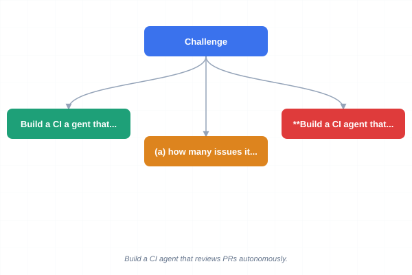
</a>
<a href="../../assets/images/diagrams/loop-engineering/ch10-capstone/challenge-sticky.svg" target="_blank" rel="noopener">
  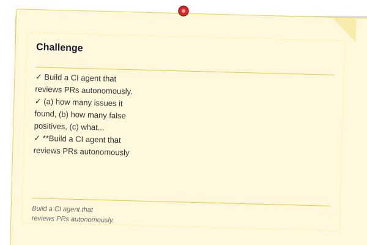
</a>


10. **Build a CI agent that reviews PRs autonomously.** Extend `MultiFileCodingAgent` into a `PRReviewAgent` that:
    - Takes a GitHub PR URL as input
    - Reads the PR diff (via `bash: gh pr diff {url}`)
    - For each file, runs `grep` for code quality issues (N+1 queries, missing error handling, hardcoded secrets)
    - Proposes edits via `proposeEdit` for each issue found
    - Groups edits by file and presents a single review gate per file
    - Posts the review comment on the PR via `bash: gh pr comment {url} --body {review}`
    - Checkpoints after each file review so partial progress survives crashes
    - Enforces a $0.25 max cost per review session

    Test it on a public repository with known issues. Report: (a) how many issues it found, (b) how many false positives, (c) what percentage of the budget was consumed.
