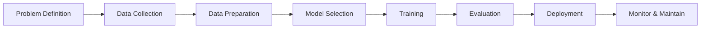

# Chapter 1: Introduction to Machine Learning

> **Previous:** None | **Next:** [Linear Regression](./02-linear-regression.md)

---

## Learning Objectives

- Define machine learning and distinguish it from traditional programming
- Categorize machine learning problems into supervised, unsupervised, and reinforcement learning
- Describe the standard machine learning pipeline from data collection to deployment
- Explain the concept of generalization and the fundamental goal of a learner

## Chapter at a Glance

| Topic | Key Insight | Practical Takeaway |
|-------|-------------|-------------------|
| Definition of ML | ML learns patterns from data without explicit rules | Start with data, not rules |
| Supervised Learning | Learns mapping from labeled inputs to outputs | Use when you have labeled historical data |
| Unsupervised Learning | Discovers hidden patterns in unlabeled data | Great for exploration and segmentation |
| Reinforcement Learning | Agent learns via trial-and-error rewards | Best for sequential decision-making |
| ML Pipeline | Structured workflow from data to deployment | Follow the pipeline to avoid costly mistakes |
| Generalization | Performance on unseen data is the real goal | Always hold out a test set for evaluation |

## Chapter Roadmap

---

## Theory

### What is Machine Learning?
Machine Learning (ML) is a subset of artificial intelligence that provides systems the ability to automatically learn and improve from experience without being explicitly programmed. In traditional programming, a developer writes explicit rules (if-then-else logic) to process data. In machine learning, an algorithm uses data and statistical techniques to "learn" the underlying patterns and rules.

Arthur Samuel defined it in 1959 as the "field of study that gives computers the ability to learn without being explicitly programmed." Tom Mitchell later provided a more formal definition: "A computer program is said to learn from experience E with respect to some class of tasks T and performance measure P, if its performance at tasks in T, as measured by P, improves with experience E."

### Types of Machine Learning
Machine learning algorithms are typically grouped into three main categories based on the nature of the learning "signal" or "feedback" available to the learning system:

1. **Supervised Learning**: The algorithm is trained on labeled data. The model learns a mapping from inputs $x$ to outputs $y$ given a training set of $(x, y)$ pairs. Examples include classification (predicting a discrete label) and regression (predicting a continuous value).
2. **Unsupervised Learning**: The algorithm is trained on unlabeled data. The goal is to find hidden structures or patterns in the input data. Examples include clustering (grouping similar points) and dimensionality reduction.
3. **Reinforcement Learning**: An agent learns to make decisions by performing actions in an environment to maximize some notion of cumulative reward. It learns through trial and error.

### The Machine Learning Pipeline
A typical machine learning project follows a structured workflow:
1. **Problem Definition**: Identifying the business or research objective and determining if ML is the right tool.
2. **Data Collection**: Gathering relevant data from various sources (databases, APIs, sensors).
3. **Data Preparation**: Cleaning data, handling missing values, and performing feature engineering.
4. **Model Selection**: Choosing an appropriate algorithm based on the problem type and data characteristics.
5. **Training**: Feeding the data into the algorithm to optimize its internal parameters.
6. **Evaluation**: Assessing the model's performance on unseen data using specific metrics.
7. **Deployment**: Integrating the model into a production environment to make real-world predictions.

> **One-Sentence Takeaway:** Machine learning systems improve through experience by identifying patterns in data, following a structured pipeline from problem definition to deployment.

> **Remember:** The ML pipeline is iterative, not linear—you will often loop back to data preparation after evaluating your first model.

---

## Examples

### Example 1: Email Spam Filter (Supervised Learning)
This example demonstrates a classic binary classification problem.
- **Task**: Classify an incoming email as "Spam" or "Not Spam" (Ham).
- **Data**: A collection of thousands of emails, each labeled by a human.
- **Process**: The model learns that certain words (e.g., "free," "winner," "urgent") occur more frequently in spam emails.
- **Expected Output**: Given a new email, the system outputs a probability of it being spam.

### Example 2: Customer Segmentation (Unsupervised Learning)
This example shows how to group data without predefined labels.
- **Task**: Group customers of an e-commerce site into distinct segments for targeted marketing.
- **Data**: Purchase history, time spent on site, and demographic information.
- **Process**: A clustering algorithm (like K-means) identifies groups of customers with similar behavior.
- **Expected Output**: A set of "clusters," such as "High-spenders," "Bargain hunters," and "Window shoppers."

> **One-Sentence Takeaway:** Real-world ML applications span both supervised tasks like spam filtering and unsupervised tasks like customer segmentation.

> **Pro Tip:** Start with a simple model before trying complex algorithms. A baseline model gives you a benchmark to measure whether sophisticated methods actually add value.

---

## Concept Comparison Table

| Concept | Definition | Key Distinction | Use Case |
|---------|------------|-----------------|----------|
| Supervised Learning | Learns from labeled (x, y) pairs | Requires ground-truth labels | Spam detection, price prediction |
| Unsupervised Learning | Finds patterns in unlabeled data | No labels needed | Customer segmentation, anomaly detection |
| Reinforcement Learning | Learns via rewards from environment | Sequential decisions with delayed feedback | Game playing, robotics, autonomous driving |
| Traditional Programming | Explicit rules coded by developer | No learning; static behavior | Payroll calculation, inventory management |
| Semi-Supervised Learning | Combines few labels with much unlabeled data | Reduces labeling cost | Medical imaging, web page classification |
| Generalization | Model performs well on new unseen data | Ultimate goal of all ML | All deployment scenarios |

## Quick Reference

| Term | Definition |
|------|------------|
| **Feature** | Individual measurable property of a data point |
| **Label** | The output value (target) to be predicted |
| **Training Set** | Data used to fit the model's parameters |
| **Test Set** | Held-out data for evaluating final performance |
| **Overfitting** | Model memorizes training data fails on new data |
| **Underfitting** | Model is too simple to capture underlying patterns |
| **Bias** | Error from incorrect assumptions in the learning algorithm |
| **Variance** | Error from sensitivity to small fluctuations in training data |
| **Hyperparameter** | Configuration set before training begins |
| **Cross-Validation** | Technique for assessing model stability across data splits |

## Cross-Application Matrix

| ML Paradigm | Healthcare | Finance | E-Commerce | Autonomous Systems |
|-------------|-----------|---------|------------|-------------------|
| Supervised | Disease diagnosis | Fraud detection | Product recommendation | Object recognition |
| Unsupervised | Patient clustering | Market segmentation | Customer profiling | Anomaly in sensor data |
| Reinforcement | Treatment policy optimization | Trading strategy | Dynamic pricing | Path planning and control |

## Chapter Quiz

1. Which type of machine learning is best suited for a task where the model must learn from unlabeled data?
   A) Supervised Learning
   B) Unsupervised Learning
   C) Reinforcement Learning
   D) Active Learning

Answer
**B)** Unsupervised Learning works with unlabeled data to discover hidden patterns.

2. What is the primary goal of generalization in machine learning?
   A) Maximize accuracy on training data
   B) Minimize the number of features
   C) Perform well on new unseen data
   D) Reduce training time

Answer
**C)** Generalization measures how well a model performs on data it has never seen before.

3. In the ML pipeline which step follows model selection?
   A) Data Collection
   B) Problem Definition
   C) Training
   D) Deployment

Answer
**C)** After selecting a model the next step is training it on the prepared data.

---

## Summary

- Machine Learning enables computers to learn from data instead of following static rules.
- The three primary paradigms are supervised, unsupervised, and reinforcement learning.
- Supervised learning requires labeled data to predict future outputs.
- Unsupervised learning discovers latent patterns in data without explicit labels.
- The ML pipeline is an iterative process starting from problem definition to final deployment.
- Generalization—the ability to perform well on new, unseen data—is the ultimate goal of any ML model.

> **One-Sentence Takeaway:** Understanding the three ML paradigms and the end-to-end pipeline is the foundation for applying machine learning effectively.

---

## Exercises

### Review Questions
1. How does the definition of "experience" in Tom Mitchell's formal definition apply to a weather prediction system?
2. What is the key difference between a classification task and a regression task?
3. In which scenario would you prefer unsupervised learning over supervised learning?
4. Why is data preparation often considered the most time-consuming part of the ML pipeline?

### Application Problems
1. Categorize the following as supervised or unsupervised learning:
   - Predicting the price of a house based on its square footage.
   - Grouping news articles by topic without knowing the topics beforehand.
   - Identifying credit card transactions as fraudulent or legitimate.
2. Design a high-level ML pipeline for a system that predicts whether a student will pass a course based on their previous grades and attendance.

### Challenge Problem
1. Discuss the "No Free Lunch" theorem in the context of model selection. Why is it impossible to have a single machine learning algorithm that is the best for every possible problem?
