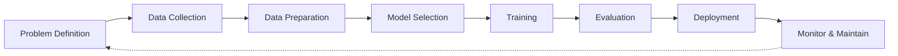
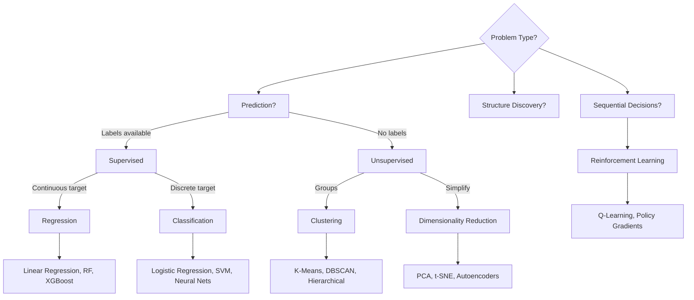
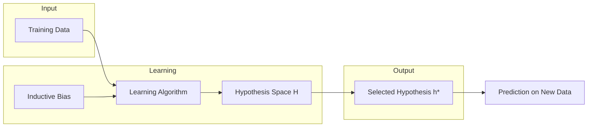
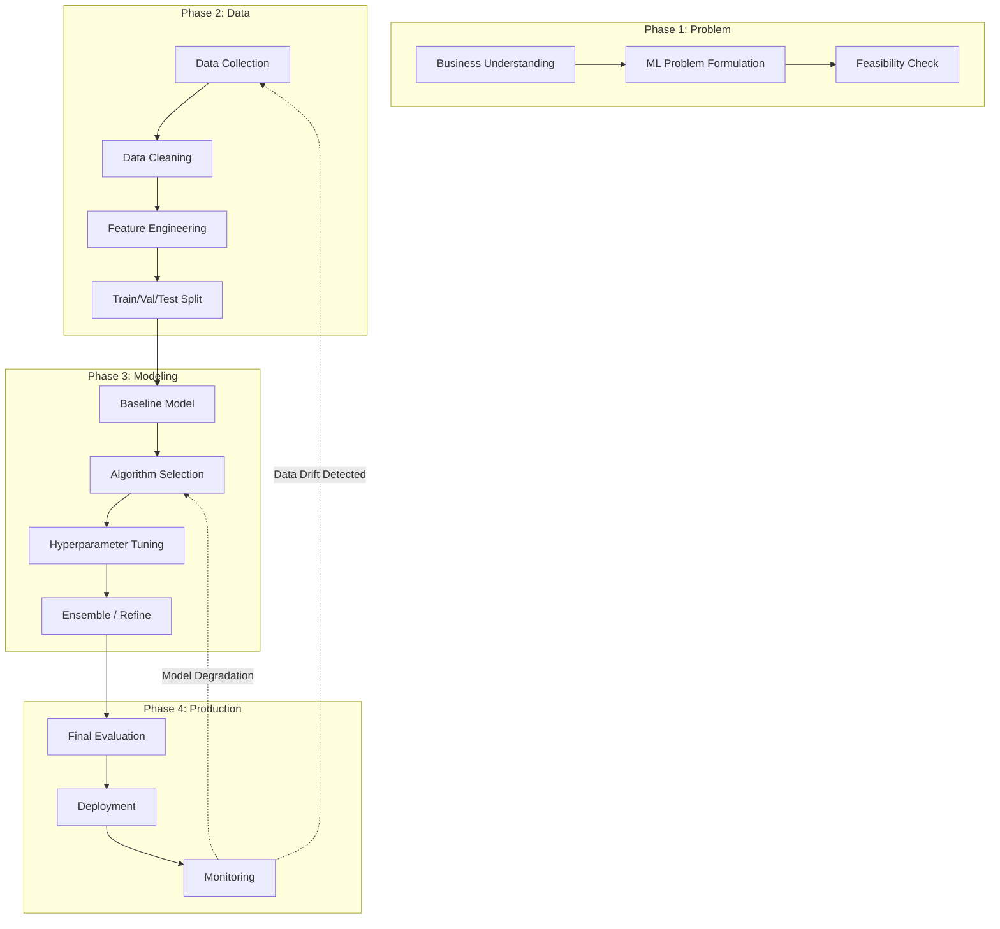

# Chapter 1: Introduction to Machine Learning

> **Previous:** None | **Next:** [Linear Regression](./02-linear-regression.md)

---

## Learning Objectives

- Define machine learning formally and distinguish it from traditional programming paradigms
- Categorize machine learning problems into supervised, unsupervised, reinforcement, and hybrid variants
- Explain the formal components of a learning problem: task T, experience E, performance measure P
- Describe the hypothesis space and the role of inductive bias in generalization
- Understand the No Free Lunch theorem and its implications for algorithm selection
- Walk through the complete ML pipeline from data collection to production deployment

## Chapter at a Glance

| Topic | Key Insight | Practical Takeaway |
|-------|-------------|-------------------|
| Definition of ML | ML learns patterns from data without explicit rules | Start with data, not rules |
| Supervised Learning | Learns mapping from labeled inputs to outputs | Use when you have labeled historical data |
| Unsupervised Learning | Discovers hidden patterns in unlabeled data | Great for exploration and segmentation |
| Reinforcement Learning | Agent learns via trial-and-error rewards | Best for sequential decision-making |
| Hypothesis Space | The set of all possible models the algorithm can represent | Larger spaces require more data or stronger inductive bias |
| Inductive Bias | Assumptions the learner makes to generalize beyond training data | Without bias, learning from finite data is impossible |
| No Free Lunch | No single algorithm dominates all problem distributions | Match algorithm to problem structure, not fashion |
| ML Pipeline | Structured workflow from data to deployment | Follow the pipeline to avoid costly mistakes |

## Chapter Roadmap





---

## Theory

### What is Machine Learning?

Machine learning is a subset of artificial intelligence that provides systems the ability to automatically learn and improve from experience without being explicitly programmed. In traditional programming, a developer writes explicit if-then-else logic to process data. In machine learning, an algorithm uses data and statistical techniques to infer the underlying rules.

**Arthur Samuel** (1959): "The field of study that gives computers the ability to learn without being explicitly programmed."

**Tom Mitchell** (1997) — a more precise, formal definition: "A computer program is said to learn from experience $E$ with respect to some class of tasks $T$ and performance measure $P$, if its performance at tasks in $T$, as measured by $P$, improves with experience $E$."

### Formal Problem Definition

Every machine learning problem consists of three components:

- **Task $T$**: What the system should do (e.g., classify emails as spam/ham, predict housing prices)
- **Experience $E$**: The data the system sees (e.g., 10,000 labeled emails, 5,000 housing records)
- **Performance Measure $P$**: How we evaluate success (e.g., accuracy, MSE, F1-score)

A learning algorithm takes experience $E$ as input and outputs a hypothesis $h \in \mathcal{H}$ (the hypothesis space) that performs task $T$. The goal is to find $h$ that maximizes $P$ on unseen data, not just the training set.

### Hypothesis Space and Inductive Bias

The **hypothesis space** $\mathcal{H}$ is the set of all functions the learning algorithm can possibly produce. For linear regression, $\mathcal{H}$ contains all linear functions. For neural networks, it contains an enormous family of non-linear functions.

A larger $\mathcal{H}$ means the algorithm can represent more complex patterns, but it also increases the risk of overfitting (memorizing noise).

**Inductive Bias** is the set of assumptions a learner uses to select one hypothesis over another when multiple hypotheses fit the training data equally well. There are two main types:

1. **Sebe's Bias (Preference Bias)**: The learner prefers simpler hypotheses (e.g., Occam's razor — shorter decision trees, smaller weights)
2. **Mitchell's Bias (Language Bias)**: The hypothesis space itself restricts what concepts can be learned (e.g., a linear classifier cannot represent XOR)

Without inductive bias, learning from finite data is impossible — an unbiased learner would treat all hypotheses consistent with the data as equally valid, resulting in no basis for choosing one over another on unseen examples.



### Types of Machine Learning

Machine learning algorithms fall into three primary categories based on the nature of the learning signal available:

| Type | Signal | Goal | Example Algorithms |
|------|--------|------|-------------------|
| Supervised Learning | Labeled pairs $(x, y)$ | Learn mapping $f: X \to Y$ | Linear regression, logistic regression, SVM, neural nets |
| Unsupervised Learning | Unlabeled inputs $x$ alone | Discover hidden structure $p(x)$ | K-means, PCA, DBSCAN, autoencoders |
| Reinforcement Learning | Reward signal $r$ from environment | Learn policy $\pi(s) \to a$ that maximizes cumulative reward | Q-learning, Policy gradients, DQN |

**Hybrid paradigms** also exist:

- **Semi-Supervised Learning**: Combines a small set of labeled data with a large set of unlabeled data. Common when labeling is expensive (medical imaging, web page classification).
- **Self-Supervised Learning**: The model generates its own labels from the data structure (e.g., predicting masked words in a sentence, predicting the next frame in a video). This powers modern LLMs like GPT and BERT.
- **Multi-Task Learning**: A single model is trained on multiple related tasks simultaneously, sharing representations across tasks.
- **Active Learning**: The algorithm selectively queries a human annotator for labels on the most informative examples.

### Types of Supervised Learning Problems

| Problem Type | Target $y$ | Loss Function | Evaluation Metric |
|---|---|---|---|
| Regression | Continuous ($\mathbb{R}$) | MSE, MAE, Huber | $R^2$, RMSE, MAE |
| Binary Classification | $\{0, 1\}$ | Binary cross-entropy, hinge | Accuracy, precision, recall, F1, AUC-ROC |
| Multi-class Classification | $\{1, 2, \dots, K\}$ | Categorical cross-entropy | Accuracy, macro-F1, confusion matrix |
| Multi-label Classification | $\{0, 1\}^K$ | Binary cross-entropy per label | Precision@K, label-ranking average precision |
| Ordinal Regression | Ordered categories | Cumulative logit | Quadratic-weighted kappa, MAE |
| Ranking | Ordered lists | Pairwise ranking hinge | NDCG, MAP, MRR |

### The Inductive Learning Hypothesis

A fundamental assumption in machine learning:

> Any hypothesis found to approximate the target function well over a sufficiently large set of training examples will also approximate the target function well over other unobserved examples.

This assumption is what makes generalization possible — but it only holds when:

1. The training data is representative (drawn i.i.d. from the same distribution as the test data)
2. The hypothesis space is appropriately sized (not too large, not too small)
3. The inductive bias is aligned with the true underlying function

### No Free Lunch Theorem

The No Free Lunch (NFL) theorem (Wolpert, 1996) states:

> Averaged over all possible data distributions, no learning algorithm performs better than any other.

In other words, if an algorithm performs exceptionally well on one class of problems, it must perform correspondingly worse on others. There is no universal best learner.

**Practical implications**:
- Algorithm performance is problem-dependent — always match the algorithm to the data characteristics
- Domain knowledge (feature engineering, choice of inductive bias) is what distinguishes successful ML projects
- Ensemble of diverse algorithms can hedge against NFL — if one fails on a distribution shift, another may succeed
- The theorem motivates the need for cross-validation and empirical comparison on your specific dataset

### The Machine Learning Pipeline

A typical ML project follows a structured workflow with feedback loops:

**1. Problem Definition**
- Translate business objectives into ML tasks
- Define success metrics ($P$)
- Determine feasibility: do we have enough data? Is the signal strong enough?

**2. Data Collection**
- Identify data sources: databases, APIs, logs, sensors
- Consider quantity (how many examples needed?) and quality (noise, bias, missing values)
- Legal and ethical considerations: privacy, consent, fairness

**3. Data Preparation (often 60-80% of project time)**
- Cleaning: handle missing values, remove duplicates, fix data-type errors
- Transformation: scaling, normalization, encoding categorical variables
- Feature engineering: create new features from domain knowledge
- Splitting: training / validation / test sets

**4. Model Selection**
- Start with a simple baseline (mean predictor, linear model)
- Iterate toward more complex models as needed
- Use cross-validation to compare candidates

**5. Training**
- Feed prepared data into the learning algorithm
- Optimize parameters to minimize the loss function
- Monitor for convergence and overfitting

**6. Evaluation**
- Assess performance on the held-out test set
- Compute multiple metrics relevant to the problem
- Error analysis: where does the model fail? Are failures systematic?

**7. Deployment**
- Integrate model into production system
- Set up API endpoints, batch prediction jobs, or edge deployment
- Build monitoring for data drift, concept drift, and performance degradation

**8. Monitor & Maintain**
- Track prediction distributions vs. training distributions
- Retrain on fresh data periodically
- Roll back if metrics degrade



> **One-Sentence Takeaway:** Machine learning systems improve through experience by identifying patterns in data, following a structured pipeline from problem definition to deployment.

> **Remember:** The ML pipeline is iterative, not linear — you will often loop back to data preparation after evaluating your first model.

---

## Examples

### Example 1: Email Spam Filter (Supervised Learning)

This example demonstrates a classic binary classification problem.

- **Task $T$**: Classify an incoming email as "Spam" or "Not Spam" (Ham).
- **Experience $E$**: A collection of 50,000 emails, each labeled by a human reader.
- **Performance $P$**: F1-score on a held-out test set of 10,000 emails.
- **Approach**: The model learns that certain words ("free," "winner," "urgent") occur more frequently in spam. The decision boundary separates spam from ham in the feature space of word frequencies.

**Walkthrough**:
1. Collect historical emails with labels
2. Extract features: bag-of-words or TF-IDF vectors from email body and subject
3. Train a classifier (logistic regression, Naive Bayes, or Random Forest)
4. Evaluate on held-out set: precision, recall, false positive rate
5. Deploy as an email server plugin that moves suspected spam to a separate folder

### Example 2: Customer Segmentation (Unsupervised Learning)

This example shows how to group data without predefined labels.

- **Task $T$**: Group customers into distinct segments for targeted marketing.
- **Experience $E$**: Purchase history, time spent on site, demographics for 100,000 users.
- **Performance $P$**: Silhouette score; business validation via A/B testing of marketing campaigns.
- **Approach**: A clustering algorithm (K-means) identifies groups with similar behavior.

**Walkthrough**:
1. Preprocess: normalize features (income and age have different scales)
2. Run K-means with $K=4$ clusters
3. Interpret segments: "High-spenders," "Bargain hunters," "Window shoppers," "Loyalists"
4. Validate by designing targeted campaigns and measuring lift in conversion rate

### Example 3: ML Problem Setup Runner (TypeScript)

```typescript
/**
 * Formal ML problem definition and hypothesis space exploration
 */
interface MLProblem {
    name: string;
    taskType: 'regression' | 'binary_classification' | 'multiclass' | 'clustering';
    features: number;
    samples: number;
    task: string;
    experience: string;
    performance: string;
}

class HypothesisSpace {
    private capacity: number;
    private bias: string;

    constructor(capacity: number, bias: string) {
        this.capacity = capacity;
        this.bias = bias;
    }

    fitsProblem(problem: MLProblem): boolean {
        return this.capacity >= problem.features;
    }

    describe(): string {
        return `Hypothesis space: capacity=${this.capacity}, inductive bias="${this.bias}"`;
    }
}

function evaluateLearning(problem: MLProblem, hypothesis: HypothesisSpace): string {
    const dataRatio = problem.samples / problem.features;
    let verdict: string;

    if (dataRatio < 10) {
        verdict = `HIGH RISK: Only ${dataRatio.toFixed(1)} samples per feature. Strong inductive bias required.`;
    } else if (dataRatio < 50) {
        verdict = `MODERATE: ${dataRatio.toFixed(1)} samples per feature. Moderate regularization recommended.`;
    } else {
        verdict = `LOW RISK: ${dataRatio.toFixed(1)} samples per feature. Sufficient data for complex hypothesis spaces.`;
    }

    return `Problem: ${problem.name} (${problem.taskType})\n` +
           `Samples: ${problem.samples}, Features: ${problem.features}\n` +
           `Task: ${problem.task}\n` +
           `Performance measure: ${problem.performance}\n` +
           hypothesis.describe() + '\n' +
           `Veridct: ${verdict}`;
}

const spamFilter: MLProblem = {
    name: 'Email Spam Detection',
    taskType: 'binary_classification',
    features: 50000,
    samples: 50000,
    task: 'Classify email as spam or ham',
    experience: '50,000 labeled emails with word frequency features',
    performance: 'F1-score on held-out test set'
};

const housingPrice: MLProblem = {
    name: 'House Price Prediction',
    taskType: 'regression',
    features: 15,
    samples: 5000,
    task: 'Predict median house price from features',
    experience: '5,000 housing records with 15 features each',
    performance: 'RMSE and R-squared on test set'
};

const linearHypothesis = new HypothesisSpace(100, 'Linear relationships between features and target');
const neuralHypothesis = new HypothesisSpace(1000000, 'Complex non-linear feature interactions');

console.log(evaluateLearning(spamFilter, linearHypothesis));
console.log('---');
console.log(evaluateLearning(housingPrice, neuralHypothesis));
```

**Expected Output**: Shows how sample-to-feature ratio and hypothesis space capacity determine the learning strategy.

> **One-Sentence Takeaway:** Real-world ML applications span both supervised tasks like spam filtering and unsupervised tasks like customer segmentation, with the choice of algorithm guided by problem structure and data availability.

> **Pro Tip:** Start with a simple model before trying complex algorithms. A baseline model gives you a benchmark to measure whether sophisticated methods actually add value.

---

## Practical Takeaways

1. **Problem structure determines algorithm choice** — match the learning paradigm (supervised, unsupervised, RL) to the available signal
2. **Hypothesis spaces interact with data quantity** — larger hypothesis spaces need more data or stronger inductive bias
3. **No Free Lunch is real** — test multiple algorithms on your specific data rather than relying on default choices
4. **Pipeline discipline prevents failures** — skipping data preparation or evaluation leads to models that fail in production
5. **Monitoring is not optional** — data distributions shift over time; production models require continuous validation

## Concept Comparison Table

| Concept | Definition | Key Distinction | Use Case |
|---------|------------|-----------------|----------|
| Supervised Learning | Learns from labeled (x, y) pairs | Requires ground-truth labels | Spam detection, price prediction |
| Unsupervised Learning | Finds patterns in unlabeled data | No labels needed | Customer segmentation, anomaly detection |
| Reinforcement Learning | Learns via rewards from environment | Sequential decisions with delayed feedback | Game playing, robotics, autonomous driving |
| Traditional Programming | Explicit rules coded by developer | No learning; static behavior | Payroll calculation, inventory management |
| Semi-Supervised Learning | Combines few labels with much unlabeled data | Reduces labeling cost | Medical imaging, web page classification |
| Self-Supervised Learning | Generates labels from data structure | Scales to massive unlabeled corpora | LLM pretraining (GPT, BERT) |
| Generalization | Model performs well on new unseen data | Ultimate goal of all ML | All deployment scenarios |

## Quick Reference

| Term | Definition |
|------|------------|
| **Feature** | Individual measurable property of a data point |
| **Label** | The output value (target) to be predicted |
| **Training Set** | Data used to fit the model's parameters |
| **Validation Set** | Data used for hyperparameter tuning and model selection |
| **Test Set** | Held-out data for evaluating final performance |
| **Hypothesis Space** | Set of all possible models the algorithm can produce |
| **Inductive Bias** | Assumptions made to generalize beyond training data |
| **Overfitting** | Model memorizes training data, fails on new data |
| **Underfitting** | Model is too simple to capture underlying patterns |
| **Bias** | Error from incorrect assumptions in the learning algorithm |
| **Variance** | Error from sensitivity to small fluctuations in training data |
| **Hyperparameter** | Configuration set before training begins |
| **Cross-Validation** | Technique for assessing model stability across data splits |
| **Generalization** | Ability to perform well on unseen data |

## Cross-Application Matrix

| ML Paradigm | Healthcare | Finance | E-Commerce | Autonomous Systems |
|---|---|---|---|---|
| Supervised | Disease diagnosis | Fraud detection | Product recommendation | Object recognition |
| Unsupervised | Patient clustering | Market segmentation | Customer profiling | Anomaly in sensor data |
| Reinforcement | Treatment policy optimization | Trading strategy | Dynamic pricing | Path planning and control |
| Self-Supervised | Protein folding prediction | -- | Product representation learning | Scene representation learning |

## Chapter Quiz

1. Which component of Tom Mitchell's formal definition refers to the training data fed to the algorithm?
   A) Task T
   B) Experience E
   C) Performance measure P
   D) Hypothesis space H

<details><summary>Answer</summary>**B)** Experience E represents the data the system sees during learning.
</details>

2. What is the primary implication of the No Free Lunch theorem?
   A) All ML algorithms are equally computationally expensive
   B) No single algorithm is best for all problem distributions
   C) Free lunch refers to the cost of training data
   D) The theorem only applies to unsupervised learning

<details><summary>Answer</summary>**B)** Averaged over all possible problems, no learner outperforms any other — algorithm choice must be problem-specific.
</details>

3. A dataset has 200 samples and 200 features. What is the primary concern?
   A) The model will underfit
   B) The ratio of samples to features is dangerously low
   C) The data is perfectly balanced
   D) Feature scaling is impossible

<details><summary>Answer</summary>**B)** With a 1:1 sample-to-feature ratio, the model can easily memorize the data (overfit) without learning generalizable patterns.
</details>

4. Why is inductive bias necessary for machine learning?
   A) It eliminates the need for training data
   B) Without it, all hypotheses consistent with data are equally valid
   C) It guarantees the global optimum
   D) It reduces the computational cost of training

<details><summary>Answer</summary>**B)** Inductive bias provides the assumptions needed to select one hypothesis over another, enabling generalization beyond training data.
</details>

5. In the ML pipeline, which step typically consumes the most time?
   A) Model Selection
   B) Training
   C) Data Preparation
   D) Deployment

<details><summary>Answer</summary>**C)** Data preparation (cleaning, transformation, feature engineering) commonly accounts for 60-80% of project time.
</details>

---

## Summary

- Machine learning enables computers to learn from data instead of following static rules, formalized by Mitchell's definition $(T, E, P)$.
- The three primary paradigms are supervised, unsupervised, and reinforcement learning, with hybrid variants (semi-supervised, self-supervised) bridging gaps.
- Hypothesis space size and inductive bias jointly determine what a learner can represent and how it generalizes.
- The No Free Lunch theorem reminds us that algorithm choice must be problem-specific.
- The ML pipeline is an iterative process from problem definition through monitoring, with data preparation as the most time-consuming phase.
- Generalization — performance on unseen data — is the ultimate goal, achieved through careful evaluation and inductive bias alignment.

> **One-Sentence Takeaway:** Understanding the three ML paradigms, hypothesis spaces, inductive bias, and the end-to-end pipeline is the foundation for applying machine learning effectively.

---

## Exercises

### Review Questions
1. How does the definition of "experience" in Tom Mitchell's formal definition apply to a weather prediction system?
2. What is the key difference between a classification task and a regression task?
3. In which scenario would you prefer unsupervised learning over supervised learning?
4. Why is data preparation often considered the most time-consuming part of the ML pipeline?
5. Explain why an unbiased learner cannot generalize beyond the training data.
6. Provide two examples of inductive bias in common ML algorithms.

### Application Problems
1. Categorize the following as supervised or unsupervised learning:
   - Predicting the price of a house based on its square footage
   - Grouping news articles by topic without knowing the topics beforehand
   - Identifying credit card transactions as fraudulent or legitimate
   - Generating captions for images (hint: consider the supervision signal)

2. Design a high-level ML pipeline for a system that predicts whether a student will pass a course based on their previous grades and attendance.

3. For each of the following scenarios, estimate the minimum number of training samples needed if you have 50 features and plan to use:
   - A linear model (low capacity hypothesis space)
   - A deep neural network (high capacity hypothesis space)

### Challenge Problem
1. Discuss the "No Free Lunch" theorem in the context of model selection. Why is it impossible to have a single machine learning algorithm that is the best for every possible problem? How does the theorem guide practical ML workflow decisions?
