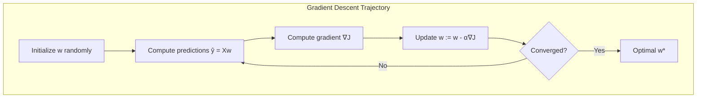
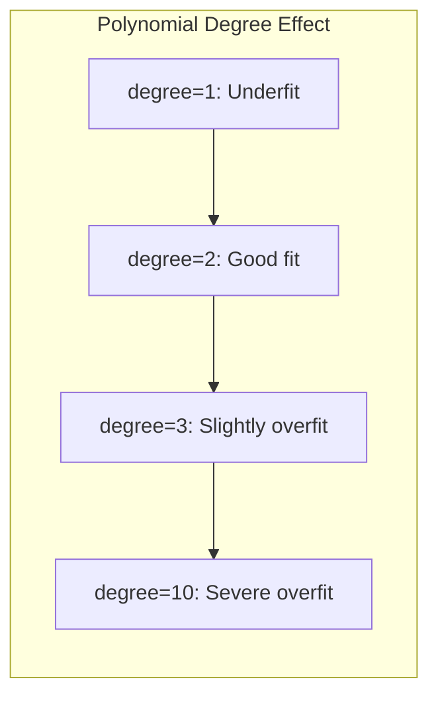
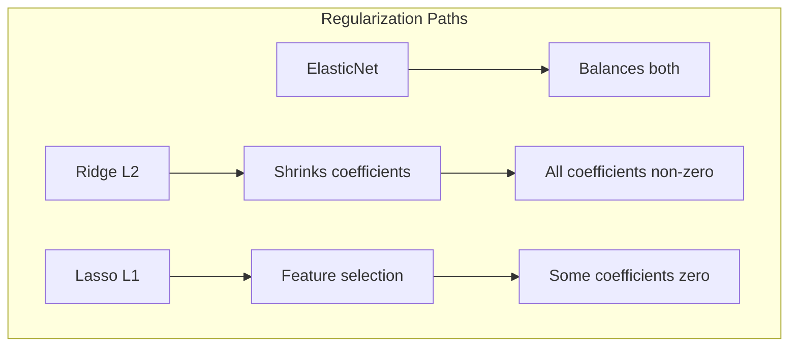
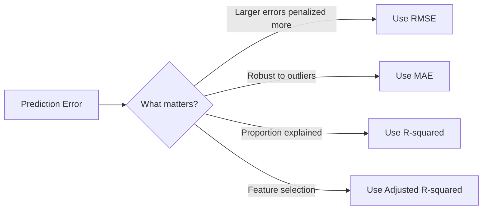

# Chapter 2: Linear Regression

> **Previous:** [Introduction](./01-introduction.md) | **Next:** [Logistic Regression](./03-logistic-regression.md)

---

## Learning Objectives

- Derive the simple linear regression model and estimate parameters via ordinary least squares
- Formulate linear regression in matrix notation and derive the normal equation
- Implement gradient descent from scratch for parameter optimization
- Understand feature scaling, polynomial regression, and the bias-variance tradeoff in regression
- Explain and apply regularization techniques: Ridge, Lasso, and ElasticNet
- Evaluate regression models using R-squared, adjusted R-squared, RMSE, and MAE

## Chapter at a Glance

| Topic | Key Insight | Practical Takeaway |
|-------|-------------|-------------------|
| Simple Linear Regression | Models relationship between one predictor and response | Use for bivariate analysis with a linear trend |
| Cost Function (MSE) | Quantifies prediction error by squaring residuals | Lower MSE means better fit; minimize via optimization |
| Gradient Descent | Iteratively adjusts weights to minimize cost | Tune learning rate carefully — too high diverges, too low stalls |
| Normal Equation | Closed-form solution via matrix algebra | Use for small datasets (<10k features); avoid for large |
| Polynomial Regression | Adds non-linear feature transformations | Capture curved relationships while staying in the linear model family |
| Ridge (L2) Regularization | Penalizes squared magnitude of weights | Use when many features with small-to-medium effects |
| Lasso (L1) Regularization | Penalizes absolute magnitude of weights; drives some to zero | Use for feature selection with sparse effects |
| R-squared | Proportion of variance explained by the model | Always check adjusted R-squared when adding features |

## Chapter Roadmap

```mermaid
flowchart LR
    A[Simple Linear Regression] --> B[Cost Function MSE]
    B --> C[Ordinary Least Squares]
    C --> D[Matrix Formulation]
    D --> E[Gradient Descent]
    E --> F[Feature Scaling]
    F --> G[Polynomial Regression]
    G --> H[Regularization]
    H --> I[Ridge / Lasso / ElasticNet]
    I --> J[Model Evaluation]
    J --> K[R-squared, RMSE, MAE]
```



---

## Theory

### Simple Linear Regression

Simple Linear Regression models the relationship between a single predictor variable $x$ and a continuous response variable $y$. The model assumes a linear relationship:

$$y = w_0 + w_1 x + \epsilon$$

Where:
- $y$ is the predicted output (dependent variable)
- $x$ is the input feature (independent variable)
- $w_0$ is the y-intercept (bias term)
- $w_1$ is the slope (weight term)
- $\epsilon$ is the random error term, assumed $\sim \mathcal{N}(0, \sigma^2)$

**Goal**: Find $w_0$ and $w_1$ that minimize the sum of squared residuals between predictions $\hat{y}^{(i)}$ and actual $y^{(i)}$.

### The Cost Function: Mean Squared Error (MSE)

The Mean Squared Error quantifies the average squared difference between predicted and actual values:

$$J(w_0, w_1) = \frac{1}{2n} \sum_{i=1}^{n} (\hat{y}^{(i)} - y^{(i)})^2 = \frac{1}{2n} \sum_{i=1}^{n} (w_0 + w_1 x^{(i)} - y^{(i)})^2$$

The $\frac{1}{2}$ factor simplifies the derivative. Minimizing $J$ yields the "line of best fit."

### Ordinary Least Squares (Closed-Form Solution)

For simple regression, the optimal parameters have closed-form solutions:

$$w_1 = \frac{\sum_{i=1}^{n} (x^{(i)} - \bar{x})(y^{(i)} - \bar{y})}{\sum_{i=1}^{n} (x^{(i)} - \bar{x})^2} = \frac{\text{Cov}(x, y)}{\text{Var}(x)}$$

$$w_0 = \bar{y} - w_1 \bar{x}$$

### Matrix Formulation and the Normal Equation

For multiple linear regression, we write the model in matrix notation:

$$\mathbf{y} = \mathbf{X}\mathbf{w} + \boldsymbol{\epsilon}$$

Where:
- $\mathbf{y} \in \mathbb{R}^n$ is the vector of target values
- $\mathbf{X} \in \mathbb{R}^{n \times (d+1)}$ is the design matrix (first column all 1s for bias)
- $\mathbf{w} \in \mathbb{R}^{d+1}$ is the parameter vector
- $\boldsymbol{\epsilon} \in \mathbb{R}^n$ is the error vector

The cost function in matrix form:

$$J(\mathbf{w}) = \frac{1}{2n} (\mathbf{X}\mathbf{w} - \mathbf{y})^T (\mathbf{X}\mathbf{w} - \mathbf{y})$$

Taking the gradient and setting to zero yields the **Normal Equation**:

$$\nabla J(\mathbf{w}) = \frac{1}{n} \mathbf{X}^T (\mathbf{X}\mathbf{w} - \mathbf{y}) = 0$$

$$\mathbf{w} = (\mathbf{X}^T \mathbf{X})^{-1} \mathbf{X}^T \mathbf{y}$$

**Conditions for invertibility**: $\mathbf{X}^T \mathbf{X}$ must be full rank (no linearly dependent features). If features are multicollinear or $n < d$, the matrix is singular and requires regularization or pseudo-inverse (SVD).

### Gradient Descent

When the dataset is large ($n > 10,000$ or $d > 10,000$), the normal equation becomes computationally expensive ($O(d^3)$ for the matrix inverse). Gradient descent iteratively updates parameters:

$$w_j := w_j - \alpha \frac{\partial}{\partial w_j} J(\mathbf{w})$$

The gradient for linear regression:

$$\frac{\partial}{\partial w_j} J(\mathbf{w}) = \frac{1}{n} \sum_{i=1}^{n} (\hat{y}^{(i)} - y^{(i)}) x_j^{(i)}$$

**Gradient Descent Variants**:

| Variant | Update Rule | Pros | Cons |
|---------|------------|------|------|
| Batch GD | Uses all $n$ samples per update | Stable, guaranteed convergence on convex functions | Slow for large $n$ |
| Stochastic GD | Uses 1 random sample per update | Fast per iteration, escapes local minima | Noisy convergence |
| Mini-batch GD | Uses $b$ samples per update (32-256) | Balance of speed and stability | Most common in practice |



### Feature Scaling

Gradient descent converges faster when features are on similar scales. Common techniques:

**Standardization (Z-score)**:
$$x_j^{(i)} = \frac{x_j^{(i)} - \mu_j}{\sigma_j}$$

Output has mean 0 and variance 1. Does not bound values. Robust to outliers.

**Min-Max Normalization**:
$$x_j^{(i)} = \frac{x_j^{(i)} - \min(x_j)}{\max(x_j) - \min(x_j)}$$

Output bounded to $[0, 1]$. Sensitive to outliers.

**Why scaling matters**: Without scaling, features with larger magnitudes dominate the gradient, causing the optimizer to take a winding path toward the minimum instead of a direct one.

### Polynomial Regression

Linear regression can model non-linear relationships by augmenting the feature matrix with polynomial terms:

$$y = w_0 + w_1 x + w_2 x^2 + w_3 x^3 + \dots + w_d x^d$$

The model is still linear in the parameters $w$ — it is polynomial in the features. This means the normal equation and gradient descent work identically; we just add columns to $\mathbf{X}$.

**Degree selection tradeoff**:
- Low degree ($d=1,2$): High bias, may underfit
- High degree ($d=10+$): Low bias but high variance, overfits dramatically
- **Rule of thumb**: Start with $d=1$, increase until validation error stops improving; use cross-validation to select degree



### Overfitting in Regression

Overfitting occurs when the model fits the training data too closely, capturing noise rather than the underlying signal. Indicators:

- Training error is much lower than validation/test error
- Coefficients have large magnitudes
- Model predictions change drastically with small data perturbations

### Regularization

Regularization adds a penalty term to the cost function to discourage large weights, reducing overfitting.

**Ridge Regression (L2)**:
$$J(\mathbf{w}) = \frac{1}{2n} \sum_{i=1}^{n} (\hat{y}^{(i)} - y^{(i)})^2 + \lambda \sum_{j=1}^{d} w_j^2$$

The L2 penalty shrinks all coefficients toward zero but never exactly to zero. The closed-form solution becomes:

$$\mathbf{w} = (\mathbf{X}^T \mathbf{X} + \lambda \mathbf{I})^{-1} \mathbf{X}^T \mathbf{y}$$

Adding $\lambda\mathbf{I}$ ensures the matrix is always invertible — even when $\mathbf{X}^T\mathbf{X}$ is singular.

**Lasso Regression (L1)**:
$$J(\mathbf{w}) = \frac{1}{2n} \sum_{i=1}^{n} (\hat{y}^{(i)} - y^{(i)})^2 + \lambda \sum_{j=1}^{d} |w_j|$$

The L1 penalty drives some coefficients to exactly zero, performing automatic feature selection. No closed-form solution; solved via coordinate descent or subgradient methods.

**ElasticNet**:
$$J(\mathbf{w}) = \frac{1}{2n} \sum_{i=1}^{n} (\hat{y}^{(i)} - y^{(i)})^2 + \lambda \left( \rho \sum_{j=1}^{d} |w_j| + \frac{1-\rho}{2} \sum_{j=1}^{d} w_j^2 \right)$$

Combines L1 and L2 penalties using mixing parameter $\rho \in [0, 1]$. Use when there are multiple correlated features (Lasso picks only one from a correlated group; ElasticNet picks all).



### Model Evaluation Metrics

**R-squared (Coefficient of Determination)**:
$$R^2 = 1 - \frac{\sum (\hat{y}^{(i)} - y^{(i)})^2}{\sum (y^{(i)} - \bar{y})^2}$$

Interpreted as the proportion of variance in $y$ explained by the model. Ranges from $(-\infty, 1]$; negative values indicate the model is worse than the mean predictor.

**Adjusted R-squared**:
$$\bar{R}^2 = 1 - \frac{(1 - R^2)(n - 1)}{n - d - 1}$$

Penalizes adding irrelevant features. Unlike $R^2$, adjusted $R^2$ can decrease when a useless feature is added.

**RMSE (Root Mean Squared Error)**:
$$RMSE = \sqrt{\frac{1}{n} \sum (\hat{y}^{(i)} - y^{(i)})^2}$$

In the same units as $y$. Sensitive to outliers.

**MAE (Mean Absolute Error)**:
$$MAE = \frac{1}{n} \sum |\hat{y}^{(i)} - y^{(i)}|$$

Less sensitive to outliers than RMSE.



> **One-Sentence Takeaway:** Linear regression finds the optimal line (or hyperplane) by minimizing the squared error between predictions and actual values, with regularization (Ridge, Lasso, ElasticNet) controlling overfitting.

> **Warning:** If the learning rate is too high, Gradient Descent may overshoot the minimum and diverge; if too low, convergence may be impractically slow.

---

## Examples

### Example 1: LinearRegression Class in TypeScript

```typescript
/**
 * Full Linear Regression implementation with:
 * - Normal equation (closed-form)
 * - Gradient descent (batch, mini-batch)
 * - Ridge regularization
 * - R-squared evaluation
 */
class LinearRegression {
    private weights: number[] | null = null;
    private bias: number = 0;

    constructor(
        private method: 'normal' | 'gradient' = 'normal',
        private learningRate: number = 0.01,
        private epochs: number = 1000,
        private lambda: number = 0.0
    ) {}

    private addBiasColumn(X: number[][]): number[][] {
        return X.map(row => [1, ...row]);
    }

    private transpose(M: number[][]): number[][] {
        const rows = M.length, cols = M[0].length;
        const result: number[][] = Array.from({ length: cols }, () => Array(rows).fill(0));
        for (let i = 0; i < rows; i++)
            for (let j = 0; j < cols; j++)
                result[j][i] = M[i][j];
        return result;
    }

    private multiply(A: number[][], B: number[][]): number[][] {
        const rows = A.length, cols = B[0].length, inner = B.length;
        const result: number[][] = Array.from({ length: rows }, () => Array(cols).fill(0));
        for (let i = 0; i < rows; i++)
            for (let j = 0; j < cols; j++)
                for (let k = 0; k < inner; k++)
                    result[i][j] += A[i][k] * B[k][j];
        return result;
    }

    private inverse(M: number[][]): number[][] {
        const n = M.length;
        const aug: number[][] = M.map((row, i) =>
            [...row, ...Array.from({ length: n }, (_, j) => (i === j ? 1 : 0))]
        );
        for (let col = 0; col < n; col++) {
            let maxRow = col;
            for (let row = col + 1; row < n; row++)
                if (Math.abs(aug[row][col]) > Math.abs(aug[maxRow][col])) maxRow = row;
            [aug[col], aug[maxRow]] = [aug[maxRow], aug[col]];
            const pivot = aug[col][col];
            for (let j = 0; j < 2 * n; j++) aug[col][j] /= pivot;
            for (let row = 0; row < n; row++) {
                if (row !== col) {
                    const factor = aug[row][col];
                    for (let j = 0; j < 2 * n; j++) aug[row][j] -= factor * aug[col][j];
                }
            }
        }
        return aug.map(row => row.slice(n));
    }

    private predictMatrix(X: number[][], w: number[]): number[] {
        return X.map(row =>
            row.reduce((sum, xi, j) => sum + xi * w[j], 0)
        );
    }

    fitNormal(X: number[][], y: number[]): number[] {
        const Xb = this.addBiasColumn(X);
        const Xt = this.transpose(Xb);
        const XtX = this.multiply(Xt, Xb);
        if (this.lambda > 0) {
            for (let i = 1; i < XtX.length; i++) XtX[i][i] += this.lambda;
        }
        const XtX_inv = this.inverse(XtX);
        const Xty = this.multiply(Xt, y.map(v => [v]));
        const w = this.multiply(XtX_inv, Xty).map(r => r[0]);
        this.bias = w[0];
        this.weights = w.slice(1);
        return w;
    }

    fitGradient(X: number[][], y: number[]): number[] {
        const Xb = this.addBiasColumn(X);
        const n = Xb.length;
        const d = Xb[0].length;
        let w: number[] = Array(d).fill(0);

        for (let epoch = 0; epoch < this.epochs; epoch++) {
            const preds = this.predictMatrix(Xb, w);
            const gradient: number[] = Array(d).fill(0);
            for (let j = 0; j < d; j++) {
                for (let i = 0; i < n; i++) {
                    gradient[j] += (preds[i] - y[i]) * Xb[i][j];
                }
                gradient[j] = gradient[j] / n + (j > 0 ? (this.lambda / n) * w[j] : 0);
            }
            for (let j = 0; j < d; j++) w[j] -= this.learningRate * gradient[j];
        }

        this.bias = w[0];
        this.weights = w.slice(1);
        return w;
    }

    fit(X: number[][], y: number[]): void {
        if (this.method === 'normal') this.fitNormal(X, y);
        else this.fitGradient(X, y);
    }

    predict(X: number[][]): number[] {
        if (!this.weights) throw new Error('Model not fitted');
        return X.map(row =>
            this.bias + row.reduce((sum, xi, j) => sum + xi * this.weights![j], 0)
        );
    }

    score(X: number[][], y: number[]): number {
        const preds = this.predict(X);
        const mean = y.reduce((a, b) => a + b) / y.length;
        const ssRes = y.reduce((sum, yi, i) => sum + (yi - preds[i]) ** 2, 0);
        const ssTot = y.reduce((sum, yi) => sum + (yi - mean) ** 2, 0);
        return 1 - ssRes / ssTot;
    }

    getWeights(): { bias: number; weights: number[] } {
        return { bias: this.bias, weights: this.weights || [] };
    }
}

// Usage: House price prediction
const X = [[1500], [2000], [2500], [1800], [2200], [3000]];
const y = [300000, 400000, 500000, 360000, 440000, 600000];

console.log('=== Normal Equation ===');
const lrNormal = new LinearRegression('normal');
lrNormal.fit(X, y);
console.log(`Weights: bias=${lrNormal.getWeights().bias.toFixed(2)}, slope=${lrNormal.getWeights().weights[0].toFixed(2)}`);
console.log(`R-squared: ${lrNormal.score(X, y).toFixed(4)}`);

console.log('\n=== Gradient Descent ===');
const lrGD = new LinearRegression('gradient', 0.0000001, 5000);
lrGD.fit(X, y);
console.log(`Weights: bias=${lrGD.getWeights().bias.toFixed(2)}, slope=${lrGD.getWeights().weights[0].toFixed(2)}`);
console.log(`R-squared: ${lrGD.score(X, y).toFixed(4)}`);

console.log('\n=== Ridge Regularization ===');
const lrRidge = new LinearRegression('normal', 0.01, 1000, 10.0);
lrRidge.fit(X, y);
console.log(`Weights: bias=${lrRidge.getWeights().bias.toFixed(2)}, slope=${lrRidge.getWeights().weights[0].toFixed(2)}`);

console.log('\n=== Prediction for 1800 sqft ===');
console.log(`Predicted price: $${lrNormal.predict([[1800]])[0].toFixed(2)}`);

console.log('\n=== Multiple Features ===');
const X_multi = [
    [1500, 3, 2],   // sqft, bedrooms, bathrooms
    [2000, 4, 3],
    [2500, 4, 3],
    [1800, 3, 2],
    [2200, 4, 2],
    [3000, 5, 4]
];
const lrMulti = new LinearRegression('gradient', 0.00000001, 10000);
lrMulti.fit(X_multi, y);
console.log(`Weights: bias=${lrMulti.getWeights().bias.toFixed(2)}, weights=[${lrMulti.getWeights().weights.map(w => w.toFixed(4)).join(', ')}]`);
console.log(`R-squared: ${lrMulti.score(X_multi, y).toFixed(4)}`);
```

**Expected Output**: Demonstrates normal equation vs. gradient descent, regularization effect, and multiple regression.

### Example 2: Feature Scaling Performance Comparison

```typescript
function standardize(X: number[][]): number[][] {
    const n = X.length, d = X[0].length;
    const means: number[] = Array(d).fill(0);
    const stds: number[] = Array(d).fill(0);
    for (let j = 0; j < d; j++) {
        for (let i = 0; i < n; i++) means[j] += X[i][j];
        means[j] /= n;
    }
    for (let j = 0; j < d; j++) {
        for (let i = 0; i < n; i++) stds[j] += (X[i][j] - means[j]) ** 2;
        stds[j] = Math.sqrt(stds[j] / n);
    }
    return X.map(row => row.map((xi, j) => (xi - means[j]) / (stds[j] || 1)));
}

const X_unscaled = [[1, 100000], [2, 200000], [3, 300000], [4, 400000]];
const X_scaled = standardize(X_unscaled);
console.log('Before scaling:', X_unscaled);
console.log('After scaling:', X_scaled.map(r => r.map(v => v.toFixed(4))));
```

> **One-Sentence Takeaway:** Linear regression with multiple features captures how each predictor independently affects the target, enabling richer and more accurate models.

> **Pro Tip:** Always check for multicollinearity among features — when predictors are highly correlated, coefficient estimates become unstable and hard to interpret.

---

## Practical Takeaways

1. **Normal equation for small data, gradient descent for large** — the O($d^3$) matrix inversion in the normal equation limits it to $d < 10{,}000$
2. **Scale features before gradient descent** — standardization is the safest default for most problems
3. **Regularization is essential when $d \gg n$** — Ridge ensures invertibility; Lasso performs feature selection
4. **Polynomial terms capture curvature** — but use cross-validation to select the degree and avoid overfitting
5. **R-squared alone is misleading** — always check residuals, adjusted R-squared, and validation performance
6. **ElasticNet when features are correlated** — Lasso arbitrarily picks one from a correlated group; ElasticNet selects groups together

## Concept Comparison Table

| Concept | Definition | Key Distinction | Use Case |
|---------|------------|-----------------|----------|
| Simple Linear Regression | One predictor, one response | Single feature only | Price vs. house size |
| Multiple Linear Regression | Multiple predictors, one response | Handles complex relationships | Price vs. size, location, age |
| Mean Squared Error | Average of squared residuals | Penalizes large errors more | Standard regression metric |
| Mean Absolute Error | Average of absolute residuals | Less sensitive to outliers | Robust error measurement |
| Gradient Descent | Iterative optimization | Scales to large datasets | Millions of samples |
| Normal Equation | Closed-form least squares | No iteration needed | Small to medium datasets |
| Ridge (L2) | $\lambda \sum w_j^2$ penalty | Shrinks coefficients toward zero | Multicollinearity, many features |
| Lasso (L1) | $\lambda \sum \|w_j\|$ penalty | Drives coefficients to zero | Feature selection |
| ElasticNet | Mixed L1 + L2 penalty | Both shrinkage and selection | Correlated features, sparse solutions |
| Polynomial Regression | $x, x^2, x^3, \dots$ terms | Captures non-linearity | Curved relationships |

## Quick Reference

| Term | Formula / Definition |
|------|---------------------|
| Hypothesis | $h_w(x) = w_0 + w_1x$ (simple) or $\mathbf{w}^T\mathbf{x}$ (multiple) |
| Cost Function (MSE) | $J(w) = \frac{1}{2n}\sum(h_w(x^{(i)}) - y^{(i)})^2$ |
| Gradient Descent Update | $w_j := w_j - \alpha \frac{\partial}{\partial w_j}J(w)$ |
| Normal Equation | $\mathbf{w} = (\mathbf{X}^T\mathbf{X})^{-1}\mathbf{X}^T\mathbf{y}$ |
| Ridge Solution | $\mathbf{w} = (\mathbf{X}^T\mathbf{X} + \lambda\mathbf{I})^{-1}\mathbf{X}^T\mathbf{y}$ |
| R-squared | $R^2 = 1 - \frac{SS_{res}}{SS_{tot}}$ |
| Adjusted R-squared | $\bar{R}^2 = 1 - \frac{(1-R^2)(n-1)}{n-d-1}$ |
| RMSE | $\sqrt{\frac{1}{n}\sum(\hat{y} - y)^2}$ |
| MAE | $\frac{1}{n}\sum\|\hat{y} - y\|$ |
| Learning Rate ($\alpha$) | Step size for each gradient update |

## Cross-Application Matrix

| Domain | Application | Features Used | Model Type |
|--------|------------|---------------|------------|
| Real Estate | House price prediction | Sq ft, bedrooms, location | Multiple LR |
| Finance | Stock return forecasting | Volume, sentiment, macro indicators | Multiple LR with Ridge |
| Healthcare | Patient length-of-stay prediction | Age, vitals, diagnosis codes | Lasso for feature selection |
| Energy | Power consumption forecasting | Temperature, hour, day of week | Polynomial + Ridge |
| Retail | Sales forecasting | Past sales, promotion, seasonality | ElasticNet |
| Manufacturing | Yield prediction | Temperature, pressure, material specs | Multiple LR |

## Chapter Quiz

1. What does the Mean Squared Error cost function measure?
   A) The absolute difference between predictions and actuals
   B) The average squared difference between predictions and actuals
   C) The proportion of variance explained
   D) The slope of the regression line

<details><summary>Answer</summary>**B)** MSE averages the squared differences between predicted and actual values.
</details>

2. What happens if the learning rate in Gradient Descent is set too high?
   A) Training becomes very slow
   B) The algorithm may overshoot and fail to converge
   C) The cost function becomes convex
   D) Feature scaling becomes unnecessary

<details><summary>Answer</summary>**B)** A large learning rate causes the algorithm to overshoot the minimum, potentially diverging.
</details>

3. Under what condition does the normal equation fail?
   A) The dataset has fewer than 1000 samples
   B) The features are multicollinear or $d > n$
   C) The target variable is categorical
   D) The learning rate is poorly tuned

<details><summary>Answer</summary>**B)** When $\mathbf{X}^T\mathbf{X}$ is singular (multicollinearity or $d > n$), the inverse does not exist. Ridge regularization fixes this.
</details>

4. Which regularization method can drive coefficients to exactly zero?
   A) Ridge (L2)
   B) Lasso (L1)
   C) ElasticNet with $\rho = 0$
   D) Both A and C

<details><summary>Answer</summary>**B)** Lasso's L1 penalty induces sparsity, pushing some coefficients to exactly zero, performing feature selection.
</details>

5. If adding a new feature increases $R^2$ but decreases adjusted $R^2$, what can you conclude?
   A) The model is overfitting
   B) The feature is irrelevant or noisy
   C) The sample size is too small
   D) Both A and B are correct

<details><summary>Answer</summary>**D)** Adjusted $R^2$ penalizes irrelevant features. An increase in $R^2$ but decrease in adjusted $R^2$ indicates the feature adds more noise than signal.
</details>

---

## TypeScript Implementation: Multiple Regression, Ridge, Lasso, and Feature Engineering

```typescript
class MultipleLinearRegression {
    private weights: number[] = [];
    private bias: number = 0;

    fit(features: number[][], targets: number[]): void {
        const n = features.length;
        const d = features[0].length;
        const X = features.map(row => [1, ...row]);
        const Xt = X[0].map((_, i) => X.map(row => row[i]));
        const XtX = Xt.map(row => X[0].map((_, j) => row.reduce((s, _, k) => s + X[k][j] * row[k], 0)));
        const nCols = XtX.length;
        const augmented = XtX.map((row, i) => [...row, Xt.reduce((s, row2) => s + row2.reduce((sum, v, j) => sum + v * targets[j], 0), 0)]);
        for (let i = 0; i < nCols; i++) {
            const pivot = augmented[i][i];
            for (let j = i; j <= nCols; j++) augmented[i][j] /= pivot;
            for (let k = 0; k < nCols; k++) {
                if (k !== i) {
                    const factor = augmented[k][i];
                    for (let j = i; j <= nCols; j++) augmented[k][j] -= factor * augmented[i][j];
                }
            }
        }
        this.bias = augmented[0][nCols];
        this.weights = augmented.slice(1).map(r => r[nCols]);
    }

    predict(features: number[]): number {
        return features.reduce((s, f, i) => s + f * this.weights[i], this.bias);
    }

    rSquared(features: number[][], targets: number[]): number {
        const preds = features.map(f => this.predict(f));
        const meanT = targets.reduce((a, b) => a + b, 0) / targets.length;
        const ssRes = targets.reduce((s, t, i) => s + (t - preds[i]) ** 2, 0);
        const ssTot = targets.reduce((s, t) => s + (t - meanT) ** 2, 0);
        return 1 - ssRes / ssTot;
    }

    adjustedRSquared(features: number[][], targets: number[]): number {
        const n = targets.length;
        const p = features[0].length;
        const r2 = this.rSquared(features, targets);
        return 1 - ((1 - r2) * (n - 1)) / (n - p - 1);
    }
}

class RidgeRegression {
    private weights: number[] = [];
    private bias: number = 0;
    private alpha: number;

    constructor(alpha: number = 1.0) { this.alpha = alpha; }

    fit(features: number[][], targets: number[]): void {
        const n = features.length;
        const d = features[0].length;
        const X = features.map(row => [1, ...row]);
        const Xt = X[0].map((_, i) => X.map(row => row[i]));
        const XtX = Xt.map(row => X[0].map((_, j) => row.reduce((s, _, k) => s + X[k][j] * row[k], 0)));
        for (let i = 1; i <= d; i++) XtX[i][i] += this.alpha;
        const Xty = Xt.map(row => row.reduce((s, v, j) => s + v * targets[j], 0));
        const aug = XtX.map((row, i) => [...row, Xty[i]]);
        for (let i = 0; i <= d; i++) {
            const pivot = aug[i][i];
            for (let j = i; j <= d + 1; j++) aug[i][j] /= pivot;
            for (let k = 0; k <= d; k++) {
                if (k !== i) {
                    const factor = aug[k][i];
                    for (let j = i; j <= d + 1; j++) aug[k][j] -= factor * aug[i][j];
                }
            }
        }
        this.bias = aug[0][d + 1];
        this.weights = aug.slice(1).map(r => r[d + 1]);
    }

    predict(features: number[]): number { return features.reduce((s, f, i) => s + f * this.weights[i], this.bias); }
}

class LassoRegression {
    private weights: number[] = [];
    private bias: number = 0;
    private alpha: number;
    private lr: number;
    private epochs: number;

    constructor(alpha: number = 0.1, lr: number = 0.01, epochs: number = 1000) {
        this.alpha = alpha; this.lr = lr; this.epochs = epochs;
    }

    fit(features: number[][], targets: number[]): void {
        const n = features.length;
        const d = features[0].length;
        this.weights = new Array(d).fill(0);
        this.bias = 0;
        for (let ep = 0; ep < this.epochs; ep++) {
            for (let i = 0; i < n; i++) {
                const pred = this.predict(features[i]);
                const err = pred - targets[i];
                for (let j = 0; j < d; j++) {
                    const grad = (2 / n) * err * features[i][j] + this.alpha * Math.sign(this.weights[j]);
                    this.weights[j] -= this.lr * grad;
                }
                this.bias -= this.lr * (2 / n) * err;
            }
        }
    }

    predict(features: number[]): number { return features.reduce((s, f, i) => s + f * this.weights[i], this.bias); }
}

class PolynomialFeatureMapper {
    static map(features: number[], degree: number): number[] {
        const result: number[] = [];
        const d = features.length;
        const generate = (idx: number, current: number[]) => {
            if (current.length === degree) { result.push(current.reduce((a, b) => a * b, 1)); return; }
            for (let i = idx; i < d; i++) generate(i, [...current, features[i]]);
        };
        for (let deg = 1; deg <= degree; deg++) generate(0, []);
        return result;
    }
}

// Demo
const X = [[1, 2], [2, 3], [3, 5], [4, 4], [5, 6], [6, 7], [7, 8], [8, 9]];
const y = [5, 8, 11, 12, 16, 19, 22, 25];
const mlr = new MultipleLinearRegression();
mlr.fit(X, y);
console.log("MLR R²:", mlr.rSquared(X, y).toFixed(4));
console.log("MLR Adj R²:", mlr.adjustedRSquared(X, y).toFixed(4));

const ridge = new RidgeRegression(0.5);
ridge.fit(X, y);
console.log("Ridge predict [9,10]:", ridge.predict([9, 10]).toFixed(2));

const lasso = new LassoRegression(0.01, 0.001, 5000);
lasso.fit(X, y);
console.log("Lasso predict [9,10]:", lasso.predict([9, 10]).toFixed(2));
console.log("Poly features of [2,3] deg 2:", PolynomialFeatureMapper.map([2, 3], 2));
```

## Summary

- Linear regression models the relationship between a dependent variable and one or more independent variables, solvable via the normal equation (closed-form) or gradient descent (iterative).
- The Mean Squared Error is the standard metric used to evaluate the fit of the regression line.
- Gradient Descent is a fundamental algorithm for optimizing weights by following the steepest descent of the cost function; feature scaling is essential for fast convergence.
- Polynomial regression captures non-linear relationships within the linear model framework by augmenting features.
- Regularization (Ridge, Lasso, ElasticNet) controls overfitting by penalizing large weights.
- R-squared, adjusted R-squared, RMSE, and MAE provide complementary views of model quality.

> **One-Sentence Takeaway:** Linear regression is the foundation of predictive modeling — its core ideas of cost functions, gradient-based optimization, regularization, and feature engineering generalize to nearly every ML algorithm.

---

## Exercises

### Review Questions
1. Why do we square the errors in the MSE cost function instead of using absolute values?
2. What happens to the model if the learning rate $\alpha$ is set too low?
3. What is the difference between a parameter and a hyperparameter in the context of Gradient Descent?
4. Explain the geometric interpretation of a multiple linear regression model with two features.
5. Why does Lasso perform feature selection while Ridge does not?
6. How does adjusted R-squared differ from R-squared, and when should you prefer it?

### Application Problems
1. Given $w_0 = 5, w_1 = 2$, calculate the MSE for the points: $(1, 8), (2, 10), (3, 12)$.
2. Manually perform one step of Gradient Descent for $w_1$ given $x=2, y=6$, current $w_1=2$, and $\alpha=0.1$. Use the simplified cost $J = (w_1x - y)^2$.
3. Compute the condition number of $\mathbf{X} = \begin{bmatrix}1 & 2 & 3 \\ 1 & 4 & 5 \\ 1 & 6 & 7\end{bmatrix}$ and determine if the normal equation is numerically stable.
4. Fit a polynomial regression of degree 2 to the points $(-2, 4), (-1, 1), (0, 0), (1, 1), (2, 4)$ using the normal equation and report $R^2$.
5. Given a dataset with $n=100, d=50$ and severe multicollinearity, which regularization strategy would you recommend? Justify.

### Mermaid: Linear Regression Pipeline

```mermaid
flowchart LR
    A[Features X] --> C
    B[Labels y] --> C
    C[Gradient Descent] --> D[Weights w]
    D --> E[Predict ŷ = Xw]
    E --> F[MSE = ½(y − ŷ)²]
    F --> G{Converged?}
    G -->|No| C
    G -->|Yes| H[Model w*]
    H --> I[Predict on new data]
```

### Challenge Problem
1. Derive the Normal Equation $\mathbf{w} = (\mathbf{X}^T\mathbf{X})^{-1}\mathbf{X}^T\mathbf{y}$ by setting the gradient of $J(\mathbf{w}) = \frac{1}{2}(\mathbf{X}\mathbf{w} - \mathbf{y})^T(\mathbf{X}\mathbf{w} - \mathbf{y})$ to zero. Under what conditions does $\mathbf{X}^T\mathbf{X}$ become non-invertible? Show how Ridge regularization fixes this issue by modifying the matrix to $\mathbf{X}^T\mathbf{X} + \lambda\mathbf{I}$.
