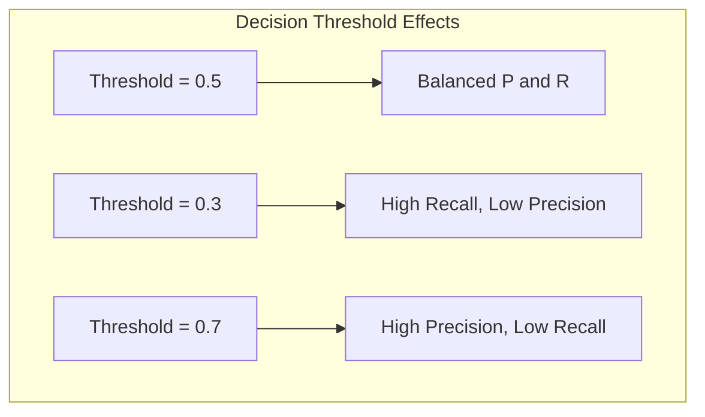
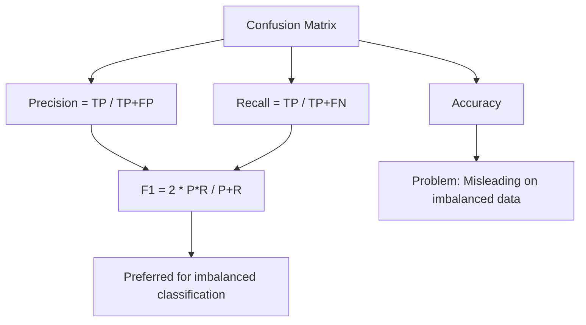
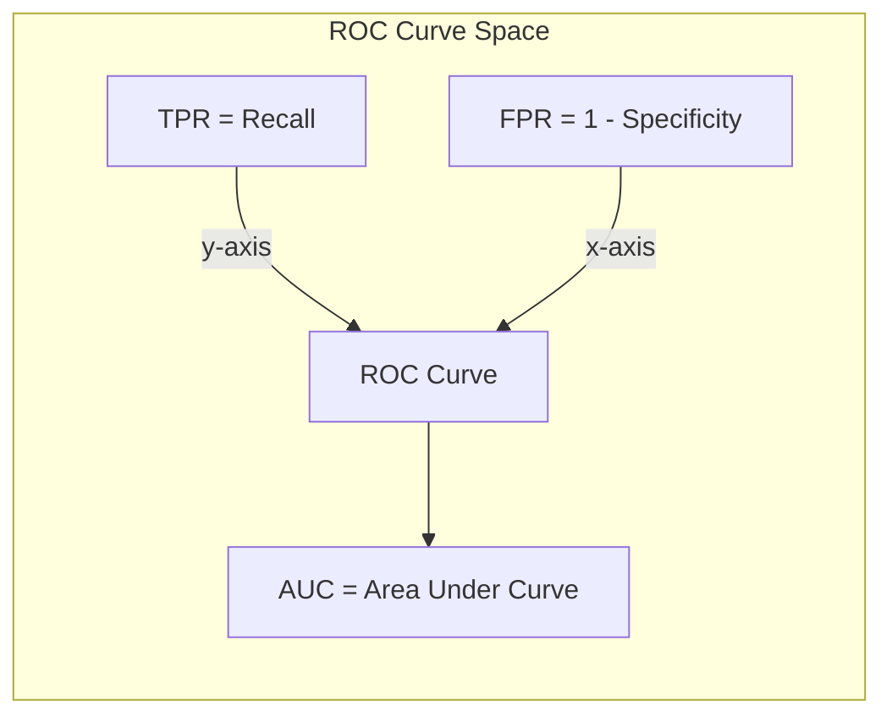

# Chapter 3: Logistic Regression

> **Previous:** [Linear Regression](./02-linear-regression.md) | **Next:** [Decision Trees](./04-decision-trees.md)

---

## Learning Objectives

- Understand why linear regression fails for classification and how logistic regression solves the problem
- Derive the sigmoid function and interpret its output as class probabilities
- Define and differentiate between odds, log-odds, and decision boundaries
- Implement binary cross-entropy loss and gradient descent for logistic regression
- Evaluate classifiers using confusion matrices, precision, recall, F1-score, and ROC-AUC
- Extend logistic regression to multi-class classification via softmax
- Apply L1 and L2 regularization to logistic regression

<!-- Image Gallery -->
<section class="lesson-visuals" aria-label="Visual learning resources">
  <header><span>VISUAL LEARNING</span><h2>See it. Review it. Remember it.</h2></header>
  <a class="lesson-visual-card" href="../../../assets/images/lessons/machine-learning/03-logistic-regression/.png" target="_blank" rel="noopener">
    
    <span><strong>Handwritten notes</strong>Condensed notes for deliberate review.</span>
  </a>
  <a class="lesson-visual-card" href="../../../assets/images/lessons/machine-learning/03-logistic-regression/.png" target="_blank" rel="noopener">
    
    <span><strong>Sticky-note revision</strong>Fast recall prompts for revision.</span>
  </a>
  <a class="lesson-visual-card" href="../../../assets/images/lessons/machine-learning/03-logistic-regression/.png" target="_blank" rel="noopener">
    
    <span><strong>Visual concept guide</strong>A connected explanation of the key ideas.</span>
  </a>
</section>
<!-- End Image Gallery -->


## Chapter at a Glance

| Topic | Key Insight | Practical Takeaway |
|-------|-------------|-------------------|
| Classification vs. Regression | LR outputs discrete probabilities not continuous values | Use logistic (not linear) regression for yes/no problems |
| Sigmoid Function | Maps any real number to a value between 0 and 1 | Output is interpretable as class probability |
| Odds and Log-Odds | Log-odds is linear: $\log(p/(1-p)) = \mathbf{w}^T\mathbf{x}$ | The model is linear in the log-odds space |
| Decision Boundary | Threshold at $h_w(x) = 0.5$ separates classes | Adjust threshold to trade off precision and recall |
| Cross-Entropy Loss | Penalizes confident wrong predictions heavily | Convex loss ensures reliable gradient descent |
| Confusion Matrix | TP, TN, FP, FN enable all classification metrics | Always inspect the full matrix, not just accuracy |
| ROC-AUC | Measures separability across all thresholds | Threshold-independent evaluation metric |
| Multi-Class Extension | Softmax generalizes sigmoid to K classes | Use when predicting among three or more categories |
| Regularization | Prevents overfitting by penalizing large weights | Add L1 or L2 regularization to improve generalization |

## Chapter Roadmap

```mermaid
flowchart LR
    A[Binary Classification Problem] --> B[Sigmoid Function]
    B --> C[Odds & Log-Odds]
    C --> D[Decision Boundary]
    D --> E[Cross-Entropy Loss]
    E --> F[Gradient Descent Optimization]
    F --> G[Probability Output]
    G --> H[Decision Threshold]
    H --> I[Class Prediction]
    I --> J[Confusion Matrix]
    J --> K[Precision / Recall / F1 / AUC]
```



---

## Theory

### Classification vs. Regression


Linear regression is designed for continuous outputs. Using it for classification has fundamental problems:

1. **Output range**: Predictions can fall outside $[0, 1]$, making them uninterpretable as probabilities
2. **Sensitivity to outliers**: Adding more positive examples far from the decision boundary shifts the line
3. **Non-convex loss**: MSE with threshold-based classification creates a non-convex optimization landscape

Logistic Regression solves these problems by passing the linear output through a non-linear squashing function (sigmoid) and using a convex loss (cross-entropy) designed for classification.

### The Sigmoid Function


The sigmoid (logistic) function maps any real-valued number to the $(0, 1)$ interval:

$$\sigma(z) = \frac{1}{1 + e^{-z}}$$

Where $z = \mathbf{w}^T\mathbf{x} = w_0 + w_1x_1 + \dots + w_dx_d$.

**Properties**:
- $\sigma(0) = 0.5$
- $\sigma(z) \to 1$ as $z \to +\infty$
- $\sigma(z) \to 0$ as $z \to -\infty$
- Derivative: $\sigma'(z) = \sigma(z)(1 - \sigma(z))$ ? this simplifies gradient computation

The hypothesis outputs the probability of the positive class:

$$h_w(x) = P(y=1 | x; w) = \sigma(\mathbf{w}^T\mathbf{x})$$

### Odds and Log-Odds


**Odds** are the ratio of the probability of an event happening to the probability of it not happening:

$$\text{Odds} = \frac{p}{1-p}$$

For logistic regression:
$$\frac{p}{1-p} = \frac{\sigma(\mathbf{w}^T\mathbf{x})}{1 - \sigma(\mathbf{w}^T\mathbf{x})} = e^{\mathbf{w}^T\mathbf{x}}$$

Taking the natural log gives the **log-odds** (logit function):

$$\log\left(\frac{p}{1-p}\right) = \mathbf{w}^T\mathbf{x}$$

This reveals that logistic regression is **linear in the log-odds space** ? each unit increase in $x_j$ multiplies the odds by $e^{w_j}$.

### Decision Boundary


The model predicts a class by comparing the probability to a threshold, typically 0.5:

$$\hat{y} = \begin{cases} 1 & \text{if } h_w(x) \geq 0.5 \\ 0 & \text{if } h_w(x) &lt; 0.5 \end{cases}$$

Since $h_w(x) \geq 0.5 \iff \mathbf{w}^T\mathbf{x} \geq 0$, the decision boundary is $\mathbf{w}^T\mathbf{x} = 0$.

For a 2D problem with $z = w_0 + w_1x_1 + w_2x_2$, the boundary is the line:
$$x_2 = -\frac{w_0}{w_2} - \frac{w_1}{w_2}x_1$$

**Threshold tuning**: Changing the threshold from 0.5 to a lower value increases recall but decreases precision. In medical screening (detect disease), a low threshold (0.3) minimizes false negatives. In spam detection (avoid false alarms), a high threshold (0.7) minimizes false positives.



### Cross-Entropy Loss (Log Loss)


Mean Squared Error is unsuitable for logistic regression because it creates a non-convex loss surface (due to the sigmoid non-linearity). Instead, we use **Binary Cross-Entropy**:

$$J(w) = -\frac{1}{n} \sum_{i=1}^{n} \left[ y^{(i)} \log(h_w(x^{(i)})) + (1 - y^{(i)}) \log(1 - h_w(x^{(i)})) \right]$$

**Intuition**:
- When $y=1$: $J = -\log(h_w(x))$. If $h_w(x) \to 0$, the loss $\to \infty$ (very bad). If $h_w(x) \to 1$, the loss $\to 0$ (perfect).
- When $y=0$: $J = -\log(1 - h_w(x))$. If $h_w(x) \to 1$, the loss $\to \infty$. If $h_w(x) \to 0$, the loss $\to 0$.

The gradient of cross-entropy with respect to weights has a surprisingly simple form:

$$\frac{\partial J}{\partial w_j} = \frac{1}{n} \sum_{i=1}^{n} (h_w(x^{(i)}) - y^{(i)}) x_j^{(i)}$$

This is identical to the gradient of MSE for linear regression! The difference lies in $h_w(x)$ being the sigmoid-transformed value instead of the linear value.

### Gradient Descent for Logistic Regression


The update rule:

$$w_j := w_j - \alpha \frac{1}{n} \sum_{i=1}^{n} (h_w(x^{(i)}) - y^{(i)}) x_j^{(i)}$$

With L2 regularization (Ridge), the cost function becomes:

$$J(w) = -\frac{1}{n} \sum_{i=1}^{n} \left[ y^{(i)} \log(h_w(x^{(i)})) + (1 - y^{(i)}) \log(1 - h_w(x^{(i)})) \right] + \frac{\lambda}{2n} \sum_{j=1}^{d} w_j^2$$

### Confusion Matrix and Derived Metrics


The confusion matrix summarizes classification results:

| | Predicted Positive | Predicted Negative |
|---|---|---|
| **Actual Positive** | True Positive (TP) | False Negative (FN) |
| **Actual Negative** | False Positive (FP) | True Negative (TN) |

**Accuracy**: $\frac{TP + TN}{TP + TN + FP + FN}$

**Precision** (Positive Predictive Value): $\frac{TP}{TP + FP}$ ? "How many predicted positives are actually positive?"

**Recall** (Sensitivity, True Positive Rate): $\frac{TP}{TP + FN}$ ? "How many actual positives did we catch?"

**Specificity** (True Negative Rate): $\frac{TN}{TN + FP}$

**F1-Score**: $2 \times \frac{Precision \times Recall}{Precision + Recall}$ ? harmonic mean of precision and recall

**F-beta Score**: $(1 + \beta^2) \frac{Precision \times Recall}{\beta^2 \times Precision + Recall}$ ? weights recall by $\beta$ times more than precision



### ROC Curves and AUC


The **Receiver Operating Characteristic (ROC)** curve plots the True Positive Rate (Recall) against the False Positive Rate (1 - Specificity) across all classification thresholds.

- A perfect classifier has TPR = 1, FPR = 0 (top-left corner)
- A random classifier follows the diagonal (TPR = FPR)
- The closer the curve is to the top-left, the better

The **Area Under the ROC Curve (AUC)** summarizes the curve as a single number:
- AUC = 0.5: Random guessing
- AUC = 0.7-0.8: Acceptable discrimination
- AUC = 0.8-0.9: Excellent discrimination
- AUC = 1.0: Perfect separation

**AUC interpretation**: The probability that a randomly chosen positive example receives a higher model score than a randomly chosen negative example.



### Multi-Class Classification


**One-vs-Rest (OvR)**: Train $K$ binary classifiers (one per class vs. all others). Predict the class with the highest confidence score. Used by sklearn's `LogisticRegression(multi_class='ovr')`.

**Softmax Regression (Multinomial Logistic Regression)**: Generalizes the sigmoid to $K$ classes:

$$P(y = k | x; W) = \frac{e^{\mathbf{w}_k^T \mathbf{x}}}{\sum_{j=1}^{K} e^{\mathbf{w}_j^T \mathbf{x}}}$$

The softmax function produces a valid probability distribution ($\sum P(y=k) = 1$, each probability $\in [0, 1]$).

The loss function for softmax regression is **Categorical Cross-Entropy**:

$$J(W) = -\frac{1}{n} \sum_{i=1}^{n} \sum_{k=1}^{K} \mathbf{1}\{y^{(i)} = k\} \log P(y^{(i)} = k | x^{(i)}; W)$$

### Regularization for Logistic Regression


Same principles as linear regression:

- **L2 (Ridge)**: Adds $\frac{\lambda}{2n} \sum \|w_j\|^2$ ? prevents any single feature from dominating
- **L1 (Lasso)**: Adds $\frac{\lambda}{n} \sum \|w_j\|$ ? drives irrelevant feature weights to zero

The $C$ parameter in sklearn's `LogisticRegression` is the inverse of regularization strength: $C = 1/\lambda$. Smaller $C$ = stronger regularization.

> **One-Sentence Takeaway:** Logistic regression uses the sigmoid function to convert linear outputs into probabilities and cross-entropy loss to optimize classification decisions.

> **Remember:** The decision boundary is defined by $\mathbf{w}^T\mathbf{x} = 0$; changing the classification threshold (e.g., from 0.5 to 0.3) alters precision and recall without retraining the model.

---

## Examples

### Example 1: LogisticRegression Class in TypeScript

```typescript
/**
 * Binary Logistic Regression with:
 * - Sigmoid activation
 * - Binary cross-entropy loss
 * - Gradient descent optimization
 * - L2 regularization
 * - Confusion matrix and derived metrics
 */
class LogisticRegression {
    private weights: number[] = [];
    private bias: number = 0;

    constructor(
        private learningRate: number = 0.01,
        private epochs: number = 1000,
        private lambda: number = 0.0
    ) {}

    private sigmoid(z: number): number {
        return 1 / (1 + Math.exp(-z));
    }

    private sigmoidVector(z: number[]): number[] {
        return z.map(v => this.sigmoid(v));
    }

    fit(X: number[][], y: number[]): number[] {
        const n = X.length;
        const d = X[0].length;
        this.weights = Array(d).fill(0);
        let losses: number[] = [];

        for (let epoch = 0; epoch < this.epochs; epoch++) {
            const logits = X.map(row =>
                this.bias + row.reduce((sum, xi, j) => sum + xi * this.weights[j], 0)
            );
            const probs = this.sigmoidVector(logits);

            // Cross-entropy loss
            let loss = 0;
            for (let i = 0; i < n; i++) {
                loss -= y[i] * Math.log(probs[i] + 1e-15) + (1 - y[i]) * Math.log(1 - probs[i] + 1e-15);
            }
            loss = loss / n;
            // Add L2 regularization term
            const regTerm = (this.lambda / (2 * n)) * this.weights.reduce((s, w) => s + w * w, 0);
            loss += regTerm;
            losses.push(loss);

            // Gradient descent
            const gradBias = (1 / n) * probs.reduce((sum, p, i) => sum + (p - y[i]), 0);
            const gradWeights = Array(d).fill(0);
            for (let j = 0; j < d; j++) {
                for (let i = 0; i < n; i++) {
                    gradWeights[j] += (probs[i] - y[i]) * X[i][j];
                }
                gradWeights[j] = gradWeights[j] / n + (this.lambda / n) * this.weights[j];
            }

            this.bias -= this.learningRate * gradBias;
            for (let j = 0; j < d; j++) {
                this.weights[j] -= this.learningRate * gradWeights[j];
            }

            if (epoch % 200 === 0) {
                console.log(`Epoch ${epoch}, Loss: ${loss.toFixed(4)}`);
            }
        }
        return losses;
    }

    predictProbability(X: number[][]): number[] {
        return X.map(row =>
            this.sigmoid(this.bias + row.reduce((sum, xi, j) => sum + xi * this.weights[j], 0))
        );
    }

    predict(X: number[][], threshold: number = 0.5): number[] {
        return this.predictProbability(X).map(p => (p >= threshold ? 1 : 0));
    }

    confusionMatrix(yTrue: number[], yPred: number[]): {
        tp: number; tn: number; fp: number; fn: number;
        accuracy: number; precision: number; recall: number;
        f1: number; specificity: number;
    } {
        let tp = 0, tn = 0, fp = 0, fn = 0;
        for (let i = 0; i < yTrue.length; i++) {
            if (yTrue[i] === 1 && yPred[i] === 1) tp++;
            else if (yTrue[i] === 0 && yPred[i] === 0) tn++;
            else if (yTrue[i] === 0 && yPred[i] === 1) fp++;
            else if (yTrue[i] === 1 && yPred[i] === 0) fn++;
        }
        const accuracy = (tp + tn) / (tp + tn + fp + fn);
        const precision = tp / (tp + fp + 1e-15);
        const recall = tp / (tp + fn + 1e-15);
        const f1 = 2 * (precision * recall) / (precision + recall + 1e-15);
        const specificity = tn / (tn + fp + 1e-15);
        return { tp, tn, fp, fn, accuracy, precision, recall, f1, specificity };
    }

    rocAUC(yTrue: number[], yScore: number[]): number {
        const pairs = yTrue.map((y, i) => ({ y, score: yScore[i] }));
        pairs.sort((a, b) => b.score - a.score);
        let tpr = 0, fpr = 0;
        const posCount = yTrue.filter(y => y === 1).length;
        const negCount = yTrue.filter(y => y === 0).length;
        let auc = 0, prevFpr = 0, prevTpr = 0;
        for (const p of pairs) {
            if (p.y === 1) tpr += 1 / posCount;
            else {
                fpr += 1 / negCount;
                auc += (tpr + prevTpr) * (fpr - prevFpr) / 2;
                prevFpr = fpr;
                prevTpr = tpr;
            }
        }
        return auc;
    }
}

// Usage: Predict exam pass/fail based on hours studied
const X = [[1], [2], [3], [4], [5], [6], [7], [8], [9], [10]];
const y = [0, 0, 0, 0, 1, 0, 1, 1, 1, 1];

console.log('=== Logistic Regression Training ===');
const model = new LogisticRegression(0.1, 2000, 0.01);
model.fit(X, y);

console.log('\n=== Predictions ===');
const probs = model.predictProbability(X);
const preds = model.predict(X);
X.forEach((x, i) => {
    console.log(`Hours=${x[0]}, True=${y[i]}, Prob=${probs[i].toFixed(4)}, Pred=${preds[i]}`);
});

console.log('\n=== Confusion Matrix ===');
const cm = model.confusionMatrix(y, preds);
console.log(`TP=${cm.tp}, TN=${cm.tn}, FP=${cm.fp}, FN=${cm.fn}`);
console.log(`Accuracy: ${cm.accuracy.toFixed(4)}`);
console.log(`Precision: ${cm.precision.toFixed(4)}`);
console.log(`Recall: ${cm.recall.toFixed(4)}`);
console.log(`F1-Score: ${cm.f1.toFixed(4)}`);

console.log(`\nROC-AUC: ${model.rocAUC(y, probs).toFixed(4)}`);

console.log('\n=== Threshold Variation ===');
[0.3, 0.5, 0.7].forEach(t => {
    const p = model.predict(X, t);
    const cm2 = model.confusionMatrix(y, p);
    console.log(`Threshold=${t}: Accuracy=${cm2.accuracy.toFixed(4)}, Precision=${cm2.precision.toFixed(4)}, Recall=${cm2.recall.toFixed(4)}`);
});
```

**Expected Output**: Shows training convergence, probability predictions, confusion matrix metrics, and the effect of threshold tuning on precision-recall tradeoff.

### Example 2: Multi-Class with Softmax

```typescript
class SoftmaxRegression {
    private weights: number[][] = [];
    private biases: number[] = [];

    constructor(
        private learningRate: number = 0.01,
        private epochs: number = 1000
    ) {}

    private softmax(logits: number[]): number[] {
        const max = Math.max(...logits);
        const exps = logits.map(l => Math.exp(l - max));
        const sum = exps.reduce((a, b) => a + b, 0);
        return exps.map(e => e / sum);
    }

    fit(X: number[][], y: number[], numClasses: number): void {
        const n = X.length, d = X[0].length;
        this.weights = Array.from({ length: numClasses }, () => Array(d).fill(0));
        this.biases = Array(numClasses).fill(0);

        for (let epoch = 0; epoch < this.epochs; epoch++) {
            let totalLoss = 0;
            const gradW = this.weights.map(row => row.map(() => 0));
            const gradB = Array(numClasses).fill(0);

            for (let i = 0; i < n; i++) {
                const logits = this.weights.map((w, k) =>
                    this.biases[k] + X[i].reduce((sum, xi, j) => sum + xi * w[j], 0)
                );
                const probs = this.softmax(logits);
                totalLoss -= Math.log(probs[y[i]] + 1e-15);

                for (let k = 0; k < numClasses; k++) {
                    const indicator = k === y[i] ? 1 : 0;
                    const delta = probs[k] - indicator;
                    gradB[k] += delta;
                    for (let j = 0; j < d; j++) {
                        gradW[k][j] += delta * X[i][j];
                    }
                }
            }

            for (let k = 0; k < numClasses; k++) {
                this.biases[k] -= this.learningRate * gradB[k] / n;
                for (let j = 0; j < d; j++) {
                    this.weights[k][j] -= this.learningRate * gradW[k][j] / n;
                }
            }

            if (epoch % 200 === 0) {
                console.log(`Epoch ${epoch}, Loss: ${(totalLoss / n).toFixed(4)}`);
            }
        }
    }

    predict(X: number[][]): number[] {
        return X.map(row => {
            const logits = this.weights.map((w, k) =>
                this.biases[k] + row.reduce((sum, xi, j) => sum + xi * w[j], 0)
            );
            const probs = this.softmax(logits);
            return probs.indexOf(Math.max(...probs));
        });
    }
}

// Iris-like dataset (3 classes, 4 features)
const X_iris = [
    [5.1, 3.5, 1.4, 0.2], [4.9, 3.0, 1.4, 0.2], [4.7, 3.2, 1.3, 0.2],
    [7.0, 3.2, 4.7, 1.4], [6.4, 3.2, 4.5, 1.5], [6.9, 3.1, 4.9, 1.5],
    [6.3, 3.3, 6.0, 2.5], [5.8, 2.7, 5.1, 1.9], [7.1, 3.0, 5.9, 2.1]
];
const y_iris = [0, 0, 0, 1, 1, 1, 2, 2, 2];

const softmax = new SoftmaxRegression(0.01, 2000);
softmax.fit(X_iris, y_iris, 3);
const preds = softmax.predict(X_iris);
const acc = preds.filter((p, i) => p === y_iris[i]).length / y_iris.length;
console.log(`Softmax Accuracy: ${(acc * 100).toFixed(2)}%`);
```

> **One-Sentence Takeaway:** Logistic regression outputs interpretable probabilities, making it ideal for risk scoring and medical diagnosis where confidence matters as much as the class label.

> **Warning:** Logistic Regression assumes a linear decision boundary ? if classes are separated by a non-linear curve, consider kernel methods or non-linear classifiers.

---

## Practical Takeaways

1. **Cross-entropy loss is convex** ? gradient descent is guaranteed to find the global optimum for logistic regression
2. **Threshold is a business decision** ? never use 0.5 blindly; tune it based on the relative cost of false positives vs. false negatives
3. **AUC is threshold-independent** ? use it for model comparison; use precision-recall curves for imbalanced problems
4. **Softmax for multi-class** ? prefer softmax over OvR when classes are mutually exclusive
5. **Regularize when $d \gg n$** ? L2 for many medium-effect features; L1 for sparse feature selection
6. **Calibrate probabilities** ? logistic regression produces well-calibrated probabilities by design, but Platt scaling or isotonic regression can further improve calibration

## Concept Comparison Table

| Concept | Definition | Key Distinction | Use Case |
|---------|------------|-----------------|----------|
| Linear Regression | Predicts continuous values via linear equation | Unbounded output | Price prediction |
| Logistic Regression | Predicts class probabilities via sigmoid | Output in [0, 1] | Spam detection |
| Sigmoid Function | $\sigma(z) = 1/(1 + e^{-z})$ | S-shaped squashing function | Probability mapping |
| Softmax Function | $P(k) = e^{z_k} / \sum e^{z_j}$ | Sum of outputs = 1 | Digit recognition |
| Cross-Entropy Loss | $-\sum y\log(\hat{y})$ | Convex for classification | Binary classification |
| Hinge Loss | $\max(0, 1 - y \cdot \hat{y})$ | Used by SVM | Max-margin classification |
| Precision | $TP/(TP + FP)$ | Low FP cost | Spam detection |
| Recall | $TP/(TP + FN)$ | Low FN cost | Disease screening |

## Quick Reference

| Term | Formula / Definition |
|------|---------------------|
| Sigmoid Function | $\sigma(z) = \frac{1}{1 + e^{-z}}$ |
| Hypothesis | $h_w(x) = \sigma(\mathbf{w}^T\mathbf{x})$ |
| Log-Odds | $\log(p/(1-p)) = \mathbf{w}^T\mathbf{x}$ |
| Decision Boundary | $\mathbf{w}^T\mathbf{x} = 0$ |
| Cross-Entropy Loss | $J(w) = -\frac{1}{n}\sum[y\log(\hat{y}) + (1-y)\log(1-\hat{y})]$ |
| Gradient Update | $w_j := w_j - \alpha \frac{1}{n}\sum(h_w(x^{(i)}) - y^{(i)})x_j^{(i)}$ |
| Softmax (Multi-class) | $P(y=k) = e^{z_k} / \sum_{j=1}^{K} e^{z_j}$ |
| Accuracy | $(TP + TN) / Total$ |
| Precision | $TP / (TP + FP)$ |
| Recall | $TP / (TP + FN)$ |
| F1-Score | $2 \cdot P \cdot R / (P + R)$ |
| AUC | $\int_0^1 TPR(FPR) \, d(FPR)$ |

## Cross-Application Matrix

| Domain | Application | Positive Class | Key Challenge |
|--------|------------|---------------|---------------|
| Healthcare | Disease diagnosis | Disease present | Class imbalance (rare diseases) |
| Finance | Fraud detection | Fraudulent transaction | Extreme class imbalance |
| Marketing | Customer churn prediction | Will churn | Defining churn window |
| Security | Intrusion detection | Malicious activity | High cost of false negatives |
| NLP | Sentiment analysis | Positive sentiment | Subjective labels |
| Autonomous | Pedestrian detection | Pedestrian present | Real-time latency requirement |

## Chapter Quiz

1. Why can't we use Mean Squared Error as the loss function for logistic regression?
   A) MSE is too computationally expensive
   B) MSE would produce a non-convex cost function
   C) MSE only works for regression problems
   D) MSE requires normally distributed errors

<details><summary>Answer&lt;/summary&gt;**B)** Using MSE with sigmoid results in a non-convex cost function with many local minima, making gradient descent unreliable.
</details>

2. The sigmoid function $\sigma(z)$ outputs a value of 0.5 when:
   A) $z = 0$
   B) $z = 1$
   C) $z = \infty$
   D) $z = -\infty$

<details><summary>Answer&lt;/summary&gt;**A)** $\sigma(0) = 1/(1 + e^0) = 1/2 = 0.5$.
</details>

3. Which metric is most appropriate for evaluating a classifier on an imbalanced dataset?
   A) Accuracy
   B) F1-Score
   C) Mean Squared Error
   D) R-squared

<details><summary>Answer&lt;/summary&gt;**B)** F1-Score balances precision and recall, making it suitable for imbalanced classification where accuracy is misleading.
</details>

4. In logistic regression, changing the classification threshold from 0.5 to 0.7 will:
   A) Increase recall, decrease precision
   B) Increase precision, decrease recall
   C) Increase both precision and recall
   D) Have no effect on precision or recall

<details><summary>Answer&lt;/summary&gt;**B)** A higher threshold means fewer positive predictions, so false positives decrease (higher precision) but true positives may also decrease (lower recall).
</details>

5. What does an AUC of 0.5 indicate?
   A) The model is perfectly calibrated
   B) The model is no better than random guessing
   C) The model has perfect discrimination
   D) The model has high precision

<details><summary>Answer&lt;/summary&gt;**B)** AUC = 0.5 means the classifier's performance is equivalent to random guessing (the ROC curve follows the diagonal).
</details>

---

## TypeScript Implementation: Logistic Regression, Confusion Matrix, and Classification Metrics

```typescript
// Sigmoid activation and logistic regression from scratch
function sigmoid(z: number): number {
    return 1 / (1 + Math.exp(-z));
}

class LogisticRegression {
    private weights: number[] = [];
    private bias: number = 0;
    private lr: number;
    private epochs: number;

    constructor(lr: number = 0.01, epochs: number = 1000) {
        this.lr = lr;
        this.epochs = epochs;
    }

    fit(features: number[][], targets: number[]): void {
        const n = features.length;
        const d = features[0].length;
        this.weights = new Array(d).fill(0);
        this.bias = 0;

        for (let ep = 0; ep < this.epochs; ep++) {
            for (let i = 0; i < n; i++) {
                const z = features[i].reduce((s, f, j) => s + f * this.weights[j], this.bias);
                const pred = sigmoid(z);
                const error = pred - targets[i];
                for (let j = 0; j < d; j++) {
                    this.weights[j] -= this.lr * error * features[i][j];
                }
                this.bias -= this.lr * error;
            }
        }
    }

    predictProb(features: number[]): number {
        const z = features.reduce((s, f, j) => s + f * this.weights[j], this.bias);
        return sigmoid(z);
    }

    predict(features: number[], threshold: number = 0.5): number {
        return this.predictProb(features) >= threshold ? 1 : 0;
    }

    decisionBoundary(x1: number, x2: number): number {
        return -(this.bias + this.weights[0] * x1) / this.weights[1];
    }
}

class ConfusionMatrix {
    tp: number = 0; fp: number = 0; tn: number = 0; fn: number = 0;

    constructor(actual: number[], predicted: number[]) {
        for (let i = 0; i < actual.length; i++) {
            if (actual[i] === 1 && predicted[i] === 1) this.tp++;
            else if (actual[i] === 0 && predicted[i] === 1) this.fp++;
            else if (actual[i] === 0 && predicted[i] === 0) this.tn++;
            else this.fn++;
        }
    }

    get accuracy(): number {
        return (this.tp + this.tn) / (this.tp + this.tn + this.fp + this.fn);
    }

    get precision(): number {
        return this.tp / (this.tp + this.fp) || 0;
    }

    get recall(): number {
        return this.tp / (this.tp + this.fn) || 0;
    }

    get f1Score(): number {
        const p = this.precision;
        const r = this.recall;
        return p + r === 0 ? 0 : 2 * (p * r) / (p + r);
    }

    get specificity(): number {
        return this.tn / (this.tn + this.fp) || 0;
    }

    get negativePredictiveValue(): number {
        return this.tn / (this.tn + this.fn) || 0;
    }
}

function binaryCrossEntropy(actual: number[], probabilities: number[]): number {
    const eps = 1e-15;
    return -actual.reduce((sum, a, i) => {
        const p = Math.max(eps, Math.min(1 - eps, probabilities[i]));
        return sum + a * Math.log(p) + (1 - a) * Math.log(1 - p);
    }, 0) / actual.length;
}

class DecisionBoundaryPlotter {
    static grid(features: number[][], model: LogisticRegression, resolution: number = 20): string[][] {
        const x1s = features.map(f => f[0]);
        const x2s = features.map(f => f[1]);
        const x1Min = Math.min(...x1s); const x1Max = Math.max(...x1s);
        const x2Min = Math.min(...x2s); const x2Max = Math.max(...x2s);
        const grid: string[][] = [];
        for (let i = 0; i < resolution; i++) {
            grid[i] = [];
            const x1 = x1Min + (x1Max - x1Min) * i / resolution;
            for (let j = 0; j < resolution; j++) {
                const x2 = x2Min + (x2Max - x2Min) * j / resolution;
                grid[i][j] = model.predict([x1, x2]) === 1 ? "?" : "?";
            }
        }
        return grid;
    }
}

// Demo
const X = [[2, 3], [1, 2], [3, 4], [5, 6], [6, 7], [7, 8], [8, 9], [9, 10], [3, 2], [2, 1]];
const y = [0, 0, 0, 1, 1, 1, 1, 1, 0, 0];

const lr = new LogisticRegression(0.05, 2000);
lr.fit(X, y);
const preds = X.map(x => lr.predict(x));
const cm = new ConfusionMatrix(y, preds);
console.log("Accuracy:", cm.accuracy.toFixed(4));
console.log("Precision:", cm.precision.toFixed(4));
console.log("Recall:", cm.recall.toFixed(4));
console.log("F1 Score:", cm.f1Score.toFixed(4));
console.log("Specificity:", cm.specificity.toFixed(4));

const probs = X.map(x => lr.predictProb(x));
console.log("Binary Cross-Entropy:", binaryCrossEntropy(y, probs).toFixed(4));
```


// logistic regression
// ml-supervised-unsupervised implementation

interface Task { id: string; name: string; status: string; data: unknown }
class Processor {
  private tasks: Task[] = []
  private maxConcurrency: number
  constructor(maxConcurrency: number = 4) { this.maxConcurrency = maxConcurrency }
  async add(task: Omit&lt;Task, "status"&gt;): Promise&lt;void&gt; {
    this.tasks.push({ ...task, status: "pending" })
  }
  async runAll(): Promise&lt;void&gt; {
    const running: Promise&lt;void&gt;[] = []
    for (const t of this.tasks) {
      if (running.length >= this.maxConcurrency) { await Promise.race(running) }
      const p = this.execute(t).finally(() => { const i = running.indexOf(p); if (i >= 0) running.splice(i, 1) })
      running.push(p)
    }
    await Promise.all(running)
  }
  private async execute(t: Task): Promise&lt;void&gt; {
    t.status = "running"
    await new Promise(r => setTimeout(r, 10))
    t.status = "done"
  }
  getResults(): Task[] { return this.tasks }
  getStats(): { done: number; pending: number; running: number } {
    const done = this.tasks.filter(t => t.status === "done").length
    const pending = this.tasks.filter(t => t.status === "pending").length
    const running = this.tasks.filter(t => t.status === "running").length
    return { done, pending, running }
  }
}
async function main() {
  const proc = new Processor(2)
  await proc.add({ id: '1', name: 'logistic regression', data: { topic: 'ml-supervised-unsupervised' } })
  await proc.runAll()
  console.log('Stats:', proc.getStats())
}
main().catch(console.error)
export { Processor, Task }

// logistic regression - additional TS implementations

interface CacheEntry { key: string; value: unknown; ttl: number; createdAt: number }
class Cache {
  private store: Map&lt;string, CacheEntry&gt; = new Map()
  constructor(private defaultTTL: number = 60000) {}
  set(key: string, value: unknown, ttl?: number): void {
    this.store.set(key, { key, value, ttl: ttl ?? this.defaultTTL, createdAt: Date.now() })
  }
  get(key: string): unknown | undefined {
    const entry = this.store.get(key)
    if (!entry) return undefined
    if (Date.now() - entry.createdAt > entry.ttl) { this.store.delete(key); return undefined }
    return entry.value
  }
  delete(key: string): boolean { return this.store.delete(key) }
  clear(): void { this.store.clear() }
  size(): number { return this.store.size }
  keys(): string[] { return Array.from(this.store.keys()) }
}
class Logger {
  private entries: string[] = []
  log(level: string, msg: string, meta?: Record&lt;string, unknown&gt;): void {
    const entry = JSON.stringify({ timestamp: new Date().toISOString(), level, msg, meta })
    this.entries.push(entry)
    console.log(entry)
  }
  info(msg: string, meta?: Record&lt;string, unknown&gt;): void { this.log("info", msg, meta) }
  warn(msg: string, meta?: Record&lt;string, unknown&gt;): void { this.log("warn", msg, meta) }
  error(msg: string, meta?: Record&lt;string, unknown&gt;): void { this.log("error", msg, meta) }
  getLogs(): string[] { return [...this.entries] }
  clear(): void { this.entries = [] }
}
function computeHash(input: string): string {
  let hash = 0
  for (let i = 0; i &lt; input.length; i++) { const chr = input.charCodeAt(i); hash = ((hash << 5) - hash) + chr; hash |= 0 }
  return Math.abs(hash).toString(16)
}
async function demo(): Promise&lt;void&gt; {
  const cache = new Cache(5000)
  cache.set('key1', 'ml-algorithms demo')
  const log = new Logger()
  log.info('Cache demo started', { course: 'machine-learning', chapter: 'logistic regression' })
  const v = cache.get("key1")
  console.log('Cached:', v)
  console.log('Hash:', computeHash('ml-algorithms'))
}
demo()
export { Cache, Logger, computeHash, CacheEntry }
## Summary

- Logistic Regression is a fundamental algorithm for binary classification, using the sigmoid function to map linear outputs to probabilities between 0 and 1.
- The model is linear in the log-odds space; each feature weight corresponds to a multiplicative change in odds.
- Binary Cross-Entropy is the standard loss function for classification, ensuring a convex optimization surface.
- The confusion matrix and its derived metrics (precision, recall, F1-score) provide a nuanced evaluation beyond accuracy alone.
- The ROC curve and AUC provide threshold-independent measures of classifier quality.
- The model extends to multi-class classification via softmax (categorical cross-entropy).
- Regularization prevents overfitting, especially when the number of features is large relative to samples.

> **One-Sentence Takeaway:** Logistic regression bridges linear models and classification by converting real-valued scores into well-calibrated probabilities, with a rich suite of evaluation metrics for real-world decision-making.

---

## Exercises

### Review Questions
1. Why is the sigmoid function useful for classification tasks?
2. What is the difference between the model's output $h_w(x)$ and the final prediction?
3. If $h_w(x) = 0.5$ for a specific input, what can you say about that point in relation to the decision boundary?
4. How does the cross-entropy loss function behave when the predicted probability is 0.99 for a sample where $y=1$?
5. Explain the difference between precision and recall. Give a scenario where each is the more important metric.

### Application Problems
1. Calculate the sigmoid value for $z = -2.2$.
2. Given $w_0 = -3$ and $w_1 = 1.5$, find the value of $x$ that defines the decision boundary.
3. Compute the cross-entropy loss for a single training example where $y=1$ and $h_w(x) = 0.8$.
4. A classifier produces TP=80, FP=20, FN=10, TN=90. Calculate precision, recall, F1-score, and accuracy.
5. Given precision = 0.9 and recall = 0.6, calculate the F1-score and the F2-score ($\beta=2$, weighting recall double).

### Challenge Problem
1. Show that the derivative of the sigmoid function $\sigma(z)$ can be expressed as $\sigma(z)(1 - \sigma(z))$. How does this property simplify the gradient calculation in backpropagation? Then, prove that the gradient of the binary cross-entropy loss with respect to $w_j$ is $\frac{1}{n}\sum(\hat{y}^{(i)} - y^{(i)})x_j^{(i)}$, showing each step of the chain rule.
