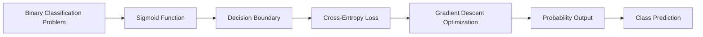

# Chapter 3: Logistic Regression

> **Previous:** [Linear Regression](./02-linear-regression.md) | **Next:** [Decision Trees](./04-decision-trees.md)

---

## Learning Objectives

- Understand the need for Logistic Regression in classification tasks
- Define and apply the Sigmoid (Logistic) Function
- Derive the Cross-Entropy Loss function
- Interpret model outputs as probabilities and apply decision thresholds

## Chapter at a Glance

| Topic | Key Insight | Practical Takeaway |
|-------|-------------|-------------------|
| Classification vs. Regression | LR outputs discrete probabilities not continuous values | Use logistic (not linear) regression for yes/no problems |
| Sigmoid Function | Maps any real number to a value between 0 and 1 | Output is interpretable as class probability |
| Decision Boundary | Threshold at $h_w(x) = 0.5$ separates classes | Adjust threshold to trade off precision and recall |
| Cross-Entropy Loss | Penalizes confident wrong predictions heavily | Convex loss ensures reliable gradient descent |
| Multi-Class Extension | Softmax generalizes sigmoid to K classes | Use when predicting among three or more categories |
| Regularization | Prevents overfitting by penalizing large weights | Add L1 or L2 regularization to improve generalization |

## Chapter Roadmap



---

## Theory

### Classification vs. Regression
Linear regression is designed for continuous outputs. However, many real-world problems require predicting discrete classes (e.g., "Yes" or "No"). Using linear regression for classification can lead to outputs outside the $[0, 1]$ range and is highly sensitive to outliers. Logistic Regression solves this by mapping any real-valued number into a probability.

### The Sigmoid Function
The core of Logistic Regression is the sigmoid function, denoted by $\sigma(z)$:
$$\sigma(z) = \frac{1}{1 + e^{-z}}$$
Where $z = \mathbf{w}^T\mathbf{x}$. The output of $\sigma(z)$ is always between 0 and 1. We interpret the output as the probability that the given input belongs to the positive class:
$$P(y=1 | x; w) = h_w(x) = \sigma(\mathbf{w}^T\mathbf{x})$$

### Decision Boundary
A model makes a prediction by comparing the probability $h_w(x)$ to a threshold (usually 0.5):
- If $h_w(x) \geq 0.5$, predict $y=1$ (Positive).
- If $h_w(x) < 0.5$, predict $y=0$ (Negative).
The set of points where $\mathbf{w}^T\mathbf{x} = 0$ is called the decision boundary.


### Logistic Loss (Cross-Entropy)
We cannot use MSE for logistic regression because the resulting cost function would be non-convex, making Gradient Descent difficult. Instead, we use the Log Loss or Binary Cross-Entropy Loss:
$$J(w) = -\frac{1}{n} \sum_{i=1}^{n} [y^{(i)} \log(h_w(x^{(i)})) + (1 - y^{(i)}) \log(1 - h_w(x^{(i)}))]$$
This function penalizes incorrect predictions heavily. When $y=1$, the cost increases as $h_w(x)$ approaches 0. When $y=0$, the cost increases as $h_w(x)$ approaches 1.

> **One-Sentence Takeaway:** Logistic regression uses the sigmoid function to convert linear outputs into probabilities and cross-entropy loss to optimize classification decisions.

> **Remember:** The decision boundary is defined by $\mathbf{w}^T\mathbf{x} = 0$; changing the classification threshold (e.g., from 0.5 to 0.3) alters precision and recall without retraining the model.

---

## Examples

### Example 1: Predicting Exam Pass/Fail
Predicting if a student passes ($y=1$) or fails ($y=0$) based on hours studied.
- **Model**: $z = w_0 + w_1(Hours)$
- **Hypothesis**: $h_w(x) = \frac{1}{1 + e^{-z}}$
- **Scenario**: If $w_0 = -5$ and $w_1 = 1$, for 6 hours of study, $z = -5 + 6 = 1$.
- **Calculation**: $h_w(6) = \sigma(1) \approx 0.73$.
- **Result**: 73% probability of passing; predict "Pass".

### Example 2: Scikit-learn Implementation
```python
from sklearn.linear_model import LogisticRegression
import numpy as np

# Hours studied vs Result (0: Fail, 1: Pass)
X = np.array([[1], [2], [3], [4], [5], [6]]).reshape(-1, 1)
y = np.array([0, 0, 0, 1, 1, 1])

clf = LogisticRegression().fit(X, y)
print(f"Probability at 3.5 hours: {clf.predict_proba([[3.5]])[0][1]}")
```
**Output**: Provides the probability of class 1 for a student who studied 3.5 hours.

> **One-Sentence Takeaway:** Logistic regression outputs interpretable probabilities, making it ideal for risk scoring and medical diagnosis where confidence matters as much as the class label.

> **Warning:** Logistic Regression assumes a linear decision boundary—if classes are separated by a non-linear curve, consider kernel methods or non-linear classifiers.

---

## Concept Comparison Table

| Concept | Definition | Key Distinction | Use Case |
|---------|------------|-----------------|----------|
| Linear Regression | Predicts continuous values via linear equation | Unbounded output | Price prediction |
| Logistic Regression | Predicts class probabilities via sigmoid | Output in [0,1] | Spam detection |
| Sigmoid Function | $\sigma(z) = 1/(1 + e^{-z})$ | S-shaped squashing function | Probability mapping |
| Softmax Function | Generalizes sigmoid to multi-class | Sum of outputs = 1 | Digit recognition |
| Cross-Entropy Loss | $-\sum y\log(\hat{y})$ | Convex for classification | Binary classification |
| Hinge Loss | $\max(0, 1 - y \cdot \hat{y})$ | Used by SVM | Max-margin classification |

## Quick Reference

| Term | Formula / Definition |
|------|---------------------|
| Sigmoid Function | $\sigma(z) = \frac{1}{1 + e^{-z}}$ |
| Hypothesis | $h_w(x) = \sigma(\mathbf{w}^T\mathbf{x})$ |
| Decision Boundary | $\mathbf{w}^T\mathbf{x} = 0$ |
| Cross-Entropy Loss | $J(w) = -\frac{1}{n}\sum[y\log(\hat{y}) + (1-y)\log(1-\hat{y})]$ |
| Gradient Update | $w_j := w_j - \alpha \frac{1}{n}\sum(h_w(x^{(i)}) - y^{(i)})x_j^{(i)}$ |
| Softmax (Multi-class) | $P(y=k) = e^{z_k} / \sum_{j=1}^{K} e^{z_j}$ |

## Cross-Application Matrix

| Domain | Application | Positive Class | Key Challenge |
|--------|------------|---------------|---------------|
| Healthcare | Disease diagnosis | Disease present | Class imbalance (rare diseases) |
| Finance | Fraud detection | Fraudulent transaction | Extreme class imbalance |
| Marketing | Customer churn prediction | Will churn | Defining churn window |
| Security | Intrusion detection | Malicious activity | High cost of false negatives |

## Chapter Quiz

1. Why can't we use Mean Squared Error as the loss function for logistic regression?
   A) MSE is too computationally expensive
   B) MSE would produce a non-convex cost function
   C) MSE only works for regression problems
   D) MSE requires normally distributed errors

<details><summary>Answer</summary>**B)** Using MSE with sigmoid results in a non-convex cost function with many local minima, making gradient descent unreliable.
</details>

2. The sigmoid function $\sigma(z)$ outputs a value of 0.5 when:
   A) $z = 0$
   B) $z = 1$
   C) $z = \infty$
   D) $z = -\infty$

<details><summary>Answer</summary>**A)** $\sigma(0) = 1/(1 + e^0) = 1/2 = 0.5$.
</details>

3. Which function extends logistic regression to multi-class classification?
   A) Sigmoid
   B) ReLU
   C) Softmax
   D) Tanh

<details><summary>Answer</summary>**C)** Softmax generalizes the sigmoid to handle K > 2 classes by outputting a probability distribution.
</details>

---

## Summary

- Logistic Regression is a fundamental algorithm for binary classification problems.
- The Sigmoid function maps linear outputs into a valid probability range $[0, 1]$.
- The decision boundary separates the feature space into regions belonging to different classes.
- Binary Cross-Entropy is the standard loss function for classification, ensuring a convex optimization surface.
- The model can be extended to multi-class classification using the Softmax function (Multinomial Logistic Regression).

> **One-Sentence Takeaway:** Logistic regression bridges linear models and classification by converting real-valued scores into well-calibrated probabilities.

---

## Exercises

### Review Questions
1. Why is the sigmoid function useful for classification tasks?
2. What is the difference between the model's output $h_w(x)$ and the final prediction?
3. If $h_w(x) = 0.5$ for a specific input, what can you say about that point in relation to the decision boundary?
4. How does the cross-entropy loss function behave when the predicted probability is 0.99 for a sample where $y=1$?

### Application Problems
1. Calculate the sigmoid value for $z = -2.2$.
2. Given $w_0 = -3$ and $w_1 = 1.5$, find the value of $x$ that defines the decision boundary.
3. Compute the loss for a single training example where $y=1$ and $h_w(x) = 0.8$.

### Challenge Problem
1. Show that the derivative of the sigmoid function $\sigma(z)$ can be expressed as $\sigma(z)(1 - \sigma(z))$. How does this property simplify the gradient calculation in backpropagation?
