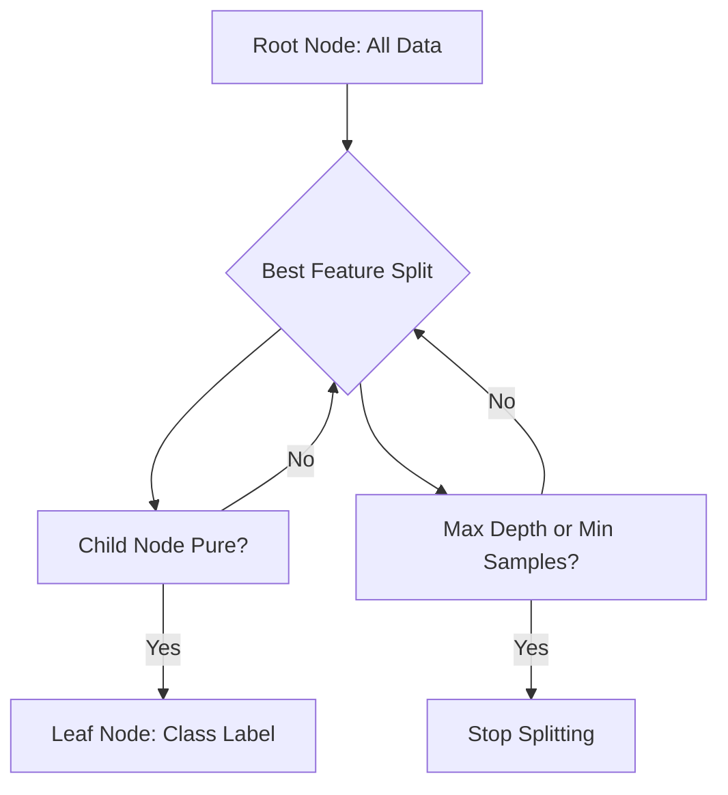

# Chapter 4: Decision Trees

> **Previous:** [Logistic Regression](./03-logistic-regression.md) | **Next:** [Ensemble Methods](./05-ensemble-methods.md)

---

## Learning Objectives

- Explain the structure of a Decision Tree (nodes, branches, leaves)
- Calculate and compare splitting criteria: Entropy, Information Gain, and Gini Impurity
- Describe the recursive splitting process (ID3 and CART algorithms)
- Identify and mitigate overfitting using pruning and hyperparameters

## Chapter at a Glance

| Topic | Key Insight | Practical Takeaway |
|-------|-------------|-------------------|
| Tree Structure | Internal nodes test attributes leaves assign labels | Extremely interpretable—useful for stakeholder explanations |
| Entropy | Measures disorder in a dataset | Lower entropy means purer more homogeneous subsets |
| Information Gain | Reduction in entropy after a split | Choose the feature with highest gain at each node |
| Gini Impurity | Alternative to entropy computationally faster | CART uses Gini by default; similar results to entropy |
| Recursive Splitting | Tree built top-down by repeated partitioning | Stop when depth max or node purity is reached |
| Overfitting | Deep trees memorize training noise | Prune aggressively or set max_depth and min_samples_split |

## Chapter Roadmap



---

## Theory

### What is a Decision Tree?
A Decision Tree is a flowchart-like structure used for both classification and regression. Each internal node represents a "test" on an attribute (e.g., "Is Age > 30?"), each branch represents the outcome of the test, and each leaf node represents a class label or a continuous value. Decision trees are highly interpretable because they mimic human decision-making.


### Splitting Criteria: Entropy and Information Gain
To build an effective tree, we need a way to choose the best feature to split on at each node. We want splits that result in "pure" subsets (where all examples belong to the same class).

**Entropy** measures the impurity or disorder in a dataset $S$:
$$H(S) = -\sum_{i=1}^{c} p_i \log_2 p_i$$
Where $p_i$ is the proportion of examples belonging to class $i$.

**Information Gain** is the reduction in entropy after splitting on attribute $A$:
$$IG(S, A) = H(S) - \sum_{v \in Values(A)} \frac{|S_v|}{|S|} H(S_v)$$
We choose the attribute $A$ that maximizes Information Gain.

### Splitting Criteria: Gini Impurity
Gini Impurity is an alternative used by the CART algorithm. it measures the probability of a randomly chosen element being incorrectly labeled if it was randomly labeled according to the distribution of labels in the subset:
$$Gini(S) = 1 - \sum_{i=1}^{c} p_i^2$$
Gini is computationally faster than entropy because it doesn't involve logarithmic calculations.

### Recursive Splitting and Stopping
The tree is built recursively by choosing the best split and repeating the process for child nodes. The process stops when:
1. All nodes are pure (all examples belong to one class).
2. A maximum depth is reached.
3. The number of samples in a node is below a threshold.

> **One-Sentence Takeaway:** Decision trees partition the feature space with hierarchical tests, choosing splits that maximize purity through entropy reduction or Gini impurity minimization.

> **Pro Tip:** Decision trees handle both numerical and categorical data natively with no need for feature scaling—but they are sensitive to small data variations, so always pair them with cross-validation.

---

## Examples

### Example 1: To Play or Not to Play Golf
Deciding whether to play golf based on "Outlook" (Sunny, Overcast, Rainy).
- **Initial Entropy**: If 9 days played and 5 didn't, $H(S) = -(9/14)\log_2(9/14) - (5/14)\log_2(5/14) = 0.940$.
- **Overcast Split**: All 4 "Overcast" days resulted in "Play". Entropy of this subset is 0.
- **Sunny/Rainy Splits**: Higher entropy, requiring further splits on variables like "Humidity" or "Wind".
- **Result**: A tree that accurately predicts the outcome for new days.

### Example 2: Scikit-learn Classifier
```python
from sklearn.tree import DecisionTreeClassifier
from sklearn.datasets import load_iris

iris = load_iris()
X, y = iris.data, iris.target

clf = DecisionTreeClassifier(max_depth=3)
clf.fit(X, y)

# Predict the class of a new flower
prediction = clf.predict([[5.1, 3.5, 1.4, 0.2]])
print(f"Predicted class: {iris.target_names[prediction]}")
```
**Output**: Shows how the tree classifies a sample based on sepal/petal measurements.

> **One-Sentence Takeaway:** Decision trees provide intuitive, interpretable models but require careful hyperparameter tuning to avoid overfitting the training data.

> **Warning:** A single decision tree is highly sensitive to data changes—a different training split can produce a completely different tree, which is why ensemble methods are often preferred.

---

## Concept Comparison Table

| Concept | Definition | Key Distinction | Use Case |
|---------|------------|-----------------|----------|
| Entropy | $-\sum p_i \log_2 p_i$ | Measures disorder; uses log | ID3 algorithm |
| Gini Impurity | $1 - \sum p_i^2$ | Faster computation; no log | CART algorithm |
| Information Gain | $H(S) - \sum \frac{\|S_v\|}{\|S\|} H(S_v)$ | Quantifies split quality | Feature selection at nodes |
| Pre-Pruning | Stop splitting early (max_depth) | Halts growth before overfitting | Prevents complex trees |
| Post-Pruning | Grow full tree then remove branches | Reduces complexity after building | CCP (cost-complexity pruning) |
| CART | Binary splits using Gini | Produces only binary trees | sklearn default implementation |

## Quick Reference

| Term | Formula / Definition |
|------|---------------------|
| Entropy | $H(S) = -\sum_{i=1}^{c} p_i \log_2 p_i$ |
| Information Gain | $IG(S, A) = H(S) - \sum_{v} \frac{\|S_v\|}{\|S\|} H(S_v)$ |
| Gini Impurity | $Gini(S) = 1 - \sum_{i=1}^{c} p_i^2$ |
| ID3 Algorithm | Iterative Dichotomiser 3 (uses entropy) |
| CART Algorithm | Classification and Regression Trees (uses Gini) |
| max_depth | Hyperparameter limiting tree height |
| min_samples_split | Minimum samples to justify a split |
| min_samples_leaf | Minimum samples that must remain in a leaf |

## Cross-Application Matrix

| Domain | Application | Features Used | Split Criteria |
|--------|------------|---------------|---------------|
| Healthcare | Diagnose heart disease | Age cholesterol chest pain type | Gini impurity |
| Finance | Loan approval decision | Income credit score employment length | Information gain |
| Retail | Product recommendation | Purchase history browsing time category | Gini impurity |
| Manufacturing | Quality control defect detection | Temperature pressure vibration | Entropy |

## Chapter Quiz

1. Which metric measures the disorder or impurity of a dataset in decision tree learning?
   A) Accuracy
   B) Entropy
   C) Mean Squared Error
   D) R-squared

<details><summary>Answer</summary>**B)** Entropy quantifies the disorder in a dataset; lower entropy means purer subsets.
</details>

2. What is the main advantage of Gini Impurity over Entropy for decision tree splitting?
   A) Gini produces more accurate trees
   B) Gini is computationally faster (no logarithmic calculations)
   C) Gini supports regression tasks
   D) Gini requires less training data

<details><summary>Answer</summary>**B)** Gini Impurity avoids logarithmic calculations, making it faster while producing similar results to entropy.
</details>

3. Which hyperparameter directly prevents a decision tree from growing too deep and overfitting?
   A) n_estimators
   B) learning_rate
   C) max_depth
   D) C (regularization strength)

<details><summary>Answer</summary>**C)** max_depth limits how deep the tree can grow, directly controlling model complexity and reducing overfitting.
</details>

---

## Summary

- Decision Trees partition the feature space into rectangular regions via a series of binary or multi-way splits.
- Entropy and Gini Impurity are the most common metrics for evaluating split quality.
- Information Gain selects features that most reduce uncertainty.
- Overfitting is a significant risk; a tree that is too deep will memorize the training data.
- Hyperparameters like `max_depth` and `min_samples_split` are crucial for controlling tree complexity.

> **One-Sentence Takeaway:** Decision trees are powerful yet intuitive, but their high variance makes pruning and hyperparameter tuning essential for reliable performance on new data.

---

## Exercises

### Review Questions
1. Define a "leaf node" and explain its role in a Decision Tree.
2. What is the maximum possible value for Gini Impurity in a two-class classification problem?
3. Why might a Decision Tree perform poorly on a dataset with very small training samples?
4. Explain the difference between "Pre-pruning" and "Post-pruning".

### Application Problems
1. Calculate the entropy of a collection with 10 positive and 10 negative examples.
2. A dataset has 4 "True" and 1 "False" labels. Calculate the Gini Impurity.
3. If a split results in two child nodes with zero entropy, what can you conclude about the Information Gain of that split?

### Challenge Problem
1. Decision Trees are often criticized for being "unstable" (a small change in the data can result in a completely different tree). Explain why this happens and how ensemble methods might solve this.
