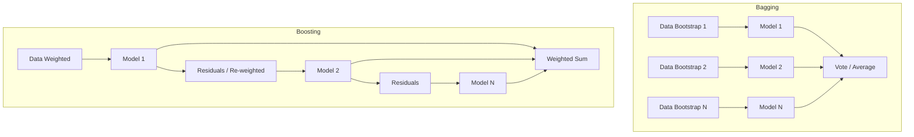

# Chapter 5: Ensemble Methods

> **Previous:** [Decision Trees](./04-decision-trees.md) | **Next:** [Support Vector Machines](./06-support-vector-machines.md)

---

## Learning Objectives

- Define Ensemble Learning and the "Wisdom of the Crowd" principle
- Compare and contrast Bagging (Bootstrap Aggregating) and Boosting
- Understand the architecture and benefits of Random Forests
- Explain the mechanics of Gradient Boosting and AdaBoost

## Chapter at a Glance

| Topic | Key Insight | Practical Takeaway |
|-------|-------------|-------------------|
| Wisdom of the Crowd | Combining multiple models beats a single model | Ensembles are default choice for competitive ML |
| Bagging | Parallel training on bootstrapped subsets reduces variance | Use when individual models overfit |
| Random Forest | Bagging + random feature selection decorrelates trees | Most popular bagging method; robust out-of-box |
| Boosting | Sequential training corrects predecessor errors | Use when models underfit (high bias) |
| AdaBoost | Increases weight on misclassified samples | Works well with shallow decision stumps |
| Gradient Boosting | Trains on residual errors of previous model | State-of-the-art for tabular data (XGBoost LightGBM) |

## Chapter Roadmap



---

## Theory

### What is Ensemble Learning?
Ensemble methods combine multiple machine learning models (base learners) to produce a single, stronger model. The goal is to reduce either the bias (as in Boosting) or the variance (as in Bagging) of the overall prediction. Ensembles are among the most powerful techniques in machine learning and frequently win competitions on platforms like Kaggle.

### Bagging: Bootstrap Aggregating
Bagging involves training multiple versions of a model on different subsets of the training data. Each subset is created using **Bootstrapping**—sampling with replacement.
1. **Parallel Training**: Multiple models are trained independently in parallel.
2. **Aggregation**: Predictions are combined via voting (for classification) or averaging (for regression).
Bagging primarily reduces **variance** by smoothing out the eccentricities of individual models.


### Random Forest
Random Forest is a specialized version of Bagging that uses Decision Trees as base learners. It adds an extra layer of randomness: at each split, only a random subset of features is considered. This ensures that the trees are decorrelated, making the ensemble even more robust.

### Boosting: Sequential Learning
Boosting trains models sequentially. Each new model attempts to correct the errors of the previous ones.
1. **Sequential Training**: Models are trained one after another.
2. **Weighted Samples**: In AdaBoost, samples that were misclassified by previous models are given higher weights.
3. **Residual Learning**: In Gradient Boosting, each model is trained on the residual errors (the difference between the actual and predicted values) of the previous models.
Boosting primarily reduces **bias**, converting weak learners into strong learners.

> **One-Sentence Takeaway:** Ensemble methods combine multiple weak models—either in parallel (bagging) to reduce variance or sequentially (boosting) to reduce bias—producing a stronger final predictor.

> **Remember:** Random Forests work well out-of-the-box with minimal tuning, while Gradient Boosting requires careful adjustment of learning rate and tree count to avoid overfitting.

---

## Examples

### Example 1: Random Forest Classifier
Using Random Forest to classify breast cancer tumors.
```python
from sklearn.ensemble import RandomForestClassifier
from sklearn.datasets import load_breast_cancer
from sklearn.model_selection import train_test_split

data = load_breast_cancer()
X_train, X_test, y_train, y_test = train_test_split(data.data, data.target)

rf = RandomForestClassifier(n_estimators=100, max_features='sqrt')
rf.fit(X_train, y_train)

print(f"Accuracy: {rf.score(X_test, y_test):.4f}")
```
**Expected Output**: An accuracy significantly higher than that of a single decision tree.

### Example 2: Gradient Boosting for Regression
Predicting California housing prices using Gradient Boosting.
```python
from sklearn.ensemble import GradientBoostingRegressor
from sklearn.datasets import fetch_california_housing

X, y = fetch_california_housing(return_X_y=True)
X_train, X_test, y_train, y_test = train_test_split(X, y)

gbr = GradientBoostingRegressor(n_estimators=100, learning_rate=0.1)
gbr.fit(X_train, y_train)

print(f"R-squared: {gbr.score(X_test, y_test):.4f}")
```
**Outcome**: Demonstrates how sequential corrections lead to a highly accurate regression model.

> **One-Sentence Takeaway:** Bagging smooths out noisy models through averaging, while boosting systematically corrects errors to build highly accurate predictors from weak learners.

> **Pro Tip:** XGBoost and LightGBM are the most popular gradient boosting implementations for tabular data—they offer built-in regularization, missing value handling, and GPU acceleration.

---

## Concept Comparison Table

| Concept | Definition | Key Distinction | Use Case |
|---------|------------|-----------------|----------|
| Bagging | Parallel models on bootstrapped data | Reduces variance | Random Forest |
| Boosting | Sequential models correcting errors | Reduces bias | Gradient Boosting XGBoost |
| Random Forest | Bagged decision trees + random feature subset | Extra randomness decorrelates trees | Classification regression default |
| AdaBoost | Weighted boosting focusing on misclassified samples | Adaptive sample weighting | Binary classification |
| Gradient Boosting | Trains on residuals of previous model | Loss-function agnostic | Regression ranking classification |
| Stacking | Meta-learner combines diverse base models | Different model types | Competition-winning ensembles |

## Quick Reference

| Term | Definition |
|------|------------|
| **Bootstrapping** | Sampling with replacement to create training subsets |
| **Base Learner** | Individual model in an ensemble (often a decision tree) |
| **n_estimators** | Number of models in the ensemble |
| **learning_rate** | Shrinkage factor for each boosting step |
| **max_features** | Fraction of features considered at each split (Random Forest) |
| **Subsampling** | Fraction of data used per boosting iteration (stochastic GBM) |
| **Out-of-Bag (OOB)** | Unused bootstrap samples for internal validation |
| **Feature Importance** | Score measuring how often a feature is used for splits |

## Cross-Application Matrix

| Domain | Application | Ensemble Method | Reason |
|--------|------------|-----------------|--------|
| Finance | Credit risk scoring | Gradient Boosting | Handles non-linear relationships well |
| Healthcare | Cancer detection from biopsies | Random Forest | Robust to noisy medical data |
| E-Commerce | Product recommendation | Gradient Boosting | Captures complex feature interactions |
| Insurance | Claim fraud prediction | Random Forest | Class imbalance handled by bagging |
| Search | Click-through rate prediction | Gradient Boosting (LightGBM) | Fast training on large sparse data |

## Chapter Quiz

1. What is the primary difference between Bagging and Boosting?
   A) Bagging uses deep trees; Boosting uses shallow trees
   B) Bagging trains models in parallel; Boosting trains them sequentially
   C) Bagging is for classification; Boosting is for regression
   D) Bagging reduces bias; Boosting reduces variance

<details><summary>Answer</summary>**B)** Bagging trains models independently in parallel, while Boosting trains them sequentially where each model corrects the previous one's errors.
</details>

2. How does a Random Forest add extra randomness beyond standard Bagging?
   A) It shuffles the labels before training
   B) It considers only a random subset of features at each split
   C) It uses random learning rates
   D) It randomly prunes trees after training

<details><summary>Answer</summary>**B)** Random Forest considers a random subset of features at each split, decorrelating the trees beyond what bootstrapping alone achieves.
</details>

3. In Gradient Boosting, what does each new model learn to predict?
   A) The original target values
   B) The mean of all previous predictions
   C) The residual errors of the previous model
   D) Random noise in the training data

<details><summary>Answer</summary>**C)** Each new model in Gradient Boosting is trained on the residuals (errors) of the previous model to progressively reduce the overall error.
</details>

---

## Summary

- Ensemble methods improve performance by combining multiple weak learners into a single strong learner.
- Bagging (e.g., Random Forest) reduces variance by averaging predictions from models trained on bootstrapped data.
- Random Forests increase model diversity by randomly selecting features at each tree split.
- Boosting (e.g., XGBoost, Gradient Boosting) reduces bias by focusing on correcting the mistakes of predecessor models.
- While powerful, ensembles can be more computationally expensive and harder to interpret than single models.

> **One-Sentence Takeaway:** Ensemble methods consistently outperform individual models—use Random Forests for robustness and Gradient Boosting for maximum accuracy on tabular data.

---

## Exercises

### Review Questions
1. Explain why "Sampling with Replacement" is critical for the Bagging process.
2. What is the main advantage of Random Forest over a single Decision Tree?
3. How does Boosting handle samples that are difficult to classify?
4. What is the role of the "Learning Rate" in Gradient Boosting?

### Application Problems
1. If you have 100 independent classifiers, each with 70% accuracy, what is the theoretical probability that a majority vote of these classifiers is correct? (Hint: Use the Binomial Distribution).
2. A Random Forest has 50 trees. How many trees must agree for a sample to be classified as the positive class if the threshold is 0.5?
3. In a boosting scenario, if the first model predicts a value of 10 for a target of 15, what value should the second model attempt to predict?

### Challenge Problem
1. Compare Bagging and Boosting in terms of their sensitivity to noise and outliers. Which technique is more likely to overfit if the dataset is extremely noisy? Explain your reasoning.
