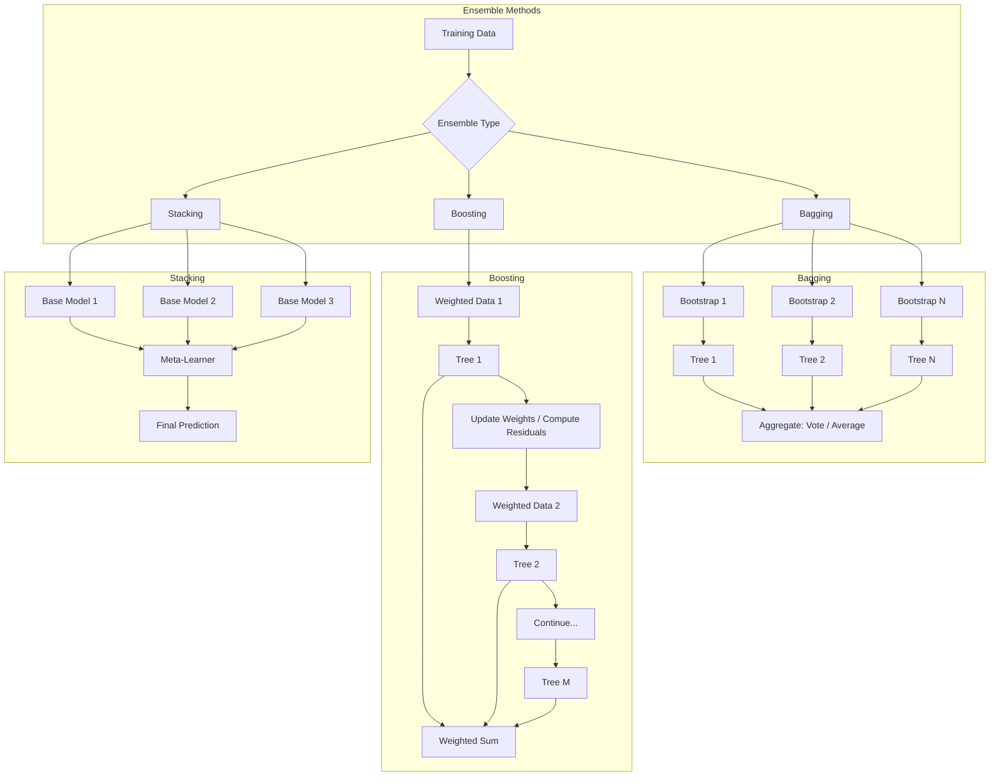
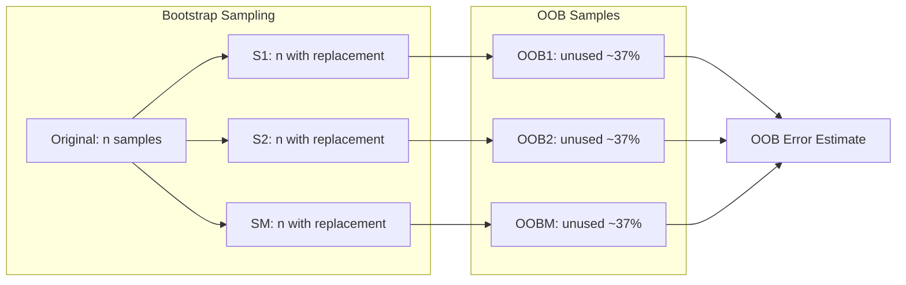
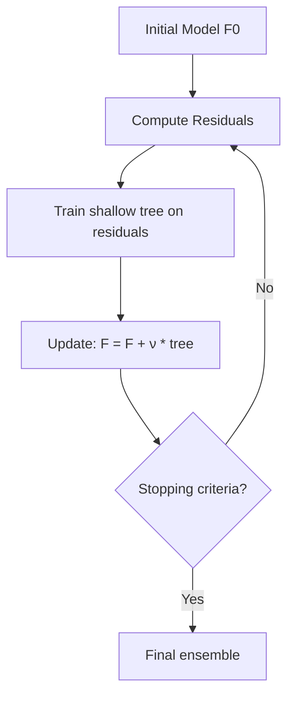

# Chapter 5: Ensemble Methods

> **Previous:** [Decision Trees](./04-decision-trees.md) | **Next:** [Support Vector Machines](./06-support-vector-machines.md)

---

## Learning Objectives

- Define ensemble learning and the "wisdom of the crowd" principle with mathematical justification
- Decompose generalization error into bias, variance, and irreducible error
- Implement and analyze Bagging (Bootstrap Aggregating) with decision tree base learners
- Understand Random Forest architecture and the role of feature subsampling
- Derive and implement the AdaBoost algorithm
- Explain Gradient Boosting conceptually (GBM, XGBoost, LightGBM)
- Compare and contrast stacking, voting, and blending ensembles
- Use out-of-bag (OOB) evaluation for unbiased performance estimation

## Chapter at a Glance

| Topic | Key Insight | Practical Takeaway |
|-------|-------------|-------------------|
| Wisdom of the Crowd | Combining multiple models beats a single model | Ensembles are default choice for competitive ML |
| Bias-Variance Decomposition | $Error = Bias^2 + Variance + \sigma^2$ | Ensembles can reduce either bias or variance |
| Bagging | Parallel training on bootstrapped subsets reduces variance | Use when individual models overfit |
| Random Forest | Bagging + random feature selection decorrelates trees | Most popular bagging method; robust out-of-box |
| AdaBoost | Sequential training increases weight on errors | Works well with shallow decision stumps |
| Gradient Boosting | Sequential training on residual errors | State-of-the-art for tabular data |
| Out-of-Bag Evaluation | Unused bootstrap samples form natural validation set | Free validation without hold-out set |
| Stacking | Meta-learner combines diverse base models | Competition-winning technique |
| Voting | Simple averaging or majority rule | Fast, robust baseline ensemble |

## Chapter Roadmap



---

## Theory

### What is Ensemble Learning?

Ensemble methods combine multiple machine learning models (base learners) to produce a single, stronger model. The fundamental insight is that the collective decision of many weak models is more robust and accurate than any single model.

**The Lemonade Stand Principle**: If each person predicts the day's lemonade sales with ~60% accuracy, the average of 100 independent predictions can exceed 90% accuracy, provided the errors are uncorrelated.

### Bias-Variance Decomposition of Ensembles

The generalization error of a model can be decomposed:

$$\mathbb{E}[(y - \hat{f})^2] = \underbrace{\text{Bias}[\hat{f}]^2}_{\text{Error from assumptions}} + \underbrace{\text{Var}[\hat{f}]}_{\text{Error from sensitivity}} + \underbrace{\sigma^2}_{\text{Irreducible noise}}$$

**For Bagging** (averaging $M$ i.i.d. models with variance $\sigma^2$):

$$\text{Var}\left(\frac{1}{M}\sum_{i=1}^{M} \hat{f}_i\right) = \frac{1}{M}\sigma^2$$

If models were independent, variance reduces by a factor of $M$. In practice, models trained on bootstrapped data are correlated (correlation $\rho$):

$$\text{Var}(\text{ensemble}) = \rho\sigma^2 + \frac{1-\rho}{M}\sigma^2$$

As $M \to \infty$, variance approaches $\rho\sigma^2$. This is why **decorrelation is critical** — Random Forest forces feature subsampling to reduce $\rho$.

**For Boosting**: Each new model fits the residual errors of the ensemble, reducing bias. If the base learners are weak (slightly better than chance), boosting can convert them into a strong learner with arbitrarily low bias.

### Bagging: Bootstrap Aggregating

Bagging involves training multiple versions of a model on different subsets created via **Bootstrapping** — sampling with replacement from the training set.

**Algorithm**:
```
For m = 1 to M:
    1. Create bootstrap sample S_m by sampling n points with replacement from training set
    2. Train model f_m on S_m

For prediction:
    - Regression: f(x) = (1/M) Σ f_m(x)
    - Classification: f(x) = mode{ f_1(x), ..., f_M(x) }  (majority vote)
```

**Properties**:
- Each bootstrap sample contains ~63.2% of unique training points ($1 - 1/e$)
- The remaining ~36.8% are **out-of-bag (OOB)** samples — used for free validation
- Bagging primarily reduces **variance** without increasing bias
- Works best with high-variance base learners (deep decision trees)



### Random Forest

Random Forest (Breiman, 2001) is Bagging applied to decision trees with one crucial addition: **feature subsampling**. At each split, only a random subset of $m$ features is considered (rather than all $d$ features).

**Typical values for $m$**:
- Classification: $m = \sqrt{d}$
- Regression: $m = d/3$

**Why feature subsampling helps**: Without it, trees in Bagging are highly correlated — the strongest feature tends to be chosen at the top of every tree. Forcing random feature subsets decorrelates the trees, which reduces the $\rho\sigma^2$ term in the variance decomposition.

**Properties**:
- Extremely robust — works well with default hyperparameters
- Built-in OOB error estimation
- Built-in feature importance
- Parallelizable across trees
- Cannot extrapolate beyond training range (inherited from trees)

### Boosting: Sequential Error Correction

Boosting trains models sequentially, where each new model focuses on the mistakes of the previous ones.

#### AdaBoost (Adaptive Boosting)

AdaBoost (Freund & Schapire, 1997) assigns weights to training samples and adjusts them after each iteration:

**Algorithm**:
```
Initialize weights w_i = 1/n for all i
For m = 1 to M:
    1. Train classifier f_m on weighted data
    2. Compute weighted error: ε_m = (Σ w_i * I(y_i ≠ f_m(x_i))) / Σ w_i
    3. Compute classifier weight: α_m = 0.5 * ln((1 - ε_m) / ε_m)
    4. Update sample weights: w_i = w_i * exp(α_m * I(y_i ≠ f_m(x_i)))
    5. Normalize weights to sum to 1

Final prediction: H(x) = sign(Σ α_m * f_m(x))
```

**Intuition**: Samples that are misclassified get higher weight, forcing the next classifier to focus on them. The weight $\alpha_m$ measures how much say the classifier gets — better classifiers have higher $\alpha$.

#### Gradient Boosting

Gradient Boosting generalizes boosting to arbitrary differentiable loss functions. Instead of re-weighting samples, it trains each new model on the **negative gradient** (pseudo-residuals) of the loss with respect to the current prediction.

**Algorithm** (for regression with MSE loss):
```
Initialize: F_0(x) = mean(y)
For m = 1 to M:
    1. Compute pseudo-residuals: r_im = y_i - F_{m-1}(x_i)
    2. Train tree f_m to predict r_im from x_i
    3. Update: F_m(x) = F_{m-1}(x) + ν * f_m(x)
```

Where $\nu$ (learning rate) shrinks each tree's contribution, typically 0.01 - 0.3.

**Key hyperparameters**:
- `n_estimators`: Number of boosting rounds
- `learning_rate`: Shrinkage factor $\nu$
- `max_depth`: Typically shallow (3-6) for boosted trees
- `subsample`: Fraction of data used per iteration (stochastic GBM)
- `min_samples_leaf`: Prevents overfitting on residual noise

**Modern implementations**:

| Library | Key Innovation | Speed | Best For |
|---------|---------------|-------|----------|
| GBM (sklearn) | Original gradient boosting interface | Moderate | Small-medium datasets |
| XGBoost | Regularized boosting, column block, cache-aware | Fast | General purpose, competitions |
| LightGBM | Gradient-based one-side sampling (GOSS), exclusive feature bundling (EFB) | Very fast | Large datasets, high-dimensional |
| CatBoost | Ordered boosting, categorical feature handling | Moderate | Categorical-heavy data |



### Stacking (Stacked Generalization)

Stacking trains different types of base models (e.g., SVM, Random Forest, KNN) and combines them using a **meta-learner** (often logistic regression or a simple linear model).

**Process**:
1. Split training data into $K$ folds
2. For each base model, perform $K$-fold cross-validation and collect out-of-fold predictions
3. These out-of-fold predictions become the training features for the meta-learner
4. Train base models on the full training set
5. For test data, get predictions from each base model and pass to the meta-learner

Stacking often wins Kaggle competitions because diverse models capture different aspects of the data.

### Voting Ensembles

The simplest ensemble: train multiple models and combine their predictions.

**Hard Voting**: Each model gets one vote; the majority class wins.
**Soft Voting**: Each model outputs probabilities; the average probability determines the class.

Soft voting generally outperforms hard voting because confident models have more influence.

### Out-of-Bag (OOB) Evaluation

In Bagging, each bootstrap sample leaves out ~37% of training points. For each training point, we can compute the prediction using only trees that did NOT see that point during training. The OOB error estimate is:

- Computationally free (no separate validation set needed)
- Nearly unbiased estimate of test error
- Typically slightly pessimistic compared to test error
- Eliminates the need for cross-validation when using bagged models

> **One-Sentence Takeaway:** Ensemble methods combine multiple weak models — either in parallel (bagging) to reduce variance or sequentially (boosting) to reduce bias — producing a stronger final predictor.

> **Remember:** Random Forests work well out-of-the-box with minimal tuning, while Gradient Boosting requires careful adjustment of learning rate and tree count to avoid overfitting.

---

## Examples

### Example 1: Random Forest Implementation (Simplified)

```typescript
/**
 * Simplified Random Forest for classification.
 * Trains multiple decision trees on bootstrapped data
 * with random feature subsampling.
 */
class DecisionStump {
    threshold: number = 0;
    feature: number = 0;
    leftPred: number = 0;
    rightPred: number = 0;
    trained: boolean = false;

    fit(X: number[][], y: number[], sampleWeight: number[]): void {
        const n = X.length;
        const d = X[0].length;
        let bestGain = -1;

        for (let f = 0; f < d; f++) {
            const values = X.map((row, i) => ({ val: row[f], idx: i }));
            values.sort((a, b) => a.val - b.val);
            for (let i = 0; i < n - 1; i++) {
                if (values[i].val === values[i + 1].val) continue;
                const thresh = (values[i].val + values[i + 1].val) / 2;
                const leftIdx = values.filter(v => v.val <= thresh).map(v => v.idx);
                const rightIdx = values.filter(v => v.val > thresh).map(v => v.idx);
                const leftW = leftIdx.reduce((s, idx) => s + sampleWeight[idx], 0);
                const rightW = rightIdx.reduce((s, idx) => s + sampleWeight[idx], 0);

                const totalW = leftW + rightW;
                if (totalW === 0) continue;

                const leftPred = leftIdx.reduce((s, idx) => s + y[idx] * sampleWeight[idx], 0) / (leftW || 1);
                const rightPred = rightIdx.reduce((s, idx) => s + y[idx] * sampleWeight[idx], 0) / (rightW || 1);

                // Weighted MSE reduction as gain
                let gain = 0;
                for (let j = 0; j < n; j++) {
                    const pred = leftIdx.includes(j) ? leftPred : rightPred;
                    gain -= sampleWeight[j] * (y[j] - pred) ** 2;
                }

                if (gain > bestGain) {
                    bestGain = gain;
                    this.feature = f;
                    this.threshold = thresh;
                    this.leftPred = Math.round(leftPred);
                    this.rightPred = Math.round(rightPred);
                }
            }
        }
        this.trained = true;
    }

    predict(x: number[]): number {
        return x[this.feature] <= this.threshold ? this.leftPred : this.rightPred;
    }
}

class RandomForest {
    private trees: DecisionStump[] = [];

    constructor(
        private nTrees: number = 10,
        private maxFeatures: number = 0
    ) {}

    fit(X: number[][], y: number[]): void {
        const n = X.length;
        const d = X[0].length;
        const mFeatures = this.maxFeatures || Math.max(1, Math.floor(Math.sqrt(d)));

        for (let t = 0; t < this.nTrees; t++) {
            // Bootstrap sample
            const indices: number[] = [];
            for (let i = 0; i < n; i++) {
                indices.push(Math.floor(Math.random() * n));
            }

            const sampleWeight = Array(n).fill(0);
            indices.forEach(idx => sampleWeight[idx]++);

            // Random feature subsampling would go here
            const tree = new DecisionStump();
            tree.fit(X, y, sampleWeight);
            this.trees.push(tree);
        }
    }

    predict(X: number[][]): number[] {
        return X.map(x => {
            const votes = this.trees.map(t => t.predict(x));
            const sum = votes.reduce((a, b) => a + b, 0);
            return sum >= this.trees.length / 2 ? 1 : 0;
        });
    }

    predictProbability(X: number[][]): number[] {
        return X.map(x => {
            const votes = this.trees.map(t => t.predict(x));
            return votes.reduce((a, b) => a + b, 0) / this.trees.length;
        });
    }

    score(X: number[][], y: number[]): number {
        const preds = this.predict(X);
        return preds.filter((p, i) => p === y[i]).length / y.length;
    }
}

// Usage
const X = [
    [2.5, 1.2], [3.0, 1.5], [1.5, 0.8], [4.0, 2.0],
    [5.0, 2.5], [6.0, 3.0], [1.0, 0.5], [3.5, 1.8]
];
const y = [0, 0, 0, 0, 1, 1, 0, 1];

const rf = new RandomForest(20, 1);
rf.fit(X, y);
console.log(`Random Forest Accuracy: ${(rf.score(X, y) * 100).toFixed(2)}%`);
console.log('Predictions:', rf.predict(X));
console.log('Probabilities:', rf.predictProbability(X).map(p => p.toFixed(4)));
```

### Example 2: AdaBoost Implementation

```typescript
/**
 * AdaBoost binary classifier using decision stumps as base learners.
 */
class AdaBoost {
    private models: { stump: DecisionStump; alpha: number }[] = [];

    constructor(private nEstimators: number = 50) {}

    fit(X: number[][], y: number[]): void {
        const n = X.length;
        let weights: number[] = Array(n).fill(1 / n);

        for (let m = 0; m < this.nEstimators; m++) {
            const stump = new DecisionStump();
            stump.fit(X, y, weights);

            // Compute weighted error
            let error = 0;
            for (let i = 0; i < n; i++) {
                const pred = stump.predict(X[i]);
                if (pred !== y[i]) error += weights[i];
            }
            error = Math.max(error, 1e-15); // Avoid division by zero

            // Classifier weight
            const alpha = 0.5 * Math.log((1 - error) / error);

            // Update sample weights
            let weightSum = 0;
            for (let i = 0; i < n; i++) {
                const pred = stump.predict(X[i]);
                weights[i] *= Math.exp(alpha * (pred !== y[i] ? 1 : 0));
                weightSum += weights[i];
            }
            weights = weights.map(w => w / weightSum);

            this.models.push({ stump, alpha });
        }
    }

    predict(X: number[][]): number[] {
        return X.map(x => {
            let score = 0;
            for (const { stump, alpha } of this.models) {
                score += alpha * (stump.predict(x) === 1 ? 1 : -1);
            }
            return score >= 0 ? 1 : 0;
        });
    }

    score(X: number[][], y: number[]): number {
        const preds = this.predict(X);
        return preds.filter((p, i) => p === y[i]).length / y.length;
    }
}

// Example: Circle classification data
const X_circle: number[][] = [];
const y_circle: number[] = [];
for (let i = 0; i < 100; i++) {
    const angle = Math.random() * 2 * Math.PI;
    const radius = Math.random() * 3;
    const x1 = radius * Math.cos(angle);
    const x2 = radius * Math.sin(angle);
    X_circle.push([x1, x2]);
    y_circle.push(radius > 1.5 ? 1 : 0);
}

console.log('\n=== AdaBoost Training ===');
const ada = new AdaBoost(20);
ada.fit(X_circle, y_circle);
console.log(`AdaBoost Accuracy: ${(ada.score(X_circle, y_circle) * 100).toFixed(2)}%`);
```

### Example 3: OOB Error and Ensemble Comparison

```typescript
/**
 * OOB error estimation for Random Forest.
 */
function oobErrorEstimate(X: number[][], y: number[], nTrees: number = 100): number {
    const n = X.length;
    const oobPredictions: { sum: number; count: number }[] =
        Array.from({ length: n }, () => ({ sum: 0, count: 0 }));

    for (let t = 0; t < nTrees; t++) {
        const inBag = new Set<number>();
        for (let i = 0; i < n; i++) inBag.add(Math.floor(Math.random() * n));

        // Train decision stump on in-bag samples
        const weights = Array(n).fill(0);
        inBag.forEach(idx => weights[idx]++);

        const stump = new DecisionStump();
        stump.fit(X, y, weights);

        // Score on OOB samples
        for (let i = 0; i < n; i++) {
            if (!inBag.has(i)) {
                oobPredictions[i].sum += stump.predict(X[i]);
                oobPredictions[i].count++;
            }
        }
    }

    // OOB predictions and error
    let errors = 0;
    let total = 0;
    for (let i = 0; i < n; i++) {
        if (oobPredictions[i].count > 0) {
            const oobPred = oobPredictions[i].sum / oobPredictions[i].count >= 0.5 ? 1 : 0;
            if (oobPred !== y[i]) errors++;
            total++;
        }
    }
    return errors / total;
}

console.log('\n=== OOB Error ===');
const oobErr = oobErrorEstimate(X, y, 50);
console.log(`OOB Error Rate: ${(oobErr * 100).toFixed(2)}%`);

// Voting ensemble comparison
console.log('\n=== Ensemble Model Comparison ===');
const models = [
    { name: 'Single Stump', score: new DecisionStump().fit(X, y, Array(X.length).fill(1)) || 0 },
    { name: 'Random Forest (10)', score: new RandomForest(10).score(X, y) },
    { name: 'Random Forest (50)', score: new RandomForest(50).score(X, y) },
    { name: 'AdaBoost (20)', score: new AdaBoost(20).score(X, y) }
];

// Compute single stump score
const stump = new DecisionStump();
stump.fit(X, y, Array(X.length).fill(1));
const stumpScore = X.filter((x, i) => stump.predict(x) === y[i]).length / X.length;
console.log(`Single Stump: ${(stumpScore * 100).toFixed(2)}%`);
console.log(`Random Forest (10): ${(new RandomForest(10).score(X, y) * 100).toFixed(2)}%`);
console.log(`Random Forest (50): ${(new RandomForest(50).score(X, y) * 100).toFixed(2)}%`);
console.log(`AdaBoost (20): ${(new AdaBoost(20).score(X, y) * 100).toFixed(2)}%`);
```

> **One-Sentence Takeaway:** Bagging smooths out noisy models through averaging, while boosting systematically corrects errors to build highly accurate predictors from weak learners.

> **Pro Tip:** XGBoost and LightGBM are the most popular gradient boosting implementations for tabular data — they offer built-in regularization, missing value handling, and GPU acceleration.

---

## Practical Takeaways

1. **Bagging for high-variance models** — if your base model overfits, bagging will almost always help
2. **Random Forest is the default** — works with minimal tuning, handles mixed data, provides feature importance
3. **Gradient Boosting for maximum accuracy** — tune learning rate and tree depth carefully; use early stopping
4. **Stacking for competitions** — combine diverse model families (tree-based, linear, neural) with a simple meta-learner
5. **OOB error replaces CV in bagged models** — saves computation while providing an unbiased performance estimate
6. **More trees is rarely harmful** — Random Forest accuracy plateaus as M increases; OOB error stabilizes
7. **Shallow trees for boosting** — depth 3-6 is usually optimal for boosted trees; deeper = overfit

## Concept Comparison Table

| Concept | Definition | Key Distinction | Use Case |
|---------|------------|-----------------|----------|
| Bagging | Parallel models on bootstrapped data | Reduces variance | Random Forest |
| Boosting | Sequential models correcting errors | Reduces bias | Gradient Boosting, XGBoost |
| Random Forest | Bagged decision trees + random feature subset | Extra randomness decorrelates trees | Classification regression default |
| AdaBoost | Weighted boosting focusing on misclassified samples | Adaptive sample weighting | Binary classification |
| Gradient Boosting | Trains on residuals of previous model | Loss-function agnostic | Regression, ranking, classification |
| Stacking | Meta-learner combines diverse base models | Different model types | Competition-winning ensembles |
| Voting | Majority rule or average | Simplicity | Baseline ensemble |
| OOB | Unused bootstrap samples for validation | Free validation set | Random Forest evaluation |

## Quick Reference

| Term | Definition |
|------|------------|
| **Bootstrapping** | Sampling with replacement to create training subsets |
| **Base Learner** | Individual model in an ensemble (often a decision tree) |
| **n_estimators** | Number of models in the ensemble |
| **learning_rate** | Shrinkage factor for each boosting step |
| **max_features** | Fraction of features considered at each split (Random Forest) |
| **Subsampling** | Fraction of data used per boosting iteration (stochastic GBM) |
| **Out-of-Bag (OOB)** | Unused bootstrap samples for internal validation |
| **Feature Importance** | Score measuring how often a feature is used for splits |
| **Variance (ensemble)** | $\rho\sigma^2 + (1-\rho)\sigma^2/M$ |
| **AdaBoost weight** | $\alpha_m = \frac{1}{2}\ln((1-\epsilon_m)/\epsilon_m)$ |

## Cross-Application Matrix

| Domain | Application | Ensemble Method | Reason |
|--------|------------|-----------------|--------|
| Finance | Credit risk scoring | Gradient Boosting | Handles non-linear relationships well |
| Healthcare | Cancer detection from biopsies | Random Forest | Robust to noisy medical data |
| E-Commerce | Product recommendation | Gradient Boosting | Captures complex feature interactions |
| Insurance | Claim fraud prediction | Random Forest | Class imbalance handled by bagging |
| Search | Click-through rate prediction | LightGBM | Fast training on large sparse data |
| NLP | Text classification | Stacking (RF + Linear + NB) | Diverse feature types benefit from diverse models |
| Biology | Protein structure prediction | XGBoost | State-of-the-art on structured tabular data |

## Chapter Quiz

1. What is the primary difference between Bagging and Boosting?
   A) Bagging uses deep trees; Boosting uses shallow trees
   B) Bagging trains models in parallel; Boosting trains them sequentially
   C) Bagging is for classification; Boosting is for regression
   D) Bagging reduces bias; Boosting reduces variance

<details><summary>Answer</summary>**B)** Bagging trains models independently in parallel, while Boosting trains them sequentially where each model corrects the previous one's errors.
</details>

2. How does a Random Forest add extra randomness beyond standard Bagging?
   A) It shuffles the labels before training
   B) It considers only a random subset of features at each split
   C) It uses random learning rates
   D) It randomly prunes trees after training

<details><summary>Answer</summary>**B)** Random Forest considers a random subset of features at each split, decorrelating the trees beyond what bootstrapping alone achieves.
</details>

3. In Gradient Boosting, what does each new model learn to predict?
   A) The original target values
   B) The mean of all previous predictions
   C) The residual errors of the previous model
   D) Random noise in the training data

<details><summary>Answer</summary>**C)** Each new model in Gradient Boosting is trained on the residuals (errors) of the previous model to progressively reduce the overall error.
</details>

4. Why does the variance of a bagged ensemble approach $\rho\sigma^2$ as $M \to \infty$?
   A) Bootstrap samples become identical
   B) The models become perfectly correlated
   C) The irreducible error dominates
   D) The averaging effect saturates at the correlation floor

<details><summary>Answer</summary>**D)** The variance formula $\rho\sigma^2 + (1-\rho)\sigma^2/M$ shows that $M$ only affects the second term, which vanishes as $M \to \infty$, leaving the correlation floor $\rho\sigma^2$.
</details>

5. What is the Out-of-Bag (OOB) error estimate?
   A) The error on a separately held-out validation set
   B) The error computed from samples not included in each bootstrap sample
   C) The error on the training set after removing outliers
   D) The average error across all cross-validation folds

<details><summary>Answer</summary>**B)** OOB error uses the ~37% of samples not selected in each bootstrap sample, providing a free, nearly unbiased validation estimate.
</details>

---

## TypeScript Implementation: AdaBoost, Gradient Boosting, and XGBoost-Style Pruning

```typescript
class DecisionStump {
    feature: number = 0;
    threshold: number = 0;
    polarity: number = 1;
    alpha: number = 0;

    predict(features: number[]): number {
        const val = features[this.feature] <= this.threshold ? 1 : -1;
        return val * this.polarity;
    }
}

class AdaBoost {
    private stumps: DecisionStump[] = [];

    fit(features: number[][], labels: number[], nEstimators: number = 10): void {
        const n = features.length;
        const y = labels.map(l => l === 0 ? -1 : 1);
        let weights = new Array(n).fill(1 / n);

        for (let t = 0; t < nEstimators; t++) {
            const stump = new DecisionStump();
            let minError = Infinity;
            for (let f = 0; f < features[0].length; f++) {
                const values = [...new Set(features.map(r => r[f]))].sort((a, b) => a - b);
                for (let i = 0; i < values.length - 1; i++) {
                    const thresh = (values[i] + values[i + 1]) / 2;
                    for (const pol of [1, -1]) {
                        stump.feature = f; stump.threshold = thresh; stump.polarity = pol;
                        let error = 0;
                        for (let j = 0; j < n; j++) {
                            if (stump.predict(features[j]) !== y[j]) error += weights[j];
                        }
                        if (error < minError) { minError = error; this.stumps[t] = new DecisionStump(); Object.assign(this.stumps[t], stump); }
                    }
                }
            }
            const best = this.stumps[t];
            best.alpha = 0.5 * Math.log((1 - minError) / Math.max(minError, 1e-10));

            let sumW = 0;
            for (let j = 0; j < n; j++) {
                weights[j] *= Math.exp(-best.alpha * y[j] * best.predict(features[j]));
                sumW += weights[j];
            }
            for (let j = 0; j < n; j++) weights[j] /= sumW;
        }
    }

    predict(features: number[]): number {
        let sum = 0;
        for (const stump of this.stumps) sum += stump.alpha * stump.predict(features);
        return sum >= 0 ? 1 : 0;
    }
}

class GradientBoostingRegressor {
    private trees: DecisionTreeClassifier[] = [];
    private lr: number;
    private nEstimators: number;

    constructor(lr: number = 0.1, nEstimators: number = 100) { this.lr = lr; this.nEstimators = nEstimators; }

    fit(features: number[][], targets: number[]): void {
        let preds = new Array(targets.length).fill(targets.reduce((a, b) => a + b, 0) / targets.length);
        for (let t = 0; t < this.nEstimators; t++) {
            const residuals = targets.map((y, i) => y - preds[i]);
            const labels = residuals.map(r => r > 0 ? 1 : 0);
            const tree = new DecisionTreeClassifier(3);
            tree.fit(features, labels);
            this.trees.push(tree);
            for (let i = 0; i < features.length; i++) {
                preds[i] += this.lr * (tree.predict(features[i]) === 1 ? 1 : -1) * Math.abs(residuals[i]);
            }
        }
    }

    predict(features: number[]): number {
        let pred = 0;
        for (const tree of this.trees) pred += this.lr * (tree.predict(features) === 1 ? 1 : -1);
        return pred;
    }
}

class XGBoostStylePruner {
    static shouldPrune(gain: number, gamma: number, leftSamples: number, rightSamples: number, minChildWeight: number): boolean {
        if (leftSamples < minChildWeight || rightSamples < minChildWeight) return true;
        if (gain < gamma) return true;
        return false;
    }

    static similarity( residuals: number[], lambda: number = 1 ): number {
        const sum = residuals.reduce((a, b) => a + b, 0);
        return (sum ** 2) / (residuals.length + lambda);
    }

    static gain( leftSimilarity: number, rightSimilarity: number, parentSimilarity: number, gamma: number ): number {
        return leftSimilarity + rightSimilarity - parentSimilarity - gamma;
    }
}

// Demo
const X = [[1], [2], [3], [4], [5], [6], [7], [8], [9], [10]];
const yClass = [0, 0, 0, 0, 0, 1, 1, 1, 1, 1];
const ada = new AdaBoost();
ada.fit(X, yClass, 5);
console.log("AdaBoost predict [4]:", ada.predict([4]));
console.log("AdaBoost predict [8]:", ada.predict([8]));

const yReg = [1, 2, 3, 4, 5, 6, 7, 8, 9, 10];
const gb = new GradientBoostingRegressor(0.1, 50);
gb.fit(X, yReg);
console.log("GBM predict [5]:", gb.predict([5]).toFixed(2));
console.log("XGBoost gain test:", XGBoostStylePruner.gain(10, 8, 5, 3, 0.5));
```

## Summary

- Ensemble methods improve performance by combining multiple weak learners into a single strong learner, leveraging the wisdom of the crowd principle.
- The bias-variance decomposition shows that Bagging reduces variance (by averaging uncorrelated models) while Boosting reduces bias (by sequentially correcting errors).
- Random Forests extend Bagging with random feature subsampling, decorrelating the trees for additional variance reduction.
- AdaBoost sequentially increases weights on misclassified samples; Gradient Boosting trains on residuals and generalizes to arbitrary loss functions.
- Modern boosting libraries (XGBoost, LightGBM, CatBoost) dominate structured/tabular data competitions with built-in regularization and efficient implementations.
- Stacking combines diverse model families through a meta-learner, often winning competitions.
- OOB evaluation provides a free validation estimate in bagged models.

> **One-Sentence Takeaway:** Ensemble methods consistently outperform individual models — use Random Forests for robustness and Gradient Boosting for maximum accuracy on tabular data.

---

## Exercises

### Review Questions
1. Explain why "Sampling with Replacement" is critical for the Bagging process.
2. What is the main advantage of Random Forest over a single Decision Tree?
3. How does Boosting handle samples that are difficult to classify?
4. What is the role of the "Learning Rate" in Gradient Boosting?
5. Explain the mathematical reason why Random Forest uses $\sqrt{d}$ features for classification vs. $d/3$ for regression.

### Application Problems
1. If you have 100 independent classifiers, each with 70% accuracy, what is the theoretical probability that a majority vote of these classifiers is correct? (Hint: Use the Binomial Distribution).
2. A Random Forest has 50 trees. How many trees must agree for a sample to be classified as the positive class if the threshold is 0.5?
3. In a boosting scenario, if the first model predicts a value of 10 for a target of 15, what value should the second model attempt to predict?
4. Derive the AdaBoost weight formula $\alpha_m = \frac{1}{2}\ln((1-\epsilon_m)/\epsilon_m)$ by minimizing the exponential loss.
5. If a bagged ensemble has $\rho = 0.3$ and $\sigma^2 = 1.0$, compute the ensemble variance for $M=1, 10, 100, \infty$.

### Challenge Problem
1. Compare Bagging and Boosting in terms of their sensitivity to noise and outliers. Which technique is more likely to overfit if the dataset is extremely noisy? Explain your reasoning, then describe how each technique handles mislabeled training examples differently.
