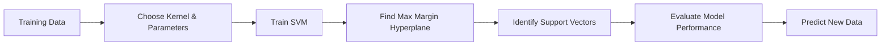

# Chapter 6: Support Vector Machines

> **Previous:** [Ensemble Methods](../05-ensemble-methods.md) | **Next:** [Neural Networks](../07-neural-networks.md)

---

## Learning Objectives

- Explain the concept of the Maximum Margin Hyperplane
- Identify "Support Vectors" and their role in defining the model
- Differentiate between Hard-margin and Soft-margin SVMs
- Apply the "Kernel Trick" to handle non-linearly separable data

---

## Chapter at a Glance

| Topic | Key Insight | Practical Takeaway |
|-------|-------------|-------------------|
| Maximum Margin Hyperplane | SVM finds the hyperplane that maximizes the distance between the two classes | Prioritize margin maximization for better generalization on unseen data |
| Support Vectors | Only the closest points to the hyperplane define the decision boundary | SVM is memory-efficient because a minority of training points determine the model |
| Hard vs. Soft Margin | Soft margin introduces slack variables and a penalty parameter C to handle noise | Tune C via cross-validation to balance margin width against misclassification cost |
| Kernel Trick | Maps data implicitly to higher dimensions without computing the transformation explicitly | RBF kernel is a strong default for most non-linear problems |
| C Parameter | Controls trade-off between wide margin and training error | Use small C for high-dimensional sparse data, large C when clean separation exists |
| Gamma (γ) Parameter | Defines the radius of influence of a single training example | High gamma causes overfitting; low gamma causes underfitting |

## Chapter Roadmap



---

## Theory

### The Maximum Margin Hyperplane
A Support Vector Machine (SVM) is a discriminative classifier that finds an optimal hyperplane to separate classes in a feature space. While many hyperplanes can separate classes, SVM seeks the one with the maximum **margin**. The margin is the distance between the hyperplane and the closest data points from either class.

The hyperplane is defined by the equation:
$$\mathbf{w}^T\mathbf{x} + b = 0$$
We want to maximize the margin, which is equivalent to minimizing $\|\mathbf{w}\|$ subject to:
$$y^{(i)}(\mathbf{w}^T\mathbf{x}^{(i)} + b) \geq 1$$
For all training examples $i$.

### Support Vectors
Support Vectors are the data points that lie exactly on the boundary of the margin. These are the "critical" points; if they were removed, the position of the separating hyperplane would change. Points that lie further away from the margin do not affect the model's parameters.

### Hard vs. Soft Margin
- **Hard Margin**: Assumes the data is perfectly linearly separable. It does not allow any points to be inside the margin or misclassified.
- **Soft Margin**: Introduced to handle noisy or non-linearly separable data. It allows some violations (points inside the margin or misclassified) while minimizing a penalty term controlled by the hyperparameter $C$. A high $C$ penalizes misclassifications heavily (narrower margin), while a low $C$ allows more errors (wider margin).

### The Kernel Trick
When data is not linearly separable in the original space, we can map it into a higher-dimensional space where a linear separation is possible. However, computing this mapping explicitly is expensive. The **Kernel Trick** allows us to compute the dot product of two vectors in the high-dimensional space without ever actually transforming the data.

Common kernels include:
- **Linear**: $K(x_i, x_j) = x_i \cdot x_j$
- **Polynomial**: $K(x_i, x_j) = (x_i \cdot x_j + r)^d$
- **Radial Basis Function (RBF)**: $K(x_i, x_j) = \exp(-\gamma \|x_i - x_j\|^2)$


> **One-Sentence Takeaway:** The max margin hyperplane balances generalization against classification error, and the kernel trick extends SVM to non-linear problems without explicit feature mapping.

> **Pro Tip:** Always scale your features before applying SVM. Since SVM relies on distance calculations, features with larger numeric ranges will dominate the decision boundary unfairly. Use StandardScaler or MinMaxScaler before training.

> **Remember:** Support Vectors are the only data points that determine the model — removing non-support vectors leaves the decision boundary completely unchanged. This sparsity is a key advantage over methods like Logistic Regression.

> **Warning:** The RBF kernel's gamma (γ) parameter can cause dramatic overfitting if set too high. A practical starting point is `gamma = 1 / n_features`, then tune around that value.

---

## Examples

### Example 1: Linear SVM
Classifying two groups of points that are clearly separated.
```python
from sklearn.svm import SVC
import numpy as np

# Training data
X = np.array([[1, 2], [5, 8], [1.5, 1.8], [8, 8], [1, 0.6], [9, 11]])
y = np.array([0, 1, 0, 1, 0, 1])

clf = SVC(kernel='linear', C=1.0)
clf.fit(X, y)

print(f"Support Vectors: \n{clf.support_vectors_}")
```
**Outcome**: Identifies the support vectors and defines the linear decision boundary.

### Example 2: Non-linear separation with RBF Kernel
Classifying data that is arranged in concentric circles.
- **Problem**: A straight line cannot separate the inner circle from the outer circle.
- **Solution**: Use `kernel='rbf'`.
- **Result**: The SVM creates a circular decision boundary in the 2D space by implicitly mapping the data into a higher dimension.

> **One-Sentence Takeaway:** Scikit-learn's SVC provides a clean API for linear, polynomial, and RBF kernels, making SVM accessible for both simple and complex classification tasks.

---

## Concept Comparison Table

| Concept | Definition | Key Distinction | Use Case |
|---------|-----------|-----------------|----------|
| Hard Margin SVM | Perfect separation with zero tolerance for violations | Assumes linearly separable data; no slack variables | Clean synthetic data or theoretical analysis |
| Soft Margin SVM | Allows misclassifications controlled by parameter C | Handles overlapping class distributions | Most real-world classification problems with noise |
| Linear Kernel | $K(x_i, x_j) = x_i \cdot x_j$ | No feature mapping; works in original space | Text classification, high-dimensional sparse data |
| RBF Kernel | $K(x_i, x_j) = \exp(-\gamma\|x_i - x_j\|^2)$ | Non-linear, infinite-dimensional mapping | Default choice; works across most problem types |
| Polynomial Kernel | $K(x_i, x_j) = (x_i \cdot x_j + r)^d$ | Adds polynomial interaction terms up to degree d | Data with known polynomial relationships |
| SVM | Maximum margin classifier using support vectors | Creates decision boundary from critical points only | Binary and multi-class classification |
| Logistic Regression | Probabilistic linear classifier using MLE | Outputs well-calibrated class probabilities | When calibrated probabilities are essential |

## Quick Reference

| Concept | Formula / Detail |
|---------|-----------------|
| Hyperplane Equation | $\mathbf{w}^T\mathbf{x} + b = 0$ |
| Margin Size | $\frac{2}{\|\mathbf{w}\|}$ |
| Optimization Objective | $\min \|\mathbf{w}\| \quad \text{s.t.} \quad y_i(\mathbf{w}^T\mathbf{x}_i + b) \geq 1$ |
| Soft Margin Objective | $\min \|\mathbf{w}\| + C\sum\xi_i$ |
| Linear Kernel | $K(\mathbf{x}_i, \mathbf{x}_j) = \mathbf{x}_i \cdot \mathbf{x}_j$ |
| RBF Kernel | $K(\mathbf{x}_i, \mathbf{x}_j) = \exp(-\gamma\|\mathbf{x}_i - \mathbf{x}_j\|^2)$ |
| C Parameter Range | $10^{-3}$ to $10^{3}$ (typical search range) |
| Gamma Default | $\gamma = \frac{1}{n_{\text{features}}}$ |
| Decision Function | $f(\mathbf{x}) = \sum \alpha_i y_i K(\mathbf{x}_i, \mathbf{x}) + b$ |

## Cross-Application Matrix

| Domain | Application | How SVM Is Used |
|--------|-------------|-----------------|
| Bioinformatics | Protein fold classification, gene expression analysis | High-dimensional data with few samples; linear kernel on gene vectors |
| Image Recognition | Handwritten digit recognition, face detection | RBF kernel on pixel intensity features |
| Text Classification | Spam detection, sentiment analysis | Linear kernel on TF-IDF or bag-of-words vectors |
| Finance | Credit scoring, stock market prediction | Soft margin with tuned C for noisy financial time series |
| Healthcare | Disease diagnosis from medical records | RBF kernel captures non-linear symptom-disease relationships |
| Cybersecurity | Malware classification, intrusion detection | One-class SVM for anomaly detection in network traffic |

---

## Summary

- SVMs are powerful classifiers that aim to maximize the margin between classes.
- Support Vectors are the subset of training points that define the model's decision boundary.
- The $C$ parameter balances the tradeoff between a wide margin and low training error (regularization).
- The Kernel Trick allows SVMs to perform non-linear classification efficiently by mapping inputs into high-dimensional feature spaces.
- RBF is the most popular kernel due to its flexibility in handling complex boundaries.

---

## Exercises

### Review Questions
1. Why is a "larger margin" generally better for generalization on unseen data?
2. What happens to the SVM decision boundary as the parameter $C$ increases toward infinity?
3. In your own words, explain how the Kernel Trick avoids the "curse of dimensionality."
4. What is the difference between a primal and a dual optimization problem in the context of SVMs?

### Application Problems
1. You have a dataset where the points are $(1, 1), (2, 2)$ in Class A and $(5, 5), (6, 6)$ in Class B. Roughly sketch the maximum margin hyperplane and identify the support vectors.
2. If you use a Polynomial kernel with $d=2$ on 2D data, how many dimensions will the data effectively have in the feature space?
3. A Soft-margin SVM has several points that fall on the "wrong side" of the margin but are correctly classified. Are these points considered support vectors?

### Challenge Problem
1. Compare SVM and Logistic Regression. In what situations would you prefer one over the other? Consider factors like dataset size, number of features, and the presence of outliers.

---

## Chapter Quiz

Test your understanding of Support Vector Machines.

**1.** What happens to the SVM decision boundary as the regularization parameter C approaches infinity?

<details><summary>**Answer**</summary>
**B)** The margin becomes narrower. As C → ∞, the model severely penalizes misclassifications, forcing a narrower margin to correctly classify all training points — approaching the hard-margin solution.
</details>

- A) The margin becomes wider
- B) The margin becomes narrower
- C) The kernel type automatically changes
- D) Support vectors are ignored

**2.** Which of the following is NOT a standard SVM kernel?

<details><summary>**Answer**</summary>
**D)** Ensemble is not a kernel. SVM kernels include Linear, Polynomial, RBF, and Sigmoid — all of which compute dot products in some transformed feature space.
</details>

- A) Linear
- B) RBF
- C) Polynomial
- D) Ensemble

**3.** In SVM, support vectors are best described as:

<details><summary>**Answer**</summary>
**B)** Support vectors are the data points that lie exactly on the margin boundaries. Only these points influence the position and orientation of the separating hyperplane.
</details>

- A) All training points used during model fitting
- B) Points that lie on the margin boundary
- C) The centroid of each class
- D) The first K points selected during training
