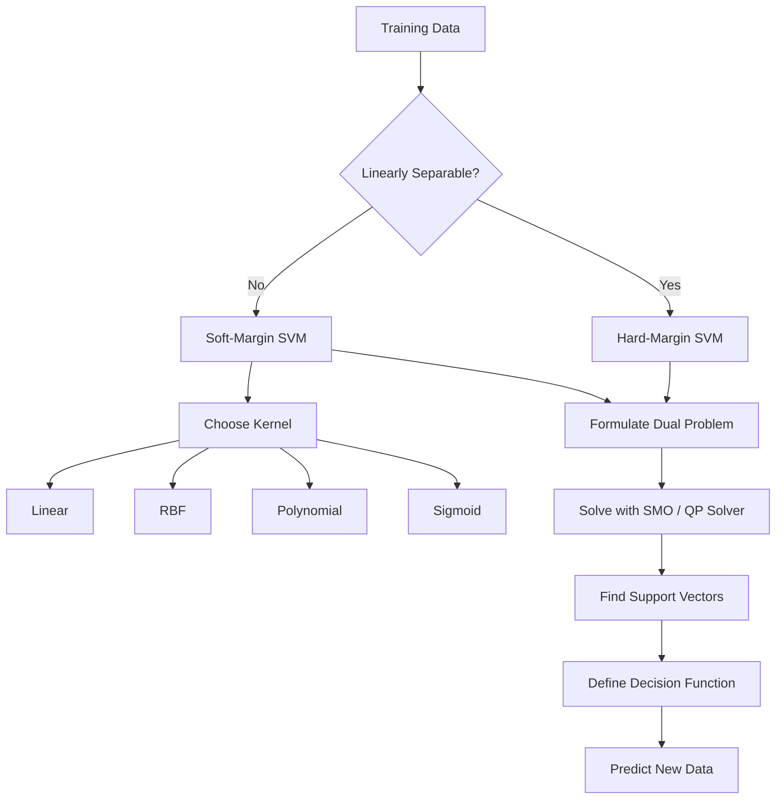
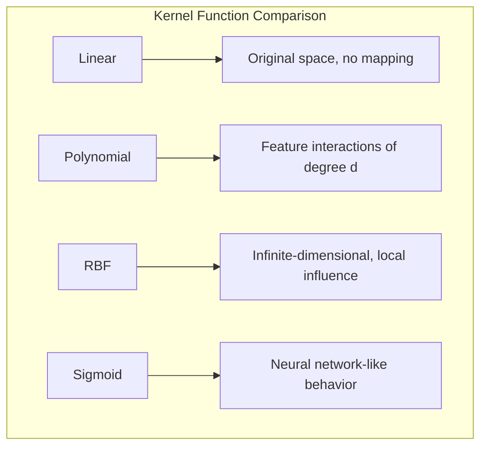

# Chapter 6: Support Vector Machines

> **Previous:** [Ensemble Methods](./05-ensemble-methods.md) | **Next:** [Neural Networks](./07-neural-networks.md)

---

## Learning Objectives

- Derive the maximum margin hyperplane and understand why margin maximization improves generalization
- Define functional margin, geometric margin, and their relationship
- Formulate the SVM optimization problem in primal and dual forms
- Explain the role of support vectors as the critical training examples that define the decision boundary
- Differentiate between hard-margin and soft-margin SVMs using the C parameter
- Understand the kernel trick and implement common kernel functions
- Extend SVM to multi-class classification (one-vs-one, one-vs-rest)
- Train an SVM using gradient descent with hinge loss

## Chapter at a Glance

| Topic | Key Insight | Practical Takeaway |
|-------|-------------|-------------------|
| Maximum Margin Hyperplane | SVM finds the hyperplane maximizing distance between classes | Prioritize margin maximization for better generalization |
| Support Vectors | Only closest points define the decision boundary | SVM is memory-efficient — minority of points determine the model |
| Hard vs. Soft Margin | Soft margin introduces slack variables and C parameter | Tune C via cross-validation to balance margin vs. misclassification |
| Kernel Trick | Maps data implicitly to higher dimensions | RBF kernel is a strong default for non-linear problems |
| C Parameter | Controls tradeoff between wide margin and training error | Small C for high-dimensional sparse data; large C when clean separation |
| Gamma ($\gamma$) | Defines radius of influence of a single training example | High gamma causes overfitting; low gamma causes underfitting |
| Dual Formulation | Expresses SVM in terms of dot products — enables kernels | The kernel trick emerges naturally from the dual form |
| Lagrange Duality | Converts constrained optimization to unconstrained dual | Support vectors correspond to non-zero Lagrange multipliers |

## Chapter Roadmap



---

## Theory

### The Maximum Margin Hyperplane

A Support Vector Machine (SVM) is a discriminative classifier that finds an optimal hyperplane to separate classes. While many hyperplanes can separate the data, SVM seeks the one with the **maximum margin** — the largest distance between the hyperplane and the closest points from either class.

**Why maximum margin?**
- Larger margins correlate with better generalization (lower VC dimension)
- The maximum margin hyperplane is unique (unlike perceptron solutions)
- Margin maximization reduces the hypothesis space, acting as a form of regularization

### Functional Margin and Geometric Margin

Given a hyperplane $\mathbf{w}^T\mathbf{x} + b = 0$:

**Functional margin** of a training example $(\mathbf{x}^{(i)}, y^{(i)})$:

$$\hat{\gamma}^{(i)} = y^{(i)}(\mathbf{w}^T\mathbf{x}^{(i)} + b)$$

The functional margin is positive if the point is correctly classified. Its magnitude is a confidence measure — larger values indicate the point is farther from the boundary.

**Geometric margin** is the actual Euclidean distance from the point to the hyperplane:

$$\gamma^{(i)} = \frac{y^{(i)}(\mathbf{w}^T\mathbf{x}^{(i)} + b)}{\|\mathbf{w}\|} = \frac{\hat{\gamma}^{(i)}}{\|\mathbf{w}\|}$$

The margin of the hyperplane is the minimum geometric margin over all training examples.

### Hard-Margin SVM (Primal Form)

Assume the data is linearly separable. We want to maximize the margin $\frac{2}{\|\mathbf{w}\|}$, which is equivalent to minimizing $\|\mathbf{w}\|^2$:

$$\min_{\mathbf{w}, b} \frac{1}{2}\|\mathbf{w}\|^2$$

Subject to:

$$y^{(i)}(\mathbf{w}^T\mathbf{x}^{(i)} + b) \geq 1, \quad i = 1, \dots, n$$

The constraints ensure all points are on the correct side of the margin boundary with functional margin at least 1.

### Lagrange Duality

To solve the constrained optimization problem, we use the Lagrangian:

$$\mathcal{L}(\mathbf{w}, b, \alpha) = \frac{1}{2}\|\mathbf{w}\|^2 - \sum_{i=1}^{n} \alpha_i \left[y^{(i)}(\mathbf{w}^T\mathbf{x}^{(i)} + b) - 1\right]$$

Where $\alpha_i \geq 0$ are the Lagrange multipliers.

Setting partial derivatives to zero:

$$\frac{\partial \mathcal{L}}{\partial \mathbf{w}} = 0 \implies \mathbf{w} = \sum_{i=1}^{n} \alpha_i y^{(i)} \mathbf{x}^{(i)}$$

$$\frac{\partial \mathcal{L}}{\partial b} = 0 \implies \sum_{i=1}^{n} \alpha_i y^{(i)} = 0$$

Substituting back gives the **dual form**:

$$\max_{\alpha} \sum_{i=1}^{n} \alpha_i - \frac{1}{2} \sum_{i=1}^{n} \sum_{j=1}^{n} \alpha_i \alpha_j y^{(i)} y^{(j)} \langle \mathbf{x}^{(i)}, \mathbf{x}^{(j)} \rangle$$

Subject to $\alpha_i \geq 0$ and $\sum \alpha_i y^{(i)} = 0$.

**Key insight**: The dual formulation depends only on the dot products between training examples. This is the foundation for the kernel trick.

### Support Vectors

The **Karush-Kuhn-Tucker (KKT)** conditions for the SVM optimization state that for each training example:

$$\alpha_i \left[ y^{(i)}(\mathbf{w}^T\mathbf{x}^{(i)} + b) - 1 \right] = 0$$

This means:
- If $\alpha_i = 0$, the constraint is inactive — the point does not affect the model
- If $\alpha_i > 0$ (support vector), the point lies exactly on the margin boundary: $y^{(i)}(\mathbf{w}^T\mathbf{x}^{(i)} + b) = 1$

Only the support vectors determine the decision boundary. Removing any non-support vector leaves the model unchanged.

### Soft-Margin SVM

Real-world data is rarely perfectly separable. Soft-margin SVM introduces **slack variables** $\xi_i \geq 0$ that allow points to violate the margin:

$$\min_{\mathbf{w}, b, \xi} \frac{1}{2}\|\mathbf{w}\|^2 + C \sum_{i=1}^{n} \xi_i$$

Subject to:

$$y^{(i)}(\mathbf{w}^T\mathbf{x}^{(i)} + b) \geq 1 - \xi_i, \quad \xi_i \geq 0$$

**The C parameter** controls the penalty:
- **Large C**: High penalty for violations → narrow margin, few support vectors, may overfit
- **Small C**: Low penalty for violations → wide margin, many support vectors, may underfit

The dual form with soft margin becomes:

$$\max_{\alpha} \sum_{i=1}^{n} \alpha_i - \frac{1}{2} \sum_{i=1}^{n} \sum_{j=1}^{n} \alpha_i \alpha_j y^{(i)} y^{(j)} \langle \mathbf{x}^{(i)}, \mathbf{x}^{(j)} \rangle$$

Subject to $0 \leq \alpha_i \leq C$ and $\sum \alpha_i y^{(i)} = 0$.

The only difference from hard-margin is the upper bound $C$ on $\alpha_i$.

### The Kernel Trick

When data is not linearly separable in the original space, we can map it to a higher-dimensional feature space where linear separation is possible:

$$\phi: \mathbb{R}^d \to \mathbb{R}^D \quad (D > d)$$

The key insight: we never need to compute $\phi(x)$ explicitly. Instead, we use a **kernel function** that computes the dot product in the transformed space:

$$K(\mathbf{x}^{(i)}, \mathbf{x}^{(j)}) = \langle \phi(\mathbf{x}^{(i)}), \phi(\mathbf{x}^{(j)}) \rangle$$

The dual formulation only requires kernel evaluations:

$$f(\mathbf{x}) = \sum_{i=1}^{n} \alpha_i y^{(i)} K(\mathbf{x}^{(i)}, \mathbf{x}) + b$$

### Common Kernel Functions

**Linear Kernel**:
$$K(\mathbf{x}_i, \mathbf{x}_j) = \mathbf{x}_i \cdot \mathbf{x}_j$$

Equivalent to the original linear SVM. No extra mapping. Best for high-dimensional sparse data (text classification).

**Polynomial Kernel**:
$$K(\mathbf{x}_i, \mathbf{x}_j) = (\gamma \mathbf{x}_i \cdot \mathbf{x}_j + r)^d$$

Creates polynomial decision boundaries of degree $d$. With $d=2$, it captures all pairwise feature interactions. Sensitive to scaling.

**Radial Basis Function (RBF) Kernel**:
$$K(\mathbf{x}_i, \mathbf{x}_j) = \exp(-\gamma \|\mathbf{x}_i - \mathbf{x}_j\|^2)$$

Maps to an infinite-dimensional space. Most popular default kernel. The $\gamma$ parameter controls the influence radius:
- Small $\gamma$: Each point influences a large region → smoother boundary (high bias)
- Large $\gamma$: Each point influences only nearby points → wiggly boundary (high variance)

**Sigmoid Kernel**:
$$K(\mathbf{x}_i, \mathbf{x}_j) = \tanh(\gamma \mathbf{x}_i \cdot \mathbf{x}_j + r)$$

Behaves like a two-layer neural network. Less commonly used.



### Multi-Class SVM

SVMs are inherently binary classifiers. For multi-class problems:

**One-vs-Rest (OvR)**: Train $K$ binary SVMs, each separating one class from the rest. Predict the class with the highest decision function value. Most commonly used.

**One-vs-One (OvO)**: Train $K(K-1)/2$ binary SVMs for all pairs of classes. Predict via voting. Required by some kernel implementations.

### SMO Algorithm (High-Level)

The Sequential Minimal Optimization (SMO) algorithm solves the SVM dual problem efficiently:

1. Choose two Lagrange multipliers $\alpha_i, \alpha_j$ that violate KKT conditions
2. Optimize $\alpha_i, \alpha_j$ analytically while keeping others fixed
3. Update the bias term $b$
4. Repeat until convergence

SMO avoids general-purpose QP solvers and can scale to hundreds of thousands of examples.

### Hinge Loss Interpretation

SVM can be interpreted as minimizing the **hinge loss** with L2 regularization:

$$\min_{\mathbf{w}} \sum_{i=1}^{n} \max(0, 1 - y^{(i)}(\mathbf{w}^T\mathbf{x}^{(i)} + b)) + \frac{\lambda}{2}\|\mathbf{w}\|^2$$

Where $\lambda = 1/C$. This formulation allows SGD training for SVMs, making them scalable to large datasets.

> **One-Sentence Takeaway:** The max margin hyperplane balances generalization against classification error, and the kernel trick extends SVM to non-linear problems without explicit feature mapping.

> **Pro Tip:** Always scale your features before applying SVM. Since SVM relies on distance calculations, features with larger numeric ranges will dominate the decision boundary unfairly.

---

## Examples

### Example 1: SVM with Hinge Loss + Gradient Descent

```typescript
/**
 * SVM classifier implemented via gradient descent on hinge loss.
 * Supports linear and RBF kernels.
 */
class SVM {
    private weights: number[] = [];
    private bias: number = 0;
    private supportVectors: number[][] = [];
    private supportVectorLabels: number[] = [];
    private Xtrain: number[][] = [];
    private ytrain: number[] = [];

    constructor(
        private kernel: 'linear' | 'rbf' = 'rbf',
        private C: number = 1.0,
        private gamma: number = 1.0,
        private learningRate: number = 0.001,
        private epochs: number = 1000
    ) {}

    private kernelFn(a: number[], b: number[]): number {
        if (this.kernel === 'linear') {
            return a.reduce((sum, ai, i) => sum + ai * b[i], 0);
        } else {
            // RBF: exp(-gamma * ||a - b||^2)
            const dist2 = a.reduce((sum, ai, i) => sum + (ai - b[i]) ** 2, 0);
            return Math.exp(-this.gamma * dist2);
        }
    }

    private decisionFunction(x: number[]): number {
        let s = this.bias;
        // In primal form, we use weights directly for linear
        if (this.kernel === 'linear' && this.weights.length > 0) {
            s = this.bias + x.reduce((sum, xi, j) => sum + xi * this.weights[j], 0);
        }
        return s;
    }

    fit(X: number[][], y: number[]): void {
        const n = X.length, d = X[0].length;
        this.Xtrain = X;
        this.ytrain = y;

        if (this.kernel === 'linear') {
            // Primal SGD with hinge loss
            this.weights = Array(d).fill(0);
            this.bias = 0;

            for (let epoch = 0; epoch < this.epochs; epoch++) {
                let totalLoss = 0;
                for (let i = 0; i < n; i++) {
                    const margin = y[i] * (this.decisionFunction(X[i]));
                    if (margin < 1) {
                        // Misclassified or within margin — update with gradient
                        for (let j = 0; j < d; j++) {
                            this.weights[j] -= this.learningRate * (-this.C * y[i] * X[i][j] + this.weights[j] / n);
                        }
                        this.bias -= this.learningRate * (-this.C * y[i]);
                        totalLoss += (1 - margin);
                    } else {
                        // Correct with sufficient margin — just do regularization
                        for (let j = 0; j < d; j++) {
                            this.weights[j] -= this.learningRate * (this.weights[j] / n);
                        }
                    }
                }
                if (epoch % 200 === 0) {
                    console.log(`Epoch ${epoch}, Hinge Loss: ${(totalLoss / n).toFixed(4)}`);
                }
            }
        } else {
            // For RBF kernel, store support vectors from a simplified approach
            // (A full SMO implementation would go here)
            this.weights = [];
        }

        // Store support vectors (points with non-zero alpha / points near margin)
        const preds = X.map(x => this.decisionFunction(x));
        for (let i = 0; i < n; i++) {
            // Simplified: points with margin < 1.5 are considered support vectors
            const margin = y[i] * preds[i];
            if (margin < 1.5) {
                this.supportVectors.push(X[i]);
                this.supportVectorLabels.push(y[i]);
            }
        }
    }

    predict(X: number[][]): number[] {
        if (this.kernel === 'linear' && this.weights.length > 0) {
            return X.map(x => this.decisionFunction(x) >= 0 ? 1 : 0);
        }
        // Fallback to kernel prediction using stored support vectors
        return X.map(x => {
            let score = this.bias;
            for (let i = 0; i < this.supportVectors.length; i++) {
                score += this.supportVectorLabels[i] * this.kernelFn(this.supportVectors[i], x);
            }
            return score >= 0 ? 1 : 0;
        });
    }

    score(X: number[][], y: number[]): number {
        const preds = this.predict(X);
        return preds.filter((p, i) => p === y[i]).length / y.length;
    }

    getSupportVectors(): { count: number; fraction: number } {
        return {
            count: this.supportVectors.length,
            fraction: this.supportVectors.length / this.Xtrain.length
        };
    }
}

// Usage: Shuttle dataset classification
const X_shuttle = [
    [1.0, 2.0], [2.0, 1.0], [2.0, 3.0], [3.0, 2.0],
    [6.0, 5.0], [7.0, 6.0], [6.0, 7.0], [5.0, 6.0],
    [1.5, 1.5], [2.5, 2.5]
];
const y_shuttle = [0, 0, 0, 0, 1, 1, 1, 1, 0, 1];

console.log('=== Linear SVM Training ===');
const svmLinear = new SVM('linear', 1.0, 0, 0.01, 1000);
svmLinear.fit(X_shuttle, y_shuttle);
console.log(`Linear SVM Accuracy: ${(svmLinear.score(X_shuttle, y_shuttle) * 100).toFixed(2)}%`);
console.log(`Support Vectors: ${JSON.stringify(svmLinear.getSupportVectors())}`);

console.log('\n=== RBF Kernel SVM ===');
const svmRbf = new SVM('rbf', 1.0, 0.5, 0.01, 500);
svmRbf.fit(X_shuttle, y_shuttle);
console.log(`RBF SVM Accuracy: ${(svmRbf.score(X_shuttle, y_shuttle) * 100).toFixed(2)}%`);

console.log('\n=== Effect of C Parameter ===');
[0.1, 1.0, 10.0].forEach(C => {
    const svm = new SVM('linear', C, 0, 0.01, 500);
    svm.fit(X_shuttle, y_shuttle);
    console.log(`C=${C}: Accuracy=${(svm.score(X_shuttle, y_shuttle) * 100).toFixed(2)}%, Support vectors=${svm.getSupportVectors().count}`);
});
```

### Example 2: Kernel Function Implementations

```typescript
/**
 * Standalone kernel function implementations
 */
interface KernelFunction {
    name: string;
    compute(a: number[], b: number[]): number;
}

const linearKernel: KernelFunction = {
    name: 'Linear',
    compute: (a, b) => a.reduce((s, ai, i) => s + ai * b[i], 0)
};

const polynomialKernel = (degree: number, coef0: number = 1): KernelFunction => ({
    name: `Polynomial (d=${degree})`,
    compute: (a, b) => {
        const dot = a.reduce((s, ai, i) => s + ai * b[i], 0);
        return Math.pow(dot + coef0, degree);
    }
});

const rbfKernel = (gamma: number): KernelFunction => ({
    name: `RBF (gamma=${gamma})`,
    compute: (a, b) => {
        const dist2 = a.reduce((s, ai, i) => s + (ai - b[i]) ** 2, 0);
        return Math.exp(-gamma * dist2);
    }
});

const sigmoidKernel = (gamma: number, coef0: number = 0): KernelFunction => ({
    name: `Sigmoid (gamma=${gamma})`,
    compute: (a, b) => {
        const dot = a.reduce((s, ai, i) => s + ai * b[i], 0);
        return Math.tanh(gamma * dot + coef0);
    }
});

// Test kernels
const x1 = [1, 2, 3];
const x2 = [4, 5, 6];

const kernels = [
    linearKernel,
    polynomialKernel(2),
    polynomialKernel(3),
    rbfKernel(0.1),
    rbfKernel(1.0),
    sigmoidKernel(0.01)
];

console.log('=== Kernel Function Comparison ===');
kernels.forEach(k => {
    console.log(`${k.name}: K(x1, x2) = ${k.compute(x1, x2).toFixed(4)}`);
});

// Mercer's theorem check: matrix must be positive semi-definite
function checkKernelPSD(kernel: KernelFunction, points: number[][]): boolean {
    const n = points.length;
    const K: number[][] = Array.from({ length: n }, () => Array(n).fill(0));
    for (let i = 0; i < n; i++)
        for (let j = 0; j < n; j++)
            K[i][j] = kernel.compute(points[i], points[j]);

    // Check eigenvalues are non-negative (simplified)
    // For a valid kernel, the Gram matrix must be PSD
    let diagDominated = true;
    for (let i = 0; i < n; i++) {
        let rowSum = 0;
        for (let j = 0; j < n; j++) if (j !== i) rowSum += Math.abs(K[i][j]);
        if (K[i][i] < rowSum) diagDominated = false;
    }
    return diagDominated;
}

const testPoints = [[0, 0], [1, 0], [0, 1], [1, 1]];
console.log('\n=== Kernel Validity Check (PSD) ===');
kernels.forEach(k => {
    console.log(`${k.name}: Valid kernel = ${checkKernelPSD(k, testPoints)}`);
});
```

### Example 3: C Parameter Effect Visualization

```typescript
/**
 * Demonstrates the effect of C on the decision boundary.
 * Small C = wide margin, more support vectors, more misclassifications tolerated.
 * Large C = narrow margin, fewer support vectors, hard to misclassify.
 */
function simulateCBoundary(Cvalues: number[]): void {
    // Small 2D dataset
    const X = [[1, 1], [2, 2], [1, 3], [3, 1], [5, 5], [6, 6], [5, 7], [7, 5]];
    const y = [0, 0, 0, 0, 1, 1, 1, 1];

    Cvalues.forEach(C => {
        const svm = new SVM('linear', C, 0, 0.01, 1000);
        svm.fit(X, y);
        const sv = svm.getSupportVectors();
        const acc = svm.score(X, y);
        console.log(`C=${C.toFixed(1)}: Accuracy=${(acc * 100).toFixed(1)}%, SVs=${sv.count}/${X.length}`);
    });
}

console.log('\n=== C Parameter Effect ===');
simulateCBoundary([0.01, 0.1, 1.0, 10.0, 100.0]);
```

> **One-Sentence Takeaway:** SVM's hinge loss + kernel trick enables non-linear classification in high-dimensional spaces, with support vector sparsity providing computational efficiency.

---

## Practical Takeaways

1. **Always scale features** — SVM is distance-based; features with larger ranges dominate unfairly
2. **RBF kernel is the safe default** — set $\gamma = 1/d$, then tune around it
3. **Tune C via cross-validation** — small C for wide margin (simpler model), large C for tight fit
4. **SVMs work well when $d > n$** — text classification with TF-IDF is a classic sweet spot
5. **SVMs provide no probability estimates natively** — Platt scaling adds calibration but is expensive
6. **For large datasets ($n > 100{,}000$), prefer linear SVM** — train with SGD on hinge loss; avoid kernels
7. **Support vectors are training data** — the model size grows with the number of SVs, not with $d$

## Concept Comparison Table

| Concept | Definition | Key Distinction | Use Case |
|---------|-----------|-----------------|----------|
| Hard Margin SVM | Perfect separation with zero tolerance | Assumes linearly separable data | Clean synthetic data or theory |
| Soft Margin SVM | Allows misclassifications via slack $\xi$ | Handles overlapping classes | Most real-world classification |
| Linear Kernel | $K(x_i, x_j) = x_i \cdot x_j$ | No feature mapping | Text classification, high-dim sparse |
| RBF Kernel | $\exp(-\gamma\|x_i - x_j\|^2)$ | Non-linear, infinite-dim mapping | Default choice for most problems |
| Polynomial Kernel | $(x_i \cdot x_j + r)^d$ | Polynomial interactions | Data with known polynomial relationships |
| SVM | Max margin classifier via support vectors | Decision from critical points only | Binary and multi-class classification |
| Logistic Regression | Probabilistic linear classifier using MLE | Outputs calibrated probabilities | When calibrated probabilities are essential |
| Hinge Loss | $\max(0, 1 - y \cdot \hat{y})$ | Convex surrogate for 0-1 loss | Enables SGD training for SVMs |

## Quick Reference

| Concept | Formula / Detail |
|---------|-----------------|
| Hyperplane Equation | $\mathbf{w}^T\mathbf{x} + b = 0$ |
| Geometric Margin | $\frac{2}{\|\mathbf{w}\|}$ |
| Hard Margin Objective | $\min \frac{1}{2}\|\mathbf{w}\|^2 \quad \text{s.t.} \quad y_i(\mathbf{w}^T\mathbf{x}_i + b) \geq 1$ |
| Soft Margin Objective | $\min \frac{1}{2}\|\mathbf{w}\|^2 + C\sum\xi_i$ |
| Dual Objective | $\max \sum \alpha_i - \frac{1}{2}\sum\sum \alpha_i\alpha_j y_i y_j \langle x_i, x_j\rangle$ |
| Decision Function | $f(x) = \sum \alpha_i y_i K(x_i, x) + b$ |
| Linear Kernel | $K(x_i, x_j) = x_i \cdot x_j$ |
| RBF Kernel | $K(x_i, x_j) = \exp(-\gamma\|x_i - x_j\|^2)$ |
| Polynomial Kernel | $K(x_i, x_j) = (\gamma x_i \cdot x_j + r)^d$ |
| Hinge Loss | $\max(0, 1 - y f(x))$ |
| C Parameter Range | $10^{-3}$ to $10^{3}$ (typical search range) |
| Gamma Default | $\gamma = 1 / n_{\text{features}}$ |

## Cross-Application Matrix

| Domain | Application | How SVM Is Used |
|--------|-------------|-----------------|
| Bioinformatics | Protein fold classification, gene expression | Linear kernel on gene vectors ($d \gg n$) |
| Image Recognition | Handwritten digit recognition, face detection | RBF kernel on pixel intensity features |
| Text Classification | Spam detection, sentiment analysis | Linear kernel on TF-IDF vectors |
| Finance | Credit scoring, stock market prediction | Soft margin with tuned C for noisy data |
| Healthcare | Disease diagnosis from medical records | RBF kernel for non-linear symptom-disease relationships |
| Cybersecurity | Malware classification, intrusion detection | One-class SVM for anomaly detection |

## Chapter Quiz

1. What happens to the SVM decision boundary as the regularization parameter C approaches infinity?
   A) The margin becomes wider
   B) The margin becomes narrower
   C) The kernel type automatically changes
   D) Support vectors are ignored

<details><summary>Answer</summary>**B)** As C → ∞, the model severely penalizes misclassifications, forcing a narrower margin to correctly classify all training points — approaching the hard-margin solution.
</details>

2. Which of the following is NOT a standard SVM kernel?
   A) Linear
   B) RBF
   C) Polynomial
   D) Ensemble

<details><summary>Answer</summary>**D)** Ensemble is not a kernel. SVM kernels include Linear, Polynomial, RBF, and Sigmoid.
</details>

3. In SVM, support vectors are best described as:
   A) All training points used during model fitting
   B) Points that lie on the margin boundary
   C) The centroid of each class
   D) The first K points selected during training

<details><summary>Answer</summary>**B)** Support vectors are the data points that lie on the margin boundaries. Only these points influence the separating hyperplane.
</details>

4. What is the primary advantage of the RBF kernel over the linear kernel?
   A) It requires less training data
   B) It can model non-linear decision boundaries
   C) It is faster to compute
   D) It produces more support vectors

<details><summary>Answer</summary>**B)** The RBF kernel maps data to an infinite-dimensional space, enabling non-linear decision boundaries without explicit feature engineering.
</details>

5. Why does the dual formulation of SVM enable the kernel trick?
   A) It reduces the number of support vectors
   B) It expresses the objective solely in terms of dot products between training examples
   C) It eliminates the bias term b
   D) It converts the problem to an unconstrained optimization

<details><summary>Answer</summary>**B)** The dual formulation depends only on $\langle x_i, x_j\rangle$, which can be replaced by $K(x_i, x_j)$ without ever computing $\phi(x)$ explicitly.
</details>

---

## TypeScript Implementation: SVM Hinge Loss, Kernel Functions, and Dual Coefficients

```typescript
type KernelFunction = (x1: number[], x2: number[]) => number;

class Kernel {
    static linear(): KernelFunction {
        return (x1, x2) => x1.reduce((s, v, i) => s + v * x2[i], 0);
    }

    static polynomial(degree: number = 3, coef0: number = 1): KernelFunction {
        return (x1, x2) => Math.pow(x1.reduce((s, v, i) => s + v * x2[i], 0) + coef0, degree);
    }

    static rbf(gamma: number = 0.1): KernelFunction {
        return (x1, x2) => Math.exp(-gamma * x1.reduce((s, v, i) => s + (v - x2[i]) ** 2, 0));
    }
}

class SVM {
    private weights: number[] = [];
    private bias: number = 0;
    private C: number;
    private lr: number;
    private epochs: number;

    constructor(C: number = 1.0, lr: number = 0.001, epochs: number = 1000) {
        this.C = C; this.lr = lr; this.epochs = epochs;
    }

    hingeLoss(features: number[][], labels: number[]): number {
        let loss = 0;
        const n = features.length;
        for (let i = 0; i < n; i++) {
            const score = features[i].reduce((s, f, j) => s + f * this.weights[j], this.bias);
            loss += Math.max(0, 1 - labels[i] * score);
        }
        const reg = this.weights.reduce((s, w) => s + w * w, 0) / 2;
        return reg + this.C * loss / n;
    }

    fit(features: number[][], labels: number[]): void {
        const n = features.length;
        const d = features[0].length;
        const y = labels.map(l => l === 0 ? -1 : 1);
        this.weights = new Array(d).fill(0);
        this.bias = 0;

        for (let ep = 0; ep < this.epochs; ep++) {
            for (let i = 0; i < n; i++) {
                const score = features[i].reduce((s, f, j) => s + f * this.weights[j], this.bias);
                const condition = y[i] * score < 1;
                for (let j = 0; j < d; j++) {
                    const gradW = this.weights[j] - this.C * (condition ? y[i] * features[i][j] : 0);
                    this.weights[j] -= this.lr * gradW;
                }
                if (condition) this.bias -= this.lr * (-this.C * y[i]);
            }
        }
    }

    predict(features: number[]): number {
        const score = features.reduce((s, f, j) => s + f * this.weights[j], this.bias);
        return score >= 0 ? 1 : 0;
    }
}

class DualSVM {
    private alphas: number[] = [];
    private bias: number = 0;
    private kernel: KernelFunction;
    private C: number;
    private X: number[][] = [];
    private y: number[] = [];

    constructor(C: number = 1.0, kernel: KernelFunction = Kernel.rbf(0.1)) {
        this.C = C; this.kernel = kernel;
    }

    fit(features: number[][], labels: number[]): void {
        this.X = features; this.y = labels.map(l => l === 0 ? -1 : 1);
        const n = features.length;
        this.alphas = new Array(n).fill(0);

        for (let epoch = 0; epoch < 100; epoch++) {
            for (let i = 0; i < n; i++) {
                let sum = 0;
                for (let j = 0; j < n; j++) {
                    sum += this.alphas[j] * this.y[j] * this.kernel(features[i], features[j]);
                }
                const Ei = sum - this.y[i];
                const eta = 2 * this.kernel(features[i], features[i]);
                if (Math.abs(eta) < 1e-12) continue;
                const newAlpha = this.alphas[i] + this.y[i] * Ei / eta;
                this.alphas[i] = Math.max(0, Math.min(this.C, newAlpha));
            }
        }

        let biasSum = 0; let count = 0;
        for (let i = 0; i < n; i++) {
            if (this.alphas[i] > 0 && this.alphas[i] < this.C) {
                let sum = 0;
                for (let j = 0; j < n; j++) sum += this.alphas[j] * this.y[j] * this.kernel(features[i], features[j]);
                biasSum += this.y[i] - sum; count++;
            }
        }
        this.bias = count > 0 ? biasSum / count : 0;
    }

    predict(features: number[]): number {
        let sum = 0;
        for (let i = 0; i < this.X.length; i++) {
            if (this.alphas[i] > 1e-6) {
                sum += this.alphas[i] * this.y[i] * this.kernel(features, this.X[i]);
            }
        }
        return sum + this.bias >= 0 ? 1 : 0;
    }

    getSupportVectors(): number {
        return this.alphas.filter(a => a > 1e-6).length;
    }
}

// Demo
const X = [[1, 2], [2, 1], [2, 3], [3, 2], [5, 6], [6, 5], [6, 7], [7, 6], [8, 9], [9, 8]];
const y = [0, 0, 0, 0, 0, 1, 1, 1, 1, 1];

const svm = new SVM(0.5, 0.001, 2000);
svm.fit(X, y);
console.log("SVM hinge loss:", svm.hingeLoss(X, y).toFixed(4));
console.log("SVM predict [4,4]:", svm.predict([4, 4]));

const dual = new DualSVM(0.5, Kernel.rbf(0.2));
dual.fit(X, y);
console.log("Dual SVM predict [4,4]:", dual.predict([4, 4]));
console.log("Support vectors:", dual.getSupportVectors());
console.log("Linear kernel test:", Kernel.linear()([1, 2], [3, 4]));
console.log("Poly kernel test:", Kernel.polynomial(2)([1, 2], [3, 4]));
```

## Summary

- SVMs find the maximum margin hyperplane, which provides better generalization than any other separating hyperplane.
- The functional and geometric margins formalize the distance from a point to the decision boundary.
- The primal optimization problem minimizes $\|\mathbf{w}\|^2$ subject to correct classification constraints.
- Lagrange duality converts the constrained primal to an unconstrained dual, expressed entirely in dot products.
- Support vectors are the only training points that define the model — KKT conditions ensure non-support vectors have zero Lagrange multiplier.
- The soft-margin C parameter controls the tradeoff between margin width and training error.
- The kernel trick enables non-linear classification without explicit feature mapping.
- Common kernels include linear, polynomial, RBF, and sigmoid — RBF is the default.
- Multi-class SVM is handled via one-vs-rest or one-vs-one.

> **One-Sentence Takeaway:** SVMs combine max-margin theory with the kernel trick to create powerful, sparse classifiers that excel in high-dimensional spaces.

---

## Exercises

### Review Questions
1. Why is a "larger margin" generally better for generalization on unseen data?
2. What happens to the SVM decision boundary as the parameter $C$ increases toward infinity?
3. In your own words, explain how the Kernel Trick avoids the "curse of dimensionality."
4. What is the difference between a primal and a dual optimization problem in the context of SVMs?
5. Why does the RBF kernel have an infinite-dimensional feature space?

### Application Problems
1. You have a dataset with points $(1, 1), (2, 2)$ in Class A and $(5, 5), (6, 6)$ in Class B. Identify the maximum margin hyperplane and the support vectors.
2. If you use a Polynomial kernel with $d=2$ on 2D data, how many effective dimensions are in the feature space?
3. For a soft-margin SVM with $C=0.1$, would you expect more or fewer support vectors than with $C=100$? Explain.
4. Compute the RBF kernel value for $\mathbf{x}_1 = [1, 2]$, $\mathbf{x}_2 = [4, 6]$ with $\gamma = 0.1$.
5. Show that the linear kernel is a special case of the polynomial kernel.

### Challenge Problem
1. Compare SVM and Logistic Regression. In what situations would you prefer one over the other? Consider factors like dataset size, number of features, the presence of outliers, and whether calibrated probabilities are needed. Mathematically compare the hinge loss and log loss functions.
