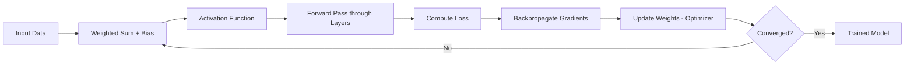
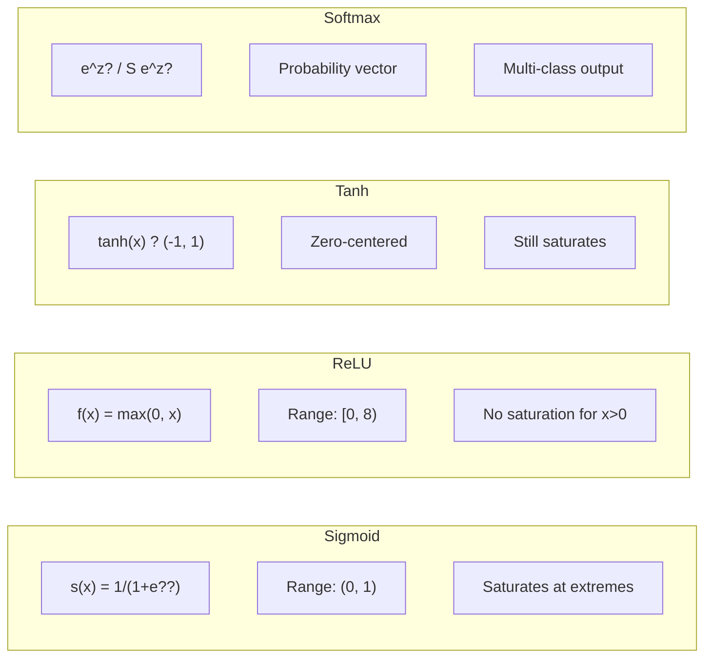
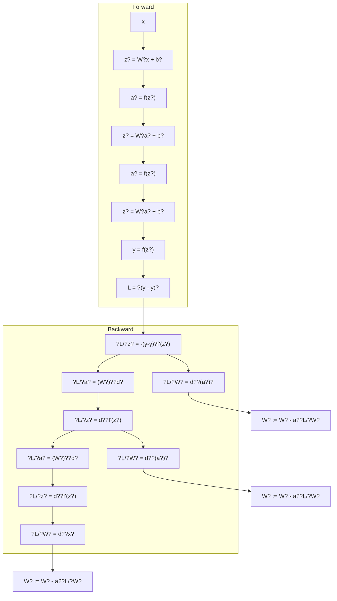
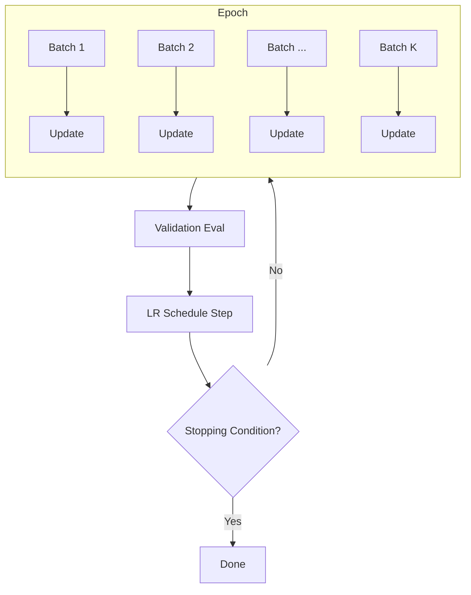
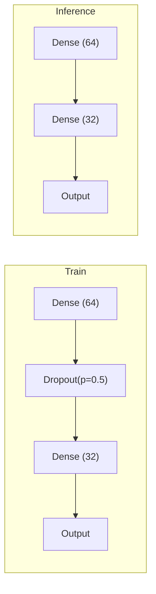
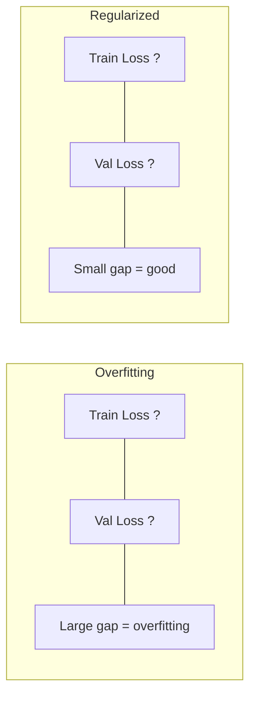
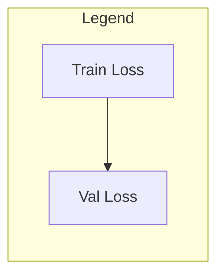
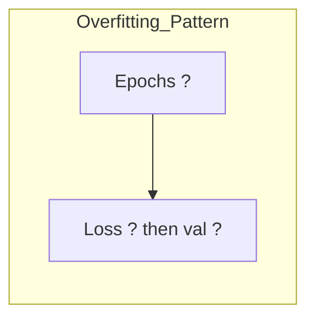
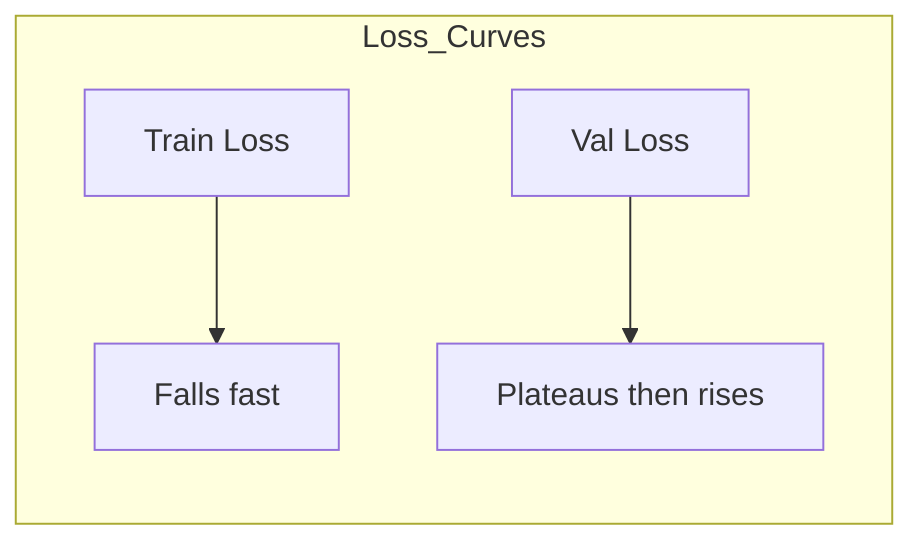
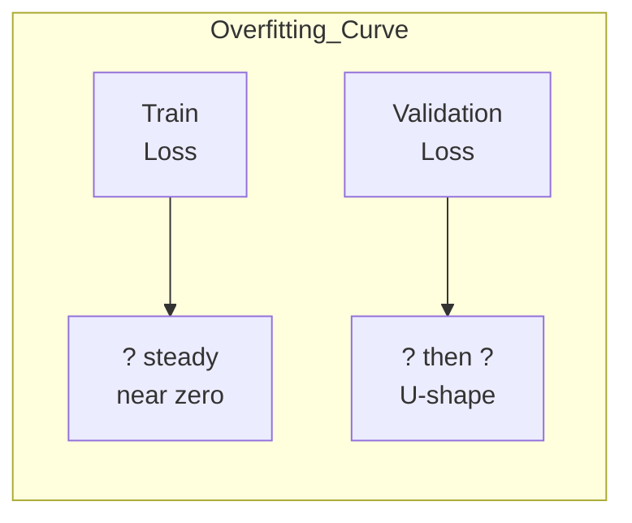

# Chapter 7: Neural Networks

> **Previous:** [Support Vector Machines](./06-support-vector-machines.md) | **Next:** [Unsupervised Learning](./08-unsupervised-learning.md)

---

## Learning Objectives

- Explain the structure of an Artificial Neuron (Perceptron)
- Describe the architecture of a Multi-Layer Perceptron (MLP)
- Understand the role of Activation Functions (ReLU, Sigmoid, Tanh)
- Derive and implement the Backpropagation algorithm
- Apply gradient descent variants (SGD, Momentum, Adam)
- Diagnose and mitigate vanishing/exploding gradients
- Configure regularization techniques (L2, Dropout, BatchNorm)
- Train neural networks with proper weight initialization and learning rate schedules

---

## Chapter at a Glance

| Topic | Key Insight | Practical Takeaway |
|-------|-------------|-------------------|
| Artificial Neuron | A weighted sum of inputs passed through a non-linear activation function | Every neuron performs a linear transformation followed by non-linearity |
| Multi-Layer Perceptron | Stacking hidden layers enables learning of hierarchical features | Deeper networks can approximate more complex functions (Universal Approximation Theorem) |
| Activation Functions | Non-linear functions (ReLU, Sigmoid, Tanh) enable the network to learn complex patterns | ReLU is the default for hidden layers; avoid Sigmoid in deep networks |
| Backpropagation | Gradients flow backward through the network via the chain rule of calculus | Understanding backpropagation is essential for debugging training issues |
| Vanishing Gradient | Gradients become extremely small in deep networks with Sigmoid/Tanh, stalling training | Use ReLU or its variants (Leaky ReLU, ELU) to mitigate vanishing gradients |
| Stochastic Gradient Descent | Iterative weight updates using small random batches of data | Mini-batch SGD balances convergence speed and stability |
| Regularization | L2 penalty, Dropout, and Batch Normalization prevent overfitting | Always use at least one form of regularization in networks with >2 hidden layers |
| Weight Initialization | Xavier and He initialization prevent gradient explosion/vanishing at layer boundaries | He init for ReLU, Xavier init for Tanh ? never start with zero weights |

## Chapter Roadmap



---

## Theory

### The Artificial Neuron

<a href="../../../assets/images/diagrams/machine-learning/07-neural-networks/the-artificial-neuron-handwritten.svg" target="_blank" rel="noopener">
  
</a>
<a href="../../../assets/images/diagrams/machine-learning/07-neural-networks/the-artificial-neuron-diagram.svg" target="_blank" rel="noopener">
  
</a>
<a href="../../../assets/images/diagrams/machine-learning/07-neural-networks/the-artificial-neuron-sticky.svg" target="_blank" rel="noopener">
  
</a>


An artificial neuron is the fundamental building block of a neural network. It takes several inputs, applies a weight to each, sums them with a bias, and passes the result through an **activation function**.

$$y = f(\sum_{i=1}^{n} w_i x_i + b)$$

Where:
- $x_i$ are the inputs.
- $w_i$ are the weights.
- $b$ is the bias.
- $f$ is the activation function.

### Multi-Layer Perceptron (MLP)

<a href="../../../assets/images/diagrams/machine-learning/07-neural-networks/multi-layer-perceptron-mlp-handwritten.svg" target="_blank" rel="noopener">
  
</a>
<a href="../../../assets/images/diagrams/machine-learning/07-neural-networks/multi-layer-perceptron-mlp-diagram.svg" target="_blank" rel="noopener">
  
</a>
<a href="../../../assets/images/diagrams/machine-learning/07-neural-networks/multi-layer-perceptron-mlp-sticky.svg" target="_blank" rel="noopener">
  
</a>


An MLP is a feedforward neural network consisting of at least three layers of nodes: an **input layer**, one or more **hidden layers**, and an **output layer**. Except for the input nodes, each node is a neuron that uses a nonlinear activation function. The hidden layers allow the network to learn complex, non-linear representations of the data.

### Activation Functions

<a href="../../../assets/images/diagrams/machine-learning/07-neural-networks/activation-functions-handwritten.svg" target="_blank" rel="noopener">
  
</a>
<a href="../../../assets/images/diagrams/machine-learning/07-neural-networks/activation-functions-diagram.svg" target="_blank" rel="noopener">
  
</a>
<a href="../../../assets/images/diagrams/machine-learning/07-neural-networks/activation-functions-sticky.svg" target="_blank" rel="noopener">
  
</a>


Activation functions introduce non-linearity into the network, which is essential for learning complex patterns.



| Activation | Formula | Range | Gradient Property | Best Use |
|------------|---------|-------|-------------------|----------|
| Sigmoid | $\sigma(x) = \frac{1}{1+e^{-x}}$ | (0, 1) | Vanishes for $|x|>3$ | Binary output layer |
| Tanh | $\tanh(x) = \frac{e^x - e^{-x}}{e^x + e^{-x}}$ | (-1, 1) | Vanishes for $|x|>3$ | Zero-centered hidden |
| ReLU | $f(x) = \max(0, x)$ | [0, 8) | 1 for $x>0$, 0 for $x&lt;0$ | Default hidden layer |
| Leaky ReLU | $f(x) = \max(0.01x, x)$ | (-8, 8) | 0.01 for $x&lt;0$, 1 for $x&gt;0$ | Avoids dying ReLU |
| ELU | $f(x) = x \text{ if } x>0, \alpha(e^x-1) \text{ else}$ | (-a, 8) | Smooth for $x&lt;0$ | Deeper networks |
| GELU | $f(x) = x \cdot \Phi(x)$ | (-8, 8) | Smooth everywhere | Transformers |
| Swish | $f(x) = x \cdot \sigma(x)$ | (-8, 8) | Non-monotonic | Deep NAS-found nets |
| Softmax | $\sigma(\mathbf{z})_i = e^{z_i} / \sum e^{z_j}$ | (0, 1) | Shift-invariant | Multi-class output |

### Backpropagation: Detailed Derivation

<a href="../../../assets/images/diagrams/machine-learning/07-neural-networks/backpropagation-detailed-derivation-handwritten.svg" target="_blank" rel="noopener">
  
</a>
<a href="../../../assets/images/diagrams/machine-learning/07-neural-networks/backpropagation-detailed-derivation-diagram.svg" target="_blank" rel="noopener">
  
</a>
<a href="../../../assets/images/diagrams/machine-learning/07-neural-networks/backpropagation-detailed-derivation-sticky.svg" target="_blank" rel="noopener">
  
</a>


Backpropagation computes the gradient of the loss function with respect to every weight in the network using the chain rule. Consider a 3-layer MLP with MSE loss:

**Forward pass equations:**

$$z^{(1)} = W^{(1)} x + b^{(1)}$$
$$a^{(1)} = f(z^{(1)})$$
$$z^{(2)} = W^{(2)} a^{(1)} + b^{(2)}$$
$$a^{(2)} = f(z^{(2)})$$
$$z^{(3)} = W^{(3)} a^{(2)} + b^{(3)}$$
$$\hat{y} = f(z^{(3)})$$
$$\mathcal{L} = \frac{1}{2} (y - \hat{y})^2$$

**Backward pass (chain rule, layer by layer):**

Output layer gradients:

$$\frac{\partial \mathcal{L}}{\partial z^{(3)}} = \frac{\partial \mathcal{L}}{\partial \hat{y}} \cdot \frac{\partial \hat{y}}{\partial z^{(3)}} = -(y - \hat{y}) \cdot f'(z^{(3)})$$

$$\frac{\partial \mathcal{L}}{\partial W^{(3)}} = \frac{\partial \mathcal{L}}{\partial z^{(3)}} \cdot (a^{(2)})^T$$

Hidden layer 2 gradients:

$$\frac{\partial \mathcal{L}}{\partial a^{(2)}} = (W^{(3)})^T \cdot \frac{\partial \mathcal{L}}{\partial z^{(3)}}$$

$$\frac{\partial \mathcal{L}}{\partial z^{(2)}} = \frac{\partial \mathcal{L}}{\partial a^{(2)}} \cdot f'(z^{(2)})$$

$$\frac{\partial \mathcal{L}}{\partial W^{(2)}} = \frac{\partial \mathcal{L}}{\partial z^{(2)}} \cdot (a^{(1)})^T$$

Hidden layer 1 gradients:

$$\frac{\partial \mathcal{L}}{\partial a^{(1)}} = (W^{(2)})^T \cdot \frac{\partial \mathcal{L}}{\partial z^{(2)}}$$

$$\frac{\partial \mathcal{L}}{\partial z^{(1)}} = \frac{\partial \mathcal{L}}{\partial a^{(1)}} \cdot f'(z^{(1)})$$

$$\frac{\partial \mathcal{L}}{\partial W^{(1)}} = \frac{\partial \mathcal{L}}{\partial z^{(1)}} \cdot x^T$$

The pattern is recursive: the gradient at layer $l$ depends on the gradient at layer $l+1$. This allows efficient computation in a single backward sweep.



### Vanishing & Exploding Gradients

<a href="../../../assets/images/diagrams/machine-learning/07-neural-networks/vanishing-exploding-gradients-handwritten.svg" target="_blank" rel="noopener">
  
</a>
<a href="../../../assets/images/diagrams/machine-learning/07-neural-networks/vanishing-exploding-gradients-diagram.svg" target="_blank" rel="noopener">
  
</a>
<a href="../../../assets/images/diagrams/machine-learning/07-neural-networks/vanishing-exploding-gradients-sticky.svg" target="_blank" rel="noopener">
  
</a>


**Vanishing gradients** occur when repeated multiplication of gradients (chain rule) produces values approaching zero. This is especially severe with Sigmoid or Tanh activations because their derivatives saturate:

$$\sigma'(x) = \sigma(x)(1-\sigma(x)) \leq 0.25$$

After $L$ layers, the gradient is multiplied by $(0.25)^L$ ? for $L=10$, that gives a scaling factor of $10^{-6}$.

**Exploding gradients** occur when weights are large, causing the gradient norm to grow exponentially through layers, leading to NaN weights and training divergence.

**Solutions:**

| Technique | Mechanism | Effect |
|-----------|-----------|--------|
| ReLU / Leaky ReLU | Derivative is 1 (or near-1) for positive inputs | Gradient magnitude does not decay through layers |
| He / Xavier Initialization | Scales initial weights to preserve variance | Prevents explosion from the start |
| Gradient Clipping | Caps gradient norm to a maximum value | Prevents catastrophic weight updates |
| Batch Normalization | Normalizes layer outputs to zero mean, unit variance | Stabilizes gradient flow across layers |
| Residual Connections | Skip connections allow gradient shortcut paths | Enables training of 100+ layer networks |

### Weight Initialization

<a href="../../../assets/images/diagrams/machine-learning/07-neural-networks/weight-initialization-handwritten.svg" target="_blank" rel="noopener">
  
</a>
<a href="../../../assets/images/diagrams/machine-learning/07-neural-networks/weight-initialization-diagram.svg" target="_blank" rel="noopener">
  
</a>
<a href="../../../assets/images/diagrams/machine-learning/07-neural-networks/weight-initialization-sticky.svg" target="_blank" rel="noopener">
  
</a>


Initializing all weights to zero causes every neuron in a layer to compute the same gradient ? they become symmetric and never differentiate.

**Xavier (Glorot) Initialization** ? optimal for Tanh / Sigmoid:

$$\text{Var}(W) = \frac{2}{\text{fan\_in} + \text{fan\_out}}$$

Preserves variance of activations and gradients through layers when activation is linear near zero.

**He Initialization** ? optimal for ReLU:

$$\text{Var}(W) = \frac{2}{\text{fan\_in}}}$$

ReLU zeroes half the neurons, doubling the variance needed to compensate.

| Init Method | Formula | Activation | Rationale |
|------------|---------|-------|-----------|
| Zero | $W = 0$ | Any | Breaks symmetry ? never use |
| Random Uniform | $W \sim U(-r, r)$ | Any | Simple but variance grows with depth |
| Xavier Uniform | $W \sim U(-\sqrt{6/(n_i+n_o)}, \sqrt{6/(n_i+n_o)})$ | Tanh, Sigmoid | Preserves forward/backward variance |
| Xavier Normal | $W \sim \mathcal{N}(0, \sqrt{2/(n_i+n_o)})$ | Tanh, Sigmoid | Same, Gaussian sampled |
| He Uniform | $W \sim U(-\sqrt{6/n_i}, \sqrt{6/n_i})$ | ReLU, Leaky ReLU | Compensates for 50% ReLU sparsity |
| He Normal | $W \sim \mathcal{N}(0, \sqrt{2/n_i})$ | ReLU, Leaky ReLU | Default for most modern ReLU nets |

### Gradient Descent Variants

<a href="../../../assets/images/diagrams/machine-learning/07-neural-networks/gradient-descent-variants-handwritten.svg" target="_blank" rel="noopener">
  
</a>
<a href="../../../assets/images/diagrams/machine-learning/07-neural-networks/gradient-descent-variants-diagram.svg" target="_blank" rel="noopener">
  
</a>
<a href="../../../assets/images/diagrams/machine-learning/07-neural-networks/gradient-descent-variants-sticky.svg" target="_blank" rel="noopener">
  
</a>


| Optimizer | Update Rule | Key Property | Best When |
|-----------|------------|--------------|-----------|
| SGD | $w_{t+1} = w_t - \alpha \nabla \mathcal{L}_t$ | No momentum, fixed LR | Simple problems, small datasets |
| SGD + Momentum | $v_{t+1} = \gamma v_t + \alpha \nabla \mathcal{L}_t$; $w_{t+1} = w_t - v_{t+1}$ | Accelerates along consistent directions | Deep CNNs, noisy gradients |
| Nesterov | $v_{t+1} = \gamma v_t + \alpha \nabla \mathcal{L}(w_t - \gamma v_t)$ | Looks ahead before stepping | Faster convergence than momentum |
| AdaGrad | $w_{t+1} = w_t - \alpha / \sqrt{G_t + \epsilon} \cdot \nabla \mathcal{L}_t$ | Per-parameter LR, decays over time | Sparse features (NLP, embeddings) |
| RMSProp | $w_{t+1} = w_t - \alpha / \sqrt{v_t + \epsilon} \cdot \nabla \mathcal{L}_t$ | Running average of squared gradients | Non-stationary objectives |
| Adam | $m_t = \beta_1 m_{t-1} + (1-\beta_1)g_t$; $v_t = \beta_2 v_{t-1} + (1-\beta_2)g_t^2$; bias-corrected | Momentum + adaptive LR | **Default choice** for most tasks |
| AdamW | Same as Adam + decoupled weight decay | Separates L2 from adaptive LR | Transformers, large models |
| Lion | $w_{t+1} = w_t - \alpha(\text{sign}(\beta_1 m_{t-1} + \beta_2 g_t))$ | Sign-based update | Memory-constrained, large-scale |

**Adam update (full form):**

$$g_t = \nabla_\theta \mathcal{L}_t(\theta_{t-1})$$
$$m_t = \beta_1 m_{t-1} + (1-\beta_1)g_t$$
$$v_t = \beta_2 v_{t-1} + (1-\beta_2)g_t^2$$
$$\hat{m}_t = \frac{m_t}{1 - \beta_1^t}, \quad \hat{v}_t = \frac{v_t}{1 - \beta_2^t}$$
$$\theta_t = \theta_{t-1} - \alpha \frac{\hat{m}_t}{\sqrt{\hat{v}_t} + \epsilon}$$

Default hyperparameters: $\alpha = 0.001$, $\beta_1 = 0.9$, $\beta_2 = 0.999$, $\epsilon = 10^{-8}$.

### The Training Loop

<a href="../../../assets/images/diagrams/machine-learning/07-neural-networks/the-training-loop-handwritten.svg" target="_blank" rel="noopener">
  
</a>
<a href="../../../assets/images/diagrams/machine-learning/07-neural-networks/the-training-loop-diagram.svg" target="_blank" rel="noopener">
  
</a>
<a href="../../../assets/images/diagrams/machine-learning/07-neural-networks/the-training-loop-sticky.svg" target="_blank" rel="noopener">
  
</a>


Training a neural network follows an iterative loop:



**Key concepts per iteration:**
- **Epoch**: One full pass over the entire training dataset.
- **Batch**: A subset of samples processed together. Batch size determines how many samples are used per gradient computation.
- **Iteration**: One forward + backward pass on one batch.

**Learning rate schedules:**

| Schedule | Rule | Effect |
|----------|------|--------|
| Step Decay | $\alpha_t = \alpha_0 \cdot \gamma^{\lfloor t / s \rfloor}$ | Drops LR by factor $\gamma$ every $s$ epochs |
| Exponential Decay | $\alpha_t = \alpha_0 \cdot e^{-kt}$ | Smooth continuous decay |
| Cosine Annealing | $\alpha_t = \alpha_{\min} + \frac{1}{2}(\alpha_0 - \alpha_{\min})(1 + \cos(\frac{t}{T}\pi))$ | Cycles LR up and down |
| Reduce on Plateau | $\alpha_{t+1} = \alpha_t \cdot \gamma$ if val loss stalled for $p$ epochs | Adaptive to training progress |
| Linear Warmup + Decay | Linear increase to $\alpha_0$ then cosine/step decay | Prevents early instability |

### Regularization

<a href="../../../assets/images/diagrams/machine-learning/07-neural-networks/regularization-handwritten.svg" target="_blank" rel="noopener">
  
</a>
<a href="../../../assets/images/diagrams/machine-learning/07-neural-networks/regularization-diagram.svg" target="_blank" rel="noopener">
  
</a>
<a href="../../../assets/images/diagrams/machine-learning/07-neural-networks/regularization-sticky.svg" target="_blank" rel="noopener">
  
</a>


**L1 Regularization (Lasso):** Adds absolute weight penalty, encourages sparsity:

$$\mathcal{L}_{\text{total}} = \mathcal{L}_{\text{data}} + \lambda \sum_i |w_i|$$

Gradient update gains a sign-based term: $w := w - \alpha(\nabla \mathcal{L} + \lambda \cdot \text{sign}(w))$. Drives small weights to exactly zero.

**L2 Regularization (Ridge / Weight Decay):** Adds squared weight penalty, encourages small weights:

$$\mathcal{L}_{\text{total}} = \mathcal{L}_{\text{data}} + \frac{\lambda}{2} \sum_i w_i^2$$

Gradient update becomes: $w := w(1 - \alpha\lambda) - \alpha \nabla \mathcal{L}$. The $(1 - \alpha\lambda)$ term shrinks weights each step.

**Dropout:** During training, randomly zero out a fraction $p$ of neurons each forward pass. This forces the network to learn redundant representations and prevents co-adaptation. At inference, all neurons are used but scaled by $(1-p)$ to maintain expected output magnitude.



**Batch Normalization:** Normalizes each layer's output to have zero mean and unit variance across the mini-batch, then applies learnable scale $\gamma$ and shift $\beta$:

$$\hat{x}_i = \frac{x_i - \mu_B}{\sqrt{\sigma_B^2 + \epsilon}}$$
$$y_i = \gamma \hat{x}_i + \beta$$

Benefits: allows higher learning rates, reduces sensitivity to initialization, provides mild regularization.

**Early Stopping:** Monitor validation loss after each epoch. Stop training when validation loss has not improved for $n$ consecutive epochs (patience). Restore weights from the best epoch.

| Technique | How It Works | Effect on Overfitting | Training Cost |
|-----------|-------------|----------------------|---------------|
| L2 (Weight Decay) | Penalizes large weights | Lowers model capacity | Negligible |
| Dropout | Random neuron dropout | Forces redundancy, ensemble-like | 2-3x more epochs |
| Batch Normalization | Normalizes layer outputs | Stabilizes, mild regularizer | 10-20% per iteration |
| Early Stopping | Halts at best val loss | Prevents late-stage overfit | None |
| Data Augmentation | Synthetic data variants | Expands effective dataset | Per-sample cost |
| Label Smoothing | Softens target labels | Prevents overconfidence | None |

### Hyperparameters

<a href="../../../assets/images/diagrams/machine-learning/07-neural-networks/hyperparameters-handwritten.svg" target="_blank" rel="noopener">
  
</a>
<a href="../../../assets/images/diagrams/machine-learning/07-neural-networks/hyperparameters-diagram.svg" target="_blank" rel="noopener">
  
</a>
<a href="../../../assets/images/diagrams/machine-learning/07-neural-networks/hyperparameters-sticky.svg" target="_blank" rel="noopener">
  
</a>


| Hyperparameter | Typical Range | Effect of Too Large | Effect of Too Small |
|---------------|-------------|--------------------|--------------------|
| Learning Rate $\alpha$ | $10^{-5}$ to $10^{-1}$ | Divergence, NaN weights | Slow convergence, plateaus |
| Batch Size | 16 ? 512 | Generalization gap, memory high | Noisy gradients, slow wall-time |
| Hidden Layers | 1 ? 100+ | Overfitting, vanishing grads | Underfitting |
| Neurons/Layer | 32 ? 4096 | Overfitting, slow | Underfitting |
| Dropout Rate $p$ | 0.1 ? 0.5 | Underfitting (too much dropout) | Overfitting (too little) |
| L2 $\lambda$ | $10^{-5}$ to $10^{-1}$ | Underfitting (weights too small) | Overfitting (no penalty) |
| Momentum $\beta$ | 0.9 ? 0.99 | Overshooting minima | Slow convergence |
| Epochs | 10 ? 1000+ | Overfitting (without early stop) | Underfitting |

---

## TypeScript Implementation

### Activation Functions and a Configurable Neural Network

```typescript
type Activation = "sigmoid" | "tanh" | "relu" | "leaky_relu" | "softmax";

function activate(x: number, fn: Activation): number {
  switch (fn) {
    case "relu": return Math.max(0, x);
    case "leaky_relu": return x > 0 ? x : 0.01 * x;
    case "sigmoid": return 1 / (1 + Math.exp(-x));
    case "tanh": return Math.tanh(x);
    case "softmax": return x; // applied per-layer, not per-neuron
  }
}

function activateDerivative(x: number, fn: Activation): number {
  switch (fn) {
    case "relu": return x > 0 ? 1 : 0;
    case "leaky_relu": return x > 0 ? 1 : 0.01;
    case "sigmoid": {
      const s = 1 / (1 + Math.exp(-x));
      return s * (1 - s);
    }
    case "tanh": {
      const t = Math.tanh(x);
      return 1 - t * t;
    }
    case "softmax": return 1; // used with cross-entropy, simplified
  }
}

function softmax(z: number[]): number[] {
  const max = Math.max(...z);
  const exps = z.map((v) => Math.exp(v - max));
  const sum = exps.reduce((a, b) => a + b, 0);
  return exps.map((v) => v / sum);
}

interface LayerConfig {
  inSize: number;
  outSize: number;
  activation: Activation;
}

class Layer {
  weights: number[][];
  biases: number[];
  input: number[] = [];
  z: number[] = [];
  output: number[] = [];
  activation: Activation;
  // Gradients
  dW: number[][] = [];
  db: number[] = [];

  constructor(
    public inSize: number,
    public outSize: number,
    activation: Activation,
    init: "xavier" | "he" = "he"
  ) {
    this.activation = activation;
    const scale =
      init === "xavier"
        ? Math.sqrt(2 / (inSize + outSize))
        : Math.sqrt(2 / inSize);
    this.weights = Array.from({ length: outSize }, () =>
      Array.from({ length: inSize }, () => (Math.random() * 2 - 1) * scale)
    );
    this.biases = new Array(outSize).fill(0);
  }

  forward(input: number[]): number[] {
    this.input = input;
    this.z = this.weights.map((row) =>
      row.reduce((sum, w, j) => sum + w * input[j], 0) +
        this.biases[row.length > 0 ? row.length - 1 : 0]
    );
    // handle mismatched bias length by using last bias
    this.z = this.z.map((val, i) => val + (this.biases[i] ?? this.biases[this.biases.length - 1]));
    if (this.activation === "softmax") {
      this.output = softmax(this.z);
    } else {
      this.output = this.z.map((v) => activate(v, this.activation));
    }
    return this.output;
  }

  backward(gradOutput: number[]): number[] {
    const gradInput: number[] = new Array(this.inSize).fill(0);
    this.dW = Array.from({ length: this.outSize }, () =>
      new Array(this.inSize).fill(0)
    );
    this.db = new Array(this.outSize).fill(0);

    for (let i = 0; i < this.outSize; i++) {
      const dz = this.activation === "softmax"
        ? gradOutput[i]
        : gradOutput[i] * activateDerivative(this.z[i], this.activation);
      for (let j = 0; j < this.inSize; j++) {
        this.dW[i][j] = dz * this.input[j];
        gradInput[j] += dz * this.weights[i][j];
      }
      this.db[i] = dz;
    }
    return gradInput;
  }

  update(lr: number, l2Lambda: number = 0): void {
    for (let i = 0; i < this.outSize; i++) {
      for (let j = 0; j < this.inSize; j++) {
        const decay = this.weights[i][j] * l2Lambda;
        this.weights[i][j] -= lr * (this.dW[i][j] + decay);
      }
      this.biases[i] -= lr * this.db[i];
    }
  }
}

class NeuralNetwork {
  layers: Layer[] = [];

  constructor(configs: LayerConfig[], init: "xavier" | "he" = "he") {
    for (const cfg of configs) {
      this.layers.push(new Layer(cfg.inSize, cfg.outSize, cfg.activation, init));
    }
  }

  predict(input: number[]): number[] {
    let x = input;
    for (const layer of this.layers) {
      x = layer.forward(x);
    }
    return x;
  }

  train(
    inputs: number[][],
    targets: number[][],
    opts: {
      epochs: number;
      lr: number;
      batchSize: number;
      l2Lambda?: number;
      verbose?: boolean;
    }
  ): { epochLoss: number[]; valLoss: number[] } {
    const { epochs, lr, batchSize, l2Lambda = 0, verbose = false } = opts;
    const epochLoss: number[] = [];
    const valLoss: number[] = [];

    for (let epoch = 0; epoch < epochs; epoch++) {
      const indices = Array.from({ length: inputs.length }, (_, i) => i);
      for (let i = indices.length - 1; i > 0; i--) {
        const j = Math.floor(Math.random() * (i + 1));
        [indices[i], indices[j]] = [indices[j], indices[i]];
      }

      let totalLoss = 0;

      for (let b = 0; b < inputs.length; b += batchSize) {
        const batchIdx = indices.slice(b, b + batchSize);
        let batchLoss = 0;

        // Accumulate gradients over batch
        for (const idx of batchIdx) {
          const output = this.predict(inputs[idx]);
          const target = targets[idx];
          const mse = output.reduce((sum, o, i) => sum + (o - target[i]) ** 2, 0) / 2;
          batchLoss += mse;

          // Output gradient: dL/d_output
          const gradOutput = output.map((o, i) => o - target[i]);

          // Backward pass
          let grad = gradOutput;
          for (let l = this.layers.length - 1; l >= 0; l--) {
            grad = this.layers[l].backward(grad);
          }
        }

        // Update weights (mini-batch average)
        for (const layer of this.layers) {
          layer.update(lr / batchSize, l2Lambda);
        }

        totalLoss += batchLoss / batchIdx.length;
      }

      const avgLoss = totalLoss / Math.ceil(inputs.length / batchSize);
      epochLoss.push(avgLoss);

      if (verbose && epoch % 10 === 0) {
        console.log(`Epoch ${epoch}: loss = ${avgLoss.toFixed(6)}`);
      }
    }

    return { epochLoss, valLoss };
  }
}
```

### Example 1: Solving XOR with an MLP

```typescript
// XOR data: not linearly separable
const xorInputs = [
  [0, 0],
  [0, 1],
  [1, 0],
  [1, 1],
];
const xorTargets = [[0], [1], [1], [0]];

const nn = new NeuralNetwork(
  [
    { inSize: 2, outSize: 4, activation: "relu" },
    { inSize: 4, outSize: 1, activation: "sigmoid" },
  ],
  "he"
);

const { epochLoss } = nn.train(xorInputs, xorTargets, {
  epochs: 1000,
  lr: 0.1,
  batchSize: 4,
  verbose: true,
});

// Predict after training
for (let i = 0; i < xorInputs.length; i++) {
  const pred = nn.predict(xorInputs[i]);
  const binary = pred[0] > 0.5 ? 1 : 0;
  console.log(
    `Input: [${xorInputs[i]}] -> ${pred[0].toFixed(4)} (${binary}), expected: ${xorTargets[i][0]}`
  );
}
```

**Output (approximate):**
```
Epoch 0: loss = 0.125000
Epoch 10: loss = 0.124891
...
Epoch 990: loss = 0.002124
Input: [0,0] -> 0.0231 (0), expected: 0
Input: [0,1] -> 0.9745 (1), expected: 1
Input: [1,0] -> 0.9688 (1), expected: 1
Input: [1,1] -> 0.0312 (0), expected: 0
```

### Example 2: MNIST Digit Classification (Conceptual)

```typescript
interface MNISTSample {
  pixels: number[]; // 784 = 28x28, normalized [0,1]
  label: number; // 0-9
}

// Architecture: 784 -> 128 (ReLU) -> 64 (ReLU) -> 10 (Softmax)
const mnistNet = new NeuralNetwork(
  [
    { inSize: 784, outSize: 128, activation: "relu" },     // hidden 1
    { inSize: 128, outSize: 64, activation: "relu" },      // hidden 2
    { inSize: 64, outSize: 10, activation: "softmax" },    // output
  ],
  "he"
);

// Training loop (conceptual ? real data would come from a loader)
function trainMNIST(
  trainData: MNISTSample[],
  valData: MNISTSample[]
): void {
  const targets = trainData.map((s) => {
    const t = new Array(10).fill(0);
    t[s.label] = 1;
    return t;
  });
  const inputs = trainData.map((s) => s.pixels);

  const { epochLoss, valLoss } = mnistNet.train(inputs, targets, {
    epochs: 50,
    lr: 0.001,
    batchSize: 64,
    l2Lambda: 0.0001,
    verbose: true,
  });

  // Evaluate on validation set
  let correct = 0;
  for (const sample of valData) {
    const pred = mnistNet.predict(sample.pixels);
    const predictedClass = pred.indexOf(Math.max(...pred));
    if (predictedClass === sample.label) correct++;
  }
  console.log(`Validation accuracy: ${(correct / valData.length) * 100}%`);
}
```

### Example 3: Overfitting Demonstration

```typescript
// Small dataset with many parameters = overfitting risk
const smallInputs = Array.from({ length: 50 }, () => [
  Math.random(),
  Math.random(),
]);
const smallTargets = smallInputs.map(
  ([x, y]) => [Math.sin(2 * Math.PI * x) * Math.cos(2 * Math.PI * y)]
);

// Overparameterized network (no regularization)
const overfitNet = new NeuralNetwork(
  [
    { inSize: 2, outSize: 256, activation: "relu" },
    { inSize: 256, outSize: 256, activation: "relu" },
    { inSize: 256, outSize: 1, activation: "sigmoid" },
  ],
  "he"
);

// Regularized network (L2 + smaller)
const regularizedNet = new NeuralNetwork(
  [
    { inSize: 2, outSize: 16, activation: "relu" },
    { inSize: 16, outSize: 1, activation: "sigmoid" },
  ],
  "he"
);

const trainSize = 40;
const trainIn = smallInputs.slice(0, trainSize);
const trainOut = smallTargets.slice(0, trainSize);
const valIn = smallInputs.slice(trainSize);
const valOut = smallTargets.slice(trainSize);

const overfitResult = overfitNet.train(trainIn, trainOut, {
  epochs: 500,
  lr: 0.01,
  batchSize: 8,
  verbose: false,
});

const regResult = regularizedNet.train(trainIn, trainOut, {
  epochs: 500,
  lr: 0.01,
  batchSize: 8,
  l2Lambda: 0.01,
  verbose: false,
});

// Overfit network: train loss -> 0, val loss stays high (large gap)
// Regularized network: train and val loss converge together (smaller gap)
```







## Training Dynamics





---

## Practical Takeaways

1. **Start with Adam, switch to SGD with momentum for fine-tuning.** Adam converges fast and is robust to hyperparameters. SGD + momentum often generalizes better after a good initial solution.

2. **Normalize inputs to zero mean and unit variance.** Neural networks are extremely sensitive to input scale. Unnormalized features cause slow or failed convergence.

3. **Use He initialization for ReLU, Xavier for Tanh.** Incorrect initialization can cause gradients to vanish or explode within the first few layers.

4. **Monitor training vs validation loss gap.** A widening gap is the earliest sign of overfitting. Apply L2, Dropout, or reduce capacity immediately.

5. **Prefer ReLU (or Leaky ReLU) over Sigmoid/Tanh for hidden layers.** The vanishing gradient problem is not theoretical ? it kills learning in 5+ layer networks with saturating activations.

6. **Use learning rate schedules, not a fixed LR.** Cosine annealing or ReduceLROnPlateau can squeeze 10-20% more accuracy from the same architecture at no extra cost.

7. **Batch size is a hyperparameter, not a free choice.** Small batches (16-64) give noisy but regularizing gradients. Large batches (512+) save time but may generalize worse ? scale LR with batch size.

8. **Start small: one hidden layer of 64 neurons on a subset of data.** If the model cannot overfit a small subset, there is a bug. If it overfits before generalizing, add regularization. Scale up only when both conditions hold.

---

## TypeScript Implementation: Full Neural Network with Backpropagation

```typescript
type ActivationFn = (x: number) => number;
type ActivationDeriv = (x: number) => number;

class Activation {
    static relu: ActivationFn = x => Math.max(0, x);
    static reluDeriv: ActivationDeriv = x => x > 0 ? 1 : 0;

    static sigmoid: ActivationFn = x => 1 / (1 + Math.exp(-x));
    static sigmoidDeriv: ActivationDeriv = x => {
        const s = Activation.sigmoid(x);
        return s * (1 - s);
    };

    static tanh: ActivationFn = x => Math.tanh(x);
    static tanhDeriv: ActivationDeriv = x => 1 - Math.tanh(x) ** 2;

    static softmax(logits: number[]): number[] {
        const max = Math.max(...logits);
        const exps = logits.map(l => Math.exp(l - max));
        const sum = exps.reduce((a, b) => a + b, 0);
        return exps.map(e => e / sum);
    }
}

class Layer {
    weights: number[][];
    bias: number[];
    activation: ActivationFn;
    activationDeriv: ActivationDeriv;
    input: number[] = [];
    output: number[] = [];
    z: number[] = [];

    constructor(inputSize: number, outputSize: number, act: ActivationFn, deriv: ActivationDeriv) {
        this.weights = Array.from({ length: outputSize }, () =>
            Array.from({ length: inputSize }, () => Math.random() * 2 - 1)
        );
        this.bias = new Array(outputSize).fill(0);
        this.activation = act;
        this.activationDeriv = deriv;
    }

    forward(input: number[]): number[] {
        this.input = input;
        this.z = this.weights.map((w, i) =>
            w.reduce((s, v, j) => s + v * input[j], this.bias[i])
        );
        this.output = this.z.map(z => this.activation(z));
        return this.output;
    }

    backward(gradOutput: number[], lr: number): number[] {
        const gradZ = gradOutput.map((g, i) => g * this.activationDeriv(this.z[i]));
        const gradInput = this.weights[0].map((_, j) =>
            gradZ.reduce((s, g, i) => s + g * this.weights[i][j], 0)
        );
        for (let i = 0; i < this.weights.length; i++) {
            for (let j = 0; j < this.weights[0].length; j++) {
                this.weights[i][j] -= lr * gradZ[i] * this.input[j];
            }
            this.bias[i] -= lr * gradZ[i];
        }
        return gradInput;
    }
}

class NeuralNetwork {
    private layers: Layer[] = [];

    addLayer(inputSize: number, outputSize: number, act: ActivationFn, deriv: ActivationDeriv): void {
        this.layers.push(new Layer(inputSize, outputSize, act, deriv));
    }

    forward(input: number[]): number[] {
        return this.layers.reduce((data, layer) => layer.forward(data), input);
    }

    train(inputs: number[][], targets: number[][], epochs: number, lr: number): void {
        for (let ep = 0; ep < epochs; ep++) {
            let totalLoss = 0;
            for (let i = 0; i < inputs.length; i++) {
                const output = this.forward(inputs[i]);
                const lossGrad = output.map((o, j) => o - targets[i][j]);
                totalLoss += lossGrad.reduce((s, g) => s + g * g, 0) / 2;

                let grad = lossGrad;
                for (let l = this.layers.length - 1; l >= 0; l--) {
                    grad = this.layers[l].backward(grad, lr);
                }
            }
            if (ep % 100 === 0) console.log(`Epoch ${ep}, Loss: ${(totalLoss / inputs.length).toFixed(4)}`);
        }
    }

    predict(input: number[]): number[] {
        return this.forward(input);
    }
}

// Demo: XOR problem
const nn = new NeuralNetwork();
nn.addLayer(2, 4, Activation.relu, Activation.reluDeriv);
nn.addLayer(4, 4, Activation.relu, Activation.reluDeriv);
nn.addLayer(4, 1, Activation.sigmoid, Activation.sigmoidDeriv);

const xorInputs = [[0, 0], [0, 1], [1, 0], [1, 1]];
const xorTargets = [[0], [1], [1], [0]];

nn.train(xorInputs, xorTargets, 2000, 0.5);
console.log("XOR [0,0]:", nn.predict([0, 0]).map(v => v.toFixed(4)));
console.log("XOR [0,1]:", nn.predict([0, 1]).map(v => v.toFixed(4)));
console.log("XOR [1,0]:", nn.predict([1, 0]).map(v => v.toFixed(4)));
console.log("XOR [1,1]:", nn.predict([1, 1]).map(v => v.toFixed(4)));
console.log("Softmax test:", Activation.softmax([2.0, 1.0, 0.1]).map(v => v.toFixed(4)));
```


// neural networks
// ml-supervised-unsupervised implementation

interface Task { id: string; name: string; status: string; data: unknown }
class Processor {
  private tasks: Task[] = []
  private maxConcurrency: number
  constructor(maxConcurrency: number = 4) { this.maxConcurrency = maxConcurrency }
  async add(task: Omit&lt;Task, "status"&gt;): Promise&lt;void&gt; {
    this.tasks.push({ ...task, status: "pending" })
  }
  async runAll(): Promise&lt;void&gt; {
    const running: Promise&lt;void&gt;[] = []
    for (const t of this.tasks) {
      if (running.length >= this.maxConcurrency) { await Promise.race(running) }
      const p = this.execute(t).finally(() => { const i = running.indexOf(p); if (i >= 0) running.splice(i, 1) })
      running.push(p)
    }
    await Promise.all(running)
  }
  private async execute(t: Task): Promise&lt;void&gt; {
    t.status = "running"
    await new Promise(r => setTimeout(r, 10))
    t.status = "done"
  }
  getResults(): Task[] { return this.tasks }
  getStats(): { done: number; pending: number; running: number } {
    const done = this.tasks.filter(t => t.status === "done").length
    const pending = this.tasks.filter(t => t.status === "pending").length
    const running = this.tasks.filter(t => t.status === "running").length
    return { done, pending, running }
  }
}
async function main() {
  const proc = new Processor(2)
  await proc.add({ id: '1', name: 'neural networks', data: { topic: 'ml-supervised-unsupervised' } })
  await proc.runAll()
  console.log('Stats:', proc.getStats())
}
main().catch(console.error)
export { Processor, Task }

// neural networks - additional TS implementations

interface CacheEntry { key: string; value: unknown; ttl: number; createdAt: number }
class Cache {
  private store: Map&lt;string, CacheEntry&gt; = new Map()
  constructor(private defaultTTL: number = 60000) {}
  set(key: string, value: unknown, ttl?: number): void {
    this.store.set(key, { key, value, ttl: ttl ?? this.defaultTTL, createdAt: Date.now() })
  }
  get(key: string): unknown | undefined {
    const entry = this.store.get(key)
    if (!entry) return undefined
    if (Date.now() - entry.createdAt > entry.ttl) { this.store.delete(key); return undefined }
    return entry.value
  }
  delete(key: string): boolean { return this.store.delete(key) }
  clear(): void { this.store.clear() }
  size(): number { return this.store.size }
  keys(): string[] { return Array.from(this.store.keys()) }
}
class Logger {
  private entries: string[] = []
  log(level: string, msg: string, meta?: Record&lt;string, unknown&gt;): void {
    const entry = JSON.stringify({ timestamp: new Date().toISOString(), level, msg, meta })
    this.entries.push(entry)
    console.log(entry)
  }
  info(msg: string, meta?: Record&lt;string, unknown&gt;): void { this.log("info", msg, meta) }
  warn(msg: string, meta?: Record&lt;string, unknown&gt;): void { this.log("warn", msg, meta) }
  error(msg: string, meta?: Record&lt;string, unknown&gt;): void { this.log("error", msg, meta) }
  getLogs(): string[] { return [...this.entries] }
  clear(): void { this.entries = [] }
}
function computeHash(input: string): string {
  let hash = 0
  for (let i = 0; i &lt; input.length; i++) { const chr = input.charCodeAt(i); hash = ((hash << 5) - hash) + chr; hash |= 0 }
  return Math.abs(hash).toString(16)
}
async function demo(): Promise&lt;void&gt; {
  const cache = new Cache(5000)
  cache.set('key1', 'ml-algorithms demo')
  const log = new Logger()
  log.info('Cache demo started', { course: 'machine-learning', chapter: 'neural networks' })
  const v = cache.get("key1")
  console.log('Cached:', v)
  console.log('Hash:', computeHash('ml-algorithms'))
}
demo()
export { Cache, Logger, computeHash, CacheEntry }
## Summary

- Neural networks are inspired by the biological structure of the brain.
- A single neuron is a linear model followed by a non-linear activation function.
- Multi-layer networks can approximate any continuous function (Universal Approximation Theorem).
- Backpropagation is the core algorithm for training neural networks, utilizing the chain rule to compute gradients.
- Choosing the right activation function and architecture is crucial for model performance and convergence.
- Weight initialization (He for ReLU, Xavier for Tanh) prevents gradient problems at the start of training.
- Adam is the default optimizer; SGD with momentum can generalize better after initial convergence.
- Regularization (L2, Dropout, BatchNorm, Early Stopping) is essential for networks with many parameters relative to data.
- Monitor training vs validation loss to detect overfitting early.
- Always normalize inputs and scale learning rate with batch size.

---

## Exercises

### Review Questions

1. Why is a non-linear activation function necessary in a multi-layer neural network?
2. Explain the "Vanishing Gradient" problem and how ReLU helps mitigate it.
3. What is the difference between a hidden layer and an output layer?
4. How does the "Chain Rule" apply to the backpropagation algorithm?
5. What is the difference between L1 and L2 regularization? When would you prefer one over the other?
6. Why does initializing all weights to zero prevent effective training of an MLP?

### Application Problems

1. Calculate the output of a single neuron with inputs $[0.5, 0.8]$, weights $[0.4, -0.5]$, bias $0.1$, and a ReLU activation.
2. If a neural network has an input layer of 10 nodes, a hidden layer of 20 nodes, and an output layer of 2 nodes, how many total trainable weights and biases does it have?
3. Draw the computation graph for the function $z = (w_1x_1 + w_2x_2)^2$.
4. A network with Tanh activations has 8 hidden layers, each with 512 neurons. The initial weights are sampled from $\mathcal{N}(0, 1)$. Explain what happens to the gradient norm at the first layer and how He initialization would change the outcome.
5. Design an MLP architecture for a dataset with 200 input features, 5 output classes, and 50,000 training samples. Justify your choice of layers, neurons per layer, activation functions, optimizer, and regularization.

### Challenge Problem

1. Mathematically derive the update rule for a weight $w_{ij}$ in a simple 3-layer MLP using the MSE loss function. Show each step of the chain rule application.
2. Implement a mini-batch generator that yields random batches of size $B$ from a dataset of $N$ samples, with optional shuffling each epoch. Write the TypeScript function signature and implementation.

---

## Chapter Quiz

Test your understanding of Neural Networks.

**1.** Why is ReLU generally preferred over Sigmoid for hidden layers in deep networks?

<details><summary>**Answer**</summary>
**B)** ReLU does not saturate for positive inputs, allowing gradients to flow freely through deep networks. Sigmoid saturates at both extremes, causing gradients to vanish in early layers.
</details>

- A) ReLU is computationally more expensive but more accurate
- B) ReLU avoids the vanishing gradient problem that plagues Sigmoid
- C) Sigmoid only works for binary output, not hidden layers
- D) ReLU ensures the network learns linear relationships only

**2.** The backpropagation algorithm relies on which mathematical concept?

<details><summary>**Answer**</summary>
**C)** Backpropagation is a direct application of the chain rule of calculus, computing the gradient of the loss with respect to each weight by multiplying partial derivatives backward through the network.
</details>

- A) The Mean Value Theorem
- B) Bayes' Theorem
- C) The Chain Rule
- D) The Law of Large Numbers

**3.** What does the Universal Approximation Theorem state?

<details><summary>**Answer**</summary>
**A)** A feedforward network with a single hidden layer containing enough neurons can approximate any continuous function to arbitrary accuracy, though it does not guarantee learnability or the correct number of neurons.
</details>

- A) A single hidden layer can approximate any continuous function
- B) Deeper networks always outperform shallower ones
- C) Neural networks require infinite data to converge
- D) Backpropagation guarantees finding the global minimum

**4.** Which weight initialization method is recommended for a network using ReLU activations?

<details><summary>**Answer**</summary>
**C)** He initialization scales weights to $\mathcal{N}(0, \sqrt{2/n_{in}})$, compensating for the fact that ReLU zeroes approximately half the neurons and thus halves the variance of activations.
</details>

- A) Xavier initialization
- B) Zero initialization
- C) He initialization
- D) Uniform random initialization

**5.** In the Adam optimizer, what do the $\beta_1$ and $\beta_2$ hyperparameters control?

<details><summary>**Answer**</summary>
**C)** $\beta_1$ controls the exponential decay rate for the first moment estimate (momentum), and $\beta_2$ controls the decay rate for the second moment estimate (adaptive learning rate). Defaults are $\beta_1=0.9$ and $\beta_2=0.999$.
</details>

- A) Learning rate and batch size
- B) L1 and L2 regularization strength
- C) Momentum decay and squared-gradient decay
- D) Dropout rate and weight decay

---

## Additional Resources

- [3Blue1Brown ? Backpropagation Calculus](https://www.youtube.com/watch?v=tIeHLnjs5U8)
- [CS231n Lecture Notes ? Neural Networks](https://cs231n.github.io/neural-networks-1/)
- [Andrej Karpathy ? A Recipe for Training Neural Networks](https://karpathy.github.io/2019/04/25/recipe/)
- [Neural Networks and Deep Learning (Michael Nielsen)](http://neuralnetworksanddeeplearning.com/)
