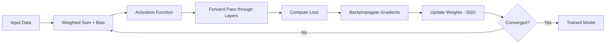

# Chapter 7: Neural Networks

> **Previous:** [Support Vector Machines](../06-support-vector-machines.md) | **Next:** [Unsupervised Learning](../08-unsupervised-learning.md)

---

## Learning Objectives

- Explain the structure of an Artificial Neuron (Perceptron)
- Describe the architecture of a Multi-Layer Perceptron (MLP)
- Understand the role of Activation Functions (ReLU, Sigmoid, Tanh)
- Derivation and implementation of the Backpropagation algorithm

---

## Chapter at a Glance

| Topic | Key Insight | Practical Takeaway |
|-------|-------------|-------------------|
| Artificial Neuron | A weighted sum of inputs passed through a non-linear activation function | Every neuron performs a linear transformation followed by non-linearity |
| Multi-Layer Perceptron | Stacking hidden layers enables learning of hierarchical features | Deeper networks can approximate more complex functions (Universal Approximation Theorem) |
| Activation Functions | Non-linear functions (ReLU, Sigmoid, Tanh) enable the network to learn complex patterns | ReLU is the default for hidden layers; avoid Sigmoid in deep networks |
| Backpropagation | Gradients flow backward through the network via the chain rule of calculus | Understanding backpropagation is essential for debugging training issues |
| Vanishing Gradient | Gradients become extremely small in deep networks with Sigmoid/Tanh, stalling training | Use ReLU or its variants (Leaky ReLU, ELU) to mitigate vanishing gradients |
| Stochastic Gradient Descent | Iterative weight updates using small random batches of data | Mini-batch SGD balances convergence speed and stability |

## Chapter Roadmap



---

## Theory

### The Artificial Neuron
An artificial neuron is the fundamental building block of a neural network. It takes several inputs, applies a weight to each, sums them with a bias, and passes the result through an **activation function**.
$$y = f(\sum_{i=1}^{n} w_ix_i + b)$$
Where:
- $x_i$ are the inputs.
- $w_i$ are the weights.
- $b$ is the bias.
- $f$ is the activation function.

### Multi-Layer Perceptron (MLP)
An MLP is a feedforward neural network consisting of at least three layers of nodes: an **input layer**, one or more **hidden layers**, and an **output layer**. Except for the input nodes, each node is a neuron that uses a nonlinear activation function. The hidden layers allow the network to learn complex, non-linear representations of the data.

### Activation Functions
Activation functions introduce non-linearity into the network, which is essential for learning complex patterns.
- **Sigmoid**: $\sigma(x) = \frac{1}{1+e^{-x}}$. Output range $(0, 1)$. Used in binary classification.
- **ReLU (Rectified Linear Unit)**: $f(x) = \max(0, x)$. Output range $[0, \infty)$. The most common choice for hidden layers because it avoids the vanishing gradient problem.
- **Softmax**: Used in the output layer for multi-class classification to produce a probability distribution over classes.

### Training: Forward and Backward Passes
1. **Forward Pass**: Data flows from the input layer through the hidden layers to the output layer to produce a prediction.
2. **Loss Calculation**: The difference between the prediction and the actual target is calculated using a loss function (e.g., MSE or Cross-Entropy).
3. **Backward Pass (Backpropagation)**: The gradient of the loss with respect to each weight is calculated using the **Chain Rule** of calculus.
4. **Update**: Weights are updated using an optimization algorithm like Stochastic Gradient Descent (SGD):
$$w := w - \alpha \frac{\partial \mathcal{L}}{\partial w}$$


> **One-Sentence Takeaway:** Neural networks learn hierarchical feature representations through stacked non-linear transformations, with backpropagation enabling efficient gradient computation via the chain rule.

> **Pro Tip:** Always normalize your input features to have zero mean and unit variance. Neural networks are sensitive to the scale of inputs — unnormalized features can cause slow convergence or failed training.

> **Remember:** The Universal Approximation Theorem states that a feedforward network with one hidden layer can approximate any continuous function, but it does not guarantee that the network is learnable or that it will have the right number of neurons.

> **Warning:** Sigmoid and Tanh activations saturate at their extremes, causing near-zero gradients. In deep networks, this kills learning — prefer ReLU or Leaky ReLU for hidden layers.

---

## Examples

### Example 1: The XOR Problem
A single-layer perceptron cannot solve the XOR problem because the data is not linearly separable.
- **Data**: $(0,0) \to 0, (0,1) \to 1, (1,0) \to 1, (1,1) \to 0$.
- **Solution**: A neural network with one hidden layer of at least two neurons can represent the XOR logic by combining different linear boundaries.

### Example 2: Training a Simple MLP with PyTorch
```python
import torch
import torch.nn as nn
import torch.optim as optim

# Define a simple network
class SimpleNet(nn.Module):
    def __init__(self):
        super(SimpleNet, self).__init__()
        self.hidden = nn.Linear(10, 5)
        self.output = nn.Linear(5, 1)
        self.relu = nn.ReLU()
        self.sigmoid = nn.Sigmoid()

    def forward(self, x):
        x = self.relu(self.hidden(x))
        x = self.sigmoid(self.output(x))
        return x

model = SimpleNet()
optimizer = optim.SGD(model.parameters(), lr=0.01)
criterion = nn.BCELoss()
```
**Process**: Demonstrates the initialization of layers, activation functions, and the optimization setup.

> **One-Sentence Takeaway:** The XOR problem illustrates why hidden layers are essential, and PyTorch's modular API makes it straightforward to define, train, and evaluate neural network architectures.

---

## Concept Comparison Table

| Concept | Definition | Key Distinction | Use Case |
|---------|-----------|-----------------|----------|
| Sigmoid | $\sigma(x) = 1/(1+e^{-x})$, output in (0, 1) | Saturates at extremes, causes vanishing gradients | Output layer for binary classification |
| ReLU | $f(x) = \max(0, x)$, output in [0, ∞) | Non-saturating, sparse activation, fast | Default activation for hidden layers |
| Tanh | $\tanh(x) \in (-1, 1)$ | Zero-centered, but still saturates | When zero-centered outputs are beneficial |
| Softmax | $\sigma(\mathbf{z})_i = e^{z_i} / \sum e^{z_j}$ | Produces a valid probability distribution | Output layer for multi-class classification |
| SGD | $w := w - \alpha \nabla \mathcal{L}(w)$ | Updates based on one or a few samples | Simple, general-purpose optimizer |
| Adam | Adaptive learning rate + momentum | Combines RMSProp and momentum benefits | Default choice; works well across most architectures |
| MSE Loss | $\frac{1}{n}\sum(y - \hat{y})^2$ | Sensitive to outliers, smooth gradient | Regression tasks |
| Cross-Entropy Loss | $-\sum y \log \hat{y}$ | Penalizes confident wrong predictions | Classification tasks |

## Quick Reference

| Concept | Formula / Detail |
|---------|-----------------|
| Neuron Output | $y = f(\sum w_i x_i + b)$ |
| ReLU | $f(x) = \max(0, x)$ |
| Sigmoid | $\sigma(x) = 1 / (1 + e^{-x})$ |
| Softmax | $\sigma(z_i) = e^{z_i} / \sum_j e^{z_j}$ |
| SGD Update | $w_{t+1} = w_t - \alpha \nabla \mathcal{L}(w_t)$ |
| Chain Rule (2 layers) | $\frac{\partial \mathcal{L}}{\partial w} = \frac{\partial \mathcal{L}}{\partial \hat{y}} \cdot \frac{\partial \hat{y}}{\partial z} \cdot \frac{\partial z}{\partial w}$ |
| Hidden Layer Size | Between input and output size; start with powers of 2 (32, 64, 128) |
| Learning Rate Range | $10^{-1}$ to $10^{-5}$ (typical search range) |
| Batch Size | 16, 32, 64, 128 (balance speed vs. stability) |

## Cross-Application Matrix

| Domain | Application | How Neural Networks Are Used |
|--------|-------------|------------------------------|
| Computer Vision | Image classification, object detection | CNNs with convolutional + pooling layers for spatial feature extraction |
| Natural Language Processing | Sentiment analysis, machine translation | RNNs / Transformers for sequential text processing |
| Healthcare | Medical image diagnosis, drug discovery | Deep CNNs on radiology scans; GNNs on molecular graphs |
| Finance | Algorithmic trading, fraud detection | MLPs for tabular financial data; LSTMs for time series |
| Autonomous Vehicles | Object detection, path planning | CNN + LSTM hybrid architectures for perception and prediction |
| Gaming | Game AI, procedural content generation | Reinforcement learning with deep Q-networks (DQN) |
| Speech Recognition | Transcription, voice assistants | Deep CNNs + RNNs with CTC loss for audio-to-text mapping |

---

## Summary

- Neural networks are inspired by the biological structure of the brain.
- A single neuron is a linear model followed by a non-linear activation function.
- Multi-layer networks can approximate any continuous function (Universal Approximation Theorem).
- Backpropagation is the core algorithm for training neural networks, utilizing the chain rule to compute gradients.
- Choosing the right activation function and architecture is crucial for model performance and convergence.

---

## Exercises

### Review Questions
1. Why is a non-linear activation function necessary in a multi-layer neural network?
2. Explain the "Vanishing Gradient" problem and how ReLU helps mitigate it.
3. What is the difference between a hidden layer and an output layer?
4. How does the "Chain Rule" apply to the backpropagation algorithm?

### Application Problems
1. Calculate the output of a single neuron with inputs $[0.5, 0.8]$, weights $[0.4, -0.5]$, bias $0.1$, and a ReLU activation.
2. If a neural network has an input layer of 10 nodes, a hidden layer of 20 nodes, and an output layer of 2 nodes, how many total trainable weights and biases does it have?
3. Draw the computation graph for the function $z = (w_1x_1 + w_2x_2)^2$.

### Challenge Problem
1. Mathematically derive the update rule for a weight $w_{ij}$ in a simple 3-layer MLP using the MSE loss function. Show each step of the chain rule application.

---

## Chapter Quiz

Test your understanding of Neural Networks.

**1.** Why is ReLU generally preferred over Sigmoid for hidden layers in deep networks?

<details><summary>**Answer**</summary>
**B)** ReLU does not saturate for positive inputs, allowing gradients to flow freely through deep networks. Sigmoid saturates at both extremes, causing gradients to vanish in early layers.
</details>

- A) ReLU is computationally more expensive but more accurate
- B) ReLU avoids the vanishing gradient problem that plagues Sigmoid
- C) Sigmoid only works for binary output, not hidden layers
- D) ReLU ensures the network learns linear relationships only

**2.** The backpropagation algorithm relies on which mathematical concept?

<details><summary>**Answer**</summary>
**C)** Backpropagation is a direct application of the chain rule of calculus, computing the gradient of the loss with respect to each weight by multiplying partial derivatives backward through the network.
</details>

- A) The Mean Value Theorem
- B) Bayes' Theorem
- C) The Chain Rule
- D) The Law of Large Numbers

**3.** What does the Universal Approximation Theorem state?

<details><summary>**Answer**</summary>
**A)** A feedforward network with a single hidden layer containing enough neurons can approximate any continuous function to arbitrary accuracy, though it does not guarantee learnability or the correct number of neurons.
</details>

- A) A single hidden layer can approximate any continuous function
- B) Deeper networks always outperform shallower ones
- C) Neural networks require infinite data to converge
- D) Backpropagation guarantees finding the global minimum
