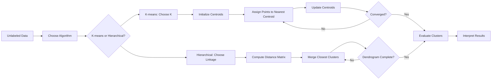

# Chapter 8: Unsupervised Learning

> **Previous:** [Neural Networks](../07-neural-networks.md) | **Next:** [Dimensionality Reduction](../09-dimensionality-reduction.md)

---

## Learning Objectives

- Define Unsupervised Learning and identify its common use cases
- Implement and analyze the K-means Clustering algorithm
- Explain Hierarchical Clustering and interpret Dendrograms
- Evaluate clustering performance using internal and external metrics

---

## Chapter at a Glance

| Topic | Key Insight | Practical Takeaway |
|-------|-------------|-------------------|
| Unsupervised Learning | Models find patterns in data without labeled targets | Use for customer segmentation, anomaly detection, and exploratory analysis |
| K-means Clustering | Partitions data into K groups by minimizing within-cluster distances | Always scale features first; use the Elbow Method to choose K |
| Hierarchical Clustering | Builds a tree of clusters without pre-specifying K | Dendrograms provide visual insight into cluster relationships at multiple granularities |
| Dendrogram Interpretation | Branch lengths show dissimilarity between merged clusters | Cut the dendrogram at a chosen height to get any desired number of clusters |
| Clustering Evaluation | Internal metrics (silhouette score) vs. external metrics (adjusted Rand index) | Prefer silhouette score when ground truth labels are unavailable |
| K-means Limitations | Assumes spherical clusters of equal size; sensitive to outliers | Use DBSCAN or hierarchical clustering for non-spherical cluster shapes |

## Chapter Roadmap



---

## Theory

### What is Unsupervised Learning?
Unsupervised Learning involves training models on data that does not have explicit labels or targets. The goal is to discover underlying structures, patterns, or groupings within the data. Unlike supervised learning, there is no "correct" answer to compare against; instead, we look for data-driven insights.

### K-means Clustering
K-means is a popular centroid-based clustering algorithm. It partitions $n$ observations into $K$ clusters, where each observation belongs to the cluster with the nearest mean (centroid).

**The Algorithm**:
1. **Initialize**: Choose $K$ initial centroids randomly.
2. **Assign**: Assign each data point to the nearest centroid based on Euclidean distance.
3. **Update**: Calculate the mean of all points assigned to each cluster and move the centroid to this new mean.
4. **Repeat**: Steps 2 and 3 until the centroids no longer move significantly (convergence).

**Choosing K**: The "Elbow Method" is often used, where we plot the Within-Cluster Sum of Squares (WCSS) against different values of $K$ and look for the "elbow" point where adding more clusters provides diminishing returns.

### Hierarchical Clustering
Hierarchical clustering builds a tree of clusters. There are two main approaches:
1. **Agglomerative (Bottom-Up)**: Start with each point as its own cluster and merge the closest pairs until only one cluster remains.
2. **Divisive (Top-Down)**: Start with all points in one cluster and recursively split them.

The results are often visualized using a **Dendrogram**, a tree-like diagram that shows the sequence of merges or splits and the distance at which they occurred.


> **One-Sentence Takeaway:** Unsupervised learning, particularly K-means and hierarchical clustering, reveals hidden structures in unlabeled data by grouping similar points based on distance metrics.

> **Pro Tip:** K-means is sensitive to initial centroid placement. Always run the algorithm with multiple random initializations (`n_init` in scikit-learn) or use K-means++ initialization to improve convergence quality.

> **Remember:** The Elbow Method is a heuristic, not a rigorous rule. If the elbow is unclear, use the silhouette score to compare cluster quality across different values of K.

> **Warning:** K-means assumes clusters are spherical and roughly equal in size. If your data has elongated or irregularly shaped clusters, consider DBSCAN or spectral clustering instead.

---

## Examples

### Example 1: K-means for Customer Segmentation
Grouping customers based on "Annual Income" and "Spending Score".
```python
from sklearn.cluster import KMeans
import pandas as pd

# Sample data
data = {'Income': [15, 16, 17, 18, 19, 20, 70, 72, 75, 80],
        'Score': [39, 81, 6, 77, 40, 76, 50, 60, 45, 55]}
df = pd.DataFrame(data)

kmeans = KMeans(n_clusters=2, random_state=42)
df['Cluster'] = kmeans.fit_predict(df)

print(df)
```
**Outcome**: Effectively separates low-income individuals from high-income individuals based on the provided metrics.

### Example 2: Hierarchical Clustering Dendrogram
Visualizing relationships in a small dataset.
```python
from scipy.cluster.hierarchy import dendrogram, linkage
import matplotlib.pyplot as plt

X = [[i] for i in [2, 8, 0, 4, 1, 9, 9, 0]]
Z = linkage(X, 'ward')

fig = plt.figure(figsize=(10, 5))
dn = dendrogram(Z)
plt.show()
```
**Interpretation**: The dendrogram shows that 0 and 1 are merged early, while 0 and 9 are merged much later, indicating they are in different clusters.

> **One-Sentence Takeaway:** K-means delivers fast, scalable clustering for well-separated spherical data, while hierarchical clustering provides richer structural insight through dendrograms.

---

## Concept Comparison Table

| Concept | Definition | Key Distinction | Use Case |
|---------|-----------|-----------------|----------|
| K-means | Partition-based clustering minimizing WCSS | Requires K in advance; fast on large datasets | Customer segmentation, image compression |
| Hierarchical Agglomerative | Bottom-up merging of closest pairs | Produces dendrogram; no K needed upfront | Exploratory analysis, taxonomy construction |
| Hierarchical Divisive | Top-down recursive splitting of clusters | Computationally expensive; rarely used | Niche applications with clear top-level split |
| Single Linkage | Distance = min distance between points in two clusters | Can chain noise points into long clusters | Detecting elongated, non-spherical clusters |
| Complete Linkage | Distance = max distance between points in two clusters | Produces compact, balanced clusters | Most general-purpose hierarchical use |
| Ward Linkage | Minimizes within-cluster variance increase | Tends to produce equal-sized spherical clusters | Default choice; works well with Euclidean distance |
| DBSCAN | Density-based clustering with noise identification | Does not require K; handles arbitrary shapes | Geographical data with noise, anomaly detection |

## Quick Reference

| Concept | Formula / Detail |
|---------|-----------------|
| Euclidean Distance | $d(\mathbf{p}, \mathbf{q}) = \sqrt{\sum(p_i - q_i)^2}$ |
| WCSS (Inertia) | $\sum_{i=1}^{K}\sum_{\mathbf{x} \in C_i} \|\mathbf{x} - \mu_i\|^2$ |
| Silhouette Score | $s = \frac{b - a}{\max(a, b)}$ where $a$ = intra-cluster distance, $b$ = nearest-cluster distance |
| K-means Objective | $\min \sum_{i=1}^{K} \sum_{\mathbf{x} \in C_i} \|\mathbf{x} - \mu_i\|^2$ |
| Single Linkage | $d(C_i, C_j) = \min_{\mathbf{x} \in C_i, \mathbf{y} \in C_j} \|\mathbf{x} - \mathbf{y}\|$ |
| Complete Linkage | $d(C_i, C_j) = \max_{\mathbf{x} \in C_i, \mathbf{y} \in C_j} \|\mathbf{x} - \mathbf{y}\|$ |
| Ward Linkage | $\Delta = \frac{\| \mu_i - \mu_j \|^2}{1/|C_i| + 1/|C_j|}$ |
| Adjusted Rand Index | Measures similarity of clustering to ground truth, corrected for chance |

## Cross-Application Matrix

| Domain | Application | How Unsupervised Learning Is Used |
|--------|-------------|----------------------------------|
| Marketing | Customer segmentation, persona discovery | K-means on purchase history and demographic data |
| Bioinformatics | Gene expression clustering, species taxonomy | Hierarchical clustering on expression profiles |
| Image Processing | Image compression, color quantization | K-means reduces color palette to K representative colors |
| Anomaly Detection | Fraud detection, network intrusion | DBSCAN labels outliers as noise points |
| Social Network Analysis | Community detection, recommendation | Spectral clustering on graph adjacency matrices |
| Document Analysis | Topic modeling, document categorization | K-means on TF-IDF vectors for document clustering |
| Healthcare | Patient subgroup discovery, disease phenotyping | Hierarchical clustering on patient symptom profiles |

---

## Summary

- Unsupervised learning finds patterns in unlabeled data.
- K-means is an iterative algorithm that minimizes the distance between points and their cluster centroids.
- The choice of $K$ in K-means is critical and can be guided by the Elbow Method.
- Hierarchical clustering provides a multi-level view of data relationships through dendrograms.
- Linkage criteria (Single, Complete, Average, Ward) determine how distances between clusters are calculated in hierarchical methods.

---

## Exercises

### Review Questions
1. How does K-means differ from K-Nearest Neighbors (KNN)?
2. What are the limitations of the K-means algorithm? (Hint: Consider cluster shapes and outliers).
3. Explain the difference between "Centroid-based" and "Density-based" clustering.
4. What information does a dendrogram provide that a K-means result does not?

### Application Problems
1. Manually perform one iteration of K-means on the points $\{2, 4, 10, 12, 20, 22\}$ with initial centroids $C_1=3$ and $C_2=11$.
2. Given two clusters $C_1 = \{1, 2\}$ and $C_2 = \{5, 6\}$, calculate the distance between them using "Single Linkage" (min distance) and "Complete Linkage" (max distance).
3. If WCSS for $K=1$ is 500, $K=2$ is 200, $K=3$ is 150, and $K=4$ is 140, what is the most likely "elbow" point?

### Challenge Problem
1. Discuss the impact of feature scaling on K-means. Why is it important to normalize data before clustering if the features have different units (e.g., Age in years vs. Income in dollars)?

---

## Chapter Quiz

Test your understanding of Unsupervised Learning.

**1.** What is the primary difference between K-means clustering and the K-Nearest Neighbors (KNN) algorithm?

<details><summary>**Answer**</summary>
**B)** K-means is an unsupervised clustering algorithm that groups unlabeled data, while KNN is a supervised classification algorithm that requires labeled training data to make predictions.
</details>

- A) K-means is slower than KNN
- B) K-means is unsupervised; KNN is supervised
- C) K-means requires labeled data; KNN does not
- D) K-means can only handle two clusters

**2.** Which linkage criterion for hierarchical clustering tends to produce the most balanced, spherical clusters?

<details><summary>**Answer**</summary>
**C)** Ward linkage minimizes the increase in within-cluster variance at each merge, which tends to produce compact, balanced, spherical clusters similar to K-means.
</details>

- A) Single linkage
- B) Complete linkage
- C) Ward linkage
- D) Average linkage

**3.** A silhouette score close to 1 indicates:

<details><summary>**Answer**</summary>
**A)** A silhouette score near 1 means each point is much closer to its own cluster than to neighboring clusters — indicating well-separated, compact clusters.
</details>

- A) Well-separated, dense clusters
- B) Overlapping clusters
- C) Poor clustering with points assigned to wrong clusters
- D) The optimal number of clusters has been found
