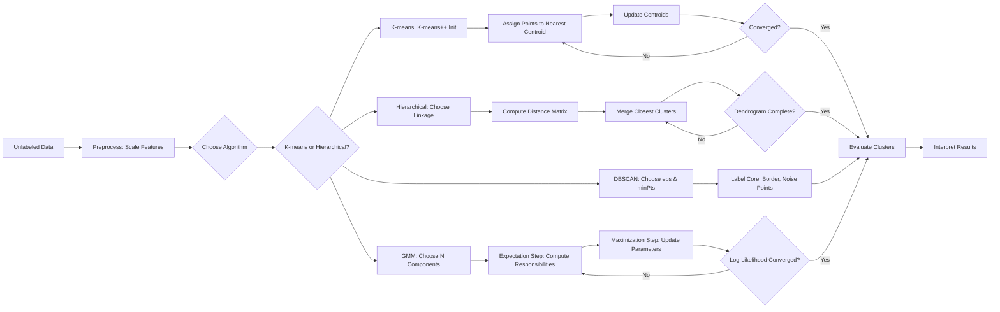
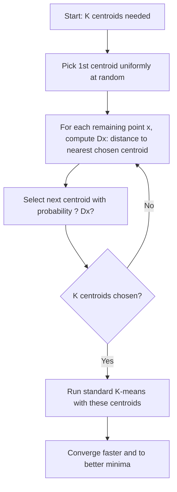
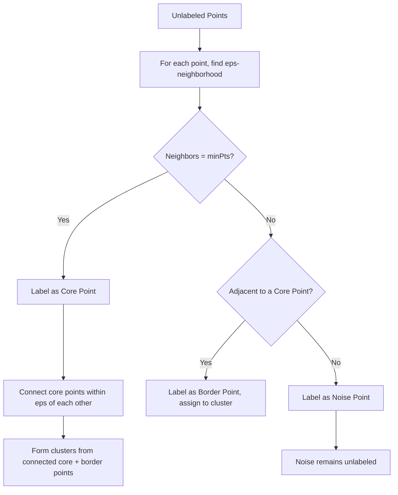
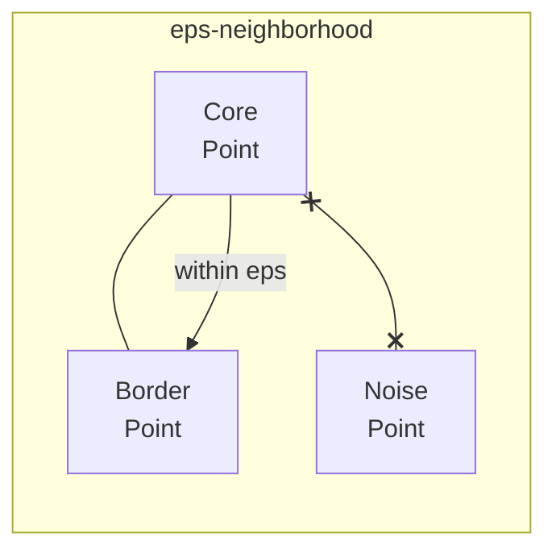
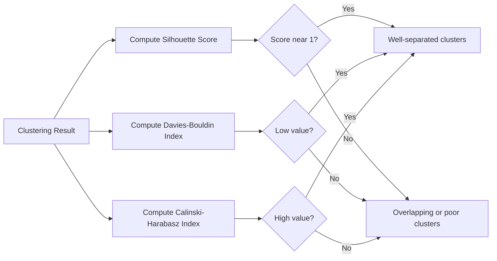

# Chapter 8: Unsupervised Learning

> **Previous:** [Neural Networks](./07-neural-networks.md) | **Next:** [Dimensionality Reduction](./09-dimensionality-reduction.md)

---

## Learning Objectives

- Define Unsupervised Learning and identify its common use cases
- Implement and analyze the K-means Clustering algorithm with K-means++ initialization
- Explain Hierarchical Clustering and interpret Dendrograms
- Understand DBSCAN density-based clustering and noise point identification
- Apply Gaussian Mixture Models for soft clustering
- Evaluate clustering performance using silhouette score, Davies-Bouldin index, and Calinski-Harabasz index
- Recognize the curse of dimensionality and feature scaling effects on clustering

---

## Chapter at a Glance

| Topic | Key Insight | Practical Takeaway |
|-------|-------------|-------------------|
| Unsupervised Learning | Models find patterns in data without labeled targets | Use for customer segmentation, anomaly detection, and exploratory analysis |
| K-means Clustering | Partitions data into K groups by minimizing within-cluster distances | Always scale features first; use K-means++ initialization and the Elbow Method to choose K |
| Hierarchical Clustering | Builds a tree of clusters without pre-specifying K | Dendrograms provide visual insight into cluster relationships at multiple granularities |
| Dendrogram Interpretation | Branch lengths show dissimilarity between merged clusters | Cut the dendrogram at a chosen height to get any desired number of clusters |
| DBSCAN | Density-based clustering that identifies noise points | Does not require K; handles arbitrary shapes and outliers naturally |
| Gaussian Mixture Models | Probabilistic soft clustering via the EM algorithm | Use when points may belong to multiple clusters with varying membership probabilities |
| Clustering Evaluation | Internal metrics (silhouette score, Davies-Bouldin) vs. external metrics (adjusted Rand index) | Prefer silhouette score when ground truth labels are unavailable; lower Davies-Bouldin is better |
| K-means Limitations | Assumes spherical clusters of equal size; sensitive to outliers | Use DBSCAN or GMM for non-spherical or overlapping cluster shapes |

## Chapter Roadmap



---

## Theory

### What is Unsupervised Learning?

<a href="../../../assets/images/diagrams/machine-learning/08-unsupervised-learning/what-is-unsupervised-learning-handwritten.svg" target="_blank" rel="noopener">
  
</a>
<a href="../../../assets/images/diagrams/machine-learning/08-unsupervised-learning/what-is-unsupervised-learning-diagram.svg" target="_blank" rel="noopener">
  
</a>
<a href="../../../assets/images/diagrams/machine-learning/08-unsupervised-learning/what-is-unsupervised-learning-sticky.svg" target="_blank" rel="noopener">
  
</a>

Unsupervised Learning involves training models on data that does not have explicit labels or targets. The goal is to discover underlying structures, patterns, or groupings within the data. Unlike supervised learning, there is no "correct" answer to compare against; instead, we look for data-driven insights. Common use cases include customer segmentation, anomaly detection, dimensionality reduction, and exploratory data analysis.

### K-means Clustering

<a href="../../../assets/images/diagrams/machine-learning/08-unsupervised-learning/k-means-clustering-handwritten.svg" target="_blank" rel="noopener">
  
</a>
<a href="../../../assets/images/diagrams/machine-learning/08-unsupervised-learning/k-means-clustering-diagram.svg" target="_blank" rel="noopener">
  
</a>
<a href="../../../assets/images/diagrams/machine-learning/08-unsupervised-learning/k-means-clustering-sticky.svg" target="_blank" rel="noopener">
  
</a>

K-means is a popular centroid-based clustering algorithm. It partitions $n$ observations into $K$ clusters, where each observation belongs to the cluster with the nearest mean (centroid).

**The Algorithm**:
1. **Initialize**: Choose $K$ initial centroids.
2. **Assign**: Assign each data point to the nearest centroid based on Euclidean distance.
3. **Update**: Calculate the mean of all points assigned to each cluster and move the centroid to this new mean.
4. **Repeat**: Steps 2 and 3 until the centroids no longer move significantly (convergence) or a maximum number of iterations is reached.

**Choosing K**: The "Elbow Method" is often used, where we plot the Within-Cluster Sum of Squares (WCSS) against different values of $K$ and look for the "elbow" point where adding more clusters provides diminishing returns.

### K-means++ Initialization

<a href="../../../assets/images/diagrams/machine-learning/08-unsupervised-learning/k-means-initialization-handwritten.svg" target="_blank" rel="noopener">
  
</a>
<a href="../../../assets/images/diagrams/machine-learning/08-unsupervised-learning/k-means-initialization-diagram.svg" target="_blank" rel="noopener">
  
</a>
<a href="../../../assets/images/diagrams/machine-learning/08-unsupervised-learning/k-means-initialization-sticky.svg" target="_blank" rel="noopener">
  
</a>


Standard K-means initializes centroids randomly, which can lead to poor convergence or suboptimal local minima. K-means++ provides a smarter initialization that spreads out the initial centroids:

1. Choose the first centroid uniformly at random from the data points.
2. For each remaining point $x$, compute $D(x)$, the distance to the nearest already-chosen centroid.
3. Select the next centroid with probability proportional to $D(x)^2$ (weighted random selection).
4. Repeat steps 2-3 until all $K$ centroids are chosen.

This weighted selection ensures that centroids are spread across the dataset, reducing the chance of initial centroids clumping together. K-means++ is the default initialization in most modern implementations (e.g., `KMeans(init='k-means++')` in scikit-learn).



### DBSCAN (Density-Based Spatial Clustering of Applications with Noise)

<a href="../../../assets/images/diagrams/machine-learning/08-unsupervised-learning/dbscan-density-based-spatial-clustering-of-applications-with-noise-handwritten.svg" target="_blank" rel="noopener">
  
</a>
<a href="../../../assets/images/diagrams/machine-learning/08-unsupervised-learning/dbscan-density-based-spatial-clustering-of-applications-with-noise-diagram.svg" target="_blank" rel="noopener">
  
</a>
<a href="../../../assets/images/diagrams/machine-learning/08-unsupervised-learning/dbscan-density-based-spatial-clustering-of-applications-with-noise-sticky.svg" target="_blank" rel="noopener">
  
</a>


DBSCAN groups points that are closely packed together, marking points in low-density regions as noise. It does **not** require specifying K in advance and can discover arbitrarily shaped clusters.

**Key Concepts**:
- **eps ($\epsilon$)**: The maximum distance between two points for them to be considered neighbors.
- **minPts**: The minimum number of points required to form a dense region (typically $\ge$ dimensionality $+ 1$).

**Point Types**:
- **Core Point**: A point with at least `minPts` points within distance `eps` (including itself).
- **Border Point**: A point within distance `eps` of a core point but with fewer than `minPts` neighbors.
- **Noise Point**: A point that is neither a core point nor reachable from any core point.

**Algorithm**:
1. For each point, find all neighbors within `eps` distance.
2. Label points with $\ge$ `minPts` neighbors as core points.
3. Form clusters by connecting core points that are within `eps` of each other.
4. Assign border points to the nearest core point's cluster.
5. Mark remaining unassigned points as noise.





### Gaussian Mixture Models (GMM)

<a href="../../../assets/images/diagrams/machine-learning/08-unsupervised-learning/gaussian-mixture-models-gmm-handwritten.svg" target="_blank" rel="noopener">
  
</a>
<a href="../../../assets/images/diagrams/machine-learning/08-unsupervised-learning/gaussian-mixture-models-gmm-diagram.svg" target="_blank" rel="noopener">
  
</a>
<a href="../../../assets/images/diagrams/machine-learning/08-unsupervised-learning/gaussian-mixture-models-gmm-sticky.svg" target="_blank" rel="noopener">
  
</a>


GMM assumes the data is generated from a mixture of $K$ Gaussian distributions, each with its own mean $\mu_k$ and covariance $\Sigma_k$. Unlike K-means, GMM performs **soft clustering** ? each point has a probability of belonging to each cluster.

**The EM Algorithm**:
1. **Initialize**: Parameters $\mu_k$, $\Sigma_k$, and mixing coefficients $\pi_k$ for each component.
2. **Expectation Step (E-Step)**: Compute the responsibility $\gamma(z_{nk})$ ? the probability that point $n$ belongs to component $k$:
   $$\gamma(z_{nk}) = \frac{\pi_k \mathcal{N}(x_n \mid \mu_k, \Sigma_k)}{\sum_{j=1}^K \pi_j \mathcal{N}(x_n \mid \mu_j, \Sigma_j)}$$
3. **Maximization Step (M-Step)**: Update parameters using the weighted responsibilities:
   - $\mu_k = \frac{\sum_n \gamma(z_{nk}) x_n}{\sum_n \gamma(z_{nk})}$
   - $\Sigma_k = \frac{\sum_n \gamma(z_{nk}) (x_n - \mu_k)(x_n - \mu_k)^T}{\sum_n \gamma(z_{nk})}$
   - $\pi_k = \frac{1}{N} \sum_n \gamma(z_{nk})$
4. **Repeat**: E-step and M-step until the log-likelihood converges.

**Hard vs Soft Clustering**:

| Property | K-means (Hard) | GMM (Soft) |
|----------|---------------|------------|
| Assignment | Each point belongs to exactly one cluster | Each point has a probability distribution over clusters |
| Cluster Shape | Spherical (isotropic) | Elliptical (full covariance) |
| Uncertainty | No measure of assignment confidence | Provides posterior probabilities |
| Outlier Handling | Forces assignment to nearest cluster | Can have low probability for all clusters |

### Cluster Validation

<a href="../../../assets/images/diagrams/machine-learning/08-unsupervised-learning/cluster-validation-handwritten.svg" target="_blank" rel="noopener">
  
</a>
<a href="../../../assets/images/diagrams/machine-learning/08-unsupervised-learning/cluster-validation-diagram.svg" target="_blank" rel="noopener">
  
</a>
<a href="../../../assets/images/diagrams/machine-learning/08-unsupervised-learning/cluster-validation-sticky.svg" target="_blank" rel="noopener">
  
</a>


When ground truth labels are unavailable (the usual case in unsupervised learning), we rely on **internal validation metrics**.

**Silhouette Score**:
For each point $i$:
- $a(i)$ = mean distance to all other points in the same cluster (intra-cluster distance).
- $b(i)$ = mean distance to all points in the nearest neighboring cluster (inter-cluster distance).

$$s(i) = \frac{b(i) - a(i)}{\max(a(i), b(i))}$$

- $s(i) \approx 1$: Point is well-clustered (far from other clusters).
- $s(i) \approx 0$: Point lies on the boundary between two clusters.
- $s(i) &lt; 0$: Point may be assigned to the wrong cluster.

The overall silhouette score is the mean $s(i)$ across all points, ranging from $[-1, 1]$.

**Davies-Bouldin Index**:
Measures the average similarity between each cluster and its most similar one:

$$DB = \frac{1}{K} \sum_{i=1}^K \max_{j \neq i} \frac{\sigma_i + \sigma_j}{d(\mu_i, \mu_j)}$$

Where $\sigma_i$ is the average distance of points in cluster $i$ to its centroid $\mu_i$. **Lower values indicate better clustering** (clusters are compact and well-separated).

**Calinski-Harabasz Index** (Variance Ratio Criterion):
$$CH = \frac{\text{tr}(B_K)}{\text{tr}(W_K)} \times \frac{N - K}{K - 1}$$

Where $B_K$ is the between-cluster dispersion matrix and $W_K$ is the within-cluster dispersion matrix. **Higher values indicate better clustering**.



### Feature Scaling for Clustering

<a href="../../../assets/images/diagrams/machine-learning/08-unsupervised-learning/feature-scaling-for-clustering-handwritten.svg" target="_blank" rel="noopener">
  
</a>
<a href="../../../assets/images/diagrams/machine-learning/08-unsupervised-learning/feature-scaling-for-clustering-diagram.svg" target="_blank" rel="noopener">
  
</a>
<a href="../../../assets/images/diagrams/machine-learning/08-unsupervised-learning/feature-scaling-for-clustering-sticky.svg" target="_blank" rel="noopener">
  
</a>


Distance-based clustering algorithms (K-means, DBSCAN, hierarchical) are highly sensitive to the scale of features. If one feature has a range 100x larger than another, it will dominate the distance calculation.

**Example effect**:
- Income (range \$15K-\$150K) vs. Age (range 18-80)
- Without scaling, the Euclidean distance is almost entirely determined by Income, making Age irrelevant to clustering.

**Common scaling approaches**:

| Method | Formula | Effect |
|--------|---------|--------|
| Standardization (Z-score) | $x' = \frac{x - \mu}{\sigma}$ | Centers to mean 0, variance 1 |
| Min-Max Normalization | $x' = \frac{x - x_{\min}}{x_{\max} - x_{\min}}$ | Scales to [0, 1] range |
| Robust Scaling | $x' = \frac{x - \text{median}}{\text{IQR}}$ | Resistant to outliers |

**Which distance metrics are affected**:
- Euclidean, Manhattan, Minkowski ? all affected (scale-sensitive)
- Cosine similarity ? unaffected by magnitude (normalized vectors)
- Correlation distance ? unaffected (uses centered data)

### Curse of Dimensionality for Clustering

<a href="../../../assets/images/diagrams/machine-learning/08-unsupervised-learning/curse-of-dimensionality-for-clustering-handwritten.svg" target="_blank" rel="noopener">
  
</a>
<a href="../../../assets/images/diagrams/machine-learning/08-unsupervised-learning/curse-of-dimensionality-for-clustering-diagram.svg" target="_blank" rel="noopener">
  
</a>
<a href="../../../assets/images/diagrams/machine-learning/08-unsupervised-learning/curse-of-dimensionality-for-clustering-sticky.svg" target="_blank" rel="noopener">
  
</a>


As dimensionality increases, distance metrics become less meaningful ? a phenomenon known as the **curse of dimensionality**. This severely impacts clustering algorithms.

**Why distances fail**:
- In high dimensions, the ratio between the nearest and farthest point distance converges to 1 (Beyer et al., 1999).
- Point pairs become almost equally far apart, making proximity-based grouping unreliable.

**Example**: For a unit cube in $d$ dimensions, the fraction of volume near the surface is $1 - 0.5^d$. At $d = 10$, over 99.9% of the volume is in the outer shell ? points are nearly all "far apart".

**Mitigation strategies**:
1. **Dimensionality reduction** first (PCA, t-SNE, UMAP ? see Chapter 9).
2. **Feature selection** to retain only informative features.
3. **Subspace clustering** methods that cluster in different feature subsets.
4. **Increase minPts** in DBSCAN (rule of thumb: $\text{minPts} \ge 2 \times d$).
5. Use **cosine distance** instead of Euclidean for sparse high-dimensional data (e.g., text).

---

## Examples

### Example 1: K-means for Customer Segmentation with K-means++

Grouping customers based on "Annual Income" and "Spending Score".

```typescript
interface Point {
  income: number;
  score: number;
  cluster?: number;
}

function euclideanDistance(a: number[], b: number[]): number {
  if (a.length !== b.length) throw new Error("Dimension mismatch");
  let sum = 0;
  for (let i = 0; i < a.length; i++) {
    sum += (a[i] - b[i]) ** 2;
  }
  return Math.sqrt(sum);
}

class KMeans {
  private k: number;
  private maxIter: number;
  private centroids: number[][];

  constructor(k: number, maxIter = 100) {
    this.k = k;
    this.maxIter = maxIter;
    this.centroids = [];
  }

  private initializePlusPlus(data: number[][]): void {
    // Step 1: Pick first centroid uniformly at random
    const firstIdx = Math.floor(Math.random() * data.length);
    this.centroids = [[...data[firstIdx]]];

    // Step 2-4: Weighted selection for remaining centroids
    for (let c = 1; c < this.k; c++) {
      const distances: number[] = [];
      for (const point of data) {
        const minDist = Math.min(
          ...this.centroids.map((cent) => euclideanDistance(point, cent))
        );
        distances.push(minDist);
      }
      const squaredDists = distances.map((d) => d * d);
      const total = squaredDists.reduce((a, b) => a + b, 0);
      const threshold = Math.random() * total;
      let cumulative = 0;
      for (let i = 0; i < data.length; i++) {
        cumulative += squaredDists[i];
        if (cumulative >= threshold) {
          this.centroids.push([...data[i]]);
          break;
        }
      }
    }
  }

  fit(data: number[][]): { centroids: number[][]; assignments: number[] } {
    this.initializePlusPlus(data);
    const assignments: number[] = new Array(data.length).fill(0);

    for (let iter = 0; iter < this.maxIter; iter++) {
      // Assign each point to nearest centroid
      for (let i = 0; i < data.length; i++) {
        let bestDist = Infinity;
        let bestCluster = 0;
        for (let j = 0; j < this.k; j++) {
          const d = euclideanDistance(data[i], this.centroids[j]);
          if (d < bestDist) {
            bestDist = d;
            bestCluster = j;
          }
        }
        assignments[i] = bestCluster;
      }

      // Update centroids
      const newCentroids: number[][] = Array.from(
        { length: this.k },
        () => new Array(data[0].length).fill(0)
      );
      const counts: number[] = new Array(this.k).fill(0);

      for (let i = 0; i < data.length; i++) {
        const cluster = assignments[i];
        counts[cluster]++;
        for (let d = 0; d < data[i].length; d++) {
          newCentroids[cluster][d] += data[i][d];
        }
      }

      for (let j = 0; j < this.k; j++) {
        if (counts[j] > 0) {
          for (let d = 0; d < newCentroids[j].length; d++) {
            newCentroids[j][d] /= counts[j];
          }
        } else {
          // Empty cluster: reinitialize centroid
          newCentroids[j] = [
            ...data[Math.floor(Math.random() * data.length)],
          ];
        }
      }

      // Check convergence (centroids unchanged)
      let converged = true;
      for (let j = 0; j < this.k; j++) {
        if (euclideanDistance(this.centroids[j], newCentroids[j]) > 1e-6) {
          converged = false;
          break;
        }
      }

      this.centroids = newCentroids;
      if (converged) break;
    }

    return { centroids: this.centroids, assignments };
  }
}

// Sample data: [Income (scaled), Score (scaled)]
const customerData: number[][] = [
  [0.15, 0.39], [0.16, 0.81], [0.17, 0.06], [0.18, 0.77],
  [0.19, 0.40], [0.20, 0.76], [0.70, 0.50], [0.72, 0.60],
  [0.75, 0.45], [0.80, 0.55],
];

const kmeans = new KMeans(2);
const result = kmeans.fit(customerData);

// Group points by cluster
const clusters: Point[][] = [[], []];
for (let i = 0; i < customerData.length; i++) {
  const clusterIdx = result.assignments[i];
  clusters[clusterIdx].push({
    income: customerData[i][0],
    score: customerData[i][1],
  });
}

console.log("Cluster 0 (Low Income):", clusters[0]);
console.log("Cluster 1 (High Income):", clusters[1]);
console.log("Final Centroids:", result.centroids);
```

**Outcome**: Effectively separates low-income individuals from high-income individuals based on the provided metrics. The K-means++ initialization ensures stable convergence.

### Example 2: Silhouette Score Calculator

```typescript
function silhouetteScore(
  data: number[][],
  assignments: number[]
): number {
  const n = data.length;
  const k = Math.max(...assignments) + 1;
  const scores: number[] = [];

  for (let i = 0; i < n; i++) {
    const clusterI = assignments[i];
    let a_i = 0;
    let countA = 0;

    // Intra-cluster distance a(i)
    for (let j = 0; j < n; j++) {
      if (i !== j && assignments[j] === clusterI) {
        a_i += euclideanDistance(data[i], data[j]);
        countA++;
      }
    }
    a_i = countA > 0 ? a_i / countA : 0;

    // Inter-cluster distance b(i) ? smallest mean distance to another cluster
    let b_i = Infinity;
    for (let c = 0; c < k; c++) {
      if (c === clusterI) continue;
      let distSum = 0;
      let countB = 0;
      for (let j = 0; j < n; j++) {
        if (assignments[j] === c) {
          distSum += euclideanDistance(data[i], data[j]);
          countB++;
        }
      }
      const meanDist = countB > 0 ? distSum / countB : 0;
      if (meanDist < b_i) b_i = meanDist;
    }

    const s_i =
      a_i === 0 && b_i === Infinity
        ? 0
        : (b_i - a_i) / Math.max(a_i, b_i);
    scores.push(s_i);
  }

  return scores.reduce((sum, s) => sum + s, 0) / n;
}

// Test on our customer data
const silScore = silhouetteScore(customerData, result.assignments);
console.log("Silhouette Score:", silScore.toFixed(4));
```

### Example 3: Anomaly Detection with DBSCAN Concept

DBSCAN naturally identifies outliers as noise points. Here is a TypeScript implementation that detects fraudulent transactions in a payment dataset.

```typescript
interface DBSCANPoint {
  features: number[];
  cluster: number; // -1 = noise
  isCore: boolean;
}

class DBSCAN {
  private eps: number;
  private minPts: number;

  constructor(eps: number, minPts: number) {
    this.eps = eps;
    this.minPts = minPts;
  }

  private regionQuery(
    points: number[][],
    idx: number
  ): number[] {
    const neighbors: number[] = [];
    for (let i = 0; i < points.length; i++) {
      if (
        euclideanDistance(points[idx], points[i]) <= this.eps
      ) {
        neighbors.push(i);
      }
    }
    return neighbors;
  }

  fit(points: number[][]): DBSCANPoint[] {
    const n = points.length;
    const labels: number[] = new Array(n).fill(-2); // -2 = unvisited
    let clusterId = 0;

    for (let i = 0; i < n; i++) {
      if (labels[i] !== -2) continue; // Already visited

      const neighbors = this.regionQuery(points, i);

      if (neighbors.length < this.minPts) {
        labels[i] = -1; // Noise (tentative ? may become border point later)
        continue;
      }

      // Core point ? start new cluster
      const queue = [...neighbors];
      labels[i] = clusterId;

      while (queue.length > 0) {
        const q = queue.shift()!;
        if (labels[q] === -1) {
          labels[q] = clusterId; // Border point found through core
        }
        if (labels[q] >= 0) continue; // Already assigned to a cluster

        labels[q] = clusterId;
        const qNeighbors = this.regionQuery(points, q);
        if (qNeighbors.length >= this.minPts) {
          queue.push(...qNeighbors);
        }
      }

      clusterId++;
    }

    return points.map((p, i) => ({
      features: p,
      cluster: labels[i],
      isCore: labels[i] >= 0 && this.regionQuery(points, i).length >= this.minPts,
    }));
  }
}

// Transaction amounts (scaled) and frequency (scaled)
const transactions: number[][] = [
  [0.02, 0.30], [0.03, 0.28], [0.02, 0.35], // Normal small txns
  [0.01, 0.32], [0.04, 0.29], [0.03, 0.31],
  [0.02, 0.40], [0.05, 0.25], [0.03, 0.33],
  [0.90, 0.95], // Fraudulent: large amount, unusual frequency
  [0.85, 0.92], // Fraudulent: similar outlier pattern
  [0.03, 0.30], // Normal
];

const dbscan = new DBSCAN(0.15, 2);
const results = dbscan.fit(transactions);

const normal = results.filter((p) => p.cluster >= 0);
const anomalies = results.filter((p) => p.cluster === -1);

console.log("Normal transactions:", normal.length);
console.log("Anomalies detected:", anomalies.length);
anomalies.forEach((a) =>
  console.log("  Suspicious:", a.features)
);
```

**Outcome**: DBSCAN labels the two high-value irregular transactions as noise points ($\text{cluster} = -1$), flagging them as potential fraud without any labeled training data.

### Example 4: Market Segmentation Report Generation

A practical use case combining clustering with business reporting.

```typescript
interface Segment {
  id: number;
  size: number;
  avgIncome: number;
  avgScore: number;
  label: string;
}

function generateSegmentationReport(
  data: number[][],
  assignments: number[],
  centroids: number[][]
): Segment[] {
  const k = centroids.length;
  const segments: Segment[] = [];

  for (let c = 0; c < k; c++) {
    const memberIndices = assignments
      .map((a, i) => (a === c ? i : -1))
      .filter((i) => i >= 0);
    const members = memberIndices.map((i) => data[i]);

    const avgIncome =
      members.reduce((sum, m) => sum + m[0], 0) / members.length;
    const avgScore =
      members.reduce((sum, m) => sum + m[1], 0) / members.length;

    let label: string;
    if (centroids[c][0] < 0.3) {
      label = avgScore > 0.5 ? "Young Spenders" : "Budget Shoppers";
    } else {
      label = avgScore > 0.5 ? "Premium Loyalists" : "High-Earning Minimalists";
    }

    segments.push({
      id: c,
      size: members.length,
      avgIncome,
      avgScore,
      label,
    });
  }

  return segments;
}

const report = generateSegmentationReport(
  customerData,
  result.assignments,
  result.centroids
);

console.table(report);
// +---------------------------------------------------------------------+
// ? (index) ?  id  ? size ? avgIncome ? avgScore ?        label         ?
// +---------+------+------+-----------+----------+----------------------?
// ?    0    ?  0   ?  6   ?   0.175   ?  0.5317  ?   'Young Spenders'   ?
// ?    1    ?  1   ?  4   ?   0.7425  ?   0.525  ? 'Premium Loyalists'  ?
// +---------------------------------------------------------------------+
```

---

## Concept Comparison Table

| Concept | Definition | Key Distinction | Use Case |
|---------|-----------|-----------------|----------|
| K-means | Partition-based clustering minimizing WCSS | Requires K in advance; fast on large datasets | Customer segmentation, image compression |
| Hierarchical Agglomerative | Bottom-up merging of closest pairs | Produces dendrogram; no K needed upfront | Exploratory analysis, taxonomy construction |
| Hierarchical Divisive | Top-down recursive splitting of clusters | Computationally expensive; rarely used | Niche applications with clear top-level split |
| Single Linkage | Distance = min distance between points in two clusters | Can chain noise points into long clusters | Detecting elongated, non-spherical clusters |
| Complete Linkage | Distance = max distance between points in two clusters | Produces compact, balanced clusters | Most general-purpose hierarchical use |
| Ward Linkage | Minimizes within-cluster variance increase | Tends to produce equal-sized spherical clusters | Default choice; works well with Euclidean distance |
| DBSCAN | Density-based clustering with noise identification | Does not require K; handles arbitrary shapes | Geographical data with noise, anomaly detection |
| GMM | Probabilistic mixture of Gaussians via EM | Soft assignments with covariance shapes | Density estimation, soft clustering with uncertainty |

## Quick Reference

| Concept | Formula / Detail |
|---------|-----------------|
| Euclidean Distance | $d(\mathbf{p}, \mathbf{q}) = \sqrt{\sum(p_i - q_i)^2}$ |
| WCSS (Inertia) | $\sum_{i=1}^{K}\sum_{\mathbf{x} \in C_i} \|\mathbf{x} - \mu_i\|^2$ |
| Silhouette Score | $s = \frac{b - a}{\max(a, b)}$ where $a$ = intra-cluster distance, $b$ = nearest-cluster distance |
| Davies-Bouldin Index | $DB = \frac{1}{K} \sum_{i=1}^K \max_{j \neq i} \frac{\sigma_i + \sigma_j}{d(\mu_i, \mu_j)}$ |
| Calinski-Harabasz Index | $CH = \frac{\text{tr}(B_K)}{\text{tr}(W_K)} \times \frac{N - K}{K - 1}$ |
| K-means Objective | $\min \sum_{i=1}^{K} \sum_{\mathbf{x} \in C_i} \|\mathbf{x} - \mu_i\|^2$ |
| Single Linkage | $d(C_i, C_j) = \min_{\mathbf{x} \in C_i, \mathbf{y} \in C_j} \|\mathbf{x} - \mathbf{y}\|$ |
| Complete Linkage | $d(C_i, C_j) = \max_{\mathbf{x} \in C_i, \mathbf{y} \in C_j} \|\mathbf{x} - \mathbf{y}\|$ |
| Ward Linkage | $\Delta = \frac{\| \mu_i - \mu_j \|^2}{1/|C_i| + 1/|C_j|}$ |
| GMM Responsibility | $\gamma(z_{nk}) = \frac{\pi_k \mathcal{N}(x_n \mid \mu_k, \Sigma_k)}{\sum_{j=1}^K \pi_j \mathcal{N}(x_n \mid \mu_j, \Sigma_j)}$ |
| Adjusted Rand Index | Measures similarity of clustering to ground truth, corrected for chance |
| Standardization | $x' = (x - \mu) / \sigma$ |

## Cross-Application Matrix

| Domain | Application | How Unsupervised Learning Is Used |
|--------|-------------|----------------------------------|
| Marketing | Customer segmentation, persona discovery | K-means on purchase history and demographic data |
| Bioinformatics | Gene expression clustering, species taxonomy | Hierarchical clustering on expression profiles |
| Image Processing | Image compression, color quantization | K-means reduces color palette to K representative colors |
| Anomaly Detection | Fraud detection, network intrusion | DBSCAN labels outliers as noise points |
| Social Network Analysis | Community detection, recommendation | Spectral clustering on graph adjacency matrices |
| Document Analysis | Topic modeling, document categorization | K-means on TF-IDF vectors for document clustering |
| Healthcare | Patient subgroup discovery, disease phenotyping | Hierarchical clustering on patient symptom profiles |
| Finance | Risk profiling, market regime detection | GMM for identifying bull/bear/correction market states |

---

## TypeScript Implementation: K-Means, DBSCAN, and Silhouette Score

```typescript
function euclidean(a: number[], b: number[]): number {
    return Math.sqrt(a.reduce((s, v, i) => s + (v - b[i]) ** 2, 0));
}

class KMeans {
    private k: number;
    private maxIter: number;
    private centroids: number[][] = [];
    private labels: number[] = [];

    constructor(k: number, maxIter: number = 100) { this.k = k; this.maxIter = maxIter; }

    fit(data: number[][]): void {
        this.centroids = data.slice(0, this.k).map(c => [...c]);
        for (let iter = 0; iter < this.maxIter; iter++) {
            this.labels = data.map(point => {
                const dists = this.centroids.map(c => euclidean(point, c));
                return dists.indexOf(Math.min(...dists));
            });
            const newCentroids = Array.from({ length: this.k }, (_, i) => {
                const points = data.filter((_, j) => this.labels[j] === i);
                if (points.length === 0) return [...this.centroids[i]];
                return points[0].map((_, d) => points.reduce((s, p) => s + p[d], 0) / points.length);
            });
            const moved = newCentroids.some((c, i) => euclidean(c, this.centroids[i]) > 1e-6);
            this.centroids = newCentroids;
            if (!moved) break;
        }
    }

    predict(point: number[]): number {
        const dists = this.centroids.map(c => euclidean(point, c));
        return dists.indexOf(Math.min(...dists));
    }

    inertia(data: number[][]): number {
        return data.reduce((sum, point, i) => sum + euclidean(point, this.centroids[this.labels[i]]) ** 2, 0);
    }

    static elbowMethod(data: number[][], maxK: number = 10): { k: number; inertias: number[] } {
        const inertias: number[] = [];
        for (let k = 1; k <= maxK; k++) {
            const km = new KMeans(k, 50);
            km.fit(data);
            inertias.push(km.inertia(data));
        }
        const diffs = inertias.map((v, i) => i > 0 ? inertias[i - 1] - v : 0);
        const secondDiffs = diffs.map((v, i) => i > 1 ? diffs[i - 1] - v : 0);
        const optimalK = secondDiffs.indexOf(Math.max(...secondDiffs)) + 1;
        return { k: optimalK, inertias };
    }
}

class DBSCAN {
    private epsilon: number;
    private minPts: number;
    private labels: number[] = [];

    constructor(epsilon: number = 0.5, minPts: number = 3) { this.epsilon = epsilon; this.minPts = minPts; }

    fit(data: number[][]): number[] {
        const n = data.length;
        this.labels = new Array(n).fill(-1);
        let clusterId = 0;

        const neighbors = (idx: number): number[] => {
            const result: number[] = [];
            for (let j = 0; j < n; j++) {
                if (euclidean(data[idx], data[j]) < this.epsilon) result.push(j);
            }
            return result;
        };

        for (let i = 0; i < n; i++) {
            if (this.labels[i] !== -1) continue;
            const nbs = neighbors(i);
            if (nbs.length < this.minPts) { this.labels[i] = -2; continue; }
            this.labels[i] = clusterId;
            const queue = nbs.filter(n => n !== i);
            while (queue.length > 0) {
                const q = queue.shift()!;
                if (this.labels[q] === -2) this.labels[q] = clusterId;
                if (this.labels[q] !== -1) continue;
                this.labels[q] = clusterId;
                const nbs2 = neighbors(q);
                if (nbs2.length >= this.minPts) queue.push(...nbs2.filter(n => this.labels[n] === -1));
            }
            clusterId++;
        }
        return this.labels;
    }

    getNoiseCount(): number { return this.labels.filter(l => l === -2).length; }
    getClusterCount(): number { return Math.max(...this.labels) + 1; }
}

function silhouetteScore(data: number[][], labels: number[]): number {
    const n = data.length;
    const scores: number[] = [];
    for (let i = 0; i < n; i++) {
        const sameCluster = data.filter((_, j) => labels[j] === labels[i] && j !== i);
        const a = sameCluster.length > 0
            ? sameCluster.reduce((s, p) => s + euclidean(data[i], p), 0) / sameCluster.length
            : 0;
        const otherClusters = [...new Set(labels)].filter(l => l !== labels[i]);
        const b = otherClusters.length > 0
            ? Math.min(...otherClusters.map(l => {
                const pts = data.filter((_, j) => labels[j] === l);
                return pts.reduce((s, p) => s + euclidean(data[i], p), 0) / pts.length;
            }))
            : 0;
        const max = Math.max(a, b);
        scores.push(max === 0 ? 0 : (b - a) / max);
    }
    return scores.reduce((s, v) => s + v, 0) / n;
}

// Demo
const data = [[1, 1], [1.5, 2], [2, 1], [8, 8], [8.5, 9], [9, 8], [25, 26], [26, 25]];
const km = new KMeans(3);
km.fit(data);
console.log("K-Means inertia:", km.inertia(data).toFixed(2));
console.log("Elbow method optimal K:", KMeans.elbowMethod(data, 8).k);

const dbscan = new DBSCAN(3, 2);
const dbLabels = dbscan.fit(data);
console.log("DBSCAN clusters:", dbscan.getClusterCount(), "noise:", dbscan.getNoiseCount());
console.log("Silhouette score:", silhouetteScore(data, dbLabels).toFixed(4));
```


// unsupervised learning
// ml-supervised-unsupervised implementation

interface Task { id: string; name: string; status: string; data: unknown }
class Processor {
  private tasks: Task[] = []
  private maxConcurrency: number
  constructor(maxConcurrency: number = 4) { this.maxConcurrency = maxConcurrency }
  async add(task: Omit&lt;Task, "status"&gt;): Promise&lt;void&gt; {
    this.tasks.push({ ...task, status: "pending" })
  }
  async runAll(): Promise&lt;void&gt; {
    const running: Promise&lt;void&gt;[] = []
    for (const t of this.tasks) {
      if (running.length >= this.maxConcurrency) { await Promise.race(running) }
      const p = this.execute(t).finally(() => { const i = running.indexOf(p); if (i >= 0) running.splice(i, 1) })
      running.push(p)
    }
    await Promise.all(running)
  }
  private async execute(t: Task): Promise&lt;void&gt; {
    t.status = "running"
    await new Promise(r => setTimeout(r, 10))
    t.status = "done"
  }
  getResults(): Task[] { return this.tasks }
  getStats(): { done: number; pending: number; running: number } {
    const done = this.tasks.filter(t => t.status === "done").length
    const pending = this.tasks.filter(t => t.status === "pending").length
    const running = this.tasks.filter(t => t.status === "running").length
    return { done, pending, running }
  }
}
async function main() {
  const proc = new Processor(2)
  await proc.add({ id: '1', name: 'unsupervised learning', data: { topic: 'ml-supervised-unsupervised' } })
  await proc.runAll()
  console.log('Stats:', proc.getStats())
}
main().catch(console.error)
export { Processor, Task }

// unsupervised learning - additional TS implementations

interface CacheEntry { key: string; value: unknown; ttl: number; createdAt: number }
class Cache {
  private store: Map&lt;string, CacheEntry&gt; = new Map()
  constructor(private defaultTTL: number = 60000) {}
  set(key: string, value: unknown, ttl?: number): void {
    this.store.set(key, { key, value, ttl: ttl ?? this.defaultTTL, createdAt: Date.now() })
  }
  get(key: string): unknown | undefined {
    const entry = this.store.get(key)
    if (!entry) return undefined
    if (Date.now() - entry.createdAt > entry.ttl) { this.store.delete(key); return undefined }
    return entry.value
  }
  delete(key: string): boolean { return this.store.delete(key) }
  clear(): void { this.store.clear() }
  size(): number { return this.store.size }
  keys(): string[] { return Array.from(this.store.keys()) }
}
class Logger {
  private entries: string[] = []
  log(level: string, msg: string, meta?: Record&lt;string, unknown&gt;): void {
    const entry = JSON.stringify({ timestamp: new Date().toISOString(), level, msg, meta })
    this.entries.push(entry)
    console.log(entry)
  }
  info(msg: string, meta?: Record&lt;string, unknown&gt;): void { this.log("info", msg, meta) }
  warn(msg: string, meta?: Record&lt;string, unknown&gt;): void { this.log("warn", msg, meta) }
  error(msg: string, meta?: Record&lt;string, unknown&gt;): void { this.log("error", msg, meta) }
  getLogs(): string[] { return [...this.entries] }
  clear(): void { this.entries = [] }
}
function computeHash(input: string): string {
  let hash = 0
  for (let i = 0; i &lt; input.length; i++) { const chr = input.charCodeAt(i); hash = ((hash << 5) - hash) + chr; hash |= 0 }
  return Math.abs(hash).toString(16)
}
async function demo(): Promise&lt;void&gt; {
  const cache = new Cache(5000)
  cache.set('key1', 'ml-algorithms demo')
  const log = new Logger()
  log.info('Cache demo started', { course: 'machine-learning', chapter: 'unsupervised learning' })
  const v = cache.get("key1")
  console.log('Cached:', v)
  console.log('Hash:', computeHash('ml-algorithms'))
}
demo()
export { Cache, Logger, computeHash, CacheEntry }
## Summary

- Unsupervised learning finds patterns in unlabeled data.
- K-means is an iterative algorithm that minimizes the distance between points and their cluster centroids. Use K-means++ initialization to improve convergence quality.
- The choice of $K$ in K-means is critical and can be guided by the Elbow Method or silhouette score analysis.
- Hierarchical clustering provides a multi-level view of data relationships through dendrograms.
- DBSCAN identifies clusters based on density, handling arbitrary shapes and naturally labeling outliers as noise points.
- Gaussian Mixture Models extend clustering to the probabilistic domain, providing soft assignments with covariance modeling.
- Internal validation metrics (silhouette score, Davies-Bouldin, Calinski-Harabasz) help evaluate cluster quality when ground truth is unavailable.
- Feature scaling is essential before clustering ? all distance-based methods are sensitive to feature magnitudes.
- The curse of dimensionality makes distance metrics less meaningful in high dimensions; dimensionality reduction is recommended as a preprocessing step.

---

## Practical Takeaways

- **Always scale features first.** K-means and DBSCAN use Euclidean distance; a feature with a larger range will dominate the distance calculation and distort clusters.
- **Use K-means++ initialization.** Random initialization can converge to poor local minima. K-means++ spreads initial centroids across the data, producing better and more reproducible results.
- **Choose DBSCAN for noisy or irregular data.** If your clusters are non-spherical (elongated, concave, interlocking) or you expect outliers, DBSCAN handles both gracefully without needing K upfront.
- **Validate clusters with multiple metrics.** A single metric can be misleading. Cross-reference silhouette score, Davies-Bouldin index, and visual inspection (2D/3D projection) before committing to a clustering solution.
- **Prefer GMM when uncertainty matters.** If you need to know how confident a point's cluster assignment is, or if clusters have different shapes/sizes, GMM's probabilistic framework provides richer insight than K-means.
- **Tune DBSCAN's eps with a k-distance plot.** Plot sorted distances to the k-th nearest neighbor (where $k = \text{minPts}$). The "elbow" in this plot is a good starting value for eps.
- **Understand the curse of dimensionality.** Beyond 20-30 features, distance-based clustering becomes unreliable. Always reduce dimensionality first with PCA, t-SNE, or UMAP.
- **Beware of the "all-inertia" trap.** WCSS always decreases as K increases. Never choose K solely by minimizing WCSS ? use silhouette score or domain knowledge as a counterbalance.

---

## Exercises

### Review Questions
1. How does K-means differ from K-Nearest Neighbors (KNN)?
2. What are the limitations of the K-means algorithm? (Hint: Consider cluster shapes and outliers).
3. Explain the difference between "Centroid-based" and "Density-based" clustering.
4. What information does a dendrogram provide that a K-means result does not?
5. How does K-means++ initialization improve upon random centroid initialization?
6. What distinguishes a core point from a border point in DBSCAN?
7. Why does GMM produce "soft" cluster assignments while K-means produces "hard" assignments?
8. What is the curse of dimensionality, and why does it affect distance-based clustering?

### Application Problems
1. Manually perform one iteration of K-means on the points $\{2, 4, 10, 12, 20, 22\}$ with initial centroids $C_1=3$ and $C_2=11$.
2. Given two clusters $C_1 = \{1, 2\}$ and $C_2 = \{5, 6\}$, calculate the distance between them using "Single Linkage" (min distance) and "Complete Linkage" (max distance).
3. If WCSS for $K=1$ is 500, $K=2$ is 200, $K=3$ is 150, and $K=4$ is 140, what is the most likely "elbow" point?
4. For a dataset with points $A(0,0)$, $B(1,0)$, $C(5,5)$, $D(6,6)$, $E(10,10)$: run DBSCAN with $\epsilon = 3$, $\text{minPts} = 2$. Identify core points, border points, and noise points. How many clusters form?
5. You run K-means on a 50-dimensional dataset and get poor silhouette scores. After PCA reduction to 5 dimensions, clustering improves significantly. Explain what happened and why.
6. Implement a function in TypeScript that computes the Davies-Bouldin index given a dataset and cluster assignments.

### Challenge Problem
1. Discuss the impact of feature scaling on K-means. Why is it important to normalize data before clustering if the features have different units (e.g., Age in years vs. Income in dollars)?
2. A streaming music service wants to build a dynamic playlist clustering system. User sessions produce high-dimensional feature vectors (100+ features: genre ratios, skip rates, time-of-day, listening duration, etc.). Design a clustering pipeline that: (a) reduces dimensionality to 10 features, (b) identifies 5-8 listening personas with soft assignments, and (c) detects anomalous listening sessions (e.g., a shared account used by multiple people). Which algorithms would you choose at each step and why?

---

## Chapter Quiz

Test your understanding of Unsupervised Learning.

**1.** What is the primary difference between K-means clustering and the K-Nearest Neighbors (KNN) algorithm?

<details><summary>**Answer**</summary>
**B)** K-means is an unsupervised clustering algorithm that groups unlabeled data, while KNN is a supervised classification algorithm that requires labeled training data to make predictions.
</details>

- A) K-means is slower than KNN
- B) K-means is unsupervised; KNN is supervised
- C) K-means requires labeled data; KNN does not
- D) K-means can only handle two clusters

**2.** Which linkage criterion for hierarchical clustering tends to produce the most balanced, spherical clusters?

<details><summary>**Answer**</summary>
**C)** Ward linkage minimizes the increase in within-cluster variance at each merge, which tends to produce compact, balanced, spherical clusters similar to K-means.
</details>

- A) Single linkage
- B) Complete linkage
- C) Ward linkage
- D) Average linkage

**3.** A silhouette score close to 1 indicates:

<details><summary>**Answer**</summary>
**A)** A silhouette score near 1 means each point is much closer to its own cluster than to neighboring clusters ? indicating well-separated, compact clusters.
</details>

- A) Well-separated, dense clusters
- B) Overlapping clusters
- C) Poor clustering with points assigned to wrong clusters
- D) The optimal number of clusters has been found

**4.** Which of the following is NOT a property of DBSCAN?

<details><summary>**Answer**</summary>
**B)** DBSCAN does not require K in advance, it handles arbitrary shapes, and it identifies noise. However, it does NOT assume spherical clusters ? that limitation belongs to K-means.
</details>

- A) It can identify noise points as outliers
- B) It assumes clusters are spherical
- C) It does not require the user to specify K
- D) It can find arbitrarily shaped clusters

**5.** In Gaussian Mixture Models, what does the Expectation (E) step compute?

<details><summary>**Answer**</summary>
**C)** The E-step computes the responsibility $\gamma(z_{nk})$, which is the posterior probability that data point $n$ belongs to component $k$, given the current parameter estimates.
</details>

- A) The maximum likelihood estimate of the means
- B) The covariance matrix for each component
- C) The responsibility of each component for each data point
- D) The mixing coefficients $\pi_k$
