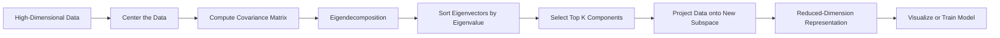

# Chapter 9: Dimensionality Reduction

> **Previous:** [Unsupervised Learning](../08-unsupervised-learning.md) | **Next:** [Model Evaluation](../10-model-evaluation.md)

---

## Learning Objectives

- Define the "Curse of Dimensionality" and its impact on machine learning
- Explain the geometric and algebraic intuition behind Principal Component Analysis (PCA)
- Calculate and interpret the "Explained Variance Ratio"
- Identify scenarios for using dimensionality reduction in preprocessing

---

## Chapter at a Glance

| Topic | Key Insight | Practical Takeaway |
|-------|-------------|-------------------|
| Curse of Dimensionality | As dimensions increase, data becomes sparse and distances become less meaningful | Reduce dimensions before modeling to avoid overfitting and improve performance |
| Principal Component Analysis | PCA finds directions of maximum variance in the data | Use PCA for feature extraction, noise reduction, and visualization |
| Explained Variance Ratio | Measures how much information each principal component retains | Choose enough components to capture 90–95% of total variance |
| Eigenvectors & Eigenvalues | Eigenvectors define the new axes; eigenvalues measure variance along each axis | Sort by eigenvalue magnitude to identify the most important components |
| t-SNE | Non-linear technique preserving local neighborhood structure | Best for visualization (2D/3D) of high-dimensional data, not for preprocessing |
| UMAP | Non-linear technique balancing local and global structure | Faster than t-SNE; scales better to large datasets |
| Feature Selection vs. Extraction | Selection chooses existing features; extraction creates new ones | Use extraction (PCA) when features are correlated; use selection for interpretability |

## Chapter Roadmap



---

## Theory

### The Curse of Dimensionality
As the number of features (dimensions) increases, the volume of the feature space increases exponentially. This causes the data points to become sparse, making it difficult for algorithms to find patterns and increasing the risk of overfitting. Dimensionality reduction aims to reduce the number of features while retaining as much information as possible.

### Principal Component Analysis (PCA)
PCA is a linear transformation technique used for feature extraction and dimensionality reduction. It identifies the directions (principal components) along which the variation in the data is maximal.

**Algebraic Intuition**:
1. **Center the Data**: Subtract the mean from each feature.
2. **Compute Covariance Matrix**: Calculate how much each feature varies with every other feature.
3. **Eigen-decomposition**: Find the eigenvectors and eigenvalues of the covariance matrix.
   - **Eigenvectors** represent the directions of the new feature space.
   - **Eigenvalues** represent the magnitude of variance in those directions.
4. **Project Data**: Choose the top $k$ eigenvectors with the largest eigenvalues and project the original data onto them.

### Explained Variance Ratio
The explained variance ratio tells us how much information (variance) each principal component carries. By summing the ratios of the top components, we can determine how many dimensions are needed to retain, for example, 95% of the original variance.

### Other Techniques (t-SNE and UMAP)
While PCA is linear, other techniques like t-Distributed Stochastic Neighbor Embedding (t-SNE) and Uniform Manifold Approximation and Projection (UMAP) are non-linear. They are primarily used for visualizing high-dimensional data in 2D or 3D by preserving local relationships between points.


> **One-Sentence Takeaway:** PCA reduces dimensionality by projecting data onto orthogonal axes of maximum variance, effectively compressing information while preserving the most meaningful structure.

> **Pro Tip:** Always standardize your data (zero mean, unit variance) before applying PCA. If features are on different scales, the components will be dominated by the features with the largest absolute values rather than the most informative ones.

> **Remember:** The explained variance ratio is your guide to choosing the number of components. Plot the cumulative explained variance and look for the point where the curve flattens — this is your "variance elbow."

> **Warning:** PCA assumes linear relationships between features. If your data lies on a non-linear manifold (e.g., a curved surface), t-SNE or UMAP will produce more meaningful low-dimensional representations than PCA.

---

## Examples

### Example 1: PCA on Iris Dataset
Reducing 4 dimensions to 2 for visualization.
```python
from sklearn.decomposition import PCA
from sklearn.datasets import load_iris
import pandas as pd

iris = load_iris()
X = iris.data

pca = PCA(n_components=2)
X_pca = pca.fit_predict(X)

print(f"Original shape: {X.shape}")
print(f"Reduced shape: {X_pca.shape}")
print(f"Explained Variance: {pca.explained_variance_ratio_}")
```
**Outcome**: Reduces the feature space to two components while keeping over 95% of the variance, allowing for a clear 2D plot of the flower species.

### Example 2: Reconstructing an Image
Using PCA to compress an image of a handwritten digit.
- **Process**: Perform PCA on the pixels of the image, keep only the top 10% of components.
- **Result**: The reconstructed image is slightly blurry but clearly recognizable, demonstrating that most information is contained in a small number of components.

> **One-Sentence Takeaway:** PCA reduces 4D Iris data to 2D while retaining over 95% variance, and image reconstruction experiments show that most visual information concentrates in the top principal components.

---

## Concept Comparison Table

| Concept | Definition | Key Distinction | Use Case |
|---------|-----------|-----------------|----------|
| PCA | Linear transformation maximizing variance in orthogonal directions | Global structure preservation; fast and deterministic | Preprocessing, noise reduction, feature extraction |
| t-SNE | Non-linear embedding preserving local pairwise distances | Captures local neighborhood structure; stochastic | Visualization of high-dimensional data in 2D/3D |
| UMAP | Non-linear embedding based on manifold theory | Faster than t-SNE; preserves more global structure | Large-scale visualization, exploratory analysis |
| Feature Selection | Chooses a subset of original features | Maintains interpretability; features remain unchanged | When model interpretability is critical |
| Feature Extraction | Creates new features from combinations of originals | Reduces dimensionality but loses original meaning | When features are highly correlated |
| SVD | Matrix factorization method: $X = U\Sigma V^T$ | Computationally stable; works on the data matrix directly | Numerical implementation of PCA; handles sparse data |
| Autoencoders | Neural network that learns compressed representation | Non-linear dimensionality reduction; requires training | Complex high-dimensional data (images, text embeddings) |

## Quick Reference

| Concept | Formula / Detail |
|---------|-----------------|
| Covariance Matrix | $\Sigma = \frac{1}{n-1} (X - \mu)^T (X - \mu)$ |
| PCA Objective | Maximize $\mathbf{v}^T \Sigma \mathbf{v}$ subject to $\|\mathbf{v}\| = 1$ |
| Eigenvalue Equation | $\Sigma \mathbf{v} = \lambda \mathbf{v}$ |
| Explained Variance Ratio | $\frac{\lambda_i}{\sum_{j=1}^{d} \lambda_j}$ |
| Projection | $X_{\text{reduced}} = X W_k$ where $W_k$ has top $k$ eigenvectors |
| Reconstruction | $X_{\text{approx}} = X_{\text{reduced}} W_k^T$ |
| t-SNE Perplexity | Typical range: 5–50; controls balance between local and global aspects |
| UMAP n_neighbors | Typical range: 5–100; controls balance between local and global structure |

## Cross-Application Matrix

| Domain | Application | How Dimensionality Reduction Is Used |
|--------|-------------|--------------------------------------|
| Genomics | Gene expression analysis | PCA reduces thousands of gene dimensions to visualize patient clusters |
| Finance | Portfolio risk modeling | PCA identifies principal risk factors from correlated asset returns |
| Natural Language Processing | Topic modeling, document embedding | Truncated SVD on TF-IDF matrices (LSA) for semantic space discovery |
| Computer Vision | Face recognition (Eigenfaces) | PCA on pixel space creates "face space" for efficient recognition |
| Signal Processing | Noise reduction, compression | PCA separates signal from noise by discarding low-variance components |
| Recommendation Systems | Collaborative filtering | SVD-based matrix factorization predicts user-item preferences |
| Healthcare | Medical imaging analysis | PCA on MRI/CT scans reduces dimensionality for faster diagnosis models |

---

## Summary

- Dimensionality reduction mitigates the curse of dimensionality and improves model efficiency.
- PCA is a linear technique that finds the directions of maximum variance in the data.
- Principal components are orthogonal to each other.
- The explained variance ratio helps in choosing the optimal number of components.
- Reducing dimensions can help in data visualization and removing noise from the signal.

---

## Exercises

### Review Questions
1. Why is it important to center and scale the data before performing PCA?
2. What is the relationship between the first and second principal components?
3. In what way does PCA act as a "lossy" compression technique?
4. When would you prefer t-SNE over PCA for visualization?

### Application Problems
1. A dataset has eigenvalues $\{10, 5, 2, 1\}$. Calculate the percentage of variance explained by the first two principal components.
2. If you have 100 features and you keep 10 principal components, how much compression (as a ratio) have you achieved?
3. Draw a 2D plot with points elongated along the line $y=x$. Where would the first principal component point?

### Challenge Problem
1. Mathematically, PCA can be solved using Singular Value Decomposition (SVD). Explain the relationship between the singular values of the data matrix $\mathbf{X}$ and the eigenvalues of the covariance matrix $\mathbf{X}^T\mathbf{X}$.

---

## Chapter Quiz

Test your understanding of Dimensionality Reduction.

**1.** What is the correct order of steps in PCA?

<details><summary>**Answer**</summary>
**C)** The correct sequence is: center the data → compute covariance matrix → eigen-decomposition → sort eigenvectors by eigenvalue → select top K → project data.
</details>

- A) Project data → compute covariance → eigen-decomposition → center data
- B) Compute covariance → center data → eigen-decomposition → select top K
- C) Center data → compute covariance → eigen-decomposition → sort → select → project
- D) Select top K → eigen-decomposition → project → compute covariance

**2.** If the first principal component explains 70% of the variance and the second explains 20%, what is the cumulative explained variance of the first two components?

<details><summary>**Answer**</summary>
**A)** The cumulative explained variance is the sum: 70% + 20% = 90%. This means 90% of the total variance is captured by the first two components.
</details>

- A) 90%
- B) 50%
- C) 70%
- D) 20%

**3.** When would you choose t-SNE over PCA for dimensionality reduction?

<details><summary>**Answer**</summary>
**C)** t-SNE excels at preserving local neighborhood structure in data that lies on non-linear manifolds, making it superior for visualizing complex high-dimensional data like word embeddings or image features.
</details>

- A) When you need a deterministic, reproducible transformation
- B) When you need to use the reduced features as input to a model
- C) When visualizing non-linear structure in high-dimensional data
- D) When working with small datasets only
