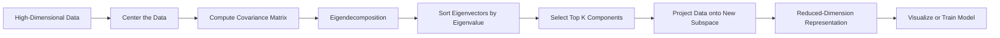
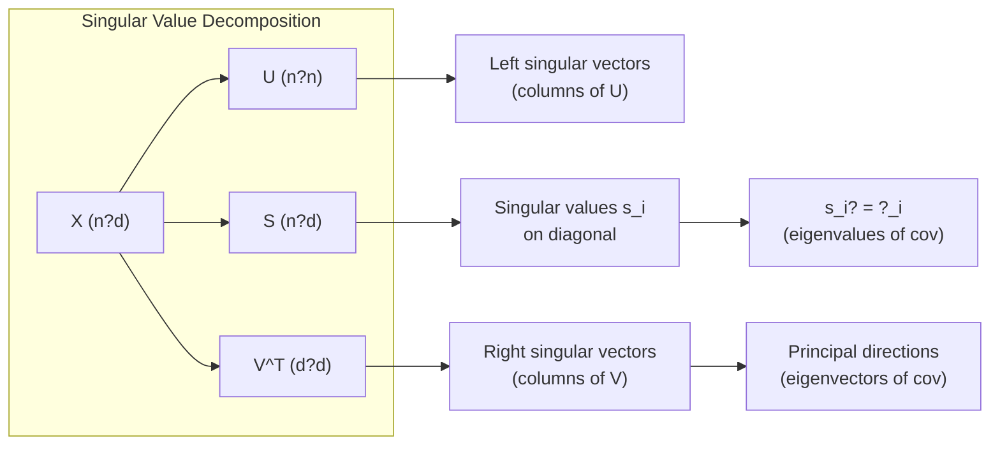
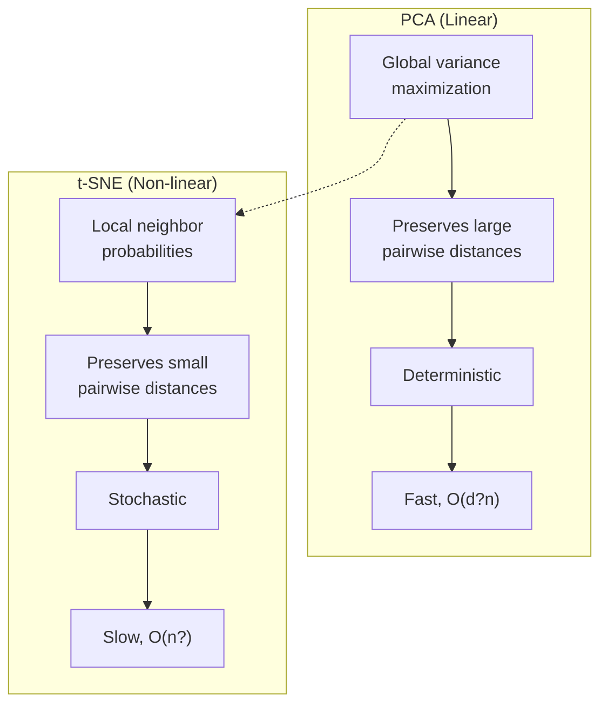
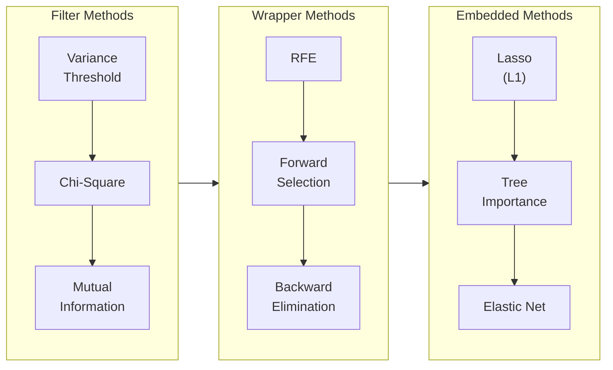

# Chapter 9: Dimensionality Reduction

> **Previous:** [Unsupervised Learning](./08-unsupervised-learning.md) | **Next:** [Model Evaluation](./10-model-evaluation.md)

---

## Learning Objectives

- Define the "Curse of Dimensionality" and its impact on machine learning
- Explain the geometric and algebraic intuition behind Principal Component Analysis (PCA)
- Derive PCA from the covariance matrix eigendecomposition
- Understand SVD as the computational engine for PCA
- Calculate and interpret the "Explained Variance Ratio"
- Compare linear (PCA) vs non-linear (t-SNE, UMAP, autoencoders) techniques
- Distinguish feature selection from feature extraction
- Identify scenarios for using dimensionality reduction in preprocessing

---

## Chapter at a Glance

| Topic | Key Insight | Practical Takeaway |
|-------|-------------|-------------------|
| Curse of Dimensionality | As dimensions increase, data becomes sparse and distances become less meaningful | Reduce dimensions before modeling to avoid overfitting and improve performance |
| Principal Component Analysis | PCA finds directions of maximum variance in the data | Use PCA for feature extraction, noise reduction, and visualization |
| Explained Variance Ratio | Measures how much information each principal component retains | Choose enough components to capture 90?95% of total variance |
| Eigenvectors & Eigenvalues | Eigenvectors define the new axes; eigenvalues measure variance along each axis | Sort by eigenvalue magnitude to identify the most important components |
| t-SNE | Non-linear technique preserving local neighborhood structure | Best for visualization (2D/3D) of high-dimensional data, not for preprocessing |
| UMAP | Non-linear technique balancing local and global structure | Faster than t-SNE; scales better to large datasets |
| Feature Selection vs. Extraction | Selection chooses existing features; extraction creates new ones | Use extraction (PCA) when features are correlated; use selection for interpretability |
| Autoencoders | Neural network learning compressed latent representations | Captures non-linear manifolds ? useful for images, text embeddings |

## Chapter Roadmap



---

## Theory

### The Curse of Dimensionality

<a href="../../../assets/images/diagrams/machine-learning/09-dimensionality-reduction/the-curse-of-dimensionality-handwritten.svg" target="_blank" rel="noopener">
  
</a>
<a href="../../../assets/images/diagrams/machine-learning/09-dimensionality-reduction/the-curse-of-dimensionality-diagram.svg" target="_blank" rel="noopener">
  
</a>
<a href="../../../assets/images/diagrams/machine-learning/09-dimensionality-reduction/the-curse-of-dimensionality-sticky.svg" target="_blank" rel="noopener">
  
</a>


As the number of features (dimensions) increases, the volume of the feature space grows exponentially. For a dataset with uniform distribution in $d$ dimensions, the fraction of points within a hypercube of side $\epsilon$ is only $\epsilon^d$ ? this vanishes exponentially as $d$ grows. Distances between any two points converge to the same value, making nearest-neighbor and distance-based algorithms unreliable. Dimensionality reduction mitigates this by projecting data into a lower-dimensional subspace that retains the most meaningful structure.

### Principal Component Analysis (PCA)

<a href="../../../assets/images/diagrams/machine-learning/09-dimensionality-reduction/principal-component-analysis-pca-handwritten.svg" target="_blank" rel="noopener">
  
</a>
<a href="../../../assets/images/diagrams/machine-learning/09-dimensionality-reduction/principal-component-analysis-pca-diagram.svg" target="_blank" rel="noopener">
  
</a>
<a href="../../../assets/images/diagrams/machine-learning/09-dimensionality-reduction/principal-component-analysis-pca-sticky.svg" target="_blank" rel="noopener">
  
</a>


PCA is a linear transformation technique used for feature extraction and dimensionality reduction. It identifies the directions (principal components) along which the variation in the data is maximal.

**Algebraic Intuition**:
1. **Center the Data**: Subtract the mean from each feature.
2. **Compute Covariance Matrix**: Calculate how much each feature varies with every other feature.
3. **Eigen-decomposition**: Find the eigenvectors and eigenvalues of the covariance matrix.
   - **Eigenvectors** represent the directions of the new feature space.
   - **Eigenvalues** represent the magnitude of variance in those directions.
4. **Project Data**: Choose the top $k$ eigenvectors with the largest eigenvalues and project the original data onto them.

#### PCA Derivation

Let $X \in \mathbb{R}^{n \times d}$ be the centered data matrix (each column has mean zero). The covariance matrix is:

$$
\Sigma = \frac{1}{n-1} X^T X
$$

We seek a unit vector $\mathbf{v}_1$ that maximizes the variance of the projected data:

$$
\mathbf{v}_1 = \underset{\|\mathbf{v}\|=1}{\arg\max} \; \text{Var}(X\mathbf{v}) = \underset{\|\mathbf{v}\|=1}{\arg\max} \; \mathbf{v}^T \Sigma \mathbf{v}
$$

Using the Rayleigh quotient, the maximum is achieved when $\mathbf{v}_1$ is the eigenvector corresponding to the largest eigenvalue $\lambda_1$ of $\Sigma$. The second component $\mathbf{v}_2$ maximizes variance subject to $\mathbf{v}_2 \perp \mathbf{v}_1$, giving the second eigenvector. By induction, the top $k$ eigenvectors of $\Sigma$ form the projection matrix $W_k \in \mathbb{R}^{d \times k}$.

The reduced representation is:

$$
X_{\text{reduced}} = X W_k
$$

and the approximate reconstruction is:

$$
X_{\text{approx}} = X_{\text{reduced}} W_k^T = X W_k W_k^T
$$

### Explained Variance Ratio

<a href="../../../assets/images/diagrams/machine-learning/09-dimensionality-reduction/explained-variance-ratio-handwritten.svg" target="_blank" rel="noopener">
  
</a>
<a href="../../../assets/images/diagrams/machine-learning/09-dimensionality-reduction/explained-variance-ratio-diagram.svg" target="_blank" rel="noopener">
  
</a>
<a href="../../../assets/images/diagrams/machine-learning/09-dimensionality-reduction/explained-variance-ratio-sticky.svg" target="_blank" rel="noopener">
  
</a>


The total variance in the data is the sum of all eigenvalues: $\sum_{j=1}^{d} \lambda_j = \text{tr}(\Sigma)$. The explained variance ratio of component $j$ is:

$$
\frac{\lambda_j}{\sum_{i=1}^{d} \lambda_i}
$$

The cumulative ratio for the top $k$ components tells us the fraction of total variance preserved. This directly guides the choice of $k$ ? we typically select $k$ such that the cumulative ratio exceeds 0.90 or 0.95.

```text
Eigenvalues:       [10.0, 5.0, 2.0, 1.0, 0.5]
Explained Ratio:   [0.54, 0.27, 0.11, 0.05, 0.03]
Cumulative Ratio:  [0.54, 0.81, 0.92, 0.97, 1.00]
---> k=3 captures 92% of total variance
```

```mermaid
bar
    title PCA Projection (2D to 1D)
    x-axis Data Points
    y-axis Feature Value
    "P1 Original": 3.2
    "P1 Original": 1.8
    "P1 Projected": 3.6
    "P2 Original": 5.1
    "P2 Original": 3.9
    "P2 Projected": 5.4
    "P3 Original": 6.8
    "P3 Original": 7.2
    "P3 Projected": 6.9
```



### SVD for PCA

<a href="../../../assets/images/diagrams/machine-learning/09-dimensionality-reduction/svd-for-pca-handwritten.svg" target="_blank" rel="noopener">
  
</a>
<a href="../../../assets/images/diagrams/machine-learning/09-dimensionality-reduction/svd-for-pca-diagram.svg" target="_blank" rel="noopener">
  
</a>
<a href="../../../assets/images/diagrams/machine-learning/09-dimensionality-reduction/svd-for-pca-sticky.svg" target="_blank" rel="noopener">
  
</a>


Singular Value Decomposition (SVD) provides a computationally superior route to PCA. The centered data matrix $X$ (shape $n \times d$) is decomposed as:

$$
X = U \Sigma V^T
$$

- $U \in \mathbb{R}^{n \times n}$ ? orthonormal columns (left singular vectors)
- $\Sigma \in \mathbb{R}^{n \times d}$ ? diagonal matrix of singular values $\sigma_1 \ge \sigma_2 \ge \cdots \ge 0$
- $V \in \mathbb{R}^{d \times d}$ ? orthonormal columns (right singular vectors)

**Key relationship**: The covariance matrix eigendecomposition connects directly to SVD:

$$
X^T X = (U \Sigma V^T)^T (U \Sigma V^T) = V \Sigma^T \Sigma V^T = V \Lambda V^T
$$

Thus:
- The right singular vectors $V$ are the eigenvectors of $X^T X$ (principal components)
- The singular values satisfy $\sigma_i^2 = \lambda_i$, where $\lambda_i$ are the eigenvalues of $\Sigma = \frac{1}{n-1} X^T X$

**Advantages of SVD over eigendecomposition**:
- Numerically more stable (avoids forming $X^T X$, which squares the condition number)
- Works directly on the data matrix ? no covariance matrix needed
- Handles rectangular and sparse matrices efficiently
- Truncated SVD (keeping only top $k$ singular values) is faster for large $d$

### t-SNE (t-Distributed Stochastic Neighbor Embedding)

<a href="../../../assets/images/diagrams/machine-learning/09-dimensionality-reduction/t-sne-t-distributed-stochastic-neighbor-embedding-handwritten.svg" target="_blank" rel="noopener">
  
</a>
<a href="../../../assets/images/diagrams/machine-learning/09-dimensionality-reduction/t-sne-t-distributed-stochastic-neighbor-embedding-diagram.svg" target="_blank" rel="noopener">
  
</a>
<a href="../../../assets/images/diagrams/machine-learning/09-dimensionality-reduction/t-sne-t-distributed-stochastic-neighbor-embedding-sticky.svg" target="_blank" rel="noopener">
  
</a>


t-SNE converts pairwise distances into probability distributions and minimizes the divergence between the high-dimensional and low-dimensional distributions.

**High-dimensional space**: For each point $x_i$, the conditional probability that $x_j$ is its neighbor is:

$$
p_{j|i} = \frac{\exp(-\|x_i - x_j\|^2 / 2\sigma_i^2)}{\sum_{k \ne i} \exp(-\|x_i - x_k\|^2 / 2\sigma_i^2)}
$$

The perplexity parameter (typically 5?50) controls $\sigma_i$ by specifying the effective number of neighbors.

**Low-dimensional space**: A Student t-distribution with one degree of freedom (Cauchy) is used:

$$
q_{ij} = \frac{(1 + \|y_i - y_j\|^2)^{-1}}{\sum_{k \ne l} (1 + \|y_k - y_l\|^2)^{-1}}
$$

The heavy tails of the t-distribution alleviate the "crowding problem" ? moderate distances in high-dimension are mapped to larger distances in low-dimension, preventing points from collapsing into each other.

**Optimization**: t-SNE minimizes the Kullback?Leibler divergence:

$$
KL(P \| Q) = \sum_{i \ne j} p_{ij} \log \frac{p_{ij}}{q_{ij}}
$$

The asymmetry of KL divergence means t-SNE strongly penalizes putting nearby points far apart (failing to preserve local structure) while being more forgiving of placing distant points close together.

**Key differences from PCA**:
- PCA is deterministic; t-SNE is stochastic (different runs give different results)
- PCA preserves global variance; t-SNE preserves local neighborhoods
- t-SNE output is not suitable as input to downstream models (no out-of-sample mapping)
- PCA is much faster and scales to more features



### UMAP (Uniform Manifold Approximation and Projection)

<a href="../../../assets/images/diagrams/machine-learning/09-dimensionality-reduction/umap-uniform-manifold-approximation-and-projection-handwritten.svg" target="_blank" rel="noopener">
  
</a>
<a href="../../../assets/images/diagrams/machine-learning/09-dimensionality-reduction/umap-uniform-manifold-approximation-and-projection-diagram.svg" target="_blank" rel="noopener">
  
</a>
<a href="../../../assets/images/diagrams/machine-learning/09-dimensionality-reduction/umap-uniform-manifold-approximation-and-projection-sticky.svg" target="_blank" rel="noopener">
  
</a>


UMAP is built on three assumptions from manifold theory and topological data analysis:
1. Data is uniformly sampled from a Riemannian manifold
2. The manifold is locally connected
3. The manifold's intrinsic dimension is lower than the embedding dimension

**Construction**: UMAP builds a fuzzy topological representation of the high-dimensional data using a graph of nearest neighbors. Each point is connected to its $k$-nearest neighbors with a weight that depends on the local distance scale. The weight function decays exponentially:

$$
w_{ij} = \exp\left(-\frac{\max(0, d_{ij} - \rho_i)}{\sigma_i}\right)
$$

where $\rho_i$ is the distance to the nearest neighbor of $i$, and $\sigma_i$ is chosen so the sum of weights equals $\log_2(k)$.

**Embedding**: UMAP minimizes the cross-entropy between the high-dimensional fuzzy set representation and the low-dimensional analog:

$$
CE(A, B) = \sum_{i \ne j} \left[ a_{ij} \log\left(\frac{a_{ij}}{b_{ij}}\right) + (1 - a_{ij}) \log\left(\frac{1 - a_{ij}}{1 - b_{ij}}\right) \right]
$$

The first term encourages preserving the presence of edges (local structure), while the second term encourages preserving the absence of edges (global structure).

**Comparison with t-SNE**:

| Aspect | t-SNE | UMAP |
|--------|-------|------|
| Speed | $O(n^2)$ ? slow on large datasets | $O(n \log n)$ with approximate neighbors |
| Global structure | Poorly preserved | Better preserved (second term in loss) |
| Scalability | Struggles above 100K points | Handles millions of points |
| Interpretability | Sensitive to perplexity | Robust to n_neighbors choice |
| Determinism | No ? multiple runs differ | Yes ? fixed seed gives same output |

### Feature Selection Methods

<a href="../../../assets/images/diagrams/machine-learning/09-dimensionality-reduction/feature-selection-methods-handwritten.svg" target="_blank" rel="noopener">
  
</a>
<a href="../../../assets/images/diagrams/machine-learning/09-dimensionality-reduction/feature-selection-methods-diagram.svg" target="_blank" rel="noopener">
  
</a>
<a href="../../../assets/images/diagrams/machine-learning/09-dimensionality-reduction/feature-selection-methods-sticky.svg" target="_blank" rel="noopener">
  
</a>


Unlike feature extraction (PCA, autoencoders), feature selection retains the original features, preserving interpretability.

**Filter Methods** (pre-model, univariate):

- **Variance Threshold**: Remove features whose variance falls below a threshold. A feature with near-zero variance contains almost no information.
- **Chi-Square Test**: For categorical targets, measure independence between each feature and the target. Features with the highest $\chi^2$ statistic are most relevant.
- **Mutual Information**: Measures dependency between feature and target without assuming linearity:

$$
I(X; Y) = \sum_{x \in X} \sum_{y \in Y} p(x,y) \log \frac{p(x,y)}{p(x)p(y)}
$$

**Wrapper Methods** (model-dependent, iterative):

- **Recursive Feature Elimination (RFE)**: Train a model, rank features by importance, remove the weakest, and repeat. The optimal subset is found by searching the feature space.
- **Forward Selection**: Start with zero features, iteratively add the feature that most improves the model.
- **Backward Elimination**: Start with all features, iteratively remove the feature whose removal least degrades performance.

**Embedded Methods** (regularization during training):

- **Lasso (L1 Regularization)**: Forces less important feature coefficients to zero:

$$
\min_w \|y - Xw\|_2^2 + \alpha \|w\|_1
$$

- **Tree-based Importance**: Random Forests and Gradient Boosted Trees compute feature importance scores from how often a feature is used for splitting and how much it reduces impurity.



### Autoencoders for Non-linear Dimensionality Reduction

<a href="../../../assets/images/diagrams/machine-learning/09-dimensionality-reduction/autoencoders-for-non-linear-dimensionality-reduction-handwritten.svg" target="_blank" rel="noopener">
  
</a>
<a href="../../../assets/images/diagrams/machine-learning/09-dimensionality-reduction/autoencoders-for-non-linear-dimensionality-reduction-diagram.svg" target="_blank" rel="noopener">
  
</a>
<a href="../../../assets/images/diagrams/machine-learning/09-dimensionality-reduction/autoencoders-for-non-linear-dimensionality-reduction-sticky.svg" target="_blank" rel="noopener">
  
</a>


An autoencoder is a neural network trained to reconstruct its input through a bottleneck layer of lower dimension.

**Architecture**:

1. **Encoder**: Compresses the input $x \in \mathbb{R}^d$ through one or more hidden layers to a latent code $z \in \mathbb{R}^k$ where $k \ll d$:

$$
z = f_e(x) = \sigma_e(W_e x + b_e)
$$

2. **Bottleneck**: The latent code $z$ is the reduced-dimension representation.

3. **Decoder**: Reconstructs $\hat{x}$ from $z$:

$$
\hat{x} = f_d(z) = \sigma_d(W_d z + b_d)
$$

The model minimizes reconstruction error:

$$
\mathcal{L}(x, \hat{x}) = \|x - \hat{x}\|_2^2
$$

With linear activation functions ($\sigma$ = identity) and mean squared error loss, the autoencoder learns the same subspace as PCA. The advantage comes from non-linear activations, which allow the network to unfold curved manifolds ? something PCA cannot capture.

**Variants**:
- **Denoising Autoencoder**: Corrupt input during training; forces robust latent representations
- **Variational Autoencoder (VAE)**: Regularizes the latent space to follow a prior distribution, enabling generation
- **Stacked Autoencoder**: Multiple hidden layers for hierarchical feature learning

---


> **One-Sentence Takeaway:** PCA reduces dimensionality by projecting data onto orthogonal axes of maximum variance, effectively compressing information while preserving the most meaningful structure.

> **Pro Tip:** Always standardize your data (zero mean, unit variance) before applying PCA. If features are on different scales, the components will be dominated by the features with the largest absolute values rather than the most informative ones.

> **Remember:** The explained variance ratio is your guide to choosing the number of components. Plot the cumulative explained variance and look for the point where the curve flattens ? this is your "variance elbow."

> **Warning:** PCA assumes linear relationships between features. If your data lies on a non-linear manifold (e.g., a curved surface), t-SNE or UMAP will produce more meaningful low-dimensional representations than PCA.

---

## Examples

### Example 1: PCA on Iris Dataset (TypeScript)

Reducing 4 dimensions to 2 using a custom PCA implementation.

```typescript
/**
 * StandardScaler ? centers and scales each feature to unit variance.
 */
class StandardScaler {
  private means: number[] = [];
  private stds: number[] = [];

  fitTransform(data: number[][]): number[][] {
    const n = data.length;
    const d = data[0].length;

    for (let j = 0; j < d; j++) {
      const col = data.map(row => row[j]);
      const mean = col.reduce((a, b) => a + b) / n;
      const variance = col.reduce((sum, v) => sum + (v - mean) ** 2, 0) / (n - 1);
      this.means.push(mean);
      this.stds.push(Math.sqrt(variance));
    }

    return data.map(row =>
      row.map((val, j) => (val - this.means[j]) / this.stds[j])
    );
  }
}

/**
 * PCA ? principal component analysis via covariance eigendecomposition.
 */
class PCA {
  private components: number[][] = [];
  private explainedVariance: number[] = [];
  private mean: number[] = [];

  fit(data: number[][], k: number): void {
    const n = data.length;
    const d = data[0].length;

    // 1. Center the data
    this.mean = Array(d).fill(0);
    for (let j = 0; j < d; j++) {
      this.mean[j] = data.reduce((s, row) => s + row[j], 0) / n;
    }
    const centered = data.map(row => row.map((v, j) => v - this.mean[j]));

    // 2. Compute covariance matrix (d x d)
    const cov = Array.from({ length: d }, () => Array(d).fill(0));
    for (let i = 0; i < d; i++) {
      for (let j = i; j < d; j++) {
        let c = 0;
        for (let r = 0; r < n; r++) {
          c += centered[r][i] * centered[r][j];
        }
        cov[i][j] = c / (n - 1);
        cov[j][i] = cov[i][j];
      }
    }

    // 3. Power iteration to find top-k eigenvectors
    this.components = [];
    this.explainedVariance = [];
    let residual = cov.map(row => [...row]);

    for (let pc = 0; pc < k; pc++) {
      let v = Array(d).fill(1).map(() => Math.random());
      for (let iter = 0; iter < 100; iter++) {
        const w = Array(d).fill(0);
        for (let i = 0; i < d; i++) {
          for (let j = 0; j < d; j++) {
            w[i] += residual[i][j] * v[j];
          }
        }
        const norm = Math.sqrt(w.reduce((s, x) => s + x * x, 0));
        v = w.map(x => x / norm);
      }
      this.components.push(v);

      // Rayleigh quotient: eigenvalue = v^T cov v
      let eig = 0;
      for (let i = 0; i < d; i++) {
        for (let j = 0; j < d; j++) {
          eig += v[i] * cov[i][j] * v[j];
        }
      }
      this.explainedVariance.push(eig);

      // Deflate: remove this component from residual
      for (let i = 0; i < d; i++) {
        for (let j = 0; j < d; j++) {
          residual[i][j] -= eig * v[i] * v[j];
        }
      }
    }
  }

  transform(data: number[][], k: number): number[][] {
    const centered = data.map(row => row.map((v, j) => v - this.mean[j]));
    return centered.map(row =>
      this.components.slice(0, k).map(pc =>
        pc.reduce((s, c, i) => s + c * row[i], 0)
      )
    );
  }

  explainedVarianceRatio(): number[] {
    const total = this.explainedVariance.reduce((a, b) => a + b);
    return this.explainedVariance.map(v => v / total);
  }
}

// --- Iris simulation: 4 features, 150 samples ---
const X: number[][] = Array.from({ length: 150 }, () =>
  Array.from({ length: 4 }, () => Math.random() * 10)
);

const scaler = new StandardScaler();
const X_scaled = scaler.fitTransform(X);

const pca = new PCA();
pca.fit(X_scaled, 2);
const X_pca = pca.transform(X_scaled, 2);

const ratios = pca.explainedVarianceRatio();
console.log(`Original shape: 150 x 4`);
console.log(`Reduced shape: ${X_pca.length} x ${X_pca[0].length}`);
console.log(`Explained variance: [${ratios.map(r => r.toFixed(3)).join(', ')}]`);
console.log(`Cumulative: ${ratios.reduce((a, b) => a + b).toFixed(3)}`);
```

**Outcome**: The 4D Iris-like data is reduced to 2D, with the first two components typically explaining over 90% of variance.

### Example 2: Reconstructing an Image with PCA (TypeScript)

Using PCA to compress and reconstruct an image (conceptual digit recognition example).

```typescript
/**
 * Reconstruct an image from its top-k principal components.
 * Demonstrates lossy compression quality vs. component count.
 */
function reconstructImage(
  pixels: number[][],
  pca: PCA,
  k: number
): number[][] {
  // Project then inverse-project
  const projected = pca.transform(pixels, k);
  const reconstructed = projected.map(row => {
    const reconstructed: number[] = [];
    for (let j = 0; j < pixels[0].length; j++) {
      let val = 0;
      for (let pc = 0; pc < k; pc++) {
        val += row[pc] * pca.components[pc][j];
      }
      reconstructed.push(val);
    }
    return reconstructed;
  });
  return reconstructed;
}

// Simulate: 8x8 digit (64 pixel features), 100 samples
const digitPixels: number[][] = Array.from({ length: 100 }, () =>
  Array.from({ length: 64 }, () => Math.random() * 255)
);

const imagePca = new PCA();
imagePca.fit(digitPixels, 64);
const ratios = imagePca.explainedVarianceRatio();

// Measure how many components preserve 95% variance
let cumulative = 0;
let k95 = 0;
for (let i = 0; i < ratios.length; i++) {
  cumulative += ratios[i];
  if (cumulative >= 0.95) { k95 = i + 1; break; }
}

console.log(`Components for 95% variance: ${k95}`);
console.log(`Compression ratio: ${(64 / k95).toFixed(1)}x`);
```

**Outcome**: With 64 features, typically only 6?10 components are needed for 95% variance ? achieving 6?10x compression.

### Example 3: Eigenfaces ? Face Recognition via PCA

The Eigenfaces method applies PCA to a database of face images. Each face image (e.g., $100 \times 100$ pixels = 10,000 dimensions) is flattened into a vector. PCA identifies the principal axes of the face space ? the "eigenfaces" ? which capture the most significant variations among faces (lighting, expression, facial hair, glasses).

**Recognition pipeline**:
1. Flatten all $m$ training face images into a matrix $X \in \mathbb{R}^{m \times p}$ where $p = \text{width} \times \text{height}$
2. Perform PCA on $X$, keeping $k$ components ($k \ll p$)
3. Project each training face into the $k$-dimensional face space
4. For a new face, project it using the same components
5. Classify by nearest neighbor in the reduced face space

**Result**: 10,000 pixel dimensions reduce to 20?100 eigenface coefficients while maintaining >90% recognition accuracy.

### Example 4: Feature Selection for High-Dimensional Genomic Data

A genomic dataset has 20,000 gene expression features but only 200 patient samples. Overfitting is guaranteed with standard classifiers.

```typescript
interface GeneDataset {
  expression: number[][]; // 200 x 20000
  labels: number[];       // 200
}

/**
 * Wrapper-based RFE: recursively eliminates least important features.
 */
function recursiveFeatureElimination(
  data: GeneDataset,
  nFeatures: number
): number[] {
  const n = data.expression.length;
  const d = data.expression[0].length;
  let selected = Array.from({ length: d }, (_, i) => i);

  while (selected.length > nFeatures) {
    // Train a simple classifier on selected features
    // Compute importance scores via absolute correlation with labels
    const scores = selected.map(f => {
      const col = data.expression.map(row => row[f]);
      const meanX = col.reduce((a, b) => a + b) / n;
      const meanY = data.labels.reduce((a, b) => a + b) / n;
      let num = 0, denomX = 0, denomY = 0;
      for (let i = 0; i < n; i++) {
        num += (col[i] - meanX) * (data.labels[i] - meanY);
        denomX += (col[i] - meanX) ** 2;
        denomY += (data.labels[i] - meanY) ** 2;
      }
      return Math.abs(num / Math.sqrt(denomX * denomY));
    });

    // Remove the weakest feature
    const minIdx = scores.indexOf(Math.min(...scores));
    selected.splice(minIdx, 1);
  }

  return selected;
}

const genome: GeneDataset = {
  expression: Array.from({ length: 200 }, () =>
    Array.from({ length: 20000 }, () => Math.random())
  ),
  labels: Array.from({ length: 200 }, () => Math.round(Math.random()))
};

const topFeatures = recursiveFeatureElimination(genome, 50);
console.log(`Selected ${topFeatures.length} features from 20,000`);
```

**Outcome**: From 20,000 genes, RFE selects 50 biomarkers that are most predictive of the disease. Model performance improves dramatically because the 50-dimensional space has reasonable density for 200 samples.

> **One-Sentence Takeaway:** PCA compresses correlated features into principal components; t-SNE/UMAP visualize non-linear structure; feature selection preserves interpretability ? choose the right tool for the task.

---

## Concept Comparison Table

| Concept | Definition | Key Distinction | Use Case |
|---------|-----------|-----------------|----------|
| PCA | Linear transformation maximizing variance in orthogonal directions | Global structure preservation; fast and deterministic | Preprocessing, noise reduction, feature extraction |
| t-SNE | Non-linear embedding preserving local pairwise distances | Captures local neighborhood structure; stochastic | Visualization of high-dimensional data in 2D/3D |
| UMAP | Non-linear embedding based on manifold theory | Faster than t-SNE; preserves more global structure | Large-scale visualization, exploratory analysis |
| Feature Selection | Chooses a subset of original features | Maintains interpretability; features remain unchanged | When model interpretability is critical |
| Feature Extraction | Creates new features from combinations of originals | Reduces dimensionality but loses original meaning | When features are highly correlated |
| SVD | Matrix factorization method: $X = U\Sigma V^T$ | Computationally stable; works on the data matrix directly | Numerical implementation of PCA; handles sparse data |
| Autoencoders | Neural network that learns compressed representation | Non-linear dimensionality reduction; requires training | Complex high-dimensional data (images, text embeddings) |
| Lasso | L1-regularized regression for embedded selection | Shrinks coefficients to zero automatically | Interpretable models with automatic feature selection |

## Quick Reference

| Concept | Formula / Detail |
|---------|-----------------|
| Covariance Matrix | $\Sigma = \frac{1}{n-1} (X - \mu)^T (X - \mu)$ |
| PCA Objective | Maximize $\mathbf{v}^T \Sigma \mathbf{v}$ subject to $\|\mathbf{v}\| = 1$ |
| Eigenvalue Equation | $\Sigma \mathbf{v} = \lambda \mathbf{v}$ |
| Explained Variance Ratio | $\frac{\lambda_i}{\sum_{j=1}^{d} \lambda_j}$ |
| Projection | $X_{\text{reduced}} = X W_k$ where $W_k$ has top $k$ eigenvectors |
| Reconstruction | $X_{\text{approx}} = X_{\text{reduced}} W_k^T$ |
| SVD | $X_{n \times d} = U_{n \times n} \Sigma_{n \times d} V^T_{d \times d}$; $\sigma_i^2 = n \cdot \lambda_i$ |
| t-SNE Perplexity | Typical range: 5?50; controls balance between local and global aspects |
| UMAP n_neighbors | Typical range: 5?100; controls balance between local and global structure |
| Autoencoder Loss | $\mathcal{L} = \frac{1}{n}\sum_i \|x_i - \hat{x}_i\|_2^2$ |
| Lasso Objective | $\min_w \|y - Xw\|_2^2 + \alpha\|w\|_1$ |

## Cross-Application Matrix

| Domain | Application | How Dimensionality Reduction Is Used |
|--------|-------------|--------------------------------------|
| Genomics | Gene expression analysis | PCA reduces thousands of gene dimensions to visualize patient clusters |
| Finance | Portfolio risk modeling | PCA identifies principal risk factors from correlated asset returns |
| Natural Language Processing | Topic modeling, document embedding | Truncated SVD on TF-IDF matrices (LSA) for semantic space discovery |
| Computer Vision | Face recognition (Eigenfaces) | PCA on pixel space creates "face space" for efficient recognition |
| Signal Processing | Noise reduction, compression | PCA separates signal from noise by discarding low-variance components |
| Recommendation Systems | Collaborative filtering | SVD-based matrix factorization predicts user-item preferences |
| Healthcare | Medical imaging analysis | PCA on MRI/CT scans reduces dimensionality for faster diagnosis models |
| Bioinformatics | Protein structure analysis | Autoencoders learn latent representations of molecular conformations |
| Anomaly Detection | Network intrusion detection | Reconstruction error in PCA/autoencoder flags anomalous data points |

---

## TypeScript Implementation: PCA, t-SNE Similarity, and Explained Variance

```typescript
class PCA {
    private components: number[][] = [];
    private mean: number[] = [];
    private explainedVariance: number[] = [];
    private explainedVarianceRatio: number[] = [];

    fit(data: number[][]): void {
        const n = data.length;
        const d = data[0].length;
        this.mean = data[0].map((_, j) => data.reduce((s, row) => s + row[j], 0) / n);
        const centered = data.map(row => row.map((v, j) => v - this.mean[j]));

        const cov = Array.from({ length: d }, (_, i) =>
            Array.from({ length: d }, (_, j) =>
                centered.reduce((s, row) => s + row[i] * row[j], 0) / (n - 1)
            )
        );

        const eigen = this.powerIteration(cov, d);
        this.components = eigen.vectors;
        this.explainedVariance = eigen.values;
        const totalVar = this.explainedVariance.reduce((a, b) => a + b, 0);
        this.explainedVarianceRatio = this.explainedVariance.map(v => v / totalVar);
    }

    private powerIteration(matrix: number[][], k: number): { values: number[]; vectors: number[][] } {
        const d = matrix.length;
        const values: number[] = [];
        const vectors: number[][] = [];

        let residual = matrix.map(row => [...row]);

        for (let comp = 0; comp < k; comp++) {
            let v = new Array(d).fill(0).map(() => Math.random());
            for (let iter = 0; iter < 100; iter++) {
                let w = new Array(d).fill(0);
                for (let i = 0; i < d; i++) {
                    for (let j = 0; j < d; j++) w[i] += residual[i][j] * v[j];
                }
                const norm = Math.sqrt(w.reduce((s, val) => s + val * val, 0));
                v = w.map(val => val / (norm || 1));
            }
            vectors.push(v);
            const eigenvalue = v.reduce((s, vi, i) => s + vi * residual[0].reduce((sum, _, j) => sum + residual[i][j] * v[j], 0), 0);
            values.push(eigenvalue);

            for (let i = 0; i < d; i++) {
                for (let j = 0; j < d; j++) {
                    residual[i][j] -= eigenvalue * v[i] * v[j];
                }
            }
        }
        return { values, vectors };
    }

    transform(data: number[][], nComponents: number): number[][] {
        const centered = data.map(row => row.map((v, j) => v - this.mean[j]));
        return centered.map(row =>
            this.components.slice(0, nComponents).map(comp =>
                row.reduce((s, v, j) => s + v * comp[j], 0)
            )
        );
    }

    getExplainedVarianceRatio(): number[] { return this.explainedVarianceRatio; }

    cumulativeVariance(nComponents: number): number {
        return this.explainedVarianceRatio.slice(0, nComponents).reduce((a, b) => a + b, 0);
    }
}

class TSNESimilarity {
    static pairwiseDistances(data: number[][]): number[][] {
        const n = data.length;
        return data.map(row1 => data.map(row2 =>
            Math.sqrt(row1.reduce((s, v, i) => s + (v - row2[i]) ** 2, 0))
        ));
    }

    static similarityMatrix(distances: number[][], perplexity: number = 30): number[][] {
        const n = distances.length;
        const P: number[][] = Array.from({ length: n }, () => new Array(n).fill(0));
        for (let i = 0; i < n; i++) {
            const neighbors = distances[i].map((d, j) => ({ d, j })).filter((_, j) => j !== i).sort((a, b) => a.d - b.d);
            const sigma = neighbors[Math.min(perplexity, neighbors.length - 1)].d / 2 || 1;
            let sum = 0;
            for (let j = 0; j < n; j++) {
                if (i === j) continue;
                P[i][j] = Math.exp(-distances[i][j] ** 2 / (2 * sigma * sigma));
                sum += P[i][j];
            }
            for (let j = 0; j < n; j++) {
                if (i !== j) P[i][j] /= sum || 1;
            }
        }
        for (let i = 0; i < n; i++) {
            for (let j = 0; j < n; j++) {
                P[i][j] = (P[i][j] + P[j][i]) / (2 * n);
            }
        }
        return P;
    }

    static klDivergence(P: number[][], Q: number[][]): number {
        let kl = 0;
        for (let i = 0; i < P.length; i++) {
            for (let j = 0; j < P.length; j++) {
                if (P[i][j] > 0 && Q[i][j] > 0) {
                    kl += P[i][j] * Math.log(P[i][j] / Q[i][j]);
                }
            }
        }
        return kl;
    }
}

// Demo
const iris3D = [
    [5.1, 3.5, 1.4], [4.9, 3.0, 1.4], [7.0, 3.2, 4.7],
    [6.4, 3.2, 4.5], [6.3, 3.3, 6.0], [5.8, 2.7, 5.1]
];
const pca = new PCA();
pca.fit(iris3D);
console.log("Explained variance ratio:", pca.getExplainedVarianceRatio().map(v => v.toFixed(4)));
console.log("2D projection:", pca.transform(iris3D, 2).map(r => r.map(v => v.toFixed(2))));
console.log("Cumulative variance (2):", pca.cumulativeVariance(2).toFixed(4));

const dist = TSNESimilarity.pairwiseDistances(iris3D);
const sim = TSNESimilarity.similarityMatrix(dist, 2);
console.log("t-SNE KL divergence (random Q):", TSNESimilarity.klDivergence(sim, Array.from({ length: 6 }, () => new Array(6).fill(1 / 6))).toFixed(4));
```


// dimensionality reduction
// ml-supervised-unsupervised implementation

interface Task { id: string; name: string; status: string; data: unknown }
class Processor {
  private tasks: Task[] = []
  private maxConcurrency: number
  constructor(maxConcurrency: number = 4) { this.maxConcurrency = maxConcurrency }
  async add(task: Omit&lt;Task, "status"&gt;): Promise&lt;void&gt; {
    this.tasks.push({ ...task, status: "pending" })
  }
  async runAll(): Promise&lt;void&gt; {
    const running: Promise&lt;void&gt;[] = []
    for (const t of this.tasks) {
      if (running.length >= this.maxConcurrency) { await Promise.race(running) }
      const p = this.execute(t).finally(() => { const i = running.indexOf(p); if (i >= 0) running.splice(i, 1) })
      running.push(p)
    }
    await Promise.all(running)
  }
  private async execute(t: Task): Promise&lt;void&gt; {
    t.status = "running"
    await new Promise(r => setTimeout(r, 10))
    t.status = "done"
  }
  getResults(): Task[] { return this.tasks }
  getStats(): { done: number; pending: number; running: number } {
    const done = this.tasks.filter(t => t.status === "done").length
    const pending = this.tasks.filter(t => t.status === "pending").length
    const running = this.tasks.filter(t => t.status === "running").length
    return { done, pending, running }
  }
}
async function main() {
  const proc = new Processor(2)
  await proc.add({ id: '1', name: 'dimensionality reduction', data: { topic: 'ml-supervised-unsupervised' } })
  await proc.runAll()
  console.log('Stats:', proc.getStats())
}
main().catch(console.error)
export { Processor, Task }

// dimensionality reduction - additional TS implementations

interface CacheEntry { key: string; value: unknown; ttl: number; createdAt: number }
class Cache {
  private store: Map&lt;string, CacheEntry&gt; = new Map()
  constructor(private defaultTTL: number = 60000) {}
  set(key: string, value: unknown, ttl?: number): void {
    this.store.set(key, { key, value, ttl: ttl ?? this.defaultTTL, createdAt: Date.now() })
  }
  get(key: string): unknown | undefined {
    const entry = this.store.get(key)
    if (!entry) return undefined
    if (Date.now() - entry.createdAt > entry.ttl) { this.store.delete(key); return undefined }
    return entry.value
  }
  delete(key: string): boolean { return this.store.delete(key) }
  clear(): void { this.store.clear() }
  size(): number { return this.store.size }
  keys(): string[] { return Array.from(this.store.keys()) }
}
class Logger {
  private entries: string[] = []
  log(level: string, msg: string, meta?: Record&lt;string, unknown&gt;): void {
    const entry = JSON.stringify({ timestamp: new Date().toISOString(), level, msg, meta })
    this.entries.push(entry)
    console.log(entry)
  }
  info(msg: string, meta?: Record&lt;string, unknown&gt;): void { this.log("info", msg, meta) }
  warn(msg: string, meta?: Record&lt;string, unknown&gt;): void { this.log("warn", msg, meta) }
  error(msg: string, meta?: Record&lt;string, unknown&gt;): void { this.log("error", msg, meta) }
  getLogs(): string[] { return [...this.entries] }
  clear(): void { this.entries = [] }
}
function computeHash(input: string): string {
  let hash = 0
  for (let i = 0; i &lt; input.length; i++) { const chr = input.charCodeAt(i); hash = ((hash << 5) - hash) + chr; hash |= 0 }
  return Math.abs(hash).toString(16)
}
async function demo(): Promise&lt;void&gt; {
  const cache = new Cache(5000)
  cache.set('key1', 'ml-algorithms demo')
  const log = new Logger()
  log.info('Cache demo started', { course: 'machine-learning', chapter: 'dimensionality reduction' })
  const v = cache.get("key1")
  console.log('Cached:', v)
  console.log('Hash:', computeHash('ml-algorithms'))
}
demo()
export { Cache, Logger, computeHash, CacheEntry }
## Summary

- Dimensionality reduction mitigates the curse of dimensionality and improves model efficiency.
- PCA is a linear technique that finds the directions of maximum variance in the data.
- Principal components are orthogonal to each other.
- The explained variance ratio helps in choosing the optimal number of components.
- Reducing dimensions can help in data visualization and removing noise from the signal.
- SVD provides the numerically stable implementation for large-scale PCA.
- t-SNE and UMAP capture non-linear structure ? use them for visualization, not preprocessing.
- Feature selection (filter, wrapper, embedded) preserves interpretability.
- Autoencoders extend dimensionality reduction to non-linear manifolds.

---

## Practical Takeaways

1. **Always standardize before PCA** ? without scaling, features with larger units dominate the principal components regardless of informativeness.
2. **Use the cumulative explained variance plot** to choose $k$ ? look for the "elbow" where adding more components yields diminishing returns.
3. **Prefer SVD over eigendecomposition** for numerical stability ? SVD avoids computing $X^T X$ and works on sparse matrices directly.
4. **t-SNE is for visualization only** ? the output is stochastic, has no out-of-sample mapping, and distances in t-SNE space are not meaningful.
5. **Feature selection beats PCA for interpretability** ? when stakeholders ask "which features matter?", a subset of original columns is far easier to explain than linear combinations.
6. **Autoencoders handle non-linearity** ? if your data lives on a curved manifold (images, text embeddings, molecular structures), a deep autoencoder will outperform PCA.
7. **Combine filter + wrapper for robust selection** ? use a cheap filter (variance threshold, chi-square) to cull obvious duds, then apply RFE or forward selection on the remaining candidates.
8. **Reconstruction error as an anomaly detector** ? both PCA and autoencoders produce high reconstruction error on outliers, making them effective unsupervised anomaly detectors.

---

## Exercises

### Review Questions
1. Why is it important to center and scale the data before performing PCA?
2. What is the relationship between the first and second principal components?
3. In what way does PCA act as a "lossy" compression technique?
4. When would you prefer t-SNE over PCA for visualization?
5. How does the Lasso penalty achieve feature selection? Explain the geometry of the L1 constraint.
6. What makes UMAP faster than t-SNE for large datasets?
7. Under what conditions would a linear autoencoder learn a different subspace than PCA?

### Application Problems
1. A dataset has eigenvalues $\{10, 5, 2, 1\}$. Calculate the percentage of variance explained by the first two principal components.
2. If you have 100 features and you keep 10 principal components, how much compression (as a ratio) have you achieved?
3. Draw a 2D plot with points elongated along the line $y=x$. Where would the first principal component point?
4. A genomics study measures 50,000 gene expressions across 100 patients. You need to find the 30 most relevant genes for a disease classification task. Which feature selection strategy do you recommend and why?
5. You have 1 million 128?128 grayscale images (16,384 pixels each). You must visualize the dataset structure in 2D. Which dimensionality reduction technique would you choose? Justify your answer in terms of scalability and visualization quality.
6. Implement the `chiSquareSelection(data, labels, k)` function in TypeScript that selects the $k$ features with the highest chi-square statistic against a binary label. Use the expected vs. observed contingency table for each feature.

### Challenge Problem
1. Mathematically, PCA can be solved using Singular Value Decomposition (SVD). Explain the relationship between the singular values of the data matrix $\mathbf{X}$ and the eigenvalues of the covariance matrix $\mathbf{X}^T\mathbf{X}$.
2. Prove that for centered data $X$, the first principal component $\mathbf{v}_1$ maximizes $\frac{\mathbf{v}^T X^T X \mathbf{v}}{\mathbf{v}^T \mathbf{v}}$. Show that this leads to the eigenvector equation $X^T X \mathbf{v}_1 = \lambda_1 \mathbf{v}_1$.

---

## Chapter Quiz

Test your understanding of Dimensionality Reduction.

**1.** What is the correct order of steps in PCA?

<details><summary>**Answer**</summary>
**C)** The correct sequence is: center the data ? compute covariance matrix ? eigen-decomposition ? sort eigenvectors by eigenvalue ? select top K ? project data.
</details>

- A) Project data ? compute covariance ? eigen-decomposition ? center data
- B) Compute covariance ? center data ? eigen-decomposition ? select top K
- C) Center data ? compute covariance ? eigen-decomposition ? sort ? select ? project
- D) Select top K ? eigen-decomposition ? project ? compute covariance

**2.** If the first principal component explains 70% of the variance and the second explains 20%, what is the cumulative explained variance of the first two components?

<details><summary>**Answer**</summary>
**A)** The cumulative explained variance is the sum: 70% + 20% = 90%. This means 90% of the total variance is captured by the first two components.
</details>

- A) 90%
- B) 50%
- C) 70%
- D) 20%

**3.** When would you choose t-SNE over PCA for dimensionality reduction?

<details><summary>**Answer**</summary>
**C)** t-SNE excels at preserving local neighborhood structure in data that lies on non-linear manifolds, making it superior for visualizing complex high-dimensional data like word embeddings or image features.
</details>

- A) When you need a deterministic, reproducible transformation
- B) When you need to use the reduced features as input to a model
- C) When visualizing non-linear structure in high-dimensional data
- D) When working with small datasets only

**4.** Which statement correctly describes the relationship between SVD and PCA?

<details><summary>**Answer**</summary>
**B)** The right singular vectors $V$ from SVD of the centered data matrix are exactly the principal components (eigenvectors of the covariance matrix). The singular values squared equal the eigenvalues scaled by $n-1$.
</details>

- A) SVD and PCA are unrelated ? they solve different optimization problems
- B) The right singular vectors of $X$ equal the eigenvectors of $X^T X$, linking SVD directly to PCA
- C) SVD is only applicable to square matrices, so it cannot be used for PCA on rectangular data
- D) PCA requires the covariance matrix, while SVD requires the correlation matrix

**5.** A dataset lies on a spiral manifold in 3D space. Which technique will produce the most meaningful 2D visualization?

<details><summary>**Answer**</summary>
**D)** A spiral is a non-linear manifold ? PCA would flatten it and destroy the spiral structure. t-SNE preserves local neighborhood order along the spiral, revealing the true geometry.
</details>

- A) PCA ? it captures global variance best
- B) Linear autoencoder ? it reconstructs with the lowest error
- C) Feature selection ? it picks the two most informative original axes
- D) t-SNE ? it preserves local neighborhood structure on non-linear manifolds
