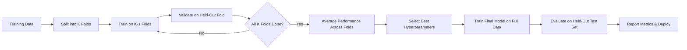

# Chapter 10: Model Selection and Evaluation

> **Previous:** [Dimensionality Reduction](../09-dimensionality-reduction.md) | **Next:** None (Last Chapter)

---

## Learning Objectives

- Define and differentiate between Bias and Variance (The Bias-Variance Tradeoff)
- Apply Cross-Validation techniques (K-fold, Leave-one-out) for robust evaluation
- Interpret various performance metrics: Accuracy, Precision, Recall, F1-Score, and ROC-AUC
- Implement Hyperparameter Tuning using Grid Search and Random Search

---

## Chapter at a Glance

| Topic | Key Insight | Practical Takeaway |
|-------|-------------|-------------------|
| Bias-Variance Tradeoff | Total error = bias² + variance + irreducible error | Simple models underfit (high bias); complex models overfit (high variance) |
| K-fold Cross-Validation | Partition data into K folds; train on K-1, validate on 1 | Use K=5 or K=10 as a default; higher K reduces bias but increases variance |
| Confusion Matrix | TP, TN, FP, FN form the foundation of all classification metrics | Always inspect the full confusion matrix, not just accuracy |
| Precision & Recall | Precision = TP/(TP+FP); Recall = TP/(TP+FN) | Precision matters when false positives are costly; Recall when false negatives are costly |
| F1-Score | Harmonic mean of Precision and Recall | Use when you need a single metric for imbalanced classification |
| ROC-AUC | Measures separability across all classification thresholds | AUC of 0.5 = random guessing; 0.8+ = good; 1.0 = perfect |
| Grid Search | Exhaustive search over a predefined hyperparameter grid | Systematic but expensive; use for small parameter spaces |
| Random Search | Randomly samples hyperparameter combinations | More efficient than Grid Search when some hyperparameters don't affect performance |

## Chapter Roadmap



---

## Theory

### The Bias-Variance Tradeoff
The performance of a machine learning model is governed by two sources of error:
1. **Bias**: Error due to overly simplistic assumptions in the learning algorithm. High bias can cause the model to miss relevant relations between features and target (Underfitting).
2. **Variance**: Error due to excessive sensitivity to small fluctuations in the training set. High variance can cause the model to model the random noise in the training data (Overfitting).
The goal of model selection is to find the "sweet spot" that minimizes the total error.

### Cross-Validation
Evaluating a model on the same data it was trained on gives a biased estimate of performance. Cross-validation solves this by partitioning the data into multiple sets.
- **K-fold Cross-Validation**: The data is split into $K$ equal-sized folds. The model is trained $K$ times, each time using $K-1$ folds for training and the remaining fold for testing. The final performance is the average of all $K$ trials.

### Performance Metrics for Classification
- **Accuracy**: $(TP+TN) / (TP+TN+FP+FN)$. Simple but misleading for imbalanced datasets.
- **Precision**: $TP / (TP+FP)$. "Of all predicted positives, how many were actually positive?"
- **Recall (Sensitivity)**: $TP / (TP+FN)$. "Of all actual positives, how many were correctly predicted?"
- **F1-Score**: Harmonic mean of Precision and Recall. $2 \cdot \frac{Precision \cdot Recall}{Precision + Recall}$.
- **ROC-AUC**: The Area Under the Receiver Operating Characteristic Curve. It measures the model's ability to distinguish between classes across all possible thresholds.

### Hyperparameter Tuning
Hyperparameters are parameters set before training (e.g., learning rate, max depth).
- **Grid Search**: Exhaustive search over a specified subset of the hyperparameter space.
- **Random Search**: Randomly samples the hyperparameter space, often reaching a good solution much faster than Grid Search.


> **One-Sentence Takeaway:** Proper model evaluation requires cross-validation, multiple performance metrics, and hyperparameter tuning to balance the bias-variance tradeoff and ensure generalization.

> **Pro Tip:** In K-fold cross-validation, stratified folds (maintaining class proportions) are essential for imbalanced datasets. Use `StratifiedKFold` instead of `KFold` when the target classes are not equally represented.

> **Remember:** Accuracy is a dangerous metric on imbalanced data. A model that predicts "no disease" for every patient in a 1% prevalence dataset achieves 99% accuracy — yet is completely useless. Always examine Precision, Recall, and the confusion matrix.

> **Warning:** Never use test data for hyperparameter tuning. If you optimize hyperparameters based on test set performance, you are leaking information from the test set into the model, invalidating your generalization estimate. Use a separate validation set or cross-validation within the training set.

---

## Examples

### Example 1: Confusion Matrix Interpretation
A medical test for a disease.
- **Data**: 100 people tested. 10 have the disease.
- **Predictions**: Model identifies 8 correctly (TP), misses 2 (FN), and incorrectly identifies 5 healthy people as having the disease (FP).
- **Recall**: $8/10 = 0.8$. (Good, we caught 80% of cases).
- **Precision**: $8/(8+5) = 0.61$. (Moderate, many false alarms).
- **Summary**: In medicine, high Recall is often prioritized over Precision.

### Example 2: K-fold Cross-Validation with Scikit-learn
```python
from sklearn.model_selection import cross_val_score
from sklearn.ensemble import RandomForestClassifier
from sklearn.datasets import load_digits

digits = load_digits()
X, y = digits.data, digits.target

clf = RandomForestClassifier(n_estimators=50)
scores = cross_val_score(clf, X, y, cv=5)

print(f"Mean Accuracy: {scores.mean():.4f}")
print(f"Standard Deviation: {scores.std():.4f}")
```
**Outcome**: Provides a reliable estimate of the model's performance on unseen data by averaging results across five different data splits.

> **One-Sentence Takeaway:** Cross-validation provides a robust estimate of model generalization, and confusion-matrix-derived metrics like Precision and Recall give a more nuanced view than accuracy alone.

---

## Concept Comparison Table

| Concept | Definition | Key Distinction | Use Case |
|---------|-----------|-----------------|----------|
| Bias | Error from overly simplistic model assumptions | High bias → underfitting; model misses patterns | Simple linear models, high regularization |
| Variance | Error from sensitivity to training data fluctuations | High variance → overfitting; model memorizes noise | Deep trees, high-degree polynomials, low regularization |
| K-fold CV | Split data into K folds, train on K-1, validate on 1 | Balances bias and variance of the performance estimate | General-purpose model evaluation |
| Leave-One-Out CV | K = N, each fold is a single sample | Low bias but high variance and computational cost | Very small datasets (N < 50) |
| Accuracy | (TP + TN) / Total | Simple but misleading for imbalanced data | Balanced classes only |
| Precision | TP / (TP + FP) | Minimizes false positives | Spam detection, fraud alerts |
| Recall | TP / (TP + FN) | Minimizes false negatives | Medical screening, threat detection |
| F1-Score | 2 × (P × R) / (P + R) | Harmonic mean balances P and R | Imbalanced classification |
| ROC-AUC | Area under TPR vs. FPR curve | Threshold-independent measure of separability | Model comparison, threshold selection |
| Grid Search | Exhaustive scan of parameter grid | Guarantees finding best within grid | Small parameter spaces (< 100 combinations) |
| Random Search | Random sampling of parameter space | More efficient for high-dimensional spaces | Large parameter spaces, expensive models |

## Quick Reference

| Concept | Formula / Detail |
|---------|-----------------|
| Accuracy | $\frac{TP + TN}{TP + TN + FP + FN}$ |
| Precision | $\frac{TP}{TP + FP}$ |
| Recall (Sensitivity) | $\frac{TP}{TP + FN}$ |
| Specificity | $\frac{TN}{TN + FP}$ |
| F1-Score | $2 \cdot \frac{P \cdot R}{P + R}$ |
| Bias-Variance Decomposition | $E[(y - \hat{f})^2] = \text{Bias}[\hat{f}]^2 + \text{Var}[\hat{f}] + \sigma^2$ |
| K-fold CV Estimate | $\frac{1}{K} \sum_{i=1}^{K} \text{Score}_i$ |
| ROC Space | x-axis: FPR (1 - Specificity); y-axis: TPR (Recall) |
| Grid Search Complexity | $O(\prod_{i=1}^{m} n_i)$ where $n_i$ = values per hyperparameter |
| Random Search Efficiency | Covers the space uniformly; finds near-optimum in ~60 random trials |

## Cross-Application Matrix

| Domain | Application | How Model Evaluation Is Applied |
|--------|-------------|---------------------------------|
| Healthcare | Disease diagnosis model | Recall prioritized to minimize missed diagnoses; ROC-AUC for overall quality |
| Finance | Credit card fraud detection | Precision prioritized to minimize false positives; cost-sensitive evaluation |
| E-commerce | Product recommendation | Accuracy measured offline; A/B testing for online evaluation |
| Autonomous Vehicles | Pedestrian detection | Extremely high Recall required; F1-score with heavy FN penalty |
| Natural Language Processing | Sentiment analysis | F1-score standard for imbalanced sentiment classes |
| Cybersecurity | Intrusion detection | Precision-Recall curve over ROC due to extreme class imbalance |
| Manufacturing | Predictive maintenance | Cross-validation with time-based splits (not random) to respect temporal order |

---

## Summary

- The bias-variance tradeoff is a central challenge in machine learning.
- Overfitting occurs when a model is too complex (high variance); underfitting occurs when it is too simple (high bias).
- K-fold cross-validation is the industry standard for estimating model generalization performance.
- Accuracy is often an insufficient metric; Precision, Recall, and F1-score provide a more nuanced view, especially in imbalanced cases.
- Systematic hyperparameter tuning is necessary to maximize the performance of a chosen algorithm.

---

## Exercises

### Review Questions
1. Draw a graph showing the training error and validation error as model complexity increases. Mark the regions of underfitting and overfitting.
2. Why is the harmonic mean used in the F1-score instead of the arithmetic mean?
3. What is the difference between a "validation set" and a "test set"?
4. In what scenario would you prioritize Precision over Recall? Provide a real-world example.

### Application Problems
1. A model has $TP=40, FP=10, FN=20, TN=30$. Calculate Precision, Recall, and F1-score.
2. You are performing 5-fold cross-validation on a dataset of 1,000 samples. How many samples are in the training set and validation set for each fold?
3. If your training error is 2% and your validation error is 15%, is your model suffering from high bias or high variance?

### Challenge Problem
1. Explain the "Receiver Operating Characteristic" (ROC) curve. What do the axes represent, and what does a 45-degree diagonal line represent in terms of model performance?

---

## Chapter Quiz

Test your understanding of Model Selection and Evaluation.

**1.** A model achieves 99% accuracy on a dataset where 99% of samples belong to Class A and 1% to Class B. What is the most likely issue?

<details><summary>**Answer**</summary>
**C)** The model likely predicts Class A for every sample, achieving 99% accuracy by exploiting the class imbalance. This is why accuracy is misleading — you must check precision, recall, and the confusion matrix.
</details>

- A) The model is overfitting
- B) The model has high bias
- C) Accuracy is misleading due to class imbalance
- D) Cross-validation was not used

**2.** In K-fold cross-validation, what is the main tradeoff when choosing the value of K?

<details><summary>**Answer**</summary>
**B)** A larger K means more training data per fold (lower bias in the estimate) but the training folds overlap more (higher variance and correlation between runs). K=5 or K=10 are commonly chosen as a balance.
</details>

- A) Larger K reduces computation time but increases bias
- B) Larger K reduces bias but increases variance of the estimate
- C) Larger K eliminates the need for a test set
- D) Larger K always produces better models

**3.** If a spam detection model produces very few false positives but misses many spam emails, which metric is the model optimizing?

<details><summary>**Answer**</summary>
**B)** Few false positives means high Precision. However, missing many actual spam emails means low Recall. The model is optimized for Precision — avoiding false alarms at the cost of letting spam through.
</details>

- A) Recall
- B) Precision
- C) ROC-AUC
- D) Accuracy
