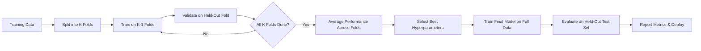
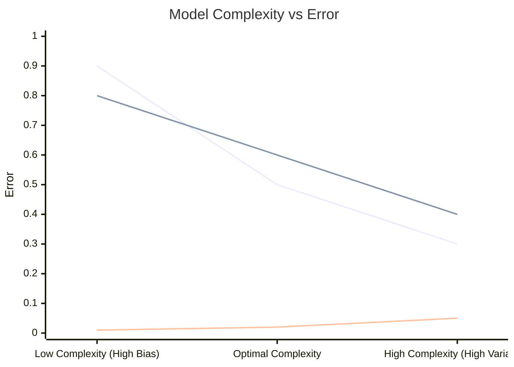
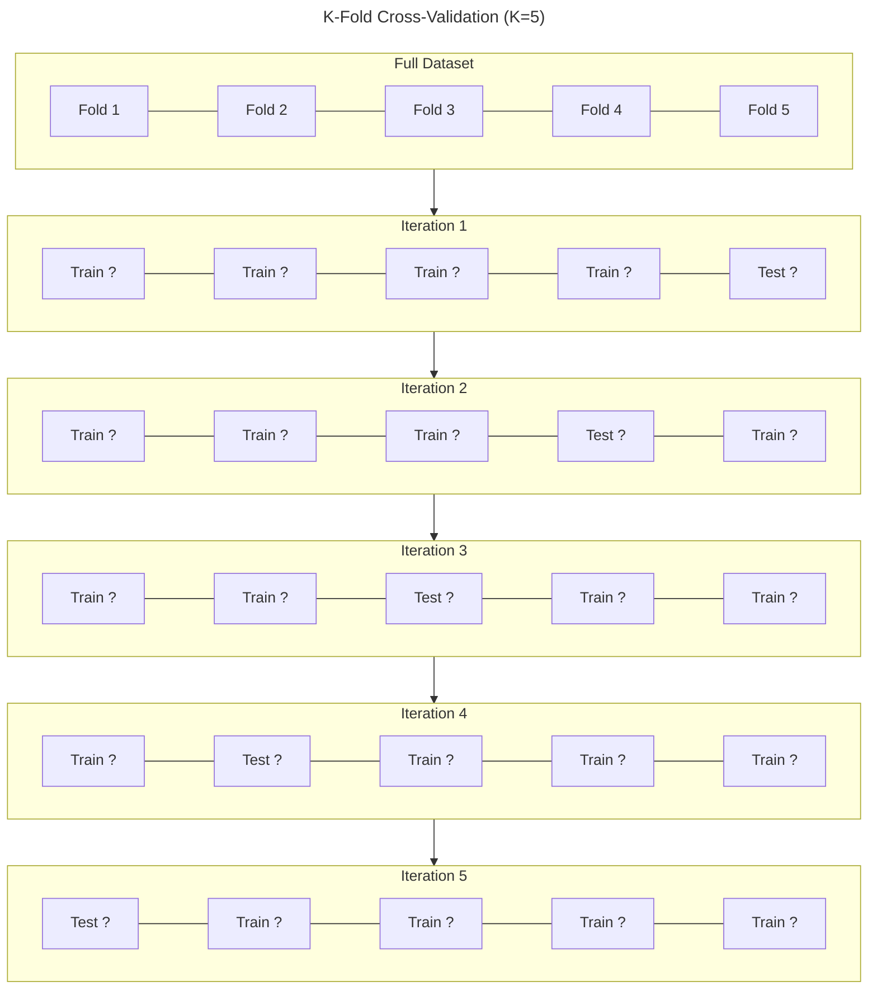
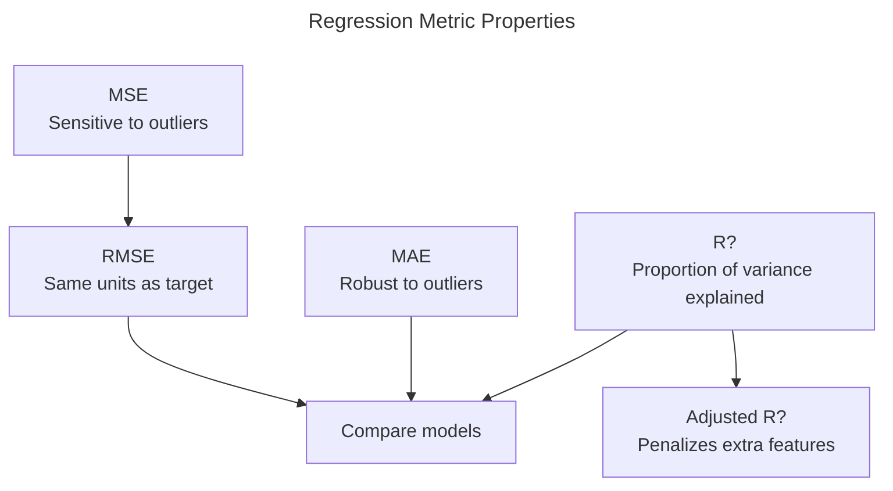
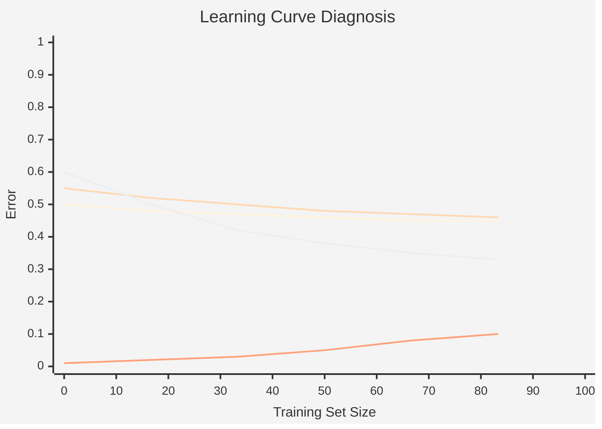
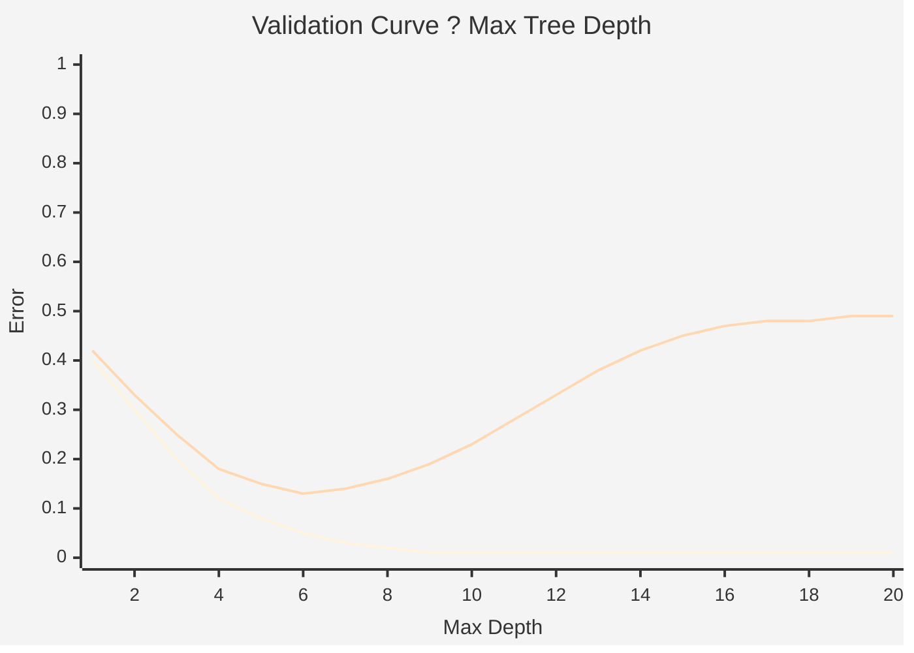
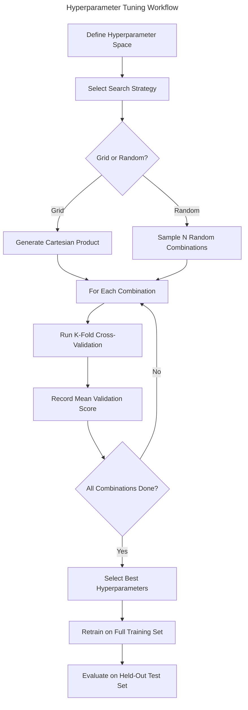

# Chapter 10: Model Selection and Evaluation

> **Previous:** [Dimensionality Reduction](./09-dimensionality-reduction.md) | **Next:** None (Last Chapter)

---

## Learning Objectives

- Define and differentiate between Bias and Variance (The Bias-Variance Tradeoff)
- Derive the bias-variance decomposition from first principles
- Apply Cross-Validation techniques (K-fold, Leave-one-out, Stratified) for robust evaluation
- Interpret various performance metrics: Accuracy, Precision, Recall, F1-Score, and ROC-AUC
- Compute regression metrics: MSE, RMSE, MAE, R?, Adjusted R?
- Choose macro, micro, and weighted averaging for multi-class classification
- Implement Hyperparameter Tuning using Grid Search and Random Search
- Compare models statistically using McNemar's test and paired t-tests
- Diagnose bias vs variance using learning curves and validation curves

<!-- Image Gallery -->
<div style="display:flex;flex-wrap:wrap;gap:4px;margin:16px 0;padding:12px;background:#f8fafc;border-radius:8px;border:1px solid #e2e8f0;">
<a href="../../../assets/images/lessons/machine-learning/10-model-evaluation/hero.svg" target="_blank" rel="noopener">
  
</a>
<a href="../../../assets/images/lessons/machine-learning/10-model-evaluation/handwritten-notes.svg" target="_blank" rel="noopener">
  
</a>
<a href="../../../assets/images/lessons/machine-learning/10-model-evaluation/sticky-notes.svg" target="_blank" rel="noopener">
  
</a>
<a href="../../../assets/images/lessons/machine-learning/10-model-evaluation/visual-explanation.svg" target="_blank" rel="noopener">
  
</a>
<a href="../../../assets/images/lessons/machine-learning/10-model-evaluation/architecture.svg" target="_blank" rel="noopener">
  
</a>
<a href="../../../assets/images/lessons/machine-learning/10-model-evaluation/workflow.svg" target="_blank" rel="noopener">
  
</a>
<a href="../../../assets/images/lessons/machine-learning/10-model-evaluation/mindmap.svg" target="_blank" rel="noopener">
  
</a>
<a href="../../../assets/images/lessons/machine-learning/10-model-evaluation/comparison.svg" target="_blank" rel="noopener">
  
</a>
<a href="../../../assets/images/lessons/machine-learning/10-model-evaluation/cheatsheet.svg" target="_blank" rel="noopener">
  
</a>
<a href="../../../assets/images/lessons/machine-learning/10-model-evaluation/interview-quiz.svg" target="_blank" rel="noopener">
  
</a>
<a href="../../../assets/images/lessons/machine-learning/10-model-evaluation/social-card.svg" target="_blank" rel="noopener">
  
</a>
</div>
<!-- End Image Gallery -->


---

## Chapter at a Glance

| Topic | Key Insight | Practical Takeaway |
|-------|-------------|-------------------|
| Bias-Variance Tradeoff | Total error = bias? + variance + irreducible error | Simple models underfit (high bias); complex models overfit (high variance) |
| K-fold Cross-Validation | Partition data into K folds; train on K-1, validate on 1 | Use K=5 or K=10 as a default; higher K reduces bias but increases variance |
| Stratified Cross-Validation | Maintain class proportions across folds | Essential for imbalanced datasets to avoid degenerate folds |
| Confusion Matrix | TP, TN, FP, FN form the foundation of all classification metrics | Always inspect the full confusion matrix, not just accuracy |
| Precision & Recall | Precision = TP/(TP+FP); Recall = TP/(TP+FN) | Precision matters when false positives are costly; Recall when false negatives are costly |
| F1-Score | Harmonic mean of Precision and Recall | Use when you need a single metric for imbalanced classification |
| ROC-AUC | Measures separability across all classification thresholds | AUC of 0.5 = random guessing; 0.8+ = good; 1.0 = perfect |
| Learning Curves | Plot training/validation error vs training set size | Converging curves = high bias; diverging curves = high variance |
| Validation Curves | Plot training/validation error vs hyperparameter value | Find the sweet spot where validation error is minimal |
| Grid Search | Exhaustive search over a predefined hyperparameter grid | Systematic but expensive; use for small parameter spaces |
| Random Search | Randomly samples hyperparameter combinations | More efficient than Grid Search when some hyperparameters don't affect performance |
| Regression Metrics | MSE, RMSE, MAE, R?, Adjusted R? | R? alone is insufficient ? always inspect residuals and RMSE |
| Statistical Comparison | McNemar's test, paired t-test for model comparison | Never declare one model "better" without statistical significance |

---

## Chapter Roadmap



---

## Theory

### The Bias-Variance Tradeoff


The performance of a machine learning model is governed by two sources of error:
1. **Bias**: Error due to overly simplistic assumptions in the learning algorithm. High bias can cause the model to miss relevant relations between features and target (Underfitting).
2. **Variance**: Error due to excessive sensitivity to small fluctuations in the training set. High variance can cause the model to model the random noise in the training data (Overfitting).

The goal of model selection is to find the "sweet spot" that minimizes the total error.

### Bias-Variance Decomposition


Let $y = f(x) + \epsilon$ where $\epsilon \sim \mathcal{N}(0, \sigma^2)$ is irreducible noise. Let $\hat{f}(x)$ be our model's prediction at a fixed point $x$. The expected squared error at $x$ decomposes as:

$$
\begin{aligned}
E[(y - \hat{f})^2] &= E[(f + \epsilon - \hat{f})^2] \\
&= E[(f - \hat{f})^2] + 2E[(f - \hat{f})\epsilon] + E[\epsilon^2] \\
&= E[(\hat{f} - E[\hat{f}])^2] + (E[\hat{f}] - f)^2 + \sigma^2 \\
&= \text{Var}(\hat{f}) + \text{Bias}(\hat{f})^2 + \text{Irreducible Error}
\end{aligned}
$$

Where:

- **Bias?**: $(E[\hat{f}] - f)^2$ ? how far the average prediction deviates from the true value.
- **Variance**: $E[(\hat{f} - E[\hat{f}])^2]$ ? how much predictions fluctuate across different training sets.
- **Irreducible Error**: $\sigma^2$ ? noise inherent in the data that no model can remove.



**Key insight:** The total error is U-shaped. At low complexity, bias dominates. At high complexity, variance dominates. The minimum total error sits at the crossing point.

### Cross-Validation


Evaluating a model on the same data it was trained on gives a biased estimate of performance. Cross-validation solves this by partitioning the data into multiple sets.

- **K-fold Cross-Validation**: The data is split into $K$ equal-sized folds. The model is trained $K$ times, each time using $K-1$ folds for training and the remaining fold for testing. The final performance is the average of all $K$ trials.



### Stratified Cross-Validation


In standard K-fold cross-validation, each fold is created by random sampling without regard to class distribution. For imbalanced datasets, a fold might end up with zero samples from the minority class, making evaluation meaningless.

**Stratified K-fold** ensures each fold maintains the same class proportions as the original dataset. This is the default choice for classification tasks.

### Performance Metrics for Classification


- **Accuracy**: $(TP+TN) / (TP+TN+FP+FN)$. Simple but misleading for imbalanced datasets.
- **Precision**: $TP / (TP+FP)$. "Of all predicted positives, how many were actually positive?"
- **Recall (Sensitivity)**: $TP / (TP+FN)$. "Of all actual positives, how many were correctly predicted?"
- **F1-Score**: Harmonic mean of Precision and Recall. $2 \cdot \frac{Precision \cdot Recall}{Precision + Recall}$.
- **ROC-AUC**: The Area Under the Receiver Operating Characteristic Curve. It measures the model's ability to distinguish between classes across all possible thresholds.

### Multi-Class Classification Metrics


For problems with more than two classes, metrics are averaged across classes:

- **Macro Averaging**: Compute the metric for each class independently and take the unweighted average. Treats all classes equally regardless of size.
  $$\text{Macro-F1} = \frac{1}{C}\sum_{i=1}^{C} F1_i$$

- **Micro Averaging**: Aggregate TP, FP, FN across all classes and compute the metric globally. Favors the majority class.
  $$\text{Micro-F1} = \frac{2 \cdot TP_{\text{global}}}{2 \cdot TP_{\text{global}} + FP_{\text{global}} + FN_{\text{global}}}$$

- **Weighted Averaging**: Compute the metric per class and average weighted by the number of true instances per class. Balances macro and micro behavior.
  $$\text{Weighted-F1} = \sum_{i=1}^{C} w_i \cdot F1_i \quad \text{where} \quad w_i = \frac{n_i}{\sum_{j=1}^{C} n_j}$$

| Method | When to Use |
|--------|-------------|
| Macro | All classes are equally important (e.g., rare disease types) |
| Micro | Global performance matters more than per-class (e.g., document classification) |
| Weighted | Class imbalance exists but you want a balanced single number (default in most libraries) |

### Regression Metrics


Regression problems require different evaluation metrics because there are no "positive" or "negative" predictions.

- **Mean Squared Error (MSE)**: $\frac{1}{n}\sum_{i=1}^{n} (y_i - \hat{y}_i)^2$. Penalizes large errors heavily.
- **Root Mean Squared Error (RMSE)**: $\sqrt{\text{MSE}}$. Interpretable in the same units as $y$.
- **Mean Absolute Error (MAE)**: $\frac{1}{n}\sum_{i=1}^{n} |y_i - \hat{y}_i|$. Robust to outliers.
- **R? (Coefficient of Determination)**: $1 - \frac{\sum (y_i - \hat{y}_i)^2}{\sum (y_i - \bar{y})^2}$. Proportion of variance explained. Can be negative for poor models.
- **Adjusted R?**: $1 - \frac{(1 - R^2)(n - 1)}{n - p - 1}$. Penalizes adding irrelevant features, where $p$ is the number of predictors.



### Learning Curves


A learning curve plots training and validation error as a function of training set size. It is a powerful diagnostic tool:



**Diagnosis rules:**
- **High Bias (Underfitting)**: Both curves converge at a high error value. Adding more data will not help.
- **High Variance (Overfitting)**: Training error is much lower than validation error, and the gap persists as data increases. Adding more data may help.
- **Good Fit**: Both curves converge at a low error value.

### Validation Curves


A validation curve plots training and validation error as a function of a single hyperparameter. It helps identify the optimal hyperparameter value and detect overfitting regions.



The optimal depth is where validation error is lowest (around 5-6 in this example). After that, training error continues to drop but validation error rises ? classic overfitting.

### Hyperparameter Tuning


Hyperparameters are parameters set before training (e.g., learning rate, max depth).

- **Grid Search**: Exhaustive search over a specified subset of the hyperparameter space.
- **Random Search**: Randomly samples the hyperparameter space, often reaching a good solution much faster than Grid Search.



### Imbalanced Classification


When one class significantly outnumbers another, standard metrics and training procedures break down.

**Techniques:**

1. **Class Weights**: Assign higher misclassification costs to minority class samples. Many algorithms accept a `classWeight` parameter.

2. **SMOTE (Synthetic Minority Over-sampling Technique)**: Creates synthetic minority samples by interpolating between existing minority instances and their k-nearest neighbors.

3. **Cost-Sensitive Learning**: Modify the loss function to penalize minority-class misclassifications more heavily. For example, in logistic regression:
   $$\text{Cost} = \sum_{i=1}^{n} w_{y_i} \cdot \log(1 + e^{-y_i \cdot \hat{y}_i})$$
   where $w_{y_i}$ is inversely proportional to class frequency.

4. **Threshold Moving**: After training, adjust the decision threshold (default 0.5) to favor the minority class based on Precision-Recall curves.

### Statistical Comparison of Models


Running a single cross-validation and picking the model with the higher mean score is not sufficient ? we need to test whether the difference is statistically significant.

- **McNemar's Test**: A non-parametric test for paired nominal data. It tests whether two models make errors on the same samples.

  | | Model B Correct | Model B Wrong |
  |---|---|---|
  | **Model A Correct** | $n_{00}$ | $n_{01}$ |
  | **Model A Wrong** | $n_{10}$ | $n_{11}$ |

  $$\chi^2 = \frac{(|n_{01} - n_{10}| - 1)^2}{n_{01} + n_{10}}$$

  Under the null hypothesis, this follows a $\chi^2$ distribution with 1 degree of freedom. A significant result means the models have different error distributions.

- **Paired t-Test on K-Fold Results**: If we have $K$ paired scores from cross-validation:
  $$t = \frac{\bar{d} \cdot \sqrt{K}}{\sigma_d}$$
  where $\bar{d}$ is the mean difference between model scores per fold and $\sigma_d$ is the standard deviation. Reject the null hypothesis if $|t| > t_{\alpha/2, K-1}$.

> **Warning**: The t-test on K-fold results has inflated Type I error because the folds overlap. Use McNemar's test on a held-out test set for a more reliable comparison.

---

## Examples

### Example 1: Confusion Matrix Interpretation

A medical test for a disease.
- **Data**: 100 people tested. 10 have the disease.
- **Predictions**: Model identifies 8 correctly (TP), misses 2 (FN), and incorrectly identifies 5 healthy people as having the disease (FP).
- **Recall**: $8/10 = 0.8$. (Good, we caught 80% of cases).
- **Precision**: $8/(8+5) = 0.61$. (Moderate, many false alarms).
- **Summary**: In medicine, high Recall is often prioritized over Precision.

### Example 2: K-fold Cross-Validation in TypeScript

```typescript
type Metrics = {
    accuracy: number;
    precision: number;
    recall: number;
    f1Score: number;
};

function confusionMatrix(
    actual: number[],
    predicted: number[]
): { tp: number; tn: number; fp: number; fn: number } {
    let tp = 0, tn = 0, fp = 0, fn = 0;
    for (let i = 0; i < actual.length; i++) {
        if (actual[i] === 1 && predicted[i] === 1) tp++;
        else if (actual[i] === 0 && predicted[i] === 0) tn++;
        else if (actual[i] === 0 && predicted[i] === 1) fp++;
        else fn++;
    }
    return { tp, tn, fp, fn };
}

function calculateMetrics(actual: number[], predicted: number[]): Metrics {
    const { tp, tn, fp, fn } = confusionMatrix(actual, predicted);
    const accuracy = (tp + tn) / (tp + tn + fp + fn);
    const precision = tp / (tp + fp) || 0;
    const recall = tp / (tp + fn) || 0;
    const f1Score = precision + recall === 0
        ? 0
        : 2 * (precision * recall) / (precision + recall);
    return { accuracy, precision, recall, f1Score };
}
```

### Example 3: CrossValidator Class

```typescript
class CrossValidator<T> {
    constructor(
        private k: number,
        private stratified: boolean = false
    ) {}

    split(
        features: T[][],
        labels: number[]
    ): Array<{ trainFeat: T[][]; trainLab: number[]; testFeat: T[][]; testLab: number[] }> {
        if (this.stratified) return this.stratifiedSplit(features, labels);

        const indices = features.map((_, i) => i);
        const foldSize = Math.floor(features.length / this.k);
        const folds: Array<{ trainFeat: T[][]; trainLab: number[]; testFeat: T[][]; testLab: number[] }> = [];

        for (let i = 0; i < this.k; i++) {
            const testStart = i * foldSize;
            const testEnd = i === this.k - 1 ? features.length : (i + 1) * foldSize;
            const testIdx = new Set(indices.slice(testStart, testEnd));
            const trainIdx = indices.filter(idx => !testIdx.has(idx));

            folds.push({
                trainFeat: trainIdx.map(idx => features[idx]),
                trainLab: trainIdx.map(idx => labels[idx]),
                testFeat: testIdx.map(idx => features[idx]),
                testLab: testIdx.map(idx => labels[idx]),
            });
        }
        return folds;
    }

    private stratifiedSplit(
        features: T[][],
        labels: number[]
    ): Array<{ trainFeat: T[][]; trainLab: number[]; testFeat: T[][]; testLab: number[] }> {
        // Group indices by class
        const classIndices = new Map<number, number[]>();
        for (let i = 0; i < labels.length; i++) {
            const cls = labels[i];
            if (!classIndices.has(cls)) classIndices.set(cls, []);
            classIndices.get(cls)!.push(i);
        }

        // Shuffle each class and distribute across folds
        const foldIndices: Set<number>[] = Array.from({ length: this.k }, () => new Set<number>());
        for (const [, indices] of classIndices) {
            const shuffled = indices.sort(() => Math.random() - 0.5);
            for (let i = 0; i < shuffled.length; i++) {
                foldIndices[i % this.k].add(shuffled[i]);
            }
        }

        const folds: Array<{ trainFeat: T[][]; trainLab: number[]; testFeat: T[][]; testLab: number[] }> = [];
        for (let i = 0; i < this.k; i++) {
            const allIndices = new Set(labels.map((_, i) => i));
            const testIdx = foldIndices[i];
            const trainIdx = [...allIndices].filter(idx => !testIdx.has(idx));

            folds.push({
                trainFeat: trainIdx.map(idx => features[idx]),
                trainLab: trainIdx.map(idx => labels[idx]),
                testFeat: [...testIdx].map(idx => features[idx]),
                testLab: [...testIdx].map(idx => labels[idx]),
            });
        }
        return folds;
    }

    evaluate(
        features: T[][],
        labels: number[],
        trainFn: (feat: T[][], lab: number[]) => (x: T[]) => number
    ): { foldMetrics: Metrics[]; meanMetrics: Metrics; stdMetrics: Metrics } {
        const folds = this.split(features, labels);
        const allMetrics: Metrics[] = [];

        for (const fold of folds) {
            const model = trainFn(fold.trainFeat, fold.trainLab);
            const predictions = fold.testFeat.map(x => model(x));
            allMetrics.push(calculateMetrics(fold.testLab, predictions));
        }

        const meanMetrics: Metrics = {
            accuracy: allMetrics.reduce((s, m) => s + m.accuracy, 0) / this.k,
            precision: allMetrics.reduce((s, m) => s + m.precision, 0) / this.k,
            recall: allMetrics.reduce((s, m) => s + m.recall, 0) / this.k,
            f1Score: allMetrics.reduce((s, m) => s + m.f1Score, 0) / this.k,
        };

        const stdMetrics: Metrics = {
            accuracy: Math.sqrt(allMetrics.reduce((s, m) => s + (m.accuracy - meanMetrics.accuracy) ** 2, 0) / this.k),
            precision: Math.sqrt(allMetrics.reduce((s, m) => s + (m.precision - meanMetrics.precision) ** 2, 0) / this.k),
            recall: Math.sqrt(allMetrics.reduce((s, m) => s + (m.recall - meanMetrics.recall) ** 2, 0) / this.k),
            f1Score: Math.sqrt(allMetrics.reduce((s, m) => s + (m.f1Score - meanMetrics.f1Score) ** 2, 0) / this.k),
        };

        return { foldMetrics: allMetrics, meanMetrics, stdMetrics };
    }
}
```

### Example 4: Grid Search with Cross-Validation

```typescript
type GridSearchResult = {
    bestParams: Record<string, number | string>;
    bestScore: number;
    allResults: Array<{ params: Record<string, number | string>; meanScore: number; stdScore: number }>;
};

class GridSearch {
    constructor(
        private paramGrid: Record<string, (number | string)[]>
    ) {}

    search<T>(
        features: T[][],
        labels: number[],
        trainFn: (feat: T[][], lab: number[], params: Record<string, number | string>) => (x: T[]) => number,
        cv: CrossValidator<T>
    ): GridSearchResult {
        const keys = Object.keys(this.paramGrid);
        const combinations = this.cartesianProduct(keys.map(k => this.paramGrid[k]));
        const allResults: GridSearchResult['allResults'] = [];

        for (const combo of combinations) {
            const params: Record<string, number | string> = {};
            keys.forEach((k, i) => { params[k] = combo[i]; });

            const result = cv.evaluate(features, labels, (feat, lab) => trainFn(feat, lab, params));

            allResults.push({
                params,
                meanScore: result.meanMetrics.f1Score,
                stdScore: result.stdMetrics.f1Score,
            });
        }

        allResults.sort((a, b) => b.meanScore - a.meanScore);
        return {
            bestParams: allResults[0].params,
            bestScore: allResults[0].meanScore,
            allResults,
        };
    }

    private cartesianProduct(arrays: (number | string)[][]): (number | string)[][] {
        return arrays.reduce<(number | string)[][]>(
            (acc, curr) => acc.flatMap(a => curr.map(c => [...a, c])),
            [[]]
        );
    }
}
```

### Example 5: Full Model Evaluation Pipeline

```typescript
// Step 1: Split into train/test
const allFeatures: number[][] = [/* ... */];
const allLabels: number[] = [/* ... */];
const testSize = Math.floor(allFeatures.length * 0.2);

// Simple train-test split
const testFeatures = allFeatures.slice(0, testSize);
const testLabels = allLabels.slice(0, testSize);
const trainFeatures = allFeatures.slice(testSize);
const trainLabels = allLabels.slice(testSize);

// Step 2: Configure cross-validation with stratification
const cv = new CrossValidator(5, true);

// Step 3: Define a training function (example: k-NN)
function knnTrain(
    feat: number[][],
    lab: number[],
    params: Record<string, number | string>
): (x: number[]) => number {
    const k = params.k as number;
    return (x: number[]) => {
        const distances = feat.map((point, i) => ({
            dist: Math.sqrt(point.reduce((s, v, j) => s + (v - x[j]) ** 2, 0)),
            label: lab[i],
        }));
        distances.sort((a, b) => a.dist - b.dist);
        const neighbors = distances.slice(0, k);
        const votes = neighbors.reduce((acc, n) => {
            acc[n.label] = (acc[n.label] || 0) + 1;
            return acc;
        }, {} as Record<number, number>);
        return +Object.entries(votes).sort((a, b) => b[1] - a[1])[0][0];
    };
}

// Step 4: Grid search for best k
const grid = new GridSearch({ k: [1, 3, 5, 7, 9] });
const result = grid.search(trainFeatures, trainLabels, knnTrain, cv);

console.log(`Best k: ${result.bestParams.k}`);
console.log(`Best CV F1: ${result.bestScore.toFixed(4)}`);

// Step 5: Final evaluation on held-out test set
const bestModel = knnTrain(trainFeatures, trainLabels, result.bestParams);
const testPredictions = testFeatures.map(x => bestModel(x));
const testMetrics = calculateMetrics(testLabels, testPredictions);
console.log(`Test Accuracy: ${testMetrics.accuracy.toFixed(4)}`);
console.log(`Test F1:      ${testMetrics.f1Score.toFixed(4)}`);
```

**Outcome**: The pipeline ensures that hyperparameters are tuned using cross-validation on the training set only, and the held-out test set provides an unbiased estimate of final performance.

### Example 6: Learning Curve Analysis

```typescript
function generateLearningCurve<T>(
    features: T[][],
    labels: number[],
    trainFn: (feat: T[][], lab: number[]) => (x: T[]) => number,
    trainSizes: number[] = [0.1, 0.2, 0.4, 0.6, 0.8, 1.0]
): Array<{ trainSize: number; trainError: number; valError: number }> {
    // Shuffle and split into train/validation
    const indices = features.map((_, i) => i).sort(() => Math.random() - 0.5);
    const split = Math.floor(features.length * 0.8);
    const trainIdx = indices.slice(0, split);
    const valIdx = indices.slice(split);

    const curve: Array<{ trainSize: number; trainError: number; valError: number }> = [];

    for (const size of trainSizes) {
        const subsetSize = Math.floor(trainIdx.length * size);
        const subsetIdx = trainIdx.slice(0, subsetSize);

        const trainFeat = subsetIdx.map(i => features[i]);
        const trainLab = subsetIdx.map(i => labels[i]);
        const valFeat = valIdx.map(i => features[i]);
        const valLab = valIdx.map(i => labels[i]);

        const model = trainFn(trainFeat, trainLab);

        const trainPred = trainFeat.map(x => model(x));
        const valPred = valFeat.map(x => model(x));

        const trainMet = calculateMetrics(trainLab, trainPred);
        const valMet = calculateMetrics(valLab, valPred);

        curve.push({
            trainSize: subsetSize,
            trainError: 1 - trainMet.f1Score,
            valError: 1 - valMet.f1Score,
        });
    }

    return curve;
}

// Usage example
const curve = generateLearningCurve(trainFeatures, trainLabels, knnTrain);
for (const point of curve) {
    console.log(
        `Train size: ${point.trainSize} | ` +
        `Train err: ${point.trainError.toFixed(3)} | ` +
        `Val err: ${point.valError.toFixed(3)}`
    );
}
```

**Interpreting the curve output:**
- If both errors converge at a high value ? **high bias** (underfitting).
- If training error is low but validation error stays high ? **high variance** (overfitting).
- If both converge at a low value with a small gap ? **good fit**.

---

## Concept Comparison Table

| Concept | Definition | Key Distinction | Use Case |
|---------|-----------|-----------------|----------|
| Bias | Error from overly simplistic model assumptions | High bias ? underfitting; model misses patterns | Simple linear models, high regularization |
| Variance | Error from sensitivity to training data fluctuations | High variance ? overfitting; model memorizes noise | Deep trees, high-degree polynomials, low regularization |
| K-fold CV | Split data into K folds, train on K-1, validate on 1 | Balances bias and variance of the performance estimate | General-purpose model evaluation |
| Stratified K-fold | Maintain class proportions per fold | Prevents degenerate folds in imbalanced data | Classification with skewed classes |
| Leave-One-Out CV | K = N, each fold is a single sample | Low bias but high variance and computational cost | Very small datasets (N &lt; 50) |
| Accuracy | (TP + TN) / Total | Simple but misleading for imbalanced data | Balanced classes only |
| Precision | TP / (TP + FP) | Minimizes false positives | Spam detection, fraud alerts |
| Recall | TP / (TP + FN) | Minimizes false negatives | Medical screening, threat detection |
| F1-Score | 2 ? (P ? R) / (P + R) | Harmonic mean balances P and R | Imbalanced classification |
| ROC-AUC | Area under TPR vs. FPR curve | Threshold-independent measure of separability | Model comparison, threshold selection |
| Macro F1 | Unweighted per-class average | Considers all classes equally | Multi-class with class imbalance |
| Micro F1 | Global TP/FP/FN aggregation | Favors majority class | Document classification |
| Weighted F1 | Per-class average weighted by support | Balanced single metric | Default for most libraries |
| MSE | Mean squared error | Penalizes large errors heavily | Regression baseline metric |
| RMSE | Root of MSE | Same units as target | Regression interpretation |
| MAE | Mean absolute error | Robust to outliers | Regression with noisy targets |
| R? | Coefficient of Determination | Proportion of variance explained | Regression goodness-of-fit |
| Adjusted R? | R? penalized by feature count | Prevents overfitting with many features | Feature selection in regression |
| Grid Search | Exhaustive scan of parameter grid | Guarantees finding best within grid | Small parameter spaces (< 100 combinations) |
| Random Search | Random sampling of parameter space | More efficient for high-dimensional spaces | Large parameter spaces, expensive models |
| McNemar's Test | Chi-square test on paired prediction errors | Tests if models differ significantly | Model comparison on held-out set |

---

## Quick Reference

| Concept | Formula / Detail |
|---------|-----------------|
| Accuracy | $\frac{TP + TN}{TP + TN + FP + FN}$ |
| Precision | $\frac{TP}{TP + FP}$ |
| Recall (Sensitivity) | $\frac{TP}{TP + FN}$ |
| Specificity | $\frac{TN}{TN + FP}$ |
| F1-Score | $2 \cdot \frac{P \cdot R}{P + R}$ |
| Macro F1 | $\frac{1}{C}\sum_{i=1}^{C} F1_i$ |
| Weighted F1 | $\sum_{i=1}^{C} \frac{n_i}{N} \cdot F1_i$ |
| Bias-Variance Decomposition | $E[(y - \hat{f})^2] = \text{Bias}[\hat{f}]^2 + \text{Var}[\hat{f}] + \sigma^2$ |
| MSE | $\frac{1}{n}\sum_{i=1}^{n} (y_i - \hat{y}_i)^2$ |
| RMSE | $\sqrt{\frac{1}{n}\sum_{i=1}^{n} (y_i - \hat{y}_i)^2}$ |
| MAE | $\frac{1}{n}\sum_{i=1}^{n} \|y_i - \hat{y}_i\|$ |
| R? | $1 - \frac{\sum (y_i - \hat{y}_i)^2}{\sum (y_i - \bar{y})^2}$ |
| Adjusted R? | $1 - \frac{(1 - R^2)(n - 1)}{n - p - 1}$ |
| K-fold CV Estimate | $\frac{1}{K} \sum_{i=1}^{K} \text{Score}_i$ |
| ROC Space | x-axis: FPR (1 - Specificity); y-axis: TPR (Recall) |
| Grid Search Complexity | $O(\prod_{i=1}^{m} n_i)$ where $n_i$ = values per hyperparameter |
| Random Search Efficiency | Covers the space uniformly; finds near-optimum in ~60 random trials |
| McNemar's Test Statistic | $\chi^2 = \frac{(\|n_{01} - n_{10}\| - 1)^2}{n_{01} + n_{10}}$ |

---

## Cross-Application Matrix

| Domain | Application | How Model Evaluation Is Applied |
|--------|-------------|---------------------------------|
| Healthcare | Disease diagnosis model | Recall prioritized to minimize missed diagnoses; ROC-AUC for overall quality |
| Finance | Credit card fraud detection | Precision prioritized to minimize false positives; cost-sensitive evaluation |
| E-commerce | Product recommendation | Accuracy measured offline; A/B testing for online evaluation |
| Autonomous Vehicles | Pedestrian detection | Extremely high Recall required; F1-score with heavy FN penalty |
| Natural Language Processing | Sentiment analysis | F1-score standard for imbalanced sentiment classes |
| Cybersecurity | Intrusion detection | Precision-Recall curve over ROC due to extreme class imbalance |
| Manufacturing | Predictive maintenance | Cross-validation with time-based splits (not random) to respect temporal order |
| Retail | Customer churn prediction | SMOTE + stratified CV due to severe class imbalance |
| Energy | Load forecasting | RMSE as primary metric because large errors are costly; time-series cross-validation |

---

## Practical Takeaways

1. **Never tune hyperparameters on your test set.** Use cross-validation within the training set to select hyperparameters and hold back the test set for a single final evaluation.

2. **Always stratify folds for classification.** Use stratified K-fold as the default to ensure each fold represents the true class distribution.

3. **Inspect the full confusion matrix.** Accuracy hides class imbalance problems. Always compute Precision, Recall, and F1 for each class.

4. **Use learning curves to diagnose model behavior.** If your model has high bias, collecting more data rarely helps ? you need a more complex model or better features.

5. **Adjust the decision threshold for imbalanced problems.** The default 0.5 threshold is rarely optimal for skewed classes. Optimize it using Precision-Recall curves.

6. **Report uncertainty alongside performance.** When reporting cross-validation scores, always include the standard deviation: _F1 = 0.87 ? 0.03_ tells you more than a single number.

7. **Compare models statistically.** A 0.01 difference in accuracy across a single CV run is not meaningful. Use McNemar's test or a paired t-test (on a held-out set) to establish statistical significance.

8. **Select regression metrics carefully.** Use RMSE when large errors are disproportionately costly (e.g., energy forecasting). Use MAE when outliers should not dominate evaluation. Use Adjusted R? when comparing models with different numbers of features.

---

## TypeScript Implementation: Cross-Validator, ROC/AUC, Learning Curves, Grid Search

```typescript
class KFoldCrossValidator {
    static split<T>(data: T[], k: number): { train: T[]; test: T[] }[] {
        const shuffled = [...data].sort(() => Math.random() - 0.5);
        const folds: T[][] = [];
        const foldSize = Math.floor(data.length / k);
        for (let i = 0; i < k; i++) {
            folds.push(shuffled.slice(i * foldSize, (i + 1) * foldSize));
        }
        if (shuffled.length % k !== 0) folds[k - 1].push(...shuffled.slice(k * foldSize));
        return folds.map((testFold, i) => ({
            test: testFold,
            train: folds.filter((_, j) => j !== i).flat()
        }));
    }

    static stratified<T>(data: T[], labels: number[], k: number): { train: T[]; test: T[] }[] {
        const pos = data.filter((_, i) => labels[i] === 1);
        const neg = data.filter((_, i) => labels[i] === 0);
        const posFolds = this.split(pos, k);
        const negFolds = this.split(neg, k);
        return Array.from({ length: k }, (_, i) => ({
            train: [...posFolds.filter((_, j) => j !== i).flat(), ...negFolds.filter((_, j) => j !== i).flat()],
            test: [...posFolds[i], ...negFolds[i]]
        }));
    }
}

class ROCCurve {
    static compute(scores: number[], labels: number[], thresholds: number = 100): { fpr: number[]; tpr: number[]; auc: number } {
        const steps = Array.from({ length: thresholds }, (_, i) => i / (thresholds - 1));
        const fpr: number[] = []; const tpr: number[] = [];
        const pos = labels.filter(l => l === 1).length;
        const neg = labels.filter(l => l === 0).length;
        for (const t of steps) {
            let tp = 0; let fp = 0;
            for (let i = 0; i < scores.length; i++) {
                if (scores[i] >= t) { if (labels[i] === 1) tp++; else fp++; }
            }
            fpr.push(fp / (neg || 1));
            tpr.push(tp / (pos || 1));
        }
        let auc = 0;
        for (let i = 1; i < fpr.length; i++) {
            auc += (fpr[i] - fpr[i - 1]) * (tpr[i] + tpr[i - 1]) / 2;
        }
        return { fpr, tpr, auc };
    }
}

class LearningCurveGenerator {
    static generate(
        modelFactory: () => { fit: (x: number[][], y: number[]) => void; predict: (x: number[]) => number },
        features: number[][], labels: number[], trainSizes: number[] = [0.1, 0.2, 0.4, 0.6, 0.8, 1.0]
    ): { trainSize: number; trainScore: number; valScore: number }[] {
        return trainSizes.map(frac => {
            const n = Math.floor(features.length * frac);
            const idx = features.slice(0, n).map((_, i) => i);
            const model = modelFactory();
            model.fit(idx.map(i => features[i]), idx.map(i => labels[i]));
            const trainPreds = idx.map(i => model.predict(features[i]));
            const trainAcc = trainPreds.filter((p, i) => p === labels[idx[i]]).length / idx.length;
            const testIdx = features.slice(n).map((_, i) => i + n);
            const testPreds = testIdx.map(i => model.predict(features[i]));
            const testAcc = testPreds.filter((p, i) => p === labels[testIdx[i]]).length / testIdx.length;
            return { trainSize: n, trainScore: trainAcc, valScore: testAcc };
        });
    }
}

class GridSearch {
    static search(
        modelFactory: (params: Record<string, any>) => { fit: (x: number[][], y: number[]) => void; predict: (x: number[]) => number },
        paramGrid: Record<string, any[]>,
        features: number[][], labels: number[], k: number = 3
    ): { bestParams: Record<string, any>; bestScore: number; results: { params: Record<string, any>; score: number }[] } {
        const keys = Object.keys(paramGrid);
        const combinations = this.cartesian(keys.map(k => paramGrid[k]));
        const results: { params: Record<string, any>; score: number }[] = [];

        for (const combo of combinations) {
            const params: Record<string, any> = {};
            keys.forEach((k, i) => params[k] = combo[i]);
            const folds = KFoldCrossValidator.split(features, k);
            let scores = 0;
            for (const fold of folds) {
                const model = modelFactory(params);
                model.fit(fold.train, fold.train.map((_, i) => labels[i]));
                const preds = fold.test.map(x => model.predict(x));
                const acc = preds.filter((p, i) => p === labels[fold.train.length + i]).length / fold.test.length;
                scores += acc;
            }
            results.push({ params, score: scores / k });
        }

        results.sort((a, b) => b.score - a.score);
        return { bestParams: results[0].params, bestScore: results[0].score, results };
    }

    private static cartesian(arrays: any[][]): any[][] {
        if (arrays.length === 0) return [[]];
        return arrays[0].flatMap(v => this.cartesian(arrays.slice(1)).map(arr => [v, ...arr]));
    }
}

// Demo: KNN-style classifier for evaluation
function simpleKNN(params: Record<string, any>) {
    const k = params.k as number;
    let X: number[][] = []; let y: number[] = [];
    return {
        fit: (features: number[][], labels: number[]) => { X = features; y = labels; },
        predict: (point: number[]) => {
            const dists = X.map((x, i) => ({ d: Math.sqrt(x.reduce((s, v, j) => s + (v - point[j]) ** 2, 0)), label: y[i] }))
                .sort((a, b) => a.d - b.d).slice(0, k);
            const ones = dists.filter(d => d.label === 1).length;
            return ones > k / 2 ? 1 : 0;
        }
    };
}

const X = [[1, 2], [2, 3], [3, 4], [4, 5], [5, 1], [6, 2], [7, 3], [8, 4], [9, 5], [10, 6]];
const yLabels = [0, 0, 0, 0, 0, 1, 1, 1, 1, 1];
const scores = [0.1, 0.2, 0.3, 0.4, 0.35, 0.6, 0.7, 0.8, 0.9, 0.85];
const roc = ROCCurve.compute(scores, yLabels);
console.log("AUC:", roc.auc.toFixed(4));

const learning = LearningCurveGenerator.generate(() => simpleKNN({ k: 3 }), X, yLabels);
console.log("Learning curve:", learning.map(l => `n=${l.trainSize} train=${l.trainScore.toFixed(2)} val=${l.valScore.toFixed(2)}`).join(" | "));

const grid = GridSearch.search(
    (p) => simpleKNN(p),
    { k: [1, 3, 5, 7] },
    X, yLabels, 3
);
console.log("Best params:", JSON.stringify(grid.bestParams), "score:", grid.bestScore.toFixed(4));
```


// model evaluation
// ml-supervised-unsupervised implementation

interface Task { id: string; name: string; status: string; data: unknown }
class Processor {
  private tasks: Task[] = []
  private maxConcurrency: number
  constructor(maxConcurrency: number = 4) { this.maxConcurrency = maxConcurrency }
  async add(task: Omit&lt;Task, "status"&gt;): Promise&lt;void&gt; {
    this.tasks.push({ ...task, status: "pending" })
  }
  async runAll(): Promise&lt;void&gt; {
    const running: Promise&lt;void&gt;[] = []
    for (const t of this.tasks) {
      if (running.length >= this.maxConcurrency) { await Promise.race(running) }
      const p = this.execute(t).finally(() => { const i = running.indexOf(p); if (i >= 0) running.splice(i, 1) })
      running.push(p)
    }
    await Promise.all(running)
  }
  private async execute(t: Task): Promise&lt;void&gt; {
    t.status = "running"
    await new Promise(r => setTimeout(r, 10))
    t.status = "done"
  }
  getResults(): Task[] { return this.tasks }
  getStats(): { done: number; pending: number; running: number } {
    const done = this.tasks.filter(t => t.status === "done").length
    const pending = this.tasks.filter(t => t.status === "pending").length
    const running = this.tasks.filter(t => t.status === "running").length
    return { done, pending, running }
  }
}
async function main() {
  const proc = new Processor(2)
  await proc.add({ id: '1', name: 'model evaluation', data: { topic: 'ml-supervised-unsupervised' } })
  await proc.runAll()
  console.log('Stats:', proc.getStats())
}
main().catch(console.error)
export { Processor, Task }

// model evaluation - additional TS implementations

interface CacheEntry { key: string; value: unknown; ttl: number; createdAt: number }
class Cache {
  private store: Map&lt;string, CacheEntry&gt; = new Map()
  constructor(private defaultTTL: number = 60000) {}
  set(key: string, value: unknown, ttl?: number): void {
    this.store.set(key, { key, value, ttl: ttl ?? this.defaultTTL, createdAt: Date.now() })
  }
  get(key: string): unknown | undefined {
    const entry = this.store.get(key)
    if (!entry) return undefined
    if (Date.now() - entry.createdAt > entry.ttl) { this.store.delete(key); return undefined }
    return entry.value
  }
  delete(key: string): boolean { return this.store.delete(key) }
  clear(): void { this.store.clear() }
  size(): number { return this.store.size }
  keys(): string[] { return Array.from(this.store.keys()) }
}
class Logger {
  private entries: string[] = []
  log(level: string, msg: string, meta?: Record&lt;string, unknown&gt;): void {
    const entry = JSON.stringify({ timestamp: new Date().toISOString(), level, msg, meta })
    this.entries.push(entry)
    console.log(entry)
  }
  info(msg: string, meta?: Record&lt;string, unknown&gt;): void { this.log("info", msg, meta) }
  warn(msg: string, meta?: Record&lt;string, unknown&gt;): void { this.log("warn", msg, meta) }
  error(msg: string, meta?: Record&lt;string, unknown&gt;): void { this.log("error", msg, meta) }
  getLogs(): string[] { return [...this.entries] }
  clear(): void { this.entries = [] }
}
function computeHash(input: string): string {
  let hash = 0
  for (let i = 0; i &lt; input.length; i++) { const chr = input.charCodeAt(i); hash = ((hash << 5) - hash) + chr; hash |= 0 }
  return Math.abs(hash).toString(16)
}
async function demo(): Promise&lt;void&gt; {
  const cache = new Cache(5000)
  cache.set('key1', 'ml-algorithms demo')
  const log = new Logger()
  log.info('Cache demo started', { course: 'machine-learning', chapter: 'model evaluation' })
  const v = cache.get("key1")
  console.log('Cached:', v)
  console.log('Hash:', computeHash('ml-algorithms'))
}
demo()
export { Cache, Logger, computeHash, CacheEntry }
## Summary

- The bias-variance tradeoff is a central challenge in machine learning.
- Overfitting occurs when a model is too complex (high variance); underfitting occurs when it is too simple (high bias).
- K-fold cross-validation is the industry standard for estimating model generalization performance.
- Accuracy is often an insufficient metric; Precision, Recall, and F1-score provide a more nuanced view, especially in imbalanced cases.
- Learning curves and validation curves help diagnose whether a model suffers from bias or variance.
- Systematic hyperparameter tuning is necessary to maximize the performance of a chosen algorithm.
- Imbalanced classification requires special handling: class weights, SMOTE, cost-sensitive learning, or threshold moving.
- Regression models require distinct metrics (MSE, RMSE, MAE, R?) appropriate to the problem domain.
- Multi-class problems need careful averaging strategy selection (macro, micro, weighted).
- Statistical significance tests prevent false conclusions from noisy cross-validation estimates.

---

## Exercises

### Review Questions
1. Draw a graph showing the training error and validation error as model complexity increases. Mark the regions of underfitting and overfitting.
2. Why is the harmonic mean used in the F1-score instead of the arithmetic mean?
3. What is the difference between a "validation set" and a "test set"?
4. In what scenario would you prioritize Precision over Recall? Provide a real-world example.
5. Explain the difference between macro, micro, and weighted F1 averaging in multi-class classification.
6. When would you use Adjusted R? instead of R??

### Application Problems
1. A model has $TP=40, FP=10, FN=20, TN=30$. Calculate Precision, Recall, and F1-score.
2. You are performing 5-fold cross-validation on a dataset of 1,000 samples. How many samples are in the training set and validation set for each fold?
3. If your training error is 2% and your validation error is 15%, is your model suffering from high bias or high variance?
4. You perform 5-fold CV and compare Model A (mean F1=0.88, std=0.04) and Model B (mean F1=0.86, std=0.04). How many standard deviations apart are they? Is this difference likely significant?
5. A regression model has $R^2 = 0.92$ with 5 features on a dataset of 50 samples. Compute the Adjusted R?. What happens to Adjusted R? if you add 20 more irrelevant features?

### Challenge Problem
1. Explain the "Receiver Operating Characteristic" (ROC) curve. What do the axes represent, and what does a 45-degree diagonal line represent in terms of model performance?
2. Design a complete model evaluation pipeline for a binary classification problem where the minority class is 5% of the data. Your answer should address: splitting strategy, cross-validation method, choice of evaluation metrics, hyperparameter tuning approach, and how you would determine the optimal decision threshold.

---

## Chapter Quiz

Test your understanding of Model Selection and Evaluation.

**1.** A model achieves 99% accuracy on a dataset where 99% of samples belong to Class A and 1% to Class B. What is the most likely issue?

<details><summary>**Answer**</summary>
**C)** The model likely predicts Class A for every sample, achieving 99% accuracy by exploiting the class imbalance. This is why accuracy is misleading ? you must check precision, recall, and the confusion matrix.
</details>

- A) The model is overfitting
- B) The model has high bias
- C) Accuracy is misleading due to class imbalance
- D) Cross-validation was not used

**2.** In K-fold cross-validation, what is the main tradeoff when choosing the value of K?

<details><summary>**Answer**</summary>
**B)** A larger K means more training data per fold (lower bias in the estimate) but the training folds overlap more (higher variance and correlation between runs). K=5 or K=10 are commonly chosen as a balance.
</details>

- A) Larger K reduces computation time but increases bias
- B) Larger K reduces bias but increases variance of the estimate
- C) Larger K eliminates the need for a test set
- D) Larger K always produces better models

**3.** If a spam detection model produces very few false positives but misses many spam emails, which metric is the model optimizing?

<details><summary>**Answer**</summary>
**B)** Few false positives means high Precision. However, missing many actual spam emails means low Recall. The model is optimized for Precision ? avoiding false alarms at the cost of letting spam through.
</details>

- A) Recall
- B) Precision
- C) ROC-AUC
- D) Accuracy

**4.** A learning curve shows training error and validation error both converging at 0.45 (high error). What does this indicate?

<details><summary>**Answer**</summary>
**B)** Both curves converging at a high error value indicates high bias (underfitting). The model is too simple to capture the underlying patterns. Adding more training data will not help ? you need a more complex model or better features.
</details>

- A) High variance (overfitting)
- B) High bias (underfitting)
- C) Optimal model complexity
- D) The test set is too small

**5.** You are comparing Model A and Model B on a held-out test set. Model A has 85% accuracy and Model B has 84% accuracy. Which statement is most correct?

<details><summary>**Answer**</summary>
**D)** A 1% accuracy difference may not be statistically significant. You should run a statistical test (e.g., McNemar's test) to determine whether the observed difference is likely to be real or due to random chance in the test set selection.
</details>

- A) Model A is clearly the better model
- B) Model B is definitely worse because 84% < 85%
- C) The difference is meaningless because accuracy is a bad metric
- D) Run a statistical significance test before concluding Model A is better
